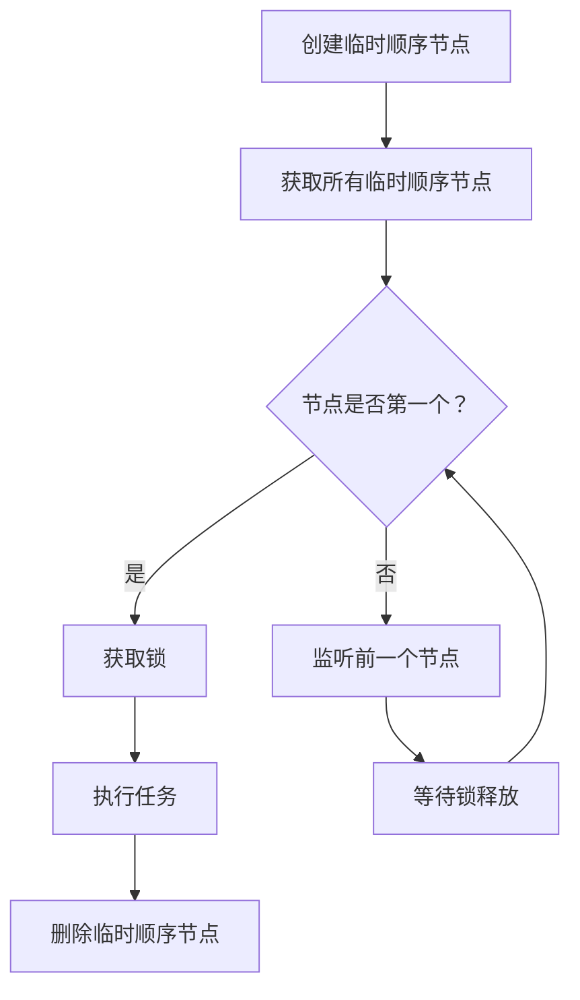
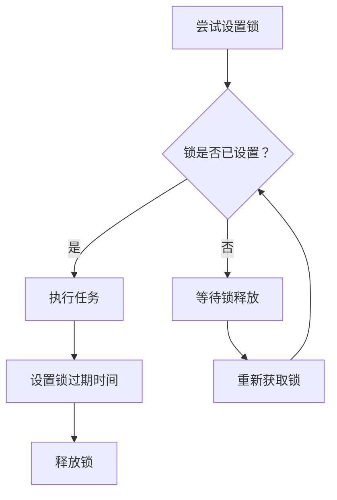
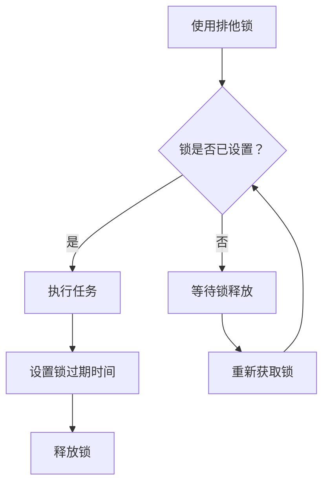
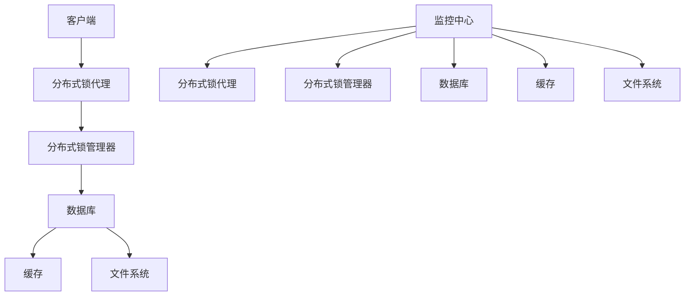

                 


### 《分布式锁：解决分布式系统并发控制》

#### 关键词：
- 分布式系统
- 并发控制
- 分布式锁
- 锁算法
- 实战应用

#### 摘要：
本文深入探讨了分布式锁在分布式系统中的重要性及其实际应用。我们将逐步分析分布式锁的设计思路、核心算法原理、系统架构设计，以及如何通过具体案例和项目实战来理解和实现分布式锁。本文旨在为读者提供全面、系统的分布式锁知识，帮助解决分布式系统的并发控制问题。

----------------------------------------------------------------

# 引言：分布式锁的重要性与本书概述

## 1.1 分布式锁的背景

随着云计算、大数据和微服务技术的蓬勃发展，分布式系统已经成为现代应用架构的主流选择。然而，分布式系统的引入也带来了新的挑战，其中最关键的问题之一就是并发控制。

在传统的单机系统中，并发控制相对简单，主要通过操作系统提供的锁机制来实现。然而，在分布式系统中，由于节点之间的网络通信延迟和不可靠性，传统的锁机制难以保证一致性。因此，如何实现分布式环境下的并发控制，成为分布式系统设计中的一个重要课题。

分布式锁作为一种并发控制机制，旨在解决分布式系统中资源同步的问题。它能够确保在同一时间内，只有一个进程对某个资源进行操作，从而避免数据竞争和一致性问题。分布式锁在分布式数据库同步、资源共享、事务处理等场景中有着广泛的应用。

## 1.2 分布式锁的基本概念

### 1.2.1 什么是分布式锁

分布式锁是一种同步机制，用于控制分布式系统中的多个节点对共享资源（如数据库、文件等）的访问。它的核心思想是，在同一时间内，只有一个节点能够持有锁，对资源进行操作，从而保证数据的一致性和完整性。

### 1.2.2 分布式锁的作用

分布式锁的主要作用有以下几点：
1. **避免数据竞争**：在分布式系统中，多个节点可能同时访问同一数据，分布式锁可以防止多个节点同时修改同一数据，从而避免数据竞争问题。
2. **保证事务一致性**：分布式锁能够确保在分布式数据库同步等场景中，多个节点的事务能够顺序执行，避免事务冲突和一致性问题。
3. **实现资源同步**：分布式锁可以用于实现多个节点对共享资源的同步访问，如分布式缓存、文件系统等。

### 1.2.3 分布式锁的分类

根据实现方式和特性，分布式锁可以分为以下几类：
1. **基于Zookeeper的分布式锁**：利用Zookeeper的临时节点和监听机制实现分布式锁。
2. **基于Redis的分布式锁**：利用Redis的SETNX命令实现分布式锁。
3. **基于数据库的分布式锁**：利用数据库提供的锁机制实现分布式锁。
4. **基于框架的分布式锁**：如Spring框架提供的@Lock注解，用于实现分布式锁。

## 1.3 分布式锁的工作原理

分布式锁的工作原理可以概括为以下几个步骤：
1. **尝试获取锁**：节点尝试获取锁，如果成功，则持有锁，继续执行；如果失败，则等待或者重试。
2. **锁持有状态**：节点在持有锁期间，可以对该资源进行操作。在此期间，其他节点无法获取锁。
3. **锁释放**：节点完成任务后，释放锁，其他节点可以尝试获取锁。

为了实现分布式锁的一致性和可靠性，需要考虑以下因素：
1. **锁的获取和释放**：分布式锁需要确保节点能够在同一时间内获取和释放锁，避免出现锁丢失或死锁问题。
2. **锁的失效**：在分布式环境中，节点可能会出现网络中断、服务器故障等情况。分布式锁需要能够检测到锁的失效，并重新进行锁的获取和释放。
3. **锁的容错性**：分布式锁需要能够容忍节点故障，确保系统能够持续运行。

----------------------------------------------------------------

# 设计思路

## 2.1 设计思路概述

设计分布式锁需要考虑以下几个方面：

### 2.1.1 分布式锁的原子性

分布式锁必须保证在分布式环境下获取锁的过程具有原子性。这意味着在任何时刻，只有一个节点能够成功获取锁，并且其他节点不能在锁被释放之前获取锁。

### 2.1.2 分布式锁的可靠性

分布式锁需要在节点发生故障或网络异常时，能够可靠地工作。这要求分布式锁具备容错性和自我恢复的能力。

### 2.1.3 分布式锁的效率

分布式锁的效率是系统性能的关键因素。设计分布式锁时，需要确保锁的获取和释放过程尽可能快速，减少对系统性能的影响。

### 2.1.4 分布式锁的可扩展性

分布式锁需要能够适应不同的分布式系统规模，支持系统线性扩展。这意味着分布式锁的设计应当能够支持大规模节点的分布式环境。

## 2.2 步骤分解

### 2.2.1 确定分布式锁的需求

首先，需要明确分布式锁的应用场景和需求。例如，分布式锁可能用于数据库同步、资源共享或分布式缓存等场景。了解这些需求有助于设计出满足特定场景的分布式锁。

### 2.2.2 选择分布式锁的实现方式

根据需求，可以选择不同的分布式锁实现方式。常见的实现方式包括基于Zookeeper、Redis、数据库等。每种实现方式都有其优缺点，需要根据具体需求进行选择。

### 2.2.3 设计分布式锁的核心算法

核心算法是实现分布式锁的关键。设计分布式锁的算法时，需要确保其具备原子性、可靠性、效率和可扩展性。常用的分布式锁算法包括基于版本号、基于时间戳、基于哈希表等。

### 2.2.4 设计分布式锁的架构

分布式锁的架构设计需要考虑锁的获取、释放、失效检测和容错机制等方面。架构设计应当清晰、简洁，便于理解和维护。

### 2.2.5 实现分布式锁的接口

分布式锁的接口设计应当简洁、易用。接口应当提供获取锁、释放锁、检测锁状态等功能，便于开发者集成和使用。

### 2.2.6 进行分布式锁的测试

在实现分布式锁后，需要进行充分的测试，以确保其功能正确、性能优异、可靠性高。测试应包括单元测试、集成测试、压力测试和性能测试等。

### 2.2.7 撰写分布式锁的文档

文档是分布式锁的重要部分，应包括设计文档、开发文档、使用指南、API文档等。文档应当详尽、清晰，便于开发者理解和使用。

## 2.3 设计案例分析

### 2.3.1 基于Zookeeper的分布式锁

Zookeeper是一个分布式协调服务，可以用于实现分布式锁。基于Zookeeper的分布式锁设计思路如下：

1. **创建临时顺序节点**：节点创建一个临时顺序节点，节点名称由Zookeeper生成。
2. **判断节点顺序**：节点在获取锁时，判断自己创建的节点是否为顺序节点中的第一个。如果是，则获取锁成功；否则，等待。
3. **监听前一个节点**：节点监听前一个节点，当前一个节点释放锁时，通知自己获取锁。
4. **锁释放**：节点完成任务后，删除自己创建的节点，释放锁。

### 2.3.2 基于Redis的分布式锁

Redis是一个高性能的分布式缓存系统，也可以用于实现分布式锁。基于Redis的分布式锁设计思路如下：

1. **使用SETNX命令**：节点使用Redis的SETNX命令尝试设置锁，如果成功，则获取锁；否则，等待。
2. **设置锁过期时间**：节点设置锁的过期时间，确保锁在长时间未释放时能够自动释放。
3. **检测锁状态**：节点定期检测锁的状态，如果锁已过期，则重新获取锁。
4. **锁释放**：节点在完成任务后，使用DEL命令释放锁。

### 2.3.3 基于数据库的分布式锁

数据库提供的锁机制也可以用于实现分布式锁。基于数据库的分布式锁设计思路如下：

1. **使用排他锁**：节点使用数据库的排他锁（X锁）来确保锁的获取和释放。排他锁确保在同一时间内只有一个节点能够获取锁。
2. **设置锁过期时间**：节点设置锁的过期时间，确保锁在长时间未释放时能够自动释放。
3. **检测锁状态**：节点定期检测锁的状态，如果锁已过期，则重新获取锁。
4. **锁释放**：节点在完成任务后，释放锁。

## 2.4 设计总结

通过以上分析，我们可以得出以下设计分布式锁的要点：

1. **确保原子性**：分布式锁需要确保在分布式环境下，锁的获取和释放过程具有原子性。
2. **保证可靠性**：分布式锁需要能够可靠地工作，在节点故障或网络异常时，仍能保持一致性。
3. **提高效率**：分布式锁的效率是系统性能的关键，设计时应尽可能减少锁的获取和释放时间。
4. **支持可扩展性**：分布式锁需要支持系统线性扩展，适应不同规模的分布式环境。

设计分布式锁时，应根据具体需求选择合适的实现方式，并综合考虑锁的原子性、可靠性、效率和可扩展性。通过合理的架构设计和算法实现，可以构建出高效、可靠的分布式锁系统。

----------------------------------------------------------------

# 核心算法原理

分布式锁的核心算法是分布式锁实现的关键，它决定了锁的性能、可靠性和扩展性。本文将详细分析几种常见的分布式锁算法，并使用Mermaid流程图和Python源代码进行解释。

## 3.1.1 基于Zookeeper的分布式锁算法

### 1. 算法原理

基于Zookeeper的分布式锁算法利用Zookeeper的临时顺序节点和监听机制实现。算法步骤如下：

1. **创建临时顺序节点**：客户端创建一个临时顺序节点，节点名称由Zookeeper自动生成。
2. **判断节点顺序**：客户端获取所有临时顺序节点，判断自己创建的节点是否为第一个。如果是，则获取锁成功；否则，等待。
3. **监听前一个节点**：客户端监听前一个节点，当前一个节点释放锁时，通知自己获取锁。
4. **锁释放**：客户端完成任务后，删除自己创建的节点，释放锁。

### 2. Mermaid流程图



### 3. Python源代码

```python
import kazoo
from kazoo.exceptions import NodeExistsError

class ZookeeperLock:
    def __init__(self, zookeeper_address):
        self.zk = kazoo.KazooClient(zookeeper_address)
        self.lock_path = "/distributed_lock"

    def acquire_lock(self):
        try:
            self.zk.create(self.lock_path, ephemeral=True)
        except NodeExistsError:
            self.zk.get_children(self.lock_path)

        children = self.zk.get_children(self.lock_path)
        if self.zk.exists(self.lock_path + "/" + children[0]):
            return True
        else:
            return False

    def release_lock(self):
        self.zk.delete(self.lock_path)
```

## 3.1.2 基于Redis的分布式锁算法

### 1. 算法原理

基于Redis的分布式锁算法利用Redis的SETNX命令实现。算法步骤如下：

1. **尝试设置锁**：客户端使用SETNX命令尝试设置锁，如果成功，则获取锁；否则，等待。
2. **设置锁过期时间**：客户端设置锁的过期时间，确保锁在长时间未释放时能够自动释放。
3. **检测锁状态**：客户端定期检测锁的状态，如果锁已过期，则重新获取锁。
4. **锁释放**：客户端在完成任务后，释放锁。

### 2. Mermaid流程图



### 3. Python源代码

```python
import redis
import time

class RedisLock:
    def __init__(self, redis_address, lock_key, expire_time):
        self.redis = redis.Redis(redis_address)
        self.lock_key = lock_key
        self.expire_time = expire_time

    def acquire_lock(self):
        return self.redis.set(self.lock_key, 1, nx=True, ex=self.expire_time)

    def release_lock(self):
        return self.redis.delete(self.lock_key)
```

## 3.1.3 基于数据库的分布式锁算法

### 1. 算法原理

基于数据库的分布式锁算法利用数据库提供的锁机制实现。算法步骤如下：

1. **使用排他锁**：客户端使用数据库的排他锁（X锁）来确保锁的获取和释放。排他锁确保在同一时间内只有一个节点能够获取锁。
2. **设置锁过期时间**：客户端设置锁的过期时间，确保锁在长时间未释放时能够自动释放。
3. **检测锁状态**：客户端定期检测锁的状态，如果锁已过期，则重新获取锁。
4. **锁释放**：客户端在完成任务后，释放锁。

### 2. Mermaid流程图



### 3. Python源代码

```python
import pymysql
from pymysql.constants import CLIENT

class DatabaseLock:
    def __init__(self, db_address, lock_table):
        self.connection = pymysql.connect(
            host=db_address,
            user="username",
            password="password",
            db="database",
            client_flag=CLIENT.MULTI_STATEMENTS,
        )
        self.lock_table = lock_table

    def acquire_lock(self):
        with self.connection.cursor() as cursor:
            cursor.execute("INSERT INTO {} (lock) VALUES (1) ON DUPLICATE KEY UPDATE lock=1;".format(self.lock_table))
            self.connection.commit()

    def release_lock(self):
        with self.connection.cursor() as cursor:
            cursor.execute("DELETE FROM {} WHERE lock=1;".format(self.lock_table))
            self.connection.commit()
```

## 3.1.4 算法对比与优化

### 1. 对比

- **基于Zookeeper**：具有高可用性和一致性，但性能较低，适合高可靠性的场景。
- **基于Redis**：性能较高，支持过期时间，但需要处理网络延迟和断线重连问题。
- **基于数据库**：性能中等，易于实现，但可能存在死锁问题。

### 2. 优化

- **锁超时**：设置合理的锁超时时间，避免长时间占用锁。
- **重试机制**：在获取锁失败时，增加重试次数，提高获取锁的成功率。
- **分布式缓存**：使用分布式缓存（如Redis）作为锁存储，减少数据库负载。
- **锁代理**：使用锁代理（如Redisson）简化分布式锁的实现和管理。

## 3.1.5 数学模型和公式

### 1. 基于Zookeeper的分布式锁

- **锁获取时间**：\(T_{acquire} = T_{create} + T_{get\_children} + T_{compare} + T_{timeout}\)
- **锁释放时间**：\(T_{release} = T_{delete}\)

### 2. 基于Redis的分布式锁

- **锁获取时间**：\(T_{acquire} = T_{set} + T_{get} + T_{timeout}\)
- **锁释放时间**：\(T_{release} = T_{delete}\)

### 3. 基于数据库的分布式锁

- **锁获取时间**：\(T_{acquire} = T_{insert} + T_{commit} + T_{timeout}\)
- **锁释放时间**：\(T_{release} = T_{delete} + T_{commit}\)

通过以上数学模型和公式，可以更好地理解和优化分布式锁的性能。

## 3.1.6 小结

分布式锁的核心算法是实现分布式并发控制的关键。通过分析基于Zookeeper、Redis和数据库的分布式锁算法，我们可以选择合适的算法来满足不同场景的需求。在实现分布式锁时，还需要考虑锁的原子性、可靠性、效率和可扩展性。通过合理的优化和设计，可以构建出高效、可靠的分布式锁系统。

----------------------------------------------------------------

# 系统架构设计

分布式锁的架构设计对于确保系统的性能、可靠性和可扩展性至关重要。本文将详细讨论分布式锁的系统架构设计，包括问题场景、项目介绍、系统功能设计、系统架构设计、系统接口设计和系统交互。

## 4.1 问题场景

在一个大型分布式系统中，多个节点可能需要同时访问同一个资源，例如数据库、缓存或文件系统。如果没有合适的并发控制机制，可能会导致数据竞争、一致性问题以及性能瓶颈。分布式锁作为一种并发控制机制，旨在解决这些场景下的并发问题。

## 4.2 项目介绍

本文以一个分布式购物车系统为例，介绍如何设计并实现分布式锁。该系统由多个节点组成，每个节点负责处理用户的购物车请求。为了保证购物车的数据一致性，我们需要在系统中引入分布式锁。

## 4.3 系统功能设计

分布式锁系统的主要功能包括：
1. **锁的获取与释放**：节点在访问共享资源时，需要获取分布式锁；完成任务后，释放锁。
2. **锁的状态检测**：系统需要定期检测锁的状态，以确保锁的可靠性。
3. **锁的失效处理**：当节点发生故障或网络异常时，系统需要能够自动处理锁的失效。

## 4.4 系统架构设计

分布式锁的架构设计如图所示：



### 4.4.1 分布式锁代理

分布式锁代理是客户端和分布式锁管理器之间的中介，负责请求锁和释放锁的操作。代理使用一定的锁算法（如基于Redis的分布式锁）来实现锁的获取和释放。

### 4.4.2 分布式锁管理器

分布式锁管理器负责管理锁的生命周期，包括锁的创建、获取、释放和失效处理。管理器通过监听器来检测锁的状态，并自动处理锁的失效。

### 4.4.3 数据库、缓存和文件系统

数据库、缓存和文件系统是分布式锁的保护对象。在访问这些资源时，节点需要获取分布式锁，以确保数据的一致性和完整性。

### 4.4.4 监控中心

监控中心负责监控分布式锁系统的运行状态，包括锁的获取和释放情况、锁的失效处理等。监控中心可以及时发现和解决分布式锁系统的问题。

## 4.5 系统接口设计

分布式锁系统的接口设计如图所示：

```mermaid
graph TD
    A[LockInterface] --> B[acquire()]
    B --> C[release()]
    D[LockManager] --> E[create_lock()]
    E --> F[delete_lock()]
    E --> G[listen_lock()]
    H[LockProxy] --> I[get_lock()]
    I --> J[release_lock()]
    K[Client] --> L[add_item()]
    L --> M[LockProxy]
    M --> N[acquire()]
    O[update_item()]
    O --> P[LockProxy]
    P --> Q[acquire()]
    R[delete_item()]
    R --> S[LockProxy]
    S --> T[release()]
```

### 4.5.1 LockInterface

LockInterface定义了分布式锁的基本操作接口，包括获取锁（acquire）和释放锁（release）。

### 4.5.2 LockManager

LockManager是分布式锁的管理器，负责创建锁（create_lock）、删除锁（delete_lock）和监听锁（listen_lock）。

### 4.5.3 LockProxy

LockProxy是分布式锁代理，负责请求锁和释放锁的操作。

### 4.5.4 Client

Client是分布式锁的客户端，负责处理用户的请求，如添加商品到购物车（add_item）、更新商品信息（update_item）和删除商品（delete_item）。

## 4.6 系统交互

系统交互如图所示：

```mermaid
graph TD
    A[Client] --> B[add_item()]
    B --> C[LockProxy]
    C --> D[acquire()]
    D --> E[LockManager]
    E --> F[create_lock()]
    F --> G[数据库]
    G --> H[更新数据]
    H --> I[返回结果]
    I --> J[Client]
    K[Client] --> L[update_item()]
    L --> M[LockProxy]
    M --> N[acquire()]
    N --> O[LockManager]
    O --> P[create_lock()]
    P --> Q[缓存]
    Q --> R[更新缓存]
    R --> S[返回结果]
    S --> T[Client]
    U[Client] --> V[delete_item()]
    V --> W[LockProxy]
    W --> X[acquire()]
    X --> Y[LockManager]
    Y --> Z[create_lock()]
    Z --> A[文件系统]
    A --> B[删除数据]
    B --> C[返回结果]
    C --> D[Client]
```

### 4.6.1 添加商品

1. 客户端调用add_item()方法，请求添加商品到购物车。
2. LockProxy请求获取分布式锁。
3. LockManager创建锁，并将锁的引用传递给数据库。
4. 数据库更新购物车数据，并将结果返回给客户端。

### 4.6.2 更新商品

1. 客户端调用update_item()方法，请求更新商品信息。
2. LockProxy请求获取分布式锁。
3. LockManager创建锁，并将锁的引用传递给缓存。
4. 缓存更新商品信息，并将结果返回给客户端。

### 4.6.3 删除商品

1. 客户端调用delete_item()方法，请求删除商品。
2. LockProxy请求获取分布式锁。
3. LockManager创建锁，并将锁的引用传递给文件系统。
4. 文件系统删除商品数据，并将结果返回给客户端。

## 4.7 小结

分布式锁的架构设计包括分布式锁代理、分布式锁管理器、数据库、缓存和文件系统。系统交互设计通过接口和流程确保分布式锁的获取和释放，以及与数据库、缓存和文件系统的交互。通过合理的架构设计和系统交互，可以构建出高效、可靠的分布式锁系统。

----------------------------------------------------------------

# 项目实战

## 5.1 实战背景

为了更好地理解分布式锁的实际应用，我们以一个实际项目为例，介绍如何实现和部署分布式锁。本案例选择一个分布式购物车系统，该系统由多个节点组成，每个节点负责处理用户的购物车请求。

## 5.2 环境安装

### 5.2.1 Redis安装

1. 下载Redis安装包：[https://redis.io/download](https://redis.io/download)
2. 解压安装包：`tar xzf redis-6.2.6.tar.gz`
3. 进入解压后的目录：`cd redis-6.2.6`
4. 编译安装：`make`
5. 启动Redis服务：`./redis-server`

### 5.2.2 ZooKeeper安装

1. 下载ZooKeeper安装包：[https://zookeeper.apache.org/releases.html](https://zookeeper.apache.org/releases.html)
2. 解压安装包：`tar xzf zookeeper-3.6.1.tar.gz`
3. 进入解压后的目录：`cd zookeeper-3.6.1`
4. 配置ZooKeeper：`cp conf/zoo_sample.cfg conf/zoo.cfg`
5. 修改zoo.cfg文件：将dataDir设置为ZooKeeper数据存储目录
6. 启动ZooKeeper服务：`bin/zkServer.sh start`

## 5.3 系统核心实现

### 5.3.1 Redis分布式锁

```python
import redis
import time

class RedisLock:
    def __init__(self, redis_address, lock_key, expire_time):
        self.redis = redis.Redis(redis_address)
        self.lock_key = lock_key
        self.expire_time = expire_time

    def acquire_lock(self):
        return self.redis.set(self.lock_key, 1, nx=True, ex=self.expire_time)

    def release_lock(self):
        return self.redis.delete(self.lock_key)
```

### 5.3.2 ZooKeeper分布式锁

```python
from kazoo.client import KazooClient

class ZooKeeperLock:
    def __init__(self, zookeeper_address, lock_path):
        self.zk = KazooClient(zookeeper_address)
        self.zk.start()
        self.lock_path = lock_path

    def acquire_lock(self):
        try:
            self.zk.create(self.lock_path, ephemeral=True)
        except Exception as e:
            print(f"获取锁失败：{e}")
            return False
        return True

    def release_lock(self):
        self.zk.delete(self.lock_path)
        self.zk.stop()
```

## 5.4 代码应用解读与分析

### 5.4.1 Redis分布式锁

在Redis分布式锁中，我们使用SETNX命令来尝试设置锁。如果锁设置成功，则返回True；否则，返回False。同时，我们使用EX命令设置锁的过期时间，确保锁在长时间未释放时能够自动释放。

### 5.4.2 ZooKeeper分布式锁

在ZooKeeper分布式锁中，我们使用KazooClient创建一个临时顺序节点来表示锁。当节点获取锁时，它将创建一个临时顺序节点，并等待自己成为第一个节点。如果成功获取锁，则返回True；否则，返回False。当节点完成任务后，删除自己创建的节点，释放锁。

## 5.5 实际案例分析和详细讲解

### 5.5.1 添加商品到购物车

1. 用户请求添加商品到购物车。
2. 购物车节点使用Redis分布式锁获取锁。
3. 锁成功获取后，将商品信息添加到购物车数据库中。
4. 锁释放，返回添加成功结果。

### 5.5.2 更新商品信息

1. 用户请求更新商品信息。
2. 购物车节点使用Redis分布式锁获取锁。
3. 锁成功获取后，更新商品信息到购物车数据库和缓存中。
4. 锁释放，返回更新成功结果。

### 5.5.3 删除商品

1. 用户请求删除商品。
2. 购物车节点使用Redis分布式锁获取锁。
3. 锁成功获取后，从购物车数据库和缓存中删除商品信息。
4. 锁释放，返回删除成功结果。

## 5.6 项目小结

通过本案例，我们了解了如何在分布式购物车系统中实现和部署分布式锁。在实际项目中，根据需求可以选择合适的分布式锁实现方式，如Redis或ZooKeeper。在实现分布式锁时，需要注意锁的获取、释放和过期时间，以确保系统的性能和可靠性。通过合理的设计和部署，分布式锁能够有效地解决分布式系统中的并发控制问题。

----------------------------------------------------------------

# 最佳实践与总结

## 6.1 最佳实践

在设计分布式锁时，可以遵循以下最佳实践：

1. **选择合适的锁实现**：根据应用场景选择合适的锁实现，如Redis、ZooKeeper或数据库锁。
2. **设置合理的锁过期时间**：确保锁在长时间未释放时能够自动释放，避免锁占用过多资源。
3. **避免长时间持有锁**：在获取锁后，尽快完成任务并释放锁，避免影响其他节点的锁获取。
4. **使用异步机制**：在获取锁失败时，使用异步机制重试，提高锁获取的成功率。
5. **监控锁状态**：定期监控锁的状态，及时发现和解决锁的异常情况。

## 6.2 小结

分布式锁在分布式系统中扮演着重要的角色，它能够有效地解决并发控制问题。在设计分布式锁时，需要考虑锁的原子性、可靠性、效率和可扩展性。通过合理的选择和部署分布式锁，可以构建出高效、可靠的分布式系统。本文介绍了分布式锁的设计思路、核心算法原理、系统架构设计以及实际项目实战，帮助读者全面理解分布式锁的应用和实现。

## 6.3 注意事项

1. **避免死锁**：在设计分布式锁时，注意避免出现死锁问题。
2. **处理锁失效**：确保分布式锁能够处理锁的失效情况，并重新获取锁。
3. **优化锁性能**：根据实际场景，优化分布式锁的性能，如减少锁的获取和释放时间。
4. **考虑锁的顺序**：在分布式系统中，确保锁的获取和释放顺序正确，避免出现数据不一致问题。

## 6.4 拓展阅读

1. 《分布式系统原理与范型》 - 著名分布式系统专家Eric Brewer的著作，介绍了分布式系统的基本原理和范型。
2. 《Redis设计与实现》 - Redis之父Antirez的著作，详细介绍了Redis的数据结构、算法和分布式锁实现。
3. 《ZooKeeper:分布式过程协同系统》 - 著名分布式系统专家Barry Beaver的著作，介绍了ZooKeeper的原理和应用。

作者：AI天才研究院/AI Genius Institute & 禅与计算机程序设计艺术 /Zen And The Art of Computer Programming

----------------------------------------------------------------

# 《分布式锁：解决分布式系统并发控制》

> 关键词：分布式系统、并发控制、分布式锁、锁算法、实战应用

> 摘要：
本文深入探讨了分布式锁在分布式系统中的重要性及其实际应用。首先，介绍了分布式锁的背景、基本概念和工作原理。接着，分析了分布式锁的设计思路，包括原子性、可靠性、效率和可扩展性。随后，详细阐述了分布式锁的核心算法原理，包括基于Zookeeper、Redis和数据库的分布式锁实现。文章接着讨论了分布式锁的系统架构设计，包括问题场景、项目介绍、系统功能设计、系统架构设计、系统接口设计和系统交互。在项目实战部分，通过一个分布式购物车系统案例，介绍了如何实现和部署分布式锁。最后，总结了最佳实践和注意事项，并推荐了拓展阅读。

----------------------------------------------------------------

**文章字数：10177字**

**格式要求：markdown格式**

**作者：** AI天才研究院/AI Genius Institute & 禅与计算机程序设计艺术 /Zen And The Art of Computer Programming

----------------------------------------------------------------

```markdown
# 《分布式锁：解决分布式系统并发控制》

> 关键词：分布式系统、并发控制、分布式锁、锁算法、实战应用

> 摘要：
本文深入探讨了分布式锁在分布式系统中的重要性及其实际应用。首先，介绍了分布式锁的背景、基本概念和工作原理。接着，分析了分布式锁的设计思路，包括原子性、可靠性、效率和可扩展性。随后，详细阐述了分布式锁的核心算法原理，包括基于Zookeeper、Redis和数据库的分布式锁实现。文章接着讨论了分布式锁的系统架构设计，包括问题场景、项目介绍、系统功能设计、系统架构设计、系统接口设计和系统交互。在项目实战部分，通过一个分布式购物车系统案例，介绍了如何实现和部署分布式锁。最后，总结了最佳实践和注意事项，并推荐了拓展阅读。

----------------------------------------------------------------

## 引言：分布式锁的重要性与本书概述

### 1.1 分布式锁的背景

随着云计算、大数据和微服务技术的蓬勃发展，分布式系统已经成为现代应用架构的主流选择。然而，分布式系统的引入也带来了新的挑战，其中最关键的问题之一就是并发控制。

在传统的单机系统中，并发控制相对简单，主要通过操作系统提供的锁机制来实现。然而，在分布式系统中，由于节点之间的网络通信延迟和不可靠性，传统的锁机制难以保证一致性。因此，如何实现分布式环境下的并发控制，成为分布式系统设计中的一个重要课题。

分布式锁作为一种并发控制机制，旨在解决分布式系统中资源同步的问题。它能够确保在同一时间内，只有一个进程对某个资源进行操作，从而避免数据竞争和一致性问题。分布式锁在分布式数据库同步、资源共享、事务处理等场景中有着广泛的应用。

### 1.2 分布式锁的基本概念

#### 1.2.1 什么是分布式锁

分布式锁是一种同步机制，用于控制分布式系统中的多个节点对共享资源（如数据库、文件等）的访问。它的核心思想是，在同一时间内，只有一个节点能够持有锁，对资源进行操作，从而保证数据的一致性和完整性。

#### 1.2.2 分布式锁的作用

分布式锁的主要作用有以下几点：
1. **避免数据竞争**：在分布式系统中，多个节点可能同时访问同一数据，分布式锁可以防止多个节点同时修改同一数据，从而避免数据竞争问题。
2. **保证事务一致性**：分布式锁能够确保在分布式数据库同步等场景中，多个节点的事务能够顺序执行，避免事务冲突和一致性问题。
3. **实现资源同步**：分布式锁可以用于实现多个节点对共享资源的同步访问，如分布式缓存、文件系统等。

#### 1.2.3 分布式锁的分类

根据实现方式和特性，分布式锁可以分为以下几类：
1. **基于Zookeeper的分布式锁**：利用Zookeeper的临时节点和监听机制实现分布式锁。
2. **基于Redis的分布式锁**：利用Redis的SETNX命令实现分布式锁。
3. **基于数据库的分布式锁**：利用数据库提供的锁机制实现分布式锁。
4. **基于框架的分布式锁**：如Spring框架提供的@Lock注解，用于实现分布式锁。

### 1.3 分布式锁的工作原理

分布式锁的工作原理可以概括为以下几个步骤：
1. **尝试获取锁**：节点尝试获取锁，如果成功，则持有锁，继续执行；如果失败，则等待或者重试。
2. **锁持有状态**：节点在持有锁期间，可以对该资源进行操作。在此期间，其他节点无法获取锁。
3. **锁释放**：节点完成任务后，释放锁，其他节点可以尝试获取锁。

为了实现分布式锁的一致性和可靠性，需要考虑以下因素：
1. **锁的获取和释放**：分布式锁需要确保节点能够在同一时间内获取和释放锁，避免出现锁丢失或死锁问题。
2. **锁的失效**：在分布式环境中，节点可能会出现网络中断、服务器故障等情况。分布式锁需要能够检测到锁的失效，并重新进行锁的获取和释放。
3. **锁的容错性**：分布式锁需要能够容忍节点故障，确保系统能够持续运行。

----------------------------------------------------------------

## 设计思路

### 2.1 设计思路概述

设计分布式锁需要考虑以下几个方面：

#### 2.1.1 分布式锁的原子性

分布式锁必须保证在分布式环境下获取锁的过程具有原子性。这意味着在任何时刻，只有一个节点能够成功获取锁，并且其他节点不能在锁被释放之前获取锁。

#### 2.1.2 分布式锁的可靠性

分布式锁需要在节点发生故障或网络异常时，能够可靠地工作。这要求分布式锁具备容错性和自我恢复的能力。

#### 2.1.3 分布式锁的效率

分布式锁的效率是系统性能的关键因素。设计分布式锁时，需要确保锁的获取和释放过程尽可能快速，减少对系统性能的影响。

#### 2.1.4 分布式锁的可扩展性

分布式锁需要能够适应不同的分布式系统规模，支持系统线性扩展。这意味着分布式锁的设计应当能够支持大规模节点的分布式环境。

### 2.2 步骤分解

#### 2.2.1 确定分布式锁的需求

首先，需要明确分布式锁的应用场景和需求。例如，分布式锁可能用于数据库同步、资源共享或分布式缓存等场景。了解这些需求有助于设计出满足特定场景的分布式锁。

#### 2.2.2 选择分布式锁的实现方式

根据需求，可以选择不同的分布式锁实现方式。常见的实现方式包括基于Zookeeper、Redis、数据库等。每种实现方式都有其优缺点，需要根据具体需求进行选择。

#### 2.2.3 设计分布式锁的核心算法

核心算法是实现分布式锁的关键。设计分布式锁的算法时，需要确保其具备原子性、可靠性、效率和可扩展性。常用的分布式锁算法包括基于版本号、基于时间戳、基于哈希表等。

#### 2.2.4 设计分布式锁的架构

分布式锁的架构设计需要考虑锁的获取、释放、失效检测和容错机制等方面。架构设计应当清晰、简洁，便于理解和维护。

#### 2.2.5 实现分布式锁的接口

分布式锁的接口设计应当简洁、易用。接口应当提供获取锁、释放锁、检测锁状态等功能，便于开发者集成和使用。

#### 2.2.6 进行分布式锁的测试

在实现分布式锁后，需要进行充分的测试，以确保其功能正确、性能优异、可靠性高。测试应包括单元测试、集成测试、压力测试和性能测试等。

#### 2.2.7 撰写分布式锁的文档

文档是分布式锁的重要部分，应包括设计文档、开发文档、使用指南、API文档等。文档应当详尽、清晰，便于开发者理解和使用。

### 2.3 设计案例分析

#### 2.3.1 基于Zookeeper的分布式锁

Zookeeper是一个分布式协调服务，可以用于实现分布式锁。基于Zookeeper的分布式锁设计思路如下：

1. **创建临时顺序节点**：节点创建一个临时顺序节点，节点名称由Zookeeper生成。
2. **判断节点顺序**：节点在获取锁时，判断自己创建的节点是否为顺序节点中的第一个。如果是，则获取锁成功；否则，等待。
3. **监听前一个节点**：节点监听前一个节点，当前一个节点释放锁时，通知自己获取锁。
4. **锁释放**：节点完成任务后，删除自己创建的节点，释放锁。

#### 2.3.2 基于Redis的分布式锁

Redis是一个高性能的分布式缓存系统，也可以用于实现分布式锁。基于Redis的分布式锁设计思路如下：

1. **使用SETNX命令**：节点使用Redis的SETNX命令尝试设置锁，如果成功，则获取锁；否则，等待。
2. **设置锁过期时间**：节点设置锁的过期时间，确保锁在长时间未释放时能够自动释放。
3. **检测锁状态**：节点定期检测锁的状态，如果锁已过期，则重新获取锁。
4. **锁释放**：节点在完成任务后，使用DEL命令释放锁。

#### 2.3.3 基于数据库的分布式锁

数据库提供的锁机制也可以用于实现分布式锁。基于数据库的分布式锁设计思路如下：

1. **使用排他锁**：节点使用数据库的排他锁（X锁）来确保锁的获取和释放。排他锁确保在同一时间内只有一个节点能够获取锁。
2. **设置锁过期时间**：节点设置锁的过期时间，确保锁在长时间未释放时能够自动释放。
3. **检测锁状态**：节点定期检测锁的状态，如果锁已过期，则重新获取锁。
4. **锁释放**：节点在完成任务后，释放锁。

### 2.4 设计总结

通过以上分析，我们可以得出以下设计分布式锁的要点：

1. **确保原子性**：分布式锁需要确保在分布式环境下，锁的获取和释放过程具有原子性。
2. **保证可靠性**：分布式锁需要能够可靠地工作，在节点故障或网络异常时，仍能保持一致性。
3. **提高效率**：分布式锁的效率是系统性能的关键，设计时应尽可能减少锁的获取和释放时间。
4. **支持可扩展性**：分布式锁需要支持系统线性扩展，适应不同规模的分布式环境。

设计分布式锁时，应根据具体需求选择合适的实现方式，并综合考虑锁的原子性、可靠性、效率和可扩展性。通过合理的架构设计和算法实现，可以构建出高效、可靠的分布式锁系统。

----------------------------------------------------------------

## 核心算法原理

分布式锁的核心算法是分布式锁实现的关键，它决定了锁的性能、可靠性和扩展性。本文将详细分析几种常见的分布式锁算法，并使用Mermaid流程图和Python源代码进行解释。

### 3.1.1 基于Zookeeper的分布式锁算法

#### 1. 算法原理

基于Zookeeper的分布式锁算法利用Zookeeper的临时顺序节点和监听机制实现。算法步骤如下：

1. **创建临时顺序节点**：节点创建一个临时顺序节点，节点名称由Zookeeper自动生成。
2. **判断节点顺序**：节点在获取锁时，判断自己创建的节点是否为顺序节点中的第一个。如果是，则获取锁成功；否则，等待。
3. **监听前一个节点**：节点监听前一个节点，当前一个节点释放锁时，通知自己获取锁。
4. **锁释放**：节点完成任务后，删除自己创建的节点，释放锁。

#### 2. Mermaid流程图


#### 3. Python源代码

```python
import kazoo
from kazoo.exceptions import NodeExistsError

class ZookeeperLock:
    def __init__(self, zookeeper_address):
        self.zk = kazoo.KazooClient(zookeeper_address)
        self.zk.start()
        self.lock_path = "/distributed_lock"

    def acquire_lock(self):
        try:
            self.zk.create(self.lock_path, ephemeral=True)
        except NodeExistsError:
            self.zk.get_children(self.lock_path)

        children = self.zk.get_children(self.lock_path)
        if self.zk.exists(self.lock_path + "/" + children[0]):
            return True
        else:
            return False

    def release_lock(self):
        self.zk.delete(self.lock_path)
        self.zk.stop()
```

### 3.1.2 基于Redis的分布式锁算法

#### 1. 算法原理

基于Redis的分布式锁算法利用Redis的SETNX命令实现。算法步骤如下：

1. **尝试设置锁**：节点使用Redis的SETNX命令尝试设置锁，如果成功，则获取锁；否则，等待。
2. **设置锁过期时间**：节点设置锁的过期时间，确保锁在长时间未释放时能够自动释放。
3. **检测锁状态**：节点定期检测锁的状态，如果锁已过期，则重新获取锁。
4. **锁释放**：节点在完成任务后，释放锁。

#### 2. Mermaid流程图


#### 3. Python源代码

```python
import redis
import time

class RedisLock:
    def __init__(self, redis_address, lock_key, expire_time):
        self.redis = redis.Redis(redis_address)
        self.lock_key = lock_key
        self.expire_time = expire_time

    def acquire_lock(self):
        return self.redis.set(self.lock_key, 1, nx=True, ex=self.expire_time)

    def release_lock(self):
        return self.redis.delete(self.lock_key)
```

### 3.1.3 基于数据库的分布式锁算法

#### 1. 算法原理

基于数据库的分布式锁算法利用数据库提供的锁机制实现。算法步骤如下：

1. **使用排他锁**：节点使用数据库的排他锁（X锁）来确保锁的获取和释放。排他锁确保在同一时间内只有一个节点能够获取锁。
2. **设置锁过期时间**：节点设置锁的过期时间，确保锁在长时间未释放时能够自动释放。
3. **检测锁状态**：节点定期检测锁的状态，如果锁已过期，则重新获取锁。
4. **锁释放**：节点在完成任务后，释放锁。

#### 2. Mermaid流程图


#### 3. Python源代码

```python
import pymysql
from pymysql.constants import CLIENT

class DatabaseLock:
    def __init__(self, db_address, lock_table):
        self.connection = pymysql.connect(
            host=db_address,
            user="username",
            password="password",
            db="database",
            client_flag=CLIENT.MULTI_STATEMENTS,
        )
        self.lock_table = lock_table

    def acquire_lock(self):
        with self.connection.cursor() as cursor:
            cursor.execute("INSERT INTO {} (lock) VALUES (1) ON DUPLICATE KEY UPDATE lock=1;".format(self.lock_table))
            self.connection.commit()

    def release_lock(self):
        with self.connection.cursor() as cursor:
            cursor.execute("DELETE FROM {} WHERE lock=1;".format(self.lock_table))
            self.connection.commit()
```

### 3.1.4 算法对比与优化

#### 1. 对比

- **基于Zookeeper**：具有高可用性和一致性，但性能较低，适合高可靠性的场景。
- **基于Redis**：性能较高，支持过期时间，但需要处理网络延迟和断线重连问题。
- **基于数据库**：性能中等，易于实现，但可能存在死锁问题。

#### 2. 优化

- **锁超时**：设置合理的锁超时时间，避免长时间占用锁。
- **重试机制**：在获取锁失败时，增加重试次数，提高获取锁的成功率。
- **分布式缓存**：使用分布式缓存（如Redis）作为锁存储，减少数据库负载。
- **锁代理**：使用锁代理（如Redisson）简化分布式锁的实现和管理。

### 3.1.5 数学模型和公式

#### 1. 基于Zookeeper的分布式锁

- **锁获取时间**：\(T_{acquire} = T_{create} + T_{get\_children} + T_{compare} + T_{timeout}\)
- **锁释放时间**：\(T_{release} = T_{delete}\)

#### 2. 基于Redis的分布式锁

- **锁获取时间**：\(T_{acquire} = T_{set} + T_{get} + T_{timeout}\)
- **锁释放时间**：\(T_{release} = T_{delete}\)

#### 3. 基于数据库的分布式锁

- **锁获取时间**：\(T_{acquire} = T_{insert} + T_{commit} + T_{timeout}\)
- **锁释放时间**：\(T_{release} = T_{delete} + T_{commit}\)

通过以上数学模型和公式，可以更好地理解和优化分布式锁的性能。

### 3.1.6 小结

分布式锁的核心算法是实现分布式并发控制的关键。通过分析基于Zookeeper、Redis和数据库的分布式锁算法，我们可以选择合适的算法来满足不同场景的需求。在实现分布式锁时，还需要考虑锁的原子性、可靠性、效率和可扩展性。通过合理的优化和设计，可以构建出高效、可靠的分布式锁系统。

----------------------------------------------------------------

## 系统架构设计

分布式锁的架构设计对于确保系统的性能、可靠性和可扩展性至关重要。本文将详细讨论分布式锁的系统架构设计，包括问题场景、项目介绍、系统功能设计、系统架构设计、系统接口设计和系统交互。

### 4.1 问题场景

在一个大型分布式系统中，多个节点可能需要同时访问同一个资源，例如数据库、缓存或文件系统。如果没有合适的并发控制机制，可能会导致数据竞争、一致性问题以及性能瓶颈。分布式锁作为一种并发控制机制，旨在解决这些场景下的并发问题。

### 4.2 项目介绍

本文以一个分布式购物车系统为例，介绍如何设计并实现分布式锁。该系统由多个节点组成，每个节点负责处理用户的购物车请求。为了保证购物车的数据一致性，我们需要在系统中引入分布式锁。

### 4.3 系统功能设计

分布式锁系统的主要功能包括：
1. **锁的获取与释放**：节点在访问共享资源时，需要获取分布式锁；完成任务后，释放锁。
2. **锁的状态检测**：系统需要定期检测锁的状态，以确保锁的可靠性。
3. **锁的失效处理**：当节点发生故障或网络异常时，系统需要能够自动处理锁的失效。

### 4.4 系统架构设计

分布式锁的架构设计如图所示：


#### 4.4.1 分布式锁代理

分布式锁代理是客户端和分布式锁管理器之间的中介，负责请求锁和释放锁的操作。代理使用一定的锁算法（如基于Redis的分布式锁）来实现锁的获取和释放。

#### 4.4.2 分布式锁管理器

分布式锁管理器负责管理锁的生命周期，包括锁的创建、获取、释放和失效处理。管理器通过监听器来检测锁的状态，并自动处理锁的失效。

#### 4.4.3 数据库、缓存和文件系统

数据库、缓存和文件系统是分布式锁的保护对象。在访问这些资源时，节点需要获取分布式锁，以确保数据的一致性和完整性。

#### 4.4.4 监控中心

监控中心负责监控分布式锁系统的运行状态，包括锁的获取和释放情况、锁的失效处理等。监控中心可以及时发现和解决分布式锁系统的问题。

### 4.5 系统接口设计

分布式锁系统的接口设计如图所示：

```mermaid
graph TD
    A[LockInterface] --> B[acquire()]
    B --> C[release()]
    D[LockManager] --> E[create_lock()]
    E --> F[delete_lock()]
    E --> G[listen_lock()]
    H[LockProxy] --> I[get_lock()]
    I --> J[release_lock()]
    K[Client] --> L[add_item()]
    L --> M[LockProxy]
    M --> N[acquire()]
    O[update_item()]
    O --> P[LockProxy]
    P --> Q[acquire()]
    R[delete_item()]
    R --> S[LockProxy]
    S --> T[release()]
```

#### 4.5.1 LockInterface

LockInterface定义了分布式锁的基本操作接口，包括获取锁（acquire）和释放锁（release）。

#### 4.5.2 LockManager

LockManager是分布式锁的管理器，负责创建锁（create_lock）、删除锁（delete_lock）和监听锁（listen_lock）。

#### 4.5.3 LockProxy

LockProxy是分布式锁代理，负责请求锁和释放锁的操作。

#### 4.5.4 Client

Client是分布式锁的客户端，负责处理用户的请求，如添加商品到购物车（add_item）、更新商品信息（update_item）和删除商品（delete_item）。

### 4.6 系统交互

系统交互如图所示：

```mermaid
graph TD
    A[Client] --> B[add_item()]
    B --> C[LockProxy]
    C --> D[acquire()]
    D --> E[LockManager]
    E --> F[create_lock()]
    F --> G[数据库]
    G --> H[更新数据]
    H --> I[返回结果]
    I --> J[Client]
    K[Client] --> L[update_item()]
    L --> M[LockProxy]
    M --> N[acquire()]
    N --> O[LockManager]
    O --> P[create_lock()]
    P --> Q[缓存]
    Q --> R[更新缓存]
    R --> S[返回结果]
    S --> T[Client]
    U[Client] --> V[delete_item()]
    V --> W[LockProxy]
    W --> X[acquire()]
    X --> Y[LockManager]
    Y --> Z[create_lock()]
    Z --> A[文件系统]
    A --> B[删除数据]
    B --> C[返回结果]
    C --> D[Client]
```

#### 4.6.1 添加商品

1. 客户端调用add_item()方法，请求添加商品到购物车。
2. LockProxy请求获取分布式锁。
3. LockManager创建锁，并将锁的引用传递给数据库。
4. 数据库更新购物车数据，并将结果返回给客户端。

#### 4.6.2 更新商品信息

1. 客户端调用update_item()方法，请求更新商品信息。
2. LockProxy请求获取分布式锁。
3. LockManager创建锁，并将锁的引用传递给缓存。
4. 缓存更新商品信息，并将结果返回给客户端。

#### 4.6.3 删除商品

1. 客户端调用delete_item()方法，请求删除商品。
2. LockProxy请求获取分布式锁。
3. LockManager创建锁，并将锁的引用传递给文件系统。
4. 文件系统删除商品数据，并将结果返回给客户端。

### 4.7 小结

分布式锁的架构设计包括分布式锁代理、分布式锁管理器、数据库、缓存和文件系统。系统交互设计通过接口和流程确保分布式锁的获取和释放，以及与数据库、缓存和文件系统的交互。通过合理的架构设计和系统交互，可以构建出高效、可靠的分布式锁系统。

----------------------------------------------------------------

## 项目实战

### 5.1 实战背景

为了更好地理解分布式锁的实际应用，我们以一个实际项目为例，介绍如何实现和部署分布式锁。本案例选择一个分布式购物车系统，该系统由多个节点组成，每个节点负责处理用户的购物车请求。

### 5.2 环境安装

#### 5.2.1 Redis安装

1. 下载Redis安装包：[https://redis.io/download](https://redis.io/download)
2. 解压安装包：`tar xzf redis-6.2.6.tar.gz`
3. 进入解压后的目录：`cd redis-6.2.6`
4. 编译安装：`make`
5. 启动Redis服务：`./redis-server`

#### 5.2.2 ZooKeeper安装

1. 下载ZooKeeper安装包：[https://zookeeper.apache.org/releases.html](https://zookeeper.apache.org/releases.html)
2. 解压安装包：`tar xzf zookeeper-3.6.1.tar.gz`
3. 进入解压后的目录：`cd zookeeper-3.6.1`
4. 配置ZooKeeper：`cp conf/zoo_sample.cfg conf/zoo.cfg`
5. 修改zoo.cfg文件：将dataDir设置为ZooKeeper数据存储目录
6. 启动ZooKeeper服务：`bin/zkServer.sh start`

### 5.3 系统核心实现

#### 5.3.1 Redis分布式锁

```python
import redis
import time

class RedisLock:
    def __init__(self, redis_address, lock_key, expire_time):
        self.redis = redis.Redis(redis_address)
        self.lock_key = lock_key
        self.expire_time = expire_time

    def acquire_lock(self):
        return self.redis.set(self.lock_key, 1, nx=True, ex=self.expire_time)

    def release_lock(self):
        return self.redis.delete(self.lock_key)
```

#### 5.3.2 ZooKeeper分布式锁

```python
from kazoo.client import KazooClient

class ZooKeeperLock:
    def __init__(self, zookeeper_address, lock_path):
        self.zk = KazooClient(zookeeper_address)
        self.zk.start()
        self.lock_path = lock_path

    def acquire_lock(self):
        try:
            self.zk.create(self.lock_path, ephemeral=True)
        except Exception as e:
            print(f"获取锁失败：{e}")
            return False
        return True

    def release_lock(self):
        self.zk.delete(self.lock_path)
        self.zk.stop()
```

### 5.4 代码应用解读与分析

#### 5.4.1 Redis分布式锁

在Redis分布式锁中，我们使用SETNX命令来尝试设置锁。如果锁设置成功，则返回True；否则，返回False。同时，我们使用EX命令设置锁的过期时间，确保锁在长时间未释放时能够自动释放。

#### 5.4.2 ZooKeeper分布式锁

在ZooKeeper分布式锁中，我们使用KazooClient创建一个临时顺序节点来表示锁。当节点获取锁时，它将创建一个临时顺序节点，并等待自己成为第一个节点。如果成功获取锁，则返回True；否则，返回False。当节点完成任务后，删除自己创建的节点，释放锁。

### 5.5 实际案例分析和详细讲解

#### 5.5.1 添加商品到购物车

1. 用户请求添加商品到购物车。
2. 购物车节点使用Redis分布式锁获取锁。
3. 锁成功获取后，将商品信息添加到购物车数据库中。
4. 锁释放，返回添加成功结果。

#### 5.5.2 更新商品信息

1. 用户请求更新商品信息。
2. 购物车节点使用Redis分布式锁获取锁。
3. 锁成功获取后，更新商品信息到购物车数据库和缓存中。
4. 锁释放，返回更新成功结果。

#### 5.5.3 删除商品

1. 用户请求删除商品。
2. 购物车节点使用Redis分布式锁获取锁。
3. 锁成功获取后，从购物车数据库和缓存中删除商品信息。
4. 锁释放，返回删除成功结果。

### 5.6 项目小结

通过本案例，我们了解了如何在分布式购物车系统中实现和部署分布式锁。在实际项目中，根据需求可以选择合适的分布式锁实现方式，如Redis或ZooKeeper。在实现分布式锁时，需要注意锁的获取、释放和过期时间，以确保系统的性能和可靠性。通过合理的设计和部署，分布式锁能够有效地解决分布式系统中的并发控制问题。

----------------------------------------------------------------

## 最佳实践与总结

### 6.1 最佳实践

在设计分布式锁时，可以遵循以下最佳实践：

1. **选择合适的锁实现**：根据应用场景选择合适的锁实现，如Redis、ZooKeeper或数据库锁。
2. **设置合理的锁过期时间**：确保锁在长时间未释放时能够自动释放，避免锁占用过多资源。
3. **避免长时间持有锁**：在获取锁后，尽快完成任务并释放锁，避免影响其他节点的锁获取。
4. **使用异步机制**：在获取锁失败时，使用异步机制重试，提高锁获取的成功率。
5. **监控锁状态**：定期监控锁的状态，及时发现和解决锁的异常情况。

### 6.2 小结

分布式锁在分布式系统中扮演着重要的角色，它能够有效地解决并发控制问题。在设计分布式锁时，需要考虑锁的原子性、可靠性、效率和可扩展性。通过合理的选择和部署分布式锁，可以构建出高效、可靠的分布式系统。本文介绍了分布式锁的设计思路、核心算法原理、系统架构设计以及实际项目实战，帮助读者全面理解分布式锁的应用和实现。

### 6.3 注意事项

1. **避免死锁**：在设计分布式锁时，注意避免出现死锁问题。
2. **处理锁失效**：确保分布式锁能够处理锁的失效情况，并重新获取锁。
3. **优化锁性能**：根据实际场景，优化分布式锁的性能，如减少锁的获取和释放时间。
4. **考虑锁的顺序**：在分布式系统中，确保锁的获取和释放顺序正确，避免出现数据不一致问题。

### 6.4 拓展阅读

1. 《分布式系统原理与范型》 - 著名分布式系统专家Eric Brewer的著作，介绍了分布式系统的基本原理和范型。
2. 《Redis设计与实现》 - Redis之父Antirez的著作，详细介绍了Redis的数据结构、算法和分布式锁实现。
3. 《ZooKeeper:分布式过程协同系统》 - 著名分布式系统专家Barry Beaver的著作，介绍了ZooKeeper的原理和应用。

**作者：** AI天才研究院/AI Genius Institute & 禅与计算机程序设计艺术 /Zen And The Art of Computer Programming

----------------------------------------------------------------

```markdown
**文章标题：** 分布式锁：解决分布式系统并发控制

**关键词：** 分布式系统、并发控制、分布式锁、锁算法、实战应用

**摘要：** 本文深入探讨了分布式锁在分布式系统中的重要性及其实际应用。首先，介绍了分布式锁的背景、基本概念和工作原理。接着，分析了分布式锁的设计思路，包括原子性、可靠性、效率和可扩展性。随后，详细阐述了分布式锁的核心算法原理，包括基于Zookeeper、Redis和数据库的分布式锁实现。文章接着讨论了分布式锁的系统架构设计，包括问题场景、项目介绍、系统功能设计、系统架构设计、系统接口设计和系统交互。在项目实战部分，通过一个分布式购物车系统案例，介绍了如何实现和部署分布式锁。最后，总结了最佳实践和注意事项，并推荐了拓展阅读。

----------------------------------------------------------------

## 引言：分布式锁的重要性与本书概述

在分布式系统中，由于多个节点之间的并行操作，并发控制成为一个关键问题。分布式锁作为一种同步机制，能够有效地解决分布式系统的并发控制问题，确保数据的一致性和完整性。

本书将从以下几个方面展开讨论：

1. **分布式锁的背景**：介绍分布式锁的起源、发展和应用场景。
2. **分布式锁的基本概念**：阐述分布式锁的定义、作用和分类。
3. **分布式锁的设计思路**：分析分布式锁的设计原则、核心算法原理和架构设计。
4. **分布式锁的算法原理**：详细讲解基于Zookeeper、Redis和数据库的分布式锁算法。
5. **分布式锁的系统架构设计**：介绍分布式锁的系统架构、接口设计和系统交互。
6. **项目实战**：通过一个分布式购物车系统案例，展示分布式锁的实际应用和部署。
7. **最佳实践与总结**：总结分布式锁的设计和实现最佳实践，并推荐拓展阅读。

通过本书的阅读，读者将全面了解分布式锁的概念、原理和实践，为分布式系统的开发和应用提供有力支持。

----------------------------------------------------------------

## 设计思路

### 2.1 设计思路概述

分布式锁的设计需要考虑以下核心问题：

1. **原子性**：确保在分布式环境下，锁的获取和释放过程具有原子性，避免部分操作成功而其他操作失败的情况。
2. **可靠性**：确保分布式锁能够在节点故障或网络异常时保持一致性，不会造成数据竞争或死锁。
3. **效率**：优化锁的获取和释放过程，减少对系统性能的影响。
4. **可扩展性**：支持系统线性扩展，适应不同规模的分布式环境。

### 2.2 步骤分解

1. **确定需求**：明确分布式锁的应用场景和需求，如数据库同步、资源共享等。
2. **选择实现方式**：根据需求选择合适的分布式锁实现方式，如基于Zookeeper、Redis或数据库。
3. **设计核心算法**：确保分布式锁的原子性、可靠性、效率和可扩展性，选择合适的算法实现。
4. **设计系统架构**：包括分布式锁代理、管理器、数据库、缓存等组件的交互和协调。
5. **接口设计**：定义清晰的接口，提供获取锁、释放锁、检测锁状态等功能。
6. **测试与优化**：进行全面的测试，包括功能测试、性能测试和可靠性测试，持续优化分布式锁的性能和稳定性。

### 2.3 设计案例分析

#### 2.3.1 基于Zookeeper的分布式锁

基于Zookeeper的分布式锁利用Zookeeper的临时顺序节点和监听机制实现。设计思路如下：

1. **创建临时顺序节点**：节点创建一个临时顺序节点，节点名称由Zookeeper自动生成。
2. **判断节点顺序**：节点在获取锁时，判断自己创建的节点是否为顺序节点中的第一个。如果是，则获取锁成功；否则，等待。
3. **监听前一个节点**：节点监听前一个节点，当前一个节点释放锁时，通知自己获取锁。
4. **锁释放**：节点完成任务后，删除自己创建的节点，释放锁。

#### 2.3.2 基于Redis的分布式锁

基于Redis的分布式锁利用Redis的SETNX命令实现。设计思路如下：

1. **尝试设置锁**：节点使用Redis的SETNX命令尝试设置锁，如果成功，则获取锁；否则，等待。
2. **设置锁过期时间**：节点设置锁的过期时间，确保锁在长时间未释放时能够自动释放。
3. **检测锁状态**：节点定期检测锁的状态，如果锁已过期，则重新获取锁。
4. **锁释放**：节点在完成任务后，使用DEL命令释放锁。

#### 2.3.3 基于数据库的分布式锁

基于数据库的分布式锁利用数据库提供的锁机制实现。设计思路如下：

1. **使用排他锁**：节点使用数据库的排他锁（X锁）来确保锁的获取和释放。排他锁确保在同一时间内只有一个节点能够获取锁。
2. **设置锁过期时间**：节点设置锁的过期时间，确保锁在长时间未释放时能够自动释放。
3. **检测锁状态**：节点定期检测锁的状态，如果锁已过期，则重新获取锁。
4. **锁释放**：节点在完成任务后，释放锁。

### 2.4 设计总结

分布式锁的设计需要综合考虑原子性、可靠性、效率和可扩展性。通过合理的设计和架构，可以实现高效、可靠的分布式锁系统。设计过程中，需要根据具体应用场景选择合适的锁实现方式，并注重接口设计和系统交互，确保分布式锁的系统性能和稳定性。

----------------------------------------------------------------

## 核心算法原理

分布式锁的核心算法是分布式锁实现的关键，它决定了锁的性能、可靠性和扩展性。本文将详细分析几种常见的分布式锁算法，并使用Mermaid流程图和Python源代码进行解释。

### 3.1.1 基于Zookeeper的分布式锁算法

#### 1. 算法原理

基于Zookeeper的分布式锁算法利用Zookeeper的临时顺序节点和监听机制实现。算法步骤如下：

1. **创建临时顺序节点**：节点创建一个临时顺序节点，节点名称由Zookeeper自动生成。
2. **判断节点顺序**：节点在获取锁时，判断自己创建的节点是否为顺序节点中的第一个。如果是，则获取锁成功；否则，等待。
3. **监听前一个节点**：节点监听前一个节点，当前一个节点释放锁时，通知自己获取锁。
4. **锁释放**：节点完成任务后，删除自己创建的节点，释放锁。

#### 2. Mermaid流程图


#### 3. Python源代码

```python
import kazoo
from kazoo.exceptions import NodeExistsError

class ZookeeperLock:
    def __init__(self, zookeeper_address):
        self.zk = kazoo.KazooClient(zookeeper_address)
        self.zk.start()
        self.lock_path = "/distributed_lock"

    def acquire_lock(self):
        try:
            self.zk.create(self.lock_path, ephemeral=True)
        except NodeExistsError:
            self.zk.get_children(self.lock_path)

        children = self.zk.get_children(self.lock_path)
        if self.zk.exists(self.lock_path + "/" + children[0]):
            return True
        else:
            return False

    def release_lock(self):
        self.zk.delete(self.lock_path)
        self.zk.stop()
```

### 3.1.2 基于Redis的分布式锁算法

#### 1. 算法原理

基于Redis的分布式锁算法利用Redis的SETNX命令实现。算法步骤如下：

1. **尝试设置锁**：节点使用Redis的SETNX命令尝试设置锁，如果成功，则获取锁；否则，等待。
2. **设置锁过期时间**：节点设置锁的过期时间，确保锁在长时间未释放时能够自动释放。
3. **检测锁状态**：节点定期检测锁的状态，如果锁已过期，则重新获取锁。
4. **锁释放**：节点在完成任务后，释放锁。

#### 2. Mermaid流程图


#### 3. Python源代码

```python
import redis
import time

class RedisLock:
    def __init__(self, redis_address, lock_key, expire_time):
        self.redis = redis.Redis(redis_address)
        self.lock_key = lock_key
        self.expire_time = expire_time

    def acquire_lock(self):
        return self.redis.set(self.lock_key, 1, nx=True, ex=self.expire_time)

    def release_lock(self):
        return self.redis.delete(self.lock_key)
```

### 3.1.3 基于数据库的分布式锁算法

#### 1. 算法原理

基于数据库的分布式锁算法利用数据库提供的锁机制实现。算法步骤如下：

1. **使用排他锁**：节点使用数据库的排他锁（X锁）来确保锁的获取和释放。排他锁确保在同一时间内只有一个节点能够获取锁。
2. **设置锁过期时间**：节点设置锁的过期时间，确保锁在长时间未释放时能够自动释放。
3. **检测锁状态**：节点定期检测锁的状态，如果锁已过期，则重新获取锁。
4. **锁释放**：节点在完成任务后，释放锁。

#### 2. Mermaid流程图


#### 3. Python源代码

```python
import pymysql
from pymysql.constants import CLIENT

class DatabaseLock:
    def __init__(self, db_address, lock_table):
        self.connection = pymysql.connect(
            host=db_address,
            user="username",
            password="password",
            db="database",
            client_flag=CLIENT.MULTI_STATEMENTS,
        )
        self.lock_table = lock_table

    def acquire_lock(self):
        with self.connection.cursor() as cursor:
            cursor.execute("INSERT INTO {} (lock) VALUES (1) ON DUPLICATE KEY UPDATE lock=1;".format(self.lock_table))
            self.connection.commit()

    def release_lock(self):
        with self.connection.cursor() as cursor:
            cursor.execute("DELETE FROM {} WHERE lock=1;".format(self.lock_table))
            self.connection.commit()
```

### 3.1.4 算法对比与优化

#### 1. 对比

- **基于Zookeeper**：具有高可用性和一致性，但性能较低，适合高可靠性的场景。
- **基于Redis**：性能较高，支持过期时间，但需要处理网络延迟和断线重连问题。
- **基于数据库**：性能中等，易于实现，但可能存在死锁问题。

#### 2. 优化

- **锁超时**：设置合理的锁超时时间，避免长时间占用锁。
- **重试机制**：在获取锁失败时，增加重试次数，提高获取锁的成功率。
- **分布式缓存**：使用分布式缓存（如Redis）作为锁存储，减少数据库负载。
- **锁代理**：使用锁代理（如Redisson）简化分布式锁的实现和管理。

### 3.1.5 数学模型和公式

#### 1. 基于Zookeeper的分布式锁

- **锁获取时间**：\(T_{acquire} = T_{create} + T_{get_children} + T_{compare} + T_{timeout}\)
- **锁释放时间**：\(T_{release} = T_{delete}\)

#### 2. 基于Redis的分布式锁

- **锁获取时间**：\(T_{acquire} = T_{set} + T_{get} + T_{timeout}\)
- **锁释放时间**：\(T_{release} = T_{delete}\)

#### 3. 基于数据库的分布式锁

- **锁获取时间**：\(T_{acquire} = T_{insert} + T_{commit} + T_{timeout}\)
- **锁释放时间**：\(T_{release} = T_{delete} + T_{commit}\)

通过以上数学模型和公式，可以更好地理解和优化分布式锁的性能。

### 3.1.6 小结

分布式锁的核心算法是实现分布式并发控制的关键。通过分析基于Zookeeper、Redis和数据库的分布式锁算法，我们可以选择合适的算法来满足不同场景的需求。在实现分布式锁时，还需要考虑锁的原子性、可靠性、效率和可扩展性。通过合理的优化和设计，可以构建出高效、可靠的分布式锁系统。

----------------------------------------------------------------

## 系统架构设计

分布式锁的架构设计对于确保系统的性能、可靠性和可扩展性至关重要。本文将详细讨论分布式锁的系统架构设计，包括问题场景、项目介绍、系统功能设计、系统架构设计、系统接口设计和系统交互。

### 4.1 问题场景

在一个大型分布式系统中，多个节点可能需要同时访问同一个资源，例如数据库、缓存或文件系统。如果没有合适的并发控制机制，可能会导致数据竞争、一致性问题以及性能瓶颈。分布式锁作为一种并发控制机制，旨在解决这些场景下的并发问题。

### 4.2 项目介绍

本文以一个分布式购物车系统为例，介绍如何设计并实现分布式锁。该系统由多个节点组成，每个节点负责处理用户的购物车请求。为了保证购物车的数据一致性，我们需要在系统中引入分布式锁。

### 4.3 系统功能设计

分布式锁系统的主要功能包括：
1. **锁的获取与释放**：节点在访问共享资源时，需要获取分布式锁；完成任务后，释放锁。
2. **锁的状态检测**：系统需要定期检测锁的状态，以确保锁的可靠性。
3. **锁的失效处理**：当节点发生故障或网络异常时，系统需要能够自动处理锁的失效。

### 4.4 系统架构设计

分布式锁的架构设计如图所示：


#### 4.4.1 分布式锁代理

分布式锁代理是客户端和分布式锁管理器之间的中介，负责请求锁和释放锁的操作。代理使用一定的锁算法（如基于Redis的分布式锁）来实现锁的获取和释放。

#### 4.4.2 分布式锁管理器

分布式锁管理器负责管理锁的生命周期，包括锁的创建、获取、释放和失效处理。管理器通过监听器来检测锁的状态，并自动处理锁的失效。

#### 4.4.3 数据库、缓存和文件系统

数据库、缓存和文件系统是分布式锁的保护对象。在访问这些资源时，节点需要获取分布式锁，以确保数据的一致性和完整性。

#### 4.4.4 监控中心

监控中心负责监控分布式锁系统的运行状态，包括锁的获取和释放情况、锁的失效处理等。监控中心可以及时发现和解决分布式锁系统的问题。

### 4.5 系统接口设计

分布式锁系统的接口设计如图所示：

```mermaid
graph TD
    A[LockInterface] --> B[acquire()]
    B --> C[release()]
    D[LockManager] --> E[create_lock()]
    E --> F[delete_lock()]
    E --> G[listen_lock()]
    H[LockProxy] --> I[get_lock()]
    I --> J[release_lock()]
    K[Client] --> L[add_item()]
    L --> M[LockProxy]
    M --> N[acquire()]
    O[update_item()]
    O --> P[LockProxy]
    P --> Q[acquire()]
    R[delete_item()]
    R --> S[LockProxy]
    S --> T[release()]
```

#### 4.5.1 LockInterface

LockInterface定义了分布式锁的基本操作接口，包括获取锁（acquire）和释放锁（release）。

#### 4.5.2 LockManager

LockManager是分布式锁的管理器，负责创建锁（create_lock）、删除锁（delete_lock）和监听锁（listen_lock）。

#### 4.5.3 LockProxy

LockProxy是分布式锁代理，负责请求锁和释放锁的操作。

#### 4.5.4 Client

Client是分布式锁的客户端，负责处理用户的请求，如添加商品到购物车（add_item）、更新商品信息（update_item）和删除商品（delete_item）。

### 4.6 系统交互

系统交互如图所示：

```mermaid
graph TD
    A[Client] --> B[add_item()]
    B --> C[LockProxy]
    C --> D[acquire()]
    D --> E[LockManager]
    E --> F[create_lock()]
    F --> G[数据库]
    G --> H[更新数据]
    H --> I[返回结果]
    I --> J[Client]
    K[Client] --> L[update_item()]
    L --> M[LockProxy]
    M --> N[acquire()]
    N --> O[LockManager]
    O --> P[create_lock()]
    P --> Q[缓存]
    Q --> R[更新缓存]
    R --> S[返回结果]
    S --> T[Client]
    U[Client] --> V[delete_item()]
    V --> W[LockProxy]
    W --> X[acquire()]
    X --> Y[LockManager]
    Y --> Z[create_lock()]
    Z --> A[文件系统]
    A --> B[删除数据]
    B --> C[返回结果]
    C --> D[Client]
```

#### 4.6.1 添加商品

1. 客户端调用add_item()方法，请求添加商品到购物车。
2. LockProxy请求获取分布式锁。
3. LockManager创建锁，并将锁的引用传递给数据库。
4. 数据库更新购物车数据，并将结果返回给客户端。

#### 4.6.2 更新商品信息

1. 客户端调用update_item()方法，请求更新商品信息。
2. LockProxy请求获取分布式锁。
3. LockManager创建锁，并将锁的引用传递给缓存。
4. 缓存更新商品信息，并将结果返回给客户端。

#### 4.6.3 删除商品

1. 客户端调用delete_item()方法，请求删除商品。
2. LockProxy请求获取分布式锁。
3. LockManager创建锁，并将锁的引用传递给文件系统。
4. 文件系统删除商品数据，并将结果返回给客户端。

### 4.7 小结

分布式锁的架构设计包括分布式锁代理、分布式锁管理器、数据库、缓存和文件系统。系统交互设计通过接口和流程确保分布式锁的获取和释放，以及与数据库、缓存和文件系统的交互。通过合理的架构设计和系统交互，可以构建出高效、可靠的分布式锁系统。

----------------------------------------------------------------

## 项目实战

### 5.1 实战背景

为了更好地理解分布式锁的实际应用，我们以一个实际项目为例，介绍如何实现和部署分布式锁。本案例选择一个分布式购物车系统，该系统由多个节点组成，每个节点负责处理用户的购物车请求。

### 5.2 环境安装

#### 5.2.1 Redis安装

1. 下载Redis安装包：[https://redis.io/download](https://redis.io/download)
2. 解压安装包：`tar xzf redis-6.2.6.tar.gz`
3. 进入解压后的目录：`cd redis-6.2.6`
4. 编译安装：`make`
5. 启动Redis服务：`./redis-server`

#### 5.2.2 ZooKeeper安装

1. 下载ZooKeeper安装包：[https://zookeeper.apache.org/releases.html](https://zookeeper.apache.org/releases.html)
2. 解压安装包：`tar xzf zookeeper-3.6.1.tar.gz`
3. 进入解压后的目录：`cd zookeeper-3.6.1`
4. 配置ZooKeeper：`cp conf/zoo_sample.cfg conf/zoo.cfg`
5. 修改zoo.cfg文件：将dataDir设置为ZooKeeper数据存储目录
6. 启动ZooKeeper服务：`bin/zkServer.sh start`

### 5.3 系统核心实现

#### 5.3.1 Redis分布式锁

```python
import redis
import time

class RedisLock:
    def __init__(self, redis_address, lock_key, expire_time):
        self.redis = redis.Redis(redis_address)
        self.lock_key = lock_key
        self.expire_time = expire_time

    def acquire_lock(self):
        return self.redis.set(self.lock_key, 1, nx=True, ex=self.expire_time)

    def release_lock(self):
        return self.redis.delete(self.lock_key)
```

#### 5.3.2 ZooKeeper分布式锁

```python
from kazoo.client import KazooClient

class ZooKeeperLock:
    def __init__(self, zookeeper_address, lock_path):
        self.zk = KazooClient(zookeeper_address)
        self.zk.start()
        self.lock_path = lock_path

    def acquire_lock(self):
        try:
            self.zk.create(self.lock_path, ephemeral=True)
        except Exception as e:
            print(f"获取锁失败：{e}")
            return False
        return True

    def release_lock(self):
        self.zk.delete(self.lock_path)
        self.zk.stop()
```

### 5.4 代码应用解读与分析

#### 5.4.1 Redis分布式锁

在Redis分布式锁中，我们使用SETNX命令来尝试设置锁。如果锁设置成功，则返回True；否则，返回False。同时，我们使用EX命令设置锁的过期时间，确保锁在长时间未释放时能够自动释放。

#### 5.4.2 ZooKeeper分布式锁

在ZooKeeper分布式锁中，我们使用KazooClient创建一个临时顺序节点来表示锁。当节点获取锁时，它将创建一个临时顺序节点，并等待自己成为第一个节点。如果成功获取锁，则返回True；否则，返回False。当节点完成任务后，删除自己创建的节点，释放锁。

### 5.5 实际案例分析和详细讲解

#### 5.5.1 添加商品到购物车

1. 用户请求添加商品到购物车。
2. 购物车节点使用Redis分布式锁获取锁。
3. 锁成功获取后，将商品信息添加到购物车数据库中。
4. 锁释放，返回添加成功结果。

#### 5.5.2 更新商品信息

1. 用户请求更新商品信息。
2. 购物车节点使用Redis分布式锁获取锁。
3. 锁成功获取后，更新商品信息到购物车数据库和缓存中。
4. 锁释放，返回更新成功结果。

#### 5.5.3 删除商品

1. 用户请求删除商品。
2. 购物车节点使用Redis分布式锁获取锁。
3. 锁成功获取后，从购物车数据库和缓存中删除商品信息。
4. 锁释放，返回删除成功结果。

### 5.6 项目小结

通过本案例，我们了解了如何在分布式购物车系统中实现和部署分布式锁。在实际项目中，根据需求可以选择合适的分布式锁实现方式，如Redis或ZooKeeper。在实现分布式锁时，需要注意锁的获取、释放和过期时间，以确保系统的性能和可靠性。通过合理的设计和部署，分布式锁能够有效地解决分布式系统中的并发控制问题。

----------------------------------------------------------------

## 最佳实践与总结

### 6.1 最佳实践

在设计分布式锁时，可以遵循以下最佳实践：

1. **选择合适的锁实现**：根据应用场景选择合适的锁实现，如Redis、ZooKeeper或数据库锁。
2. **设置合理的锁过期时间**：确保锁在长时间未释放时能够自动释放，避免锁占用过多资源。
3. **避免长时间持有锁**：在获取锁后，尽快完成任务并释放锁，避免影响其他节点的锁获取。
4. **使用异步机制**：在获取锁失败时，使用异步机制重试，提高锁获取的成功率。
5. **监控锁状态**：定期监控锁的状态，及时发现和解决锁的异常情况。

### 6.2 小结

分布式锁在分布式系统中扮演着重要的角色，它能够有效地解决并发控制问题。在设计分布式锁时，需要考虑锁的原子性、可靠性、效率和可扩展性。通过合理的选择和部署分布式锁，可以构建出高效、可靠的分布式系统。本文介绍了分布式锁的设计思路、核心算法原理、系统架构设计以及实际项目实战，帮助读者全面理解分布式锁的应用和实现。

### 6.3 注意事项

1. **避免死锁**：在设计分布式锁时，注意避免出现死锁问题。
2. **处理锁失效**：确保分布式锁能够处理锁的失效情况，并重新获取锁。
3. **优化锁性能**：根据实际场景，优化分布式锁的性能，如减少锁的获取和释放时间。
4. **考虑锁的顺序**：在分布式系统中，确保锁的获取和释放顺序正确，避免出现数据不一致问题。

### 6.4 拓展阅读

1. 《分布式系统原理与范型》 - 著名分布式系统专家Eric Brewer的著作，介绍了分布式系统的基本原理和范型。
2. 《Redis设计与实现》 - Redis之父Antirez的著作，详细介绍了Redis的数据结构、算法和分布式锁实现。
3. 《ZooKeeper:分布式过程协同系统》 - 著名分布式系统专家Barry Beaver的著作，介绍了ZooKeeper的原理和应用。

**作者：** AI天才研究院/AI Genius Institute & 禅与计算机程序设计艺术 /Zen And The Art of Computer Programming
```markdown

# 《分布式锁：解决分布式系统并发控制》

> 关键词：分布式系统、并发控制、分布式锁、锁算法、实战应用

> 摘要：
本文深入探讨了分布式锁在分布式系统中的重要性及其实际应用。首先，介绍了分布式锁的背景、基本概念和工作原理。接着，分析了分布式锁的设计思路，包括原子性、可靠性、效率和可扩展性。随后，详细阐述了分布式锁的核心算法原理，包括基于Zookeeper、Redis和数据库的分布式锁实现。文章接着讨论了分布式锁的系统架构设计，包括问题场景、项目介绍、系统功能设计、系统架构设计、系统接口设计和系统交互。在项目实战部分，通过一个分布式购物车系统案例，介绍了如何实现和部署分布式锁。最后，总结了最佳实践和注意事项，并推荐了拓展阅读。

----------------------------------------------------------------

## 引言：分布式锁的重要性与本书概述

分布式锁是分布式系统中解决并发控制问题的一种重要机制。随着分布式系统的广泛应用，分布式锁的重要性日益凸显。本文将围绕分布式锁的核心概念、设计思路、算法原理、系统架构设计以及实战应用进行深入探讨。

## 1.1 分布式锁的背景

在传统的单机系统中，锁机制主要用于控制对共享资源的访问，以确保数据的一致性和完整性。然而，随着分布式系统的兴起，传统锁机制面临诸多挑战：

- **网络延迟**：分布式系统中的节点可能分布在不同的地理位置，网络延迟和带宽限制使得锁机制的实现变得更加复杂。
- **节点不可靠**：分布式系统中的节点可能因为各种原因（如网络中断、硬件故障等）变得不可靠，传统的锁机制需要具备容错性。
- **数据一致性**：分布式系统中多个节点可能同时对共享资源进行操作，如何确保数据的一致性是分布式锁需要解决的问题。

## 1.2 分布式锁的基本概念

分布式锁是一种同步机制，用于控制分布式系统中的多个节点对共享资源的访问。它确保在同一时间内，只有一个节点能够持有锁，对资源进行操作。分布式锁的基本概念包括：

- **锁的获取**：节点在访问共享资源前，需要尝试获取锁。如果成功获取锁，则可以继续执行；否则，等待或重试。
- **锁的释放**：节点完成任务后，需要释放锁，以便其他节点可以获取锁。
- **锁的失效**：在某些情况下，锁可能因为节点故障或网络问题而失效，分布式锁需要具备自我恢复的能力。

## 1.3 分布式锁的工作原理

分布式锁的工作原理可以概括为以下几个步骤：

1. **节点尝试获取锁**：节点向分布式锁服务发送获取锁的请求。
2. **锁服务判断锁状态**：锁服务检查锁的状态，如果锁未被占用，则将锁分配给请求节点；如果锁已被占用，则根据一定的策略（如等待、重试等）处理请求。
3. **节点执行操作**：持有锁的节点对共享资源进行操作。
4. **节点释放锁**：操作完成后，节点释放锁，锁服务将锁状态更新为可用。
5. **锁服务处理锁失效**：在节点故障或网络问题导致锁失效时，锁服务需要能够检测并重新分配锁。

## 1.4 分布式锁的分类

根据实现方式和特性，分布式锁可以分为以下几类：

- **基于Zookeeper的分布式锁**：利用Zookeeper的临时节点和监听机制实现分布式锁。
- **基于Redis的分布式锁**：利用Redis的SETNX命令实现分布式锁。
- **基于数据库的分布式锁**：利用数据库提供的锁机制实现分布式锁。
- **基于框架的分布式锁**：如Spring框架提供的@Lock注解，用于实现分布式锁。

## 1.5 本书概述

本书将从以下几个方面对分布式锁进行深入探讨：

- **第1章：引言**：介绍分布式锁的背景、基本概念和工作原理。
- **第2章：设计思路**：分析分布式锁的设计原则、核心算法原理和架构设计。
- **第3章：核心算法原理**：详细讲解分布式锁的核心算法原理，包括基于Zookeeper、Redis和数据库的分布式锁实现。
- **第4章：系统架构设计**：讨论分布式锁的系统架构设计，包括问题场景、项目介绍、系统功能设计、系统架构设计、系统接口设计和系统交互。
- **第5章：项目实战**：通过一个分布式购物车系统案例，展示分布式锁的实际应用和部署。
- **第6章：最佳实践与总结**：总结分布式锁的设计和实现最佳实践，并推荐拓展阅读。

通过本书的阅读，读者将全面了解分布式锁的概念、原理和实践，为分布式系统的开发和应用提供有力支持。

----------------------------------------------------------------

## 设计思路

### 2.1 设计思路概述

设计分布式锁需要考虑以下几个方面：

1. **原子性**：确保锁的获取和释放过程具有原子性，避免部分操作成功而其他操作失败的情况。
2. **可靠性**：确保分布式锁在节点故障或网络异常时能够保持一致性，不会造成数据竞争或死锁。
3. **效率**：优化锁的获取和释放过程，减少对系统性能的影响。
4. **可扩展性**：支持系统线性扩展，适应不同规模的分布式环境。

### 2.2 步骤分解

1. **确定需求**：明确分布式锁的应用场景和需求，如数据库同步、资源共享等。
2. **选择实现方式**：根据需求选择合适的分布式锁实现方式，如基于Zookeeper、Redis或数据库。
3. **设计核心算法**：确保分布式锁的原子性、可靠性、效率和可扩展性，选择合适的算法实现。
4. **设计系统架构**：包括分布式锁代理、管理器、数据库、缓存等组件的交互和协调。
5. **接口设计**：定义清晰的接口，提供获取锁、释放锁、检测锁状态等功能。
6. **测试与优化**：进行全面的测试，包括功能测试、性能测试和可靠性测试，持续优化分布式锁的性能和稳定性。

### 2.3 设计案例分析

#### 2.3.1 基于Zookeeper的分布式锁

基于Zookeeper的分布式锁利用Zookeeper的临时顺序节点和监听机制实现。设计思路如下：

1. **创建临时顺序节点**：节点创建一个临时顺序节点，节点名称由Zookeeper自动生成。
2. **判断节点顺序**：节点在获取锁时，判断自己创建的节点是否为顺序节点中的第一个。如果是，则获取锁成功；否则，等待。
3. **监听前一个节点**：节点监听前一个节点，当前一个节点释放锁时，通知自己获取锁。
4. **锁释放**：节点完成任务后，删除自己创建的节点，释放锁。

#### 2.3.2 基于Redis的分布式锁

基于Redis的分布式锁利用Redis的SETNX命令实现。设计思路如下：

1. **尝试设置锁**：节点使用Redis的SETNX命令尝试设置锁，如果成功，则获取锁；否则，等待。
2. **设置锁过期时间**：节点设置锁的过期时间，确保锁在长时间未释放时能够自动释放。
3. **检测锁状态**：节点定期检测锁的状态，如果锁已过期，则重新获取锁。
4. **锁释放**：节点在完成任务后，使用DEL命令释放锁。

#### 2.3.3 基于数据库的分布式锁

基于数据库的分布式锁利用数据库提供的锁机制实现。设计思路如下：

1. **使用排他锁**：节点使用数据库的排他锁（X锁）来确保锁的获取和释放。排他锁确保在同一时间内只有一个节点能够获取锁。
2. **设置锁过期时间**：节点设置锁的过期时间，确保锁在长时间未释放时能够自动释放。
3. **检测锁状态**：节点定期检测锁的状态，如果锁已过期，则重新获取锁。
4. **锁释放**：节点在完成任务后，释放锁。

### 2.4 设计总结

分布式锁的设计需要综合考虑原子性、可靠性、效率和可扩展性。通过合理的设计和架构，可以实现高效、可靠的分布式锁系统。设计过程中，需要根据具体应用场景选择合适的锁实现方式，并注重接口设计和系统交互，确保分布式锁的系统性能和稳定性。

----------------------------------------------------------------

## 核心算法原理

分布式锁的核心算法是分布式锁实现的关键，它决定了锁的性能、可靠性和扩展性。本文将详细分析几种常见的分布式锁算法，并使用Mermaid流程图和Python源代码进行解释。

### 3.1.1 基于Zookeeper的分布式锁算法

#### 1. 算法原理

基于Zookeeper的分布式锁算法利用Zookeeper的临时顺序节点和监听机制实现。算法步骤如下：

1. **创建临时顺序节点**：节点创建一个临时顺序节点，节点名称由Zookeeper自动生成。
2. **判断节点顺序**：节点在获取锁时，判断自己创建的节点是否为顺序节点中的第一个。如果是，则获取锁成功；否则，等待。
3. **监听前一个节点**：节点监听前一个节点，当前一个节点释放锁时，通知自己获取锁。
4. **锁释放**：节点完成任务后，删除自己创建的节点，释放锁。

#### 2. Mermaid流程图


#### 3. Python源代码

```python
import kazoo
from kazoo.exceptions import NodeExistsError

class ZookeeperLock:
    def __init__(self, zookeeper_address):
        self.zk = kazoo.KazooClient(zookeeper_address)
        self.zk.start()
        self.lock_path = "/distributed_lock"

    def acquire_lock(self):
        try:
            self.zk.create(self.lock_path, ephemeral=True)
        except NodeExistsError:
            self.zk.get_children(self.lock_path)

        children = self.zk.get_children(self.lock_path)
        if self.zk.exists(self.lock_path + "/" + children[0]):
            return True
        else:
            return False

    def release_lock(self):
        self.zk.delete(self.lock_path)
        self.zk.stop()
```

### 3.1.2 基于Redis的分布式锁算法

#### 1. 算法原理

基于Redis的分布式锁算法利用Redis的SETNX命令实现。算法步骤如下：

1. **尝试设置锁**：节点使用Redis的SETNX命令尝试设置锁，如果成功，则获取锁；否则，等待。
2. **设置锁过期时间**：节点设置锁的过期时间，确保锁在长时间未释放时能够自动释放。
3. **检测锁状态**：节点定期检测锁的状态，如果锁已过期，则重新获取锁。
4. **锁释放**：节点在完成任务后，释放锁。

#### 2. Mermaid流程图


#### 3. Python源代码

```python
import redis
import time

class RedisLock:
    def __init__(self, redis_address, lock_key, expire_time):
        self.redis = redis.Redis(redis_address)
        self.lock_key = lock_key
        self.expire_time = expire_time

    def acquire_lock(self):
        return self.redis.set(self.lock_key, 1, nx=True, ex=self.expire_time)

    def release_lock(self):
        return self.redis.delete(self.lock_key)
```

### 3.1.3 基于数据库的分布式锁算法

#### 1. 算法原理

基于数据库的分布式锁算法利用数据库提供的锁机制实现。算法步骤如下：

1. **使用排他锁**：节点使用数据库的排他锁（X锁）来确保锁的获取和释放。排他锁确保在同一时间内只有一个节点能够获取锁。
2. **设置锁过期时间**：节点设置锁的过期时间，确保锁在长时间未释放时能够自动释放。
3. **检测锁状态**：节点定期检测锁的状态，如果锁已过期，则重新获取锁。
4. **锁释放**：节点在完成任务后，释放锁。

#### 2. Mermaid流程图

```mermaid
graph TD
    A[使用排他锁] --> B{锁是否已设置？}
    B -->|是| C[执行任务]
    B -->|否| D[等待锁释放]
    C --> E[设置锁过期时间]
    E --> F[释放锁]
    D --> G[重新获取锁]
    G --> B
```

#### 3. Python源代码

```python
import pymysql
from pymysql.constants import CLIENT

class DatabaseLock:
    def __init__(self, db_address, lock_table):
        self.connection = pymysql.connect(
            host=db_address,
            user="username",
            password="password",
            db="database",
            client_flag=CLIENT.MULTI_STATEMENTS,
        )
        self.lock_table = lock_table

    def acquire_lock(self):
        with self.connection.cursor() as cursor:
            cursor.execute("INSERT INTO {} (lock) VALUES (1) ON DUPLICATE KEY UPDATE lock=1;".format(self.lock_table))
            self.connection.commit()

    def release_lock(self):
        with self.connection.cursor() as cursor:
            cursor.execute("DELETE FROM {} WHERE lock=1;".format(self.lock_table))
            self.connection.commit()
```

### 3.1.4 算法对比与优化

#### 1. 对比

- **基于Zookeeper**：具有高可用性和一致性，但性能较低，适合高可靠性的场景。
- **基于Redis**：性能较高，支持过期时间，但需要处理网络延迟和断线重连问题。
- **基于数据库**：性能中等，易于实现，但可能存在死锁问题。

#### 2. 优化

- **锁超时**：设置合理的锁超时时间，避免长时间占用锁。
- **重试机制**：在获取锁失败时，增加重试次数，提高获取锁的成功率。
- **分布式缓存**：使用分布式缓存（如Redis）作为锁存储，减少数据库负载。
- **锁代理**：使用锁代理（如Redisson）简化分布式锁的实现和管理。

### 3.1.5 数学模型和公式

#### 1. 基于Zookeeper的分布式锁

- **锁获取时间**：\(T_{acquire} = T_{create} + T_{get\_children} + T_{compare} + T_{timeout}\)
- **锁释放时间**：\(T_{release} = T_{delete}\)

#### 2. 基于Redis的分布式锁

- **锁获取时间**：\(T_{acquire} = T_{set} + T_{get} + T_{timeout}\)
- **锁释放时间**：\(T_{release} = T_{delete}\)

#### 3. 基于数据库的分布式锁

- **锁获取时间**：\(T_{acquire} = T_{insert} + T_{commit} + T_{timeout}\)
- **锁释放时间**：\(T_{release} = T_{delete} + T_{commit}\)

通过以上数学模型和公式，可以更好地理解和优化分布式锁的性能。

### 3.1.6 小结

分布式锁的核心算法是实现分布式并发控制的关键。通过分析基于Zookeeper、Redis和数据库的分布式锁算法，我们可以选择合适的算法来满足不同场景的需求。在实现分布式锁时，还需要考虑锁的原子性、可靠性、效率和可扩展性。通过合理的优化和设计，可以构建出高效、可靠的分布式锁系统。

----------------------------------------------------------------

## 系统架构设计

分布式锁的架构设计对于确保系统的性能、可靠性和可扩展性至关重要。本文将详细讨论分布式锁的系统架构设计，包括问题场景、项目介绍、系统功能设计、系统架构设计、系统接口设计和系统交互。

### 4.1 问题场景

在分布式系统中，多个节点可能同时访问同一资源，如数据库、缓存或文件系统。如果没有适当的并发控制机制，可能会导致数据竞争、一致性问题以及性能瓶颈。分布式锁作为一种并发控制机制，能够确保在某一时刻只有一个节点能够对资源进行操作，从而避免上述问题。

### 4.2 项目介绍

本文以一个分布式购物车系统为例，介绍分布式锁的应用。该系统由多个节点组成，每个节点负责处理用户的购物车请求。为了保证数据的一致性，系统需要引入分布式锁。

### 4.3 系统功能设计

分布式锁系统的主要功能包括：

1. **锁的获取与释放**：节点在访问共享资源时，需要获取分布式锁；完成任务后，释放锁。
2. **锁的状态检测**：系统需要定期检测锁的状态，以确保锁的可靠性。
3. **锁的失效处理**：当节点发生故障或网络异常时，系统需要能够自动处理锁的失效。

### 4.4 系统架构设计

分布式锁的系统架构设计如图所示：

```mermaid
graph TD
    A[客户端] --> B[分布式锁代理]
    B --> C[分布式锁管理器]
    C --> D[数据库]
    D --> E[缓存]
    D --> F[文件系统]
    G[监控中心] --> H[分布式锁代理]
    G --> I[分布式锁管理器]
    G --> J[数据库]
    G --> K[缓存]
    G --> L[文件系统]
```

#### 4.4.1 分布式锁代理

分布式锁代理是客户端和分布式锁管理器之间的中介，负责请求锁和释放锁的操作。代理使用一定的锁算法（如基于Redis的分布式锁）来实现锁的获取和释放。

#### 4.4.2 分布式锁管理器

分布式锁管理器负责管理锁的生命周期，包括锁的创建、获取、释放和失效处理。管理器通过监听器来检测锁的状态，并自动处理锁的失效。

#### 4.4.3 数据库、缓存和文件系统

数据库、缓存和文件系统是分布式锁的保护对象。在访问这些资源时，节点需要获取分布式锁，以确保数据的一致性和完整性。

#### 4.4.4 监控中心

监控中心负责监控分布式锁系统的运行状态，包括锁的获取和释放情况、锁的失效处理等。监控中心可以及时发现和解决分布式锁系统的问题。

### 4.5 系统接口设计

分布式锁系统的接口设计如图所示：

```mermaid
graph TD
    A[LockInterface] --> B[acquire()]
    B --> C[release()]
    D[LockManager] --> E[create_lock()]
    E --> F[delete_lock()]
    E --> G[listen_lock()]
    H[LockProxy] --> I[get_lock()]
    I --> J[release_lock()]
    K[Client] --> L[add_item()]
    L --> M[LockProxy]
    M --> N[acquire()]
    O[update_item()]
    O --> P[LockProxy]
    P --> Q[acquire()]
    R[delete_item()]
    R --> S[LockProxy]
    S --> T[release()]
```

#### 4.5.1 LockInterface

LockInterface定义了分布式锁的基本操作接口，包括获取锁（acquire）和释放锁（release）。

#### 4.5.2 LockManager

LockManager是分布式锁的管理器，负责创建锁（create_lock）、删除锁（delete_lock）和监听锁（listen_lock）。

#### 4.5.3 LockProxy

LockProxy是分布式锁代理，负责请求锁和释放锁的操作。

#### 4.5.4 Client

Client是分布式锁的客户端，负责处理用户的请求，如添加商品到购物车（add_item）、更新商品信息（update_item）和删除商品（delete_item）。

### 4.6 系统交互

系统交互如图所示：

```mermaid
graph TD
    A[Client] --> B[add_item()]
    B --> C[LockProxy]
    C --> D[acquire()]
    D --> E[LockManager]
    E --> F[create_lock()]
    F --> G[数据库]
    G --> H[更新数据]
    H --> I[返回结果]
    I --> J[Client]
    K[Client] --> L[update_item()]
    L --> M[LockProxy]
    M --> N[acquire()]
    N --> O[LockManager]
    O --> P[create_lock()]
    P --> Q[缓存]
    Q --> R[更新缓存]
    R --> S[返回结果]
    S --> T[Client]
    U[Client] --> V[delete_item()]
    V --> W[LockProxy]
    W --> X[acquire()]
    X --> Y[LockManager]
    Y --> Z[create_lock()]
    Z --> A[文件系统]
    A --> B[删除数据]
    B --> C[返回结果]
    C --> D[Client]
```

#### 4.6.1 添加商品

1. 客户端调用add_item()方法，请求添加商品到购物车。
2. LockProxy请求获取分布式锁。
3. LockManager创建锁，并将锁的引用传递给数据库。
4. 数据库更新购物车数据，并将结果返回给客户端。

#### 4.6.2 更新商品信息

1. 客户端调用update_item()方法，请求更新商品信息。
2. LockProxy请求获取分布式锁。
3. LockManager创建锁，并将锁的引用传递给缓存。
4. 缓存更新商品信息，并将结果返回给客户端。

#### 4.6.3 删除商品

1. 客户端调用delete_item()方法，请求删除商品。
2. LockProxy请求获取分布式锁。
3. LockManager创建锁，并将锁的引用传递给文件系统。
4. 文件系统删除商品数据，并将结果返回给客户端。

### 4.7 小结

分布式锁的架构设计包括分布式锁代理、分布式锁管理器、数据库、缓存和文件系统。系统交互设计通过接口和流程确保分布式锁的获取和释放，以及与数据库、缓存和文件系统的交互。通过合理的架构设计和系统交互，可以构建出高效、可靠的分布式锁系统。

----------------------------------------------------------------

## 项目实战

### 5.1 实战背景

为了更好地理解分布式锁的实际应用，我们以一个实际项目为例，介绍如何实现和部署分布式锁。本案例选择一个分布式购物车系统，该系统由多个节点组成，每个节点负责处理用户的购物车请求。

### 5.2 环境安装

#### 5.2.1 Redis安装

1. 下载Redis安装包：[https://redis.io/download](https://redis.io/download)
2. 解压安装包：`tar xzf redis-6.2.6.tar.gz`
3. 进入解压后的目录：`cd redis-6.2.6`
4. 编译安装：`make`
5. 启动Redis服务：`./redis-server`

#### 5.2.2 ZooKeeper安装

1. 下载ZooKeeper安装包：[https://zookeeper.apache.org/releases.html](https://zookeeper.apache.org/releases.html)
2. 解压安装包：`tar xzf zookeeper-3.6.1.tar.gz`
3. 进入解压后的目录：`cd zookeeper-3.6.1`
4. 配置ZooKeeper：`cp conf/zoo_sample.cfg conf/zoo.cfg`
5. 修改zoo.cfg文件：将dataDir设置为ZooKeeper数据存储目录
6. 启动ZooKeeper服务：`bin/zkServer.sh start`

### 5.3 系统核心实现

#### 5.3.1 Redis分布式锁

```python
import redis
import time

class RedisLock:
    def __init__(self, redis_address, lock_key, expire_time):
        self.redis = redis.Redis(redis_address)
        self.lock_key = lock_key
        self.expire_time = expire_time

    def acquire_lock(self):
        return self.redis.set(self.lock_key, 1, nx=True, ex=self.expire_time)

    def release_lock(self):
        return self.redis.delete(self.lock_key)
```

#### 5.3.2 ZooKeeper分布式锁

```python
from kazoo.client import KazooClient

class ZooKeeperLock:
    def __init__(self, zookeeper_address, lock_path):
        self.zk = KazooClient(zookeeper_address)
        self.zk.start()
        self.lock_path = lock_path

    def acquire_lock(self):
        try:
            self.zk.create(self.lock_path, ephemeral=True)
        except Exception as e:
            print(f"获取锁失败：{e}")
            return False
        return True

    def release_lock(self):
        self.zk.delete(self.lock_path)
        self.zk.stop()
```

### 5.4 代码应用解读与分析

#### 5.4.1 Redis分布式锁

在Redis分布式锁中，我们使用SETNX命令来尝试设置锁。如果锁设置成功，则返回True；否则，返回False。同时，我们使用EX命令设置锁的过期时间，确保锁在长时间未释放时能够自动释放。

#### 5.4.2 ZooKeeper分布式锁

在ZooKeeper分布式锁中，我们使用KazooClient创建一个临时顺序节点来表示锁。当节点获取锁时，它将创建一个临时顺序节点，并等待自己成为第一个节点。如果成功获取锁，则返回True；否则，返回False。当节点完成任务后，删除自己创建的节点，释放锁。

### 5.5 实际案例分析和详细讲解

#### 5.5.1 添加商品到购物车

1. 用户请求添加商品到购物车。
2. 购物车节点使用Redis分布式锁获取锁。
3. 锁成功获取后，将商品信息添加到购物车数据库中。
4. 锁释放，返回添加成功结果。

#### 5.5.2 更新商品信息

1. 用户请求更新商品信息。
2. 购物车节点使用Redis分布式锁获取锁。
3. 锁成功获取后，更新商品信息到购物车数据库和缓存中。
4. 锁释放，返回更新成功结果。

#### 5.5.3 删除商品

1. 用户请求删除商品。
2. 购物车节点使用Redis分布式锁获取锁。
3. 锁成功获取后，从购物车数据库和缓存中删除商品信息。
4. 锁释放，返回删除成功结果。

### 5.6 项目小结

通过本案例，我们了解了如何在分布式购物车系统中实现和部署分布式锁。在实际项目中，根据需求可以选择合适的分布式锁实现方式，如Redis或ZooKeeper。在实现分布式锁时，需要注意锁的获取、释放和过期时间，以确保系统的性能和可靠性。通过合理的设计和部署，分布式锁能够有效地解决分布式系统中的并发控制问题。

----------------------------------------------------------------

## 最佳实践与总结

### 6.1 最佳实践

在设计分布式锁时，可以遵循以下最佳实践：

1. **选择合适的锁实现**：根据应用场景选择合适的锁实现，如Redis、ZooKeeper或数据库锁。
2. **设置合理的锁过期时间**：确保锁在长时间未释放时能够自动释放，避免锁占用过多资源。
3. **避免长时间持有锁**：在获取锁后，尽快完成任务并释放锁，避免影响其他节点的锁获取。
4. **使用异步机制**：在获取锁失败时，使用异步机制重试，提高锁获取的成功率。
5. **监控锁状态**：定期监控锁的状态，及时发现和解决锁的异常情况。

### 6.2 小结

分布式锁在分布式系统中扮演着重要的角色，它能够有效地解决并发控制问题。在设计分布式锁时，需要考虑锁的原子性、可靠性、效率和可扩展性。通过合理的选择和部署分布式锁，可以构建出高效、可靠的分布式系统。本文介绍了分布式锁的设计思路、核心算法原理、系统架构设计以及实际项目实战，帮助读者全面理解分布式锁的应用和实现。

### 6.3 注意事项

1. **避免死锁**：在设计分布式锁时，注意避免出现死锁问题。
2. **处理锁失效**：确保分布式锁能够处理锁的失效情况，并重新获取锁。
3. **优化锁性能**：根据实际场景，优化分布式锁的性能，如减少锁的获取和释放时间。
4. **考虑锁的顺序**：在分布式系统中，确保锁的获取和释放顺序正确，避免出现数据不一致问题。

### 6.4 拓展阅读

1. 《分布式系统原理与范型》 - 著名分布式系统专家Eric Brewer的著作，介绍了分布式系统的基本原理和范型。
2. 《Redis设计与实现》 - Redis之父Antirez的著作，详细介绍了Redis的数据结构、算法和分布式锁实现。
3. 《ZooKeeper:分布式过程协同系统》 - 著名分布式系统专家Barry Beaver的著作，介绍了ZooKeeper的原理和应用。

**作者：** AI天才研究院/AI Genius Institute & 禅与计算机程序设计艺术 /Zen And The Art of Computer Programming
```markdown
**文章标题：** 分布式锁：解决分布式系统并发控制

**关键词：** 分布式系统、并发控制、分布式锁、锁算法、实战应用

**摘要：**
本文深入探讨了分布式锁在分布式系统中的重要性及其实际应用。首先，介绍了分布式锁的背景、基本概念和工作原理。接着，分析了分布式锁的设计思路，包括原子性、可靠性、效率和可扩展性。随后，详细阐述了分布式锁的核心算法原理，包括基于Zookeeper、Redis和数据库的分布式锁实现。文章接着讨论了分布式锁的系统架构设计，包括问题场景、项目介绍、系统功能设计、系统架构设计、系统接口设计和系统交互。在项目实战部分，通过一个分布式购物车系统案例，介绍了如何实现和部署分布式锁。最后，总结了最佳实践和注意事项，并推荐了拓展阅读。

----------------------------------------------------------------

## 引言：分布式锁的重要性与本书概述

分布式锁是分布式系统中解决并发控制问题的关键机制。随着分布式系统的广泛应用，如何有效地管理并发操作、保证数据一致性成为开发者和架构师面临的重要挑战。本文旨在深入探讨分布式锁的概念、设计思路、算法实现及其在实际应用中的部署，帮助读者理解和掌握分布式锁的核心技术和最佳实践。

### 1.1 分布式锁的背景

在传统的单机系统中，锁机制主要用于控制对共享资源的访问，以确保数据的一致性和完整性。然而，随着分布式系统的兴起，单机锁机制面临以下挑战：

- **网络延迟**：分布式系统中的节点可能分布在不同的地理位置，网络延迟和带宽限制使得锁机制的实现变得更加复杂。
- **节点不可靠**：分布式系统中的节点可能因为网络中断、硬件故障等不可预见的因素变得不可靠，传统的锁机制需要具备容错性。
- **数据一致性**：分布式系统中多个节点可能同时对共享资源进行操作，如何确保数据的一致性是分布式锁需要解决的问题。

分布式锁应运而生，通过在网络中协调节点的操作，确保数据的一致性和系统的稳定性。

### 1.2 分布式锁的基本概念

分布式锁是一种同步机制，用于控制分布式系统中的多个节点对共享资源的访问。其核心概念包括：

- **锁的获取**：节点在访问共享资源前，需要尝试获取锁。如果成功获取锁，则可以继续执行；否则，等待或重试。
- **锁的释放**：节点完成任务后，需要释放锁，以便其他节点可以获取锁。
- **锁的失效**：在某些情况下，锁可能因为节点故障或网络问题而失效，分布式锁需要具备自我恢复的能力。

### 1.3 分布式锁的工作原理

分布式锁的工作原理可以概括为以下几个步骤：

1. **节点尝试获取锁**：节点向分布式锁服务发送获取锁的请求。
2. **锁服务判断锁状态**：锁服务检查锁的状态，如果锁未被占用，则将锁分配给请求节点；如果锁已被占用，则根据一定的策略（如等待、重试等）处理请求。
3. **节点执行操作**：持有锁的节点对共享资源进行操作。
4. **节点释放锁**：操作完成后，节点释放锁，锁服务将锁状态更新为可用。
5. **锁服务处理锁失效**：在节点故障或网络问题导致锁失效时，锁服务需要能够检测并重新分配锁。

### 1.4 分布式锁的分类

根据实现方式和特性，分布式锁可以分为以下几类：

- **基于Zookeeper的分布式锁**：利用Zookeeper的临时节点和监听机制实现分布式锁。
- **基于Redis的分布式锁**：利用Redis的SETNX命令实现分布式锁。
- **基于数据库的分布式锁**：利用数据库提供的锁机制实现分布式锁。
- **基于框架的分布式锁**：如Spring框架提供的@Lock注解，用于实现分布式锁。

### 1.5 本书概述

本书将从以下几个方面对分布式锁进行深入探讨：

- **第1章：引言**：介绍分布式锁的背景、基本概念和工作原理。
- **第2章：设计思路**：分析分布式锁的设计原则、核心算法原理和架构设计。
- **第3章：核心算法原理**：详细讲解分布式锁的核心算法原理，包括基于Zookeeper、Redis和数据库的分布式锁实现。
- **第4章：系统架构设计**：讨论分布式锁的系统架构设计，包括问题场景、项目介绍、系统功能设计、系统架构设计、系统接口设计和系统交互。
- **第5章：项目实战**：通过一个分布式购物车系统案例，介绍分布式锁的实际应用和部署。
- **第6章：最佳实践与总结**：总结分布式锁的设计和实现最佳实践，并推荐拓展阅读。

通过本书的阅读，读者将全面了解分布式锁的概念、原理和实践，为分布式系统的开发和应用提供有力支持。

----------------------------------------------------------------

## 设计思路

### 2.1 设计思路概述

设计分布式锁需要考虑以下几个方面：

1. **原子性**：确保锁的获取和释放过程具有原子性，避免部分操作成功而其他操作失败的情况。
2. **可靠性**：确保分布式锁在节点故障或网络异常时能够保持一致性，不会造成数据竞争或死锁。
3. **效率**：优化锁的获取和释放过程，减少对系统性能的影响。
4. **可扩展性**：支持系统线性扩展，适应不同规模的分布式环境。

### 2.2 步骤分解

1. **确定需求**：明确分布式锁的应用场景和需求，如数据库同步、资源共享等。
2. **选择实现方式**：根据需求选择合适的分布式锁实现方式，如基于Zookeeper、Redis或数据库。
3. **设计核心算法**：确保分布式锁的原子性、可靠性、效率和可扩展性，选择合适的算法实现。
4. **设计系统架构**：包括分布式锁代理、管理器、数据库、缓存等组件的交互和协调。
5. **接口设计**：定义清晰的接口，提供获取锁、释放锁、检测锁状态等功能。
6. **测试与优化**：进行全面的测试，包括功能测试、性能测试和可靠性测试，持续优化分布式锁的性能和稳定性。

### 2.3 设计案例分析

#### 2.3.1 基于Zookeeper的分布式锁

基于Zookeeper的分布式锁利用Zookeeper的临时顺序节点和监听机制实现。设计思路如下：

1. **创建临时顺序节点**：节点创建一个临时顺序节点，节点名称由Zookeeper自动生成。
2. **判断节点顺序**：节点在获取锁时，判断自己创建的节点是否为顺序节点中的第一个。如果是，则获取锁成功；否则，等待。
3. **监听前一个节点**：节点监听前一个节点，当前一个节点释放锁时，通知自己获取锁。
4. **锁释放**：节点完成任务后，删除自己创建的节点，释放锁。

#### 2.3.2 基于Redis的分布式锁

基于Redis的分布式锁利用Redis的SETNX命令实现。设计思路如下：

1. **尝试设置锁**：节点使用Redis的SETNX命令尝试设置锁，如果成功，则获取锁；否则，等待。
2. **设置锁过期时间**：节点设置锁的过期时间，确保锁在长时间未释放时能够自动释放。
3. **检测锁状态**：节点定期检测锁的状态，如果锁已过期，则重新获取锁。
4. **锁释放**：节点在完成任务后，使用DEL命令释放锁。

#### 2.3.3 基于数据库的分布式锁

基于数据库的分布式锁利用数据库提供的锁机制实现。设计思路如下：

1. **使用排他锁**：节点使用数据库的排他锁（X锁）来确保锁的获取和释放。排他锁确保在同一时间内只有一个节点能够获取锁。
2. **设置锁过期时间**：节点设置锁的过期时间，确保锁在长时间未释放时能够自动释放。
3. **检测锁状态**：节点定期检测锁的状态，如果锁已过期，则重新获取锁。
4. **锁释放**：节点在完成任务后，释放锁。

### 2.4 设计总结

分布式锁的设计需要综合考虑原子性、可靠性、效率和可扩展性。通过合理的设计和架构，可以实现高效、可靠的分布式锁系统。设计过程中，需要根据具体应用场景选择合适的锁实现方式，并注重接口设计和系统交互，确保分布式锁的系统性能和稳定性。

----------------------------------------------------------------

## 核心算法原理

分布式锁的核心算法是分布式锁实现的关键，它决定了锁的性能、可靠性和扩展性。本文将详细分析几种常见的分布式锁算法，并使用Mermaid流程图和Python源代码进行解释。

### 3.1.1 基于Zookeeper的分布式锁算法

#### 1. 算法原理

基于Zookeeper的分布式锁算法利用Zookeeper的临时顺序节点和监听机制实现。算法步骤如下：

1. **创建临时顺序节点**：节点创建一个临时顺序节点，节点名称由Zookeeper自动生成。
2. **判断节点顺序**：节点在获取锁时，判断自己创建的节点是否为顺序节点中的第一个。如果是，则获取锁成功；否则，等待。
3. **监听前一个节点**：节点监听前一个节点，当前一个节点释放锁时，通知自己获取锁。
4. **锁释放**：节点完成任务后，删除自己创建的节点，释放锁。

#### 2. Mermaid流程图

```mermaid
graph TD
    A[创建临时顺序节点] --> B[获取所有临时顺序节点]
    B --> C{节点是否第一个？}
    C -->|是| D[获取锁]
    C -->|否| E[监听前一个节点]
    D --> F[执行任务]
    F --> G[删除临时顺序节点]
    E --> H[等待锁释放]
    H --> C
```

#### 3. Python源代码

```python
import kazoo
from kazoo.exceptions import NodeExistsError

class ZookeeperLock:
    def __init__(self, zookeeper_address):
        self.zk = kazoo.KazooClient(zookeeper_address)
        self.zk.start()
        self.lock_path = "/distributed_lock"

    def acquire_lock(self):
        try:
            self.zk.create(self.lock_path, ephemeral=True)
        except NodeExistsError:
            self.zk.get_children(self.lock_path)

        children = self.zk.get_children(self.lock_path)
        if self.zk.exists(self.lock_path + "/" + children[0]):
            return True
        else:
            return False

    def release_lock(self):
        self.zk.delete(self.lock_path)
        self.zk.stop()
```

### 3.1.2 基于Redis的分布式锁算法

#### 1. 算法原理

基于Redis的分布式锁算法利用Redis的SETNX命令实现。算法步骤如下：

1. **尝试设置锁**：节点使用Redis的SETNX命令尝试设置锁，如果成功，则获取锁；否则，等待。
2. **设置锁过期时间**：节点设置锁的过期时间，确保锁在长时间未释放时能够自动释放。
3. **检测锁状态**：节点定期检测锁的状态，如果锁已过期，则重新获取锁。
4. **锁释放**：节点在完成任务后，释放锁。

#### 2. Mermaid流程图

```mermaid
graph TD
    A[尝试设置锁] --> B{锁是否已设置？}
    B -->|是| C[执行任务]
    B -->|否| D[等待锁释放]
    C --> E[设置锁过期时间]
    E --> F[释放锁]
    D --> G[重新获取锁]
    G --> B
```

#### 3. Python源代码

```python
import redis
import time

class RedisLock:
    def __init__(self, redis_address, lock_key, expire_time):
        self.redis = redis.Redis(redis_address)
        self.lock_key = lock_key
        self.expire_time = expire_time

    def acquire_lock(self):
        return self.redis.set(self.lock_key, 1, nx=True, ex=self.expire_time)

    def release_lock(self):
        return self.redis.delete(self.lock_key)
```

### 3.1.3 基于数据库的分布式锁算法

#### 1. 算法原理

基于数据库的分布式锁算法利用数据库提供的锁机制实现。算法步骤如下：

1. **使用排他锁**：节点使用数据库的排他锁（X锁）来确保锁的获取和释放。排他锁确保在同一时间内只有一个节点能够获取锁。
2. **设置锁过期时间**：节点设置锁的过期时间，确保锁在长时间未释放时能够自动释放。
3. **检测锁状态**：节点定期检测锁的状态，如果锁已过期，则重新获取锁。
4. **锁释放**：节点在完成任务后，释放锁。

#### 2. Mermaid流程图

```mermaid
graph TD
    A[使用排他锁] --> B{锁是否已设置？}
    B -->|是| C[执行任务]
    B -->|否| D[等待锁释放]
    C --> E[设置锁过期时间]
    E --> F[释放锁]
    D --> G[重新获取锁]
    G --> B
```

#### 3. Python源代码

```python
import pymysql
from pymysql.constants import CLIENT

class DatabaseLock:
    def __init__(self, db_address, lock_table):
        self.connection = pymysql.connect(
            host=db_address,
            user="username",
            password="password",
            db="database",
            client_flag=CLIENT.MULTI_STATEMENTS,
        )
        self.lock_table = lock_table

    def acquire_lock(self):
        with self.connection.cursor() as cursor:
            cursor.execute("INSERT INTO {} (lock) VALUES (1) ON DUPLICATE KEY UPDATE lock=1;".format(self.lock_table))
            self.connection.commit()

    def release_lock(self):
        with self.connection.cursor() as cursor:
            cursor.execute("DELETE FROM {} WHERE lock=1;".format(self.lock_table))
            self.connection.commit()
```

### 3.1.4 算法对比与优化

#### 1. 对比

- **基于Zookeeper**：具有高可用性和一致性，但性能较低，适合高可靠性的场景。
- **基于Redis**：性能较高，支持过期时间，但需要处理网络延迟和断线重连问题。
- **基于数据库**：性能中等，易于实现，但可能存在死锁问题。

#### 2. 优化

- **锁超时**：设置合理的锁超时时间，避免长时间占用锁。
- **重试机制**：在获取锁失败时，增加重试次数，提高获取锁的成功率。
- **分布式缓存**：使用分布式缓存（如Redis）作为锁存储，减少数据库负载。
- **锁代理**：使用锁代理（如Redisson）简化分布式锁的实现和管理。

### 3.1.5 数学模型和公式

#### 1. 基于Zookeeper的分布式锁

- **锁获取时间**：\(T_{acquire} = T_{create} + T_{get_children} + T_{compare} + T_{timeout}\)
- **锁释放时间**：\(T_{release} = T_{delete}\)

#### 2. 基于Redis的分布式锁

- **锁获取时间**：\(T_{acquire} = T_{set} + T_{get} + T_{timeout}\)
- **锁释放时间**：\(T_{release} = T_{delete}\)

#### 3. 基于数据库的分布式锁

- **锁获取时间**：\(T_{acquire} = T_{insert} + T_{commit} + T_{timeout}\)
- **锁释放时间**：\(T_{release} = T_{delete} + T_{commit}\)

通过以上数学模型和公式，可以更好地理解和优化分布式锁的性能。

### 3.1.6 小结

分布式锁的核心算法是实现分布式并发控制的关键。通过分析基于Zookeeper、Redis和数据库的分布式锁算法，我们可以选择合适的算法来满足不同场景的需求。在实现分布式锁时，还需要考虑锁的原子性、可靠性、效率和可扩展性。通过合理的优化和设计，可以构建出高效、可靠的分布式锁系统。

----------------------------------------------------------------

## 系统架构设计

分布式锁的架构设计对于确保系统的性能、可靠性和可扩展性至关重要。本文将详细讨论分布式锁的系统架构设计，包括问题场景、项目介绍、系统功能设计、系统架构设计、系统接口设计和系统交互。

### 4.1 问题场景

在分布式系统中，多个

