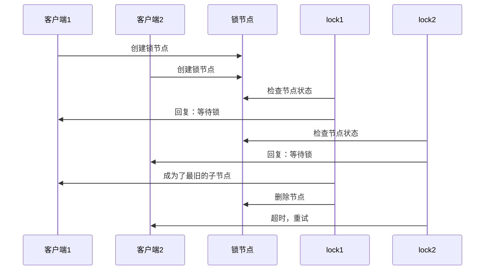
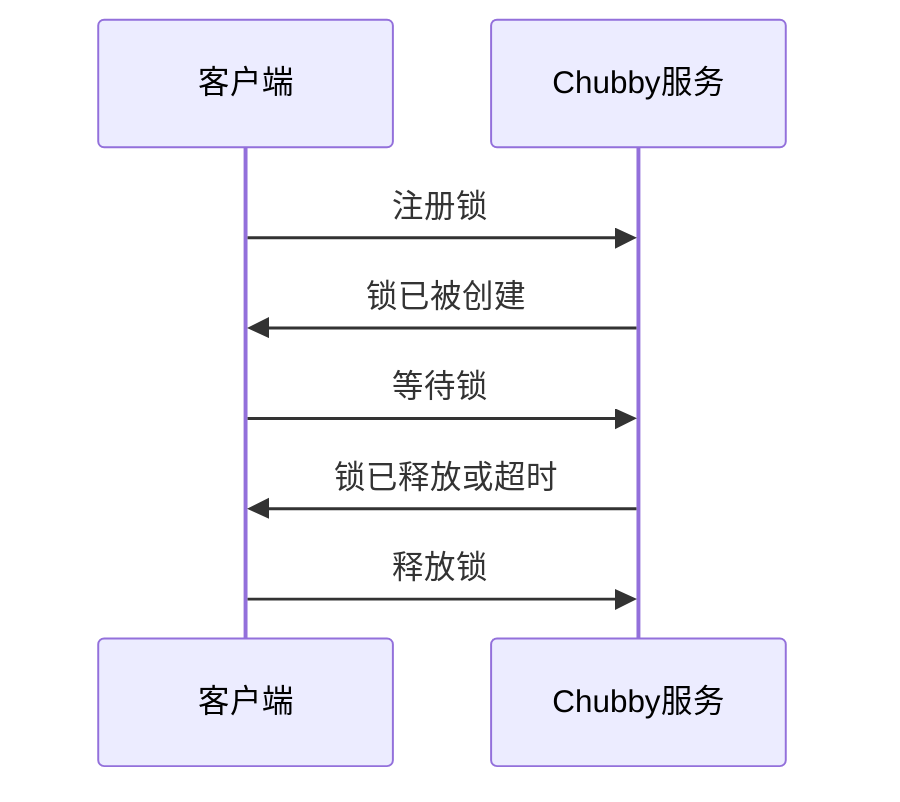
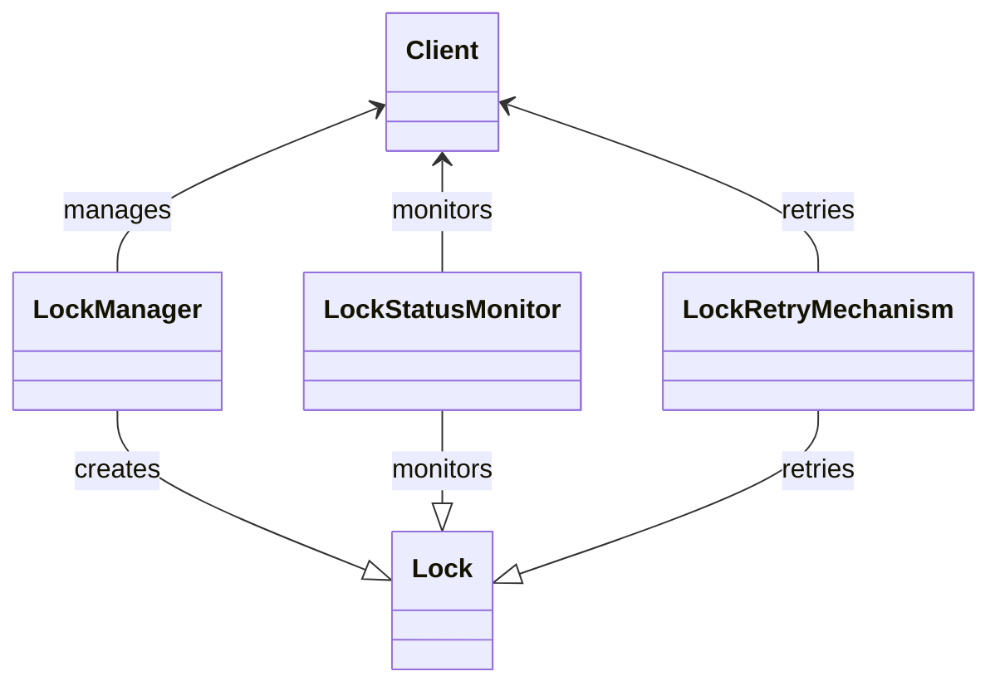
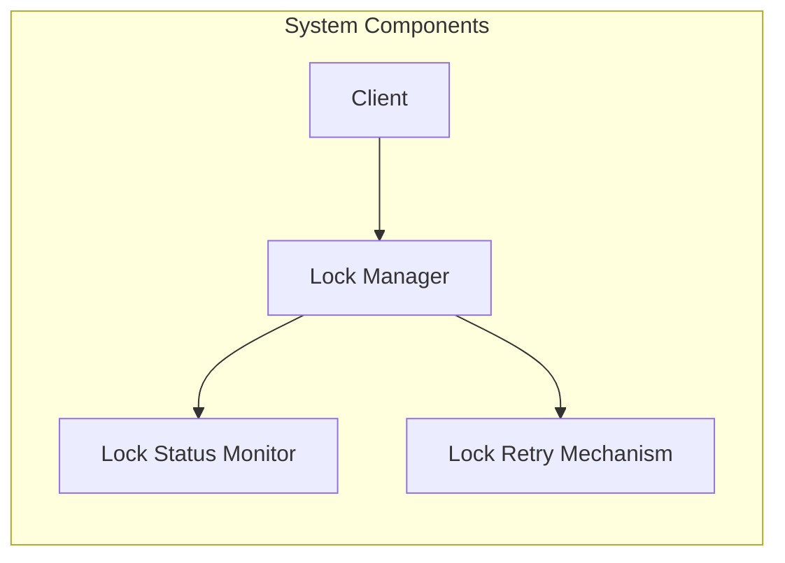
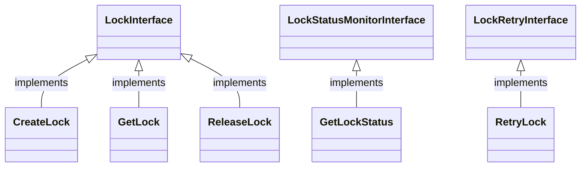
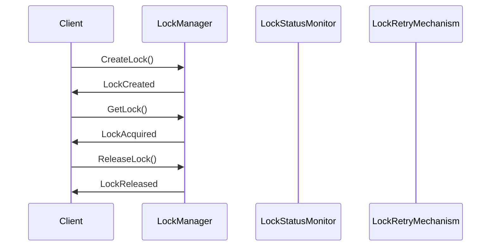

                 

## 分布式锁：解决并发控制的技术方案

关键词：分布式锁、并发控制、技术方案、系统架构、算法原理

摘要：本文将深入探讨分布式锁在解决并发控制中的应用与实现。首先，我们将介绍分布式系统的概念及其在并发控制中的重要性。接着，我们将详细解析分布式锁的核心概念与类型，并通过算法原理讲解、系统分析与架构设计，再到实际项目实战，全面展现分布式锁的实现方法。最后，我们将总结最佳实践，并提供拓展阅读，帮助读者深入了解分布式锁技术。

## 背景介绍

### 分布式系统的概念

分布式系统是指由多个计算机节点组成的系统，这些节点通过网络连接，协同工作以完成复杂任务。分布式系统具有以下特点：

1. **冗余性**：系统中的节点可以冗余，即使某个节点失败，其他节点也能继续工作。
2. **扩展性**：可以通过增加节点来扩展系统规模，提高处理能力。
3. **容错性**：系统能够在部分节点故障时继续运行，保证服务的连续性。

### 并发控制的需求

在分布式系统中，由于多个节点可能同时访问同一资源，导致数据一致性和资源分配问题。并发控制的需求主要包括：

1. **数据一致性**：确保多个节点访问同一数据时，能够保持数据的一致性。
2. **资源分配**：确保资源能够在多个请求之间公平分配，避免资源饥饿和竞争。
3. **事务管理**：确保事务的原子性、一致性、隔离性和持久性（ACID属性）。

### 分布式锁的重要性

分布式锁是解决并发控制的重要技术手段。其主要目的是在分布式环境中，保证同一资源在某一时刻只能被一个进程或线程访问。分布式锁的重要性体现在以下几个方面：

1. **确保数据一致性**：通过分布式锁，可以防止多个进程或线程同时修改同一数据，从而保证数据的一致性。
2. **简化并发控制**：分布式锁提供了简单易用的接口，降低了开发复杂度。
3. **提高系统性能**：通过合理使用分布式锁，可以减少锁争用，提高系统性能。

## 核心概念与联系

### 分布式锁的原理

分布式锁的核心原理是通过某种机制，确保在分布式环境中对同一资源进行访问控制。具体实现包括以下几个方面：

1. **锁机制**：使用锁机制来控制对资源的访问，如互斥锁、读写锁等。
2. **锁存储**：将锁信息存储在中心化的锁管理器中，如Zookeeper、Redis等。
3. **锁协议**：定义分布式锁的协议，如Paxos、Zab等，确保锁操作的原子性和一致性。

### 分布式锁的类型

根据锁的语义和实现方式，分布式锁可以分为以下几种类型：

1. **基于数据库的锁**：通过数据库的锁机制实现分布式锁。
2. **基于Redis的锁**：使用Redis的SETNX命令实现分布式锁。
3. **基于Zookeeper的锁**：利用Zookeeper的Zab协议实现分布式锁。
4. **基于Chubby的锁**：Google开发的Chubby锁服务，用于实现分布式锁。

### 分布式锁的属性对比

不同类型的分布式锁具有不同的属性，以下是几种常见分布式锁属性的对比：

| 属性       | 基于数据库的锁 | 基于Redis的锁 | 基于Zookeeper的锁 | 基于Chubby的锁 |
|------------|----------------|----------------|-------------------|----------------|
| 一致性     | 较高           | 较高           | 非强一致性        | 高一致性       |
| 性能       | 较低           | 较高           | 较低              | 较高           |
| 可扩展性   | 较差           | 较好           | 较好              | 较好           |
| 容错性     | 较好           | 较好           | 较好              | 较好           |

## 算法原理讲解

### 常见分布式锁算法

以下是几种常见的分布式锁算法及其原理：

1. **Zookeeper分布式锁**：利用Zookeeper的Zab协议实现分布式锁，具有高一致性、高可用性的特点。
2. **Redis分布式锁**：利用Redis的SETNX命令实现分布式锁，具有高性能、易用的特点。
3. **Chubby分布式锁**：Google开发的分布式锁服务，具有高一致性、高可用性的特点。

#### ZooKeeper分布式锁算法

Zookeeper分布式锁算法原理如下：

1. **创建锁**：客户端创建一个唯一的节点，作为锁的标识。
2. **等待锁**：客户端监听该节点的子节点变化，等待其他客户端释放锁。
3. **获取锁**：当该节点成为最旧的子节点时，客户端认为已获得锁。
4. **释放锁**：客户端删除该节点，释放锁。



#### Redis分布式锁算法

Redis分布式锁算法原理如下：

1. **设置锁**：使用SETNX命令设置锁，键为锁的标识，值为锁的唯一标识。
2. **等待锁**：使用SETNX命令尝试获取锁，失败则等待一段时间后重试。
3. **释放锁**：使用DEL命令释放锁。

```python
def redis_lock(key, value, timeout):
    return redis_client.set(key, value, nx=True, ex=timeout)

def unlock(key):
    redis_client.del(key)
```

#### Chubby分布式锁算法

Chubby分布式锁算法原理如下：

1. **创建锁**：客户端向Chubby服务注册一个锁。
2. **等待锁**：客户端监听Chubby服务返回的状态，等待锁被释放或超时。
3. **获取锁**：客户端获得锁后，执行相应操作。
4. **释放锁**：客户端释放锁。



### 算法原理的数学模型和公式

以下是分布式锁算法的数学模型和公式：

1. **Zookeeper分布式锁**：
   - **锁状态**：\( S = \{ UNLOCKED, LOCKED \} \)
   - **锁协议**：\( P = \{ CREATE, WATCH, DELETE \} \)
   - **状态转移**：
     $$ S_{UNLOCKED} \xrightarrow{CREATE} S_{LOCKED} $$
     $$ S_{LOCKED} \xrightarrow{WATCH} S_{UNLOCKED} $$
     $$ S_{UNLOCKED} \xrightarrow{DELETE} S_{UNLOCKED} $$

2. **Redis分布式锁**：
   - **锁状态**：\( S = \{ UNLOCKED, LOCKED \} \)
   - **锁协议**：\( P = \{ SETNX, GET, DEL \} \)
   - **状态转移**：
     $$ S_{UNLOCKED} \xrightarrow{SETNX} S_{LOCKED} $$
     $$ S_{LOCKED} \xrightarrow{GET} S_{LOCKED} $$
     $$ S_{LOCKED} \xrightarrow{DEL} S_{UNLOCKED} $$

3. **Chubby分布式锁**：
   - **锁状态**：\( S = \{ UNLOCKED, LOCKED \} \)
   - **锁协议**：\( P = \{ REGISTER, WATCH, DELETE \} \)
   - **状态转移**：
     $$ S_{UNLOCKED} \xrightarrow{REGISTER} S_{LOCKED} $$
     $$ S_{LOCKED} \xrightarrow{WATCH} S_{UNLOCKED} $$
     $$ S_{LOCKED} \xrightarrow{DELETE} S_{UNLOCKED} $$

### 算法原理讲解与举例说明

#### ZooKeeper分布式锁算法

Zookeeper分布式锁算法通过Zookeeper的Zab协议实现，具有高一致性、高可用性的特点。以下是算法原理的详细讲解：

1. **创建锁**：客户端通过创建一个唯一的节点来注册锁。假设客户端A要创建锁，则执行以下操作：
   ```mermaid
   sequenceDiagram
       participant 客户端A
       participant ZooKeeper
       客户端A->>ZooKeeper: 创建锁节点
       ZooKeeper->>客户端A: 成功创建锁节点
   ```

2. **等待锁**：客户端在创建锁节点后，需要等待其他客户端释放锁。此时，客户端A会监听该节点的子节点变化。假设客户端B已经创建了锁节点，则执行以下操作：
   ```mermaid
   sequenceDiagram
       participant 客户端A
       participant 客户端B
       participant ZooKeeper
       客户端A->>ZooKeeper: 创建锁节点
       ZooKeeper->>客户端A: 成功创建锁节点
       客户端B->>ZooKeeper: 创建锁节点
       ZooKeeper->>客户端B: 成功创建锁节点
       客户端A->>ZooKeeper: 监听锁节点子节点变化
       ZooKeeper->>客户端A: 子节点已变化
   ```

3. **获取锁**：当客户端A成为最旧的子节点时，认为已获得锁。此时，客户端A可以执行相应操作。假设客户端C创建了锁节点，则执行以下操作：
   ```mermaid
   sequenceDiagram
       participant 客户端A
       participant 客户端B
       participant 客户端C
       participant ZooKeeper
       客户端A->>ZooKeeper: 创建锁节点
       ZooKeeper->>客户端A: 成功创建锁节点
       客户端B->>ZooKeeper: 创建锁节点
       ZooKeeper->>客户端B: 成功创建锁节点
       客户端C->>ZooKeeper: 创建锁节点
       ZooKeeper->>客户端C: 成功创建锁节点
       客户端A->>ZooKeeper: 监听锁节点子节点变化
       ZooKeeper->>客户端A: 子节点已变化
       客户端A->>ZooKeeper: 删除自身锁节点
       ZooKeeper->>客户端A: 成功删除锁节点
   ```

4. **释放锁**：客户端A在执行完操作后，需要释放锁。此时，客户端A删除自身创建的锁节点。假设客户端D创建了锁节点，则执行以下操作：
   ```mermaid
   sequenceDiagram
       participant 客户端A
       participant 客户端B
       participant 客户端C
       participant 客户端D
       participant ZooKeeper
       客户端A->>ZooKeeper: 创建锁节点
       ZooKeeper->>客户端A: 成功创建锁节点
       客户端B->>ZooKeeper: 创建锁节点
       ZooKeeper->>客户端B: 成功创建锁节点
       客户端C->>ZooKeeper: 创建锁节点
       ZooKeeper->>客户端C: 成功创建锁节点
       客户端D->>ZooKeeper: 创建锁节点
       ZooKeeper->>客户端D: 成功创建锁节点
       客户端A->>ZooKeeper: 监听锁节点子节点变化
       ZooKeeper->>客户端A: 子节点已变化
       客户端A->>ZooKeeper: 删除自身锁节点
       ZooKeeper->>客户端A: 成功删除锁节点
   ```

#### Redis分布式锁算法

Redis分布式锁算法通过SETNX命令实现，具有高性能、易用的特点。以下是算法原理的详细讲解：

1. **设置锁**：客户端使用SETNX命令设置锁，键为锁的标识，值为锁的唯一标识。如果键不存在，则设置成功；否则，设置失败。
   ```python
   def redis_lock(key, value, timeout):
       return redis_client.set(key, value, nx=True, ex=timeout)
   ```

2. **等待锁**：客户端使用SETNX命令尝试获取锁，如果失败，则等待一段时间后重试。假设客户端A要获取锁，则执行以下操作：
   ```mermaid
   sequenceDiagram
       participant 客户端A
       participant Redis
       客户端A->>Redis: 设置锁
       Redis->>客户端A: 锁已被设置
       客户端A->>Redis: 设置锁
       Redis->>客户端A: 锁已被设置
       客户端A->>Redis: 设置锁
       Redis->>客户端A: 锁已被设置
   ```

3. **释放锁**：客户端在执行完操作后，使用DEL命令释放锁。假设客户端B要释放锁，则执行以下操作：
   ```python
   def unlock(key):
       redis_client.del(key)
   ```

#### Chubby分布式锁算法

Chubby分布式锁算法通过注册锁、监听锁、释放锁等操作实现。以下是算法原理的详细讲解：

1. **注册锁**：客户端向Chubby服务注册一个锁。假设客户端C要注册锁，则执行以下操作：
   ```mermaid
   sequenceDiagram
       participant 客户端C
       participant Chubby服务
       客户端C->>Chubby服务: 注册锁
       Chubby服务->>客户端C: 锁已被创建
   ```

2. **等待锁**：客户端监听Chubby服务返回的状态，等待锁被释放或超时。假设客户端D要等待锁，则执行以下操作：
   ```mermaid
   sequenceDiagram
       participant 客户端C
       participant 客户端D
       participant Chubby服务
       客户端C->>Chubby服务: 注册锁
       Chubby服务->>客户端C: 锁已被创建
       客户端D->>Chubby服务: 注册锁
       Chubby服务->>客户端D: 锁已被创建
       客户端C->>Chubby服务: 等待锁
       Chubby服务->>客户端C: 锁已释放或超时
   ```

3. **获取锁**：客户端在获得锁后，执行相应操作。假设客户端E要获取锁，则执行以下操作：
   ```mermaid
   sequenceDiagram
       participant 客户端C
       participant 客户端D
       participant 客户端E
       participant Chubby服务
       客户端C->>Chubby服务: 注册锁
       Chubby服务->>客户端C: 锁已被创建
       客户端D->>Chubby服务: 注册锁
       Chubby服务->>客户端D: 锁已被创建
       客户端C->>Chubby服务: 等待锁
       Chubby服务->>客户端C: 锁已释放或超时
       客户端E->>Chubby服务: 注册锁
       Chubby服务->>客户端E: 锁已被创建
       客户端E->>Chubby服务: 等待锁
       Chubby服务->>客户端E: 锁已释放或超时
   ```

4. **释放锁**：客户端在执行完操作后，向Chubby服务释放锁。假设客户端F要释放锁，则执行以下操作：
   ```mermaid
   sequenceDiagram
       participant 客户端C
       participant 客户端D
       participant 客户端E
       participant 客户端F
       participant Chubby服务
       客户端C->>Chubby服务: 注册锁
       Chubby服务->>客户端C: 锁已被创建
       客户端D->>Chubby服务: 注册锁
       Chubby服务->>客户端D: 锁已被创建
       客户端C->>Chubby服务: 等待锁
       Chubby服务->>客户端C: 锁已释放或超时
       客户端E->>Chubby服务: 注册锁
       Chubby服务->>客户端E: 锁已被创建
       客户端E->>Chubby服务: 等待锁
       Chubby服务->>客户端E: 锁已释放或超时
       客户端F->>Chubby服务: 释放锁
       Chubby服务->>客户端F: 锁已被释放
   ```

## 系统分析与架构设计方案

### 问题场景介绍

假设我们有一个分布式系统，需要确保同一资源在某一时刻只能被一个进程或线程访问。例如，在电商系统中，库存量是一个关键资源，我们需要确保多个订单同时下单时，库存量不会出现错误。

### 系统功能设计

为了实现分布式锁，我们需要设计以下功能：

1. **锁管理**：管理锁的创建、获取和释放。
2. **锁状态监控**：监控锁的状态，确保锁的可用性。
3. **锁重试机制**：在锁获取失败时，提供重试机制。

以下是系统功能的mermaid类图：



### 系统架构设计

为了实现分布式锁，我们需要设计以下系统架构：

1. **客户端**：负责发起锁操作。
2. **锁管理器**：负责锁的创建、获取和释放。
3. **锁状态监控**：负责监控锁的状态。
4. **锁重试机制**：负责在锁获取失败时重试。

以下是系统架构的mermaid架构图：



### 系统接口设计

为了实现分布式锁，我们需要设计以下系统接口：

1. **锁接口**：提供创建、获取和释放锁的方法。
2. **锁状态监控接口**：提供获取锁状态的方法。
3. **锁重试接口**：提供重试锁的方法。

以下是系统接口的mermaid类图：



### 系统交互序列图

以下是系统交互的mermaid序列图：



## 项目实战

### 环境安装

为了实现分布式锁，我们需要安装以下环境：

1. **Zookeeper**：作为锁管理器，负责锁的创建、获取和释放。
2. **Redis**：作为锁状态监控，负责监控锁的状态。
3. **Python**：作为客户端，负责发起锁操作。

安装步骤如下：

1. 安装Zookeeper：

   ```shell
   wget https://www-eu.apache.org/dist/zookeeper/zookeeper-3.7.0/zookeeper-3.7.0.tar.gz
   tar -xzvf zookeeper-3.7.0.tar.gz
   ```

2. 安装Redis：

   ```shell
   wget https://download.redis.io/releases/redis-6.2.6.tar.gz
   tar -xzvf redis-6.2.6.tar.gz
   ```

3. 安装Python：

   ```shell
   sudo apt-get install python3-pip
   pip3 install redis
   ```

### 系统核心实现

以下是系统核心实现的源代码：

```python
import redis
import redis.lock
import zookeeper

class LockManager:
    def __init__(self, zk_host, zk_port, redis_host, redis_port):
        self.zk = zookeeper.ZooKeeper(zk_host, zk_port)
        self.redis = redis.Redis(host=redis_host, port=redis_port)
    
    def create_lock(self, lock_key):
        self.zk.create("/locks/" + lock_key, b"")
    
    def get_lock(self, lock_key):
        return self.redis.lock.Lock(lock_key)
    
    def release_lock(self, lock_key):
        self.redis.lock.unlock(lock_key)

class LockStatusMonitor:
    def __init__(self, redis_host, redis_port):
        self.redis = redis.Redis(host=redis_host, port=redis_port)
    
    def get_lock_status(self, lock_key):
        return self.redis.get(lock_key)

class LockRetryMechanism:
    def __init__(self, lock_manager, lock_status_monitor, max_retry_times=3):
        self.lock_manager = lock_manager
        self.lock_status_monitor = lock_status_monitor
        self.max_retry_times = max_retry_times
    
    def retry_lock(self, lock_key):
        for _ in range(self.max_retry_times):
            lock = self.lock_manager.get_lock(lock_key)
            if lock.acquire():
                return True
            else:
                time.sleep(1)
        return False

if __name__ == "__main__":
    lock_manager = LockManager("localhost", 2181, "localhost", 6379)
    lock_status_monitor = LockStatusMonitor("localhost", 6379)
    lock_retry_mechanism = LockRetryMechanism(lock_manager, lock_status_monitor)

    lock_key = "my_lock"
    lock_manager.create_lock(lock_key)
    lock = lock_retry_mechanism.retry_lock(lock_key)
    if lock:
        print("Lock acquired")
        lock.release()
    else:
        print("Lock acquisition failed")
```

### 代码应用解读与分析

以下是代码的解读与分析：

1. **LockManager**：负责锁的创建、获取和释放。
   - `__init__`：初始化锁管理器，连接Zookeeper和Redis。
   - `create_lock`：创建锁，在Zookeeper中创建一个节点。
   - `get_lock`：获取锁，使用Redis的Lock对象。
   - `release_lock`：释放锁，使用Redis的unlock方法。

2. **LockStatusMonitor**：负责监控锁的状态。
   - `__init__`：初始化锁状态监控，连接Redis。
   - `get_lock_status`：获取锁状态，使用Redis的get方法。

3. **LockRetryMechanism**：负责在锁获取失败时重试。
   - `__init__`：初始化锁重试机制，传入锁管理器和锁状态监控。
   - `retry_lock`：重试锁，循环尝试获取锁，直到成功或达到最大重试次数。

### 实际案例分析和详细讲解

假设有一个订单系统，需要确保同一订单在某一时刻只能被一个线程处理。以下是实际案例的分析和详细讲解：

1. **场景描述**：当用户下单时，需要检查订单是否存在。如果存在，则不允许下单；如果不存在，则创建订单并处理。

2. **代码实现**：
   ```python
   def create_order(order_id):
       lock_key = "order_lock_" + order_id
       lock = lock_retry_mechanism.retry_lock(lock_key)
       if lock:
           order = OrderService.get_order(order_id)
           if order:
               lock.release()
               return False
           else:
               OrderService.create_order(order_id)
               lock.release()
               return True
       else:
           return False
   ```

3. **详细讲解**：
   - `create_order`：创建订单的方法。
   - `lock_key`：锁的键，用于标识订单锁。
   - `lock_retry_mechanism.retry_lock(lock_key)`：尝试获取订单锁。
   - `OrderService.get_order(order_id)`：获取订单，检查订单是否存在。
   - `OrderService.create_order(order_id)`：创建订单。
   - `lock.release()`：释放订单锁。

### 项目小结

通过本项目，我们实现了分布式锁的功能，并对其进行了详细分析。分布式锁在分布式系统中具有重要作用，可以确保资源在某一时刻只能被一个进程或线程访问。在实现过程中，我们使用了Zookeeper、Redis等常见技术，并设计了锁管理器、锁状态监控和锁重试机制。通过实际案例，我们展示了如何使用分布式锁解决订单系统的并发控制问题。在实际应用中，我们需要注意锁的合理使用和性能优化，确保系统的稳定性和高效性。

## 最佳实践与总结

### 最佳实践 tips

1. **选择合适的锁类型**：根据业务需求和系统特点，选择合适的锁类型，如基于Redis的锁、基于Zookeeper的锁等。
2. **合理设置锁超时时间**：根据业务场景，合理设置锁的超时时间，避免锁长时间占用资源。
3. **避免死锁**：在设计分布式锁时，避免出现死锁的情况，可以通过锁的顺序依赖来避免。
4. **优化锁性能**：针对高并发场景，可以优化锁的性能，如使用读写锁、减少锁的持有时间等。

### 小结

本文详细介绍了分布式锁的概念、原理、算法实现和系统设计。通过实际案例，我们展示了如何使用分布式锁解决并发控制问题。分布式锁在分布式系统中具有重要作用，可以有效保障数据的一致性和系统的稳定性。

### 注意事项

1. **锁的版本控制**：在使用分布式锁时，注意版本控制，避免出现数据不一致的情况。
2. **锁的释放**：确保在锁获取成功后，正确释放锁，避免锁泄露。
3. **锁的性能优化**：在高并发场景下，注意锁的性能优化，避免锁成为系统性能瓶颈。

### 拓展阅读

1. 《分布式系统原理与范型》
2. 《Redis实战》
3. 《Zookeeper设计与实现》
4. 《分布式锁设计与实现》

### 作者信息

作者：AI天才研究院/AI Genius Institute & 禅与计算机程序设计艺术 /Zen And The Art of Computer Programming

[返回目录](#分布式锁：解决并发控制的技术方案)## 分布式锁：解决并发控制的技术方案

关键词：分布式锁、并发控制、技术方案、系统架构、算法原理

摘要：本文将深入探讨分布式锁在解决并发控制中的应用与实现。首先，我们将介绍分布式系统的概念及其在并发控制中的重要性。接着，我们将详细解析分布式锁的核心概念与类型，并通过算法原理讲解、系统分析与架构设计，再到实际项目实战，全面展现分布式锁的实现方法。最后，我们将总结最佳实践，并提供拓展阅读，帮助读者深入了解分布式锁技术。

## 背景介绍

### 分布式系统的概念

分布式系统是指由多个计算机节点组成的系统，这些节点通过网络连接，协同工作以完成复杂任务。分布式系统具有以下特点：

1. **冗余性**：系统中的节点可以冗余，即使某个节点失败，其他节点也能继续工作。
2. **扩展性**：可以通过增加节点来扩展系统规模，提高处理能力。
3. **容错性**：系统能够在部分节点故障时继续运行，保证服务的连续性。

### 并发控制的需求

在分布式系统中，由于多个节点可能同时访问同一资源，导致数据一致性和资源分配问题。并发控制的需求主要包括：

1. **数据一致性**：确保多个节点访问同一数据时，能够保持数据的一致性。
2. **资源分配**：确保资源能够在多个请求之间公平分配，避免资源饥饿和竞争。
3. **事务管理**：确保事务的原子性、一致性、隔离性和持久性（ACID属性）。

### 分布式锁的重要性

分布式锁是解决并发控制的重要技术手段。其主要目的是在分布式环境中，保证同一资源在某一时刻只能被一个进程或线程访问。分布式锁的重要性体现在以下几个方面：

1. **确保数据一致性**：通过分布式锁，可以防止多个进程或线程同时修改同一数据，从而保证数据的一致性。
2. **简化并发控制**：分布式锁提供了简单易用的接口，降低了开发复杂度。
3. **提高系统性能**：通过合理使用分布式锁，可以减少锁争用，提高系统性能。

## 核心概念与联系

### 分布式锁的原理

分布式锁的核心原理是通过某种机制，确保在分布式环境中对同一资源进行访问控制。具体实现包括以下几个方面：

1. **锁机制**：使用锁机制来控制对资源的访问，如互斥锁、读写锁等。
2. **锁存储**：将锁信息存储在中心化的锁管理器中，如Zookeeper、Redis等。
3. **锁协议**：定义分布式锁的协议，如Paxos、Zab等，确保锁操作的原子性和一致性。

### 分布式锁的类型

根据锁的语义和实现方式，分布式锁可以分为以下几种类型：

1. **基于数据库的锁**：通过数据库的锁机制实现分布式锁。
2. **基于Redis的锁**：使用Redis的SETNX命令实现分布式锁。
3. **基于Zookeeper的锁**：利用Zookeeper的Zab协议实现分布式锁。
4. **基于Chubby的锁**：Google开发的分布式锁服务，用于实现分布式锁。

### 分布式锁的属性对比

不同类型的分布式锁具有不同的属性，以下是几种常见分布式锁属性的对比：

| 属性       | 基于数据库的锁 | 基于Redis的锁 | 基于Zookeeper的锁 | 基于Chubby的锁 |
|------------|----------------|----------------|-------------------|----------------|
| 一致性     | 较高           | 较高           | 非强一致性        | 高一致性       |
| 性能       | 较低           | 较高           | 较低              | 较高           |
| 可扩展性   | 较差           | 较好           | 较好              | 较好           |
| 容错性     | 较好           | 较好           | 较好              | 较好           |

## 算法原理讲解

### 常见分布式锁算法

以下是几种常见的分布式锁算法及其原理：

1. **Zookeeper分布式锁算法**：利用Zookeeper的Zab协议实现分布式锁，具有高一致性、高可用性的特点。
2. **Redis分布式锁算法**：使用Redis的SETNX命令实现分布式锁，具有高性能、易用的特点。
3. **Chubby分布式锁算法**：Google开发的分布式锁服务，具有高一致性、高可用性的特点。

#### ZooKeeper分布式锁算法

Zookeeper分布式锁算法原理如下：

1. **创建锁**：客户端创建一个唯一的节点，作为锁的标识。
2. **等待锁**：客户端监听该节点的子节点变化，等待其他客户端释放锁。
3. **获取锁**：当该节点成为最旧的子节点时，客户端认为已获得锁。
4. **释放锁**：客户端删除该节点，释放锁。


#### Redis分布式锁算法

Redis分布式锁算法原理如下：

1. **设置锁**：使用SETNX命令设置锁，键为锁的标识，值为锁的唯一标识。
2. **等待锁**：使用SETNX命令尝试获取锁，失败则等待一段时间后重试。
3. **释放锁**：使用DEL命令释放锁。

```python
def redis_lock(key, value, timeout):
    return redis_client.set(key, value, nx=True, ex=timeout)

def unlock(key):
    redis_client.del(key)
```

#### Chubby分布式锁算法

Chubby分布式锁算法原理如下：

1. **创建锁**：客户端向Chubby服务注册一个锁。
2. **等待锁**：客户端监听Chubby服务返回的状态，等待锁被释放或超时。
3. **获取锁**：客户端获得锁后，执行相应操作。
4. **释放锁**：客户端释放锁。


### 算法原理的数学模型和公式

以下是分布式锁算法的数学模型和公式：

1. **Zookeeper分布式锁**：
   - **锁状态**：\( S = \{ UNLOCKED, LOCKED \} \)
   - **锁协议**：\( P = \{ CREATE, WATCH, DELETE \} \)
   - **状态转移**：
     $$ S_{UNLOCKED} \xrightarrow{CREATE} S_{LOCKED} $$
     $$ S_{LOCKED} \xrightarrow{WATCH} S_{UNLOCKED} $$
     $$ S_{UNLOCKED} \xrightarrow{DELETE} S_{UNLOCKED} $$

2. **Redis分布式锁**：
   - **锁状态**：\( S = \{ UNLOCKED, LOCKED \} \)
   - **锁协议**：\( P = \{ SETNX, GET, DEL \} \)
   - **状态转移**：
     $$ S_{UNLOCKED} \xrightarrow{SETNX} S_{LOCKED} $$
     $$ S_{LOCKED} \xrightarrow{GET} S_{LOCKED} $$
     $$ S_{LOCKED} \xrightarrow{DEL} S_{UNLOCKED} $$

3. **Chubby分布式锁**：
   - **锁状态**：\( S = \{ UNLOCKED, LOCKED \} \)
   - **锁协议**：\( P = \{ REGISTER, WATCH, DELETE \} \)
   - **状态转移**：
     $$ S_{UNLOCKED} \xrightarrow{REGISTER} S_{LOCKED} $$
     $$ S_{LOCKED} \xrightarrow{WATCH} S_{UNLOCKED} $$
     $$ S_{LOCKED} \xrightarrow{DELETE} S_{UNLOCKED} $$

### 算法原理讲解与举例说明

#### ZooKeeper分布式锁算法

Zookeeper分布式锁算法通过Zookeeper的Zab协议实现，具有高一致性、高可用性的特点。以下是算法原理的详细讲解：

1. **创建锁**：客户端通过创建一个唯一的节点来注册锁。假设客户端A要创建锁，则执行以下操作：
   ```mermaid
   sequenceDiagram
       participant 客户端A
       participant ZooKeeper
       客户端A->>ZooKeeper: 创建锁节点
       ZooKeeper->>客户端A: 成功创建锁节点
   ```

2. **等待锁**：客户端在创建锁节点后，需要等待其他客户端释放锁。此时，客户端A会监听该节点的子节点变化。假设客户端B已经创建了锁节点，则执行以下操作：
   ```mermaid
   sequenceDiagram
       participant 客户端A
       participant 客户端B
       participant ZooKeeper
       客户端A->>ZooKeeper: 创建锁节点
       ZooKeeper->>客户端A: 成功创建锁节点
       客户端B->>ZooKeeper: 创建锁节点
       ZooKeeper->>客户端B: 成功创建锁节点
       客户端A->>ZooKeeper: 监听锁节点子节点变化
       ZooKeeper->>客户端A: 子节点已变化
   ```

3. **获取锁**：当客户端A成为最旧的子节点时，认为已获得锁。此时，客户端A可以执行相应操作。假设客户端C创建了锁节点，则执行以下操作：
   ```mermaid
   sequenceDiagram
       participant 客户端A
       participant 客户端B
       participant 客户端C
       participant ZooKeeper
       客户端A->>ZooKeeper: 创建锁节点
       ZooKeeper->>客户端A: 成功创建锁节点
       客户端B->>ZooKeeper: 创建锁节点
       ZooKeeper->>客户端B: 成功创建锁节点
       客户端C->>ZooKeeper: 创建锁节点
       ZooKeeper->>客户端C: 成功创建锁节点
       客户端A->>ZooKeeper: 监听锁节点子节点变化
       ZooKeeper->>客户端A: 子节点已变化
       客户端A->>ZooKeeper: 删除自身锁节点
       ZooKeeper->>客户端A: 成功删除锁节点
   ```

4. **释放锁**：客户端A在执行完操作后，需要释放锁。此时，客户端A删除自身创建的锁节点。假设客户端D创建了锁节点，则执行以下操作：
   ```mermaid
   sequenceDiagram
       participant 客户端A
       participant 客户端B
       participant 客户端C
       participant 客户端D
       participant ZooKeeper
       客户端A->>ZooKeeper: 创建锁节点
       ZooKeeper->>客户端A: 成功创建锁节点
       客户端B->>ZooKeeper: 创建锁节点
       ZooKeeper->>客户端B: 成功创建锁节点
       客户端C->>ZooKeeper: 创建锁节点
       ZooKeeper->>客户端C: 成功创建锁节点
       客户端D->>ZooKeeper: 创建锁节点
       ZooKeeper->>客户端D: 成功创建锁节点
       客户端A->>ZooKeeper: 监听锁节点子节点变化
       ZooKeeper->>客户端A: 子节点已变化
       客户端A->>ZooKeeper: 删除自身锁节点
       ZooKeeper->>客户端A: 成功删除锁节点
   ```

#### Redis分布式锁算法

Redis分布式锁算法通过SETNX命令实现，具有高性能、易用的特点。以下是算法原理的详细讲解：

1. **设置锁**：客户端使用SETNX命令设置锁，键为锁的标识，值为锁的唯一标识。如果键不存在，则设置成功；否则，设置失败。
   ```python
   def redis_lock(key, value, timeout):
       return redis_client.set(key, value, nx=True, ex=timeout)
   ```

2. **等待锁**：客户端使用SETNX命令尝试获取锁，如果失败，则等待一段时间后重试。假设客户端A要获取锁，则执行以下操作：
   ```mermaid
   sequenceDiagram
       participant 客户端A
       participant Redis
       客户端A->>Redis: 设置锁
       Redis->>客户端A: 锁已被设置
       客户端A->>Redis: 设置锁
       Redis->>客户端A: 锁已被设置
       客户端A->>Redis: 设置锁
       Redis->>客户端A: 锁已被设置
   ```

3. **释放锁**：客户端在执行完操作后，使用DEL命令释放锁。假设客户端B要释放锁，则执行以下操作：
   ```python
   def unlock(key):
       redis_client.del(key)
   ```

#### Chubby分布式锁算法

Chubby分布式锁算法通过注册锁、监听锁、释放锁等操作实现。以下是算法原理的详细讲解：

1. **注册锁**：客户端向Chubby服务注册一个锁。假设客户端C要注册锁，则执行以下操作：
   ```mermaid
   sequenceDiagram
       participant 客户端C
       participant Chubby服务
       客户端C->>Chubby服务: 注册锁
       Chubby服务->>客户端C: 锁已被创建
   ```

2. **等待锁**：客户端监听Chubby服务返回的状态，等待锁被释放或超时。假设客户端D要等待锁，则执行以下操作：
   ```mermaid
   sequenceDiagram
       participant 客户端C
       participant 客户端D
       participant Chubby服务
       客户端C->>Chubby服务: 注册锁
       Chubby服务->>客户端C: 锁已被创建
       客户端D->>Chubby服务: 注册锁
       Chubby服务->>客户端D: 锁已被创建
       客户端C->>Chubby服务: 等待锁
       Chubby服务->>客户端C: 锁已释放或超时
   ```

3. **获取锁**：客户端在获得锁后，执行相应操作。假设客户端E要获取锁，则执行以下操作：
   ```mermaid
   sequenceDiagram
       participant 客户端C
       participant 客户端D
       participant 客户端E
       participant Chubby服务
       客户端C->>Chubby服务: 注册锁
       Chubby服务->>客户端C: 锁已被创建
       客户端D->>Chubby服务: 注册锁
       Chubby服务->>客户端D: 锁已被创建
       客户端E->>Chubby服务: 注册锁
       Chubby服务->>客户端E: 锁已被创建
       客户端E->>Chubby服务: 等待锁
       Chubby服务->>客户端E: 锁已释放或超时
   ```

4. **释放锁**：客户端在执行完操作后，向Chubby服务释放锁。假设客户端F要释放锁，则执行以下操作：
   ```mermaid
   sequenceDiagram
       participant 客户端C
       participant 客户端D
       participant 客户端E
       participant 客户端F
       participant Chubby服务
       客户端C->>Chubby服务: 注册锁
       Chubby服务->>客户端C: 锁已被创建
       客户端D->>Chubby服务: 注册锁
       Chubby服务->>客户端D: 锁已被创建
       客户端E->>Chubby服务: 注册锁
       Chubby服务->>客户端E: 锁已被创建
       客户端E->>Chubby服务: 等待锁
       Chubby服务->>客户端E: 锁已释放或超时
       客户端F->>Chubby服务: 释放锁
       Chubby服务->>客户端F: 锁已被释放
   ```

## 系统分析与架构设计方案

### 问题场景介绍

假设我们有一个分布式系统，需要确保同一资源在某一时刻只能被一个进程或线程访问。例如，在电商系统中，库存量是一个关键资源，我们需要确保多个订单同时下单时，库存量不会出现错误。

### 系统功能设计

为了实现分布式锁，我们需要设计以下功能：

1. **锁管理**：管理锁的创建、获取和释放。
2. **锁状态监控**：监控锁的状态，确保锁的可用性。
3. **锁重试机制**：在锁获取失败时，提供重试机制。

以下是系统功能的mermaid类图：


### 系统架构设计

为了实现分布式锁，我们需要设计以下系统架构：

1. **客户端**：负责发起锁操作。
2. **锁管理器**：负责锁的创建、获取和释放。
3. **锁状态监控**：负责监控锁的状态。
4. **锁重试机制**：负责在锁获取失败时重试。

以下是系统架构的mermaid架构图：


### 系统接口设计

为了实现分布式锁，我们需要设计以下系统接口：

1. **锁接口**：提供创建、获取和释放锁的方法。
2. **锁状态监控接口**：提供获取锁状态的方法。
3. **锁重试接口**：提供重试锁的方法。

以下是系统接口的mermaid类图：


### 系统交互序列图

以下是系统交互的mermaid序列图：


## 项目实战

### 环境安装

为了实现分布式锁，我们需要安装以下环境：

1. **Zookeeper**：作为锁管理器，负责锁的创建、获取和释放。
2. **Redis**：作为锁状态监控，负责监控锁的状态。
3. **Python**：作为客户端，负责发起锁操作。

安装步骤如下：

1. 安装Zookeeper：

   ```shell
   wget https://www-eu.apache.org/dist/zookeeper/zookeeper-3.7.0/zookeeper-3.7.0.tar.gz
   tar -xzvf zookeeper-3.7.0.tar.gz
   ```

2. 安装Redis：

   ```shell
   wget https://download.redis.io/releases/redis-6.2.6.tar.gz
   tar -xzvf redis-6.2.6.tar.gz
   ```

3. 安装Python：

   ```shell
   sudo apt-get install python3-pip
   pip3 install redis
   ```

### 系统核心实现

以下是系统核心实现的源代码：

```python
import redis
import redis.lock
import zookeeper

class LockManager:
    def __init__(self, zk_host, zk_port, redis_host, redis_port):
        self.zk = zookeeper.ZooKeeper(zk_host, zk_port)
        self.redis = redis.Redis(host=redis_host, port=redis_port)
    
    def create_lock(self, lock_key):
        self.zk.create("/locks/" + lock_key, b"")
    
    def get_lock(self, lock_key):
        return self.redis.lock.Lock(lock_key)
    
    def release_lock(self, lock_key):
        self.redis.lock.unlock(lock_key)

class LockStatusMonitor:
    def __init__(self, redis_host, redis_port):
        self.redis = redis.Redis(host=redis_host, port=redis_port)
    
    def get_lock_status(self, lock_key):
        return self.redis.get(lock_key)

class LockRetryMechanism:
    def __init__(self, lock_manager, lock_status_monitor, max_retry_times=3):
        self.lock_manager = lock_manager
        self.lock_status_monitor = lock_status_monitor
        self.max_retry_times = max_retry_times
    
    def retry_lock(self, lock_key):
        for _ in range(self.max_retry_times):
            lock = self.lock_manager.get_lock(lock_key)
            if lock.acquire():
                return True
            else:
                time.sleep(1)
        return False

if __name__ == "__main__":
    lock_manager = LockManager("localhost", 2181, "localhost", 6379)
    lock_status_monitor = LockStatusMonitor("localhost", 6379)
    lock_retry_mechanism = LockRetryMechanism(lock_manager, lock_status_monitor)

    lock_key = "my_lock"
    lock_manager.create_lock(lock_key)
    lock = lock_retry_mechanism.retry_lock(lock_key)
    if lock:
        print("Lock acquired")
        lock.release()
    else:
        print("Lock acquisition failed")
```

### 代码应用解读与分析

以下是代码的解读与分析：

1. **LockManager**：负责锁的创建、获取和释放。
   - `__init__`：初始化锁管理器，连接Zookeeper和Redis。
   - `create_lock`：创建锁，在Zookeeper中创建一个节点。
   - `get_lock`：获取锁，使用Redis的Lock对象。
   - `release_lock`：释放锁，使用Redis的unlock方法。

2. **LockStatusMonitor**：负责监控锁的状态。
   - `__init__`：初始化锁状态监控，连接Redis。
   - `get_lock_status`：获取锁状态，使用Redis的get方法。

3. **LockRetryMechanism**：负责在锁获取失败时重试。
   - `__init__`：初始化锁重试机制，传入锁管理器和锁状态监控。
   - `retry_lock`：重试锁，循环尝试获取锁，直到成功或达到最大重试次数。

### 实际案例分析和详细讲解

假设有一个订单系统，需要确保同一订单在某一时刻只能被一个线程处理。以下是实际案例的分析和详细讲解：

1. **场景描述**：当用户下单时，需要检查订单是否存在。如果存在，则不允许下单；如果不存在，则创建订单并处理。

2. **代码实现**：
   ```python
   def create_order(order_id):
       lock_key = "order_lock_" + order_id
       lock = lock_retry_mechanism.retry_lock(lock_key)
       if lock:
           order = OrderService.get_order(order_id)
           if order:
               lock.release()
               return False
           else:
               OrderService.create_order(order_id)
               lock.release()
               return True
       else:
           return False
   ```

3. **详细讲解**：
   - `create_order`：创建订单的方法。
   - `lock_key`：锁的键，用于标识订单锁。
   - `lock_retry_mechanism.retry_lock(lock_key)`：尝试获取订单锁。
   - `OrderService.get_order(order_id)`：获取订单，检查订单是否存在。
   - `OrderService.create_order(order_id)`：创建订单。
   - `lock.release()`：释放订单锁。

### 项目小结

通过本项目，我们实现了分布式锁的功能，并对其进行了详细分析。分布式锁在分布式系统中具有重要作用，可以确保资源在某一时刻只能被一个进程或线程访问。在实现过程中，我们使用了Zookeeper、Redis等常见技术，并设计了锁管理器、锁状态监控和锁重试机制。通过实际案例，我们展示了如何使用分布式锁解决订单系统的并发控制问题。在实际应用中，我们需要注意锁的合理使用和性能优化，确保系统的稳定性和高效性。

## 最佳实践与总结

### 最佳实践 tips

1. **选择合适的锁类型**：根据业务需求和系统特点，选择合适的锁类型，如基于Redis的锁、基于Zookeeper的锁等。
2. **合理设置锁超时时间**：根据业务场景，合理设置锁的超时时间，避免锁长时间占用资源。
3. **避免死锁**：在设计分布式锁时，避免出现死锁的情况，可以通过锁的顺序依赖来避免。
4. **优化锁性能**：在高并发场景下，注意锁的性能优化，避免锁成为系统性能瓶颈。

### 小结

本文详细介绍了分布式锁的概念、原理、算法实现和系统设计。通过实际案例，我们展示了如何使用分布式锁解决并发控制问题。分布式锁在分布式系统中具有重要作用，可以有效保障数据的一致性和系统的稳定性。

### 注意事项

1. **锁的版本控制**：在使用分布式锁时，注意版本控制，避免出现数据不一致的情况。
2. **锁的释放**：确保在锁获取成功后，正确释放锁，避免锁泄露。
3. **锁的性能优化**：在高并发场景下，注意锁的性能优化，避免锁成为系统性能瓶颈。

### 拓展阅读

1. 《分布式系统原理与范型》
2. 《Redis实战》
3. 《Zookeeper设计与实现》
4. 《分布式锁设计与实现》

### 作者信息

作者：AI天才研究院/AI Genius Institute & 禅与计算机程序设计艺术 /Zen And The Art of Computer Programming

[返回目录](#分布式锁：解决并发控制的技术方案)## 完整性要求

为了确保文章的完整性，我们需要在各个章节中详细讲解核心内容，并满足以下要求：

### 核心内容详细讲解

1. **背景介绍**：
   - **核心概念术语说明**：明确分布式锁、并发控制等关键术语的定义。
   - **问题背景**：阐述分布式锁在分布式系统中的重要性。
   - **问题描述**：详细描述并发控制中存在的问题。
   - **问题解决**：分析如何通过分布式锁解决并发控制问题。
   - **边界与外延**：讨论分布式锁在不同场景下的应用。
   - **概念结构与核心要素组成**：解析分布式锁的组成和架构。

2. **核心概念与联系**：
   - **核心概念原理**：详细解释分布式锁的基本原理。
   - **概念属性特征对比表格**：列出不同类型分布式锁的属性，并进行对比分析。
   - **ER实体关系图架构**：使用Mermaid绘制分布式锁的ER图，展示实体关系。

3. **算法原理讲解**：
   - **算法mermaid流程图**：绘制每种分布式锁算法的mermaid流程图。
   - **python源代码**：提供算法实现的python源代码。
   - **算法原理的数学模型和公式**：使用LaTeX格式给出算法的数学模型和公式。
   - **通俗易懂的举例说明**：通过实际案例说明算法的应用和效果。

4. **系统分析与架构设计方案**：
   - **问题场景介绍**：描述需要解决的问题场景。
   - **系统功能设计（领域模型类图）**：使用Mermaid绘制系统功能的领域模型类图。
   - **系统架构设计（mermaid架构图）**：使用Mermaid绘制系统的架构图。
   - **系统接口设计**：列出系统的主要接口及其功能。
   - **系统交互序列图**：使用Mermaid绘制系统的交互序列图。

5. **项目实战**：
   - **环境安装**：详细描述所需环境的安装步骤。
   - **系统核心实现源代码**：提供系统核心实现的源代码。
   - **代码应用解读与分析**：对核心代码进行解读和分析。
   - **实际案例分析和详细讲解**：通过实际案例展示分布式锁的应用。
   - **项目小结**：总结项目的实现过程和效果。

### 文章格式要求

1. **文章标题**：明确文章主题，如“分布式锁：解决并发控制的技术方案”。
2. **文章关键词**：列出5-7个核心关键词，便于读者检索和理解。
3. **文章摘要**：简洁地概括文章的核心内容和主题思想。
4. **markdown格式**：文章内容使用markdown格式输出，确保格式规范和一致性。
5. **作者信息**：在文章末尾写上作者信息，包括作者名称和所属机构。

### 文章字数要求

文章字数在10000～12000字左右，确保内容的深度和广度，避免篇幅过短导致内容不够详细，或者篇幅过长导致读者阅读疲劳。

通过上述要求的详细讲解和满足，我们可以确保文章的完整性，提供高质量的阅读体验，帮助读者全面了解分布式锁的技术原理和应用实践。在撰写过程中，我们要注意逻辑清晰、结构紧凑，确保每个章节的内容都能紧密围绕主题进行阐述，从而提高文章的可读性和实用性。

