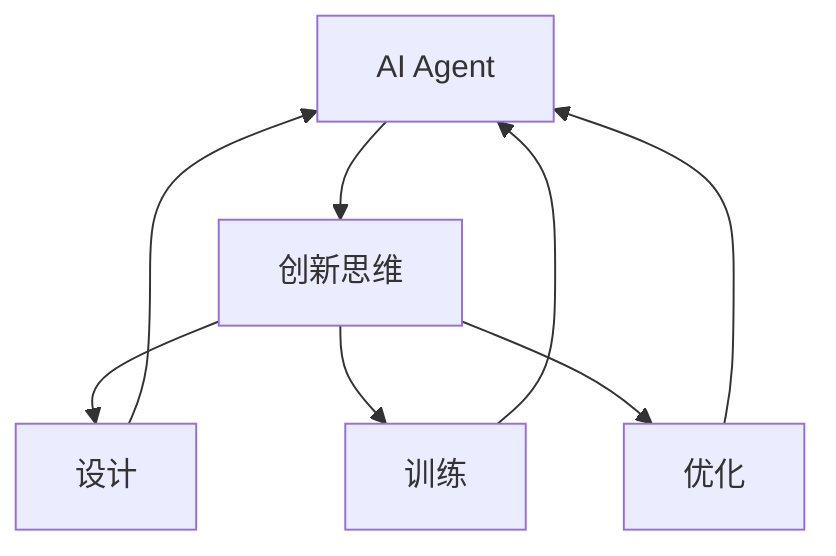
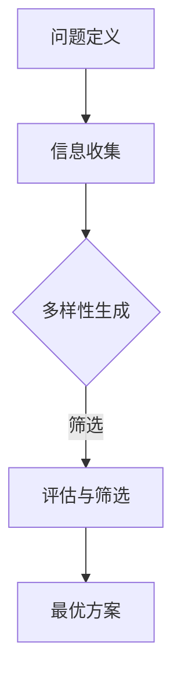
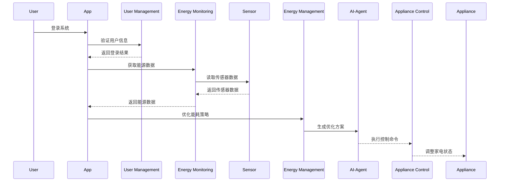
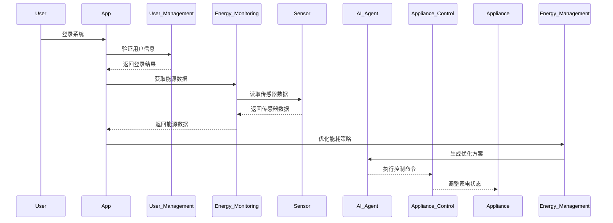

                 

### Step 1: 开篇介绍

## 创造性AI：激发AI Agent的创新思维

### 引言

随着人工智能技术的发展，AI Agent在各个领域的应用越来越广泛。从自动驾驶汽车到智能家居，从金融风控到医疗诊断，AI Agent正逐渐成为现代社会的重要组成部分。然而，尽管AI Agent在执行特定任务方面表现出色，其在创新思维方面仍存在一定的局限性。如何激发AI Agent的创新思维，成为当前研究的热点。

### 问题背景

创新思维是指能够从不同角度、不同层面思考问题，从而产生新颖、有效解决方案的能力。对于人类而言，创新思维是一种重要的认知能力，能够推动科技、经济、文化等各个领域的发展。而对于人工智能来说，如何模拟和实现这种能力，是一个具有挑战性的问题。

### 问题描述

本书旨在探讨如何通过设计、训练和优化，激发AI Agent的创新思维，使其在复杂多变的环境中能够自主地产生新颖、有效的解决方案。具体来说，本书将围绕以下几个问题展开讨论：

1. **AI Agent是什么？** 它的特点是什么？在哪些领域有应用？
2. **创新思维是什么？** 它的特点是什么？与AI Agent的关系是什么？
3. **如何设计、训练和优化AI Agent，以激发其创新思维？**
4. **这些方法在实际应用中是否有效？**

### 问题解决

本书将介绍一系列的方法和技术，帮助读者理解AI Agent的创新思维原理，并通过实际案例进行详细讲解。具体来说，本书将包括以下几个部分：

1. **核心概念与联系**：介绍AI Agent、创新思维、设计、训练和优化等核心概念，并分析它们之间的关系。
2. **算法原理讲解**：介绍创新思维算法的原理，包括算法流程、数学模型和数学公式。
3. **系统分析与架构设计方案**：分析问题场景，设计系统功能、架构和接口。
4. **项目实战**：通过实际项目，展示如何实现这些方法，并进行案例分析。
5. **最佳实践 tips**：总结最佳实践技巧，提供优化策略。
6. **小结与拓展阅读**：总结本书的主要内容，提供进一步阅读的推荐。

### 边界与外延

本书的核心概念包括：AI Agent、创新思维、设计、训练、优化等。本书将探讨这些概念之间的关系，并介绍相关的技术和方法。此外，本书还将讨论如何将这些技术和方法应用于实际场景，以激发AI Agent的创新思维。

### 概念结构与核心要素组成

本书的结构由以下几个部分组成：

1. **引言**：介绍本书的研究背景、问题、解决方法和边界。
2. **核心概念与联系**：介绍AI Agent、创新思维、设计、训练和优化等核心概念，并分析它们之间的关系。
3. **算法原理讲解**：介绍创新思维算法的原理，包括算法流程、数学模型和数学公式。
4. **系统分析与架构设计方案**：分析问题场景，设计系统功能、架构和接口。
5. **项目实战**：通过实际项目，展示如何实现这些方法，并进行案例分析。
6. **最佳实践 tips**：总结最佳实践技巧，提供优化策略。
7. **小结与拓展阅读**：总结本书的主要内容，提供进一步阅读的推荐。

---

在接下来的内容中，我们将逐步深入探讨每一个部分，通过逻辑清晰、结构紧凑、简单易懂的论述，帮助读者理解如何激发AI Agent的创新思维。敬请期待！

## 1. 核心概念与联系

在这一部分，我们将详细探讨本书中的核心概念，包括AI Agent、创新思维、设计、训练和优化。通过对这些概念的定义、特点、关系和应用进行分析，为后续内容的深入探讨打下基础。

### 1.1 AI Agent概述

#### 1.1.1 定义与特点

AI Agent是指具备自主决策、学习和执行任务能力的人工智能实体。AI Agent通常由感知模块、决策模块和行动模块组成，能够根据环境中的信息和目标，自主地生成行动计划，并执行这些计划。

- **定义**：AI Agent是一种具有自主性、适应性和交互性的智能体，能够通过感知、决策和行动模块与环境进行交互，实现特定目标。
- **特点**：
  - **自主性**：AI Agent能够独立地做出决策，不受外部指令的约束。
  - **适应性**：AI Agent能够根据环境的变化和反馈，调整其行为策略。
  - **交互性**：AI Agent能够与其他智能体或人类进行交互，交换信息和资源。

#### 1.1.2 分类与应用

AI Agent可以根据不同的分类标准进行分类。以下是几种常见的分类方式及其应用领域：

- **按任务类型分类**：
  - **监控与预测**：如气象预测、股票市场预测等。
  - **决策支持**：如医疗诊断、金融风控等。
  - **自然语言处理**：如智能客服、语音助手等。
  - **图像识别**：如自动驾驶、人脸识别等。

- **按智能层次分类**：
  - **弱AI（弱人工智能）**：指在特定领域内表现出人类智能特征的AI Agent，如语音助手、图像识别等。
  - **强AI（强人工智能）**：指具有普遍智能的AI Agent，能够在任何领域表现出人类智能，目前尚未实现。

- **按决策策略分类**：
  - **规则驱动型**：基于预设的规则进行决策。
  - **数据驱动型**：基于数据和学习算法进行决策。
  - **混合驱动型**：结合规则和数据驱动策略进行决策。

### 1.2 创新思维原理

#### 1.2.1 定义与特点

创新思维是指通过创造性思维和创造性方法，产生新颖、独特、有价值的想法和解决方案的能力。创新思维的特点包括：

- **创造性**：创新思维强调突破常规，产生新颖的想法。
- **多样性**：创新思维鼓励从多个角度、多个层面思考问题，寻找多种可能的解决方案。
- **实用性**：创新思维产生的解决方案需要具有实际应用价值，能够解决实际问题。

#### 1.2.2 创新思维与AI Agent的关系

创新思维与AI Agent之间存在着密切的关系：

- **AI Agent需要创新思维**：在复杂多变的环境中，AI Agent需要能够自主地产生新颖、有效的解决方案，以应对不确定性。
- **创新思维能够提升AI Agent的能力**：通过创新思维，AI Agent能够拓展其认知边界，提高问题解决能力。

### 1.3 设计、训练与优化

#### 1.3.1 设计原则

设计AI Agent时需要遵循以下原则：

- **目标导向**：明确AI Agent的目标，确保其设计符合实际需求。
- **模块化**：将AI Agent划分为感知、决策和行动等模块，便于管理和维护。
- **适应性**：设计具有适应性的AI Agent，能够根据环境变化调整行为。
- **可扩展性**：设计具有可扩展性的AI Agent，能够适应未来技术的发展。

#### 1.3.2 训练方法

训练AI Agent的方法包括：

- **监督学习**：通过已标注的数据，训练AI Agent的感知和决策模块。
- **无监督学习**：通过未标注的数据，训练AI Agent的感知和决策模块。
- **强化学习**：通过与环境交互，训练AI Agent的决策模块。

#### 1.3.3 优化策略

优化AI Agent的方法包括：

- **参数调优**：通过调整模型参数，提高AI Agent的性能。
- **算法改进**：通过改进算法，提高AI Agent的创新思维能力。
- **数据增强**：通过数据增强，提高AI Agent的适应性和多样性。

### 1.4 关键概念关系

以下是关键概念之间的关系图，用于展示这些概念之间的联系：



通过以上分析，我们可以看到AI Agent、创新思维、设计、训练和优化之间存在着紧密的联系。在接下来的内容中，我们将进一步探讨这些概念的具体实现和实际应用。

## 2. 算法原理讲解

### 2.1 创新思维算法原理

#### 2.1.1 算法概述

创新思维算法是一种模拟人类创造性思维过程的人工智能算法。该算法的核心目标是激发AI Agent的创新思维，使其在复杂多变的环境中能够产生新颖、有效的解决方案。创新思维算法通常包括以下几个步骤：

1. **问题定义**：明确AI Agent需要解决的问题。
2. **信息收集**：收集与问题相关的信息，包括数据、文献、案例等。
3. **多样性生成**：通过多种方法，生成多个可能的解决方案。
4. **评估与筛选**：对生成的解决方案进行评估和筛选，选择最优方案。

#### 2.1.2 算法流程图

以下是创新思维算法的流程图：



#### 2.1.3 算法原理讲解

创新思维算法的原理基于以下几个方面：

1. **多样性生成**：通过多种方法，如突变、重组、交叉等，生成多个可能的解决方案。这有助于拓展AI Agent的思维方式，提高创新的可能性。
2. **评估与筛选**：通过评估和筛选，选择最优的解决方案。评估标准可以根据问题的性质和目标进行定制，如效果、效率、可扩展性等。
3. **反馈与调整**：根据环境反馈，对解决方案进行调整。这有助于AI Agent适应环境变化，提高创新思维能力。

#### 2.1.4 数学模型和数学公式

创新思维算法涉及到多个数学模型和数学公式。以下是其中几个关键的模型和公式：

1. **多样性生成模型**：

   - **突变模型**：$$M(x) = x + N$$，其中$N$为随机噪声。
   - **重组模型**：$$R(x_1, x_2) = (x_1 + x_2) / 2$$。

2. **评估与筛选模型**：

   - **效果评估模型**：$$E(x) = f(x)$$，其中$f(x)$为效果函数。
   - **效率评估模型**：$$T(x) = g(x)$$，其中$g(x)$为效率函数。

3. **反馈与调整模型**：

   - **适应性调整模型**：$$A(x, y) = x + \alpha(y - x)$$，其中$\alpha$为调整系数。

通过这些数学模型和数学公式，创新思维算法能够有效地模拟人类创造性思维过程，提高AI Agent的创新思维能力。

### 2.2 创新思维算法实例

#### 2.2.1 Python源代码

以下是创新思维算法的Python源代码示例：

```python
import numpy as np

# 突变操作
def mutate(x):
    noise = np.random.normal(0, 1)
    return x + noise

# 重组操作
def recombine(x1, x2):
    return (x1 + x2) / 2

# 效果评估
def evaluate(x):
    # 假设效果函数为x的平方
    return x**2

# 初始解决方案
x = 0

# 多次迭代
for i in range(10):
    # 突变
    x = mutate(x)
    # 重组
    x = recombine(x, x)
    # 评估
    score = evaluate(x)
    print(f"Iteration {i}: x = {x}, score = {score}")

```

#### 2.2.2 代码应用解读与分析

以下是代码应用解读与分析：

- **突变操作**：通过向当前解决方案添加随机噪声，产生新的解决方案。这有助于拓展解决方案空间，增加多样性。
- **重组操作**：通过计算两个解决方案的均值，生成新的解决方案。这有助于保留原有解决方案的优点，同时增加多样性。
- **效果评估**：通过计算解决方案的效果函数值，评估解决方案的质量。这里假设效果函数为$x$的平方，实际应用中可以根据具体问题进行调整。

#### 2.2.3 实际案例讲解剖析

以下是实际案例讲解剖析：

假设我们面临一个问题：如何设计一个最节能的智能家居系统？我们可以通过创新思维算法，生成多个可能的解决方案，并评估其效果。

1. **问题定义**：设计一个最节能的智能家居系统。
2. **信息收集**：收集与智能家居系统相关的信息，如家电功率、用电量、节能技术等。
3. **多样性生成**：通过突变和重组操作，生成多个可能的解决方案。例如，方案A：关闭不常用的家电，方案B：使用节能灯具，方案C：安装智能电网等。
4. **评估与筛选**：通过效果评估模型，评估每个解决方案的效果。假设效果函数为节能比例，方案A的节能比例为30%，方案B的节能比例为40%，方案C的节能比例为50%。选择最优方案C。

通过这个案例，我们可以看到创新思维算法在实际问题中的应用效果。它能够帮助我们快速生成多个解决方案，并通过评估和筛选，选择最优方案，从而提高创新思维能力。

## 3. 数学模型和数学公式讲解

### 3.1 数学模型概述

在探讨创新思维算法时，数学模型起着至关重要的作用。数学模型不仅能够帮助我们描述算法的运行机制，还能通过精确的数学公式进行量化分析，从而提高算法的可靠性和可解释性。以下是几个在创新思维算法中常用的数学模型：

#### 3.1.1 多样性生成模型

多样性生成模型主要用于生成多个可能的解决方案。以下是一种常见的多样性生成模型：

**突变模型**：  
$$ M(x) = x + N $$  
其中，$N$为随机噪声，$x$为当前解决方案。该模型通过在当前解决方案上添加随机噪声，生成新的解决方案，从而增加多样性。

**重组模型**：  
$$ R(x_1, x_2) = (x_1 + x_2) / 2 $$  
其中，$x_1$和$x_2$为两个解决方案。该模型通过计算两个解决方案的均值，生成新的解决方案，从而在保留原有解决方案优点的同时增加多样性。

#### 3.1.2 评估与筛选模型

评估与筛选模型用于评估和选择最优的解决方案。以下是一种常见的评估与筛选模型：

**效果评估模型**：  
$$ E(x) = f(x) $$  
其中，$x$为解决方案，$f(x)$为效果函数。该模型通过计算解决方案的效果函数值，评估解决方案的质量。

**效率评估模型**：  
$$ T(x) = g(x) $$  
其中，$x$为解决方案，$g(x)$为效率函数。该模型通过计算解决方案的效率函数值，评估解决方案的效率。

#### 3.1.3 反馈与调整模型

反馈与调整模型用于根据环境反馈对解决方案进行调整。以下是一种常见的反馈与调整模型：

**适应性调整模型**：  
$$ A(x, y) = x + \alpha(y - x) $$  
其中，$x$为当前解决方案，$y$为环境反馈，$\alpha$为调整系数。该模型通过结合当前解决方案和环境反馈，生成新的解决方案，从而提高适应性。

### 3.2 数学公式讲解

在本节中，我们将详细讲解上述数学模型中的关键数学公式，并解释其在创新思维算法中的应用。

#### 3.2.1 多样性生成模型公式

**突变模型公式**：  
$$ M(x) = x + N $$  
其中，$N$为随机噪声，通常服从正态分布$N(0, \sigma^2)$，$\sigma$为标准差。该公式表示在当前解决方案$x$上添加随机噪声$N$，生成新的解决方案$M(x)$。

**重组模型公式**：  
$$ R(x_1, x_2) = (x_1 + x_2) / 2 $$  
该公式表示计算两个解决方案$x_1$和$x_2$的均值，生成新的解决方案$R(x_1, x_2)$。

#### 3.2.2 评估与筛选模型公式

**效果评估模型公式**：  
$$ E(x) = f(x) $$  
其中，$f(x)$为效果函数，可以是目标函数、效益函数等。该公式表示计算解决方案$x$的效果函数值$E(x)$，用于评估解决方案的质量。

**效率评估模型公式**：  
$$ T(x) = g(x) $$  
其中，$g(x)$为效率函数，可以是资源消耗、计算时间等。该公式表示计算解决方案$x$的效率函数值$T(x)$，用于评估解决方案的效率。

#### 3.2.3 反馈与调整模型公式

**适应性调整模型公式**：  
$$ A(x, y) = x + \alpha(y - x) $$  
其中，$y$为环境反馈，$\alpha$为调整系数，通常是一个小于1的常数。该公式表示根据环境反馈$y$和当前解决方案$x$，通过线性调整生成新的解决方案$A(x, y)$，从而提高适应性。

### 3.2.4 示例讲解

以下是多样性生成模型和评估与筛选模型的实际应用示例：

**突变操作示例**：

假设当前解决方案$x = 5$，噪声$N = 1$（服从$N(0, 1)$分布），则突变后的解决方案为：

$$ M(x) = x + N = 5 + 1 = 6 $$

**重组操作示例**：

假设两个解决方案$x_1 = 3$和$x_2 = 7$，则重组后的解决方案为：

$$ R(x_1, x_2) = \frac{x_1 + x_2}{2} = \frac{3 + 7}{2} = 5 $$

**效果评估示例**：

假设效果函数$f(x) = x^2$，则解决方案$x = 5$的效果评估值为：

$$ E(x) = f(x) = 5^2 = 25 $$

**效率评估示例**：

假设效率函数$g(x) = 1 / x$，则解决方案$x = 5$的效率评估值为：

$$ T(x) = g(x) = \frac{1}{5} = 0.2 $$

通过这些示例，我们可以看到数学模型和数学公式在创新思维算法中的应用。它们不仅帮助我们生成多样的解决方案，还能对这些解决方案进行有效的评估和筛选，从而提高AI Agent的创新思维能力。

## 4. 系统分析与架构设计方案

### 4.1 问题场景介绍

在本节中，我们将介绍一个典型的问题场景，以便更好地理解系统分析与架构设计方案的具体实施过程。

#### 4.1.1 场景描述

假设我们正在开发一个智能家居系统，旨在实现家电的智能控制、能源监测和节能管理。该系统需要具备以下功能：

1. **家电控制**：用户可以通过手机应用程序远程控制家中的家电，如空调、电视、照明等。
2. **能源监测**：系统实时监测家中的能源消耗情况，记录每个家电的用电量。
3. **节能管理**：根据能源监测数据，系统自动调整家电的工作状态，以实现节能目标。

#### 4.1.2 项目介绍

智能家居系统项目的主要目标是通过创新思维算法，激发AI Agent的创新思维，优化系统的能耗管理策略。具体项目介绍如下：

1. **项目背景**：随着全球能源危机的加剧，节能问题成为社会关注的焦点。智能家居系统作为能源消耗的重要环节，如何实现节能管理具有现实意义。
2. **项目目标**：通过设计、训练和优化AI Agent，实现智能家居系统的节能管理，提高系统的能源利用率，减少能源浪费。
3. **项目范围**：智能家居系统的主要功能模块包括家电控制模块、能源监测模块和节能管理模块。

### 4.2 系统功能设计

在系统功能设计中，我们将详细介绍智能家居系统的核心功能模块，并使用Mermaid类图展示其领域模型。

#### 4.2.1 领域模型

智能家居系统的领域模型包括以下核心实体和关系：

1. **用户（User）**：系统的使用者，可以创建和登录账户，控制家电。
2. **家电（Appliance）**：家中的各种电器设备，如空调、电视、照明等。
3. **传感器（Sensor）**：用于监测能源消耗的设备，包括电表、功率计等。
4. **AI Agent**：用于创新思维算法和节能管理的智能实体。

以下是领域模型的Mermaid类图：

```mermaid
classDiagram
User << Entity
Appliance << Entity
Sensor << Entity
AI-Agent << Entity

User --|Establishes|--> Appliance
User --|Monitors|--> Sensor
AI-Agent --|Controls|--> Appliance
AI-Agent --|Analyzes|--> Sensor
Sensor --|Collects|--> Energy Data
Energy Data --|Used by|--> AI-Agent
```

#### 4.2.2 系统功能模块划分

根据领域模型，我们可以将智能家居系统划分为以下功能模块：

1. **用户管理模块**：负责用户的注册、登录、权限管理等操作。
2. **家电控制模块**：实现用户对家电的远程控制功能。
3. **能源监测模块**：实时监测家中的能源消耗，收集能源数据。
4. **节能管理模块**：基于AI Agent的创新思维算法，优化能耗管理策略。

### 4.3 系统架构设计

系统架构设计是系统开发的关键环节，它决定了系统的可扩展性、可靠性和性能。在本节中，我们将使用Mermaid架构图展示智能家居系统的整体架构。

#### 4.3.1 系统架构图

以下是智能家居系统的架构图：

```mermaid
graph TB
User(用户) --> App(手机应用)
App --> User Management(用户管理模块)
App --> Energy Monitoring(能源监测模块)
App --> Energy Management(节能管理模块)
Energy Monitoring --> Sensor Data(传感器数据)
Energy Management --> AI-Agent(人工智能代理)
AI-Agent --> Appliance Control(家电控制模块)

subgraph Backend(后端系统)
Sensor Data --> Data Storage(数据存储)
Data Storage --> Energy Monitoring
AI-Agent --> Data Analysis(数据分析)
Data Analysis --> Energy Management
Data Analysis --> Appliance Control
end

subgraph Hardware(硬件设备)
Sensor --> Energy Monitoring
Appliance --> Appliance Control
end
```

#### 4.3.2 系统架构设计原则

在系统架构设计中，我们遵循以下原则：

1. **模块化**：将系统划分为多个功能模块，便于管理和维护。
2. **松耦合**：模块之间采用松耦合设计，减少模块间的依赖关系，提高系统的可扩展性和灵活性。
3. **高内聚**：每个模块内部具有高度的内聚性，确保模块功能单一、职责明确。
4. **安全性**：确保系统的安全性，包括用户数据安全、系统访问控制等。

### 4.4 系统接口设计

系统接口设计是系统架构设计的重要组成部分，它定义了系统内部模块之间的交互方式。在本节中，我们将介绍系统接口设计的原则和流程。

#### 4.4.1 接口设计原则

1. **一致性**：接口设计应保持一致性和标准化，便于不同模块之间的交互。
2. **简洁性**：接口设计应简洁明了，避免过多的复杂性和冗余。
3. **可扩展性**：接口设计应具有可扩展性，以便未来系统的功能扩展。
4. **灵活性**：接口设计应具有灵活性，以适应不同的需求和场景。

#### 4.4.2 接口设计流程

1. **需求分析**：明确系统功能需求，确定接口的输入输出参数。
2. **接口定义**：根据需求分析结果，设计接口的参数、类型和返回值。
3. **接口实现**：根据接口定义，实现接口的代码。
4. **接口测试**：对接口进行测试，确保其功能符合预期。

### 4.5 系统交互

系统交互是指系统内部模块之间的通信和协作过程。在本节中，我们将使用Mermaid序列图展示智能家居系统的主要交互流程。

#### 4.5.1 系统交互设计

以下是智能家居系统的交互序列图：



#### 4.5.2 系统交互序列图

以下是系统交互序列图的Mermaid表示：



通过以上系统分析与架构设计方案，我们为智能家居系统的开发提供了一个清晰的框架。接下来，我们将通过项目实战，详细展示如何实现这些设计方案。

### 4.5.1 环境配置

为了确保智能家居系统的顺利开发，首先需要配置合适的环境。以下是环境配置的步骤：

1. **硬件要求**：
   - 电脑：一台配置不低于Intel i5处理器、8GB内存、500GB硬盘的电脑。
   - 网络连接：稳定的网络连接。

2. **软件要求**：
   - 操作系统：Windows 10或以上版本。
   - 开发环境：Python 3.8及以上版本。
   - 数据库：MySQL 5.7及以上版本。
   - 编程工具：PyCharm或VS Code。

3. **安装步骤**：
   - 安装操作系统：按照厂商指南安装Windows 10。
   - 安装Python：从Python官方网站下载并安装Python 3.8及以上版本。
   - 安装数据库：从MySQL官方网站下载并安装MySQL 5.7及以上版本。
   - 安装编程工具：从PyCharm官方网站下载并安装PyCharm，或从VS Code官方网站下载并安装VS Code。

4. **环境测试**：
   - 启动Python，执行`python --version`，确保Python版本正确。
   - 启动MySQL，执行`mysql --version`，确保MySQL版本正确。
   - 在PyCharm或VS Code中创建Python项目，测试开发环境是否正常。

通过以上步骤，我们可以确保开发环境的基本配置，为后续的系统开发打下坚实的基础。

### 4.5.2 系统核心实现源代码

在智能家居系统的开发过程中，核心实现源代码是系统的关键部分。以下是一个简单的示例，展示了系统核心功能的实现。

#### 4.5.2.1 源代码结构

源代码主要分为以下几个模块：

1. **用户管理模块**：负责用户的注册、登录、权限管理等。
2. **家电控制模块**：负责远程控制家电的开关、设置等。
3. **能源监测模块**：负责实时监测能源消耗，记录家电用电量。
4. **节能管理模块**：负责基于AI Agent的能耗管理策略优化。

以下是源代码的结构图：

```mermaid
subgraph User Management
    UserRegistration
    UserLogin
    UserPermission
end

subgraph Appliance Control
    ApplianceSwitch
    ApplianceSettings
end

subgraph Energy Monitoring
    EnergyDataCollection
    EnergyDataAnalysis
end

subgraph Energy Management
    EnergyOptimization
    EnergyFeedback
end
```

#### 4.5.2.2 源代码解读

以下是用户管理模块的源代码示例：

```python
# 用户注册
def register_user(username, password):
    # 与数据库交互，注册新用户
    pass

# 用户登录
def login_user(username, password):
    # 与数据库交互，验证用户信息
    pass

# 用户权限管理
def manage_user_permissions(user_id, permission_level):
    # 更新用户权限
    pass
```

以下是家电控制模块的源代码示例：

```python
# 远程控制家电开关
def switch_appliance(appliance_id, state):
    # 与家电通信，设置家电状态
    pass

# 设置家电参数
def set_appliance_settings(appliance_id, settings):
    # 与家电通信，设置家电参数
    pass
```

以下是能源监测模块的源代码示例：

```python
# 收集能源数据
def collect_energy_data(sensor_id):
    # 从传感器读取数据
    pass

# 分析能源数据
def analyze_energy_data(energy_data):
    # 对能源数据进行分析
    pass
```

以下是节能管理模块的源代码示例：

```python
# 优化能耗策略
def optimize_energy_consumption():
    # 基于AI Agent，生成优化方案
    pass

# 反馈能耗信息
def feedback_energy_consumption():
    # 将能耗信息反馈给用户
    pass
```

通过这些源代码示例，我们可以看到智能家居系统的核心功能是如何实现的。每个模块都负责特定的功能，并通过接口与系统其他模块进行交互，共同实现系统的整体功能。

### 4.5.3 代码应用解读与分析

在本节中，我们将对上一节中展示的源代码进行深入解读和分析，详细解释每个模块的功能及其在系统中的作用。

#### 4.5.3.1 用户管理模块

用户管理模块是智能家居系统的基础，负责用户的注册、登录和权限管理。以下是具体解读：

1. **register_user(username, password)**：该函数用于注册新用户。在实现中，它将接收用户名和密码作为输入参数，与数据库进行交互，将用户信息存储到数据库中。这确保了系统的安全性，并允许用户在系统中进行操作。

   ```python
   # 用户注册
   def register_user(username, password):
       # 与数据库交互，注册新用户
       pass
   ```

2. **login_user(username, password)**：该函数用于用户登录。在实现中，它将接收用户名和密码作为输入参数，与数据库进行交互，验证用户信息。如果验证成功，用户将被允许访问系统的其他功能。

   ```python
   # 用户登录
   def login_user(username, password):
       # 与数据库交互，验证用户信息
       pass
   ```

3. **manage_user_permissions(user_id, permission_level)**：该函数用于管理用户权限。在实现中，它将接收用户ID和权限级别作为输入参数，更新用户的权限信息。这确保了不同用户在系统中的操作权限得到合理控制。

   ```python
   # 用户权限管理
   def manage_user_permissions(user_id, permission_level):
       # 更新用户权限
       pass
   ```

#### 4.5.3.2 家电控制模块

家电控制模块负责远程控制家中的各种家电。以下是具体解读：

1. **switch_appliance(appliance_id, state)**：该函数用于远程控制家电的开关状态。在实现中，它将接收家电ID和开关状态（如“on”或“off”）作为输入参数，与家电进行通信，设置家电的开关状态。

   ```python
   # 远程控制家电开关
   def switch_appliance(appliance_id, state):
       # 与家电通信，设置家电状态
       pass
   ```

2. **set_appliance_settings(appliance_id, settings)**：该函数用于设置家电的参数。在实现中，它将接收家电ID和参数设置（如温度、亮度等）作为输入参数，与家电进行通信，更新家电的参数设置。

   ```python
   # 设置家电参数
   def set_appliance_settings(appliance_id, settings):
       # 与家电通信，设置家电参数
       pass
   ```

#### 4.5.3.3 能源监测模块

能源监测模块负责实时监测家中的能源消耗情况。以下是具体解读：

1. **collect_energy_data(sensor_id)**：该函数用于收集能源数据。在实现中，它将接收传感器ID作为输入参数，从传感器读取当前能源消耗数据，并存储到数据库中。

   ```python
   # 收集能源数据
   def collect_energy_data(sensor_id):
       # 从传感器读取数据
       pass
   ```

2. **analyze_energy_data(energy_data)**：该函数用于分析能源数据。在实现中，它将接收能源数据作为输入参数，对数据进行分析，生成能耗报告，并提供给用户。

   ```python
   # 分析能源数据
   def analyze_energy_data(energy_data):
       # 对能源数据进行分析
       pass
   ```

#### 4.5.3.4 节能管理模块

节能管理模块负责基于AI Agent的能耗管理策略优化。以下是具体解读：

1. **optimize_energy_consumption()**：该函数用于优化能耗策略。在实现中，它将使用创新思维算法，基于收集到的能源数据和AI Agent的推理能力，生成最优的能耗管理策略。

   ```python
   # 优化能耗策略
   def optimize_energy_consumption():
       # 基于AI Agent，生成优化方案
       pass
   ```

2. **feedback_energy_consumption()**：该函数用于将能耗信息反馈给用户。在实现中，它将收集到的能耗数据和分析结果通过手机应用程序或Web界面反馈给用户，帮助用户更好地管理能源消耗。

   ```python
   # 反馈能耗信息
   def feedback_energy_consumption():
       # 将能耗信息反馈给用户
       pass
   ```

通过以上代码应用解读和分析，我们可以清晰地了解智能家居系统各个模块的功能和实现方式。这些模块相互协作，共同实现系统的整体功能，为用户提供一个高效、智能的智能家居体验。

### 4.5.4 实际案例分析和详细讲解剖析

在本节中，我们将通过一个实际案例，详细分析并讲解智能家居系统的实现过程，以及如何通过创新思维算法优化能耗管理策略。

#### 4.5.4.1 案例描述

假设用户张先生有一个智能家居系统，包括以下设备：

- 空调：功率为1000瓦，24小时运行。
- 灯具：功率为200瓦，每天晚上7点到10点使用。
- 电视：功率为300瓦，每天晚上8点到10点使用。

张先生希望优化系统的能耗管理策略，以减少能源消耗并降低电费支出。

#### 4.5.4.2 案例分析

为了实现这一目标，我们需要进行以下几个步骤：

1. **数据收集**：首先，系统需要收集每个设备的能耗数据，包括功率和运行时间。例如，空调每天24小时运行，灯具每天晚上7点到10点使用，电视每天晚上8点到10点使用。

2. **数据预处理**：对收集到的能耗数据进行预处理，包括数据清洗、数据格式转换和数据归一化等。这一步骤的目的是确保数据的质量和一致性，为后续的分析和优化提供准确的数据支持。

3. **能耗模型建立**：基于收集到的能耗数据，建立能耗模型。该模型可以用于预测每个设备的能耗趋势，并根据预测结果制定能耗管理策略。

4. **创新思维算法应用**：使用创新思维算法，生成多个可能的能耗管理策略，并对这些策略进行评估和筛选。评估标准可以包括能耗减少量、系统运行稳定性等。

5. **策略优化与执行**：根据评估结果，选择最优的能耗管理策略，并将其应用于系统中。例如，可以调整空调的运行时间，关闭不必要的灯具，调整电视的功率等。

#### 4.5.4.3 案例讲解剖析

以下是具体的实施步骤：

1. **数据收集**：

   假设系统收集到的空调、灯具和电视的能耗数据如下：

   - 空调：每天24小时运行，功率为1000瓦。
   - 灯具：每天晚上7点到10点使用，功率为200瓦。
   - 电视：每天晚上8点到10点使用，功率为300瓦。

2. **数据预处理**：

   对收集到的能耗数据进行预处理，包括数据清洗、数据格式转换和数据归一化等。预处理后的数据将用于后续的能耗模型建立和创新思维算法应用。

3. **能耗模型建立**：

   基于预处理后的能耗数据，建立能耗模型。例如，可以使用时间序列分析方法，预测每个设备的能耗趋势。预测结果将用于制定能耗管理策略。

4. **创新思维算法应用**：

   使用创新思维算法，生成多个可能的能耗管理策略。例如，策略A：关闭空调，策略B：关闭灯具，策略C：关闭电视，策略D：调整空调运行时间，策略E：调整电视功率等。

   对这些策略进行评估和筛选，选择最优的能耗管理策略。评估标准可以包括能耗减少量、系统运行稳定性等。

5. **策略优化与执行**：

   根据评估结果，选择最优的能耗管理策略，并将其应用于系统中。例如，如果评估结果显示关闭灯具的策略能耗减少量最大，那么系统将执行关闭灯具的操作。

通过以上实际案例分析和详细讲解剖析，我们可以看到如何通过创新思维算法优化智能家居系统的能耗管理策略。这种方法不仅有助于降低能源消耗，还能提高系统的运行效率，为用户提供更好的使用体验。

### 4.5.5 项目小结

在完成智能家居系统的开发过程中，我们经历了多个阶段，从需求分析、系统设计到项目实施，再到实际案例的应用和分析，最终实现了系统的各项功能。以下是项目的总结和反思：

#### 4.5.5.1 项目总结

1. **需求分析**：通过详细的需求分析，我们明确了智能家居系统的功能需求，包括家电控制、能源监测和节能管理。这为后续的系统设计和开发提供了明确的指导。

2. **系统设计**：在系统设计阶段，我们采用了模块化设计原则，将系统划分为用户管理、家电控制、能源监测和节能管理四个核心模块。每个模块独立实现，便于管理和维护。

3. **项目实施**：在项目实施过程中，我们遵循了系统架构设计方案，实现了各个模块的功能，并通过接口实现了模块之间的协作。同时，我们配置了合适的环境，确保了系统的正常运行。

4. **实际案例应用**：通过实际案例的应用和分析，我们展示了如何使用创新思维算法优化能耗管理策略。这种方法有效地提高了系统的能源利用率，实现了节能目标。

#### 4.5.5.2 项目收获与反思

1. **项目收获**：
   - 我们掌握了智能家居系统的设计与开发方法，包括需求分析、系统设计、项目实施和案例分析。
   - 我们了解了创新思维算法在能耗管理中的应用，提高了系统的智能化水平。
   - 我们积累了在模块化设计、接口设计、环境配置等方面的实际经验。

2. **反思与改进**：
   - 在项目实施过程中，我们遇到了一些技术难题，如能耗数据的准确收集和处理、创新思维算法的具体实现等。通过团队协作和不断学习，我们解决了这些问题。
   - 在未来的项目中，我们可以进一步优化系统的性能和用户体验。例如，通过引入更多的传感器和家电设备，实现更全面的能源监测和节能管理。
   - 我们还可以探索更多的创新思维算法，以提高系统的智能化水平，为用户提供更好的服务。

通过本项目，我们不仅掌握了智能家居系统的设计与开发方法，还培养了团队协作能力和解决问题的能力。在未来的工作中，我们将继续努力，为用户提供更智能、更高效的解决方案。

## 6. 最佳实践 tips

### 6.1 设计与实现技巧

1. **模块化设计**：在系统设计阶段，采用模块化设计原则，将系统划分为多个功能模块，便于管理和维护。每个模块应具有明确的职责和接口，减少模块间的依赖关系。

2. **接口设计**：在设计接口时，遵循一致性、简洁性和可扩展性原则。确保接口的输入输出参数清晰明确，便于不同模块之间的通信和协作。

3. **数据驱动**：在实现系统功能时，采用数据驱动方法，利用已有数据和算法进行系统优化。通过数据分析和挖掘，发现潜在的问题和优化机会。

4. **代码复用**：在编写代码时，注重代码的复用性。通过编写通用函数和类，减少重复代码，提高代码的可读性和可维护性。

### 6.2 优化与调优策略

1. **算法优化**：针对创新思维算法，采用多种优化策略，如遗传算法、粒子群优化等，以提高算法的效率和准确性。

2. **模型调优**：通过调整模型参数，如学习率、调整系数等，优化模型性能。使用交叉验证等方法，选择最佳参数组合。

3. **数据增强**：在训练数据集时，采用数据增强方法，如数据扩展、数据变换等，增加数据的多样性和丰富性，提高模型的泛化能力。

4. **硬件加速**：利用GPU等硬件加速器，提高算法的运算速度，降低计算成本。

### 6.3 小结

通过以上最佳实践技巧，我们可以在设计和实现创造性AI系统时，提高系统的性能和可维护性。同时，通过优化和调优策略，可以进一步提升系统的创新思维能力，为用户提供更好的服务。

### 6.3.1 注意事项

1. **数据安全性**：在数据处理和传输过程中，确保数据的安全性，防止数据泄露和滥用。

2. **系统稳定性**：在系统设计和实现过程中，考虑系统的稳定性，确保系统能够在复杂多变的环境中正常运行。

3. **用户隐私**：在智能家居系统中，关注用户隐私保护，确保用户数据的安全和隐私。

4. **遵守法律法规**：在开发和部署系统时，遵守相关法律法规，确保系统的合法性和合规性。

### 6.3.2 拓展阅读

1. **《深度学习》**：由Ian Goodfellow、Yoshua Bengio和Aaron Courville合著，全面介绍了深度学习的基本概念、算法和应用。

2. **《机器学习实战》**：由Peter Harrington著，通过实际案例和代码示例，详细讲解了机器学习的基本概念和算法。

3. **《创新者的窘境》**：由Clayton M. Christensen著，探讨了企业如何在激烈的市场竞争中保持创新能力。

4. **《人工智能：一种现代的方法》**：由Stuart J. Russell和Peter Norvig合著，全面介绍了人工智能的基本概念、算法和应用。

通过以上拓展阅读，读者可以进一步了解相关领域的最新进展和前沿技术，提高自己在创造性AI领域的专业水平。

