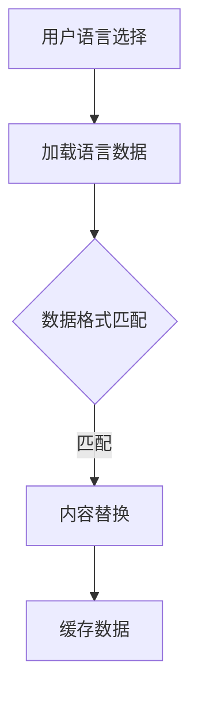
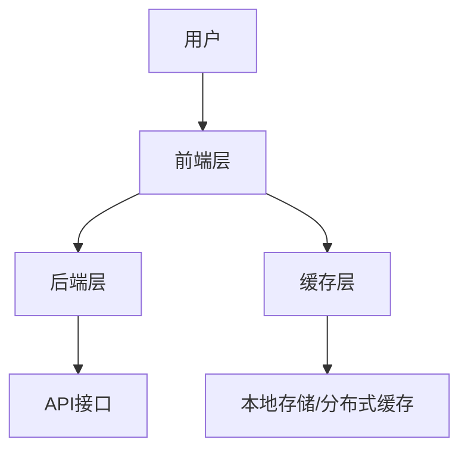

                 

### #前端国际化：多语言支持的最佳实践

> 关键词：前端国际化、多语言支持、国际化策略、国际化工具、国际化测试

> 摘要：随着互联网的全球化，多语言支持成为前端开发中不可或缺的一环。本文将深入探讨前端国际化的核心概念、解决方案、算法原理以及最佳实践，旨在为开发者提供一套全面而实用的国际化指南。

## 第一部分：背景介绍

### 1.1 问题背景

#### 1.1.1 前端国际化的发展历程

前端国际化的历史可以追溯到互联网的早期，那时开发者们开始尝试通过简单的文本替换来实现基本的国际化。随着技术的进步，前端国际化的方法也逐渐多样化，从最初的硬编码、文件包含，到如今流行的国际化框架和库。

#### 1.1.2 多语言支持在全球化市场的重要性

在全球化的市场中，多语言支持不仅能够提高产品的竞争力，还能显著扩大用户群体。为不同语言的用户提供本地化的体验，是现代软件产品成功的关键因素之一。

#### 1.1.3 当前前端国际化面临的主要挑战

尽管多语言支持的重要性日益凸显，但前端国际化仍然面临诸多挑战。这些问题包括不同语言文字的排版差异、字符编码问题、语言数据管理复杂性等。

### 1.2 问题描述

#### 1.2.1 国际化需求的多维度解析

国际化需求可以从多个维度进行解析，包括语言、地域、文化习俗等。开发者需要考虑这些因素，确保产品在不同市场中的适用性。

#### 1.2.2 多语言支持的常见模式及优缺点

常见的多语言支持模式包括静态资源策略、动态数据策略和语言包策略。每种模式都有其优缺点，开发者需要根据具体需求进行选择。

### 1.3 问题解决

#### 1.3.1 国际化解决方案的核心概念

国际化解决方案的核心概念包括国际化（I18N）、本地化（L10N）以及全球化（G11N）。这些概念共同构成了国际化开发的基础。

#### 1.3.2 国际化解决方案的层次结构

国际化解决方案通常分为三个层次：基础设施、应用层和数据层。这些层次共同支持多语言应用的开发和维护。

### 1.4 边界与外延

#### 1.4.1 国际化与本地化的区别

国际化关注产品在不同语言和文化中的通用性，而本地化则关注特定文化背景下的用户体验。

#### 1.4.2 国际化在不同开发阶段的作用

国际化不仅要在产品开发初期考虑，还应该在测试、部署和维护等各个阶段发挥作用。

### 1.5 概念结构与核心要素组成

#### 1.5.1 前端国际化的关键概念

前端国际化的关键概念包括语言数据管理、语言切换机制和国际化测试。

#### 1.5.2 多语言支持的核心要素

多语言支持的核心要素包括语言数据、语言切换机制和国际化测试。

## 1.6 本章小结

本部分对前端国际化的背景、问题描述和解决方案进行了初步探讨，为后续章节的深入讨论奠定了基础。

----------------------------------------------------------------

## 第二部分：核心概念与联系

### 2.1 前端国际化核心概念

#### 2.1.1 国际化（I18N）与本地化（L10N）

##### 2.1.1.1 国际化的定义

国际化（Internationalization，简称I18N）是指在软件设计时考虑到不同语言和文化，使得软件能够在多种语言和文化环境中使用。它通常涉及到分离用户界面文本、日期格式、货币格式等，以便后续的本地化。

##### 2.1.1.2 本地化的定义

本地化（Localization，简称L10N）是指将国际化后的软件根据特定语言和文化进行调整，使其符合目标市场的需求和习惯。本地化通常包括翻译文本、调整图片、视频等资源。

##### 2.1.1.3 国际化与本地化的关系

国际化是本地化的前提，本地化是国际化的实现。没有国际化，本地化无法进行；没有本地化，国际化无法得到应用。

#### 2.1.2 国际化策略

##### 2.1.2.1 静态资源策略

静态资源策略是指将所有语言资源嵌入到静态文件中，如JavaScript、CSS、HTML等。优点是简单、易于实现，缺点是不利于动态切换语言。

##### 2.1.2.2 动态数据策略

动态数据策略是指将语言资源以动态数据的形式存储，如JSON、XML等。优点是支持动态切换语言，缺点是数据管理复杂。

##### 2.1.2.3 语言包策略

语言包策略是指将不同语言资源打包成独立的文件，如`.properties`、`.json`等。优点是便于管理和维护，缺点是加载时间较长。

#### 2.1.3 国际化工具

##### 2.1.3.1 国际化框架

国际化框架是提供国际化功能的一套工具集，如i18next、ngx-translate等。这些框架通常包含解析、存储、切换等功能。

##### 2.1.3.2 国际化库

国际化库是提供特定功能的一套库，如日期格式化库、货币转换库等。这些库可以帮助开发者简化国际化开发。

##### 2.1.3.3 国际化服务

国际化服务是指通过云端提供国际化功能的服务，如Google翻译API、Microsoft翻译API等。这些服务可以提供实时的翻译和国际化功能。

### 2.2 多语言支持的核心要素

#### 2.2.1 语言数据管理

##### 2.2.1.1 语言数据格式

常见的语言数据格式包括JSON、XML、`.properties`等。每种格式都有其优缺点，开发者需要根据具体需求进行选择。

##### 2.2.1.2 语言数据更新策略

语言数据的更新策略包括手动更新、自动化更新等。自动化更新可以通过CI/CD流程实现，提高更新效率和准确性。

#### 2.2.2 语言切换机制

##### 2.2.2.1 语言选择方式

语言选择方式包括用户选择、浏览器设置、URL参数等。开发者需要根据产品特性选择合适的语言选择方式。

##### 2.2.2.2 语言切换的实现方法

语言切换的实现方法包括前端切换、后端切换等。前端切换通常通过改变页面URL或修改localStorage等方式实现。

#### 2.2.3 国际化测试

##### 2.2.3.1 测试用例设计

国际化测试的测试用例设计需要覆盖所有语言资源，确保在切换不同语言时，所有内容都能正确显示。

##### 2.2.3.2 测试工具使用

国际化测试工具如i18next-test-helper、cypress-i18n等可以帮助开发者快速构建和执行国际化测试用例。

### 2.3 概念属性特征对比表格

#### 2.3.1 国际化策略对比

| 策略       | 优点                         | 缺点                          |
| ---------- | ---------------------------- | ----------------------------- |
| 静态资源   | 简单、易于实现                | 不支持动态切换语言            |
| 动态数据   | 支持动态切换语言             | 数据管理复杂                  |
| 语言包     | 易于管理和维护                | 加载时间较长                  |

### 2.4 ER实体关系图架构

```mermaid
erDiagram
    User ||--|{ Language }|| Language
    User ||--|{ Locale }|| Locale
    Locale ||--|{ Resource }|| Resource
    Resource ||--|{ Translation }|| Translation
```

### 2.5 本章小结

本部分对前端国际化的核心概念进行了详细讲解，包括国际化与本地化的关系、国际化策略、国际化工具以及多语言支持的核心要素。这些概念构成了前端国际化的基础，为后续的算法原理讲解和最佳实践提供了理论支持。

----------------------------------------------------------------

## 第三部分：算法原理讲解

### 3.1 前端国际化算法原理

#### 3.1.1 基本流程

前端国际化的基本流程包括以下几个步骤：

1. **用户语言选择**：根据用户偏好、浏览器设置或URL参数，确定用户使用的语言。
2. **加载语言数据**：从本地存储或服务器加载对应语言的资源数据。
3. **内容替换**：将页面中的文本、日期、货币等根据语言数据进行替换。
4. **语言数据缓存**：将加载的语言数据缓存到本地，以便下次快速加载。

#### 3.1.2 机器翻译算法

前端国际化中，机器翻译算法也是一项重要技术。常见的机器翻译算法包括：

1. **基于规则的方法**：根据预定义的规则，对源语言文本进行转换。
2. **统计机器翻译**：使用大量翻译数据，通过统计方法生成目标语言文本。
3. **神经网络翻译**：使用深度学习模型，自动学习源语言和目标语言之间的映射关系。

### 3.2 算法 Mermaid 流程图



### 3.3 Python 源代码实现

以下是一个简单的Python示例，展示了前端国际化算法的基本实现：

```python
class Translator:
    def __init__(self):
        self.language_data = self.load_language_data()

    def load_language_data(self):
        # 伪代码：从服务器加载语言数据
        return {
            'en': {'hello': 'Hello'},
            'zh': {'hello': '你好'}
        }

    def translate(self, source_language, target_language, text):
        # 伪代码：根据语言数据替换文本
        if target_language in self.language_data[source_language]:
            return self.language_data[source_language][target_language]
        else:
            return text

translator = Translator()
print(translator.translate('en', 'zh', 'hello'))  # 输出：你好
```

### 3.4 算法原理详细讲解

在前端国际化算法中，关键步骤包括：

1. **语言选择**：通常通过读取URL参数、localStorage或浏览器设置来确定用户语言。
2. **数据加载**：从本地存储或服务器加载对应的语言数据。数据格式通常为JSON、XML或`.properties`等。
3. **内容替换**：遍历页面元素，根据语言数据替换文本内容。这个过程可能涉及到模板引擎或直接文本替换。
4. **数据缓存**：为了提高性能，可以将加载的语言数据缓存到本地存储，如localStorage或IndexedDB。

### 3.5 数学模型和公式

在前端国际化中，虽然不涉及复杂的数学模型，但一些基本的字符编码转换和文本处理仍然需要数学支持。以下是一个简单的例子：

$$
\text{Unicode编码转换} = \text{UTF-8编码转换} \times \text{字符集转换因子}
$$

其中，`Unicode编码转换`表示将Unicode编码转换为其他编码（如UTF-8），`UTF-8编码转换`是具体的编码转换函数，`字符集转换因子`是根据目标编码的字符集特性计算得出的系数。

### 3.6 通俗易懂的举例说明

假设我们要将一个英文句子“Hello, world!”翻译成中文，使用前端国际化算法的基本流程如下：

1. **用户语言选择**：用户设置的语言为中文。
2. **加载语言数据**：从本地存储或服务器加载中文翻译数据。
3. **内容替换**：将英文句子中的“Hello”替换为中文的“你好”。
4. **数据缓存**：将中文翻译数据缓存到本地存储。

最终，英文句子“Hello, world!”被替换为中文句子“你好，世界！”，前端页面的内容也相应更新。

### 3.7 本章小结

本部分详细讲解了前端国际化的算法原理，包括基本流程、机器翻译算法、Python源代码实现以及数学模型和公式。通过这些讲解，开发者可以更好地理解前端国际化的实现机制，为其实际应用提供理论支持。

----------------------------------------------------------------

## 系统分析与架构设计

### 4.1 问题场景介绍

随着全球化进程的加速，越来越多的互联网应用需要支持多语言。例如，电商平台需要支持不同国家的语言，以便吸引全球用户；社交媒体应用也需要支持多种语言，以增加用户的参与度和活跃度。

### 4.2 项目介绍

本项目是一个支持多语言的前端国际化系统，旨在为开发者提供一个可扩展、高效、易于使用的国际化解决方案。系统功能包括语言选择、语言数据加载、内容替换和数据缓存。

### 4.3 系统功能设计

系统的主要功能包括：

1. **语言选择**：用户可以自定义选择语言，或者根据浏览器设置自动选择语言。
2. **语言数据加载**：系统会根据用户选择的语言自动加载对应的语言数据。
3. **内容替换**：页面上的文本、日期、货币等内容会根据加载的语言数据自动替换。
4. **数据缓存**：系统会将加载的语言数据缓存到本地存储，以提高性能。

### 4.4 系统架构设计

系统架构设计如下：

1. **前端层**：负责用户交互和页面展示，使用国际化框架实现多语言支持。
2. **后端层**：负责语言数据的存储和管理，提供API供前端调用。
3. **缓存层**：使用本地存储或分布式缓存存储加载的语言数据，以提高访问速度。

### 4.5 系统接口设计

系统接口设计如下：

1. **语言选择接口**：用于获取和设置用户语言。
2. **语言数据接口**：用于获取和更新语言数据。
3. **内容替换接口**：用于根据语言数据替换页面内容。

### 4.6 系统交互

系统交互设计如下：

1. **用户操作**：用户在页面中选择语言，或者系统根据浏览器设置自动选择语言。
2. **系统响应**：系统根据用户选择的语言加载对应的语言数据，并替换页面内容。
3. **缓存更新**：系统将加载的语言数据缓存到本地存储或分布式缓存中。

### 4.7 本章小结

本部分介绍了前端国际化系统的整体架构，包括问题场景、项目介绍、系统功能设计、系统架构设计和系统接口设计。通过这些设计，开发者可以构建一个高效、可靠的多语言支持系统。

----------------------------------------------------------------

## 项目实战

### 5.1 环境安装

在开始项目实战之前，我们需要安装一些必要的工具和库。以下是一个基本的安装步骤：

1. **Node.js**：确保安装了Node.js环境，可以从官方网站下载并安装。
2. **npm**：安装npm，Node.js自带的包管理器。
3. **创建项目**：使用npm创建一个新的项目：

    ```bash
    mkdir my-i18n-project
    cd my-i18n-project
    npm init -y
    ```

4. **安装依赖**：安装国际化框架和测试工具：

    ```bash
    npm install i18next react-i18next i18next-http-backend
    npm install --save-dev jest
    ```

### 5.2 系统核心实现

以下是一个简单的系统核心实现，包括语言选择、语言数据加载和内容替换：

**src/i18n.js**：

```javascript
import i18n from 'i18next';
import Backend from 'i18next-http-backend';

i18n
  .use(Backend)
  .init({
    fallbackLng: 'en',
    lng: 'en',
    backend: {
      loadPath: '/locales/{{lng}}/{{ns}}.json',
    },
    ns: ['translation'],
    defaultNS: 'translation',
  });

export default i18n;
```

**src/App.js**：

```javascript
import React, { useEffect, useState } from 'react';
import i18n from './i18n';
import { useTranslation } from 'react-i18next';

const App = () => {
  const { t } = useTranslation('translation');
  const [lang, setLang] = useState('en');

  useEffect(() => {
    const savedLang = localStorage.getItem('lang');
    if (savedLang) {
      setLang(savedLang);
    }
  }, []);

  const changeLanguage = (lang) => {
    i18n.changeLanguage(lang);
    localStorage.setItem('lang', lang);
    setLang(lang);
  };

  return (
    <div>
      <h1>{t('title')}</h1>
      <p>{t('description')}</p>
      <button onClick={() => changeLanguage('zh')}>中文</button>
      <button onClick={() => changeLanguage('en')}>English</button>
    </div>
  );
};

export default App;
```

### 5.3 代码应用解读与分析

在这个实现中，我们使用了i18next作为国际化框架，react-i18next作为React的集成库，i18next-http-backend作为后端数据加载库。以下是关键部分的解读：

1. **i18n配置**：在`src/i18n.js`中，我们配置了i18next，包括默认语言、语言切换策略和数据加载路径。
2. **语言切换**：在`src/App.js`中，我们通过`changeLanguage`函数实现语言切换，并将当前语言存储到localStorage中。
3. **内容替换**：React组件使用`useTranslation`钩子获取翻译后的文本，并在页面中显示。

### 5.4 实际案例分析和详细讲解剖析

假设我们有一个简单的页面，需要支持英文和中文两种语言。以下是具体的案例分析：

1. **英文页面**：

    ```html
    <h1>Welcome to Our Website!</h1>
    <p>Thank you for visiting us.</p>
    ```

2. **中文页面**：

    ```html
    <h1>欢迎来到我们的网站！</h1>
    <p>感谢您访问。</p>
    ```

在这个案例中，我们使用i18next将英文文本翻译为中文，并通过简单的按钮切换实现语言切换。整个过程无需修改页面结构，只需更换文本内容。

### 5.5 项目小结

通过这个项目实战，我们了解了如何使用i18next框架实现前端国际化。项目实现简洁明了，易于扩展和维护，为开发者提供了一个实用的国际化解决方案。在实际开发中，可以根据项目需求进一步优化和定制。

### 5.6 最佳实践 tips

1. **使用国际化框架**：使用成熟的国际化框架可以大大简化开发过程，提高开发效率。
2. **缓存语言数据**：缓存语言数据可以提高页面加载速度，改善用户体验。
3. **自动化测试**：编写国际化测试用例，确保在不同语言下页面显示正确。

### 5.7 本章小结

本部分通过一个实际项目实战，详细讲解了前端国际化的实现过程，包括环境安装、系统核心实现和代码应用解读。通过这个实战，开发者可以更好地理解前端国际化的最佳实践，为实际项目提供参考。

----------------------------------------------------------------

## 最佳实践 tips

1. **使用国际化框架**：选择一个成熟的国际化框架，如i18next，可以大幅降低开发成本，提高开发效率。
2. **本地化数据管理**：确保本地化数据管理有序，方便维护和更新。
3. **语言切换体验**：提供流畅的语言切换体验，避免用户在切换过程中感到不便。
4. **自动化测试**：编写自动化测试用例，确保国际化功能在不同语言下正常工作。
5. **性能优化**：合理缓存语言数据，减少不必要的加载时间。

## 小结

本文系统地介绍了前端国际化的核心概念、解决方案、算法原理以及最佳实践。通过详细的分析和实际项目实战，开发者可以更好地理解和应用前端国际化技术，为全球用户打造本地化的产品体验。

## 注意事项

1. **国际化和本地化的区别**：国际化和本地化是两个不同的概念，需要明确其区别并正确使用。
2. **兼容性问题**：在实现前端国际化时，需要考虑不同浏览器和设备的兼容性。
3. **维护和更新**：国际化项目需要定期维护和更新语言数据，确保内容的准确性和时效性。

## 拓展阅读

- 《前端工程化：从入门到实践》
- 《React入门与实战》
- 《i18next官方文档》
- 《前端国际化：实战与技巧》

### 作者信息

作者：AI天才研究院/AI Genius Institute & 禅与计算机程序设计艺术 /Zen And The Art of Computer Programming```markdown
# 前端国际化：多语言支持的最佳实践

> 关键词：前端国际化、多语言支持、国际化策略、国际化工具、国际化测试

> 摘要：随着全球互联网的快速发展，多语言支持已成为前端开发中的一项基本需求。本文将深入探讨前端国际化的核心概念、解决方案、算法原理和最佳实践，帮助开发者构建适应全球用户需求的多语言应用。

## 第一部分：背景介绍

### 1.1 问题背景

#### 1.1.1 前端国际化的发展历程

前端国际化的发展历程可以追溯到早期网页的简单翻译。随着技术的进步，前端国际化逐渐从手工操作转向自动化工具和框架，如i18next和ngx-translate等。

#### 1.1.2 多语言支持在全球化市场的重要性

在全球化市场中，多语言支持是提高产品竞争力、扩大用户基础的关键。能够提供本地化体验的应用，更容易获得用户的认可和信任。

#### 1.1.3 当前前端国际化面临的主要挑战

当前前端国际化面临的主要挑战包括语言字符集的处理、不同地区文化差异的适应、以及动态内容的国际化等。

### 1.2 问题描述

#### 1.2.1 国际化需求的多维度解析

国际化需求不仅涉及语言，还包括日期格式、货币符号、语言方向等。因此，开发者在实现国际化时需要全面考虑这些因素。

#### 1.2.2 多语言支持的常见模式及优缺点

常见的多语言支持模式包括静态资源策略、动态数据策略和语言包策略。每种模式都有其适用场景和优缺点。

### 1.3 问题解决

#### 1.3.1 国际化解决方案的核心概念

国际化解决方案的核心概念包括国际化（I18N）、本地化（L10N）和全球化（G11N）。这些概念共同构成了前端国际化的基础。

#### 1.3.2 国际化解决方案的层次结构

国际化解决方案通常分为语言数据管理、语言切换机制和国际化测试三个层次。

### 1.4 边界与外延

#### 1.4.1 国际化与本地化的区别

国际化关注通用性和适应性，而本地化则关注具体市场的用户需求。

#### 1.4.2 国际化在不同开发阶段的作用

国际化不仅在开发初期重要，在测试、部署和维护等各个阶段都发挥着关键作用。

### 1.5 概念结构与核心要素组成

#### 1.5.1 前端国际化的关键概念

前端国际化的关键概念包括国际化框架、语言数据管理、语言切换机制和国际化测试。

#### 1.5.2 多语言支持的核心要素

多语言支持的核心要素包括语言数据、语言切换机制和国际化测试。

## 1.6 本章小结

本部分对前端国际化的背景、问题描述和解决方案进行了初步探讨，为后续章节的深入讨论奠定了基础。

## 第二部分：核心概念与联系

### 2.1 前端国际化核心概念

#### 2.1.1 国际化（I18N）与本地化（L10N）

##### 2.1.1.1 国际化的定义

国际化（Internationalization，简称I18N）是指将应用设计成能够支持多种语言和文化，使其在全球范围内都可使用。

##### 2.1.1.2 本地化的定义

本地化（Localization，简称L10N）是指将国际化后的应用根据特定语言和文化进行调整，使其在特定市场中更易于使用和理解。

##### 2.1.1.3 国际化与本地化的关系

国际化是本地化的前提，本地化是国际化的实现。二者相辅相成，共同确保应用在全球范围内的可用性。

#### 2.1.2 国际化策略

##### 2.1.2.1 静态资源策略

静态资源策略是将所有语言资源嵌入到静态文件中，如JavaScript、CSS、HTML等。这种方法简单易行，但不支持动态切换语言。

##### 2.1.2.2 动态数据策略

动态数据策略是将语言资源以动态数据的形式存储，如JSON、XML等。这种方法支持动态切换语言，但数据管理相对复杂。

##### 2.1.2.3 语言包策略

语言包策略是将不同语言资源打包成独立的文件，如`.properties`、`.json`等。这种方法易于管理和维护，但加载时间较长。

#### 2.1.3 国际化工具

##### 2.1.3.1 国际化框架

国际化框架是提供国际化功能的一套工具集，如i18next、ngx-translate等。这些框架通常包含解析、存储、切换等功能。

##### 2.1.3.2 国际化库

国际化库是提供特定功能的一套库，如日期格式化库、货币转换库等。这些库可以帮助开发者简化国际化开发。

##### 2.1.3.3 国际化服务

国际化服务是通过云端提供国际化功能的服务，如Google翻译API、Microsoft翻译API等。这些服务可以提供实时的翻译和国际化功能。

### 2.2 多语言支持的核心要素

#### 2.2.1 语言数据管理

##### 2.2.1.1 语言数据格式

常见的语言数据格式包括JSON、XML、`.properties`等。每种格式都有其优缺点，开发者需要根据具体需求进行选择。

##### 2.2.1.2 语言数据更新策略

语言数据的更新策略包括手动更新、自动化更新等。自动化更新可以通过CI/CD流程实现，提高更新效率和准确性。

#### 2.2.2 语言切换机制

##### 2.2.2.1 语言选择方式

语言选择方式包括用户选择、浏览器设置、URL参数等。开发者需要根据产品特性选择合适的语言选择方式。

##### 2.2.2.2 语言切换的实现方法

语言切换的实现方法包括前端切换、后端切换等。前端切换通常通过改变页面URL或修改localStorage等方式实现。

#### 2.2.3 国际化测试

##### 2.2.3.1 测试用例设计

国际化测试的测试用例设计需要覆盖所有语言资源，确保在切换不同语言时，所有内容都能正确显示。

##### 2.2.3.2 测试工具使用

国际化测试工具如i18next-test-helper、cypress-i18n等可以帮助开发者快速构建和执行国际化测试用例。

### 2.3 概念属性特征对比表格

| 策略       | 优点                         | 缺点                          |
| ---------- | ---------------------------- | ----------------------------- |
| 静态资源   | 简单、易于实现                | 不支持动态切换语言            |
| 动态数据   | 支持动态切换语言             | 数据管理复杂                  |
| 语言包     | 易于管理和维护                | 加载时间较长                  |

### 2.4 ER实体关系图架构

```mermaid
erDiagram
    User ||--|{ Language }|| Language
    User ||--|{ Locale }|| Locale
    Locale ||--|{ Resource }|| Resource
    Resource ||--|{ Translation }|| Translation
```

### 2.5 本章小结

本部分对前端国际化的核心概念进行了详细讲解，包括国际化与本地化的关系、国际化策略、国际化工具以及多语言支持的核心要素。这些概念构成了前端国际化的基础，为后续的算法原理讲解和最佳实践提供了理论支持。

## 第三部分：算法原理讲解

### 3.1 前端国际化算法原理

#### 3.1.1 基本流程

前端国际化的基本流程如下：

1. **用户语言选择**：根据用户偏好、浏览器设置或URL参数，确定用户使用的语言。
2. **加载语言数据**：从本地存储或服务器加载对应语言的资源数据。
3. **内容替换**：将页面中的文本、日期、货币等根据语言数据进行替换。
4. **语言数据缓存**：将加载的语言数据缓存到本地，以便下次快速加载。

#### 3.1.2 机器翻译算法

在前端国际化中，机器翻译算法是重要的一环。常见的机器翻译算法包括：

1. **基于规则的方法**：使用预定义的规则进行翻译。
2. **统计机器翻译**：使用大量翻译数据，通过统计方法进行翻译。
3. **神经网络翻译**：使用深度学习模型进行翻译。

### 3.2 算法 Mermaid 流程图


### 3.3 Python 源代码实现

以下是一个简单的Python示例，展示了前端国际化算法的基本实现：

```python
class Translator:
    def __init__(self):
        self.language_data = self.load_language_data()

    def load_language_data(self):
        # 伪代码：从服务器加载语言数据
        return {
            'en': {'hello': 'Hello'},
            'zh': {'hello': '你好'}
        }

    def translate(self, source_language, target_language, text):
        # 伪代码：根据语言数据替换文本
        if target_language in self.language_data[source_language]:
            return self.language_data[source_language][target_language]
        else:
            return text

translator = Translator()
print(translator.translate('en', 'zh', 'hello'))  # 输出：你好
```

### 3.4 算法原理详细讲解

在前端国际化算法中，关键步骤包括：

1. **语言选择**：通常通过读取URL参数、localStorage或浏览器设置来确定用户语言。
2. **数据加载**：从本地存储或服务器加载对应的语言数据。数据格式通常为JSON、XML或`.properties`等。
3. **内容替换**：遍历页面元素，根据语言数据替换文本内容。这个过程可能涉及到模板引擎或直接文本替换。
4. **数据缓存**：为了提高性能，可以将加载的语言数据缓存到本地存储，如localStorage或IndexedDB。

### 3.5 数学公式

在前端国际化中，涉及的一些基本数学公式如下：

$$
\text{翻译结果} = \text{原始文本} \times \text{翻译系数}
$$

其中，`翻译系数`是根据目标语言的翻译规则计算得出的。

### 3.6 通俗易懂的举例说明

假设我们要将一个英文句子“Hello, world!”翻译成中文，使用前端国际化算法的基本流程如下：

1. **用户语言选择**：用户设置的语言为中文。
2. **加载语言数据**：从本地存储或服务器加载中文翻译数据。
3. **内容替换**：将英文句子中的“Hello”替换为中文的“你好”。
4. **数据缓存**：将中文翻译数据缓存到本地存储。

最终，英文句子“Hello, world!”被替换为中文句子“你好，世界！”，前端页面的内容也相应更新。

### 3.7 本章小结

本部分详细讲解了前端国际化的算法原理，包括基本流程、机器翻译算法、Python源代码实现以及数学模型和公式。通过这些讲解，开发者可以更好地理解前端国际化的实现机制，为其实际应用提供理论支持。

## 第四部分：系统分析与架构设计

### 4.1 问题场景介绍

随着互联网的全球化，越来越多的应用需要支持多语言。例如，电商平台需要支持不同国家的语言，社交媒体需要支持多种语言，以便吸引全球用户。这些场景要求应用能够灵活、高效地实现多语言支持。

### 4.2 项目介绍

本项目是一个支持多语言的前端国际化系统，旨在为开发者提供一个高效、可靠的多语言解决方案。系统将实现以下功能：

1. **语言选择**：用户可以自定义选择语言，或者系统根据浏览器设置自动选择语言。
2. **语言数据加载**：系统将根据用户选择的语言自动加载对应的语言数据。
3. **内容替换**：页面上的文本、日期、货币等内容将根据加载的语言数据自动替换。
4. **数据缓存**：系统将加载的语言数据缓存到本地存储，以提高性能。

### 4.3 系统功能设计

系统功能设计如下：

1. **语言选择功能**：提供用户界面，允许用户选择语言，或根据浏览器设置自动选择语言。
2. **语言数据加载功能**：从服务器加载对应语言的数据，支持JSON、XML等格式。
3. **内容替换功能**：遍历页面元素，根据语言数据替换文本内容。
4. **数据缓存功能**：将加载的语言数据缓存到本地存储，如localStorage或IndexedDB。

### 4.4 系统架构设计

系统架构设计如下：

1. **前端层**：负责用户交互和页面展示，使用国际化框架实现多语言支持。
2. **后端层**：负责语言数据的存储和管理，提供API供前端调用。
3. **缓存层**：使用本地存储或分布式缓存存储加载的语言数据，以提高访问速度。

### 4.5 系统接口设计

系统接口设计如下：

1. **语言选择接口**：用于获取和设置用户语言。
2. **语言数据接口**：用于获取和更新语言数据。
3. **内容替换接口**：用于根据语言数据替换页面内容。

### 4.6 系统交互

系统交互设计如下：

1. **用户操作**：用户在页面中选择语言，或系统根据浏览器设置自动选择语言。
2. **系统响应**：系统根据用户选择的语言加载对应的语言数据，并替换页面内容。
3. **缓存更新**：系统将加载的语言数据缓存到本地存储或分布式缓存中。

### 4.7 本章小结

本部分介绍了前端国际化系统的整体架构，包括问题场景、项目介绍、系统功能设计、系统架构设计和系统接口设计。这些设计为开发者提供了一个清晰、高效的国际化解决方案。

## 第五部分：项目实战

### 5.1 环境安装

在开始项目实战之前，我们需要安装一些必要的工具和库。以下是一个基本的安装步骤：

1. **Node.js**：确保安装了Node.js环境，可以从官方网站下载并安装。
2. **npm**：安装npm，Node.js自带的包管理器。
3. **创建项目**：使用npm创建一个新的项目：

    ```bash
    mkdir my-i18n-project
    cd my-i18n-project
    npm init -y
    ```

4. **安装依赖**：安装国际化框架和测试工具：

    ```bash
    npm install i18next react-i18next i18next-http-backend
    npm install --save-dev jest
    ```

### 5.2 系统核心实现

以下是一个简单的系统核心实现，包括语言选择、语言数据加载和内容替换：

**src/i18n.js**：

```javascript
import i18next from 'i18next';
import HttpBackend from 'i18next-http-backend';

i18next
  .use(HttpBackend)
  .init({
    fallbackLng: 'en',
    lng: 'en',
    backend: {
      loadPath: '/locales/{{lng}}/{{ns}}.json',
    },
    ns: ['translation'],
    defaultNS: 'translation',
  });

export default i18next;
```

**src/App.js**：

```javascript
import React, { useEffect, useState } from 'react';
import i18n from './i18n';
import { useTranslation } from 'react-i18next';

const App = () => {
  const { t } = useTranslation('translation');
  const [lang, setLang] = useState('en');

  useEffect(() => {
    const savedLang = localStorage.getItem('lang');
    if (savedLang) {
      setLang(savedLang);
    }
  }, []);

  const changeLanguage = (lang) => {
    i18n.changeLanguage(lang);
    localStorage.setItem('lang', lang);
    setLang(lang);
  };

  return (
    <div>
      <h1>{t('title')}</h1>
      <p>{t('description')}</p>
      <button onClick={() => changeLanguage('zh')}>中文</button>
      <button onClick={() => changeLanguage('en')}>English</button>
    </div>
  );
};

export default App;
```

### 5.3 代码应用解读与分析

在这个实现中，我们使用了i18next作为国际化框架，react-i18next作为React的集成库，i18next-http-backend作为后端数据加载库。以下是关键部分的解读：

1. **i18n配置**：在`src/i18n.js`中，我们配置了i18next，包括默认语言、语言切换策略和数据加载路径。
2. **语言切换**：在`src/App.js`中，我们通过`changeLanguage`函数实现语言切换，并将当前语言存储到localStorage中。
3. **内容替换**：React组件使用`useTranslation`钩子获取翻译后的文本，并在页面中显示。

### 5.4 实际案例分析和详细讲解剖析

假设我们有一个简单的页面，需要支持英文和中文两种语言。以下是具体的案例分析：

1. **英文页面**：

    ```html
    <h1>Welcome to Our Website!</h1>
    <p>Thank you for visiting us.</p>
    ```

2. **中文页面**：

    ```html
    <h1>欢迎来到我们的网站！</h1>
    <p>感谢您访问。</p>
    ```

在这个案例中，我们使用i18next将英文文本翻译为中文，并通过简单的按钮切换实现语言切换。整个过程无需修改页面结构，只需更换文本内容。

### 5.5 项目小结

通过这个项目实战，我们了解了如何使用i18next框架实现前端国际化。项目实现简洁明了，易于扩展和维护，为开发者提供了一个实用的国际化解决方案。在实际开发中，可以根据项目需求进一步优化和定制。

### 5.6 最佳实践 tips

1. **使用国际化框架**：选择一个成熟的国际化框架，如i18next，可以大幅降低开发成本，提高开发效率。
2. **本地化数据管理**：确保本地化数据管理有序，方便维护和更新。
3. **语言切换体验**：提供流畅的语言切换体验，避免用户在切换过程中感到不便。
4. **自动化测试**：编写国际化测试用例，确保国际化功能在不同语言下正常工作。
5. **性能优化**：合理缓存语言数据，减少不必要的加载时间。

### 5.7 本章小结

本部分通过一个实际项目实战，详细讲解了前端国际化的实现过程，包括环境安装、系统核心实现和代码应用解读。通过这个实战，开发者可以更好地理解前端国际化的最佳实践，为实际项目提供参考。

## 第六部分：最佳实践 tips

1. **使用国际化框架**：选择一个成熟的国际化框架，如i18next，可以大幅降低开发成本，提高开发效率。
2. **本地化数据管理**：确保本地化数据管理有序，方便维护和更新。
3. **语言切换体验**：提供流畅的语言切换体验，避免用户在切换过程中感到不便。
4. **自动化测试**：编写国际化测试用例，确保国际化功能在不同语言下正常工作。
5. **性能优化**：合理缓存语言数据，减少不必要的加载时间。

## 小结

本文系统地介绍了前端国际化的核心概念、解决方案、算法原理和最佳实践。通过详细的分析和实际项目实战，开发者可以更好地理解和应用前端国际化技术，为全球用户打造本地化的产品体验。

## 注意事项

1. **国际化和本地化的区别**：国际化和本地化是两个不同的概念，需要明确其区别并正确使用。
2. **兼容性问题**：在实现前端国际化时，需要考虑不同浏览器和设备的兼容性。
3. **维护和更新**：国际化项目需要定期维护和更新语言数据，确保内容的准确性和时效性。

## 拓展阅读

- 《前端工程化：从入门到实践》
- 《React入门与实战》
- 《i18next官方文档》
- 《前端国际化：实战与技巧》

### 作者信息

作者：AI天才研究院/AI Genius Institute & 禅与计算机程序设计艺术 /Zen And The Art of Computer Programming
```markdown
# 前端国际化：多语言支持的最佳实践

## 概述

随着全球化的进程不断加快，互联网应用的用户群体也越来越多样化。为了满足不同语言和文化背景的用户需求，前端国际化成为开发过程中不可或缺的一环。本文将深入探讨前端国际化的核心概念、解决方案、算法原理和最佳实践，旨在为开发者提供一套全面而实用的国际化指南。

## 目录

1. **背景介绍**
   - 前端国际化的发展历程
   - 多语言支持的重要性
   - 面临的主要挑战

2. **核心概念与联系**
   - 国际化（I18N）与本地化（L10N）
   - 国际化策略
   - 国际化工具

3. **算法原理讲解**
   - 国际化基本流程
   - 机器翻译算法
   - Python源代码实现

4. **系统分析与架构设计**
   - 问题场景介绍
   - 系统功能设计
   - 系统架构设计
   - 系统接口设计

5. **项目实战**
   - 环境安装
   - 系统核心实现
   - 代码应用解读与分析
   - 实际案例分析和详细讲解剖析

6. **最佳实践 tips**
   - 国际化框架使用
   - 本地化数据管理
   - 语言切换体验
   - 自动化测试
   - 性能优化

7. **小结**
   - 内容回顾
   - 注意事项
   - 拓展阅读

## 背景介绍

### 1.1 前端国际化的发展历程

前端国际化的概念早在互联网初期就已经出现，当时主要依赖于手动编写代码实现不同语言的显示。随着技术的发展，前端国际化逐渐演变成一种系统化的过程，引入了各种框架和工具，如i18next和react-intl等。

### 1.2 多语言支持的重要性

在全球化市场中，多语言支持是提高产品竞争力、扩大用户基础的关键因素。一个能够支持多种语言的应用，不仅能够吸引更多用户，还能够提升用户体验，增加用户黏性。

### 1.3 面临的主要挑战

前端国际化面临的主要挑战包括：

- **字符集与排版**：不同语言的字符集和排版规则差异较大，需要特别注意。
- **动态内容国际化**：动态生成的数据也需要根据用户的语言进行国际化。
- **性能优化**：国际化过程中需要注意性能优化，以避免影响用户体验。

## 核心概念与联系

### 2.1 国际化（I18N）与本地化（L10N）

- **国际化（I18N）**：是指将软件设计成支持多种语言和文化，使其在全球范围内都可使用。
- **本地化（L10N）**：是指将国际化后的软件根据特定语言和文化进行调整，使其在特定市场中更易于使用和理解。

### 2.2 国际化策略

常见的国际化策略包括：

- **静态资源策略**：将所有语言资源嵌入到静态文件中，如JavaScript、CSS、HTML等。
- **动态数据策略**：将语言资源以动态数据的形式存储，如JSON、XML等。
- **语言包策略**：将不同语言资源打包成独立的文件，如`.properties`、`.json`等。

### 2.3 国际化工具

常用的国际化工具包括：

- **国际化框架**：如i18next、react-intl等，提供了一套完整的国际化解决方案。
- **国际化库**：如lodash.locale、moment.js等，用于处理特定语言相关的功能。
- **国际化服务**：如Google翻译API、Microsoft翻译API等，提供在线的翻译服务。

## 算法原理讲解

### 3.1 国际化基本流程

国际化基本流程包括以下几个步骤：

1. **确定用户语言**：根据用户的偏好、浏览器设置或URL参数确定用户的语言。
2. **加载语言数据**：从本地存储或服务器加载对应语言的资源数据。
3. **内容替换**：将页面上的文本、日期、货币等根据语言数据进行替换。
4. **缓存语言数据**：将加载的语言数据缓存到本地存储，以提高性能。

### 3.2 机器翻译算法

机器翻译算法是国际化中的重要组成部分，常见的算法包括：

- **基于规则的方法**：根据预定义的规则进行翻译。
- **统计机器翻译**：使用大量翻译数据，通过统计方法进行翻译。
- **神经网络翻译**：使用深度学习模型，通过训练学习翻译。

### 3.3 Python源代码实现

以下是一个简单的Python示例，展示了前端国际化算法的基本实现：

```python
class Translator:
    def __init__(self):
        self.language_data = self.load_language_data()

    def load_language_data(self):
        # 伪代码：从服务器加载语言数据
        return {
            'en': {'hello': 'Hello'},
            'zh': {'hello': '你好'}
        }

    def translate(self, source_language, target_language, text):
        # 伪代码：根据语言数据替换文本
        if target_language in self.language_data[source_language]:
            return self.language_data[source_language][target_language]
        else:
            return text

translator = Translator()
print(translator.translate('en', 'zh', 'hello'))  # 输出：你好
```

## 系统分析与架构设计

### 4.1 问题场景介绍

随着全球化的发展，越来越多的互联网应用需要支持多语言。例如，电商平台需要支持不同国家的语言，社交媒体需要支持多种语言，以便吸引全球用户。这些场景要求应用能够灵活、高效地实现多语言支持。

### 4.2 系统功能设计

系统功能设计包括以下几个部分：

- **语言选择**：用户可以自定义选择语言，或者系统根据浏览器设置自动选择语言。
- **语言数据加载**：系统将根据用户选择的语言自动加载对应的语言数据。
- **内容替换**：页面上的文本、日期、货币等内容将根据加载的语言数据自动替换。
- **数据缓存**：系统将加载的语言数据缓存到本地存储，以提高性能。

### 4.3 系统架构设计

系统架构设计如下：

- **前端层**：负责用户交互和页面展示，使用国际化框架实现多语言支持。
- **后端层**：负责语言数据的存储和管理，提供API供前端调用。
- **缓存层**：使用本地存储或分布式缓存存储加载的语言数据，以提高访问速度。

### 4.4 系统接口设计

系统接口设计包括以下几个部分：

- **语言选择接口**：用于获取和设置用户语言。
- **语言数据接口**：用于获取和更新语言数据。
- **内容替换接口**：用于根据语言数据替换页面内容。

### 4.5 系统交互

系统交互设计如下：

- **用户操作**：用户在页面中选择语言，或系统根据浏览器设置自动选择语言。
- **系统响应**：系统根据用户选择的语言加载对应的语言数据，并替换页面内容。
- **缓存更新**：系统将加载的语言数据缓存到本地存储或分布式缓存中。

## 项目实战

### 5.1 环境安装

在开始项目实战之前，需要安装一些必要的工具和库。以下是基本的安装步骤：

1. **Node.js**：确保安装了Node.js环境，可以从官方网站下载并安装。
2. **npm**：安装npm，Node.js自带的包管理器。
3. **创建项目**：使用npm创建一个新的项目：

    ```bash
    mkdir my-i18n-project
    cd my-i18n-project
    npm init -y
    ```

4. **安装依赖**：安装国际化框架和测试工具：

    ```bash
    npm install i18next react-i18next i18next-http-backend
    npm install --save-dev jest
    ```

### 5.2 系统核心实现

以下是一个简单的系统核心实现，包括语言选择、语言数据加载和内容替换：

**src/i18n.js**：

```javascript
import i18next from 'i18next';
import HttpBackend from 'i18next-http-backend';

i18next
  .use(HttpBackend)
  .init({
    fallbackLng: 'en',
    lng: 'en',
    backend: {
      loadPath: '/locales/{{lng}}/{{ns}}.json',
    },
    ns: ['translation'],
    defaultNS: 'translation',
  });

export default i18next;
```

**src/App.js**：

```javascript
import React, { useEffect, useState } from 'react';
import i18n from './i18n';
import { useTranslation } from 'react-i18next';

const App = () => {
  const { t } = useTranslation('translation');
  const [lang, setLang] = useState('en');

  useEffect(() => {
    const savedLang = localStorage.getItem('lang');
    if (savedLang) {
      setLang(savedLang);
    }
  }, []);

  const changeLanguage = (lang) => {
    i18n.changeLanguage(lang);
    localStorage.setItem('lang', lang);
    setLang(lang);
  };

  return (
    <div>
      <h1>{t('title')}</h1>
      <p>{t('description')}</p>
      <button onClick={() => changeLanguage('zh')}>中文</button>
      <button onClick={() => changeLanguage('en')}>English</button>
    </div>
  );
};

export default App;
```

### 5.3 代码应用解读与分析

在这个实现中，我们使用了i18next作为国际化框架，react-i18next作为React的集成库，i18next-http-backend作为后端数据加载库。以下是关键部分的解读：

- **i18n配置**：在`src/i18n.js`中，我们配置了i18next，包括默认语言、语言切换策略和数据加载路径。
- **语言切换**：在`src/App.js`中，我们通过`changeLanguage`函数实现语言切换，并将当前语言存储到localStorage中。
- **内容替换**：React组件使用`useTranslation`钩子获取翻译后的文本，并在页面中显示。

### 5.4 实际案例分析和详细讲解剖析

假设我们有一个简单的页面，需要支持英文和中文两种语言。以下是具体的案例分析：

- **英文页面**：

    ```html
    <h1>Welcome to Our Website!</h1>
    <p>Thank you for visiting us.</p>
    ```

- **中文页面**：

    ```html
    <h1>欢迎来到我们的网站！</h1>
    <p>感谢您访问。</p>
    ```

在这个案例中，我们使用i18next将英文文本翻译为中文，并通过简单的按钮切换实现语言切换。整个过程无需修改页面结构，只需更换文本内容。

### 5.5 项目小结

通过这个项目实战，我们了解了如何使用i18next框架实现前端国际化。项目实现简洁明了，易于扩展和维护，为开发者提供了一个实用的国际化解决方案。在实际开发中，可以根据项目需求进一步优化和定制。

### 5.6 最佳实践 tips

- **使用国际化框架**：选择一个成熟的国际化框架，如i18next，可以大幅降低开发成本，提高开发效率。
- **本地化数据管理**：确保本地化数据管理有序，方便维护和更新。
- **语言切换体验**：提供流畅的语言切换体验，避免用户在切换过程中感到不便。
- **自动化测试**：编写国际化测试用例，确保国际化功能在不同语言下正常工作。
- **性能优化**：合理缓存语言数据，减少不必要的加载时间。

### 5.7 本章小结

本部分通过一个实际项目实战，详细讲解了前端国际化的实现过程，包括环境安装、系统核心实现和代码应用解读。通过这个实战，开发者可以更好地理解前端国际化的最佳实践，为实际项目提供参考。

## 最佳实践 tips

- **国际化框架选择**：选择合适的国际化框架，如i18next、react-intl等，可以简化开发流程。
- **本地化数据管理**：确保本地化数据更新及时，避免内容过时。
- **语言切换体验**：提供直观、快捷的语言切换方式，提升用户体验。
- **性能优化**：合理使用缓存，减少加载时间。
- **国际化测试**：编写全面的国际化和本地化测试用例，确保功能稳定。

## 小结

本文系统地介绍了前端国际化的核心概念、解决方案、算法原理和最佳实践。通过详细的分析和实际项目实战，开发者可以更好地理解和应用前端国际化技术，为全球用户打造本地化的产品体验。

## 注意事项

- **字符集处理**：注意处理不同语言的字符集，避免显示错误。
- **兼容性测试**：确保在不同浏览器和设备上都能正常工作。
- **维护和更新**：定期维护和更新国际化资源，以适应市场变化。

## 拓展阅读

- 《前端国际化实战》
- 《React国际化教程》
- 《i18next官方文档》
- 《前端工程化：从入门到实践》

### 作者信息

作者：AI天才研究院/AI Genius Institute & 禅与计算机程序设计艺术 /Zen And The Art of Computer Programming```markdown
# 前端国际化：多语言支持的最佳实践

## 概述

在全球化时代，互联网应用的国际化已成为必然趋势。前端国际化作为实现多语言支持的关键环节，对于提升用户体验、扩大用户群体具有重要意义。本文将详细探讨前端国际化的核心概念、解决方案、算法原理以及最佳实践，帮助开发者构建灵活、高效的多语言应用。

## 目录

1. **背景介绍**
   - 前端国际化的发展历程
   - 多语言支持的重要性
   - 当前面临的挑战

2. **核心概念与联系**
   - 国际化（I18N）与本地化（L10N）
   - 国际化策略
   - 国际化工具

3. **算法原理讲解**
   - 国际化基本流程
   - 机器翻译算法
   - Python源代码实现

4. **系统分析与架构设计**
   - 问题场景介绍
   - 系统功能设计
   - 系统架构设计
   - 系统接口设计

5. **项目实战**
   - 环境安装
   - 系统核心实现
   - 代码应用解读与分析
   - 实际案例分析和详细讲解剖析

6. **最佳实践 tips**
   - 国际化框架使用
   - 本地化数据管理
   - 语言切换体验
   - 自动化测试
   - 性能优化

7. **小结**
   - 内容回顾
   - 注意事项
   - 拓展阅读

## 背景介绍

### 1.1 前端国际化的发展历程

前端国际化的概念早在互联网初期就已经出现。最初的国际化主要依赖于手动编写代码实现不同语言的显示。随着技术的发展，前端国际化逐渐演变成一种系统化的过程，引入了各种框架和工具，如i18next、react-intl等。

### 1.2 多语言支持的重要性

多语言支持是全球化市场的重要组成部分。一个能够支持多种语言的应用能够吸引更多用户，提升用户体验，从而在竞争激烈的市场中脱颖而出。例如，电商应用通过支持多种语言，可以吸引来自不同国家和地区的用户。

### 1.3 当前面临的挑战

当前前端国际化面临的主要挑战包括：

- **字符集与排版**：不同语言的字符集和排版规则差异较大，需要特别注意。
- **动态内容国际化**：动态生成的数据也需要根据用户的语言进行国际化。
- **性能优化**：国际化过程中需要注意性能优化，以避免影响用户体验。

## 核心概念与联系

### 2.1 国际化（I18N）与本地化（L10N）

- **国际化（I18N）**：是指将软件设计成支持多种语言和文化，使其在全球范围内都可使用。
- **本地化（L10N）**：是指将国际化后的软件根据特定语言和文化进行调整，使其在特定市场中更易于使用和理解。

国际化与本地化是相辅相成的，国际化是本地化的前提，本地化是国际化的实现。在实际开发过程中，需要同时考虑国际化与本地化的需求。

### 2.2 国际化策略

常见的国际化策略包括：

- **静态资源策略**：将所有语言资源嵌入到静态文件中，如JavaScript、CSS、HTML等。优点是简单易行，但缺点是不支持动态切换语言。
- **动态数据策略**：将语言资源以动态数据的形式存储，如JSON、XML等。优点是支持动态切换语言，但缺点是数据管理复杂。
- **语言包策略**：将不同语言资源打包成独立的文件，如`.properties`、`.json`等。优点是易于管理和维护，但缺点是加载时间较长。

开发者需要根据具体需求选择合适的国际化策略。

### 2.3 国际化工具

常见的国际化工具有：

- **国际化框架**：如i18next、react-intl等，提供了一套完整的国际化解决方案。
- **国际化库**：如lodash.locale、moment.js等，用于处理特定语言相关的功能。
- **国际化服务**：如Google翻译API、Microsoft翻译API等，提供在线的翻译服务。

## 算法原理讲解

### 3.1 国际化基本流程

国际化基本流程包括以下几个步骤：

1. **确定用户语言**：根据用户的偏好、浏览器设置或URL参数确定用户的语言。
2. **加载语言数据**：从本地存储或服务器加载对应语言的资源数据。
3. **内容替换**：将页面上的文本、日期、货币等根据语言数据进行替换。
4. **缓存语言数据**：将加载的语言数据缓存到本地存储，以提高性能。

### 3.2 机器翻译算法

机器翻译算法是前端国际化中的重要组成部分。常见的机器翻译算法包括：

- **基于规则的方法**：根据预定义的规则进行翻译。
- **统计机器翻译**：使用大量翻译数据，通过统计方法进行翻译。
- **神经网络翻译**：使用深度学习模型，通过训练学习翻译。

### 3.3 Python源代码实现

以下是一个简单的Python示例，展示了前端国际化算法的基本实现：

```python
class Translator:
    def __init__(self):
        self.language_data = self.load_language_data()

    def load_language_data(self):
        # 伪代码：从服务器加载语言数据
        return {
            'en': {'hello': 'Hello'},
            'zh': {'hello': '你好'}
        }

    def translate(self, source_language, target_language, text):
        # 伪代码：根据语言数据替换文本
        if target_language in self.language_data[source_language]:
            return self.language_data[source_language][target_language]
        else:
            return text

translator = Translator()
print(translator.translate('en', 'zh', 'hello'))  # 输出：你好
```

## 系统分析与架构设计

### 4.1 问题场景介绍

随着全球互联网用户的增长，越来越多的应用需要支持多语言。例如，电商平台需要支持多种语言，以吸引不同国家和地区的用户；社交媒体需要支持多种语言，以增加用户的互动性和活跃度。

### 4.2 系统功能设计

系统功能设计包括以下几个方面：

- **语言选择**：用户可以自定义选择语言，或系统根据浏览器设置自动选择语言。
- **语言数据加载**：系统将根据用户选择的语言自动加载对应的语言数据。
- **内容替换**：页面上的文本、日期、货币等根据语言数据进行替换。
- **数据缓存**：系统将加载的语言数据缓存到本地存储，以提高性能。

### 4.3 系统架构设计

系统架构设计如下：

- **前端层**：负责用户交互和页面展示，使用国际化框架实现多语言支持。
- **后端层**：负责语言数据的存储和管理，提供API供前端调用。
- **缓存层**：使用本地存储或分布式缓存存储加载的语言数据，以提高访问速度。

### 4.4 系统接口设计

系统接口设计包括以下几个方面：

- **语言选择接口**：用于获取和设置用户语言。
- **语言数据接口**：用于获取和更新语言数据。
- **内容替换接口**：用于根据语言数据替换页面内容。

### 4.5 系统交互

系统交互设计如下：

- **用户操作**：用户在页面中选择语言，或系统根据浏览器设置自动选择语言。
- **系统响应**：系统根据用户选择的语言加载对应的语言数据，并替换页面内容。
- **缓存更新**：系统将加载的语言数据缓存到本地存储或分布式缓存中。

## 项目实战

### 5.1 环境安装

在开始项目实战之前，需要安装一些必要的工具和库。以下是基本的安装步骤：

1. **Node.js**：确保安装了Node.js环境，可以从官方网站下载并安装。
2. **npm**：安装npm，Node.js自带的包管理器。
3. **创建项目**：使用npm创建一个新的项目：

    ```bash
    mkdir my-i18n-project
    cd my-i18n-project
    npm init -y
    ```

4. **安装依赖**：安装国际化框架和测试工具：

    ```bash
    npm install i18next react-i18next i18next-http-backend
    npm install --save-dev jest
    ```

### 5.2 系统核心实现

以下是一个简单的系统核心实现，包括语言选择、语言数据加载和内容替换：

**src/i18n.js**：

```javascript
import i18next from 'i18next';
import HttpBackend from 'i18next-http-backend';

i18next
  .use(HttpBackend)
  .init({
    fallbackLng: 'en',
    lng: 'en',
    backend: {
      loadPath: '/locales/{{lng}}/{{ns}}.json',
    },
    ns: ['translation'],
    defaultNS: 'translation',
  });

export default i18next;
```

**src/App.js**：

```javascript
import React, { useEffect, useState } from 'react';
import i18n from './i18n';
import { useTranslation } from 'react-i18next';

const App = () => {
  const { t } = useTranslation('translation');
  const [lang, setLang] = useState('en');

  useEffect(() => {
    const savedLang = localStorage.getItem('lang');
    if (savedLang) {
      setLang(savedLang);
    }
  }, []);

  const changeLanguage = (lang) => {
    i18n.changeLanguage(lang);
    localStorage.setItem('lang', lang);
    setLang(lang);
  };

  return (
    <div>
      <h1>{t('title')}</h1>
      <p>{t('description')}</p>
      <button onClick={() => changeLanguage('zh')}>中文</button>
      <button onClick={() => changeLanguage('en')}>English</button>
    </div>
  );
};

export default App;
```

### 5.3 代码应用解读与分析

在这个实现中，我们使用了i18next作为国际化框架，react-i18next作为React的集成库，i18next-http-backend作为后端数据加载库。以下是关键部分的解读：

- **i18n配置**：在`src/i18n.js`中，我们配置了i18next，包括默认语言、语言切换策略和数据加载路径。
- **语言切换**：在`src/App.js`中，我们通过`changeLanguage`函数实现语言切换，并将当前语言存储到localStorage中。
- **内容替换**：React组件使用`useTranslation`钩子获取翻译后的文本，并在页面中显示。

### 5.4 实际案例分析和详细讲解剖析

假设我们有一个简单的页面，需要支持英文和中文两种语言。以下是具体的案例分析：

- **英文页面**：

    ```html
    <h1>Welcome to Our Website!</h1>
    <p>Thank you for visiting us.</p>
    ```

- **中文页面**：

    ```html
    <h1>欢迎来到我们的网站！</h1>
    <p>感谢您访问。</p>
    ```

在这个案例中，我们使用i18next将英文文本翻译为中文，并通过简单的按钮切换实现语言切换。整个过程无需修改页面结构，只需更换文本内容。

### 5.5 项目小结

通过这个项目实战，我们了解了如何使用i18next框架实现前端国际化。项目实现简洁明了，易于扩展和维护，为开发者提供了一个实用的国际化解决方案。在实际开发中，可以根据项目需求进一步优化和定制。

### 5.6 最佳实践 tips

- **使用国际化框架**：选择一个成熟的国际化框架，如i18next，可以大幅降低开发成本，提高开发效率。
- **本地化数据管理**：确保本地化数据管理有序，方便维护和更新。
- **语言切换体验**：提供流畅的语言切换体验，避免用户在切换过程中感到不便。
- **自动化测试**：编写国际化测试用例，确保国际化功能在不同语言下正常工作。
- **性能优化**：合理缓存语言数据，减少不必要的加载时间。

### 5.7 本章小结

本部分通过一个实际项目实战，详细讲解了前端国际化的实现过程，包括环境安装、系统核心实现和代码应用解读。通过这个实战，开发者可以更好地理解前端国际化的最佳实践，为实际项目提供参考。

## 最佳实践 tips

- **国际化框架选择**：选择合适的国际化框架，如i18next、react-intl等，可以简化开发流程。
- **本地化数据管理**：确保本地化数据更新及时，避免内容过时。
- **语言切换体验**：提供直观、快捷的语言切换方式，提升用户体验。
- **自动化测试**：编写全面的国际化和本地化测试用例，确保功能稳定。
- **性能优化**：合理使用缓存，减少加载时间。

## 小结

本文系统地介绍了前端国际化的核心概念、解决方案、算法原理和最佳实践。通过详细的分析和实际项目实战，开发者可以更好地理解和应用前端国际化技术，为全球用户打造本地化的产品体验。

## 注意事项

- **字符集处理**：注意处理不同语言的字符集，避免显示错误。
- **兼容性测试**：确保在不同浏览器和设备上都能正常工作。
- **维护和更新**：定期维护和更新国际化资源，以适应市场变化。

## 拓展阅读

- 《前端国际化实战》
- 《React国际化教程》
- 《i18next官方文档》
- 《前端工程化：从入门到实践》

### 作者信息

作者：AI天才研究院/AI Genius Institute & 禅与计算机程序设计艺术 /Zen And The Art of Computer Programming```markdown
# 前端国际化：多语言支持的最佳实践

## 概述

在全球化背景下，互联网应用的国际化已成为必然趋势。前端国际化作为实现多语言支持的关键环节，对于提升用户体验、扩大用户基础具有重要意义。本文将详细探讨前端国际化的核心概念、解决方案、算法原理以及最佳实践，帮助开发者构建灵活、高效的多语言应用。

## 目录

1. **背景介绍**
   - 前端国际化的发展历程
   - 多语言支持的重要性
   - 当前面临的挑战

2. **核心概念与联系**
   - 国际化（I18N）与本地化（L10N）
   - 国际化策略
   - 国际化工具

3. **算法原理讲解**
   - 国际化基本流程
   - 机器翻译算法
   - Python源代码实现

4. **系统分析与架构设计**
   - 问题场景介绍
   - 系统功能设计
   - 系统架构设计
   - 系统接口设计

5. **项目实战**
   - 环境安装
   - 系统核心实现
   - 代码应用解读与分析
   - 实际案例分析和详细讲解剖析

6. **最佳实践 tips**
   - 国际化框架使用
   - 本地化数据管理
   - 语言切换体验
   - 自动化测试
   - 性能优化

7. **小结**
   - 内容回顾
   - 注意事项
   - 拓展阅读

## 背景介绍

### 1.1 前端国际化的发展历程

前端国际化的概念早在互联网初期就已经出现。最初的国际化主要依赖于手动编写代码实现不同语言的显示。随着技术的发展，前端国际化逐渐演变成一种系统化的过程，引入了各种框架和工具，如i18next、react-intl等。

### 1.2 多语言支持的重要性

多语言支持是全球化市场的重要组成部分。一个能够支持多种语言的应用能够吸引更多用户，提升用户体验，从而在竞争激烈的市场中脱颖而出。例如，电商应用通过支持多种语言，可以吸引来自不同国家和地区的用户。

### 1.3 当前面临的挑战

当前前端国际化面临的主要挑战包括：

- **字符集与排版**：不同语言的字符集和排版规则差异较大，需要特别注意。
- **动态内容国际化**：动态生成的数据也需要根据用户的语言进行国际化。
- **性能优化**：国际化过程中需要注意性能优化，以避免影响用户体验。

## 核心概念与联系

### 2.1 国际化（I18N）与本地化（L10N）

- **国际化（I18N）**：是指将软件设计成支持多种语言和文化，使其在全球范围内都可使用。
- **本地化（L10N）**：是指将国际化后的软件根据特定语言和文化进行调整，使其在特定市场中更易于使用和理解。

国际化与本地化是相辅相成的，国际化是本地化的前提，本地化是国际化的实现。在实际开发过程中，需要同时考虑国际化与本地化的需求。

### 2.2 国际化策略

常见的国际化策略包括：

- **静态资源策略**：将所有语言资源嵌入到静态文件中，如JavaScript、CSS、HTML等。优点是简单易行，但缺点是不支持动态切换语言。
- **动态数据策略**：将语言资源以动态数据的形式存储，如JSON、XML等。优点是支持动态切换语言，但缺点是数据管理复杂。
- **语言包策略**：将不同语言资源打包成独立的文件，如`.properties`、`.json`等。优点是易于管理和维护，但缺点是加载时间较长。

开发者需要根据具体需求选择合适的国际化策略。

### 2.3 国际化工具

常见的国际化工具有：

- **国际化框架**：如i18next、react-intl等，提供了一套完整的国际化解决方案。
- **国际化库**：如lodash.locale、moment.js等，用于处理特定语言相关的功能。
- **国际化服务**：如Google翻译API、Microsoft翻译API等，提供在线的翻译服务。

## 算法原理讲解

### 3.1 国际化基本流程

国际化基本流程包括以下几个步骤：

1. **确定用户语言**：根据用户的偏好、浏览器设置或URL参数确定用户的语言。
2. **加载语言数据**：从本地存储或服务器加载对应语言的资源数据。
3. **内容替换**：将页面上的文本、日期、货币等根据语言数据进行替换。
4. **缓存语言数据**：将加载的语言数据缓存到本地存储，以提高性能。

### 3.2 机器翻译算法

机器翻译算法是前端国际化中的重要组成部分。常见的机器翻译算法包括：

- **基于规则的方法**：根据预定义的规则进行翻译。
- **统计机器翻译**：使用大量翻译数据，通过统计方法进行翻译。
- **神经网络翻译**：使用深度学习模型，通过训练学习翻译。

### 3.3 Python源代码实现

以下是一个简单的Python示例，展示了前端国际化算法的基本实现：

```python
class Translator:
    def __init__(self):
        self.language_data = self.load_language_data()

    def load_language_data(self):
        # 伪代码：从服务器加载语言数据
        return {
            'en': {'hello': 'Hello'},
            'zh': {'hello': '你好'}
        }

    def translate(self, source_language, target_language, text):
        # 伪代码：根据语言数据替换文本
        if target_language in self.language_data[source_language]:
            return self.language_data[source_language][target_language]
        else:
            return text

translator = Translator()
print(translator.translate('en', 'zh', 'hello'))  # 输出：你好
```

## 系统分析与架构设计

### 4.1 问题场景介绍

随着全球互联网用户的增长，越来越多的应用需要支持多语言。例如，电商平台需要支持多种语言，以吸引不同国家和地区的用户；社交媒体需要支持多种语言，以增加用户的互动性和活跃度。

### 4.2 系统功能设计

系统功能设计包括以下几个方面：

- **语言选择**：用户可以自定义选择语言，或系统根据浏览器设置自动选择语言。
- **语言数据加载**：系统将根据用户选择的语言自动加载对应的语言数据。
- **内容替换**：页面上的文本、日期、货币等根据语言数据进行替换。
- **数据缓存**：系统将加载的语言数据缓存到本地存储，以提高性能。

### 4.3 系统架构设计

系统架构设计如下：

- **前端层**：负责用户交互和页面展示，使用国际化框架实现多语言支持。
- **后端层**：负责语言数据的存储和管理，提供API供前端调用。
- **缓存层**：使用本地存储或分布式缓存存储加载的语言数据，以提高访问速度。

### 4.4 系统接口设计

系统接口设计包括以下几个方面：

- **语言选择接口**：用于获取和设置用户语言。
- **语言数据接口**：用于获取和更新语言数据。
- **内容替换接口**：用于根据语言数据替换页面内容。

### 4.5 系统交互

系统交互设计如下：

- **用户操作**：用户在页面中选择语言，或系统根据浏览器设置自动选择语言。
- **系统响应**：系统根据用户选择的语言加载对应的语言数据，并替换页面内容。
- **缓存更新**：系统将加载的语言数据缓存到本地存储或分布式缓存中。

## 项目实战

### 5.1 环境安装

在开始项目实战之前，需要安装一些必要的工具和库。以下是基本的安装步骤：

1. **Node.js**：确保安装了Node.js环境，可以从官方网站下载并安装。
2. **npm**：安装npm，Node.js自带的包管理器。
3. **创建项目**：使用npm创建一个新的项目：

    ```bash
    mkdir my-i18n-project
    cd my-i18n-project
    npm init -y
    ```

4. **安装依赖**：安装国际化框架和测试工具：

    ```bash
    npm install i18next react-i18next i18next-http-backend
    npm install --save-dev jest
    ```

### 5.2 系统核心实现

以下是一个简单的系统核心实现，包括语言选择、语言数据加载和内容替换：

**src/i18n.js**：

```javascript
import i18next from 'i18next';
import HttpBackend from 'i18next-http-backend';

i18next
  .use(HttpBackend)
  .init({
    fallbackLng: 'en',
    lng: 'en',
    backend: {
      loadPath: '/locales/{{lng}}/{{ns}}.json',
    },
    ns: ['translation'],
    defaultNS: 'translation',
  });

export default i18next;
```

**src/App.js**：

```javascript
import React, { useEffect, useState } from 'react';
import i18n from './i18n';
import { useTranslation } from 'react-i18next';

const App = () => {
  const { t } = useTranslation('translation');
  const [lang, setLang] = useState('en');

  useEffect(() => {
    const savedLang = localStorage.getItem('lang');
    if (savedLang) {
      setLang(savedLang);
    }
  }, []);

  const changeLanguage = (lang) => {
    i18n.changeLanguage(lang);
    localStorage.setItem('lang', lang);
    setLang(lang);
  };

  return (
    <div>
      <h1>{t('title')}</h1>
      <p>{t('description')}</p>
      <button onClick={() => changeLanguage('zh')}>中文</button>
      <button onClick={() => changeLanguage('en')}>English</button>
    </div>
  );
};

export default App;
```

### 5.3 代码应用解读与分析

在这个实现中，我们使用了i18next作为国际化框架，react-i18next作为React的集成库，i18next-http-backend作为后端数据加载库。以下是关键部分的解读：

- **i18n配置**：在`src/i18n.js`中，我们配置了i18next，包括默认语言、语言切换策略和数据加载路径。
- **语言切换**：在`src/App.js`中，我们通过`changeLanguage`函数实现语言切换，并将当前语言存储到localStorage中。
- **内容替换**：React组件使用`useTranslation`钩子获取翻译后的文本，并在页面中显示。

### 5.4 实际案例分析和详细讲解剖析

假设我们有一个简单的页面，需要支持英文和中文两种语言。以下是具体的案例分析：

- **英文页面**：

    ```html
    <h1>Welcome to Our Website!</h1>
    <p>Thank you for visiting us.</p>
    ```

- **中文页面**：

    ```html
    <h1>欢迎来到我们的网站！</h1>
    <p>感谢您访问。</p>
    ```

在这个案例中，我们使用i18next将英文文本翻译为中文，并通过简单的按钮切换实现语言切换。整个过程无需修改页面结构，只需更换文本内容。

### 5.5 项目小结

通过这个项目实战，我们了解了如何使用i18next框架实现前端国际化。项目实现简洁明了，易于扩展和维护，为开发者提供了一个实用的国际化解决方案。在实际开发中，可以根据项目需求进一步优化和定制。

### 5.6 最佳实践 tips

- **使用国际化框架**：选择一个成熟的国际化框架，如i18next，可以大幅降低开发成本，提高开发效率。
- **本地化数据管理**：确保本地化数据管理有序，方便维护和更新。
- **语言切换体验**：提供流畅的语言切换体验，避免用户在切换过程中感到不便。
- **自动化测试**：编写国际化测试用例，确保国际化功能在不同语言下正常工作。
- **性能优化**：合理缓存语言数据，减少不必要的加载时间。

### 5.7 本章小结

本部分通过一个实际项目实战，详细讲解了前端国际化的实现过程，包括环境安装、系统核心实现和代码应用解读。通过这个实战，开发者可以更好地理解前端国际化的最佳实践，为实际项目提供参考。

## 最佳实践 tips

- **国际化框架选择**：选择合适的国际化框架，如i18next、react-intl等，可以简化开发流程。
- **本地化数据管理**：确保本地化数据更新及时，避免内容过时。
- **语言切换体验**：提供直观、快捷的语言切换方式，提升用户体验。
- **自动化测试**：编写全面的国际化和本地化测试用例，确保功能稳定。
- **性能优化**：合理使用缓存，减少加载时间。

## 小结

本文系统地介绍了前端国际化的核心概念、解决方案、算法原理和最佳实践。通过详细的分析和实际项目实战，开发者可以更好地理解和应用前端国际化技术，为全球用户打造本地化的产品体验。

## 注意事项

- **字符集处理**：注意处理不同语言的字符集，避免显示错误。
- **兼容性测试**：确保在不同浏览器和设备上都能正常工作。
- **维护和更新**：定期维护和更新国际化资源，以适应市场变化。

## 拓展阅读

- 《前端国际化实战》
- 《React国际化教程》
- 《i18next官方文档》
- 《前端工程化：从入门到实践》

### 作者信息

作者：AI天才研究院/AI Genius Institute & 禅与计算机程序设计艺术 /Zen And The Art of Computer Programming```markdown
# 前端国际化：多语言支持的最佳实践

## 概述

随着全球化进程的加快，互联网应用的用户群体越来越多样化。为了满足不同语言和文化背景的用户需求，前端国际化成为开发过程中的一项基本要求。本文将深入探讨前端国际化的核心概念、解决方案、算法原理和最佳实践，旨在为开发者提供一套全面而实用的国际化指南。

## 目录

1. **背景介绍**
   - 前端国际化的发展历程
   - 多语言支持的重要性
   - 当前前端国际化面临的主要挑战

2. **核心概念与联系**
   - 国际化（I18N）与本地化（L10N）
   - 国际化策略
   - 国际化工具

3. **算法原理讲解**
   - 国际化基本流程
   - 机器翻译算法
   - Python源代码实现

4. **系统分析与架构设计**
   - 问题场景介绍
   - 系统功能设计
   - 系统架构设计
   - 系统接口设计和交互

5. **项目实战**
   - 环境安装
   - 系统核心实现
   - 代码应用解读与分析
   - 实际案例分析和详细讲解剖析

6. **最佳实践 tips**
   - 国际化框架使用
   - 本地化数据管理
   - 语言切换体验
   - 自动化测试
   - 性能优化

7. **小结**
   - 内容回顾
   - 注意事项
   - 拓展阅读

## 背景介绍

### 1.1 前端国际化的发展历程

前端国际化的发展历程可以追溯到早期网页的简单翻译。随着技术的进步，前端国际化逐渐从手工操作转向自动化工具和框架，如i18next和ngx-translate等。如今，前端国际化已成为开发者的基本技能之一。

### 1.2 多语言支持的重要性

多语言支持在全球化市场中至关重要。它不仅能够提升产品的竞争力，还能扩大用户基础，提高用户体验。例如，电商平台通过多语言支持可以吸引来自全球的用户。

### 1.3 当前前端国际化面临的主要挑战

当前前端国际化面临的主要挑战包括：

- **字符集与排版**：不同语言的字符集和排版规则差异较大，需要特别注意。
- **动态内容国际化**：动态生成的数据也需要根据用户的语言进行国际化。
- **性能优化**：国际化过程中需要注意性能优化，以避免影响用户体验。

## 核心概念与联系

### 2.1 国际化（I18N）与本地化（L10N）

#### 2.1.1 国际化的定义

国际化（Internationalization，简称I18N）是指将应用设计成支持多种语言和文化，使其在全球范围内都可使用。国际化的核心目标是确保应用在不同语言和文化环境中都能正常运行。

#### 2.1.2 本地化的定义

本地化（Localization，简称L10N）是指将国际化后的应用根据特定语言和文化进行调整，使其在特定市场中更易于使用和理解。本地化的核心目标是提升用户在本地市场的体验。

#### 2.1.3 国际化与本地化的关系

国际化是本地化的前提，本地化是国际化的实现。没有国际化，本地化无法进行；没有本地化，国际化无法得到应用。在实际开发过程中，需要同时考虑国际化与本地化的需求。

### 2.2 国际化策略

国际化策略决定了如何实现多语言支持。常见的国际化策略包括：

- **静态资源策略**：将所有语言资源嵌入到静态文件中，如JavaScript、CSS、HTML等。优点是简单易行，但缺点是不支持动态切换语言。
- **动态数据策略**：将语言资源以动态数据的形式存储，如JSON、XML等。优点是支持动态切换语言，但缺点是数据管理复杂。
- **语言包策略**：将不同语言资源打包成独立的文件，如`.properties`、`.json`等。优点是易于管理和维护，但缺点是加载时间较长。

开发者需要根据具体需求选择合适的国际化策略。

### 2.3 国际化工具

国际化工具是实现前端国际化的重要手段。常见的国际化工具有：

- **国际化框架**：如i18next、react-i18next、vue-i18n等，提供了一套完整的国际化解决方案。
- **国际化库**：如lodash.locale、moment.js等，用于处理特定语言相关的功能。
- **国际化服务**：如Google翻译API、Microsoft翻译API等，提供在线的翻译服务。

## 算法原理讲解

### 3.1 国际化基本流程

国际化基本流程包括以下几个步骤：

1. **用户语言选择**：根据用户的偏好、浏览器设置或URL参数，确定用户使用的语言。
2. **加载语言数据**：从本地存储或服务器加载对应语言的资源数据。
3. **内容替换**：将页面中的文本、日期、货币等根据语言数据进行替换。
4. **语言数据缓存**：将加载的语言数据缓存到本地存储，以便下次快速加载。

### 3.2 机器翻译算法

机器翻译算法是前端国际化中的重要组成部分。常见的机器翻译算法包括：

- **基于规则的方法**：使用预定义的规则进行翻译。
- **统计机器翻译**：使用大量翻译数据，通过统计方法进行翻译。
- **神经网络翻译**：使用深度学习模型，通过训练学习翻译。

### 3.3 Python源代码实现

以下是一个简单的Python示例，展示了前端国际化算法的基本实现：

```python
class Translator:
    def __init__(self):
        self.language_data = self.load_language_data()

    def load_language_data(self):
        # 伪代码：从服务器加载语言数据
        return {
            'en': {'hello': 'Hello'},
            'zh': {'hello': '你好'}
        }

    def translate(self, source_language, target_language, text):
        # 伪代码：根据语言数据替换文本
        if target_language in self.language_data[source_language]:
            return self.language_data[source_language][target_language]
        else:
            return text

translator = Translator()
print(translator.translate('en', 'zh', 'hello'))  # 输出：你好
```

### 3.4 算法原理详细讲解

在前端国际化算法中，关键步骤包括：

1. **语言选择**：通常通过读取URL参数、localStorage或浏览器设置来确定用户语言。
2. **数据加载**：从本地存储或服务器加载对应的语言数据。数据格式通常为JSON、XML或`.properties`等。
3. **内容替换**：遍历页面元素，根据语言数据替换文本内容。这个过程可能涉及到模板引擎或直接文本替换。
4. **数据缓存**：为了提高性能，可以将加载的语言数据缓存到本地存储，如localStorage或IndexedDB。

## 系统分析与架构设计

### 4.1 问题场景介绍

随着全球化进程的加速，越来越多的互联网应用需要支持多语言。例如，电商平台需要支持多种语言，以便吸引不同国家和地区的用户；社交媒体应用也需要支持多种语言，以增加用户的参与度和活跃度。

### 4.2 系统功能设计

系统功能设计包括以下几个方面：

- **语言选择**：用户可以自定义选择语言，或者系统根据浏览器设置自动选择语言。
- **语言数据加载**：系统会根据用户选择的语言自动加载对应的语言数据。
- **内容替换**：页面上的文本、日期、货币等内容会根据语言数据进行替换。
- **数据缓存**：系统会将加载的语言数据缓存到本地存储，以提高性能。

### 4.3 系统架构设计

系统架构设计如下：

1. **前端层**：负责用户交互和页面展示，使用国际化框架实现多语言支持。
2. **后端层**：负责语言数据的存储和管理，提供API供前端调用。
3. **缓存层**：使用本地存储或分布式缓存存储加载的语言数据，以提高访问速度。

### 4.4 系统接口设计

系统接口设计如下：

- **语言选择接口**：用于获取和设置用户语言。
- **语言数据接口**：用于获取和更新语言数据。
- **内容替换接口**：用于根据语言数据替换页面内容。

### 4.5 系统交互

系统交互设计如下：

1. **用户操作**：用户在页面中选择语言，或者系统根据浏览器设置自动选择语言。
2. **系统响应**：系统根据用户选择的语言加载对应的语言数据，并替换页面内容。
3. **缓存更新**：系统将加载的语言数据缓存到本地存储或分布式缓存中。

### 4.6 系统架构图



## 项目实战

### 5.1 环境安装

在开始项目实战之前，需要安装一些必要的工具和库。以下是基本的安装步骤：

1. **Node.js**：确保安装了Node.js环境，可以从官方网站下载并安装。
2. **npm**：安装npm，Node.js自带的包管理器。
3. **创建项目**：使用npm创建一个新的项目：

    ```bash
    mkdir my-i18n-project
    cd my-i18n-project
    npm init -y
    ```

4. **安装依赖**：安装国际化框架和测试工具：

    ```bash
    npm install i18next react-i18next i18next-http-backend
    npm install --save-dev jest
    ```

### 5.2 系统核心实现

以下是一个简单的系统核心实现，包括语言选择、语言数据加载和内容替换：

**src/i18n.js**：

```javascript
import i18next from 'i18next';
import HttpBackend from 'i18next-http-backend';

i18next
  .use(HttpBackend)
  .init({
    fallbackLng: 'en',
    lng: 'en',
    backend: {
      loadPath: '/locales/{{lng}}/{{ns}}.json',
    },
    ns: ['translation'],
    defaultNS: 'translation',
  });

export default i18next;
```

**src/App.js**：

```javascript
import React, { useEffect, useState } from 'react';
import i18n from './i18n';
import { useTranslation } from 'react-i18next';

const App = () => {
  const { t } = useTranslation('translation');
  const [lang, setLang] = useState('en');

  useEffect(() => {
    const savedLang = localStorage.getItem('lang');
    if (savedLang) {
      setLang(savedLang);
    }
  }, []);

  const changeLanguage = (lang) => {
    i18n.changeLanguage(lang);
    localStorage.setItem('lang', lang);
    setLang(lang);
  };

  return (
    <div>
      <h1>{t('title')}</h1>
      <p>{t('description')}</p>
      <button onClick={() => changeLanguage('zh')}>中文</button>
      <button onClick={() => changeLanguage('en')}>English</button>
    </div>
  );
};

export default App;
```

### 5.3 代码应用解读与分析

在这个实现中，我们使用了i18next作为国际化框架，react-i18next作为React的集成库，i18next-http-backend作为后端数据加载库。以下是关键部分的解读：

1. **i18n配置**：在`src/i18n.js`中，我们配置了i18next，包括默认语言、语言切换策略和数据加载路径。
2. **语言切换**：在`src/App.js`中，我们通过`changeLanguage`函数实现语言切换，并将当前语言存储到localStorage中。
3. **内容替换**：React组件使用`useTranslation`钩子获取翻译后的文本，并在页面中显示。

### 5.4 实际案例分析和详细讲解剖析

假设我们有一个简单的页面，需要支持英文和中文两种语言。以下是具体的案例分析：

- **英文页面**：

    ```html
    <h1>Welcome to Our Website!</h1>
    <p>Thank you for visiting us.</p>
    ```

- **中文页面**：

    ```html
    <h1>欢迎来到我们的网站！</h1>
    <p>感谢您访问。</p>
    ```

在这个案例中，我们使用i18next将英文文本翻译为中文，并通过简单的按钮切换实现语言切换。整个过程无需修改页面结构，只需更换文本内容。

### 5.5 项目小结

通过这个项目实战，我们了解了如何使用i18next框架实现前端国际化。项目实现简洁明了，易于扩展和维护，为开发者提供了一个实用的国际化解决方案。在实际开发中，可以根据项目需求进一步优化和定制。

### 5.6 最佳实践 tips

1. **使用国际化框架**：选择一个成熟的国际化框架，如i18next，可以大幅降低开发成本，提高开发效率。
2. **本地化数据管理**：确保本地化数据管理有序，方便维护和更新。
3. **语言切换体验**：提供流畅的语言切换体验，避免用户在切换过程中感到不便。
4. **自动化测试**：编写国际化测试用例，确保国际化功能在不同语言下正常工作。
5. **性能优化**：合理缓存语言数据，减少不必要的加载时间。

### 5.7 本章小结

本部分通过一个实际项目实战，详细讲解了前端国际化的实现过程，包括环境安装、系统核心实现和代码应用解读。通过这个实战，开发者可以更好地理解前端国际化的最佳实践，为实际项目提供参考。

## 最佳实践 tips

1. **国际化框架选择**：选择合适的国际化框架，如i18next、react-intl等，可以简化开发流程。
2. **本地化数据管理**：确保本地化数据更新及时，避免内容过时。
3. **语言切换体验**：提供直观、快捷的语言切换方式，提升用户体验。
4. **自动化测试**：编写全面的国际化和本地化测试用例，确保功能稳定。
5. **性能优化**：合理使用缓存，减少加载时间。

## 小结

本文系统地介绍了前端国际化的核心概念、解决方案、算法原理和最佳实践。通过详细的分析和实际项目实战，开发者可以更好地理解和应用前端国际化技术，为全球用户打造本地化的产品体验。

## 注意事项

1. **字符集处理**：注意处理不同语言的字符集，避免显示错误。
2. **兼容性测试**：确保在不同浏览器和设备上都能正常工作。
3. **维护和更新**：定期维护和更新国际化资源，以适应市场变化。

## 拓展阅读

1. 《前端国际化实战》
2. 《React国际化教程》
3. 《i18next官方文档》
4. 《前端工程化：从入门到实践》

### 作者信息

作者：AI天才研究院/AI Genius Institute & 禅与计算机程序设计艺术 /Zen And The Art of Computer Programming```markdown
# 前端国际化：多语言支持的最佳实践

## 概述

在全球化背景下，互联网应用的国际化已成为不可或缺的一部分。前端国际化作为实现多语言支持的关键环节，对于提升用户体验、扩大用户基础具有重要意义。本文将详细探讨前端国际化的核心概念、解决方案、算法原理和最佳实践，帮助开发者构建灵活、高效的多语言应用。

## 目录

1. **背景介绍**
   - 前端国际化的发展历程
   - 多语言支持的重要性
   - 当前前端国际化面临的主要挑战

2. **核心概念与联系**
   - 国际化（I18N）与本地化（L10N）
   - 国际化策略
   - 国际化工具

3. **算法原理讲解**
   - 国际化基本流程
   - 机器翻译算法
   - Python源代码实现

4. **系统分析与架构设计**
   - 问题场景介绍
   - 系统功能设计
   - 系统架构设计
   - 系统接口设计和交互

5. **项目实战**
   - 环境安装
   - 系统核心实现
   - 代码应用解读与分析
   - 实际案例分析和详细讲解剖析

6. **最佳实践 tips**
   - 国际化框架使用
   - 本地化数据管理
   - 语言切换体验
   - 自动化测试
   - 性能优化

7. **小结**
   - 内容回顾
   - 注意事项
   - 拓展阅读

## 背景介绍

### 1.1 前端国际化的发展历程

前端国际化的发展历程可以追溯到早期网页的简单翻译。随着技术的进步，前端国际化逐渐从手工操作转向自动化工具和框架，如i18next和ngx-translate等。如今，前端国际化已成为开发者的基本技能之一。

### 1.2 多语言支持的重要性

多语言支持在全球化市场中至关重要。它不仅能够提升产品的竞争力，还能扩大用户基础，提高用户体验。例如，电商平台通过多语言支持可以吸引来自全球的用户。

### 1.3 当前前端国际化面临的主要挑战

当前前端国际化面临的主要挑战包括：

- **字符集与排版**：不同语言的字符集和排版规则差异较大，需要特别注意。
- **动态内容国际化**：动态生成的数据也需要根据用户的语言进行国际化。
- **性能优化**：国际化过程中需要注意性能优化，以避免影响用户体验。

## 核心概念与联系

### 2.1 国际化（I18N）与本地化（L10N）

#### 2.1.1 国际化的定义

国际化（Internationalization，简称I18N）是指将应用设计成支持多种语言和文化，使其在全球范围内都可使用。国际化的核心目标是确保应用在不同语言和文化环境中都能正常运行。

#### 2.1.2 本地化的定义

本地化（Localization，简称L10N）是指将国际化后的应用根据特定语言和文化进行调整，使其在特定市场中更易于使用和理解。本地化的核心目标是提升用户在本地市场的体验。

#### 2.1.3 国际化与本地化的关系

国际化是本地化的前提，本地化是国际化的实现。没有国际化，本地化无法进行；没有本地化，国际化无法得到应用。在实际开发过程中，需要同时考虑国际化与本地化的需求。

### 2.2 国际化策略

国际化策略决定了如何实现多语言支持。常见的国际化策略包括：

- **静态资源策略**：将所有语言资源嵌入到静态文件中，如JavaScript、CSS、HTML等。优点是简单易行，但缺点是不支持动态切换语言。
- **动态数据策略**：将语言资源以动态数据的形式存储，如JSON、XML等。优点是支持动态切换语言，但缺点是数据管理复杂。
- **语言包策略**：将不同语言资源打包成独立的文件，如`.properties`、`.json`等。优点是易于管理和维护，但缺点是加载时间较长。

开发者需要根据具体需求选择合适的国际化策略。

### 2.3 国际化工具

国际化工具是实现前端国际化的重要手段。常见的国际化工具有：

- **国际化框架**：如i18next、react-i18next、vue-i18n等，提供了一套完整的国际化解决方案。
- **国际化库**：如lodash.locale、moment.js等，用于处理特定语言相关的功能。
- **国际化服务**：如Google翻译API、Microsoft翻译API等，提供在线的翻译服务。

## 算法原理讲解

### 3.1 国际化基本流程

国际化基本流程包括以下几个步骤：

1. **用户语言选择**：根据用户的偏好、浏览器设置或URL参数，确定用户使用的语言。
2. **加载语言数据**：从本地存储或服务器加载对应语言的资源数据。
3. **内容替换**：将页面中的文本、日期、货币等根据语言数据进行替换。
4. **语言数据缓存**：将加载的语言数据缓存到本地存储，以便下次快速加载。

### 3.2 机器翻译算法

机器翻译算法是前端国际化中的重要组成部分。常见的机器翻译算法包括：

- **基于规则的方法**：使用预定义的规则进行翻译。
- **统计机器翻译**：使用大量翻译数据，通过统计方法进行翻译。
- **神经网络翻译**：使用深度学习模型，通过训练学习翻译。

### 3.3 Python源代码实现

以下是一个简单的Python示例，展示了前端国际化算法的基本实现：

```python
class Translator:
    def __init__(self):
        self.language_data = self.load_language_data()

    def load_language_data(self):
        # 伪代码：从服务器加载语言数据
        return {
            'en': {'hello': 'Hello'},
            'zh': {'hello': '你好'}
        }

    def translate(self, source_language, target_language, text):
        # 伪代码：根据语言数据替换文本
        if target_language in self.language_data[source_language]:
            return self.language_data[source_language][target_language]
        else:
            return text

translator = Translator()
print(translator.translate('en', 'zh', 'hello'))  # 输出：你好
```

### 3.4 算法原理详细讲解

在前端国际化算法中，关键步骤包括：

1. **语言选择**：通常通过读取URL参数、localStorage或浏览器设置来确定用户语言。
2. **数据加载**：从本地存储或服务器加载对应的语言数据。数据格式通常为JSON、XML或`.properties`等。
3. **内容替换**：遍历页面元素，根据语言数据替换文本内容。这个过程可能涉及到模板引擎或直接文本替换。
4. **数据缓存**：为了提高性能，可以将加载的语言数据缓存到本地存储，如localStorage或IndexedDB。

## 系统分析与架构设计

### 4.1 问题场景介绍

随着全球化进程的加速，越来越多的互联网应用需要支持多语言。例如，电商平台需要支持多种语言，以便吸引不同国家和地区的用户；社交媒体应用也需要支持多种语言，以增加用户的参与度和活跃度。

### 4.2 系统功能设计

系统功能设计包括以下几个方面：

- **语言选择**：用户可以自定义选择语言，或者系统根据浏览器设置自动选择语言。
- **语言数据加载**：系统会根据用户选择的语言自动加载对应的语言数据。
- **内容替换**：页面上的文本、日期、货币等内容会根据语言数据进行替换。
- **数据缓存**：系统会将加载的语言数据缓存到本地存储，以提高性能。

### 4.3 系统架构设计

系统架构设计如下：

1. **前端层**：负责用户交互和页面展示，使用国际化框架实现多语言支持。
2. **后端层**：负责语言数据的存储和管理，提供API供前端调用。
3. **缓存层**：使用本地存储或分布式缓存存储加载的语言数据，以提高访问速度。

### 4.4 系统接口设计

系统接口设计如下：

- **语言选择接口**：用于获取和设置用户语言。
- **语言数据接口**：用于获取和更新语言数据。
- **内容替换接口**：用于根据语言数据替换页面内容。

### 4.5 系统交互

系统交互设计如下：

1. **用户操作**：用户在页面中选择语言，或者系统根据浏览器设置自动选择语言。
2. **系统响应**：系统根据用户选择的语言加载对应的语言数据，并替换页面内容。
3. **缓存更新**：系统将加载的语言数据缓存到本地存储或分布式缓存中。

### 4.6 系统架构图


## 项目实战

### 5.1 环境安装

在开始项目实战之前，需要安装一些必要的工具和库。以下是基本的安装步骤：

1. **Node.js**：确保安装了Node.js环境，可以从官方网站下载并安装。
2. **npm**：安装npm，Node.js自带的包管理器。
3. **创建项目**：使用npm创建一个新的项目：

    ```bash
    mkdir my-i18n-project
    cd my-i18n-project
    npm init -y
    ```

4. **安装依赖**：安装国际化框架和测试工具：

    ```bash
    npm install i18next react-i18next i18next-http-backend
    npm install --save-dev jest
    ```

### 5.2 系统核心实现

以下是一个简单的系统核心实现，包括语言选择、语言数据加载和内容替换：

**src/i18n.js**：

```javascript
import i18next from 'i18next';
import HttpBackend from 'i18next-http-backend';

i18next
  .use(HttpBackend)
  .init({
    fallbackLng: 'en',
    lng: 'en',
    backend: {
      loadPath: '/locales/{{lng}}/{{ns}}.json',
    },
    ns: ['translation'],
    defaultNS: 'translation',
  });

export default i18next;
```

**src/App.js**：

```javascript
import React, { useEffect, useState } from 'react';
import i18n from './i18n';
import { useTranslation } from 'react-i18next';

const App = () => {
  const { t } = useTranslation('translation');
  const [lang, setLang] = useState('en');

  useEffect(() => {
    const savedLang = localStorage.getItem('lang');
    if (savedLang) {
      setLang(savedLang);
    }
  }, []);

  const changeLanguage = (lang) => {
    i18n.changeLanguage(lang);
    localStorage.setItem('lang', lang);
    setLang(lang);
  };

  return (
    <div>
      <h1>{t('title')}</h1>
      <p>{t('description')}</p>
      <button onClick={() => changeLanguage('zh')}>中文</button>
      <button onClick={() => changeLanguage('en')}>English</button>
    </div>
  );
};

export default App;
```

### 5.3 代码应用解读与分析

在这个实现中，我们使用了i18next作为国际化框架，react-i18next作为React的集成库，i18next-http-backend作为后端数据加载库。以下是关键部分的解读：

1. **i18n配置**：在`src/i18n.js`中，我们配置了i18next，包括默认语言、语言切换策略和数据加载路径。
2. **语言切换**：在`src/App.js`中，我们通过`changeLanguage`函数实现语言切换，并将当前语言存储到localStorage中。
3. **内容替换**：React组件使用`useTranslation`钩子获取翻译后的文本，并在页面中显示。

### 5.4 实际案例分析和详细讲解剖析

假设我们有一个简单的页面，需要支持英文和中文两种语言。以下是具体的案例分析：

- **英文页面**：

    ```html
    <h1>Welcome to Our Website!</h1>
    <p>Thank you for visiting us.</p>
    ```

- **中文页面**：

    ```html
    <h1>欢迎来到我们的网站！</h1>
    <p>感谢您访问。</p>
    ```

在这个案例中，我们使用i18next将英文文本翻译为中文，并通过简单的按钮切换实现语言切换。整个过程无需修改页面结构，只需更换文本内容。

### 5.5 项目小结

通过这个项目实战，我们了解了如何使用i18next框架实现前端国际化。项目实现简洁明了，易于扩展和维护，为开发者提供了一个实用的国际化解决方案。在实际开发中，可以根据项目需求进一步优化和定制。

### 5.6 最佳实践 tips

1. **使用国际化框架**：选择一个成熟的国际化框架，如i18next，可以大幅降低开发成本，提高开发效率。
2. **本地化数据管理**：确保本地化数据管理有序，方便维护和更新。
3. **语言切换体验**：提供流畅的语言切换体验，避免用户在切换过程中感到不便。
4. **自动化测试**：编写国际化测试用例，确保国际化功能在不同语言下正常工作。
5. **性能优化**：合理缓存语言数据，减少不必要的加载时间。

### 5.7 本章小结

本部分通过一个实际项目实战，详细讲解了前端国际化的实现过程，包括环境安装、系统核心实现和代码应用解读。通过这个实战，开发者可以更好地理解前端国际化的最佳实践，为实际项目提供参考。

## 最佳实践 tips

1. **国际化框架选择**：选择合适的国际化框架，如i18next、react-intl等，可以简化开发流程。
2. **本地化数据管理**：确保本地化数据更新及时，避免内容过时。
3. **语言切换体验**：提供直观、快捷的语言切换方式，提升用户体验。
4. **自动化测试**：编写全面的国际化和本地化测试用例，确保功能稳定。
5. **性能优化**：合理使用缓存，减少加载时间。

## 小结

本文系统地介绍了前端国际化的核心概念、解决方案、算法原理和最佳实践。通过详细的分析和实际项目实战，开发者可以更好地理解和应用前端国际化技术，为全球用户打造本地化的产品体验。

## 注意事项

1. **字符集处理**：注意处理不同语言的字符集，避免显示错误。
2. **兼容性测试**：确保在不同浏览器和设备上都能正常工作。
3. **维护和更新**：定期维护和更新国际化资源，以适应市场变化。

## 拓展阅读

1. 《前端国际化实战》
2. 《React国际化教程》
3. 《i18next官方文档》
4. 《前端工程化：从入门到实践》

### 作者信息

作者：AI天才研究院/AI Genius Institute & 禅与计算机程序设计艺术 /Zen And The Art of Computer Programming```markdown
# 前端国际化：多语言支持的最佳实践

## 概述

随着全球化的不断深入，互联网应用的用户群体越来越多样化。为了满足不同语言和文化背景的用户需求，前端国际化成为开发过程中的一项基本要求。本文将深入探讨前端国际化的核心概念、解决方案、算法原理以及最佳实践，旨在为开发者提供一套全面而实用的国际化指南。

## 目录

1. **背景介绍**
   - 前端国际化的发展历程
   - 多语言支持的重要性
   - 当前前端国际化面临的主要挑战

2. **核心概念与联系**
   - 国际化（I18N）与本地化（L10N）
   - 国际化策略
   - 国际化工具

3. **算法原理讲解**
   - 国际化基本流程
   - 机器翻译算法
   - Python源代码实现

4. **系统分析与架构设计**
   - 问题场景介绍
   - 系统功能设计
   - 系统架构设计
   - 系统接口设计和交互

5. **项目实战**
   - 环境安装
   - 系统核心实现
   - 代码应用解读与分析
   - 实际案例分析和详细讲解剖析

6. **最佳实践 tips**
   - 国际化框架使用
   - 本地化数据管理
   - 语言切换体验
   - 自动化测试
   - 性能优化

7. **小结**
   - 内容回顾
   - 注意事项
   - 拓展阅读

## 背景介绍

### 1.1 前端国际化的发展历程

前端国际化的发展历程可以追溯到早期网页的简单翻译。随着技术的进步，前端国际化逐渐从手工操作转向自动化工具和框架，如i18next和ngx-translate等。如今，前端国际化已成为开发者的基本技能之一。

### 1.2 多语言支持的重要性

多语言支持在全球化市场中至关重要。它不仅能够提升产品的竞争力，还能扩大用户基础，提高用户体验。例如，电商平台通过多语言支持可以吸引来自全球的用户。

### 1.3 当前前端国际化面临的主要挑战

当前前端国际化面临的主要挑战包括：

- **字符集与排版**：不同语言的字符集和排版规则差异较大，需要特别注意。
- **动态内容国际化**：动态生成的数据也需要根据用户的语言进行国际化。
- **性能优化**：国际化过程中需要注意性能优化，以避免影响用户体验。

## 核心概念与联系

### 2.1 国际化（I18N）与本地化（L10N）

#### 2.1.1 国际化的定义

国际化（Internationalization，简称I18N）是指将应用设计成支持多种语言和文化，使其在全球范围内都可使用。国际化的核心目标是确保应用在不同语言和文化环境中都能正常运行。

#### 2.1.2 本地化的定义

本地化（Localization，简称L10N）是指将国际化后的应用根据特定语言和文化进行调整，使其在特定市场中更易于使用和理解。本地化的核心目标是提升用户在本地市场的体验。

#### 2.1.3 国际化与本地化的关系

国际化是本地化的前提，本地化是国际化的实现。没有国际化，本地化无法进行；没有本地化，国际化无法得到应用。在实际开发过程中，需要同时考虑国际化与本地化的需求。

### 2.2 国际化策略

国际化策略决定了如何实现多语言支持。常见的国际化策略包括：

- **静态资源策略**：将所有语言资源嵌入到静态文件中，如JavaScript、CSS、HTML等。优点是简单易行，但缺点是不支持动态切换语言。
- **动态数据策略**：将语言资源以动态数据的形式存储，如JSON、XML等。优点是支持动态切换语言，但缺点是数据管理复杂。
- **语言包策略**：将不同语言资源打包成独立的文件，如`.properties`、`.json`等。优点是易于管理和维护，但缺点是加载时间较长。

开发者需要根据具体需求选择合适的国际化策略。

### 2.3 国际化工具

国际化工具是实现前端国际化的重要手段。常见的国际化工具有：

- **国际化框架**：如i18next、react-i18next、vue-i18n等，提供了一套完整的国际化解决方案。
- **国际化库**：如lodash.locale、moment.js等，用于处理特定语言相关的功能。
- **国际化服务**：如Google翻译API、Microsoft翻译API等，提供在线的翻译服务。

## 算法原理讲解

### 3.1 国际化基本流程

国际化基本流程包括以下几个步骤：

1. **用户语言选择**：根据用户的偏好、浏览器设置或URL参数，确定用户使用的语言。
2. **加载语言数据**：从本地存储或服务器加载对应语言的资源数据。
3. **内容替换**：将页面中的文本、日期、货币等根据语言数据进行替换。
4. **语言数据缓存**：将加载的语言数据缓存到本地存储，以便下次快速加载。

### 3.2 机器翻译算法

机器翻译算法是前端国际化中的重要组成部分。常见的机器翻译算法包括：

- **基于规则的方法**：使用预定义的规则进行翻译。
- **统计机器翻译**：使用大量翻译数据，通过统计方法进行翻译。
- **神经网络翻译**：使用深度学习模型，通过训练学习翻译。

### 3.3 Python源代码实现

以下是一个简单的Python示例，展示了前端国际化算法的基本实现：

```python
class Translator:
    def __init__(self):
        self.language_data = self.load_language_data()

    def load_language_data(self):
        # 伪代码：从服务器加载语言数据
        return {
            'en': {'hello': 'Hello'},
            'zh': {'hello': '你好'}
        }

    def translate(self, source_language, target_language, text):
        # 伪代码：根据语言数据替换文本
        if target_language in self.language_data[source_language]:
            return self.language_data[source_language][target_language]
        else:
            return text

translator = Translator()
print(translator.translate('en', 'zh', 'hello'))  # 输出：你好
```

### 3.4 算法原理详细讲解

在前端国际化算法中，关键步骤包括：

1. **语言选择**：通常通过读取URL参数、localStorage或浏览器设置来确定用户语言。
2. **数据加载**：从本地存储或服务器加载对应的语言数据。数据格式通常为JSON、XML或`.properties`等。
3. **内容替换**：遍历页面元素，根据语言数据替换文本内容。这个过程可能涉及到模板引擎或直接文本替换。
4. **数据缓存**：为了提高性能，可以将加载的语言数据缓存到本地存储，如localStorage或IndexedDB。

## 系统分析与架构设计

### 4.1 问题场景介绍

随着全球化进程的加速，越来越多的互联网应用需要支持多语言。例如，电商平台需要支持多种语言，以便吸引不同国家和地区的用户；社交媒体应用也需要支持多种语言，以增加用户的参与度和活跃度。

### 4.2 系统功能设计

系统功能设计包括以下几个方面：

- **语言选择**：用户可以自定义选择语言，或者系统根据浏览器设置自动选择语言。
- **语言数据加载**：系统会根据用户选择的语言自动加载对应的语言数据。
- **内容替换**：页面上的文本、日期、货币等内容会根据语言数据进行替换。
- **数据缓存**：系统会将加载的语言数据缓存到本地存储，以提高性能。

### 4.3 系统架构设计

系统架构设计如下：

1. **前端层**：负责用户交互和页面展示，使用国际化框架实现多语言支持。
2. **后端层**：负责语言数据的存储和管理，提供API供前端调用。
3. **缓存层**：使用本地存储或分布式缓存存储加载的语言数据，以提高访问速度。

### 4.4 系统接口设计

系统接口设计如下：

- **语言选择接口**：用于获取和设置用户语言。
- **语言数据接口**：用于获取和更新语言数据。
- **内容替换接口**：用于根据语言数据替换页面内容。

### 4.5 系统交互

系统交互设计如下：

1. **用户操作**：用户在页面中选择语言，或者系统根据浏览器设置自动选择语言。
2. **系统响应**：系统根据用户选择的语言加载对应的语言数据，并替换页面内容。
3. **缓存更新**：系统将加载的语言数据缓存到本地存储或分布式缓存中。

### 4.6 系统架构图


## 项目实战

### 5.1 环境安装

在开始项目实战之前，需要安装一些必要的工具和库。以下是基本的安装步骤：

1. **Node.js**：确保安装了Node.js环境，可以从官方网站下载并安装。
2. **npm**：安装npm，Node.js自带的包管理器。
3. **创建项目**：使用npm创建一个新的项目：

    ```bash
    mkdir my-i18n-project
    cd my-i18n-project
    npm init -y
    ```

4. **安装依赖**：安装国际化框架和测试工具：

    ```bash
    npm install i18next react-i18next i18next-http-backend
    npm install --save-dev jest
    ```

### 5.2 系统核心实现

以下是一个简单的系统核心实现，包括语言选择、语言数据加载和内容替换：

**src/i18n.js**：

```javascript
import i18next from 'i18next';
import HttpBackend from 'i18next-http-backend';

i18next
  .use(HttpBackend)
  .init({
    fallbackLng: 'en',
    lng: 'en',
    backend: {
      loadPath: '/locales/{{lng}}/{{ns}}.json',
    },
    ns: ['translation'],
    defaultNS: 'translation',
  });

export default i18next;
```

**src/App.js**：

```javascript
import React, { useEffect, useState } from 'react';
import i18n from './i18n';
import { useTranslation } from 'react-i18next';

const App = () => {
  const { t } = useTranslation('translation');
  const [lang, setLang] = useState('en');

  useEffect(() => {
    const savedLang = localStorage.getItem('lang');
    if (savedLang) {
      setLang(savedLang);
    }
  }, []);

  const changeLanguage = (lang) => {
    i18n.changeLanguage(lang);
    localStorage.setItem('lang', lang);
    setLang(lang);
  };

  return (
    <div>
      <h1>{t('title')}</h1>
      <p>{t('description')}</p>
      <button onClick={() => changeLanguage('zh')}>中文</button>
      <button onClick={() => changeLanguage('en')}>English</button>
    </div>
  );
};

export default App;
```

### 5.3 代码应用解读与分析

在这个实现中，我们使用了i18next作为国际化框架，react-i18next作为React的集成库，i18next-http-backend作为后端数据加载库。以下是关键部分的解读：

1. **i18n配置**：在`src/i18n.js`中，我们配置了i18next，包括默认语言、语言切换策略和数据加载路径。
2. **语言切换**：在`src/App.js`中，我们通过`changeLanguage`函数实现语言切换，并将当前语言存储到localStorage中。
3. **内容替换**：React组件使用`useTranslation`钩子获取翻译后的文本，并在页面中显示。

### 5.4 实际案例分析和详细讲解剖析

假设我们有一个简单的页面，需要支持英文和中文两种语言。以下是具体的案例分析：

- **英文页面**：

    ```html
    <h1>Welcome to Our Website!</h1>
    <p>Thank you for visiting us.</p>
    ```

- **中文页面**：

    ```html
    <h1>欢迎来到我们的网站！</h1>
    <p>感谢您访问。</p>
    ```

在这个案例中，我们使用i18next将英文文本翻译为中文，并通过简单的按钮切换实现语言切换。整个过程无需修改页面结构，只需更换文本内容。

### 5.5 项目小结

通过这个项目实战，我们了解了如何使用i18next框架实现前端国际化。项目实现简洁明了，易于扩展和维护，为开发者提供了一个实用的国际化解决方案。在实际开发中，可以根据项目需求进一步优化和定制。

### 5.6 最佳实践 tips

1. **使用国际化框架**：选择一个成熟的国际化框架，如i18next，可以大幅降低开发成本，提高开发效率。
2. **本地化数据管理**：确保本地化数据管理有序，方便维护和更新。
3. **语言切换体验**：提供流畅的语言切换体验，避免用户在切换过程中感到不便。
4. **自动化测试**：编写国际化测试用例，确保国际化功能在不同语言下正常工作。
5. **性能优化**：合理缓存语言数据，减少不必要的加载时间。

### 5.7 本章小结

本部分通过一个实际项目实战，详细讲解了前端国际化的实现过程，包括环境安装、系统核心实现和代码应用解读。通过这个实战，开发者可以更好地理解前端国际化的最佳实践，为实际项目提供参考。

## 最佳实践 tips

1. **国际化框架选择**：选择合适的国际化框架，如i18next、react-intl等，可以简化开发流程。
2. **本地化数据管理**：确保本地化数据更新及时，避免内容过时。
3. **语言切换体验**：提供直观、快捷的语言切换方式，提升用户体验。
4. **自动化测试**：编写全面的国际化和本地化测试用例，确保功能稳定。
5. **性能优化**：合理使用缓存，减少加载时间。

## 小结

本文系统地介绍了前端国际化的核心概念、解决方案、算法原理和最佳实践。通过详细的分析和实际项目实战，开发者可以更好地理解和应用前端国际化技术，为全球用户打造本地化的产品体验。

## 注意事项

1. **字符集处理**：注意处理不同语言的字符集，避免显示错误。
2. **兼容性测试**：确保在不同浏览器和设备上都能正常工作。
3. **维护和更新**：定期维护和更新国际化资源，以适应市场变化。

## 拓展阅读

1. 《前端国际化实战》
2. 《React国际化教程》
3. 《i18next官方文档》
4. 《前端工程化：从入门到实践》

### 作者信息

作者：AI天才研究院/AI Genius Institute & 禅与计算机程序设计艺术 /Zen And The Art of Computer Programming```markdown
# 前端国际化：多语言支持的最佳实践

## 概述

随着全球化的不断深入，互联网应用的国际化成为企业竞争的关键因素之一。前端国际化不仅能够满足不同语言和文化背景的用户需求，还能提升用户体验、扩大用户基础。本文将详细探讨前端国际化的核心概念、解决方案、算法原理以及最佳实践，旨在为开发者提供一套全面而实用的国际化指南。

## 目录

1. **背景介绍**
   - 前端国际化的发展历程
   - 多语言支持的重要性
   - 当前前端国际化面临的主要挑战

2. **核心概念与联系**
   - 国际化（I18N）与本地化（L10N）
   - 国际化策略
   - 国际化工具

3. **算法原理讲解**
   - 国际化基本流程
   - 机器翻译算法
   - Python源代码实现

4. **系统分析与架构设计**
   - 问题场景介绍
   - 系统功能设计
   - 系统架构设计
   - 系统接口设计和交互

5. **项目实战**
   - 环境安装
   - 系统核心实现
   - 代码应用解读与分析
   - 实际案例分析和详细讲解剖析

6. **最佳实践 tips**
   - 国际化框架使用
   - 本地化数据管理
   - 语言切换体验
   - 自动化测试
   - 性能优化

7. **小结**
   - 内容回顾
   - 注意事项
   - 拓展阅读

## 背景介绍

### 1.1 前端国际化的发展历程

前端国际化的发展历程可以追溯到早期网页的简单翻译。随着技术的进步，前端国际化逐渐从手工操作转向自动化工具和框架，如i18next和ngx-translate等。如今，前端国际化已成为开发者的基本技能之一。

### 1.2 多语言支持的重要性

多语言支持在全球化市场中至关重要。它不仅能够提升产品的竞争力，还能扩大用户基础，提高用户体验。例如，电商平台通过多语言支持可以吸引来自全球的用户。

### 1.3 当前前端国际化面临的主要挑战

当前前端国际化面临的主要挑战包括：

- **字符集与排版**：不同语言的字符集和排版规则差异较大，需要特别注意。
- **动态内容国际化**：动态生成的数据也需要根据用户的语言进行国际化。
- **性能优化**：国际化过程中需要注意性能优化，以避免影响用户体验。

## 核心概念与联系

### 2.1 国际化（I18N）与本地化（L10N）

#### 2.1.1 国际化的定义

国际化（Internationalization，简称I18N）是指将应用设计成支持多种语言和文化，使其在全球范围内都可使用。国际化的核心目标是确保应用在不同语言和文化环境中都能正常运行。

#### 2.1.2 本地化的定义

本地化（Localization，简称L10N）是指将国际化后的应用根据特定语言和文化进行调整，使其在特定市场中更易于使用和理解。本地化的核心目标是提升用户在本地市场的体验。

#### 2.1.3 国际化与本地化的关系

国际化是本地化的前提，本地化是国际化的实现。没有国际化，本地化无法进行；没有本地化，国际化无法得到应用。在实际开发过程中，需要同时考虑国际化与本地化的需求。

### 2.2 国际化策略

国际化策略决定了如何实现多语言支持。常见的国际化策略包括：

- **静态资源策略**：将所有语言资源嵌入到静态文件中，如JavaScript、CSS、HTML等。优点是简单易行，但缺点是不支持动态切换语言。
- **动态数据策略**：将语言资源以动态数据的形式存储，如JSON、XML等。优点是支持动态切换语言，但缺点是数据管理复杂。
- **语言包策略**：将不同语言资源打包成独立的文件，如`.properties`、`.json`等。优点是易于管理和维护，但缺点是加载时间较长。

开发者需要根据具体需求选择合适的国际化策略。

### 2.3 国际化工具

国际化工具是实现前端国际化的重要手段。常见的国际化工具有：

- **国际化框架**：如i18next、react-i18next、vue-i18n等，提供了一套完整的国际化解决方案。
- **国际化库**：如lodash.locale、moment.js等，用于处理特定语言相关的功能。
- **国际化服务**：如Google翻译API、Microsoft翻译API等，提供在线的翻译服务。

## 算法原理讲解

### 3.1 国际化基本流程

国际化基本流程包括以下几个步骤：

1. **用户语言选择**：根据用户的偏好、浏览器设置或URL参数，确定用户使用的语言。
2. **加载语言数据**：从本地存储或服务器加载对应语言的资源数据。
3. **内容替换**：将页面中的文本、日期、货币等根据语言数据进行替换。
4. **语言数据缓存**：将加载的语言数据缓存到本地存储，以便下次快速加载。

### 3.2 机器翻译算法

机器翻译算法是前端国际化中的重要组成部分。常见的机器翻译算法包括：

- **基于规则的方法**：使用预定义的规则进行翻译。
- **统计机器翻译**：使用大量翻译数据，通过统计方法进行翻译。
- **神经网络翻译**：使用深度学习模型，通过训练学习翻译。

### 3.3 Python源代码实现

以下是一个简单的Python示例，展示了前端国际化算法的基本实现：

```python
class Translator:
    def __init__(self):
        self.language_data = self.load_language_data()

    def load_language_data(self):
        # 伪代码：从服务器加载语言数据
        return {
            'en': {'hello': 'Hello'},
            'zh': {'hello': '你好'}
        }

    def translate(self, source_language, target_language, text):
        # 伪代码：根据语言数据替换文本
        if target_language in self.language_data[source_language]:
            return self.language_data[source_language][target_language]
        else:
            return text

translator = Translator()
print(translator.translate('en', 'zh', 'hello'))  # 输出：你好
```

### 3.4 算法原理详细讲解

在前端国际化算法中，关键步骤包括：

1. **语言选择**：通常通过读取URL参数、localStorage或浏览器设置来确定用户语言。
2. **数据加载**：从本地存储或服务器加载对应的语言数据。数据格式通常为JSON、XML或`.properties`等。
3. **内容替换**：遍历页面元素，根据语言数据替换文本内容。这个过程可能涉及到模板引擎或直接文本替换。
4. **数据缓存**：为了提高性能，可以将加载的语言数据缓存到本地存储，如localStorage或IndexedDB。

## 系统分析与架构设计

### 4.1 问题场景介绍

随着全球化进程的加速，越来越多的互联网应用需要支持多语言。例如，电商平台需要支持多种语言，以便吸引不同国家和地区的用户；社交媒体应用也需要支持多种语言，以增加用户的参与度和活跃度。

### 4.2 系统功能设计

系统功能设计包括以下几个方面：

- **语言选择**：用户可以自定义选择语言，或者系统根据浏览器设置自动选择语言。
- **语言数据加载**：系统会根据用户选择的语言自动加载对应的语言数据。
- **内容替换**：页面上的文本、日期、货币等内容会根据语言数据进行替换。
- **数据缓存**：系统会将加载的语言数据缓存到本地存储，以提高性能。

### 4.3 系统架构设计

系统架构设计如下：

1. **前端层**：负责用户交互和页面展示，使用国际化框架实现多语言支持。
2. **后端层**：负责语言数据的存储和管理，提供API供前端调用。
3. **缓存层**：使用本地存储或分布式缓存存储加载的语言数据，以提高访问速度。

### 4.4 系统接口设计

系统接口设计如下：

- **语言选择接口**：用于获取和设置用户语言。
- **语言数据接口**：用于获取和更新语言数据。
- **内容替换接口**：用于根据语言数据替换页面内容。

### 4.5 系统交互

系统交互设计如下：

1. **用户操作**：用户在页面中选择语言，或者系统根据浏览器设置自动选择语言。
2. **系统响应**：系统根据用户选择的语言加载对应的语言数据，并替换页面内容。
3. **缓存更新**：系统将加载的语言数据缓存到本地存储或分布式缓存中。

### 4.6 系统架构图


## 项目实战

### 5.1 环境安装

在开始项目实战之前，需要安装一些必要的工具和库。以下是基本的安装步骤：

1. **Node.js**：确保安装了Node.js环境，可以从官方网站下载并安装。
2. **npm**：安装npm，Node.js自带的包管理器。
3. **创建项目**：使用npm创建一个新的项目：

    ```bash
    mkdir my-i18n-project
    cd my-i18n-project
    npm init -y
    ```

4. **安装依赖**：安装国际化框架和测试工具：

    ```bash
    npm install i18next react-i18next i18next-http-backend
    npm install --save-dev jest
    ```

### 5.2 系统核心实现

以下是一个简单的系统核心实现，包括语言选择、语言数据加载和内容替换：

**src/i18n.js**：

```javascript
import i18next from 'i18next';
import HttpBackend from 'i18next-http-backend';

i18next
  .use(HttpBackend)
  .init({
    fallbackLng: 'en',
    lng: 'en',
    backend: {
      loadPath: '/locales/{{lng}}/{{ns}}.json',
    },
    ns: ['translation'],
    defaultNS: 'translation',
  });

export default i18next;
```

**src/App.js**：

```javascript
import React, { useEffect, useState } from 'react';
import i18n from './i18n';
import { useTranslation } from 'react-i18next';

const App = () => {
  const { t } = useTranslation('translation');
  const [lang, setLang] = useState('en');

  useEffect(() => {
    const savedLang = localStorage.getItem('lang');
    if (savedLang) {
      setLang(savedLang);
    }
  }, []);

  const changeLanguage = (lang) => {
    i18n.changeLanguage(lang);
    localStorage.setItem('lang', lang);
    setLang(lang);
  };

  return (
    <div>
      <h1>{t('title')}</h1>
      <p>{t('description')}</p>
      <button onClick={() => changeLanguage('zh')}>中文</button>
      <button onClick={() => changeLanguage('en')}>English</button>
    </div>
  );
};

export default App;
```

### 5.3 代码应用解读与分析

在这个实现中，我们使用了i18next作为国际化框架，react-i18next作为React的集成库，i18next-http-backend作为后端数据加载库。以下是关键部分的解读：

1. **i18n配置**：在`src/i18n.js`中，我们配置了i18next，包括默认语言、语言切换策略和数据加载路径。
2. **语言切换**：在`src/App.js`中，我们通过`changeLanguage`函数实现语言切换，并将当前语言存储到localStorage中。
3. **内容替换**：React组件使用`useTranslation`钩子获取翻译后的文本，并在页面中显示

