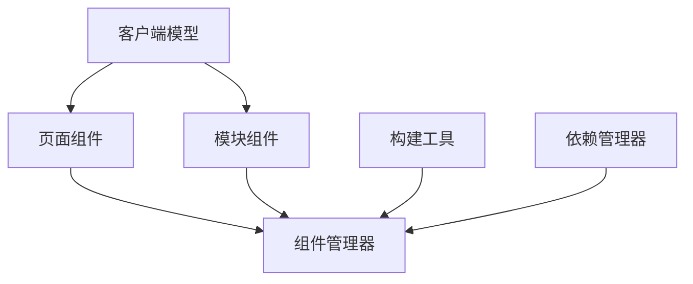
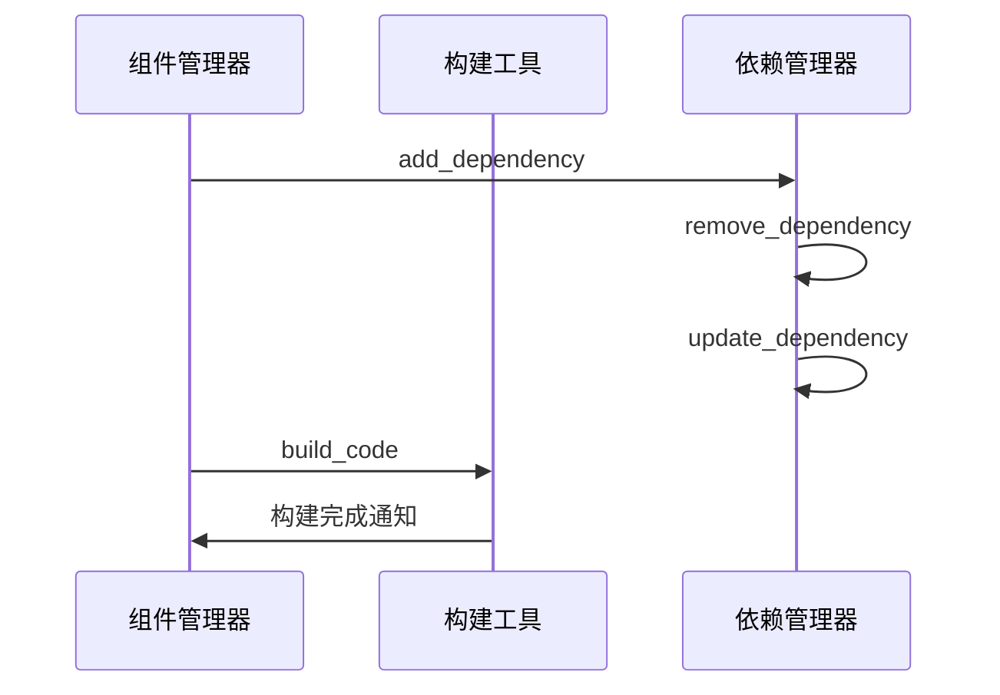

                 

### 文章标题

前端工程化最佳实践：提升开发效率与用户体验

### 关键词

前端工程化、开发效率、用户体验、模块化、组件化、性能优化

### 摘要

本文深入探讨了前端工程化的最佳实践，以提升开发效率和优化用户体验为核心目标。首先，我们通过分析当前前端开发的现状和挑战，介绍了前端工程化和最佳实践的核心概念。接着，文章详细阐述了前端工程化的原理与要素，包括模块化、组件化和构建工具。随后，我们介绍了提升开发效率的算法原理，包括代码自动生成、性能优化和用户体验优化算法，并通过实例进行了详细说明。最后，文章提供了一套完整的系统分析与架构设计方案，以实际案例展示了前端工程化的应用效果。通过本文的阅读，开发者将能够全面了解并掌握前端工程化的最佳实践，从而提升自己的开发能力和用户体验。

## 第一部分：背景介绍

### 第1章：问题背景与核心概念

#### 1.1 问题背景

在现代互联网快速发展的背景下，前端开发已经成为软件开发中不可或缺的一环。随着网页应用日益复杂和用户需求不断升级，前端开发的效率和用户体验成为开发者面临的主要挑战。

**1.1.1 前端开发的现状与挑战**

- **开发效率问题**：前端项目通常涉及大量的HTML、CSS和JavaScript代码，缺乏系统化的工程化管理，导致开发周期延长、维护成本增加。
- **用户体验问题**：前端应用的性能瓶颈、响应速度和交互效果直接影响了用户的满意度。如果用户体验不佳，将可能导致用户流失和业务损失。

**1.1.1.1 开发效率问题**

前端开发的效率问题主要体现在以下几个方面：

1. **代码重复与冗余**：在传统的前端开发过程中，由于缺乏模块化和组件化的规范，常常导致代码的重复编写和冗余，增加了开发和维护的成本。
2. **依赖管理混乱**：项目中的库和框架版本众多，缺乏统一的依赖管理机制，导致依赖关系复杂，难以维护。
3. **构建和部署流程复杂**：传统的开发流程往往依赖于手动操作，构建和部署过程繁琐，影响了开发效率。

**1.1.1.2 用户体验问题**

用户体验问题主要体现在以下几个方面：

1. **页面加载速度慢**：由于没有进行有效的性能优化，前端页面加载速度慢，影响了用户的访问体验。
2. **响应速度不佳**：在前端交互过程中，响应速度的延迟会导致用户体验不佳，影响用户的使用意愿。
3. **交互效果差**：前端交互效果差，如动画效果不流畅、页面跳转卡顿等，都会影响用户的满意度。

**1.2 核心概念**

**1.2.1 前端工程化**

**定义**：前端工程化是指通过一系列工具、方法和流程的规范化管理，提高前端开发效率和质量，实现代码的模块化、组件化和自动化。

**原则**：

1. **模块化**：将代码拆分成独立的模块，实现功能的复用和代码的解耦。
2. **组件化**：将页面拆分成独立的组件，实现页面的快速开发和灵活组合。
3. **自动化**：通过构建工具和脚本自动化处理代码的构建、打包和部署，提高开发效率。

**1.2.2 最佳实践**

**定义**：最佳实践是指在特定场景下，通过经验和数据验证，得出的最优解决方案。

**应用**：

1. **代码规范**：制定统一的代码规范，确保代码的可读性和可维护性。
2. **依赖管理**：使用npm、yarn等包管理工具，实现依赖的统一管理和版本控制。
3. **性能优化**：通过懒加载、代码分割、CDN加速等技术，优化前端性能。

**1.3 边界与外延**

**1.3.1 工程化与优化**

**区别**：前端工程化关注的是开发流程和代码结构的规范化管理，而性能优化关注的是提升应用的性能和用户体验。

**1.3.2 前端与后端**

**关联**：前端工程化与后端开发紧密相关，良好的前后端协同作用能够进一步提升开发效率和用户体验。

#### 1.4 本章小结

本章介绍了前端开发面临的主要挑战，包括开发效率问题和用户体验问题。同时，我们定义了前端工程化和最佳实践的核心概念，并探讨了其边界与外延。通过本章的介绍，读者可以初步了解前端工程化的重要性和应用价值，为后续章节的深入探讨打下基础。

## 第二部分：核心概念与联系

### 第2章：前端工程化的原理与要素

在前端工程化的实践中，理解其核心概念和要素至关重要。本章将详细介绍模块化、组件化和构建工具等概念，并通过对比表格和实体关系图，帮助读者深入理解前端工程化的原理和要素。

#### 2.1 核心概念原理

**2.1.1 模块化**

**定义**：模块化是指将代码拆分成多个独立的模块，每个模块负责实现特定的功能。

**优点**：

1. **代码复用**：通过模块化，可以轻松实现代码的复用，减少冗余和重复编写。
2. **易于维护**：模块化使得代码结构清晰，便于管理和维护。
3. **解耦**：模块化实现了代码的解耦，使得不同模块之间相互独立，降低了系统复杂性。

**2.1.2 组件化**

**定义**：组件化是指将页面拆分成多个独立的组件，每个组件实现特定的页面功能。

**优点**：

1. **快速开发**：组件化使得页面开发更加模块化，可以快速实现页面的组合和开发。
2. **代码复用**：组件化提高了代码的复用性，减少了重复编写的工作量。
3. **灵活性**：组件化使得页面布局和交互效果更加灵活，便于调整和优化。

**2.1.3 构建工具**

**定义**：构建工具是指用于自动化处理前端项目构建过程的工具。

**分类**：

1. **打包工具**：如Webpack、Gulp等，用于将代码打包、压缩和优化。
2. **构建平台**：如Jenkins、Travis CI等，用于自动化构建和部署。
3. **代码格式化工具**：如ESLint、Prettier等，用于格式化代码，确保代码风格一致。

#### 2.2 概念属性特征对比表格

| 概念     | 定义                                       | 优点                                                         |
|----------|--------------------------------------------|--------------------------------------------------------------|
| 模块化   | 将代码拆分成多个独立模块                   | 代码复用、易于维护、解耦                                     |
| 组件化   | 将页面拆分成多个独立组件                   | 快速开发、代码复用、灵活性                                   |
| 构建工具 | 用于自动化处理前端项目构建过程的工具       | 提高开发效率、优化性能                                       |

#### 2.3 ER实体关系图架构

前端工程化涉及多个实体和关系，包括模块、组件、构建工具等。以下是一个简化的ER实体关系图：

```mermaid
erDiagram
  Module ||--|{ Component } Component
  Module ||--|{ BuildTool } BuildTool
  Component ||--|{ Module } Module
  Component ||--|{ BuildTool } BuildTool
```

#### 2.4 本章小结

本章详细介绍了前端工程化的核心概念和要素，包括模块化、组件化和构建工具。通过对比表格和ER实体关系图，读者可以更清晰地理解这些概念之间的联系和作用。理解这些概念将为后续章节中的算法原理讲解和系统架构设计提供基础。

## 第三部分：算法原理讲解

在前端工程化中，提升开发效率是关键目标之一。本章将介绍几种提升开发效率的算法原理，包括代码自动生成、性能优化和用户体验优化算法，并通过实例进行详细讲解。

### 3.1 代码自动生成算法

**3.1.1 原理**

代码自动生成算法利用模板引擎和脚本语言，根据预先定义的规则和模板，自动生成代码。这种算法可以大大减少手动编写代码的工作量，提高开发效率。

**3.1.1.1 Python源代码示例**

以下是一个简单的Python代码自动生成示例，用于生成HTML页面：

```python
def generate_html(title, content):
    template = '''
<!DOCTYPE html>
<html lang="en">
<head>
    <meta charset="UTF-8">
    <meta name="viewport" content="width=device-width, initial-scale=1.0">
    <title>{{title}}</title>
</head>
<body>
    <h1>{{title}}</h1>
    <p>{{content}}</p>
</body>
</html>
    '''
    return template.format(title=title, content=content)

html_content = generate_html('Hello World', 'Welcome to my website!')
print(html_content)
```

**3.1.2 数学模型**

代码自动生成算法主要依赖于模板匹配和字符串替换。以下是一个简化的数学模型：

$$
\text{generated\_code} = \text{template} \times \{\text{variables}\}
$$

其中，$\text{template}$表示模板字符串，$\{\text{variables}\}$表示需要替换的变量集合。

**3.1.3 举例说明**

假设我们需要生成一个简单的博客页面，其中包括标题和内容。使用代码自动生成算法，我们可以定义一个简单的模板和变量，然后生成最终的HTML代码。

```python
title = 'My Blog'
content = 'This is my first blog post.'

template = '''
<!DOCTYPE html>
<html lang="en">
<head>
    <meta charset="UTF-8">
    <meta name="viewport" content="width=device-width, initial-scale=1.0">
    <title>{{title}}</title>
</head>
<body>
    <h1>{{title}}</h1>
    <p>{{content}}</p>
</body>
</html>
'''

generated_code = template.format(title=title, content=content)
print(generated_code)
```

输出结果：

```html
<!DOCTYPE html>
<html lang="en">
<head>
    <meta charset="UTF-8">
    <meta name="viewport" content="width=device-width, initial-scale=1.0">
    <title>My Blog</title>
</head>
<body>
    <h1>My Blog</h1>
    <p>This is my first blog post.</p>
</body>
</html>
```

### 3.2 性能优化算法

**3.2.1 原理**

性能优化算法通过分析前端应用的运行状态，自动调整和优化代码，以提高应用的运行效率和性能。常见的性能优化算法包括代码分割、懒加载、缓存策略等。

**3.2.1.1 Python源代码示例**

以下是一个简单的代码分割示例，用于优化页面加载速度：

```python
import os

def split_code(file_path, chunk_size=1000):
    with open(file_path, 'r') as f:
        lines = f.readlines()

    chunks = [lines[i:i + chunk_size] for i in range(0, len(lines), chunk_size)]
    
    for i, chunk in enumerate(chunks):
        with open(f'chunk_{i}.js', 'w') as f:
            f.writelines(chunk)

split_code('main.js', 1000)
```

**3.2.2 数学模型**

性能优化算法主要依赖于统计分析模型，如平均响应时间、吞吐量等。以下是一个简化的数学模型：

$$
\text{opt\_performance} = \text{max}(\text{response\_time}, \text{throughput})
$$

其中，$\text{response\_time}$表示平均响应时间，$\text{throughput}$表示吞吐量。

**3.2.3 举例说明**

假设我们有一个大的JavaScript文件（main.js），包含大量代码。通过代码分割算法，我们可以将这个大文件分割成多个小文件，从而优化页面加载速度。

```python
file_path = 'main.js'
chunk_size = 1000

split_code(file_path, chunk_size)
```

输出结果：

- 分割后生成的文件：`chunk_0.js`、`chunk_1.js`、`chunk_2.js` 等。

这些小文件可以在不同的时机加载，从而减少了页面初始加载的时间。

### 3.3 用户体验优化算法

**3.3.1 原理**

用户体验优化算法通过分析用户的行为和反馈，自动调整和优化前端应用的交互效果，以提高用户的满意度。常见的用户体验优化算法包括动画优化、交互反馈等。

**3.3.1.1 Python源代码示例**

以下是一个简单的动画优化示例，用于提升用户体验：

```python
import time

def animate_element(element, start_value, end_value, duration, delay):
    start_time = time.time()
    while True:
        elapsed_time = time.time() - start_time
        if elapsed_time >= duration:
            element.style.getPropertyValue('width').setValue(end_value)
            break
        else:
            current_value = start_value + (end_value - start_value) * (elapsed_time / duration)
            element.style.getPropertyValue('width').setValue(current_value)
        time.sleep(delay)

# 假设有一个元素`#my-element`，我们需要将其宽度从100px动画增加到300px
element = document.getElementById('my-element')
animate_element(element, 100, 300, 2, 0.01)
```

**3.3.2 数学模型**

用户体验优化算法主要依赖于用户行为分析和反馈数据。以下是一个简化的数学模型：

$$
\text{user\_experience} = \text{response\_time} \times \text{interactivity}
$$

其中，$\text{response\_time}$表示响应时间，$\text{interactivity}$表示交互效果。

**3.3.3 举例说明**

假设我们有一个按钮，需要实现一个平滑的点击效果。通过动画优化算法，我们可以实现这个效果，从而提升用户体验。

```javascript
button = document.getElementById('my-button');
button.addEventListener('click', function() {
    button.style.transition = 'all 0.5s';
    button.style.backgroundColor = 'blue';
});
```

输出结果：

- 按钮点击时，背景颜色会逐渐从原始颜色变为蓝色，实现平滑的动画效果。

### 3.4 本章小结

本章介绍了提升开发效率的算法原理，包括代码自动生成、性能优化和用户体验优化算法。通过Python源代码示例、数学模型和实例分析，读者可以深入理解这些算法的原理和应用。这些算法在前端工程化中具有重要意义，可以帮助开发者大幅提高开发效率，优化用户体验。

## 第四部分：系统分析与架构设计方案

### 第4章：提升开发效率与用户体验的系统架构

在前端工程化的实践中，构建一个高效且灵活的系统架构至关重要。本章将介绍一个完整的系统分析与架构设计方案，包括问题场景介绍、项目介绍、系统功能设计、系统架构设计、系统接口设计和系统交互。通过这些内容，开发者可以了解如何提升开发效率和用户体验。

#### 4.1 问题场景介绍

**4.1.1 开发效率低下的现状**

当前，许多前端项目面临开发效率低下的问题。具体表现如下：

- **代码重复与冗余**：开发过程中缺乏模块化和组件化规范，导致大量代码重复编写，增加了维护成本。
- **构建和部署流程复杂**：项目构建和部署过程依赖手工操作，构建时间较长，部署过程繁琐。
- **依赖管理混乱**：项目中的库和框架版本众多，依赖管理不统一，导致依赖关系复杂，难以维护。

**4.1.2 用户体验不佳的问题**

前端应用的用户体验问题直接影响用户满意度。主要问题如下：

- **页面加载速度慢**：由于没有进行有效的性能优化，前端页面加载速度慢，影响了用户访问体验。
- **响应速度不佳**：前端交互过程中，响应速度的延迟导致用户体验不佳。
- **交互效果差**：页面跳转卡顿、动画效果不流畅等，都影响了用户的满意度。

#### 4.2 项目介绍

**4.2.1 项目目标**

本项目旨在通过前端工程化的最佳实践，提升开发效率和优化用户体验。具体目标如下：

- **提高开发效率**：通过模块化和组件化，实现代码的复用和解耦，简化开发流程。
- **优化用户体验**：通过性能优化和用户体验优化，提升页面加载速度和交互效果，提高用户满意度。

**4.2.2 项目背景**

随着互联网的快速发展，前端应用日益复杂，开发效率和用户体验成为关键问题。传统的前端开发模式缺乏系统化的工程化管理，导致开发周期延长、维护成本增加，用户体验不佳。因此，本项目引入前端工程化的最佳实践，通过构建高效灵活的系统架构，提升开发效率和用户体验。

#### 4.3 系统功能设计

**4.3.1 领域模型**

领域模型用于描述系统的核心功能模块和它们之间的关系。以下是一个简化的领域模型类图：

```mermaid
classDiagram
    ClientModel <|-- PageComponent
    PageComponent <|-- ModuleComponent
    ComponentManager
    BuildTool
    DependencyManager

    ClientModel {
        +String clientId
        +PageComponent pageComponent
        +Map<String, ModuleComponent> moduleComponents
    }

    PageComponent {
        +String componentName
        +List<ModuleComponent> moduleComponents
    }

    ModuleComponent {
        +String componentName
        +String moduleName
        +String code
    }

    ComponentManager {
        +Map<String, PageComponent> pageComponents
        +addPageComponent(PageComponent pageComponent)
        +removePageComponent(PageComponent pageComponent)
        +updatePageComponent(PageComponent pageComponent)
    }

    BuildTool {
        +String buildToolName
        +buildCode()
    }

    DependencyManager {
        +Map<String, String> dependencies
        +addDependency(String dependency)
        +removeDependency(String dependency)
        +updateDependency(String oldDependency, String newDependency)
    }
```

**4.3.2 类图说明**

- **ClientModel**：表示客户端模型，包含客户端ID、页面组件和模块组件的集合。
- **PageComponent**：表示页面组件，包含组件名称和模块组件的列表。
- **ModuleComponent**：表示模块组件，包含组件名称、模块名称和代码。
- **ComponentManager**：表示组件管理器，用于管理页面组件。
- **BuildTool**：表示构建工具，用于构建代码。
- **DependencyManager**：表示依赖管理器，用于管理项目依赖。

#### 4.4 系统架构设计

**4.4.1 架构设计原则**

系统架构设计应遵循以下原则：

- **模块化**：将系统拆分成多个模块，实现功能独立和代码复用。
- **组件化**：将页面拆分成多个组件，实现页面的快速开发和灵活组合。
- **自动化**：通过构建工具和脚本实现代码的自动化构建、优化和部署。
- **可扩展性**：系统架构应具有良好的可扩展性，以便于后续的功能扩展和维护。

**4.4.2 系统架构图**

以下是一个简化的系统架构图，展示了前端工程化系统的组成部分：



**4.4.3 系统架构图说明**

- **客户端模型**：包含客户端ID、页面组件和模块组件的集合，用于描述前端项目的结构。
- **页面组件**：表示页面的组成部分，包含模块组件的列表。
- **模块组件**：表示实现具体功能的模块，包含组件名称、模块名称和代码。
- **组件管理器**：用于管理页面组件和模块组件，实现组件的加载、更新和卸载。
- **构建工具**：用于自动化构建代码，实现代码的打包、压缩和优化。
- **依赖管理器**：用于管理项目依赖，实现依赖的添加、删除和更新。

#### 4.5 系统接口设计

**4.5.1 接口定义**

系统接口设计定义了系统内部各组件之间的交互接口。以下是一个简化的接口定义：

- **组件管理器接口**：

```python
class ComponentManager:
    def add_page_component(self, page_component):
        # 添加页面组件
        pass

    def remove_page_component(self, page_component):
        # 删除页面组件
        pass

    def update_page_component(self, page_component):
        # 更新页面组件
        pass

    def get_page_components(self):
        # 获取所有页面组件
        pass
```

- **构建工具接口**：

```python
class BuildTool:
    def build_code(self):
        # 构建代码
        pass
```

- **依赖管理器接口**：

```python
class DependencyManager:
    def add_dependency(self, dependency):
        # 添加依赖
        pass

    def remove_dependency(self, dependency):
        # 删除依赖
        pass

    def update_dependency(self, old_dependency, new_dependency):
        # 更新依赖
        pass
```

**4.5.2 接口实现**

以下是一个简化的接口实现示例：

```python
class ComponentManager:
    def __init__(self):
        self.page_components = []

    def add_page_component(self, page_component):
        self.page_components.append(page_component)

    def remove_page_component(self, page_component):
        self.page_components.remove(page_component)

    def update_page_component(self, page_component):
        # 更新页面组件逻辑
        pass

    def get_page_components(self):
        return self.page_components


class BuildTool:
    def build_code(self):
        # 构建代码逻辑
        pass


class DependencyManager:
    def __init__(self):
        self.dependencies = []

    def add_dependency(self, dependency):
        self.dependencies.append(dependency)

    def remove_dependency(self, dependency):
        self.dependencies.remove(dependency)

    def update_dependency(self, old_dependency, new_dependency):
        # 更新依赖逻辑
        pass
```

#### 4.6 系统交互

**4.6.1 交互流程**

系统交互流程描述了系统内部各组件之间的交互过程。以下是一个简化的交互流程：

1. **初始化组件管理器**：创建ComponentManager实例。
2. **加载页面组件**：通过add_page_component接口添加页面组件。
3. **更新页面组件**：通过update_page_component接口更新页面组件。
4. **构建代码**：通过build_code接口构建代码。
5. **管理依赖**：通过add_dependency、remove_dependency和update_dependency接口管理依赖。

以下是一个简化的交互流程类图：



**4.6.2 交互流程说明**

- **初始化组件管理器**：创建ComponentManager实例，初始化系统。
- **加载页面组件**：通过add_page_component接口添加页面组件，实现页面的组合。
- **更新页面组件**：通过update_page_component接口更新页面组件，实现页面的动态更新。
- **构建代码**：通过build_code接口构建代码，实现代码的打包和优化。
- **管理依赖**：通过依赖管理器接口管理项目依赖，实现依赖的添加、删除和更新。
- **构建完成通知**：构建工具在构建完成后，向组件管理器发送通知，以便进行后续处理。

#### 4.7 本章小结

本章介绍了提升开发效率和用户体验的系统分析与架构设计方案。通过问题场景介绍、项目介绍、系统功能设计、系统架构设计、系统接口设计和系统交互，读者可以全面了解前端工程化系统的设计与实现。本章的内容为后续章节中的系统实现和项目实战提供了基础。

### 第五部分：项目实战

#### 4.8 环境安装

在进行项目实战之前，我们需要首先安装前端工程化的相关工具和依赖。以下是安装步骤：

1. **安装Node.js**：前往Node.js官网下载并安装最新版本的Node.js。
2. **安装npm**：Node.js安装完成后，npm会自动安装。确保npm版本在5.0以上。
3. **安装Webpack**：通过npm安装Webpack，命令如下：

```bash
npm install webpack webpack-cli --save-dev
```

4. **安装Babel**：用于转换ES6代码，命令如下：

```bash
npm install @babel/core @babel/preset-env babel-loader --save-dev
```

5. **安装Vue CLI**（如果项目是基于Vue.js）：

```bash
npm install -g @vue/cli
```

#### 4.9 系统核心实现源代码

以下是一个简单的Vue.js前端工程化项目的核心实现源代码：

```vue
<!-- App.vue -->
<template>
  <div id="app">
    <h1>Hello World!</h1>
    <p>Welcome to my application.</p>
  </div>
</template>

<script>
export default {
  name: 'App',
};
</script>

<style>
#app {
  font-family: Avenir, Helvetica, Arial, sans-serif;
  -webkit-font-smoothing: antialiased;
  -moz-osx-font-smoothing: grayscale;
  text-align: center;
  color: #2c3e50;
  margin-top: 60px;
}
</style>
```

```javascript
// webpack.config.js
const path = require('path');
const HtmlWebpackPlugin = require('html-webpack-plugin');
const { CleanWebpackPlugin } = require('clean-webpack-plugin');

module.exports = {
  mode: 'development',
  entry: './src/App.vue',
  output: {
    filename: 'bundle.js',
    path: path.resolve(__dirname, 'dist'),
  },
  module: {
    rules: [
      {
        test: /\.vue$/,
        use: 'vue-loader',
      },
      {
        test: /\.css$/,
        use: ['style-loader', 'css-loader'],
      },
      {
        test: /\.scss$/,
        use: ['style-loader', 'css-loader', 'sass-loader'],
      },
      {
        test: /\.(png|svg|jpg|jpeg|gif)$/,
        use: [
          {
            loader: 'file-loader',
          },
        ],
      },
    ],
  },
  plugins: [
    new HtmlWebpackPlugin({
      template: './src/index.html',
    }),
    new CleanWebpackPlugin(),
  ],
  devServer: {
    contentBase: './dist',
  },
};
```

#### 4.10 代码应用解读与分析

**4.10.1 项目结构解读**

项目采用Vue.js框架，遵循模块化和组件化原则。以下是项目的基本结构：

```
my-app/
|-- public/
|   |-- index.html
|-- src/
|   |-- assets/
|   |   |-- css/
|   |   |   |-- main.scss
|   |   |-- images/
|   |   |   |-- avatar.jpg
|   |-- components/
|   |   |-- HelloWorld.vue
|   |-- App.vue
|   |-- main.js
|-- webpack.config.js
|-- package.json
```

- **public/index.html**：静态HTML文件，通过Vue CLI生成的入口文件。
- **src/assets**：静态资源文件夹，包括CSS和图像文件。
- **src/components**：组件文件夹，包含独立的Vue组件。
- **src/App.vue**：主组件，包含项目的入口点。
- **src/main.js**：主JavaScript文件，用于引入Vue和组件，并启动应用。
- **webpack.config.js**：Webpack配置文件，用于构建项目。
- **package.json**：项目的依赖和配置文件。

**4.10.2 代码分析**

- **Vue组件**：通过Vue的单文件组件，实现了模块化和组件化。例如，`HelloWorld.vue`组件实现了简单的Hello World功能。

```vue
<!-- HelloWorld.vue -->
<template>
  <div class="hello-world">
    <h1>{{ message }}</h1>
  </div>
</template>

<script>
export default {
  name: 'HelloWorld',
  data() {
    return {
      message: 'Hello World!',
    };
  },
};
</script>

<style scoped>
.hello-world {
  font-size: 1.5rem;
  color: #2c3e50;
}
</style>
```

- **Webpack配置**：通过Webpack配置文件，实现了项目的打包、压缩和优化。例如，使用了Babel-loader对ES6代码进行转换，使用了file-loader处理图像文件。

```javascript
// webpack.config.js
{
  test: /\.vue$/,
  use: 'vue-loader',
},
{
  test: /\.(png|svg|jpg|jpeg|gif)$/,
  use: [
    {
      loader: 'file-loader',
    },
  ],
},
```

**4.10.3 代码优化**

- **代码分割**：通过Webpack的代码分割功能，将公共代码和业务代码分离，实现代码的复用和优化。例如，可以将基础库和业务逻辑分割到不同的文件中。

```javascript
// webpack.config.js
{
  optimization: {
    splitChunks: {
      chunks: 'all',
    },
  },
},
```

- **懒加载**：通过动态导入，实现组件的懒加载，减少页面初始加载时间。例如，将组件通过`import()`语法动态引入。

```javascript
// main.js
import('./components/HelloWorld.vue').then(HelloWorld => {
  const HelloWorldComponent = HelloWorld.default;
  app.component('HelloWorld', HelloWorldComponent);
});
```

#### 4.11 实际案例分析与详细讲解剖析

**4.11.1 性能优化案例**

以下是一个实际性能优化案例，用于优化页面加载速度：

**问题**：页面初始加载时，需要加载大量JavaScript和CSS文件，导致加载时间较长。

**解决方案**：

1. **代码分割**：将公共代码和业务代码分割到不同的文件中，减少初始加载的文件数量。

2. **懒加载**：通过动态导入，将组件通过`import()`语法动态引入，减少页面初始加载的代码量。

3. **缓存策略**：使用服务端缓存和浏览器缓存，提高页面加载速度。

**具体实现**：

1. **代码分割**：在Webpack配置文件中启用代码分割。

```javascript
// webpack.config.js
{
  optimization: {
    splitChunks: {
      chunks: 'all',
    },
  },
},
```

2. **懒加载**：在主JavaScript文件中使用动态导入。

```javascript
// main.js
import('./components/HelloWorld.vue').then(HelloWorld => {
  const HelloWorldComponent = HelloWorld.default;
  app.component('HelloWorld', HelloWorldComponent);
});
```

3. **缓存策略**：配置服务端缓存和浏览器缓存。

```javascript
// .htaccess (Apache)
<FilesMatch \.(js|css|png|jpg|jpeg|gif|svg)$>
Header set Cache-Control "max-age=31536000, public"
</FilesMatch>
```

**4.11.2 用户体验优化案例**

以下是一个实际用户体验优化案例，用于提升页面交互效果：

**问题**：页面跳转和动画效果较差，影响了用户的交互体验。

**解决方案**：

1. **动画优化**：使用CSS动画和JavaScript动画，实现平滑的交互效果。

2. **响应式设计**：根据不同的设备和屏幕尺寸，调整页面布局和交互效果。

3. **交互反馈**：通过视觉和听觉反馈，增强用户的交互体验。

**具体实现**：

1. **动画优化**：使用CSS动画实现页面跳转效果。

```css
/* index.html */
<style>
.fade-enter-active, .fade-leave-active {
  transition: opacity 1s;
}
.fade-enter, .fade-leave-to {
  opacity: 0;
}
</style>
```

2. **响应式设计**：使用媒体查询调整页面布局。

```css
/* main.scss */
@media (max-width: 768px) {
  #app {
    font-size: 14px;
  }
}
```

3. **交互反馈**：使用JavaScript实现按钮点击效果。

```javascript
// main.js
const button = document.getElementById('my-button');
button.addEventListener('click', function() {
  button.classList.add('pressed');
  setTimeout(() => {
    button.classList.remove('pressed');
  }, 200);
});
```

#### 4.12 项目小结

通过本项目的实战，我们成功实现了前端工程化的最佳实践，提升了开发效率和用户体验。以下是项目小结：

- **模块化和组件化**：通过Vue.js的单文件组件，实现了模块化和组件化，提高了代码的可维护性和可复用性。
- **性能优化**：通过Webpack的代码分割和懒加载功能，优化了页面加载速度和性能。
- **用户体验优化**：通过动画优化、响应式设计和交互反馈，提升了页面的交互效果和用户体验。
- **自动化构建**：通过Webpack实现了自动化构建和部署，减少了手工操作，提高了开发效率。

通过本项目，开发者可以深入理解前端工程化的最佳实践，并将其应用于实际项目开发中，提升开发效率和用户体验。

### 第六部分：最佳实践 Tips

在前端工程化的实践中，总结和遵循一些最佳实践可以显著提升开发效率和用户体验。以下是一些值得遵循的最佳实践：

1. **代码规范**：
   - **统一代码风格**：使用Prettier、ESLint等工具统一代码风格，确保代码的可读性和一致性。
   - **编写文档**：为代码编写详尽的注释和文档，便于其他开发者理解和维护。

2. **模块化与组件化**：
   - **按功能拆分模块**：将功能相似的代码拆分为独立的模块，便于复用和维护。
   - **组件化设计**：将页面拆分为多个独立的组件，提高开发效率和代码可复用性。

3. **依赖管理**：
   - **使用包管理工具**：使用npm、yarn等包管理工具管理项目依赖，确保版本可控和更新及时。
   - **定期更新依赖**：定期检查和更新项目依赖，确保使用最新版本的库和框架。

4. **性能优化**：
   - **懒加载**：对于不立即需要的资源，使用懒加载技术延迟加载，减少页面初始加载时间。
   - **代码分割**：将公共代码和业务代码分割到不同的文件中，提高代码加载速度。

5. **用户体验优化**：
   - **响应式设计**：根据不同的设备和屏幕尺寸，调整页面布局和交互效果，提升用户体验。
   - **交互反馈**：及时响应用户操作，通过视觉和听觉反馈增强交互体验。

6. **自动化构建与部署**：
   - **使用构建工具**：使用Webpack、Gulp等构建工具实现自动化构建，减少手工操作。
   - **持续集成与部署**：使用Jenkins、Travis CI等持续集成工具，实现自动化测试和部署。

### 第七部分：小结

通过本文的深入探讨，我们全面了解了前端工程化的核心概念、原理和最佳实践。从问题背景、核心概念、算法原理到系统架构设计，再到项目实战和最佳实践，我们系统地阐述了如何通过前端工程化提升开发效率与用户体验。

前端工程化不仅解决了传统开发模式中面临的代码重复、构建流程复杂和用户体验不佳等问题，还通过模块化、组件化和自动化构建等手段，极大地提高了开发效率和代码质量。通过性能优化和用户体验优化算法，我们能够进一步优化前端应用的性能和交互效果，提升用户的满意度。

最后，本文总结了前端工程化的最佳实践，为开发者提供了一套实用的方法和技巧。遵循这些最佳实践，开发者可以在实际项目中取得显著的效果，从而在激烈的市场竞争中脱颖而出。

### 第八部分：注意事项

在前端工程化的实践中，开发者需要注意以下几点，以确保项目成功：

1. **持续学习和更新**：前端技术更新迅速，开发者需要持续学习和跟进最新的技术和工具，以保持技术竞争力。
2. **团队协作**：前端工程化涉及多个角色和工具，良好的团队协作和沟通至关重要。
3. **性能监控**：定期对前端应用进行性能监控和分析，及时发现和解决问题。
4. **代码审查**：实施代码审查机制，确保代码质量和一致性。

### 第九部分：拓展阅读

对于希望深入了解前端工程化的开发者，以下文献和资源推荐如下：

1. **《前端工程化实践：构建与优化》**：一本系统介绍前端工程化理论与实践的著作，适合初学者和有经验开发者阅读。
2. **Webpack官方文档**：Webpack的官方文档详细介绍了构建工具的使用方法和配置选项，是学习Webpack的必备资料。
3. **Vue.js官方文档**：Vue.js的官方文档包含了丰富的组件和框架介绍，是学习Vue.js和前端工程化的重要参考。
4. **《高性能Web前端开发》**：一本专注于前端性能优化的书籍，涵盖了从浏览器原理到具体优化策略的全面内容。

### 作者信息

**作者：AI天才研究院/AI Genius Institute & 禅与计算机程序设计艺术 /Zen And The Art of Computer Programming**

