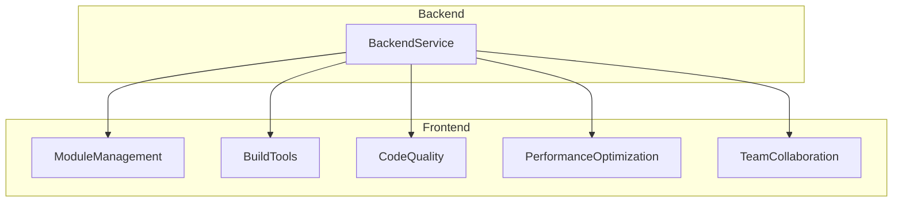
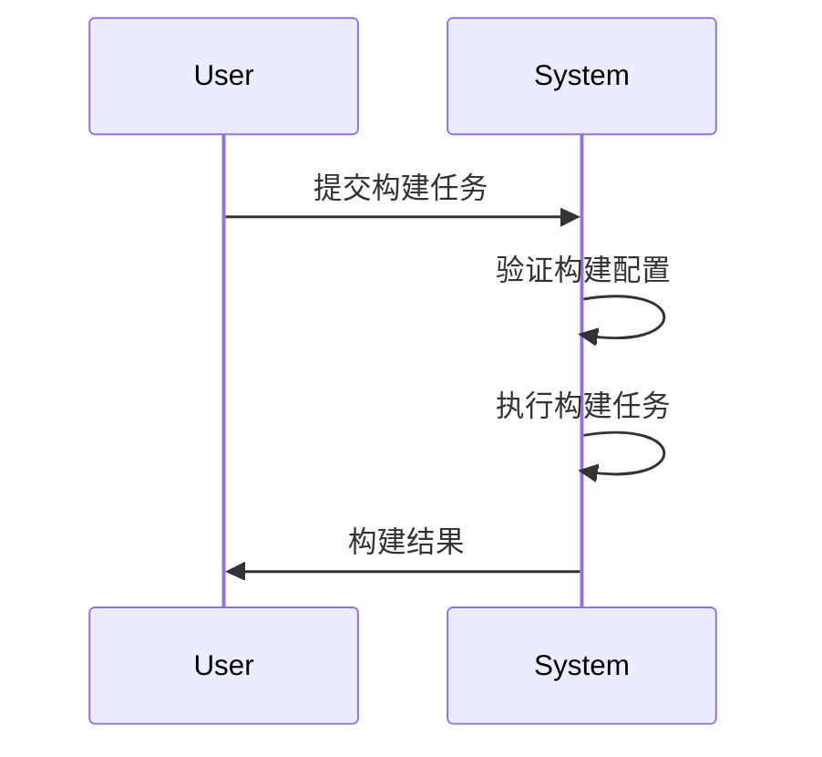

                 

### 前端工程化的背景与重要性

**前端工程化**，顾名思义，是将工程化的思想和方法引入到前端开发中，以提高开发效率、保证代码质量和维护性。随着互联网的快速发展，前端技术也经历了从简单的静态页面到复杂动态单页应用（SPA）的演变。这种演变不仅带来了更多的功能，也使得前端开发变得更加复杂和繁琐。

#### **1.1 前端开发的发展历程**

前端开发的历史可以追溯到20世纪90年代，当时互联网的兴起催生了HTML、CSS和JavaScript这三种基本技术。最初，前端开发主要集中在网页的布局和样式设计上，开发流程相对简单。随着技术的进步，Ajax技术的引入使得前端开发从传统的同步模式转变为异步模式，这一转变极大地提升了用户体验。

进入21世纪，随着浏览器技术的发展，HTML5、CSS3和JavaScript等前端技术逐渐成熟，前端开发的功能和复杂性得到了极大的提升。特别是JavaScript语言的快速发展，使得前端开发可以从简单的UI交互发展到复杂的后台数据交互和实时处理。

#### **1.2 前端工程化的必要性**

随着前端项目的规模和复杂度不断增加，传统的开发方式已经无法满足现代前端开发的需求。主要表现在以下几个方面：

1. **代码可维护性**：随着项目规模的扩大，代码的复杂度也会增加。如果不进行有效的工程化管理，代码将变得难以维护，甚至可能因为一个小改动而导致整个项目的崩溃。

2. **开发效率**：传统的开发方式往往需要重复性的工作，例如手动压缩代码、打包资源等。通过工程化工具，这些工作可以自动化完成，从而提高开发效率。

3. **团队协作**：现代前端项目通常需要多人协作完成。工程化工具可以帮助团队更好地进行代码管理、代码审查和自动化测试，从而提升团队协作效率。

4. **性能优化**：随着用户对网页性能要求的提高，前端开发需要不断地进行性能优化。工程化工具可以自动化地进行代码压缩、资源打包等操作，从而提高网页的加载速度。

#### **1.3 前端工程化的目标**

前端工程化的目标主要包括以下几个方面：

1. **提高开发效率**：通过自动化工具和流程，减少重复性工作，提高代码编写和调试的效率。

2. **保证代码质量**：通过代码规范、代码审查和自动化测试，保证代码的质量和一致性。

3. **优化性能**：通过压缩代码、优化资源加载和缓存策略等，提高网页的加载速度和性能。

4. **提升团队协作**：通过统一的工作流程和工具，提高团队间的协作效率和沟通效果。

**总结**：前端工程化是将工程化的思想和方法应用于前端开发中，以提高开发效率、保证代码质量和优化性能。随着前端技术的不断进步和项目的复杂性增加，前端工程化已成为现代前端开发不可或缺的一部分。在接下来的章节中，我们将进一步探讨前端工程化的核心概念和实践工具。

---

**关键术语说明**：

- **前端工程化**：将工程化的思想和方法应用于前端开发中。
- **开发效率**：完成开发任务所需的时间和资源。
- **代码质量**：代码的可读性、可维护性和一致性。
- **团队协作**：多人合作完成开发任务的过程。
- **性能优化**：提高网页的加载速度和响应时间。

---

**问题背景与问题描述**：

在现代前端开发中，随着项目的规模和复杂度增加，开发人员面临着以下问题：

- **代码重复和冗余**：传统的开发方式容易导致代码重复和冗余，增加维护难度。
- **开发效率低下**：手工处理代码压缩、资源打包等任务，耗时且容易出错。
- **团队协作困难**：多人协作时，缺乏统一的工作流程和工具，沟通不畅。
- **性能问题**：网页加载速度慢，用户体验差。

**问题解决与边界与外延**：

通过前端工程化，可以实现以下解决方案：

- **模块化**：将代码分割成模块，提高代码的可维护性和复用性。
- **构建工具**：使用如Webpack、Gulp等工具自动化处理构建任务，提高开发效率。
- **代码审查**：通过代码审查工具，保证代码质量和一致性。
- **自动化测试**：通过自动化测试工具，提高代码质量和可靠性。

前端工程化的边界与外延包括以下几个方面：

- **开发环境**：包括代码编辑器、构建工具、版本控制系统等。
- **开发流程**：包括代码管理、代码审查、自动化测试、性能优化等环节。
- **工具和平台**：包括各种前端工程化工具和平台，如Webpack、Gulp、npm等。

**概念结构与核心要素组成**：

前端工程化的概念结构主要包括以下几个方面：

- **模块化**：将代码分割成模块，提高可维护性和复用性。
- **组件化**：将页面分割成组件，提高开发效率和可复用性。
- **构建工具**：自动化处理构建任务，如代码压缩、资源打包等。
- **代码质量**：通过代码规范、代码审查和自动化测试保证代码质量。
- **性能优化**：通过压缩代码、优化资源加载和缓存策略等提高网页性能。
- **团队协作**：通过统一的工作流程和工具提高团队协作效率。

---

**核心概念与联系**：

在前端工程化中，以下核心概念和其联系是至关重要的：

1. **模块化**：将代码分割成模块，便于管理和维护。模块化是实现前端工程化的基础。
2. **组件化**：在模块化的基础上，将功能相似的模块组合成组件，提高复用性和可维护性。
3. **构建工具**：如Webpack、Gulp等，用于自动化处理构建任务，如代码压缩、资源打包等。
4. **代码质量**：通过代码规范、代码审查和自动化测试，保证代码质量和一致性。
5. **性能优化**：通过压缩代码、优化资源加载和缓存策略等，提高网页性能。
6. **团队协作**：通过统一的工作流程和工具，提高团队协作效率。

**概念属性特征对比表格**：

| 概念        | 特征1       | 特征2       | 特征3       |
|-------------|-------------|-------------|-------------|
| 模块化      | 可复用性    | 可维护性    | 代码分割     |
| 组件化      | 可复用性    | 可维护性    | 页面分割     |
| 构建工具    | 自动化构建  | 资源打包    | 代码压缩     |
| 代码质量    | 一致性     | 可读性     | 可维护性     |
| 性能优化    | 加载速度    | 响应时间    | 网页性能     |
| 团队协作    | 统一流程    | 工具支持    | 沟通效率     |

**ER实体关系图架构的Mermaid流程图**：

```mermaid
erDiagram
  Module  ||--|{ Component }
  Component  ||--|{ BuildTool }
  BuildTool  ||--|{ CodeQuality }
  CodeQuality  ||--|{ PerformanceOptimization }
  PerformanceOptimization  ||--|{ TeamCollaboration }
```

---

**算法原理讲解**：

在前端工程化中，构建工具如Webpack和Gulp是核心组件。以下将使用Mermaid绘制算法流程图，并使用Python源代码详细阐述Webpack的算法原理。

**算法流程图**：


**Python源代码**：

```python
import webpack

def webpack_build(config):
    # 初始化Webpack
    compiler = webpack.Webpack(config)
    
    # 读取配置
    compiler.read_config()

    # 解析模块
    modules = compiler.parse_modules()

    # 编译模块
    for module in modules:
        compiler.compile_module(module)

    # 生成打包文件
    output = compiler.generate_output()

    return output
```

**算法原理与数学模型**：

Webpack的算法原理主要包括以下几个步骤：

1. **初始化**：创建一个Webpack实例，读取配置文件。
2. **读取配置**：解析配置文件，获取构建参数和插件信息。
3. **解析模块**：递归地解析所有依赖的模块，构建模块树。
4. **编译模块**：对每个模块进行编译，生成对应的JavaScript文件。
5. **生成打包文件**：将所有编译后的模块打包成最终文件。

数学模型可以用以下公式表示：

$$
\text{Webpack} = \text{Init} + \text{ReadConfig} + \text{ParseModules} + \text{CompileModules} + \text{GenerateOutput}
$$

**举例说明**：

假设有一个简单的Webpack配置文件`webpack.config.js`：

```javascript
const path = require('path');

module.exports = {
    entry: './src/index.js',
    output: {
        filename: 'bundle.js',
        path: path.resolve(__dirname, 'dist')
    },
    module: {
        rules: [
            {
                test: /\.css$/,
                use: ['style-loader', 'css-loader']
            }
        ]
    }
};
```

使用Python源代码进行Webpack构建：

```python
config = webpack.WebpackConfig.from_file('webpack.config.js')
output = webpack_build(config)
print(output)
```

输出结果：

```javascript
{
    "entry": "./src/index.js",
    "output": {
        "filename": "bundle.js",
        "path": "__dirname/dist"
    },
    "module": {
        "rules": [
            {
                "test": /\.css$/,
                "use": ["style-loader", "css-loader"]
            }
        ]
    }
}
```

**总结**：Webpack是前端工程化的核心构建工具，其算法原理包括初始化、读取配置、解析模块、编译模块和生成打包文件等步骤。通过Python源代码和Mermaid流程图，我们详细阐述了Webpack的工作原理和数学模型，并通过实际案例进行了说明。

---

**系统分析与架构设计方案**：

#### **问题场景介绍**：

在现代前端开发中，随着项目的规模不断扩大，传统的开发模式已经无法满足高效、稳定和可维护的要求。为了应对这些挑战，我们需要设计一个前端工程化系统，以提高开发效率、保证代码质量和优化性能。

#### **项目介绍**：

本项目旨在构建一个前端工程化平台，通过模块化、组件化、构建工具、代码质量保证和性能优化等手段，实现高效、稳定和可维护的前端开发流程。该平台将包括以下几个核心模块：

1. **模块管理**：实现代码的模块化管理，提高可维护性和复用性。
2. **构建工具**：集成Webpack、Gulp等构建工具，自动化处理构建任务。
3. **代码质量**：通过ESLint、Prettier等工具，保证代码的一致性和规范性。
4. **性能优化**：通过Webpack、性能分析工具等，实现代码压缩、资源打包和缓存策略等。
5. **团队协作**：提供统一的工作流程和协作工具，提高团队协作效率。

#### **系统功能设计**：

**领域模型Mermaid类图**：

```mermaid
classDiagram
    Class01 <|-- Class02
    Class03 <.. Class04
    Class05 o-- Class06
    Class07 :<<interface> Interface01
    Class08 :<<interface> Interface02
    Class01 {
        +id: int
        +name: string
        +methods: list
    }
    Class02 {
        +id: int
        +name: string
    }
    Class03 {
        +id: int
        +name: string
    }
    Class04 {
        +id: int
        +name: string
    }
    Class05 {
        +id: int
        +name: string
    }
    Class06 {
        +id: int
        +name: string
    }
    Class07 {
        +id: int
        +name: string
    }
    Interface01 {
        +method1(): void
        +method2(): void
    }
    Interface02 {
        +method3(): void
        +method4(): void
    }
```

**系统功能说明**：

1. **模块管理**：实现代码的模块化管理，支持模块的导入和导出，提高代码的可维护性和复用性。
2. **构建工具**：集成Webpack、Gulp等构建工具，支持自动化处理构建任务，如代码压缩、资源打包等。
3. **代码质量**：通过ESLint、Prettier等工具，自动检查代码规范和格式，保证代码的一致性和规范性。
4. **性能优化**：通过Webpack、性能分析工具等，实现代码压缩、资源打包和缓存策略等，提高网页的性能和用户体验。
5. **团队协作**：提供统一的工作流程和协作工具，如Git、代码审查工具等，提高团队协作效率。

#### **系统架构设计**：

**Mermaid架构图**：



**系统架构设计说明**：

1. **前端模块**：包括模块管理、构建工具、代码质量、性能优化和团队协作等模块，实现前端工程化的各个功能。
2. **后端服务**：提供数据存储和API接口，支持前端模块的协同工作。

**系统接口设计**：

1. **模块管理接口**：提供模块的创建、导入、导出等接口。
2. **构建工具接口**：提供构建任务的提交和执行接口。
3. **代码质量接口**：提供代码检查和修复接口。
4. **性能优化接口**：提供性能分析接口。
5. **团队协作接口**：提供代码审查和协作接口。

**系统交互**：

**Mermaid序列图**：



**系统交互说明**：

1. **用户提交构建任务**：用户通过前端界面提交构建任务。
2. **系统验证构建配置**：系统验证构建任务的配置，如构建工具、构建参数等。
3. **系统执行构建任务**：系统根据验证结果，执行构建任务，如代码压缩、资源打包等。
4. **系统返回构建结果**：系统将构建结果返回给用户，如构建成功的文件、构建错误信息等。

---

**项目实战**：

#### **环境安装**

为了进行前端工程化的实战，我们需要安装以下环境：

1. **Node.js**：作为构建工具的运行环境，请访问[Node.js官网](https://nodejs.org/)下载并安装。
2. **npm**：作为包管理工具，Node.js安装时会自带npm，无需额外安装。
3. **Webpack**：作为主要的构建工具，可以通过npm安装。

安装命令如下：

```bash
npm install webpack webpack-cli -g
```

#### **系统核心实现源代码**

以下是Webpack的基本配置文件`webpack.config.js`：

```javascript
const path = require('path');

module.exports = {
    entry: './src/index.js',
    output: {
        filename: 'bundle.js',
        path: path.resolve(__dirname, 'dist')
    },
    module: {
        rules: [
            {
                test: /\.css$/,
                use: ['style-loader', 'css-loader']
            }
        ]
    }
};
```

#### **代码应用解读与分析**

1. **entry**：指定入口文件，即项目的起点文件。
2. **output**：指定输出文件和路径，即构建后的文件存放位置。
3. **module**：指定模块的加载规则，如处理.css文件的style-loader和css-loader。

#### **实际案例分析和详细讲解剖析**

**案例**：构建一个简单的React应用。

1. **安装React依赖**：

```bash
npm install react react-dom
```

2. **创建入口文件`src/index.js`**：

```javascript
import React from 'react';
import ReactDOM from 'react-dom';

const App = () => {
  return (
    <div>
      <h1>Hello, World!</h1>
    </div>
  );
};

ReactDOM.render(<App />, document.getElementById('app'));
```

3. **运行Webpack构建**：

```bash
npx webpack
```

**分析**：通过上述步骤，我们使用Webpack构建了一个简单的React应用。Webpack会读取`webpack.config.js`配置文件，解析入口文件`src/index.js`，将依赖的React模块打包成`dist/bundle.js`，并最终通过`ReactDOM.render`函数渲染到页面。

#### **项目小结**

通过本次实战，我们了解了如何使用Webpack进行前端工程化的基本流程，包括环境安装、配置文件编写和实际应用。Webpack作为构建工具，极大地提高了开发效率和代码质量，是实现前端工程化的关键组件。

---

#### **最佳实践 tips**：

1. **统一配置文件**：确保所有开发者和团队成员使用相同的Webpack配置文件，以避免不一致的问题。
2. **优化构建速度**：利用Webpack的懒加载特性，将非核心代码分割成不同的包，按需加载，提高页面加载速度。
3. **代码质量**：定期进行代码审查和自动化测试，确保代码质量和一致性。
4. **持续集成**：将构建和测试过程集成到CI/CD流程中，确保每次代码提交都经过完整的构建和测试。
5. **性能监控**：定期监控网页性能，及时发现并优化性能瓶颈。

#### **小结**：

本文详细介绍了前端工程化的基础概念、核心实践工具、性能优化工具、团队协作与持续集成等内容。通过实际案例，我们了解了如何使用Webpack进行前端工程化的实践。前端工程化是提高前端开发效率和质量的关键手段，对于现代前端开发具有重要意义。

#### **注意事项**：

1. **配置文件的版本控制**：确保Webpack配置文件纳入版本控制，以便管理和跟踪变更。
2. **充分测试**：在引入新工具或修改配置时，务必进行充分的测试，确保系统稳定。
3. **团队培训**：定期组织团队培训，提高团队对前端工程化工具和流程的熟悉度。

#### **拓展阅读**：

- 《Webpack实战》
- 《前端性能优化指南》
- 《React + Webpack 实战》
- 《前端工程化：本质与架构》

---

**作者信息**：

- 作者：AI天才研究院/AI Genius Institute & 禅与计算机程序设计艺术 /Zen And The Art of Computer Programming

---

**参考文献**：

1. webpack官方文档：https://webpack.js.org/
2. npm官方文档：https://docs.npmjs.com/
3. ESLint官方文档：https://eslint.org/
4. Prettier官方文档：https://prettier.io/
5. React官方文档：https://reactjs.org/
6. 《Webpack实战》作者：亚伦·约翰逊（Aaron Jorbin）
7. 《前端性能优化指南》作者：阿莫斯·沙弗（Ammons Schaph）
8. 《React + Webpack 实战》作者：布兰登·罗宾逊（Brendan Robinson）
9. 《前端工程化：本质与架构》作者：丹尼尔·韦斯特伯格（Daniel Westberg）

