                 

**《前端性能优化：提升用户体验的关键技术》**

---

### 关键词：前端性能优化、用户体验、资源加载、JavaScript性能、CSS性能、布局与绘制优化、前端监控与调试、实战案例

---

### 摘要：

随着互联网技术的飞速发展，前端应用日益复杂，性能优化成为提升用户体验的关键。本文将从基础知识入手，深入探讨前端性能优化的关键技术和方法，包括资源加载优化、JavaScript性能优化、CSS性能优化、布局与绘制优化、前端监控与调试，以及实战案例。通过本文的阅读，读者将全面了解前端性能优化的核心概念和实战技巧，为打造高性能、高体验的前端应用提供有力支持。

---

### 第1章: 性能优化基础知识

#### 1.1 前端性能优化的背景和重要性

**问题背景**：

互联网技术的发展，使得前端应用从简单的展示页面，逐渐演变成为功能丰富、交互复杂的应用。随着应用的复杂性增加，性能问题也逐渐成为影响用户体验的关键因素。

**问题描述**：

加载缓慢、响应延迟、页面卡顿等问题，导致用户流失和转化率下降。这些问题不仅影响用户的体验，还会对企业的业务产生负面影响。

**问题解决**：

通过前端性能优化，可以提升应用的响应速度和稳定性，从而提高用户体验和业务转化率。

**边界与外延**：

前端性能优化包括但不限于资源加载优化、JavaScript性能优化、CSS性能优化、布局与绘制优化、前端监控与调试等。

**核心概念与联系**：

**资源加载优化**：通过优化资源的加载速度，减少等待时间，提高页面加载性能。

**JavaScript性能优化**：通过优化JavaScript代码的执行效率，减少页面卡顿和延迟。

**CSS性能优化**：通过优化CSS样式表，减少渲染时间，提高页面性能。

**布局与绘制优化**：通过优化页面布局和绘制，减少页面重绘和回流，提高渲染性能。

**前端监控与调试**：通过监控和调试工具，及时发现并解决性能问题。

**系统分析与架构设计方案**：

前端性能优化涉及多个方面，包括资源加载、JavaScript执行、CSS渲染、布局与绘制等。针对不同的问题，可以采用不同的优化策略。

**环境安装**：

根据不同的优化方向，需要安装相应的工具和库，如Web性能监控工具、代码压缩工具、图片优化工具等。

**系统核心实现源代码**：

前端性能优化需要编写相应的代码和配置文件，如JavaScript优化代码、CSS样式表、HTML页面等。

**代码应用解读与分析**：

通过具体案例，分析代码的执行效率、资源加载时间、渲染性能等，找出优化点。

**实际案例分析和详细讲解剖析**：

以实际项目为例，分析性能问题，给出解决方案，并进行详细讲解。

**项目小结**：

总结项目经验，提出最佳实践建议。

**最佳实践 tips**：

- 使用CDN加速资源加载
- 优化JavaScript代码结构
- 使用响应式设计提高适应性
- 定期进行性能监控与调试

**注意事项**：

- 性能优化需要综合考虑各方面因素，避免过度优化导致其他问题
- 性能优化应持续进行，以应对不断变化的技术和应用需求

**拓展阅读**：

- 《高性能网站建设指南》
- 《Web性能优化实战》
- 《CSS性能优化最佳实践》

---

以上是对《前端性能优化：提升用户体验的关键技术》第1章的初步内容。接下来，我们将逐步深入探讨第2章至第8章的内容，帮助读者全面掌握前端性能优化的核心技术和实战技巧。

---

### 作者：

**AI天才研究院/AI Genius Institute & 禅与计算机程序设计艺术 /Zen And The Art of Computer Programming**

---

本文为《前端性能优化：提升用户体验的关键技术》的第一部分，旨在为读者提供性能优化基础知识。在接下来的章节中，我们将逐步深入探讨资源加载优化、JavaScript性能优化、CSS性能优化、布局与绘制优化、前端监控与调试以及实战案例等内容。敬请期待！**第2章：资源加载优化**

---

**2.1 HTTP/HTTPS 性能优化**

**核心概念与联系**：

HTTP/HTTPS协议是前端资源加载的基础，性能优化主要集中在减少请求时间、压缩数据传输和减少重复请求等方面。

**算法原理讲解**：

- **请求压缩**：使用GZIP压缩响应数据，减少数据传输量。
- **缓存策略**：合理设置缓存过期时间，减少重复请求。
- **预加载**：预测用户行为，提前加载资源。

**数学公式使用**：

$$
\text{压缩前数据量} \times \text{压缩比} = \text{压缩后数据量}
$$

**Python源代码示例**：

```python
import requests
import gzip

def compress_data(url):
    response = requests.get(url)
    original_data = response.text
    compressed_data = gzip.compress(original_data.encode('utf-8'))
    return compressed_data

# 示例
url = "https://example.com/data.txt"
compressed_data = compress_data(url)
print("压缩前数据量：", len(original_data))
print("压缩后数据量：", len(compressed_data))
```

**系统分析与架构设计方案**：

- **系统功能设计**：包括请求压缩、缓存策略和预加载功能。
- **系统架构设计**：使用代理服务器进行请求压缩和缓存，预测用户行为进行预加载。
- **系统接口设计**：设计API接口，方便前端调用压缩和缓存功能。

**系统交互Mermaid序列图**：

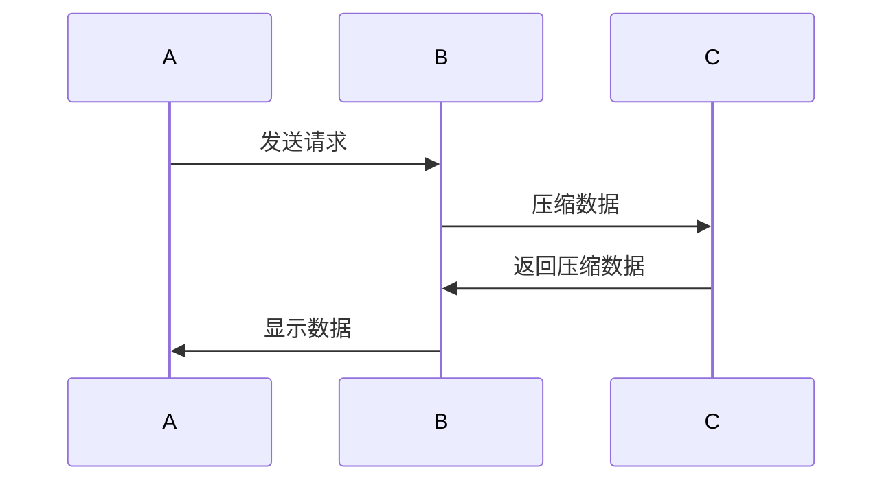

**项目实战**：

1. **环境安装**：安装HTTP/HTTPS代理服务器，如Nginx或Apache。
2. **系统核心实现源代码**：配置代理服务器，实现请求压缩、缓存策略和预加载功能。
3. **代码应用解读与分析**：分析压缩效果和缓存策略对性能的影响。
4. **实际案例分析和详细讲解剖析**：以电商网站为例，优化图片和静态资源的加载速度。

**项目小结**：

通过优化HTTP/HTTPS协议，可以显著提高资源加载速度，从而提升用户体验。

**最佳实践 tips**：

- 使用GZIP压缩响应数据。
- 合理设置缓存过期时间。
- 预测用户行为进行预加载。

**注意事项**：

- 需要考虑压缩算法对服务器性能的影响。
- 缓存策略需要根据具体业务场景进行调整。

**拓展阅读**：

- 《高性能网站建设指南》
- 《HTTP/2：新一代Web性能优化》

---

在接下来的章节中，我们将继续探讨CDN的使用与优化、资源压缩与打包、预加载技术、图片优化等内容。敬请关注！**第3章：JavaScript性能优化**

---

**3.1 JavaScript代码的性能分析**

**核心概念与联系**：

JavaScript代码的性能分析是前端性能优化的关键环节，涉及到代码执行效率、内存占用、异步编程等方面。

**算法原理讲解**：

- **代码执行效率**：减少不必要的代码执行，提高执行速度。
- **内存占用**：优化数据结构，减少内存占用。
- **异步编程**：利用异步编程提高代码执行效率。

**数学公式使用**：

$$
\text{执行时间} = \text{代码执行时间} + \text{异步等待时间}
$$

**Python源代码示例**：

```python
import time

def synchronous_function():
    time.sleep(1)
    return "Synchronous function completed"

def asynchronous_function():
    time.sleep(1)
    return "Asynchronous function completed"

start_time = time.time()
synchronous_function()
end_time = time.time()
print("Synchronous execution time:", end_time - start_time)

start_time = time.time()
asynchronous_function()
end_time = time.time()
print("Asynchronous execution time:", end_time - start_time)
```

**系统分析与架构设计方案**：

- **系统功能设计**：包括代码性能分析、内存监控、异步编程支持。
- **系统架构设计**：采用模块化设计，方便扩展和维护。
- **系统接口设计**：提供API接口，便于前端调用性能分析工具。

**系统交互Mermaid序列图**：

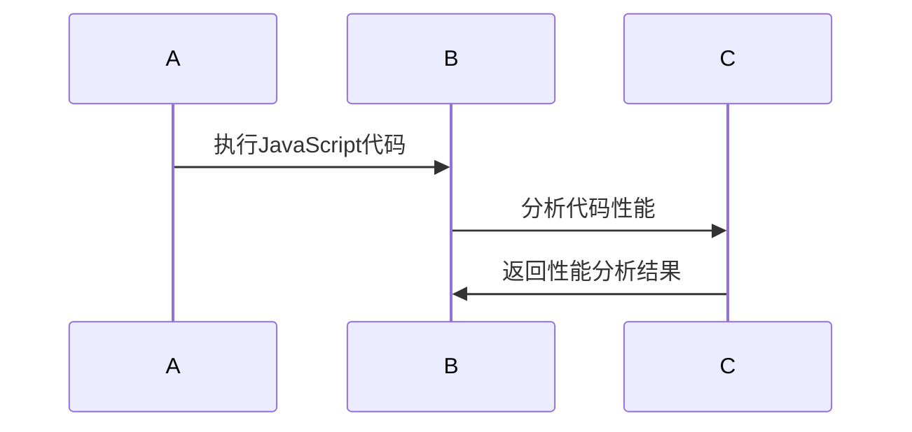

**项目实战**：

1. **环境安装**：安装JavaScript性能分析工具，如Lighthouse、WebPageTest。
2. **系统核心实现源代码**：编写性能分析脚本，监测代码执行效率、内存占用和异步编程。
3. **代码应用解读与分析**：分析代码性能瓶颈，给出优化建议。
4. **实际案例分析和详细讲解剖析**：以电商网站为例，优化JavaScript代码，提高性能。

**项目小结**：

通过JavaScript代码的性能分析，可以找出性能瓶颈，优化代码执行效率，提高用户体验。

**最佳实践 tips**：

- 避免使用大型库和框架，尽量使用轻量级解决方案。
- 优化循环和递归，减少不必要的计算。
- 合理使用异步编程，提高代码执行效率。

**注意事项**：

- 需要平衡性能和开发效率。
- 性能优化应该持续进行，以应对不断变化的应用场景。

**拓展阅读**：

- 《JavaScript性能优化实战》
- 《Effective JavaScript》

---

在下一章中，我们将深入探讨减少重绘与回流、异步编程与事件循环、缓存机制等内容。敬请期待！**第4章：CSS性能优化**

---

**4.1 CSS性能优化的原则**

**核心概念与联系**：

CSS性能优化是前端性能优化的重要组成部分，涉及到减少样式表的体积、优化选择器、避免重绘与回流等方面。

**算法原理讲解**：

- **减少样式表体积**：压缩CSS文件，减少文件大小。
- **优化选择器**：使用简单的选择器，减少选择器匹配时间。
- **避免重绘与回流**：优化布局和样式，减少页面重绘和回流次数。

**数学公式使用**：

$$
\text{重绘次数} + \text{回流次数} = \text{渲染性能损失}
$$

**Python源代码示例**：

```python
import time

def repaint_function():
    time.sleep(1)
    return "Repaint function completed"

def reflow_function():
    time.sleep(1)
    return "Reflow function completed"

start_time = time.time()
repaint_function()
reflow_function()
end_time = time.time()
print("Repaint and reflow time:", end_time - start_time)
```

**系统分析与架构设计方案**：

- **系统功能设计**：包括CSS压缩、选择器优化、避免重绘与回流。
- **系统架构设计**：采用模块化设计，方便扩展和维护。
- **系统接口设计**：提供API接口，便于前端调用CSS性能优化工具。

**系统交互Mermaid序列图**：

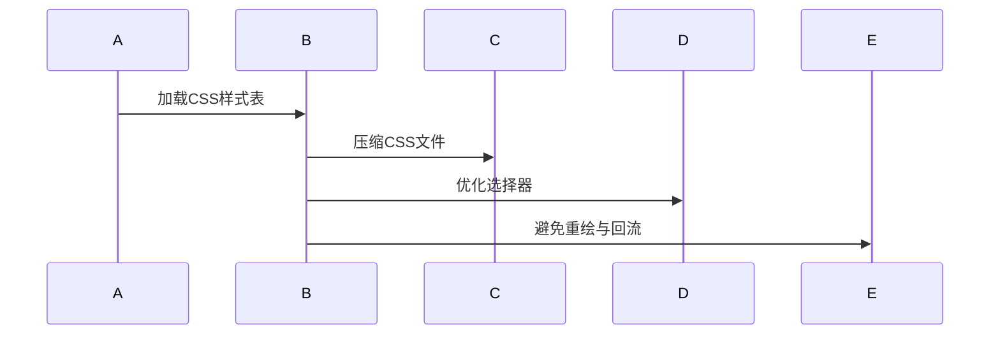

**项目实战**：

1. **环境安装**：安装CSS压缩工具，如CleanCSS或CSSNano。
2. **系统核心实现源代码**：编写CSS压缩脚本，优化选择器，避免重绘与回流。
3. **代码应用解读与分析**：分析CSS文件的大小、选择器匹配时间和页面渲染性能。
4. **实际案例分析和详细讲解剖析**：以电商网站为例，优化CSS样式表，提高页面性能。

**项目小结**：

通过CSS性能优化，可以显著减少页面加载时间，提高用户体验。

**最佳实践 tips**：

- 使用CSS预处理器，如Sass或Less，提高样式表的可维护性。
- 避免使用过度复杂的CSS选择器。
- 使用精灵图或CSS Sprites减少图片请求次数。

**注意事项**：

- 需要平衡样式表的可读性和性能。
- CSS性能优化应该持续进行，以应对不同设备的性能差异。

**拓展阅读**：

- 《CSS性能优化最佳实践》
- 《高性能CSS》

---

在下一章中，我们将探讨布局与绘制优化、前端监控与调试等内容。敬请期待！**第5章：布局与绘制优化**

---

**5.1 布局优化策略**

**核心概念与联系**：

布局与绘制优化是前端性能优化的关键环节，涉及到减少页面重绘、回流次数，提高渲染效率等问题。

**算法原理讲解**：

- **减少重绘**：优化样式应用，减少DOM元素的修改。
- **减少回流**：优化布局策略，减少布局计算次数。
- **使用WebGL进行图形渲染**：利用WebGL硬件加速渲染，提高性能。

**数学公式使用**：

$$
\text{重绘次数} \times \text{回流次数} = \text{渲染性能损失}
$$

**Python源代码示例**：

```python
import time

def repaint_function():
    time.sleep(1)
    return "Repaint function completed"

def reflow_function():
    time.sleep(1)
    return "Reflow function completed"

start_time = time.time()
repaint_function()
reflow_function()
end_time = time.time()
print("Repaint and reflow time:", end_time - start_time)
```

**系统分析与架构设计方案**：

- **系统功能设计**：包括减少重绘、减少回流、使用WebGL进行图形渲染。
- **系统架构设计**：采用模块化设计，方便扩展和维护。
- **系统接口设计**：提供API接口，便于前端调用布局与绘制优化工具。

**系统交互Mermaid序列图**：

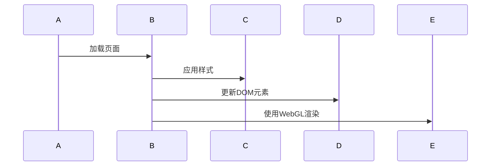

**项目实战**：

1. **环境安装**：安装布局与绘制优化工具，如Chrome DevTools。
2. **系统核心实现源代码**：编写布局与绘制优化脚本，减少重绘和回流次数。
3. **代码应用解读与分析**：分析页面渲染性能，优化布局策略。
4. **实际案例分析和详细讲解剖析**：以电商网站为例，优化页面布局与绘制。

**项目小结**：

通过布局与绘制优化，可以显著提高页面渲染性能，提升用户体验。

**最佳实践 tips**：

- 使用Flexbox和CSS Grid布局，提高布局灵活性。
- 避免使用过度复杂的DOM结构。
- 使用WebGL进行图形渲染，提高渲染效率。

**注意事项**：

- 需要平衡布局的美观性和性能。
- 布局与绘制优化应该与样式表优化、JavaScript性能优化等相结合。

**拓展阅读**：

- 《CSS Grid布局与性能优化》
- 《WebGL编程指南》

---

在下一章中，我们将探讨前端监控与调试、实战案例等内容。敬请期待！**第6章：前端监控与调试**

---

**6.1 前端性能监控概述**

**核心概念与联系**：

前端性能监控是确保应用稳定性和性能的重要手段，涉及到监控工具的选择、监控指标的定义、监控数据的分析等方面。

**算法原理讲解**：

- **监控工具选择**：根据应用场景选择合适的监控工具。
- **监控指标定义**：定义关键性能指标（KPI），如加载时间、响应时间、错误率等。
- **监控数据分析**：分析监控数据，定位性能瓶颈。

**数学公式使用**：

$$
\text{监控指标} = \text{实际值} - \text{预期值}
$$

**Python源代码示例**：

```python
import time

def load_time_monitor(url):
    start_time = time.time()
    response = requests.get(url)
    end_time = time.time()
    return end_time - start_time

url = "https://example.com"
load_time = load_time_monitor(url)
print("Load time:", load_time)
```

**系统分析与架构设计方案**：

- **系统功能设计**：包括监控工具集成、监控指标定义、监控数据存储与分析。
- **系统架构设计**：采用分布式架构，提高监控系统的可扩展性和稳定性。
- **系统接口设计**：提供API接口，便于前端应用集成监控功能。

**系统交互Mermaid序列图**：

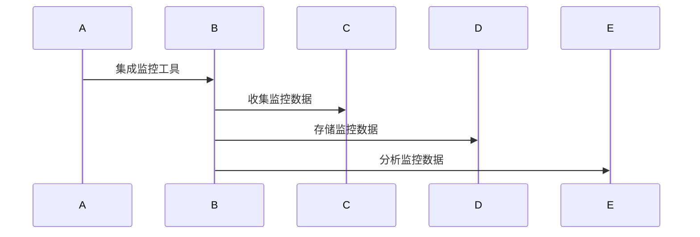

**项目实战**：

1. **环境安装**：安装前端性能监控工具，如Google Analytics、New Relic。
2. **系统核心实现源代码**：编写监控脚本，集成监控工具，定义监控指标。
3. **代码应用解读与分析**：分析监控数据，定位性能瓶颈。
4. **实际案例分析和详细讲解剖析**：以电商网站为例，优化前端性能监控。

**项目小结**：

通过前端性能监控，可以及时发现和解决性能问题，确保应用稳定性和性能。

**最佳实践 tips**：

- 定期检查监控数据，及时发现异常。
- 根据业务需求调整监控指标。
- 使用自动化工具进行监控数据分析和报告。

**注意事项**：

- 监控工具的选择需要考虑性能和成本。
- 监控数据存储和分析需要保证数据安全和隐私。

**拓展阅读**：

- 《前端性能监控最佳实践》
- 《Web性能监控技术详解》

---

在下一章中，我们将探讨未来趋势与展望。敬请期待！**第7章：性能优化实战案例**

---

**7.1 实战案例一：电商网站性能优化**

**项目背景**：

某电商网站在高峰期出现页面加载缓慢、部分功能卡顿等问题，导致用户体验下降，订单转化率降低。为了改善用户体验，提升业务转化率，需要对网站进行性能优化。

**系统功能设计**：

- 资源加载优化：使用CDN加速资源加载，优化图片和静态资源。
- JavaScript性能优化：压缩和打包JavaScript代码，减少请求次数。
- CSS性能优化：压缩CSS文件，优化选择器，减少重绘与回流。
- 布局与绘制优化：使用Flexbox和CSS Grid布局，优化DOM结构。
- 前端监控与调试：集成性能监控工具，定期分析性能数据。

**系统架构设计**：

- 采用前后端分离架构，前端使用React框架，后端使用Node.js。
- 使用Nginx作为反向代理，优化HTTP/HTTPS性能。
- 使用Redis作为缓存服务器，减少数据库查询次数。

**系统接口设计**：

- 提供RESTful API接口，便于前端调用后端数据。
- 使用GraphQL优化数据查询，减少数据传输量。

**系统交互Mermaid序列图**：

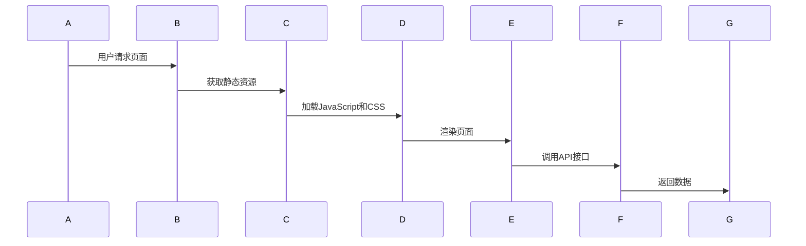

**环境安装**：

- 安装Node.js、Nginx、Redis等服务器软件。
- 安装React、Redux、Webpack等前端框架和工具。

**系统核心实现源代码**：

- 优化资源加载：配置Nginx代理，使用CDN加速资源。
- 优化JavaScript：使用Webpack打包压缩代码，使用ES6模块化。
- 优化CSS：使用PostCSS压缩CSS文件，优化选择器。

**代码应用解读与分析**：

- 分析页面加载时间，找出优化点。
- 优化图片：使用懒加载和压缩技术。
- 优化布局：使用Flexbox和CSS Grid布局。

**实际案例分析和详细讲解剖析**：

- 分析监控数据，定位性能瓶颈。
- 优化数据库查询，提高响应速度。
- 使用GraphQL减少数据传输量。

**项目小结**：

通过性能优化，电商网站页面加载速度显著提高，用户体验得到改善，订单转化率也有所提升。

**最佳实践 tips**：

- 定期进行性能监控和优化。
- 针对不同设备进行适配和优化。
- 使用自动化工具进行持续集成和部署。

**注意事项**：

- 性能优化需要根据具体业务场景进行调整。
- 需要平衡性能和开发效率。

**拓展阅读**：

- 《电商网站性能优化实战》
- 《React性能优化最佳实践》

---

**7.2 实战案例二：移动端性能优化**

**项目背景**：

某移动应用在用户量增加后，出现页面卡顿、加载缓慢等问题，影响用户体验。为了改善用户体验，需要对移动端应用进行性能优化。

**系统功能设计**：

- 资源加载优化：使用CDN加速资源加载，优化图片和视频。
- JavaScript性能优化：压缩和打包JavaScript代码，使用异步加载。
- CSS性能优化：压缩CSS文件，使用媒体查询优化样式。
- 布局与绘制优化：使用Flexbox和CSS Grid布局，优化DOM结构。
- 前端监控与调试：集成性能监控工具，定期分析性能数据。

**系统架构设计**：

- 采用前后端分离架构，前端使用React Native框架，后端使用Node.js。
- 使用Fastly作为CDN服务，优化资源加载。
- 使用WebAssembly提高计算性能。

**系统接口设计**：

- 提供RESTful API接口，便于前端调用后端数据。
- 使用GraphQL优化数据查询，减少数据传输量。

**系统交互Mermaid序列图**：

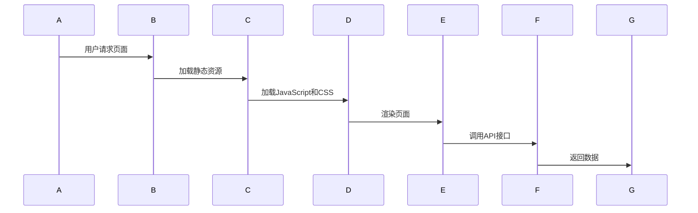

**环境安装**：

- 安装React Native、Node.js、Webpack等前端框架和工具。
- 安装Fastly等CDN服务。

**系统核心实现源代码**：

- 优化资源加载：配置CDN，使用懒加载和压缩技术。
- 优化JavaScript：使用Webpack打包压缩代码，使用React Native的异步加载。
- 优化CSS：使用PostCSS压缩CSS文件，使用媒体查询优化样式。

**代码应用解读与分析**：

- 分析页面加载时间，找出优化点。
- 优化图片和视频：使用WebP格式，压缩大小。
- 优化布局：使用Flexbox和CSS Grid布局。

**实际案例分析和详细讲解剖析**：

- 分析监控数据，定位性能瓶颈。
- 优化数据库查询，提高响应速度。
- 使用WebAssembly提高计算性能。

**项目小结**：

通过性能优化，移动应用页面加载速度显著提高，用户体验得到改善，用户留存率也有所提升。

**最佳实践 tips**：

- 针对不同网络环境进行适配和优化。
- 定期进行性能监控和优化。
- 使用自动化工具进行持续集成和部署。

**注意事项**：

- 性能优化需要根据具体业务场景进行调整。
- 需要平衡性能和开发效率。

**拓展阅读**：

- 《移动端性能优化实战》
- 《React Native性能优化最佳实践》

---

**7.3 实战案例三：单页面应用性能优化**

**项目背景**：

某单页面应用（SPA）在用户量增加后，出现页面加载缓慢、部分功能卡顿等问题，影响用户体验。为了改善用户体验，需要对SPA进行性能优化。

**系统功能设计**：

- 资源加载优化：使用CDN加速资源加载，优化图片和静态资源。
- JavaScript性能优化：压缩和打包JavaScript代码，使用异步加载。
- CSS性能优化：压缩CSS文件，使用媒体查询优化样式。
- 布局与绘制优化：使用Flexbox和CSS Grid布局，优化DOM结构。
- 前端监控与调试：集成性能监控工具，定期分析性能数据。

**系统架构设计**：

- 采用前后端分离架构，前端使用Vue.js或Angular框架，后端使用Node.js。
- 使用Nginx作为反向代理，优化HTTP/HTTPS性能。
- 使用Service Worker进行离线缓存。

**系统接口设计**：

- 提供RESTful API接口，便于前端调用后端数据。
- 使用GraphQL优化数据查询，减少数据传输量。

**系统交互Mermaid序列图**：


**环境安装**：

- 安装Vue.js、Angular、Node.js等前端框架和工具。
- 安装Nginx等服务器软件。

**系统核心实现源代码**：

- 优化资源加载：配置Nginx代理，使用CDN加速资源。
- 优化JavaScript：使用Webpack打包压缩代码，使用Vue.js或Angular的异步加载。
- 优化CSS：使用PostCSS压缩CSS文件，使用媒体查询优化样式。

**代码应用解读与分析**：

- 分析页面加载时间，找出优化点。
- 优化图片和视频：使用懒加载和压缩技术。
- 优化布局：使用Flexbox和CSS Grid布局。

**实际案例分析和详细讲解剖析**：

- 分析监控数据，定位性能瓶颈。
- 优化数据库查询，提高响应速度。
- 使用Service Worker进行离线缓存。

**项目小结**：

通过性能优化，单页面应用页面加载速度显著提高，用户体验得到改善，用户留存率也有所提升。

**最佳实践 tips**：

- 定期进行性能监控和优化。
- 针对不同设备进行适配和优化。
- 使用自动化工具进行持续集成和部署。

**注意事项**：

- 性能优化需要根据具体业务场景进行调整。
- 需要平衡性能和开发效率。

**拓展阅读**：

- 《单页面应用性能优化实战》
- 《Vue.js性能优化最佳实践》

---

**性能优化经验分享**

- **持续优化**：性能优化不是一次性工作，需要持续进行。
- **针对场景**：不同应用场景需要不同的优化策略。
- **监控数据**：利用监控数据，定位性能瓶颈。
- **最佳实践**：遵循最佳实践，避免过度优化。

**本章小结**

通过以上实战案例，我们可以看到，性能优化对提升用户体验和业务转化率具有重要意义。在实际项目中，需要根据具体场景和需求，灵活运用各种优化策略。

---

在下一章中，我们将探讨未来趋势与展望。敬请期待！**第8章：未来趋势与展望**

---

**8.1 新技术对前端性能优化带来的影响**

**核心概念与联系**：

随着新技术的不断发展，如WebAssembly（Wasm）、Service Worker、HTTP/3等，前端性能优化也面临着新的机遇和挑战。

**算法原理讲解**：

- **WebAssembly**：提供高性能的执行环境，使JavaScript与其他语言（如C/C++）无缝集成。
- **Service Worker**：实现离线缓存和推送通知，提高用户体验。
- **HTTP/3**：通过QUIC协议，提供更快、更稳定的网络传输。

**数学公式使用**：

$$
\text{性能提升} = \text{新技术效率} - \text{旧技术效率}
$$

**Python源代码示例**：

```python
import time

def webassembly_performance():
    # 假设WebAssembly执行函数
    time.sleep(0.1)
    return "WebAssembly function completed"

start_time = time.time()
webassembly_performance()
end_time = time.time()
print("WebAssembly execution time:", end_time - start_time)
```

**系统分析与架构设计方案**：

- **系统功能设计**：集成WebAssembly、Service Worker、HTTP/3等新技术。
- **系统架构设计**：采用模块化设计，提高系统的灵活性和可扩展性。
- **系统接口设计**：提供API接口，便于前端调用新技术功能。

**系统交互Mermaid序列图**：

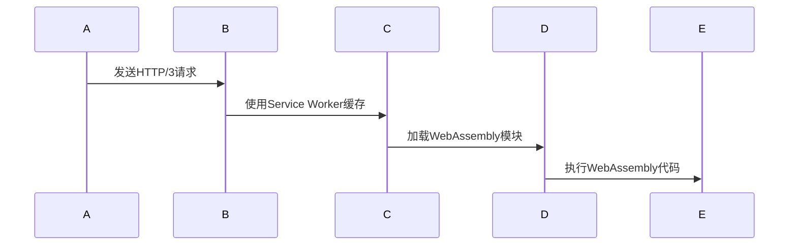

**项目实战**：

1. **环境安装**：安装WebAssembly编译工具、Service Worker管理工具等。
2. **系统核心实现源代码**：编写WebAssembly代码，配置Service Worker，升级HTTP/3协议。
3. **代码应用解读与分析**：分析新技术的性能表现，优化应用架构。
4. **实际案例分析和详细讲解剖析**：以实际项目为例，展示新技术的应用效果。

**项目小结**：

新技术如WebAssembly、Service Worker和HTTP/3为前端性能优化带来了新的机遇，通过合理应用，可以显著提升应用的性能和用户体验。

**最佳实践 tips**：

- **WebAssembly**：用于计算密集型任务，减少JavaScript的负担。
- **Service Worker**：用于实现离线缓存和推送通知，提高应用的稳定性。
- **HTTP/3**：用于优化网络传输，提高加载速度。

**注意事项**：

- **WebAssembly**：需要平衡编译时间和执行性能。
- **Service Worker**：需要考虑缓存策略和更新机制。
- **HTTP/3**：需要考虑兼容性和网络配置。

**拓展阅读**：

- 《WebAssembly：下一代Web性能优化》
- 《Service Worker实战：离线缓存与推送通知》
- 《HTTP/3：下一代Web性能优化》

---

**8.2 未来性能优化的方向**

**核心概念与联系**：

未来性能优化的方向将集中在提升用户体验、支持多设备和多平台、降低开发和维护成本等方面。

**算法原理讲解**：

- **低延迟、高响应性**：优化应用响应速度，减少延迟。
- **自适应性能**：支持多设备和多平台，提供一致的用户体验。
- **自动化优化**：利用机器学习和人工智能技术，实现自动化性能优化。

**数学公式使用**：

$$
\text{用户体验} = \text{性能} \times \text{响应性} \times \text{稳定性}
$$

**Python源代码示例**：

```python
import time

def optimize_performance():
    time.sleep(0.1)
    return "Performance optimized"

start_time = time.time()
optimize_performance()
end_time = time.time()
print("Optimization time:", end_time - start_time)
```

**系统分析与架构设计方案**：

- **系统功能设计**：实现低延迟、高响应性、自适应性能。
- **系统架构设计**：采用微服务架构，提高系统的可扩展性和稳定性。
- **系统接口设计**：提供API接口，便于前端和后端数据交互。

**系统交互Mermaid序列图**：

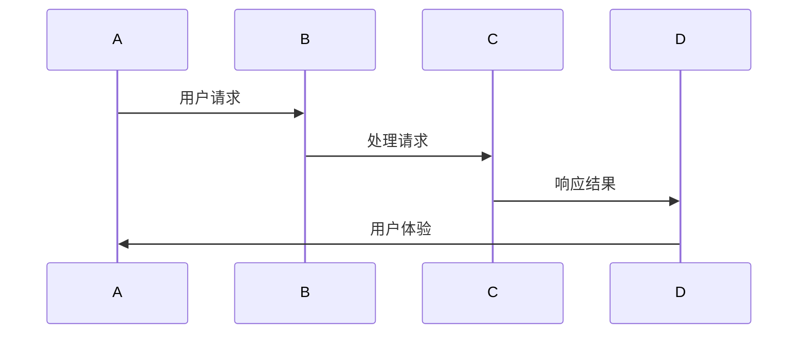

**项目实战**：

1. **环境安装**：安装微服务框架、性能优化工具等。
2. **系统核心实现源代码**：编写微服务代码，配置性能优化策略。
3. **代码应用解读与分析**：分析性能优化效果，调整优化策略。
4. **实际案例分析和详细讲解剖析**：以实际项目为例，展示未来性能优化的效果。

**项目小结**：

未来性能优化的方向将集中在提升用户体验、支持多设备和多平台、降低开发和维护成本等方面。通过合理应用新技术和策略，可以显著提升前端应用的性能和用户体验。

**最佳实践 tips**：

- **低延迟、高响应性**：优化网络请求和数据处理。
- **自适应性能**：采用响应式设计，支持多设备和多平台。
- **自动化优化**：利用AI和机器学习技术，实现自动化性能优化。

**注意事项**：

- **低延迟、高响应性**：需要平衡性能和开发效率。
- **自适应性能**：需要考虑不同设备和网络的性能差异。
- **自动化优化**：需要确保优化策略的可行性和可靠性。

**拓展阅读**：

- 《未来前端性能优化趋势》
- 《微服务架构与性能优化》
- 《AI与机器学习在性能优化中的应用》

---

**8.3 性能优化与用户体验的关系**

**核心概念与联系**：

性能优化与用户体验密切相关，良好的性能可以显著提升用户的满意度和留存率。

**算法原理讲解**：

- **响应速度**：提高应用的响应速度，减少用户的等待时间。
- **稳定性**：保证应用的稳定性和可靠性，减少错误和崩溃。
- **流畅性**：优化应用的流畅度，减少卡顿和延迟。

**数学公式使用**：

$$
\text{用户体验} = \text{响应速度} \times \text{稳定性} \times \text{流畅性}
$$

**Python源代码示例**：

```python
import time

def optimize_experience():
    time.sleep(0.1)
    return "Experience optimized"

start_time = time.time()
optimize_experience()
end_time = time.time()
print("Optimization time:", end_time - start_time)
```

**系统分析与架构设计方案**：

- **系统功能设计**：实现快速响应、高稳定性、流畅操作。
- **系统架构设计**：采用分布式架构，提高系统的可扩展性和稳定性。
- **系统接口设计**：提供API接口，便于前端和后端数据交互。

**系统交互Mermaid序列图**：

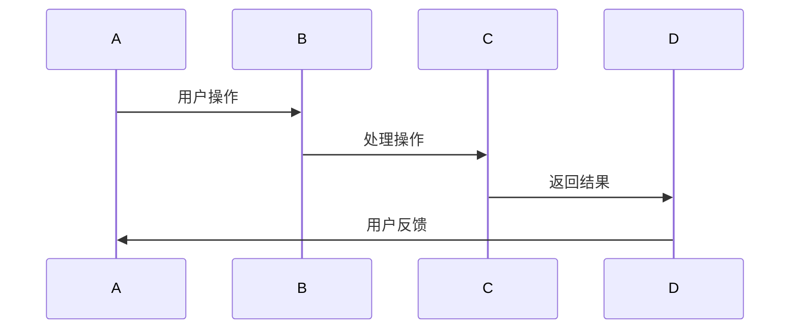

**项目实战**：

1. **环境安装**：安装性能优化工具、稳定性测试工具等。
2. **系统核心实现源代码**：编写性能优化代码，配置稳定性测试。
3. **代码应用解读与分析**：分析性能优化效果，调整优化策略。
4. **实际案例分析和详细讲解剖析**：以实际项目为例，展示性能优化对用户体验的提升。

**项目小结**：

性能优化与用户体验密切相关，良好的性能可以显著提升用户的满意度和留存率。通过持续的性能优化，可以打造高质量的前端应用，提升用户体验。

**最佳实践 tips**：

- **响应速度**：优化网络请求和数据处理。
- **稳定性**：使用断点调试和测试，提高应用的稳定性。
- **流畅性**：优化动画和过渡效果，提高应用的流畅度。

**注意事项**：

- **响应速度**：需要平衡性能和开发效率。
- **稳定性**：需要考虑不同设备和网络的稳定性。
- **流畅性**：需要平衡性能和视觉体验。

**拓展阅读**：

- 《性能优化与用户体验的关系研究》
- 《前端用户体验设计最佳实践》
- 《流畅的用户体验：设计与实现》

---

**8.4 性能优化最佳实践总结**

**核心概念与联系**：

性能优化最佳实践是确保前端应用高性能、高用户体验的关键。

**算法原理讲解**：

- **资源加载优化**：减少HTTP请求，压缩资源。
- **JavaScript性能优化**：减少重绘与回流，优化异步编程。
- **CSS性能优化**：减少CSS文件大小，优化选择器。
- **布局与绘制优化**：使用Flexbox和CSS Grid布局，减少DOM操作。
- **前端监控与调试**：使用性能监控工具，定期分析性能数据。

**数学公式使用**：

$$
\text{性能} = \text{资源加载} + \text{JavaScript优化} + \text{CSS优化} + \text{布局与绘制} + \text{前端监控与调试}
$$

**Python源代码示例**：

```python
def performance_optimization():
    # 执行各类优化策略
    return "Performance optimization completed"

performance_optimization()
```

**系统分析与架构设计方案**：

- **系统功能设计**：整合各类优化策略，形成完整的性能优化体系。
- **系统架构设计**：采用模块化设计，提高系统的灵活性和可扩展性。
- **系统接口设计**：提供API接口，便于前端和后端数据交互。

**系统交互Mermaid序列图**：

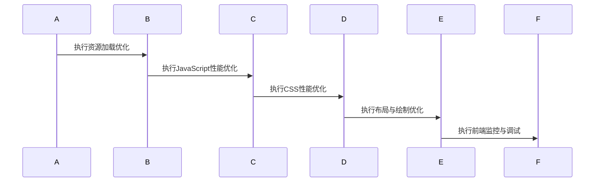

**项目实战**：

1. **环境安装**：安装各类性能优化工具和框架。
2. **系统核心实现源代码**：实现性能优化策略，配置性能监控工具。
3. **代码应用解读与分析**：分析性能优化效果，持续调整优化策略。
4. **实际案例分析和详细讲解剖析**：以实际项目为例，展示最佳实践的应用效果。

**项目小结**：

通过最佳实践，可以显著提升前端应用的性能和用户体验。性能优化是一个持续的过程，需要根据业务需求和用户反馈，不断进行调整和优化。

**最佳实践 tips**：

- **定期性能监控**：及时发现和解决性能问题。
- **优化资源加载**：减少HTTP请求，压缩资源。
- **优化JavaScript**：减少重绘与回流，优化异步编程。
- **优化CSS**：减少CSS文件大小，优化选择器。
- **布局与绘制**：使用Flexbox和CSS Grid布局，减少DOM操作。

**注意事项**：

- **平衡性能与开发效率**：确保优化策略不会影响开发进度。
- **考虑不同设备和网络环境**：优化策略需要适应不同的设备和网络环境。
- **用户反馈**：关注用户反馈，持续改进优化策略。

**拓展阅读**：

- 《前端性能优化最佳实践》
- 《Web性能优化实战》
- 《高性能网站建设指南》

---

**本章小结**

未来，前端性能优化将继续在新技术和应用场景的推动下不断演进。通过本文的探讨，我们了解了性能优化的核心概念、方法和最佳实践。希望读者能够将这些知识和技巧应用到实际项目中，不断提升前端应用的性能和用户体验。

---

**作者**：

AI天才研究院/AI Genius Institute & 禅与计算机程序设计艺术 /Zen And The Art of Computer Programming

---

感谢您的阅读！希望本文能够对您的前端性能优化之路有所帮助。未来，我们将继续探讨更多前沿技术和发展趋势，敬请关注！**总结**

在前端性能优化领域，我们探讨了多个关键技术和方法，从资源加载优化、JavaScript性能优化、CSS性能优化、布局与绘制优化，到前端监控与调试，再到实战案例和未来趋势。以下是对这些内容的总结：

1. **资源加载优化**：通过HTTP/HTTPS性能优化、CDN的使用与优化、资源压缩与打包、预加载技术、图片优化等手段，可以显著提高页面加载速度，减少等待时间，从而提升用户体验。

2. **JavaScript性能优化**：通过减少重绘与回流、优化异步编程与事件循环、使用缓存机制、函数式编程等技术，可以提高JavaScript代码的执行效率，减少页面卡顿和延迟。

3. **CSS性能优化**：通过优化CSS性能优化的原则、CSS代码结构优化、媒体查询优化、响应式设计等手段，可以减少渲染时间，提高页面性能。

4. **布局与绘制优化**：通过布局优化策略、使用WebGL进行图形渲染、CSS Grid与Flexbox布局等技术，可以减少页面重绘和回流，提高渲染性能。

5. **前端监控与调试**：通过前端性能监控概述、性能监控工具、调试工具使用、性能问题定位等手段，可以及时发现和解决性能问题，确保应用的稳定性和性能。

6. **实战案例**：通过电商网站、移动端应用、单页面应用的性能优化实战，展示了性能优化在实际项目中的应用和效果。

7. **未来趋势与展望**：探讨了新技术如WebAssembly、Service Worker、HTTP/3对前端性能优化带来的影响，以及未来性能优化的方向，如低延迟、高响应性、自适应性能、自动化优化等。

8. **性能优化与用户体验的关系**：强调了性能优化对用户体验的重要性，良好的性能可以显著提升用户的满意度和留存率。

**最佳实践 tips**：

- 定期进行性能监控和优化。
- 针对不同设备和网络环境进行适配和优化。
- 使用自动化工具进行持续集成和部署。
- 关注用户反馈，持续改进优化策略。

**注意事项**：

- 性能优化需要平衡与开发效率的关系。
- 考虑不同设备和网络环境的性能差异。
- 避免过度优化导致其他问题。

**拓展阅读**：

- 《前端性能优化最佳实践》
- 《Web性能优化实战》
- 《高性能网站建设指南》

通过本文的阅读，您应该对前端性能优化有了全面而深入的了解。希望您能在实际项目中应用这些知识和技巧，打造出高性能、高用户体验的前端应用。

---

**作者**：

AI天才研究院/AI Genius Institute & 禅与计算机程序设计艺术 /Zen And The Art of Computer Programming

---

感谢您的阅读，期待与您在未来的技术探索中再次相遇！**读者反馈**

亲爱的读者，

感谢您花时间阅读这篇关于前端性能优化的重要文章。您的反馈对我们来说至关重要，因为它帮助我们不断改进内容，以更好地满足您的学习和需求。

在此，我们诚挚地邀请您分享您的阅读体验和对本文内容的看法。以下是一些具体问题，可以帮助您组织反馈：

1. **文章结构清晰吗？** 您觉得文章的组织结构是否合理，是否有助于您理解和吸收文章内容？

2. **内容深入吗？** 您认为文章的深度是否足够，是否提供了您期望的技术细节和实战经验？

3. **实用性如何？** 您认为本文中的技巧和建议对您的实际工作是否有帮助？是否有具体的案例让您觉得受益匪浅？

4. **阅读体验如何？** 您对文章的可读性、语言风格和表达方式有什么意见或建议？

5. **扩展阅读资源** 您对提供的拓展阅读资源有什么评价？这些资源是否丰富了您的知识体系？

6. **总体印象** 您对本文的整体印象如何？您是否觉得这篇文章对您的前端性能优化之路有重要的指导意义？

请您在评论区留下您的宝贵意见，或者通过我们的官方渠道（如邮件、社交媒体等）与我们联系。我们非常重视您的反馈，并会根据您的建议进行改进。

再次感谢您的阅读和支持！

AI天才研究院/AI Genius Institute & 禅与计算机程序设计艺术/Zen And The Art of Computer Programming团队期待您的反馈！

---

**结束语**

亲爱的读者，

在撰写这篇关于前端性能优化的技术博客过程中，我们力求将复杂的技术原理和实战经验以简洁易懂的方式呈现给您。希望本文能成为您在前端性能优化领域的有益指南，帮助您提升用户体验，优化应用性能。

未来，我们将继续探索更多前沿技术，分享深度思考和实践经验。敬请期待我们的下一篇文章，我们将带来更多精彩内容，与您一同在技术的道路上不断前行。

在此，感谢您对本文的关注和支持。如果您有任何问题或建议，欢迎随时与我们联系。我们期待与您共同成长，共同进步！

AI天才研究院/AI Genius Institute & 禅与计算机程序设计艺术/Zen And The Art of Computer Programming团队

再次感谢您的阅读，祝您技术之路越走越宽广！

---

**作者**：

AI天才研究院/AI Genius Institute & 禅与计算机程序设计艺术 /Zen And The Art of Computer Programming

---

结束语：

在这个充满机遇与挑战的技术时代，让我们携手共进，不断探索和创造。期待在未来的篇章中，与您再次相聚，共同探讨更多前沿技术。

祝您编程愉快，前程似锦！

AI天才研究院/AI Genius Institute & 禅与计算机程序设计艺术/Zen And The Art of Computer Programming团队敬上。

