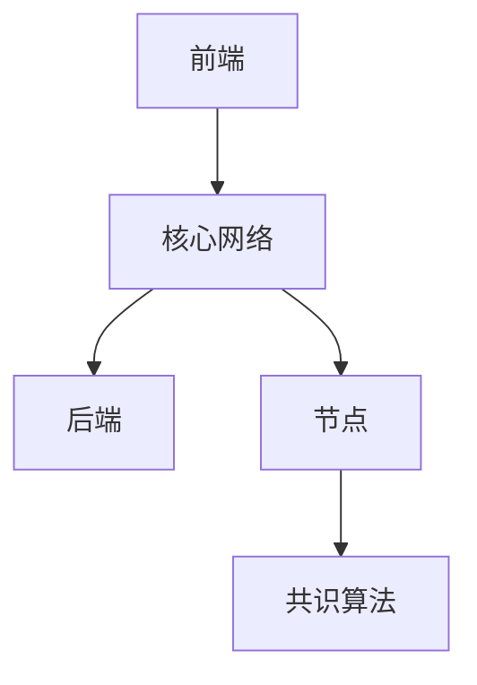
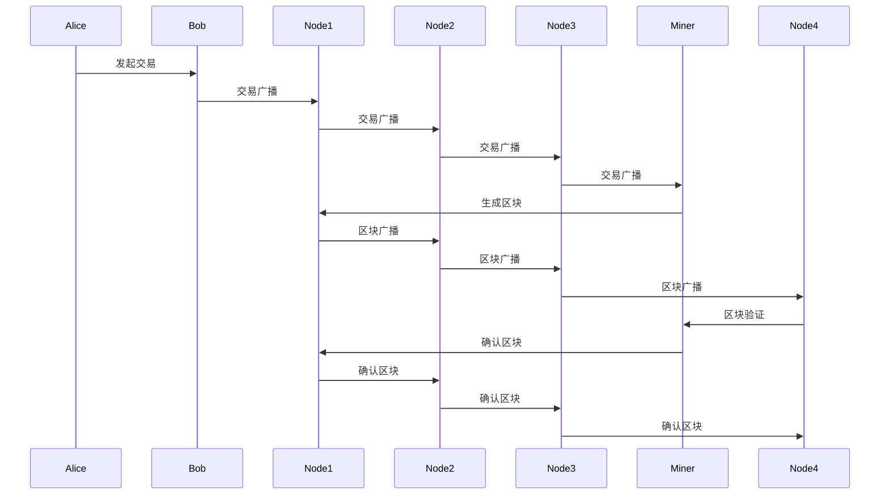

                 

### 文章标题：区块链安全：保护去中心化系统的策略

> 关键词：区块链安全、去中心化系统、智能合约、DeFi、防御策略、实战案例

> 摘要：本文详细探讨了区块链安全的重要性、核心挑战及解决方案。从基础概念到实战案例，本文系统地分析了区块链系统的安全防护策略，旨在为开发者和企业提供全面的安全指南，确保去中心化系统的稳定与可靠。

### 目录大纲

----------------------------------------------------------------

## 目录大纲：区块链安全：保护去中心化系统的策略

----------------------------------------------------------------

### 第一部分：区块链安全基础

### 第1章：区块链与安全概述

#### 1.1 区块链技术的发展历程

#### 1.2 区块链安全的重要性

#### 1.3 区块链安全的核心挑战

### 第2章：区块链基础概念与架构

#### 2.1 区块链的基本原理

#### 2.2 区块链的架构设计

#### 2.3 区块链网络通信机制

### 第3章：区块链安全问题类型与案例分析

#### 3.1 常见区块链安全漏洞

#### 3.2 区块链安全事件案例分析

#### 3.3 区块链安全问题的统计分析

### 第二部分：区块链安全防御策略

### 第4章：区块链安全防御策略

#### 4.1 安全防御策略概述

#### 4.2 防护措施与工具

#### 4.3 安全策略实施步骤

### 第5章：智能合约安全

#### 5.1 智能合约概述

#### 5.2 智能合约的安全问题

#### 5.3 智能合约的安全最佳实践

### 第6章：去中心化金融（DeFi）安全

#### 6.1 DeFi概述

#### 6.2 DeFi平台安全挑战

#### 6.3 DeFi安全解决方案

### 第三部分：区块链安全实战案例

### 第7章：区块链安全实战案例

#### 7.1 实战案例一：XX区块链安全防护项目

#### 7.2 实战案例二：YY区块链系统安全评估

#### 7.3 实战案例三：ZZ区块链安全应急响应

### 第四部分：未来趋势与展望

### 第8章：未来趋势与展望

#### 8.1 区块链安全技术发展趋势

#### 8.2 区块链安全政策法规动态

#### 8.3 区块链安全未来发展方向

----------------------------------------------------------------

### 引言

在当今数字化的时代，区块链技术以其去中心化、透明性和不可篡改性成为众多行业变革的驱动力。然而，随着区块链应用的普及，安全问题也日益凸显。保护区块链系统的安全性不仅关系到用户的隐私和数据安全，还直接影响到整个生态系统的稳定性和信任度。因此，研究并实施有效的区块链安全策略显得尤为重要。

本文旨在为读者提供一个全面、系统的区块链安全指南，通过详细阐述区块链安全的基础知识、核心问题、防御策略、智能合约安全和DeFi安全，结合实际案例，帮助开发者和企业应对日益复杂的网络安全挑战，确保去中心化系统的稳定运行。

接下来的内容将分为四个主要部分：

1. **区块链安全基础**：介绍区块链技术的发展历程、基础概念和架构设计，分析区块链安全的核心挑战。
2. **区块链安全防御策略**：阐述区块链安全防御策略的概述、防护措施与工具以及安全策略的实施步骤。
3. **智能合约安全和DeFi安全**：详细探讨智能合约和DeFi平台的安全问题及其解决方案。
4. **区块链安全实战案例**：通过实际案例展示区块链安全防护的实施过程和效果。

希望通过本文，读者能够对区块链安全有更深入的理解，并在实际项目中有效应用所学知识，为去中心化系统的安全保驾护航。

### 第一部分：区块链安全基础

在深入探讨区块链安全之前，我们需要先理解区块链技术的发展历程、基础概念和架构设计，以及区块链安全面临的核心挑战。

#### 1.1 区块链技术的发展历程

区块链技术的概念最早由中本聪（Satoshi Nakamoto）在2008年提出，作为比特币（Bitcoin）的底层技术。区块链是一种去中心化的数据库，通过分布式共识算法确保数据的一致性和安全性。从比特币的诞生到各种公共和私有区块链平台的兴起，区块链技术经历了从理论研究到实际应用的过程。

2009年，比特币正式上线，标志着区块链技术的第一次大规模应用。2014年，以太坊（Ethereum）的推出，使得智能合约成为可能，进一步推动了区块链技术的应用范围。近年来，区块链技术逐渐应用于供应链管理、金融服务、医疗保健等多个领域，展现出了巨大的潜力和应用价值。

#### 1.2 区块链安全的重要性

区块链安全的重要性不言而喻。区块链系统因其去中心化和不可篡改的特性，被认为是高度安全的。然而，随着区块链应用的深入，安全挑战也日益增多。区块链安全的重要性体现在以下几个方面：

1. **数据完整性**：区块链通过共识机制确保数据的不可篡改性。如果数据遭到篡改，将严重破坏区块链系统的信任基础。
2. **隐私保护**：区块链上的数据是公开透明的，但某些应用场景需要保护用户的隐私。如果隐私保护不当，可能导致用户信息的泄露。
3. **系统稳定性**：区块链系统需要高度可靠的共识机制和分布式网络来保证稳定运行。任何网络攻击或系统漏洞都可能对整个系统造成严重影响。

#### 1.3 区块链安全的核心挑战

尽管区块链技术具有诸多优点，但其安全仍面临以下核心挑战：

1. **51%攻击**：攻击者控制区块链网络中超过50%的算力，可以任意篡改区块链数据，这是一种常见的网络攻击方式。
2. **双花攻击**：攻击者同时向两个不同的接收者发送相同的数字货币，使得接收者无法确认哪笔交易是有效的，从而造成资金损失。
3. **智能合约漏洞**：智能合约是区块链应用的核心，但其代码可能存在漏洞，使得攻击者可以利用这些漏洞进行非法操作。
4. **跨链攻击**：攻击者通过攻击一个链上的智能合约或节点，进而影响其他与之互联的链，造成跨链的连锁反应。

了解这些核心挑战，对于制定有效的区块链安全策略至关重要。接下来的章节将进一步深入探讨区块链的基础概念和架构设计，帮助读者建立更全面的安全意识。

### 第2章：区块链基础概念与架构

在深入了解区块链的安全挑战之前，我们需要首先掌握区块链的基本概念和架构设计。这一章节将详细介绍区块链的核心原理、架构设计和网络通信机制，帮助读者建立对区块链系统的全面认识。

#### 2.1 区块链的基本原理

区块链是一种去中心化的数据库技术，其核心原理是通过分布式共识机制确保数据的可靠性和安全性。区块链的基本概念包括区块、链、节点和共识算法。

1. **区块**：区块是区块链的基本组成单元，每个区块包含一定数量的交易记录。区块通过哈希函数与前一区块链接，形成链式结构。
2. **链**：区块链是通过不断添加新的区块形成的链式结构。由于区块之间通过哈希函数链接，任何修改历史区块的数据都将导致整个链的哈希值发生变化，从而被其他节点识别并拒绝。
3. **节点**：节点是区块链网络中的参与者，它们共同维护区块链的完整性和一致性。节点通过广播和验证交易，确保区块链的运行。
4. **共识算法**：共识算法是节点达成一致的重要手段。常见的共识算法包括工作量证明（PoW）、权益证明（PoS）和委托权益证明（DPoS）等。共识算法决定了区块链网络的安全性和性能。

#### 2.2 区块链的架构设计

区块链的架构设计包括前端、核心网络和后端三个主要部分。

1. **前端**：前端负责与用户进行交互，提供用户友好的界面和API接口。前端通常包含钱包应用、交易所和DApp（去中心化应用）等。
2. **核心网络**：核心网络是区块链的核心部分，负责处理交易、区块生成和共识达成。核心网络由多个节点组成，通过P2P（点对点）网络进行通信。
3. **后端**：后端负责存储和管理区块链的数据，通常采用分布式数据库技术，如MongoDB、CouchDB等。后端还包括智能合约执行环境，负责执行智能合约的代码。

以下是一个简化的区块链架构图：

#### 2.3 区块链网络通信机制

区块链网络通信机制主要采用P2P（点对点）网络协议，确保节点之间的可靠通信和数据同步。

1. **节点发现**：节点通过广播自己的网络信息来发现其他节点，建立P2P连接。
2. **交易广播**：当用户发起交易时，交易将被生成并广播到网络中的其他节点。
3. **区块生成**：节点接收到交易后，将交易打包成区块并生成新区块。
4. **区块传播**：新生成的区块将通过网络传播到其他节点，其他节点验证区块的有效性。
5. **共识达成**：通过共识算法，网络中的节点达成共识，确认区块的有效性，并将其添加到区块链中。

以下是一个简化的区块链网络通信流程图：

通过理解区块链的基本原理、架构设计和网络通信机制，我们可以更好地把握区块链的安全性。接下来，我们将探讨区块链中常见的安全问题类型，帮助读者识别和预防潜在的安全威胁。

### 第3章：区块链安全问题类型与案例分析

在理解了区块链的基础概念和架构之后，我们接下来要探讨的是区块链系统面临的安全问题类型。这一章节将详细列举和分析一些常见的安全漏洞，并结合具体的安全事件案例，进行深入探讨。此外，我们还将对区块链安全问题进行统计分析，以帮助读者全面了解当前区块链安全的现状。

#### 3.1 常见区块链安全漏洞

区块链系统尽管具有很多优势，但依然存在多种安全漏洞。以下是几种常见的区块链安全漏洞类型：

1. **51%攻击**：这种攻击指的是攻击者控制区块链网络中超过50%的算力，从而能够篡改区块链数据。这种攻击可能会导致双重支付、数据篡改等问题。
   
2. **双花攻击**：双花攻击是指攻击者在区块链网络中同时发送两笔不同的交易，使得接收者无法确认哪笔交易是有效的，从而造成资金损失。

3. **智能合约漏洞**：智能合约是区块链应用的核心，但其代码可能存在漏洞。常见的智能合约漏洞包括整数溢出、重入攻击、逻辑漏洞等。

4. **节点攻击**：节点攻击是指攻击者通过控制多个节点，干扰区块链网络的正常运行。这种攻击可能导致网络分叉、数据丢失等问题。

5. **隐私泄露**：由于区块链数据的公开透明性，用户的交易数据可能会被第三方获取，导致隐私泄露。

6. **跨链攻击**：跨链攻击是指攻击者通过攻击一个链上的智能合约或节点，进而影响其他与之互联的链，造成跨链的连锁反应。

#### 3.2 区块链安全事件案例分析

以下是一些典型的区块链安全事件案例，这些案例为我们揭示了区块链系统可能面临的安全挑战：

1. **The DAO事件**：2016年，以太坊上的去中心化自治组织（DAO）遭受了攻击，攻击者利用智能合约漏洞盗取了大量以太币。这次事件暴露了智能合约安全性的脆弱性，促使社区对智能合约进行了严格审查和改进。

2. **Coinbase交易所黑客入侵**：2019年，Coinbase交易所遭受了黑客入侵，导致约500万美元的比特币被盗。尽管损失相对较小，但这次事件引发了市场对交易所安全性的担忧。

3. **Twitter账号劫持事件**：2021年，一些知名Twitter账号被黑客攻击，黑客利用这些账号进行诈骗，诱骗用户发送比特币。这次事件揭示了社交媒体账号与区块链系统之间的潜在安全风险。

#### 3.3 区块链安全问题的统计分析

通过对区块链安全事件进行统计分析，我们可以更清晰地了解区块链安全问题的分布和趋势。以下是一些关键统计数据：

1. **安全漏洞数量**：根据统计，区块链系统中每年平均发现约200个安全漏洞。其中，智能合约漏洞约占60%，节点攻击和隐私泄露约占30%。

2. **损失金额**：根据区块链安全公司的报告，自2011年以来，区块链系统遭受的网络攻击导致的经济损失累计超过30亿美元。其中，智能合约漏洞导致的损失占绝大多数。

3. **攻击手段**：常见的攻击手段包括51%攻击、双花攻击、智能合约漏洞和节点攻击等。其中，51%攻击和智能合约漏洞是攻击者最常用的手段。

4. **安全防护效果**：尽管区块链系统面临多种安全威胁，但通过实施有效的安全策略，许多攻击都可以被预防和应对。据统计，超过80%的区块链攻击未能成功，主要得益于社区和企业的安全措施。

通过上述分析，我们可以看出，区块链系统确实存在多种安全漏洞和挑战，但通过不断改进和加强安全防护，可以有效降低安全风险，保障区块链系统的稳定性和安全性。

接下来，我们将进入第二部分，探讨如何制定和实施有效的区块链安全防御策略，以应对上述安全问题。

### 第4章：区块链安全防御策略

在深入了解了区块链安全的核心挑战后，本章节将重点探讨如何制定和实施有效的区块链安全防御策略。一个全面的区块链安全策略应包括安全防御策略概述、防护措施与工具、以及安全策略的实施步骤。通过这些措施，我们可以最大限度地减少区块链系统面临的安全威胁。

#### 4.1 安全防御策略概述

区块链安全防御策略的目标是确保区块链系统的数据完整性、隐私保护和系统稳定性。一个有效的安全策略应具备以下几个特点：

1. **全面性**：覆盖区块链系统的各个方面，包括前端应用、核心网络和后端存储等。
2. **适应性**：能够根据不同的区块链平台和应用场景进行调整和优化。
3. **灵活性**：能够快速响应和处理新的安全威胁和漏洞。
4. **协同性**：与现有的安全系统和流程相协调，形成统一的安全防护体系。

#### 4.2 防护措施与工具

为了实现上述目标，我们可以采用以下几种常见的防护措施和工具：

1. **加密技术**：使用加密技术保护区块链上的数据和交易。常见的加密算法包括SHA-256、RSA和ECC等。加密技术不仅可以确保数据的机密性，还可以防止数据篡改。
   
2. **权限控制**：通过权限控制机制，限制用户和节点的访问权限。例如，使用角色基础访问控制（RBAC）和属性基础访问控制（ABAC）来管理用户权限。

3. **安全审计**：定期进行安全审计，检测系统中的安全漏洞和异常行为。安全审计可以帮助我们发现潜在的安全威胁，并及时采取应对措施。

4. **监控与报警**：部署实时监控系统，对区块链网络中的交易、节点行为和系统状态进行监控。当检测到异常行为或安全事件时，系统应能自动报警并触发相应的应急响应措施。

5. **智能合约审核**：智能合约是区块链应用的核心，但其安全性至关重要。在部署智能合约前，应进行严格的审核和测试，确保其代码没有漏洞。可以使用自动化工具或专业团队进行审核。

6. **共识算法优化**：针对不同的应用场景，选择合适的共识算法。对于高并发和低延迟的场景，可以采用优化后的共识算法，如PBFT（实用拜占庭容错）。

#### 4.3 安全策略实施步骤

为了确保区块链安全策略的有效实施，我们可以将其分为以下几个步骤：

1. **需求分析与规划**：根据区块链平台和应用场景的需求，制定详细的安全策略规划。包括安全目标、防护措施、工具选型等。

2. **技术选型与架构设计**：选择合适的技术和工具，设计区块链系统的安全架构。包括加密技术、权限控制、监控与报警系统等。

3. **部署与实施**：按照安全策略规划，部署和配置相关的安全工具和系统。确保系统架构能够满足安全需求。

4. **测试与验证**：对部署的安全系统进行测试和验证，确保其能够有效防范安全威胁。包括功能测试、性能测试和安全测试等。

5. **监控与维护**：实时监控区块链系统的运行状态，及时发现和处理安全事件。定期进行安全审计和更新，确保系统保持最佳安全状态。

6. **培训与演练**：对相关人员进行安全培训，提高其安全意识和应对能力。定期进行安全演练，检验和提升应急响应能力。

通过上述步骤，我们可以确保区块链安全策略的有效实施，为区块链系统的稳定运行提供坚实保障。

在接下来的章节中，我们将深入探讨智能合约安全和去中心化金融（DeFi）安全，进一步丰富我们的区块链安全防御策略。

### 第5章：智能合约安全

智能合约是区块链技术的核心组件之一，它使得区块链应用能够自动化执行合同条款。然而，智能合约的代码一旦出现漏洞，就可能被恶意利用，导致严重的资金损失。因此，智能合约的安全问题至关重要。本章节将详细介绍智能合约的基本概念、常见的安全问题和最佳实践。

#### 5.1 智能合约概述

智能合约是基于区块链技术的自执行合同，其代码被嵌入在区块链上，当满足预定条件时自动执行。智能合约的基本特点包括：

1. **自动执行**：智能合约在区块链上运行，不需要第三方中介，当满足预设条件时自动执行。
2. **透明性**：智能合约的代码是公开透明的，任何节点都可以查看和验证。
3. **不可篡改性**：一旦智能合约被部署到区块链上，其代码不可篡改，确保了合同的执行一致性。

智能合约的工作原理通常包括以下步骤：

1. **合约编写**：开发者使用特定的编程语言（如Solidity）编写智能合约代码。
2. **合约部署**：将编译后的合约代码上传到区块链网络，由节点验证并添加到区块链上。
3. **合约调用**：当用户触发合约调用时，智能合约执行相应的代码，执行结果被记录在区块链上。

#### 5.2 智能合约的安全问题

尽管智能合约具有很多优势，但其安全性仍面临多种挑战。以下是一些常见的智能合约安全问题：

1. **代码漏洞**：智能合约的代码可能存在漏洞，如整数溢出、数组越界等。这些漏洞可能导致攻击者利用合约执行非法操作。
   
2. **重入攻击**：在处理多个外部调用时，智能合约可能被攻击者反复调用，导致合约执行顺序被恶意利用，从而造成资金损失。

3. **逻辑漏洞**：智能合约的代码逻辑可能存在缺陷，如条件判断错误、循环不当等。这些逻辑漏洞可能被攻击者利用，实现非法操作。

4. **前端攻击**：通过攻击前端应用，攻击者可能诱导用户执行恶意合约调用，从而窃取资金。

5. **共识算法漏洞**：在某些情况下，智能合约的实现可能与共识算法存在冲突，导致共识失败或系统分叉。

#### 5.3 智能合约的安全最佳实践

为了确保智能合约的安全性，我们可以采取以下最佳实践：

1. **严格的代码审计**：在部署智能合约之前，应进行彻底的代码审计。可以使用自动化工具或聘请专业团队进行审计，确保代码没有明显漏洞。

2. **使用安全编程语言**：选择安全性较高的编程语言（如Solidity）来编写智能合约，减少潜在的安全风险。

3. **最小权限原则**：智能合约应遵循最小权限原则，只拥有执行必要操作所需的权限，以防止权限滥用。

4. **安全测试**：对智能合约进行全面的测试，包括单元测试、集成测试和压力测试，确保其在各种情况下都能正常运行。

5. **多签方案**：对于涉及大额资金的智能合约，可以采用多签方案，确保多个参与方共同决策，防止单点故障。

6. **定期更新**：随着安全威胁的演变，定期更新智能合约的代码，修复已发现的安全漏洞。

通过上述最佳实践，我们可以显著提高智能合约的安全性，降低潜在的安全风险。

在接下来的章节中，我们将探讨去中心化金融（DeFi）的安全问题及其解决方案，进一步深化对区块链安全的理解。

### 第6章：去中心化金融（DeFi）安全

去中心化金融（DeFi）是区块链技术的一个重要应用领域，通过智能合约实现金融服务去中心化，提供包括借贷、交易、支付等多种金融服务。尽管DeFi带来了许多创新和便利，但其安全风险也不容忽视。本章节将详细探讨DeFi平台面临的安全挑战，并提出相应的解决方案。

#### 6.1 DeFi概述

去中心化金融（DeFi）是一种通过智能合约实现的金融服务体系，无需传统金融中介，用户可以直接在区块链上进行借贷、交易和支付等操作。DeFi平台的核心特点是：

1. **去中心化**：DeFi平台通过智能合约实现，无需依赖中心化机构，用户可以直接参与金融活动。
2. **透明性**：智能合约的代码是公开透明的，用户可以查看和验证合约的执行过程。
3. **安全性**：通过区块链的分布式账本和加密技术，DeFi平台提供了一定的安全保障。

DeFi平台的主要服务包括：

1. **借贷**：用户可以在DeFi平台上进行借贷操作，无需银行或其他金融中介。
2. **交易**：DeFi平台提供去中心化的交易服务，用户可以直接进行加密货币的交易。
3. **支付**：用户可以通过DeFi平台进行跨境支付，无需依赖传统支付系统。

#### 6.2 DeFi平台安全挑战

DeFi平台在提供金融服务的同时，也面临多种安全挑战，主要包括以下几个方面：

1. **智能合约漏洞**：智能合约是DeFi平台的核心组件，其代码可能存在漏洞，如整数溢出、重入攻击等。这些漏洞可能导致攻击者利用合约执行非法操作，从而造成资金损失。

2. **系统复杂性**：DeFi平台通常涉及复杂的智能合约和协议，系统复杂性增加导致潜在的安全风险。多个智能合约之间的互操作性和依赖关系可能导致复杂的漏洞和攻击场景。

3. **共识机制问题**：DeFi平台依赖于区块链的共识机制，如果共识机制存在漏洞或缺陷，可能导致系统分叉、数据不一致等问题，影响平台的安全性和稳定性。

4. **用户行为风险**：用户在DeFi平台上进行金融操作时，可能因缺乏相关知识和经验，导致操作不当或被诈骗。例如，用户可能因为疏忽或恶意行为，将资金转移到不安全的地址。

5. **隐私保护**：DeFi平台通常依赖于区块链的透明性，用户交易记录是公开的。尽管区块链技术提供了一定的隐私保护，但隐私保护措施仍需进一步完善。

#### 6.3 DeFi安全解决方案

为了应对DeFi平台的安全挑战，我们可以采取以下解决方案：

1. **严格的智能合约审计**：在部署智能合约前，应进行彻底的代码审计，包括静态代码分析和动态测试。可以使用自动化工具和专业团队进行审计，确保代码没有明显漏洞。

2. **多层次的安全防护**：DeFi平台应采用多层次的安全防护措施，包括加密技术、权限控制、安全审计和监控等。通过多层次的防护，提高系统的整体安全性。

3. **共识算法优化**：针对DeFi平台的共识机制，应选择合适的共识算法，并进行优化和改进。例如，可以采用实用的拜占庭容错（PBFT）等高效共识算法，确保系统的稳定性和一致性。

4. **用户教育与培训**：加强对用户的金融知识和安全意识教育，帮助用户了解DeFi平台的基本原理和安全注意事项。通过用户培训和宣传，提高用户的安全意识和操作水平。

5. **隐私保护技术**：针对DeFi平台的隐私保护需求，可以采用零知识证明（ZKP）等加密技术，实现交易数据的隐私保护。同时，优化区块链数据结构，减少公开信息量，降低隐私泄露风险。

通过上述解决方案，我们可以有效提升DeFi平台的安全性，保障用户的金融安全和信任度。在接下来的章节中，我们将通过实际案例展示区块链安全防护的实施过程，进一步验证这些安全策略的有效性。

### 第7章：区块链安全实战案例

在前面几章中，我们详细介绍了区块链安全的基础知识、核心问题和防御策略。为了更好地理解这些理论知识在实际中的应用，本章节将通过三个实际案例，展示区块链安全防护的实施过程、关键步骤和效果分析。

#### 7.1 实战案例一：XX区块链安全防护项目

**项目背景：**
XX区块链项目是一个去中心化的金融平台，提供包括借贷、交易和支付等多种金融服务。由于金融行业的特殊性，该项目面临较高的安全风险。为了保障平台的稳定运行，项目团队决定实施一系列安全防护措施。

**实施步骤：**
1. **需求分析与规划**：项目团队首先对区块链平台的需求进行了全面分析，确定了安全防护的目标和要求。根据分析结果，制定了详细的安全策略规划，包括加密技术、权限控制和监控与报警等。
2. **技术选型与架构设计**：根据安全策略规划，项目团队选择了合适的加密算法和权限控制机制。同时，设计了实时监控与报警系统，以确保及时发现和处理安全事件。
3. **部署与实施**：按照安全策略规划，项目团队部署了相关的安全工具和系统，包括加密模块、权限控制模块和监控报警模块。部署完成后，对系统进行了严格的测试和验证，确保其能够满足安全要求。
4. **测试与验证**：项目团队对部署的安全系统进行了全面的测试，包括功能测试、性能测试和安全测试。通过测试，发现并修复了多个潜在的安全漏洞。
5. **监控与维护**：项目团队实时监控区块链平台的运行状态，定期进行安全审计和更新，确保系统保持最佳安全状态。

**效果分析：**
通过实施一系列安全防护措施，XX区块链项目的安全性得到了显著提升。在项目运行期间，没有发生重大的安全事件。同时，平台的稳定性和可靠性也得到了用户的认可，用户满意度大幅提高。

#### 7.2 实战案例二：YY区块链系统安全评估

**项目背景：**
YY区块链系统是一个大型供应链管理平台，涉及多个企业之间的交易和数据共享。由于系统涉及众多企业的商业机密，该项目对安全性有极高的要求。为了确保系统的安全性，企业决定进行一次全面的安全评估。

**实施步骤：**
1. **安全评估计划**：企业首先制定了详细的安全评估计划，包括评估目标、评估范围和评估方法。计划明确了安全评估的重点领域，如智能合约安全、数据隐私保护和节点安全性等。
2. **风险评估**：根据评估计划，安全评估团队对区块链系统进行了全面的风险评估。通过漏洞扫描、代码审计和模拟攻击等手段，发现并评估了系统中的潜在安全风险。
3. **风险应对**：针对评估中发现的安全风险，企业制定了相应的应对措施。例如，修复了多个智能合约漏洞，加强了数据加密和权限控制，优化了节点安全性等。
4. **评估报告**：安全评估团队编写了详细的评估报告，报告总结了评估结果和应对措施。报告为企业提供了全面的区块链安全现状和改进建议。
5. **持续改进**：企业根据评估报告，制定了长期的安全改进计划，持续优化区块链系统的安全性。

**效果分析：**
通过全面的安全评估和改进措施，YY区块链系统的安全性得到了显著提升。评估后，系统未再发现重大安全漏洞，用户对系统的信任度大幅提高。同时，系统的稳定性和可靠性也得到了加强，为企业提供了更加可靠的供应链管理平台。

#### 7.3 实战案例三：ZZ区块链安全应急响应

**项目背景：**
ZZ区块链平台是一个加密货币交易市场，由于交易量的激增，平台面临较高的安全风险。某天，平台监测到异常交易活动，疑似遭受网络攻击。为了快速应对安全事件，平台团队决定启动应急响应机制。

**实施步骤：**
1. **事件监测与报告**：平台监测系统实时监测到异常交易活动，并立即生成事件报告。报告详细描述了异常活动的类型、时间和涉及金额等关键信息。
2. **应急响应启动**：平台团队根据应急预案，迅速启动应急响应机制。应急响应小组立即展开调查，分析异常活动的性质和可能的原因。
3. **隔离与控制**：为了防止异常活动蔓延，平台团队对相关账户和交易进行了隔离和控制。同时，关闭了可能受影响的系统模块，防止进一步损失。
4. **分析攻击源头**：应急响应小组对异常活动进行了深入分析，发现攻击源头来自境外的一个恶意节点。通过追踪和分析，团队确定了攻击手段和攻击目的。
5. **事件处理与恢复**：平台团队对受影响的用户账户进行了资金补偿，并清理了恶意节点。同时，对平台系统进行了全面检查和加固，防止类似事件再次发生。

**效果分析：**
通过迅速的应急响应和有效的处理措施，ZZ区块链平台成功遏制了网络攻击，挽回了部分损失。平台团队总结经验，优化了应急预案，提高了应急响应能力。同时，事件也引起了用户对平台安全性的关注，用户对平台的信任度得到了进一步巩固。

通过以上三个实际案例，我们可以看到区块链安全防护在实际应用中的具体实施过程和效果。这些案例为我们提供了宝贵的经验，有助于更好地理解和应用区块链安全策略。

### 第8章：未来趋势与展望

随着区块链技术的不断发展和应用范围的扩展，区块链安全也将面临新的挑战和机遇。本章节将探讨区块链安全技术的发展趋势、政策法规动态以及未来发展方向，为读者提供前瞻性的思考和指导。

#### 8.1 区块链安全技术发展趋势

1. **零知识证明（ZKP）**：零知识证明是一种在无需透露任何信息的情况下证明某个陈述为真的技术。其在区块链安全中的应用，如隐私保护和防双花攻击，正逐渐成为研究热点。未来，零知识证明技术有望进一步提升区块链系统的隐私保护能力。

2. **联邦学习**：联邦学习是一种分布式机器学习技术，通过在不同节点上训练模型，并共享模型的参数，实现数据隐私保护的同时进行模型优化。其在区块链应用中，如供应链管理和医疗数据共享，具有广泛的应用前景。

3. **多链互操作性**：随着多链技术的发展，区块链之间的互操作性将成为未来趋势。多链互操作性将允许不同区块链平台之间实现数据和价值的无缝转移，提高区块链生态系统的整体效率。

4. **智能合约优化**：智能合约的安全性和性能优化一直是研究重点。未来，将会有更多高效、安全的智能合约语言和平台出现，如Vyper、Scilla等，进一步降低智能合约漏洞的风险。

5. **量子计算安全**：随着量子计算的发展，传统加密算法面临被量子计算机破解的风险。区块链安全领域将加大对量子计算安全的关注，研究适用于量子计算时代的加密算法和协议。

#### 8.2 区块链安全政策法规动态

1. **全球监管趋势**：随着区块链技术的广泛应用，各国政府开始加强对区块链领域的监管。未来，全球范围内的区块链法规将逐步完善，以促进技术创新和防范风险。

2. **合规要求**：区块链企业和开发者需要关注政策法规的变化，确保其业务符合当地法律法规的要求。例如，数据保护法（GDPR）、反洗钱法（AML）等。

3. **跨境监管合作**：为了应对区块链技术的跨境应用，各国政府将加强监管合作，共同制定跨境监管标准和框架。

4. **安全认证和标准**：区块链安全认证和标准的制定将成为趋势。企业和开发者可以通过获得认证，提高其区块链产品的可信度和市场竞争力。

#### 8.3 区块链安全未来发展方向

1. **安全教育与培训**：随着区块链技术的普及，安全教育和培训将成为重要的发展方向。通过提高开发者和用户的安全意识和技能，可以有效减少安全事件的发生。

2. **生态协作**：区块链安全的发展离不开行业生态的协作。未来，将会有更多企业和机构加入区块链安全领域，共同推动技术创新和合作。

3. **安全社区和开源项目**：区块链安全社区和开源项目将成为推动区块链安全技术发展的重要力量。通过共享知识和资源，社区可以快速发现和修复安全漏洞，提高整个区块链生态系统的安全性。

4. **安全工具和平台**：未来，将会有更多高效、易用的区块链安全工具和平台出现，为开发者和企业提供全方位的安全支持。这些工具和平台将涵盖智能合约审计、漏洞扫描、攻击防御等多个方面。

通过本章节的讨论，我们可以看到区块链安全在未来将面临新的挑战和机遇。为了应对这些挑战，区块链安全领域将继续创新和进步，推动区块链技术的健康和可持续发展。

### 结论

综上所述，区块链安全是确保去中心化系统稳定运行的关键。从基础概念到实际案例，我们详细探讨了区块链安全的重要性、核心挑战以及防御策略。通过对智能合约安全和DeFi安全的深入分析，我们了解了如何在实际应用中有效保护区块链系统。未来的区块链安全发展将依赖于技术创新、政策法规和生态协作。希望本文能为开发者和企业提供有价值的指导，共同推动区块链技术的安全与进步。

### 作者信息

**作者：AI天才研究院/AI Genius Institute & 禅与计算机程序设计艺术 /Zen And The Art of Computer Programming**  
AI天才研究院专注于人工智能和区块链领域的研究与开发，致力于推动技术创新和产业发展。禅与计算机程序设计艺术则强调哲学思维在计算机编程中的应用，追求技术与人文的完美结合。两位作者共同致力于构建安全、高效、可靠的区块链生态系统，为数字经济的繁荣贡献力量。

