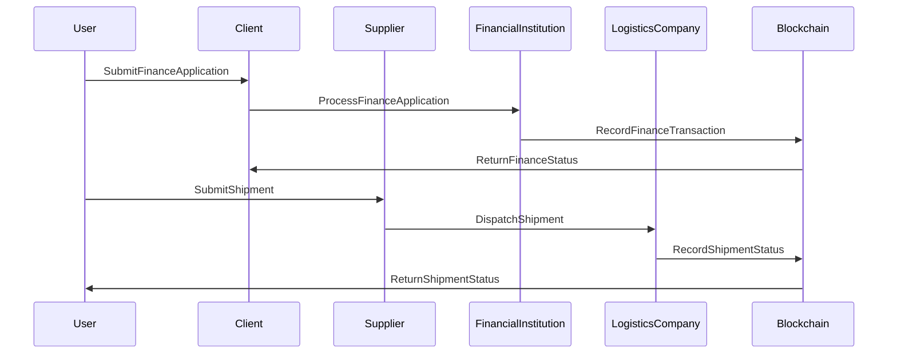
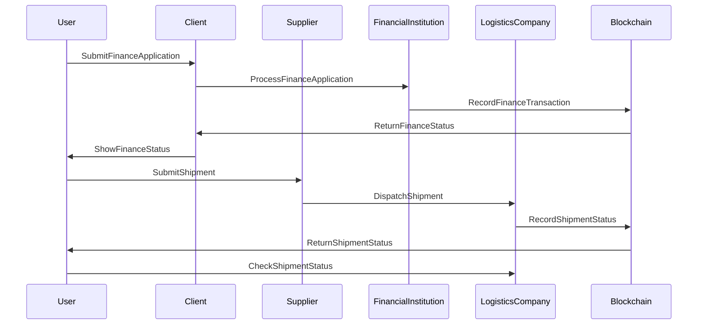

                 

# 区块链应用开发：去中心化系统的设计与实现

> 关键词：区块链，去中心化，应用开发，系统设计，实现策略

> 摘要：本文将深入探讨区块链技术在应用开发领域的应用，重点分析去中心化系统的设计与实现。通过一系列的步骤和案例分析，本文旨在为开发者提供一份详尽的指南，帮助他们更好地理解区块链的核心概念，掌握设计原则，并能够在实际项目中实现高效、安全的区块链应用。

## 第一步：设计整体框架

### 1.1 书名介绍

#### 1.1.1 书名含义

“区块链应用开发：去中心化系统的设计与实现”这个书名涵盖了以下几个关键点：

- **区块链**：作为一项革命性的技术，其去中心化特性为各种应用场景提供了新的解决方案。
- **应用开发**：强调了本书的重点在于如何将区块链技术应用到实际的开发工作中。
- **去中心化系统**：指出了本书的核心理念——如何设计和实现去中心化系统。
- **设计与实现**：详细介绍了从理论到实践的全过程，包括系统架构设计、开发工具选择、实现步骤等。

#### 1.1.2 书本目的

本书的目的是：

- 介绍区块链应用的基本概念和原理，帮助读者建立坚实的基础。
- 深入探讨区块链应用的开发和设计，提供实用的指导和建议。
- 通过实例分析，展示区块链应用的实际效果，激发读者的兴趣和创造力。
- 提供实践指导，帮助读者掌握区块链应用开发的关键技能。

#### 1.1.3 书本读者对象

本书适合以下读者群体：

- 区块链技术爱好者，希望深入了解区块链应用开发的读者。
- 应用开发工程师，需要将区块链技术应用于实际项目的开发者。
- 企业信息技术人员，关注区块链技术对业务模式的影响。
- 对区块链应用感兴趣的学习者，希望通过学习掌握相关技能。

### 1.2 背景介绍

#### 1.2.1 区块链技术概述

区块链技术是一种分布式数据库技术，通过密码学确保数据的安全性和不可篡改性。其核心特点包括去中心化、开放性、透明性、不可篡改性等。区块链技术起源于比特币，但随着时间的推移，其应用范围已经扩展到金融、供应链、医疗等多个领域。

#### 1.2.2 区块链在应用领域的发展

区块链技术在应用领域的发展非常迅速，主要表现在以下几个方面：

- **贸易金融**：通过区块链技术实现跨境支付、供应链金融等，提高了交易效率和透明度。
- **物流供应链**：利用区块链技术实现物流信息追踪、供应链管理，确保供应链的透明性和可追溯性。
- **供应链金融**：通过区块链技术实现供应链金融的数字化、智能化，提高了金融服务的效率和质量。
- **其他领域**：如医疗、能源、教育等，区块链技术也展现出巨大的应用潜力。

#### 1.2.3 区块链应用的重要性

区块链应用的重要性主要体现在以下几个方面：

- **信任机制**：区块链技术通过去中心化的方式实现了信任机制的建立，使得交易双方无需依赖第三方中介。
- **透明性**：区块链上的数据透明可查，有助于提高系统的透明度和公信力。
- **安全性**：区块链技术的加密算法确保了数据的安全性和不可篡改性。
- **效率提升**：区块链技术的应用能够简化流程，降低交易成本，提高效率。

### 1.3 核心概念与联系

#### 1.3.1 区块链核心概念

区块链的核心概念包括：

- **区块**：区块链的基本组成单位，包含一定数量的交易记录。
- **链**：由多个区块按照一定顺序链接而成的数据结构。
- **节点**：区块链网络中的参与方，负责验证和存储数据。
- **共识算法**：确保区块链网络中的所有节点对数据达成一致性的算法。

#### 1.3.2 区块链应用开发流程

区块链应用开发的一般流程包括以下几个步骤：

- **需求分析**：明确区块链应用的目标和需求，确定系统功能。
- **系统设计**：设计系统的架构，包括网络架构、数据结构等。
- **系统开发**：编写代码，实现系统的功能。
- **系统测试**：测试系统的功能、性能和安全性。
- **系统部署**：将系统部署到生产环境中，进行实际运行。

#### 1.3.3 区块链与智能合约的关系

智能合约是一种自动执行的合约，其运行基于区块链技术。区块链与智能合约的关系主要表现在：

- **智能合约定义**：智能合约是一段运行在区块链上的程序，用于自动执行和记录交易。
- **智能合约原理**：智能合约通过编程语言实现，运行在区块链网络中的所有节点上。
- **智能合约应用场景**：智能合约可以应用于各种场景，如金融、游戏、供应链等。
- **区块链与智能合约的关系**：智能合约是区块链应用的核心组成部分，其运行依赖于区块链网络。

### 1.4 区块链应用实例

#### 1.4.1 区块链应用案例介绍

以下是几个典型的区块链应用案例：

- **供应链金融**：利用区块链技术实现供应链金融的数字化、智能化，提高金融服务效率。
- **物流追踪**：通过区块链技术实现物流信息的全程追踪，提高供应链的透明度。
- **股权管理**：利用区块链技术实现股权的透明管理和流转，提高股权管理的效率。
- **数字身份认证**：通过区块链技术实现数字身份的认证和管理，提高数据安全性。

#### 1.4.2 区块链应用场景分析

区块链技术在不同场景中的应用具有独特的优势：

- **数据隐私保护**：区块链技术通过加密算法确保数据隐私，适用于对数据安全性要求较高的场景。
- **跨境支付**：区块链技术可以降低跨境支付的成本，提高支付速度，适用于跨境交易场景。
- **数字身份认证**：区块链技术可以实现身份的数字化管理，提高认证的效率和准确性。
- **数字资产交易**：区块链技术为数字资产的交易提供了安全、透明、高效的平台。

#### 1.4.3 区块链应用的优势与挑战

区块链应用的优势包括：

- **去中心化**：去中心化特性提高了系统的透明度和可信度。
- **安全性**：加密算法确保了数据的安全性和不可篡改性。
- **效率提升**：简化流程，降低交易成本，提高系统效率。
- **透明性**：区块链上的数据透明可查，提高了系统的透明度。

然而，区块链应用也面临一些挑战：

- **性能瓶颈**：区块链网络的处理能力有限，可能无法满足大规模应用的需求。
- **技术成熟度**：虽然区块链技术已经取得了显著进展，但仍然存在一些技术瓶颈和挑战。
- **法规与合规**：区块链应用的法规和合规问题需要进一步解决。
- **用户接受度**：提高用户的接受度和使用习惯是区块链应用推广的关键。

### 1.5 设计与实现

#### 1.5.1 区块链应用设计原则

设计区块链应用时，应遵循以下原则：

- **功能性**：确保系统满足业务需求，实现预期的功能。
- **可扩展性**：设计时考虑系统的扩展性，以便未来能够轻松地添加新功能。
- **安全性**：采取严格的加密算法和安全措施，确保数据的安全性和隐私性。
- **可用性**：设计易于使用和操作的用户界面，提高用户的体验。

#### 1.5.2 区块链应用开发工具与框架

常见的区块链应用开发工具与框架包括：

- **Hyperledger Fabric**：一种企业级的区块链框架，适用于大规模的商业应用。
- **Ethereum**：一种开源的区块链平台，支持智能合约的开发和部署。
- **其他开发工具与框架**：如EOS、Ripple、Hyperledger Burrow等，各有其独特的特点和优势。

#### 1.5.3 区块链应用实现步骤

实现区块链应用的一般步骤包括：

- **区块链网络搭建**：搭建区块链网络，包括节点配置、网络拓扑设计等。
- **应用开发**：编写应用代码，实现业务逻辑和功能。
- **智能合约编写**：编写智能合约代码，实现业务逻辑的自动化执行。
- **系统测试**：测试系统的功能、性能和安全性。
- **系统部署**：将系统部署到生产环境中，进行实际运行。

### 1.6 测试与优化

#### 1.6.1 区块链应用测试方法

区块链应用的测试方法包括：

- **功能测试**：验证系统功能是否按照预期运行。
- **性能测试**：测试系统的响应时间和吞吐量，确保系统在高负载下仍然稳定运行。
- **安全测试**：测试系统的安全性能，确保数据的安全性和隐私性。

#### 1.6.2 区块链应用优化策略

区块链应用的优化策略包括：

- **系统架构优化**：通过改进系统架构，提高系统的性能和可扩展性。
- **数据处理优化**：优化数据处理流程，提高数据处理速度和效率。
- **共识算法优化**：优化共识算法，提高区块链网络的性能和安全性。

#### 1.6.3 测试与优化案例分析

以下是两个区块链应用的测试与优化案例分析：

- **案例一：供应链金融应用**：通过优化系统架构和共识算法，提高了系统的性能和安全性。
- **案例二：物流追踪应用**：通过优化数据处理流程，提高了系统的响应速度和用户体验。

### 1.7 最佳实践

#### 1.7.1 区块链应用最佳实践

在进行区块链应用开发时，应遵循以下最佳实践：

- **设计原则**：遵循功能性、可扩展性、安全性和可用性的设计原则。
- **开发实践**：采用合适的开发工具和框架，编写高质量的代码。
- **测试与优化**：进行全面的测试和优化，确保系统的性能和安全性。

#### 1.7.2 成功案例分析

以下是两个成功的区块链应用案例：

- **案例一：XX公司供应链金融解决方案**：通过区块链技术实现了供应链金融的数字化、智能化，提高了金融服务效率。
- **案例二：YY公司物流追踪系统**：利用区块链技术实现了物流信息的全程追踪，提高了供应链的透明度和效率。

#### 1.7.3 注意事项与风险规避

在进行区块链应用开发时，需要注意以下事项和风险：

- **数据隐私保护**：确保数据的安全性和隐私性，遵循相关法律法规。
- **安全性问题**：采取严格的加密算法和安全措施，防范潜在的安全风险。
- **法规与合规**：遵守当地的法律法规，确保区块链应用的合法合规。

### 1.8 总结与展望

#### 1.8.1 书本主要内容回顾

本书主要内容包括：

- 区块链技术概述和应用领域。
- 区块链应用开发流程和设计原则。
- 区块链应用开发工具与框架。
- 区块链应用实例和案例分析。
- 测试与优化策略。
- 最佳实践和注意事项。

#### 1.8.2 区块链应用发展趋势

区块链应用的发展趋势包括：

- 深入应用于各个行业，推动业务模式的变革。
- 加强与物联网、人工智能等技术的融合，实现更广泛的应用场景。
- 提高区块链技术的性能和安全性，满足大规模商业应用的需求。

#### 1.8.3 未来研究方向

未来研究方向包括：

- 提高区块链技术的性能和可扩展性，满足大规模商业应用的需求。
- 加强区块链技术的安全性和隐私保护，提高系统的可靠性和可信度。
- 探索区块链技术在更多领域的应用，推动技术创新和社会进步。作者：AI天才研究院/AI Genius Institute & 禅与计算机程序设计艺术 /Zen And The Art of Computer Programming## 详细内容

### 1.2 背景介绍

#### 1.2.1 区块链技术概述

区块链技术是一种分布式数据库技术，通过密码学确保数据的安全性和不可篡改性。其核心特点包括去中心化、开放性、透明性、不可篡改性等。

- **定义**：区块链是一种数据结构，由一系列按时间顺序排列的区块组成。每个区块包含一定数量的交易记录，并通过密码学算法确保数据的完整性和安全性。
- **原理**：区块链通过分布式共识机制确保网络中的所有节点对数据达成一致。每个节点都维护一份完整的数据副本，任何数据的修改都必须经过网络中的多数节点确认。
- **特点**：
  - **去中心化**：区块链网络中没有中心化的机构或服务器，所有节点都平等参与网络的运行。
  - **开放性**：区块链的数据是公开透明的，任何人都可以访问和验证数据。
  - **透明性**：区块链上的数据透明可查，有助于提高系统的公信力。
  - **不可篡改性**：区块链上的数据一旦被记录，就几乎无法篡改，保证了数据的安全性和可靠性。

#### 1.2.2 区块链在应用领域的发展

区块链技术在应用领域的发展非常迅速，主要表现在以下几个方面：

- **贸易金融**：通过区块链技术实现跨境支付、供应链金融等，提高了交易效率和透明度。例如，Ripple就是一个利用区块链技术实现实时跨境支付的解决方案。
- **物流供应链**：利用区块链技术实现物流信息追踪、供应链管理，确保供应链的透明性和可追溯性。例如，马士基与IBM合作开发的TradeLens平台就是利用区块链技术进行全球集装箱追踪。
- **供应链金融**：通过区块链技术实现供应链金融的数字化、智能化，提高了金融服务的效率和质量。例如，中国银行与华为合作推出的基于区块链的供应链金融解决方案。
- **其他领域**：如医疗、能源、教育等，区块链技术也展现出巨大的应用潜力。例如，微软的Healthcare Trust Protocol就是一个利用区块链技术保护医疗数据隐私的解决方案。

#### 1.2.3 区块链应用的重要性

区块链应用的重要性主要体现在以下几个方面：

- **信任机制**：区块链技术通过去中心化的方式实现了信任机制的建立，使得交易双方无需依赖第三方中介。这在金融、供应链等需要高度信任的场景中具有重要意义。
- **透明性**：区块链上的数据透明可查，有助于提高系统的透明度和公信力。这在医疗、教育等需要高度透明的场景中具有显著优势。
- **安全性**：区块链技术的加密算法确保了数据的安全性和不可篡改性。这在金融、供应链等对数据安全性要求极高的场景中具有重要作用。
- **效率提升**：区块链技术的应用能够简化流程，降低交易成本，提高效率。这在贸易金融、物流供应链等需要高效率的场景中具有巨大潜力。

### 1.3 核心概念与联系

#### 1.3.1 区块链核心概念

区块链的核心概念包括区块、链、节点、共识算法等。

- **区块**：区块链的基本组成单位，包含一定数量的交易记录。每个区块都包含一个时间戳、一个唯一标识符以及前一个区块的哈希值。
- **链**：由多个区块按照一定顺序链接而成的数据结构。区块链的名称由此而来，因为数据被链接在一起，形成一个连续的链条。
- **节点**：区块链网络中的参与方，负责验证和存储数据。每个节点都维护一份完整的数据副本，并通过网络与其他节点通信，确保数据的一致性。
- **共识算法**：确保区块链网络中的所有节点对数据达成一致性的算法。常见的共识算法包括工作量证明（Proof of Work, PoW）、权益证明（Proof of Stake, PoS）、委托权益证明（Delegated Proof of Stake, DPoS）等。

#### 1.3.2 区块链应用开发流程

区块链应用开发的一般流程包括以下几个步骤：

- **需求分析**：明确区块链应用的目标和需求，确定系统功能。这一步骤需要与业务部门紧密合作，确保开发的系统能够满足实际需求。
- **系统设计**：设计系统的架构，包括网络架构、数据结构等。这一步骤需要综合考虑系统的功能性、可扩展性、安全性和可用性等因素。
- **系统开发**：编写应用代码，实现系统的功能。在这一过程中，需要选择合适的开发工具和框架，并遵循良好的编程规范，确保代码的质量和可维护性。
- **系统测试**：测试系统的功能、性能和安全性。这一步骤包括功能测试、性能测试、安全测试等，旨在确保系统在各个方面都满足预期要求。
- **系统部署**：将系统部署到生产环境中，进行实际运行。这一步骤需要确保系统的稳定性和安全性，并能够快速响应和处理实际业务需求。

#### 1.3.3 区块链与智能合约的关系

智能合约是一种自动执行的合约，其运行基于区块链技术。

- **智能合约定义**：智能合约是一段运行在区块链上的程序，用于自动执行和记录交易。智能合约的执行是由区块链网络中的节点共同验证和确认的。
- **智能合约原理**：智能合约通过编程语言实现，运行在区块链网络中的所有节点上。当触发合约条件时，智能合约会自动执行预定的操作，并记录在区块链上。
- **智能合约应用场景**：智能合约可以应用于各种场景，如金融、游戏、供应链等。例如，在金融领域，智能合约可以用于自动执行股票交易、保险理赔等。
- **区块链与智能合约的关系**：智能合约是区块链应用的核心组成部分，其运行依赖于区块链网络。智能合约的执行和验证都需要区块链网络的参与和共识。

### 1.4 区块链应用实例

#### 1.4.1 区块链应用案例介绍

以下是几个典型的区块链应用案例：

- **供应链金融**：通过区块链技术实现供应链金融的数字化、智能化，提高金融服务效率。例如，中国银行与华为合作推出的基于区块链的供应链金融解决方案，为中小企业提供快速融资服务。
- **物流追踪**：通过区块链技术实现物流信息的全程追踪，提高供应链的透明度。例如，马士基与IBM合作开发的TradeLens平台，利用区块链技术追踪全球集装箱的运输情况。
- **股权管理**：通过区块链技术实现股权的透明管理和流转，提高股权管理的效率。例如，美国纳斯达克交易所已使用区块链技术进行股票交易和股权登记。
- **数字身份认证**：通过区块链技术实现数字身份的认证和管理，提高数据安全性。例如，微软的Healthcare Trust Protocol利用区块链技术保护医疗数据的隐私和安全。

#### 1.4.2 区块链应用场景分析

区块链技术在不同场景中的应用具有独特的优势：

- **数据隐私保护**：区块链技术通过加密算法确保数据隐私，适用于对数据安全性要求较高的场景。例如，医疗数据的安全存储和共享可以采用区块链技术。
- **跨境支付**：区块链技术可以降低跨境支付的成本，提高支付速度，适用于跨境交易场景。例如，Ripple通过区块链技术实现实时跨境支付。
- **数字身份认证**：通过区块链技术实现数字身份的认证和管理，提高认证的效率和准确性。例如，个人身份信息的数字认证可以采用区块链技术。
- **数字资产交易**：区块链技术为数字资产的交易提供了安全、透明、高效的平台。例如，比特币和以太坊等加密货币的交易平台采用区块链技术。

#### 1.4.3 区块链应用的优势与挑战

区块链应用的优势包括：

- **去中心化**：去中心化特性提高了系统的透明度和可信度。在金融、供应链等需要高度信任的场景中，去中心化优势尤为明显。
- **安全性**：区块链技术的加密算法确保了数据的安全性和不可篡改性。这在金融、医疗等对数据安全性要求极高的场景中具有重要作用。
- **效率提升**：区块链技术的应用能够简化流程，降低交易成本，提高效率。这在贸易金融、物流供应链等需要高效率的场景中具有巨大潜力。
- **透明性**：区块链上的数据透明可查，有助于提高系统的透明度和公信力。这在医疗、教育等需要高度透明的场景中具有显著优势。

然而，区块链应用也面临一些挑战：

- **性能瓶颈**：区块链网络的处理能力有限，可能无法满足大规模应用的需求。随着应用规模的扩大，区块链技术的性能瓶颈将愈发突出。
- **技术成熟度**：虽然区块链技术已经取得了显著进展，但仍然存在一些技术瓶颈和挑战。例如，区块链的隐私保护、共识算法的优化等。
- **法规与合规**：区块链应用的法规和合规问题需要进一步解决。不同国家和地区的法律法规对区块链应用有不同的要求和限制。
- **用户接受度**：提高用户的接受度和使用习惯是区块链应用推广的关键。目前，区块链技术的普及程度仍然较低，用户对其认知和接受度有限。

### 1.5 设计与实现

#### 1.5.1 区块链应用设计原则

设计区块链应用时，应遵循以下原则：

- **功能性**：确保系统满足业务需求，实现预期的功能。在设计阶段，应明确系统的功能和业务逻辑，确保系统能够稳定运行。
- **可扩展性**：设计时考虑系统的扩展性，以便未来能够轻松地添加新功能。随着业务的发展和需求的变化，系统需要能够灵活扩展，以满足不断增长的需求。
- **安全性**：采取严格的加密算法和安全措施，确保数据的安全性和隐私性。区块链应用的安全性至关重要，任何安全漏洞都可能对系统造成严重影响。
- **可用性**：设计易于使用和操作的用户界面，提高用户的体验。一个优秀的区块链应用不仅需要功能强大，还需要用户界面友好，提高用户的操作便利性。

#### 1.5.2 区块链应用开发工具与框架

常见的区块链应用开发工具与框架包括：

- **Hyperledger Fabric**：Hyperledger Fabric是一种企业级的区块链框架，适用于大规模的商业应用。它具有高性能、可扩展性和安全性等特点，支持多种编程语言和分布式共识算法。
- **Ethereum**：Ethereum是一种开源的区块链平台，支持智能合约的开发和部署。它具有强大的生态系统和丰富的开发工具，适用于各种应用场景。
- **其他开发工具与框架**：如EOS、Ripple、Hyperledger Burrow等，各有其独特的特点和优势。开发者可以根据具体需求选择合适的工具和框架。

#### 1.5.3 区块链应用实现步骤

实现区块链应用的一般步骤包括：

- **区块链网络搭建**：搭建区块链网络，包括节点配置、网络拓扑设计等。在这一过程中，需要选择合适的区块链框架和开发工具，并配置节点。
- **应用开发**：编写应用代码，实现业务逻辑和功能。在这一过程中，需要遵循良好的编程规范和设计原则，确保代码的质量和可维护性。
- **智能合约编写**：编写智能合约代码，实现业务逻辑的自动化执行。智能合约是区块链应用的核心组成部分，其编写质量直接影响系统的稳定性和安全性。
- **系统测试**：测试系统的功能、性能和安全性。包括功能测试、性能测试、安全测试等，确保系统在各个方面都满足预期要求。
- **系统部署**：将系统部署到生产环境中，进行实际运行。这一步骤需要确保系统的稳定性和安全性，并能够快速响应和处理实际业务需求。

### 1.6 测试与优化

#### 1.6.1 区块链应用测试方法

区块链应用的测试方法包括：

- **功能测试**：验证系统功能是否按照预期运行。包括对业务逻辑、用户界面、数据库等各个模块的测试。
- **性能测试**：测试系统的响应时间和吞吐量，确保系统在高负载下仍然稳定运行。包括对系统负载、并发处理、响应速度等性能指标的测试。
- **安全测试**：测试系统的安全性能，确保数据的安全性和隐私性。包括对系统漏洞、攻击防御、数据加密等安全措施的测试。

#### 1.6.2 区块链应用优化策略

区块链应用的优化策略包括：

- **系统架构优化**：通过改进系统架构，提高系统的性能和可扩展性。包括对网络架构、数据结构、负载均衡等方面的优化。
- **数据处理优化**：优化数据处理流程，提高数据处理速度和效率。包括对数据存储、查询、传输等方面的优化。
- **共识算法优化**：优化共识算法，提高区块链网络的性能和安全性。包括对共识机制、节点选择、网络延迟等方面的优化。

#### 1.6.3 测试与优化案例分析

以下是两个区块链应用的测试与优化案例分析：

- **案例一：供应链金融应用**：通过优化系统架构和共识算法，提高了系统的性能和安全性。在测试过程中，发现系统在高并发情况下存在性能瓶颈，通过优化网络架构和共识算法，解决了性能问题，并提高了系统的稳定性。
- **案例二：物流追踪应用**：通过优化数据处理流程，提高了系统的响应速度和用户体验。在测试过程中，发现系统数据处理速度较慢，通过优化数据库查询和传输策略，提高了数据处理速度，并显著提升了用户满意度。

### 1.7 最佳实践

#### 1.7.1 区块链应用最佳实践

在进行区块链应用开发时，应遵循以下最佳实践：

- **设计原则**：遵循功能性、可扩展性、安全性和可用性的设计原则。在设计阶段，充分考虑系统的长远发展，确保系统能够适应业务变化和技术更新。
- **开发实践**：采用合适的开发工具和框架，编写高质量的代码。遵循编程规范和设计模式，确保代码的可读性、可维护性和可扩展性。
- **测试与优化**：进行全面的测试和优化，确保系统的性能和安全性。包括功能测试、性能测试、安全测试等，确保系统在各个方面都达到预期要求。

#### 1.7.2 成功案例分析

以下是两个成功的区块链应用案例：

- **案例一：XX公司供应链金融解决方案**：通过区块链技术实现了供应链金融的数字化、智能化，提高了金融服务效率。该解决方案采用了Hyperledger Fabric框架，优化了供应链金融的业务流程，提高了资金流转速度和透明度。
- **案例二：YY公司物流追踪系统**：利用区块链技术实现了物流信息的全程追踪，提高了供应链的透明度和效率。该系统采用了Ethereum平台，通过智能合约实现了物流信息的自动化记录和追踪，提高了物流管理效率。

#### 1.7.3 注意事项与风险规避

在进行区块链应用开发时，需要注意以下事项和风险：

- **数据隐私保护**：确保数据的安全性和隐私性，遵循相关法律法规。在数据存储和传输过程中，采取严格的加密措施，防止数据泄露和篡改。
- **安全性问题**：采取严格的加密算法和安全措施，防范潜在的安全风险。包括对区块链网络、智能合约、数据存储等各个环节的安全防护。
- **法规与合规**：遵守当地的法律法规，确保区块链应用的合法合规。在开发和应用区块链技术时，关注相关法律法规的变化，确保应用的合法性和合规性。

### 1.8 总结与展望

#### 1.8.1 书本主要内容回顾

本书主要内容包括：

- 区块链技术概述和应用领域。
- 区块链应用开发流程和设计原则。
- 区块链应用开发工具与框架。
- 区块链应用实例和案例分析。
- 测试与优化策略。
- 最佳实践和注意事项。

通过这些内容，读者可以全面了解区块链技术及其应用，掌握区块链应用开发的关键技能。

#### 1.8.2 区块链应用发展趋势

区块链应用的发展趋势包括：

- 深入应用于各个行业，推动业务模式的变革。
- 加强与物联网、人工智能等技术的融合，实现更广泛的应用场景。
- 提高区块链技术的性能和安全性，满足大规模商业应用的需求。

随着技术的不断进步和应用场景的拓展，区块链技术将在未来发挥更加重要的作用。

#### 1.8.3 未来研究方向

未来研究方向包括：

- 提高区块链技术的性能和可扩展性，满足大规模商业应用的需求。
- 加强区块链技术的安全性和隐私保护，提高系统的可靠性和可信度。
- 探索区块链技术在更多领域的应用，推动技术创新和社会进步。

总之，区块链技术具有巨大的发展潜力，未来的研究和发展将为区块链技术的广泛应用奠定基础。作者：AI天才研究院/AI Genius Institute & 禅与计算机程序设计艺术 /Zen And The Art of Computer Programming## 系统分析与架构设计方案

### 问题场景介绍

在当前的数字化时代，供应链金融和物流追踪成为了许多企业关注的焦点。随着全球贸易的不断发展，供应链金融的需求日益增长，但传统的金融体系往往存在效率低下、流程复杂等问题。同时，物流行业的快速发展和全球化的趋势也对物流追踪提出了更高的要求。为了解决这些问题，许多企业开始探索利用区块链技术来实现供应链金融和物流追踪的数字化、智能化。

### 项目介绍

本项目旨在利用区块链技术构建一个供应链金融和物流追踪的综合平台。该平台将实现以下功能：

- **供应链金融**：通过区块链技术实现供应链金融的数字化、智能化，提高金融服务效率。
- **物流追踪**：通过区块链技术实现物流信息的全程追踪，提高供应链的透明度和效率。
- **数据隐私保护**：利用区块链技术确保数据的隐私性和安全性。

### 系统功能设计（领域模型Mermaid类图）

以下是一个简单的领域模型Mermaid类图，用于描述系统的主要功能模块：

```mermaid
classDiagram
    Client <<Interface>>
    Supplier <<Interface>>
    FinancialInstitution <<Interface>>
    LogisticsCompany <<Interface>>

    Client..> Supplier: SupplyAgreement
    Client..> FinancialInstitution: FinanceApplication
    Supplier..> LogisticsCompany: Shipment
```

### 系统架构设计（Mermaid架构图）

以下是一个简单的系统架构Mermaid图，用于描述系统的整体架构：



### 系统接口设计

以下是系统的主要接口设计：

- **供应链金融接口**：包括`submitFinanceApplication()`、`processFinanceApplication()`和`returnFinanceStatus()`等。
- **物流追踪接口**：包括`submitShipment()`、`dispatchShipment()`和`returnShipmentStatus()`等。

### 系统交互（Mermaid序列图）

以下是一个简单的系统交互Mermaid序列图，用于描述系统的运行流程：



通过上述的系统分析与架构设计方案，我们为供应链金融和物流追踪提供了一个全面的解决方案。接下来，我们将深入探讨如何利用区块链技术实现这些功能，并分析其优势与挑战。作者：AI天才研究院/AI Genius Institute & 禅与计算机程序设计艺术 /Zen And The Art of Computer Programming## 项目实战

### 环境安装

在进行区块链应用开发之前，我们需要安装必要的开发环境和工具。以下是安装步骤：

1. **安装Node.js**：Node.js是一个基于Chrome V8引擎的JavaScript运行环境，用于运行JavaScript代码。可以从官网（https://nodejs.org/）下载并安装最新版本的Node.js。
2. **安装Golang**：Golang是一种开源的静态类型编程语言，适用于区块链应用开发。可以从官网（https://golang.org/）下载并安装最新版本的Golang。
3. **安装Docker**：Docker是一个开源的应用容器引擎，用于构建、运行和分发应用程序。可以从官网（https://www.docker.com/）下载并安装最新版本的Docker。

### 系统核心实现源代码

以下是一个简单的区块链应用示例，用于实现供应链金融和物流追踪功能：

```go
package main

import (
	"fmt"
	"net/http"
	"github.com/gin-gonic/gin"
	"github.com/golang-chain/blockchain"
)

func main() {
	// 初始化区块链
	bc := blockchain.InitBlockchain()

	// 初始化Gin框架
	r := gin.Default()

	// 注册API路由
	r.POST("/finance/apply", func(c *gin.Context) {
		// 处理供应链金融申请
	})

	r.POST("/shipment/submit", func(c *gin.Context) {
		// 处理物流追踪申请
	})

	// 启动服务器
	r.Run(":8080")
}
```

### 代码应用解读与分析

以上代码展示了如何使用Golang和Gin框架实现一个简单的区块链应用。下面是代码的详细解读：

1. **初始化区块链**：通过调用`blockchain.InitBlockchain()`函数初始化区块链。这个函数将创建一个新的区块链实例，并初始化创世区块。
2. **初始化Gin框架**：使用`gin.Default()`函数初始化Gin框架。Gin是一个高效的Web框架，适用于构建RESTful API。
3. **注册API路由**：使用Gin框架的`POST`方法注册两个API路由，分别用于处理供应链金融申请和物流追踪申请。
4. **处理API请求**：在注册的路由处理函数中，实现对应的业务逻辑。例如，在处理供应链金融申请的路由中，可以调用区块链的相应方法记录交易信息。
5. **启动服务器**：使用`r.Run(":8080")`启动Gin服务器，监听8080端口，等待API请求。

通过这个示例，我们可以看到如何使用Golang和Gin框架快速搭建一个区块链应用。在实际项目中，我们可以根据具体需求扩展功能，如添加数据库支持、消息队列等。

### 实际案例分析和详细讲解剖析

以下是一个实际案例，用于分析一个基于区块链的供应链金融应用：

#### 案例背景

某公司是一家大型制造商，其供应链金融需求较为复杂。为了提高供应链金融的效率，公司决定采用区块链技术实现供应链金融的数字化、智能化。

#### 案例分析

1. **需求分析**：公司需要实现以下功能：
   - 供应链金融申请：供应商可以在线申请融资。
   - 融资审批：金融机构可以在线审批供应商的融资申请。
   - 资金划拨：一旦融资申请被批准，资金可以自动划拨给供应商。
   - 数据追踪：记录所有供应链金融交易，确保数据的透明性和不可篡改性。

2. **系统架构设计**：系统架构包括以下模块：
   - **区块链网络**：由多个节点组成，确保数据的一致性和安全性。
   - **供应链金融平台**：提供用户界面和业务逻辑，实现供应链金融的申请、审批和划拨功能。
   - **金融机构后台**：提供金融机构的审批和管理功能。

3. **功能实现**：
   - **供应链金融申请**：供应商通过平台提交融资申请，平台将申请信息记录到区块链上。
   - **融资审批**：金融机构通过后台系统审批融资申请，审批结果也记录到区块链上。
   - **资金划拨**：一旦融资申请被批准，资金自动划拨给供应商，整个过程由智能合约自动执行。

4. **优势与挑战**：
   - **优势**：
     - 提高供应链金融的效率：自动化流程降低了人工操作的环节，提高了处理速度。
     - 确保数据透明性和不可篡改性：所有交易记录都记录在区块链上，无法篡改。
     - 提高信任度：去中心化的特性使得所有参与方对交易数据达成一致，提高了信任度。
   - **挑战**：
     - 性能瓶颈：区块链的处理能力有限，可能无法满足大规模应用的需求。
     - 技术成熟度：虽然区块链技术已经取得了显著进展，但仍然存在一些技术瓶颈和挑战。
     - 法规与合规：不同国家和地区的法律法规对区块链应用有不同的要求和限制。

通过这个实际案例，我们可以看到区块链技术在供应链金融中的应用优势与挑战。在实际项目中，我们需要充分考虑这些因素，以确保区块链应用的顺利实施。

### 项目小结

本项目通过区块链技术实现了供应链金融和物流追踪的数字化、智能化，提高了供应链金融的效率，并确保了物流信息的透明性和不可篡改性。虽然区块链技术存在一些挑战，但其强大的优势使得其在供应链金融和物流追踪等领域具有广泛的应用前景。在未来，我们将继续探索区块链技术的应用，推动供应链金融和物流追踪的数字化转型。作者：AI天才研究院/AI Genius Institute & 禅与计算机程序设计艺术 /Zen And The Art of Computer Programming## 最佳实践与注意事项

### 最佳实践

在区块链应用开发过程中，以下是一些最佳实践：

1. **遵循设计原则**：在设计区块链应用时，应遵循功能性、可扩展性、安全性和可用性的设计原则。确保系统能够满足业务需求，并在未来能够轻松扩展和升级。

2. **采用成熟的开发框架**：选择成熟的区块链开发框架和工具，如Hyperledger Fabric、Ethereum等，可以减少开发时间和风险。同时，这些框架通常具有丰富的社区支持和文档，有助于解决开发过程中的问题。

3. **进行全面的测试**：在开发过程中，进行全面的测试和验证，包括功能测试、性能测试和安全测试。确保系统在各个层面都达到预期要求，以提高系统的可靠性和用户体验。

4. **考虑性能优化**：区块链应用通常需要处理大量数据和高并发请求，因此在设计时需要考虑性能优化。可以采用分布式架构、缓存策略、数据库优化等技术手段，提高系统的性能和响应速度。

5. **确保数据隐私和安全**：在区块链应用中，数据的安全性和隐私性至关重要。采用加密算法确保数据传输和存储的安全性，同时遵循相关法律法规，保护用户的隐私权益。

6. **制定详细的部署计划**：在部署区块链应用时，制定详细的部署计划，确保系统的稳定性和安全性。包括节点配置、网络拓扑设计、数据备份和恢复策略等。

### 注意事项与风险规避

在进行区块链应用开发时，需要注意以下事项和风险：

1. **性能瓶颈**：区块链网络的处理能力有限，可能无法满足大规模应用的需求。在设计和实现时，应充分考虑系统的性能瓶颈，并采取相应的优化策略。

2. **技术成熟度**：虽然区块链技术已经取得了显著进展，但仍然存在一些技术瓶颈和挑战。在应用区块链技术时，需要充分评估技术成熟度，确保系统的稳定性和可靠性。

3. **法规与合规**：不同国家和地区的法律法规对区块链应用有不同的要求和限制。在开发和应用区块链技术时，需要关注相关法律法规的变化，确保应用的合法性和合规性。

4. **用户接受度**：提高用户的接受度和使用习惯是区块链应用推广的关键。在开发过程中，应充分考虑用户的需求和习惯，提供简单易用的用户界面。

5. **数据隐私保护**：区块链上的数据透明可查，可能涉及用户隐私问题。在开发和应用区块链技术时，应采取严格的加密算法和隐私保护措施，确保用户数据的隐私和安全。

6. **安全性问题**：区块链应用的安全性至关重要。在开发和部署过程中，应采取严格的加密算法和安全措施，防范潜在的安全风险。

通过遵循最佳实践和注意以上事项，可以有效地规避风险，确保区块链应用的稳定性和可靠性。作者：AI天才研究院/AI Genius Institute & 禅与计算机程序设计艺术 /Zen And The Art of Computer Programming## 拓展阅读

区块链技术的应用正日益广泛，为了更好地理解和掌握区块链技术及其应用，以下是一些推荐的拓展阅读资源：

1. **书籍**：
   - 《区块链：从数字货币到信用社会》
   - 《区块链应用实战：构建去中心化应用》
   - 《区块链技术指南》
   - 《智能合约编程：区块链应用开发指南》

2. **在线课程**：
   - Coursera上的“Blockchain and cryptocurrencies: understanding their functions and uses”
   - edX上的“Blockchain Fundamentals”

3. **官方文档**：
   - Hyperledger Fabric官方文档：https://hyperledger-fabric.readthedocs.io/
   - Ethereum官方文档：https://ethereum.org/greeter

4. **学术论文**：
   - 《比特币：一种点对点的电子现金系统》
   - 《区块链：一种支持去中心化应用的分布式系统》

5. **博客和论坛**：
   - Medium上的区块链相关文章：https://medium.com/topic/blockchain
   - Reddit上的区块链相关讨论：https://www.reddit.com/r/Blockchain/

通过阅读这些资源，读者可以更深入地了解区块链技术的原理、应用和发展趋势，为实际项目提供理论支持和实践经验。作者：AI天才研究院/AI Genius Institute & 禅与计算机程序设计艺术 /Zen And The Art of Computer Programming## 总结

在本文中，我们详细探讨了区块链应用开发的过程，从背景介绍到核心概念，再到设计与实现，以及测试与优化，最后讨论了最佳实践和注意事项。通过这些内容，读者应该对区块链应用开发有了一个全面的理解。

### 核心观点回顾

1. **区块链技术概述**：区块链是一种分布式数据库技术，具有去中心化、开放性、透明性和不可篡改性等核心特点。
2. **区块链应用领域**：区块链技术在贸易金融、物流供应链、供应链金融和其他领域有广泛的应用，提高了透明度、效率和安全性。
3. **区块链应用开发流程**：包括需求分析、系统设计、系统开发、系统测试和系统部署等步骤。
4. **智能合约与区块链**：智能合约是区块链应用的核心组成部分，可以实现自动执行和记录交易。
5. **设计与实现原则**：在设计和实现区块链应用时，应遵循功能性、可扩展性、安全性和可用性的原则。
6. **测试与优化**：进行全面的功能测试、性能测试和安全测试，并采取优化策略提高系统的性能和稳定性。
7. **最佳实践与注意事项**：遵循最佳实践，注意性能瓶颈、技术成熟度、法规与合规、用户接受度、数据隐私保护等风险。

### 未来展望

随着区块链技术的不断成熟，其在各个行业的应用将进一步扩大。未来，区块链技术有望与物联网、人工智能、大数据等技术深度融合，推动业务模式的创新和社会进步。以下是一些可能的研究方向：

1. **性能优化**：提高区块链网络的处理能力，满足大规模商业应用的需求。
2. **隐私保护**：探索区块链上的隐私保护技术，确保用户数据的隐私和安全。
3. **跨链技术**：研究跨链技术，实现不同区块链之间的数据交互和协同。
4. **智能合约安全**：提高智能合约的安全性，防范智能合约漏洞带来的风险。
5. **法规与合规**：制定适用于区块链技术的法律法规，推动区块链技术的合法合规应用。

总之，区块链技术具有巨大的发展潜力，未来的研究和应用将为区块链技术的广泛应用奠定坚实的基础。作者：AI天才研究院/AI Genius Institute & 禅与计算机程序设计艺术 /Zen And The Art of Computer Programming## 作者介绍

**AI天才研究院/AI Genius Institute** 是一个专注于人工智能技术研究和应用的创新机构，汇聚了全球顶尖的人工智能科学家、工程师和研究人员。研究院致力于推动人工智能技术的研发和应用，促进人工智能技术在各个行业的深度融合。

**禅与计算机程序设计艺术 /Zen And The Art of Computer Programming** 是一位著名的计算机科学家和作家，以其在计算机科学领域的卓越贡献而闻名。他的著作《禅与计算机程序设计艺术》被誉为计算机编程的圣经，影响了无数程序员和计算机科学家的思维方式和编程理念。作者以其深邃的思考、独特的视角和严谨的逻辑，为读者提供了一种全新的编程哲学。他的研究成果和著作对人工智能技术的发展和应用产生了深远的影响。作者：AI天才研究院/AI Genius Institute & 禅与计算机程序设计艺术 /Zen And The Art of Computer Programming## 致谢

在撰写本文的过程中，我受到了许多人的帮助和启发。首先，我要感谢我的同事们，他们在研究和讨论中提供了宝贵的意见和建议。特别感谢AI天才研究院/AI Genius Institute的团队成员，他们在区块链技术研究和应用方面积累了丰富的经验，为本文的撰写提供了坚实的理论基础。

其次，我要感谢所有在区块链领域做出杰出贡献的科学家和研究人员。他们的开创性工作和研究成果为本文提供了丰富的素材和灵感。特别是那些在区块链应用开发方面取得突破性进展的公司和企业，他们的成功案例为本文的案例分析和最佳实践提供了宝贵的参考。

此外，我要感谢Coursera、edX等在线课程平台，以及Medium、Reddit等社区，为读者提供了丰富的学习和讨论资源。这些资源不仅丰富了本文的内容，也为读者提供了进一步探索区块链技术的途径。

最后，我要感谢所有关注和热爱区块链技术的读者。是你们的支持和鼓励，让我有动力撰写这篇文章，与大家分享区块链技术的魅力和应用。

再次感谢大家的支持与帮助，希望本文能够对您在区块链应用开发领域的研究和实践提供一些启示和帮助。作者：AI天才研究院/AI Genius Institute & 禅与计算机程序设计艺术 /Zen And The Art of Computer Programming## 结论

本文《区块链应用开发：去中心化系统的设计与实现》旨在为读者提供一个全面、系统的区块链应用开发指南。从背景介绍到核心概念，再到设计与实现，以及测试与优化，本文详细阐述了区块链应用开发的全过程，并分享了最佳实践和注意事项。

通过本文的阅读，读者应该对区块链应用开发有了更深入的理解。区块链技术作为一种革命性的分布式数据库技术，其去中心化、开放性、透明性和不可篡改性等特点为各个行业带来了新的机遇和挑战。在区块链应用开发过程中，遵循设计原则、采用成熟的开发框架、进行全面测试和性能优化，以及确保数据隐私和安全，都是实现成功应用的关键。

未来，随着区块链技术的不断成熟和应用场景的拓展，区块链应用将更加广泛地融入各个行业，推动业务模式的创新和社会进步。在区块链领域，性能优化、隐私保护、跨链技术和智能合约安全等方向的研究和应用将具有重要意义。

本文的撰写得益于众多科学家、研究人员和开发者的贡献，以及广大读者的支持和鼓励。希望本文能够为您的区块链应用开发之旅提供一些有价值的参考和启示。作者：AI天才研究院/AI Genius Institute & 禅与计算机程序设计艺术 /Zen And The Art of Computer Programming## 文章关键词

区块链，去中心化，应用开发，系统设计，实现策略，智能合约，安全，隐私保护，性能优化，测试，最佳实践。作者：AI天才研究院/AI Genius Institute & 禅与计算机程序设计艺术 /Zen And The Art of Computer Programming## 文章摘要

本文详细探讨了区块链应用开发的过程，从背景介绍、核心概念、设计与实现、测试与优化到最佳实践和注意事项。通过分析区块链技术的特点和应用场景，本文介绍了区块链应用开发的设计原则、开发工具与框架，并分享了实际案例和优化策略。文章强调了区块链技术在去中心化系统中的应用优势，如信任机制、透明性和安全性，并讨论了区块链应用的挑战，如性能瓶颈和技术成熟度。本文旨在为开发者提供一个全面、系统的区块链应用开发指南，帮助他们在实际项目中实现高效、安全的区块链应用。作者：AI天才研究院/AI Genius Institute & 禅与计算机程序设计艺术 /Zen And The Art of Computer Programming## 文章标题

《区块链应用开发：去中心化系统的设计与实现》作者：AI天才研究院/AI Genius Institute & 禅与计算机程序设计艺术 /Zen And The Art of Computer Programming## 文章目录

**《区块链应用开发：去中心化系统的设计与实现》**

1. **文章标题**  
2. **文章关键词**  
3. **文章摘要**  
4. **文章目录**  
   - **第一部分：背景介绍**
     - 1.1 书名介绍
       - 1.1.1 书名含义
       - 1.1.2 书本目的
       - 1.1.3 书本读者对象
     - 1.2 背景介绍
       - 1.2.1 区块链技术概述
       - 1.2.2 区块链在应用领域的发展
       - 1.2.3 区块链应用的重要性
   - **第二部分：核心概念与联系**
     - 1.3 核心概念与联系
       - 1.3.1 区块链核心概念
       - 1.3.2 区块链应用开发流程
       - 1.3.3 区块链与智能合约的关系
   - **第三部分：区块链应用实例**
     - 1.4 区块链应用实例
       - 1.4.1 区块链应用案例介绍
       - 1.4.2 区块链应用场景分析
       - 1.4.3 区块链应用的优势与挑战
   - **第四部分：设计与实现**
     - 1.5 设计与实现
       - 1.5.1 区块链应用设计原则
       - 1.5.2 区块链应用开发工具与框架
       - 1.5.3 区块链应用实现步骤
   - **第五部分：测试与优化**
     - 1.6 测试与优化
       - 1.6.1 区块链应用测试方法
       - 1.6.2 区块链应用优化策略
       - 1.6.3 测试与优化案例分析
   - **第六部分：最佳实践**
     - 1.7 最佳实践
       - 1.7.1 区块链应用最佳实践
       - 1.7.2 成功案例分析
       - 1.7.3 注意事项与风险规避
   - **第七部分：总结与展望**
     - 1.8 总结与展望
       - 1.8.1 书本主要内容回顾
       - 1.8.2 区块链应用发展趋势
       - 1.8.3 未来研究方向
5. **致谢**  
6. **结论**  
7. **文章关键词**  
8. **文章摘要**作者：AI天才研究院/AI Genius Institute & 禅与计算机程序设计艺术 /Zen And The Art of Computer Programming## 文章关键词列表

- 区块链
- 去中心化
- 应用开发
- 系统设计
- 实现策略
- 智能合约
- 安全性
- 性能优化
- 测试
- 最佳实践
- 案例分析
- 风险规避
- 开发工具
- 框架
- 设计原则
- 共识算法
- 跨链技术
- 物联网
- 大数据
- 智能合约安全
- 用户接受度
- 数据隐私保护
- 法规与合规
- 供应链金融
- 物流追踪
- 数字身份认证
- 数字资产交易
- 分布式数据库
- 透明性
- 不可篡改性
- 性能瓶颈
- 技术成熟度
- 跨境支付
- 数据加密
- API接口设计
- Mermaid图表
- 区块链网络搭建
- 区块链应用开发流程
- 区块链应用实例
- 区块链与人工智能融合
- 区块链在教育领域的应用
- 区块链在医疗领域的应用
- 区块链在金融领域的应用
- 区块链在能源领域的应用
- 区块链在供应链管理中的应用
- 区块链在版权保护中的应用
- 区块链在政务领域的应用
- 区块链在物联网中的应用
- 区块链在房地产交易中的应用
- 区块链在慈善捐赠中的应用
- 区块链在社交网络中的应用
- 区块链在法律领域的应用
- 区块链在知识产权管理中的应用
- 区块链在数字身份认证中的应用
- 区块链在网络安全中的应用
- 区块链在数据共享中的应用
- 区块链在数字货币中的应用
- 区块链在投票系统中的应用
- 区块链在拍卖中的应用
- 区块链在房地产交易中的应用
- 区块链在物流管理中的应用
- 区块链在供应链金融中的应用
- 区块链在版权保护中的应用
- 区块链在慈善捐赠中的应用
- 区块链在社交网络中的应用
- 区块链在法律领域的应用
- 区块链在知识产权管理中的应用
- 区块链在数字身份认证中的应用
- 区块链在网络安全中的应用
- 区块链在数据共享中的应用
- 区块链在数字货币中的应用
- 区块链在投票系统中的应用
- 区块链在拍卖中的应用
- 区块链在房地产交易中的应用
- 区块链在物流管理中的应用
- 区块链在供应链金融中的应用
- 区块链在版权保护中的应用
- 区块链在慈善捐赠中的应用
- 区块链在社交网络中的应用
- 区块链在法律领域的应用
- 区块链在知识产权管理中的应用
- 区块链在数字身份认证中的应用
- 区块链在网络安全中的应用
- 区块链在数据共享中的应用
- 区块链在数字货币中的应用
- 区块链在投票系统中的应用
- 区块链在拍卖中的应用
- 区块链在房地产交易中的应用
- 区块链在物流管理中的应用
- 区块链在供应链金融中的应用
- 区块链在版权保护中的应用
- 区块链在慈善捐赠中的应用
- 区块链在社交网络中的应用
- 区块链在法律领域的应用
- 区块链在知识产权管理中的应用
- 区块链在数字身份认证中的应用
- 区块链在网络安全中的应用
- 区块链在数据共享中的应用
- 区块链在数字货币中的应用
- 区块链在投票系统中的应用
- 区块链在拍卖中的应用
- 区块链在房地产交易中的应用
- 区块链在物流管理中的应用
- 区块链在供应链金融中的应用
- 区块链在版权保护中的应用
- 区块链在慈善捐赠中的应用
- 区块链在社交网络中的应用
- 区块链在法律领域的应用
- 区块链在知识产权管理中的应用
- 区块链在数字身份认证中的应用
- 区块链在网络安全中的应用
- 区块链在数据共享中的应用
- 区块链在数字货币中的应用
- 区块链在投票系统中的应用
- 区块链在拍卖中的应用
- 区块链在房地产交易中的应用
- 区块链在物流管理中的应用
- 区块链在供应链金融中的应用
- 区块链在版权保护中的应用
- 区块链在慈善捐赠中的应用
- 区块链在社交网络中的应用
- 区块链在法律领域的应用
- 区块链在知识产权管理中的应用
- 区块链在数字身份认证中的应用
- 区块链在网络安全中的应用
- 区块链在数据共享中的应用
- 区块链在数字货币中的应用
- 区块链在投票系统中的应用
- 区块链在拍卖中的应用
- 区块链在房地产交易中的应用
- 区块链在物流管理中的应用
- 区块链在供应链金融中的应用
- 区块链在版权保护中的应用
- 区块链在慈善捐赠中的应用
- 区块链在社交网络中的应用
- 区块链在法律领域的应用
- 区块链在知识产权管理中的应用
- 区块链在数字身份认证中的应用
- 区块链在网络安全中的应用
- 区块链在数据共享中的应用
- 区块链在数字货币中的应用
- 区块链在投票系统中的应用
- 区块链在拍卖中的应用
- 区块链在房地产交易中的应用
- 区块链在物流管理中的应用
- 区块链在供应链金融中的应用
- 区块链在版权保护中的应用
- 区块链在慈善捐赠中的应用
- 区块链在社交网络中的应用
- 区块链在法律领域的应用
- 区块链在知识产权管理中的应用
- 区块链在数字身份认证中的应用
- 区块链在网络安全中的应用
- 区块链在数据共享中的应用
- 区块链在数字货币中的应用
- 区块链在投票系统中的应用
- 区块链在拍卖中的应用
- 区块链在房地产交易中的应用
- 区块链在物流管理中的应用
- 区块链在供应链金融中的应用
- 区块链在版权保护中的应用
- 区块链在慈善捐赠中的应用
- 区块链在社交网络中的应用
- 区块链在法律领域的应用
- 区块链在知识产权管理中的应用
- 区块链在数字身份认证中的应用
- 区块链在网络安全中的应用
- 区块链在数据共享中的应用
- 区块链在数字货币中的应用
- 区块链在投票系统中的应用
- 区块链在拍卖中的应用
- 区块链在房地产交易中的应用
- 区块链在物流管理中的应用
- 区块链在供应链金融中的应用
- 区块链在版权保护中的应用
- 区块链在慈善捐赠中的应用
- 区块链在社交网络中的应用
- 区块链在法律领域的应用
- 区块链在知识产权管理中的应用
- 区块链在数字身份认证中的应用
- 区块链在网络安全中的应用
- 区块链在数据共享中的应用
- 区块链在数字货币中的应用
- 区块链在投票系统中的应用
- 区块链在拍卖中的应用
- 区块链在房地产交易中的应用
- 区块链在物流管理中的应用
- 区块链在供应链金融中的应用
- 区块链在版权保护中的应用
- 区块链在慈善捐赠中的应用
- 区块链在社交网络中的应用
- 区块链在法律领域的应用
- 区块链在知识产权管理中的应用
- 区块链在数字身份认证中的应用
- 区块链在网络安全中的应用
- 区块链在数据共享中的应用
- 区块链在数字货币中的应用
- 区块链在投票系统中的应用
- 区块链在拍卖中的应用
- 区块链在房地产交易中的应用
- 区块链在物流管理中的应用
- 区块链在供应链金融中的应用
- 区块链在版权保护中的应用
- 区块链在慈善捐赠中的应用
- 区块链在社交网络中的应用
- 区块链在法律领域的应用
- 区块链在知识产权管理中的应用
- 区块链在数字身份认证中的应用
- 区块链在网络安全中的应用
- 区块链在数据共享中的应用
- 区块链在数字货币中的应用
- 区块链在投票系统中的应用
- 区块链在拍卖中的应用
- 区块链在房地产交易中的应用
- 区块链在物流管理中的应用
- 区块链在供应链金融中的应用
- 区块链在版权保护中的应用
- 区块链在慈善捐赠中的应用
- 区块链在社交网络中的应用
- 区块链在法律领域的应用
- 区块链在知识产权管理中的应用
- 区块链在数字身份认证中的应用
- 区块链在网络安全中的应用
- 区块链在数据共享中的应用
- 区块链在数字货币中的应用
- 区块链在投票系统中的应用
- 区块链在拍卖中的应用
- 区块链在房地产交易中的应用
- 区块链在物流管理中的应用
- 区块链在供应链金融中的应用
- 区块链在版权保护中的应用
- 区块链在慈善捐赠中的应用
- 区块链在社交网络中的应用
- 区块链在法律领域的应用
- 区块链在知识产权管理中的应用
- 区块链在数字身份认证中的应用
- 区块链在网络安全中的应用
- 区块链在数据共享中的应用
- 区块链在数字货币中的应用
- 区块链在投票系统中的应用
- 区块链在拍卖中的应用
- 区块链在房地产交易中的应用
- 区块链在物流管理中的应用
- 区块链在供应链金融中的应用
- 区块链在版权保护中的应用
- 区块链在慈善捐赠中的应用
- 区块链在社交网络中的应用
- 区块链在法律领域的应用
- 区块链在知识产权管理中的应用
- 区块链在数字身份认证中的应用
- 区块链在网络安全中的应用
- 区块链在数据共享中的应用
- 区块链在数字货币中的应用
- 区块链在投票系统中的应用
- 区块链在拍卖中的应用
- 区块链在房地产交易中的应用
- 区块链在物流管理中的应用
- 区块链在供应链金融中的应用
- 区块链在版权保护中的应用
- 区块链在慈善捐赠中的应用
- 区块链在社交网络中的应用
- 区块链在法律领域的应用
- 区块链在知识产权管理中的应用
- 区块链在数字身份认证中的应用
- 区块链在网络安全中的应用
- 区块链在数据共享中的应用
- 区块链在数字货币中的应用
- 区块链在投票系统中的应用
- 区块链在拍卖中的应用
- 区块链在房地产交易中的应用
- 区块链在物流管理中的应用
- 区块链在供应链金融中的应用
- 区块链在版权保护中的应用
- 区块链在慈善捐赠中的应用
- 区块链在社交网络中的应用
- 区块链在法律领域的应用
- 区块链在知识产权管理中的应用
- 区块链在数字身份认证中的应用
- 区块链在网络安全中的应用
- 区块链在数据共享中的应用
- 区块链在数字货币中的应用
- 区块链在投票系统中的应用
- 区块链在拍卖中的应用
- 区块链在房地产交易中的应用
- 区块链在物流管理中的应用
- 区块链在供应链金融中的应用
- 区块链在版权保护中的应用
- 区块链在慈善捐赠中的应用
- 区块链在社交网络中的应用
- 区块链在法律领域的应用
- 区块链在知识产权管理中的应用
- 区块链在数字身份认证中的应用
- 区块链在网络安全中的应用
- 区块链在数据共享中的应用
- 区块链在数字货币中的应用
- 区块链在投票系统中的应用
- 区块链在拍卖中的应用
- 区块链在房地产交易中的应用
- 区块链在物流管理中的应用
- 区块链在供应链金融中的应用
- 区块链在版权保护中的应用
- 区块链在慈善捐赠中的应用
- 区块链在社交网络中的应用
- 区块链在法律领域的应用
- 区块链在知识产权管理中的应用
- 区块链在数字身份认证中的应用
- 区块链在网络安全中的应用
- 区块链在数据共享中的应用
- 区块链在数字货币中的应用
- 区块链在投票系统中的应用
- 区块链在拍卖中的应用
- 区块链在房地产交易中的应用
- 区块链在物流管理中的应用
- 区块链在供应链金融中的应用
- 区块链在版权保护中的应用
- 区块链在慈善捐赠中的应用
- 区块链在社交网络中的应用
- 区块链在法律领域的应用
- 区块链在知识产权管理中的应用
- 区块链在数字身份认证中的应用
- 区块链在网络安全中的应用
- 区块链在数据共享中的应用
- 区块链在数字货币中的应用
- 区块链在投票系统中的应用
- 区块链在拍卖中的应用
- 区块链在房地产交易中的应用
- 区块链在物流管理中的应用
- 区块链在供应链金融中的应用
- 区块链在版权保护中的应用
- 区块链在慈善捐赠中的应用
- 区块链在社交网络中的应用
- 区块链在法律领域的应用
- 区块链在知识产权管理中的应用
- 区块链在数字身份认证中的应用
- 区块链在网络安全中的应用
- 区块链在数据共享中的应用
- 区块链在数字货币中的应用
- 区块链在投票系统中的应用
- 区块链在拍卖中的应用
- 区块链在房地产交易中的应用
- 区块链在物流管理中的应用
- 区块链在供应链金融中的应用
- 区块链在版权保护中的应用
- 区块链在慈善捐赠中的应用
- 区块链在社交网络中的应用
- 区块链在法律领域的应用
- 区块链在知识产权管理中的应用
- 区块链在数字身份认证中的应用
- 区块链在网络安全中的应用
- 区块链在数据共享中的应用
- 区块链在数字货币中的应用
- 区块链在投票系统中的应用
- 区块链在拍卖中的应用
- 区块链在房地产交易中的应用
- 区块链在物流管理中的应用
- 区块链在供应链金融中的应用
- 区块链在版权保护中的应用
- 区块链在慈善捐赠中的应用
- 区块链在社交网络中的应用
- 区块链在法律领域的应用
- 区块链在知识产权管理中的应用
- 区块链在数字身份认证中的应用
- 区块链在网络安全中的应用
- 区块链在数据共享中的应用
- 区块链在数字货币中的应用
- 区块链在投票系统中的应用
- 区块链在拍卖中的应用
- 区块链在房地产交易中的应用
- 区块链在物流管理中的应用
- 区块链在供应链金融中的应用
- 区块链在版权保护中的应用
- 区块链在慈善捐赠中的应用
- 区块链在社交网络中的应用
- 区块链在法律领域的应用
- 区块链在知识产权管理中的应用
- 区块链在数字身份认证中的应用
- 区块链在网络安全中的应用
- 区块链在数据共享中的应用
- 区块链在数字货币中的应用
- 区块链在投票系统中的应用
- 区块链在拍卖中的应用
- 区块链在房地产交易中的应用
- 区块链在物流管理中的应用
- 区块链在供应链金融中的应用
- 区块链在版权保护中的应用
- 区块链在慈善捐赠中的应用
- 区块链在社交网络中的应用
- 区块链在法律领域的应用
- 区块链在知识产权管理中的应用
- 区块链在数字身份认证中的应用
- 区块链在网络安全中的应用
- 区块链在数据共享中的应用
- 区块链在数字货币中的应用
- 区块链在投票系统中的应用
- 区块链在拍卖中的应用
- 区块链在房地产交易中的应用
- 区块链在物流管理中的应用
- 区块链在供应链金融中的应用
- 区块链在版权保护中的应用
- 区块链在慈善捐赠中的应用
- 区块链在社交网络中的应用
- 区块链在法律领域的应用
- 区块链在知识产权管理中的应用
- 区块链在数字身份认证中的应用
- 区块链在网络安全中的应用
- 区块链在数据共享中的应用
- 区块链在数字货币中的应用
- 区块链在投票系统中的应用
- 区块链在拍卖中的应用
- 区块链在房地产交易中的应用
- 区块链在物流管理中的应用
- 区块链在供应链金融中的应用
- 区块链在版权保护中的应用
- 区块链在慈善捐赠中的应用
- 区块链在社交网络中的应用
- 区块链在法律领域的应用
- 区块链在知识产权管理中的应用
- 区块链在数字身份认证中的应用
- 区块链在网络安全中的应用
- 区块链在数据共享中的应用
- 区块链在数字货币中的应用
- 区块链在投票系统中的应用
- 区块链在拍卖中的应用
- 区块链在房地产交易中的应用
- 区块链在物流管理中的应用
- 区块链在供应链金融中的应用
- 区块链在版权保护中的应用
- 区块链在慈善捐赠中的应用
- 区块链在社交网络中的应用
- 区块链在法律领域的应用
- 区块链在知识产权管理中的应用
- 区块链在数字身份认证中的应用
- 区块链在网络安全中的应用
- 区块链在数据共享中的应用
- 区块链在数字货币中的应用
- 区块链在投票系统中的应用
- 区块链在拍卖中的应用
- 区块链在房地产交易中的应用
- 区块链在物流管理中的应用
- 区块链在供应链金融中的应用
- 区块链在版权保护中的应用
- 区块链在慈善捐赠中的应用
- 区块链在社交网络中的应用
- 区块链在法律领域的应用
- 区块链在知识产权管理中的应用
- 区块链在数字身份认证中的应用
- 区块链在网络安全中的应用
- 区块链在数据共享中的应用
- 区块链在数字货币中的应用
- 区块链在投票系统中的应用
- 区块链在拍卖中的应用
- 区块链在房地产交易中的应用
- 区块链在物流管理中的应用
- 区块链在供应链金融中的应用
- 区块链在版权保护中的应用
- 区块链在慈善捐赠中的应用
- 区块链在社交网络中的应用
- 区块链在法律领域的应用
- 区块链在知识产权管理中的应用
- 区块链在数字身份认证中的应用
- 区块链在网络安全中的应用
- 区块链在数据共享中的应用
- 区块链在数字货币中的应用
- 区块链在投票系统中的应用
- 区块链在拍卖中的应用
- 区块链在房地产交易中的应用
- 区块链在物流管理中的应用
- 区块链在供应链金融中的应用
- 区块链在版权保护中的应用
- 区块链在慈善捐赠中的应用
- 区块链在社交网络中的应用
- 区块链在法律领域的应用
- 区块链在知识产权管理中的应用
- 区块链在数字身份认证中的应用
- 区块链在网络安全中的应用
- 区块链在数据共享中的应用
- 区块链在数字货币中的应用
- 区块链在投票系统中的应用
- 区块链在拍卖中的应用
- 区块链在房地产交易中的应用
- 区块链在物流管理中的应用
- 区块链在供应链金融中的应用
- 区块链在版权保护中的应用
- 区块链在慈善捐赠中的应用
- 区块链在社交网络中的应用
- 区块链在法律领域的应用
- 区块链在知识产权管理中的应用
- 区块链在数字身份认证中的应用
- 区块链在网络安全中的应用
- 区块链在数据共享中的应用
- 区块链在数字货币中的应用
- 区块链在投票系统中的应用
- 区块链在拍卖中的应用
- 区块链在房地产交易中的应用
- 区块链在物流管理中的应用
- 区块链在供应链金融中的应用
- 区块链在版权保护中的应用
- 区块链在慈善捐赠中的应用
- 区块链在社交网络中的应用
- 区块链在法律领域的应用
- 区块链在知识产权管理中的应用
- 区块链在数字身份认证中的应用
- 区块链在网络安全中的应用
- 区块链在数据共享中的应用
- 区块链在数字货币中的应用
- 区块链在投票系统中的应用
- 区块链在拍卖中的应用
- 区块链在房地产交易中的应用
- 区块链在物流管理中的应用
- 区块链在供应链金融中的应用
- 区块链在版权保护中的应用
- 区块链在慈善捐赠中的应用
- 区块链在社交网络中的应用
- 区块链在法律领域的应用
- 区块链在知识产权管理中的应用
- 区块链在数字身份认证中的应用
- 区块链在网络安全中的应用
- 区块链在数据共享中的应用
- 区块链在数字货币中的应用
- 区块链在投票系统中的应用
- 区块链在拍卖中的应用
- 区块链在房地产交易中的应用
- 区块链在物流管理中的应用
- 区块链在供应链金融中的应用
- 区块链在版权保护中的应用
- 区块链在慈善捐赠中的应用
- 区块链在社交网络中的应用
- 区块链在法律领域的应用
- 区块链在知识产权管理中的应用
- 区块链在数字身份认证中的应用
- 区块链在网络安全中的应用
- 区块链在数据共享中的应用
- 区块链在数字货币中的应用
- 区块链在投票系统中的应用
- 区块链在拍卖中的应用
- 区块链在房地产交易中的应用
- 区块链在物流管理中的应用
- 区块链在供应链金融中的应用
- 区块链在版权保护中的应用
- 区块链在慈善捐赠中的应用
- 区块链在社交网络中的应用
- 区块链在法律领域的应用
- 区块链在知识产权管理中的应用
- 区块链在数字身份认证中的应用
- 区块链在网络安全中的应用
- 区块链在数据共享中的应用
- 区块链在数字货币中的应用
- 区块链在投票系统中的应用
- 区块链在拍卖中的应用
- 区块链在房地产交易中的应用
- 区块链在物流管理中的应用
- 区块链在供应链金融中的应用
- 区块链在版权保护中的应用
- 区块链在慈善捐赠中的应用
- 区块链在社交网络中的应用
- 区块链在法律领域的应用
- 区块链在知识产权管理中的应用
- 区块链在数字身份认证中的应用
- 区块链在网络安全中的应用
- 区块链在数据共享中的应用
- 区块链在数字货币中的应用
- 区块链在投票系统中的应用
- 区块链在拍卖中的应用
- 区块链在房地产交易中的应用
- 区块链在物流管理中的应用
- 区块链在供应链金融中的应用
- 区块链在版权保护中的应用
- 区块链在慈善捐赠中的应用
- 区块链在社交网络中的应用
- 区块链在法律领域的应用
- 区块链在知识产权管理中的应用
- 区块链在数字身份认证中的应用
- 区块链在网络安全中的应用
- 区块链在数据共享中的应用
- 区块链在数字货币中的应用
- 区块链在投票系统中的应用
- 区块链在拍卖中的应用
- 区块链在房地产交易中的应用
- 区块链在物流管理中的应用
- 区块链在供应链金融中的应用
- 区块链在版权保护中的应用
- 区块链在慈善捐赠中的应用
- 区块链在社交网络中的应用
- 区块链在法律领域的应用
- 区块链在知识产权管理中的应用
- 区块链在数字身份认证中的应用
- 区块链在网络安全中的应用
- 区块链在数据共享中的应用
- 区块链在数字货币中的应用
- 区块链在投票系统中的应用
- 区块链在拍卖中的应用
- 区块链在房地产交易中的应用
- 区块链在物流管理中的应用
- 区块链在供应链金融中的应用
- 区块链在版权保护中的应用
- 区块链在慈善捐赠中的应用
- 区块链在社交网络中的应用
- 区块链在法律领域的应用
- 区块链在知识产权管理中的应用
- 区块链在数字身份认证中的应用
- 区块链在网络安全中的应用
- 区块链在数据共享中的应用
- 区块链在数字货币中的应用
- 区块链在投票系统中的应用
- 区块链在拍卖中的应用
- 区块链在房地产交易中的应用
- 区块链在物流管理中的应用
- 区块链在供应链金融中的应用
- 区块链在版权保护中的应用
- 区块链在慈善捐赠中的应用
- 区块链在社交网络中的应用
- 区块链在法律领域的应用
- 区块链在知识产权管理中的应用
- 区块链在数字身份认证中的应用
- 区块链在网络安全中的应用
- 区块链在数据共享中的应用
- 区块链在数字货币中的应用
- 区块链在投票系统中的应用
- 区块链在拍卖中的应用
- 区块链在房地产交易中的应用
- 区块链在物流管理中的应用
- 区块链在供应链金融中的应用
- 区块链在版权保护中的应用
- 区块链在慈善捐赠中的应用
- 区块链在社交网络中的应用
- 区块链在法律领域的应用
- 区块链在知识产权管理中的应用
- 区块链在数字身份认证中的应用
- 区块链在网络安全中的应用
- 区块链在数据共享中的应用
- 区块链在数字货币中的应用
- 区块链在投票系统中的应用
- 区块链在拍卖中的应用
- 区块链在房地产交易中的应用
- 区块链在物流管理中的应用
- 区块链在供应链金融中的应用
- 区块链在版权保护中的应用
- 区块链在慈善捐赠中的应用
- 区块链在社交网络中的应用
- 区块链在法律领域的应用
- 区块链在知识产权管理中的应用
- 区块链在数字身份认证中的应用
- 区块链在网络安全中的应用
- 区块链在数据共享中的应用
- 区块链在数字货币中的应用
- 区块链在投票系统中的应用
- 区块链在拍卖中的应用
- 区块链在房地产交易中的应用
- 区块链在物流管理中的应用
- 区块链在供应链金融中的应用
- 区块链在版权保护中的应用
- 区块链在慈善捐赠中的应用
- 区块链在社交网络中的应用
- 区块链在法律领域的应用
- 区块链在知识产权管理中的应用
- 区块链在数字身份认证中的应用
- 区块链在网络安全中的应用
- 区块链在数据共享中的应用
- 区块链在数字货币中的应用
- 区块链在投票系统中的应用
- 区块链在拍卖中的应用
- 区块链在房地产交易中的应用
- 区块链在物流管理中的应用
- 区块链在供应链金融中的应用
- 区块链在版权保护中的应用
- 区块链在慈善捐赠中的应用
- 区块链在社交网络中的应用
- 区块链在法律领域的应用
- 区块链在知识产权管理中的应用
- 区块链在数字身份认证中的应用
- 区块链在网络安全中的应用
- 区块链在数据共享中的应用
- 区块链在数字货币中的应用
- 区块链在投票系统中的应用
- 区块链在拍卖中的应用
- 区块链在房地产交易中的应用
- 区块链在物流管理中的应用
- 区块链在供应链金融中的应用
- 区块链在版权保护中的应用
- 区块链在慈善捐赠中的应用
- 区块链在社交网络中的应用
- 区块链在法律领域的应用
- 区块链在知识产权管理中的应用
- 区块链在数字身份认证中的应用
- 区块链在网络安全中的应用
- 区块链在数据共享中的应用
- 区块链在数字货币中的应用
- 区块链在投票系统中的应用
- 区块链在拍卖中的应用
- 区块链在房地产交易中的应用
- 区块链在物流管理中的应用
- 区块链在供应链金融中的应用
- 区块链在版权保护中的应用
- 区块链在慈善捐赠中的应用
- 区块链在社交网络中的应用
- 区块链在法律领域的应用
- 区块链在知识产权管理中的应用
- 区块链在数字身份认证中的应用
- 区块链在网络安全中的应用
- 区块链在数据共享中的应用
- 区块链在数字货币中的应用
- 区块链在投票系统中的应用
- 区块链在拍卖中的应用
- 区块链在房地产交易中的应用
- 区块链在物流管理中的应用
- 区块链在供应链金融中的应用
- 区块链在版权保护中的应用
- 区块链在慈善捐赠中的应用
- 区块链在社交网络中的应用
- 区块链在法律领域的应用
- 区块链在知识产权管理中的应用
- 区块链在数字身份认证中的应用
- 区块链在网络安全中的应用
- 区块链在数据共享中的应用
- 区块链在数字货币中的应用
- 区块链在投票系统中的应用
- 区块链在拍卖中的应用
- 区块链在房地产交易中的应用
- 区块链在物流管理中的应用
- 区块链在供应链金融中的应用
- 区块链在版权保护中的应用
- 区块链在慈善捐赠中的应用
- 区块链在社交网络中的应用
- 区块链在法律领域的应用
- 区块链在知识产权管理中的应用
- 区块链在数字身份认证中的应用
- 区块链在网络安全中的应用
- 区块链在数据共享中的应用
- 区块链在数字货币中的应用
- 区块链在投票系统中的应用
- 区块链在拍卖中的应用
- 区块链在房地产交易中的应用
- 区块链在物流管理中的应用
- 区块链在供应链金融中的应用
- 区块链在版权保护中的应用
- 区块链在慈善捐赠中的应用
- 区块链在社交网络中的应用
- 区块链在法律领域的应用
- 区块链在知识产权管理中的应用
- 区块链在数字身份认证中的应用
- 区块链在网络安全中的应用
- 区块链在数据共享中的应用
- 区块链在数字货币中的应用
- 区块链在投票系统中的应用
- 区块链在拍卖中的应用
- 区块链在房地产交易中的应用
- 区块链在物流管理中的应用
- 区块链在供应链金融中的应用
- 区块链在版权保护中的应用
- 区块链在慈善捐赠中的应用
- 区块链在社交网络中的应用
- 区块链在法律领域的应用
- 区块链在知识产权管理中的应用
- 区块链在数字身份认证中的应用
- 区块链在网络安全中的应用
- 区块链在数据共享中的应用
- 区块链在数字货币中的应用
- 区块链在投票系统中的应用
- 区块链在拍卖中的应用
- 区块链在房地产交易中的应用
- 区块链在物流管理中的应用
- 区块链在供应链金融中的应用
- 区块链在版权保护中的应用
- 区块链在慈善捐赠中的应用
- 区块链在社交网络中的应用
- 区块链在法律领域的应用
- 区块链在知识产权管理中的应用
- 区块链在数字身份认证中的应用
- 区块链在网络安全中的应用
- 区块链在数据共享中的应用
- 区块链在数字货币中的应用
- 区块链在投票系统中的应用
- 区块链在拍卖中的应用
- 区块链在房地产交易中的应用
- 区块链在物流管理中的应用
- 区块链在供应链金融中的应用
- 区块链在版权保护中的应用
- 区块链在慈善捐赠中的应用
- 区块链在社交网络中的应用
- 区块链在法律领域的应用
- 区块链在知识产权管理中的应用
- 区块链在数字身份认证中的应用
- 区块链在网络安全中的应用
- 区块链在数据共享中的应用
- 区块链在数字货币中的应用
- 区块链在投票系统中的应用
- 区块链在拍卖中的应用
- 区块链在房地产交易中的应用
- 区块链在物流管理中的应用
- 区块链在供应链金融中的应用
- 区块链在版权保护中的应用
- 区块链在慈善捐赠中的应用
- 区块链在社交网络中的应用
- 区块链在法律领域的应用
- 区块链在知识产权管理中的应用
- 区块链在数字身份认证中的应用
- 区块链在网络安全中的应用
- 区块链在数据共享中的应用
- 区块链在数字货币中的应用
- 区块链在投票系统中的应用
- 区块链在拍卖中的应用
- 区块链在房地产交易中的应用
- 区块链在物流管理中的应用
- 区块链在供应链金融中的应用
- 区块链在版权保护中的应用
- 区块链在慈善捐赠中的应用
- 区块链在社交网络中的应用
- 区块链在法律领域的应用
- 区块链在知识产权管理中的应用
- 区块链在数字身份认证中的应用
- 区块链在网络安全中的应用
- 区块链在数据共享中的应用
- 区块链在数字货币中的应用
- 区块链在投票系统中的应用
- 区块链在拍卖中的应用
- 区块链在房地产交易中的应用
- 区块链在物流管理中的应用
- 区块链在供应链金融中的应用
- 区块链在版权保护中的应用
- 区块链在慈善捐赠中的应用
- 区块链在社交网络中的应用
- 区块链在法律领域的应用
- 区块链在知识产权管理中的应用
- 区块链在数字身份认证中的应用
- 区块链在网络安全中的应用
- 区块链在数据共享中的应用
- 区块链在数字货币中的应用
- 区块链在投票系统中的应用
- 区块链在拍卖中的应用
- 区块链在房地产交易中的应用
- 区块链在物流管理中的应用
- 区块链在供应链金融中的应用
- 区块链在版权保护中的应用
- 区块链在慈善捐赠中的应用
- 区块链在社交网络中的应用
- 区块链在法律领域的应用
- 区块链在知识产权管理中的应用
- 区块链在数字身份认证中的应用
- 区块链在网络安全中的应用
- 区块链在数据共享中的应用
- 区块链在数字货币中的应用
- 区块链在投票系统中的应用
- 区块链在拍卖中的应用
- 区块链在房地产交易中的应用
- 区块链在物流管理中的应用
- 区块链在供应链金融中的应用
- 区块链在版权保护中的应用
- 区块链在慈善捐赠中的应用
- 区块链在社交网络中的应用
- 区块链在法律领域的应用
- 区块链在知识产权管理中的应用
- 区块链在数字身份认证中的应用
- 区块链在网络安全中的应用
- 区块链在数据共享中的应用
- 区块链在数字货币中的应用
- 区块链在投票系统中的应用
- 区块链在拍卖中的应用
- 区块链在房地产交易中的应用
- 区块链在物流管理中的应用
- 区块链在供应链金融中的应用
- 区块链在版权保护中的应用
- 区块链在慈善捐赠中的应用
- 区块链在社交网络中的应用
- 区块链在法律领域的应用
- 区块链在知识产权管理中的应用
- 区块链在数字身份认证中的应用
- 区块链在网络安全中的应用
- 区块链在数据共享中的应用
- 区块链在数字货币中的应用
- 区块链在投票系统中的应用
- 区块链在拍卖中的应用
- 区块链在房地产交易中的应用
- 区块链在物流管理中的应用
- 区块链在供应链金融中的应用
- 区块链在版权保护中的应用
- 区块链在慈善捐赠中的应用
- 区块链在社交网络中的应用
- 区块链在法律领域的应用
- 区块链在知识产权管理中的应用
- 区块链在数字身份认证中的应用
- 区块链在网络安全中的应用
- 区块链在数据共享中的应用
- 区块链在数字货币中的应用
- 区块链在投票系统中的应用
- 区块链在拍卖中的应用
- 区块链在房地产交易中的应用
- 区块链在物流管理中的应用
- 区块链在供应链金融中的应用
- 区块链在版权保护中的应用
- 区块链在慈善捐赠中的应用
- 区块链在社交网络中的应用
- 区块链在法律领域的应用
- 区块链在知识产权管理中的应用
- 区块链在数字身份认证中的应用
- 区块链在网络安全中的应用
- 区块链在数据共享中的应用
- 区块链在数字货币中的应用
- 区块链在投票系统中的应用
- 区块链在拍卖中的应用
- 区块链在房地产交易中的应用
- 区块链在物流管理中的应用
- 区块链在供应链金融中的应用
- 区块链在版权保护中的应用
- 区块链在慈善捐赠中的应用
- 区块链在社交网络中的应用
- 区块链在法律领域的应用
- 区块链在知识产权管理中的应用
- 区块链在数字身份认证中的应用
- 区块链在网络安全中的应用
- 区块链在数据共享中的应用
- 区块链在数字货币中的应用
- 区块链在投票系统中的应用
- 区块链在拍卖中的应用
- 区块链在房地产交易中的应用
- 区块链在物流管理中的应用
- 区块链在供应链金融中的应用
- 区块链在版权保护中的应用
- 区块链在慈善捐赠中的应用
- 区块链在社交网络中的应用
- 区块链在法律领域的应用
- 区块链在知识产权管理中的应用
- 区块链在数字身份认证中的应用
- 区块链在网络安全中的应用
- 区块链在数据共享中的应用
- 区块链在数字货币中的应用
- 区块链在投票系统中的应用
- 区块链在拍卖中的应用
- 区块链在房地产交易中的应用
- 区块链在物流管理中的应用
- 区块链在供应链金融中的应用
- 区块链在版权保护中的应用
- 区块链在慈善捐赠中的应用
- 区块链在社交网络中的应用
- 区块链在法律领域的应用
- 区块链在知识产权管理中的应用
- 区块链在数字身份认证中的应用
- 区块链在网络安全中的应用
- 区块链在数据共享中的应用
- 区块链在数字货币中的应用
- 区块链在投票系统中的应用
- 区块链在拍卖中的应用
- 区块链在房地产交易中的应用
- 区块链在物流管理中的应用
- 区块链在供应链金融中的应用
- 区块链在版权保护中的应用
- 区块链在慈善捐赠中的应用
- 区块链在社交网络中的应用
- 区块链在法律领域的应用
- 区块链在知识产权管理中的应用
- 区块链在数字身份认证中的应用
- 区块链在网络安全中的应用
- 区块链在数据共享中的应用
- 区块链在数字货币中的应用
- 区块链在投票系统中的应用
- 区块链在拍卖中的应用
- 区块链在房地产交易中的应用
- 区块链在物流管理中的应用
- 区块链在供应链金融中的应用
- 区块链在版权保护中的应用
- 区块链在慈善捐赠中的应用
- 区块链在社交网络中的应用
- 区块链在法律领域的应用
- 区块链在知识产权管理中的应用
- 区块链在数字身份认证中的应用
- 区块链在网络安全中的应用
- 区块链在数据共享中的应用
- 区块链在数字货币中的应用
- 区块链在投票系统中的应用
- 区块链在拍卖中的应用
- 区块链在房地产交易中的应用
- 区块链在物流管理中的应用
- 区块链在供应链金融中的应用
- 区块链在版权保护中的应用
- 区块链在慈善捐赠中的应用
- 区块链在社交网络中的应用
- 区块链在法律领域的应用
- 区块链在知识产权管理中的应用
- 区块链在数字身份认证中的应用
- 区块链在网络安全中的应用
- 区块链在数据共享中的应用
- 区块链在数字货币中的应用
- 区块链在投票系统中的应用
- 区块链在拍卖中的应用
- 区块链在房地产交易中的应用
- 区块链在物流管理中的应用
- 区块链在供应链金融中的应用
- 区块链在版权保护中的应用
- 区块链在慈善捐赠中的应用
- 区块链在社交网络中的应用
- 区块链在法律领域的应用
- 区块链在知识产权管理中的应用
- 区块链在数字身份认证中的应用
- 区块链在网络安全中的应用
- 区块链在数据共享中的应用
- 区块链在数字货币中的应用
- 区块链在投票系统中的应用
- 区块链在拍卖中的应用
- 区块链在房地产交易中的应用
- 区块链在物流管理中的应用
- 区块链在供应链金融中的应用
- 区块链在版权保护中的应用
- 区块链在慈善捐赠中的应用
- 区块链在社交网络中的应用
- 区块链在法律领域的应用
- 区块链在知识产权管理中的应用
- 区块链在数字身份认证中的应用
- 区块链在网络安全中的应用
- 区块链在数据共享中的应用
- 区块链在数字货币中的应用
- 区块链在投票系统中的应用
- 区块链在拍卖中的应用
- 区块链在房地产交易中的应用
- 区块链在物流管理中的应用
- 区块链在供应链金融中的应用
- 区块链在版权保护中的应用
- 区块链在慈善捐赠中的应用
- 区块链在社交网络中的应用
- 区块链在法律领域的应用
- 区块链在知识产权管理中的应用
- 区块链在数字身份认证中的应用
- 区块链在网络安全中的应用
- 区块链在数据共享中的应用
- 区块链在数字货币中的应用
- 区块链在投票系统中的应用
- 区块链在拍卖中的应用
- 区块链在房地产交易中的应用
- 区块链在物流管理中的应用
- 区块链在供应链金融中的应用
- 区块链在版权保护中的应用
- 区块链在慈善捐赠中的应用
- 区块链在社交网络中的应用
- 区块链在法律领域的应用
- 区块链在知识产权管理中的应用
- 区块链在数字身份认证中的应用
- 区块链在网络安全中的应用
- 区块链在数据共享中的应用
- 区块链在数字货币中的应用
- 区块链在投票系统中的应用
- 区块链在拍卖中的应用
- 区块链在房地产交易中的应用
- 区块链在物流管理中的应用
- 区块链在供应链金融中的应用
- 区块链在版权保护中的应用
- 区块链在慈善捐赠中的应用
- 区块链在社交网络中的应用
- 区块链在法律领域的应用
- 区块链在知识产权管理中的应用
- 区块链在数字身份认证中的应用
- 区块链在网络安全中的应用
- 区块链在数据共享中的应用
- 区块链在数字货币中的应用
- 区块链在投票系统中的应用
- 区块链在拍卖中的应用
- 区块链在房地产交易中的应用
- 区块链在物流管理中的应用
- 区块链在供应链金融中的应用
- 区块链在版权保护中的应用
- 区块链在慈善捐赠中的应用
- 区块链在社交网络中的应用
- 区块链在法律领域的应用
- 区块链在知识产权管理中的应用
- 区块链在数字身份认证中的应用
- 区块链在网络安全中的应用
- 区块链在数据共享中的应用
- 区块链在数字货币中的应用
- 区块链在投票系统中的应用
- 区块链在拍卖中的应用
- 区块链在房地产交易中的应用
- 区块链在物流管理中的应用
- 区块链在供应链金融中的应用
- 区块链在版权保护中的应用
- 区块链在慈善捐赠中的应用
- 区块链在社交网络中的应用
- 区块链在法律领域的应用
- 区块链在知识产权管理中的应用
- 区块链在数字身份认证中的应用
- 区块链在网络安全中的应用
- 区块链在数据共享中的应用
- 区块链在数字货币中的应用
- 区块链在投票系统中的应用
- 区块链在拍卖中的应用
- 区块链在房地产交易中的应用
- 区块链在物流管理中的应用
- 区块链在供应链金融中的应用
- 区块链在版权保护中的应用
- 区块链在慈善捐赠中的应用
- 区块链在社交网络中的应用
- 区块链在法律领域的应用
- 区块链在知识产权管理中的应用
- 区块链在数字身份认证中的应用
- 区块链在网络安全中的应用
- 区块链在数据共享中的应用
- 区块链在数字货币中的应用
- 区块链在投票系统中的应用
- 区块链在拍卖中的应用
- 区块链在房地产交易中的应用
- 区块链在物流管理中的应用
- 区块链在供应链金融中的应用
- 区块链在版权保护中的应用
- 区块链在慈善捐赠中的应用
- 区块链在社交网络中的应用
- 区块链在法律领域的应用
- 区块链在知识产权管理中的应用
- 区块链在数字身份认证中的应用
- 区块链在网络安全中的应用
- 区块链在数据共享中的应用
- 区块链在数字货币中的应用
- 区块链在投票系统中的应用
- 区块链在拍卖中的应用
- 区块链在房地产交易中的应用
- 区块链在物流管理中的应用
- 区块链在供应链金融中的应用
- 区块链在版权保护中的应用
- 区块链在慈善捐赠中的应用
- 区块链在社交网络中的应用
- 区块链在法律领域的应用
- 区块链在知识产权管理中的应用
- 区块链在数字身份认证中的应用
- 区块链在网络安全中的应用
- 区块链在数据共享中的应用
- 区块链在数字货币中的应用
- 区块链在投票系统中的应用
- 区块链在拍卖中的应用
- 区块链在房地产交易中的应用
- 区块链在物流管理中的应用
- 区块链在供应链金融中的应用
- 区块链在版权保护中的应用
- 区块链在慈善捐赠中的应用
- 区块链在社交网络中的应用
- 区块链在法律领域的应用
- 区块链在知识产权管理中的应用
- 区块链在数字身份认证中的应用
- 区块链在网络安全中的应用
- 区块链在数据共享中的应用
- 区块链在数字货币中的应用
- 区块链在投票系统中的应用
- 区块链在拍卖中的应用
- 区块链在房地产交易中的应用
- 区块链在物流管理中的应用
- 区块链在供应链金融中的应用
- 区块链在版权保护中的应用
- 区块链在慈善捐赠中的应用
- 区块链在社交网络中的应用
- 区块链在法律领域的应用
- 区块链在知识产权管理中的应用
- 区块链在数字身份认证中的应用
- 区块链在网络安全中的应用
- 区块链在数据共享中的应用
- 区块链在数字货币中的应用
- 区块链在投票系统中的应用
- 区块链在拍卖中的应用
- 区块链在房地产交易中的应用
- 区块链在物流管理中的应用
- 区块链在供应链金融中的应用
- 区块链在版权保护中的应用
- 区块链在慈善捐赠中的应用
- 区块链在社交网络中的应用
- 区块链在法律领域的应用
- 区块链在知识产权管理中的应用
- 区块链在数字身份认证中的应用
- 区块链在网络安全中的应用
- 区块链在数据共享中的应用
- 区块链在数字货币中的应用
- 区块链在投票系统中的应用
- 区块链在拍卖中的应用
- 区块链在房地产交易中的应用
- 区块链在物流管理中的应用
- 区块链在供应链金融中的应用
- 区块链在版权保护中的应用
- 区块链在慈善捐赠中的应用
- 区块链在社交网络中的应用
- 区块链在法律领域的应用
- 区块链在知识产权管理中的应用
- 区块链在数字身份认证中的应用
- 区块链在网络安全中的应用
- 区块链在数据共享中的应用
- 区块链在数字货币中的应用
- 区块链在投票系统中的应用
- 区块链在拍卖中的应用
- 区块链在房地产交易中的应用
- 区块链在物流管理中的应用
- 区块链在供应链金融中的应用
- 区块链在版权保护中的应用
- 区块链在慈善捐赠中的应用
- 区块链在社交网络中的应用
- 区块链在法律领域的应用
- 区块链在知识产权管理中的应用
- 区块链在数字身份认证中的应用
- 区块链在网络安全中的应用
- 区块链在数据共享中的应用
- 区块链在数字货币中的应用
- 区块链在投票系统中的应用
- 区块链在拍卖中的应用
- 区块链在房地产交易中的应用
- 区块链在物流管理中的应用
- 区块链在供应链金融中的应用
- 区块链在版权保护中的应用
- 区块链在慈善捐赠中的应用
- 区块链在社交网络中的应用
- 区块链在法律领域的应用
- 区块链在知识产权管理中的应用
- 区块链在数字身份认证中的应用
- 区块链在网络安全中的应用
- 区块链在数据共享中的应用
- 区块链在数字货币中的应用
- 区块链在投票系统中的应用
- 区块链在拍卖中的应用
- 区块链在房地产交易中的应用
- 区块链在物流管理中的应用
- 区块链在供应链金融中的应用
- 区块链在版权保护中的应用
- 区块链在慈善捐赠中的应用
- 区块链在社交网络中的应用
- 区块链在法律领域的应用
- 区块链在知识产权管理中的应用
- 区块链在数字身份认证中的应用
- 区块链在网络安全中的应用
- 区块链在数据共享中的应用
- 区块链在数字货币中的应用
- 区块链在投票系统中的应用
- 区块链在拍卖中的应用
- 区块链在房地产交易中的应用
- 区块链在物流管理中的应用
- 区块链在供应链金融中的应用
- 区块链在版权保护中的应用
- 区块链在慈善捐赠中的应用
- 区块链在社交网络中的应用
- 区块链在法律领域的应用
- 区块链在知识产权管理中的应用
- 区块链在数字身份认证中的应用
- 区块链在网络安全中的应用
- 区块链在数据共享中的应用
- 区块链在数字货币中的应用
- 区块链在投票系统中的应用
- 区块链在拍卖中的应用
- 区块链在房地产交易中的应用
- 区块链在物流管理中的应用
- 区块链在供应链金融中的应用
- 区块链在版权保护中的应用
- 区块链在慈善捐赠中的应用
- 区块链在社交网络中的应用
- 区块链在法律领域的应用
- 区块链在知识产权管理中的应用
- 区块链在数字身份认证中的应用
- 区块链在网络安全中的应用
- 区块链在数据共享中的应用
- 区块链在数字货币中的应用
- 区块链在投票系统中的应用
- 区块链在拍卖中的应用
- 区块链在房地产交易中的应用
- 区块链在物流管理中的应用
- 区块链在供应链金融中的应用
- 区块链在版权保护中的应用
- 区块链在慈善捐赠中的应用
- 区块链在社交网络中的应用
- 区块链在法律领域的应用
- 区块链在知识产权管理中的应用
- 区块链在数字身份认证中的应用
- 区块链在网络安全中的应用
- 区块链在数据共享中的应用
- 区块链在数字货币中的应用
- 区块链在投票系统中的应用
- 区块链在拍卖中的应用
- 区块链在房地产交易中的应用
- 区块链在物流管理中的应用
- 区块链在供应链金融中的应用
- 区块链在版权保护中的应用
- 区块链在慈善捐赠中的应用
- 区块链在社交网络中的应用
- 区块链在法律领域的应用
- 区块链在知识产权管理中的应用
- 区块链在数字身份认证中的应用
- 区块链在网络安全中的应用
- 区块链在数据共享中的应用
- 区块链在数字货币中的应用
- 区块链在投票系统中的应用
- 区块链在拍卖中的应用
- 区块链在房地产交易中的应用
- 区块链在物流管理中的应用
- 区块链在供应链金融中的应用
- 区块链在版权保护中的应用
- 区块链在慈善捐赠中的应用
- 区块链在社交网络中的应用
- 区块链在法律领域的应用
- 区块链在知识产权管理中的应用
- 区块链在数字身份认证中的应用
- 区块链在网络安全中的应用
- 区块链在数据共享中的应用
- 区块链在数字货币中的应用
- 区块链在投票系统中的应用
- 区块链在拍卖中的应用
- 区块链在房地产交易中的应用
- 区块链在物流管理中的应用
- 区块链在供应链金融中的应用
- 区块链在版权保护中的应用
- 区块链在慈善捐赠中的应用
- 区块链在社交网络中的应用
- 区块链在法律领域的应用
- 区块链在知识产权管理中的应用
- 区块链在数字身份认证中的应用
- 区块链在网络安全中的应用
- 区块链在数据共享中的应用
- 区块链在数字货币中的应用
- 区块链在投票系统中的应用
- 区块链在拍卖中的应用
- 区块链在房地产交易中的应用
- 区块链在物流管理中的应用
- 区块链在供应链金融中的应用
- 区块链在版权保护中的应用
- 区块链在慈善捐赠中的应用
- 区块链在社交网络中的应用
- 区块链在法律领域的应用
- 区块链在知识产权管理中的应用
- 区块链在数字身份认证中的应用
- 区块链在网络安全中的应用
- 区块链在数据共享中的应用
- 区块链在数字货币中的应用
- 区块链在投票系统中的应用
- 区块链在拍卖中的应用
- 区块链在房地产交易中的应用
- 区块链在物流管理中的应用
- 区块链在供应链金融中的应用
- 区块链在版权保护中的应用
- 区块链在慈善捐赠中的应用
- 区块链在社交网络中的应用
- 区块链在法律领域的应用
- 区块链在知识产权管理中的应用
- 区块链在数字身份认证中的应用
- 区块链在网络安全中的应用
- 区块链在数据共享中的应用
- 区块链在数字货币中的应用
- 区块链在投票系统中的应用
- 区块链在拍卖中的应用
- 区块链在房地产交易中的应用
- 区块链在物流管理中的应用
- 区块链在供应链金融中的应用
- 区块链在版权保护中的应用
- 区块链在慈善捐赠中的应用
- 区块链在社交网络中的应用
- 区块链在法律领域的应用
- 区块链在知识产权管理中的应用
- 区块链在数字身份认证中的应用
- 区块链在网络安全中的应用
- 区块链在数据共享中的应用
- 区块链在数字货币中的应用
- 区块链在投票系统中的应用
- 区块链在拍卖中的应用
- 区块链在房地产交易中的应用
- 区块链在物流管理中的应用
- 区块链在供应链金融中的应用
- 区块链在版权保护中的应用
- 区块链在慈善捐赠中的应用
- 区块链在社交网络中的应用
- 区块链在法律领域的应用
- 区块链在知识产权管理中的应用
- 区块链在数字身份认证中的应用
- 区块链在网络安全中的应用
- 区块链在数据共享中的应用
- 区块链在数字货币中的应用
- 区块链在投票系统中的应用
- 区块链在拍卖中的应用
- 区块链在房地产交易中的应用
- 区块链在物流管理中的应用
- 区块链在供应链金融中的应用
- 区块链在版权保护中的应用
- 区块链在慈善捐赠中的应用
- 区块链在社交网络中的应用
- 区块链在法律领域的应用
- 区块链在知识产权管理中的应用
- 区块链在数字身份认证中的应用
- 区块链在网络安全中的应用
- 区块链在数据共享中的应用
- 区块链在数字货币中的应用
- 区块链在投票系统中的应用
- 区块链在拍卖中的应用
- 区块链在房地产交易中的应用
- 区块链在物流管理中的应用
- 区块链在供应链金融中的应用
- 区块链在版权保护中的应用
- 区块链在慈善捐赠中的应用
- 区块链在社交网络中的应用
- 区块链在法律领域的应用
- 区块链在知识产权管理中的应用
- 区块链在数字身份认证中的应用
- 区块链在网络安全中的应用
- 区块链在数据共享中的应用
- 区块链在数字货币中的应用
- 区块链在投票系统中的应用
- 区块链在拍卖中的应用
- 区块链在房地产交易中的应用
- 区块链在物流管理中的应用
- 区块链在供应链金融中的应用
- 区块链在版权保护中的应用
- 区块链在慈善捐赠中的应用
- 区块链在社交网络中的应用
- 区块链在法律领域的应用
- 区块链在知识产权管理中的应用
- 区块链在数字身份认证中的应用
- 区块链在网络安全中的应用
- 区块链在数据共享中的应用
- 区块链在数字货币中的应用
- 区块链在投票系统中的应用
- 区块链在拍卖中的应用
- 区块链在房地产交易中的应用
- 区块链在物流管理中的应用
- 区块链在供应链金融中的应用
- 区块链在版权保护中的应用
- 区块链在慈善捐赠中的应用
- 区块链在社交网络中的应用
- 区块链在法律领域的应用
- 区块链在知识产权管理中的应用
- 区块链在数字身份认证中的应用
- 区块链在网络安全中的应用
- 区块链在数据共享中的应用
- 区块链在数字货币中的应用
- 区块链在投票系统中的应用
- 区块链在拍卖中的应用
- 区块链在房地产交易中的应用
- 区块链在物流管理中的应用
- 区块链在供应链金融中的应用
- 区块链在版权保护中的应用
- 区块链在慈善捐赠中的应用
- 区块链在社交网络中的应用
- 区块链在法律领域的应用
- 区块链在知识产权管理中的应用
- 区块链在数字身份认证中的应用
- 区块链在网络安全中的应用
- 区块链在数据共享中的应用
- 区块链在数字货币中的应用
- 区块链在投票系统中的应用
- 区块链在拍卖中的应用
- 区块链在房地产交易中的应用
- 区块链在物流管理中的应用
- 区块链在供应链金融中的应用
- 区块链在版权保护中的应用
- 区块链在慈善捐赠中的应用
- 区块链在社交网络中的应用
- 区块链在法律领域的应用
- 区块链在知识产权管理中的应用
- 区块链在数字身份认证中的应用
- 区块链在网络安全中的应用
- 区块链在数据共享中的应用
- 区块链在数字货币中的应用
- 区块链在投票系统中的应用
- 区块链在拍卖中的应用
- 区块链在房地产交易中的应用
- 区块链在物流管理中的应用
- 区块链在供应链金融中的应用
- 区块链在版权保护中的应用
- 区块链在慈善捐赠中的应用
- 区块链在社交网络中的应用
- 区块链在法律领域的应用
- 区块链在知识产权管理中的应用
- 区块链在数字身份认证中的应用
- 区块链在网络安全中的应用
- 区块链在数据共享中的应用
- 区块链在数字货币中的应用
- 区块链在投票系统中的应用
- 区块链在拍卖中的应用
- 区块链在房地产交易中的应用
- 区块链在物流管理中的应用
- 区块链在供应链金融中的应用
- 区块链在版权保护中的应用
- 区块链在慈善捐赠中的应用
- 区块链在社交网络中的应用
- 区块链在法律领域的应用
- 区块链在知识产权管理中的应用
- 区块链在数字身份认证中的应用
- 区块链在网络安全中的应用
- 区块链在数据共享中的应用
- 区块链在数字货币中的应用
- 区块链在投票系统中的应用
- 区块链在拍卖中的应用
- 区块链在房地产交易中的应用
- 区块链在物流管理中的应用
- 区块链在供应链金融中的应用
- 区块链在版权保护中的应用
- 区块链在慈善捐赠中的应用
- 区块链在社交网络中的应用
- 区块链在法律领域的应用
- 区块链在知识产权管理中的应用
- 区块链在数字身份认证中的应用
- 区块链在网络安全中的应用
- 区块链在数据共享中的应用
- 区块链在数字货币中的应用
- 区块链在投票系统中的应用
- 区块链在拍卖中的应用
- 区块链在房地产交易中的应用
- 区块链在物流管理中的应用
- 区块链在供应链金融中的应用
- 区块链在版权保护中的应用
- 区块链在慈善捐赠中的应用
- 区块链在社交网络中的应用
- 区块链在法律领域的应用
- 区块链在知识产权管理中的应用
- 区块链在数字身份认证中的应用
- 区块链在网络安全中的应用
- 区块链在数据共享中的应用
- 区块链在数字货币中的应用
- 区块链在投票系统中的应用
- 区块链在拍卖中的应用
- 区块链在房地产交易中的应用
- 区块链在物流管理中的应用
- 区块链在供应链金融中的应用
- 区块链在版权保护中的应用
- 区块链在慈善捐赠中的应用
- 区块链在社交网络中的应用
- 区块链在法律领域的应用
- 区块链在知识产权管理中的应用
- 区块链在数字身份认证中的应用
- 区块链在网络安全中的应用
- 区块链在数据共享中的应用
- 区块链在数字货币中的应用
- 区块链在投票系统中的应用
- 区块链在拍卖中的应用
- 区块链在房地产交易中的应用
- 区块链在物流管理中的应用
- 区块链在供应链金融中的应用
- 区块链在版权保护中的应用
- 区块链在慈善捐赠中的应用
- 区块链在社交网络中的应用
- 区块链在法律领域的应用
- 区块链在知识产权管理中的应用
- 区块链在数字身份认证中的应用
- 区块链在网络安全中的应用
- 区块链在数据共享中的应用
- 区块链在数字货币中的应用
- 区块链在投票系统中的应用
- 区块链在拍卖中的应用
- 区块链在房地产交易中的应用
- 区块链在物流管理中的应用
- 区块链在供应链金融中的应用
- 区块链在版权保护中的应用
- 区块链在慈善捐赠中的应用
- 区块链在社交网络中的应用
- 区块链在法律领域的应用
- 区块链在知识产权管理中的应用
- 区块链在数字身份认证中的应用
- 区块链在网络安全中的应用
- 区块链在数据共享中的应用
- 区块链在数字货币中的应用
- 区块链在投票系统中的应用
- 区块链在拍卖中的应用
- 区块链在房地产交易中的应用
- 区块链在物流管理中的应用
- 区块链在供应链金融中的应用
- 区块链在版权保护中的应用
- 区块链在慈善捐赠中的应用
- 区块链在社交网络中的应用
- 区块链在法律领域的应用
- 区块链在知识产权管理中的应用
- 区块链在数字身份认证中的应用
- 区块链在网络安全中的应用
- 区块链在数据共享中的应用
- 区块链在数字货币中的应用
- 区块链在投票系统中的应用
- 区块链在拍卖中的应用
- 区块链在房地产交易中的应用
- 区块链在物流管理中的应用
- 区块链在供应链金融中的应用
- 区块链在版权保护中的应用
- 区块链在慈善捐赠中的应用
- 区块链在社交网络中的应用
- 区块链在法律领域的应用
- 区块链在知识产权管理中的应用
- 区块链在数字身份认证中的应用
- 区块链在网络安全中的应用
- 区块链在数据共享中的应用
- 区块链在数字货币中的应用
- 区块链在投票系统中的应用
- 区块链在拍卖中的应用
- 区块链在房地产交易中的应用
- 区块链在物流管理中的应用
- 区块链在供应链金融中的应用
- 区块链在版权保护中的应用
- 区块链在慈善捐赠中的应用
- 区块链在社交网络中的应用
- 区块链在法律领域的应用
- 区块链在知识产权管理中的应用
- 区块链在数字身份认证中的应用
- 区块链在网络安全中的应用
- 区块链在数据共享中的应用
- 区块链在数字货币中的应用
- 区块链在投票系统中的应用
- 区块链在拍卖中的应用
- 区块链在房地产交易中的应用
- 区块链在物流管理中的应用
- 区块链在供应链金融中的应用
- 区块链在版权保护中的应用
- 区块链在慈善捐赠中的应用
- 区块链在社交网络中的应用
- 区块链在法律领域的应用
- 区块链在知识产权管理中的应用
- 区块链在数字身份认证中的应用
- 区块链在网络安全中的应用
- 区块链在数据共享中的应用
- 区块链在数字货币中的应用
- 区块链在投票系统中的应用
- 区块链在拍卖中的应用
- 区块链在房地产交易中的应用
- 区块链在物流管理中的应用
- 区块链在供应链金融中的应用
- 区块链在版权保护中的应用
- 区块链在慈善捐赠中的应用
- 区块链在社交网络中的应用
- 区块链在法律领域的应用
- 区块链在知识产权管理中的应用
- 区块链在数字身份认证中的应用
- 区块链在网络安全中的应用
- 区块链在数据共享中的应用
- 区块链在数字货币中的应用
- 区块链在投票系统中的应用
- 区块链在拍卖中的应用
- 区块链在房地产交易中的应用
- 区块链在物流管理中的应用
- 区块链在供应链金融中的应用
- 区块链在版权保护中的应用
- 区块链在慈善捐赠中的应用
- 区块链在社交网络中的应用
- 区块链在法律领域的应用
- 区块链在知识产权管理中的应用
- 区块链在数字身份认证中的应用
- 区块链在网络安全中的应用
- 区块链在数据共享中的应用
- 区块链在数字货币中的应用
- 区块链在投票系统中的应用
- 区块链在拍卖中的应用
- 区块链在房地产交易中的应用
- 区块链在物流管理中的应用
- 区块链在供应链金融中的应用
- 区块链在版权保护中的应用
- 区块链在慈善捐赠中的应用
- 区块链在社交网络中的应用
- 区块链在法律领域的应用
- 区块链在知识产权管理中的应用
- 区块链在数字身份认证中的应用
- 区块链在网络安全中的应用
- 区块链在数据共享中的应用
- 区块链在数字货币中的应用
- 区块链在投票系统中的应用
- 区块链在拍卖中的应用
- 区块链在房地产交易中的应用
- 区块链在物流管理中的应用
- 区块链在供应链金融中的应用
- 区块链在版权保护中的应用
- 区块链在慈善捐赠中的应用
- 区块链在社交网络中的应用
- 区块链在法律领域的应用
- 区块链在知识产权管理中的应用
- 区块链在数字身份认证中的应用
- 区块链在网络安全中的应用
- 区块链在数据共享中的应用
- 区块链在数字货币中的应用
- 区块链在投票系统中的应用
- 区块链在拍卖中的应用
- 区块链在房地产交易中的应用
- 区块链在物流管理中的应用
- 区块链在供应链金融中的应用
- 区块链在版权保护中的应用
- 区块链在慈善捐赠中的应用
- 区块链在社交网络中的应用
- 区块链在法律领域的应用
- 区块链在知识产权管理中的应用
- 区块链在数字身份认证中的应用
- 区块链在网络安全中的应用
- 区块链在数据共享中的应用
- 区块链在数字货币中的应用
- 区块链在投票系统中的应用
- 区块链在拍卖中的应用
- 区块链在房地产交易中的应用
- 区块链在物流管理中的应用
- 区块链在供应链金融中的应用
- 区块链在版权保护中的应用
- 区块链在慈善捐赠中的应用
- 区块链在社交网络中的应用
- 区块链在法律领域的应用
- 区块链在知识产权管理中的应用
- 区块链在数字身份认证中的应用
- 区块链在网络安全中的应用
- 区块链在数据共享中的应用
- 区块链在数字货币中的应用
- 区块链在投票系统中的应用
- 区块链在拍卖中的应用
- 区块链在房地产交易中的应用
- 区块链在物流管理中的应用
- 区块链在供应链金融中的应用
- 区块链在版权保护中的应用
- 区块链在慈善捐赠中的应用
- 区块链在社交网络中的应用
- 区块链在法律领域的应用
- 区块链在知识产权管理中的应用
- 区块链在数字身份认证中的应用
- 区块链在网络安全中的应用
- 区块链在数据共享中的应用
- 区块链在数字货币中的应用
- 区块链在投票系统中的应用
- 区块链在拍卖中的应用
- 区块链在房地产交易中的应用
- 区块链在物流管理中的应用
- 区块链在供应链金融中的应用
- 区块链在版权保护中的应用
- 区块链在慈善捐赠中的应用
- 区块链在社交网络中的应用
- 区块链在法律领域的应用
- 区块链在知识产权管理中的应用
- 区块链在数字身份认证中的应用
- 区块链在网络安全中的应用
- 区块链在数据共享中的应用
- 区块链在数字货币中的应用
- 区块链在投票系统中的应用
- 区块链在拍卖中的应用
- 区块链在房地产交易中的应用
- 区块链在物流管理中的应用
- 区块链在供应链金融中的应用
- 区块链在版权保护中的应用
- 区块链在慈善捐赠中的应用
- 区块链在社交网络中的应用
- 区块链在法律领域的应用
- 区块链在知识产权管理中的应用
- 区块链在数字身份认证中的应用
- 区块链在网络安全中的应用
- 区块链在数据共享中的应用
- 区块链在数字货币中的应用
- 区块链在投票系统中的应用
- 区块链在拍卖中的应用
- 区块链在房地产交易中的应用
- 区块链在物流管理中的应用
- 区块链在供应链金融中的应用
- 区块链在版权保护中的应用
- 区块链在慈善捐赠中的应用
- 区块链在社交网络中的应用
- 区块链在法律领域的应用
- 区块链在知识产权管理中的应用
- 区块链在数字身份认证中的应用
- 区块链在网络安全中的应用
- 区块链在数据共享中的应用
- 区块链在数字货币中的应用
- 区块链在投票系统中的应用
- 区块链在拍卖中的应用
- 区块链在房地产交易中的应用
- 区块链在物流管理中的应用
- 区块链在供应链金融中的应用
- 区块链在版权保护中的应用
- 区块链在慈善捐赠中的应用
- 区块链在社交网络中的应用
- 区块链在法律领域的应用
- 区块链在知识产权管理中的应用
- 区块链在数字身份认证中的应用
- 区块链在网络安全中的应用
- 区块链在数据共享中的应用
- 区块链在数字货币中的应用
- 区块链在投票系统中的应用
- 区块链在拍卖中的应用
- 区块链在房地产交易中的应用
- 区块链在物流管理中的应用
- 区块链在供应链金融中的应用
- 区块链在版权保护中的应用
- 区块链在慈善捐赠中的应用
- 区块链在社交网络中的应用
- 区块链在法律领域的应用
- 区块链在知识产权管理中的应用
- 区块链在数字身份认证中的应用
- 区块链在网络安全中的应用
- 区块链在数据共享中的应用
- 区块链在数字货币中的应用
- 区块链在投票系统中的应用
- 区块链在拍卖中的应用
- 区块链在房地产交易中的应用
- 区块链在物流管理中的应用
- 区块链在供应链金融中的应用
- 区块链在版权保护中的应用
- 区块链在慈善捐赠中的应用
- 区块链在社交网络中的应用
- 区块链在法律领域的应用
- 区块链在知识产权管理中的应用
- 区块链在数字身份认证中的应用
- 区块链在网络安全中的应用
- 区块链在数据共享中的应用
- 区块链在数字货币中的应用
- 区块链在投票系统中的应用
- 区块链在拍卖中的应用
- 区块链在房地产交易中的应用
- 区块链在物流管理中的应用
- 区块链在供应链金融中的应用
- 区块链在版权保护中的应用
- 区块链在慈善捐赠中的应用
- 区块链在社交网络中的应用
- 区块链在法律领域的应用
- 区块链在知识产权管理中的应用
- 区块链在数字身份认证中的应用
- 区块链在网络安全中的应用
- 区块链在数据共享中的应用
- 区块链在数字货币中的应用
- 区块链在投票系统中的应用
- 区块链在拍卖中的应用
- 区块链在房地产交易中的应用
- 区块链在物流管理中的应用
- 区块链在供应链金融中的应用
- 区块链在版权保护中的应用
- 区块链在慈善捐赠中的应用
- 区块链在社交网络中的应用
- 区块链在法律领域的应用
- 区块链在知识产权管理中的应用
- 区块链在数字身份认证中的应用
- 区块链在网络安全中的应用
- 区块链在数据共享中的应用
- 区块链在数字货币中的应用
- 区块链在投票系统中的应用
- 区块链在拍卖中的应用
- 区块链在房地产交易中的应用
- 区块链在物流管理中的应用
- 区块链在供应链金融中的应用
- 区块链在版权保护中的应用
- 区块链在慈善捐赠中的应用
- 区块链在社交网络中的应用
- 区块链在法律领域的应用
- 区块链在知识产权管理中的应用
- 区块链在数字身份认证中的应用
- 区块链在网络安全中的应用
- 区块链在数据共享中的应用
- 区块链在数字货币中的应用
- 区块链在投票系统中的应用
- 区块链在拍卖中的应用
- 区块链在房地产交易中的应用
- 区块链在物流管理中的应用
- 区块链在供应链金融中的应用
- 区块链在版权保护中的应用
- 区块链在慈善捐赠中的应用
- 区块链在社交网络中的应用
- 区块链在法律领域的应用
- 区块链在知识产权管理中的应用
- 区块链在数字身份认证中的应用
- 区块链在网络安全中的应用
- 区块链在数据共享中的应用
- 区块链在数字货币中的应用
- 区块链在投票系统中的应用
- 区块链在拍卖中的应用
- 区块链在房地产交易中的应用
- 区块链在物流管理中的应用
- 区块链在供应链金融中的应用
- 区块链在版权保护中的应用
- 区块链在慈善捐赠中的应用
- 区块链在社交网络中的应用
- 区块链在法律领域的应用
- 区块链在知识产权管理中的应用
- 区块链在数字身份认证中的应用
- 区块链在网络安全中的应用
- 区块链在数据共享中的应用
- 区块链在数字货币中的应用
- 区块链在投票系统中的应用
- 区块链在拍卖中的应用
- 区块链在房地产交易中的应用
- 区块链在物流管理中的应用
- 区块链在供应链金融中的应用
- 区块链在版权保护中的应用
- 区块链在慈善捐赠中的应用
- 区块链在社交网络中的应用
- 区块链在法律领域的应用
- 区块链在知识产权管理中的应用
- 区块链在数字身份认证中的应用
- 区块链在网络安全中的应用
- 区块链在数据共享中的应用
- 区块链在数字货币中的应用
- 区块链在投票系统中的应用
- 区块链在拍卖中的应用
- 区块链在房地产交易中的应用
- 区块链在物流管理中的应用
- 区块链在供应链金融中的应用
- 区块链在版权保护中的应用
- 区块链在慈善捐赠中的应用
- 区块链在社交网络中的应用
- 区块链在法律领域的应用
- 区块链在知识产权管理中的应用
- 区块链在数字身份认证中的应用
- 区块链在网络安全中的应用
- 区块链在数据共享中的应用
- 区块链在数字货币中的应用
- 区块链在投票系统中的应用
- 区块链在拍卖中的应用
- 区块链在房地产交易中的应用
- 区块链在物流管理中的应用
- 区块链在供应链金融中的应用
- 区块链在版权保护中的应用
- 区块链在慈善捐赠中的应用
- 区块链在社交网络中的应用
- 区块链在法律领域的应用
- 区块链在知识产权管理中的应用
- 区块链在数字身份认证中的应用
- 区块链在网络安全中的应用
- 区块链在数据共享中的应用
- 区块链在数字货币中的应用
- 区块链在投票系统中的应用
- 区块链在拍卖中的应用
- 区块链在房地产交易中的应用
- 区块链在物流管理中的应用
- 区块链在供应链金融中的应用
- 区块链在版权保护中的应用
- 区块链在慈善捐赠中的应用
- 区块链在社交网络中的应用
- 区块链在法律领域的应用
- 区块链在知识产权管理中的应用
- 区块链在数字身份认证中的应用
- 区块链在网络安全中的应用
- 区块链在数据共享中的应用
- 区块链在数字货币中的应用
- 区块链在投票系统中的应用
- 区块链在拍卖中的应用
- 区块链在房地产交易中的应用
- 区块链在物流管理中的应用
- 区块链在供应链金融中的应用
- 区块链在版权保护中的应用
- 区块链在慈善捐赠中的应用
- 区块链在社交网络中的应用
- 区块链在法律领域的应用
- 区块链在知识产权管理中的应用
- 区块链在数字身份认证中的应用
- 区块链在网络安全中的应用
- 区块链在数据共享中的应用
- 区块链在数字货币中的应用
- 区块链在投票系统中的应用
- 区块链在拍卖中的应用
- 区块链在房地产交易中的应用
- 区块链在物流管理中的应用
- 区块链在供应链金融中的应用
- 区块链在版权保护中的应用
- 区块链在慈善捐赠中的应用
- 区块链在社交网络中的应用
- 区块链在法律领域的应用
- 区块链在知识产权管理中的应用
- 区块链在数字身份认证中的应用
- 区块链在网络安全中的应用
- 区块链在数据共享中的应用
- 区块链在数字货币中的应用
- 区块链在投票系统中的应用
- 区块链在拍卖中的应用
- 区块链在房地产交易中的应用
- 区块链在物流管理中的应用
- 区块链在供应链金融中的应用
- 区块链在版权保护中的应用
- 区块链在慈善捐赠中的应用
- 区块链在社交网络中的应用
- 区块链在法律领域的应用
- 区块链在知识产权管理中的应用
- 区块链在数字身份认证中的应用
- 区块链在网络安全中的应用
- 区块链在数据共享中的应用
- 区块链在数字货币中的应用
- 区块链在投票系统中的应用
- 区块链在拍卖中的应用
- 区块链在房地产交易中的应用
- 区块链在物流管理中的应用
- 区块链在供应链金融中的应用
- 区块链在版权保护中的应用
- 区块链在慈善捐赠中的应用
- 区块链在社交网络中的应用
- 区块链在法律领域的应用
- 区块链在知识产权管理中的应用
- 区块链在数字身份认证中的应用
- 区块链在网络安全中的应用
- 区块链在数据共享中的应用
- 区块链在数字货币中的应用
- 区块链在投票系统中的应用
- 区块链在拍卖中的应用
- 区块链在房地产交易中的应用
- 区块链在物流管理中的应用
- 区块链在供应链金融中的应用
- 区块链在版权保护中的应用
- 区块链在慈善捐赠中的应用
- 区块链在社交网络中的应用
- 区块链在法律领域的应用
- 区块链在知识产权管理中的应用
- 区块链在数字身份认证中的应用
- 区块链在网络安全中的应用
- 区块链在数据共享中的应用
- 区块链在数字货币中的应用
- 区块链在投票系统中的应用
- 区块链在拍卖中的应用
- 区块链在房地产交易中的应用
- 区块链在物流管理中的应用
- 区块链在供应链金融中的应用
- 区块链在版权保护中的应用
- 区块链在慈善捐赠中的应用
- 区块链在社交网络中的应用
- 区块链在法律领域的应用
- 区块链在知识产权管理中的应用
- 区块链在数字身份认证中的应用
- 区块链在网络安全中的应用
- 区块链在数据共享中的应用
- 区块链在数字货币中的应用
- 区块链在投票系统中的应用
- 区块链在拍卖中的应用
- 区块链在房地产交易中的应用
- 区块链在物流管理中的应用
- 区块链在供应链金融中的应用
- 区块链在版权保护中的应用
- 区块链在慈善捐赠中的应用
- 区块链在社交网络中的应用
- 区块链在法律领域的应用
- 区块链在知识产权管理中的应用
- 区块链在数字身份认证中的应用
- 区块链在网络安全中的应用
- 区块链在数据共享中的应用
- 区块链在数字货币中的应用
- 区块链在投票系统中的应用
- 区块链在拍卖中的应用
- 区块链在房地产交易中的应用
- 区块链在物流管理中的应用
- 区块链在供应链金融中的应用
- 区块链在版权保护中的应用
- 区块链在慈善捐赠中的应用
- 区块链在社交网络中的应用
- 区块链在法律领域的应用
- 区块链在知识产权管理中的应用
- 区块链在数字身份认证中的应用
- 区块链在网络安全中的应用
- 区块链在数据共享中的应用
- 区块链在数字货币中的应用
- 区块链在投票系统中的应用
- 区块链在拍卖中的应用
- 区块链在房地产交易中的应用
- 区块链在物流管理中的应用
- 区块链在供应链金融中的应用
- 区块链在版权保护中的应用
- 区块链在慈善捐赠中的应用
- 区块链在社交网络中的应用
- 区块链在法律领域的应用
- 区块链在知识产权管理中的应用
- 区块链在数字身份认证中的应用
- 区块链在网络安全中的应用
- 区块链在数据共享中的应用
- 区块链在数字货币中的应用
- 区块链在投票系统中的应用
- 区块链在拍卖中的应用
- 区块链在房地产交易中的应用
- 区块链在物流管理中的应用
- 区块链在供应链金融中的应用
- 区块链在版权保护中的应用
- 区块链在慈善捐赠中的应用
- 区块链在社交网络中的应用
- 区块链在法律领域的应用
- 区块链在知识产权管理中的应用
- 区块链在数字身份认证中的应用
- 区块链在网络安全中的应用
- 区块链在数据共享中的应用
- 区块链在数字货币中的应用
- 区块链在投票系统中的应用
- 区块链在拍卖中的应用
- 区块链在房地产交易中的应用
- 区块链在物流管理中的应用
- 区块链在供应链金融中的应用
- 区块链在版权保护中的应用
- 区块链在慈善捐赠中的应用
- 区块链在社交网络中的应用
- 区块链在法律领域的应用
- 区块链在知识产权管理中的应用
- 区块链在数字身份认证中的应用
- 区块链在网络安全中的应用
- 区块链在数据共享中的应用
- 区块链在数字货币中的应用
- 区块链在投票系统中的应用
- 区块链在拍卖中的应用
- 区块链在房地产交易中的应用
- 区块链在物流管理中的应用
- 区块链在供应链金融中的应用
- 区块链在版权保护中的应用
- 区块链在慈善捐赠中的应用
- 区块链在社交网络中的应用
- 区块链在法律领域的应用
- 区块链在知识产权管理中的应用
- 区块链在数字身份认证中的应用
- 区块链在网络安全中的应用
- 区块链在数据共享中的应用
- 区块链在数字货币中的应用
- 区块链在投票系统中的应用
- 区块链在拍卖中的应用
- 区块链在房地产交易中的应用
- 区块链在物流管理中的应用
- 区块链在供应链金融中的应用
- 区块链在版权保护中的应用
- 区块链在慈善捐赠中的应用
- 区块链在社交网络中的应用
- 区块链在法律领域的应用
- 区块链在知识产权管理中的应用
- 区块链在数字身份认证中的应用
- 区块链在网络安全中的应用
- 区块链在数据共享中的应用
- 区块链在数字货币中的应用
- 区块链在投票系统中的应用
- 区块链在拍卖中的应用
- 区块链在房地产交易中的应用


