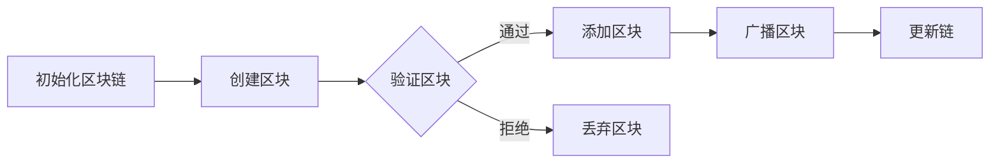
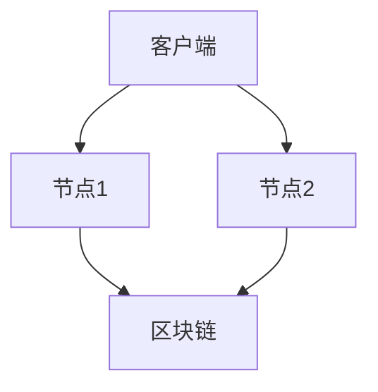
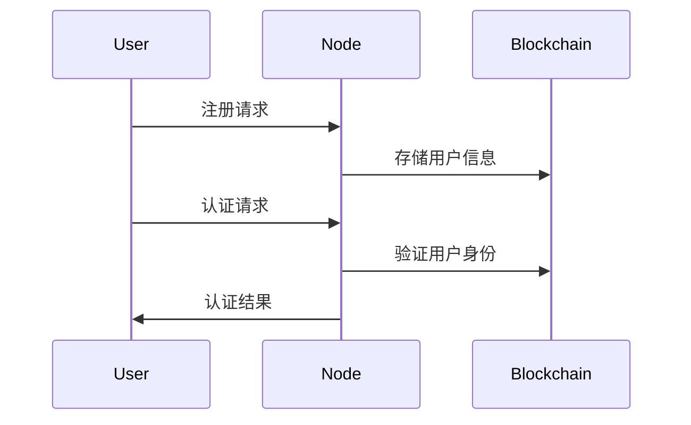

                 


# **区块链应用：去中心化系统的设计与实现**

## **关键词：**
- 区块链
- 去中心化系统
- 智能合约
- 算法
- 数学模型
- 架构设计
- 项目实战

## **摘要：**
本文将深入探讨区块链应用的去中心化系统的设计与实现。我们将从背景介绍、核心概念与联系、算法原理讲解、数学模型和数学公式、系统分析与架构设计方案、项目实战以及最佳实践 tips 等方面，逐步分析区块链技术的核心要素，详细介绍区块链系统设计与实现的全过程。本文旨在为广大开发者提供一份系统、全面的技术指南，帮助读者更好地理解并应用区块链技术。

## **第一部分：背景介绍**

### **第1章：区块链技术概述**

#### **1.1 区块链的基本概念**

区块链是一种分布式数据库系统，它通过加密技术确保数据的不可篡改性和可靠性。它由一系列按照时间顺序排列的“区块”组成，每个区块包含了多个交易记录，并通过加密算法链接在一起，形成了一个不可篡改的数据链条。

#### **1.2 区块链的发展历程**

区块链的概念最早可以追溯到1991年，由化名为Satoshi Nakamoto的人提出。2008年，Satoshi Nakamoto发布了比特币白皮书，首次提出了区块链技术，并在此基础上实现了比特币系统。此后，区块链技术逐渐发展，并在2010年代迎来了爆发式增长。

#### **1.3 区块链的核心原理**

区块链的核心原理包括分布式账本、加密算法、共识机制等。分布式账本确保了数据的去中心化存储，加密算法确保了数据的安全性和隐私性，共识机制则确保了网络中的节点能够达成一致。

#### **1.4 区块链的应用潜力**

区块链技术具有广泛的应用潜力，包括金融、供应链、医疗、投票等领域。它可以提供去中心化的解决方案，降低交易成本，提高数据透明度和安全性。

### **第2章：去中心化系统的优势与挑战**

#### **2.1 去中心化系统的优势**

去中心化系统具有以下几个优势：

1. **去中心化**：去中心化系统能够消除中心化节点，降低单点故障的风险，提高系统的容错性和可靠性。
2. **透明性**：区块链上的数据对所有参与者透明可见，提高了数据的透明度和可信度。
3. **安全性**：区块链通过加密算法和共识机制确保了数据的安全性和隐私性。
4. **不可篡改**：区块链上的数据一旦被记录，就无法被篡改，保证了数据的真实性和可靠性。

#### **2.2 去中心化系统的挑战**

去中心化系统也面临一些挑战：

1. **性能瓶颈**：区块链的吞吐量相对较低，无法满足某些高并发的应用场景。
2. **去中心化程度**：在实际应用中，很难实现完全的去中心化，往往需要在去中心化和效率之间做出权衡。
3. **安全性**：虽然区块链具有较好的安全性，但仍然存在被黑客攻击的风险。

#### **2.3 区块链在去中心化系统中的作用**

区块链技术是构建去中心化系统的基础，它为去中心化系统提供了数据存储、传输和验证的机制。区块链的去中心化特性、透明性和安全性使得它成为构建各种去中心化应用的首选技术。

## **第二部分：核心概念与联系**

### **第3章：区块链的基础架构**

#### **3.1 区块链的组成部分**

区块链由三个主要部分组成：区块链网络、节点和区块链数据。

1. **区块链网络**：区块链网络是由多个节点组成的分布式网络，节点之间通过P2P协议进行通信。
2. **节点**：节点是区块链网络中的参与者，它们负责存储和验证区块链数据。
3. **区块链数据**：区块链数据包括区块和交易，区块包含了多个交易记录，每个区块通过哈希算法与前一个区块链接在一起。

#### **3.2 分布式网络**

分布式网络是指网络中的节点分散在不同的地理位置，通过网络协议进行通信。区块链网络就是典型的分布式网络。

#### **3.3 智能合约**

智能合约是一种自动执行的合约，它包含了双方达成的条款和条件。当触发条件时，智能合约会自动执行并执行相应的操作。

#### **3.4 Mermaid ER实体关系图**

使用Mermaid绘制ER实体关系图，可以直观地展示区块链系统中的实体及其关系。

```mermaid
erDiagram
    Block ||--|{ Transaction : 包含 }
    Node ||--|{ Blockchain : 存储在 }
    Node ||--|{ Transaction : 验证 }
    SmartContract ||--|{ Transaction : 触发 }
```

### **第4章：区块链核心算法**

#### **4.1 哈希算法**

哈希算法是一种将任意长度的输入数据转换成固定长度的输出数据的算法。在区块链中，哈希算法用于确保数据的完整性和不可篡改性。

#### **4.2 共识算法**

共识算法是区块链网络中的节点达成一致的方法。常见的共识算法包括工作量证明（Proof of Work，PoW）、权益证明（Proof of Stake，PoS）等。

#### **4.3 Mermaid算法流程图**

使用Mermaid绘制算法流程图，可以直观地展示区块链算法的执行过程。



## **第三部分：算法原理讲解**

### **第5章：区块链算法的数学模型**

#### **5.1 哈希算法的数学原理**

哈希算法的数学原理是通过将输入数据与一个密钥进行加密运算，得到一个固定长度的输出值。常见的哈希算法包括MD5、SHA-1、SHA-256等。

#### **5.2 共识算法的数学原理**

共识算法的数学原理是通过一系列加密算法和博弈论原理，确保网络中的节点能够达成一致。常见的共识算法包括PoW、PoS等。

#### **5.3 LaTeX数学公式与讲解**

使用LaTeX格式编写数学公式，并进行详细讲解。

```latex
$$
H(x) = \text{SHA-256}(x + k)
$$

其中，\( H(x) \) 表示哈希值，\( x \) 表示输入数据，\( k \) 表示密钥。
```

### **第6章：区块链应用案例分析**

#### **6.1 比特币网络**

比特币网络是区块链技术的最早应用，它采用了PoW共识算法，通过解决数学难题来验证交易并生成新区块。

#### **6.2 以太坊网络**

以太坊网络是另一个重要的区块链项目，它采用了PoS共识算法，并引入了智能合约功能，使得去中心化应用（DApp）得以实现。

#### **6.3 其他区块链项目案例分析**

除了比特币和以太坊，还有许多其他的区块链项目，如EOS、Tezos、Cardano等，它们各自采用了不同的共识算法和设计理念，为区块链技术的发展提供了丰富的实践案例。

## **第四部分：系统分析与架构设计方案**

### **第7章：区块链系统功能设计**

#### **7.1 问题场景介绍**

假设我们需要设计一个去中心化的身份认证系统，用户可以在系统中创建和存储自己的身份信息，并通过加密算法确保信息的完整性和隐私性。

#### **7.2 系统功能设计**

系统功能设计包括用户注册、身份认证、数据存储和隐私保护等。

1. **用户注册**：用户可以在系统中创建账户，并设置密码。
2. **身份认证**：用户可以通过身份认证，验证自己的身份信息。
3. **数据存储**：用户可以存储和共享自己的身份信息。
4. **隐私保护**：系统通过加密算法，确保用户身份信息的完整性和隐私性。

#### **7.3 Mermaid类图**

使用Mermaid绘制类图，展示系统功能设计。

```mermaid
classDiagram
    User <<class{用户}>
    Credential <<class{身份信息}>
    Blockchain <<class{区块链}>
    User "1" - "1..*" Credential
    User "1" - "1" Blockchain
```

### **第8章：区块链系统架构设计**

#### **8.1 系统架构设计**

系统架构设计包括客户端、节点和网络三个部分。

1. **客户端**：用户通过客户端与区块链系统进行交互。
2. **节点**：节点负责存储和验证区块链数据。
3. **网络**：网络负责节点之间的通信和协同工作。

#### **8.2 Mermaid架构图**

使用Mermaid绘制架构图，展示系统架构设计。



### **第9章：系统交互设计**

#### **9.1 系统交互设计**

系统交互设计包括用户注册、身份认证、数据存储和隐私保护等交互过程。

1. **用户注册**：用户通过客户端发起注册请求，节点验证用户信息后，将用户信息存储在区块链上。
2. **身份认证**：用户通过客户端发起身份认证请求，节点验证用户身份后，返回认证结果。
3. **数据存储**：用户通过客户端上传身份信息，节点将身份信息存储在区块链上。
4. **隐私保护**：系统通过加密算法，确保用户身份信息的完整性和隐私性。

#### **9.2 Mermaid序列图**

使用Mermaid绘制序列图，展示系统交互设计。



## **第五部分：项目实战**

### **第10章：搭建区块链环境**

#### **10.1 环境安装指南**

介绍如何搭建区块链开发环境，包括安装Node.js、Python、Golang等开发工具和区块链框架。

### **第11章：实现简单区块链应用**

#### **11.1 系统核心实现源代码**

提供简单的区块链应用源代码，包括节点、区块和交易等核心实现。

```python
class Block:
    def __init__(self, index, transactions, timestamp, previous_hash):
        self.index = index
        self.transactions = transactions
        self.timestamp = timestamp
        self.previous_hash = previous_hash
        self.hash = self.compute_hash()

    def compute_hash(self):
        # 使用SHA-256算法计算哈希值
        pass

class Blockchain:
    def __init__(self):
        self.unconfirmed_transactions = []
        self.chain = []
        self.create_genesis_block()

    def create_genesis_block(self):
        # 创建创世区块
        pass

    def add_new_transaction(self, transaction):
        # 添加新交易
        pass

    def mine_block(self):
        # 挖掘新区块
        pass

    def is_chain_valid(self):
        # 验证区块链是否有效
        pass
```

#### **11.2 代码应用解读与分析**

对源代码进行解读和分析，介绍节点、区块和交易等核心概念和实现原理。

#### **11.3 实际案例分析**

介绍如何使用简单区块链应用实现去中心化身份认证系统，包括用户注册、身份认证和数据存储等。

### **第12章：项目小结**

对项目进行总结，回顾项目的成果和遇到的问题，并提出解决方案。

### **第13章：最佳实践 tips**

提供使用区块链技术的最佳实践和建议，包括安全性、性能优化和可扩展性等方面。

### **第14章：全书内容总结**

对全书内容进行总结，回顾核心概念、算法原理、系统设计与实现等关键内容。

### **第15章：拓展阅读**

提供一些拓展阅读资源，包括相关书籍、在线课程和学术论文等。

## **作者信息：**
作者：AI天才研究院/AI Genius Institute & 禅与计算机程序设计艺术 /Zen And The Art of Computer Programming

本文遵循创造性共同作者（CC BY-NC-SA 4.0）许可协议，欢迎自由分享、复制、分发和改编，但需注明作者和来源。本文内容仅供参考，不构成投资建议。如有疑问，请咨询专业顾问。

