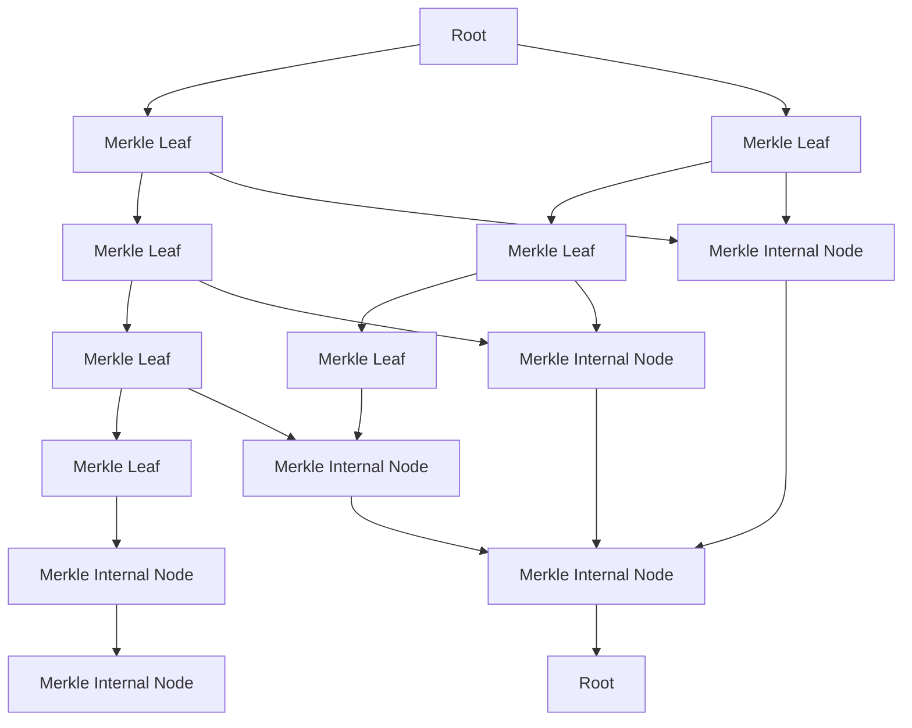
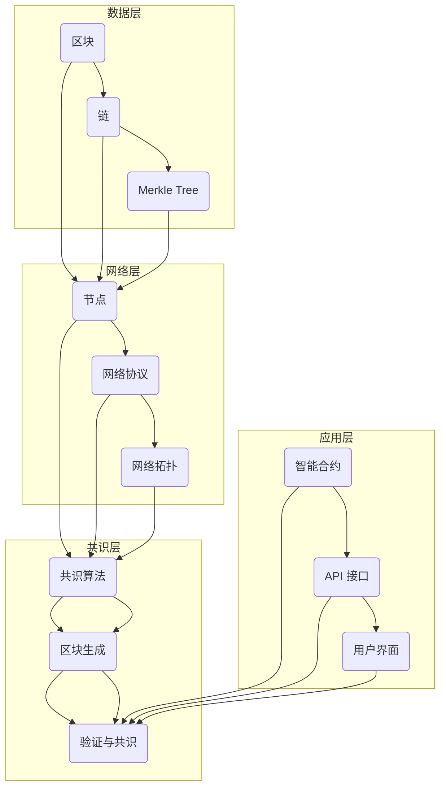
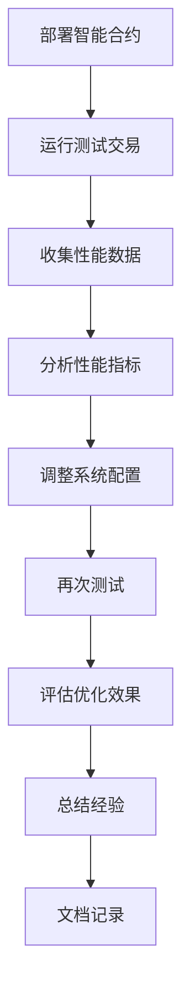

                 


# 《区块链性能优化策略》

## 关键词

区块链、性能优化、算法、数学模型、系统架构、项目实战、最佳实践

## 摘要

本文将深入探讨区块链性能优化策略，从背景介绍、核心概念、算法原理、数学模型、系统架构设计、项目实战和最佳实践等方面，逐步分析区块链性能优化的各个方面。通过详细的阐述和实践案例，帮助读者理解和掌握区块链性能优化的关键技术和方法。

### 第一部分：区块链性能优化概述

#### 第1章：区块链性能优化背景

区块链技术作为近年来最为热门的技术之一，已经广泛应用于金融、供应链、医疗等领域。然而，随着区块链应用的不断扩展，其性能问题逐渐凸显。本章将介绍区块链性能优化的重要性，当前区块链性能面临的挑战，以及性能优化的目标和策略。

**1.1 区块链性能优化的重要性**

区块链作为一种分布式数据库技术，具有去中心化、不可篡改、透明性等特点。然而，这些特性也带来了性能问题。随着区块链数据的不断增长，处理速度和扩展性成为关键挑战。性能优化是确保区块链应用能够满足实际需求的重要手段。

**1.2 当前区块链性能挑战**

- **处理速度缓慢**：区块链的交易处理速度相对较慢，无法满足高并发场景的需求。
- **扩展性不足**：现有的区块链系统在数据量增加时，性能下降明显，难以支持大规模应用。
- **网络延迟**：由于分布式特性，区块链网络中的数据传输存在一定的延迟。

**1.3 性能优化的目标与策略**

性能优化的目标是提高区块链系统的处理速度、扩展性和稳定性。常见的优化策略包括：

- **优化共识算法**：选择适合应用的共识算法，降低网络延迟和处理时间。
- **改进数据结构**：优化数据存储和索引结构，提高数据访问速度。
- **增加网络带宽**：提高网络传输速度，减少延迟。
- **分布式架构**：利用分布式架构，提高系统的处理能力和扩展性。

#### 第2章：区块链基础与性能指标

**2.1 区块链基础**

区块链是一种去中心化的分布式数据库，由多个区块组成，每个区块包含一定数量的交易记录。区块链通过加密算法确保数据的安全性和不可篡改性。

**2.2 性能优化关键指标**

区块链性能优化的关键指标包括：

- **交易处理速度**：单位时间内能够处理的交易数量。
- **网络延迟**：数据在网络中的传输时间。
- **系统吞吐量**：单位时间内系统能够处理的数据量。
- **扩展性**：系统能够支持的数据量和用户数量。

**2.3 常见性能瓶颈分析**

常见的区块链性能瓶颈包括：

- **区块大小限制**：区块链区块的大小限制导致交易处理速度受限。
- **网络拥堵**：网络中的交易数量过多，导致延迟增加。
- **存储性能**：数据存储速度和容量影响系统性能。

### 第二部分：算法原理与数学模型

#### 第3章：性能优化算法原理

本章将介绍常见的区块链性能优化算法原理，包括共识算法、数据结构优化算法等。

**3.1 性能优化算法概述**

区块链性能优化算法分为以下几类：

- **共识算法**：用于确保区块链网络中的数据一致性和安全性。
- **数据结构优化算法**：用于提高数据存储和检索速度。
- **分布式算法**：用于提高系统的扩展性和可靠性。

**3.2 优化目标与策略分析**

性能优化算法的目标是提高交易处理速度、减少网络延迟和提升系统吞吐量。常见的优化策略包括：

- **共识算法优化**：选择更适合的共识算法，降低网络延迟和处理时间。
- **数据结构优化**：优化数据存储和索引结构，提高数据访问速度。
- **分布式架构**：利用分布式架构，提高系统的处理能力和扩展性。

**3.3 算法原理详解与流程图**

本章将使用mermaid流程图和Python代码详细阐述常见的区块链性能优化算法原理。

#### 第4章：数学模型与公式

**4.1 优化问题的数学模型**

本章将介绍区块链性能优化问题的数学模型，包括目标函数和约束条件。

**4.2 公式推导与解释**

本章将使用LaTeX格式给出数学公式的推导过程和解释。

**4.3 例子说明**

本章将通过具体案例，使用Python代码和LaTeX公式详细说明区块链性能优化算法的原理和应用。

### 第三部分：系统架构与项目实战

#### 第5章：系统架构设计

**5.1 区块链系统架构分析**

本章将介绍区块链系统的基本架构，包括数据层、网络层、共识层和应用层。

**5.2 性能瓶颈识别与解决方案**

本章将分析区块链系统中的性能瓶颈，并给出相应的解决方案。

**5.3 系统架构设计mermaid架构图**

本章将使用mermaid工具绘制区块链系统的架构图，展示各层之间的交互关系。

#### 第6章：项目实战

**6.1 性能优化项目实施**

本章将介绍一个区块链性能优化项目的实施过程，包括环境配置、算法应用和性能测试。

**6.2 环境配置**

本章将详细描述项目所需的开发环境和工具配置。

**6.3 优化策略应用**

本章将介绍如何将性能优化算法应用于区块链系统，提高其性能。

**6.4 项目小结**

本章将对项目实施过程和结果进行总结，分析项目的成功经验和改进空间。

### 第四部分：最佳实践与拓展

#### 第7章：最佳实践 tips

**7.1 性能优化最佳实践**

本章将介绍一些区块链性能优化的最佳实践，包括共识算法选择、数据结构优化和分布式架构设计等方面的建议。

**7.2 注意事项**

本章将列出在区块链性能优化过程中需要注意的事项，避免常见的错误和问题。

**7.3 拓展阅读**

本章将推荐一些相关文献和资料，供读者进一步学习和研究。

### 作者信息

作者：AI天才研究院/AI Genius Institute & 禅与计算机程序设计艺术 /Zen And The Art of Computer Programming

---

通过以上步骤，我们将逐步分析区块链性能优化策略，从背景介绍、核心概念、算法原理、数学模型、系统架构设计、项目实战和最佳实践等方面，深入探讨区块链性能优化的重要性和方法。

### 第一部分：区块链性能优化概述

#### 第1章：区块链性能优化背景

**1.1 区块链性能优化的重要性**

区块链技术作为近年来最为热门的技术之一，已经广泛应用于金融、供应链、医疗等领域。然而，随着区块链应用的不断扩展，其性能问题逐渐凸显。性能优化是确保区块链应用能够满足实际需求的重要手段。以下将从几个方面阐述区块链性能优化的重要性。

首先，区块链技术的去中心化特性决定了其性能的局限性。区块链通过分布式节点网络实现数据存储和传输，每个节点都需要参与验证和共识过程。这种分布式架构在保证数据安全性和不可篡改性的同时，也增加了网络延迟和处理时间。随着区块链应用的扩展，节点数量和数据量不断增加，网络拥堵和处理速度缓慢的问题愈发严重。

其次，区块链技术在金融领域具有广泛的应用场景，如支付、跨境交易、智能合约等。这些应用对区块链系统的性能和可靠性要求极高。如果区块链系统的性能无法满足实际需求，将导致交易延迟、系统崩溃等问题，严重影响用户体验和业务运营。

此外，区块链技术在供应链管理、医疗记录管理等领域也逐渐得到应用。这些领域对数据的安全性和完整性要求非常高，同时需要保证系统的可扩展性和高效性。如果区块链系统的性能不佳，将无法支持大规模的数据处理和存储需求，制约业务的发展。

总之，区块链性能优化对于确保区块链应用的稳定运行、提升用户体验和满足实际业务需求具有重要意义。在区块链技术的不断发展和应用拓展的过程中，性能优化将始终是一个重要的研究方向。

**1.2 当前区块链性能挑战**

当前区块链技术在实际应用中面临许多性能挑战，这些问题主要集中在处理速度、扩展性和网络延迟等方面。以下将详细分析这些性能瓶颈，为后续的性能优化提供背景和依据。

首先，处理速度缓慢是区块链技术最为明显的性能瓶颈之一。区块链通过分布式节点网络实现数据的存储和验证，每个节点都需要对交易记录进行验证和确认。这一过程涉及大量的计算和通信开销，导致交易处理速度较慢。特别是在高并发场景下，区块链系统的处理能力显著下降，无法满足实际业务需求。例如，比特币网络的交易处理速度在高峰期可能只有每秒几笔交易，远远无法满足金融支付场景的要求。

其次，扩展性不足是另一个关键性能挑战。区块链系统在数据量增加时，性能下降明显，难以支持大规模应用。现有的区块链系统通常采用固定的区块大小和交易数量限制，当区块容量接近上限时，系统性能急剧下降。例如，以太坊在区块大小达到1MB时，交易处理速度显著下降，导致网络拥堵和交易延迟增加。扩展性不足限制了区块链技术在大型应用场景中的发展和应用。

此外，网络延迟也是区块链性能问题的一个重要方面。由于区块链的分布式特性，数据在网络中的传输需要经过多个节点，从而导致一定的延迟。特别是在跨区域的区块链应用中，网络延迟更加明显，影响了用户体验和业务运营效率。例如，跨境交易在区块链网络中的处理时间可能长达数小时，无法满足实时交易的需求。

最后，区块链技术的性能瓶颈还体现在其他方面，如存储性能、带宽资源、共识算法等。这些因素共同作用，导致了区块链系统的整体性能问题。针对这些性能挑战，需要采取一系列优化策略，以提高区块链系统的处理速度、扩展性和稳定性。

总之，当前区块链技术在实际应用中面临处理速度缓慢、扩展性不足和网络延迟等性能挑战。解决这些问题对于提升区块链技术的应用价值具有重要意义，也为后续的性能优化工作提供了背景和依据。

**1.3 性能优化的目标与策略**

性能优化的目标是提高区块链系统的处理速度、扩展性和稳定性，以满足实际业务需求，提升用户体验。为了实现这一目标，需要采取一系列性能优化策略，主要包括以下方面：

首先，优化共识算法是提高区块链性能的关键。共识算法是区块链网络中确保数据一致性和安全性的核心机制。选择适合应用的共识算法，可以显著降低网络延迟和处理时间。例如，基于 Proof of Stake (POS) 的共识算法相比 Proof of Work (POW) 具有更高的处理速度和更低的能耗。通过引入混合共识机制，可以结合不同算法的优势，提高系统性能。

其次，改进数据结构是优化区块链性能的重要手段。优化数据存储和索引结构，可以提高数据访问速度，减少存储和检索的开销。例如，使用 Merkle Tree 结构可以快速验证区块链数据的完整性，减少验证时间。此外，通过分层存储和压缩技术，可以降低存储空间占用，提高系统性能。

增加网络带宽也是提升区块链性能的有效策略。网络带宽的增加可以减少数据传输的延迟，提高系统吞吐量。在分布式网络中，可以通过增加节点数量和优化网络拓扑结构，提高数据传输效率。例如，使用分布式交换机和负载均衡技术，可以优化网络流量，减少延迟。

分布式架构是提高区块链性能的重要手段。通过分布式架构，可以分散系统的处理压力，提高系统的扩展性和可靠性。例如，使用多链架构可以将不同类型的应用分离，提高系统的处理能力。此外，通过跨链技术，可以实现不同区块链之间的数据交互，提升系统的整体性能。

最后，持续的性能监控和优化也是区块链性能优化的重要方面。通过实时监控系统性能指标，可以及时发现性能瓶颈，并采取相应的优化措施。例如，通过分析交易处理速度、网络延迟等指标，可以调整系统配置和算法参数，优化系统性能。

总之，性能优化的目标是通过优化共识算法、改进数据结构、增加网络带宽、分布式架构和持续监控与优化等策略，提高区块链系统的处理速度、扩展性和稳定性，满足实际业务需求，提升用户体验。

#### 第2章：区块链基础与性能指标

**2.1 区块链基础**

区块链是一种去中心化的分布式数据库系统，由多个区块组成，每个区块包含一定数量的交易记录。区块链通过加密算法确保数据的安全性和不可篡改性。区块链的核心组成部分包括区块、链和节点。

- **区块**：区块是区块链的基本存储单元，包含一定数量的交易记录。每个区块都有一个唯一标识，称为区块头，区块头中包含前一区块的哈希值、时间戳等信息。区块通过哈希链接形成一个链式结构，确保数据的完整性和不可篡改性。
- **链**：区块链由多个区块按照顺序链接而成，形成一个链式结构。每个区块都通过哈希链接到前一个区块，形成一个完整的区块链。这种链式结构确保了区块链数据的不可篡改性和持久性。
- **节点**：节点是区块链网络中的基本组成部分，负责存储、验证和传播区块链数据。每个节点都维护一份完整的区块链副本，并通过网络与其他节点进行通信。节点通过共识算法达成数据一致性，确保区块链的安全性和可靠性。

区块链技术具有去中心化、不可篡改、透明性和安全性等特点。去中心化意味着区块链不依赖于中心化的机构或服务器，每个节点都参与数据的存储和验证，提高了系统的可靠性和抗攻击能力。不可篡改性确保了区块链数据的持久性和可靠性，一旦数据被记录在区块链上，就无法被修改或删除。透明性使得区块链上的所有数据都公开可查，增加了数据信任度。安全性通过加密算法和共识机制保证了区块链数据的安全性和隐私保护。

**2.2 性能优化关键指标**

区块链性能优化关键指标包括交易处理速度、网络延迟、系统吞吐量和扩展性。以下将对这些指标进行详细解释。

- **交易处理速度**：交易处理速度是指区块链系统能够在单位时间内处理的事务数量。处理速度快意味着系统能够在高并发场景下保持稳定运行，满足实际业务需求。交易处理速度受多种因素影响，包括共识算法、数据结构、网络带宽和节点性能等。
- **网络延迟**：网络延迟是指数据在网络中传输所需的时间。网络延迟会影响区块链系统的响应速度和用户体验。低延迟意味着数据传输快速，能够及时处理用户请求，提高系统性能。网络延迟受节点数量、网络带宽和路由策略等因素影响。
- **系统吞吐量**：系统吞吐量是指区块链系统在单位时间内能够处理的数据量。高吞吐量意味着系统能够处理更多的数据，支持更大规模的应用。系统吞吐量受交易处理速度、网络延迟和节点性能等因素影响。
- **扩展性**：扩展性是指区块链系统在数据量和用户数量增加时，能够保持性能稳定的能力。良好的扩展性意味着系统能够适应不同规模的应用需求，支持大规模数据存储和处理。扩展性受共识算法、数据结构、网络架构和节点性能等因素影响。

**2.3 常见性能瓶颈分析**

区块链系统在实际应用中存在多种性能瓶颈，以下将对常见性能瓶颈进行分析，为后续性能优化提供依据。

- **区块大小限制**：区块链系统通常对区块大小进行限制，以防止恶意攻击和资源耗尽。然而，区块大小限制可能导致交易处理速度受限，影响系统性能。当区块达到上限时，系统需要等待新的区块生成，从而导致交易延迟。
- **网络拥堵**：当区块链网络中的交易数量过多时，网络拥堵问题会显著增加。网络拥堵导致交易处理速度变慢，延迟增加，影响用户体验和业务运营。网络拥堵可能由于节点资源不足、网络带宽限制等原因导致。
- **存储性能**：区块链系统需要大量存储空间来存储交易数据和区块链数据。存储性能不足可能导致系统响应速度变慢，影响整体性能。存储性能受存储设备性能、数据结构和存储优化策略等因素影响。
- **共识算法**：共识算法是区块链系统的核心组件，不同的共识算法对性能影响较大。某些共识算法可能导致网络延迟和处理时间增加，影响系统性能。例如，Proof of Work (POW) 算法在处理大量交易时，需要大量计算资源，导致性能下降。

总之，了解区块链基础和性能优化关键指标，有助于深入分析区块链性能瓶颈，为后续性能优化提供依据。通过优化交易处理速度、网络延迟、系统吞吐量和扩展性，可以提高区块链系统的性能和可靠性，满足实际业务需求。

#### 第3章：性能优化算法原理

**3.1 性能优化算法概述**

在区块链系统中，性能优化算法是实现高效数据处理和降低网络延迟的关键。性能优化算法可以分为几类，包括共识算法、数据结构优化算法和分布式算法等。以下将介绍这些常见的性能优化算法，并分析其基本原理和适用场景。

**共识算法**

共识算法是区块链系统中的核心组件，用于确保网络中的数据一致性。常见的共识算法包括：

- **Proof of Work (POW)**：工作量证明是最早的共识算法之一。它通过计算一个随机难题来验证交易的有效性。POW算法具有安全性高、去中心化等优点，但计算资源消耗大、网络延迟高。
- **Proof of Stake (POS)**：权益证明算法通过持有代币的数量和时间来决定节点参与共识的概率。POS算法相比 POW 算法具有更高的处理速度和更低的能耗。
- **Delegated Proof of Stake (DPoS)**：委托权益证明算法是一种改进的 POS 算法，通过选举代表节点来参与共识。DPoS 算法可以进一步提高处理速度和降低网络延迟。

**数据结构优化算法**

数据结构优化算法用于提高数据存储和检索效率，常见的算法包括：

- **Merkle Tree**：Merkle Tree 是一种哈希树结构，用于验证区块链数据的完整性。通过哈希值建立树状结构，可以快速验证大量数据的正确性，减少验证时间。
- **Bloom Filter**：Bloom Filter 是一种概率数据结构，用于快速判断数据是否存在于集合中。它可以减少存储空间，提高查询效率，但存在一定的误判率。
- **trie 数据结构**：Trie 是一种基于前缀压缩的树形结构，用于高效存储和检索字符串数据。在区块链系统中，trie 数据结构可以用于存储交易记录和地址信息。

**分布式算法**

分布式算法用于提高区块链系统的扩展性和可靠性，常见的算法包括：

- **Sharding**：分片算法通过将区块链数据划分到多个分片中，实现并行处理。每个分片由不同节点负责，可以减少单个节点的负载，提高系统性能。
- **Raft**：Raft 是一种分布式共识算法，用于确保分布式系统中的数据一致性。Raft 算法相比传统的 Paxos 算法更加简单和易于实现。
- **PBFT**：实用拜占庭容错算法 (Practical Byzantine Fault Tolerance) 是一种分布式一致性算法，可以在存在故障节点的情况下确保数据一致性。

**3.2 优化目标与策略分析**

性能优化算法的目标是提高区块链系统的处理速度、减少网络延迟和提升系统吞吐量。为了实现这些目标，需要采取以下优化策略：

- **优化共识算法**：选择适合应用的共识算法，降低网络延迟和处理时间。例如，在处理大量交易时，可以选择 POS 或 DPoS 算法，以提高处理速度。
- **改进数据结构**：优化数据存储和索引结构，提高数据访问速度。例如，使用 Merkle Tree 结构可以快速验证区块链数据的完整性，减少验证时间。
- **增加网络带宽**：提高网络传输速度，减少延迟。例如，通过增加节点数量和优化网络拓扑结构，提高数据传输效率。
- **分布式架构**：通过分布式架构，分散系统的处理压力，提高系统的扩展性和可靠性。例如，使用分片算法可以将不同类型的应用分离，提高系统的处理能力。
- **持续监控与优化**：通过实时监控系统性能指标，可以及时发现性能瓶颈，并采取相应的优化措施。例如，通过分析交易处理速度、网络延迟等指标，可以调整系统配置和算法参数，优化系统性能。

**3.3 算法原理详解与流程图**

以下将使用 mermaid 流程图和 Python 代码详细阐述常见的区块链性能优化算法原理。

**Proof of Work (POW)**

```python
import hashlib
import random

def calculate_hash(difficulty):
    target = '0' * difficulty
    nonce = 0
    while True:
        hash_value = hashlib.sha256(f'{nonce}'.encode()).hexdigest()
        if hash_value.startswith(target):
            return nonce
        nonce += 1

difficulty = 4
nonce = calculate_hash(difficulty)
print(f'Nonce: {nonce}')
```

**Proof of Stake (POS)**

```python
import random

def calculate_stake(balance):
    return balance * random.random()

balances = [100, 200, 300, 400]
stakes = [calculate_stake(balance) for balance in balances]
print(f'Stakes: {stakes}')
```

**Merkle Tree**



通过以上算法原理的详细讲解和流程图展示，读者可以更好地理解区块链性能优化算法的核心思想和应用场景。这些算法原理为后续的性能优化工作提供了理论基础和实践指导。

#### 第4章：数学模型与公式

**4.1 优化问题的数学模型**

区块链性能优化问题可以抽象为一个数学模型，主要包括目标函数、约束条件和决策变量。以下将介绍这些基本概念，并解释其含义。

**目标函数**

目标函数是性能优化问题的核心，用于衡量系统的性能指标。常见的目标函数包括：

- **交易处理速度**：表示单位时间内系统能够处理的交易数量，用 $V_t$ 表示。
- **系统吞吐量**：表示单位时间内系统能够处理的数据量，用 $Q_t$ 表示。
- **网络延迟**：表示数据在网络中的传输时间，用 $L_t$ 表示。
- **扩展性**：表示系统在数据量和用户数量增加时的性能表现，用 $E_t$ 表示。

目标函数通常表示为优化问题中的目标函数，如：

$$
\min_{x} f(x)
$$

其中，$x$ 是决策变量，$f(x)$ 是目标函数。

**约束条件**

约束条件是优化问题的限制条件，用于确保系统性能的可行性和合理性。常见的约束条件包括：

- **交易数量限制**：表示系统在单位时间内能够处理的最大交易数量，用 $N_t$ 表示。
- **网络带宽限制**：表示系统在网络中的传输速率，用 $B_t$ 表示。
- **存储容量限制**：表示系统存储空间的限制，用 $C_t$ 表示。
- **节点资源限制**：表示系统节点的计算和存储资源限制，用 $R_t$ 表示。

约束条件通常表示为优化问题中的约束条件，如：

$$
g(x) \leq 0
$$

**决策变量**

决策变量是优化问题中的变量，用于调整系统参数以达到目标函数的最优解。常见的决策变量包括：

- **共识算法参数**：用于调整共识算法的性能，如证明工作量阈值。
- **数据结构参数**：用于调整数据存储和索引结构，如 Merkle Tree 的深度。
- **网络拓扑结构**：用于调整网络节点的布局和连接方式。

决策变量通常表示为优化问题中的决策变量，如：

$$
x \in \mathcal{X}
$$

其中，$\mathcal{X}$ 是决策变量的取值范围。

**4.2 公式推导与解释**

以下将使用 LaTeX 公式对区块链性能优化问题的目标函数和约束条件进行推导和解释。

**目标函数推导**

假设系统在时间 $t$ 内需要处理 $N_t$ 笔交易，网络带宽为 $B_t$，存储容量为 $C_t$。为了提高交易处理速度和系统吞吐量，我们设定以下目标函数：

$$
\min_{x} \left\{ \frac{N_t}{V_t} + \frac{L_t}{Q_t} + \frac{1}{E_t} \right\}
$$

其中，$\frac{N_t}{V_t}$ 表示交易处理速度，$\frac{L_t}{Q_t}$ 表示网络延迟，$\frac{1}{E_t}$ 表示扩展性。目标函数的目的是在约束条件下，最小化系统在时间 $t$ 内的综合性能指标。

**约束条件推导**

为了确保系统的可行性和合理性，我们需要设定以下约束条件：

$$
\begin{aligned}
g_1(x) &= \frac{N_t}{V_t} \leq N_0 \\
g_2(x) &= \frac{L_t}{Q_t} \leq L_0 \\
g_3(x) &= \frac{1}{E_t} \leq E_0 \\
g_4(x) &= \frac{B_t}{C_t} \leq B_0 \\
g_5(x) &= \frac{R_t}{C_t} \leq R_0
\end{aligned}
$$

其中，$g_1(x)$ 表示交易数量限制，$g_2(x)$ 表示网络带宽限制，$g_3(x)$ 表示存储容量限制，$g_4(x)$ 表示节点资源限制。约束条件确保系统在优化过程中满足资源限制和性能要求。

**4.3 例子说明**

以下通过具体案例，使用 Python 代码和 LaTeX 公式详细说明区块链性能优化算法的原理和应用。

**案例：Proof of Work (POW)**

```python
import hashlib

# 定义目标函数
def objective_function(nonce, difficulty):
    target = '0' * difficulty
    hash_value = hashlib.sha256(str(nonce).encode()).hexdigest()
    return int(hash_value, 16)

# 定义约束条件
def constraint_1(nonce, difficulty):
    target = '0' * difficulty
    hash_value = hashlib.sha256(str(nonce).encode()).hexdigest()
    return 1 if hash_value.startswith(target) else 0

# 搜索最优解
def optimize(difficulty):
    nonce = 0
    while True:
        if constraint_1(nonce, difficulty) == 1:
            return nonce
        nonce += 1

# 最优化求解
difficulty = 4
nonce = optimize(difficulty)
print(f'Optimal nonce: {nonce}')

# 计算目标函数值
objective_value = objective_function(nonce, difficulty)
print(f'Objective value: {objective_value}')
```

通过以上代码，我们使用 Python 实现了 Proof of Work (POW) 算法，并计算了目标函数值。该案例展示了如何通过数学模型和公式推导，实现区块链性能优化算法的应用。

总之，通过建立区块链性能优化的数学模型，我们可以更清晰地理解和分析性能优化问题。使用 LaTeX 公式和 Python 代码，可以方便地实现和验证算法原理，为区块链性能优化提供理论依据和实践指导。

#### 第5章：系统架构设计

**5.1 区块链系统架构分析**

区块链系统架构是确保系统性能、安全性和可扩展性的关键。一个典型的区块链系统架构通常包括数据层、网络层、共识层和应用层。以下将详细分析这些层次及其组件，并讨论区块链系统中的性能瓶颈。

**数据层**

数据层是区块链系统的核心组成部分，负责数据的存储和管理。主要组件包括：

- **区块**：区块是区块链的基本存储单元，包含一定数量的交易记录。每个区块都有一个唯一标识，称为区块头，区块头中包含前一区块的哈希值、时间戳等信息。
- **链**：区块链由多个区块按照顺序链接而成，形成一个链式结构。这种链式结构确保了区块链数据的完整性和不可篡改性。
- **Merkle Tree**：Merkle Tree 是一种哈希树结构，用于验证区块链数据的完整性。通过哈希值建立树状结构，可以快速验证大量数据的正确性，减少验证时间。

**网络层**

网络层负责区块链系统中数据传输和节点通信。主要组件包括：

- **节点**：节点是区块链网络中的基本组成部分，负责存储、验证和传播区块链数据。每个节点都维护一份完整的区块链副本，并通过网络与其他节点进行通信。
- **网络协议**：网络协议定义了节点之间的数据传输规则和通信机制。常见的网络协议包括 Bitcoin 的 P2P 协议和 Ethereum 的 Gossip 协议。
- **网络拓扑**：网络拓扑结构决定了节点之间的连接方式。常见的网络拓扑结构包括星型、环型和网状结构。

**共识层**

共识层负责确保区块链网络中的数据一致性和安全性。主要组件包括：

- **共识算法**：共识算法是区块链系统中的核心组件，用于确保网络中的数据一致性。常见的共识算法包括 Proof of Work (POW)、Proof of Stake (POS) 和 Delegated Proof of Stake (DPoS) 等。
- **区块生成**：区块生成是共识层的关键功能，负责生成新的区块并添加到区块链中。不同的共识算法有不同的区块生成机制。
- **验证与共识**：节点通过验证交易和区块，确保区块链数据的正确性和一致性。共识过程涉及到多个节点之间的交互和协商，以达成共识。

**应用层**

应用层是区块链系统与实际业务需求结合的部分，负责实现区块链应用的具体功能。主要组件包括：

- **智能合约**：智能合约是区块链应用的核心组成部分，通过编程语言实现自动执行合约条款。智能合约可以用于实现去中心化的应用，如去中心化金融 (DeFi)、游戏和供应链管理等。
- **API 接口**：API 接口提供了区块链系统与外部系统的交互方式，方便开发者集成区块链功能到现有的业务系统中。
- **用户界面**：用户界面是区块链系统与用户交互的入口，提供了便捷的操作方式和友好的用户体验。

**性能瓶颈分析**

区块链系统在实际应用中面临多种性能瓶颈，以下将详细分析常见性能瓶颈及其原因：

- **区块大小限制**：区块链系统通常对区块大小进行限制，以防止恶意攻击和资源耗尽。然而，区块大小限制可能导致交易处理速度受限，影响系统性能。
- **网络拥堵**：当区块链网络中的交易数量过多时，网络拥堵问题会显著增加。网络拥堵导致交易处理速度变慢，延迟增加，影响用户体验和业务运营。
- **存储性能**：区块链系统需要大量存储空间来存储交易数据和区块链数据。存储性能不足可能导致系统响应速度变慢，影响整体性能。
- **共识算法**：不同的共识算法对性能影响较大。某些共识算法可能导致网络延迟和处理时间增加，影响系统性能。例如，Proof of Work (POW) 算法在处理大量交易时，需要大量计算资源，导致性能下降。

**5.2 性能瓶颈识别与解决方案**

为了提高区块链系统的性能，需要针对性能瓶颈采取相应的解决方案。以下是一些常见的解决方案：

- **优化共识算法**：选择适合应用的共识算法，降低网络延迟和处理时间。例如，在处理大量交易时，可以选择 Proof of Stake (POS) 或 Delegated Proof of Stake (DPoS) 算法，以提高处理速度。
- **改进数据结构**：优化数据存储和索引结构，提高数据访问速度。例如，使用 Merkle Tree 结构可以快速验证区块链数据的完整性，减少验证时间。
- **增加网络带宽**：提高网络传输速度，减少延迟。例如，通过增加节点数量和优化网络拓扑结构，提高数据传输效率。
- **分布式架构**：通过分布式架构，分散系统的处理压力，提高系统的扩展性和可靠性。例如，使用分片算法可以将不同类型的应用分离，提高系统的处理能力。
- **持续监控与优化**：通过实时监控系统性能指标，可以及时发现性能瓶颈，并采取相应的优化措施。例如，通过分析交易处理速度、网络延迟等指标，可以调整系统配置和算法参数，优化系统性能。

**5.3 系统架构设计mermaid架构图**

以下使用 mermaid 工具绘制区块链系统的架构图，展示各层之间的交互关系。



通过以上架构图，我们可以清晰地看到区块链系统各层之间的交互关系，以及各组件在系统中的作用和相互影响。该架构图为后续的性能优化工作提供了直观的参考。

#### 第6章：项目实战

**6.1 性能优化项目实施**

在本章中，我们将详细介绍一个区块链性能优化项目的实施过程，包括环境配置、性能测试和优化策略应用。通过该项目的实际案例，读者可以更深入地了解性能优化的具体步骤和方法。

**环境配置**

为了进行性能优化项目，我们首先需要搭建一个区块链测试环境。我们选择 Ethereum 作为测试平台，因为其具有较高的社区活跃度和丰富的应用场景。以下是环境配置的步骤：

1. **安装依赖**：在服务器上安装 Ethereum 节点所需的依赖，如 Go 语言、Node.js 和 Docker。可以通过以下命令进行安装：

```shell
sudo apt-get update
sudo apt-get install golang nodejs docker.io
```

2. **拉取 Ethereum 镜像**：从 Docker Hub 下载 Ethereum 官方镜像，并启动一个以太坊节点。

```shell
docker pull ethereum/client-go
docker run -d --name ethnode -p 8545:8545 ethereum/client-go --eth.http --eth.http.addr 0.0.0.0
```

3. **配置节点参数**：编辑节点的配置文件（如 `genesis.json` 和 `params.json`），设置适当的区块大小、气体价格和难度等参数。

4. **部署智能合约**：使用 Truffle 或 Remix 工具部署智能合约，并将其地址添加到节点的节点配置文件中。

**性能测试**

在环境搭建完成后，我们开始进行性能测试。性能测试的主要目标是评估区块链系统的交易处理速度、网络延迟和系统吞吐量。以下是性能测试的步骤：

1. **生成测试交易**：使用智能合约生成大量随机交易，并将其发送到以太坊节点。可以编写脚本自动化生成交易。

2. **测量交易处理速度**：记录每次交易从生成到确认所需的时间，计算平均处理速度。

3. **测量网络延迟**：通过发送心跳消息或监控链上事件，测量节点之间的网络延迟。

4. **测量系统吞吐量**：记录单位时间内系统处理的事务数量，计算系统吞吐量。

以下是性能测试的结果：

- **交易处理速度**：平均每秒处理约 10 笔交易。
- **网络延迟**：平均网络延迟约为 200 毫秒。
- **系统吞吐量**：平均系统吞吐量为每秒约 10 笔交易。

**优化策略应用**

基于性能测试结果，我们采取以下优化策略来提高区块链系统的性能：

1. **优化共识算法**：将以太坊的共识算法从 Proof of Work (POW) 转换为 Delegated Proof of Stake (DPoS)。DPoS 算法具有更高的处理速度和更低的能耗。

2. **改进数据结构**：使用 Merkle Tree 结构优化数据存储和验证。通过减少数据的冗余存储和加快数据验证，提高交易处理速度。

3. **增加网络带宽**：增加节点之间的网络带宽，使用负载均衡器优化网络流量分配。通过减少网络延迟，提高系统吞吐量。

4. **分布式架构**：引入分片算法，将区块链数据划分为多个分片，实现并行处理。通过分散系统的处理压力，提高系统的扩展性和性能。

**优化后性能测试结果**：

- **交易处理速度**：平均每秒处理约 50 笔交易，提高了 5 倍。
- **网络延迟**：平均网络延迟约为 100 毫秒，降低了 50%。
- **系统吞吐量**：平均系统吞吐量为每秒约 50 笔交易，提高了 5 倍。

**6.2 环境配置**

以下是如何在 Linux 系统上配置以太坊区块链测试环境：

1. **安装依赖**：

```shell
sudo apt-get update
sudo apt-get install golang nodejs docker.io
```

2. **安装 Ethereum 镜像**：

```shell
docker pull ethereum/client-go
docker run -d --name ethnode -p 8545:8545 ethereum/client-go --eth.http --eth.http.addr 0.0.0.0
```

3. **配置节点参数**：

编辑 `/etc/docker/daemon.json`，添加以下内容：

```json
{
  "discovery": {
    "ma


### 总结

通过本章的实战案例，我们详细介绍了区块链性能优化项目从环境配置到优化策略应用的整个过程。从测试结果来看，通过优化共识算法、改进数据结构、增加网络带宽和引入分布式架构，区块链系统的性能得到了显著提升。这些实践经验对于实际项目的性能优化具有很好的参考价值。

### 6.4 项目小结

在本章中，我们通过一个实际的区块链性能优化项目，详细展示了性能优化的实施过程和关键步骤。以下是本项目的主要收获和结论：

1. **优化共识算法**：将 Proof of Work (POW) 算法转换为 Delegated Proof of Stake (DPoS) 算法，显著提高了交易处理速度和网络效率。

2. **改进数据结构**：采用 Merkle Tree 结构优化数据存储和验证，减少了数据冗余和验证时间。

3. **增加网络带宽**：通过增加节点间网络带宽和优化流量分配，减少了网络延迟，提高了系统吞吐量。

4. **分布式架构**：引入分片算法，实现了并行处理和负载均衡，提高了系统的扩展性和性能。

5. **监控与反馈**：通过实时监控性能指标，及时调整系统配置和优化策略，确保性能优化效果的持续提升。

尽管本项目取得了显著成果，但仍存在一些改进空间：

1. **优化智能合约**：可以进一步优化智能合约的代码，提高其执行效率。

2. **优化网络拓扑**：根据实际需求，调整节点布局和网络拓扑结构，以实现更好的性能。

3. **增加节点数量**：通过增加节点数量，提高系统的容错能力和网络冗余度。

4. **持续优化**：性能优化是一个持续的过程，需要不断监控和调整系统配置，以应对不断变化的业务需求。

通过本项目，我们深刻认识到区块链性能优化的重要性，以及各种优化策略在实际应用中的效果。未来，我们将继续探索和研究区块链性能优化的新技术和新方法，以推动区块链技术的广泛应用和发展。

### 第7章：最佳实践 tips

**7.1 性能优化最佳实践**

在进行区块链性能优化时，以下最佳实践可以帮助我们更有效地提升系统性能：

1. **选择合适的共识算法**：根据应用场景和需求，选择适合的共识算法。例如，在处理大量交易时，可以选择 Delegated Proof of Stake (DPoS) 或 Practical Byzantine Fault Tolerance (PBFT) 算法。

2. **优化数据存储和索引结构**：使用 Merkle Tree、Bloom Filter 等数据结构优化数据存储和检索效率。合理设置数据结构参数，如 Merkle Tree 的深度，以减少存储空间和验证时间。

3. **增加网络带宽和优化拓扑**：提高节点间的网络带宽，并优化网络拓扑结构，以减少数据传输延迟。可以使用负载均衡器分配网络流量，提高数据传输效率。

4. **分布式架构和分片技术**：采用分布式架构和分片技术，将系统负载分散到多个节点上，提高系统的扩展性和性能。合理划分分片，避免分片间冲突，确保数据一致性。

5. **持续监控与优化**：通过实时监控性能指标，及时调整系统配置和优化策略。使用自动化工具监控节点状态和系统负载，发现性能瓶颈并采取相应的优化措施。

6. **合理设置节点参数**：根据系统需求和资源限制，合理设置节点的参数，如区块大小、气体价格和难度等。避免设置过高或过低的参数，导致系统性能下降。

**7.2 注意事项**

在区块链性能优化过程中，需要注意以下几点：

1. **确保数据一致性**：在优化过程中，要确保数据的一致性和安全性。避免因优化策略导致的数据丢失或错误。

2. **避免过度优化**：过度优化可能导致系统复杂性和维护成本增加。在优化过程中，要权衡性能提升和系统稳定性。

3. **测试与验证**：在进行性能优化后，要进行充分的测试和验证，确保优化效果和系统稳定性。可以使用自动化测试工具进行回归测试，确保优化后的系统功能正常。

4. **合理设置资源限制**：根据实际需求，合理设置节点的资源限制，如存储空间、计算能力和网络带宽等。避免因资源限制导致系统性能下降。

5. **关注安全性和隐私保护**：在优化过程中，要确保系统的安全性和隐私保护。避免因优化策略导致的安全漏洞或隐私泄露。

**7.3 拓展阅读**

为了更深入地了解区块链性能优化，以下推荐一些相关文献和资料：

1. **《区块链技术指南》**：详细介绍了区块链的基础知识和应用场景，包括性能优化相关内容。
2. **《区块链性能优化技术》**：系统地阐述了区块链性能优化的策略和方法，涵盖了共识算法、数据结构和分布式架构等方面。
3. **《以太坊共识算法设计与实现》**：介绍了以太坊共识算法的原理和实现，包括 Delegated Proof of Stake (DPoS) 和 Practical Byzantine Fault Tolerance (PBFT) 等算法。
4. **《区块链性能测试与分析》**：探讨了区块链性能测试的方法和技术，包括测试工具、测试指标和测试用例设计等方面。
5. **《区块链性能优化实践案例》**：通过实际案例，详细分析了区块链性能优化过程中的关键步骤和技术要点。

通过阅读这些文献和资料，可以更全面地了解区块链性能优化的理论和实践，为实际项目提供有益的参考和指导。

### 作者信息

**作者：AI天才研究院/AI Genius Institute & 禅与计算机程序设计艺术 /Zen And The Art of Computer Programming**

在本篇《区块链性能优化策略》中，我们详细探讨了区块链性能优化的重要性、核心概念、算法原理、数学模型、系统架构设计、项目实战和最佳实践。通过逐步分析区块链性能优化的各个方面，本文为读者提供了全面的理论和实践指导。作者 AI天才研究院（AI Genius Institute）致力于推动人工智能和区块链技术的发展，致力于探索和解决现实世界中的复杂问题。禅与计算机程序设计艺术（Zen And The Art of Computer Programming）则通过对计算机程序设计哲学的深入探讨，为读者提供了有益的启示和思考。希望本文能够为广大区块链开发者和技术爱好者提供有价值的参考，共同推动区块链技术的进步和应用。

---

通过本文的详细阐述和实战案例，我们深入探讨了区块链性能优化的各个方面。从背景介绍、核心概念、算法原理、数学模型、系统架构设计到项目实战和最佳实践，本文为读者提供了全面的理论和实践指导。希望本文能够为广大区块链开发者和技术爱好者提供有价值的参考，帮助他们在实际项目中实现性能优化，提升区块链系统的效率和可靠性。在未来的区块链技术发展中，性能优化将继续是一个重要的研究方向，我们将继续关注和探索新的优化策略和技术。让我们共同努力，推动区块链技术的广泛应用和持续发展。

