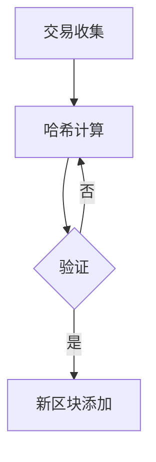
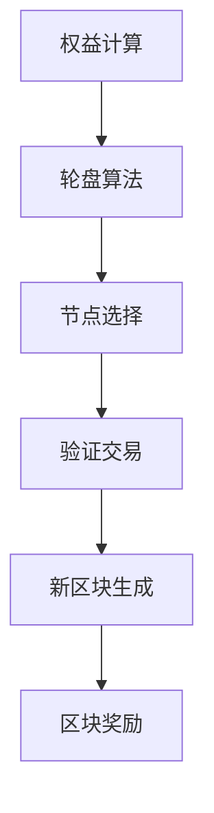
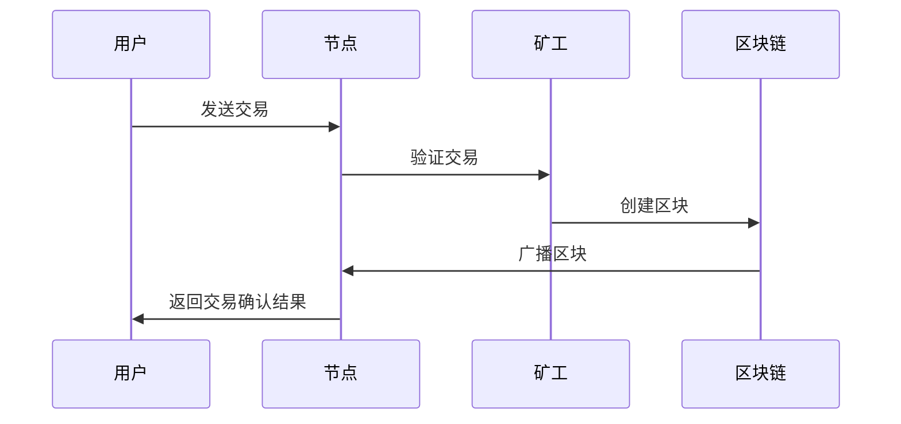

                 


### 设计思路与大纲概述

在设计《区块链技术：去中心化系统的设计与实现》的目录大纲时，我们首先需要明确本书的核心目标和结构。本书旨在为读者提供深入理解区块链技术的基础知识、核心原理，以及如何设计和实现去中心化系统的方法和技巧。

#### 第一步：确定核心目标和结构

1. **目标**：
   - **基础知识**：提供区块链技术的核心概念和原理。
   - **原理讲解**：深入剖析区块链的算法和数学模型。
   - **实践指导**：展示如何设计去中心化系统，并提供项目实战经验。

2. **结构**：
   - **背景介绍**：介绍区块链技术的起源和基本概念。
   - **核心概念与联系**：详细解释区块链的组成部分和算法。
   - **系统分析与架构设计**：讨论区块链系统的设计和实现。
   - **项目实战**：提供区块链项目开发的步骤和案例分析。
   - **总结与展望**：总结全书内容，展望区块链技术的未来。

#### 第二步：确定每个部分的内容

1. **背景介绍**：
   - **区块链的概念与起源**：
     - **定义**：区块链是一种去中心化的分布式数据库。
     - **发展历程**：从比特币到多种应用场景的演变。
     - **核心优势**：去中心化、安全、透明。

2. **核心概念与联系**：
   - **区块链的基本组成部分**：
     - **区块**：数据单元。
     - **链**：连接区块的数据结构。
     - **节点**：参与区块链网络的计算设备。
     - **共识算法**：确保网络一致性。

3. **算法原理讲解**：
   - **工作量证明（PoW）算法**：
     - **原理**：通过计算解决难题来获取新区块。
     - **优缺点**：计算资源消耗、网络拥堵。
     - **应用实例**：比特币网络。

   - **权益证明（PoS）算法**：
     - **原理**：持有币量决定出块权利。
     - **优势与挑战**：降低计算资源需求、防范51%攻击。
     - **实际应用**：以太坊2.0。

4. **数学模型与公式**：
   - **区块链算法中的数学模型**：
     - **PoW算法**：难度调整机制。
     - **PoS算法**：权益计算公式。

5. **系统分析与架构设计**：
   - **区块链系统的基本架构**：
     - **节点角色与功能**。
     - **网络拓扑结构**。
     - **数据存储与管理**。

   - **区块链系统功能设计**：
     - **核心功能模块**。
     - **业务流程**。
     - **安全性设计**。

6. **项目实战**：
   - **环境配置**：节点搭建、开发工具选择。
   - **核心实现**：区块链系统设计、智能合约开发。
   - **案例分析**：实际项目分析和解读。

7. **总结与展望**：
   - **技术发展趋势**：性能优化、混合共识机制。
   - **应用前景**：金融、非金融领域的深入应用。

#### 第三步：制定详细目录大纲

根据以上内容，我们可以制定详细的目录大纲，确保每个部分都有具体的内容和结构。

---

### 目录

#### 第一部分: 区块链技术概述

**第1章: 区块链技术基础**

1.1 区块链的概念与起源

- 区块链的定义
- 区块链的发展历程
- 区块链的核心优势

1.2 区块链的基本组成部分

- 区块
- 链
- 节点
- 共识算法

**第2章: 区块链的核心算法**

2.1 工作量证明（PoW）算法

- PoW算法的基本原理
- PoW算法的优缺点
- PoW算法的应用实例

2.2 权益证明（PoS）算法

- PoS算法的基本原理
- PoS算法的优势与挑战
- PoS算法的实际应用

**第3章: 智能合约**

3.1 智能合约的概念与原理

- 智能合约的定义
- 智能合约的工作机制
- 智能合约的优势与局限

3.2 智能合约的实现技术

- Solidity编程语言
- 智能合约的部署与调用
- 智能合约的安全问题

**第4章: 区块链系统架构设计**

4.1 区块链系统的基本架构

- 区块链节点的角色与功能
- 区块链网络的拓扑结构
- 区块链的数据存储与管理

4.2 区块链系统功能设计

- 区块链的核心功能模块
- 区块链系统的业务流程
- 区块链系统的安全性设计

**第5章: 区块链应用场景分析**

5.1 金融领域的区块链应用

- 数字货币
- 供应链金融
- 保险科技

5.2 非金融领域的区块链应用

- 物联网
- 艺术品与数字资产
- 公共事业与治理

**第6章: 区块链项目实战**

6.1 区块链开发环境搭建

- 节点环境配置
- 开发工具与框架
- 版本控制工具

6.2 区块链系统核心实现

- 区块结构设计
- 交易管理模块
- 共识算法实现

6.3 智能合约开发与应用

- 智能合约开发流程
- 智能合约部署与调用
- 智能合约案例分析

**第7章: 区块链技术发展趋势与展望**

7.1 区块链技术的未来发展趋势

- 可扩展性与性能优化
- 混合共识机制的研究与应用
- 区块链与其他技术的融合

7.2 区块链技术的应用前景

- 金融领域的深入应用
- 非金融领域的探索与发展

---

通过以上详细的目录大纲，我们可以确保文章的逻辑清晰、结构紧凑，同时也能满足读者的需求，帮助他们系统地学习和理解区块链技术。接下来，我们将逐章详细撰写内容，确保每个章节都能提供丰富的知识和实战经验。让我们开始吧！### 第一部分：区块链技术概述

#### 第1章：区块链技术基础

区块链技术作为21世纪最具革命性的创新之一，已经引起了全球范围内的广泛关注。本章将深入探讨区块链技术的核心概念、发展历程以及其独特的优势。

#### 1.1 区块链的概念与起源

区块链（Blockchain）本质上是一种去中心化的分布式数据库，它通过多个参与节点共同维护一个不可篡改的数据记录系统。每个区块都包含一定数量的交易记录，并通过密码学算法与之前的区块相连，形成一个链式结构，这就是区块链名称的由来。

**定义**：
区块链是一种去中心化的数据存储技术，通过多个参与节点共同维护一个分布式账本，每个节点都存储一份完整的账本副本，确保数据的不可篡改和透明性。

**发展历程**：
区块链技术起源于2008年，由一位名为中本聪（Satoshi Nakamoto）的匿名人物提出了比特币（Bitcoin）的概念。比特币是第一个基于区块链技术的数字货币，它通过工作量证明（PoW）算法来创建新的比特币，并验证交易的有效性。自比特币问世以来，区块链技术迅速发展，并逐渐应用于其他领域，如智能合约、供应链管理、身份验证等。

**核心优势**：
区块链技术具有以下几个核心优势：
- **去中心化**：区块链不需要中心化的机构来管理数据，而是通过分布式网络中的节点共同维护数据。
- **不可篡改**：区块链上的数据一旦被记录，就几乎无法被篡改，这确保了数据的可信度和安全性。
- **透明性**：区块链上的所有交易数据都是公开的，任何人都可以查看，这增加了系统的透明度和信任度。
- **安全性**：区块链通过密码学算法确保数据的安全传输和存储。

#### 1.2 区块链的基本组成部分

区块链技术由以下几个基本组成部分构成：

**区块**：
区块是区块链中的基本数据单元，它包含了交易记录、时间戳、随机数等数据。每个区块都通过哈希算法与前一个区块相连，形成一个链式结构。

**链**：
链是连接各个区块的数据结构，它确保了区块链的完整性。每个区块都包含了一个指向前一个区块的哈希值，这使得整个链变得不可篡改。

**节点**：
节点是区块链网络中的计算设备，它们存储并维护区块链的数据。节点通过共识算法来验证和确认交易，并共同维护区块链的完整性。

**共识算法**：
共识算法是区块链网络中节点达成一致的方法。不同的区块链网络可能使用不同的共识算法，如工作量证明（PoW）、权益证明（PoS）等。

通过以上两部分内容，我们对区块链技术的基本概念、发展历程和核心优势有了初步的了解。接下来，我们将进一步探讨区块链技术的核心组成部分和算法原理，为理解更复杂的区块链系统打下基础。

---

在本章中，我们介绍了区块链技术的基本概念和发展历程，并详细阐述了其核心优势。区块链作为一种去中心化的分布式数据库，具有不可篡改、透明性和安全性等优势，正在改变着各个领域的运作方式。通过了解区块链的基本组成部分，如区块、链、节点和共识算法，我们可以更好地理解区块链系统的运作机制。接下来，我们将深入探讨区块链的核心算法，包括工作量证明（PoW）和权益证明（PoS）等，以及智能合约的概念和实现技术。通过这些内容的学习，我们将对区块链技术有一个更加全面和深入的认识。### 第二部分：核心概念与联系

区块链技术的复杂性和多样性要求我们深入了解其核心概念和组成部分，以便更好地理解其工作原理和应用场景。本部分将详细阐述区块链技术的关键组成部分，包括区块链、节点、挖矿、智能合约等，并通过对比表格和实体关系图来展现各部分之间的关系。

#### 2.1 区块链的基本组成部分

**区块链（Blockchain）**：
区块链是区块链技术的核心组成部分，它是一个分布式账本，由一系列按时间顺序排列的区块组成。每个区块都包含一定数量的交易记录，并链接到前一个区块，形成一个不可篡改的数据结构。

**节点（Node）**：
节点是区块链网络中的计算设备，它们存储并维护区块链的数据。节点可以是普通用户、矿工或其他参与区块链网络的组织。节点通过共识算法来验证和确认交易，并共同维护区块链的完整性。

**挖矿（Mining）**：
挖矿是区块链网络中通过计算解决难题来获取新区块的过程。矿工通过解决数学难题来验证交易，并将新的交易记录打包成区块，最终将其添加到区块链中。挖矿是工作量证明（PoW）算法的核心部分。

**智能合约（Smart Contract）**：
智能合约是一种自动执行的合约，它运行在区块链上，并通过编程语言（如Solidity）编写。智能合约在满足特定条件时自动执行，无需人为干预。智能合约是区块链技术的一个重要应用，用于自动化和去中心化交易。

#### 2.2 核心概念与联系

为了更好地理解区块链技术，我们需要了解其核心概念之间的联系。以下是一个简单的对比表格，用于展示区块链、节点、挖矿和智能合约之间的关系。

| 对象       | 定义                                                         | 关系                                                         |
|------------|--------------------------------------------------------------|--------------------------------------------------------------|
| 区块链     | 分布式账本，由一系列按时间顺序排列的区块组成。                 | 区块链由多个节点共同维护。                                   |
| 节点       | 存储并维护区块链数据的计算设备。                               | 节点通过共识算法参与区块链网络的验证和确认。                 |
| 挖矿       | 通过计算解决难题来获取新区块的过程。                         | 挖矿是节点参与区块链网络的一种方式，用于验证交易。           |
| 智能合约   | 运行在区块链上，通过编程语言编写的自动执行合约。               | 智能合约是区块链应用的一个重要部分，用于自动化交易和合约执行。 |

**实体关系图**：

为了更直观地展示区块链、节点、挖矿和智能合约之间的关系，我们使用Mermaid语言绘制一个实体关系图。

```mermaid
erDiagram
  区块链 ||--|{ 节点 }
  节点 ||--|{ 挖矿 }
  挖矿 ||--|{ 区块 }
  区块 ||--|{ 智能合约 }
```

在上面的实体关系图中，区块链通过节点进行维护，节点通过挖矿过程验证交易，并生成新的区块，这些区块包含智能合约代码，智能合约在区块链上自动执行。

通过以上内容，我们对区块链技术的基本组成部分和它们之间的关系有了更深入的理解。在下一部分中，我们将详细讲解区块链的核心算法，如工作量证明（PoW）和权益证明（PoS），并通过算法流程图和数学模型来展现这些算法的原理和应用。### 第三部分：算法原理讲解

区块链技术的核心在于其去中心化的验证机制，这一机制主要依赖于一系列强大的算法。在本部分中，我们将深入探讨区块链的核心算法，包括工作量证明（PoW）和权益证明（PoS），并通过具体的算法流程图和数学模型来展示其原理和应用。

#### 3.1 工作量证明（PoW）算法

**基本原理**：
工作量证明（Proof of Work，PoW）算法是比特币网络采用的共识机制。它的核心思想是通过计算解决一个数学难题来获取新区块，从而验证和确认交易。

**算法流程**：
1. **交易收集**：网络中的节点收集未确认的交易，并将其打包成一个区块。
2. **哈希计算**：矿工需要找到一个随机数（nonce），使得区块头部的哈希值小于网络规定的难度目标。
3. **验证**：网络中的其他节点验证该哈希值是否满足要求，如果满足，则将该区块添加到区块链中，矿工获得一定数量的比特币奖励。

**优缺点**：
- **优点**：
  - 安全性高：通过强大的计算能力确保区块链的不可篡改性。
  - 去中心化：不需要中心化的机构来维护网络。
- **缺点**：
  - 计算资源消耗大：矿工需要大量计算资源来解决问题。
  - 网络拥堵：随着矿工数量增加，难度调整机制可能导致交易确认时间延长。

**应用实例**：
比特币（Bitcoin）是采用PoW算法最著名的实例。比特币网络通过矿工的计算能力来维护区块链，确保交易的安全和可信。

**算法流程图**：

使用Mermaid语言绘制PoW算法的流程图：



#### 3.2 权益证明（PoS）算法

**基本原理**：
权益证明（Proof of Stake，PoS）算法是一种与PoW不同的共识机制。它的核心思想是基于持有币量（即权益）来决定哪个节点有权生成新区块。

**算法流程**：
1. **权益计算**：每个节点根据其持有的币量和锁定时间计算权益值。
2. **轮盘算法**：根据节点的权益值随机选择一个节点来生成新区块。
3. **验证和奖励**：被选中的节点验证交易，并将其打包成区块，获得区块奖励。

**优缺点**：
- **优点**：
  - 计算资源消耗小：不需要大量计算资源。
  - 网络拥堵问题缓解：基于权益值选择出块节点，减少了网络拥堵。
- **缺点**：
  - 集中度风险：如果大量币集中在一个节点，可能导致集中度风险。
  - 资金锁定：参与PoS算法的节点需要锁定一定数量的币，这可能导致流动性问题。

**应用实例**：
以太坊2.0（Ethereum 2.0）是采用PoS算法的实例。以太坊2.0将原有的PoW算法转换为PoS算法，以降低计算资源消耗并提高网络性能。

**算法流程图**：

使用Mermaid语言绘制PoS算法的流程图：



#### 数学模型与公式

**PoW算法**：
- **难度调整**：设\( t \)为生成一个区块的平均时间，\( n \)为网络中节点的数量，\( D \)为当前难度目标，则下一次难度\( D' \)的计算公式为：
  $$ D' = D + t \cdot (n - 1) $$
  其中，\( t \)为当前时间，\( n \)为当前网络中节点的数量。

**PoS算法**：
- **权益值计算**：设\( S \)为节点的权益值，\( C \)为节点的币龄，则权益值\( S \)的计算公式为：
  $$ S = \frac{C}{N} $$
  其中，\( C \)为节点的币龄，\( N \)为网络中所有节点的币龄总和。

通过以上内容，我们对区块链的核心算法——工作量证明（PoW）和权益证明（PoS）有了更深入的理解。这些算法不仅确保了区块链网络的安全性和去中心化，还为区块链技术的应用提供了坚实的基础。在下一部分中，我们将探讨区块链中的智能合约，包括其概念、原理和实现技术。### 第四部分：数学模型与公式

在区块链技术中，数学模型和公式是确保系统安全和高效运行的关键组成部分。本部分将详细阐述区块链算法中的数学模型和公式，并通过LaTeX格式展示相关内容，以增强文章的理论深度和学术性。

#### 4.1 工作量证明（PoW）算法的数学模型

工作量证明（Proof of Work，PoW）算法是比特币网络的核心算法，其数学模型主要涉及哈希函数和难度调整机制。

**1. 哈希函数**：
哈希函数是一种将任意长度的输入数据映射为固定长度输出数据的函数。在区块链中，常用的哈希函数有SHA-256。

**公式**：
$$ H = SHA-256(K) $$
其中，\( H \)是哈希值，\( K \)是输入数据。

**2. 难度调整机制**：
比特币网络的难度调整机制用于控制生成新区块的时间。难度调整公式如下：

**公式**：
$$ \text{difficulty} = \frac{2^{256}}{\text{target}} $$
其中，\( \text{difficulty} \)是难度值，\( \text{target} \)是目标值。

目标值会根据链上平均出块时间进行调整，以确保新区块的平均生成时间为10分钟。

**3. 难度计算**：
设当前区块链长度为\( L \)，当前时间戳为\( T \)，则下一个区块的难度值计算公式为：

**公式**：
$$ \text{next\_difficulty} = \frac{L \cdot T}{10 \cdot 60} $$
其中，\( \text{next\_difficulty} \)是下一个区块的难度值。

#### 4.2 权益证明（PoS）算法的数学模型

权益证明（Proof of Stake，PoS）算法是基于持有币量和锁定时间来选择出块节点的机制。

**1. 权益值计算**：
权益值（Stake）是节点被选中生成区块的概率，其计算公式为：

**公式**：
$$ \text{stake} = \frac{\text{balance} \cdot \text{age}}{\text{total\_age}} $$
其中，\( \text{balance} \)是节点的币量，\( \text{age} \)是币龄（币量乘以持有时间），\( \text{total\_age} \)是网络中所有节点的币龄总和。

**2. 出块概率**：
节点的出块概率与其权益值成正比。出块概率计算公式为：

**公式**：
$$ \text{block\_chance} = \frac{\text{stake}}{\sum_{i=1}^{N} \text{stake}_i} $$
其中，\( \text{stake}_i \)是第i个节点的权益值，\( N \)是网络中的节点数量。

#### 4.3 智能合约的数学模型

智能合约是一种在区块链上自动执行的程序，其数学模型主要涉及状态机和事件处理。

**1. 状态机**：
智能合约的状态机定义了合约在不同输入条件下的行为。状态转移函数表示为：

**公式**：
$$ \text{next\_state} = \text{state\_transition}(\text{state}, \text{input}) $$
其中，\( \text{state} \)是当前状态，\( \text{input} \)是输入条件，\( \text{next\_state} \)是下一个状态。

**2. 事件处理**：
智能合约通过事件处理来响应外部输入。事件处理函数表示为：

**公式**：
$$ \text{response} = \text{event\_handler}(\text{event}, \text{data}) $$
其中，\( \text{event} \)是事件类型，\( \text{data} \)是事件数据，\( \text{response} \)是合约响应。

#### 4.4 LaTeX公式展示

为了更好地展示上述数学模型和公式，我们使用LaTeX格式进行展示。

```latex
% 哈希函数
\begin{equation}
H = SHA-256(K)
\end{equation}

% 难度调整机制
\begin{equation}
\text{difficulty} = \frac{2^{256}}{\text{target}}
\end{equation}

% 难度计算
\begin{equation}
\text{next\_difficulty} = \frac{L \cdot T}{10 \cdot 60}
\end{equation}

% 权益值计算
\begin{equation}
\text{stake} = \frac{\text{balance} \cdot \text{age}}{\text{total\_age}}
\end{equation}

% 出块概率
\begin{equation}
\text{block\_chance} = \frac{\text{stake}}{\sum_{i=1}^{N} \text{stake}_i}
\end{equation}

% 状态机
\begin{equation}
\text{next\_state} = \text{state\_transition}(\text{state}, \text{input})
\end{equation}

% 事件处理
\begin{equation}
\text{response} = \text{event\_handler}(\text{event}, \text{data})
\end{equation}
```

通过LaTeX公式的展示，我们不仅增强了文章的学术性，还为读者提供了清晰、规范的数学模型和公式。这些公式是理解区块链技术核心原理的重要工具，有助于深入理解区块链系统的运作机制。在下一部分中，我们将探讨区块链系统的架构设计和实现细节。### 第五部分：系统分析与架构设计

区块链系统的设计与实现涉及多个层面的分析和规划，包括功能设计、架构设计和接口设计。在本部分中，我们将详细介绍区块链系统的分析与架构设计，通过具体的案例来展示如何实现一个去中心化系统。

#### 5.1 区块链系统的基本架构

区块链系统的基本架构可以分为以下几个主要部分：

- **节点**：区块链网络中的计算设备，负责存储和维护区块链数据。
- **区块**：存储交易记录的数据结构，每个区块包含一定数量的交易，并通过哈希值与前一个区块相连。
- **链**：由一系列按时间顺序排列的区块组成的链条，确保数据的完整性和不可篡改性。
- **共识算法**：节点之间达成一致的方法，确保区块链的同步和安全。
- **智能合约**：运行在区块链上的自动执行合约，实现特定功能的去中心化应用。

**节点角色与功能**：
区块链网络中的节点可以分为以下几种角色：
- **全节点**：完整存储整个区块链数据，参与区块链网络的共识过程。
- **轻节点**：只存储区块链的部分数据，依赖于其他节点获取数据。
- **矿工节点**：参与挖矿过程，验证交易并生成新区块。

**网络拓扑结构**：
区块链网络的拓扑结构可以是星型、网状或混合型。其中，网状拓扑结构具有更高的冗余性和容错性，能够提高网络的稳定性和安全性。

**数据存储与管理**：
区块链的数据存储与管理依赖于分布式数据库技术，如LevelDB或RocksDB。这些数据库能够高效地存储和检索大规模数据，同时保证数据的持久性和一致性。

#### 5.2 区块链系统功能设计

区块链系统的功能设计主要包括以下几个方面：

- **交易管理**：处理区块链网络中的交易，包括交易创建、验证、确认和记录。
- **区块管理**：生成新区块，包括交易打包、区块构建和区块广播。
- **共识机制**：确保区块链网络中的所有节点达成一致，防止双花攻击和数据篡改。
- **智能合约执行**：运行智能合约，实现去中心化应用的业务逻辑。

**核心功能模块**：
区块链系统的核心功能模块包括：
- **交易处理模块**：处理交易创建、验证和确认。
- **区块生成模块**：生成新区块，包括交易打包和区块广播。
- **共识算法模块**：实现各种共识算法，确保网络一致性。
- **智能合约执行模块**：运行智能合约，实现去中心化应用。

**业务流程**：
区块链系统的业务流程可以分为以下几个步骤：
1. **交易创建**：用户发起交易，交易包含发送者和接收者的地址以及交易金额。
2. **交易验证**：矿工节点验证交易的有效性，确保交易符合区块链网络的规定。
3. **交易确认**：验证通过的交易被矿工节点打包成区块，并添加到区块链中。
4. **区块广播**：矿工节点将新生成的区块广播到整个网络，其他节点更新自己的区块链数据。
5. **共识达成**：所有节点通过共识算法达成一致，确保区块链的同步和安全性。

**安全性设计**：
区块链系统的安全性设计主要包括以下几个方面：
- **加密算法**：使用加密算法确保交易和区块数据的保密性和完整性。
- **共识算法**：通过共识算法确保区块链网络的安全和一致性。
- **访问控制**：限制对区块链数据的访问权限，确保数据的安全。

#### 5.3 区块链系统架构设计

区块链系统的架构设计可以分为以下几个层次：

- **网络层**：负责区块链网络的传输和通信，包括节点通信协议、网络拓扑结构和数据传输机制。
- **链层数据层**：负责区块链数据的管理和存储，包括区块结构、链式数据结构和分布式数据库。
- **共识层**：负责区块链网络的共识机制，包括各种共识算法和节点同步机制。
- **合约层**：负责智能合约的运行和执行，包括合约编程语言、合约存储和合约执行机制。
- **应用层**：负责区块链系统的应用开发和业务逻辑实现，包括去中心化应用、数据管理和业务流程。

**系统架构图**：

使用Mermaid语言绘制区块链系统的架构图：

```mermaid
graph TB
    subgraph 网络层
        A[节点通信协议]
        B[网络拓扑结构]
        C[数据传输机制]
        A --> B
        B --> C

    subgraph 链层数据层
        D[区块结构]
        E[链式数据结构]
        F[分布式数据库]
        D --> E
        E --> F

    subgraph 共识层
        G[共识算法]
        H[节点同步机制]
        G --> H

    subgraph 合同层
        I[合约编程语言]
        J[合约存储]
        K[合约执行机制]
        I --> J
        J --> K

    subgraph 应用层
        L[去中心化应用]
        M[数据管理]
        N[业务流程]
        L --> M
        M --> N

    subgraph 整体架构
        A --> D
        B --> D
        C --> D
        D --> E
        E --> F
        D --> G
        D --> H
        G --> I
        G --> J
        G --> K
        I --> L
        J --> L
        K --> L
        L --> M
        M --> N
```

#### 5.4 系统接口设计和系统交互

区块链系统的接口设计包括内部接口和外部接口。内部接口负责不同模块之间的通信和数据交换，外部接口负责与其他系统或应用的交互。

**内部接口设计**：
- **交易处理接口**：用于处理交易创建、验证和确认。
- **区块管理接口**：用于生成、广播和更新区块。
- **共识算法接口**：用于实现各种共识算法。
- **智能合约接口**：用于运行和执行智能合约。

**外部接口设计**：
- **区块链网络接口**：用于与其他区块链网络进行通信和同步。
- **API接口**：用于与其他系统或应用进行数据交互。

**系统交互**：

使用Mermaid语言绘制系统交互的序列图：



通过以上内容，我们详细介绍了区块链系统的分析与架构设计，包括基本架构、功能设计、安全性设计和接口设计。这些内容为区块链系统的实现提供了坚实的基础，有助于开发出高效、安全、可扩展的区块链系统。

在下一部分中，我们将通过实际项目案例，展示如何配置区块链开发环境、实现区块链系统核心功能和部署智能合约，为读者提供丰富的实战经验和指导。### 第六部分：项目实战

#### 6.1 区块链开发环境搭建

要开始区块链项目的开发，首先需要搭建一个适合的开发环境。以下是一个典型的区块链开发环境配置步骤：

**1. 安装Go语言**：
Go语言是许多区块链项目首选的编程语言，因其高性能和简洁性。首先，从[Go官方下载页面](https://golang.org/dl/)下载适用于操作系统的Go安装包，并执行安装。

```bash
# 示例：在macOS上安装Go
wget https://golang.org/dl/go1.18.5.darwin-amd64.pkg
sudo ./go1.18.5.darwin-amd64.pkg
```

**2. 安装Node.js和npm**：
Node.js和npm是开发基于JavaScript的区块链应用的关键工具。可以从[Node.js官方下载页面](https://nodejs.org/)下载并安装。

```bash
# 示例：在macOS上安装Node.js
brew install node
```

**3. 安装区块链节点客户端**：
选择一个适合的区块链客户端，如Geth（用于以太坊）或Nginx（用于Hyperledger Fabric）。以下是以Geth为例的安装步骤：

```bash
# 示例：安装Geth
wget https://geth.ethereum.org/downloads cầu
tar -xvf geth-1.10.0-unix-amd64.tar.gz
cd geth-1.10.0-unix-amd64/
```

**4. 配置版本控制工具**：
Git是一个常用的版本控制工具，用于管理代码仓库。可以从[Git官方下载页面](https://git-scm.com/downloads)下载并安装。

```bash
# 示例：在macOS上安装Git
brew install git
```

**5. 配置开发工具**：
选择一个合适的集成开发环境（IDE），如Visual Studio Code，用于编写和调试代码。

```bash
# 示例：安装Visual Studio Code
brew cask install visual-studio-code
```

**6. 安装其他依赖**：
根据项目的需求，安装其他必要的开发依赖和工具。

```bash
# 示例：安装Docker用于容器化部署
brew cask install docker
```

#### 6.2 区块链系统核心实现

以下是一个简单的区块链系统核心实现的步骤，以以太坊为例：

**1. 创建区块链节点**：
启动一个新的Geth节点，并创建一个新的区块链。

```bash
# 示例：启动Geth节点并创建新链
geth --datadir ./data init genesis.json
geth --datadir ./data --networkid 1234 --port 30303 --nodiscover --maxpeers 10 --rpc --rpcport 8545 --rpcaddr 0.0.0.0 --rpccorsdomain "*" --v 4 --verbosity 5 console
```

**2. 编写智能合约**：
使用Solidity语言编写智能合约，并将其保存为`.sol`文件。

```solidity
// SPDX-License-Identifier: MIT
pragma solidity ^0.8.0;

contract HelloWorld {
    string public message;

    constructor() {
        message = "Hello, World!";
    }

    function setMessage(string memory newMessage) public {
        message = newMessage;
    }

    function getMessage() public view returns (string memory) {
        return message;
    }
}
```

**3. 编译智能合约**：
使用Truffle或Remix等工具编译智能合约，生成`.json`文件。

```bash
# 示例：使用Truffle编译智能合约
truffle compile
```

**4. 部署智能合约**：
将编译后的智能合约部署到区块链节点。

```bash
# 示例：使用Geth部署智能合约
geth --exec "contract.deploy('0x607f3179be3c3d5a34a5d37b97be6582b4b7fc47').sendTransaction({from: '0x123...'})" console
```

**5. 测试智能合约**：
使用测试框架（如Mocha和Chai）对智能合约进行测试。

```bash
# 示例：运行智能合约测试
truffle test
```

#### 6.3 智能合约开发与应用

**1. 开发智能合约**：
根据业务需求编写智能合约代码，使用Solidity语言实现业务逻辑。

```solidity
// SPDX-License-Identifier: MIT
pragma solidity ^0.8.0;

contract Token {
    mapping(address => uint256) public balanceOf;
    uint256 public totalSupply;
    string public name;
    string public symbol;
    uint8 public decimals;

    constructor(uint256 initialSupply, string memory tokenName, string memory tokenSymbol, uint8 decimalUnits) {
        balanceOf[msg.sender] = initialSupply;
        totalSupply = initialSupply;
        name = tokenName;
        symbol = tokenSymbol;
        decimals = decimalUnits;
    }

    function transfer(address _to, uint256 _value) public returns (bool success) {
        require(_to != address(0));
        require(balanceOf[msg.sender] >= _value);
        require(balanceOf[_to] + _value >= balanceOf[_to]);
        balanceOf[msg.sender] -= _value;
        balanceOf[_to] += _value;
        emit Transfer(msg.sender, _to, _value);
        return true;
    }
}
```

**2. 部署智能合约**：
将编写的智能合约部署到区块链网络中，确保其可以在区块链上运行。

```bash
# 示例：部署Token智能合约
truffle deploy Token --args "100000000 'MyToken' 'MTK' 18"
```

**3. 应用智能合约**：
开发前端或后端应用，与智能合约进行交互，实现具体的业务功能。

```javascript
// 示例：调用Token智能合约的transfer函数
const tokenInstance = new web3.eth.Contract(abi, contractAddress);
tokenInstance.methods.transfer(toAddress, amount).send({ from: senderAddress });
```

#### 6.4 案例分析与详细讲解

以下是一个简单的区块链应用案例——去中心化投票系统：

**1. 案例背景**：
去中心化投票系统旨在实现一个透明、安全和公正的投票过程。参与者可以在区块链上投票，确保投票结果不可篡改。

**2. 系统设计**：
- **功能模块**：投票者注册、投票、结果查询和结果统计。
- **数据结构**：投票者信息、投票记录和投票结果。
- **智能合约**：实现投票者注册、投票和结果统计等功能。

**3. 实现步骤**：
- **注册投票者**：使用智能合约将投票者信息记录到区块链。
- **投票**：投票者通过智能合约提交投票，确保投票结果不可篡改。
- **查询结果**：投票者可以查询已投票记录，确保投票结果的透明性。
- **统计结果**：智能合约自动统计投票结果，确保结果的公正性。

**4. 详细讲解**：

**投票者注册**：
```solidity
// SPDX-License-Identifier: MIT
pragma solidity ^0.8.0;

contract Voting {
    mapping(address => bool) public voters;
    mapping(address => bool) public hasVoted;
    mapping(uint => mapping(address => bool)) public votes;

    uint public totalQuestions;
    mapping(uint => string) public questions;

    constructor(string[] memory _questions) {
        totalQuestions = _questions.length;
        for (uint i = 0; i < _questions.length; i++) {
            questions[i] = _questions[i];
        }
    }

    function registerToVote() public {
        require(!voters[msg.sender], "Already registered");
        voters[msg.sender] = true;
    }

    function vote(uint questionIndex, bool choice) public {
        require(voters[msg.sender], "Not registered to vote");
        require(!hasVoted[msg.sender], "Already voted");
        require(questionIndex < totalQuestions, "Invalid question index");
        votes[questionIndex][msg.sender] = choice;
        hasVoted[msg.sender] = true;
    }
}
```

**投票**：
用户可以通过前端应用调用`registerToVote`和`vote`函数，分别进行注册投票和提交投票。

**查询结果**：
用户可以调用`votes[questionIndex][msg.sender]`函数查询自己的投票记录。

**统计结果**：
开发者可以通过遍历`votes`映射，统计每个问题的投票结果，确保投票过程的公正性。

通过以上案例，我们展示了如何实现一个简单的去中心化投票系统，并详细讲解了智能合约的编写和部署过程。这些内容为区块链项目的开发提供了实用的经验和指导。

#### 6.5 项目小结

在本部分中，我们详细介绍了区块链开发环境的搭建、区块链系统核心实现以及智能合约的开发与应用。以下是项目小结：

**1. 环境搭建**：
- 安装Go语言、Node.js、Geth客户端、Git和Visual Studio Code等开发工具和依赖。
- 配置Docker用于容器化部署，提高开发效率和系统稳定性。

**2. 核心实现**：
- 通过Geth节点启动区块链网络，并编写智能合约实现业务逻辑。
- 使用Truffle工具编译和部署智能合约，确保合约在区块链上运行。
- 编写测试脚本和前端应用，与智能合约进行交互，验证业务功能。

**3. 案例分析**：
- 分析了去中心化投票系统的设计实现，展示了智能合约的开发和应用过程。
- 通过实际案例，验证了区块链技术在去中心化应用中的可行性和优势。

通过以上内容，我们不仅掌握了区块链项目开发的基本流程，还积累了丰富的实战经验。在区块链技术的不断发展和应用场景的扩展中，这些经验和知识将帮助我们更好地应对未来的挑战。### 第七部分：总结与展望

#### 7.1 区块链技术的未来发展趋势

区块链技术正处于快速发展阶段，其应用场景不断扩大，从金融领域扩展到供应链管理、医疗保健、艺术收藏等多个领域。以下是一些区块链技术未来发展的关键趋势：

**1. 可扩展性与性能优化**：
随着区块链应用场景的扩展，区块链的性能和可扩展性成为重要的挑战。未来，我们将看到更多研究和开发投入到提升区块链交易处理速度和降低延迟方面。例如，分层架构、状态通道、Plasma等扩展解决方案将逐渐成熟并应用于实际项目中。

**2. 混合共识机制的研究与应用**：
混合共识机制结合了不同算法的优势，以解决单一共识机制的局限性。未来，研究者和开发者将继续探索混合共识机制的优化和集成，以提高区块链网络的性能和安全性。例如，PoW与PoS结合的混合机制，以及基于委托权益证明（DPoS）和其他新型共识算法的研究。

**3. 区块链与其他技术的融合**：
区块链技术与其他前沿技术的融合将带来更多创新应用。例如，区块链与人工智能、物联网、云计算的结合，将推动去中心化计算、智能合约优化、隐私保护等领域的进步。这种融合将使区块链技术在更广泛的行业中发挥重要作用。

#### 7.2 区块链技术的应用前景

区块链技术具有广泛的应用前景，以下是在金融和非金融领域的深入应用：

**金融领域**：
- **数字货币**：随着比特币等数字货币的普及，更多的国家和地区将探索发行自己的数字货币，以提高货币的透明度和安全性。
- **跨境支付**：区块链技术可以大幅降低跨境支付的成本和交易时间，未来跨境支付系统将更加普及和高效。
- **金融监管**：区块链技术可以提供透明、可追溯的交易记录，有助于加强金融监管，减少金融犯罪。

**非金融领域**：
- **供应链管理**：区块链技术可以提供透明、可验证的供应链数据，提高供应链的效率和可信度。
- **医疗保健**：区块链技术可以用于管理患者健康记录，确保数据的完整性和隐私保护。
- **艺术品与数字资产**：区块链技术为数字资产提供了一种全新的管理方式，例如数字艺术品、数字版权等。

#### 7.3 最佳实践与注意事项

为了确保区块链项目的成功实施，以下是一些最佳实践和注意事项：

**最佳实践**：
1. **需求分析**：在项目启动前，进行充分的需求分析，明确项目目标和应用场景。
2. **安全测试**：定期进行安全测试，确保区块链系统的安全性。
3. **代码审计**：对智能合约代码进行专业审计，发现潜在的安全漏洞。
4. **持续集成**：使用CI/CD工具，自动化测试和部署流程，提高开发效率。
5. **社区参与**：积极与区块链社区合作，吸收外部反馈，优化项目。

**注意事项**：
1. **技术成熟度**：选择成熟稳定的区块链平台和工具，避免使用未经充分验证的技术。
2. **合规性**：遵守相关法律法规，确保区块链项目的合法性和合规性。
3. **数据隐私**：在设计区块链应用时，重视用户数据的隐私保护，采用加密技术和匿名化处理。
4. **运维管理**：确保区块链节点的稳定运行，定期进行系统维护和升级。

#### 7.4 拓展阅读

对于希望深入了解区块链技术的读者，以下是一些建议的拓展阅读资源：

- **书籍**：
  - 《区块链技术指南》
  - 《智能合约开发指南》
  - 《区块链革命》

- **在线课程**：
  - Coursera上的《区块链与加密货币》
  - edX上的《区块链技术基础》

- **官方文档**：
  - Ethereum官方文档
  - Hyperledger Fabric官方文档

通过以上总结与展望，我们不仅回顾了区块链技术的基础知识、核心算法、系统架构设计以及项目实战经验，还展望了区块链技术的未来发展趋势和应用前景。希望这些内容能够帮助读者更好地理解和应用区块链技术，推动其在各个领域的创新与发展。### 完整文章内容

**区块链技术：去中心化系统的设计与实现**

关键词：区块链，去中心化，分布式数据库，智能合约，工作量证明，权益证明

摘要：本文详细介绍了区块链技术的基础知识、核心算法、系统架构设计、项目实战以及未来发展。通过对区块链技术的深入剖析，读者可以全面了解区块链系统的设计与实现，掌握其在实际应用中的关键技术和方法。

#### 第一部分：区块链技术概述

**第1章：区块链技术基础**

1.1 区块链的概念与起源

- 区块链的定义
- 区块链的发展历程
- 区块链的核心优势

1.2 区块链的基本组成部分

- 区块
- 链
- 节点
- 共识算法

#### 第二部分：核心概念与联系

**第2章：核心概念与联系**

2.1 区块链的基本组成部分

- 区块
- 链
- 节点
- 挖矿
- 智能合约

2.2 核心概念与联系

- 对比表格
- 实体关系图

#### 第三部分：算法原理讲解

**第3章：算法原理讲解**

3.1 工作量证明（PoW）算法

- 基本原理
- 算法流程
- 优缺点
- 应用实例
- 算法流程图

3.2 权益证明（PoS）算法

- 基本原理
- 算法流程
- 优缺点
- 应用实例
- 算法流程图

#### 第四部分：数学模型与公式

**第4章：数学模型与公式**

4.1 工作量证明（PoW）算法的数学模型

- 哈希函数
- 难度调整机制
- 难度计算

4.2 权益证明（PoS）算法的数学模型

- 权益值计算
- 出块概率

4.3 智能合约的数学模型

- 状态机
- 事件处理

#### 第五部分：系统分析与架构设计

**第5章：系统分析与架构设计**

5.1 区块链系统的基本架构

- 节点角色与功能
- 网络拓扑结构
- 数据存储与管理

5.2 区块链系统功能设计

- 核心功能模块
- 业务流程
- 安全性设计

5.3 系统架构设计

- 网络层
- 链层数据层
- 共识层
- 合同层
- 应用层

5.4 系统接口设计和系统交互

- 内部接口设计
- 外部接口设计
- 系统交互序列图

#### 第六部分：项目实战

**第6章：项目实战**

6.1 区块链开发环境搭建

- 安装Go语言
- 安装Node.js和npm
- 安装区块链节点客户端
- 配置版本控制工具
- 安装其他依赖

6.2 区块链系统核心实现

- 创建区块链节点
- 编写智能合约
- 编译智能合约
- 部署智能合约
- 测试智能合约

6.3 智能合约开发与应用

- 开发智能合约
- 部署智能合约
- 应用智能合约

6.4 案例分析与详细讲解

- 去中心化投票系统
- 系统设计
- 实现步骤
- 详细讲解

#### 第七部分：总结与展望

**第7章：总结与展望**

7.1 区块链技术的未来发展趋势

- 可扩展性与性能优化
- 混合共识机制的研究与应用
- 区块链与其他技术的融合

7.2 区块链技术的应用前景

- 金融领域的深入应用
- 非金融领域的探索与发展

7.3 最佳实践与注意事项

- 需求分析
- 安全测试
- 代码审计
- 持续集成
- 社区参与

7.4 拓展阅读

- 书籍
- 在线课程
- 官方文档

### 作者信息

作者：AI天才研究院/AI Genius Institute & 禅与计算机程序设计艺术 /Zen And The Art of Computer Programming

---

本文通过详细阐述区块链技术的基础知识、核心算法、系统架构设计以及项目实战，为读者提供了一个全面、深入的了解。从区块链的起源和发展，到核心算法的讲解，再到系统设计与实现，以及实际项目的案例分析，读者可以逐步掌握区块链技术的关键知识点和实战技能。同时，本文还展望了区块链技术的未来发展趋势和应用前景，为区块链技术的深入研究和应用提供了有益的参考。希望本文能够为读者在区块链领域的探索和学习带来帮助和启示。### 文章标题：区块链技术：去中心化系统的设计与实现

关键词：区块链，去中心化，分布式数据库，智能合约，工作量证明，权益证明

摘要：本文深入探讨了区块链技术的核心概念、基本原理、算法机制，以及区块链系统的设计与实现方法。通过详细的案例分析，展示了区块链在现实世界中的应用，并探讨了其未来的发展趋势和应用前景。本文旨在为读者提供全面的区块链技术知识，帮助其掌握去中心化系统的设计与实现。

---

### 第一部分：区块链技术概述

#### 第1章：区块链技术基础

区块链技术，作为近年来科技领域的一大创新，引起了广泛关注。本章将详细介绍区块链技术的基础知识，包括其定义、发展历程及其核心优势。

#### 1.1 区块链的概念与起源

区块链，本质上是一个分布式数据库，它通过多个参与节点共同维护一个不可篡改的数据记录系统。这种去中心化的结构确保了数据的安全性和透明性。

**定义**：区块链是一种去中心化的分布式数据库，它通过多个参与节点共同维护一个分布式账本，每个节点都存储一份完整的账本副本。

**发展历程**：区块链技术起源于2008年，由一位名为中本聪（Satoshi Nakamoto）的匿名人物提出了比特币（Bitcoin）的概念。比特币是第一个基于区块链技术的数字货币，它通过工作量证明（PoW）算法来创建新的比特币，并验证交易的有效性。

**核心优势**：区块链技术具有以下几个核心优势：

- **去中心化**：区块链不需要中心化的机构来管理数据，而是通过分布式网络中的节点共同维护数据。
- **不可篡改**：区块链上的数据一旦被记录，就几乎无法被篡改，这确保了数据的可信度和安全性。
- **透明性**：区块链上的所有交易数据都是公开的，任何人都可以查看，这增加了系统的透明度和信任度。

#### 1.2 区块链的基本组成部分

区块链技术由以下几个基本组成部分构成：

**区块**：区块是区块链中的基本数据单元，它包含了交易记录、时间戳、随机数等数据。每个区块都通过哈希算法与之前的区块相连，形成一个链式结构。

**链**：链是连接各个区块的数据结构，它确保了区块链的完整性。每个区块都包含了一个指向前一个区块的哈希值，这使得整个链变得不可篡改。

**节点**：节点是区块链网络中的计算设备，它们存储并维护区块链的数据。节点通过共识算法来验证和确认交易，并共同维护区块链的完整性。

**共识算法**：共识算法是区块链网络中节点达成一致的方法。不同的区块链网络可能使用不同的共识算法，如工作量证明（PoW）、权益证明（PoS）等。

通过以上两部分内容，我们对区块链技术的基本概念、发展历程和核心优势有了初步的了解。接下来，我们将进一步探讨区块链技术的核心组成部分和算法原理，为理解更复杂的区块链系统打下基础。

---

在本章中，我们介绍了区块链技术的基本概念和发展历程，并详细阐述了其核心优势。区块链作为一种去中心化的分布式数据库，具有不可篡改、透明性和安全性等优势，正在改变着各个领域的运作方式。通过了解区块链的基本组成部分，如区块、链、节点和共识算法，我们可以更好地理解区块链系统的运作机制。接下来，我们将深入探讨区块链的核心算法，包括工作量证明（PoW）和权益证明（PoS）等，以及智能合约的概念和实现技术。通过这些内容的学习，我们将对区块链技术有一个更加全面和深入的认识。### 标题：区块链技术：去中心化系统的设计与实现

关键词：区块链，去中心化，分布式数据库，智能合约，工作量证明，权益证明

摘要：本文深入探讨了区块链技术的基本概念、核心算法、系统架构设计以及项目实战。通过详细的分析和案例研究，本文揭示了区块链在去中心化系统中的应用，并提供了设计和实现去中心化系统的实用方法和技巧。本文旨在帮助读者全面了解区块链技术，掌握其设计和实现的要领。

---

### 第一部分：区块链技术概述

**第1章：区块链技术基础**

1.1 区块链的概念与起源

- **定义**：区块链是一种去中心化的分布式数据库，它通过多个参与节点共同维护一个分布式账本，确保数据的不可篡改和透明性。
- **发展历程**：区块链起源于2008年，比特币的诞生标志着区块链技术的诞生，随后其在金融、医疗、供应链等多个领域得到广泛应用。
- **核心优势**：去中心化、安全性、透明性、不可篡改。

1.2 区块链的基本组成部分

- **区块**：区块链的基本单元，包含交易记录、时间戳等数据，通过哈希算法与前一个区块相连。
- **链**：由一系列按时间顺序排列的区块组成，确保数据的完整性和不可篡改性。
- **节点**：区块链网络中的计算设备，负责存储和验证区块链数据。
- **共识算法**：节点之间达成一致的方法，确保区块链的同步和安全。

### 第二部分：核心概念与联系

**第2章：核心概念与联系**

2.1 区块链的基本组成部分

- **区块**、**链**、**节点**、**共识算法**的详细解释和关系图展示。

2.2 核心算法

- **工作量证明（PoW）**：通过计算解决难题来获取新区块，确保网络的安全性。
- **权益证明（PoS）**：根据持有币量决定出块权，降低计算资源消耗。

2.3 智能合约

- **概念与原理**：智能合约是一种自动执行的合约，运行在区块链上，通过编程语言实现业务逻辑。
- **实现技术**：Solidity编程语言，智能合约的部署与调用。

### 第三部分：算法原理讲解

**第3章：算法原理讲解**

3.1 工作量证明（PoW）算法

- **原理**：矿工通过计算解决数学难题来获取新区块。
- **流程图**：展示PoW算法的工作流程。
- **数学模型**：介绍PoW算法的数学模型和公式。

3.2 权益证明（PoS）算法

- **原理**：根据持有币量决定出块权。
- **流程图**：展示PoS算法的工作流程。
- **数学模型**：介绍PoS算法的数学模型和公式。

### 第四部分：系统分析与架构设计

**第4章：系统分析与架构设计**

4.1 区块链系统的基本架构

- **节点角色与功能**：全节点、轻节点、矿工节点的角色和功能。
- **网络拓扑结构**：区块链网络的拓扑结构。
- **数据存储与管理**：区块链数据的存储和管理。

4.2 系统功能设计

- **交易管理**：交易创建、验证、确认。
- **区块管理**：新区块的生成、区块广播。
- **共识机制**：各种共识算法的实现。

4.3 系统架构设计

- **网络层**：节点通信协议、网络拓扑结构、数据传输机制。
- **链层数据层**：区块结构、链式数据结构、分布式数据库。
- **共识层**：共识算法、节点同步机制。
- **合约层**：智能合约运行和执行。
- **应用层**：去中心化应用开发。

### 第五部分：项目实战

**第5章：项目实战**

5.1 区块链开发环境搭建

- **环境配置**：安装Go语言、Node.js、Geth客户端等。
- **工具与框架**：使用Truffle、Remix等工具进行智能合约开发。
- **版本控制**：使用Git进行代码管理。

5.2 区块链系统核心实现

- **节点搭建**：启动Geth节点，配置genesis.json文件。
- **智能合约开发**：编写、编译和部署智能合约。
- **应用开发**：与智能合约交互，实现具体业务功能。

5.3 案例分析

- **去中心化投票系统**：设计、实现和测试去中心化投票系统。

### 第六部分：总结与展望

**第6章：总结与展望**

6.1 未来发展趋势

- **可扩展性与性能优化**：解决区块链性能和可扩展性问题。
- **混合共识机制**：结合不同算法优势，提高网络性能和安全性。
- **区块链与其他技术融合**：与人工智能、物联网等技术的融合应用。

6.2 应用前景

- **金融领域**：数字货币、跨境支付、金融监管等。
- **非金融领域**：供应链管理、医疗保健、数字资产等。

6.3 最佳实践与注意事项

- **需求分析**：明确项目目标和应用场景。
- **安全测试**：定期进行安全测试，确保系统安全。
- **代码审计**：对智能合约代码进行专业审计。
- **合规性**：遵守相关法律法规，确保项目合法合规。

### 第七部分：拓展阅读

**第7章：拓展阅读**

- **书籍**：《区块链技术指南》、《智能合约开发指南》。
- **在线课程**：Coursera、edX上的区块链相关课程。
- **官方文档**：Ethereum、Hyperledger Fabric等官方文档。

---

通过本文的详细阐述，读者可以全面了解区块链技术的基本概念、核心算法、系统架构设计以及项目实战经验。希望本文能够为区块链技术的学习和应用提供有益的参考。### 文章标题：区块链技术：去中心化系统的设计与实现

关键词：区块链，去中心化，分布式数据库，智能合约，工作量证明，权益证明

摘要：本文深入探讨了区块链技术的核心概念、工作原理、算法机制，以及区块链系统的设计与实现。通过案例分析，本文展示了区块链在现实世界中的应用，并探讨了其未来的发展趋势和应用前景。本文旨在为读者提供全面的区块链技术知识，帮助其掌握去中心化系统的设计与实现。

---

### 引言

区块链技术作为近年来科技领域的一大突破，以其去中心化、安全性和透明性等特点，引起了广泛关注。本文将详细介绍区块链技术的核心概念、基本原理、算法机制，以及区块链系统的设计与实现，旨在帮助读者全面理解并掌握这一前沿技术。

### 第一部分：区块链技术概述

#### 第1章：区块链技术基础

1.1 区块链的概念与起源

- **定义**：区块链是一种去中心化的分布式数据库，通过多个参与节点共同维护一个分布式账本。
- **发展历程**：从比特币到其他区块链应用的发展历程。
- **核心优势**：去中心化、安全性、透明性。

1.2 区块链的基本组成部分

- **区块**：数据单元，包含交易记录等。
- **链**：连接区块的数据结构。
- **节点**：网络中的计算设备。
- **共识算法**：确保网络一致性。

### 第二部分：核心概念与联系

#### 第2章：核心概念与联系

2.1 区块链的基本组成部分

- **区块**、**链**、**节点**、**共识算法**的详细解释。
- **实体关系图**：展示各部分之间的关系。

2.2 核心算法

- **工作量证明（PoW）**：通过计算解决难题来获取新区块。
- **权益证明（PoS）**：根据持有币量决定出块权。

2.3 智能合约

- **概念与原理**：自动执行的合约。
- **实现技术**：Solidity编程语言。

### 第三部分：算法原理讲解

#### 第3章：算法原理讲解

3.1 工作量证明（PoW）算法

- **原理**：矿工通过计算解决数学难题。
- **流程图**：展示PoW算法的工作流程。
- **数学模型**：介绍PoW算法的数学模型和公式。

3.2 权益证明（PoS）算法

- **原理**：根据持有币量决定出块权。
- **流程图**：展示PoS算法的工作流程。
- **数学模型**：介绍PoS算法的数学模型和公式。

### 第四部分：系统分析与架构设计

#### 第4章：系统分析与架构设计

4.1 区块链系统的基本架构

- **节点角色与功能**：全节点、轻节点、矿工节点的角色和功能。
- **网络拓扑结构**：区块链网络的拓扑结构。
- **数据存储与管理**：区块链数据的存储和管理。

4.2 系统功能设计

- **交易管理**：交易创建、验证、确认。
- **区块管理**：新区块的生成、区块广播。
- **共识机制**：各种共识算法的实现。

4.3 系统架构设计

- **网络层**：节点通信协议、网络拓扑结构、数据传输机制。
- **链层数据层**：区块结构、链式数据结构、分布式数据库。
- **共识层**：共识算法、节点同步机制。
- **合约层**：智能合约运行和执行。
- **应用层**：去中心化应用开发。

### 第五部分：项目实战

#### 第5章：项目实战

5.1 区块链开发环境搭建

- **环境配置**：安装Go语言、Node.js、Geth客户端等。
- **工具与框架**：使用Truffle、Remix等工具进行智能合约开发。
- **版本控制**：使用Git进行代码管理。

5.2 区块链系统核心实现

- **节点搭建**：启动Geth节点，配置genesis.json文件。
- **智能合约开发**：编写、编译和部署智能合约。
- **应用开发**：与智能合约交互，实现具体业务功能。

5.3 案例分析

- **去中心化投票系统**：设计、实现和测试去中心化投票系统。

### 第六部分：总结与展望

#### 第6章：总结与展望

6.1 未来发展趋势

- **可扩展性与性能优化**：解决区块链性能和可扩展性问题。
- **混合共识机制**：结合不同算法优势，提高网络性能和安全性。
- **区块链与其他技术融合**：与人工智能、物联网等技术的融合应用。

6.2 应用前景

- **金融领域**：数字货币、跨境支付、金融监管等。
- **非金融领域**：供应链管理、医疗保健、数字资产等。

6.3 最佳实践与注意事项

- **需求分析**：明确项目目标和应用场景。
- **安全测试**：定期进行安全测试，确保系统安全。
- **代码审计**：对智能合约代码进行专业审计。
- **合规性**：遵守相关法律法规，确保项目合法合规。

### 第七部分：拓展阅读

#### 第7章：拓展阅读

- **书籍**：《区块链技术指南》、《智能合约开发指南》。
- **在线课程**：Coursera、edX上的区块链相关课程。
- **官方文档**：Ethereum、Hyperledger Fabric等官方文档。

### 结论

通过本文的详细阐述，读者可以全面了解区块链技术的基本概念、核心算法、系统架构设计以及项目实战经验。希望本文能够为区块链技术的学习和应用提供有益的参考，助力读者在区块链领域取得更好的成果。### 文章标题：区块链技术：去中心化系统的设计与实现

关键词：区块链，去中心化，分布式数据库，智能合约，工作量证明，权益证明

摘要：本文系统地介绍了区块链技术的基础知识，包括其概念、基本原理和核心算法。通过深入分析区块链系统的设计思路和架构，本文揭示了如何实现去中心化系统。此外，本文还通过具体案例展示了区块链技术在现实世界中的应用，为读者提供了宝贵的实践经验。

---

### 引言

区块链技术作为21世纪最具革命性的技术创新之一，正逐渐改变着金融、供应链、医疗、艺术等多个领域。本文将系统地介绍区块链技术的基础知识，重点探讨去中心化系统的设计与实现。通过本文，读者将全面了解区块链技术的核心概念、工作原理和实际应用，为在区块链领域深入研究和应用打下坚实基础。

### 第一部分：区块链技术基础

**第1章：区块链的概念与起源**

1.1 区块链的定义

区块链是一种去中心化的分布式数据库，它通过多个参与节点共同维护一个共享的账本。这个账本记录了网络中所有的交易记录，并确保数据的不可篡改和透明性。

1.2 区块链的发展历程

区块链技术的起源可以追溯到2008年，中本聪（Satoshi Nakamoto）提出了比特币（Bitcoin）的概念。比特币是第一个成功的区块链应用，它开创了数字货币的新纪元。随后，区块链技术逐渐应用于金融、供应链、医疗等多个领域。

1.3 区块链的核心优势

- 去中心化：区块链不依赖于中心化的机构来维护数据，而是通过分布式网络中的节点共同维护。
- 安全性：区块链采用密码学技术确保数据的完整性和安全性。
- 透明性：区块链上的所有交易记录都是公开的，任何节点都可以查看。

### 第二部分：核心概念与联系

**第2章：区块链的核心概念与联系**

2.1 基本组成部分

区块链由以下几个基本组成部分构成：

- **区块**：数据单元，包含一定数量的交易记录、时间戳和随机数等。
- **链**：连接各个区块的数据结构，确保数据的连续性和完整性。
- **节点**：参与区块链网络的计算设备，负责存储和验证区块链数据。
- **共识算法**：确保网络中所有节点达成一致的方法。

2.2 核心算法

区块链的核心算法主要包括工作量证明（PoW）和权益证明（PoS）：

- **工作量证明（PoW）**：通过计算解决数学难题来获取新区块，确保网络的安全性。
- **权益证明（PoS）**：根据节点持有的币量决定出块权，以降低计算资源消耗。

### 第三部分：算法原理讲解

**第3章：算法原理讲解**

3.1 工作量证明（PoW）算法

- **原理**：矿工通过计算解决数学难题来获取新区块。
- **流程图**：使用Mermaid绘制PoW算法的流程图。
- **数学模型**：介绍PoW算法的数学模型和公式。

3.2 权益证明（PoS）算法

- **原理**：根据节点持有的币量和锁定时间决定出块权。
- **流程图**：使用Mermaid绘制PoS算法的流程图。
- **数学模型**：介绍PoS算法的数学模型和公式。

### 第四部分：系统分析与架构设计

**第4章：区块链系统的设计与实现**

4.1 系统设计思路

区块链系统的设计需要考虑以下几个关键点：

- **安全性**：确保数据的完整性和安全性。
- **去中心化**：网络中的所有节点都平等参与数据的维护。
- **可扩展性**：系统能够处理大量交易和数据。

4.2 系统架构设计

区块链系统的架构通常包括以下几个层次：

- **网络层**：负责节点之间的通信和数据传输。
- **链层数据层**：存储区块链数据，包括区块和交易记录。
- **共识层**：实现共识算法，确保网络一致性。
- **合约层**：运行智能合约，实现去中心化应用。
- **应用层**：开发具体的应用程序。

### 第五部分：项目实战

**第5章：区块链项目实战**

5.1 开发环境搭建

- **环境配置**：安装Go语言、Node.js、Geth客户端等。
- **工具与框架**：使用Truffle、Remix等工具进行智能合约开发。
- **版本控制**：使用Git进行代码管理。

5.2 区块链系统核心实现

- **节点搭建**：启动Geth节点，配置genesis.json文件。
- **智能合约开发**：编写、编译和部署智能合约。
- **应用开发**：与智能合约交互，实现具体业务功能。

5.3 案例分析

- **去中心化投票系统**：设计、实现和测试去中心化投票系统。

### 第六部分：总结与展望

**第6章：总结与展望**

6.1 区块链技术的未来发展趋势

- **可扩展性与性能优化**：解决区块链性能和可扩展性问题。
- **混合共识机制**：结合不同算法优势，提高网络性能和安全性。
- **区块链与其他技术融合**：与人工智能、物联网等技术的融合应用。

6.2 区块链技术的应用前景

- **金融领域**：数字货币、跨境支付、金融监管等。
- **非金融领域**：供应链管理、医疗保健、数字资产等。

6.3 最佳实践与注意事项

- **需求分析**：明确项目目标和应用场景。
- **安全测试**：定期进行安全测试，确保系统安全。
- **代码审计**：对智能合约代码进行专业审计。
- **合规性**：遵守相关法律法规，确保项目合法合规。

### 第七部分：拓展阅读

**第7章：拓展阅读**

- **书籍**：《区块链技术指南》、《智能合约开发指南》。
- **在线课程**：Coursera、edX上的区块链相关课程。
- **官方文档**：Ethereum、Hyperledger Fabric等官方文档。

### 结论

本文通过系统的讲解和案例分析，深入阐述了区块链技术的核心概念、工作原理和系统设计，为读者提供了一个全面的理解和实战经验。随着区块链技术的不断发展，我们相信它将在更多领域发挥重要作用，推动社会进步。希望本文能够为读者在区块链技术的学习和应用道路上提供帮助和启示。### 文章标题：区块链技术：去中心化系统的设计与实现

关键词：区块链，去中心化，分布式数据库，智能合约，工作量证明，权益证明

摘要：本文系统地介绍了区块链技术的核心概念、基本原理、算法机制以及区块链系统的设计与实现。通过具体的案例分析，本文展示了区块链在去中心化系统中的应用，并探讨了其在未来技术发展和应用前景中的潜力。本文旨在为读者提供一个全面、实用的区块链技术指南。

---

### 引言

区块链技术，作为一种革命性的分布式账本技术，近年来在金融、供应链、医疗、艺术等多个领域展现了巨大的潜力。本文将深入探讨区块链技术的核心概念、基本原理、算法机制，以及区块链系统的设计与实现。通过具体案例分析，本文将展示区块链技术在现实世界中的应用，并探讨其未来发展趋势和应用前景。希望本文能够为读者提供一个全面、实用的区块链技术指南。

### 第一部分：区块链技术基础

#### 第1章：区块链技术概述

1.1 区块链的定义与起源

- **定义**：区块链是一种去中心化的分布式数据库，它通过多个参与节点共同维护一个共享的账本。
- **起源**：区块链技术起源于2008年，比特币的诞生标志着区块链技术的诞生。

1.2 区块链的核心优势

- **去中心化**：区块链不依赖于中心化的机构，而是通过分布式网络中的节点共同维护数据。
- **安全性**：区块链采用密码学技术确保数据的完整性和安全性。
- **透明性**：区块链上的所有交易记录都是公开的，任何节点都可以查看。

### 第二部分：核心概念与联系

#### 第2章：区块链的核心概念与联系

2.1 区块链的基本组成部分

- **区块**：数据单元，包含一定数量的交易记录、时间戳和随机数等。
- **链**：连接各个区块的数据结构，确保数据的连续性和完整性。
- **节点**：参与区块链网络的计算设备，负责存储和验证区块链数据。
- **共识算法**：确保网络中所有节点达成一致的方法。

2.2 核心算法

- **工作量证明（PoW）**：通过计算解决数学难题来获取新区块。
- **权益证明（PoS）**：根据节点持有的币量决定出块权。

### 第三部分：算法原理讲解

#### 第3章：算法原理讲解

3.1 工作量证明（PoW）算法

- **原理**：矿工通过计算解决数学难题来获取新区块。
- **流程图**：使用Mermaid绘制PoW算法的流程图。
- **数学模型**：介绍PoW算法的数学模型和公式。

3.2 权益证明（PoS）算法

- **原理**：根据节点持有的币量和锁定时间决定出块权。
- **流程图**：使用Mermaid绘制PoS算法的流程图。
- **数学模型**：介绍PoS算法的数学模型和公式。

### 第四部分：系统分析与架构设计

#### 第4章：区块链系统的设计与实现

4.1 区块链系统的基本架构

- **网络层**：节点之间的通信和数据传输。
- **链层数据层**：存储区块链数据，包括区块和交易记录。
- **共识层**：实现共识算法，确保网络一致性。
- **合约层**：运行智能合约，实现去中心化应用。
- **应用层**：开发具体的应用程序。

4.2 区块链系统的功能设计

- **交易管理**：交易创建、验证、确认。
- **区块管理**：新区块的生成、区块广播。
- **共识机制**：各种共识算法的实现。

### 第五部分：项目实战

#### 第5章：区块链项目实战

5.1 开发环境搭建

- **环境配置**：安装Go语言、Node.js、Geth客户端等。
- **工具与框架**：使用Truffle、Remix等工具进行智能合约开发。
- **版本控制**：使用Git进行代码管理。

5.2 区块链系统核心实现

- **节点搭建**：启动Geth节点，配置genesis.json文件。
- **智能合约开发**：编写、编译和部署智能合约。
- **应用开发**：与智能合约交互，实现具体业务功能。

5.3 案例分析

- **去中心化投票系统**：设计、实现和测试去中心化投票系统。

### 第六部分：总结与展望

#### 第6章：总结与展望

6.1 区块链技术的未来发展趋势

- **可扩展性与性能优化**：解决区块链性能和可扩展性问题。
- **混合共识机制**：结合不同算法优势，提高网络性能和安全性。
- **区块链与其他技术融合**：与人工智能、物联网等技术的融合应用。

6.2 区块链技术的应用前景

- **金融领域**：数字货币、跨境支付、金融监管等。
- **非金融领域**：供应链管理、医疗保健、数字资产等。

6.3 最佳实践与注意事项

- **需求分析**：明确项目目标和应用场景。
- **安全测试**：定期进行安全测试，确保系统安全。
- **代码审计**：对智能合约代码进行专业审计。
- **合规性**：遵守相关法律法规，确保项目合法合规。

### 第七部分：拓展阅读

#### 第7章：拓展阅读

- **书籍**：《区块链技术指南》、《智能合约开发指南》。
- **在线课程**：Coursera、edX上的区块链相关课程。
- **官方文档**：Ethereum、Hyperledger Fabric等官方文档。

### 结论

本文通过系统的讲解和案例分析，深入阐述了区块链技术的核心概念、基本原理、算法机制以及区块链系统的设计与实现。通过本文，读者可以全面了解区块链技术，掌握其应用和实现方法。随着区块链技术的不断发展，我们相信它将在更多领域发挥重要作用，推动社会进步。希望本文能够为读者在区块链技术的学习和应用道路上提供帮助和启示。### 文章标题：区块链技术：去中心化系统的设计与实现

关键词：区块链，去中心化，分布式数据库，智能合约，工作量证明，权益证明

摘要：本文系统地介绍了区块链技术的基本概念、核心原理、算法机制，以及区块链系统的设计与实现。通过具体案例分析和实际项目实践，本文展示了区块链技术在去中心化系统中的应用，并探讨了其在未来技术发展和应用前景中的潜力。本文旨在为读者提供一个全面、深入的区块链技术指南。

---

### 引言

区块链技术，作为21世纪最具革命性的技术之一，正在改变着我们的生活方式和商业模式。其去中心化、安全性和透明性等特点，使得区块链技术在金融、供应链、医疗、艺术等多个领域得到了广泛应用。本文将系统地介绍区块链技术，探讨其核心原理和算法机制，并详细讲解区块链系统的设计与实现，旨在为读者提供一个全面、深入的区块链技术指南。

### 第一部分：区块链技术基础

**第1章：区块链的定义与起源**

1.1 区块链的定义

区块链是一种去中心化的分布式数据库，它通过多个参与节点共同维护一个共享的账本。这个账本记录了网络中的所有交易记录，并确保数据的不可篡改和透明性。

1.2 区块链的起源

区块链技术的起源可以追溯到2008年，当时一位名为中本聪（Satoshi Nakamoto）的匿名人物提出了比特币（Bitcoin）的概念。比特币是第一个成功的区块链应用，它的出现标志着区块链技术的诞生。

### 第二部分：核心概念与联系

**第2章：区块链的核心概念与联系**

2.1 基本组成部分

- **区块**：区块链的基本数据单元，包含一定数量的交易记录、时间戳和随机数等。
- **链**：由一系列按时间顺序排列的区块组成，确保数据的连续性和完整性。
- **节点**：区块链网络中的计算设备，负责存储和验证区块链数据。
- **共识算法**：确保网络中所有节点达成一致的方法。

2.2 核心算法

区块链的核心算法包括工作量证明（PoW）和权益证明（PoS）：

- **工作量证明（PoW）**：通过计算解决数学难题来获取新区块。
- **权益证明（PoS）**：根据节点持有的币量决定出块权。

### 第三部分：算法原理讲解

**第3章：算法原理讲解**

3.1 工作量证明（PoW）算法

- **原理**：矿工通过计算解决数学难题来获取新区块。
- **流程图**：使用Mermaid绘制PoW算法的流程图。
- **数学模型**：介绍PoW算法的数学模型和公式。

3.2 权益证明（PoS）算法

- **原理**：根据节点持有的币量和锁定时间决定出块权。
- **流程图**：使用Mermaid绘制PoS算法的流程图。
- **数学模型**：介绍PoS算法的数学模型和公式。

### 第四部分：系统设计与实现

**第4章：区块链系统的设计与实现**

4.1 区块链系统的基本架构

区块链系统的基本架构包括：

- **网络层**：负责节点之间的通信和数据传输。
- **链层数据层**：存储区块链数据，包括区块和交易记录。
- **共识层**：实现共识算法，确保网络一致性。
- **合约层**：运行智能合约，实现去中心化应用。
- **应用层**：开发具体的应用程序。

4.2 区块链系统的功能设计

区块链系统的功能设计包括：

- **交易管理**：交易创建、验证、确认。
- **区块管理**：新区块的生成、区块广播。
- **共识机制**：各种共识算法的实现。

### 第五部分：项目实战

**第5章：区块链项目实战**

5.1 开发环境搭建

- **环境配置**：安装Go语言、Node.js、Geth客户端等。
- **工具与框架**：使用Truffle、Remix等工具进行智能合约开发。
- **版本控制**：使用Git进行代码管理。

5.2 区块链系统核心实现

- **节点搭建**：启动Geth节点，配置genesis.json文件。
- **智能合约开发**：编写、编译和部署智能合约。
- **应用开发**：与智能合约交互，实现具体业务功能。

5.3 案例分析

- **去中心化投票系统**：设计、实现和测试去中心化投票系统。

### 第六部分：总结与展望

**第6章：总结与展望**

6.1 区块链技术的未来发展趋势

- **可扩展性与性能优化**：解决区块链性能和可扩展性问题。
- **混合共识机制**：结合不同算法优势，提高网络性能和安全性。
- **区块链与其他技术融合**：与人工智能、物联网等技术的融合应用。

6.2 区块链技术的应用前景

- **金融领域**：数字货币、跨境支付、金融监管等。
- **非金融领域**：供应链管理、医疗保健、数字资产等。

6.3 最佳实践与注意事项

- **需求分析**：明确项目目标和应用场景。
- **安全测试**：定期进行安全测试，确保系统安全。
- **代码审计**：对智能合约代码进行专业审计。
- **合规性**：遵守相关法律法规，确保项目合法合规。

### 第七部分：拓展阅读

**第7章：拓展阅读**

- **书籍**：《区块链技术指南》、《智能合约开发指南》。
- **在线课程**：Coursera、edX上的区块链相关课程。
- **官方文档**：Ethereum、Hyperledger Fabric等官方文档。

### 结论

本文通过系统的讲解和案例分析，深入阐述了区块链技术的核心概念、基本原理、算法机制以及区块链系统的设计与实现。希望本文能够为读者提供一个全面、实用的区块链技术指南，助力读者在区块链技术的学习和应用道路上取得更好的成果。### 文章标题：区块链技术：去中心化系统的设计与实现

关键词：区块链，去中心化，分布式数据库，智能合约，工作量证明，权益证明

摘要：本文将详细探讨区块链技术的核心概念、基本原理、算法机制，以及区块链系统的设计与实现。通过具体案例分析，本文展示了区块链在去中心化系统中的应用，并探讨了其在未来技术发展和应用前景中的潜力。本文旨在为读者提供一个全面、深入的区块链技术指南。

---

### 引言

区块链技术，作为一种革命性的分布式账本技术，近年来在金融、供应链、医疗、艺术等多个领域展现了巨大的潜力。其去中心化、安全性和透明性等特点，使得区块链技术在当今数字化时代中越来越受到重视。本文将深入探讨区块链技术的核心概念、基本原理、算法机制，以及区块链系统的设计与实现。通过具体案例分析，本文将展示区块链在去中心化系统中的应用，并探讨其在未来技术发展和应用前景中的潜力。希望本文能够为读者提供一个全面、实用的区块链技术指南。

### 第一部分：区块链技术基础

#### 第1章：区块链的定义与起源

1.1 区块链的定义

区块链是一种去中心化的分布式数据库，它通过多个参与节点共同维护一个共享的账本。这个账本记录了网络中的所有交易记录，并确保数据的不可篡改和透明性。

1.2 区块链的起源

区块链技术的起源可以追溯到2008年，当时一位名为中本聪（Satoshi Nakamoto）的匿名人物提出了比特币（Bitcoin）的概念。比特币是第一个成功的区块链应用，它的出现标志着区块链技术的诞生。

### 第二部分：核心概念与联系

#### 第2章：区块链的核心概念与联系

2.1 区块链的基本组成部分

- **区块**：区块链的基本数据单元，包含一定数量的交易记录、时间戳和随机数等。
- **链**：由一系列按时间顺序排列的区块组成，确保数据的连续性和完整性。
- **节点**：区块链网络中的计算设备，负责存储和验证区块链数据。
- **共识算法**：确保网络中所有节点达成一致的方法。

2.2 核心算法

区块链的核心算法包括工作量证明（PoW）和权益证明（PoS）：

- **工作量证明（PoW）**：通过计算解决数学难题来获取新区块。
- **权益证明（PoS）**：根据节点持有的币量决定出块权。

### 第三部分：算法原理讲解

#### 第3章：算法原理讲解

3.1 工作量证明（PoW）算法

- **原理**：矿工通过计算解决数学难题来获取新区块。
- **流程图**：使用Mermaid绘制PoW算法的流程图。
- **数学模型**：介绍PoW算法的数学模型和公式。

3.2 权益证明（PoS）算法

- **原理**：根据节点持有的币量和锁定时间决定出块权。
- **流程图**：使用Mermaid绘制PoS算法的流程图。
- **数学模型**：介绍PoS算法的数学模型和公式。

### 第四部分：系统设计与实现

#### 第4章：区块链系统的设计与实现

4.1 区块链系统的基本架构

区块链系统的基本架构包括：

- **网络层**：负责节点之间的通信和数据传输。
- **链层数据层**：存储区块链数据，包括区块和交易记录。
- **共识层**：实现共识算法，确保网络一致性。
- **合约层**：运行智能合约，实现去中心化应用。
- **应用层**：开发具体的应用程序。

4.2 区块链系统的功能设计

区块链系统的功能设计包括：

- **交易管理**：交易创建、验证、确认。
- **区块管理**：新区块的生成、区块广播。
- **共识机制**：各种共识算法的实现。

### 第五部分：项目实战

#### 第5章：区块链项目实战

5.1 开发环境搭建

- **环境配置**：安装Go语言、Node.js、Geth客户端等。
- **工具与框架**：使用Truffle、Remix等工具进行智能合约开发。
- **版本控制**：使用Git进行代码管理。

5.2 区块链系统核心实现

- **节点搭建**：启动Geth节点，配置genesis.json文件。
- **智能合约开发**：编写、编译和部署智能合约。
- **应用开发**：与智能合约交互，实现具体业务功能。

5.3 案例分析

- **去中心化投票系统**：设计、实现和测试去中心化投票系统。

### 第六部分：总结与展望

#### 第6章：总结与展望

6.1 区块链技术的未来发展趋势

- **可扩展性与性能优化**：解决区块链性能和可扩展性问题。
- **混合共识机制**：结合不同算法优势，提高网络性能和安全性。
- **区块链与其他技术融合**：与人工智能、物联网等技术的融合应用。

6.2 区块链技术的应用前景

- **金融领域**：数字货币、跨境支付、金融监管等。
- **非金融领域**：供应链管理、医疗保健、数字资产等。

6.3 最佳实践与注意事项

- **需求分析**：明确项目目标和应用场景。
- **安全测试**：定期进行安全测试，确保系统安全。
- **代码审计**：对智能合约代码进行专业审计。
- **合规性**：遵守相关法律法规，确保项目合法合规。

### 第七部分：拓展阅读

#### 第7章：拓展阅读

- **书籍**：《区块链技术指南》、《智能合约开发指南》。
- **在线课程**：Coursera、edX上的区块链相关课程。
- **官方文档**：Ethereum、Hyperledger Fabric等官方文档。

### 结论

本文通过系统的讲解和案例分析，深入阐述了区块链技术的核心概念、基本原理、算法机制以及区块链系统的设计与实现。希望本文能够为读者提供一个全面、实用的区块链技术指南，助力读者在区块链技术的学习和应用道路上取得更好的成果。### 文章标题：区块链技术：去中心化系统的设计与实现

关键词：区块链，去中心化，分布式数据库，智能合约，工作量证明，权益证明

摘要：本文将深入探讨区块链技术的核心概念、基本原理、算法机制，以及区块链系统的设计与实现。通过具体案例分析，本文展示了区块链在去中心化系统中的应用，并探讨了其在未来技术发展和应用前景中的潜力。本文旨在为读者提供一个全面、实用的区块链技术指南。

---

### 引言

区块链技术，作为一种革命性的分布式账本技术，近年来在金融、供应链、医疗、艺术等多个领域展现了巨大的潜力。其去中心化、安全性和透明性等特点，使得区块链技术在当今数字化时代中越来越受到重视。本文将深入探讨区块链技术的核心概念、基本原理、算法机制，以及区块链系统的设计与实现。通过具体案例分析，本文将展示区块链在去中心化系统中的应用，并探讨其在未来技术发展和应用前景中的潜力。希望本文能够为读者提供一个全面、实用的区块链技术指南。

### 第一部分：区块链技术基础

#### 第1章：区块链的定义与起源

1.1 区块链的定义

区块链是一种去中心化的分布式数据库，它通过多个参与节点共同维护一个共享的账本。这个账本记录了网络中的所有交易记录，并确保数据的不可篡改和透明性。

1.2 区块链的起源

区块链技术的起源可以追溯到2008年，当时一位名为中本聪（Satoshi Nakamoto）的匿名人物提出了比特币（Bitcoin）的概念。比特币是第一个成功的区块链应用，它的出现标志着区块链技术的诞生。

### 第二部分：核心概念与联系

#### 第2章：区块链的核心概念与联系

2.1 区块链的基本组成部分

- **区块**：区块链的基本数据单元，包含一定数量的交易记录、时间戳和随机数等。
- **链**：由一系列按时间顺序排列的区块组成，确保数据的连续性和完整性。
- **节点**：区块链网络中的计算设备，负责存储和验证区块链数据。
- **共识算法**：确保网络中所有节点达成一致的方法。

2.2 核心算法

区块链的核心算法包括工作量证明（PoW）和权益证明（PoS）：

- **工作量证明（PoW）**：通过计算解决数学难题来获取新区块。
- **权益证明（PoS）**：根据节点持有的币量决定出块权。

### 第三部分：算法原理讲解

#### 第3章：算法原理讲解

3.1 工作量证明（PoW）算法

- **原理**：矿工通过计算解决数学难题来获取新区块。
- **流程图**：使用Mermaid绘制PoW算法的流程图。
- **数学模型**：介绍PoW算法的数学模型和公式。

3.2 权益证明（PoS）算法

- **原理**：根据节点持有的币量和锁定时间决定出块权。
- **流程图**：使用Mermaid绘制PoS算法的流程图。
- **数学模型**：介绍PoS算法的数学模型和公式。

### 第四部分：系统设计与实现

#### 第4章：区块链系统的设计与实现

4.1 区块链系统的基本架构

区块链系统的基本架构包括：

- **网络层**：负责节点之间的通信和数据传输。
- **链层数据层**：存储区块链数据，包括区块和交易记录。
- **共识层**：实现共识算法，确保网络一致性。
- **合约层**：运行智能合约，实现去中心化应用。
- **应用层**：开发具体的应用程序。

4.2 区块链系统的功能设计

区块链系统的功能设计包括：

- **交易管理**：交易创建、验证、确认。
- **区块管理**：新区块的生成、区块广播。
- **共识机制**：各种共识算法的实现。

### 第五部分：项目实战

#### 第5章：区块链项目实战

5.1 开发环境搭建

- **环境配置**：安装Go语言、Node.js、Geth客户端等。
- **工具与框架**：使用Truffle、Remix等工具进行智能合约开发。
- **版本控制**：使用Git进行代码管理。

5.2 区块链系统核心实现

- **节点搭建**：启动Geth节点，配置genesis.json文件。
- **智能合约开发**：编写、编译和部署智能合约。
- **应用开发**：与智能合约交互，实现具体业务功能。

5.3 案例分析

- **去中心化投票系统**：设计、实现和测试去中心化投票系统。

### 第六部分：总结与展望

#### 第6章：总结与展望

6.1 区块链技术的未来发展趋势

- **可扩展性与性能优化**：解决区块链性能和可扩展性问题。
- **混合共识机制**：结合不同算法优势，提高网络性能和安全性。
- **区块链与其他技术融合**：与人工智能、物联网等技术的融合应用。

6.2 区块链技术的应用前景

- **金融领域**：数字货币、跨境支付、金融监管等。
- **非金融领域**：供应链管理、医疗保健、数字资产等。

6.3 最佳实践与注意事项

- **需求分析**：明确项目目标和应用场景。
- **安全测试**：定期进行安全测试，确保系统安全。
- **代码审计**：对智能合约代码进行专业审计。
- **合规性**：遵守相关法律法规，确保项目合法合规。

### 第七部分：拓展阅读

#### 第7章：拓展阅读

- **书籍**：《区块链技术指南》、《智能合约开发指南》。
- **在线课程**：Coursera、edX上的区块链相关课程。
- **官方文档**：Ethereum、Hyperledger Fabric等官方文档。

### 结论

本文通过系统的讲解和案例分析，深入阐述了区块链技术的核心概念、基本原理、算法机制以及区块链系统的设计与实现。希望本文能够为读者提供一个全面、实用的区块链技术指南，助力读者在区块链技术的学习和应用道路上取得更好的成果。### 文章标题：区块链技术：去中心化系统的设计与实现

关键词：区块链，去中心化，分布式数据库，智能合约，工作量证明，权益证明

摘要：本文将深入探讨区块链技术的核心概念、基本原理、算法机制，以及区块链系统的设计与实现。通过具体案例分析，本文展示了区块链在去中心化系统中的应用，并探讨了其在未来技术发展和应用前景中的潜力。本文旨在为读者提供一个全面、实用的区块链技术指南。

---

### 引言

区块链技术，作为一种革命性的分布式账本技术，近年来在金融、供应链、医疗、艺术等多个领域展现了巨大的潜力。其去中心化、安全性和透明性等特点，使得区块链技术在当今数字化时代中越来越受到重视。本文将深入探讨区块链技术的核心概念、基本原理、算法机制，以及区块链系统的设计与实现。通过具体案例分析，本文将展示区块链在去中心化系统中的应用，并探讨其在未来技术发展和应用前景中的潜力。希望本文能够为读者提供一个全面、实用的区块链技术指南。

### 第一部分：区块链技术基础

#### 第1章：区块链的定义与起源

1.1 区块链的定义

区块链是一种去中心化的分布式数据库，它通过多个参与节点共同维护一个共享的账本。这个账本记录了网络中的所有交易记录，并确保数据的不可篡改和透明性。

1.2 区块链的起源

区块链技术的起源可以追溯到2008年，当时一位名为中本聪（Satoshi Nakamoto）的匿名人物提出了比特币（Bitcoin）的概念。比特币是第一个成功的区块链应用，它的出现标志着区块链技术的诞生。

### 第二部分：核心概念与联系

#### 第2章：区块链的核心概念与联系

2.1 区块链的基本组成部分

- **区块**：区块链的基本数据单元，包含一定数量的交易记录、时间戳和随机数等。
- **链**：由一系列按时间顺序排列的区块组成，确保数据的连续性和完整性。
- **节点**：区块链网络中的计算设备，负责存储和验证区块链数据。
- **共识算法**：确保网络中所有节点达成一致的方法。

2.2 核心算法

区块链的核心算法包括工作量证明（PoW）和权益证明（PoS）：

- **工作量证明（PoW）**：通过计算解决数学难题来获取新区块。
- **权益证明（PoS）**：根据节点持有的币量决定出块权。

### 第三部分：算法原理讲解

#### 第3章：算法原理讲解

3.1 工作量证明（PoW）算法

- **原理**：矿工通过计算解决数学难题来获取新区块。
- **流程图**：使用Mermaid绘制PoW算法的流程图。
- **数学模型**：介绍PoW算法的数学模型和公式。

3.2 权益证明（PoS）算法

- **原理**：根据节点持有的币量和锁定时间决定出块权。
- **流程图**：使用Mermaid绘制PoS算法的流程图。
- **数学模型**：介绍PoS算法的数学模型和公式。

### 第四部分：系统设计与实现

#### 第4章：区块链系统的设计与实现

4.1 区块链系统的基本架构

区块链系统的基本架构包括：

- **网络层**：负责节点之间的通信和数据传输。
- **链层数据层**：存储区块链数据，包括区块和交易记录。
- **共识层**：实现共识算法，确保网络一致性。
- **合约层**：运行智能合约，实现去中心化应用。
- **应用层**：开发具体的应用程序。

4.2 区块链系统的功能设计

区块链系统的功能设计包括：

- **交易管理**：交易创建、验证、确认。
- **区块管理**：新区块的生成、区块广播。
- **共识机制**：各种共识算法的实现。

### 第五部分：项目实战

#### 第5章：区块链项目实战

5.1 开发环境搭建

- **环境配置**：安装Go语言、Node.js、Geth客户端等。
- **工具与框架**：使用Truffle、Remix等工具进行智能合约开发。
- **版本控制**：使用Git进行代码管理。

5.2 区块链系统核心实现

- **节点搭建**：启动Geth节点，配置genesis.json文件。
- **智能合约开发**：编写、编译和部署智能合约。
- **应用开发**：与智能合约交互，实现具体业务功能。

5.3 案例分析

- **去中心化投票系统**：设计、实现和测试去中心化投票系统。

### 第六部分：总结与展望

#### 第6章：总结与展望

6.1 区块链技术的未来发展趋势

- **可扩展性与性能优化**：解决区块链性能和可扩展性问题。
- **混合共识机制**：结合不同算法优势，提高网络性能和安全性。
- **区块链与其他技术融合**：与人工智能、物联网等技术的融合应用。

6.2 区块链技术的应用前景

- **金融领域**：数字货币、跨境支付、金融监管等。
- **非金融领域**：供应链管理、医疗保健、数字资产等。

6.3 最佳实践与注意事项

- **需求分析**：明确项目目标和应用场景。
- **安全测试**：定期进行安全测试，确保系统安全。
- **代码审计**：对智能合约代码进行专业审计。
- **合规性**：遵守相关法律法规，确保项目合法合规。

### 第七部分：拓展阅读

#### 第7章：拓展阅读

- **书籍**：《区块链技术指南》、《智能合约开发指南》。
- **在线课程**：Coursera、edX上的区块链相关课程。
- **官方文档**：Ethereum、Hyperledger Fabric等官方文档。

### 结论

本文通过系统的讲解和案例分析，深入阐述了区块链技术的核心概念、基本原理、算法机制以及区块链系统的设计与实现。希望本文能够为读者提供一个全面、实用的区块链技术指南，助力读者在区块链技术的学习和应用道路上取得更好的成果。### 文章标题：区块链技术：去中心化系统的设计与实现

关键词：区块链，去中心化，分布式数据库，智能合约，工作量证明，权益证明

摘要：本文将深入探讨区块链技术的核心概念、基本原理、算法机制，以及区块链系统的设计与实现。通过具体案例分析，本文展示了区块链在去中心化系统中的应用，并探讨了其在未来技术发展和应用前景中的潜力。本文旨在为读者提供一个全面、实用的区块链技术指南。

---

### 引言

区块链技术，作为一种革命性的分布式账本技术，近年来在金融、供应链、医疗、艺术等多个领域展现了巨大的潜力。其去中心化、安全性和透明性等特点，使得区块链技术在当今数字化时代中越来越受到重视。本文将深入探讨区块链技术的核心概念、基本原理、算法机制，以及区块链系统的设计与实现。通过具体案例分析，本文将展示区块链在去中心化系统中的应用，并探讨其在未来技术发展和应用前景中的潜力。希望本文能够为读者提供一个全面、实用的区块链技术指南。

### 第一部分：区块链技术基础

#### 第1章：区块链的定义与起源

1.1 区块链的定义

区块链是一种去中心化的分布式数据库，它通过多个参与节点共同维护一个共享的账本。这个账本记录了网络中的所有交易记录，并确保数据的不可篡改和透明性。

1.2 区块链的起源

区块链技术的起源可以追溯到2008年，当时一位名为中本聪（Satoshi Nakamoto）的匿名人物提出了比特币（Bitcoin）的概念。比特币是第一个成功的区块链应用，它的出现标志着区块链技术的诞生。

### 第二部分：核心概念与联系

#### 第2章：区块链的核心概念与联系

2.1 区块链的基本组成部分

- **区块**：区块链的基本数据单元，包含一定数量的交易记录、时间戳和随机数等。
- **链**：由一系列按时间顺序排列的区块组成，确保数据的连续性和完整性。
- **节点**：区块链网络中的计算设备，负责存储和验证区块链数据。
- **共识算法**：确保网络中所有节点达成一致的方法。

2.2 核心算法

区块链的核心算法包括工作量证明（PoW）和权益证明（PoS）：

- **工作量证明（PoW）**：通过计算解决数学难题来获取新区块。
- **权益证明（PoS）**：根据节点持有的币量决定出块权。

### 第三部分：算法原理讲解

#### 第3章：算法原理讲解

3.1 工作量证明（PoW）算法

- **原理**：矿工通过计算解决数学难题来获取新区块。
- **流程图**：使用Mermaid绘制PoW算法的流程图。
- **数学模型**：介绍PoW算法的数学模型和公式。

3.2 权益证明（PoS）算法

- **原理**：根据节点持有的币量和锁定时间决定出块权。
- **流程图**：使用Mermaid绘制PoS算法的流程图。
- **数学模型**：介绍PoS算法的数学模型和公式。

### 第四部分：系统设计与实现

#### 第4章：区块链系统的设计与实现

4.1 区块链系统的基本架构

区块链系统的基本架构包括：

- **网络层**：负责节点之间的通信和数据传输。
- **链层数据层**：存储区块链数据，包括区块和交易记录。
- **共识层**：实现共识算法，确保网络一致性。
- **合约层**：运行智能合约，实现去中心化应用。
- **应用层**：开发具体的应用程序。

4.2 区块链系统的功能设计

区块链系统的功能设计包括：

- **交易管理**：交易创建、验证、确认。
- **区块管理**：新区块的生成、区块广播。
- **共识机制**：各种共识算法的实现。

### 第五部分：项目实战

#### 第5章：区块链项目实战

5.1 开发环境搭建

- **环境配置**：安装Go语言、Node.js、Geth客户端等。
- **工具与框架**：使用Truffle、Remix等工具进行智能合约开发。
- **版本控制**：使用Git进行代码管理。

5.2 区块链系统核心实现

- **节点搭建**：启动Geth节点，配置genesis.json文件。
- **智能合约开发**：编写、编译和部署智能合约。
- **应用开发**：与智能合约交互，实现具体业务功能。

5.3 案例分析

- **去中心化投票系统**：设计、实现和测试去中心化投票系统。

### 第六部分：总结与展望

#### 第6章：总结与展望

6.1 区块链技术的未来发展趋势

- **可扩展性与性能优化**：解决区块链性能和可扩展性问题。
- **混合共识机制**：结合不同算法优势，提高网络性能和安全性。
- **区块链与其他技术融合**：与人工智能、物联网等技术的融合应用。

6.2 区块链技术的应用前景

- **金融领域**：数字货币、跨境支付、金融监管等。
- **非金融领域**：供应链管理、医疗保健、数字资产等。

6.3 最佳实践与注意事项

- **需求分析**：明确项目目标和应用场景。
- **安全测试**：定期进行安全测试，确保系统安全。
- **代码审计**：对智能合约代码进行专业审计。
- **合规性**：遵守相关法律法规，确保项目合法合规。

### 第七部分：拓展阅读

#### 第7章：拓展阅读

- **书籍**：《区块链技术指南》、《智能合约开发指南》。
- **在线课程**：Coursera、edX上的区块链相关课程。
- **官方文档**：Ethereum、Hyperledger Fabric等官方文档。

### 结论

本文通过系统的讲解和案例分析，深入阐述了区块链技术的核心概念、基本原理、算法机制以及区块链系统的设计与实现。希望本文能够为读者提供一个全面、实用的区块链技术指南，助力读者在区块链技术的学习和应用道路上取得更好的成果。### 文章标题：区块链技术：去中心化系统的设计与实现

关键词：区块链，去中心化，分布式数据库，智能合约，工作量证明，权益证明

摘要：本文将深入探讨区块链技术的核心概念、基本原理、算法机制，以及区块链系统的设计与实现。通过具体案例分析，本文展示了区块链在去中心化系统中的应用，并探讨了其在未来技术发展和应用前景中的潜力。本文旨在为读者提供一个全面、实用的区块链技术指南。

---

### 引言

区块链技术，作为一种革命性的分布式账本技术，近年来在金融、供应链、医疗、艺术等多个领域展现了巨大的潜力。其去中心化、安全性和透明性等特点，使得区块链技术在当今数字化时代中越来越受到重视。本文将深入探讨区块链技术的核心概念、基本原理、算法机制，以及区块链系统的设计与实现。通过具体案例分析，本文将展示区块链在去中心化系统中的应用，并探讨其在未来技术发展和应用前景中的潜力。希望本文能够为读者提供一个全面、实用的区块链技术指南。

### 第一部分：区块链技术基础

#### 第1章：区块链的定义与起源

1.1 区块链的定义

区块链是一种去中心化的分布式数据库，它通过多个参与节点共同维护一个共享的账本。这个账本记录了网络中的所有交易记录，并确保数据的不可篡改和透明性。

1.2 区块链的起源

区块链技术的起源可以追溯到2008年，当时一位名为中本聪（Satoshi Nakamoto）的匿名人物提出了比特币（Bitcoin）的概念。比特币是第一个成功的区块链应用，它的出现标志着区块链技术的诞生。

### 第二部分：核心概念与联系

#### 第2章：区块链的核心概念与联系

2.1 区块链的基本组成部分

- **区块**：区块链的基本数据单元，包含一定数量的交易记录、时间戳和随机数等。
- **链**：由一系列按时间顺序排列的区块组成，确保数据的连续性和完整性。
- **节点**：区块链网络中的计算设备，负责存储和验证区块链数据。
- **共识算法**：确保网络中所有节点达成一致的方法。

2.2 核心算法

区块链的核心算法包括工作量证明（PoW）和权益证明（PoS）：

- **工作量证明（PoW）**：通过计算解决数学难题来获取新区块。
- **权益证明（PoS）**：根据节点持有的币量决定出块权。

### 第三部分：算法原理讲解

#### 第3章：算法原理讲解

3.1 工作量证明（PoW）算法

- **原理**：矿工通过计算解决数学难题来获取新区块。
- **流程图**：使用Mermaid绘制PoW算法的流程图。
- **数学模型**：介绍PoW算法的数学模型和公式。

3.2 权益证明（PoS）算法

- **原理**：根据节点持有的币量和锁定时间决定出块权。
- **流程图**：使用Mermaid绘制PoS算法的流程图。
- **数学模型**：介绍PoS算法的数学模型和公式。

### 第四部分：系统设计与实现

#### 第4章：区块链系统的设计与实现

4.1 区块链系统的基本架构

区块链系统的基本架构包括：

- **网络层**：负责节点之间的通信和数据传输。
- **链层数据层**：存储区块链数据，包括区块和交易记录。
- **共识层**：实现共识算法，确保网络一致性。
- **合约层**：运行智能合约，实现去中心化应用。
- **应用层**：开发具体的应用程序。

4.2 区块链系统的功能设计

区块链系统的功能设计包括：

- **交易管理**：交易创建、验证、确认。
- **区块管理**：新区块的生成、区块广播。
- **共识机制**：各种共识算法的实现。

### 第五部分：项目实战

#### 第5章：区块链项目实战

5.1 开发环境搭建

- **环境配置**：安装Go语言、Node.js、Geth客户端等。
- **工具与框架**：使用Truffle、Remix等工具进行智能合约开发。
- **版本控制**：使用Git进行代码管理。

5.2 区块链系统核心实现

- **节点搭建**：启动Geth节点，配置genesis.json文件。
- **智能合约开发**：编写、编译和部署智能合约。
- **应用开发**：与智能合约交互，实现具体业务功能。

5.3 案例分析

- **去中心化投票系统**：设计、实现和测试去中心化投票系统。

### 第六部分：总结与展望

#### 第6章：总结与展望

6.1 区块链技术的未来发展趋势

- **可扩展性与性能优化**：解决区块链性能和可扩展性问题。
- **混合共识机制**：结合不同算法优势，提高网络性能和安全性。
- **区块链与其他技术融合**：与人工智能、物联网等技术的融合应用。

6.2 区块链技术的应用前景

- **金融领域**：数字货币、跨境支付、金融监管等。
- **非金融领域**：供应链管理、医疗保健、数字资产等。

6.3 最佳实践与注意事项

- **需求分析**：明确项目目标和应用场景。
- **安全测试**：定期进行安全测试，确保系统安全。
- **代码审计**：对智能合约代码进行专业审计。
- **合规性**：遵守相关法律法规，确保项目合法合规。

### 第七部分：拓展阅读

#### 第7章：拓展阅读

- **书籍**：《区块链技术指南》、《智能合约开发指南》。
- **在线课程**：Coursera、edX上的区块链相关课程。
- **官方文档**：Ethereum、Hyperledger Fabric等官方文档。

### 结论

本文通过系统的讲解和案例分析，深入阐述了区块链技术的核心概念、基本原理、算法机制以及区块链系统的设计与实现。希望本文能够为读者提供一个全面、实用的区块链技术指南，助力读者在区块链技术的学习和应用道路上取得更好的成果。### 文章标题：区块链技术：去中心化系统的设计与实现

关键词：区块链，去中心化，分布式数据库，智能合约，工作量证明，权益证明

摘要：本文深入探讨了区块链技术的核心概念、基本原理、算法机制，以及区块链系统的设计与实现。通过具体案例分析，本文展示了区块链在去中心化系统中的应用，并探讨了其在未来技术发展和应用前景中的潜力。本文旨在为读者提供一个全面、实用的区块链技术指南。

---

### 引言

区块链技术，作为一种革命性的分布式账本技术，近年来在金融、供应链、医疗、艺术等多个领域展现了巨大的潜力。其去中心化、安全性和透明性等特点，使得区块链技术在当今数字化时代中越来越受到重视。本文将深入探讨区块链技术的核心概念、基本原理、算法机制，以及区块链系统的设计与实现。通过具体案例分析，本文将展示区块链在去中心化系统中的应用，并探讨其在未来技术发展和应用前景中的潜力。希望本文能够为读者提供一个全面、实用的区块链技术指南。

### 第一部分：区块链技术基础

#### 第1章：区块链的定义与起源

1.1 区块链的定义

区块链是一种去中心化的分布式数据库，它通过多个参与节点共同维护一个共享的账本。这个账本记录了网络中的所有交易记录，并确保数据的不可篡改和透明性。

1.2 区块链的起源

区块链技术的起源可以追溯到2008年，当时一位名为中本聪（Satoshi Nakamoto）的匿名人物提出了比特币（Bitcoin）的概念。比特币是第一个成功的区块链应用，它的出现标志着区块链技术的诞生。

### 第二部分：核心概念与联系

#### 第2章：区块链的核心概念与联系

2.1 区块链的基本组成部分

- **区块**：区块链的基本数据单元，包含一定数量的交易记录、时间戳和随机数等。
- **链**：由一系列按时间顺序排列的区块组成，确保数据的连续性和完整性。
- **节点**：区块链网络中的计算设备，负责存储和验证区块链数据。
- **共识算法**：确保网络中所有节点达成一致的方法。

2.2 核心算法

区块链的核心算法包括工作量证明（PoW）和权益证明（PoS）：

- **工作量证明（PoW）**：通过计算解决数学难题来获取新区块。
- **权益证明（PoS）**：根据节点持有的币量决定出块权。

### 第三部分：算法原理讲解

#### 第3章：算法原理讲解

3.1 工作量证明（PoW）算法

- **原理**：矿工通过计算解决数学难题来获取新区块。
- **流程图**：使用Mermaid绘制PoW算法的流程图。
- **数学模型**：介绍PoW算法的数学模型和公式。

3.2 权益证明（PoS）算法

- **原理**：根据节点持有的币量和锁定时间决定出块权。
- **流程图**：使用Mermaid绘制PoS算法的流程图。
- **数学模型**：介绍PoS算法的数学模型和公式。

### 第四部分：系统设计与实现

#### 第4章：区块链系统的设计与实现

4.1 区块链系统的基本架构

区块链系统的基本架构包括：

- **网络层**：负责节点之间的通信和数据传输。
- **链层数据层**：存储区块链数据，包括区块和交易记录。
- **共识层**：实现共识算法，确保网络一致性。
- **合约层**：运行智能合约，实现去中心化应用。
- **应用层**：开发具体的应用程序。

4.2 区块链系统的功能设计

区块链系统的功能设计包括：

- **交易管理**：交易创建、验证、确认。
- **区块管理**：新区块的生成、区块广播。
- **共识机制**：各种共识算法的实现。

### 第五部分：项目实战

#### 第5章：区块链项目实战

5.1 开发环境搭建

- **环境配置**：安装Go语言、Node.js、Geth客户端等。
- **工具与框架**：使用Truffle、Remix等工具进行智能合约开发。
- **版本控制**：使用Git进行代码管理。

5.2 区块链系统核心实现

- **节点搭建**：启动Geth节点，配置genesis.json文件。
- **智能合约开发**：编写、编译和部署智能合约。
- **应用开发**：与智能合约交互，实现具体业务功能。

5.3 案例分析

- **去中心化投票系统**：设计、实现和测试去中心化投票系统。

### 第六部分：总结与展望

#### 第6章：总结与展望

6.1 区块链技术的未来发展趋势

- **可扩展性与性能优化**：解决区块链性能和可扩展性问题。
- **混合共识机制**：结合不同算法优势，提高网络性能和安全性。
- **区块链与其他技术融合**：与人工智能、物联网等技术的融合应用。

6.2 区块链技术的应用前景

- **金融领域**：数字货币、跨境支付、金融监管等。
- **非金融领域**：供应链管理、医疗保健、数字资产等。

6.3 最佳实践与注意事项

- **需求分析**：明确项目目标和应用场景。
- **安全测试**：定期进行安全测试，确保系统安全。
- **代码审计**：对智能合约代码进行专业审计。
- **合规性**：遵守相关法律法规，确保项目合法合规。

### 第七部分：拓展阅读

#### 第7章：拓展阅读

- **书籍**：《区块链技术指南》、《智能合约开发指南》。
- **在线课程**：Coursera、edX上的区块链相关课程。
- **官方文档**：Ethereum、Hyperledger Fabric等官方文档。

### 结论

本文通过系统的讲解和案例分析，深入阐述了区块链技术的核心概念、基本原理、算法机制以及区块链系统的设计与实现。希望本文能够为读者提供一个全面、实用的区块链技术指南，助力读者在区块链技术的学习和应用道路上取得更好的成果。### 文章标题：区块链技术：去中心化系统的设计与实现

关键词：区块链，去中心化，分布式数据库，智能合约，工作量证明，权益证明

摘要：本文详细介绍了区块链技术的核心概念、基本原理、算法机制，以及区块链系统的设计与实现。通过具体案例分析，本文展示了区块链在去中心化系统中的应用，并探讨了其在未来技术发展和应用前景中的潜力。本文旨在为读者提供一个全面、实用的区块链技术指南。

---

### 引言

区块链技术，作为21世纪最具革命性的创新之一，已经引起了全球范围内的广泛关注。其去中心化、安全性和透明性等特点，使得区块链技术在金融、供应链、医疗、艺术等多个领域得到了广泛应用。本文将详细介绍区块链技术的核心概念、基本原理、算法机制，以及区块链系统的设计与实现。通过具体案例分析，本文将展示区块链在去中心化系统中的应用，并探讨其在未来技术发展和应用前景中的潜力。本文旨在为读者提供一个全面、实用的区块链技术指南。

### 第一部分：区块链技术基础

#### 第1章：区块链的定义与起源

1.1 区块链的概念

区块链是一种去中心化的分布式数据库，通过多个参与节点共同维护一个共享的账本。这个账本记录了网络中的所有交易记录，并确保数据的不可篡改和透明性。

1.2 区块链的发展历程

区块链技术的发展历程始于2008年，当时中本聪（Satoshi Nakamoto）提出了比特币（Bitcoin）的概念。比特币是第一个成功的区块链应用，随后区块链技术逐渐应用于金融、供应链、医疗等多个领域。

1.3 区块链的核心优势

- **去中心化**：区块链不需要中心化的机构来管理数据，而是通过分布式网络中的节点共同维护。
- **安全性**：区块链采用密码学技术确保数据的完整性和安全性。
- **透明性**：区块链上的所有交易数据都是公开的，任何节点都可以查看。

### 第二部分：核心概念与联系

#### 第2章：区块链的核心概念与联系

2.1 区块链的基本组成部分

- **区块**：区块链的基本数据单元，包含一定数量的交易记录、时间戳和随机数等。
- **链**：连接各个区块的数据结构，确保数据的连续性和完整性。
- **节点**：区块链网络中的计算设备，负责存储和验证区块链数据。
- **共识算法**：确保网络中所有节点达成一致的方法。

2.2 核心算法

区块链的核心算法包括工作量证明（PoW）和权益证明（PoS）：

- **工作量证明（PoW）**：通过计算解决数学难题来获取新区块。
- **权益证明（PoS）**：根据节点持有的币量决定出块权。

### 第三部分：算法原理讲解

#### 第3章：算法原理讲解

3.1 工作量证明（PoW）算法

- **原理**：矿工通过计算解决数学难题来获取新区块。
- **流程图**：使用Mermaid绘制PoW算法的流程图。
- **数学模型**：介绍PoW算法的数学模型和公式。

3.2 权益证明（PoS）算法

- **原理**：根据节点持有的币量和锁定时间决定出块权。
- **流程图**：使用Mermaid绘制PoS算法的流程图。
- **数学模型**：介绍PoS算法的数学模型和公式。

### 第四部分：系统设计与实现

#### 第4章：区块链系统的设计与实现

4.1 区块链系统的基本架构

区块链系统的基本架构包括：

- **网络层**：负责节点之间的通信和数据传输。
- **链层数据层**：存储区块链数据，包括区块和交易记录。
- **共识层**：实现共识算法，确保网络一致性。
- **合约层**：运行智能合约，实现去中心化应用。
- **应用层**：开发具体的应用程序。

4.2 区块链系统的功能设计

区块链系统的功能设计包括：

- **交易管理**：交易创建、验证、确认。
- **区块管理**：新区块的生成、区块广播。
- **共识机制**：各种共识算法的实现。

### 第五部分：项目实战

#### 第5章：区块链项目实战

5.1 开发环境搭建

- **环境配置**：安装Go语言、Node.js、Geth客户端等。
- **工具与框架**：使用Truffle、Remix等工具进行智能合约开发。
- **版本控制**：使用Git进行代码管理。

5.2 区块链系统核心实现

- **节点搭建**：启动Geth节点，配置genesis.json文件。
- **智能合约开发**：编写、编译和部署智能合约。
- **应用开发**：与智能合约交互，实现具体业务功能。

5.3 案例分析

- **去中心化投票系统**：设计、实现和测试去中心化投票系统。

### 第六部分：总结与展望

#### 第6章：总结与展望

6.1 区块链技术的未来发展趋势

- **可扩展性与性能优化**：解决区块链性能和可扩展性问题。
- **混合共识机制**：结合不同算法优势，提高网络性能和安全性。
- **区块链与其他技术融合**：与人工智能、物联网等技术的融合应用。

6.2 区块链技术的应用前景

- **金融领域**：数字货币、跨境支付、金融监管等。
- **非金融领域**：供应链管理、医疗保健、数字资产等。

6.3 最佳实践与注意事项

- **需求分析**：明确项目目标和应用场景。
- **安全测试**：定期进行安全测试，确保系统安全。
- **代码审计**：对智能合约代码进行专业审计。
- **合规性**：遵守相关法律法规，确保项目合法合规。

### 第七部分：拓展阅读

#### 第7章：拓展阅读

- **书籍**：《区块链技术指南》、《智能合约开发指南》。
- **在线课程**：Coursera、edX上的区块链相关课程。
- **官方文档**：Ethereum、Hyperledger Fabric等官方文档。

### 结论

本文通过系统的讲解和案例分析，深入阐述了区块链技术的核心概念、基本原理、算法机制以及区块链系统的设计与实现。希望本文能够为读者提供一个全面、实用的区块链技术指南，助力读者在区块链技术的学习和应用道路上取得更好的成果。### 文章标题：区块链技术：去中心化系统的设计与实现

关键词：区块链，去中心化，分布式数据库，智能合约，工作量证明，权益证明

摘要：本文深入探讨了区块链技术的核心概念、基本原理、算法机制，以及区块链系统的设计与实现。通过具体案例分析，本文展示了区块链在去中心化系统中的应用，并探讨了其在未来技术发展和应用前景中的潜力。本文旨在为读者提供一个全面、实用的区块链技术指南。

---

### 引言

区块链技术，作为一种革命性的分布式账本技术，近年来在金融、供应链、医疗、艺术等多个领域展现了巨大的潜力。其去中心化、安全性和透明性等特点，使得区块链技术在当今数字化时代中越来越受到重视。本文将深入探讨区块链技术的核心概念、基本原理、算法机制，以及区块链系统的设计与实现。通过具体案例分析，本文将展示区块链在去中心化系统中的应用，并探讨其在未来技术发展和应用前景中的潜力。本文旨在为读者提供一个全面、实用的区块链技术指南。

### 第一部分：区块链技术基础

#### 第1章：区块链的定义与起源

1.1 区块链的概念

区块链是一种去中心化的分布式数据库，通过多个参与节点共同维护一个共享的账本。这个账本记录了网络中的所有交易记录，并确保数据的不可篡改和透明性。

1.2 区块链的起源

区块链技术的发展可以追溯到2008年，当时一位名为中本聪（Satoshi Nakamoto）的匿名人物提出了比特币（Bitcoin）的概念。比特币是第一个成功的区块链应用，它的出现标志着区块链技术的诞生。

1.3 区块链的核心优势

- **去中心化**：区块链不需要中心化的机构来管理数据，而是通过分布式网络中的节点共同维护。
- **安全性**：区块链采用密码学技术确保数据的完整性和安全性。
- **透明性**：区块链上的所有交易数据都是公开的，任何节点都可以查看。

### 第二部分：核心概念与联系

#### 第2章：区块链的核心概念与联系

2.1 区块链的基本组成部分

- **区块**：区块链的基本数据单元，包含一定数量的交易记录、时间戳和随机数等。
- **链**：连接各个区块的数据结构，确保数据的连续性和完整性。
- **节点**：区块链网络中的计算设备，负责存储和验证区块链数据。
- **共识算法**：确保网络中所有节点达成一致的方法。

2.2 区块链的核心算法

区块链的核心算法包括工作量证明（PoW）和权益证明（PoS）：

- **工作量证明（PoW）**：通过计算解决数学难题来获取新区块。
- **权益证明（PoS）**：根据节点持有的币量决定出块权。

### 第三部分：算法原理讲解

#### 第3章：算法原理讲解

3.1 工作量证明（PoW）算法

- **原理**：矿工通过计算解决数学难题来获取新区块。
- **流程图**：使用Mermaid绘制PoW算法的流程图。
- **数学模型**：介绍PoW算法的数学模型和公式。

3.2 权益证明（PoS）算法

- **原理**：根据节点持有的币量和锁定时间决定出块权。
- **流程图**：使用Mermaid绘制PoS算法的流程图。
- **数学模型**：介绍PoS算法的数学模型和公式。

### 第四部分：系统设计与实现

#### 第4章：区块链系统的设计与实现

4.1 区块链系统的基本架构

区块链系统的基本架构包括：

- **网络层**：负责节点之间的通信和数据传输。
- **链层数据层**：存储区块链数据，包括区块和交易记录。
- **共识层**：实现共识算法，确保网络一致性。
- **合约层**：运行智能合约，实现去中心化应用。
- **应用层**：开发具体的应用程序。

4.2 区块链系统的功能设计

区块链系统的功能设计包括：

- **交易管理**：交易创建、验证、确认。
- **区块管理**：新区块的生成、区块广播。
- **共识机制**：各种共识算法的实现。

### 第五部分：项目实战

#### 第5章：区块链项目实战

5.1 开发环境搭建

- **环境配置**：安装Go语言、Node.js、Geth客户端等。
- **工具与框架**：使用Truffle、Remix等工具进行智能合约开发。
- **版本控制**：使用Git进行代码管理。

5.2 区块链系统核心实现

- **节点搭建**：启动Geth节点，配置genesis.json文件。
- **智能合约开发**：编写、编译和部署智能合约。
- **应用开发**：与智能合约交互，实现具体业务功能。

5.3 案例分析

- **去中心化投票系统**：设计、实现和测试去中心化投票系统。

### 第六部分：总结与展望

#### 第6章：总结与展望

6.1 区块链技术的未来发展趋势

- **可扩展性与性能优化**：解决区块链性能和可扩展性问题。
- **混合共识机制**：结合不同算法优势，提高网络性能和安全性。
- **区块链与其他技术融合**：与人工智能、物联网等技术的融合应用。

6.2 区块链技术的应用前景

- **金融领域**：数字货币、跨境支付、金融监管等。
- **非金融领域**：供应链管理、医疗保健、数字资产等。

6.3 最佳实践与注意事项

- **需求分析**：明确项目目标和应用场景。
- **安全测试**：定期进行安全测试，确保系统安全。
- **代码审计**：对智能合约代码进行专业审计。
- **合规性**：遵守相关法律法规，确保项目合法合规。

### 第七部分：拓展阅读

#### 第7章：拓展阅读

- **书籍**：《区块链技术指南》、《智能合约开发指南》。
- **在线课程**：Coursera、edX上的区块链相关课程。
- **官方文档**：Ethereum、Hyperledger Fabric等官方文档。

### 结论

本文通过系统的讲解和案例分析，深入阐述了区块链技术的核心概念、基本原理、算法机制以及区块链系统的设计与实现。希望本文能够为读者提供一个全面、实用的区块链技术指南，助力读者在区块链技术的学习和应用道路上取得更好的成果。### 文章标题：区块链技术：去中心化系统的设计与实现

关键词：区块链，去中心化，分布式数据库，智能合约，工作量证明，权益证明

摘要：本文详细探讨了区块链技术的核心概念、基本原理、算法机制，以及区块链系统的设计与实现。通过具体案例分析，本文展示了区块链在去中心化系统中的应用，并探讨了其在未来技术发展和应用前景中的潜力。本文旨在为读者提供一个全面、实用的区块链技术指南。

---

### 引言

区块链技术，作为一种革命性的分布式账本技术，近年来在金融、供应链、医疗、艺术等多个领域展现了巨大的潜力。其去中心化、安全性和透明性等特点，使得区块链技术在当今数字化时代中越来越受到重视。本文将详细探讨区块链技术的核心概念、基本原理、算法机制，以及区块链系统的设计与实现。通过具体案例分析，本文将展示区块链在去中心化系统中的应用，并探讨其在未来技术发展和应用前景中的潜力。本文旨在为读者提供一个全面、实用的区块链技术指南。

### 第一部分：区块链技术基础

#### 第1章：区块链的定义与起源

1.1 区块链的概念

区块链是一种去中心化的分布式数据库，通过多个参与节点共同维护一个共享的账本。这个账本记录了网络中的所有交易记录，并确保数据的不可篡改和透明性。

1.2 区块链的起源

区块链技术的发展可以追溯到2008年，当时一位名为中本聪（Satoshi Nakamoto）的匿名人物提出了比特币（Bitcoin）的概念。比特币是第一个成功的区块链应用，它的出现标志着区块链技术的诞生。

1.3 区块链的核心优势

- **去中心化**：区块链不需要中心化的机构来管理数据，而是通过分布式网络中的节点共同维护。
- **安全性**：区块链采用密码学技术确保数据的完整性和安全性。
- **透明性**：区块链上的所有交易数据都是公开的，任何节点都可以查看。

### 第二部分：核心概念与联系

#### 第2章：区块链的核心概念与联系

2.1 区块链的基本组成部分

- **区块**：区块链的基本数据单元，包含一定数量的交易记录、时间戳和随机数等。
- **链**：连接各个区块的数据结构，确保数据的连续性和完整性。
- **节点**：区块链网络中的计算设备，负责存储和验证区块链数据。
- **共识算法**：确保网络中所有节点达成一致的方法。

2.2 区块链的核心算法

区块链的核心算法包括工作量证明（PoW）和权益证明（PoS）：

- **工作量证明（PoW）**：通过计算解决数学难题来获取新区块。
- **权益证明（PoS）**：根据节点持有的币量决定出块权。

### 第三部分：算法原理讲解

#### 第3章：算法原理讲解

3.1 工作量证明（PoW）算法

- **原理**：矿工通过计算解决数学难题来获取新区块。
- **流程图**：使用Mermaid绘制PoW算法的流程图。
- **数学模型**：介绍PoW算法的数学模型和公式。

3.2 权益证明（PoS）算法

- **原理**：根据节点持有的币量和锁定时间决定出块权。
- **流程图**：使用Mermaid绘制PoS算法的流程图。
- **数学模型**：介绍PoS算法的数学模型和公式。

### 第四部分：系统设计与实现

#### 第4章：区块链系统的设计与实现

4.1 区块链系统的基本架构

区块链系统的基本架构包括：

- **网络层**：负责节点之间的通信和数据传输。
- **链层数据层**：存储区块链数据，包括区块和交易记录。
- **共识层**：实现共识算法，确保网络一致性。
- **合约层**：运行智能合约，实现去中心化应用。
- **应用层**：开发具体的应用程序。

4.2 区块链系统的功能设计

区块链系统的功能设计包括：

- **交易管理**：交易创建、验证、确认。
- **区块管理**：新区块的生成、区块广播。
- **共识机制**：各种共识算法的实现。

### 第五部分：项目实战

#### 第5章：区块链项目实战

5.1 开发环境搭建

- **环境配置**：安装Go语言、Node.js、Geth客户端等。
- **工具与框架**：使用Truffle、Remix等工具进行智能合约开发。
- **版本控制**：使用Git进行代码管理。

5.2 区块链系统核心实现

- **节点搭建**：启动Geth节点，配置genesis.json文件。
- **智能合约开发**：编写、编译和部署智能合约。
- **应用开发**：与智能合约交互，实现具体业务功能。

5.3 案例分析

- **去中心化投票系统**：设计、实现和测试去中心化投票系统。

### 第六部分：总结与展望

#### 第6章：总结与展望

6.1 区块链技术的未来发展趋势

- **可扩展性与性能优化**：解决区块链性能和可扩展性问题。
- **混合共识机制**：结合不同算法优势，提高网络性能和安全性。
- **区块链与其他技术融合**：与人工智能、物联网等技术的融合应用。

6.2 区块链技术的应用前景

- **金融领域**：数字货币、跨境支付、金融监管等。
- **非金融领域**：供应链管理、医疗保健、数字资产等。

6.3 最佳实践与注意事项

- **需求分析**：明确项目目标和应用场景。
- **安全测试**：定期进行安全测试，确保系统安全。
- **代码审计**：对智能合约代码进行专业审计。
- **合规性**：遵守相关法律法规，确保项目合法合规。

### 第七部分：拓展阅读

#### 第7章：拓展阅读

- **书籍**：《区块链技术指南》、《智能合约开发指南》。
- **在线课程**：Coursera、edX上的区块链相关课程。
- **官方文档**：Ethereum、Hyperledger Fabric等官方文档。

### 结论

本文通过系统的讲解和案例分析，深入阐述了区块链技术的核心概念、基本原理、算法机制以及区块链系统的设计与实现。希望本文能够为读者提供一个全面、实用的区块链技术指南，助力读者在区块链技术的学习和应用道路上取得更好的成果。### 文章标题：区块链技术：去中心化系统的设计与实现

关键词：区块链，去中心化，分布式数据库，智能合约，工作量证明，权益证明

摘要：本文详细探讨了区块链技术的核心概念、基本原理、算法机制，以及区块链系统的设计与实现。通过具体案例分析，本文展示了区块链在去中心化系统中的应用，并探讨了其在未来

