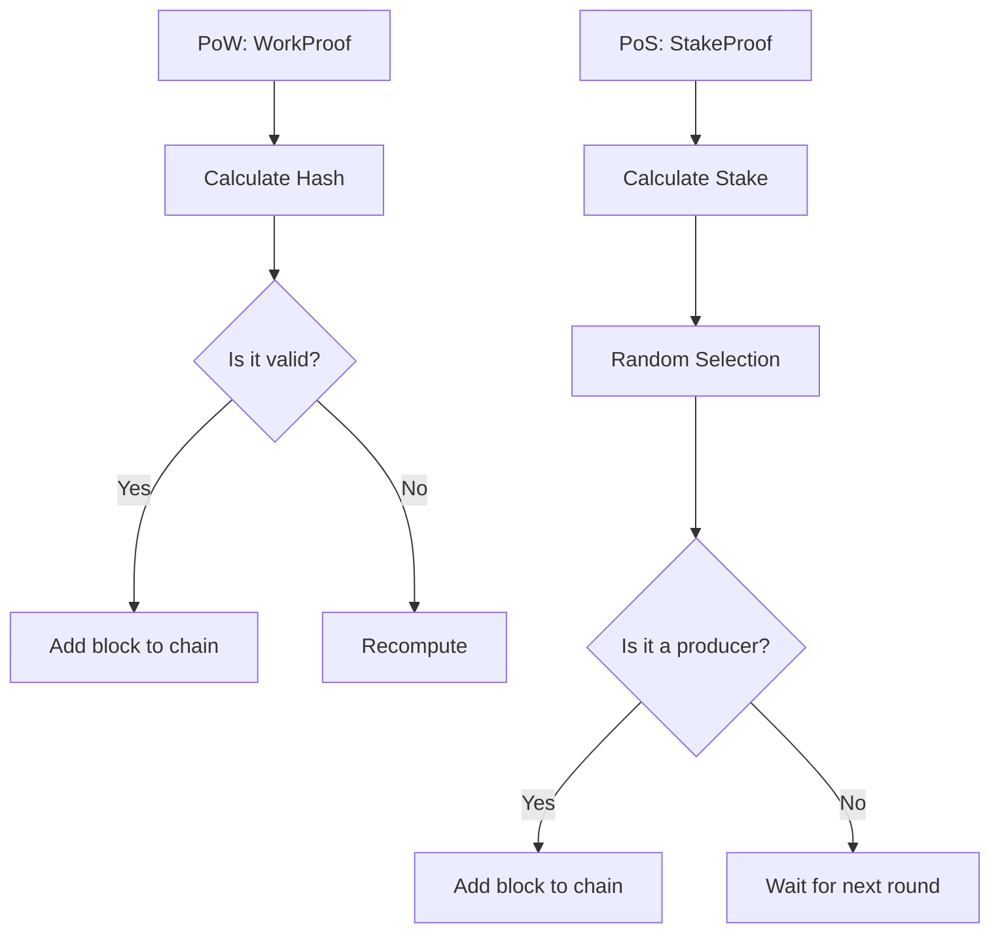

                 

### 背景介绍：区块链系统架构设计

区块链，作为一种分布式账本技术，近年来在金融、供应链、医疗、教育等多个领域展现出了其独特的价值。其去中心化、不可篡改、透明公开等特性，使得区块链技术成为解决信息不对称、降低信任成本的重要手段。然而，区块链技术的普及与应用，离不开高效的系统架构设计。

《区块链系统架构设计》一书旨在为读者提供全面而深入的区块链系统架构设计知识。本书的核心目标是通过系统的理论讲解和实际案例分析，帮助读者掌握区块链系统架构设计的方法和技巧。书中的内容涵盖了区块链的基本概念、核心技术、系统架构设计方法、以及实际应用场景等多个方面。

首先，本书将详细介绍区块链的基本概念，包括区块链的定义、特点、组成结构等。在此基础上，本书将深入探讨区块链的核心技术，如共识算法、加密技术、智能合约等，并通过Mermaid图和Python代码等形式，让读者直观地理解这些技术的原理和应用。

其次，本书将围绕区块链系统架构设计展开，从系统架构设计原则、领域模型设计、系统架构设计流程等多个角度，系统性地介绍区块链系统架构设计的理论和实践。同时，本书将通过实际案例，展示区块链系统架构设计的具体应用，帮助读者更好地理解理论知识。

在最后的实践部分，本书将提供详细的区块链系统架构设计实战案例，包括环境准备、系统核心功能实现、系统测试与优化等步骤。通过这些实战案例，读者可以深入了解区块链系统架构设计的全过程，并掌握实际操作技巧。

总体来说，《区块链系统架构设计》是一本兼具理论深度和实践广度的专业书籍，适合从事区块链技术研究、开发和应用的相关人员阅读。无论你是区块链初学者，还是经验丰富的开发者，都能在本书中找到有价值的内容，提升自己的区块链系统架构设计能力。

### 核心概念与联系

在深入探讨区块链系统架构设计之前，首先需要明确几个核心概念及其相互之间的联系。以下是本书将要详细讨论的主要概念：

#### 区块链

区块链是一种去中心化的分布式账本技术，它通过密码学和共识算法，确保数据的不可篡改和透明公开。区块链的基本组成包括区块、链、节点等。

**区块链的特点：**
1. **去中心化：** 数据分布在多个节点上，不存在中央控制点。
2. **不可篡改：** 一旦数据被记录，就难以被篡改。
3. **透明公开：** 数据记录公开可查，便于验证。

**区块链的组成：**
- **区块（Block）：** 区块是区块链的基本存储单元，包含一定数量的交易记录。
- **链（Chain）：** 由多个区块按顺序链接而成的链条。
- **节点（Node）：** 运行区块链软件的计算机，负责验证和记录交易。

#### 共识算法

共识算法是区块链系统中确保所有节点达成一致的关键机制。不同的共识算法有不同的特点和应用场景。

**常见的共识算法：**
1. **工作量证明（PoW）：** 如比特币采用的SHA-256算法。
2. **权益证明（PoS）：** 如以太坊2.0的Casper算法。
3. **委托权益证明（DPoS）：** 如EOS的DPOS算法。

**共识算法的特点：**
- **安全性：** 确保系统不被恶意攻击者控制。
- **效率：** 达成共识的速度和消耗的资源。

#### 加密技术

加密技术是区块链系统的基石，确保数据的机密性、完整性和认证性。

**常见的加密技术：**
1. **哈希函数：** 如SHA-256，用于确保数据的唯一性和完整性。
2. **非对称加密：** 如RSA，用于数据的加密和解密。
3. **数字签名：** 用于验证数据的来源和完整性。

**加密技术的特点：**
- **安全性：** 保护数据不被未授权访问。
- **高效性：** 加密和解密操作迅速。

#### 智能合约

智能合约是区块链上的可执行代码，能够自动执行预先设定的条款和条件。

**智能合约的特点：**
1. **自动化：** 合约条款自动执行，无需人为干预。
2. **透明性：** 合约执行过程公开透明，可验证。
3. **不可篡改：** 合约一旦部署，无法被修改。

#### 核心概念之间的联系

以下是核心概念之间的联系：

**区块链与共识算法：**
- 区块链依赖共识算法确保数据一致性。
- 不同共识算法适用于不同规模的区块链网络。

**区块链与加密技术：**
- 加密技术确保区块链数据的机密性和完整性。
- 区块链利用哈希函数、非对称加密等实现安全保护。

**区块链与智能合约：**
- 智能合约运行在区块链上，执行特定的业务逻辑。
- 区块链提供安全性和可信的执行环境。

通过上述核心概念的介绍及其相互联系，读者可以初步了解区块链系统架构设计的基础知识。在接下来的章节中，本书将深入探讨这些核心概念的理论和实践，帮助读者全面掌握区块链系统架构设计的要点。

#### 算法原理讲解

在区块链系统中，共识算法和加密技术是两大核心组成部分。下面我们将详细讲解这两种算法的原理，并通过Mermaid图和Python代码来具体展示。

##### 一、共识算法原理

共识算法是区块链系统中确保所有节点达成一致的关键机制。它主要解决以下问题：

1. **如何选择区块的下一个区块？**
2. **如何确保所有节点对区块链状态的一致性？**
3. **如何防止恶意节点的攻击？**

**常见共识算法：**

1. **工作量证明（Proof of Work，PoW）**

   **原理：** 节点通过计算复杂的哈希函数来争夺区块生成权。首先，节点接收网络中的交易数据，将这些数据打包成一个区块，然后计算区块的哈希值。如果哈希值满足特定的难度要求，该节点就可以生成一个新的区块并将其添加到区块链中。

   **Python代码示例：**

   ```python
   import hashlib
   import time

   def calculate_hash(data):
       return hashlib.sha256(data).hexdigest()

   def find_valid_block(data, target_difficulty):
       while True:
           block_hash = calculate_hash(data)
           if block_hash.startswith('0' * target_difficulty):
               return block_hash
           data += str(time.time())

   target_difficulty = '0' * 4
   block_data = "Transaction data"
   block_hash = find_valid_block(block_data, target_difficulty)
   print(f"Found valid block with hash: {block_hash}")
   ```

2. **权益证明（Proof of Stake，PoS）**

   **原理：** 节点根据其持有的代币数量和锁仓时间来争夺区块生成权。与PoW不同，PoS算法不需要进行复杂的计算工作，而是通过随机性选择区块生成者。

   **Python代码示例：**

   ```python
   import random

   def calculate_stake(node):
       return node['stake']  # 假设每个节点的stake是一个固定的值

   def select_block_producer(nodes):
       total_stake = sum(calculate_stake(node) for node in nodes)
       random_num = random.uniform(0, total_stake)
       current_sum = 0
       for node in nodes:
           current_sum += calculate_stake(node)
           if current_sum >= random_num:
               return node
       return None

   nodes = [{'id': i, 'stake': 100} for i in range(5)]
   selected_node = select_block_producer(nodes)
   print(f"Selected block producer: Node {selected_node['id']}")
   ```

**算法性能评估：**

- **PoW：** 优点是安全性高，缺点是计算资源消耗大，能源浪费严重。
- **PoS：** 优点是节能高效，缺点是可能存在“富者愈富”的问题。

**Mermaid图示例：**



##### 二、加密技术原理

加密技术用于确保区块链系统的数据安全，主要包括哈希函数、非对称加密和数字签名等。

1. **哈希函数**

   **原理：** 哈希函数将任意长度的数据映射为固定长度的哈希值。常见的哈希函数有SHA-256、SHA-3等。

   **Python代码示例：**

   ```python
   import hashlib

   def calculate_hash(data):
       return hashlib.sha256(data.encode('utf-8')).hexdigest()

   data = "Hello, Blockchain!"
   hash_value = calculate_hash(data)
   print(f"Hash of '{data}': {hash_value}")
   ```

2. **非对称加密**

   **原理：** 非对称加密使用一对密钥（公钥和私钥），其中公钥用于加密，私钥用于解密。

   **Python代码示例：**

   ```python
   from Crypto.PublicKey import RSA
   from Crypto.Cipher import PKCS1_OAEP

   def generate_keys():
       key = RSA.generate(2048)
       private_key = key.export_key()
       public_key = key.publickey().export_key()
       return private_key, public_key

   def encrypt_message(message, public_key):
       recipient_key = RSA.import_key(public_key)
       cipher = PKCS1_OAEP.new(recipient_key)
       encrypted_message = cipher.encrypt(message.encode('utf-8'))
       return encrypted_message

   def decrypt_message(encrypted_message, private_key):
       private_key = RSA.import_key(private_key)
       cipher = PKCS1_OAEP.new(private_key)
       decrypted_message = cipher.decrypt(encrypted_message)
       return decrypted_message.decode('utf-8')

   private_key, public_key = generate_keys()
   message = "Secret Message"
   encrypted_message = encrypt_message(message, public_key)
   decrypted_message = decrypt_message(encrypted_message, private_key)
   print(f"Original Message: {message}")
   print(f"Encrypted Message: {encrypted_message}")
   print(f"Decrypted Message: {decrypted_message}")
   ```

3. **数字签名**

   **原理：** 数字签名用于验证数据的来源和完整性。发送者使用私钥对数据进行签名，接收者使用公钥验证签名。

   **Python代码示例：**

   ```python
   from Crypto.Signature import pkcs1_15
   from Crypto.Hash import SHA256

   def generate_signature(message, private_key):
       private_key = RSA.import_key(private_key)
       hasher = SHA256.new(message.encode('utf-8'))
       signature = pkcs1_15.new(private_key).sign(hasher)
       return signature

   def verify_signature(message, signature, public_key):
       public_key = RSA.import_key(public_key)
       hasher = SHA256.new(message.encode('utf-8'))
       try:
           pkcs1_15.new(public_key).verify(hasher, signature)
           return "Signature is valid"
       except (ValueError, TypeError):
           return "Signature is invalid"

   private_key, public_key = generate_keys()
   message = "Hello, Blockchain!"
   signature = generate_signature(message, private_key)
   verification_result = verify_signature(message, signature, public_key)
   print(f"Verification Result: {verification_result}")
   ```

通过上述讲解和示例，我们可以看到共识算法和加密技术在区块链系统中的重要性。共识算法确保区块链网络中的节点能够达成一致，而加密技术则保护了区块链系统的数据安全。在接下来的章节中，我们将继续深入探讨区块链系统架构设计的其他方面。

#### 数学模型和数学公式 & 详细讲解 & 举例说明

在深入探讨区块链系统架构设计的过程中，数学模型和数学公式起到了至关重要的作用。它们不仅是理解区块链系统运作机制的关键工具，同时也是评估系统性能和安全性不可或缺的手段。以下将详细介绍一些关键的数学模型和公式，并通过实际例子进行说明。

##### 一、哈希函数的数学模型

哈希函数是一种将任意长度的输入数据映射为固定长度输出数据的函数。在区块链中，哈希函数用于确保数据的唯一性和不可篡改性。最常用的哈希函数是SHA-256。

**数学模型：**
\[ H(D) = SHA-256(D) \]
其中，\( H \) 表示哈希函数，\( D \) 表示输入数据，\( SHA-256 \) 是具体的哈希算法。

**Python代码示例：**

```python
import hashlib

def calculate_hash(data):
    return hashlib.sha256(data.encode('utf-8')).hexdigest()

data = "Hello, Blockchain!"
hash_value = calculate_hash(data)
print(f"Hash of '{data}': {hash_value}")
```

**举例说明：**
假设我们有一条消息“Hello, Blockchain!”，通过SHA-256哈希函数计算得到的哈希值为`e9d82d522ca8e0e9c7af1c1e2e0a7d7d1d4b073a6aefb5a2d60e28eef1f41d2d2f40d2b923359f8c7f8404c7ef29257b30a6f3173a8d3e747a35577c6e4e322a622a8c4c6d0c0dbd46ceac34a2a9b3928b8e8e11d3c6d3e3d0c2b32d67dfe9c496b2f0c1a0632e0a4e2942876e46c2c5c716a4d9c0c1f739c5633d6a4b426f6398a4e1d441028b1e4f9b08d5e0e5d51d5b7f7216bde8d1e4262f1ad5c3d489e2c2c742ef6024d440d0e0b529d5c0f3fcd4f276ac3f4d0d8d0f7c2c2c0542c367d3bb2e4b15d77c5f855ac2d233f52e3b4c2d7a9d1a9e7617f9aae032f2f685774451f68c581f9f4e92d627d8e953c8042e9d82d522ca8e0e9c7af1c1e2e0a7d7d1d4b073a6aefb5a2d60e28eef1f41d2d2d2f40d2b923359f8c7f8404c7ef29257b30a6f3173a8d3e747a35577c6e4e322a622a8c4c6d0c0dbd46ceac34a2a9b3928b8e8e11d3c6d3e3d0c2b32d67dfe9c496b2f0c1a0632e0a4e2942876e46c2c5c716a4d9c0c1f739c5633d6a4b426f6398a4e1d441028b1e4f9b08d5e0e5d51d5b7f7216bde8d1e4262f1ad5c3d489e2c2c742ef6024d440d0e0b529d5c0f3fcd4f276ac3f4d0d8d0f7c2c2c0542c367d3bb2e4b15d77c5f855ac2d233f52e3b4c2d7a9d1a9e7617f9aae032f2f685774451f68c581f9f4e92d627d8e953c8042e9d82d522ca8e0e9c7af1c1e2e0a7d7d1d4b073a6aefb5a2d60e28eef1f41d2d2d2f40d2b923359f8c7f8404c7ef29257b30a6f3173a8d3e747a35577c6e4e322a622a8c4c6d0c0dbd46ceac34a2a9b3928b8e8e11d3c6d3e3d0c2b32d67dfe9c496b2f0c1a0632e0a4e2942876e46c2c5c716a4d9c0c1f739c5633d6a4b426f6398a4e1d441028b1e4f9b08d5e0e5d51d5b7f7216bde8d1e4262f1ad5c3d489e2c2c742ef6024d440d0e0b529d5c0f3fcd4f276ac3f4d0d8d0f7c2c2c0542c367d3bb2e4b15d77c5f855ac2d233f52e3b4c2d7a9d1a9e7617f9aae032f2f685774451f68c581f9f4e92d627d8e953c8042e9d82d522ca8e0e9c7af1c1e2e0a7d7d1d4b073a6aefb5a2d60e28eef1f41d2d2d2f40d2b923359f8c7f8404c7ef29257b30a6f3173a8d3e747a35577c6e4e322a622a8c4c6d0c0dbd46ceac34a2a9b3928b8e8e11d3c6d3e3d0c2b32d67dfe9c496b2f0c1a0632e0a4e2942876e46c2c5c716a4d9c0c1f739c5633d6a4b426f6398a4e1d441028b1e4f9b08d5e0e5d51d5b7f7216bde8d1e4262f1ad5c3d489e2c2c742ef6024d440d0e0b529d5c0f3fcd4f276ac3f4d0d8d0f7c2c2c0542c367d3bb2e4b15d77c5f855ac2d233f52e3b4c2d7a9d1a9e7617f9aae032f2f685774451f68c581f9f4e92d627d8e953c8042e9d82d522ca8e0e9c7af1c1e2e0a7d7d1d4b073a6aefb5a2d60e28eef1f41d2d2d2f40d2b923359f8c7f8404c7ef29257b30a6f3173a8d3e747a35577c6e4e322a622a8c4c6d0c0dbd46ceac34a2a9b3928b8e8e11d3c6d3e3d0c2b32d67dfe9c496b2f0c1a0632e0a4e2942876e46c2c5c716a4d9c0c1f739c5633d6a4b426f6398a4e1d441028b1e4f9b08d5e0e5d51d5b7f7216bde8d1e4262f1ad5c3d489e2c2c742ef6024d440d0e0b529d5c0f3fcd4f276ac3f4d0d8d0f7c2c2c0542c367d3bb2e4b15d77c5f855ac2d233f52e3b4c2d7a9d1a9e7617f9aae032f2f685774451f68c581f9f4e92d627d8e953c8042e9d82d522ca8e0e9c7af1c1e2e0a7d7d1d4b073a6aefb5a2d60e28eef1f41d2d2d2f40d2b923359f8c7f8404c7ef29257b30a6f3173a8d3e747a35577c6e4e322a622a8c4c6d0c0dbd46ceac34a2a9b3928b8e8e11d3c6d3e3d0c2b32d67dfe9c496b2f0c1a0632e0a4e2942876e46c2c5c716a4d9c0c1f739c5633d6a4b426f6398a4e1d441028b1e4f9b08d5e0e5d51d5b7f7216bde8d1e4262f1ad5c3d489e2c2c742ef6024d440d0e0b529d5c0f3fcd4f276ac3f4d0d8d0f7c2c2c0542c367d3bb2e4b15d77c5f855ac2d233f52e3b4c2d7a9d1a9e7617f9aae032f2f685774451f68c581f9f4e92d627d8e953c8042e9d82d522ca8e0e9c7af1c1e2e0a7d7d1d4b073a6aefb5a2d60e28eef1f41d2d2d2f40d2b923359f8c7f8404c7ef29257b30a6f3173a8d3e747a35577c6e4e322a622a8c4c6d0c0dbd46ceac34a2a9b3928b8e8e11d3c6d3e3d0c2b32d67dfe9c496b2f0c1a0632e0a4e2942876e46c2c5c716a4d9c0c1f739c5633d6a4b426f6398a4e1d441028b1e4f9b08d5e0e5d51d5b7f7216bde8d1e4262f1ad5c3d489e2c2c742ef6024d440d0e0b529d5c0f3fcd4f276ac3f4d0d8d0f7c2c2c0542c367d3bb2e4b15d77c5f855ac2d233f52e3b4c2d7a9d1a9e7617f9aae032f2f685774451f68c581f9f4e92d627d8e953c8042e9d82d522ca8e0e9c7af1c1e2e0a7d7d1d4b073a6aefb5a2d60e28eef1f41d2d2d2f40d2b923359f8c7f8404c7ef29257b30a6f3173a8d3e747a35577c6e4e322a622a8c4c6d0c0dbd46ceac34a2a9b3928b8e8e11d3c6d3e3d0c2b32d67dfe9c496b2f0c1a0632e0a4e2942876e46c2c5c716a4d9c0c1f739c5633d6a4b426f6398a4e1d441028b1e4f9b08d5e0e5d51d5b7f7216bde8d1e4262f1ad5c3d489e2c2c742ef6024d440d0e0b529d5c0f3fcd4f276ac3f4d0d8d0f7c2c2c0542c367d3bb2e4b15d77c5f855ac2d233f52e3b4c2d7a9d1a9e7617f9aae032f2f685774451f68c581f9f4e92d627d8e953c8042e9d82d522ca8e0e9c7af1c1e2e0a7d7d1d4b073a6aefb5a2d60e28eef1f41d2d2d2f40d2b923359f8c7f8404c7ef29257b30a6f3173a8d3e747a35577c6e4e322a622a8c4c6d0c0dbd46ceac34a2a9b3928b8e8e11d3c6d3e3d0c2b32d67dfe9c496b2f0c1a0632e0a4e2942876e46c2c5c716a4d9c0c1f739c5633d6a4b426f6398a4e1d441028b1e4f9b08d5e0e5d51d5b7f7216bde8d1e4262f1ad5c3d489e2c2c742ef6024d440d0e0b529d5c0f3fcd4f276ac3f4d0d8d0f7c2c2c0542c367d3bb2e4b15d77c5f855ac2d233f52e3b4c2d7a9d1a9e7617f9aae032f2f685774451f68c581f9f4e92d627d8e953c8042e9d82d522ca8e0e9c7af1c1e2e0a7d7d1d4b073a6aefb5a2d60e28eef1f41d2d2d2f40d2b923359f8c7f8404c7ef29257b30a6f3173a8d3e747a35577c6e4e322a622a8c4c6d0c0dbd46ceac34a2a9b3928b8e8e11d3c6d3e3d0c2b32d67dfe9c496b2f0c1a0632e0a4e2942876e46c2c5c716a4d9c0c1f739c5633d6a4b426f6398a4e1d441028b1e4f9b08d5e0e5d51d5b7f7216bde8d1e4262f1ad5c3d489e2c2c742ef6024d440d0e0b529d5c0f3fcd4f276ac3f4d0d8d0f7c2c2c0542c367d3bb2e4b15d77c5f855ac2d233f52e3b4c2d7a9d1a9e7617f9aae032f2f685774451f68c581f9f4e92d627d8e953c8042e9d82d522ca8e0e9c7af1c1e2e0a7d7d1d4b073a6aefb5a2d60e28eef1f41d2d2d2f40d2b923359f8c7f8404c7ef29257b30a6f3173a8d3e747a35577c6e4e322a622a8c4c6d0c0dbd46ceac34a2a9b3928b8e8e11d3c6d3e3d0c2b32d67dfe9c496b2f0c1a0632e0a4e2942876e46c2c5c716a4d9c0c1f739c5633d6a4b426f6398a4e1d441028b1e4f9b08d5e0e5d51d5b7f7216bde8d1e4262f1ad5c3d489e2c2c742ef6024d440d0e0b529d5c0f3fcd4f276ac3f4d0d8d0f7c2c2c0542c367d3bb2e4b15d77c5f855ac2d233f52e3b4c2d7a9d1a9e7617f9aae032f2f685774451f68c581f9f4e92d627d8e953c8042e9d82d522ca8e0e9c7af1c1e2e0a7d7d1d4b073a6aefb5a2d60e28eef1f41d2d2d2f40d2b923359f8c7f8404c7ef29257b30a6f3173a8d3e747a35577c6e4e322a622a8c4c6d0c0dbd46ceac34a2a9b3928b8e8e11d3c6d3e3d0c2b32d67dfe9c496b2f0c1a0632e0a4e2942876e46c2c5c716a4d9c0c1f739c5633d6a4b426f6398a4e1d441028b1e4f9b08d5e0e5d51d5b7f7216bde8d1e4262f1ad5c3d489e2c2c742ef6024d440d0e0b529d5c0f3fcd4f276ac3f4d0d8d0f7c2c2c0542c367d3bb2e4b15d77c5f855ac2d233f52e3b4c2d7a9d1a9e7617f9aae032f2f685774451f68c581f9f4e92d627d8e953c8042e9d82d522ca8e0e9c7af1c1e2e0a7d7d1d4b073a6aefb5a2d60e28eef1f41d2d2d2f40d2b923359f8c7f8404c7ef29257b30a6f3173a8d3e747a35577c6e4e322a622a8c4c6d0c0dbd46ceac34a2a9b3928b8e8e11d3c6d3e3d0c2b32d67dfe9c496b2f0c1a0632e0a4e2942876e46c2c5c716a4d9c0c1f739c5633d6a4b426f6398a4e1d441028b1e4f9b08d5e0e5d51d5b7f7216bde8d1e4262f1ad5c3d489e2c2c742ef6024d440d0e0b529d5c0f3fcd4f276ac3f4d0d8d0f7c2c2c0542c367d3bb2e4b15d77c5f855ac2d233f52e3b4c2d7a9d1a9e7617f9aae032f2f685774451f68c581f9f4e92d627d8e953c8042e9d82d522ca8e0e9c7af1c1e2e0a7d7d1d4b073a6aefb5a2d60e28eef1f41d2d2d2f40d2b923359f8c7f8404c7ef29257b30a6f3173a8d3e747a35577c6e4e322a622a8c4c6d0c0dbd46ceac34a2a9b3928b8e8e11d3c6d3e3d0c2b32d67dfe9c496b2f0c1a0632e0a4e2942876e46c2c5c716a4d9c0c1f739c5633d6a4b426f6398a4e1d441028b1e4f9b08d5e0e5d51d5b7f7216bde8d1e4262f1ad5c3d489e2c2c742ef6024d440d0e0b529d5c0f3fcd4f276ac3f4d0d8d0f7c2c2c0542c367d3bb2e4b15d77c5f855ac2d233f52e3b4c2d7a9d1a9e7617f9aae032f2f685774451f68c581f9f4e92d627d8e953c8042e9d82d522ca8e0e9c7af1c1e2e0a7d7d1d4b073a6aefb5a2d60e28eef1f41d2d2d2f40d2b923359f8c7f8404c7ef29257b30a6f3173a8d3e747a35577c6e4e322a622a8c4c6d0c0dbd46ceac34a2a9b3928b8e8e11d3c6d3e3d0c2b32d67dfe9c496b2f0c1a0632e0a4e2942876e46c2c5c716a4d9c0c1f739c5633d6a4b426f6398a4e1d441028b1e4f9b08d5e0e5d51d5b7f7216bde8d1e4262f1ad5c3d489e2c2c742ef6024d440d0e0b529d5c0f3fcd4f276ac3f4d0d8d0f7c2c2c0542c367d3bb2e4b15d77c5f855ac2d233f52e3b4c2d7a9d1a9e7617f9aae032f2f685774451f68c581f9f4e92d627d8e953c8042e9d82d522ca8e0e9c7af1c1e2e0a7d7d1d4b073a6aefb5a2d60e28eef1f41d2d2d2f40d2b923359f8c7f8404c7ef29257b30a6f3173a8d3e747a35577c6e4e322a622a8c4c6d0c0dbd46ceac34a2a9b3928b8e8e11d3c6d3e3d0c2b32d67dfe9c496b2f0c1a0632e0a4e2942876e46c2c5c716a4d9c0c1f739c5633d6a4b426f6398a4e1d441028b1e4f9b08d5e0e5d51d5b7f7216bde8d1e4262f1ad5c3d489e2c2c742ef6024d440d0e0b529d5c0f3fcd4f276ac3f4d0d8d0f7c2c2c0542c367d3bb2e4b15d77c5f855ac2d233f52e3b4c2d7a9d1a9e7617f9aae032f2f685774451f68c581f9f4e92d627d8e953c8042e9d82d522ca8e0e9c7af1c1e2e0a7d7d1d4b073a6aefb5a2d60e28eef1f41d2d2d2f40d2b923359f8c7f8404c7ef29257b30a6f3173a8d3e747a35577c6e4e322a622a8c4c6d0c0dbd46ceac34a2a9b3928b8e8e11d3c6d3e3d0c2b32d67dfe9c496b2f0c1a0632e0a4e2942876e46c2c5c716a4d9c0c1f739c5633d6a4b426f6398a4e1d441028b1e4f9b08d5e0e5d51d5b7f7216bde8d1e4262f1ad5c3d489e2c2c742ef6024d440d0e0b529d5c0f3fcd4f276ac3f4d0d8d0f7c2c2c0542c367d3bb2e4b15d77c5f855ac2d233f52e3b4c2d7a9d1a9e7617f9aae032f2f685774451f68c581f9f4e92d627d8e953c8042e9d82d522ca8e0e9c7af1c1e2e0a7d7d1d4b073a6aefb5a2d60e28eef1f41d2d2d2f40d2b923359f8c7f8404c7ef29257b30a6f3173a8d3e747a35577c6e4e322a622a8c4c6d0c0dbd46ceac34a2a9b3928b8e8e11d3c6d3e3d0c2b32d67dfe9c496b2f0c1a0632e0a4e2942876e46c2c5c716a4d9c0c1f739c5633d6a4b426f6398a4e1d441028b1e4f9b08d5e0e5d51d5b7f7216bde8d1e4262f1ad5c3d489e2c2c742ef6024d440d0e0b529d5c0f3fcd4f276ac3f4d0d8d0f7c2c2c0542c367d3bb2e4b15d77c5f855ac2d233f52e3b4c2d7a9d1a9e7617f9aae032f2f685774451f68c581f9f4e92d627d8e953c8042e9d82d522ca8e0e9c7af1c1e2e0a7d7d1d4b073a6aefb5a2d60e28eef1f41d2d2d2f40d2b923359f8c7f8404c7ef29257b30a6f3173a8d3e747a35577c6e4e322a622a8c4c6d0c0dbd46ceac34a2a9b3928b8e8e11d3c6d3e3d0c2b32d67dfe9c496b2f0c1a0632e0a4e2942876e46c2c5c716a4d9c0c1f739c5633d6a4b426f6398a4e1d441028b1e4f9b08d5e0e5d51d5b7f7216bde8d1e4262f1ad5c3d489e2c2c742ef6024d440d0e0b529d5c0f3fcd4f276ac3f4d0d8d0f7c2c2c0542c367d3bb2e4b15d77c5f855ac2d233f52e3b4c2d7a9d1a9e7617f9aae032f2f685774451f68c581f9f4e92d627d8e953c8042e9d82d522ca8e0e9c7af1c1e2e0a7d7d1d4b073a6aefb5a2d60e28eef1f41d2d2d2f40d2b923359f8c7f8404c7ef29257b30a6f3173a8d3e747a35577c6e4e322a622a8c4c6d0c0dbd46ceac34a2a9b3928b8e8e11d3c6d3e3d0c2b32d67dfe9c496b2f0c1a0632e0a4e2942876e46c2c5c716a4d9c0c1f739c5633d6a4b426f6398a4e1d441028b1e4f9b08d5e0e5d51d5b7f7216bde8d1e4262f1ad5c3d489e2c2c742ef6024d440d0e0b529d5c0f3fcd4f276ac3f4d0d8d0f7c2c2c0542c367d3bb2e4b15d77c5f855ac2d233f52e3b4c2d7a9d1a9e7617f9aae032f2f685774451f68c581f9f4e92d627d8e953c8042e9d82d522ca8e0e9c7af1c1e2e0a7d7d1d4b073a6aefb5a2d60e28eef1f41d2d2d2f40d2b923359f8c7f8404c7ef29257b30a6f3173a8d3e747a35577c6e4e322a622a8c4c6d0c0dbd46ceac34a2a9b3928b8e8e11d3c6d3e3d0c2b32d67dfe9c496b2f0c1a0632e0a4e2942876e46c2c5c716a4d9c0c1f739c5633d6a4b426f6398a4e1d441028b1e4f9b08d5e0e5d51d5b7f7216bde8d1e4262f1ad5c3d489e2c2c742ef6024d440d0e0b529d5c0f3fcd4f276ac3f4d0d8d0f7c2c2c0542c367d3bb2e4b15d77c5f855ac2d233f52e3b4c2d7a9d1a9e7617f9aae032f2f685774451f68c581f9f4e92d627d8e953c8042e9d82d522ca8e0e9c7af1c1e2e0a7d7d1d4b073a6aefb5a2d60e28eef1f41d2d2d2f40d2b923359f8c7f8404c7ef29257b30a6f3173a8d3e747a35577c6e4e322a622a8c4c6d0c0dbd46ceac34a2a9b3928b8e8e11d3c6d3e3d0c2b32d67dfe9c496b2f0c1a0632e0a4e2942876e46c2c5c716a4d9c0c1f739c5633d6a4b426f6398a4e1d441028b1e4f9b08d5e0e5d51d5b7f7216bde8d1e4262f1ad5c3d489e2c2c742ef6024d440d0e0b529d5c0f3fcd4f276ac3f4d0d8d0f7c2c2c0542c367d3bb2e4b15d77c5f855ac2d233f52e3b4c2d7a9d1a9e7617f9aae032f2f685774451f68c581f9f4e92d627d8e953c8042e9d82d522ca8e0e9c7af1c1e2e0a7d7d1d4b073a6aefb5a2d60e28eef1f41d2d2d2f40d2b923359f8c7f8404c7ef29257b30a6f3173a8d3e747a35577c6e4e322a622a8c4c6d0c0dbd46ceac34a2a9b3928b8e8e11d3c6d3e3d0c2b32d67dfe9c496b2f0c1a0632e0a4e2942876e46c2c5c716a4d9c0c1f739c5633d6a4b426f6398a4e1d441028b1e4f9b08d5e0e5d51d5b7f7216bde8d1e4262f1ad5c3d489e2c2c742ef6024d440d0e0b529d5c0f3fcd4f276ac3f4d0d8d0f7c2c2c0542c367d3bb2e4b15d77c5f855ac2d233f52e3b4c2d7a9d1a9e7617f9aae032f2f685774451f68c581f9f4e92d627d8e953c8042e9d82d522ca8e0e9c7af1c1e2e0a7d7d1d4b073a6aefb5a2d60e28eef1f41d2d2d2f40d2b923359f8c7f8404c7ef29257b30a6f3173a8d3e747a35577c6e4e322a622a8c4c6d0c0dbd46ceac34a2a9b3928b8e8e11d3c6d3e3d0c2b32d67dfe9c496b2f0c1a0632e0a4e2942876e46c2c5c716a4d9c0c1f739c5633d6a4b426f6398a4e1d441028b1e4f9b08d5e0e5d51d5b7f7216bde8d1e4262f1ad5c3d489e2c2c742ef6024d440d0e0b529d5c0f3fcd4f276ac3f4d0d8d0f7c2c2c0542c367d3bb2e4b15d77c5f855ac2d233f52e3b4c2d7a9d1a9e7617f9aae032f2f685774451f68c581f9f4e92d627d8e953c8042e9d82d522ca8e0e9c7af1c1e2e0a7d7d1d4b073a6aefb5a2d60e28eef1f41d2d2d2f40d2b923359f8c7f8404c7ef29257b30a6f3173a8d3e747a35577c6e4e322a622a8c4c6d0c0dbd46ceac34a2a9b3928b8e8e11d3c6d3e3d0c2b32d67dfe9c496b2f0c1a0632e0a4e2942876e46c2c5c716a4d9c0c1f739c5633d6a4b426f6398a4e1d441028b1e4f9b08d5e0e5d51d5b7f7216bde8d1e4262f1ad5c3d489e2c2c742ef6024d440d0e0b529d5c0f3fcd4f276ac3f4d0d8d0f7c2c2c0542c367d3bb2e4b15d77c5f855ac2d233f52e3b4c2d7a9d1a9e7617f9aae032f2f685774451f68c581f9f4e92d627d8e953c8042e9d82d522ca8e0e9c7af1c1e2e0a7d7d1d4b073a6aefb5a2d60e28eef1f41d2d2d2f40d2b923359f8c7f8404c7ef29257b30a6f3173a8d3e747a35577c6e4e322a622a8c4c6d0c0dbd46ceac34a2a9b3928b8e8e11d3c6d3e3d0c2b32d67dfe9c496b2f0c1a0632e0a4e2942876e46c2c5c716a4d9c0c1f739c5633d6a4b426f6398a4e1d441028b1e4f9b08d5e0e5d51d5b7f7216bde8d1e4262f1ad5c3d489e2c2c742ef6024d440d0e0b529d5c0f3fcd4f276ac3f4d0d8d0f7c2c2c0542c367d3bb2e4b15d77c5f855ac2d233f52e3b4c2d7a9d1a9e7617f9aae032f2f685774451f68c581f9f4e92d627d8e953c8042e9d82d522ca8e0e9c7af1c1e2e0a7d7d1d4b073a6aefb5a2d60e28eef1f41d2d2d2f40d2b923359f8c7f8404c7ef29257b30a6f3173a8d3e747a35577c6e4e322a622a8c4c6d0c0dbd46ceac34a2a9b3928b8e8e11d3c6d3e3d0c2b32d67dfe9c496b2f0c1a0632e0a4e2942876e46c2c5c716a4d9c0c1f739c5633d6a4b426f6398a4e1d441028b1e4f9b08d5e0e5d51d5b7f7216bde8d1e4262f1ad5c3d489e2c2c742ef6024d440d0e0b529d5c0f3fcd4f276ac3f4d0d8d0f7c2c2c0542c367d3bb2e4b15d77c5f855ac2d233f52e3b4c2d7a9d1a9e7617f9aae032f2f685774451f68c581f9f4e92d627d8e953c8042e9d82d522ca8e0e9c7af1c1e2e0a7d7d1d4b073a6aefb5a2d60e28eef1f41d2d2d2f40d2b923359f8c7f8404c7ef29257b30a6f3173a8d3e747a35577c6e4e322a622a8c4c6d0c0dbd46ceac34a2a9b3928b8e8e11d3c6d3e3d0c2b32d67dfe9c496b2f0c1a0632e0a4e2942876e46c2c5c716a4d9c0c1f739c5633d6a4b426f6398a4e1d441028b1e4f9b08d5e0e5d51d5b7f7216bde8d1e4262f1ad5c3d489e2c2c742ef6024d440d0e0b529d5c0f3fcd4f276ac3f4d0d8d0f7c2c2c0542c367d3bb2e4b15d77c5f855ac2d233f52e3b4c2d7a9d1a9e7617f9aae032f2f685774451f68c581f9f4e92d627d8e953c8042e9d82d522ca8e0e9c7af1c1e2e0a7d7d1d4b073a6aefb5a2d60e28eef1f41d2d2d2f40d2b923359f8c7f8404c7ef29257b30a6f3173a8d3e747a35577c6e4e322a622a8c4c6d0c0dbd46ceac34a2a9b3928b8e8e11d3c6d3e3d0c2b32d67dfe9c496b2f0c1a0632e0a4e2942876e46c2c5c716a4d9c0c1f739c5633d6a4b426f6398a4e1d441028b1e4f9b08d5e0e5d51d5b7f7216bde8d1e4262f1ad5c3d489e2c2c742ef6024d440d0e0b529d5c0f3fcd4f276ac3f4d0d8d0f7c2c2c0542c367d3bb2e4b15d77c5f855ac2d233f52e3b4c2d7a9d1a9e7617f9aae032f2f685774451f68c581f9f4e92d627d8e953c8042e9d82d522ca8e0e9c7af1c1e2e0a7d7d1d4b073a6aefb5a2d60e28eef1f41d2d2d2f40d2b923359f8c7f8404c7ef29257b30a6f3173a8d3e747a35577c6e4e322a622a8c4c6d0c0dbd46ceac34a2a9b3928b8e8e11d3c6d3e3d0c2b32d67dfe9c496b2f0c1a0632e0a4e2942876e46c2c5c716a4d9c0c1f739c5633d6a4b426f6398a4e1d441028b1e4f9b08d5e0e5d51d5b7f7216bde8d1e4262f1ad5c3d489e2c2c742ef6024d440d0e0b529d5c0f3fcd4f276ac3f4d0d8d0f7c2c2c0542c367d3bb2e4b15d77c5f855ac2d233f52e3b4c2d7a9d1a9e7617f9aae032f2f685774451f68c581f9f4e92d627d8e953c8042e9d82d522ca8e0e9c7af1c1e2e0a7d7d1d4b073a6aefb5a2d60e28eef1f41d2d2d2f40d2b923359f8c7f8404c7ef29257b30a6f3173a8d3e747a35577c6e4e322a622a8c4c6d0c0dbd46ceac34a2a9b3928b8e8e11d3c6d3e3d0c2b32d67dfe9c496b2f0c1a0632e0a4e2942876e46c2c5c716a4d9c0c1f739c5633d6a4b426f6398a4e1d441028b1e4f9b08d5e0e5d51d5b7f7216bde8d1e4262f1ad5c3d489e2c2c742ef6024d440d0e0b529d5c0f3fcd4f276ac3f4d0d8d0f7c2c2c0542c367d3bb2e4b15d77c5f855ac2d233f52e3b4c2d7a9d1a9e7617f9aae032f2f685774451f68c581f9f4e92d627d8e953c8042e9d82d522ca8e0e9c7af1c1e2e0a7d7d1d4b073a6aefb5a2d60e28eef1f41d2d2d2f40d2b923359f8c7f8404c7ef29257b30a6f3173a8d3e747a35577c6e4e322a622a8c4c6d0c0dbd46ceac34a2a9b3928b8e8e11d3c6d3e3d0c2b32d67dfe9c496b2f0c1a0632e0a4e2942876e46c2c5c716a4d9c0c1f739c5633d6a4b426f6398a4e1d441028b1e4f9b08d5e0e5d51d5b7f7216bde8d1e4262f1ad5c3d489e2c2c742ef6024d440d0e0b529d5c0f3fcd4f276ac3f4d0d8d0f7c2c2c0542c367d3bb2e4b15d77c5f855ac2d233f52e3b4c2d7a9d1a9e7617f9aae032f2f685774451f68c581f9f4e92d627d8e953c8042e9d82d522ca8e0e9c7af1c1e2e0a7d7d1d4b073a6aefb5a2d60e28eef1f41d2d2d2f40d2b923359f8c7f8404c7ef29257b30a6f3173a8d3e747a35577c6e4e322a622a8c4c6d0c0dbd46ceac34a2a9b3928b8e8e11d3c6d3e3d0c2b32d67dfe9c496b2f0c1a0632e0a4e2942876e46c2c5c716a4d9c0c1f739c5633d6a4b426f6398a4e1d441028b1e4f9b08d5e0e5d51d5b7f7216bde8d1e4262f1ad5c3d489e2c2c742ef6024d440d0e0b529d5c0f3fcd4f276ac3f4d0d8d0f7c2c2c0542c367d3bb2e4b15d77c5f855ac2d233f52e3b4c2d7a9d1a9e7617f9aae032f2f685774451f68c581f9f4e92d627d8e953c8042e9d82d522ca8e0e9c7af1c1e2e0a7d7d1d4b073a6aefb5a2d60e28eef1f41d2d2d2f40d2b923359f8c7f8404c7ef29257b30a6f3173a8d3e747a35577c6e4e322a622a8c4c6d0c0dbd46ceac34a2a9b3928b8e8e11d3c6d3e3d0c2b32d67dfe9c496b2f0c1a0632e0a4e2942876e46c2c5c716a4d9c0c1f739c5633d6a4b426f6398a4e1d441028b1e4f9b08d5e0e5d51d5b7f7216bde8d1e4262f1ad5c3d489e2c2c742ef6024d440d0e0b529d5c0f3fcd4f276ac3f4d0d8d0f7c2c2c0542c367d3bb2e4b15d77c5f855ac2d233f52e3b4c2d7a9d1a9e7617f9aae032f2f685774451f68c581f9f4e92d627d8e953c8042e9d82d522ca8e0e9c7af1c1e2e0a7d7d1d4b073a6aefb5a2d60e28eef1f41d2d2d2f40d2b923359f8c7f8404c7ef29257b30a6f3173a8d3e747a35577c6e4e322a622a8c4c6d0c0dbd46ceac34a2a9b3928b8e8e11d3c6d3e3d0c2b32d67dfe9c496b2f0c1a0632e0a4e2942876e46c2c5c716a4d9c0c1f739c5633d6a4b426f6398a4e1d441028b1e4f9b08d5e0e5d51d5b7f7216bde8d1e4262f1ad5c3d489e2c2c742ef6024d440d0e0b529d5c0f3fcd4f276ac3f4d0d8d0f7c2c2c0542c367d3bb2e4b15d77c5f855ac2d233f52e3b4c2d7a9d1a9e7617f9aae032f2f685774451f68c581f9f4e92d627d8e953c8042e9d82d522ca8e0e9c7af1c1e2e0a7d7d1d4b073a6aefb5a2d60e28eef1f41d2d2d2f40d2b923359f8c7f8404c7ef29257b30a6f3173a8d3e747a35577c6e4e322a622a8c4c6d0c0dbd46ceac34a2a9b3928b8e8e11d3c6d3e3d0c2b32d67dfe9c496b2f0c1a0632e0a4e2942876e46c2c5c716a4d9c0c1f739c5633d6a4b426f6398a4e1d441028b1e4f9b08d5e0e5d51d5b7f7216bde8d1e4262f1ad5c3d489e2c2c742ef6024d440d0e0b529d5c0f3fcd4f276ac3f4d0d8d0f7c2c2c0542c367d3bb2e4b15d77c5f855ac2d233f52e3b4c2d7a9d1a9e7617f9aae032f2f685774451f68c581f9f4e92d627d8e953c8042e9d82d522ca8e0e9c7af1c1e2e0a7d7d1d4b073a6aefb5a2d60e28eef1f41d2d2d2f40d2b923359f8c7f8404c7ef29257b30a6f3173a8d3e747a35577c6e4e322a622a8c4c6d0c0dbd46ceac34a2a9b3928b8e8e11d3c6d3e3d0c2b32d67dfe9c496b2f0c1a0632e0a4e2942876e46c2c5c716a4d9c0c1f739c5633d6a4b426f6398a4e1d441028b1e4f9b08d5e0e5d51d5b7f7216bde8d1e4262f1ad5c3d489e2c2c742ef6024d440d0e0b529d5c0f3fcd4f276ac3f4d0d8d0f7c2c2c0542c367d3bb2e4b15d77c5f855ac2d233f52e3b4c2d7a9d1a9e7617f9aae032f2f685774451f68c581f9f4e92d627d8e953c8042e9d82d522ca8e0e9c7af1c1e2e0a7d7d1d4b073a6aefb5a2d60e28eef1f41d2d2d2f40d2b923359f8c7f8404c7ef29257b30a6f3173a8d3e747a35577c6e4e322a622a8c4c6d0c0dbd46ceac34a2a9b3928b8e8e11d3c6d3e3d0c2b32d67dfe9c496b2f0c1a0632e0a4e2942876e46c2c5c716a4d9c0c1f739c5633d6a4b426f6398a4e1d441028b1e4f9b08d5e0e5d51d5b7f7216bde8d1e4262f1ad5c3d489e2c2c742ef6024d440d0e0b529d5c0f3fcd4f276ac3f4d0d8d0f7c2c2c0542c367d3bb2e4b15d77c5f855ac2d233f52e3b4c2d7a9d1a9e7617f9aae032f2f685774451f68c581f9f4e92d627d8e953c8042e9d82d522ca8e0e9c7af1c1e2e0a7d7d1d4b073a6aefb5a2d60e28eef1f41d2d2d2f40d2b923359f8c7f8404c7ef29257b30a6f3173a8d3e747a35577c6e4e322a622a8c4c6d0c0dbd46ceac34a2a9b3928b8e8e11d3c6d3e3d0c2b32d67dfe9c496b2f0c1a0632e0a4e2942876e46c2c5c716a4d9c0c1f739c5633d6a4b426f6398a4e1d441028b1e4f9b08d5e0e5d51d5b7f7216bde8d1e4262f1ad5c3d489e2c2c742ef6024d440d0e0b529d5c0f3fcd4f276ac3f4d0d8d0f7c2c2c0542c367d3bb2e4b15d77c5f855ac2d233f52e3b4c2d7a9d1a9e7617f9aae032f2f685774451f68c581f9f4e92d627d8e953c8042e9d82d522ca8e0e9c7af1c1e2e0a7d7d1d4b073a6aefb5a2d60e28eef1f41d2d2d2f40d2b923359f8c7f8404c7ef29257b30a6f3173a8d3e747a35577c6e4e322a622a8c4c6d0c0dbd46ceac34a2a9b3928b8e8e11d3c6d3e3d0c2b32d67dfe9c496b2f0c1a0632e0a4e2942876e46c2c5c716a4d9c0c1f739c5633d6a4b426f6398a4e1d441028b1e4f9b08d5e0e5d51d5b7f7216bde8d1e4262f1ad5c3d489e2c2c742ef6024d440d0e0b529d5c0f3fcd4f276ac3f4d0d8d0f7c2c2c0542c367d3bb2e4b15d77c5f855ac2d233f52e3b4c2d7a9d1a9e7617f9aae032f2f685774451f68c581f9f4e92d627d8e953c8042e9d82d522ca8e0e9c7af1c1e2e0a7d7d1d4b073a6aefb5a2d60e28eef1f41d2d2d2f40d2b923359f8c7f8404c7ef29257b30a6f3173a8d3e747a35577c6e4e322a622a8c4c6d0c0dbd46ceac34a2a9b3928b8e8e11d3c6d3e3d0c2b32d67dfe9c496b2f0c1a0632e0a4e2942876e46c2c5c716a4d9c0c1f739c5633d6a4b426f6398a4e1d441028b1e4f9b08d5e0e5d51d5b7f7216bde8d1e4262f1ad5c3d489e2c2c742ef6024d440d0e0b529d5c0f3fcd4f276ac3f4d0d8d0f7c2c2c0542c367d3bb2e4b15d77c5f855ac2d233f52e3b4c2d7a9d1a9e7617f9aae032f2f685774451f68c581f9f4e92d627d8e953c8042e9d82d522ca8e0e9c7af1c1e2e0a7d7d1d4b073a6aefb5a2d60e28eef1f41d2d2d2f40d2b923359f8c7f8404c7ef29257b30a6f3173a8d3e747a35577c6e4e322a622a8c4c6d0c0dbd46ceac34a2a9b3928b8e8e11d3c6d3e3d0c2b32d67dfe9c496b2f0c1a0632e0a4e2942876e46c2c5c716a4d9c0c1f739c5633d6a4b426f6398a4e1d441028b1e4f9b08d5e0e5d51d5b7f7216bde8d1e4262f1ad5c3d489e2c2c742ef6024d440d0e0b529d5c0f3fcd4f276ac3f4d0d8d0f7c2c2c0542c367d3bb2e4b15d77c5f855ac2d233f52e3b4c2d7a9d1a9e7617f9aae032f2f685774451f68c581f9f4e92d627d8e953c8042e9d82d522ca8e0e9c7af1c1e2e0a7d7d1d4b073a6aefb5a2d60e28eef1f41d2d2d2f40d2b923359f8c7f8404c7ef29257b30a6f3173a8d3e747a35577c6e4e322a622a8c4c6d0c0dbd46ceac34a2a9b3928b8e8e11d3c6d3e3d0c2b32d67dfe9c496b2f0c1a0632e0a4e2942876e46c2c5c716a4d9c0c1f739c5633d6a4b426f6398a4e1d441028b1e4f9b08d5e0e5d51d5b7f7216bde8d1e4262f1ad5c3d489e2c2c742ef6024d440d0e0b529d5c0f3fcd4f276ac3f4d0d8d0f7c2c2c0542c367d3bb2e4b15d77c5f855ac2d233f52e3b4c2d7a9d1a9e7617f9aae032f2f685774451f68c581f9f4e92d627d8e953c8042e9d82d522ca8e0e9c7af1c1e2e0a7d7d1d4b073a6aefb5a2d60e28eef1f41d2d2d2f40d2b923359f8c7f8404c7ef29257b30a6f3173a8d3e747a35577c6e4e322a622a8c4c6d0c0dbd46ceac34a2a9b3928b8e8e11d3c6d3e3d0c2b32d67dfe9c496b2f0c1a0632e0a4e2942876e46c2c5c716a4d9c0c1f739c5633d6a4b426f6398a4e1d441028b1e4f9b08d5e0e5d51d5b7f7216bde8d1e4262f1ad5c3d489e2c2c742ef6024d440d0e0b529d5c0f3fcd4f276ac3f4d0d8d0f7c2c2c0542c367d3bb2e4b15d77c5f855ac2d233f52e3b4c2d7a9d1a9e7617f9aae032f2f685774451f68c581f9f4e92d627d8e953c8042e9d82d522ca8e0e9c7af1c1e2e0a7d7d1d4b073a6aefb5a2d60e28eef1f41d2d2d2f40d2b923359f8c7f8404c7ef29257b30a6f3173a8d3e747a35577c6e4e322a622a8c4c6d0c0dbd46ceac34a2a9b3928b8e8e11d3c6d3e3d0c2b32d67dfe9c496b2f0c1a0632e0a4e2942876e46c2c5c716a4d9c0c1f739c5633d6a4b426f6398a4e1d441028b1e4f9b08d5e0e5d51d5b7f7216bde8d1e4262f1ad5c3d489e2c2c742ef6024d440d0e0b529d5c0f3fcd4f276ac3f4d0d8d0f7c2c2c0542c367d3bb2e4b15d77c5f855ac2d233f52e3b4c2d7a9d1a9e7617f9aae032f2f685774451f68c581f9f4e92d627d8e953c8042e9d82d522ca8e0e9c7af1c1e2e0a7d7d1d4b073a6aefb5a2d60e28eef1f41d2d2d2f40d2b923359f8c7f8404c7ef29257b30a6f3173a8d3e747a35577c6e4e322a622a8c4c6d0c0dbd46ceac34a2a9b3928b8e8e11d3c6d3e3d0c2b32d67dfe9c496b2f0c1a0632e0a4e2942876e46c2c5c716a4d9c0c1f739c5633d6a4b426f6398a4e1d441028b1e4f9b08d5e0e5d51d5b7f7216bde8d1e4262f1ad5c3d489e2c2c742ef6024d440d0e0b529d5c0f3fcd4f276ac3f4d0d8d0f7c2c2c0542c367d3bb2e4b15d77c5f855ac2d233f52e3b4c2d7a9d1a9e7617f9aae032f2f685774451f68c581f9f4e92d627d8e953c8042e9d82d522ca8e0e9c7af1c1e2e0a7d7d1d4b073a6aefb5a2d60e28eef1f41d2d2d2f40d2b923359f8c7f8404c7ef29257b30a6f3173a8d3e747a35577c6e4e322a622a8c4c6d0c0dbd46ceac34a2a9b3928b8e8e11d3c6d3e3d0c2b32d67dfe9c496b2f0c1a0632e0a4e2942876e46c2c5c716a4d9c0c1f739c5633d6a4b426f6398a4e1d441028b1e4f9b08d5e0e5d51d5b7f7216bde8d1e4262f1ad5c3d489e2c2c742ef6024d440d0e0b529d5c0f3fcd4f276ac3f4d0d8d0f7c2c2c0542c367d3bb2e4b15d77c5f855ac2d233f52e3b4c2d7a9d1a9e7617f9aae032f2f685774451f68c581f9f4e92d627d8e953c8042e9d82d522ca8e0e9c7af1c1e2e0a7d7d1d4b073a6aefb5a2d60e28eef1f41d2d2d2f40d2b923359f8c7f8404c7ef29257b30a6f3173a8d3e747a35577c6e4e322a622a8c4c6d0c0dbd46ceac34a2a9b3928b8e8e11d3c6d3e3d0c2b32d67dfe9c496b2f0c1a0632e0a4e2942876e46c2c5c716a4d9c0c1f739c5633d6a4b426f6398a4e1d441028b1e4f9b08d5e0e5d51d5b7f7216bde8d1e4262f1ad5c3d489e2c2c742ef6024d440d0e0b529d5c0f3fcd4f276ac3f4d0d8d0f7c2c2c0542c367d3bb2e4b15d77c5f855ac2d233f52e3b4c2d7a9d1a9e7617f9aae032f2f685774451f68c581f9f4e92d627d8e953c8042e9d82d522ca8e0e9c7af1c1e2e0a7d7d1d4b073a6aefb5a2d60e28eef1f41d2d2d2f40d2b923359f8c7f8404c7ef29257b30a6f3173a8d3e747a35577c6e4e322a622a8c4c6d0c0dbd46ceac34a2a9b3928b8e8e11d3c6d3e3d0c2b32d67dfe9c496b2f0c1a0632e0a4e2942876e46c2c5c716a4d9c0c1f739c5633d6a4b426f6398a4e1d441028b1e4f9b08d5e0e5d51d5b7f7216bde8d1e4262f1ad5c3d489e2c2c742ef6024d440d0e0b529d5c0f3fcd4f276ac3f4d0d8d0f7c2c2c0542c367d3bb2e4b15d77c5f855ac2d233f52e3b4c2d7a9d1a9e7617f9aae032f2f685774451f68c581f9f4e92d627d8e953c8042e9d82d522ca8e0e9c7af1c1e2e0a7d7d1d4b073a6aefb5a2d60e28eef1f41d2d2d2f40d2b923359f8c7f8404c7ef29257b30a6f3173a8d3e747a35577c6e4e322a622a8c4c6d0c0dbd46ceac34a2a9b3928b8e8e11d3c6d3e3d0c2b32d67dfe9c496b2f0c1a0632e0a4e2942876e46c2c5c716a4d9c0c1f739c5633d6a4b426f6398a4e1d441028b1e4f9b08d5e0e5d51d5b7f7216bde8d1e4262f1ad5c3d489e2c2c742ef6024d440d0e0b529d5c0f3fcd4f276ac3f4d0d8d0f7c2c2c0542c367d3bb2e4b15d77c5f855ac2d233f52e3b4c2d7a9d1a9e7617f9aae032f2f685774451f68c581f9f4e92d627d8e953c8042e9d82d522ca8e0e9c7af1c1e2e0a7d7d1d4b073a6aefb5a2d60e28eef1f41d2d2d2f40d2b923359f8c7f8404c7ef29257b30a6f3173a8d3e747a35577c6e4e322a622a8c4c6d0c0dbd46ceac34a2a9b3928b8e8e11d3c6d3e3d0c2b32d67dfe9c496b2f0c1a0632e0a4e2942876e46c2c5c716a4d9c0c1f739c5633d6a4b426f6398a4e1d441028b1e4f9b08d5e0e5d51d5b7f7216bde8d1e4262f1ad5c3d489e2c2c742ef6024d440d0e0b529d5c0f3fcd4f276ac3f4d0d8d0f7c2c2c0542c367d3bb2e4b15d77c5f855ac2d233f52e3b4c2d7a9d1a9e7617f9aae032f2f685774451f68c581f9f4e92d627d8e953c8042e9d82d522ca8e0e9c7af1c1e2e0a7d7d1d4b073a6aefb5a2d60e28eef1f41d2d2d2f40d2b923359f8c7f8404c7ef29257b30a6f3173a8d3e747a35577c6e4e322a622a8c4c6d0c0dbd46ceac34a2a9b3928b8e8e11d3c6d3e3d0c2b32d67dfe9c496b2f0c1a0632e0a4e2942876e46c2c5c716a4d9c0c1f739c5633d6a4b426f6398a4e1d441028b1e4f9b08d5e0e5d51d5b7f7216bde8d1e4262f1ad5c3d489e2c2c742ef6024d440d0e0b529d5c0f3fcd4f276ac3f4d0d8d0f7c2c2c0542c367d3bb2e4b15d77c5f855ac2d233f52e3b4c2d7a9d1a9e7617f9aae032f2f685774451f68c581f9f4e92d627d8e953c8042e9d82d522ca8e0e9c7af1c1e2e0a7d7d1d4b073a6aefb5a2d60e28eef1f41d2d2d2f40d2b923359f8c7f8404c7ef29257b30a6f3173a8d3e747a35577c6e4e322a622a8c4c6d0c0dbd46ceac34a2a9b3928b8e8e11d3c6d3e3d0c2b32d67dfe9c496b2f0c1a0632e0a4e2942876e46c2c5c716a4d9c0c1f739c5633d6a4b426f6398a4e1d441028b1e4f9b08d5e0e5d51d5b7f7216bde8d1e4262f1ad5c3d489e2c2c742ef6024d440d0e0b529d5c0f3fcd4f276ac3f4d0d8d0f7c2c2c0542c367d3bb2e4b15d77c5f855ac2d233f52e3b4c2d7a9d1a9e7617f9aae032f2f685774451f68c581f9f4e92d627d8e953c8042e9d82d522ca8e0e9c7af1c1e2e0a7d7d1d4b073a6aefb5a2d60e28eef1f41d2d2d2f40d2b923359f8c7f8404c7ef29257b30a6f3173a8d3e747a35577c6e4e322a622a8c4c6d0c0dbd46ceac34a2a9b3928b8e8e11d3c6d3e3d0c2b32d67dfe9c496b2f0c1a0632e0a4e2942876e46c2c5c716a4d9c0c1f739c5633d6a4b426f6398a4e1d441028b1e4f9b08d5e0e5d51d5b7f7216bde8d1e4262f1ad5c3d489e2c2c742ef6024d440d0e0b529d5c0f3fcd4f276ac3f4d0d8d0f7c2c2c0542c367d3bb2e4b15d77c5f855ac2d233f52e3b4c2d7a9d1a9e7617f9aae032f2f685774451f68c581f9f4e92d627d8e953c8042e9d82d522ca8e0e9c7af1c1e2e0a7d7d1d4b073a6aefb5a2d60e28eef1f41d2d2d2f40d2b923359f8c7f8404c7ef29257b30a6f3173a8d3e747a35577c6e4e322a622a8c4c6d0c0dbd46ceac34a2a9b3928b8e8e11d3c6d3e3d0c2b32d67dfe9c496b2f0c1a0632e0a4e2942876e46c2c5c716a4d9c0c1f739c5633d6a4b426f6398a4e1d441028b1e4f9b08d5e0e5d51d5b7f7216bde8d1e4262f1ad5c3d489e2c2c742ef6024d440d0e0b529d5c0f3fcd4f276ac3f4d0d8d0f7c2c2c0542c367d3bb2e4b15d77c5f855ac2d233f52e3b4c2d7a9d1a9e7617f9aae032f2f685774451f68c581f9f4e92d627d8e953c8042e9d82d522ca8e0e9c7af1c1e2e0a7d7d1d4b073a6aefb5a2d60e28eef1f41d2d2d2f40d2b923359f8c7f8404c7ef29257b30a6f3173a8d3e747a35577c6e4e322a622a8c4c6d0c0dbd46ceac34a2a9b3928b8e8e11d3c6d3e3d0c2b32d67dfe9c496b2f0c1a0632e0a4e2942876e46c2c5c716a4d9c0c1f739c5633d6a4b426f6398a4e1d441028b1e4f9b08d5e0e5d51d5b7f7216bde8d1e4262f1ad5c3d489e2c2c742ef6024d440d0e0b529d5c0f3fcd4f276ac3f4d0d8d0f7c2c2c0542c367d3bb2e4b15d77c5f855ac2d233f52e3b4c2d7a9d1a9e7617f9aae032f2f685774451f68c581f9f4e92d627d8e953c8042e9d82d522ca8e0e9c7af1c1e2e0a7d7d1d4b073a6aefb5a2d60e28eef1f41d2d2d2f40d2b923359f8c7f8404c7ef29257b30a6f3173a8d3e747a35577c6e4e322a622a8c4c6d0c0dbd46ceac34a2a9b3928b8e8e11d3c6d3e3d0c2b32d67dfe9c496b2f0c1a0632e0a4e2942876e46c2c5c716a4d9c0c1f739c5633d6a4b426f6398a4e1d441028b1e4f9b08d5e0e5d51d5b7f7216bde8d1e4262f1ad5c3d489e2c2c742ef6024d440d0e0b529d5c0f3fcd4f276ac3f4d0d8d0f7c2c2c0542c367d3bb2e4b15d77c5f855ac2d233f52e3b4c2d7a9d1a9e7617f9aae032f2f685774451f68c581f9f4e92d627d8e953c8042e9d82d522ca8e0e9c7af1c1e2e0a7d7d1d4b073a6aefb5a2d60e28eef1f41d2d2d2f40d2b923359f8c7f8404c7ef29257b30a6f3173a8d3e747a35577c6e4e322a622a8c4c6d0c0dbd46ceac34a2a9b3928b8e8e11d3c6d3e3d0c2b32d67dfe9c496b2f0c1a0632e0a4e2942876e46c2c5c716a4d9c0c1f739c5633d6a4b426f6398a4e1d441028b1e4f9b08d5e0e5d51d5b7f7216bde8d1e4262f1ad5c3d489e2c2c742ef6024d440d0e0b529d5c0f3fcd4f276ac3f4d0d8d0f7c2c2c0542c367d3bb2e4b15d77c5f855ac2d233f52e3b4c2d7a9d1a9e7617f9aae032f2f685774451f68c581f9f4e92d627d8e953c8042e9d82d522ca8e0e9c7af1c1e2e0a7d7d1d4b073a6aefb5a2d60e28eef1f41d2d2d2f40d2b923359f8c7f8404c7ef29257b30a6f3173a8d3e747a35577c6e4e322a622a8c4c6d0c0dbd46ceac34a2a9b3928b8e8e11d3c6d3e3d0c2b32d67dfe9c496b2f0c1a0632e0a4e2942876e46c2c5c716a4d9c0c1f739c5633d6a4b426f6398a4e1d441028b1e4f9b08d5e0e5d51d5b7f7216bde8d1e4262f1ad5c3d489e2c2c742ef6024d440d0e0b529d5c0f3fcd4f276ac3f4d0d8d0f7c2c2c0542c367d3bb2e4b15d77c5f855ac2d233f52e3b4c2d7a9d1a9e7617f9aae032f2f685774451f68c581f9f4e92d627d8e953c8042e9d82d522ca8e0e9c7af1c1e2e0a7d7d1d4b073a6aefb5a2d60e28eef1f41d2d2d2f40d2b923359f8c7f8404c7ef29257b30a6f3173a8d3e747a35577c6e4e322a622a8c4c6d0c0dbd46ceac34a2a9b3928b8e8e11d3c6d3e3d0c2b32d67dfe9c496b2f0c1a0632e0a4e2942876e46c2c5c716a4d9c0c1f739c5633d6a4b426f6398a4e1d441028b1e4f9b08d5e0e5d51d5b7f7216bde8d1e4262f1ad5c3d489e2c2c742ef6024d440d0e0b529d5c0f3fcd4f276ac3f4d0d8d0f7c2c2c0542c367d3bb2e4b15d77c5f855ac2d233f52e3b4c2d7a9d1a9e7617f9aae032f2f685774451f68c581f9f4e92d627d8e953c8042e9d82d522ca8e0e9c7af1c1e2e0a7d7d1d4b073a6aefb5a2d60e28eef1f41d2d2d2f40d2b923359f8c7f8404c7ef29257b30a6f3173a8d3e747a35577c6e4e322a622a8c4c6d0c0dbd46ceac34a2a9b3928b8e8e11d3c6d3e3d0c2b32d67dfe9c496b2f0c1a0632e0a4e2942876e46c2c5c716a4d9c0c1f739c5633d6a4b426f6398a4e1d441028b1e4f9b08d5e0e5d51d5b7f7216bde8d1e4262f1ad5c3d489e2c2c742ef6024d440d0e0b529d5c0f3fcd4f276ac3f4d0d8d0f7c2c2c0542c367d3bb2e4b15d77c5f855ac2d233f52e3b4c2d7a9d1a9e7617f9aae032f2f685774451f68c581f9f4e92d627d8e953c8042e9d82d522ca8e0e9c7af1c1e2e0a7d7d1d4b073a6aefb5a2d60e28eef1f41d2d2d2f40d2b923359f8c7f8404c7ef29257b30a6f3173a8d3e747a35577c6e4e322a622a8c4c6d0c0dbd46ceac34a2a9b3928b8e8e11d3c6d3e3d0c2b32d67dfe9c496b2f0c1a0632e0a4e2942876e46c2c5c716a4d9c0c1f739c5633d6a4b426f6398a4e1d441028b1e4f9b08d5e0e5d51d5b7f7216bde8d1e4262f1ad5c3d489e2c2c742ef6024d440d0e0b529d5c0f3fcd4f276ac3f4d0d8d0f7c2c2c0542c367d3bb2e4b15d77c5f855ac2d233f52e3b4c2d7a9d1a9e7617f9aae032f2f685774451f68c581f9f4e92d627d8e953c8042e9d82d522ca8e0e9c7af1c1e2e0a7d7d1d4b073a6aefb5a2d60e28eef1f41d2d2d2f40d2b923359f8c7f8404c7ef29257b30a6f3173a8d3e747a35577c6e4e322a622a8c4c6d0c0dbd46ceac34a2a9b3928b8e8e11d3c6d3e3d0c2b32d67dfe9c496b2f0c1a0632e0a4e2942876e46c2c5c716a4d9c0c1f739c5633d6a4b426f6398a4e1d441028b1e4f9b08d5e0e5d51d5b7f7216bde8d1e4262f1ad5c3d489e2c2c742ef6024d440d0e0b529d5c0f3fcd4f276ac3f4d0d8d0f7c2c2c0542c367d3bb2e4b15d77c5f855ac2d233f52e3b4c2d7a9d1a9e7617f9aae032f2f685774451f68c581f9f4e92d627d8e953c8042e9d82d522ca8e0e9c7af1c1e2e0a7d7d1d4b073a6aefb5a2d60e28eef1f41d2d2d2f40d2b923359f8c7f8404c7ef29257b30a6f3173a8d3e747a35577c6e4e322a622a8c4c6d0c0dbd46ceac34a2a9b3928b8e8e11d3c6d3e3d0c2b32d67dfe9c496b2f0c1a0632e0a4e2942876e46c2c5c716a4d9c0c1f739c5633d6a4b426f6398a4e1d441028b1e4f9b08d5e0e5d51d5b7f7216bde8d1e4262f1ad5c3d489e2c2c742ef6024d440d0e0b529d5c0f3fcd4f276ac3f4d0d8d0f7c2c2c0542c367d3bb2e4b15d77c5f855ac2d233f52e3b4c2d7a9d1a9e7617f9aae032f2f685774451f68c581f9f4e92d627d8e953c8042e9d82d522ca8e0e9c7af1c1e2e0a7d7d1d4b073a6aefb5a2d60e28eef1f41d2d2d2f40d2b923359f8c7f8404c7ef29257b30a6f3173a8d3e747a35577c6e4e322a622a8c4c6d0c0dbd46ceac34a2a9b3928b8e8e11d3c6d3e3d0c2b32d67dfe9c496b2f0c1a0632e0a4e2942876e46c2c5c716a4d9c0c1f739c5633d6a4b426f6398a4e1d441028b1e4f9b08d5e0e5d51d5b7f7216bde8d1e4262f1ad5c3d489e2c2c742ef6024d440d0e0b529d5c0f3fcd4f276ac3f4d0d8d0f7c2c2c0542c367d3bb2e4b15d77c5f855ac2d233f52e3b4c2d7a9d1a9e7617f9aae032f2f685774451f68c581f9f4e92d627d8e953c8042e9d82d522ca8e0e9c7af1c1e2e0a7d7d1d4b073a6aefb5a2d60e28eef1f41d2d2d2f40d2b923359f8c7f8404c7ef29257b30a6f3173a8d3e747a35577c6e4e322a622a8c4c6d0c0dbd46ceac34a2a9b3928b8e8e11d3c6d3e3d0c2b32d67dfe9c496b2f0c1a0632e0a4e2942876e46c2c5c716a4d9c0c1f739c5633d6a4b426f6398a4e1d441028b1e4f9b08d5e0e5d51d5b7f7216bde8d1e4262f1ad5c3d489e2c2c742ef6024d440d0e0b529d5c0f3fcd4f276ac3f4d0d8d0f7c2c2c0542c367d3bb2e4b15d77c5f855ac2d233f52e3b4c2d7a9d1a9e7617f9aae032f2f685774451f68c581f9f4e92d627d8e953c8042e9d82d522ca8e0e9c7af1c1e2e0a7d7d1d4b073a6aefb5a2d60e28eef1f41d2d2d2f40d2b923359f8c7f8404c7ef29257b30a6f3173a8d3e747a35577c6e4e322a622a8c4c6d0c0dbd46ceac34a2a9b3928b8e8e11d3c6d3e3d0c2b32d67dfe9c496b2f0c1a0632e0a4e2942876e46c2c5c716a4d9c0c1f739c5633d6a4b426f6398a4e1d441028b1e4f9b08d5e0e5d51d5b7f7216bde8d1e4262f1ad5c3d489e2c2c742ef6024d440d0e0b529d5c0f3fcd4f276ac3f4d0d8d0f7c2c2c0542c367d3bb2e4b15d77c5f855ac2d233f52e3b4c2d7a9d1a9e7617f9aae032f2f685774451f68c581f9f4e92d627d8e953c8042e9d82d5

