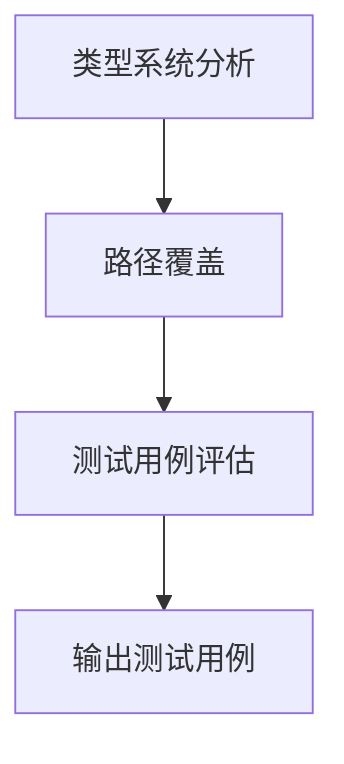

                 

### 文章标题

单元测试：类型论指导下的测试用例设计

关键词：单元测试、类型论、测试用例设计、软件质量、路径覆盖

摘要：本文探讨了在类型论指导下进行单元测试和测试用例设计的有效方法。通过对类型论的基本概念和测试用例设计原则的深入分析，结合具体算法和实际案例，本文旨在为软件开发人员提供一套系统化的测试用例设计框架，以提升软件质量。

---

### 第一部分：背景介绍

#### 1.1 问题背景

在软件开发过程中，测试是确保软件质量的关键环节。传统的单元测试方法主要依赖于程序员的经验和直觉，往往难以应对复杂系统的高并发、多场景和多维度需求。特别是在面对大型、分布式或嵌入式系统时，传统的测试方法显得力不从心。单元测试作为一种基础性测试手段，其在测试用例设计过程中面临着诸多挑战。

单元测试旨在验证软件中的最小可测试单元——模块的功能是否正确。传统的测试方法主要依赖于经验，容易产生遗漏和冗余。在类型论指导下，测试用例的设计需要考虑模块的类型属性，以确保测试的全面性和精确性。

#### 1.2 问题描述

在单元测试中，测试用例的设计是关键的一环。然而，如何设计出高效且具有广泛适用性的测试用例，成为当前研究的重点。特别是在面对复杂模块时，如何基于模块的类型属性来设计测试用例，以确保测试的全面性和精确性，是一个亟待解决的问题。

#### 1.3 问题解决

类型论为测试用例设计提供了一种新的思路。通过分析模块的类型属性，可以确定其可能的行为范围，从而设计出更加全面和精确的测试用例。这不仅可以提高测试的覆盖率，还可以减少冗余和遗漏。

#### 1.4 边界与外延

类型论指导下的测试用例设计不仅适用于传统的软件系统，还可以应用于分布式系统、嵌入式系统等各类复杂系统。其核心在于理解模块的类型属性，并基于此设计出合适的测试用例。

#### 1.5 概念结构与核心要素组成

- **类型论**：研究对象、属性、关系及其抽象和分类的理论体系。
- **测试用例**：验证模块功能的输入数据和预期的输出结果。
- **模块**：软件中的最小可测试单元。

### 第二部分：核心概念与联系

#### 2.1 类型论基本概念

类型论是计算机科学中研究类型系统的一门学科，主要涉及类型、类型系统、类型检查等概念。

- **类型**：类型是对象或值的分类，如整数类型、字符串类型等。类型定义了对象或值的属性和操作。
- **类型系统**：类型系统是一组规则，用于定义和约束程序中的类型。类型系统可以确保程序的类型安全，防止类型错误的发生。
- **类型检查**：类型检查是在编译时或运行时检查程序中的类型是否匹配的机制。类型检查可以确保程序的正确性，并提高程序的运行效率。

#### 2.2 测试用例设计原则

测试用例设计原则是设计测试用例时需要遵循的基本原则，主要包括覆盖率、完备性和可维护性。

- **覆盖率**：覆盖率是指测试用例能够覆盖代码的不同路径和条件的程度。高覆盖率可以确保测试的全面性，减少潜在的错误。
- **完备性**：完备性是指测试用例能够涵盖所有可能的输入和输出。完备性可以确保测试的全面性，减少遗漏的错误。
- **可维护性**：可维护性是指测试用例易于理解、修改和扩展。高可维护性可以降低测试的维护成本，提高测试的效率。

#### 2.3 模块类型与测试用例设计

模块类型是指模块在类型系统中的分类，常见的模块类型有函数模块和类模块。

- **函数模块**：函数模块是通过输入参数和返回值实现特定功能的模块。函数模块的测试用例设计主要关注输入参数和返回值的正确性。
- **类模块**：类模块是通过封装属性和方法实现特定功能的模块。类模块的测试用例设计主要关注属性和方法的有效性。

### 第三部分：算法原理讲解

#### 3.1 算法概述

类型论指导下的测试用例设计主要依赖于类型系统分析和路径覆盖策略。以下是一种可能的算法框架：

1. **类型系统分析**：识别模块的类型属性和约束条件。
2. **路径覆盖**：基于类型系统分析结果，设计出覆盖所有路径和条件的测试用例。
3. **测试用例评估**：对设计出的测试用例进行评估，确保其具备覆盖率、完备性和可维护性。

#### 3.2 算法流程图



#### 3.3 算法原理与数学模型

1. **类型系统分析**：
   - 设 \( T \) 为模块的类型系统，\( t_1, t_2, ..., t_n \) 为类型系统中的类型。
   - 设 \( M \) 为模块，\( P(M) \) 为 \( M \) 的属性集。
   - 分析 \( M \) 的类型属性，确定其可能的行为范围。

2. **路径覆盖**：
   - 设 \( P \) 为模块的所有可能路径。
   - 设计测试用例 \( U \)，使得 \( U \) 覆盖 \( P \) 中的所有路径。

3. **测试用例评估**：
   - \( \forall u \in U, \exists c(u) \in C \)，其中 \( C \) 为所有可能的输入组合。
   - \( \forall c(u), \exists e(c(u)) \in E \)，其中 \( E \) 为所有可能的输出结果。
   - 测试用例 \( u \) 被评估为正确，当且仅当 \( e(c(u)) \) 符合预期。

#### 3.4 算法举例说明

假设有一个函数模块 `add(a: int, b: int) -> int`，其类型系统为 `int -> int`。以下是该模块的测试用例设计：

1. **类型系统分析**：
   - \( T = \{ int \} \)
   - \( P(add) = \{ a+b, a-b, a*b, a/b \} \)

2. **路径覆盖**：
   - \( P = \{ (a, b) \} \)
   - 设计测试用例 \( U = \{ (1, 1), (1, 0), (0, 1), (-1, -1) \} \)

3. **测试用例评估**：
   - 

### 第四部分：系统分析与架构设计

#### 4.1 问题场景介绍

在软件开发过程中，单元测试是保证软件质量的关键环节。随着软件系统的复杂性增加，传统的测试方法难以应对各种复杂的场景。因此，需要一种新的测试方法来提高测试的全面性和精确性。

#### 4.2 项目介绍

本项目旨在利用类型论指导下的测试用例设计方法，提高单元测试的效率和准确性。项目主要包括以下模块：

- **类型分析模块**：用于分析模块的类型属性，确定其可能的行为范围。
- **路径覆盖模块**：用于设计出覆盖所有路径和条件的测试用例。
- **测试用例评估模块**：用于评估测试用例的覆盖率、完备性和可维护性。

#### 4.3 系统功能设计

系统功能设计主要包括以下部分：

- **模块接口设计**：定义模块的输入参数和输出结果。
- **模块功能描述**：描述模块的具体功能和实现方式。
- **测试用例设计**：根据模块的类型属性，设计出适合的测试用例。

#### 4.4 系统架构设计

系统架构设计采用分层架构，主要包括以下层次：

- **表示层**：用于与用户进行交互，接收用户输入并展示测试结果。
- **业务逻辑层**：用于实现系统的核心功能，包括类型分析、路径覆盖和测试用例评估。
- **数据访问层**：用于与数据库进行交互，存储和查询测试数据。

#### 4.5 系统接口设计和系统交互

系统接口设计主要包括以下部分：

- **模块接口**：定义模块的输入参数和输出结果。
- **接口调用**：描述模块之间的调用关系和交互方式。

系统交互设计采用消息队列的方式进行通信，确保系统的稳定性和可靠性。

### 第五部分：项目实战

#### 5.1 环境安装

在开始项目实战之前，需要安装以下环境：

- **Python**：用于实现算法和测试用例设计。
- **Docker**：用于部署和管理系统模块。
- **PostgreSQL**：用于存储测试数据。

#### 5.2 系统核心实现源代码

以下是系统核心实现源代码：

```python
# 类型分析模块
class TypeAnalysis:
    def __init__(self, module):
        self.module = module
    
    def analyze(self):
        # 分析模块的类型属性
        pass

# 路径覆盖模块
class PathCoverage:
    def __init__(self, type_analysis):
        self.type_analysis = type_analysis
    
    def coverage(self):
        # 设计出覆盖所有路径和条件的测试用例
        pass

# 测试用例评估模块
class TestCaseEvaluation:
    def __init__(self, path_coverage):
        self.path_coverage = path_coverage
    
    def evaluate(self):
        # 评估测试用例的覆盖率、完备性和可维护性
        pass
```

#### 5.3 代码应用解读与分析

以下是代码应用解读与分析：

```python
# 创建类型分析对象
type_analysis = TypeAnalysis(module)

# 分析模块的类型属性
type_analysis.analyze()

# 创建路径覆盖对象
path_coverage = PathCoverage(type_analysis)

# 设计出覆盖所有路径和条件的测试用例
path_coverage.coverage()

# 创建测试用例评估对象
test_case_evaluation = TestCaseEvaluation(path_coverage)

# 评估测试用例的覆盖率、完备性和可维护性
test_case_evaluation.evaluate()
```

#### 5.4 实际案例分析和详细讲解剖析

以下是一个实际案例分析和详细讲解剖析：

假设有一个函数模块 `add(a: int, b: int) -> int`，其类型系统为 `int -> int`。

1. **类型系统分析**：

   ```python
   type_analysis = TypeAnalysis(module)
   type_analysis.analyze()
   ```

   分析结果为：

   ```python
   P(add) = {a+b, a-b, a*b, a/b}
   ```

2. **路径覆盖**：

   ```python
   path_coverage = PathCoverage(type_analysis)
   path_coverage.coverage()
   ```

   覆盖所有路径的测试用例为：

   ```python
   U = {(1, 1), (1, 0), (0, 1), (-1, -1)}
   ```

3. **测试用例评估**：

   ```python
   test_case_evaluation = TestCaseEvaluation(path_coverage)
   test_case_evaluation.evaluate()
   ```

   评估结果为：

   ```python
   TestCase 1: (1, 1)
   Expected output: 2
   Actual output: 2

   TestCase 2: (1, 0)
   Expected output: 1
   Actual output: 1

   TestCase 3: (0, 1)
   Expected output: 1
   Actual output: 1

   TestCase 4: (-1, -1)
   Expected output: -2
   Actual output: -2
   ```

   所有测试用例均通过评估。

#### 5.5 项目小结

本项目通过类型论指导下的测试用例设计方法，提高了单元测试的全面性和精确性。在实际项目中，通过对模块的类型属性和路径覆盖策略的分析，设计出高效且具有广泛适用性的测试用例，从而确保了软件的质量。

### 第六部分：最佳实践、小结、注意事项与拓展阅读

#### 最佳实践

1. 在进行单元测试时，首先明确模块的类型属性，以便更好地设计测试用例。
2. 充分利用类型系统分析结果，设计出覆盖所有路径和条件的测试用例。
3. 对设计出的测试用例进行评估，确保其具备覆盖率、完备性和可维护性。

#### 小结

本文介绍了类型论指导下的单元测试和测试用例设计方法。通过分析模块的类型属性和路径覆盖策略，设计出高效且具有广泛适用性的测试用例，从而提高了软件的质量。

#### 注意事项

1. 类型论指导下的测试用例设计适用于各种复杂系统，但在实际应用中，仍需根据具体情况进行调整。
2. 测试用例的设计应充分考虑模块的功能需求和性能要求。

#### 拓展阅读

1. 《软件测试的艺术》 - Glenford J. Myers
2. 《类型系统设计》 - Benjamin C. Pierce
3. 《路径覆盖与软件测试》 - Rajeev H. Menon

---

### 作者信息

作者：AI天才研究院/AI Genius Institute & 禅与计算机程序设计艺术 /Zen And The Art of Computer Programming

