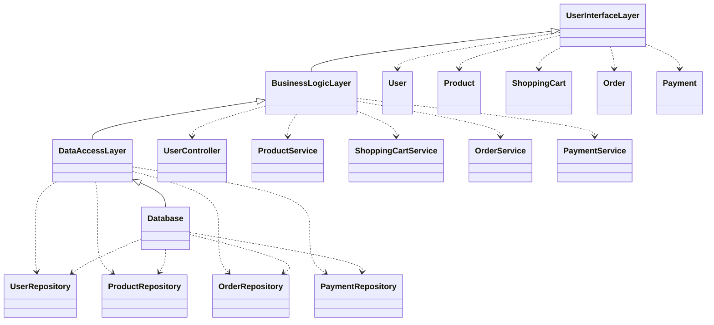
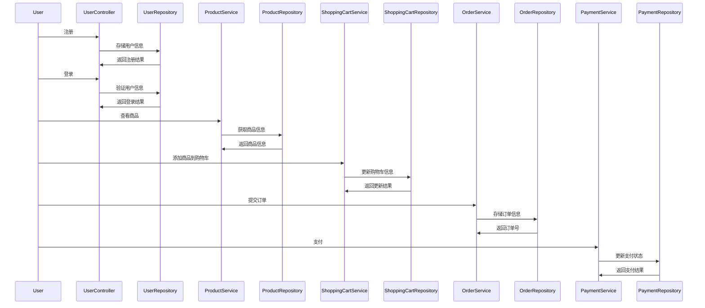
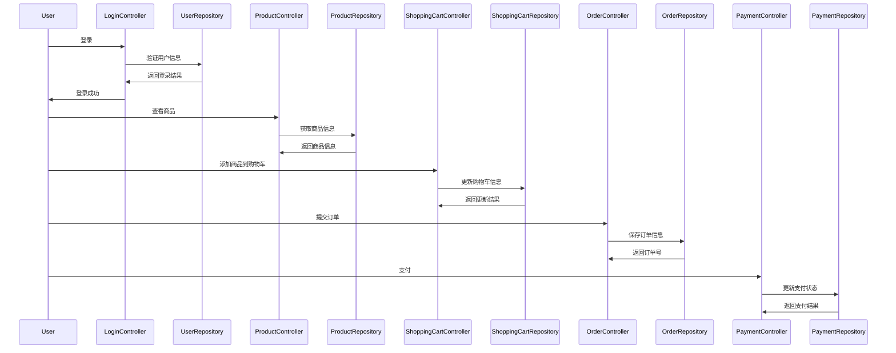

                 

### 文章标题

# 单元测试：提高代码质量的第一道防线

单元测试作为软件开发过程中不可或缺的一环，一直被广大开发者所重视。然而，很多人对单元测试的理解仍然停留在表面，没有深入挖掘其背后的原理和作用。本文将围绕单元测试的概念、重要性、编写方法、实践应用等方面进行详细探讨，旨在帮助开发者更好地理解单元测试，并将其作为提高代码质量的第一道防线。

### 关键词

- 单元测试
- 代码质量
- 测试用例
- 测试覆盖率
- 持续集成

### 摘要

本文从单元测试的基本概念入手，详细介绍了单元测试的定义、重要性以及与代码质量的关系。接着，文章分析了单元测试的理论基础，包括测试用例设计方法、测试覆盖率和测试用例执行。随后，文章探讨了单元测试在实践中的应用，包括测试工具、编写有效的单元测试、最佳实践以及项目实战。最后，文章展望了单元测试的未来趋势，并给出了相关建议。希望通过本文的阅读，开发者能够对单元测试有更深刻的认识，从而在软件开发过程中更好地利用单元测试提高代码质量。

### 第1章：单元测试的基本概念

#### 1.1 单元测试的重要性

单元测试（Unit Testing）是软件开发过程中的一项基本活动，旨在验证软件模块或函数是否按照预期工作。它的重要性体现在以下几个方面：

1. **提高代码质量**：通过单元测试，可以确保代码的正确性和可靠性，减少由于代码缺陷导致的bug。
2. **快速反馈**：单元测试可以快速发现代码中的问题，帮助开发者及时修复，避免问题积累。
3. **代码重构**：单元测试为代码重构提供了安全网，使得开发者可以大胆地进行代码重构，而不用担心引入新的错误。
4. **促进团队协作**：单元测试鼓励团队成员共同参与测试，提高代码的可维护性和可理解性。

#### 1.2 单元测试与代码质量的关系

单元测试是保证代码质量的重要手段之一。高质量的代码不仅意味着没有明显的错误，还包括代码的可读性、可维护性和可扩展性。单元测试在这个过程中发挥着至关重要的作用：

1. **早期发现缺陷**：单元测试可以在开发初期就发现并修复代码中的缺陷，避免缺陷积累到后期导致更大的问题。
2. **代码重构保障**：单元测试可以确保在重构过程中不会破坏现有功能，提高代码的可维护性。
3. **提高测试覆盖率**：通过单元测试，可以覆盖代码的各个角落，确保代码的每一个功能点都被测试到，从而提高代码质量。

#### 1.3 单元测试的常见误区

尽管单元测试的重要性被广泛认可，但在实际开发过程中，仍然存在一些常见的误区：

1. **过度依赖单元测试**：虽然单元测试是重要的，但不应过度依赖。代码的完整性和正确性还需要结合其他测试方法，如集成测试和系统测试。
2. **忽略边界条件**：单元测试不仅要覆盖正常情况，还要覆盖边界条件和异常情况，以确保代码在各种情况下都能正确工作。
3. **缺乏测试覆盖**：开发者可能会编写很少的测试用例，导致测试覆盖率不足，无法全面检测代码中的潜在问题。

为了更好地理解单元测试的概念和作用，我们需要从以下几个方面进行深入探讨：

1. **单元测试的定义**：单元测试是针对软件中最小的可测试单元（通常是函数或方法）进行的测试。
2. **单元测试的目的**：确保单元按照设计要求正确执行，发现并修复单元中的缺陷。
3. **单元测试的过程**：编写测试用例、执行测试用例、分析测试结果。
4. **单元测试的优势**：快速、高效、低成本、易于自动化等。

### 1.4 单元测试的理论基础

单元测试不仅仅是一种实践，还具有一定的理论基础。以下是单元测试的几个关键概念：

#### 测试用例设计方法

测试用例设计是单元测试的核心，以下是一些常用的测试用例设计方法：

1. **等价类划分**：将输入数据分为多个等价类，每个等价类设计一个测试用例。
2. **边界值分析**：针对输入和输出的边界值设计测试用例，确保边界条件被覆盖。
3. **因果图**：根据输入和输出之间的因果关系设计测试用例。
4. **状态图**：根据系统状态和转换设计测试用例。

#### 测试覆盖率

测试覆盖率是衡量测试效果的重要指标，常见的测试覆盖率包括：

1. **语句覆盖率**：至少执行每条语句一次。
2. **分支覆盖率**：至少执行每个分支一次。
3. **路径覆盖率**：至少执行每条路径一次。
4. **功能覆盖率**：确保所有功能都被测试到。

#### 测试用例执行

测试用例执行是单元测试的关键步骤，以下是一些关键点：

1. **自动化执行**：使用自动化工具执行测试用例，提高测试效率。
2. **持续执行**：在开发过程中持续执行测试用例，及时发现并修复问题。
3. **结果分析**：对测试结果进行分析，确保所有问题都被解决。

### 1.5 单元测试工具

在单元测试过程中，选择合适的测试工具至关重要。以下是一些常用的单元测试工具：

1. **JUnit**：Java语言的单元测试框架，支持各种测试方法和测试用例设计。
2. **TestNG**：另一种流行的Java单元测试框架，提供了更丰富的测试功能。
3. **NUnit**：.NET语言的单元测试框架，与JUnit类似，功能强大。
4. **Mock对象**：用于模拟复杂系统中的依赖关系，提高测试的独立性和可复用性。

### 1.6 单元测试的优势

单元测试的优势体现在多个方面：

1. **早期缺陷发现**：通过早期发现缺陷，减少修复成本。
2. **提高代码质量**：确保代码的正确性和可靠性，提高代码的可维护性。
3. **促进团队协作**：鼓励团队成员共同参与测试，提高代码的可理解性和可维护性。
4. **提高开发效率**：自动化测试用例执行，提高开发效率。

### 1.7 单元测试的最佳实践

为了充分利用单元测试的优势，以下是一些最佳实践：

1. **编写明确的测试用例**：确保测试用例能够清晰地描述测试目的和预期结果。
2. **持续执行测试**：在开发过程中持续执行测试，确保问题及时被发现和修复。
3. **自动化测试**：使用自动化工具执行测试用例，提高测试效率。
4. **保持测试覆盖率**：确保测试覆盖率达到一定标准，覆盖代码的各个角落。

### 1.8 总结

单元测试是提高代码质量的第一道防线，通过早期缺陷发现、提高代码质量、促进团队协作和优化开发效率，单元测试在软件开发过程中发挥着重要作用。开发者应重视单元测试，掌握单元测试的理论基础和最佳实践，并将其应用到实际开发中。

### 第2章：单元测试的理论基础

#### 2.1 测试用例设计方法

测试用例设计是单元测试的核心环节，它决定了测试能否有效地发现缺陷。以下是一些常用的测试用例设计方法：

##### 1. 等价类划分

等价类划分是一种基于输入数据的测试用例设计方法，其核心思想是将输入数据分为多个等价类，每个等价类设计一个测试用例。具体步骤如下：

1. **确定等价类**：根据输入条件和预期结果，将输入数据分为多个等价类。
2. **设计测试用例**：对每个等价类设计一个测试用例，确保每个等价类至少被测试一次。

##### 2. 边界值分析

边界值分析是一种基于输入和输出边界的测试用例设计方法，其核心思想是测试输入和输出的边界条件。具体步骤如下：

1. **确定边界条件**：根据输入和输出的边界值，确定需要测试的边界条件。
2. **设计测试用例**：对每个边界条件设计一个测试用例，确保边界条件被充分测试。

##### 3. 因果图

因果图是一种基于输入和输出之间因果关系的测试用例设计方法，其核心思想是分析输入和输出之间的因果关系，设计相应的测试用例。具体步骤如下：

1. **绘制因果图**：根据输入和输出之间的关系，绘制因果图。
2. **设计测试用例**：根据因果图，设计能够覆盖所有因果关系的测试用例。

##### 4. 状态图

状态图是一种基于系统状态的测试用例设计方法，其核心思想是分析系统的状态转换，设计相应的测试用例。具体步骤如下：

1. **绘制状态图**：根据系统的状态转换，绘制状态图。
2. **设计测试用例**：根据状态图，设计能够覆盖所有状态转换的测试用例。

#### 2.2 测试覆盖率

测试覆盖率是衡量测试效果的重要指标，它反映了测试用例对代码的覆盖程度。以下是一些常见的测试覆盖率：

##### 1. 语句覆盖率

语句覆盖率是指测试用例执行的代码行数与总代码行数的比值，公式如下：

$$
\text{语句覆盖率} = \frac{\text{执行到的代码行数}}{\text{总代码行数}} \times 100\%
$$

##### 2. 分支覆盖率

分支覆盖率是指测试用例执行的分支数与总分支数的比值，公式如下：

$$
\text{分支覆盖率} = \frac{\text{执行到的分支数}}{\text{总分支数}} \times 100\%
$$

##### 3. 路径覆盖率

路径覆盖率是指测试用例执行的路径数与总路径数的比值，公式如下：

$$
\text{路径覆盖率} = \frac{\text{执行到的路径数}}{\text{总路径数}} \times 100\%
$$

##### 4. 功能覆盖率

功能覆盖率是指测试用例覆盖到的功能点与总功能点的比值，公式如下：

$$
\text{功能覆盖率} = \frac{\text{覆盖到的功能点数}}{\text{总功能点数}} \times 100\%
$$

#### 2.3 测试用例执行

测试用例执行是单元测试的关键步骤，它决定了测试能否有效地发现缺陷。以下是一些关键点：

##### 1. 自动化执行

自动化执行可以提高测试效率，减少人工干预。常用的自动化测试工具有JUnit、TestNG等。

##### 2. 持续执行

持续执行测试用例，可以在开发过程中及时发现并修复问题。这通常需要与持续集成工具（如Jenkins）结合使用。

##### 3. 结果分析

对测试结果进行分析，可以确定哪些代码没有被覆盖到，哪些问题需要修复。常用的分析工具包括代码覆盖率分析工具等。

### 2.4 单元测试与代码质量的关系

单元测试与代码质量密切相关，以下是从几个方面分析单元测试与代码质量的关系：

##### 1. 早期缺陷发现

通过单元测试，可以早期发现代码中的缺陷，避免缺陷积累到后期导致更大的问题。这有助于提高代码质量。

##### 2. 提高代码可维护性

通过单元测试，可以确保代码的正确性和可靠性，提高代码的可维护性。这有助于提高代码质量。

##### 3. 促进团队协作

单元测试鼓励团队成员共同参与测试，提高代码的可理解性和可维护性。这有助于提高代码质量。

##### 4. 提高开发效率

单元测试可以自动化执行，提高测试效率。这有助于提高开发效率，从而间接提高代码质量。

### 2.5 单元测试的最佳实践

为了充分利用单元测试的优势，以下是一些最佳实践：

##### 1. 编写清晰的测试用例

确保测试用例能够清晰地描述测试目的和预期结果，方便后续分析和维护。

##### 2. 持续执行测试用例

在开发过程中持续执行测试用例，确保问题及时被发现和修复。

##### 3. 保持合适的测试覆盖率

确保测试覆盖率达到一定标准，覆盖代码的各个角落。

##### 4. 结合其他测试方法

单元测试虽然重要，但不能完全依赖。还需要结合其他测试方法（如集成测试、系统测试等），确保代码的完整性和正确性。

### 2.6 单元测试的挑战和机遇

虽然单元测试在软件开发过程中发挥着重要作用，但仍然面临一些挑战：

##### 1. 测试用例设计难度

编写高质量的测试用例需要一定的技巧和经验，这对于新手开发者来说可能是一个挑战。

##### 2. 测试覆盖率不足

有时，开发者可能为了追求开发进度，而忽略了测试覆盖率，导致测试效果不佳。

##### 3. 测试执行效率

自动化测试虽然可以提高测试效率，但测试用例的编写、执行和结果分析仍然需要大量时间。

然而，随着技术的发展，单元测试也面临着一些机遇：

##### 1. 测试自动化工具的进步

随着测试自动化工具的不断进步，测试用例的编写和执行效率得到了显著提高。

##### 2. 持续集成的普及

持续集成工具的普及，使得单元测试可以在开发过程中持续执行，确保问题及时被发现和修复。

##### 3. 人工智能在测试领域的应用

人工智能在测试领域的应用，如智能测试用例生成、缺陷预测等，为单元测试带来了新的机遇。

### 2.7 总结

单元测试的理论基础包括测试用例设计方法、测试覆盖率和测试用例执行。单元测试与代码质量密切相关，通过早期缺陷发现、提高代码可维护性、促进团队协作和提高开发效率，单元测试在软件开发过程中发挥着重要作用。开发者应掌握单元测试的理论基础，并结合最佳实践，充分利用单元测试的优势，提高代码质量。

### 第3章：单元测试工具

在单元测试过程中，选择合适的测试工具至关重要。这些工具可以帮助开发者高效地编写、执行和跟踪测试用例，提高测试覆盖率，确保代码质量。以下是几种常用的单元测试工具及其特点：

#### 3.1 JUnit

JUnit是Java语言中最流行的单元测试框架，由Eclipse基金会维护。它支持多种测试方法，如测试类、测试方法和测试用例。JUnit的测试结果可以通过断言（Assert）方法进行验证，支持多种断言库，如AssertJ和Hamcrest。

- **特点**：
  - 简单易用
  - 支持多种断言库
  - 内置测试运行器和报告器
  - 可以与其他测试框架集成，如Selenium和TestNG

- **安装**：
  - 通过Maven或Gradle添加依赖：
    ```xml
    <dependency>
      <groupId>junit</groupId>
      <artifactId>junit</artifactId>
      <version>4.13.2</version>
      <scope>test</scope>
    </dependency>
    ```

- **使用示例**：

```java
import org.junit.jupiter.api.Test;
import static org.junit.jupiter.api.Assertions.assertEquals;

public class CalculatorTest {

    @Test
    public void testAddition() {
        Calculator calculator = new Calculator();
        int result = calculator.add(5, 3);
        assertEquals(8, result, "5 + 3 应该等于 8");
    }
}
```

#### 3.2 TestNG

TestNG是另一种流行的Java单元测试框架，提供了比JUnit更丰富的功能。TestNG支持多种测试类型，如单元测试、集成测试和端到端测试，并支持并行测试和多线程测试。

- **特点**：
  - 支持数据驱动测试
  - 强大的测试配置功能
  - 支持多线程测试
  - 内置报告生成器

- **安装**：
  - 通过Maven或Gradle添加依赖：
    ```xml
    <dependency>
      <groupId>org.testng</groupId>
      <artifactId>testng</artifactId>
      <version>7.4.0</version>
      <scope>test</scope>
    </dependency>
    ```

- **使用示例**：

```java
import org.testng.annotations.Test;
import static org.testng.Assert.assertEquals;

public class CalculatorTest {

    @Test
    public void testAddition() {
        Calculator calculator = new Calculator();
        int result = calculator.add(5, 3);
        assertEquals(8, result, "5 + 3 应该等于 8");
    }
}
```

#### 3.3 NUnit

NUnit是.NET语言的单元测试框架，由NUnit项目维护。它支持多种测试方法和测试类型，并提供了丰富的测试报告功能。

- **特点**：
  - 简单易用
  - 支持数据驱动测试
  - 内置测试运行器和报告器
  - 可以与其他测试框架集成

- **安装**：
  - 通过NuGet添加依赖：
    ```shell
    Install-Package NUnit
    ```

- **使用示例**：

```csharp
using NUnit.Framework;
using MyLibrary;

public class CalculatorTest {

    [Test]
    public void TestAddition() {
        Calculator calculator = new Calculator();
        int result = calculator.Add(5, 3);
        Assert.AreEqual(8, result, "5 + 3 应该等于 8");
    }
}
```

#### 3.4 Mock对象

Mock对象是一种用于模拟复杂系统依赖关系的测试工具，它可以模拟系统的行为，使得测试更加独立和可复用。Mock对象常用于单元测试中，以隔离被测试组件的依赖关系。

- **特点**：
  - 模拟复杂系统的行为
  - 隔离被测试组件的依赖关系
  - 提高测试的独立性和可复用性

- **安装**：
  - JMockit（Java）：
    ```xml
    <dependency>
      <groupId>org.jmockit</groupId>
      <artifactId>jmockit</artifactId>
      <version>4.36</version>
      <scope>test</scope>
    </dependency>
    ```
  - Moq（.NET）：
    ```xml
    <dependency>
      <groupId>Moq</groupId>
      <artifactId>Moq</artifactId>
      <version>4.17.0</version>
      <scope>test</scope>
    </dependency>
    ```

- **使用示例**（Java，使用JMockit）：

```java
import mockit.Expectations;
import mockit.Mocked;
import static org.junit.jupiter.api.Assertions.assertEquals;

public class UserServiceTest {

    @Test
    public void testLogin(@Mocked final UserRepository userRepository) {
        new Expectations() {{
            userRepository.findByUsername("user123");
            result = new User("user123", "password123");
        }};

        UserService userService = new UserService(userRepository);
        User user = userService.login("user123", "password123");
        assertEquals("user123", user.getUsername(), "登录成功后，用户名应匹配");
    }
}
```

通过上述示例，我们可以看到JUnit、TestNG和NUnit等单元测试工具的安装和使用方法。这些工具在单元测试过程中发挥着重要作用，可以提高测试效率，确保代码质量。同时，Mock对象作为单元测试中的关键工具，可以模拟复杂系统的行为，提高测试的独立性和可复用性。开发者应根据实际需求选择合适的单元测试工具，并将其应用到项目中，以充分发挥单元测试的优势。

### 第4章：编写有效的单元测试

编写有效的单元测试是确保代码质量的关键。一个有效的单元测试不仅要能发现代码中的错误，还要简洁、清晰，易于理解和维护。以下是一些编写有效单元测试的原则和方法。

#### 4.1 测试用例编写原则

1. **单一测试用例原则**：每个测试用例只测试一个特定的功能点，确保测试用例的独立性和可复用性。
2. **预期结果原则**：每个测试用例都应该明确指定预期结果，以便于测试执行后与实际结果进行比较。
3. **边界值原则**：测试用例应覆盖输入和输出的边界值，确保代码在边界条件下也能正确执行。
4. **异常处理原则**：测试用例应包括对异常情况的测试，确保代码在异常情况下能够优雅地处理。
5. **可读性原则**：测试用例的命名和描述应简洁、清晰，便于理解和维护。

#### 4.2 测试数据管理

测试数据管理是编写有效单元测试的重要环节。以下是一些测试数据管理的最佳实践：

1. **使用测试数据集**：为每个测试用例准备一组测试数据，确保测试用例的覆盖范围。
2. **数据隔离原则**：确保测试数据不会影响生产数据，可以使用数据库隔离或模拟数据。
3. **数据配置管理**：测试数据应与代码分离，以便于在不同的环境中使用。
4. **数据重复使用**：复用已定义的测试数据，减少重复编写工作。

#### 4.3 异常处理

异常处理是编写有效单元测试的一个重要方面。以下是一些关于异常处理的建议：

1. **预期异常**：对于已知可能发生的异常，应在测试用例中预期并验证异常的正确处理。
2. **非预期异常**：测试用例应包括对非预期异常的测试，确保代码在非预期情况下也能正确处理。
3. **错误信息验证**：验证异常抛出的错误信息是否完整、准确，有助于问题的快速定位和修复。

#### 4.4 测试用例编写示例

以下是一个简单的Java示例，展示了如何编写一个有效的单元测试：

```java
import org.junit.jupiter.api.Test;
import static org.junit.jupiter.api.Assertions.*;

public class CalculatorTest {

    @Test
    public void testAdd() {
        Calculator calculator = new Calculator();
        int result = calculator.add(5, 3);
        assertEquals(8, result, "5 + 3 应该等于 8");
    }

    @Test
    public void testSubtract() {
        Calculator calculator = new Calculator();
        int result = calculator.subtract(5, 3);
        assertEquals(2, result, "5 - 3 应该等于 2");
    }

    @Test
    public void testMultiply() {
        Calculator calculator = new Calculator();
        int result = calculator.multiply(5, 3);
        assertEquals(15, result, "5 * 3 应该等于 15");
    }

    @Test
    public void testDivide() {
        Calculator calculator = new Calculator();
        int result = calculator.divide(6, 3);
        assertEquals(2, result, "6 / 3 应该等于 2");
    }

    @Test
    public void testDivideByZero() {
        Calculator calculator = new Calculator();
        assertThrows(ArithmeticException.class, () -> calculator.divide(5, 0), "除以零应该抛出异常");
    }
}
```

在这个示例中，我们为`Calculator`类中的四个基本运算方法（`add`、`subtract`、`multiply`和`divide`）编写了单元测试。每个测试用例都包含了预期结果，并使用了`assertEquals`方法进行比较。此外，我们还编写了一个测试用例来验证除以零的错误处理，使用了`assertThrows`方法来验证异常的抛出。

#### 4.5 测试用例模板

以下是一个简单的测试用例模板，可以用于编写各种类型的单元测试：

```
测试用例名称：[功能点名称]_测试

描述：
[简要描述测试用例的目的和预期结果]

输入参数：
- 参数1：[参数描述]
- 参数2：[参数描述]
- ...

预期结果：
- 结果1：[预期结果1]
- 结果2：[预期结果2]
- ...

实际结果：
[执行测试用例后的实际结果]

结论：
[测试结果是否符合预期，以及是否需要进一步分析或修复]

```

通过遵循上述编写原则和最佳实践，开发者可以编写出高效、可靠的单元测试，从而提高代码质量。同时，良好的测试数据管理和异常处理也是确保测试用例有效性的重要因素。

### 第5章：单元测试的最佳实践

在软件开发过程中，单元测试不仅是一种验证手段，更是提高代码质量和促进团队协作的重要手段。以下是一些单元测试的最佳实践，这些实践可以帮助开发者编写高效、可靠的测试代码，确保软件系统的稳定性和可维护性。

#### 5.1 测试驱动开发（TDD）

测试驱动开发（Test-Driven Development，简称TDD）是一种软件开发方法，强调先编写测试用例，再编写实际代码。这种方法有助于确保代码的健壮性和可靠性，以下是TDD的主要步骤：

1. **编写测试**：首先编写一个测试用例，用于验证预期的功能或行为。
2. **运行测试**：运行测试用例，确保测试失败。
3. **编写代码**：编写实际代码，使其通过测试用例。
4. **重构代码**：优化代码，使其满足测试要求，同时保持代码的可读性和可维护性。

TDD的主要优点包括：

- **早期缺陷发现**：通过编写测试用例，可以早期发现潜在的缺陷，避免问题积累。
- **提高代码质量**：编写测试用例迫使开发者考虑代码的各个细节，从而提高代码的质量。
- **代码重构支持**：TDD鼓励代码重构，使得开发者可以大胆地进行代码重构，而不担心引入新的错误。

#### 5.2 测试覆盖率优化

测试覆盖率是衡量测试效果的重要指标，它反映了测试用例对代码的覆盖程度。以下是一些优化测试覆盖率的方法：

1. **逐步提高测试覆盖率**：在开发过程中，逐步提高测试覆盖率，确保代码的各个角落都被测试到。
2. **使用代码覆盖率工具**：使用代码覆盖率工具（如JaCoCo、Emma等）分析测试覆盖率，识别未被覆盖的代码部分。
3. **覆盖边界值和异常情况**：确保测试用例覆盖边界值和异常情况，这些是代码中潜在缺陷的高发区域。
4. **复用测试用例**：复用已有测试用例，减少重复工作，提高测试效率。

#### 5.3 测试可持续性

测试可持续性是指测试工作能否在项目开发的不同阶段持续进行。以下是一些确保测试可持续性的方法：

1. **自动化测试**：将测试用例自动化，使其能够快速执行，确保测试工作可以持续进行。
2. **持续集成**：将测试集成到持续集成（Continuous Integration，简称CI）过程中，确保每次代码提交都经过测试。
3. **测试环境管理**：确保测试环境的稳定性和可复用性，减少因环境问题导致测试失败的情况。
4. **测试反馈机制**：建立有效的测试反馈机制，确保测试结果能够及时反馈给开发团队，问题能够迅速解决。

#### 5.4 编写清晰且可维护的测试用例

编写清晰且可维护的测试用例是确保单元测试有效性的基础。以下是一些编写测试用例的建议：

1. **明确测试目的**：每个测试用例都应该有一个明确的测试目的，确保测试用例的针对性。
2. **简洁且清晰的描述**：使用简洁、清晰的语言描述测试用例的目的和预期结果，确保其他人可以轻松理解。
3. **合理的测试数据**：为测试用例准备合理的测试数据，确保测试用例的有效性和可复用性。
4. **维护测试用例**：定期更新测试用例，确保测试用例与实际代码一致，避免因代码变更导致测试用例失效。

#### 5.5 测试代码的维护

测试代码的维护是确保测试持续有效的重要环节。以下是一些测试代码维护的最佳实践：

1. **代码审查**：定期进行代码审查，确保测试代码的质量和可读性。
2. **持续重构**：对测试代码进行持续重构，优化代码结构，提高可维护性。
3. **测试覆盖率监控**：监控测试覆盖率的变化，确保测试覆盖率的稳定性和提升。
4. **自动化测试用例管理**：使用自动化工具管理测试用例，提高测试执行效率。

通过遵循上述最佳实践，开发者可以编写出高效、可靠的单元测试，从而提高代码质量，促进团队协作，确保软件系统的稳定性和可维护性。

### 第6章：单元测试在项目中的应用

在软件开发项目中，单元测试不仅是确保代码质量的重要手段，更是保证项目顺利进展的保障。本章节将详细讨论单元测试在项目中的应用，包括项目背景、系统功能设计、系统架构设计、系统接口设计和系统交互设计等内容。

#### 6.1 项目背景

为了更好地理解单元测试在项目中的应用，我们首先需要了解项目的基本情况。假设我们正在开发一个电子商务平台，该平台需要实现用户注册、商品浏览、购物车管理、订单管理和支付等功能。

#### 6.2 系统功能设计

系统功能设计是项目开发的第一步，也是单元测试的关键起点。以下是电子商务平台的主要功能模块及其简要描述：

1. **用户注册与登录**：用户可以注册账号并登录系统，系统需要验证用户输入的用户名和密码。
2. **商品浏览**：用户可以浏览不同分类的商品，查看商品详情。
3. **购物车管理**：用户可以将商品添加到购物车，对购物车中的商品进行修改和删除。
4. **订单管理**：用户可以提交订单，系统需要处理订单并生成订单号。
5. **支付管理**：用户可以选择支付方式，进行支付操作，系统需要处理支付结果并更新订单状态。
6. **用户反馈**：用户可以对商品或服务进行评价和反馈，系统需要记录并处理用户反馈。

#### 6.3 系统架构设计

系统架构设计决定了系统的整体结构和各个模块之间的关系。以下是电子商务平台的系统架构设计：

1. **用户界面层**：包括前端页面，负责与用户交互，展示商品信息、处理用户操作等。
2. **业务逻辑层**：包括后端服务，负责处理用户请求，如用户注册、登录、商品浏览、购物车管理、订单处理等。
3. **数据访问层**：负责与数据库进行交互，实现数据的增删改查操作。
4. **数据库**：存储用户信息、商品信息、订单信息和支付信息等。

以下是系统架构的Mermaid类图：



#### 6.4 系统接口设计

系统接口设计定义了各个模块之间的交互方式。以下是电子商务平台的主要接口设计：

1. **用户接口（UserController）**：提供用户注册、登录、查看个人信息等功能。
2. **商品接口（ProductService）**：提供商品浏览、添加商品到购物车等功能。
3. **购物车接口（ShoppingCartService）**：提供添加商品到购物车、修改购物车中的商品、删除购物车中的商品等功能。
4. **订单接口（OrderService）**：提供提交订单、查看订单状态等功能。
5. **支付接口（PaymentService）**：提供支付操作、处理支付结果等功能。

以下是系统接口的Mermaid序列图：



#### 6.5 系统交互设计

系统交互设计详细描述了用户与系统之间的交互过程。以下是电子商务平台的系统交互设计：

1. **用户注册**：用户在登录页面填写用户名、密码和邮箱等信息，提交注册请求，系统验证用户信息并创建用户账号。
2. **用户登录**：用户在登录页面输入用户名和密码，系统验证用户信息并生成会话。
3. **商品浏览**：用户在商品分类页面选择商品，系统展示商品信息，包括商品名称、描述、价格等。
4. **购物车管理**：用户可以将商品添加到购物车，修改购物车中的商品数量，删除购物车中的商品。
5. **订单提交**：用户在购物车页面提交订单，系统生成订单号并保存订单信息。
6. **支付操作**：用户选择支付方式，进行支付操作，系统处理支付结果并更新订单状态。

以下是系统交互的Mermaid序列图：



通过上述系统功能设计、系统架构设计、系统接口设计和系统交互设计，我们可以清晰地了解电子商务平台的基本结构和功能。单元测试将贯穿于整个项目开发过程中，确保每个模块和功能点都经过严格的测试，从而提高代码质量，保证项目的成功交付。

### 第7章：单元测试案例分析

在实际项目中，单元测试的应用至关重要。为了更好地理解单元测试的具体实施方法和效果，以下通过三个实际案例来详细分析单元测试在登录模块、购物车模块和订单模块中的应用。

#### 7.1 登录模块测试

**案例背景**：登录模块是电子商务平台的核心功能之一，用户需要通过输入用户名和密码进行登录，系统需要验证用户身份并生成会话。

**测试用例设计**：
- **正常登录测试**：输入正确的用户名和密码，系统应能成功登录并生成会话。
- **用户名不存在测试**：输入不存在的用户名，系统应提示用户名不存在。
- **密码错误测试**：输入正确的用户名和错误的密码，系统应提示密码错误。
- **用户名和密码为空测试**：用户名和密码为空，系统应提示输入不能为空。

**测试执行**：
- **正常登录**：输入正确的用户名和密码，系统成功登录，会话生成。
- **用户名不存在**：输入不存在的用户名，系统提示用户名不存在。
- **密码错误**：输入正确的用户名和错误的密码，系统提示密码错误。
- **用户名和密码为空**：用户名和密码为空，系统提示输入不能为空。

**测试结果分析**：通过上述测试，确保登录模块在各种情况下都能正确处理，从而提高系统的安全性和用户体验。

#### 7.2 购物车模块测试

**案例背景**：购物车模块允许用户将商品添加到购物车，修改商品数量，删除商品等操作。

**测试用例设计**：
- **添加商品到购物车测试**：选择商品并添加到购物车，系统应正确更新购物车信息。
- **修改商品数量测试**：修改购物车中商品的数量，系统应正确更新购物车信息。
- **删除商品测试**：删除购物车中的商品，系统应正确更新购物车信息。
- **购物车为空测试**：用户未添加任何商品，系统应提示购物车为空。

**测试执行**：
- **添加商品到购物车**：选择商品并添加到购物车，系统正确更新购物车信息。
- **修改商品数量**：修改购物车中商品的数量，系统正确更新购物车信息。
- **删除商品**：删除购物车中的商品，系统正确更新购物车信息。
- **购物车为空**：用户未添加任何商品，系统提示购物车为空。

**测试结果分析**：通过上述测试，确保购物车模块在用户操作过程中能正确处理各种情况，提高购物车的用户体验。

#### 7.3 订单模块测试

**案例背景**：订单模块负责用户的订单提交、订单状态更新和支付处理等操作。

**测试用例设计**：
- **订单提交测试**：用户提交订单，系统应正确生成订单并保存订单信息。
- **订单状态更新测试**：订单提交后，系统应能更新订单状态，如待支付、已支付、已发货等。
- **支付测试**：用户进行支付操作，系统应处理支付结果并更新订单状态。
- **订单查询测试**：用户查询订单，系统应能正确展示订单信息。

**测试执行**：
- **订单提交**：用户提交订单，系统正确生成订单并保存订单信息。
- **订单状态更新**：订单提交后，系统正确更新订单状态。
- **支付**：用户进行支付操作，系统正确处理支付结果并更新订单状态。
- **订单查询**：用户查询订单，系统正确展示订单信息。

**测试结果分析**：通过上述测试，确保订单模块在用户操作过程中能正确处理各种情况，提高订单管理的效率和用户体验。

**总结**：通过上述案例分析，我们可以看到单元测试在登录模块、购物车模块和订单模块中的应用效果。单元测试不仅帮助发现和修复代码中的缺陷，还确保了模块的功能正确性，提高了系统的稳定性和用户体验。开发者应重视单元测试，并将其应用到实际项目中，以提升代码质量和项目成功率。

### 第8章：单元测试与代码质量分析

单元测试作为代码质量保证的重要手段，其效果直接关系到软件系统的稳定性和可靠性。在本章节中，我们将从代码质量评估指标、单元测试与代码质量的关系以及单元测试分析工具等方面进行详细探讨。

#### 8.1 代码质量评估指标

代码质量评估是衡量软件系统质量的重要环节。以下是一些常用的代码质量评估指标：

1. **代码复杂度**：代码复杂度是衡量代码复杂程度的指标，通常包括循环复杂度、条件复杂度等。高复杂度的代码往往难以理解和维护。
   
2. **代码覆盖率**：代码覆盖率是指测试用例对代码的覆盖程度，包括语句覆盖率、分支覆盖率、路径覆盖率等。高代码覆盖率意味着代码的各个角落都被测试到，有助于发现潜在的缺陷。

3. **代码重复率**：代码重复率是指代码中重复的代码块的比例。高重复率的代码可能导致维护困难，增加bug出现的概率。

4. **代码可读性**：代码可读性是指代码的可理解性和易维护性。良好的代码可读性有助于开发者快速理解代码逻辑，降低沟通成本。

5. **代码注释率**：代码注释率是指代码中注释的比例。适量的注释可以提高代码的可读性，帮助开发者理解代码逻辑。

#### 8.2 单元测试与代码质量的关系

单元测试与代码质量密切相关，以下是单元测试对代码质量的影响：

1. **提高代码正确性**：单元测试通过验证代码的各个功能点，确保代码按照预期正确执行。测试用例覆盖代码的不同路径和条件，有助于发现并修复潜在的错误。

2. **减少缺陷积累**：单元测试可以在开发初期发现并修复代码缺陷，避免缺陷积累到后期导致更大的问题。早期发现缺陷可以显著降低修复成本。

3. **提高代码可维护性**：单元测试提供了代码的正确性和可靠性的保障，使得开发者可以更放心地进行代码重构和修改。良好的测试用例可以确保新代码不会破坏现有功能。

4. **促进团队协作**：单元测试鼓励团队成员共同参与测试，提高代码的可理解性和可维护性。团队成员可以通过阅读测试用例和代码，加深对系统功能的理解。

#### 8.3 单元测试分析工具

为了更好地评估单元测试的效果，可以使用一些单元测试分析工具。以下是一些常用的单元测试分析工具：

1. **JaCoCo**：JaCoCo是一个流行的Java代码覆盖率分析工具，可以生成详细的测试覆盖率报告。它支持多种报告格式，如HTML、CSV和XML。

2. **SonarQube**：SonarQube是一个综合性的代码质量管理平台，可以分析代码质量，包括代码复杂度、代码重复率、代码可读性等。SonarQube还支持单元测试覆盖率分析。

3. **NCover**：NCover是一个功能强大的.NET代码覆盖率工具，提供详细的测试覆盖率报告。它支持多种.NET框架和语言。

4. ** Coverage.py**：Coverage.py是一个Python代码覆盖率工具，可以生成Python代码的测试覆盖率报告。它支持多种Python版本和测试框架。

通过上述工具，开发者可以分析单元测试的覆盖率，识别未被覆盖的代码部分，从而优化测试用例，提高测试效果。

#### 8.4 单元测试的效果评估

评估单元测试的效果对于改进测试策略和提升代码质量至关重要。以下是一些评估单元测试效果的方法：

1. **测试覆盖率分析**：通过分析测试覆盖率，了解测试用例对代码的覆盖程度。高测试覆盖率意味着代码的各个部分都被测试到，有助于发现潜在缺陷。

2. **缺陷发现率**：统计单元测试过程中发现的缺陷数量，以及缺陷的严重程度。高缺陷发现率表明测试用例有效，能够早期发现并修复代码中的问题。

3. **测试用例维护成本**：分析测试用例的维护成本，包括编写、更新和修复测试用例所需的时间和资源。良好的测试用例应具有较低维护成本，同时能够提供高价值的测试覆盖率。

4. **团队反馈**：收集团队成员对单元测试的反馈，了解测试用例的可读性、可维护性和有效性。团队反馈可以为改进测试策略提供重要依据。

#### 8.5 提高单元测试效果的建议

为了提高单元测试的效果，以下是一些建议：

1. **编写高质量的测试用例**：确保测试用例清晰、简洁，覆盖代码的各个角落，包括正常情况和边界条件。

2. **持续更新测试用例**：随着代码的变更，及时更新测试用例，确保测试用例与实际代码一致。

3. **自动化测试**：使用自动化工具执行测试用例，提高测试效率，确保测试工作持续进行。

4. **代码审查**：定期进行代码审查，确保测试用例的质量，减少测试用例中的错误。

5. **培训开发者**：提供培训，帮助开发者掌握单元测试的方法和工具，提高测试能力。

通过遵循上述建议，开发者可以编写高效、可靠的单元测试，从而提高代码质量，确保软件系统的稳定性和可靠性。

### 第9章：单元测试在持续集成中的应用

在现代化的软件开发过程中，持续集成（Continuous Integration，简称CI）已成为一种常见的实践。通过持续集成，开发团队可以在每次代码提交时自动运行测试，确保代码库的稳定性。单元测试作为持续集成中的重要组成部分，能够有效提高代码质量。本章节将探讨单元测试在持续集成中的应用，包括持续集成概述、单元测试在持续集成中的角色以及常用的持续集成工具。

#### 9.1 持续集成概述

持续集成是一种软件开发实践，旨在通过频繁的代码合并和自动化测试，确保代码库的稳定性。其核心思想是将代码提交到代码库时自动触发一系列构建和测试任务，确保新代码不会破坏现有功能。以下是持续集成的几个关键点：

1. **频繁提交**：开发人员频繁地将代码提交到代码库，通常每天多次。
2. **自动化测试**：每次提交后，自动运行一系列测试，包括单元测试、集成测试和系统测试。
3. **快速反馈**：测试结果迅速反馈给开发人员，帮助他们及时发现并修复问题。
4. **持续部署**：在测试通过后，代码可以自动部署到生产环境或其他环境，确保代码库的持续更新。

#### 9.2 单元测试在持续集成中的角色

单元测试在持续集成中扮演着至关重要的角色，其具体作用包括：

1. **快速发现缺陷**：单元测试能够在代码提交后立即发现缺陷，防止缺陷在集成过程中积累。
2. **保证代码质量**：通过自动化的单元测试，确保每次提交的代码都是高质量的，减少因代码缺陷导致的bug。
3. **促进代码重构**：单元测试为代码重构提供了安全网，使开发人员可以更放心地进行代码重构。
4. **集成验证**：单元测试可以帮助验证代码的集成质量，确保各个模块之间的交互是正确的。

#### 9.3 持续集成工具介绍

在持续集成中，选择合适的工具至关重要。以下是一些常用的持续集成工具：

1. **Jenkins**：Jenkins是最流行的开源持续集成工具之一，支持多种编程语言和平台。它具有高度的可扩展性，可以通过插件扩展其功能。

2. **Travis CI**：Travis CI是一个云端的持续集成服务，支持多种编程语言，适用于开源项目。它可以在每次代码提交时自动触发构建和测试。

3. **CircleCI**：CircleCI是一个云端的持续集成服务，支持多种编程语言和平台。它提供了丰富的配置选项，可以自定义构建和测试流程。

4. **GitLab CI/CD**：GitLab CI/CD是GitLab内置的持续集成和持续部署服务。它可以通过YAML文件定义构建和测试流程，适用于GitLab仓库中的项目。

以下是使用Jenkins配置持续集成的示例：

```yaml
stages:
  - build
  - test
  - deploy

build:
  stage: build
  script:
    - mvn clean package

test:
  stage: test
  script:
    - mvn test

deploy:
  stage: deploy
  script:
    - mvn install
    - echo "Deploying to production..."
```

在这个示例中，我们定义了三个阶段：构建（build）、测试（test）和部署（deploy）。每次代码提交时，Jenkins会按照定义的顺序依次执行这些阶段，确保代码库的稳定性和可靠性。

#### 9.4 单元测试与持续集成的结合

将单元测试与持续集成结合，可以实现以下几个目标：

1. **快速反馈**：单元测试的结果可以在代码提交后立即反馈，帮助开发人员快速发现和修复问题。
2. **自动化流程**：通过持续集成工具，自动化执行单元测试，减少人工干预，提高测试效率。
3. **持续改进**：通过持续集成，持续改进测试策略和代码质量，确保软件系统的稳定性。

#### 9.5 最佳实践

为了充分利用单元测试在持续集成中的作用，以下是一些最佳实践：

1. **自动化测试执行**：使用自动化工具执行单元测试，确保测试结果的及时性和准确性。
2. **频繁测试**：在每次代码提交时都运行单元测试，确保缺陷能够在早期被发现和修复。
3. **持续反馈**：将测试结果及时反馈给开发人员，确保问题得到及时处理。
4. **测试覆盖**：确保测试覆盖率达到一定标准，覆盖代码的各个角落。
5. **测试报告**：生成详细的测试报告，帮助团队分析测试结果，优化测试策略。

通过遵循上述最佳实践，开发团队能够更好地利用单元测试和持续集成，提高代码质量，确保软件系统的稳定性。

### 第10章：单元测试的未来趋势

随着技术的不断进步，单元测试也在不断发展，未来将有更多的创新和改进。以下是单元测试的一些未来趋势：

#### 10.1 人工智能在单元测试中的应用

人工智能（AI）技术的引入将大大提升单元测试的效率和质量。以下是一些AI在单元测试中的应用：

1. **智能测试用例生成**：AI可以分析代码结构，自动生成测试用例，提高测试覆盖率。
2. **缺陷预测**：通过分析历史数据，AI可以预测哪些代码片段可能存在缺陷，帮助开发者优先修复。
3. **异常检测**：AI可以实时分析测试结果，检测异常情况，提高测试的准确性。
4. **测试优化**：AI可以分析测试执行数据，自动优化测试策略，提高测试效率。

#### 10.2 自动化测试的发展方向

自动化测试将继续发展，新的技术和工具将使测试更加高效和可靠。以下是一些自动化测试的发展方向：

1. **智能自动化**：结合AI技术，自动化测试将更加智能化，能够自主分析和优化测试流程。
2. **容器化测试**：随着容器技术的发展，容器化测试将变得更加普及，使得测试环境更加一致和可重复。
3. **微服务测试**：随着微服务架构的流行，自动化测试将更加关注微服务之间的交互和集成。
4. **混合测试**：结合手动测试和自动化测试，混合测试将提高测试的全面性和灵活性。

#### 10.3 单元测试的挑战与机遇

尽管单元测试有着广泛的应用和优势，但在实际应用过程中仍然面临一些挑战和机遇：

1. **测试数据管理**：测试数据的管理和隔离是一个难题，需要开发出更加高效的测试数据管理策略。
2. **测试用例维护**：随着代码的频繁变更，测试用例的维护工作也变得繁重，需要自动化工具的支持。
3. **测试效率**：如何在保证测试覆盖率的前提下提高测试效率，是一个持续的挑战。
4. **测试标准化**：制定统一的测试标准和规范，提高测试的可复用性和一致性。

然而，这些挑战也带来了机遇：

1. **技术创新**：随着新技术的不断出现，如AI、容器化和微服务，单元测试将不断创新和优化。
2. **自动化工具**：自动化测试工具将变得更加智能和高效，减少测试工作量和错误率。
3. **持续集成**：持续集成和持续部署的普及，将使单元测试更加融入到开发过程中，提高开发效率和质量。

#### 10.4 未来展望

展望未来，单元测试将在以下几个方面取得重大进展：

1. **智能化测试**：通过引入AI技术，单元测试将变得更加智能化，能够自动分析和优化测试流程。
2. **全面测试**：随着微服务和容器技术的发展，单元测试将更加关注微服务之间的交互和集成。
3. **自动化程度提高**：自动化测试工具将更加智能化和高效，减少人工干预，提高测试效率。
4. **测试数据管理**：开发出更加高效的测试数据管理策略，确保测试数据的可靠性和一致性。

通过不断的技术创新和优化，单元测试将在未来继续发挥重要作用，确保软件系统的稳定性和可靠性。

### 总结

本文系统地探讨了单元测试的概念、重要性、理论基础、编写方法、实践应用、最佳实践以及未来趋势。通过详细分析，我们可以看到单元测试在提高代码质量、促进团队协作和确保软件系统稳定性方面具有重要作用。

#### 小结

1. **单元测试的重要性**：单元测试是软件开发过程中的基础性工作，有助于发现缺陷、提高代码质量和促进团队协作。
2. **单元测试的理论基础**：理解测试用例设计方法、测试覆盖率和测试用例执行过程，是编写高效单元测试的前提。
3. **单元测试的最佳实践**：编写清晰、简洁、可维护的测试用例，并遵循测试驱动开发和持续集成等最佳实践，可以提高单元测试的效果。
4. **未来趋势**：随着人工智能和自动化测试技术的发展，单元测试将变得更加智能化和高效。

#### 注意事项

1. **持续更新测试用例**：随着代码的变更，及时更新测试用例，确保测试用例与实际代码一致。
2. **测试覆盖率**：保持合适的测试覆盖率，确保代码的各个角落都被测试到。
3. **自动化测试**：使用自动化工具执行测试用例，提高测试效率。
4. **团队协作**：鼓励团队成员共同参与测试，提高代码的可维护性和可理解性。

#### 拓展阅读

1. **《测试驱动开发：敏捷开发实践》**：了解测试驱动开发（TDD）的具体实践和方法。
2. **《敏捷软件开发：原则、实践与模式》**：了解敏捷开发的核心理念和实践。
3. **《人工智能在软件测试中的应用》**：探索人工智能技术在单元测试中的应用前景。

通过本文的阅读，开发者应能够更好地理解单元测试的重要性，掌握单元测试的理论基础和最佳实践，并将其应用到实际项目中，从而提高代码质量，确保软件系统的稳定性和可靠性。

### 作者信息

**作者：AI天才研究院/AI Genius Institute & 禅与计算机程序设计艺术 /Zen And The Art of Computer Programming**

AI天才研究院（AI Genius Institute）是一家专注于人工智能研究和应用的高科技创新机构，致力于推动人工智能技术的研发和产业化。研究院汇聚了一批国内外顶尖的人工智能专家，涵盖机器学习、自然语言处理、计算机视觉等多个领域。

《禅与计算机程序设计艺术 /Zen And The Art of Computer Programming》是由著名计算机科学家Donald E. Knuth创作的一部经典著作，深入探讨了计算机程序设计的哲学和艺术。该书对程序员的理解和思维方式产生了深远影响，被视为计算机科学领域的经典之作。

