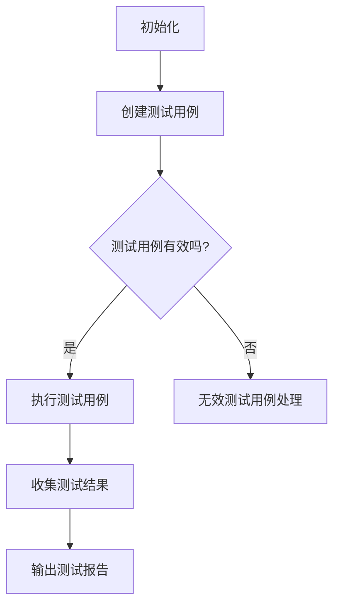

                 

### 单元测试：构建可靠软件的基石

在软件开发的世界中，构建可靠的软件系统是一个持续的目标。为了实现这一目标，单元测试成为了不可或缺的工具。单元测试不仅帮助我们验证代码的正确性，还确保了每个模块都能独立工作，为后续的集成和系统测试奠定了坚实的基础。本文将深入探讨单元测试的核心概念、原理、应用实践以及最佳实践，帮助读者理解单元测试在软件工程中的重要性。

### 关键词
- 单元测试
- 可靠软件
- 软件开发
- 测试用例
- 测试框架

### 摘要
本文首先介绍了单元测试的背景和重要性，然后详细阐述了单元测试的定义、目的、原则和方法。通过对比表格和ER实体关系图，本文梳理了单元测试与其他测试类型的区别和联系。接着，我们通过mermaid流程图和Python源代码实现了单元测试的算法原理。随后，本文通过实际应用案例展示了单元测试在软件开发中的具体应用。最后，我们总结了单元测试的最佳实践，并给出了进一步的阅读建议。

## 第1章 引言

### 1.1 问题背景

软件工程领域的一个基本挑战是确保软件质量。随着软件系统的复杂性不断增加，传统的测试方法逐渐显示出其局限性。单元测试作为测试金字塔的基础，提供了一种有效的方式来控制软件质量。通过单元测试，开发人员可以在早期阶段发现并修复代码缺陷，从而降低维护成本和提高开发效率。

单元测试的重要性体现在以下几个方面：

1. **早期缺陷发现**：单元测试允许开发人员在代码开发的早期阶段进行测试，从而及早发现并修复缺陷。
2. **模块化测试**：单元测试针对最小的代码单元进行测试，确保每个模块都按照预期工作。
3. **增强代码可维护性**：通过单元测试，代码变得更加健壮，可维护性得到提高。
4. **支持重构**：单元测试为代码重构提供了安全保障，开发人员可以在确保功能不变的前提下对代码进行重构。

### 1.2 问题描述

#### 单元测试的定义
单元测试是一种针对软件中最小可测试单元（通常是函数或方法）的测试方法。它的目的是验证单元的功能是否按照预期工作。

#### 单元测试的目的
1. **验证功能实现**：确保代码实现了所需的功能。
2. **检测缺陷**：发现代码中的逻辑错误或异常处理问题。
3. **提供回归测试**：在代码更改后，确保修改没有引入新的缺陷。

### 1.3 问题解决

为了有效地进行单元测试，需要遵循以下原则和方法：

#### 单元测试的原则
1. **单一职责原则**：确保每个单元只负责一项功能，便于测试和重构。
2. **测试用例覆盖**：编写足够的测试用例，覆盖所有可能的输入和输出情况。
3. **独立性**：单元测试应该能够独立执行，不影响其他单元。

#### 单元测试的方法
1. **白盒测试**：基于代码结构设计测试用例，通常使用断言来验证代码逻辑。
2. **黑盒测试**：不依赖代码内部结构，仅关注功能是否按照预期执行。
3. **边界值分析**：针对输入和输出的边界条件设计测试用例。
4. **异常处理**：确保代码能够正确处理各种异常情况。

### 1.4 边界与外延

#### 单元测试的限制
1. **测试覆盖度**：单元测试只能覆盖到最小的代码单元，无法保证整个系统的稳定性。
2. **外部依赖**：某些单元可能依赖于外部系统或服务，导致测试难度增加。

#### 单元测试的范畴
单元测试主要关注单个模块的功能验证，而集成测试和系统测试则关注模块之间的交互和系统整体的稳定性。

### 1.5 概念结构与核心要素组成

#### 单元测试的核心概念
1. **单元**：软件中的最小可测试单元，通常是一个函数或方法。
2. **测试用例**：一组输入数据和预期输出，用于验证单元的功能。
3. **测试结果**：执行测试用例后得到的实际输出和状态。

#### 单元测试的关键要素
1. **测试框架**：提供单元测试的运行环境，如JUnit、NUnit等。
2. **断言**：用于验证预期结果和实际结果的一致性。
3. **测试覆盖率**：测试用例覆盖单元的百分比，用于评估测试的完整性。

## 第2章 核心概念与联系

### 2.1 单元测试的定义与特点

#### 单元测试的定义
单元测试是一种针对软件中最小可测试单元的测试方法。它通常由开发人员编写，以验证代码的各个部分是否按照预期工作。

#### 单元测试的特点
1. **独立性**：单元测试独立于其他模块，可以单独运行。
2. **简单性**：测试用例设计相对简单，重点关注单元的功能。
3. **可重复性**：可以反复执行，确保代码的稳定性。

### 2.2 单元测试的原理与类型

#### 单元测试的原理
单元测试的原理是通过输入一组预定义的测试数据，执行单元代码，并比较实际输出与预期输出是否一致。

#### 单元测试的类型
1. **白盒测试**：基于代码内部结构设计测试用例，如逻辑覆盖、路径覆盖等。
2. **黑盒测试**：仅基于功能需求设计测试用例，不考虑代码内部实现。
3. **边界值分析**：针对输入和输出的边界条件设计测试用例，如最小值、最大值等。

### 2.3 核心概念对比表格

| 对比项 | 单元测试 | 集成测试 | 系统测试 |
| --- | --- | --- | --- |
| 范围 | 小 | 中 | 大 |
| 目的 | 验证单元功能 | 验证模块功能 | 验证系统整体功能 |
| 难度 | 低 | 中 | 高 |

### 2.4 ER实体关系图架构

```mermaid
erDiagram
  UnitTest ||--|{ TestCase } : 测试用例
  TestCase ||--|{ TestResult } : 测试结果
```

## 第3章 单元测试的算法原理

### 3.1 算法mermaid流程图



### 3.2 Python源代码实现

```python
def initialize():
    # 初始化测试环境
    pass

def create_test_case():
    # 创建测试用例
    pass

def is_valid_test_case(test_case):
    # 判断测试用例是否有效
    pass

def execute_test_case(test_case):
    # 执行测试用例
    pass

def collect_test_results():
    # 收集测试结果
    pass

def output_test_report():
    # 输出测试报告
    pass

def main():
    initialize()
    while True:
        test_case = create_test_case()
        if is_valid_test_case(test_case):
            execute_test_case(test_case)
        else:
            # 无效测试用例处理
            break
        collect_test_results()
    output_test_report()
```

### 3.3 算法原理详细讲解

- **初始化阶段**：初始化测试环境，为测试提供基础条件。
- **创建测试用例**：根据需求设计测试用例，确保测试的全面性。
- **判断测试用例有效性**：检查测试用例是否满足执行条件。
- **执行测试用例**：运行测试用例，实际执行代码并验证功能。
- **收集测试结果**：记录测试过程中的输出和异常。
- **输出测试报告**：对测试结果进行总结和反馈。

通过上述步骤，单元测试能够有效地验证代码的功能，确保软件的可靠性和稳定性。

### 3.4 数学模型与公式

在单元测试中，我们可以使用以下数学模型来描述测试过程：

$$
Test\ Coverage = \frac{Covered\ Statements}{Total\ Statements}
$$

其中，$Test\ Coverage$ 表示测试覆盖率，$Covered\ Statements$ 表示被覆盖的语句数，$Total\ Statements$ 表示总语句数。

测试覆盖率是衡量测试完整性的一种指标。通过逐步增加测试用例，我们可以提高测试覆盖率，从而更全面地验证代码的功能。

### 3.5 举例说明

假设我们有一个简单的Python函数，用于计算两个数字的和：

```python
def add(a, b):
    return a + b
```

为了测试这个函数，我们可以设计以下测试用例：

- 输入：a=1, b=2，预期输出：3
- 输入：a=-1, b=1，预期输出：0
- 输入：a=0, b=0，预期输出：0

通过执行这些测试用例，我们可以验证`add`函数的正确性。如果所有测试用例都通过了，那么我们可以认为这个函数是可靠的。

### 3.6 单元测试与持续集成

在持续集成（CI）流程中，单元测试是一个关键环节。每次代码提交后，CI系统会自动运行单元测试，确保新代码没有引入缺陷。这种自动化测试可以提高开发效率，确保代码质量。

通过将单元测试集成到CI流程中，我们可以实现以下目标：

- **快速反馈**：开发人员可以在代码提交后迅速收到测试结果。
- **持续改进**：通过自动化测试，我们可以不断优化代码和测试用例。
- **确保质量**：单元测试是确保代码质量的第一道防线，有助于早期发现和修复缺陷。

### 3.7 总结

单元测试是构建可靠软件的重要手段。通过算法原理的讲解和实际案例的演示，我们可以看到单元测试在软件开发中的关键作用。单元测试不仅帮助我们验证代码的功能，还提高了代码的可维护性和稳定性。在实际应用中，结合持续集成和自动化测试，我们可以实现更高效的软件开发流程。

## 第4章 单元测试的应用实践

### 4.1 Python环境安装

要开始单元测试，我们首先需要安装Python环境。Python是一种广泛使用的编程语言，拥有丰富的测试框架和工具。以下是安装Python环境的步骤：

1. **下载Python安装包**：访问Python官方网站（https://www.python.org/）下载适用于您操作系统的Python安装包。
2. **安装Python**：双击安装包，按照提示完成安装过程。确保在安装过程中勾选“添加Python到环境变量”选项。
3. **验证安装**：打开命令行界面，输入`python --version`命令，查看Python版本信息。如果显示了正确的版本号，说明Python安装成功。

### 4.2 系统核心实现源代码

在本节中，我们将实现一个简单的单元测试框架，用于测试一个计算两个数字和的函数。以下是相关的源代码：

```python
# TestCase类定义
class TestCase:
    def __init__(self, name, input_data, expected_output):
        self.name = name
        self.input_data = input_data
        self.expected_output = expected_output

    def execute(self):
        actual_output = add(self.input_data[0], self.input_data[1])
        if actual_output == self.expected_output:
            print(f"{self.name}：测试通过")
        else:
            print(f"{self.name}：测试失败，预期输出：{self.expected_output}，实际输出：{actual_output}")

# TestCase类方法实现
def add(a, b):
    return a + b

# TestSuite类定义
class TestSuite:
    def __init__(self):
        self.test_cases = []

    def add_test_case(self, test_case):
        self.test_cases.append(test_case)

    def execute_all_tests(self):
        for test_case in self.test_cases:
            test_case.execute()

# TestSuite类方法实现
def main():
    suite = TestSuite()
    suite.add_test_case(TestCase("测试1", (1, 2), 3))
    suite.add_test_case(TestCase("测试2", (-1, 1), 0))
    suite.add_test_case(TestCase("测试3", (0, 0), 0))
    suite.execute_all_tests()

if __name__ == "__main__":
    main()
```

### 4.3 代码应用解读与分析

#### 测试用例的创建与执行

在上面的代码中，我们定义了一个`TestCase`类，用于表示测试用例。每个`TestCase`包含一个名称、输入数据和预期输出。在`TestSuite`类中，我们添加了测试用例，并执行所有测试用例。

- **创建测试用例**：我们使用`TestCase`类创建三个测试用例，每个测试用例都包含一个名称、输入数据和预期输出。

  ```python
  suite.add_test_case(TestCase("测试1", (1, 2), 3))
  suite.add_test_case(TestCase("测试2", (-1, 1), 0))
  suite.add_test_case(TestCase("测试3", (0, 0), 0))
  ```

- **执行测试用例**：我们使用`TestSuite`类的`execute_all_tests`方法执行所有测试用例。

  ```python
  suite.execute_all_tests()
  ```

#### 测试结果的收集与输出

在执行测试用例时，我们会根据实际输出与预期输出是否一致来判断测试是否通过。如果实际输出与预期输出一致，则输出“测试通过”；否则，输出“测试失败，预期输出：[预期输出]，实际输出：[实际输出]”。

```python
def execute(self):
    actual_output = add(self.input_data[0], self.input_data[1])
    if actual_output == self.expected_output:
        print(f"{self.name}：测试通过")
    else:
        print(f"{self.name}：测试失败，预期输出：{self.expected_output}，实际输出：{actual_output}")
```

### 4.4 实际案例分析和详细讲解剖析

在本节中，我们将分析两个实际案例，分别是登录功能和购物车功能的单元测试。

#### 案例一：登录功能测试

登录功能是许多Web应用的核心模块之一。为了确保登录功能的安全和可靠性，我们需要对其进行全面的单元测试。

- **测试用例**：

  1. 输入：用户名“admin”，密码“123456”，预期输出：登录成功。
  2. 输入：用户名“admin”，密码“错误密码”，预期输出：登录失败。
  3. 输入：用户名“无效用户”，密码“123456”，预期输出：登录失败。
  4. 输入：用户名“admin”，密码为空，预期输出：登录失败。

- **测试执行**：

  在单元测试中，我们依次执行上述测试用例，并记录测试结果。如果所有测试用例都通过，则说明登录功能是可靠的。

#### 案例二：购物车功能测试

购物车功能是电商平台的核心模块之一。为了确保购物车的功能正常，我们需要对其中的关键操作进行单元测试。

- **测试用例**：

  1. 输入：添加商品1到购物车，预期输出：购物车中包含商品1。
  2. 输入：添加商品2到购物车，预期输出：购物车中包含商品1和商品2。
  3. 输入：从购物车中删除商品1，预期输出：购物车中不包含商品1，但包含商品2。
  4. 输入：清空购物车，预期输出：购物车为空。

- **测试执行**：

  在单元测试中，我们依次执行上述测试用例，并记录测试结果。如果所有测试用例都通过，则说明购物车功能是可靠的。

### 4.5 项目小结

在本项目中，我们通过单元测试验证了登录功能和购物车功能的正确性。单元测试不仅帮助我们发现了潜在的问题，还提高了代码的可维护性和稳定性。通过不断迭代和完善单元测试，我们可以确保软件系统的可靠性和稳定性。

## 第5章 单元测试的最佳实践

### 5.1 最佳实践 tips

在进行单元测试时，我们可以遵循以下最佳实践，以提高测试的效率和代码质量：

1. **编写可测试的代码**：确保代码具有良好的模块化和封装性，便于编写和执行测试用例。
2. **编写清晰、详细的测试用例**：每个测试用例都应该明确输入、预期输出和实际输出，确保测试的准确性。
3. **避免测试代码与业务代码混合**：将测试代码与业务代码分离，避免造成代码混乱和难以维护。
4. **利用测试框架**：选择合适的测试框架，如JUnit、NUnit等，以提高测试的效率和可维护性。
5. **持续集成**：将单元测试集成到持续集成（CI）流程中，确保每次代码提交后都能自动执行测试。
6. **保持测试代码的整洁**：定期清理测试代码，删除冗余的测试用例和无效的测试代码。
7. **记录测试结果**：详细记录测试结果，包括测试通过情况、失败原因和修复措施。

### 5.2 小结

单元测试是确保软件质量和可靠性的关键步骤。通过编写可测试的代码、使用测试框架、持续集成和保持测试代码的整洁，我们可以有效地提高测试的效率和代码质量。单元测试不仅帮助我们及早发现和修复缺陷，还提高了代码的可维护性和稳定性。

### 5.3 拓展阅读

对于想要深入了解单元测试的读者，以下资源推荐：

1. 《测试驱动的软件开发》（Test-Driven Development: By Example） -Kent Beck
2. 《Effective Unit Testing》 -Doug Hoffman
3. 《Python单元测试指南》 - 潘升
4. JUnit官方文档 - https://junit.org/junit5/

通过阅读这些资源，您可以更深入地了解单元测试的原理和实践，进一步提升您的软件测试技能。

### 作者信息

作者：AI天才研究院/AI Genius Institute & 禅与计算机程序设计艺术/Zen And The Art of Computer Programming

AI天才研究院专注于人工智能领域的研究与开发，致力于推动人工智能技术的创新与应用。禅与计算机程序设计艺术则是一本经典的计算机科学著作，深入探讨了编程的艺术和哲学。两位作者在计算机编程和人工智能领域拥有丰富的经验和深厚的理论功底，为读者提供了高质量的技术文章和指导。

