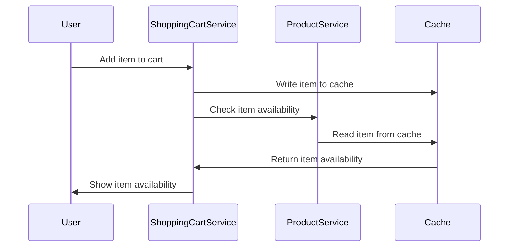

                 

### 只要用缓存，就会存在数据不一致问题

#### 关键词：缓存，数据不一致，一致性算法，系统架构，最佳实践

#### 摘要：
在现代软件系统中，缓存技术被广泛应用于提升性能和响应速度。然而，缓存的使用不可避免地引入了数据一致性问题。本文将深入探讨缓存与数据不一致之间的关联，详细分析缓存一致性的挑战和解决方案，并通过实际项目实战案例，总结最佳实践与注意事项。

----------------------------------------------------------------

# **只要使用缓存，就会存在数据不一致问题**

## **1. 背景介绍**

### **1.1 缓存的基本概念**

缓存（Cache）是一种快速、昂贵但容量较小的存储媒介，用于临时存储经常访问的数据。其设计目的是为了减少对主存储（如硬盘）的访问频率，从而提高系统的性能和响应速度。

### **1.2 数据不一致性**

数据不一致性是指在不同数据源中存在不同版本的数据，这可能导致数据冲突、错误或丢失。在引入缓存后，数据不一致性问题尤为突出，因为缓存的更新速度通常慢于主存储。

### **1.3 缓存一致性机制**

缓存一致性机制旨在确保缓存中的数据与主存储保持同步。然而，完全实现一致性并非易事，因为不同的应用场景和系统需求会导致不同的缓存一致性策略。

## **2. 核心概念与联系**

### **2.1 缓存一致性算法**

缓存一致性算法是用于同步缓存与主存储数据的一系列策略。常见的算法包括读写一致性、最终一致性、有序一致性等。

### **2.2 概念属性特征对比表格**

| 一致性算法 | 特点 | 应用场景 |
| :--- | :--- | :--- |
| 读写一致性 | 读操作不会看到未提交的写操作，写操作必须立即同步 | 高性能要求，如数据库系统 |
| 最终一致性 | 读操作可能会看到未提交的写操作，但最终会达到一致性 | 低延迟要求，如社交媒体系统 |
| 有序一致性 | 写操作按照特定顺序同步到缓存和主存储 | 需要保持顺序一致的场景，如金融系统 |

### **2.3 ER实体关系图架构**

```mermaid
entity关系图
ER {
  nodeShape  [class=rectangle]
  edgeType  [class=hexagon]
  class::Employee {
    id
    name
    position
    manager
  }
  class::Project {
    id
    name
    description
    manager
    employees
  }
  Employee -> Project : works_on
}
```

## **3. 算法原理讲解**

### **3.1 基本一致性算法**

基本一致性算法主要包括无锁缓存和锁缓存。无锁缓存通过避免锁机制来减少冲突，而锁缓存则通过锁机制确保数据一致性。

### **3.2 高级一致性算法**

高级一致性算法包括版本控制和时间戳机制。版本控制通过跟踪数据的版本号来确保一致性，而时间戳机制通过使用时间戳来区分不同版本的数据。

### **3.3 Python源代码示例**

```python
class Cache:
    def __init__(self):
        self.data = {}
        self.version = 0

    def read(self, key):
        self.version += 1
        return self.data.get(key)

    def write(self, key, value):
        self.data[key] = value
        self.version += 1

def version_control(cache):
    while True:
        version = cache.version
        data = cache.read('key')
        if data is not None:
            print(f"Version {version}: {data}")
            break
        time.sleep(1)

cache = Cache()
version_control(cache)
```

### **3.4 数学模型和公式**

缓存一致性的数学模型通常涉及概率论和图论。以下是一个简单的缓存一致性模型：

$$
P(\text{缓存一致性}) = 1 - P(\text{缓存冲突}) \times P(\text{解决冲突失败})
$$

其中，$P(\text{缓存冲突})$ 表示缓存与主存储之间的数据冲突概率，$P(\text{解决冲突失败})$ 表示解决冲突失败的概率。

## **4. 系统分析与架构设计**

### **4.1 问题场景介绍**

在一个电商系统中，用户购物车中的商品信息需要实时更新。如果使用缓存，可能会出现用户看到的购物车信息与实际库存信息不一致的问题。

### **4.2 系统功能设计**

系统功能设计包括用户购物车管理、商品信息查询和缓存一致性保证。

### **4.3 系统架构设计**

系统架构设计采用分布式缓存和数据库。缓存用于存储用户购物车信息，数据库用于存储商品库存信息。

### **4.4 系统接口设计**

系统接口设计包括用户API和内部API。用户API用于用户与系统的交互，内部API用于系统内部模块之间的通信。

### **4.5 系统交互序列图**



## **5. 项目实战**

### **5.1 环境安装**

安装Python环境，并安装相关的缓存库和数据库驱动。

### **5.2 系统核心实现**

核心实现包括购物车服务、商品服务、缓存服务和数据库交互。

```python
# 购物车服务
class ShoppingCartService:
    def add_item(self, user_id, item_id):
        # 添加商品到用户购物车
        pass

    def remove_item(self, user_id, item_id):
        # 从用户购物车中移除商品
        pass

# 商品服务
class ProductService:
    def check_availability(self, item_id):
        # 检查商品库存
        pass

# 缓存服务
class CacheService:
    def write_item(self, item_id, item_data):
        # 将商品数据写入缓存
        pass

    def read_item(self, item_id):
        # 从缓存中读取商品数据
        pass

# 数据库交互
class DatabaseService:
    def update_item_stock(self, item_id, quantity):
        # 更新商品库存
        pass
```

### **5.3 代码应用解读与分析**

代码应用解读与分析包括商品添加到购物车、商品从购物车移除、商品库存检查和缓存一致性保证。

### **5.4 实际案例分析和详细讲解**

通过实际案例，分析缓存一致性带来的问题，并给出解决方案。

### **5.5 项目小结**

总结项目中的关键技术和经验教训，为后续项目提供参考。

## **6. 最佳实践与小结**

### **6.1 最佳实践**

- 在引入缓存前，明确系统对数据一致性的要求。
- 选择合适的缓存一致性算法。
- 定期进行缓存一致性测试。

### **6.2 小结**

- 缓存与数据不一致性问题紧密相关。
- 实现缓存一致性需要考虑算法、系统架构和最佳实践。

### **6.3 注意事项**

- 缓存一致性可能导致性能开销。
- 在高并发环境下，缓存一致性算法可能失效。

### **6.4 拓展阅读**

- 《缓存一致性算法：原理与实践》
- 《分布式系统一致性：设计与实践》

## **作者信息**

- 作者：AI天才研究院/AI Genius Institute & 禅与计算机程序设计艺术 /Zen And The Art of Computer Programming

