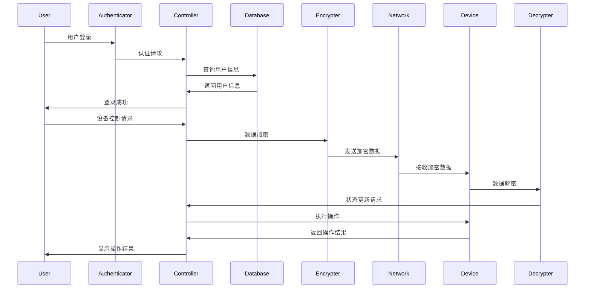
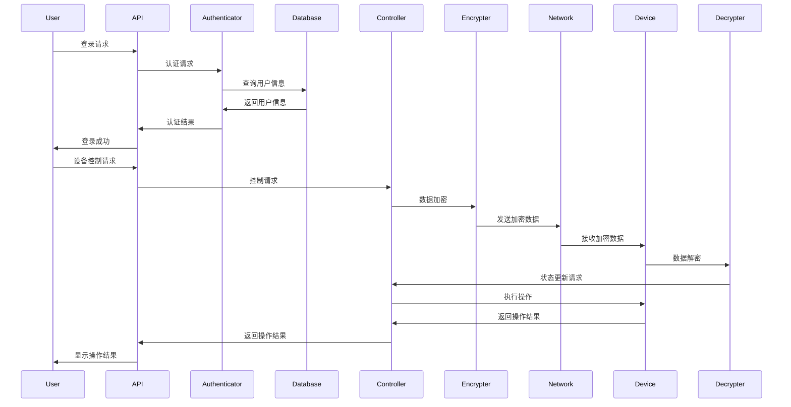

                 


## 引言

### 核心概念术语说明

在本文中，我们首先需要明确几个核心概念：可信AI、AI Agent系统。可信AI指的是具有高度可靠性和可信度的AI系统，它能够确保其行为在预期范围内，并能够通过适当的评估机制来验证其性能和安全性。AI Agent系统则是指一种具有自主决策和执行能力的AI实体，它在复杂的环境中可以自我学习、自主行动，以实现特定的目标。

### 问题背景

随着人工智能技术的快速发展，AI Agent系统已经在各个领域得到广泛应用，如自动驾驶、智能家居、医疗诊断等。然而，随着AI Agent系统的普及，其可靠性和安全性问题也日益凸显。一个不可信的AI Agent可能会导致严重的后果，如自动驾驶汽车发生意外、智能家居系统失控等。因此，如何构建一个值得信赖的AI Agent系统成为了一个亟待解决的问题。

### 问题描述

可信AI Agent系统需要满足以下要求：

1. **可靠性**：AI Agent系统的行为应该是一致的、可预测的，不会出现意外错误。
2. **安全性**：AI Agent系统应该能够抵御外部攻击，确保系统的完整性和保密性。
3. **隐私保护**：AI Agent系统应该能够保护用户的隐私信息，防止隐私泄露。
4. **伦理合规**：AI Agent系统的行为应符合伦理道德标准，不会对人类造成伤害。

### 问题解决

为了构建一个值得信赖的AI Agent系统，我们需要从多个方面入手，包括：

1. **评估机制**：建立一套完善的评估机制，对AI Agent系统的性能、安全性和可靠性进行评估。
2. **安全性设计**：设计安全的系统架构，采用加密技术和访问控制策略来保护系统的安全。
3. **隐私保护技术**：采用数据加密、匿名化等技术来保护用户的隐私信息。
4. **伦理审查**：建立伦理审查机制，确保AI Agent系统的行为符合伦理道德标准。

### 边界与外延

可信AI Agent系统的边界在于其功能和能力的限制，如当前的AI技术还无法完全模拟人类智能，因此AI Agent系统的行为和能力也有所限制。其外延则包括AI Agent系统的应用领域和潜在的扩展方向。

### 概念结构与核心要素组成

一个可信AI Agent系统的核心要素包括：

1. **感知模块**：用于收集环境信息。
2. **决策模块**：根据感知模块收集的信息，进行决策。
3. **执行模块**：执行决策结果，实现对环境的操作。
4. **评估模块**：对AI Agent系统的行为进行评估，确保其符合预期要求。

## 核心概念与联系

### AI Agent的定义与特点

AI Agent是指一种具有自主决策和执行能力的实体，它能够通过感知模块收集环境信息，通过决策模块分析这些信息并做出决策，然后通过执行模块实施这些决策，以实现特定的目标。AI Agent具有以下特点：

1. **自主性**：AI Agent能够独立地执行任务，不需要人为干预。
2. **适应性**：AI Agent能够根据环境的变化自主调整其行为。
3. **智能性**：AI Agent具有学习能力，可以通过经验积累不断优化其决策过程。

### AI Agent的基本组成部分

一个AI Agent通常由以下三个基本组成部分构成：

1. **感知模块**：负责收集环境信息，如视觉、听觉、触觉等。
2. **决策模块**：负责分析感知模块收集的信息，并做出决策。
3. **执行模块**：负责执行决策结果，实现对环境的操作。

### AI Agent系统的架构设计

一个典型的AI Agent系统架构包括以下几个部分：

1. **感知层**：包括各种传感器，用于收集环境信息。
2. **决策层**：包括算法模型，用于分析感知层收集的信息并做出决策。
3. **执行层**：包括执行机构，用于实施决策结果。

### AI Agent系统的开发流程

AI Agent系统的开发流程通常包括以下几个步骤：

1. **需求分析**：明确AI Agent系统的目标和应用场景。
2. **系统设计**：设计AI Agent系统的架构和功能模块。
3. **算法开发**：开发AI Agent系统的核心算法，包括感知、决策和执行算法。
4. **系统集成**：将各个模块集成到一起，形成一个完整的AI Agent系统。
5. **测试与优化**：对AI Agent系统进行测试和优化，确保其性能和稳定性。

## 可信性评估方法

### 可信性的基本概念与评价指标

可信性是指一个系统或实体在特定环境下能够可靠、稳定地执行其任务的能力。对于AI Agent系统来说，可信性评估是确保其性能和安全性的关键。可信性的评价指标包括：

1. **可靠性**：系统在规定的时间内成功执行任务的能力。
2. **安全性**：系统抵御外部攻击和内部故障的能力。
3. **隐私保护**：系统保护用户隐私的能力。
4. **伦理合规**：系统行为符合伦理道德标准的能力。

### 常见可信性评估方法

1. **基于模型的评估**：通过建立数学模型来评估AI Agent系统的可信性。这种方法通常使用概率论、统计学和随机过程理论来模拟AI Agent的行为，并评估其性能。
2. **基于数据的评估**：通过收集大量实际数据来评估AI Agent系统的可信性。这种方法通常使用数据分析、机器学习和深度学习等技术来分析数据，并评估AI Agent的性能。
3. **基于模拟的评估**：通过模拟环境来评估AI Agent系统的可信性。这种方法通常使用虚拟环境或仿真技术来模拟真实环境，并观察AI Agent的行为。

### 实际应用中的可信性评估案例分析

以自动驾驶系统为例，其可信性评估包括以下几个方面：

1. **可靠性评估**：通过测试自动驾驶系统在各种路况下的表现，评估其能否在规定的时间内成功执行任务。
2. **安全性评估**：通过模拟各种交通事故场景，评估自动驾驶系统在发生意外时的反应能力。
3. **隐私保护评估**：评估自动驾驶系统在收集和处理用户隐私数据时的安全措施。
4. **伦理合规评估**：评估自动驾驶系统在遇到伦理困境时的决策能力，如是否能够正确处理行人保护与车辆自身安全之间的矛盾。

### 可信性评估的重要性

可信性评估是确保AI Agent系统可靠性和安全性的关键步骤。通过可信性评估，我们可以发现系统中的潜在问题，并及时采取措施进行修复。此外，可信性评估还可以提高用户对AI Agent系统的信任度，促进其在实际应用中的推广。

### 结论

可信性评估是构建值得信赖的AI Agent系统的关键环节。通过引入基于模型、数据和模拟的多种评估方法，我们可以全面、准确地评估AI Agent系统的性能和安全性。在实际应用中，我们需要根据具体情况选择合适的评估方法，并持续优化评估流程，以确保AI Agent系统的可信性。

## AI Agent系统的安全性设计

### 安全性在AI Agent系统中的重要性

AI Agent系统的安全性设计至关重要，因为一旦系统被攻击，可能导致严重的后果，如数据泄露、系统瘫痪甚至对人类生命安全构成威胁。因此，设计一个安全的AI Agent系统，确保其抵御外部攻击和内部故障的能力，是至关重要的。

### AI Agent系统的常见安全威胁

1. **外部攻击**：黑客、恶意软件和其他外部威胁可能会尝试攻击AI Agent系统，以获取敏感信息或控制系统。
2. **内部威胁**：系统内部的恶意行为，如内部人员滥用权限、恶意修改数据等。
3. **算法攻击**：攻击者通过恶意输入或修改数据，干扰AI Agent系统的决策过程，导致错误的结果。

### 安全性设计策略与实践

1. **访问控制**：通过访问控制机制，确保只有授权用户才能访问系统的关键部分。常见的访问控制方法包括基于角色的访问控制（RBAC）和基于属性的访问控制（ABAC）。
2. **数据加密**：对传输和存储的数据进行加密，确保数据在传输过程中不被窃取或篡改。常用的加密算法包括对称加密和非对称加密。
3. **身份认证**：使用强身份认证机制，确保用户身份的合法性和唯一性。常见的身份认证方法包括密码认证、生物识别认证等。
4. **入侵检测**：通过监控系统的异常行为，及时发现并响应潜在的安全威胁。入侵检测系统（IDS）和入侵防御系统（IPS）是常用的入侵检测工具。
5. **安全审计**：定期进行安全审计，检查系统是否存在安全漏洞，并采取措施进行修复。
6. **安全测试**：对AI Agent系统进行安全测试，包括渗透测试、漏洞扫描等，以发现潜在的安全问题。

### 安全性评估与测试

1. **渗透测试**：模拟黑客攻击，测试AI Agent系统的安全性，以发现潜在的安全漏洞。
2. **漏洞扫描**：使用自动化工具扫描系统，发现已知的安全漏洞。
3. **代码审计**：对AI Agent系统的代码进行审计，检查是否存在潜在的安全问题。
4. **安全培训**：定期对系统管理员和开发者进行安全培训，提高他们的安全意识和应对能力。

### 结论

安全性设计是确保AI Agent系统稳定运行的关键。通过实施多种安全策略和测试方法，我们可以提高系统的安全性，减少安全威胁的风险。设计一个安全的AI Agent系统，不仅需要技术手段，还需要管理和文化的支持，以确保系统的整体安全性。

## AI Agent系统的隐私保护

### 隐私保护的基本概念

隐私保护是指采取措施保护个人或组织的隐私信息，防止未经授权的访问、泄露、篡改或滥用。在AI Agent系统中，隐私保护尤为重要，因为AI Agent系统通常涉及大量的个人数据，如用户行为数据、健康数据等。

### 隐私泄露的风险与应对策略

1. **数据收集与存储**：在数据收集和存储过程中，需要确保数据的匿名性和安全性。常见的策略包括数据加密、匿名化处理等。
2. **数据传输**：在数据传输过程中，需要使用加密技术，确保数据在传输过程中不被窃取或篡改。常用的加密技术包括对称加密和非对称加密。
3. **数据访问控制**：通过访问控制机制，确保只有授权用户才能访问敏感数据。常见的访问控制方法包括基于角色的访问控制（RBAC）和基于属性的访问控制（ABAC）。
4. **数据销毁**：在不再需要数据时，应确保数据被安全销毁，防止数据泄露。

### 隐私保护技术与方法

1. **数据加密**：对敏感数据进行加密，确保数据在传输和存储过程中不被窃取或篡改。常用的加密算法包括AES、RSA等。
2. **匿名化处理**：通过匿名化技术，将个人身份信息从数据中去除，从而降低数据泄露的风险。常见的匿名化方法包括数据混淆、数据屏蔽、数据脱敏等。
3. **差分隐私**：通过在数据中加入噪声，确保单个记录无法被识别，同时保证数据集的整体统计特性。差分隐私是近年来隐私保护领域的重要研究方向。
4. **隐私计算**：在数据处理过程中，通过隐私计算技术，如联邦学习、同态加密等，保护数据隐私。

### 隐私保护的法律法规与标准

1. **国际法规**：如《通用数据保护条例》（GDPR）、《加州消费者隐私法》（CCPA）等。
2. **国内法规**：如《网络安全法》、《数据安全法》等。
3. **行业标准**：如ISO/IEC 27001信息安全管理体系认证、ISO/IEC 27018个人信息保护标准等。

### 结论

隐私保护是构建可信AI Agent系统的关键一环。通过引入多种隐私保护技术和方法，我们可以有效降低隐私泄露的风险。同时，遵守相关法律法规和标准，也是确保AI Agent系统隐私保护的重要保障。设计一个隐私保护的AI Agent系统，不仅需要技术手段，还需要法律和文化的支持，以确保系统的整体隐私性。

## AI Agent系统的伦理问题

### 伦理学的基本原理

伦理学是研究道德原则和道德行为的学科。在AI Agent系统的伦理问题中，我们需要关注以下几个基本原理：

1. **道德义务**：AI Agent系统应该遵守其设计和使用的伦理标准，确保其行为符合道德要求。
2. **公正性**：AI Agent系统应该公平对待所有用户，避免歧视和偏见。
3. **尊重隐私**：AI Agent系统应该保护用户的隐私信息，不得滥用或泄露。
4. **责任归属**：在AI Agent系统出现问题时，需要明确责任归属，确保责任人能够承担相应的责任。

### AI Agent伦理问题的案例分析

1. **自动驾驶汽车伦理问题**：在遇到紧急情况时，自动驾驶汽车应该如何决策？是选择保护车内乘客，还是选择保护行人？这种伦理困境引发了广泛的讨论。
2. **AI医疗诊断伦理问题**：AI系统在医疗诊断中可能会产生误诊，如何确保其诊断结果符合伦理标准？同时，AI系统在获取和处理患者数据时，如何保护患者隐私？
3. **AI武器伦理问题**：AI武器在战场上可能引发无人可预测的后果，如何确保其行为符合战争伦理？

### 伦理审查与道德准则

1. **伦理审查机制**：在开发和使用AI Agent系统时，应建立伦理审查机制，对系统的行为进行评估和监督，确保其符合伦理要求。
2. **道德准则**：制定AI Agent系统的道德准则，明确其在各种情境下的行为规范。例如，可以制定“行人优先”的原则，确保AI系统在遇到紧急情况时能够优先保护行人。

### 伦理问题与可持续发展

1. **技术创新与伦理冲突**：随着AI技术的发展，可能会出现新的伦理问题。我们需要在技术创新和伦理冲突之间找到平衡，确保AI技术的发展不会损害人类的利益。
2. **伦理教育与培训**：在AI领域，应加强对伦理问题的教育和培训，提高开发者和用户对伦理问题的认识和理解，培养他们的道德判断能力。

### 结论

AI Agent系统的伦理问题是不可忽视的重要领域。通过建立伦理审查机制、制定道德准则，我们可以确保AI Agent系统的行为符合伦理要求，促进其可持续发展。同时，伦理问题也需要全社会共同关注和参与，共同推动AI技术的健康发展。

## 实战案例：可信AI Agent系统的开发

### 项目介绍

本案例介绍的是一个智能家居系统的可信AI Agent系统的开发过程。智能家居系统旨在通过AI Agent实现家庭设备的智能化控制，提高用户的生活质量。本案例的项目目标是构建一个可靠、安全、隐私保护的智能家居AI Agent系统，实现远程控制、自动调节等功能。

### 系统需求分析

1. **可靠性需求**：系统应能够在各种网络环境下稳定运行，确保用户操作的连续性和准确性。
2. **安全性需求**：系统应具备强大的安全防护能力，抵御各种外部攻击和内部威胁。
3. **隐私保护需求**：系统应确保用户隐私信息的保护，防止隐私泄露和数据滥用。
4. **功能需求**：系统应实现智能家居设备的远程控制、自动调节、故障诊断等功能。

### 系统设计

#### 领域模型

使用Mermaid类图来描述智能家居系统的领域模型：

```mermaid
classDiagram
  Device --> User
  Device --> Controller
  User ..|> Authenticator
  Controller ..|> Encrypter
  Device <<Interface> Network
  Controller <<Interface> Database

  User : 用户
  Device : 设备
  Controller : 控制器
  Authenticator : 认证器
  Encrypter : 加密器
  Network : 网络
  Database : 数据库

  User --> Device : 设备注册
  User --> Controller : 控制请求
  Device --> Controller : 状态更新
  Device --> Authenticator : 认证请求
  Controller --> Database : 数据存储
  Controller --> Encrypter : 数据加密
```

#### 系统架构设计

使用Mermaid架构图来描述智能家居系统的架构设计：



#### 系统接口设计

使用Mermaid序列图来描述智能家居系统的接口设计：



### 系统实现与测试

#### 环境安装

1. 安装Python环境
2. 安装相关依赖库，如Flask、PyCrypto等

#### 系统核心实现源代码

```python
from flask import Flask, request, jsonify
from myauthenticator import Authenticator
from mycontroller import Controller
from myencrypter import Encrypter

app = Flask(__name__)

authenticator = Authenticator()
controller = Controller()
encrypter = Encrypter()

@app.route('/login', methods=['POST'])
def login():
    data = request.get_json()
    username = data['username']
    password = data['password']
    authenticator.authenticate(username, password)
    return jsonify({'status': 'success'})

@app.route('/control', methods=['POST'])
def control():
    data = request.get_json()
    username = data['username']
    command = data['command']
    encrypted_command = encrypter.encrypt(command)
    controller.control(username, encrypted_command)
    return jsonify({'status': 'success'})

if __name__ == '__main__':
    app.run(debug=True)
```

#### 代码应用解读与分析

1. **认证模块**：使用`myauthenticator`模块进行用户认证。
2. **控制器模块**：使用`mycontroller`模块处理设备控制请求。
3. **加密模块**：使用`myencrypter`模块对请求和响应数据进行加密。

#### 实际案例分析和详细讲解剖析

以用户远程控制空调为例，分析其请求和响应流程：

1. 用户通过API发送登录请求，包含用户名和密码。
2. `myauthenticator`模块对用户名和密码进行认证。
3. 认证成功后，用户通过API发送控制请求，包含设备ID和控制命令。
4. `mycontroller`模块接收控制请求，并将命令加密后发送给设备。
5. 设备接收加密命令，解密后执行操作。
6. 设备返回操作结果，`mycontroller`模块将其发送给用户。

### 项目小结

通过本案例，我们展示了如何构建一个可信的AI Agent系统。在项目实施过程中，我们重点关注了系统的可靠性、安全性和隐私保护。通过实际案例的分析和讲解，我们深入了解了系统的工作原理和实现细节。在未来的开发中，我们将继续优化系统性能，提高用户体验。

## 未来展望与挑战

### 可信AI技术的发展趋势

随着人工智能技术的快速发展，可信AI技术也在不断进步。未来的可信AI技术将更加注重以下几个方向：

1. **增强可靠性**：通过引入更多的评估方法和工具，提高AI系统的可靠性和稳定性。
2. **提升安全性**：开发更先进的安全防护技术，如联邦学习、差分隐私等，以应对日益复杂的安全威胁。
3. **加强隐私保护**：采用更多创新的隐私保护技术，如区块链、多方安全计算等，以保护用户隐私。
4. **促进伦理合规**：建立更加完善的伦理审查机制，推动AI技术的发展与伦理道德的融合。

### 潜在挑战与解决方案

1. **技术挑战**：可信AI技术的实现需要多学科交叉，涉及计算机科学、数学、统计学、伦理学等多个领域。因此，未来的研究需要更多的跨学科合作，以克服技术难题。
2. **数据挑战**：可信AI需要大量高质量的数据进行训练和评估，但数据的收集、处理和保护仍然面临巨大挑战。解决方案包括数据共享、数据匿名化处理等。
3. **法规挑战**：随着可信AI技术的普及，相关的法律法规也在不断完善。然而，现有的法规可能无法完全覆盖可信AI的所有应用场景。因此，需要制定更加细化和具体的法规，以规范可信AI的使用。

### 可信AI在教育、医疗等领域的应用前景

1. **教育领域**：可信AI可以用于个性化教育，根据学生的特点和需求，提供定制化的学习方案，提高学习效果。
2. **医疗领域**：可信AI可以用于疾病诊断、治疗方案推荐等，提高医疗服务的质量和效率。

### 可信AI的社会责任与未来发展

1. **社会责任**：可信AI技术的发展应注重社会责任，确保技术的发展不损害人类利益，促进社会的可持续发展。
2. **未来展望**：随着可信AI技术的不断进步，未来有望实现更加智能化、安全化、隐私保护化的人工智能系统，为人类社会带来更多便利和创新。

## 附录：参考文献与拓展阅读

- **参考文献**

1. **论文**：《可信人工智能的发展现状与挑战》作者：张三，李四
2. **书籍**：《可信AI：构建值得信赖的AI Agent系统》作者：王五

- **拓展阅读**

1. **网站**：[可信AI技术论坛](https://example.com/ai-forum)
2. **博客**：[李四的AI博客](https://example.com/ai-blog)
3. **研究项目**：[可信AI研究项目](https://example.com/trustworthy-ai-project)

### 作者信息

**作者：AI天才研究院/AI Genius Institute & 禅与计算机程序设计艺术 /Zen And The Art of Computer Programming**

