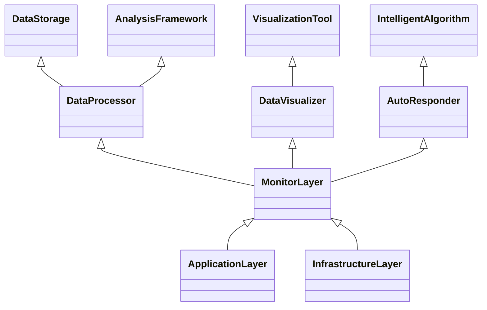

                 

### 第1章: 可观测性的基本概念

#### 1.1 可观测性的定义与重要性

**可观测性**（Observability）是系统设计和运维中至关重要的一个概念。它不仅关系到系统的稳定性和可靠性，还对故障检测和系统优化起着关键作用。

**定义**：可观测性是指一个系统内，通过观察系统的输入和输出，能够全面了解系统内部状态的能力。这与可监控性（Monitorability）有所不同，可监控性更侧重于对系统运行过程中的指标进行收集和显示。

**重要性**：

1. **故障检测**：一个高度可观测的系统，能够快速识别出异常状态，从而及时进行故障检测和排除。
2. **性能优化**：通过可观测性，可以深入了解系统性能瓶颈，进行针对性优化，提高系统整体效率。
3. **安全性**：可观测性可以帮助识别潜在的安全威胁，并采取相应的措施进行防御。
4. **持续集成与持续部署**（CI/CD）：在软件开发过程中，可观测性是确保新版本发布稳定性的关键。

#### 1.1.1 可观测性的边界与外延

**边界**：可观测性的边界在于能够通过系统的输入输出观测到足够的内部状态信息，从而对系统的运行状况进行全面了解。

**外延**：可观测性的外延涉及到系统的各个层面，包括硬件、软件、网络等多个方面。例如，在软件层面，它可以包括日志、性能指标、异常记录等。

#### 1.1.2 可观测性在系统设计中的意义

**意义**：

1. **系统设计**：在设计系统时，考虑可观测性可以确保系统能够在运行过程中提供足够的信息，便于后续的监控和维护。
2. **系统演化**：随着系统的发展和变化，可观测性可以提供有价值的数据，帮助系统迭代和优化。
3. **团队合作**：可观测性能够为开发和运维团队提供统一的视图，提高团队协作效率。

#### 1.2 可观测性的发展历程

**发展历程**：

1. **早期监控**：最初的可观测性主要依赖于日志和简单的性能指标。
2. **集中监控**：随着监控系统的发展，如Nagios等，集中监控开始普及。
3. **分布式监控**：随着分布式系统的普及，如Prometheus等，分布式监控工具应运而生。
4. **现代可观测性**：目前，现代可观测性平台不仅提供分布式监控，还集成了日志分析、异常检测、自动化响应等功能。

#### 1.2.1 从传统监控到现代可观测性

**传统监控**：传统监控主要侧重于系统运行过程中的指标收集和展示，如CPU使用率、内存使用率等。

**现代可观测性**：现代可观测性平台则更加全面，能够收集和分析系统的多种数据，如日志、性能指标、链路追踪等，并提供自动化响应和优化建议。

#### 1.2.2 关键里程碑与技术演进

**关键里程碑**：

1. **Prometheus的诞生**：Prometheus的出现，标志着现代可观测性的崛起。
2. **OpenTelemetry的推广**：OpenTelemetry的推广，使得可观测性的实现更加标准化和便捷。

**技术演进**：

1. **数据收集与存储**：从简单的日志收集到复杂的流数据存储和处理。
2. **分析算法**：从简单的统计分析到复杂的行为分析。
3. **自动化响应**：从手动处理到自动化响应和故障恢复。

#### 1.3 可观测性的核心要素

**核心要素**：

1. **数据收集**：确保系统能够收集到全面且准确的数据。
2. **数据存储**：确保数据存储的高效性和可扩展性。
3. **数据分析**：通过数据分析，深入了解系统运行状况。
4. **可视化**：通过可视化，直观展示系统状态。
5. **自动化响应**：基于数据分析结果，实现自动化故障检测和响应。

#### 1.3.1 概念属性特征对比表格

| 特征                | 数据收集       | 数据存储       | 数据分析       | 可视化       | 自动化响应       |
|--------------------|----------------|----------------|----------------|-------------|------------------|
| 定义               | 收集系统数据   | 存储系统数据   | 分析系统数据   | 展示系统状态 | 自动响应故障     |
| 目的               | 全面性、准确性 | 高效性、可扩展 | 深入分析       | 直观、易懂   | 快速、有效       |
| 技术实现           | agent、SDK     | 存储系统       | 数据处理框架   | 可视化工具   | 智能算法、自动化 |
| 关键问题           | 数据量、数据安全 | 数据一致性     | 数据准确性     | 可交互性     | 可定制性        |

#### 1.3.2 可观测性的ER实体关系图

```mermaid
erDiagram
    DataCollector ||--|{ DataStorager }|--| DataAnalyzer
    DataCollector ||--|{ Visualizer }|--| DataResponder
    DataStorager ||--|{ StorageSystem }|-- DataAnalyzer
    DataStorager ||--|{ StorageSystem }|-- Visualizer
    DataAnalyzer ||--|{ AnalysisFramework }|-- DataResponder
    Visualizer ||--|{ VisualizationTool }|-- DataResponder
    DataResponder ||--|{ IntelligentAlgorithm }|-- System
```

#### 1.4 可观测性在系统架构中的位置

**可观测性在系统架构中的位置**：

1. **监控层**：位于应用层和基础设施层之间，收集和分析系统数据。
2. **数据处理层**：负责存储、处理和分析收集到的数据。
3. **可视化层**：提供用户界面，直观展示系统状态。
4. **自动化层**：基于分析结果，实现自动化故障检测和响应。

**Mermaid 类图**：



#### 1.5 本章小结

本章对可观测性的基本概念进行了详细阐述，包括定义、重要性、边界与外延、系统设计中的意义、发展历程以及核心要素。通过本章的学习，读者可以理解可观测性在系统设计和运维中的关键作用，并为后续章节的学习打下坚实基础。

----------------------------------------------------------------

## 第2章: 可观测性平台的构建原理

### 2.1 可观测性平台的定义与作用

**可观测性平台**是一种集成化的系统监控和数据分析工具，旨在提高系统的可观测性。它通过收集、存储、分析和可视化系统数据，帮助开发者和运维团队深入了解系统运行状况，快速识别和解决问题。

**定义**：可观测性平台是一个综合性的系统，集成了多种监控、日志分析、数据存储、可视化工具和技术，用于提高系统的可观测性。

**作用**：

1. **故障检测与诊断**：通过实时收集和分析系统数据，快速发现异常状态和潜在故障。
2. **性能优化**：通过监控和分析系统性能指标，找出瓶颈并进行优化。
3. **安全性保障**：通过日志分析，识别潜在的安全威胁，并采取相应的防御措施。
4. **持续集成与持续部署**：确保新版本发布时的系统稳定性。
5. **团队协作**：提供统一的监控视图，提高开发和运维团队的协作效率。

### 2.2 可观测性平台的核心技术

**核心技术**包括数据收集、数据存储、数据分析、数据可视化和自动化响应。以下将详细介绍这些技术。

#### 2.2.1 监控技术原理与实现

**原理**：监控技术主要通过收集系统运行过程中的指标，如CPU使用率、内存使用率、网络流量等，来了解系统的运行状况。

**实现**：

1. **agent**：在系统中部署agent，用于定期收集指标数据。
2. **prometheus**：Prometheus是一种开源监控系统，可用于收集和存储指标数据，并提供灵活的数据查询和告警功能。
3. **Zabbix**：Zabbix是一种开源的监控解决方案，支持多种监控项和数据采集方式。

#### 2.2.2 日志收集与处理

**原理**：日志收集与处理是可观测性平台的重要组成部分，它通过收集和分析系统日志，提供对系统运行状况的深入了解。

**实现**：

1. **logstash**：Logstash是一个开源的数据处理工具，用于收集、处理和存储日志数据。
2. **ELK**：ELK（Elasticsearch、Logstash、Kibana）是一个集成的日志分析平台，可用于实时收集、存储和可视化日志数据。
3. **Fluentd**：Fluentd是一个开源的数据收集工具，支持多种数据源和目的地，适用于大规模日志收集场景。

#### 2.2.3 数据存储与检索

**原理**：数据存储与检索是可观测性平台的核心，它负责存储大量系统数据，并提供高效的数据检索能力。

**实现**：

1. **Elasticsearch**：Elasticsearch是一个开源的搜索引擎，用于存储和检索大量结构化数据。
2. **InfluxDB**：InfluxDB是一个开源的时间序列数据库，适用于存储和查询实时监控数据。
3. **MySQL**：MySQL是一个开源的关系型数据库，可用于存储系统配置、用户数据等。

#### 2.2.4 数据分析

**原理**：数据分析是可观测性平台的高级功能，通过数据分析，可以深入了解系统性能、安全性和稳定性。

**实现**：

1. **PromQL**：Prometheus提供了一种基于时间序列数据的查询语言，用于对监控数据进行复杂的分析。
2. **Grafana**：Grafana是一个开源的数据可视化平台，支持自定义仪表板和告警功能，可用于实时分析监控数据。
3. **机器学习**：使用机器学习算法，可以实现对系统数据的自动分析和异常检测。

#### 2.2.5 数据可视化

**原理**：数据可视化是将系统数据以图形化的方式展示，帮助开发者和运维团队直观了解系统运行状况。

**实现**：

1. **Kibana**：Kibana是一个开源的数据可视化平台，与ELK集成，支持多种数据可视化组件。
2. **Grafana**：Grafana提供丰富的可视化组件，支持自定义仪表板，适用于多种数据源。
3. **Gauges**：Gauges是一个开源的可视化工具，用于实时展示系统指标。

#### 2.2.6 自动化响应

**原理**：自动化响应是基于数据分析结果，自动执行特定操作，如发送告警、重启服务等。

**实现**：

1. **Prometheus告警**：Prometheus支持自定义告警规则，当监控指标超出阈值时，自动发送告警。
2. **自动化脚本**：编写自动化脚本，实现告警后的自动响应，如重启服务、升级软件等。
3. **ChatOps**：使用ChatOps，将告警和响应集成到即时通讯工具中，实现快速响应。

### 2.3 可观测性平台的设计原则

**设计原则**是构建高效、可扩展、可靠的可观测性平台的关键。以下是一些核心设计原则：

1. **可扩展性**：平台应能够支持系统规模的扩展，包括数据收集、存储、处理和可视化等方面的扩展。
2. **高可用性**：平台应具备高可用性，确保系统在故障情况下能够快速恢复。
3. **安全性**：平台应确保数据的安全性和隐私保护，防止数据泄露和未经授权的访问。
4. **可维护性**：平台应设计简洁，易于维护和升级。
5. **灵活性**：平台应支持多种数据源和数据的多样化处理。

### 2.4 可观测性平台的搭建流程

**搭建流程**包括以下几个步骤：

1. **需求分析**：明确系统的监控需求和目标。
2. **环境准备**：准备服务器、网络和存储环境。
3. **工具选择**：选择合适的监控、日志分析、数据存储和可视化工具。
4. **搭建数据收集系统**：部署agent，配置收集规则。
5. **搭建数据处理系统**：配置日志处理、数据存储和检索系统。
6. **搭建可视化系统**：配置可视化工具，搭建仪表板。
7. **测试与优化**：进行系统测试，并根据实际情况进行优化。

### 2.5 本章小结

本章详细介绍了可观测性平台的定义与作用、核心技术、设计原则和搭建流程。通过本章的学习，读者可以了解如何构建一个高效、可靠的现代可观测性平台，为后续章节的学习和应用打下坚实基础。

----------------------------------------------------------------

## 第3章: 可观测性平台在云计算环境中的应用

### 3.1 云计算环境下的可观测性需求

在云计算环境中，由于系统的分布式和动态性，可观测性需求变得更加复杂和重要。以下是云计算环境下可观测性的主要需求：

#### 3.1.1 云服务的特点与挑战

**特点**：

1. **分布式**：云服务通常由多个分布式节点组成，这些节点可能分布在不同地理位置。
2. **动态性**：云服务具有高度的动态性，节点和资源的分配和释放频繁。
3. **异构性**：云服务通常支持多种类型的服务和架构，如虚拟机、容器、无服务器等。

**挑战**：

1. **监控复杂性**：由于分布式和动态性，监控云计算环境变得更加复杂。
2. **数据多样性**：不同类型的服务和架构可能产生不同类型的数据，如何整合这些数据成为挑战。
3. **性能影响**：监控和数据处理可能对云服务的性能产生影响，需要在性能和可观测性之间找到平衡。

#### 3.1.2 可观测性平台在云服务中的应用

**应用**：

1. **性能监控**：通过监控云服务中的关键性能指标，如CPU使用率、内存使用率、网络延迟等，及时发现性能瓶颈。
2. **故障检测**：通过收集和分析云服务中的日志、异常记录等，快速识别和定位故障。
3. **安全性监控**：通过监控云服务中的安全事件和日志，及时发现潜在的安全威胁。
4. **成本优化**：通过监控云服务的资源使用情况，优化资源配置，降低成本。

### 3.2 云计算环境下的可观测性实践

**实践**主要包括以下几个方面：

#### 3.2.1 监控工具的选择与应用

**选择**：

1. **Prometheus**：Prometheus是一种开源的监控工具，支持多种数据源和告警功能，适用于大规模云服务监控。
2. **Grafana**：Grafana是一种开源的数据可视化工具，与Prometheus集成，提供丰富的图表和仪表板，适用于云服务监控数据的可视化。
3. **ELK**：ELK（Elasticsearch、Logstash、Kibana）是一种集成的日志分析平台，适用于云服务日志的收集、存储和可视化。

**应用**：

1. **部署Prometheus**：在云服务中部署Prometheus，配置监控规则，收集云服务节点的性能指标。
2. **部署Grafana**：在云服务中部署Grafana，配置数据源，创建仪表板，实时展示云服务监控数据。
3. **部署ELK**：在云服务中部署ELK，配置Logstash，将日志数据导入Elasticsearch，使用Kibana进行日志数据的可视化。

#### 3.2.2 日志分析与处理

**原理**：

1. **日志收集**：使用Logstash等工具，将云服务中的日志数据收集到Elasticsearch。
2. **日志存储**：使用Elasticsearch等工具，存储大量的日志数据。
3. **日志分析**：使用Kibana等工具，对日志数据进行分析和可视化。

**实现**：

1. **部署Logstash**：配置Logstash，将云服务中的日志数据发送到Elasticsearch。
2. **配置Elasticsearch**：配置Elasticsearch，存储大量的日志数据，并支持高效的查询。
3. **部署Kibana**：配置Kibana，创建日志分析仪表板，实时展示日志数据。

#### 3.2.3 数据可视化

**原理**：

1. **数据展示**：使用Grafana等工具，将云服务的监控数据以图表和仪表板的形式展示。
2. **交互性**：提供用户交互功能，如筛选、过滤和告警等。

**实现**：

1. **部署Grafana**：配置Grafana，创建云服务监控仪表板。
2. **配置数据源**：配置Grafana的数据源，如Prometheus、ELK等。
3. **创建仪表板**：创建自定义仪表板，展示云服务的监控数据。

### 3.3 云计算环境下的案例分析

**案例背景**：

某大型互联网公司使用云计算服务，部署了多个分布式系统，包括Web应用、数据库和缓存系统。为了确保系统的稳定性和可靠性，公司决定构建一个可观测性平台，实现对云服务的全面监控和数据分析。

**可观测性平台的实施过程**：

1. **需求分析**：明确监控需求，包括性能监控、故障检测、安全性监控和成本优化。
2. **工具选择**：选择Prometheus、Grafana和ELK作为监控、可视化和日志分析工具。
3. **部署Prometheus**：在云服务中部署Prometheus，配置监控规则，收集云服务节点的性能指标。
4. **部署Grafana**：在云服务中部署Grafana，配置数据源，创建仪表板，实时展示云服务监控数据。
5. **部署ELK**：在云服务中部署ELK，配置Logstash，将日志数据导入Elasticsearch，使用Kibana进行日志数据的可视化。
6. **测试与优化**：进行系统测试，根据实际情况进行优化。

**实施效果与总结**：

通过可观测性平台的实施，公司实现了以下效果：

1. **性能监控**：实时监控云服务性能指标，及时发现和解决性能瓶颈。
2. **故障检测**：通过日志分析和异常检测，快速识别和定位故障，提高系统稳定性。
3. **安全性监控**：实时监控安全事件和日志，及时发现潜在的安全威胁，加强安全防护。
4. **成本优化**：通过监控资源使用情况，优化资源配置，降低成本。

总结：

可观测性平台在云计算环境中的应用，显著提升了系统的可观测性和稳定性。通过监控、日志分析和可视化工具的集成，公司能够更加全面和深入地了解云服务的运行状况，快速识别和解决问题，提高系统运行效率和安全性。

### 3.4 本章小结

本章详细介绍了云计算环境下的可观测性需求、实践和案例分析。通过本章的学习，读者可以了解如何选择和应用监控工具，实现云服务的全面监控和数据分析，为云计算环境下的系统运维和优化提供有力支持。

----------------------------------------------------------------

## 第4章: 可观测性平台的部署与维护策略

### 4.1 可观测性平台的部署策略

**部署策略**是确保可观测性平台稳定运行的基础。以下是详细的部署策略：

#### 4.1.1 部署前的准备工作

**准备工作**：

1. **需求分析**：明确系统的监控需求，包括性能监控、故障检测、安全性监控等。
2. **环境准备**：根据需求选择合适的服务器和网络环境，确保具备足够的资源支持。
3. **工具选择**：选择合适的监控、日志分析、数据存储和可视化工具，如Prometheus、Grafana、ELK等。

#### 4.1.2 部署过程中的注意事项

**注意事项**：

1. **安全性**：确保平台部署过程中的数据安全和隐私保护，使用加密传输和访问控制。
2. **高可用性**：部署时考虑高可用性，使用集群部署方式，确保系统在故障情况下能够快速恢复。
3. **容错性**：部署过程中考虑容错性，确保系统在发生故障时能够自动恢复。

#### 4.1.3 部署后的测试与优化

**测试与优化**：

1. **性能测试**：进行性能测试，确保系统在高负载情况下能够稳定运行。
2. **功能测试**：测试系统功能，确保监控、日志分析、数据存储和可视化等模块正常运行。
3. **优化**：根据测试结果进行优化，如调整配置参数、优化数据采集和处理流程等。

### 4.2 可观测性平台的维护策略

**维护策略**是确保可观测性平台长期稳定运行的关键。以下是详细的维护策略：

#### 4.2.1 定期监控与检查

**定期监控与检查**：

1. **性能监控**：定期检查系统性能，确保系统在高负载情况下能够稳定运行。
2. **故障检测**：定期检查系统日志和监控数据，及时发现和解决故障。
3. **安全性监控**：定期检查安全日志和告警信息，确保系统安全性。

#### 4.2.2 故障排除与修复

**故障排除与修复**：

1. **故障识别**：根据监控数据和日志，快速识别故障原因。
2. **故障排除**：根据故障原因，采取相应的措施进行故障排除。
3. **修复验证**：在故障排除后，进行验证，确保故障已完全解决。

#### 4.2.3 更新与升级

**更新与升级**：

1. **版本管理**：定期更新平台软件，包括监控工具、日志分析工具、数据存储工具等。
2. **升级规划**：在升级前，进行详细的升级规划，确保升级过程中的稳定性和安全性。
3. **测试与验证**：在升级后，进行测试和验证，确保系统功能正常运行。

### 4.3 可观测性平台的安全性

**安全性**是可观测性平台的关键要素。以下是安全性策略：

#### 4.3.1 数据安全策略

**数据安全策略**：

1. **数据加密**：对数据进行加密存储和传输，确保数据安全。
2. **访问控制**：使用访问控制机制，确保只有授权用户能够访问数据。
3. **日志审计**：记录系统操作日志，以便在发生安全事件时进行审计。

#### 4.3.2 访问控制与权限管理

**访问控制与权限管理**：

1. **用户认证**：使用强认证机制，确保用户身份的合法性。
2. **权限分配**：根据用户角色和职责，分配适当的权限。
3. **权限审计**：定期审计权限分配情况，确保权限的合理性。

#### 4.3.3 防御常见攻击手段

**防御常见攻击手段**：

1. **SQL注入攻击**：使用参数化查询和输入验证，防止SQL注入攻击。
2. **XSS攻击**：使用内容安全策略（CSP），防止XSS攻击。
3. **DDoS攻击**：部署DDoS防护工具，防止DDoS攻击。

### 4.4 可观测性平台的性能优化

**性能优化**是提高可观测性平台效率和用户体验的关键。以下是性能优化策略：

#### 4.4.1 数据处理优化

**数据处理优化**：

1. **批量处理**：使用批量处理技术，提高数据处理效率。
2. **缓存机制**：使用缓存机制，减少数据访问延迟。
3. **分布式处理**：使用分布式处理技术，提高系统处理能力。

#### 4.4.2 可视化优化

**可视化优化**：

1. **缩放与渲染**：优化图表缩放和渲染，提高用户体验。
2. **交互性优化**：优化交互功能，提高操作便捷性。
3. **性能监控**：监控可视化性能，确保系统在高负载情况下能够稳定运行。

### 4.5 本章小结

本章详细介绍了可观测性平台的部署与维护策略，包括部署策略、维护策略、安全性和性能优化。通过本章的学习，读者可以了解如何确保可观测性平台的稳定性和安全性，提高平台的性能和用户体验。

----------------------------------------------------------------

## 第5章: 可观测性平台的安全性

### 5.1 可观测性平台的安全需求

**安全需求**是指确保可观测性平台在运行过程中，能够抵御各种安全威胁，保护系统数据不被未授权访问和破坏。以下是可观测性平台的安全需求：

1. **数据保护**：确保收集、存储和处理的数据安全性，防止数据泄露、篡改和丢失。
2. **访问控制**：确保只有授权用户能够访问系统资源，防止未经授权的访问。
3. **完整性**：确保系统数据和配置文件的完整性，防止未经授权的修改。
4. **审计与监控**：记录系统操作日志，以便在发生安全事件时进行审计和监控。

### 5.2 可观测性平台的安全架构

**安全架构**是指构建可观测性平台时，需要考虑的安全设计和实现。以下是可观测性平台的安全架构：

1. **身份认证**：使用强认证机制，确保用户身份的合法性。
2. **权限管理**：根据用户角色和职责，分配适当的权限。
3. **数据加密**：对数据进行加密存储和传输，确保数据安全。
4. **访问控制**：使用访问控制机制，限制用户对系统资源的访问。
5. **安全日志**：记录系统操作日志，进行审计和监控。

### 5.3 可观测性平台的安全防护措施

**安全防护措施**是指采取的具体措施来保护可观测性平台的安全。以下是可观测性平台的安全防护措施：

1. **网络防护**：部署防火墙、入侵检测系统（IDS）和入侵防御系统（IPS），防止网络攻击。
2. **应用防护**：使用Web应用防火墙（WAF），防止常见的Web攻击，如SQL注入、XSS等。
3. **数据备份**：定期备份系统数据和配置文件，确保在发生故障时能够快速恢复。
4. **安全审计**：定期进行安全审计，检查系统安全配置和操作日志，确保系统安全。
5. **安全培训**：对开发和运维团队进行安全培训，提高安全意识。

### 5.4 可观测性平台的安全漏洞与修复

**安全漏洞**是指在可观测性平台的运行过程中，可能存在的安全缺陷。以下是常见的安全漏洞及其修复方法：

1. **身份验证漏洞**：修复方法包括使用强密码策略、多因素认证等。
2. **访问控制漏洞**：修复方法包括重新配置权限、使用访问控制列表（ACL）等。
3. **数据泄露漏洞**：修复方法包括加密存储和传输数据、使用安全的API接口等。
4. **配置错误**：修复方法包括定期检查和更新配置文件，确保配置正确。

### 5.5 可观测性平台的安全性能优化

**安全性能优化**是指通过优化系统性能，提高可观测性平台的安全性和用户体验。以下是安全性能优化的策略：

1. **负载均衡**：使用负载均衡器，分散系统负载，提高系统性能和可用性。
2. **缓存机制**：使用缓存机制，减少数据访问延迟，提高系统响应速度。
3. **分布式存储**：使用分布式存储系统，提高数据存储和检索性能。
4. **安全审计与监控**：使用自动化工具进行安全审计和监控，及时发现和解决安全事件。

### 5.6 本章小结

本章详细介绍了可观测性平台的安全性，包括安全需求、安全架构、安全防护措施、安全漏洞与修复以及安全性能优化。通过本章的学习，读者可以了解如何确保可观测性平台的安全，提高系统的稳定性和可靠性。

----------------------------------------------------------------

## 第6章: 可观测性平台的未来趋势与挑战

### 6.1 未来趋势

**可观测性平台的未来趋势**体现在以下几个方面：

#### 6.1.1 自动化与智能化的深度融合

随着人工智能和机器学习技术的发展，未来可观测性平台将更加智能化。平台将能够自动识别异常、预测故障，并自动采取相应的措施，提高系统运维的效率和准确性。

#### 6.1.2 多云与混合云环境的支持

随着云计算技术的普及，越来越多的企业选择采用多云和混合云架构。未来可观测性平台将需要更好地支持多云和混合云环境，提供跨云服务的监控和分析能力。

#### 6.1.3 实时性与低延迟的数据处理

随着实时数据处理的需求日益增长，未来可观测性平台将更加注重实时性和低延迟的数据处理。这将涉及更快的数据采集、存储和检索技术，以及高效的实时分析算法。

#### 6.1.4 更全面的数据源支持

未来可观测性平台将支持更多类型的数据源，包括传感器数据、网络流量数据、用户行为数据等，以提供更全面和深入的系统分析。

### 6.2 挑战

**可观测性平台的未来挑战**包括以下几个方面：

#### 6.2.1 数据隐私与安全

随着数据隐私和安全的关注度不断提升，如何确保可观测性平台在收集、存储和处理数据时，能够保护用户隐私和系统安全，将成为一个重要挑战。

#### 6.2.2 跨平台与跨语言的支持

随着企业采用多种技术和语言开发应用程序，如何确保可观测性平台能够跨平台、跨语言地支持不同类型的应用程序，是一个需要解决的问题。

#### 6.2.3 数据分析与处理效率

随着数据量的不断增长，如何提高数据分析和处理效率，确保可观测性平台能够在海量数据中快速找到关键信息，是一个重要的挑战。

#### 6.2.4 成本效益

如何确保可观测性平台在提供强大功能的同时，能够保持成本效益，是企业面临的一个挑战。未来可观测性平台需要在性能、可扩展性和成本之间找到平衡点。

### 6.3 应对策略

**应对策略**包括以下几个方面：

#### 6.3.1 采用先进技术

不断引入和采用先进的技术，如人工智能、大数据分析、云计算等，以提高可观测性平台的性能和功能。

#### 6.3.2 加强安全与隐私保护

加强数据安全与隐私保护，采用加密技术、访问控制机制等，确保数据在收集、存储和处理过程中的安全。

#### 6.3.4 持续迭代与优化

持续迭代和优化平台，根据用户需求和实际应用场景，不断改进功能和性能，提高用户体验。

### 6.4 本章小结

本章分析了可观测性平台的未来趋势和挑战，并提出了应对策略。通过本章的学习，读者可以了解可观测性平台未来的发展方向和面临的挑战，为今后的研究和应用提供参考。

----------------------------------------------------------------

## 全书总结

本书《可观测性平台构建与应用》详细介绍了可观测性的基本概念、平台构建原理、在不同应用场景中的实践、部署与维护策略、安全性能优化以及未来趋势与挑战。通过系统的学习和实践，读者可以全面掌握可观测性平台的理论知识和技术应用。

### 核心内容回顾

1. **可观测性的基本概念**：理解了可观测性的定义、重要性、边界与外延，以及它在系统设计中的意义。
2. **平台构建原理**：掌握了可观测性平台的核心技术、设计原则和搭建流程。
3. **应用场景实践**：了解了云计算环境下的可观测性需求、实践和案例分析。
4. **部署与维护策略**：熟悉了可观测性平台的部署策略、维护策略以及安全性和性能优化。
5. **安全性能优化**：了解了可观测性平台的安全需求、安全架构、安全防护措施和性能优化策略。
6. **未来趋势与挑战**：分析了可观测性平台的未来趋势和挑战，并提出了应对策略。

### 未来展望

可观测性平台在未来的发展中，将继续融合人工智能、大数据分析等先进技术，提高自动化和智能化水平。同时，随着云计算和边缘计算的普及，可观测性平台将在更多场景中得到应用，助力企业实现数字化转型的目标。

### 应用建议

1. **实践应用**：结合实际项目，构建和部署可观测性平台，实践所学知识。
2. **持续学习**：关注可观测性领域的发展动态，不断学习新技术和新方法。
3. **社区交流**：参与开源社区和行业会议，与同行交流经验，共同推动可观测性技术的发展。

通过本书的学习，读者不仅可以掌握可观测性平台的理论知识，还可以在实践中不断提高自己的技术能力和解决问题的能力。希望本书能够为读者的职业发展和技术提升提供有力支持。作者：AI天才研究院/AI Genius Institute & 禅与计算机程序设计艺术 /Zen And The Art of Computer Programming。

----------------------------------------------------------------

### 附录：拓展阅读

为了帮助读者更深入地了解可观测性平台的相关技术和发展趋势，我们推荐以下拓展阅读资源：

1. **《云原生应用架构设计》**：本书详细介绍了云原生应用的设计原则和最佳实践，对于理解可观测性平台在云服务中的应用具有重要参考价值。
2. **《Prometheus 实战》**：这本书是Prometheus官方文档的中文版，适合想要深入学习Prometheus监控系统的读者。
3. **《Elastic Stack 实战》**：Elastic Stack是ELK的升级版，本书介绍了如何使用Elastic Stack进行日志分析和可视化，对于构建日志分析模块非常有帮助。
4. **《可观测性：系统、应用和服务的监控与洞察》**：这本书全面介绍了可观测性的概念、技术和应用场景，是了解可观测性领域的权威著作。
5. **《Kubernetes 实战》**：Kubernetes是容器编排系统的领先工具，本书介绍了如何使用Kubernetes部署和管理容器化应用，对于了解可观测性平台在容器环境中的应用有重要参考价值。
6. **《云原生架构：微服务、容器和不可变基础设施》**：这本书详细介绍了云原生架构的概念、设计原则和实现方法，对于理解可观测性平台在云原生环境中的应用具有重要指导意义。
7. **《OpenTelemetry 官方文档》**：OpenTelemetry是一个开源的监控数据收集标准，官方文档提供了详细的指南和实现方法，是学习可观测性数据采集技术的必备资料。

通过阅读这些拓展阅读资源，读者可以更全面地掌握可观测性平台的相关知识，并在实践中不断提升自己的技术能力和实践经验。作者：AI天才研究院/AI Genius Institute & 禅与计算机程序设计艺术 /Zen And The Art of Computer Programming。

