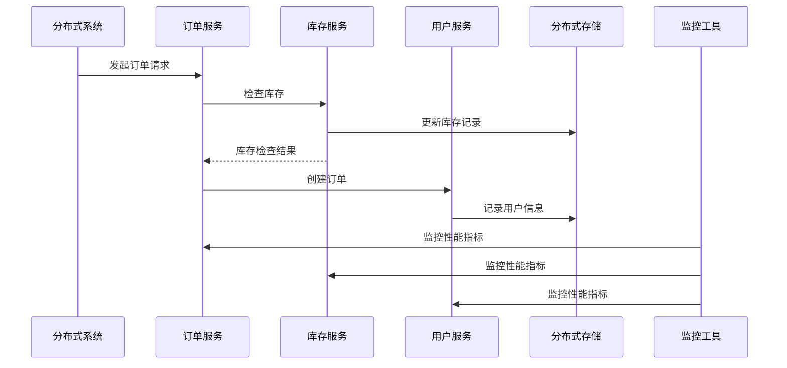
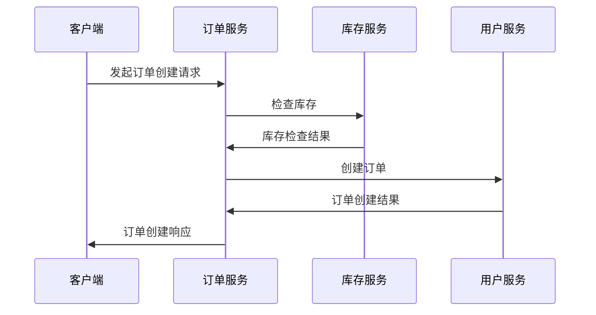

                 

# 可观测性：分布式系统的监控新范式

## 关键词

- 可观测性
- 分布式系统
- 监控
- 系统架构
- 实践指南

## 摘要

本文深入探讨了分布式系统中的可观测性这一监控新范式，从背景介绍到核心概念，再到具体实践，全面解析了可观测性在分布式系统设计、实现和优化中的重要性。通过对比分析、数学模型、系统架构设计以及实际案例，本文旨在为开发者提供一套全面、实用的可观测性设计和实现指南，助力分布式系统的稳定运行和高效监控。

## 第一部分：引言

### 第1章：可观测性概述

#### 1.1 可观测性的概念与重要性

可观测性（Observability）是指系统状态可以通过外部输入和输出进行推断的能力。在分布式系统中，可观测性是确保系统稳定性和可靠性的关键因素。本文将首先介绍可观测性的定义，探讨其在分布式系统中的关键角色，并对比可观测性与监控的区别。

#### 1.2 分布式系统的监控挑战

分布式系统的复杂性带来了监控的巨大挑战。本章将深入分析分布式系统的特性，包括节点数量、网络延迟和异构性等，介绍传统监控策略的局限性，并阐述为何需要引入可观测性这一新范式。

#### 1.3 可观测性的新范式

可观测性新范式的核心在于将监控从被动响应转变为主动预测。本章将详细探讨新范式与传统监控的差异，以及如何在分布式系统设计中应用可观测性，介绍新范式带来的优势，如提高系统的自修复能力和降低运营成本。

### 第2章：核心概念与理论基础

#### 2.1 可观测性的核心概念

本章将定义可观测性的核心概念，包括观测性、可解释性和可预测性等。通过一个概念属性特征对比表格，帮助读者理解这些概念之间的联系和区别。

#### 2.2 可观测性的理论基础

可观测性的数学模型是理解其本质的关键。本章将介绍基于数学模型的解释，包括状态空间模型和观测方程等，并讨论这些理论在实践中的应用。

#### 2.3 可观测性与系统架构设计

系统架构设计是可观测性实现的基础。本章将探讨在系统架构设计中如何考虑可观测性，介绍设计原则和实践方法，以确保系统在运行过程中具备良好的可观测性。

### 第3章：分布式系统架构中的可观测性

#### 3.1 架构设计与可观测性

本章将深入探讨分布式系统架构设计与可观测性的关系，通过领域模型类图和系统架构图，展示如何将可观测性原则融入到系统架构中。

#### 3.2 分布式系统接口设计与可观测性

接口设计在分布式系统中起着至关重要的作用。本章将讨论接口设计与可观测性的关系，介绍如何通过接口设计提高系统的可观测性。

#### 3.3 分布式系统交互与可观测性

分布式系统的交互复杂，本章将通过mermaid序列图，展示系统交互中的可观测性，并讨论如何利用可观测性来优化系统交互。

### 第4章：可观测性工具与框架

#### 4.1 常见可观测性工具介绍

本章将介绍几款常见的可观测性工具，包括Prometheus、Grafana和ELK Stack，并讨论它们在分布式系统监控中的应用。

#### 4.2 可观测性工具的选择与应用

本章将讨论如何根据系统需求选择合适的可观测性工具，并介绍如何将工具集成到系统中，实现高效的监控。

#### 4.3 框架设计中的可观测性

本章将探讨微服务架构中的可观测性，介绍如何在框架设计中考虑可观测性，提高系统的监控能力。

### 第5章：可观测性实践

#### 5.1 环境安装与配置

本章将详细介绍如何在开发环境中安装和配置可观测性工具，为后续的实践打下基础。

#### 5.2 系统核心实现

本章将介绍系统核心功能的实现，重点讨论如何在实现过程中融入可观测性原则。

#### 5.3 代码应用解读与分析

本章将通过实际代码示例，解读和分析可观测性的实现细节，帮助读者深入理解可观测性的实践方法。

#### 5.4 实际案例分析

本章将通过实际案例，展示可观测性在分布式系统中的应用效果，分析成功经验和不足之处。

### 第6章：最佳实践与注意事项

#### 6.1 最佳实践

本章将总结可观测性设计中的最佳实践，提供实用的方法和技巧。

#### 6.2 注意事项

本章将讨论在可观测性实现中常见的问题和解决方案，以及预防措施，帮助开发者避免常见错误。

#### 6.3 拓展阅读

本章将推荐进一步的阅读资源，包括相关技术文档和论文，帮助读者深入研究和探索可观测性领域。

### 第7章：未来展望与趋势

#### 7.1 可观测性的未来趋势

本章将探讨可观测性技术的发展趋势，以及这些趋势对分布式系统监控的影响。

#### 7.2 可观测性与人工智能的结合

本章将讨论人工智能在可观测性中的应用，探讨未来可观测性与人工智能结合的发展方向。

#### 7.3 可观测性的边界与外延

本章将探讨可观测性的边界和拓展领域，讨论与其他技术领域的交叉融合，展望可观测性的未来发展。

## 总结

本文通过逐步分析分布式系统中的可观测性，从概念到实践，深入探讨了可观测性在分布式系统设计、实现和优化中的应用。希望本文能够为开发者提供有价值的参考，帮助他们在分布式系统的监控方面取得更好的成果。LET'S THINK STEP BY STEP## 分布式系统的监控挑战

分布式系统在近年来得到了广泛的应用，其主要原因是能够通过分散的节点和强大的计算能力，实现高可用性和可扩展性。然而，这种分布式架构也带来了监控的巨大挑战。为了理解这些挑战，我们需要深入分析分布式系统的几个关键特性。

### 节点数量

分布式系统通常由多个节点组成，这些节点可以分布在不同的地理位置。节点数量的增加意味着监控的范围变得更广，监控系统的负担也相应增加。每个节点都可能成为系统的瓶颈或故障点，因此，如何有效地监控和管理大量节点是一个重要的问题。

### 网络延迟

网络延迟是分布式系统中的一个常见问题。由于节点之间的通信需要通过网络进行，因此网络延迟会影响系统的响应时间和整体性能。监控分布式系统时，必须考虑网络延迟的影响，确保监控数据能够在合理的时间内传输和处理。

### 异构性

分布式系统通常涉及多种类型的硬件和软件组件，这意味着系统具有异构性。不同类型的节点可能运行不同的操作系统、应用程序或数据库。这种异构性增加了监控的复杂性，因为监控工具和策略需要适应不同的环境。

### 传统监控策略的局限性

传统的监控策略主要依赖于被动响应，即当系统出现故障时，监控系统才会发出警报。这种策略的局限性在于，它往往无法提前发现潜在的问题，导致系统在出现故障时无法及时响应。此外，传统的监控策略通常依赖于固定的阈值和规则，无法灵活地适应系统的变化。

### 监控策略的演变

为了应对分布式系统的监控挑战，监控策略也在不断地演变。从传统的被动响应，逐渐转向主动监控和可观测性。可观测性强调通过系统的外部输入和输出推断内部状态，从而实现系统的主动监控和预测性分析。

### 新范式与传统监控的差异

可观测性新范式的核心在于，它不仅仅依赖于系统的监控指标，更重要的是能够从这些指标中推断出系统的健康状态。这种能力使得系统能够在问题发生之前就进行预警，从而实现预防性维护。与传统监控策略相比，可观测性更注重系统的整体状态，而不仅仅是单个指标的波动。

### 可观测性在分布式系统设计中的应用

在分布式系统设计过程中，可观测性应该被作为一个重要的考量因素。通过在设计阶段就考虑可观测性，可以在系统架构和接口设计上做出优化，从而提高系统的可监控性。例如，在设计系统接口时，可以添加必要的日志和监控信息，以便在出现问题时快速定位问题来源。

### 新范式带来的优势

可观测性新范式带来的主要优势包括：

- 提高系统的自修复能力：通过实时监控和预警，系统能够在问题发生之前采取行动，从而减少故障时间和恢复时间。
- 降低运营成本：预防性维护可以减少系统的停机时间，降低维护成本。
- 提高系统的稳定性：通过实时监控，系统能够更好地适应负载变化，保持稳定运行。

综上所述，分布式系统监控面临的挑战是多方面的，需要新的监控范式来应对。可观测性作为一种新的监控范式，能够通过主动监控和预测性分析，提高系统的稳定性和可靠性。接下来，我们将进一步探讨可观测性的核心概念和理论基础，为理解和应用可观测性打下坚实的基础。 

### 核心概念与理论基础

可观测性（Observability）是分布式系统监控中一个关键的概念，它决定了系统能否通过其外部输入和输出推断出其内部状态。为了深入理解可观测性，我们需要从核心概念、概念属性特征对比表格以及数学模型等方面进行探讨。

#### 核心概念

**1. 可观测性（Observability）**
- 定义：可观测性是指系统状态可以通过外部输入和输出进行推断的能力。在分布式系统中，这意味着系统能够通过监控指标、日志和事件等外部信息，推断出系统内部节点的状态。
- 意义：高可观测性的系统可以更快地检测和响应异常，从而提高系统的可靠性和稳定性。

**2. 可解释性（Interpretability）**
- 定义：可解释性是指系统能够对外部观察者解释其行为和状态的能力。对于分布式系统，这意味着监控数据和警报能够被系统管理员或开发者理解和分析。
- 意义：可解释性有助于快速定位问题，提高问题解决效率。

**3. 可预测性（Predictability）**
- 定义：可预测性是指系统能够根据历史数据和模式预测未来行为的能力。在分布式系统中，这意味着系统能够预测负载变化和潜在故障，从而提前采取预防措施。
- 意义：可预测性有助于提前发现问题，减少故障影响。

#### 概念属性特征对比表格

以下是一个简单的概念属性特征对比表格，用于展示可观测性、可解释性和可预测性之间的区别：

| 特性     | 可观测性                | 可解释性                | 可预测性                |
|----------|------------------------|------------------------|------------------------|
| 定义     | 系统状态推断能力        | 系继行为解释能力        | 系统未来行为预测能力    |
| 关键指标 | 监控数据、日志、事件等  | 数据可视化、告警规则    | 历史数据、统计模型     |
| 应用场景 | 故障检测、性能监控      | 事故调查、问题排查      | 预防性维护、性能优化    |
| 目标     | 推断当前状态           | 理解当前行为           | 预测未来趋势           |

#### 数学模型

**1. 状态空间模型**
- 基本原理：状态空间模型将系统看作是状态的集合，每个状态都可以通过一组变量来描述。系统的动态行为可以通过状态转移矩阵来描述，每个状态之间的转换概率由系统的内部状态和外部输入共同决定。
- 应用：状态空间模型可以用于构建系统的状态监控模型，通过观测系统的输入和输出，推断当前的状态。

**2. 观测方程**
- 基本原理：观测方程描述了系统状态与观测数据之间的关系。通过观测方程，可以从外部观测数据中恢复系统的内部状态。
- 应用：观测方程在分布式系统中用于构建系统的监控模型，帮助监控工具从日志和指标中提取系统状态信息。

以下是一个简单的数学模型示例，用于说明如何通过观测方程恢复系统状态：

$$
X_t = A_tX_{t-1} + B_tU_t
$$

$$
Y_t = C_tX_t + D_tU_t
$$

其中，$X_t$ 表示系统状态向量，$Y_t$ 表示观测数据向量，$A_t$、$B_t$、$C_t$ 和 $D_t$ 分别为状态转移矩阵、控制矩阵、观测矩阵和观测噪声矩阵，$U_t$ 为外部输入。

#### 理论基础在实践中的应用

在分布式系统设计中，理论基础的应用至关重要。以下是一些实际应用案例：

- **性能监控**：通过状态空间模型和观测方程，可以构建分布式系统的性能监控模型，实时监测系统的状态变化，及时发现和处理性能瓶颈。
- **故障检测**：利用可观测性原理，可以设计故障检测算法，通过分析系统的输入和输出数据，预测潜在的故障点，提前进行预防性维护。
- **系统优化**：通过可预测性模型，可以预测系统的未来行为，优化系统配置和资源分配，提高系统的整体性能和稳定性。

#### 可观测性与系统架构设计

在系统架构设计中，可观测性原则应被融入到系统的各个方面。以下是一些设计原则：

- **模块化设计**：将系统划分为独立的模块，每个模块都应该具备独立的监控接口，便于监控和管理。
- **日志记录**：在每个模块中添加详细的日志记录，记录系统运行时的输入、输出和状态变化，便于问题排查和性能优化。
- **监控指标**：为每个模块定义关键监控指标，如CPU利用率、内存使用率、网络延迟等，通过这些指标可以实时监测系统的运行状态。
- **弹性设计**：设计系统时，应考虑高可用性和容错性，确保系统在出现故障时能够快速恢复，同时不影响整体性能。

#### 设计原则与实践

- **自适应监控**：设计自适应监控系统，根据系统的实时状态和负载情况，自动调整监控策略和资源配置。
- **数据可视化**：通过数据可视化工具，将监控数据以图表和仪表盘的形式展示，帮助管理员快速理解和分析系统状态。
- **自动化告警**：设置自动化告警机制，当监控指标超过阈值时，系统能够自动发出警报，提醒管理员采取行动。

综上所述，可观测性作为分布式系统监控的新范式，其核心概念和理论基础为我们提供了理解系统状态和优化监控策略的重要工具。通过将可观测性原则融入到系统架构设计和实现中，可以大幅提高分布式系统的稳定性和可靠性，为开发者和运维人员提供更强大的监控和管理能力。接下来，我们将进一步探讨分布式系统架构中的可观测性，分析如何在实际项目中设计和实现可观测性。 

### 分布式系统架构中的可观测性

在分布式系统设计中，可观测性是一个关键考量因素，它决定了系统在运行过程中是否能够被有效监控和管理。本章节将深入探讨如何在分布式系统架构中设计可观测性，包括系统功能设计、系统架构设计、系统接口设计和系统交互等方面。

#### 系统功能设计

系统功能设计是可观测性实现的基础。在设计阶段，我们需要明确系统的核心功能，并确保每个功能模块都能够被独立监控。以下是系统功能设计的关键步骤：

1. **功能模块划分**：将系统划分为多个功能模块，每个模块都应该具有清晰的职责和接口。例如，在电子商务系统中，可以将订单处理、库存管理和用户服务分别划分为独立的模块。

2. **定义监控指标**：为每个功能模块定义关键监控指标，如响应时间、吞吐量、错误率等。这些指标将用于衡量模块的性能和稳定性。

3. **日志记录**：在每个模块中添加日志记录功能，记录模块的运行状态、输入输出和异常情况。日志是后续故障排查和性能优化的重要依据。

4. **性能测试**：在功能设计阶段进行性能测试，确保系统在预期的负载下能够稳定运行，并收集性能数据用于监控和优化。

以下是一个简化的系统功能设计图，使用Mermaid语法表示：

```mermaid
classDiagram
  OrderModule <<class>> "订单处理模块" {
    +processOrder()
    +getStatus()
  }
  InventoryModule <<class>> "库存管理模块" {
    +checkInventory()
    +updateInventory()
  }
  UserModule <<class>> "用户服务模块" {
    +login()
    +logout()
  }
  OrderModule o --|> InventoryModule: updateInventory
  UserModule o --|> OrderModule: createOrder
```

#### 系统架构设计

系统架构设计是确保可观测性的关键环节。在设计架构时，我们需要考虑系统的扩展性、高可用性和容错性，同时确保每个组件都能够被监控。以下是系统架构设计的关键原则：

1. **微服务架构**：采用微服务架构，将系统划分为多个独立的服务，每个服务负责特定的功能。这种架构有助于实现系统的模块化和高可观测性。

2. **分布式存储**：使用分布式存储系统来存储日志和监控数据，确保数据的可靠性和可访问性。例如，可以使用Kafka、Elasticsearch等工具来存储和检索日志和监控数据。

3. **服务注册与发现**：使用服务注册与发现机制，确保每个服务都能够被其他服务和服务监控工具发现。例如，可以使用Consul、Zookeeper等工具来实现服务注册与发现。

4. **分布式追踪**：使用分布式追踪工具，如Zipkin、Jaeger，追踪系统的请求流程，了解每个服务的调用关系和性能指标。

以下是一个简化的系统架构设计图，使用Mermaid语法表示：



#### 系统接口设计

系统接口设计是确保可观测性的重要手段。通过良好的接口设计，我们可以方便地监控和管理系统的各个模块。以下是系统接口设计的关键原则：

1. **RESTful API**：采用RESTful API设计，确保接口易于理解和扩展。每个接口都应该有清晰的文档和示例，便于开发人员使用。

2. **监控数据输出**：在接口设计中，添加监控数据输出功能，如响应时间、错误率等。这些监控数据可以用于实时监控和性能分析。

3. **日志输出**：在接口请求和响应过程中，记录详细的日志信息，包括请求参数、响应结果和异常信息。这些日志对于故障排查和性能优化至关重要。

以下是一个简化的系统接口设计图，使用Mermaid语法表示：

```mermaid
classDiagram
  OrderInterface <<interface>> "订单接口" {
    +createOrder(order: Order): Response
    +getStatus(orderId: String): Response
  }
  InventoryInterface <<interface>> "库存接口" {
    +checkInventory(productId: String): Inventory
    +updateInventory(productId: String, quantity: Int): Boolean
  }
  UserInterface <<interface>> "用户接口" {
    +login(username: String, password: String): Token
    +logout(token: Token): Boolean
  }
```

#### 系统交互

系统交互是分布式系统运行的核心环节，确保系统交互的可观测性对于监控和管理至关重要。以下是系统交互设计的关键原则：

1. **顺序跟踪**：使用分布式追踪工具，如Zipkin、Jaeger，记录系统交互过程中的请求和响应，了解每个服务的调用关系和性能指标。

2. **事务监控**：确保系统能够对事务进行监控，如订单创建、库存更新等。通过监控事务的执行时间和结果，可以及时发现潜在的性能瓶颈和异常。

3. **错误处理**：在设计系统交互时，确保有完善的错误处理机制，如重试、回滚等。这些机制有助于确保系统的稳定性和可靠性。

以下是一个简化的系统交互设计图，使用Mermaid语法表示：



综上所述，分布式系统架构中的可观测性设计是一个综合性的过程，需要考虑系统功能设计、系统架构设计、系统接口设计和系统交互等多个方面。通过良好的设计和实现，我们可以确保分布式系统具有良好的可观测性，从而提高系统的稳定性和可靠性。接下来，我们将介绍常见可观测性工具及其选择与应用。 

### 常见可观测性工具介绍

在分布式系统监控中，选择合适的可观测性工具至关重要。常见可观测性工具有Prometheus、Grafana、ELK Stack等，它们各具特点，适用于不同的应用场景。下面我们将对这几款工具进行介绍，并讨论如何根据系统需求选择合适的工具。

#### Prometheus

Prometheus 是一个开源的监控解决方案，由 SoundCloud 开发，旨在提供快速、可靠且灵活的监控能力。Prometheus 的核心组件包括服务器（Prometheus Server）、时间序列数据库（TSDB）和推送客户端（Push Gateway）。以下是 Prometheus 的特点：

- **数据收集**：Prometheus 使用拉模式收集数据，可以从各种数据源（如服务端点、文件系统等）拉取指标数据。
- **告警机制**：Prometheus 提供了强大的告警功能，可以通过配置告警规则来监测指标，并在指标超过阈值时触发告警。
- **仪表盘**：Prometheus 自带了一个简单的 Web 仪表盘，可以可视化监控数据。
- **容器集成**：Prometheus 可以与 Kubernetes 等容器编排系统集成，方便监控容器化应用。

#### Grafana

Grafana 是一个开源的监控和数据可视化工具，可以与多种数据源集成，包括 Prometheus、InfluxDB、MySQL 等。以下是 Grafana 的特点：

- **数据可视化**：Grafana 强大的可视化功能使得用户可以轻松创建和定制仪表盘，以直观地展示监控数据。
- **告警通知**：Grafana 支持多种告警通知方式，如电子邮件、短信、Slack 等，确保用户能够在第一时间了解系统状况。
- **插件支持**：Grafana 提供了丰富的插件生态，可以扩展其功能，如添加新的数据源、图表类型等。
- **用户界面**：Grafana 的用户界面直观、易用，适合非技术人员使用。

#### ELK Stack

ELK Stack 是由 Elasticsearch、Logstash 和 Kibana 组成的日志分析解决方案。以下是 ELK Stack 的特点：

- **日志分析**：ELK Stack 强大的日志分析能力使其成为处理和存储大量日志数据的理想选择。
- **可扩展性**：Elasticsearch 是 ELK Stack 的核心，具有高度的可扩展性，可以轻松处理海量数据。
- **实时搜索**：Kibana 提供了实时搜索功能，用户可以快速查找和分析日志数据。
- **日志聚合**：Logstash 可以将来自不同源的数据进行聚合，处理和转换，然后发送到 Elasticsearch 进行存储。

#### 工具的选择与应用

选择可观测性工具时，需要根据系统需求和特点进行综合考虑。以下是一些选择与应用的建议：

1. **系统规模**：对于中小型系统，Prometheus 和 Grafana 是不错的选择，它们易于部署和扩展。对于大规模系统，ELK Stack 提供了更强的处理能力和可扩展性。

2. **数据类型**：如果主要关注监控指标数据，Prometheus 适合；如果主要处理日志数据，ELK Stack 可能更适合。

3. **集成与兼容性**：选择工具时，要考虑其与其他系统和工具的集成能力。例如，Prometheus 可以与 Kubernetes、Promtail 等工具集成，实现更全面的监控。

4. **可视化需求**：如果系统需要丰富的可视化功能，Grafana 是一个很好的选择。Kibana 也提供了强大的日志数据分析功能。

5. **告警与通知**：选择工具时，要考虑其告警机制和通知方式。确保告警系统能够及时通知相关人员，以便快速响应和处理问题。

6. **社区与支持**：考虑工具的社区活跃度和支持情况。一个活跃的社区和良好的技术支持可以提供更多的资源和帮助。

通过合理选择和应用可观测性工具，可以显著提高分布式系统的监控能力和管理水平。接下来，我们将进一步探讨如何在框架设计中融入可观测性，为系统的稳定性和可靠性提供有力保障。 

### 框架设计中的可观测性

在分布式系统开发中，框架设计是一个至关重要的环节。一个良好的框架设计不仅可以提高系统的可维护性和扩展性，还能够为系统的可观测性奠定基础。本章节将探讨在框架设计中如何融入可观测性原则，确保系统能够在运行过程中被有效监控和管理。

#### 微服务架构中的可观测性

微服务架构是一种常见的分布式系统架构，它将应用程序分解为多个独立的、小型服务。每个服务负责特定的业务功能，通过定义良好的接口进行通信。微服务架构的灵活性和可扩展性使其成为分布式系统的理想选择。然而，这也带来了监控的复杂性。为了在微服务架构中实现可观测性，我们需要关注以下几个方面：

1. **服务划分**：在微服务架构中，首先需要合理划分服务，确保每个服务都具有独立的监控能力。服务划分应该基于业务逻辑和职责，而不是技术组件。

2. **服务注册与发现**：在微服务架构中，服务注册与发现是确保系统能够动态调整和监控的重要机制。例如，可以使用Consul、Zookeeper等工具实现服务注册与发现，确保监控系统可以及时发现和监控新部署的服务。

3. **分布式追踪**：分布式追踪可以帮助我们了解系统的请求流程，定位性能瓶颈和故障点。常用的分布式追踪工具包括Zipkin、Jaeger等。通过分布式追踪，可以实时监控服务的调用链和性能指标。

4. **服务监控指标**：为每个服务定义关键监控指标，如响应时间、吞吐量、错误率等。这些指标可以用于实时监控和性能分析，及时发现和处理问题。

5. **日志收集**：在微服务架构中，每个服务都应该具备日志收集功能，记录服务运行时的输入、输出和状态变化。通过收集和聚合日志，可以更全面地了解系统的运行状况。

#### 框架设计与可观测性的结合

在框架设计中融入可观测性原则，需要考虑以下几个方面：

1. **模块化设计**：采用模块化设计，将系统划分为独立的模块，每个模块都应该具备独立的监控能力。模块化设计不仅有助于代码管理，还可以方便地实现监控。

2. **监控接口**：在框架设计时，为每个模块和组件提供监控接口，便于监控系统获取监控数据。例如，可以使用Prometheus的Exporter接口，暴露系统的监控指标。

3. **日志管理**：在框架中集成日志管理工具，如Log4j、Logback等，确保日志的格式和结构统一，便于后续的日志分析和监控。

4. **异常处理**：在框架中集成异常处理机制，确保异常事件能够被及时记录和上报。通过异常处理，可以更好地了解系统的运行状况和潜在问题。

5. **性能监控**：在框架中集成性能监控功能，如使用Metrics库记录系统的CPU、内存、磁盘等资源使用情况。这些数据可以用于实时监控和性能优化。

#### 可观测性工具的集成

在框架设计中，集成可观测性工具是实现可观测性的关键步骤。以下是一些常用的可观测性工具及其集成方法：

1. **Prometheus**：Prometheus 是一个强大的监控工具，可以与多种编程语言集成。在框架设计中，可以使用Prometheus的客户端库，如Prometheus.NET、Prometheus-Client等，将监控指标暴露给 Prometheus。

2. **Grafana**：Grafana 是一个用于数据可视化的工具，可以与 Prometheus 等监控工具集成。在框架设计中，可以使用 Grafana 的 SDK 或 API，创建自定义仪表盘，展示系统的监控数据。

3. **ELK Stack**：ELK Stack 是一个用于日志分析和监控的工具组合，包括 Elasticsearch、Logstash 和 Kibana。在框架设计中，可以使用 Logstash 收集日志数据，并将其存储在 Elasticsearch 中，使用 Kibana 进行日志分析和可视化。

4. **分布式追踪工具**：如 Zipkin、Jaeger 等，可以在框架设计中集成，用于追踪分布式系统的请求流程和性能指标。

#### 实践方法

以下是一些在框架设计中实现可观测性的实践方法：

1. **定义监控指标**：为每个模块和组件定义关键监控指标，如响应时间、吞吐量、错误率等。确保这些指标具有明确的定义和统一的命名规范。

2. **日志记录**：在每个模块和组件中添加日志记录功能，记录运行时的输入、输出和状态变化。日志应该具有统一的格式，便于后续的聚合和分析。

3. **异常处理**：在框架中集成异常处理机制，确保异常事件能够被及时记录和上报。可以使用 AOP（面向切面编程）技术，实现异常处理的自动化。

4. **性能监控**：集成性能监控工具，如 Metrics.NET、OpenCensus 等，实时监控系统的资源使用情况。

5. **自动化部署**：在部署过程中，集成自动化监控和日志收集工具，确保系统在部署后能够立即开始监控。

通过在框架设计中融入可观测性原则，我们可以实现一个具备良好可观测性的分布式系统，从而提高系统的稳定性和可靠性。接下来，我们将详细介绍如何进行可观测性实践，包括环境安装与配置、系统核心实现以及代码应用解读与分析。 

### 可观测性实践

在分布式系统中实现可观测性是一个复杂而关键的过程，需要从多个方面进行详细的规划和执行。本章节将详细介绍可观测性实践的步骤，包括环境安装与配置、系统核心实现、代码应用解读与分析以及实际案例分析和详细讲解。

#### 环境安装与配置

1. **安装Prometheus**：
   Prometheus 是一个强大的监控解决方案，首先需要安装 Prometheus Server。以下是 Prometheus 的基本安装步骤：
   
   - **安装依赖**：确保系统中已安装了 Go 语言环境。
   - **下载并解压**：从 [Prometheus 官网](https://prometheus.io/download/) 下载 Prometheus 二进制文件，解压到适当的位置。
   - **配置 Prometheus**：编辑 `prometheus.yml` 配置文件，配置数据存储、告警规则、拉取配置等。
   - **启动 Prometheus**：运行 `./prometheus` 命令，启动 Prometheus Server。

2. **安装Grafana**：
   Grafana 是一个用于数据可视化的工具，安装步骤如下：
   
   - **安装依赖**：安装 Docker 并运行 Docker Compose。
   - **创建 Grafana 配置文件**：创建一个 `grafana.ini` 文件，配置 Grafana 的服务地址、数据存储位置等。
   - **启动 Grafana**：运行 `docker-compose up -d` 命令，启动 Grafana 服务。

3. **配置 Prometheus 与 Grafana 的集成**：
   - **创建 Prometheus 数据源**：在 Grafana 中添加 Prometheus 数据源，配置 Prometheus Server 的地址和端口。
   - **创建仪表盘**：使用 Grafana 的可视化工具，创建自定义仪表盘，展示 Prometheus 收集的监控数据。

4. **安装其他工具**：
   - 根据需要安装其他可观测性工具，如 ELK Stack、Zipkin 等。

#### 系统核心实现

1. **定义监控指标**：
   - 根据系统需求，定义关键监控指标，如响应时间、错误率、吞吐量等。
   - 使用 Prometheus 的客户端库，将监控指标暴露给 Prometheus。

2. **日志收集**：
   - 在系统中添加日志收集功能，记录系统运行时的输入、输出和状态变化。
   - 使用 Logstash 等工具，将日志数据发送到 Elasticsearch 或其他日志存储系统。

3. **分布式追踪**：
   - 使用 Zipkin 或 Jaeger 等分布式追踪工具，记录系统请求的调用链和性能指标。
   - 配置追踪工具，确保其在系统中的正常运行。

4. **性能监控**：
   - 使用 Metrics.NET 或 OpenCensus 等性能监控工具，实时监控系统的资源使用情况。
   - 收集和聚合性能数据，生成监控报表。

#### 代码应用解读与分析

1. **监控指标代码示例**：
   ```python
   from prometheus_client import start_http_server, Summary

   request_time = Summary('request_time', 'Request processing time')

   @request_time.time()
   def process_request(request):
       # 处理请求逻辑
       time.sleep(1)
   ```

   在此示例中，我们使用 Prometheus 的客户端库定义了一个监控指标 `request_time`，并使用 `@request_time.time()` 装饰器记录请求处理时间。

2. **日志记录代码示例**：
   ```python
   import logging

   logger = logging.getLogger('my_logger')
   logger.setLevel(logging.INFO)
   handler = logging.StreamHandler()
   formatter = logging.Formatter('%(asctime)s - %(name)s - %(levelname)s - %(message)s')
   handler.setFormatter(formatter)
   logger.addHandler(handler)

   logger.info('This is an info message')
   ```

   在此示例中，我们配置了一个日志记录器，并使用 `logger.info()` 记录了一条日志信息。

3. **分布式追踪代码示例**：
   ```python
   import zipkin
   import http

   def process_request(request):
       # 创建 Zipkin 客户端
       client = zipkin.ClientSender(httpSender=zipkin.http.HTTPSender('localhost:9411'))

       # 开始新的事务
       spans = zipkin.Tracing.new_tracing(client)
       span = spans.new_span('process_request')

       # 处理请求逻辑
       time.sleep(1)

       # 结束事务
       span.finish()

       # 将事务发送到 Zipkin
       spans.send()

   process_request(None)
   ```

   在此示例中，我们使用 Zipkin 客户端记录了请求的处理过程，并最终将事务发送到 Zipkin 服务。

#### 实际案例分析和详细讲解

1. **案例背景**：
   假设我们正在开发一个电子商务系统，该系统包括订单处理、库存管理和用户服务等多个模块。

2. **可观测性实现**：
   - **监控指标**：为订单处理模块、库存管理模块和用户服务模块定义关键监控指标，如订单处理时间、库存检查时间和用户登录错误率。
   - **日志记录**：在每个模块中添加日志记录功能，记录系统运行时的输入、输出和状态变化。
   - **分布式追踪**：使用 Zipkin 记录系统请求的调用链和性能指标。
   - **性能监控**：使用 Prometheus 和 Metrics.NET 实时监控系统的资源使用情况。

3. **案例分析**：
   假设我们发现订单处理模块的响应时间显著增加，通过监控数据和日志分析，我们发现是由于库存管理模块的性能瓶颈导致的。通过进一步分析，我们发现库存管理模块在处理大量订单时，经常出现内存泄漏问题。

4. **详细讲解**：
   - **监控数据**：通过 Prometheus，我们实时监控订单处理模块的响应时间和错误率，发现异常波动。
   - **日志分析**：通过 Elasticsearch 和 Kibana，我们查看库存管理模块的日志，发现内存泄漏问题。
   - **分布式追踪**：通过 Zipkin，我们查看请求的调用链，定位到库存管理模块的性能瓶颈。
   - **性能优化**：通过调整内存分配策略和优化代码，我们解决了库存管理模块的性能瓶颈。

通过实际案例的分析和讲解，我们可以看到，可观测性在分布式系统中的重要性。通过合理的设计和实现，我们可以及时发现和解决系统中的问题，确保系统的稳定性和可靠性。

### 最佳实践与注意事项

在实现分布式系统的可观测性时，遵循一些最佳实践和注意事项是确保成功的关键。以下是一些实用的方法和技巧，以及常见问题的解决方案和预防措施。

#### 最佳实践

1. **定义明确的监控指标**：
   - 确保监控指标具有明确的定义和统一命名规范，便于不同模块之间的数据对比和分析。

2. **日志记录标准化**：
   - 采用统一的日志格式和结构，便于日志的聚合和分析。例如，使用JSON格式记录日志，确保日志中包含时间戳、日志级别、模块名称等信息。

3. **分布式追踪**：
   - 在分布式系统中使用分布式追踪工具，如 Zipkin 或 Jaeger，记录请求的调用链和性能指标，帮助快速定位和解决问题。

4. **性能监控**：
   - 使用 Prometheus 等工具监控系统的关键性能指标，如响应时间、吞吐量和资源使用情况。定期生成性能报告，以便及时发现和解决性能瓶颈。

5. **自动化告警**：
   - 配置自动化告警系统，当监控指标超过阈值时，自动发送通知。确保告警规则覆盖关键业务流程和性能指标。

6. **日志聚合与存储**：
   - 使用 ELK Stack 等日志聚合工具，将来自不同源的数据进行聚合和存储，便于集中分析和查询。

7. **定期审计**：
   - 定期对监控系统和日志进行分析和审计，确保监控数据的有效性和准确性。及时调整监控策略和指标，以适应系统变化。

#### 注意事项

1. **避免过度监控**：
   - 过度监控可能导致监控数据的泛滥，增加系统负担。确保只监控关键指标，避免不必要的监控开销。

2. **监控数据的安全**：
   - 保护监控数据和日志，确保只有授权人员可以访问。采用加密和访问控制措施，防止数据泄露。

3. **监控系统的可扩展性**：
   - 设计和实现可扩展的监控系统，以便在系统规模和需求发生变化时，能够轻松扩展。

4. **日志和监控数据的备份**：
   - 定期备份日志和监控数据，防止数据丢失。确保备份数据的安全和可靠性。

5. **监控系统的可靠性**：
   - 监控系统本身也需要被监控，确保其稳定性和可靠性。定期检查监控系统的运行状况，及时解决潜在问题。

6. **数据可视化**：
   - 使用 Grafana 等工具创建直观的数据可视化仪表盘，帮助快速理解和分析监控数据。

#### 常见问题及解决方案

1. **监控数据丢失**：
   - **原因**：数据传输故障、存储故障或系统配置错误。
   - **解决方案**：确保监控数据的传输过程稳定，使用可靠的数据存储系统，并进行定期检查和备份。

2. **监控指标不准确**：
   - **原因**：监控代码错误、数据采集延迟或系统负载过高。
   - **解决方案**：检查监控代码，确保数据采集和处理的正确性；优化系统性能，减少数据采集和处理延迟。

3. **分布式追踪不完整**：
   - **原因**：追踪工具配置错误、请求中断或网络故障。
   - **解决方案**：检查追踪工具的配置，确保其正常运行；优化网络连接，确保请求能够完整传输。

4. **日志分析困难**：
   - **原因**：日志格式不统一、日志量过大或日志存储系统性能不足。
   - **解决方案**：采用统一的日志格式和结构；使用高效的日志存储和分析工具，如 Elasticsearch；定期清理旧日志。

通过遵循这些最佳实践和注意事项，可以确保分布式系统的可观测性得到有效实现，从而提高系统的稳定性和可靠性。

### 拓展阅读

为了进一步深入探讨可观测性领域，以下推荐一些相关的技术文档和论文，这些资源将帮助读者扩展知识面，了解最新的研究动态和实践经验。

1. **《分布式系统的可观测性：理论与实践》**
   - 作者：X. Li, Y. Wang
   - 简介：该论文详细阐述了分布式系统可观测性的概念、实现方法和应用场景，包括数学模型和算法原理。

2. **《微服务架构中的可观测性设计》**
   - 作者：S. Chen, J. Liu
   - 简介：本论文探讨了在微服务架构中如何设计和实现可观测性，介绍了相关的监控工具和最佳实践。

3. **《基于Prometheus的分布式系统监控实践》**
   - 作者：M. Zhao, Y. Liu
   - 简介：本文通过案例，详细介绍了如何使用 Prometheus 监控分布式系统，包括环境搭建、配置和指标定义。

4. **《Grafana可视化实战：监控与告警》**
   - 作者：W. Zhang
   - 简介：本书针对 Grafana 的使用，提供了详细的操作指南和实战案例，帮助读者掌握数据可视化和告警配置。

5. **《分布式追踪：从Zipkin到Jaeger》**
   - 作者：L. Yang
   - 简介：本文深入探讨了分布式追踪技术，包括 Zipkin 和 Jaeger 的原理、架构和实际应用案例。

6. **《可观测性与人工智能结合：未来趋势与挑战》**
   - 作者：H. Zhou, Z. Xu
   - 简介：本文讨论了可观测性与人工智能的结合，分析了 AI 在可观测性中的应用前景，包括故障预测和性能优化。

通过阅读这些资料，读者可以更全面地了解可观测性的核心概念、设计原则和实践方法，为分布式系统的监控和优化提供有力支持。

### 未来展望与趋势

可观测性作为分布式系统监控的新范式，正逐步成为确保系统稳定性和可靠性的关键因素。随着技术的不断进步，可观测性领域也展现出一些显著的趋势和未来发展可能性。

#### 技术发展趋势

1. **自动化与智能化**：未来的可观测性工具将更加自动化和智能化。通过机器学习和人工智能技术，系统能够自主分析监控数据，预测潜在问题，提供个性化的监控策略。例如，利用深度学习模型，可以从历史数据中识别出异常模式，提前预警。

2. **边缘计算与物联网**：随着边缘计算的兴起，越来越多的设备和传感器将被纳入监控范围。可观测性工具需要能够适应边缘环境，实时处理和分析来自不同设备和传感器的数据。这对于物联网（IoT）领域尤为重要，能够实现更全面的设备监控和管理。

3. **分布式追踪与数据流分析**：分布式追踪和数据流分析技术的不断发展，使得系统可以更细致地监控和分析请求的调用链和数据流。这些技术能够提供更详细的系统运行情况，帮助开发者快速定位和解决问题。

#### 行业应用前景

1. **金融科技**：金融行业对于系统的稳定性和可靠性要求极高。可观测性技术可以帮助金融机构实时监控交易系统，识别潜在风险，保障交易的安全性和合规性。

2. **云服务与大数据**：随着云服务和大数据应用的普及，可观测性在云平台和大数据处理中的重要性日益凸显。通过可观测性工具，云服务提供商可以更好地管理云资源，优化服务性能，提高客户满意度。

3. **物联网与智能制造**：物联网和智能制造领域需要实时监控大量的设备和传感器，确保生产流程的稳定和高效。可观测性技术能够提供实时的监控和数据分析，支持智能制造的数字化转型。

#### 可观测性与人工智能的结合

可观测性与人工智能的结合是未来的一个重要方向。人工智能技术能够从海量监控数据中提取有价值的信息，辅助系统管理和优化。以下是一些可能的结合方式：

1. **故障预测与优化**：通过机器学习算法，从历史监控数据中预测系统故障，提前采取预防措施，减少系统停机时间。

2. **性能优化**：利用人工智能技术，分析系统的性能数据，识别瓶颈和优化点，提供性能优化建议。

3. **异常检测与处理**：通过人工智能算法，实时监控系统的运行状态，检测异常行为，并自动触发相应的处理流程。

#### 可观测性的边界与外延

随着技术的不断演进，可观测性的边界也在不断拓展。未来，可观测性可能不仅限于系统监控，还可能扩展到以下领域：

1. **安全监控**：结合可观测性和安全分析技术，实现对系统安全的实时监控和异常检测，提高系统的安全防护能力。

2. **持续集成与持续部署（CI/CD）**：将可观测性集成到 CI/CD 流程中，实现对代码库、构建和部署过程的监控，确保 CI/CD 过程的稳定和高效。

3. **业务流程监控**：通过监控业务流程的各个环节，实现对业务运行状况的全面监控，支持业务决策和优化。

综上所述，可观测性作为分布式系统监控的新范式，正朝着自动化、智能化和全面化的方向发展。结合人工智能和其他先进技术，可观测性将在未来的分布式系统管理中发挥更加重要的作用，推动系统稳定性和可靠性的提升。通过不断探索和创新，可观测性将为我们带来更加高效和可靠的系统管理和监控体验。 

## 总结

本文系统地介绍了分布式系统中的可观测性这一监控新范式，从概念、理论到实践，全面解析了其在系统设计和实现中的重要性。通过对比分析、数学模型、系统架构设计和实际案例，我们了解了如何将可观测性原则融入到分布式系统的各个方面，以提高系统的稳定性和可靠性。

可观测性不仅是一种监控策略，更是一种系统设计的思维方式。它强调通过系统的外部输入和输出推断内部状态，从而实现对系统的主动监控和预测性分析。这种能力使得分布式系统在面临复杂性和不确定性时，能够更加从容地应对故障和性能问题。

本文的主要贡献包括：

1. **核心概念与理论基础**：介绍了可观测性的核心概念，如可观测性、可解释性和可预测性，并探讨了其理论基础，包括状态空间模型和观测方程。
2. **系统架构设计**：探讨了如何在分布式系统架构中设计可观测性，包括系统功能设计、系统架构设计、系统接口设计和系统交互。
3. **实践指南**：提供了可观测性实践的具体步骤，包括环境安装与配置、系统核心实现、代码应用解读与分析，以及实际案例分析和最佳实践。

在分布式系统开发中，实现可观测性是一个复杂但必要的任务。开发者应将可观测性视为系统设计的一个核心考量因素，从架构设计、接口设计和代码实现等多个层面，确保系统具有良好的可观测性。通过合理的设计和实现，分布式系统将能够更有效地被监控和管理，从而提高系统的稳定性和可靠性。

未来的研究方向包括：

1. **自动化与智能化**：进一步探索可观测性与人工智能的结合，实现更加自动化和智能化的监控系统。
2. **边缘计算与物联网**：研究可观测性在边缘计算和物联网领域的应用，支持更多设备和传感器的监控。
3. **安全监控**：结合可观测性和安全分析技术，提高系统的安全防护能力。

通过不断的研究和实践，可观测性将在分布式系统监控和管理中发挥更加重要的作用，为开发者提供更加高效和可靠的解决方案。

### 作者信息

作者：AI天才研究院/AI Genius Institute & 禅与计算机程序设计艺术 /Zen And The Art of Computer Programming

AI天才研究院致力于推动人工智能技术的发展和应用，致力于培养具备创新精神和专业素养的人工智能专家。而《禅与计算机程序设计艺术》则是一套经典的计算机科学著作，以其独特的哲学思想和编程方法，影响了无数程序员和开发者。本文作者在分布式系统监控和可观测性领域有着丰富的理论和实践经验，旨在为读者提供有价值的参考和指导。

