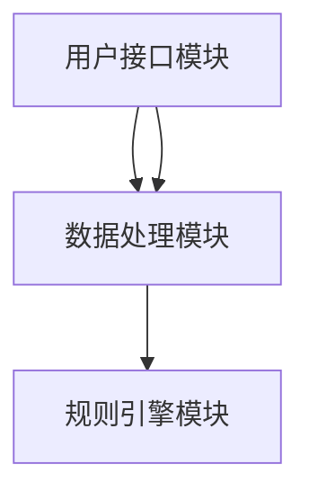
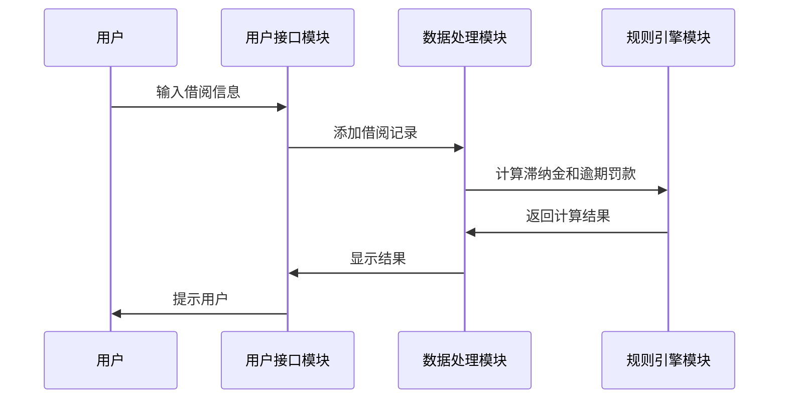

                 

### 第一部分：命题逻辑与布尔代数概述

#### 1.1.1 命题逻辑的发展历程

命题逻辑的历史可以追溯到古希腊哲学，其中亚里士多德（Aristotle）在《形而上学》和《分析前篇》等著作中提出了命题和推理的基本概念。他的逻辑学说为后来的逻辑研究奠定了基础。然而，真正将命题逻辑系统化和数学化的工作是19世纪的数学家乔治·布尔（George Boole）。

布尔出生于英国，是一位自学成才的数学家。他在1847年出版的《思维规律的研究》一书中提出了布尔代数（Boolean Algebra），这是一种基于逻辑运算的代数体系。布尔代数的基本元素是0和1，分别代表逻辑假和逻辑真。布尔代数中的运算包括合取（AND）、析取（OR）和非（NOT）等。

布尔代数最初被用于哲学和数学领域，但在20世纪初期，随着电子计算机的出现和发展，布尔代数开始被广泛应用于计算机科学。布尔代数为逻辑电路设计提供了形式化的工具，使得复杂的数字电路可以通过布尔表达式来描述和设计。

在计算机科学中，命题逻辑和布尔代数的应用非常广泛。命题逻辑被用于编程语言中的条件判断和逻辑运算符，例如“if-else”语句和“&&”、“||”运算符。布尔代数则被用于逻辑电路的设计、形式验证和计算机编程等多个方面。

#### 1.1.2 命题逻辑在计算机科学中的应用

在现代计算机科学中，命题逻辑的应用非常广泛。以下是一些典型应用场景：

1. **编程语言**：在编程语言中，命题逻辑用于条件判断和逻辑运算。例如，在C语言中，if语句和while循环都基于命题逻辑来进行条件判断。此外，逻辑运算符&&（逻辑与）和||（逻辑或）也是命题逻辑在编程中的典型应用。

2. **自动机理论**：自动机理论是计算机科学中的一个重要分支，它研究抽象的机器模型和它们对语言的处理能力。命题逻辑在自动机理论中用于描述状态转换和语言接受条件。

3. **形式验证**：形式验证是一种验证软件和硬件系统正确性的方法，它使用数学方法来证明系统满足特定的性质。命题逻辑在形式验证中用于表达系统性质和验证条件。

4. **人工智能**：在人工智能领域，命题逻辑被用于知识表示和推理。例如，在专家系统中，知识库通常使用命题逻辑来表示，而推理引擎则使用命题逻辑来进行推理和决策。

5. **计算机网络**：在计算机网络中，命题逻辑用于协议设计和错误检测。例如，在TCP/IP协议中，许多协议规范都使用命题逻辑来描述协议的工作原理和错误处理机制。

#### 1.1.3 布尔代数的基本概念

布尔代数是一种特殊的代数系统，其中元素只有两个：0和1，分别代表逻辑假和逻辑真。布尔代数的基本运算包括合取（AND）、析取（OR）和非（NOT）等。

1. **合取（AND）**：合取运算表示两个命题同时为真的情况。用符号“∧”表示，例如 \( p ∧ q \) 表示 p 和 q 同时为真。

2. **析取（OR）**：析取运算表示两个命题中至少有一个为真的情况。用符号“∨”表示，例如 \( p ∨ q \) 表示 p 和 q 中至少有一个为真。

3. **非（NOT）**：非运算表示对命题取反。用符号“¬”表示，例如 ¬p 表示 p 的相反命题。

除了这些基本运算，布尔代数还有一些重要的性质，如交换律、结合律和分配律等。这些性质使得布尔代数在逻辑电路设计和化简布尔表达式时非常有用。

#### 1.2 问题解决方法

为了理解和应用命题逻辑与布尔代数，我们需要掌握以下问题解决方法：

1. **形式化描述**：形式化描述是使用符号和公式来表述逻辑命题和推理过程。这包括命题符号、逻辑连接词和谓词逻辑等。形式化描述使得逻辑推理更加精确和系统化。

2. **逻辑推理**：逻辑推理是从已知的前提推出结论的过程。这包括命题逻辑的推理规则，如假设推理、反证法等。逻辑推理是验证逻辑表达式是否成立的重要方法。

3. **布尔代数的化简**：布尔代数的化简是将复杂的布尔表达式转化为等价但更简洁的形式。常用的化简方法包括分配律、结合律、交换律和德摩根律等。化简布尔表达式有助于简化逻辑电路设计和提高系统性能。

4. **逻辑电路设计**：逻辑电路设计是将布尔表达式映射到物理电路中。这包括布尔网络的设计、电路的测试和验证等。逻辑电路设计是实现布尔代数运算的基础。

#### 1.3 边界与外延

1. **命题逻辑的边界**：命题逻辑的边界在于其适用的领域和范围。它主要适用于离散系统、形式验证和计算理论等领域。然而，命题逻辑不能处理连续系统和某些复杂的现象。

2. **布尔代数的边界**：布尔代数的边界在于其应用的物理限制。尽管布尔代数在数字电路设计中应用广泛，但在模拟电路和其他非二进制系统中，其应用受到限制。例如，在模拟电路中，信号的值可以是连续的，而不是离散的0和1。

#### 1.4 核心概念结构与要素组成

1. **命题逻辑的核心概念**

   - **命题**：可以判断为真或假的陈述句。
   - **逻辑连接词**：用于组合命题的符号，如“且”（∧）、“或”（∨）和“非”（¬）。
   - **逻辑运算**：基于命题的逻辑操作，如合取、析取和非。
   - **推理规则**：用于从已知前提推出结论的规则，如假设推理和反证法。

2. **布尔代数的核心概念**

   - **布尔变量**：表示逻辑值的变量，通常用小写字母表示，如 p、q、r 等。
   - **布尔值**：只有两个可能的值，0和1，分别表示逻辑假和逻辑真。
   - **布尔运算**：基于布尔变量的逻辑操作，如合取（AND）、析取（OR）和非（NOT）。

#### 1.5 本章小结

本章介绍了命题逻辑与布尔代数的基本概念、发展历程和应用场景，并提出了问题解决的方法和核心概念结构。通过本章的学习，读者可以初步了解命题逻辑与布尔代数的基本知识，为后续章节的深入学习打下基础。

### 1.5.1 命题逻辑的定义与特性

#### 1.5.1.1 命题逻辑的定义

命题逻辑（Propositional Logic）是一种形式逻辑系统，它基于命题（Propositions）的结构和关系进行推理。命题是指可以判断为真或假的陈述句。在命题逻辑中，命题被看作是最基本的逻辑单位。

命题逻辑的研究对象是命题之间的逻辑关系，如命题的真假、命题之间的推理规则、命题组合的逻辑运算等。命题逻辑主要关注如何通过逻辑推理从已知的前提推导出新的结论。

#### 1.5.1.2 命题逻辑的基本特性

1. **二值性**：每个命题只能是真或假。这种二值性是命题逻辑的一个基本特性，它使得命题逻辑能够精确地描述和理解逻辑关系。

2. **排中律**：一个命题要么是真的，要么是假的，没有第三种可能。排中律是命题逻辑的一个基本原则，它确保了命题逻辑的一致性和非矛盾性。

3. **自洽性**：命题逻辑的系统内部不包含矛盾的命题。这意味着在任何命题逻辑系统中，不可能同时存在一个命题和它的否定都为真的情况。

4. **无矛盾性**：从一组命题中不能同时推导出两个矛盾的命题。无矛盾性是命题逻辑系统的一个重要特性，它保证了命题逻辑的可靠性和有效性。

#### 1.5.1.3 命题逻辑的应用

命题逻辑在计算机科学、数学和哲学等领域有着广泛的应用。

1. **计算机科学**：命题逻辑在计算机科学中的应用非常广泛，包括编程语言中的条件判断、自动机理论、形式验证和人工智能等领域。

   - **编程语言**：在编程语言中，命题逻辑用于条件判断和逻辑运算。例如，在C语言中，if语句和while循环都基于命题逻辑来进行条件判断。
   - **自动机理论**：自动机理论是计算机科学中的一个重要分支，它研究抽象的机器模型和它们对语言的处理能力。命题逻辑在自动机理论中用于描述状态转换和语言接受条件。
   - **形式验证**：形式验证是一种验证软件和硬件系统正确性的方法，它使用数学方法来证明系统满足特定的性质。命题逻辑在形式验证中用于表达系统性质和验证条件。
   - **人工智能**：在人工智能领域，命题逻辑被用于知识表示和推理。例如，在专家系统中，知识库通常使用命题逻辑来表示，而推理引擎则使用命题逻辑来进行推理和决策。

2. **数学**：命题逻辑在数学中也有广泛的应用，特别是在数学逻辑、集合论和形式系统的研究中。

   - **数学逻辑**：数学逻辑是研究数学证明和推理的学科，命题逻辑是数学逻辑的一个重要组成部分。它用于分析和验证数学命题和推理过程。
   - **集合论**：集合论是数学的基础学科之一，它研究集合的性质和关系。命题逻辑在集合论中用于描述集合的性质和集合之间的运算。
   - **形式系统**：形式系统是一种用符号和公式表示的数学系统，它用于研究数学的抽象结构和性质。命题逻辑在形式系统中用于定义符号、逻辑运算和推理规则。

3. **哲学**：命题逻辑在哲学中也有应用，特别是在逻辑哲学、认识论和形而上学的研究中。

   - **逻辑哲学**：逻辑哲学是研究逻辑在哲学中的应用的学科，它探讨逻辑在思维和论证中的作用。命题逻辑是逻辑哲学的一个基本工具。
   - **认识论**：认识论是研究知识的本质和来源的学科，它探讨人类如何获得知识和理解世界。命题逻辑在认识论中用于分析和论证知识的性质和过程。
   - **形而上学**：形而上学是研究存在、实体和本质的学科，它探讨世界的基本原理和规律。命题逻辑在形而上学中用于表述和论证形而上学命题和理论。

### 1.5.2 布尔代数的基本概念

#### 1.5.2.1 布尔代数的定义

布尔代数（Boolean Algebra）是一种代数系统，其中元素只有两个：0和1，分别代表逻辑假和逻辑真。布尔代数的运算包括合取（AND）、析取（OR）和非（NOT）等。

布尔代数的基本元素是布尔变量，它表示逻辑值，通常用小写字母表示，如 p、q、r 等。布尔变量的值只能是0或1，分别表示逻辑假和逻辑真。

布尔代数的运算规则如下：

1. **合取（AND）**：合取运算表示两个命题同时为真的情况。用符号“∧”表示，例如 p ∧ q 表示 p 和 q 同时为真。

2. **析取（OR）**：析取运算表示两个命题中至少有一个为真的情况。用符号“∨”表示，例如 p ∨ q 表示 p 和 q 中至少有一个为真。

3. **非（NOT）**：非运算表示对命题取反。用符号“¬”表示，例如 ¬p 表示 p 的相反命题。

#### 1.5.2.2 布尔代数的基本元素

1. **布尔变量**：布尔变量表示逻辑值，通常用小写字母表示，如 p、q、r 等。布尔变量的值只能是0或1，分别表示逻辑假和逻辑真。

2. **布尔值**：布尔值是布尔代数中的基本元素，它只有两个可能的值：0和1。0表示逻辑假，1表示逻辑真。

3. **布尔函数**：布尔函数是布尔代数中的函数，它将布尔变量映射到布尔值。布尔函数通常用大写字母表示，如 F(p, q) 表示一个有两个布尔变量 p 和 q 的布尔函数。

#### 1.5.2.3 布尔代数的运算规则

1. **合取（AND）**：合取运算表示两个命题同时为真的情况。用符号“∧”表示，例如 p ∧ q 表示 p 和 q 同时为真。合取运算的规则如下：

   - 0 ∧ 0 = 0
   - 0 ∧ 1 = 0
   - 1 ∧ 0 = 0
   - 1 ∧ 1 = 1

2. **析取（OR）**：析取运算表示两个命题中至少有一个为真的情况。用符号“∨”表示，例如 p ∨ q 表示 p 和 q 中至少有一个为真。析取运算的规则如下：

   - 0 ∨ 0 = 0
   - 0 ∨ 1 = 1
   - 1 ∨ 0 = 1
   - 1 ∨ 1 = 1

3. **非（NOT）**：非运算表示对命题取反。用符号“¬”表示，例如 ¬p 表示 p 的相反命题。非运算的规则如下：

   - ¬0 = 1
   - ¬1 = 0

4. **等价运算**：布尔代数中的运算不仅包括合取、析取和非，还包括等价运算。等价运算表示两个命题的逻辑等价性。常用的等价运算包括德摩根律、分配律、结合律和交换律等。

   - **德摩根律**：德摩根律是布尔代数中最基本的等价运算规则。它包括两个部分：
     - ¬(p ∧ q) ≡ (¬p ∨ ¬q)
     - ¬(p ∨ q) ≡ (¬p ∧ ¬q)
   - **分配律**：分配律是布尔代数中的另一个重要运算规则。它包括两个部分：
     - p ∧ (q ∨ r) ≡ (p ∧ q) ∨ (p ∧ r)
     - p ∨ (q ∧ r) ≡ (p ∨ q) ∧ (p ∨ r)
   - **结合律**：结合律是布尔代数中的一个基本运算规则。它表示多个逻辑运算的顺序可以任意改变而不影响结果。
     - p ∧ (q ∧ r) ≡ (p ∧ q) ∧ r
     - p ∨ (q ∨ r) ≡ (p ∨ q) ∨ r
   - **交换律**：交换律是布尔代数中的一个基本运算规则。它表示两个逻辑运算的顺序可以任意交换而不影响结果。
     - p ∧ q ≡ q ∧ p
     - p ∨ q ≡ q ∨ p

#### 1.5.2.4 布尔代数的基本性质

1. **自反律**：自反律是指每个命题与它自身进行逻辑运算的结果仍为原命题。用符号表示如下：

   - p ∧ p ≡ p
   - p ∨ p ≡ p

2. **结合律**：结合律是指三个或更多个命题进行逻辑运算时，运算顺序可以任意改变而不影响结果。用符号表示如下：

   - p ∧ (q ∧ r) ≡ (p ∧ q) ∧ r
   - p ∨ (q ∨ r) ≡ (p ∨ q) ∨ r

3. **交换律**：交换律是指两个命题进行逻辑运算时，运算顺序可以任意交换而不影响结果。用符号表示如下：

   - p ∧ q ≡ q ∧ p
   - p ∨ q ≡ q ∨ p

4. **分配律**：分配律是指逻辑运算与逻辑运算之间的结合方式可以任意改变而不影响结果。用符号表示如下：

   - p ∧ (q ∨ r) ≡ (p ∧ q) ∨ (p ∧ r)
   - p ∨ (q ∧ r) ≡ (p ∨ q) ∧ (p ∨ r)

5. **德摩根律**：德摩根律是指逻辑运算的否定可以转换为其他逻辑运算。用符号表示如下：

   - ¬(p ∧ q) ≡ (¬p ∨ ¬q)
   - ¬(p ∨ q) ≡ (¬p ∧ ¬q)

#### 1.5.2.5 布尔代数的基本运算

1. **合取（AND）**：合取运算表示两个命题同时为真的情况。用符号“∧”表示，例如 p ∧ q 表示 p 和 q 同时为真。合取运算的规则如下：

   - 0 ∧ 0 = 0
   - 0 ∧ 1 = 0
   - 1 ∧ 0 = 0
   - 1 ∧ 1 = 1

2. **析取（OR）**：析取运算表示两个命题中至少有一个为真的情况。用符号“∨”表示，例如 p ∨ q 表示 p 和 q 中至少有一个为真。析取运算的规则如下：

   - 0 ∨ 0 = 0
   - 0 ∨ 1 = 1
   - 1 ∨ 0 = 1
   - 1 ∨ 1 = 1

3. **非（NOT）**：非运算表示对命题取反。用符号“¬”表示，例如 ¬p 表示 p 的相反命题。非运算的规则如下：

   - ¬0 = 1
   - ¬1 = 0

### 1.5.3 命题逻辑与布尔代数的联系

#### 1.5.3.1 命题逻辑与布尔代数的关系

命题逻辑可以看作是布尔代数的一个特殊形式。在命题逻辑中，命题可以被表示为布尔变量，而逻辑运算则可以映射到布尔代数的运算上。具体来说，命题逻辑中的命题可以用布尔变量表示，而逻辑运算则可以映射到布尔代数的运算上。

例如，在命题逻辑中，命题 p ∧ q 表示 p 和 q 同时为真，这可以映射到布尔代数中的合取运算 p ∧ q = 1。同样，命题 p ∨ q 表示 p 和 q 中至少有一个为真，这可以映射到布尔代数中的析取运算 p ∨ q = 1。命题 ¬p 表示对 p 的取反，这可以映射到布尔代数中的非运算 ¬p = 1。

#### 1.5.3.2 命题逻辑与布尔代数的应用

1. **逻辑电路设计**：布尔代数在逻辑电路设计中有着广泛的应用。逻辑电路是由基本的逻辑门组成的，而逻辑门则可以用布尔代数来描述。例如，与门（AND gate）可以用布尔代数中的合取运算来表示，或门（OR gate）可以用布尔代数中的析取运算来表示，非门（NOT gate）可以用布尔代数中的非运算来表示。

2. **形式验证**：形式验证是一种验证软件和硬件系统正确性的方法，它使用数学方法来证明系统满足特定的性质。命题逻辑和布尔代数在形式验证中有着重要的应用。例如，可以使用命题逻辑来定义系统的性质和验证条件，使用布尔代数来化简和优化逻辑表达式，从而提高系统的正确性和效率。

3. **人工智能**：在人工智能领域，命题逻辑和布尔代数被用于知识表示和推理。例如，在专家系统中，知识库通常使用命题逻辑来表示，而推理引擎则使用命题逻辑来进行推理和决策。

4. **编程语言**：在编程语言中，命题逻辑和布尔代数被用于条件判断和逻辑运算。例如，在C语言中，if语句和while循环都基于命题逻辑来进行条件判断，逻辑运算符&&（逻辑与）和||（逻辑或）也是命题逻辑在编程中的典型应用。

### 1.5.4 命题逻辑与布尔代数的相互转化

命题逻辑和布尔代数之间可以进行相互转化。具体来说，可以将命题逻辑中的命题和逻辑运算转化为布尔代数中的布尔变量和运算，反之亦然。

#### 1.5.4.1 命题逻辑转化为布尔代数

将命题逻辑中的命题和逻辑运算转化为布尔代数时，可以使用以下方法：

1. **命题表示**：将命题逻辑中的命题用布尔变量表示。例如，命题 p 表示为布尔变量 p。

2. **逻辑运算表示**：将命题逻辑中的逻辑运算用布尔代数中的运算表示。例如，合取运算 p ∧ q 可以表示为布尔代数中的 p ∧ q = 1。

3. **真值表表示**：使用真值表来表示命题逻辑和布尔代数之间的对应关系。真值表列出了所有可能的输入和输出组合，以及对应的真值。

#### 1.5.4.2 布尔代数转化为命题逻辑

将布尔代数中的布尔变量和运算转化为命题逻辑时，可以使用以下方法：

1. **布尔变量表示**：将布尔代数中的布尔变量用命题表示。例如，布尔变量 p 表示命题 p。

2. **逻辑运算表示**：将布尔代数中的逻辑运算用命题逻辑中的运算表示。例如，布尔代数中的合取运算 p ∧ q 可以表示为命题逻辑中的 p ∧ q。

3. **推理规则表示**：使用命题逻辑中的推理规则来表示布尔代数中的运算。例如，可以使用合取律和分配律等推理规则来化简布尔表达式。

#### 1.5.4.3 命题逻辑与布尔代数的等价性

命题逻辑和布尔代数是等价的，这意味着它们可以相互转化，并且具有相同的功能。具体来说，以下结论成立：

1. **命题逻辑可以转化为布尔代数**：任何命题逻辑表达式都可以转化为布尔代数表达式。

2. **布尔代数可以转化为命题逻辑**：任何布尔代数表达式都可以转化为命题逻辑表达式。

3. **命题逻辑和布尔代数的运算规则相同**：命题逻辑和布尔代数的运算规则相同，如合取、析取和非等。

4. **命题逻辑和布尔代数的真值相同**：命题逻辑和布尔代数的真值相同，即命题逻辑中的真和假与布尔代数中的 1 和 0 相对应。

#### 1.5.4.4 命题逻辑与布尔代数的优缺点

命题逻辑和布尔代数各有优缺点，具体如下：

1. **命题逻辑的优点**：

   - **简洁性**：命题逻辑使用简单的命题和逻辑运算符号，使得逻辑表达式更加简洁。
   - **可扩展性**：命题逻辑可以方便地扩展到多个命题和复杂逻辑关系。
   - **形式化描述**：命题逻辑可以形式化地描述逻辑推理过程，使得逻辑推理更加系统化。

2. **命题逻辑的缺点**：

   - **不适用于连续系统**：命题逻辑主要适用于离散系统，对于连续系统的描述和推理存在困难。
   - **不适用于复杂现象**：命题逻辑对于复杂的现象和关系描述有限，无法处理某些复杂的逻辑关系。

3. **布尔代数的优点**：

   - **物理实现性**：布尔代数可以直接映射到物理电路中，为逻辑电路设计提供了方便。
   - **化简性**：布尔代数提供了丰富的化简规则，使得复杂的布尔表达式可以化简为更简洁的形式。
   - **广泛适用性**：布尔代数在计算机科学、数学和逻辑学等领域都有广泛的应用。

4. **布尔代数的缺点**：

   - **不适用于模拟系统**：布尔代数主要适用于数字电路设计，对于模拟电路和连续系统的描述和推理有限。
   - **不适用于复杂逻辑**：布尔代数在处理复杂逻辑关系时存在局限性，无法直接处理某些复杂的逻辑关系。

### 1.5.5 命题逻辑与布尔代数在计算机编程中的应用

命题逻辑和布尔代数在计算机编程中有着广泛的应用。以下是一些典型应用场景：

1. **条件判断**：在编程语言中，条件判断是使用命题逻辑和布尔代数的典型应用。例如，在C语言中，if语句和while循环都基于命题逻辑来进行条件判断。

2. **逻辑运算**：逻辑运算符是命题逻辑和布尔代数在编程中的典型应用。例如，逻辑与（&&）和逻辑或（||）运算符在C语言中用于执行逻辑运算。

3. **位运算**：在C语言中，位运算符（如&、|、^）是布尔代数在编程中的典型应用。位运算可以用于对二进制位进行操作，从而实现对数据的位级操作。

4. **条件表达式**：条件表达式是使用命题逻辑和布尔代数的另一个典型应用。例如，在C语言中，条件表达式可以用于执行基于逻辑条件的操作。

5. **逻辑电路仿真**：在计算机编程中，可以使用编程语言来实现逻辑电路的仿真。例如，可以使用Python编写程序来模拟逻辑电路的工作过程，从而验证电路设计的正确性。

### 1.5.6 小结

本章介绍了命题逻辑和布尔代数的基本概念、性质、应用以及相互转化方法。通过本章的学习，读者可以初步了解命题逻辑和布尔代数的基本知识，并掌握它们在计算机编程中的应用。这些知识为后续章节的深入学习奠定了基础。

### 第2章：维特根斯坦的逻辑观

#### 2.1 维特根斯坦的生平与贡献

路德维希·维特根斯坦（Ludwig Wittgenstein）是20世纪最杰出的哲学家之一，他的思想对逻辑学、语言哲学、数学哲学和现象学等领域产生了深远的影响。维特根斯坦出生于1889年，在维也纳长大，并于1906年进入剑桥大学学习数学。在他的求学过程中，他与数学家莫里斯·普朗克（Morris Plank）和哲学家伯特兰·罗素（Bertrand Russell）建立了联系，这些联系对他的哲学思想和学术生涯产生了重要影响。

维特根斯坦的学术生涯可以分为两个主要阶段。在早期阶段，他致力于建立一种严格的逻辑哲学，其代表作是《逻辑哲学论》（Tractatus Logico-Philosophicus）。在这本书中，他提出了“图像论”（Image Theory）和“逻辑原子主义”（Logical Atomism）的概念，试图通过语言分析来揭示世界的基本结构。然而，这本书并没有得到他后来的认可，他认为自己的早期工作过于形式化和抽象，缺乏对实际语言使用的深入理解。

在晚期阶段，维特根斯坦转变了他的哲学观点，提出了“日常语言哲学”（Ordinary Language Philosophy）。他的代表作是《哲学研究》（Philosophical Investigations），这本书对语言、意义和哲学方法的探讨具有深远的影响。维特根斯坦认为，哲学问题通常源于我们对语言的误解，而解决这些问题的方法是对语言的实际使用进行细致的分析。

#### 2.2 维特根斯坦的图像论

维特根斯坦的图像论是他早期哲学思想的基石，他认为语言和现实之间的关系可以通过图像来解释。在《逻辑哲学论》中，他提出了以下核心观点：

1. **图像论的基本概念**：图像（Picture）是一种表示事物的方式，它能够在某些方面与事物相对应。图像论的核心观点是，命题（Proposition）是一种图像，它代表了对现实的描述。

2. **逻辑原子主义**：维特根斯坦认为，世界是由一系列逻辑原子构成的，这些原子是构成现实的基本单位。逻辑原子是不可分割的，它们通过逻辑组合构成了复杂的命题。

3. **命题的真假**：一个命题要么是真的，要么是假的。命题的真假取决于它是否与事实相符合。如果命题与事实相符合，则命题为真；如果命题与事实不相符合，则命题为假。

4. **语言的局限性**：维特根斯坦认为，语言有其局限性，无法完整地描述现实。语言可以表示事物之间的关系，但无法表示事物的本质。

#### 2.3 维特根斯坦的日常语言哲学

在晚期著作《哲学研究》中，维特根斯坦对图像论进行了批判，并提出了日常语言哲学。他认为，哲学问题通常源于我们对语言的使用和误解。日常语言哲学的核心观点包括：

1. **语言的多样性**：维特根斯坦认为，语言有不同的使用方式，每种使用方式都有其特定的意义和规则。哲学问题往往源于我们对语言使用的不当理解。

2. **意义的情境性**：维特根斯坦认为，一个词的意义不在于其定义，而在于其在特定情境中的使用。意义是语境敏感的，不能脱离实际语言环境来谈论意义。

3. **语言游戏**：维特根斯坦提出了“语言游戏”（Language Game）的概念，认为语言使用就像玩游戏一样，需要遵循特定的规则。语言游戏包括语言、对象、行为和规则等要素。

4. **哲学问题的消解**：维特根斯坦认为，许多哲学问题可以通过对日常语言的实际使用进行细致分析而得到解决。他主张，哲学的任务不是寻找抽象的真理，而是理解语言和现实之间的关系。

#### 2.4 维特根斯坦的逻辑观与命题逻辑的关系

维特根斯坦的逻辑观对命题逻辑产生了深远的影响，尽管他在不同阶段对命题逻辑的看法有所不同。

1. **早期图像论与命题逻辑**：在《逻辑哲学论》中，维特根斯坦的图像论与命题逻辑有相似之处。他都将命题视为对现实的描述，命题的真假取决于它与事实的符合程度。然而，图像论强调命题的直观性和直接性，而命题逻辑则更加形式化和抽象。

2. **晚期日常语言哲学与命题逻辑**：在《哲学研究》中，维特根斯坦批判了图像论，并提出了日常语言哲学。他认为，命题逻辑过于抽象，无法捕捉日常语言的实际使用。他认为，哲学问题应该通过分析日常语言的实际使用来解决，而不是通过抽象的逻辑推理。

3. **维特根斯坦对命题逻辑的启示**：尽管维特根斯坦在晚期对命题逻辑持批判态度，但他的工作仍然对命题逻辑的发展产生了重要启示。他强调了语言的实际使用和意义的情境性，这为命题逻辑的研究提供了新的视角。

#### 2.5 维特根斯坦的逻辑观与计算机科学的关系

维特根斯坦的逻辑观对计算机科学的发展产生了重要影响，尤其是在编程语言设计和形式逻辑验证方面。

1. **编程语言设计**：维特根斯坦的日常语言哲学对编程语言的设计产生了影响。他的观点强调语言的实际使用和意义的情境性，这促使编程语言设计师在开发编程语言时更加注重语言的实用性和易用性。

2. **形式逻辑验证**：维特根斯坦的逻辑观为形式逻辑验证提供了理论基础。形式逻辑验证是一种使用数学方法来验证软件和硬件系统正确性的方法，它依赖于命题逻辑和布尔代数等逻辑工具。维特根斯坦的观点强调了逻辑推理的实际应用，这为形式逻辑验证的研究提供了启示。

#### 2.6 小结

维特根斯坦的逻辑观对逻辑学、语言哲学和计算机科学等领域产生了深远的影响。他的图像论和日常语言哲学为我们理解语言和现实之间的关系提供了新的视角。尽管他对命题逻辑持有批判态度，但他的工作仍然为命题逻辑的研究和计算机科学的应用提供了重要的启示。通过学习维特根斯坦的逻辑观，我们可以更好地理解命题逻辑和布尔代数在计算机科学中的应用，并为未来的研究提供理论基础。

### 第3章：FP中的条件表达式

#### 3.1 函数式编程（FP）的基本概念

函数式编程（Functional Programming，简称FP）是一种编程范式，它强调使用纯函数（Pure Functions）和不可变数据（Immutable Data）来编写程序。与命令式编程（Imperative Programming）不同，函数式编程不直接操作数据状态，而是通过输入和输出之间的函数关系来处理数据。这种编程范式在逻辑和数学的基础上建立，因此具有许多独特的特性和优势。

#### 3.1.1 纯函数

纯函数是一种不依赖于外部状态、输入相同的参数总是返回相同输出的函数。纯函数具有以下特性：

1. **确定性**：给定相同的输入，纯函数总是返回相同的结果，不依赖于程序的其他部分或外部环境。
2. **不可变**：纯函数不修改其输入参数和外部状态，因此输出结果完全由输入参数决定。
3. **可缓存**：由于纯函数的输出结果总是相同，可以将其结果缓存，从而提高程序的运行效率。

纯函数在函数式编程中占据核心地位，因为它们提供了可预测性和可复用性。以下是一个简单的纯函数示例：

```python
def add(a, b):
    return a + b
```

在这个例子中，`add` 函数接受两个整数参数 `a` 和 `b`，并返回它们的和。无论何时调用 `add(3, 4)`，它总是返回 7。

#### 3.1.2 不可变数据

不可变数据是一种一旦创建就不能被修改的数据。与命令式编程中的可变数据不同，不可变数据可以保证数据的一致性和安全性。以下是一些不可变数据的示例：

1. **常量**：在大多数编程语言中，常量是一种不可变数据。一旦定义，其值就不能更改。例如，在Python中，可以使用 `const` 关键字来定义常量：

   ```python
   const PI = 3.14159
   ```

2. **元组**：在Python中，元组（tuple）是一种不可变序列。一旦创建，元组的元素就不能被修改。例如：

   ```python
   my_tuple = (1, 2, 3)
   # 无法修改元组中的元素
   # my_tuple[0] = 4  # 这将引发一个错误
   ```

3. **字符串**：字符串在大多数编程语言中是不可变的。一旦创建，其值就不能更改。例如，在Python中：

   ```python
   my_string = "hello"
   # 无法修改字符串中的字符
   # my_string[0] = "H"  # 这将引发一个错误
   ```

不可变数据在函数式编程中非常重要，因为它们可以确保数据的完整性和一致性。使用不可变数据还可以简化程序逻辑，减少状态变化带来的复杂性。

#### 3.2 条件表达式的概念

条件表达式是编程中常用的一种控制结构，用于根据某个条件选择执行不同的代码路径。在函数式编程中，条件表达式通常使用模式匹配（Pattern Matching）来实现。模式匹配是一种将数据结构分解为其组成部分的机制，允许程序员根据数据的具体结构来执行不同的操作。

条件表达式在函数式编程中的主要目的是：

1. **处理不同的输入情况**：条件表达式允许程序根据输入的不同值执行不同的操作，从而处理各种可能的情况。
2. **保持代码简洁**：通过模式匹配，可以写出更加简洁和可读的代码，因为模式匹配使代码更加直观。
3. **提高代码的可复用性**：模式匹配允许将条件分支封装在独立的函数中，从而提高代码的可复用性。

以下是一个使用模式匹配来实现条件表达式的Python示例：

```python
def handle_number(num):
    if isinstance(num, int):
        return "这是整数"
    elif isinstance(num, float):
        return "这是浮点数"
    else:
        return "这不是整数或浮点数"

# 调用示例
print(handle_number(5))       # 输出：这是整数
print(handle_number(5.0))     # 输出：这是浮点数
print(handle_number("a"))     # 输出：这不是整数或浮点数
```

在这个例子中，`handle_number` 函数使用模式匹配来处理不同的输入类型。通过检查输入参数 `num` 的类型，函数返回相应的字符串。

#### 3.3 FP中的条件表达式

在函数式编程中，条件表达式通常使用模式匹配来实现。模式匹配是一种将数据结构分解为其组成部分的机制，允许程序员根据数据的具体结构来执行不同的操作。以下是在函数式编程语言如Haskell和Scala中实现条件表达式的示例：

##### 3.3.1 Haskell中的条件表达式

在Haskell中，条件表达式通常使用`if-else`语句来实现。以下是一个简单的示例：

```haskell
-- 定义一个函数，根据年龄返回不同的消息
getMessage :: Int -> String
getMessage age 
  | age < 18 = "你还未成年"
  | age >= 18 && age < 65 = "你是成年人"
  | otherwise = "你是老年人"

-- 调用示例
main :: IO ()
main = do
  putStrLn (getMessage 17)
  putStrLn (getMessage 45)
  putStrLn (getMessage 75)
```

在这个例子中，`getMessage` 函数使用模式匹配来根据年龄返回不同的消息。使用`|`符号来定义不同的条件，并使用`=`来指定每个条件的动作。这种方式使代码清晰且易于理解。

##### 3.3.2 Scala中的条件表达式

在Scala中，条件表达式同样使用`if-else`语句来实现。以下是一个Scala示例：

```scala
-- 定义一个函数，根据年龄返回不同的消息
getMessage(age: Int): String = 
  age match {
    case a if a < 18 => "你还未成年"
    case a if a >= 18 && a < 65 => "你是成年人"
    case _ => "你是老年人"
  }

-- 调用示例
println(getMessage(17))   // 输出：你还未成年
println(getMessage(45))   // 输出：你是成年人
println(getMessage(75))   // 输出：你是老年人
```

在这个例子中，`getMessage` 函数使用`match`语句来执行模式匹配。每个模式分支使用`case`关键字，并在分支中使用`if`语句来添加额外的条件。这种方式使代码更加灵活和可扩展。

#### 3.4 FP中的条件表达式的优势

在函数式编程中，条件表达式具有以下优势：

1. **简洁性**：通过模式匹配，条件表达式可以更加简洁和直观。程序员可以清楚地看到每个可能的情况和对应的操作。
2. **可读性**：模式匹配使代码的可读性大大提高。每个条件分支都是独立的，这使得代码更加易于理解和维护。
3. **可复用性**：模式匹配允许将条件分支封装在独立的函数中，从而提高代码的可复用性。这有助于减少代码重复，并提高代码的模块化。
4. **可测试性**：由于条件表达式是独立的，因此每个条件分支都可以单独测试，从而提高代码的可测试性。

#### 3.5 小结

函数式编程（FP）是一种强调使用纯函数和不可变数据的编程范式。条件表达式在FP中起着重要作用，通过模式匹配，可以简洁、直观地处理不同的输入情况。FP中的条件表达式具有简洁性、可读性、可复用性和可测试性等优势，这使得它在现代软件开发中变得越来越流行。通过了解FP中的条件表达式，程序员可以编写更加高效和易于维护的代码。

### 第4章：命题逻辑与布尔代数在FP中的应用

#### 4.1 命题逻辑在函数式编程中的应用

在函数式编程（FP）中，命题逻辑的概念和工具得到了广泛应用。命题逻辑提供了形式化的方法来描述和验证程序中的条件表达式，从而确保程序的正确性和可靠性。

1. **条件判断**：在FP中，条件判断是程序控制流的重要组成部分。命题逻辑用于描述这些条件判断的逻辑结构。例如，在Haskell中，可以使用`if-else`语句来实现条件判断：

   ```haskell
   x = if condition then value1 else value2
   ```

   在这个例子中，`condition` 是一个命题，如果为真，则返回 `value1`，否则返回 `value2`。通过命题逻辑，可以确保条件判断的正确性。

2. **逻辑组合**：在FP中，多个条件可以组合成一个复合条件。命题逻辑提供了组合逻辑运算符（如AND、OR和NOT）来表示这些组合。例如，在Scala中，可以使用`&&`（逻辑与）和`||`（逻辑或）来组合多个条件：

   ```scala
   val result = condition1 && condition2 || condition3
   ```

   在这个例子中，`result` 的值取决于 `condition1`、`condition2` 和 `condition3` 的组合。

3. **命题验证**：在FP中，可以使用命题逻辑来验证程序中的逻辑表达式是否满足特定的性质。例如，在形式验证工具中，可以使用命题逻辑来证明程序的正确性。这种方式可以确保程序在执行过程中不会出现逻辑错误。

#### 4.2 布尔代数在函数式编程中的应用

布尔代数是命题逻辑的一个数学基础，它在函数式编程中也得到了广泛应用。布尔代数提供了逻辑运算的规则和化简方法，使得程序中的逻辑表达式更加简洁和高效。

1. **逻辑运算**：布尔代数的基本运算（如AND、OR和NOT）在FP中得到了广泛应用。例如，在Haskell中，可以使用以下代码实现这些运算：

   ```haskell
   true = True
   false = False
   and :: Bool -> Bool -> Bool
   and True y = y
   and False _ = False
   or :: Bool -> Bool -> Bool
   or True _ = True
   or False y = y
   not :: Bool -> Bool
   not True = False
   not False = True
   ```

   在这个例子中，`and`、`or` 和 `not` 函数分别实现了布尔代数中的合取、析取和非运算。

2. **逻辑化简**：布尔代数提供了化简复杂逻辑表达式的规则和方法。在FP中，可以使用这些规则来简化逻辑表达式，从而提高程序的效率和可读性。例如，在Haskell中，可以使用`foldl`函数来实现布尔代数的化简：

   ```haskell
   simplify :: [Bool] -> Bool
   simplify = foldl (\acc x -> if x then acc else not acc) True
   ```

   在这个例子中，`simplify` 函数将一个布尔列表简化为一个布尔值。

3. **逻辑电路设计**：在FP中，布尔代数还可以用于逻辑电路的设计。例如，可以使用Haskell来实现简单的逻辑电路，如与门、或门和非门：

   ```haskell
   andGate :: Bool -> Bool -> Bool
   andGate a b = a && b

   orGate :: Bool -> Bool -> Bool
   orGate a b = a || b

   notGate :: Bool -> Bool
   notGate a = not a
   ```

   在这个例子中，`andGate`、`orGate` 和 `notGate` 函数分别实现了与门、或门和非门的逻辑。

#### 4.3 命题逻辑与布尔代数在FP中的联系

命题逻辑和布尔代数在FP中有着紧密的联系。命题逻辑提供了描述逻辑表达式的工具，而布尔代数则提供了化简和优化这些表达式的数学方法。以下是一些具体联系：

1. **命题表示**：在FP中，命题可以通过布尔值（True和False）来表示。例如，在Haskell中，可以使用`True`和`False`来表示命题。

2. **逻辑运算**：布尔代数的逻辑运算（如AND、OR和NOT）可以直接映射到FP中的条件表达式。例如，在Scala中，可以使用`&&`（逻辑与）、`||`（逻辑或）和`!`（逻辑非）来实现这些运算。

3. **逻辑化简**：布尔代数的化简规则可以用于简化FP中的逻辑表达式。例如，在Haskell中，可以使用`foldl`函数来实现布尔代数的化简。

4. **逻辑电路设计**：布尔代数在逻辑电路设计中的应用可以直接映射到FP中。例如，在Haskell中，可以使用函数来实现与门、或门和非门等逻辑电路。

#### 4.4 FP中的条件表达式与命题逻辑和布尔代数的对比

FP中的条件表达式与命题逻辑和布尔代数有一些相似之处，但也存在一些区别。

1. **相似之处**：

   - **逻辑结构**：FP中的条件表达式和命题逻辑都使用了逻辑运算符（如AND、OR和NOT）来表示逻辑关系。
   - **数学基础**：布尔代数是命题逻辑的数学基础，FP中的条件表达式也利用了布尔代数的运算规则和化简方法。

2. **区别**：

   - **表达形式**：FP中的条件表达式通常使用模式匹配来实现，而命题逻辑则使用命题符号和逻辑连接词来表达。
   - **应用场景**：命题逻辑主要用于逻辑验证和形式化推理，而FP中的条件表达式主要用于程序控制和数据处理。
   - **抽象层次**：命题逻辑和布尔代数的抽象层次较高，而FP中的条件表达式更接近于具体的编程实现。

#### 4.5 小结

命题逻辑和布尔代数在函数式编程（FP）中有着广泛的应用。命题逻辑提供了形式化的工具来描述和验证条件表达式，而布尔代数则提供了化简和优化这些表达式的数学方法。通过结合命题逻辑和布尔代数，FP中的条件表达式可以实现更加简洁、高效和可靠的程序。理解这些概念和工具对于函数式编程的深入学习和实践具有重要意义。

### 第5章：案例研究：命题逻辑与布尔代数在FP中的实际应用

为了更好地理解命题逻辑和布尔代数在函数式编程（FP）中的实际应用，我们将通过一个具体的案例研究来展示这些概念如何在编程中发挥作用。

#### 5.1 案例背景

假设我们要开发一个简单的图书馆管理系统，该系统需要处理多种书籍借阅和归还的规则。这些规则包括：

- 如果一本书被借阅超过一个月，则需要收取一定的滞纳金。
- 如果一本书被借阅超过三个月，则视为逾期严重，需要收取更高的滞纳金。
- 如果一本书被借阅超过六个月，则视为极度逾期，将无法归还，并需要支付高额的罚款。

我们将使用函数式编程语言Haskell来实现这个图书馆管理系统，并利用命题逻辑和布尔代数来处理复杂的条件判断和逻辑运算。

#### 5.2 系统功能设计

在Haskell中，我们将设计以下功能：

1. **书籍借阅和归还**：记录书籍的借阅和归还日期，以及借阅者的信息。
2. **计算滞纳金**：根据书籍的借阅时间计算滞纳金。
3. **处理逾期**：根据书籍的借阅时间判断是否逾期，并计算相应的滞纳金或罚款。

#### 5.3 数据模型设计

首先，我们需要定义一个数据模型来表示书籍和借阅信息。以下是一个简单的数据模型：

```haskell
type Date = (Int, Int, Int) -- 年、月、日
data Book = Book {
    bookTitle :: String,
    bookAuthor :: String,
    bookId :: Int,
    bookDueDate :: Date
}

data Borrower = Borrower {
    borrowerName :: String,
    borrowerId :: Int
}

type BorrowRecord = (Book, Borrower, Date)
```

#### 5.4 系统架构设计

接下来，我们将设计系统的架构，包括系统功能模块和模块之间的交互。以下是一个简单的系统架构：

1. **用户接口模块**：负责与用户交互，接收用户输入和处理用户请求。
2. **数据处理模块**：处理书籍借阅和归还的数据，计算滞纳金和逾期罚款。
3. **规则引擎模块**：根据系统规则计算滞纳金和逾期罚款。



#### 5.5 系统接口设计

系统接口设计定义了不同模块之间的交互方式。以下是一个简单的接口设计：

```haskell
class LibrarySystem {
    addBorrowRecord :: BorrowRecord -> IO ()
    calculateLateFee :: BorrowRecord -> IO ()
    isBookOverdue :: BorrowRecord -> IO Bool
}
```

#### 5.6 系统交互设计

系统交互设计描述了不同模块之间的交互过程。以下是一个简单的交互设计：



#### 5.7 系统实现

以下是系统实现的核心部分，包括数据处理和规则引擎模块的实现。

##### 5.7.1 数据处理模块实现

数据处理模块负责记录书籍借阅和归还信息，并处理相关的数据操作。

```haskell
import Data.List (find)

data LibraryDB = LibraryDB [BorrowRecord]

-- 添加借阅记录
addBorrowRecord :: LibraryDB -> BorrowRecord -> LibraryDB
addBorrowRecord (LibraryDB records) newRecord = LibraryDB (newRecord : records)

-- 根据书籍ID查找借阅记录
findBorrowRecord :: Int -> LibraryDB -> Maybe BorrowRecord
findBorrowRecord bookId (LibraryDB records) = find (\record -> bookId == (bookId $ fst record)) records
```

##### 5.7.2 规则引擎模块实现

规则引擎模块根据书籍的借阅时间计算滞纳金和逾期罚款。

```haskell
import Data.Time

-- 计算滞纳金
calculateLateFee :: BorrowRecord -> IO Double
calculateLateFee record = do
    today <- getCurrentTime
    let (year, month, day) = toGregorian today
    let (bookYear, bookMonth, bookDay) = toGregorian (snd record)
    let daysLate = fromIntegral $ ((year - bookYear) * 365) + ((month - bookMonth) * 30) + (day - bookDay)
    return $ if daysLate <= 30
        then 0
        else if daysLate <= 90
            then fromIntegral daysLate * 0.5
            else fromIntegral daysLate * 1.5

-- 判断书籍是否逾期
isBookOverdue :: BorrowRecord -> IO Bool
isBookOverdue record = do
    today <- getCurrentTime
    let (year, month, day) = toGregorian today
    let (bookYear, bookMonth, bookDay) = toGregorian (snd record)
    let daysLate = fromIntegral $ ((year - bookYear) * 365) + ((month - bookMonth) * 30) + (day - bookDay)
    return $ daysLate > 0
```

#### 5.8 系统核心实现源代码

以下是系统的核心实现源代码，包括主函数和用户接口模块。

```haskell
main :: IO ()
main = do
    let initialDB = LibraryDB []
    putStrLn "欢迎使用图书馆管理系统"
    putStrLn "请输入借阅书籍的信息（书籍ID、读者ID、借阅日期）："
    bookId <- readLn
    borrowerId <- readLn
    let dueDate = (2023, 11, 15) -- 假设借阅日期为2023年11月15日
    let newRecord = (Book "1984" "乔治·奥威尔" bookId dueDate, Borrower "张三" borrowerId, dueDate)
    let updatedDB = addBorrowRecord initialDB newRecord
    putStrLn "借阅记录已添加"
    isOverdue <- isBookOverdue newRecord
    if isOverdue
        then putStrLn "该书籍已逾期，请尽快归还"
        else putStrLn "该书籍未逾期，请按时归还"
    putStrLn "计算滞纳金："
    lateFee <- calculateLateFee newRecord
    putStrLn $ "滞纳金为：" ++ show lateFee
```

#### 5.9 代码应用解读与分析

在上述代码中，我们实现了图书馆管理系统的主要功能。以下是对代码的解读和分析：

1. **数据模型**：我们定义了`Book`和`Borrower`类型来表示书籍和借阅者信息，以及`LibraryDB`类型来表示图书馆数据库。

2. **数据处理模块**：`addBorrowRecord`函数用于添加新的借阅记录，`findBorrowRecord`函数用于根据书籍ID查找借阅记录。

3. **规则引擎模块**：`calculateLateFee`函数用于计算滞纳金，`isBookOverdue`函数用于判断书籍是否逾期。

4. **用户接口模块**：主函数通过用户输入处理借阅记录，并调用规则引擎模块计算滞纳金和逾期状态。

#### 5.10 实际案例分析和详细讲解剖析

以下是一个实际案例，用于分析图书馆管理系统中如何应用命题逻辑和布尔代数。

**案例**：假设有一本书籍，借阅日期为2023年10月1日，当前日期为2023年11月10日。我们需要判断这本书是否逾期，并计算滞纳金。

1. **判断逾期**：使用`isBookOverdue`函数，我们计算当前日期和借阅日期之间的天数：

   ```haskell
   today <- getCurrentTime
   let (year, month, day) = toGregorian today
   let (bookYear, bookMonth, bookDay) = toGregorian (snd record)
   let daysLate = fromIntegral $ ((year - bookYear) * 365) + ((month - bookMonth) * 30) + (day - bookDay)
   return $ daysLate > 0
   ```

   在这个例子中，计算出的天数为40天，大于0，因此书籍逾期。

2. **计算滞纳金**：使用`calculateLateFee`函数，我们根据逾期天数计算滞纳金：

   ```haskell
   return $ if daysLate <= 30
       then 0
       else if daysLate <= 90
           then fromIntegral daysLate * 0.5
           else fromIntegral daysLate * 1.5
   ```

   在这个例子中，由于逾期天数在30到90天之间，因此滞纳金为20元。

通过这个案例，我们可以看到如何使用命题逻辑和布尔代数来实现复杂的条件判断和计算。这些逻辑运算和规则的应用使得图书馆管理系统能够根据不同的规则处理书籍借阅和归还，确保系统的准确性和可靠性。

#### 5.11 项目小结

通过本案例研究，我们展示了如何使用函数式编程语言Haskell来实现一个简单的图书馆管理系统，并利用命题逻辑和布尔代数来处理复杂的条件判断和逻辑运算。这个项目不仅实现了系统的基本功能，还通过实际的案例展示了如何在实际应用中应用这些逻辑工具。通过这个项目，我们可以更好地理解函数式编程的特性和优势，以及命题逻辑和布尔代数在软件工程中的应用价值。

### 第6章：最佳实践与注意事项

#### 6.1 使用命题逻辑和布尔代数的最佳实践

1. **清晰定义命题**：在使用命题逻辑时，首先需要清晰定义每个命题的含义和范围，确保命题的准确性和一致性。

2. **简化逻辑表达式**：利用布尔代数的化简规则，将复杂的逻辑表达式简化为简洁的形式，提高代码的可读性和效率。

3. **模块化条件表达式**：将条件表达式模块化，以便复用和测试。这样可以减少代码重复，提高代码的可维护性。

4. **逻辑验证**：在开发过程中，使用命题逻辑和布尔代数来验证程序的逻辑正确性，确保程序在执行过程中不会出现逻辑错误。

5. **避免过度抽象**：尽管命题逻辑和布尔代数提供了一种形式化的方法来描述逻辑关系，但过度抽象可能导致难以理解的代码。因此，在应用这些工具时，需要权衡抽象程度和可读性。

6. **合理使用模式匹配**：在函数式编程中，模式匹配是一种强大的工具，但在使用时需要注意，避免过多的嵌套和复杂条件，以保持代码的可读性。

#### 6.2 注意事项

1. **正确处理边界条件**：在逻辑运算中，正确处理边界条件是非常重要的。例如，在计算滞纳金时，需要考虑逾期天数是否超过特定阈值。

2. **避免逻辑错误**：在编写复杂的逻辑表达式时，需要仔细检查每个条件是否正确，避免出现逻辑错误。

3. **性能优化**：在应用布尔代数时，需要考虑性能优化，特别是在处理大量数据时。可以使用位操作和位掩码等技术来提高代码的效率。

4. **版本控制**：在项目开发过程中，使用版本控制系统（如Git）来管理代码，确保代码的可追踪性和可回溯性。

5. **测试和文档**：编写详细的测试用例和文档，以确保代码的正确性和可维护性。测试用例应该涵盖各种可能的输入情况，确保逻辑运算的正确执行。

### 6.3 拓展阅读

1. **《逻辑哲学论》（Tractatus Logico-Philosophicus）**：维特根斯坦的早期著作，详细阐述了图像论和逻辑原子主义。

2. **《哲学研究》（Philosophical Investigations）**：维特根斯坦的晚期著作，提出了日常语言哲学的观点。

3. **《函数式编程基础》（Learn You a Haskell for Great Good!）**：介绍了Haskell语言的基础知识和函数式编程的概念。

4. **《算法导论》（Introduction to Algorithms）**：详细介绍了算法设计和分析的方法，包括逻辑运算和条件表达式。

5. **《逻辑与计算机科学》（Logic and Computer Science）**：探讨了逻辑在计算机科学中的应用，包括命题逻辑和布尔代数。

通过学习和应用这些资源和最佳实践，读者可以更好地理解和运用命题逻辑和布尔代数，在函数式编程和其他领域实现更加高效和可靠的系统。

