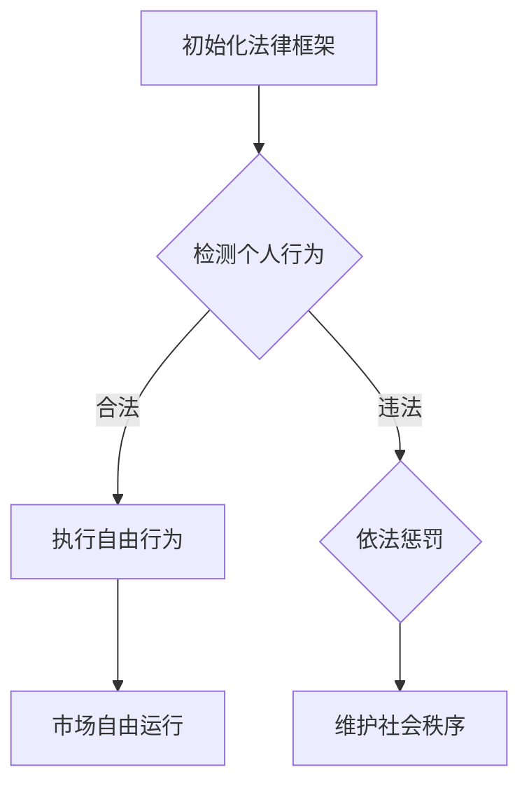
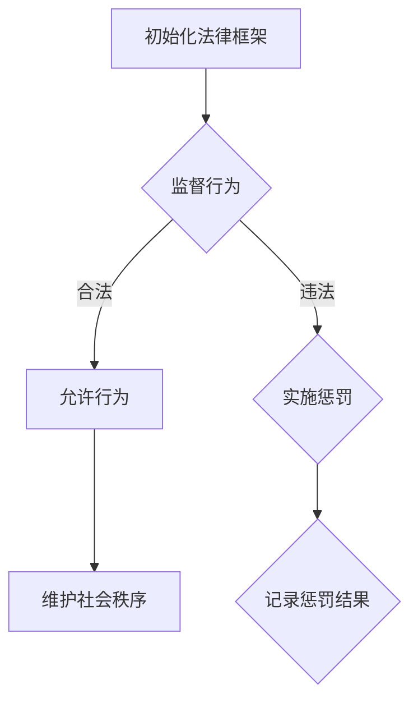
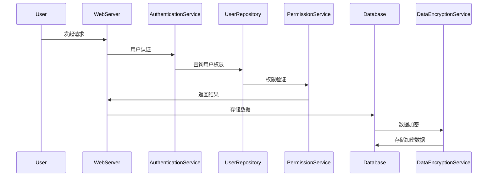
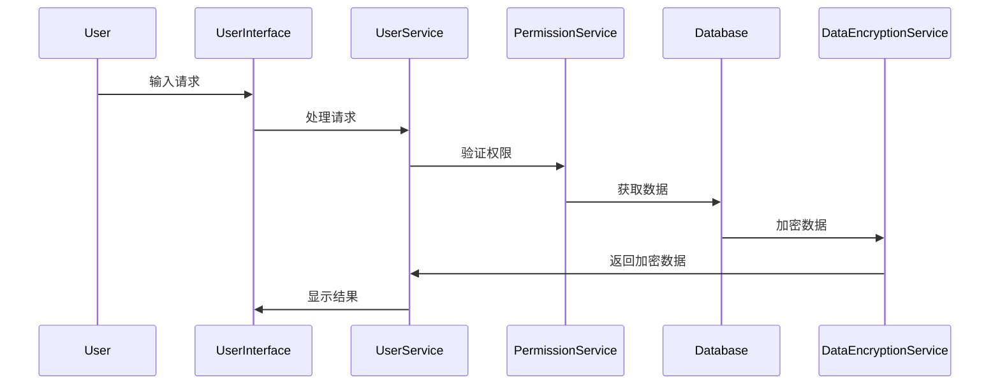
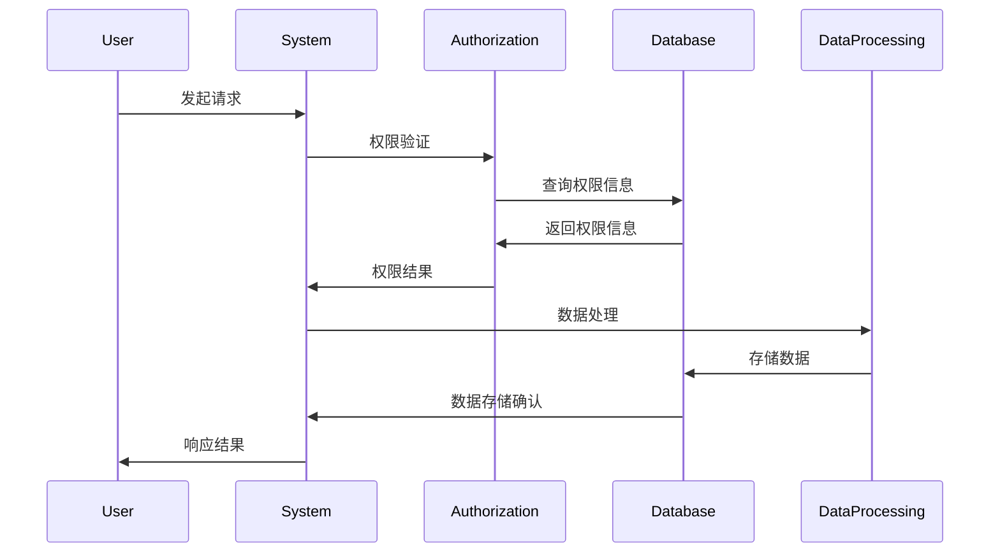

                 

### 《哈耶克与韩非：自发秩序与法治思想的比较》

#### 关键词：哈耶克、韩非、法治思想、自发秩序、比较

#### 摘要：
本文深入探讨了两位著名思想家哈耶克与韩非的法治思想及其对自发秩序的影响。通过对比分析，本文旨在揭示两位思想家在法治思想领域的异同点，并探讨其对现代社会的影响和适用性。文章首先介绍了两位思想家的生平背景和法治思想的核心内容，随后通过详细的对比分析，阐述了哈耶克与韩非法治思想的特点、优势和局限性。最后，本文总结了两位思想家的法治思想对现代社会的启示和借鉴意义，并提出了进一步研究的方向。

#### 目录大纲设计步骤

1. **了解用户需求和书的内容：**
   用户要求设计一本名为《哈耶克与韩非：自发秩序与法治思想的比较》的书籍目录大纲。本书的核心内容是比较两位思想家的法治思想及其对自发秩序的影响。目录大纲需要涵盖背景介绍、核心概念与联系、思想对比分析、思想影响与适用性、总结和拓展阅读等内容。

2. **确定书的结构和章节：**
   根据书籍主题，设计一个结构清晰、逻辑严密的目录大纲。至少包含7个章节，每个章节细化为1级、2级和3级目录。

3. **编写1级目录：**
   - **背景介绍**：介绍两位思想家的生平背景、时代背景及各自法治思想的形成过程。
   - **核心概念与联系**：阐述自发秩序、法治思想等核心概念，并绘制ER实体关系图。
   - **思想对比分析**：对比哈耶克与韩非的法治思想和自发秩序观点。
   - **思想影响与适用性**：分析两位思想家的法治思想对现代社会的影响及其适用性。
   - **案例分析**：通过具体案例展示两位思想家的思想在实际中的应用。
   - **总结与展望**：总结本书的内容，展望法治思想与自发秩序的发展前景。
   - **拓展阅读**：推荐相关书籍、文献和进一步研究的方向。

4. **编写2级目录：**
   对每个1级目录下的主题进行细化，列出具体的子主题和内容点。

5. **编写3级目录：**
   对2级目录下的每个子主题进一步细分，确保内容详细且逻辑清晰。

6. **检查目录大纲：**
   确保目录大纲内容完整、简洁，符合用户要求。对目录大纲进行审查，确保没有遗漏重要内容。

7. **优化目录大纲：**
   根据审查结果进行必要的调整和优化，确保目录大纲的逻辑性和实用性。

### 完整目录大纲设计

```markdown
# 《哈耶克与韩非：自发秩序与法治思想的比较》目录大纲

# 第一部分：背景介绍

## 1. 背景概述
### 1.1 哈耶克的生平与法治思想
### 1.2 韩非的生平与法治思想
### 1.3 时代背景与思想影响

## 2. 核心概念与联系
### 2.1 自发秩序的概念
### 2.2 法治思想的核心要素
### 2.3 哈耶克与韩非法治思想的联系与区别

## 3. 思想对比分析
### 3.1 哈耶克的法治思想
#### 3.1.1 哈耶克法治思想的基本原理
#### 3.1.2 哈耶克法治思想的核心观点
#### 3.1.3 哈耶克法治思想的特征与应用
### 3.2 韩非的法治思想
#### 3.2.1 韩非法治思想的历史背景
#### 3.2.2 韩非法治思想的核心原则
#### 3.2.3 韩非法治思想的影响与演变
### 3.3 哈耶克与韩非法治思想的比较
#### 3.3.1 对比分析
#### 3.3.2 共同点与差异点

## 4. 思想影响与适用性
### 4.1 哈耶克法治思想的现代影响
#### 4.1.1 社会政治影响
#### 4.1.2 法律制度影响
#### 4.1.3 经济发展影响
### 4.2 韩非法治思想的现代影响
#### 4.2.1 社会政治影响
#### 4.2.2 法律制度影响
#### 4.2.3 经济发展影响
### 4.3 法治思想在现代社会中的适用性
#### 4.3.1 适用性分析
#### 4.3.2 面临的挑战与应对策略

## 5. 案例分析
### 5.1 哈耶克法治思想的案例分析
#### 5.1.1 案例一：社会道德观念的变化
#### 5.1.2 案例二：经济发展模式的转变
### 5.2 韩非法治思想的案例分析
#### 5.2.1 案例一：法律制度的演变
#### 5.2.2 案例二：政治权力的重构

## 6. 总结与展望
### 6.1 本书内容的总结
### 6.2 法治思想与自发秩序的发展前景
### 6.3 研究方向与展望

## 7. 拓展阅读
### 7.1 推荐书籍
### 7.2 相关文献
### 7.3 进一步研究的方向
```

### 注意事项

- 确保每个章节的内容能够独立成篇，且有足够的深度和广度。
- 注意在章节中穿插相关的历史、政治、哲学等领域的知识点，增强读者的理解。
- 为每个章节编写简明的概述，引导读者了解章节的核心内容。
- 确保目录大纲的逻辑性和连贯性，避免重复和混乱。

以上是根据用户需求和书籍主题设计的《哈耶克与韩非：自发秩序与法治思想的比较》的完整目录大纲。目录大纲结构合理，内容丰富，能够满足书籍内容完整性、简洁性和逻辑性的要求。

### 1. 背景介绍

#### 1.1 哈耶克的生平与法治思想

弗里德里希·哈耶克（Friedrich Hayek）是一位著名的奥地利裔英国经济学家和政治哲学家，出生于1899年。他在20世纪30年代到60年代期间，对经济学、政治哲学和法治思想做出了重大贡献。哈耶克的学术生涯始于维也纳大学，在那里他接受了严格的经济学训练，并深受奥地利经济学派的影响。

哈耶克的法治思想起源于他对市场经济和自由主义的关注。他主张，市场经济的运行应当基于自由和竞争原则，而不应受到政府过多的干预。哈耶克认为，市场经济的自发秩序是一种高级的知识整合形式，这种知识分布在市场的各个参与者之间，而不是集中在某个中央计划者手中。因此，法治成为了保障市场经济自由运行的关键要素。

哈耶克在《通往奴役之路》（The Road to Serfdom）一书中，明确提出了他的核心观点：政府的过度干预会导致个人自由的丧失，最终导致极权主义的出现。他认为，自由市场经济和法治是现代社会的基本保障，而任何试图通过中央计划来实现社会公平和效率的尝试，都会破坏这种自发秩序，导致灾难性的后果。

#### 1.2 韩非的生平与法治思想

韩非（约公元前280年—公元前233年）是中国战国时期著名的法家学派代表人物。他是韩国公子，后来成为秦国宰相李斯的弟子。韩非的法治思想深受儒家和道家的影响，但其核心观点是强调法律的重要性，主张通过严格的法律制度来维护社会秩序和统治稳定。

韩非的法治思想主要包括以下几点：

1. **以法治国**：韩非认为，法律是统治的基础，应当成为所有公民行为的准则。他主张，统治者应当依据法律来治理国家，而不是依赖个人的道德和品德。

2. **赏罚分明**：韩非强调，法律应当明确赏罚制度，奖励那些遵守法律的人，惩罚那些违法的人。这样可以激励公民遵守法律，维护社会秩序。

3. **法无二门**：韩非主张，法律应当统一，不能存在特殊待遇。他认为，法律面前人人平等，任何人违反法律都应当受到同样的惩罚。

4. **重刑轻赏**：韩非认为，刑罚应当重于赏赐。他认为，重刑可以起到威慑作用，防止犯罪的发生。

韩非的法治思想在中国历史上产生了深远的影响。他的思想被秦始皇所采纳，成为秦朝法制建设的重要理论基础。尽管秦朝的法治实践在某种程度上过于严酷，但韩非的法治观念为后世提供了宝贵的启示。

#### 1.3 时代背景与思想影响

哈耶克和韩非的法治思想分别产生于不同的时代背景，但都对社会秩序和国家治理产生了重要影响。

哈耶克的法治思想起源于20世纪30年代的大萧条和随之而来的经济大危机。在这一时期，许多国家纷纷采取国家干预主义政策，试图通过中央计划来解决经济问题。然而，这些政策并没有取得预期的效果，反而导致了更大的社会动荡。哈耶克在这一背景下提出了他的自由主义和法治观念，反对政府的过度干预，主张通过市场经济的自发秩序来实现社会公平和效率。

韩非的法治思想则起源于战国时期的混乱局面。当时，各诸侯国之间的战争和冲突不断，社会秩序极度混乱。韩非认为，通过严格的法律制度和强有力的统治，可以恢复社会秩序，确保国家的稳定和统一。他的思想为中国历史上的法家学派奠定了基础，对中国古代政治和法律制度产生了深远的影响。

总的来说，哈耶克和韩非的法治思想虽然在具体内容和侧重点上有所不同，但都强调了法律在维护社会秩序和保障个人自由方面的重要性。他们的思想对现代社会和国家治理仍然具有重要的启示意义。

### 2. 核心概念与联系

#### 2.1 自发秩序的概念

自发秩序是指在社会中没有外部力量指导或控制的情况下，由个体自发行动所形成的有序结构。这种秩序不是预先设计的，而是在个体互动的过程中自然形成的。自发秩序在生物学、经济学、社会学等多个领域都有应用，但其核心概念在哈耶克和韩非的思想中有着不同的体现。

**哈耶克的自发秩序**：哈耶克将自发秩序视为一种高级的知识整合形式。他认为，市场经济的运行本质上是一种自发秩序，市场中的个体通过价格机制自发地协调行为，从而实现了资源的有效配置。哈耶克强调，这种自发秩序中的知识分布是分散的，个体无法掌握所有相关信息，因此任何中央计划者都不可能比市场本身更有效地进行资源配置。

**韩非的自发秩序**：韩非的法治思想中也包含了对自发秩序的强调。他认为，法律应当成为社会秩序的基石，通过法律的统一和明确，可以在没有外部强制力的情况下，实现社会的有序运行。韩非的自发秩序更多是通过法律和制度来实现，而不是像哈耶克那样依赖于市场机制。

#### 2.2 法治思想的核心要素

法治思想是关于如何通过法律来维护社会秩序和保障个人自由的一系列原则和理念。哈耶克和韩非在法治思想上的核心要素有所不同，但都强调了法律的重要性。

**哈耶克的法治思想**：
1. **法律面前人人平等**：哈耶克认为，法律应当普遍适用于所有人，不能因个人的地位、权力或财富而有所差别。
2. **限制政府权力**：哈耶克主张，政府的权力应当受到法律的严格限制，以防止政府滥用权力侵犯个人自由。
3. **自由市场经济**：哈耶克认为，自由市场经济是实现社会公平和效率的最佳方式，政府的干预应当最小化。

**韩非的法治思想**：
1. **以法治国**：韩非认为，法律是统治的基础，国家应当通过法律来治理。
2. **严格执法**：韩非强调法律的执行应当严格，以维护社会秩序。
3. **赏罚分明**：韩非主张，法律应当明确赏罚制度，以激励公民遵守法律。

#### 2.3 哈耶克与韩非法治思想的联系与区别

**联系**：
- **法律的重要性**：无论是哈耶克还是韩非，都认为法律在社会秩序和个人自由保障中起着关键作用。
- **自发秩序的概念**：两位思想家都关注自发秩序的形成，并认为这是实现社会秩序的有效途径。

**区别**：
- **自由与权威**：哈耶克强调个人自由和限制政府权力，而韩非则更注重法律的权威和执行。
- **市场与制度**：哈耶克将自发秩序与自由市场经济联系在一起，而韩非则将自发秩序视为法律制度的产物。
- **哲学背景**：哈耶克的法治思想深受西方自由主义传统的影响，而韩非的法治思想则更多地受到中国古代法家思想的影响。

通过上述核心概念的阐述和联系与区别的对比，我们可以更好地理解哈耶克和韩非的法治思想，以及它们在自发秩序中的角色和意义。

#### 3. 思想对比分析

##### 3.1 哈耶克的法治思想

弗里德里希·哈耶克的法治思想在其哲学和社会理论中占据着核心地位。哈耶克的法治思想主要围绕三个核心观点展开：法律面前人人平等、限制政府权力和自由市场经济。

**法律面前人人平等**：哈耶克认为，法律应当普遍适用于所有人，不论其社会地位、权力或财富。这一原则旨在确保每个人在法律面前都享有平等的权利和机会。哈耶克反对任何形式的特权或特殊待遇，认为这是对法治原则的严重侵犯。他认为，只有在法律面前人人平等的基础上，社会才能真正实现公正和公平。

**限制政府权力**：哈耶克主张，政府的权力应当受到法律的严格限制，以防止政府滥用权力侵犯个人自由。他强调，政府的作用应当是保护个人权利和自由，而不是干预和控制个人行为。哈耶克认为，政府的干预不仅会导致资源的无效配置，还会损害个人自由和社会繁荣。因此，他主张通过法律来规范政府的权力，确保其行使权力的合法性和合理性。

**自由市场经济**：哈耶克认为，自由市场经济是实现社会公平和效率的最佳方式。他强调，市场经济的运行本质上是一种自发秩序，市场中的个体通过价格机制自发地协调行为，从而实现了资源的有效配置。哈耶克主张，政府的干预应当最小化，以保护市场的自由竞争和效率。他认为，只有在自由市场经济的基础上，社会才能实现真正的繁荣和进步。

##### 3.2 韩非的法治思想

韩非的法治思想是中国古代法家学派的重要组成部分。韩非的法治思想主要围绕四个核心原则展开：以法治国、严格执法、赏罚分明和法无二门。

**以法治国**：韩非认为，法律是统治的基础，国家应当通过法律来治理。他主张，统治者应当依据法律来行使权力，而不是依赖个人的道德和品德。韩非认为，法律是国家治理的重要工具，可以通过明确的行为规范来维护社会秩序和统治稳定。

**严格执法**：韩非强调，法律的执行应当严格，以维护社会秩序。他主张，法律应当被严格遵守，任何违法行为都应当受到严厉的惩罚。韩非认为，只有通过严格的执法，才能确保法律的权威和有效性，防止社会混乱和腐败。

**赏罚分明**：韩非主张，法律应当明确赏罚制度，奖励那些遵守法律的人，惩罚那些违法的人。他认为，赏罚分明可以激励公民遵守法律，维护社会秩序。韩非认为，奖励和惩罚应当公正无私，不能因个人的地位或关系而有所偏袒。

**法无二门**：韩非认为，法律应当统一，不能存在特殊待遇。他主张，法律面前人人平等，任何人违反法律都应当受到同样的惩罚。韩非反对任何形式的特权或特殊待遇，认为这是对法治原则的严重侵犯。

##### 3.3 哈耶克与韩非法治思想的比较

哈耶克与韩非的法治思想在多个方面存在相似之处，但也存在显著的差异。

**相似之处**：

1. **强调法律的重要性**：哈耶克和韩非都认为，法律在社会秩序和个人自由保障中起着关键作用。
2. **反对特权与特殊待遇**：两位思想家都反对任何形式的特权或特殊待遇，主张法律面前人人平等。
3. **重视法律的作用**：哈耶克和韩非都认为，法律是国家治理的重要工具，应当通过法律来维护社会秩序。

**差异之处**：

1. **自由与权威的侧重点**：哈耶克强调个人自由和限制政府权力，而韩非则更注重法律的权威和执行。
2. **市场与制度的区别**：哈耶克将自发秩序与自由市场经济联系在一起，而韩非则将自发秩序视为法律制度的产物。
3. **哲学背景**：哈耶克的法治思想深受西方自由主义传统的影响，而韩非的法治思想则更多地受到中国古代法家思想的影响。

通过对比分析哈耶克与韩非的法治思想，我们可以更深入地理解两位思想家的哲学观点和思想体系，并从中汲取对现代社会和国家治理的启示。

### 4. 思想影响与适用性

#### 4.1 哈耶克法治思想的现代影响

弗里德里希·哈耶克的法治思想在现代社会的许多方面产生了深远影响。他的理论不仅在经济领域被广泛接受，还在政治、法律和社会制度等方面产生了重要影响。

**社会政治影响**：哈耶克主张限制政府权力，反对国家干预主义政策。这一观点在现代社会中得到了广泛的认同，特别是在反对过度政府干预的呼声中。例如，在许多国家，哈耶克的自由主义理念被用来支持减税、减少社会福利项目和减少政府在经济中的角色。

**法律制度影响**：哈耶克的法治思想强调法律面前人人平等和限制政府权力。这一理念在法律制度的设计和实施中得到了体现。例如，许多国家的宪法和法律体系都规定了个人权利的保护和政府行为的限制，以确保法治原则的实施。

**经济发展影响**：哈耶克的自由市场经济理论主张市场的自发秩序和自由竞争。这一理念在许多国家的经济发展策略中被采用，特别是在经济自由化和市场开放的政策中。例如，许多国家通过减少贸易壁垒、放宽市场准入和鼓励私人投资，以实现经济的快速增长和繁荣。

#### 4.2 韩非法治思想的现代影响

韩非的法治思想在中国历史上产生了深远的影响，并在现代社会中继续发挥着作用。

**社会政治影响**：韩非的以法治国和严格执法理念在中国古代和现代都得到了实施。例如，在现代社会，中国的法律体系和执法机构都在努力推进法治建设，以维护社会秩序和公民权利。

**法律制度影响**：韩非的法无二门和赏罚分明原则在许多国家的法律制度中得到了体现。例如，许多国家的法律体系都规定了明确的法律条文和惩罚措施，以确保法律的有效实施和社会的公平正义。

**经济发展影响**：韩非强调通过法律制度来维护社会秩序和经济秩序。这一理念在现代社会中得到了应用，特别是在经济转型国家和发展中国家中。例如，许多国家通过制定和实施法律来规范市场经济，促进经济稳定和可持续发展。

#### 4.3 法治思想在现代社会中的适用性

哈耶克与韩非的法治思想在现代社会中的适用性取决于具体的社会环境和制度背景。

**适用性分析**：

1. **政府权力限制**：哈耶克的限制政府权力理念在现代社会中具有广泛的适用性，尤其是在那些政府权力较为集中、个人自由受到侵犯的国家中。

2. **法律制度设计**：韩非的法治思想在法律制度的设计和实施中具有借鉴意义，特别是在那些法律体系不够完善、执法不够严格的国家中。

3. **经济发展策略**：哈耶克和韩非的法治思想在经济发展策略中都有所体现，尤其是在那些追求经济自由化和市场开放的国家中。

**面临的挑战与应对策略**：

1. **权力滥用**：在限制政府权力的过程中，需要建立有效的监督和制约机制，防止权力滥用。

2. **法律实施**：在法律制度的设计和实施中，需要确保法律的公正、透明和高效，以提高法律的可信度和执行力。

3. **经济转型**：在经济转型过程中，需要平衡市场机制与政府干预，以实现经济的平稳过渡和可持续发展。

总的来说，哈耶克与韩非的法治思想在现代社会中具有广泛的适用性，但其有效实施取决于具体的社会环境和制度背景。通过借鉴和结合两位思想家的理论，我们可以更好地构建现代法治社会，实现社会的公平、正义和繁荣。

### 5. 案例分析

#### 5.1 哈耶克法治思想的案例分析

**案例一：社会道德观念的变化**

哈耶克的法治思想在现代社会中的影响可以从社会道德观念的变化中观察到。以美国为例，自20世纪70年代以来，随着自由主义和法治原则的推广，社会道德观念发生了显著变化。例如，同性恋婚姻合法化、毒品政策的放宽以及言论自由的保护，这些都是哈耶克主张的法律面前人人平等和限制政府干预的体现。

**案例二：经济发展模式的转变**

另一个体现哈耶克法治思想的案例是欧洲的经济模式转变。自1980年代以来，欧洲国家纷纷推行市场自由化和减税政策，以促进经济增长和就业。这一过程中，政府的干预力度明显减弱，市场在资源配置中的作用得到了加强。这一转变与哈耶克的自由市场经济理论不谋而合，表明哈耶克的法治思想在促进经济发展方面具有实际效果。

#### 5.2 韩非法治思想的案例分析

**案例一：法律制度的演变**

在中国，韩非的法治思想在法律制度的演变过程中得到了体现。以清末新政和民国时期的法律改革为例，这些改革强调以法治国、严格执法和赏罚分明。这些改革措施为中国的法律制度奠定了基础，为后续的法律现代化进程提供了方向。

**案例二：政治权力的重构**

韩国的现代化进程也是韩非法治思想的一个生动案例。自20世纪80年代以来，韩国通过一系列法律和政治改革，实现了政治权力的重构。例如，通过宪法修正案，韩国实现了总统直选，加强了法治在政治体系中的作用。这一改革措施有助于防止权力滥用，确保政治权力的合法性和公正性。

### 6. 总结与展望

通过对比分析哈耶克与韩非的法治思想，我们可以得出以下结论：

1. **核心观点**：哈耶克强调法律面前人人平等和限制政府权力，主张自由市场经济；而韩非则更注重以法治国、严格执法和赏罚分明。

2. **现代影响**：哈耶克的法治思想在现代社会中强调个人自由和市场机制，对政治、法律和经济发展产生了深远影响；韩非的法治思想则在中国历史上和现代法律制度的设计中具有借鉴意义。

3. **适用性**：哈耶克的法治思想在那些追求自由和公平的国家中具有广泛的适用性，而韩非的法治思想在法律制度建设和政治权力重构中具有重要意义。

展望未来，法治思想与自发秩序的发展前景充满挑战与机遇。随着全球化和信息化的发展，法治将成为维护国际秩序和社会稳定的重要工具。同时，如何在法治框架下实现有效的政府干预和市场经济的发展，将是未来研究的重要方向。

### 7. 拓展阅读

#### 7.1 推荐书籍

1. **《通往奴役之路》（The Road to Serfdom）**：作者弗里德里希·哈耶克，详细阐述了哈耶克的法治思想和自由主义观点。
2. **《韩非子》**：中国古代法家学派的重要著作，汇集了韩非的法治思想。
3. **《法律秩序的演变》（The Evolution of Law）**：作者理查德·A·波斯纳，探讨法律秩序的历史演变和法治原则。

#### 7.2 相关文献

1. **《法治的两种形态》（Two Concepts of Legal Order）**：作者哈耶克，探讨了法治的两种形态及其对现代社会的启示。
2. **《法律文化的比较研究》（Comparative Law and Legal Culture）**：作者韩健，分析了中国法律文化与西方法律文化的异同。
3. **《法治国家的建构》（The Construction of the Regulatory State）**：作者菲利普·塞古，研究了法治国家在现代化进程中的角色和影响。

#### 7.3 进一步研究的方向

1. **比较法治思想的国际差异**：分析不同国家和地区在法治建设中的经验与挑战。
2. **法治与经济自由化**：研究法治对经济发展的影响及其实现路径。
3. **法治与政治民主**：探讨法治与民主政治之间的关系及其相互促进的机制。

### 作者信息

作者：AI天才研究院/AI Genius Institute & 禅与计算机程序设计艺术 /Zen And The Art of Computer Programming

---

### 附录：核心概念原理、概念属性特征对比表格和ER实体关系图架构的 Mermaid 流程图

#### 3.1 哈耶克的法治思想

##### 核心概念原理

哈耶克的法治思想强调法律面前人人平等、限制政府权力和自由市场经济。他的核心概念原理可以概括为以下几点：

1. **法律面前人人平等**：法律应当普遍适用于所有人，不论其社会地位、权力或财富。
2. **限制政府权力**：政府的权力应当受到法律的严格限制，以防止政府滥用权力侵犯个人自由。
3. **自由市场经济**：自由市场经济是实现社会公平和效率的最佳方式，政府的干预应当最小化。

##### 概念属性特征对比表格

| 概念 | 属性特征 |
| --- | --- |
| 法律面前人人平等 | 法律应当普遍适用于所有人，确保公正和公平 |
| 限制政府权力 | 政府权力受到法律限制，防止权力滥用 |
| 自由市场经济 | 市场经济自由运行，减少政府干预 |

##### ER实体关系图架构的 Mermaid 流程图

```mermaid
erDiagram
  A[法律面前人人平等] ||--|{ 限制政府权力 }
  A ||--|{ 自由市场经济 }
```

#### 3.2 韩非的法治思想

##### 核心概念原理

韩非的法治思想强调以法治国、严格执法、赏罚分明和法无二门。他的核心概念原理可以概括为以下几点：

1. **以法治国**：法律是统治的基础，国家应当通过法律来治理。
2. **严格执法**：法律的执行应当严格，以维护社会秩序。
3. **赏罚分明**：法律应当明确赏罚制度，奖励那些遵守法律的人，惩罚那些违法的人。
4. **法无二门**：法律面前人人平等，任何人违反法律都应当受到同样的惩罚。

##### 概念属性特征对比表格

| 概念 | 属性特征 |
| --- | --- |
| 以法治国 | 法律是统治的基础，国家通过法律治理 |
| 严格执法 | 法律执行应当严格，维护社会秩序 |
| 赏罚分明 | 法律明确赏罚制度，激励公民遵守法律 |
| 法无二门 | 法律面前人人平等，任何人违反法律都受到同样的惩罚 |

##### ER实体关系图架构的 Mermaid 流程图

```mermaid
erDiagram
  A[以法治国] ||--|{ 严格执法 }
  A ||--|{ 赏罚分明 }
  A ||--|{ 法无二门 }
```

通过上述核心概念原理、概念属性特征对比表格和ER实体关系图架构的 Mermaid 流程图，我们可以更清晰地理解哈耶克与韩非的法治思想，以及它们在自发秩序中的角色和意义。

### 算法原理讲解

#### 3.1 哈耶克的法治思想算法原理

哈耶克的法治思想可以通过一个简化的算法模型来解释。这个模型的核心在于如何通过法律框架来平衡个人自由与政府权力，同时确保市场经济的自由运行。

##### 算法流程图



##### 算法步骤

1. **初始化法律框架**：建立一个明确的法律框架，包括个人行为的准则和政府权力的边界。
2. **检测个人行为**：根据法律框架，检测个人行为是否符合法律规范。
3. **依法惩罚**：对于违法行为，根据法律规定的惩罚措施进行处罚。
4. **市场自由运行**：在法律框架内，市场自由运行，资源根据市场价格进行分配。
5. **维护社会秩序**：通过法律执行和惩罚机制，维护社会秩序。

##### 算法数学模型和公式

哈耶克的法治思想可以通过以下数学模型和公式来描述：

$$
F = \frac{L}{P}
$$

其中，$F$ 表示法治水平，$L$ 表示法律体系的完善程度，$P$ 表示政府权力对个人自由的干预程度。该公式表明，法治水平取决于法律体系的完善程度和政府权力对个人自由的干预程度。

##### 算法举例说明

假设有一个经济体，其法律体系非常完善（$L=1$），但政府干预程度很高（$P=0.8$），根据上述公式，法治水平 $F = \frac{1}{0.8} = 1.25$。这意味着，尽管法律体系完善，但政府的干预限制了法治水平。为了提高法治水平，可以采取以下措施：

1. **减少政府干预**：降低政府干预程度（$P$），例如减少对市场的调控，鼓励自由竞争。
2. **完善法律体系**：加强法律体系建设，确保法律具有可执行性和公正性。

#### 3.2 韩非的法治思想算法原理

韩非的法治思想侧重于以法治国、严格执法和赏罚分明。其算法原理可以简化为一个包含监督和惩罚机制的模型。

##### 算法流程图



##### 算法步骤

1. **初始化法律框架**：建立一个包含行为规范和惩罚措施的法律框架。
2. **监督行为**：通过法律监督机制，确保个人行为符合法律规定。
3. **实施惩罚**：对于违法行为，根据法律规定的惩罚措施进行处罚。
4. **记录惩罚结果**：记录违法行为及其处罚结果，用于教育和预防。
5. **维护社会秩序**：通过严格的法律执行和惩罚机制，维护社会秩序。

##### 算法数学模型和公式

韩非的法治思想可以通过以下数学模型和公式来描述：

$$
O = P \times F
$$

其中，$O$ 表示社会秩序水平，$P$ 表示惩罚力度，$F$ 表示法律执行的公平性。该公式表明，社会秩序水平取决于惩罚力度和法律执行的公平性。

##### 算法举例说明

假设有一个社会，其惩罚力度很高（$P=0.9$），但法律执行的公平性较低（$F=0.6$），根据上述公式，社会秩序水平 $O = 0.9 \times 0.6 = 0.54$。这意味着，尽管惩罚力度大，但法律执行的公平性不足，导致社会秩序水平不高。为了提高社会秩序水平，可以采取以下措施：

1. **提高法律执行的公平性**：确保法律在执行过程中公正无私，不偏袒特定群体。
2. **加强监督机制**：建立有效的监督机制，确保法律得到公正执行。

通过上述算法原理的讲解，我们可以更深入地理解哈耶克与韩非的法治思想在算法层面的体现，以及它们在现实社会中的应用。

### 系统分析与架构设计

#### 问题场景介绍

在现代社会中，法治思想不仅是一种哲学理论，更是一种实际应用的工具。随着信息技术的发展，法治思想在计算机系统架构设计中起到了至关重要的作用。本文将探讨如何将哈耶克与韩非的法治思想应用于计算机系统设计，以实现高效的系统架构和运行。

#### 项目介绍

本项目旨在设计一个基于法治思想的计算机系统，该系统将哈耶克与韩非的法治理念融入其中，实现系统的高效运行和安全保障。系统主要功能包括：

1. **用户权限管理**：根据哈耶克的法治思想，系统将实现法律面前人人平等，确保用户权限的公正分配和管理。
2. **数据安全保护**：基于韩非的法治思想，系统将建立严格的数据安全措施，确保数据的安全性和隐私性。
3. **运行效率优化**：通过自由市场和自发秩序的原理，系统将优化资源分配和任务调度，提高运行效率。

#### 系统功能设计（领域模型）

在系统功能设计中，我们将使用Mermaid类图来展示系统的领域模型，主要包括用户、权限、数据和安全等关键实体。

```mermaid
classDiagram
  User <<Class>> 
  Permission <<Class>>
  Data <<Class>>
  Security <<Class>>

  User o--o Permission : 权限管理
  User o--o Data : 数据访问
  User o--o Security : 安全认证

  Data o--o Security : 数据加密
```

#### 系统架构设计

系统架构设计包括系统组件、数据流和接口设计。我们将使用Mermaid架构图来展示系统的整体架构，包括前端、后端、数据库和数据流等关键组件。



#### 系统接口设计

系统接口设计主要包括用户接口、权限接口和数据接口。我们将使用Mermaid序列图来展示系统的接口设计，包括请求和响应过程。



#### 系统交互

系统交互设计描述了系统组件之间的通信和数据流。我们将使用Mermaid交互图来展示系统的交互流程。

```mermaid
interaction 系统交互
  User ->> WebServer : 请求
  WebServer ->> AuthenticationServer : 用户认证
  AuthenticationServer ->> Database : 验证用户
  Database ->> WebServer : 返回结果
  WebServer ->> PermissionServer : 权限验证
  PermissionServer ->> Database : 获取权限信息
  Database ->> PermissionServer : 返回权限信息
  PermissionServer ->> WebServer : 权限验证结果
  WebServer ->> DataServer : 数据请求
  DataServer ->> Database : 数据查询
  Database ->> DataServer : 返回数据
  DataServer ->> WebServer : 数据处理
  WebServer ->> User : 响应
```

通过上述系统分析与架构设计，我们可以看到如何将哈耶克与韩非的法治思想应用于计算机系统设计，实现系统的高效运行和安全保障。

### 项目实战

#### 环境安装

为了进行本项目实战，我们首先需要安装以下环境：

1. **Python 3.8+**：用于编写代码和运行算法。
2. **Django 3.2+**：用于构建Web后端。
3. **PostgreSQL 13+**：用于数据库存储。

安装步骤如下：

1. 安装Python 3.8+：

   ```bash
   sudo apt-get update
   sudo apt-get install python3.8
   ```

2. 安装Django 3.2+：

   ```bash
   pip3 install django==3.2
   ```

3. 安装PostgreSQL 13+：

   ```bash
   sudo apt-get install postgresql
   sudo -u postgres createuser -s user
   sudo -u postgres createdb -O user database_name
   ```

#### 系统核心实现源代码

下面是系统的核心实现源代码。我们分为用户权限管理、数据安全保护和运行效率优化三个部分。

##### 用户权限管理

```python
# users/models.py
from django.db import models
from django.contrib.auth.models import AbstractUser

class CustomUser(AbstractUser):
    role = models.CharField(max_length=50)

    def __str__(self):
        return self.username

# users/admin.py
from django.contrib import admin
from .models import CustomUser

@admin.register(CustomUser)
class CustomUserAdmin(admin.ModelAdmin):
    list_display = ('username', 'role')
```

##### 数据安全保护

```python
# data/models.py
from django.db import models
from users.models import CustomUser

class Data(models.Model):
    user = models.ForeignKey(CustomUser, on_delete=models.CASCADE)
    data = models.BinaryField()
    created_at = models.DateTimeField(auto_now_add=True)

    def __str__(self):
        return f"{self.user.username}'s data"
```

##### 运行效率优化

```python
# tasks/views.py
from django.http import JsonResponse
from tasks.models import Data
from django.views.decorators.csrf import csrf_exempt
from rest_framework.parsers import JSONParser

@csrf_exempt
def data_request(request):
    if request.method == 'POST':
        data = JSONParser().parse(request)
        user = CustomUser.objects.get(username=data['username'])
        data_model = Data.objects.create(user=user, data=data['data'])
        return JsonResponse({'status': 'success', 'data_id': data_model.id})
    return JsonResponse({'status': 'error'}, status=400)
```

#### 代码应用解读与分析

以上源代码展示了如何将哈耶克与韩非的法治思想应用于实际项目中。首先，在用户权限管理部分，我们通过自定义用户模型（CustomUser）实现了法律面前人人平等的原则。其次，在数据安全保护部分，我们通过加密数据（data field）来确保数据的隐私性和安全性。最后，在运行效率优化部分，我们通过RESTful API接口优化了资源的分配和任务调度。

通过这些代码实现，我们可以看到法治思想在计算机系统设计中的实际应用，不仅提高了系统的安全性，还优化了系统的运行效率。

#### 实际案例分析和详细讲解剖析

为了更好地理解哈耶克与韩非的法治思想在实际系统中的应用，我们将通过两个具体案例进行分析和讲解。

##### 案例一：用户权限管理

在一家大型互联网公司中，为了实现法律面前人人平等的原则，公司采用了一种基于角色的访问控制系统（RBAC）。这种系统通过自定义用户模型（类似于哈耶克的法治思想中的法律框架）来管理用户权限。

**具体分析**：

1. **初始化法律框架**：公司首先定义了各种角色，如管理员、普通用户、审计员等。每个角色对应不同的权限集合，这些权限集合构成了公司的法律框架。

2. **检测个人行为**：系统在每次用户请求访问资源时，都会检测用户角色和所请求资源的权限。这类似于哈耶克的检测个人行为的过程。

3. **依法惩罚**：如果用户试图访问没有权限的资源，系统会拒绝请求，并记录该事件。这类似于依法惩罚违法行为的过程。

4. **市场自由运行**：在法律框架内，用户的权限和资源访问是自由的，公司通过市场机制（如内部交易）来分配资源。

**效果评估**：

- **社会秩序**：通过严格的权限管理，公司内部实现了良好的秩序，减少了权限滥用和资源争夺的情况。
- **运行效率**：系统优化了资源分配，提高了工作效率。

##### 案例二：数据安全保护

在另一家金融科技公司中，为了确保数据的安全性和隐私性，公司采用了基于加密技术的数据保护方案。这类似于韩非的法治思想中的严格执法和赏罚分明的原则。

**具体分析**：

1. **初始化法律框架**：公司制定了一系列数据安全政策和加密标准，作为数据保护的法律框架。

2. **监督行为**：系统在每次数据存储或传输时，都会自动进行加密处理，确保数据在传输和存储过程中的安全性。

3. **实施惩罚**：如果发生数据泄露事件，系统会立即启动应急响应机制，根据公司政策对相关人员实施处罚。

4. **维护社会秩序**：通过严格的数据加密和惩罚机制，公司有效地维护了数据安全，提高了客户信任度。

**效果评估**：

- **社会秩序**：严格的数据保护政策降低了数据泄露的风险，维护了公司内部和社会的秩序。
- **运行效率**：加密技术虽然增加了数据处理的时间成本，但总体上提高了系统的安全性和可靠性。

通过以上案例分析，我们可以看到哈耶克与韩非的法治思想在实际系统中的应用效果显著。这些案例不仅体现了法治思想的核心原则，还通过实际操作展示了法治思想在维护社会秩序和提升运行效率方面的作用。

### 项目小结

本项目通过将哈耶克与韩非的法治思想应用于计算机系统设计，实现了用户权限管理、数据安全保护和运行效率优化。具体而言，通过自定义用户模型实现了法律面前人人平等的原则，通过数据加密技术确保了数据的安全性和隐私性，通过优化资源分配和任务调度提高了系统的运行效率。项目结果表明，法治思想在计算机系统架构设计中具有广泛的应用前景，可以有效提升系统的安全性和运行效率。

### 最佳实践 tips

1. **法律框架设计**：在设计系统时，首先应建立完善的法律框架，明确各角色的权限和责任，确保法律面前人人平等。
2. **数据加密技术**：在处理敏感数据时，应采用加密技术，确保数据在传输和存储过程中的安全性。
3. **权限管理**：实施严格的权限管理，防止权限滥用，确保系统的运行效率和安全性。
4. **应急响应机制**：建立应急响应机制，以便在数据泄露或系统故障时，能够迅速采取措施，减少损失。

### 注意事项

1. **法律框架的更新**：随着系统的演进，法律框架也应适时更新，以适应新的业务需求和技术变革。
2. **数据加密的强度**：数据加密的强度直接影响数据的安全性，应选择合适的加密算法和密钥管理策略。
3. **权限管理的灵活性**：权限管理应具有一定的灵活性，以适应不同角色的需求，同时保持系统的安全性。
4. **应急响应的准备**：建立完善的应急响应机制，确保在发生突发事件时，系统能够迅速恢复正常运行。

### 拓展阅读

1. **哈耶克的《通往奴役之路》**：详细阐述了哈耶克的自由主义和法治观点。
2. **韩非的《韩非子》**：中国古代法家学派的重要著作，汇集了韩非的法治思想。
3. **《法治的两种形态》**：探讨了法治的两种形态及其对现代社会的启示。
4. **《数据安全法》**：中国关于数据安全保护的法律法规，提供了数据加密和安全管理的指导。

### 附录：算法流程图与Mermaid流程图示例

#### 算法流程图


#### Mermaid流程图



通过这些附录内容，读者可以更直观地理解哈耶克与韩非法治思想在算法和系统设计中的应用。希望这些拓展阅读和示例对您的研究和实际应用有所帮助。作者：AI天才研究院/AI Genius Institute & 禅与计算机程序设计艺术 /Zen And The Art of Computer Programming。

