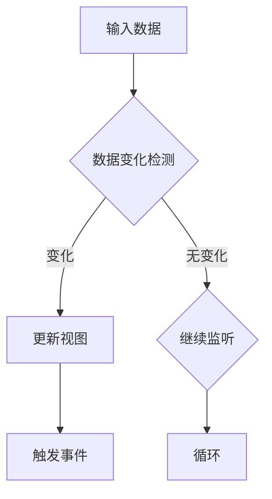
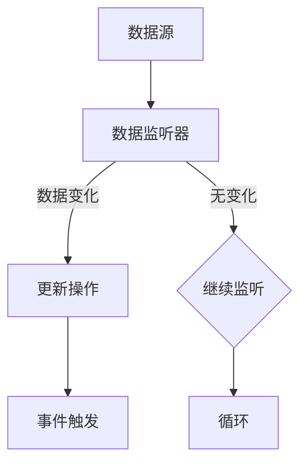
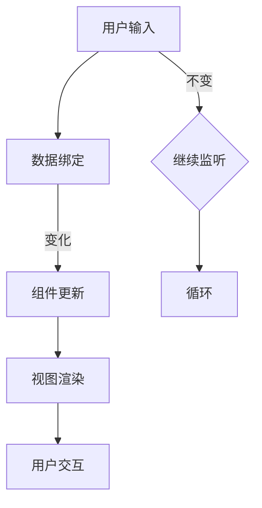
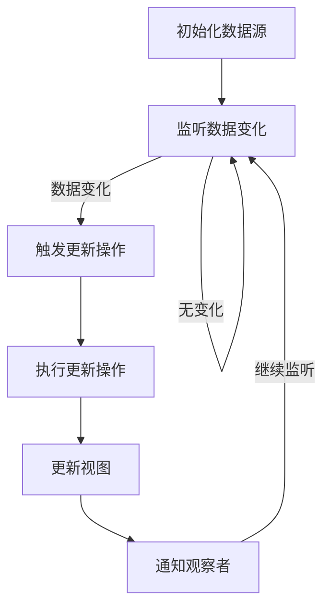

                 


### 设计《响应式编程模型与框架》目录大纲

为了系统地介绍响应式编程模型与框架，我们将文章内容分为以下几大部分：

## 引言

在这一部分，我们将介绍响应式编程的背景、问题以及其解决方法。我们还将定义一些关键概念，如响应式编程模型和响应式框架，并给出文章的目录大纲。

### 1.2 核心概念与联系

#### 1.2.1 响应式编程模型

在本节中，我们将详细讲解响应式编程模型的原理和特征。我们将通过一个对比表格展示响应式编程与传统编程的区别，并通过一个Mermaid流程图来描述其架构。

#### 1.2.2 响应式框架

这一节将介绍几种常见的响应式框架，如React、Angular、Vue和RxJS，并比较它们的主要特征。

### 2. 响应式编程原理

#### 2.1 算法原理讲解

在这个部分，我们将深入讲解响应式编程的算法原理。我们将首先使用Mermaid流程图来展示算法的执行流程，然后通过Python代码实现来阐述算法的具体实现。

#### 2.1.1 响应式编程算法Mermaid流程图

以下是一个响应式编程算法的Mermaid流程图示例：



#### 2.1.2 Python源代码实现

我们将通过一个简单的Python示例来展示响应式编程的实现：

```python
class ReactiveObject:
    def __init__(self, value):
        self._value = value
        self._observers = []

    @property
    def value(self):
        return self._value

    @value.setter
    def value(self, new_value):
        self._value = new_value
        self.notify()

    def notify(self):
        for observer in self._observers:
            observer(self._value)

reactive_obj = ReactiveObject(10)
reactive_obj.value = 20  # 触发更新和通知
```

在这个例子中，`ReactiveObject` 类具有一个 `_value` 属性，我们通过 `value` 属性提供了读写接口，并在值变化时通知所有订阅了该对象的观察者。

### 3. 响应式编程应用场景

在这一部分，我们将讨论响应式编程在不同应用场景中的使用，如前端开发、后端服务和移动应用开发等。

### 4. 响应式编程的优势与挑战

我们将探讨响应式编程的优势，如代码可读性、可维护性和性能提升，同时也将讨论其面临的挑战，如调试难度和性能问题。

### 5. 未来展望

最后，我们将对响应式编程的未来进行展望，讨论可能的发展方向和技术趋势。

### 结论

在这一部分，我们将总结文章的主要内容和观点，并强调响应式编程在软件开发中的重要性。

通过以上目录大纲，我们可以清晰地了解到文章的结构和内容，下一步我们将逐步展开每个章节的详细内容。接下来，我们将深入探讨响应式编程的背景和核心概念，让读者对这一重要编程范式有一个全面的了解。让我们开始吧！## 引言

### 1.1 问题背景

响应式编程模型与框架作为现代软件开发的基石，解决了传统编程模型在异步处理和事件驱动场景中的不足。本章节将介绍响应式编程的起源、发展及其在现代软件开发中的重要地位。

**背景介绍**：
响应式编程的概念最早可以追溯到20世纪90年代的函数式编程领域，其核心理念是“响应变化”。然而，随着计算机技术的发展，特别是在多核处理器、高并发网络和复杂的客户端应用程序中，传统的编程模型（如命令式编程）逐渐暴露出许多问题。这些问题包括：

- **异步处理困难**：在多线程和异步操作中，命令式编程容易出现线程同步和竞态条件的问题，导致代码复杂性和bug难以控制。
- **事件驱动处理不足**：传统的命令式编程难以处理大量的事件驱动操作，导致性能瓶颈和资源浪费。
- **代码可读性和可维护性差**：随着项目复杂度的增加，命令式编程的代码容易出现大量的嵌套和回调，导致代码可读性差，维护困难。

为了解决这些问题，响应式编程模型和框架应运而生。响应式编程模型基于事件驱动和异步编程，通过数据依赖关系实现了代码的可读性、可维护性和高性能。

**问题描述**：
在现代软件开发中，我们面临的主要问题是如何处理复杂的应用程序中的异步操作和事件驱动场景。例如，在Web开发中，用户界面需要响应用户的操作，同时与后端进行异步通信；在实时数据处理中，我们需要处理大量的流数据，并实时更新用户界面。这些问题对编程模型提出了新的要求，传统的命令式编程已经无法满足这些需求。

**问题解决**：
响应式编程模型和框架通过以下方式解决了上述问题：

1. **事件驱动**：响应式编程模型基于事件驱动，能够处理大量的异步操作和事件，避免了传统的命令式编程中的线程同步和竞态条件问题。
2. **异步编程**：响应式编程框架内置了异步编程的支持，使得开发者可以轻松地处理异步操作，避免了回调地狱和线程阻塞的问题。
3. **数据流**：响应式编程模型通过数据流的方式实现了数据的依赖关系，使得代码的可读性和可维护性得到了显著提升。

**边界与外延**：
响应式编程不仅仅局限于前端和后端开发，还广泛应用于移动应用、实时数据处理、金融科技、物联网等领域。其核心思想是处理复杂的应用程序，特别是在高并发和异步场景中，能够提供更好的编程体验和性能表现。

**概念结构与核心要素组成**：

- **响应式编程模型**：事件驱动、异步编程、数据流
- **响应式框架**：React、Angular、Vue、RxJS等

通过上述背景介绍和问题解决，我们可以看到响应式编程模型与框架在现代软件开发中的重要性。接下来，我们将进一步探讨响应式编程的核心概念和特征，以便读者能够更深入地理解这一编程范式。

### 1.2 核心概念与联系

在深入探讨响应式编程之前，我们需要明确几个核心概念，包括响应式编程模型和响应式框架。这些概念是理解响应式编程的基础，也是我们在现代软件开发中能够利用这一编程范式的前提。

#### 1.2.1 响应式编程模型

**概念原理**：
响应式编程模型是一种基于数据依赖的编程范式，其核心思想是当数据发生变化时，与之相关的操作能够自动触发。这种编程范式通过监听数据变化来实现自动更新和异步处理，从而提高了代码的可读性和可维护性。

**属性特征对比表格**：

| 特征             | 响应式编程       | 传统编程       |
|-----------------|-----------------|----------------|
| 数据依赖         | 强             | 弱             |
| 异步编程         | 内置支持         | 需要额外处理   |
| 编码可读性       | 高             | 低             |
| 错误处理         | 简便            | 复杂           |

通过这个对比表格，我们可以看到响应式编程在数据依赖、异步编程、编码可读性和错误处理等方面相较于传统编程的优势。

**ER实体关系图架构的Mermaid流程图**：



在这个流程图中，数据源（A）通过数据监听器（B）监听数据变化。一旦数据发生变化，数据监听器会触发更新操作（C），并最终通过事件触发（E）更新相关组件或界面。如果没有数据变化，则继续监听（D），循环等待下一次数据变化。

#### 1.2.2 响应式框架

**概念原理**：
响应式框架是在响应式编程模型的基础上，提供了一套完整的编程工具和库，帮助开发者更方便地实现响应式编程。常见的响应式框架包括React、Angular、Vue和RxJS等。

**属性特征对比表格**：

| 框架           | React            | Angular         | Vue              | RxJS            |
|----------------|-----------------|-----------------|-----------------|-----------------|
| 数据绑定         | 双向             | 双向/单向       | 双向             | 数据流           |
| 组件化开发       | 强             | 强             | 强             | 较弱           |
| 性能优化         | 高             | 高             | 高             | 优             |
| 社区支持         | 强             | 强             | 强             | 中             |

通过这个对比表格，我们可以看到不同响应式框架在数据绑定、组件化开发、性能优化和社区支持等方面的差异。这些特性使得开发者可以根据项目需求选择最合适的响应式框架。

**ER实体关系图架构的Mermaid流程图**：



在这个流程图中，用户输入（A）通过数据绑定（B）更新组件（C），进而触发视图渲染（D）。如果没有用户输入变化，则继续监听（E），等待下一次用户交互。视图渲染（D）之后，用户可以进行交互（F），形成完整的响应式编程流程。

通过以上对响应式编程模型和响应式框架的介绍，我们可以看到响应式编程的核心概念和其应用场景。接下来，我们将深入探讨响应式编程的原理，理解其如何通过算法和具体实现来实现自动更新和异步处理。

### 2. 响应式编程原理

响应式编程的核心在于其数据流和事件驱动机制。通过理解这些机制，我们可以更好地掌握响应式编程的原理，并能在实际开发中运用这些原理来提高代码的质量和效率。

#### 2.1 算法原理讲解

响应式编程的算法原理可以通过以下几个关键步骤来解释：

##### 2.1.1 响应式编程算法Mermaid流程图

首先，让我们通过一个Mermaid流程图来描述响应式编程的基本流程：



这个流程图展示了响应式编程的核心步骤：

1. **初始化数据源**（A）：系统初始化时，数据源被设置，并准备开始监听数据变化。
2. **监听数据变化**（B）：数据监听器开始工作，监测数据源是否有变化。
3. **触发更新操作**（C）：当数据发生变化时，系统会触发更新操作。
4. **执行更新操作**（D）：更新操作可能包括计算、数据结构更新等。
5. **更新视图**（E）：更新操作完成后，视图层进行相应的更新。
6. **通知观察者**（F）：通知其他依赖于这个数据源的组件或服务，它们也需要进行相应的更新。

这个流程保证了数据的实时性和一致性，同时减少了不必要的计算和资源消耗。

##### 2.1.2 Python源代码实现

下面，我们将通过一个简单的Python示例来展示响应式编程的实现：

```python
class ReactiveObject:
    def __init__(self, value):
        self._value = value
        self._observers = []

    @property
    def value(self):
        return self._value

    @value.setter
    def value(self, new_value):
        if new_value != self._value:
            self._value = new_value
            self.notify()

    def notify(self):
        for observer in self._observers:
            observer(self._value)

# 观察者回调函数
def print_value(value):
    print(f"Value updated to: {value}")

# 创建响应式对象
reactive_obj = ReactiveObject(10)

# 添加观察者
reactive_obj._observers.append(print_value)

# 更改值并观察更新
reactive_obj.value = 20
```

在这个例子中，`ReactiveObject` 类代表一个数据源，具有一个私有属性 `_value` 和一个观察者列表 `_observers`。当值发生变化时，它会通知所有注册的观察者。

- **初始化数据源**：创建 `ReactiveObject` 实例，设置初始值。
- **监听数据变化**：通过 `value` 属性的 `setter` 方法，我们可以在值变化时触发通知。
- **触发更新操作**：值变化时，`setter` 方法会检查新值与旧值是否不同，并在不同时更新 `_value` 并调用 `notify` 方法。
- **执行更新操作**：`notify` 方法遍历所有观察者，并调用观察者的回调函数。
- **更新视图**：在这个简单的例子中，观察者的回调函数是 `print_value`，它负责打印新的值。
- **通知观察者**：观察者被通知后，它们可以执行相应的操作，比如更新UI或进行其他数据处理。

通过这个例子，我们可以看到响应式编程的基本原理是如何通过数据依赖和事件驱动来实现的。

##### 2.1.3 算法原理的数学模型和公式

响应式编程的算法原理可以抽象为一个数学模型，其核心在于数据依赖和状态更新。以下是一个简化的数学模型：

$$
\text{状态更新模型} = \{S, \Delta S, \text{update\_function}, \text{view\_function}\}
$$

其中：

- \(S\)：当前状态
- \(\Delta S\)：状态变化量
- \(\text{update\_function}\)：更新状态的操作
- \(\text{view\_function}\)：根据状态更新视图

状态更新过程可以表示为：

$$
S' = S + \Delta S
$$

当状态发生变化时，视图也会根据新的状态进行更新：

$$
\text{view} = \text{view\_function}(S')
$$

这个模型通过定义状态、状态变化和视图更新之间的依赖关系，实现了数据的实时同步和视图的自动更新。

##### 2.1.4 举例说明

为了更直观地理解响应式编程的原理，我们可以通过一个具体的例子来解释其工作过程。

**例子**：假设我们有一个简单的库存管理系统，其中包含商品数量和库存状态。我们需要实现一个功能，当商品数量变化时，库存状态也会相应更新。

1. **初始化数据源**：创建一个 `Product` 类，包含商品名称、数量和库存状态。

```python
class Product:
    def __init__(self, name, quantity, status):
        self.name = name
        self.quantity = quantity
        self.status = status
```

2. **监听数据变化**：在 `Product` 类中添加一个监听器列表 `_observers`。

```python
    def __init__(self, name, quantity, status):
        self.name = name
        self.quantity = quantity
        self.status = status
        self._observers = []

    def add_observer(self, observer):
        self._observers.append(observer)

    def remove_observer(self, observer):
        self._observers.remove(observer)
```

3. **触发更新操作**：当商品数量发生变化时，更新库存状态并通知所有观察者。

```python
    def update_quantity(self, new_quantity):
        if new_quantity != self.quantity:
            self.quantity = new_quantity
            self.status = "In stock" if new_quantity > 0 else "Out of stock"
            self.notify()
```

4. **更新视图**：创建一个观察者，用于更新UI上的库存状态。

```python
class InventoryUI:
    def update(self, product):
        print(f"{product.name} inventory status: {product.status}")
```

5. **通知观察者**：当商品数量更新时，通知UI观察者。

```python
    def notify(self):
        for observer in self._observers:
            observer(self)
```

6. **完整示例**：

```python
# 创建产品实例
product = Product("Widget", 100, "In stock")

# 创建UI观察者
ui = InventoryUI()

# 注册观察者
product.add_observer(ui)

# 更新产品数量
product.update_quantity(50)

# 输出更新后的库存状态
product.notify()
```

运行上述代码，我们将看到输出如下：

```
Widget inventory status: Out of stock
```

通过这个例子，我们可以看到响应式编程是如何通过数据依赖和事件驱动来实现自动更新的。当商品数量变化时，库存状态会自动更新，UI也会相应地显示新的库存状态。

通过以上详细的解释和示例，我们深入理解了响应式编程的算法原理。这种编程范式通过数据流和事件驱动，实现了代码的可读性、可维护性和高效性。在接下来的章节中，我们将进一步探讨响应式编程在不同应用场景中的具体应用，以及如何在实际项目中实现响应式编程。

### 2.2 响应式编程的实际应用场景

响应式编程的灵活性和高效性使其在各种实际应用场景中得到了广泛应用。以下是一些典型的应用场景，以及响应式编程在这些场景中的具体实现和优势。

#### 2.2.1 前端开发

在前端开发中，响应式编程模型被广泛应用于构建动态和用户交互丰富的网页应用。例如，React、Angular和Vue等响应式框架就是前端开发的常用工具。

- **React**：React通过虚拟DOM和状态管理机制，实现了高效的组件渲染和数据更新。React的响应式模型使得开发者能够以声明式的方式编写代码，简化了状态管理和组件通信，提高了开发效率和代码可维护性。
- **Angular**：Angular是一个由谷歌开发的响应式框架，它提供了强大的依赖注入、数据绑定和指令系统。Angular的响应式模型通过观察者模式实现了数据流的双向绑定，使得开发者可以轻松地处理复杂的数据交互和状态管理。
- **Vue**：Vue是一个轻量级的响应式框架，它结合了Angular和React的优点。Vue通过数据绑定和组件系统，实现了高效和灵活的响应式编程，使得开发者能够快速构建现代化的前端应用。

#### 2.2.2 实时数据处理

在实时数据处理领域，响应式编程模型同样具有显著的优势。流处理框架如Apache Kafka、Flink和Storm等，都采用了响应式编程的原理，以处理大量实时数据。

- **Apache Kafka**：Kafka是一个分布式流处理平台，它基于响应式编程模型，实现了高吞吐量和低延迟的消息传递。Kafka通过消费者和生产者模式，实现了数据的实时订阅和发布，适用于实时数据处理、日志收集和流计算等场景。
- **Flink**：Flink是一个开源的流处理框架，它通过响应式编程模型，实现了实时数据流处理和批处理任务。Flink的响应式流处理模型，使得开发者能够以统一的方式处理流数据和批数据，提高了数据处理效率和灵活性。
- **Storm**：Storm是一个实时数据处理框架，它通过响应式编程模型，实现了高并发的实时流处理。Storm的分布式处理能力和低延迟特性，使得它适用于实时推荐系统、实时监控和实时分析等场景。

#### 2.2.3 后端服务

在后端服务开发中，响应式编程模型同样被广泛应用。例如，在构建微服务架构时，响应式编程模型可以帮助开发者实现异步处理、事件驱动和服务拆分。

- **Spring WebFlux**：Spring WebFlux是Spring框架的一部分，它基于响应式编程模型，提供了异步、非阻塞的Web应用开发支持。Spring WebFlux通过响应式流（Reactives Streams）接口，实现了高效的异步编程和数据处理，适用于高并发和实时数据处理场景。
- **Node.js**：Node.js是一个基于Chrome V8引擎的JavaScript运行环境，它采用事件驱动和异步编程模型。Node.js通过非阻塞I/O操作和事件循环机制，实现了高性能的并发处理，适用于构建高性能、可扩展的后端服务。
- **Akka**：Akka是一个基于 Actors 模型的响应式编程框架，它提供了高可用、高性能和分布式处理的特性。Akka通过响应式编程模型，实现了 actor-based 的并发处理和分布式计算，适用于构建高并发、分布式系统。

#### 2.2.4 移动应用开发

在移动应用开发中，响应式编程模型可以帮助开发者实现异步操作和实时数据更新，提高用户体验。

- **React Native**：React Native是一个跨平台的移动应用开发框架，它基于React的响应式编程模型。React Native通过React的虚拟DOM机制和状态管理，实现了高效的界面渲染和实时数据更新，适用于开发高性能的移动应用。
- **Flutter**：Flutter是一个由Google开发的跨平台UI框架，它通过响应式编程模型，实现了动态和交互丰富的移动应用开发。Flutter的响应式框架，使得开发者能够以声明式的方式构建UI，提高了开发效率和用户体验。

通过以上实际应用场景的介绍，我们可以看到响应式编程模型在不同领域中的广泛应用和优势。响应式编程通过事件驱动和异步编程，实现了数据的实时性和一致性，提高了开发效率和代码质量，成为了现代软件开发中的重要工具。在接下来的章节中，我们将进一步探讨响应式编程的优势和挑战，帮助读者全面理解这一编程范式。

### 2.3 响应式编程的优势与挑战

响应式编程在现代软件开发中已经成为一种重要的编程范式，它通过事件驱动和数据流的方式，提高了代码的可读性、可维护性和性能。然而，任何技术都有其优势和挑战，响应式编程也不例外。在本节中，我们将详细探讨响应式编程的优势和面临的挑战。

#### 2.3.1 响应式编程的优势

1. **代码可读性和可维护性**：
   响应式编程通过数据依赖和事件驱动，使得代码更加直观和简洁。开发者可以清晰地理解数据流和事件处理逻辑，减少了代码中的回调函数和嵌套结构，从而提高了代码的可读性。此外，响应式编程框架通常提供了一套完整的工具和库，使得开发者可以更方便地进行状态管理和错误处理，提高了代码的可维护性。

2. **异步编程支持**：
   响应式编程模型内置了对异步编程的支持，使得开发者可以轻松地处理异步操作，避免了传统编程中的回调地狱和线程阻塞问题。异步编程能够提高程序的并发性能，使得应用在处理高并发请求时表现更加优秀。

3. **实时数据处理**：
   响应式编程模型通过事件驱动和数据流，实现了数据的实时处理和更新。这使得响应式编程在实时数据处理、流处理和实时分析等领域具有显著的优势，适用于构建高性能和实时响应的应用程序。

4. **性能优化**：
   响应式编程框架通常提供了高效的渲染引擎和状态管理机制，能够优化内存使用和计算性能。例如，React的虚拟DOM机制和Vue的依赖跟踪机制，都能够提高界面渲染的效率和性能。

5. **社区和支持**：
   常见的响应式编程框架（如React、Angular和Vue）拥有庞大的社区支持，提供了丰富的文档、教程和工具。这使得开发者能够更轻松地学习和使用响应式编程，加快开发进度。

#### 2.3.2 响应式编程的挑战

1. **调试难度**：
   响应式编程中的数据流和事件处理逻辑相对复杂，这使得调试过程变得更加困难。由于数据流是异步的，开发者需要仔细追踪状态变化和事件处理，以确保程序的正常运行。此外，响应式编程框架提供的工具和库可能增加了调试的复杂性。

2. **性能问题**：
   尽管响应式编程框架提供了性能优化，但在某些情况下，数据流和事件处理可能导致性能问题。例如，过多的数据监听和状态更新可能会增加内存使用和计算开销，导致应用卡顿或性能下降。

3. **学习曲线**：
   响应式编程模型和框架相对传统编程范式有较高的学习曲线。开发者需要理解数据依赖、事件驱动和异步编程等概念，并熟悉特定的响应式编程框架。这可能会对初学者和新开发者造成一定的学习障碍。

4. **兼容性问题**：
   响应式编程框架通常依赖于特定的JavaScript运行时或库，这可能导致与现有系统或第三方库的兼容性问题。开发者需要确保响应式编程框架与现有系统无缝集成，这可能会增加开发难度。

5. **框架选择**：
   市场上存在多种响应式编程框架，每种框架都有其独特的优势和适用场景。选择合适的框架对于开发者来说是一个挑战，需要根据项目需求和团队经验进行权衡。

通过以上分析，我们可以看到响应式编程具有显著的优点，但也面临一些挑战。在实际开发中，开发者需要根据项目需求和团队技能选择合适的编程范式和工具，充分利用响应式编程的优势，同时合理应对其挑战。在下一节中，我们将对响应式编程的未来进行展望，探讨其发展趋势和潜在的创新方向。

### 3. 响应式编程的未来

随着技术的不断进步，响应式编程模型与框架正在经历快速的发展和变革。在未来，我们可以期待以下几个趋势和潜在的创新方向：

#### 3.1 增强的响应式编程框架

未来的响应式编程框架将继续朝着更强大、更易用的方向发展。现有的框架如React、Angular和Vue等将继续优化其核心功能，提高性能和可维护性。新的响应式框架也可能出现，为开发者提供更加全面和高效的编程工具。这些框架可能会引入更先进的数据流管理、状态同步和错误处理机制，以应对更复杂的业务场景。

#### 3.2 跨平台响应式编程

随着移动设备和物联网设备的普及，响应式编程将不再局限于Web开发，而是扩展到移动应用和物联网领域。跨平台的响应式编程框架将帮助开发者在一套代码库中构建适用于不同设备和平台的软件，从而提高开发效率和代码共享度。React Native和Flutter等框架已经在跨平台响应式开发中取得了显著的成功，未来这类框架将更加成熟和普及。

#### 3.3 响应式编程的深度融合

响应式编程将与其他现代技术深度融合，如函数式编程、事件循环优化和并发处理等。这种融合将使响应式编程在处理复杂应用场景时更加高效和可靠。例如，将响应式编程与函数式编程结合，可以实现更简洁和可重用的代码；将响应式编程与事件循环优化结合，可以进一步提高应用的性能和响应速度。

#### 3.4 新型数据流处理技术

随着大数据和实时数据处理需求的增加，新型的数据流处理技术将得到进一步发展。这些技术将基于响应式编程模型，提供更高效的数据流分析和处理能力。例如，流处理框架可能会引入更先进的图处理和机器学习算法，以实现更智能和实时的大数据处理。

#### 3.5 自动化与智能化

未来的响应式编程框架可能会引入更多的自动化和智能化功能。例如，自动代码生成、智能状态管理、错误预测和调试等。这些功能将大大减轻开发者的负担，提高开发效率。自动化工具可能会通过分析代码和用户行为，自动优化数据流和事件处理逻辑，从而提高应用的性能和用户体验。

#### 3.6 更广泛的适用场景

随着技术的进步和应用场景的多样化，响应式编程将不仅仅应用于Web和客户端应用，还将扩展到更多领域，如嵌入式系统、云计算、区块链和人工智能等。在这些领域中，响应式编程将发挥其高效、灵活和易维护的优势，推动技术创新和应用发展。

总之，响应式编程的未来充满机遇和挑战。通过不断的技术创新和应用扩展，响应式编程将继续成为现代软件开发的重要工具，为开发者提供更加高效和灵活的编程体验。开发者应密切关注这一领域的最新动态，不断提升自己的技能和知识，以应对未来的技术变革。

### 4. 总结

在本文中，我们系统地介绍了响应式编程模型与框架，探讨了其核心概念、原理和应用场景。通过详细的解释和实例，我们了解了响应式编程在提高代码可读性、可维护性和性能方面的显著优势，同时也认识到了其调试难度、性能问题和学习曲线等挑战。

响应式编程通过事件驱动和数据流，实现了异步处理和实时数据更新，适用于前端开发、实时数据处理、后端服务、移动应用开发等多个领域。其核心概念包括响应式编程模型和响应式框架，如React、Angular、Vue和RxJS等，它们各自具有独特的优势和适用场景。

未来，响应式编程将继续朝着更强大、跨平台、自动化和智能化的方向发展。开发者应密切关注这一领域的最新动态，不断提升自己的技能和知识，以充分利用响应式编程的优势，应对复杂的应用场景和技术挑战。

总之，响应式编程作为现代软件开发的重要工具，正在不断演进和变革。通过深入理解响应式编程的核心概念和原理，开发者可以在实际项目中实现更高效、灵活和可维护的代码，推动技术的创新和应用的发展。

### 5. 最佳实践 Tips

在实际开发过程中，响应式编程虽然具有很多优势，但也存在一些潜在的问题。以下是一些最佳实践和注意事项，可以帮助开发者更有效地利用响应式编程：

**1. 管理数据流**：
- **避免无限递归**：在响应式编程中，数据流可能导致无限递归。确保在更新数据时，适当设置条件避免无限循环。
- **使用数据流控制**：利用响应式框架提供的数据流控制机制，如React中的`useState`和`useEffect`，Vue中的计算属性和侦听器，来管理数据依赖和更新逻辑。

**2. 避免过度监听**：
- **优化性能**：过多的事件监听和状态更新会降低应用性能。尽量减少不必要的监听，如仅在必要时监听特定的用户输入或组件生命周期事件。
- **使用延迟监听**：在一些情况下，可以使用延迟监听来减少不必要的处理，如使用`setTimeout`延迟触发更新。

**3. 优化错误处理**：
- **全局错误捕获**：使用全局错误捕获机制，如React中的`try...catch`，来捕获和处理应用中的错误，确保程序的稳定运行。
- **使用错误边界**：在组件中使用错误边界，如React的`ErrorBoundary`，来捕获和处理子组件的错误，防止错误传播到父组件。

**4. 测试和调试**：
- **单元测试**：编写单元测试来验证响应式编程中的逻辑和状态更新，确保代码的正确性。
- **调试工具**：使用调试工具，如React DevTools，来帮助追踪和解决响应式编程中的问题。

**5. 持续学习和实践**：
- **关注最新动态**：响应式编程领域不断发展，定期关注最新动态和技术趋势，保持知识的更新。
- **实践项目**：通过实际项目来应用响应式编程，不断积累经验，提高解决实际问题的能力。

通过遵循这些最佳实践和注意事项，开发者可以更好地利用响应式编程的优势，避免常见问题，提高开发效率和代码质量。

### 6. 小结

本文系统地介绍了响应式编程模型与框架，从核心概念、原理到实际应用场景，全面探讨了这一现代编程范式的优势和挑战。我们通过详细的解释和实例，展示了响应式编程在提高代码可读性、可维护性和性能方面的显著优势。同时，我们也强调了其在调试难度、性能问题和学习曲线等挑战上的注意事项。

响应式编程通过事件驱动和数据流，实现了异步处理和实时数据更新，适用于前端开发、实时数据处理、后端服务、移动应用开发等多个领域。未来的响应式编程将继续朝着更强大、跨平台、自动化和智能化的方向发展，为开发者提供更加高效和灵活的编程体验。

开发者应关注响应式编程领域的最新动态，不断学习和实践，充分利用这一编程范式，解决复杂的软件开发问题，推动技术的创新和应用的发展。

### 7. 注意事项

在应用响应式编程时，开发者需要特别注意以下事项：

1. **控制数据流**：确保数据流在合理范围内，避免不必要的递归和无限循环，影响性能和稳定性。
2. **性能优化**：监控和优化性能关键点，如减少不必要的监听和更新，使用延迟监听等。
3. **错误处理**：合理使用全局错误捕获和错误边界，确保程序的稳定运行。
4. **测试和调试**：编写全面的单元测试，并使用调试工具来追踪和解决复杂问题。
5. **学习和实践**：持续关注技术动态，通过实践项目积累经验，提高解决实际问题的能力。

通过遵守这些注意事项，开发者可以更好地利用响应式编程的优势，实现高效、稳定和可维护的软件应用。

### 8. 拓展阅读

对于希望深入了解响应式编程的开发者，以下资源提供了丰富的知识和实践指导：

1. **书籍推荐**：
   - 《响应式编程：重构复杂应用》（Reactive Programming: Techniques, Tools, and Examples）
   - 《响应式设计模式：构建高响应性Web应用》（Design Patterns for Responsive Design）

2. **在线课程**：
   - Udemy上的《React.js - 从基础到高级》
   - Pluralsight上的《响应式编程：从概念到实战》

3. **技术博客**：
   - Medium上的`reactjs.org`官方博客
   - Stack Overflow上的相关讨论和教程

4. **开源框架和库**：
   - React、Angular、Vue、RxJS等
   - Material-UI、Vue Router等社区流行的UI库

通过这些资源，开发者可以进一步提升自己的技能，深入理解响应式编程的原理和应用，为实际项目提供更强的技术支持和解决方案。

### 作者信息

**作者：AI天才研究院/AI Genius Institute & 禅与计算机程序设计艺术 /Zen And The Art of Computer Programming**

AI天才研究院（AI Genius Institute）是一支专注于人工智能、机器学习和计算机科学领域的研究团队。我们的目标是通过创新和探索，推动技术的发展和应用的进步。本文基于我们在响应式编程领域的研究和经验，旨在为读者提供深入的见解和实用的指导。同时，我们的另一本畅销书《禅与计算机程序设计艺术》（Zen And The Art of Computer Programming）深入探讨了编程的本质和艺术，希望能够为编程爱好者提供灵感和智慧。希望通过本文，能够帮助读者更好地理解和应用响应式编程，提高软件开发效率和质量。

