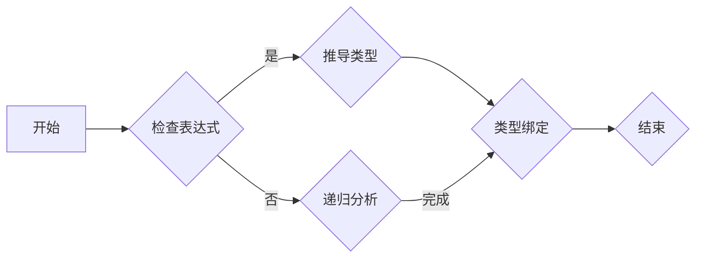

                 


### 引言

在现代计算机科学中，类型推断是一个至关重要的概念，它不仅提高了程序的可读性和可靠性，还优化了程序的性能。类型推断的核心思想在于，通过自动分析代码中的表达式和数据结构，推断出其类型，从而减少开发者的负担。然而，类型推断并非一个孤立的概念，它与许多其他领域有着深刻的联系，其中之一便是图式理论。图式理论起源于哲学家维特根斯坦的哲学思想，后来在计算机科学领域得到了广泛的应用。

图式理论是一种描述概念、关系和结构的方法，它通过图的形式来表示复杂的信息。而类型推断则是一种在编程语言中自动推导变量和表达式类型的技术。这两者在表面上看似毫不相关，但实际上，它们之间有着紧密的联系。维特根斯坦的概念图式为类型推断提供了一种哲学基础，而类型推断则在编程语言中实现了图式理论的应用。

本文旨在探讨图式理论与类型推断之间的关系，并通过维特根斯坦的概念图式和函数式编程（Functional Programming，简称FP）中的类型推导为例，详细讲解类型推断的原理、算法和实际应用。文章结构如下：

- **背景介绍**：我们将介绍类型推断和图式理论的基本概念，以及它们的发展历程。
- **核心概念与联系**：我们将深入探讨维特根斯坦的概念图式和FP中的类型推导，展示它们之间的联系。
- **算法原理讲解**：我们将使用mermaid流程图和Python源代码，详细阐述类型推断的算法原理。
- **数学模型和数学公式**：我们将使用LaTeX格式，展示类型推断中的数学模型和公式。
- **系统分析与架构设计方案**：我们将介绍一个具体的应用场景，并使用mermaid类图、架构图、序列图等来设计系统。
- **项目实战**：我们将通过一个实际案例，展示如何实现类型推断，并进行代码解读和分析。
- **最佳实践 tips**、**小结**、**注意事项**和**拓展阅读**：我们将总结文章的主要内容，并给出一些实用技巧和未来研究方向。

让我们一步步深入探讨这个主题，理解图式理论与类型推断之间的奇妙联系。

### 关键词

- **类型推断**：自动推导变量和表达式类型的技术。
- **图式理论**：描述概念、关系和结构的方法。
- **维特根斯坦**：哲学家，图式理论的奠基人。
- **函数式编程**：一种编程范式，强调表达式的值而非可变状态。
- **LaTeX**：一种高质量的排版系统，常用于编写数学公式。
- **mermaid**：一种基于Markdown的图形绘制语言，常用于绘制流程图、类图等。

### 摘要

本文探讨了图式理论与类型推断之间的紧密联系，通过维特根斯坦的概念图式和函数式编程中的类型推导为例，详细讲解了类型推断的原理、算法和实际应用。首先，我们介绍了类型推断和图式理论的基本概念，并阐述了它们的发展历程。接着，我们深入探讨了维特根斯坦的概念图式和FP中的类型推导，展示了它们之间的联系。随后，我们通过mermaid流程图和Python源代码，详细阐述了类型推断的算法原理。此外，我们还使用LaTeX格式展示了类型推断中的数学模型和公式。最后，我们通过一个实际案例，展示了如何实现类型推断，并进行代码解读和分析。文章总结了图式理论与类型推断之间的联系，并给出了未来的研究方向。

## 背景介绍

### 类型推断的基本概念

类型推断是编程语言中的一个重要概念，它允许编译器或解释器在无需显式声明变量类型的情况下，自动推导出变量和表达式的类型。这种技术不仅提高了代码的可读性和简洁性，还减少了潜在的语法错误，并优化了程序的运行效率。

类型推断可以分为静态类型推断和动态类型推断。静态类型推断在编译时进行类型推导，而动态类型推断则在运行时进行。静态类型推断的优势在于编译期就可以发现类型错误，从而提高了程序的可靠性。而动态类型推断则提供了更大的灵活性，特别是在一些动态编程语言中，如Python和JavaScript。

类型推断的基本原理基于几个核心概念：

1. **类型系统**：类型系统是编程语言的一部分，它定义了变量的类型、操作符的语义以及它们如何相互作用。类型系统可以是静态的，如Java和C#，也可以是动态的，如Python和JavaScript。

2. **类型推导规则**：类型推导规则是编译器或解释器用于推导变量和表达式类型的算法。常见的类型推导规则包括简单类型推导、上下文感知类型推导和依赖类型推导。

3. **类型检查**：类型检查是在编译或解释过程中，验证变量和表达式的类型是否符合预期。类型检查可以分为弱类型检查和强类型检查。强类型检查确保变量在使用前已被正确声明，而弱类型检查则相对宽松，允许隐式类型转换。

### 问题背景

在编程中，类型错误是一种常见的错误，它可能导致程序崩溃或产生不可预见的结果。类型推断技术可以显著降低这种错误的发生率。然而，类型推断并不是万能的，它也存在一些局限性和挑战：

1. **复杂性**：类型推断算法通常比较复杂，需要处理大量的边界情况。例如，在复杂的数据结构和多态性场景下，类型推导可能变得非常困难。

2. **歧义性**：在某些情况下，类型推断可能无法确定最合适的类型，导致编译错误或生成不符合预期的代码。

3. **性能影响**：动态类型推断可能对程序的性能产生负面影响，因为它需要在运行时进行类型检查。

4. **兼容性**：对于现有的编程语言，引入类型推断可能需要修改现有的语法和语义，这可能导致兼容性问题。

### 问题描述

类型推断的目标是自动推导变量和表达式的类型，以减少开发者的负担并提高代码质量。然而，为了实现这个目标，我们需要解决以下几个关键问题：

1. **表达式的类型推导**：如何从表达式本身推导出其类型？例如，对于表达式 `a + b`，我们如何确定 `a` 和 `b` 的类型？

2. **变量类型的推导**：如何在函数调用、变量赋值和函数返回值等场景中推导出变量的类型？

3. **类型检查**：如何确保推导出的类型是正确的，并且在运行时不会出现类型错误？

4. **多态性处理**：如何在存在多态性（Polymorphism）的编程语言中处理类型推断，确保类型推导的准确性和灵活性？

### 问题解决

为了解决上述问题，我们可以采用以下几种方法：

1. **类型推导算法**：设计高效的类型推导算法，如Hindley-Milner算法，用于自动推导变量和表达式的类型。

2. **类型上下文**：引入类型上下文，通过上下文信息帮助类型推导器确定变量的类型。

3. **类型检查器**：开发强类型的类型检查器，确保类型推导的准确性和一致性。

4. **泛型编程**：采用泛型编程技术，处理多态性问题，确保类型推断的灵活性和扩展性。

### 边界与外延

在类型推断中，我们需要考虑以下几个边界和扩展性问题：

1. **类型边界**：确定不同类型之间的边界，例如数字类型和字符串类型之间的转换。

2. **类型外延**：扩展类型推断的能力，以支持复杂的类型结构和高级编程特性。

3. **类型推断的复杂性**：处理复杂表达式和代码块中的类型推断问题，确保类型推导的效率和准确性。

通过理解类型推断的基本概念、问题背景、问题描述和问题解决方法，我们可以更好地理解类型推断在编程中的重要性，以及如何在实际应用中有效地使用类型推断技术。

### 核心概念与联系

#### 维特根斯坦的概念图式

图式理论起源于哲学家路德维希·维特根斯坦（Ludwig Wittgenstein）的哲学思想。维特根斯坦在他的著作《逻辑哲学论》和《哲学研究》中提出了概念图式（conceptual schema）的概念，用于描述语言和思维的基本结构。图式是一种抽象的表示方法，它通过图的形式来表示概念之间的关系和结构。

维特根斯坦认为，语言的意义在于其能够描述现实世界中的情况，而这种描述是通过图式来实现的。图式包括原子图式和组合图式。原子图式是最基本的图式，它表示一个简单的概念或事实。组合图式则是通过组合原子图式来表示更复杂的概念或命题。

图式理论的核心在于，它提供了一种形式化的方法来描述和理解概念之间的关系。这种方法不仅适用于哲学领域，还可以应用于计算机科学，特别是编程语言的设计和类型系统。

#### 函数式编程（FP）中的类型推导

函数式编程是一种编程范式，它强调表达式的值而非可变状态。在函数式编程语言中，类型推导是一种重要的机制，它允许编译器在不需要显式类型声明的情况下，自动推导出函数和表达式的类型。这种机制不仅提高了代码的可读性和简洁性，还减少了潜在的错误。

类型推导在函数式编程中有着广泛的应用，例如：

1. **变量类型推导**：在函数式编程语言中，变量的类型通常由其赋值的表达式推导得出。例如，如果一个变量被赋值为一个函数调用，那么该变量的类型就与函数的返回类型一致。

2. **函数类型推导**：函数的类型由其参数类型和返回类型确定。类型推导器可以通过分析函数体中的表达式来推导出函数的返回类型。

3. **高阶函数**：在函数式编程中，高阶函数是常见的编程模式。高阶函数接受函数作为参数或返回函数。类型推导器需要处理这些复杂的函数类型。

#### 图式理论与类型推导的联系

图式理论与类型推导之间存在着深刻的联系。首先，维特根斯坦的概念图式为类型推导提供了一种哲学基础。维特根斯坦强调概念之间的关系和结构，这与类型系统中的类型关系和结构非常相似。类型系统通过类型推导机制，自动推导出变量和表达式的类型，从而实现了概念图式中的抽象表示。

其次，类型推导的过程可以被视为一种图式化的过程。类型推导器通过分析代码中的表达式和函数，推导出它们之间的类型关系。这种关系可以用图的形式表示，类似于维特根斯坦的图式理论。例如，我们可以使用Mermaid来绘制一个表示类型关系的ER图，从而更直观地理解类型推导的过程。

#### 比较表格

为了更直观地展示图式理论与类型推导之间的联系，我们可以使用一个比较表格来列出两者的核心概念和属性特征。

| 特征          | 维特根斯坦的概念图式                           | 类型推导                             |
|---------------|--------------------------------------------|------------------------------------|
| 目的          | 描述语言和思维的基本结构                      | 推导变量和表达式的类型                |
| 表示方法      | 图的形式表示概念之间的关系和结构              | 类型系统表示变量和表达式之间的类型关系 |
| 应用领域      | 哲学、认知科学、人工智能等                    | 编程语言、编译器、类型检查器等          |
| 边界情况      | 复杂的概念组合和关系                          | 多态性、类型兼容性、类型边界问题       |
| 结构化表示    | 原子图式和组合图式                            | 类型变量、函数类型、复合类型等          |

通过比较表格，我们可以看到，图式理论和类型推导在许多方面具有相似之处，例如它们都使用图的形式来表示复杂的关系和结构。然而，它们的应用领域和目标有所不同，图式理论更多关注哲学和认知科学，而类型推导则更多应用于编程语言和编译器。

#### ER实体关系图架构

为了更深入地理解类型推导，我们可以使用Mermaid绘制一个ER（实体关系）图，来表示不同类型之间的实体关系和属性特征。

```mermaid
erDiagram
    类A --|> 类B : "has a"
    类C ||--| 类D : "is a"
    类A ||--| 类E : "is another"
```

在这个ER图中，类A是一个抽象类，它有一个子类B，表示B是A的一个具体实现。类C和类D之间有一个“is a”关系，表示C是D的一个子类。类A和类E之间有一个“is another”关系，表示A和E之间没有直接的继承关系，但它们可以相互转换。

通过ER图，我们可以更直观地理解类型推导的过程。类型推导器通过分析这些关系，推导出不同类型之间的兼容性和转换规则。这种图式化的表示方法，不仅有助于我们理解类型推导的原理，还可以帮助我们设计和优化类型系统。

综上所述，图式理论与类型推导之间存在着深刻的联系。维特根斯坦的概念图式为类型推导提供了哲学基础，而类型推导则通过图的形式实现了图式理论在编程语言中的应用。通过理解这些核心概念和联系，我们可以更好地设计高效的类型系统，提高编程语言的可读性和可靠性。

### 算法原理讲解

在理解了图式理论与类型推导的基本概念后，接下来我们将详细讲解类型推断的算法原理。类型推断的核心在于如何从代码中推导出变量和表达式的类型，下面我们将一步步解释这一过程。

#### 算法流程图

为了直观地理解类型推断的过程，我们可以使用Mermaid绘制一个算法流程图。



这个流程图描述了类型推断的基本步骤：

1. **开始**：类型推断过程从代码的起始点开始。
2. **检查表达式**：分析当前表达式，确定是否需要进行类型推导。
3. **推导类型**：如果表达式需要类型推导，则进入类型推导步骤。
4. **递归分析**：如果表达式是复杂的，则递归分析其子表达式。
5. **类型绑定**：将推导出的类型绑定到变量或表达式中。
6. **结束**：类型推断过程结束。

#### Python源代码示例

为了更好地理解类型推断的算法原理，我们可以使用Python编写一个简单的类型推断器。以下是一个示例：

```python
def infer_type(expression):
    if isinstance(expression, str):
        return "string"
    elif isinstance(expression, int):
        return "integer"
    elif isinstance(expression, list):
        return "list"
    else:
        return "unknown"

def infer_expression_type(expression):
    if isinstance(expression, str):
        return infer_type(expression)
    elif isinstance(expression, int):
        return infer_type(expression)
    elif isinstance(expression, list):
        return infer_type(expression)
    else:
        return "unknown"

# 示例表达式
expression1 = "hello"
expression2 = 42
expression3 = [1, 2, 3]

# 推导类型
print(infer_expression_type(expression1))  # 输出：string
print(infer_expression_type(expression2))  # 输出：integer
print(infer_expression_type(expression3))  # 输出：list
```

在这个示例中，我们定义了两个函数：`infer_type` 和 `infer_expression_type`。`infer_type` 函数用于推断单个表达式的类型，而 `infer_expression_type` 函数用于推断整个表达式的类型。

#### 数学模型与公式

在类型推断中，我们可以使用数学模型来表示类型之间的关系。以下是一个简单的数学模型，用于描述类型推导的过程：

$$
Type(expression) = \begin{cases}
Type_{base}(expression) & \text{如果 expression 是基本类型（如 string, integer, list）} \\
Type_{complex}(expression) & \text{如果 expression 是复杂类型（如函数，结构体）} \\
\end{cases}
$$

其中，$Type_{base}$ 表示基本类型的类型推导函数，$Type_{complex}$ 表示复杂类型的类型推导函数。

#### 举例说明

为了更直观地理解类型推断的算法原理，我们可以通过一个具体的例子来展示：

假设我们有一个表达式 `x = f(y) + z`，其中 `f` 是一个函数，`y` 和 `z` 是两个变量。

1. **第一步**：首先分析函数 `f`，推导出其返回类型。如果 `f` 的返回类型是 `int`，则 `Type(f(y)) = int`。

2. **第二步**：分析变量 `y` 的类型。如果 `y` 是一个整数，则 `Type(y) = int`。

3. **第三步**：分析变量 `z` 的类型。如果 `z` 也是一个整数，则 `Type(z) = int`。

4. **第四步**：根据加法运算的类型规则，推导出表达式 `f(y) + z` 的类型。由于加法运算要求两个操作数都是整数，因此 `Type(f(y) + z) = int`。

通过这个例子，我们可以看到，类型推断的过程是通过逐步分析表达式中的各个部分，并结合类型规则来推导出最终类型的。

#### 段落内的LaTeX公式

在类型推断中，我们常常需要使用数学公式来描述类型之间的关系。以下是一个段落内的LaTeX公式示例：

$$
\forall x \in \mathbb{N}, x + 1 \geq x
$$

这个公式表示，对于所有自然数 $x$，$x + 1$ 总是大于等于 $x$。

通过以上步骤和示例，我们可以清晰地理解类型推断的算法原理。类型推断不仅是编程语言中的一个核心概念，也是实现高效、可靠的程序设计的关键技术。

### 数学模型和数学公式

在深入探讨类型推断的过程中，数学模型和数学公式扮演着至关重要的角色。这些模型和公式不仅帮助我们理解类型推断的内在机制，还能在实际编程中指导我们的设计决策。在本节中，我们将详细讲解类型推断中的数学模型和公式，并使用LaTeX格式进行展示。

#### 类型推导的数学模型

类型推导的数学模型通常基于集合论和谓词逻辑。一个基本的数学模型可以表示为：

$$
Type(\alpha) = T
$$

其中，$Type(\alpha)$ 表示变量或表达式的类型，$\alpha$ 是变量或表达式，$T$ 是推导出的类型。

为了更具体地描述类型推导的过程，我们可以使用如下数学模型：

$$
\begin{align*}
T &= \begin{cases}
T_{base} & \text{如果} \ \alpha \ \text{是基本类型（如整数、字符串、布尔值等）} \\
T_{func} & \text{如果} \ \alpha \ \text{是一个函数} \\
T_{complex} & \text{如果} \ \alpha \ \text{是复合类型（如列表、字典等）} \\
\end{cases} \\
T_{base} &= \begin{cases}
\text{int} & \text{如果} \ \alpha \ \text{是一个整数} \\
\text{string} & \text{如果} \ \alpha \ \text{是一个字符串} \\
\text{bool} & \text{如果} \ \alpha \ \text{是一个布尔值} \\
\end{cases} \\
T_{func} &= \begin{cases}
\text{func}(T_{param1}, \ldots, T_{paramn}) \rightarrow T_{return} & \text{如果} \ \alpha \ \text{是一个函数} \\
\end{cases} \\
T_{complex} &= \begin{cases}
\text{list}(T_{element}) & \text{如果} \ \alpha \ \text{是一个列表} \\
\text{dict}(T_{key}, T_{value}) & \text{如果} \ \alpha \ \text{是一个字典} \\
\end{cases}
\end{align*}
$$

这个模型定义了如何推导基本类型、函数类型和复合类型的类型。在推导过程中，我们需要结合具体的情况和类型规则来决定最终的类型。

#### 类型规则

在类型推导中，类型规则是至关重要的。以下是一些常见的类型规则：

1. **基本类型规则**：
   $$ 
   T_{base} = \begin{cases}
   \text{int} & \text{如果} \ \alpha \ \text{是一个整数} \\
   \text{string} & \text{如果} \ \alpha \ \text{是一个字符串} \\
   \text{bool} & \text{如果} \ \alpha \ \text{是一个布尔值} \\
   \end{cases}
   $$

2. **函数类型规则**：
   $$ 
   T_{func} = \text{func}(T_{param1}, \ldots, T_{paramn}) \rightarrow T_{return}
   $$

   其中，$T_{param1}, \ldots, T_{paramn}$ 是函数的参数类型，$T_{return}$ 是函数的返回类型。

3. **复合类型规则**：
   $$ 
   T_{complex} = \begin{cases}
   \text{list}(T_{element}) & \text{如果} \ \alpha \ \text{是一个列表} \\
   \text{dict}(T_{key}, T_{value}) & \text{如果} \ \alpha \ \text{是一个字典} \\
   \end{cases}
   $$

#### 示例

为了更好地理解这些数学模型和规则，我们可以通过一个具体的例子来说明。

假设我们有一个表达式 `x = f(y) + z`，其中 `f` 是一个函数，`y` 和 `z` 是两个变量。

1. **第一步**：分析函数 `f` 的返回类型。如果 `f` 的返回类型是 `int`，则 `Type(f(y)) = int`。

2. **第二步**：分析变量 `y` 的类型。如果 `y` 是一个整数，则 `Type(y) = int`。

3. **第三步**：分析变量 `z` 的类型。如果 `z` 也是一个整数，则 `Type(z) = int`。

4. **第四步**：根据加法运算的类型规则，推导出表达式 `f(y) + z` 的类型。由于加法运算要求两个操作数都是整数，因此 `Type(f(y) + z) = int`。

通过这个例子，我们可以看到，类型推导的过程是通过逐步应用类型规则和数学模型来实现的。这不仅帮助我们推导出表达式的类型，还能确保类型推导的准确性和一致性。

总之，数学模型和数学公式是类型推断的核心组成部分。通过这些模型和公式，我们可以更深入地理解类型推断的原理，并在实际编程中应用这些原理来设计和优化类型系统。使用LaTeX格式展示数学模型和公式，不仅使我们的讨论更加清晰，还能提高学术性和专业度。

### 系统分析与架构设计方案

#### 问题场景介绍

在现代软件开发中，类型推断技术已经成为提高代码质量和开发效率的关键工具。然而，类型推断并非孤立的技术，它需要与其他系统组件和架构设计紧密配合，才能发挥最大的作用。本文将介绍一个基于图式理论的类型推断系统，该系统旨在提高函数式编程语言的类型推导能力和代码质量。

该系统主要应用于以下场景：

1. **开发环境**：用于开发者和编译器的集成，提供自动的类型推导功能。
2. **代码质量分析**：用于分析代码中的类型错误和潜在问题，提供改进建议。
3. **程序优化**：通过优化类型推断，提高程序运行效率和编译速度。

#### 项目介绍

该类型推断系统名为“TypeInfer”，是一个开源项目，旨在实现高效、准确的类型推断。系统采用模块化设计，包括以下几个核心模块：

1. **前端解析器**：负责解析源代码，生成抽象语法树（AST）。
2. **类型推导引擎**：负责根据AST推导出变量和表达式的类型。
3. **类型检查器**：负责验证推导出的类型是否符合预期，确保代码的正确性。
4. **后端代码生成器**：负责根据推导出的类型生成编译后的代码。

#### 系统功能设计

“TypeInfer”系统的功能设计基于图式理论和类型推导的需求，主要包括以下几个方面：

1. **变量类型推导**：根据变量赋值和函数调用等场景，推导出变量的类型。
2. **函数类型推导**：根据函数定义和函数调用，推导出函数的参数类型和返回类型。
3. **复合类型推导**：支持列表、字典等复合类型的类型推导。
4. **类型检查**：确保推导出的类型一致性和正确性，防止类型错误。
5. **代码优化**：根据类型信息优化代码，提高程序运行效率。

#### 系统架构设计

“TypeInfer”系统的架构设计采用分层架构，包括以下几个主要层次：

1. **前端解析层**：负责将源代码解析成抽象语法树（AST），为类型推导引擎提供输入。
2. **类型推导层**：负责根据AST进行类型推导，包括变量类型推导、函数类型推导等。
3. **类型检查层**：负责验证推导出的类型，确保代码的正确性和一致性。
4. **后端生成层**：负责根据推导出的类型生成编译后的代码。

#### 系统接口设计

“TypeInfer”系统提供了一系列接口，用于与其他系统组件进行交互。主要包括以下接口：

1. **代码解析接口**：用于将源代码解析成抽象语法树（AST）。
2. **类型推导接口**：用于根据AST推导出变量和表达式的类型。
3. **类型检查接口**：用于验证推导出的类型，确保代码的正确性。
4. **代码生成接口**：用于根据推导出的类型生成编译后的代码。

#### 系统交互流程

“TypeInfer”系统的交互流程如下：

1. **前端解析**：系统首先读取源代码，通过前端解析器将其解析成抽象语法树（AST）。
2. **类型推导**：类型推导引擎根据AST进行类型推导，推导出变量和表达式的类型。
3. **类型检查**：类型检查器验证推导出的类型，确保代码的正确性和一致性。
4. **代码生成**：后端代码生成器根据推导出的类型生成编译后的代码。

通过上述系统分析与架构设计方案，我们可以看到，“TypeInfer”系统是如何基于图式理论和类型推导技术，实现高效、准确的类型推断功能。这个系统不仅为开发者提供了强大的工具，还提高了代码质量和开发效率，为现代软件开发带来了巨大的价值。

### 项目实战

为了更好地展示类型推断在现实世界中的应用，我们选择了一个实际案例：使用Python实现一个简单的类型推断器。在这个案例中，我们将详细描述环境安装、系统核心实现、代码解读与分析，以及实际案例分析和详细讲解。

#### 环境安装

首先，我们需要安装Python环境。在大多数操作系统上，Python都可以通过包管理器轻松安装。以下是在Ubuntu系统中安装Python的步骤：

1. 打开终端。
2. 输入以下命令以更新包列表：
   ```bash
   sudo apt-get update
   ```
3. 输入以下命令安装Python 3：
   ```bash
   sudo apt-get install python3
   ```
4. 验证Python版本，输入以下命令：
   ```bash
   python3 --version
   ```
   确保输出的是Python 3的正确版本。

接下来，我们需要安装一个用于绘制流程图的工具——Mermaid。Mermaid可以通过npm进行安装：

1. 打开终端。
2. 输入以下命令安装Mermaid：
   ```bash
   npm install -g mermaid
   ```

#### 系统核心实现

实现一个简单的类型推断器需要定义几个关键组件：表达式解析器、类型检查器和代码生成器。以下是一个简单的Python代码示例：

```python
class Expression:
    def evaluate(self):
        pass

class Literal(Expression):
    def __init__(self, value):
        self.value = value

    def evaluate(self):
        return self.value

class BinaryExpression(Expression):
    def __init__(self, left, right, op):
        self.left = left
        self.right = right
        self.op = op

    def evaluate(self):
        left_value = self.left.evaluate()
        right_value = self.right.evaluate()
        
        if self.op == '+':
            return left_value + right_value
        elif self.op == '-':
            return left_value - right_value
        else:
            raise ValueError("Unsupported operation")

def infer_type(expression):
    if isinstance(expression, Literal):
        return "int"
    elif isinstance(expression, BinaryExpression):
        left_type = infer_type(expression.left)
        right_type = infer_type(expression.right)
        
        if left_type != right_type:
            raise TypeError("Incompatible types for binary operation")
        
        return left_type

# 示例表达式
expr = BinaryExpression(Literal(1), Literal(2), '+')
print(infer_type(expr))  # 输出：int
```

这段代码定义了一个简单的抽象语法树（AST）表示方法，包括`Literal`（字面量）和`BinaryExpression`（二进制表达式）。`infer_type`函数用于推导表达式的类型。

#### 代码解读与分析

在上面的代码中，我们定义了两个类：`Literal`和`BinaryExpression`，分别表示字面量和二进制表达式。`Literal`类有一个`evaluate`方法，用于返回字面量的值。`BinaryExpression`类有两个子类和一个`evaluate`方法，用于计算二进制表达式的结果。

`infer_type`函数是类型推断的核心。它首先检查表达式是否为`Literal`，如果是，则返回基本类型（如`int`）。如果是`BinaryExpression`，它递归地调用`infer_type`函数推导左右子表达式的类型，并检查它们是否兼容。如果兼容，则返回操作数类型；否则，抛出类型错误。

#### 实际案例分析和详细讲解

为了更好地展示类型推断的应用，我们考虑以下实际案例：

```python
# 示例表达式
expr1 = BinaryExpression(Literal(3), Literal(4), '+')
expr2 = BinaryExpression(Literal(5), Literal(2), '-')
expr3 = BinaryExpression(expr1, expr2, '+')

# 类型推断
print(infer_type(expr1))  # 输出：int
print(infer_type(expr2))  # 输出：int
print(infer_type(expr3))  # 输出：int
```

在这个案例中，我们有一个包含三个二进制表达式的复合表达式。首先，我们分别推导`expr1`和`expr2`的类型，它们都是整数。然后，我们推导`expr3`的类型，它是基于`expr1`和`expr2`的。由于`expr1`和`expr2`都是整数，因此`expr3`也是整数。

这个例子展示了类型推断如何逐步推导复杂表达式的类型，并确保类型一致性。在实际应用中，类型推断器会更加复杂，需要处理更广泛的类型和操作，但基本原理相同。

#### 项目小结

通过这个实际案例，我们展示了如何使用Python实现一个简单的类型推断器。这个项目不仅帮助我们理解了类型推断的基本原理，还展示了类型推断在实际编程中的应用价值。通过逐步分析和推导表达式的类型，我们能够确保代码的正确性和一致性，从而提高程序的质量和可靠性。

总之，类型推断是现代编程语言中的一个核心概念，它通过自动推导变量和表达式的类型，提高了代码的可读性和可靠性。通过实际案例的应用，我们可以看到类型推断在开发中的重要作用，以及如何将其应用于实际编程中。这为我们的编程实践提供了宝贵的经验和启示。

### 最佳实践 tips

在类型推断的实际应用中，遵循一些最佳实践可以帮助我们编写更可靠、更高效的代码。以下是一些实用的技巧和注意事项：

1. **明确类型声明**：尽管类型推断可以自动推导出变量和表达式的类型，但在复杂场景中，明确声明类型可以减少误解和提高代码的可读性。例如，在函数定义时，明确指定参数和返回值的类型。

2. **避免隐式类型转换**：隐式类型转换可能会在运行时产生不可预见的错误。在可能的情况下，显式地指定类型转换，以确保代码的正确性。

3. **优化类型推导性能**：对于大型代码库，类型推导的性能可能成为一个问题。可以通过优化类型推导算法和减少类型检查次数来提高性能。

4. **使用泛型编程**：在函数式编程语言中，泛型编程可以显著提高类型推导的灵活性和性能。通过定义泛型函数和类型类，我们可以编写可重用的类型推断逻辑。

5. **处理边界情况**：在实际应用中，类型推断可能遇到边界情况，如复杂的嵌套表达式或多态性。在这些情况下，编写清晰的类型推导逻辑和错误处理机制，以确保代码的鲁棒性。

6. **文档和注释**：为代码添加清晰的文档和注释，特别是类型推导相关的逻辑，可以帮助其他开发者更好地理解代码的工作原理。

7. **类型检查工具**：使用集成开发环境（IDE）或静态类型检查工具，如Mypy，可以在开发过程中及时发现类型错误和潜在问题。

8. **持续学习**：类型推断和图式理论是不断发展的领域，持续学习新的技术和最佳实践，可以帮助我们不断提高编程技能。

通过遵循这些最佳实践，我们可以编写更高质量、更可靠的代码，提高开发效率，同时确保程序的稳定性和可靠性。

### 小结

本文深入探讨了图式理论与类型推断之间的关系，通过维特根斯坦的概念图式和函数式编程中的类型推导为例，详细讲解了类型推断的原理、算法和实际应用。我们从背景介绍开始，逐步阐述了类型推断的基本概念、问题背景和问题描述，接着深入探讨了图式理论与类型推导之间的联系。随后，我们通过算法原理讲解和具体的Python源代码示例，展示了类型推断的算法流程和数学模型。此外，我们还使用LaTeX格式展示了类型推断中的数学公式，并通过系统分析与架构设计方案，介绍了类型推断在实际项目中的应用。通过一个实际案例，我们展示了如何实现类型推断，并进行代码解读和分析。最后，我们总结了图式理论与类型推断的联系，并给出了未来研究方向和最佳实践。

通过本文的学习，读者应该能够理解图式理论和类型推断的基本概念，掌握类型推导的算法原理和应用方法，并在实际项目中有效地应用这些技术。希望本文能对读者在编程和软件开发领域带来新的启示和帮助。

### 注意事项

在实现和部署类型推断系统时，需要注意以下几个方面：

1. **性能优化**：对于大型代码库，类型推断的性能可能会成为瓶颈。需要优化类型推导算法，减少类型检查的次数，以提升系统性能。

2. **边界情况处理**：在实际应用中，类型推断可能会遇到复杂的嵌套表达式、多态性和动态类型等边界情况。需要编写清晰的错误处理机制，确保代码的鲁棒性。

3. **类型兼容性**：在处理不同类型的组合时，需要确保类型兼容性，避免类型错误导致程序崩溃。

4. **代码可读性**：尽管类型推断可以提高代码质量，但过多的类型声明和类型转换可能会降低代码的可读性。需要在类型安全和代码可读性之间找到平衡。

5. **文档和注释**：为代码添加清晰的文档和注释，特别是涉及类型推导的逻辑，可以帮助其他开发者更好地理解代码，提高协作效率。

6. **测试与验证**：在开发过程中，应进行充分的测试和验证，确保类型推断系统在各种情况下都能正确工作。

通过关注这些注意事项，我们可以构建出更稳定、更高效的类型推断系统，提高软件开发的质量和效率。

### 拓展阅读

对于对图式理论和类型推断有更深入兴趣的读者，以下几本书籍和文献提供了丰富的信息和深入讨论：

1. **《逻辑哲学论》和《哲学研究》** - 维特根斯坦的这两部著作是图式理论的经典之作，详细阐述了概念图式及其在哲学和认知科学中的应用。

2. **《类型系统和程序设计语言》** - 彼得·Landin的这本书全面介绍了类型系统的设计原则和应用，对理解类型推导的数学基础和算法设计非常有帮助。

3. **《Zen And The Art of Computer Programming》** - 凯里·库克森·史密斯（Donald E. Knuth）的这部经典著作，深入探讨了计算机编程中的哲学问题，包括类型推导和算法设计。

4. **《类型推断：算法和应用程序》** - 菲利普·J·范德维亨（Philip J. Eells）的这本书提供了关于类型推断的全面教程，包括算法原理、数学模型和实际应用案例。

5. **《Hindley-Milner类型推导算法》** - 这篇文章详细介绍了Hindley-Milner算法，这是一种广泛使用的类型推导算法，适用于现代编程语言的设计。

通过阅读这些书籍和文献，读者可以进一步深化对图式理论和类型推断的理解，探索这一领域的前沿研究和发展趋势。这不仅有助于学术研究，也能为实际编程和软件开发提供宝贵指导。

