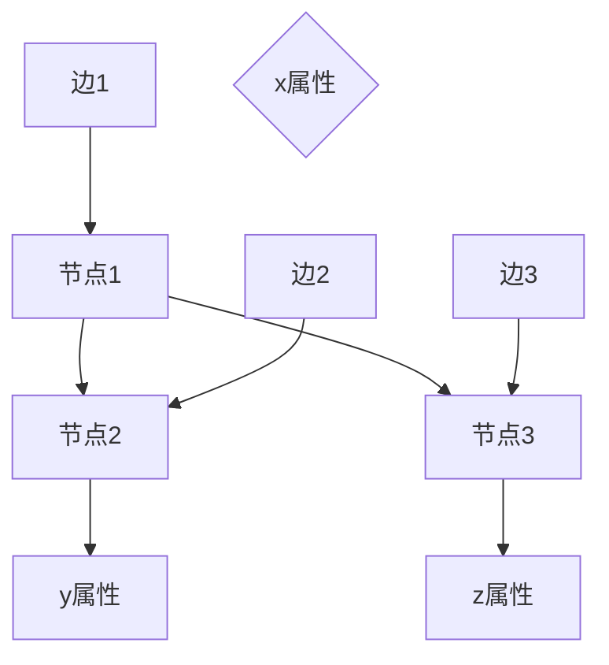
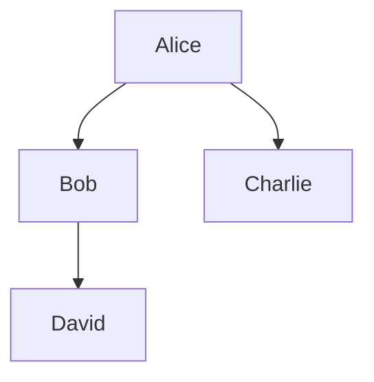

                 

# 图数据库应用场景与实践

## 关键词

- **图数据库**  
- **社交网络**  
- **推荐系统**  
- **金融风控**  
- **大数据处理**  
- **图算法**

## 摘要

随着大数据和互联网技术的飞速发展，传统的数据库技术已经无法满足复杂的应用需求。图数据库作为一种新兴的数据库技术，因其强大的图结构存储和查询能力，逐渐成为数据管理和分析的重要工具。本文将全面介绍图数据库的应用场景与实践，包括其产生背景、核心概念、算法原理、系统设计与架构方案，并通过具体案例展示其实际应用效果。希望通过本文，读者能够深入理解图数据库，掌握其应用技巧，并能够在实际项目中成功应用图数据库技术。

## 第一部分：背景介绍与问题解决

### 问题背景

随着互联网和大数据技术的飞速发展，数据量呈指数级增长，传统的数据库技术已经无法满足日益复杂的应用需求。图数据库作为一种新型的数据库技术，因其强大的图结构存储和查询能力，逐渐成为数据管理和分析的重要工具。图数据库不仅能够高效地处理复杂的关系网络，还能够支持大规模数据的实时查询和分析，在社交网络、推荐系统、金融风控等多个领域都有广泛的应用。

### 问题描述

图数据库应用场景丰富，涵盖了社交网络、推荐系统、金融风控等多个领域。然而，当前图数据库在实际应用中仍面临一些挑战，包括：

1. **应用场景不明确**：许多企业对图数据库的应用场景认识不足，导致无法充分发挥其优势。
2. **技术难点多**：图数据库涉及到的算法和架构较为复杂，对于技术团队来说是一个不小的挑战。
3. **实践案例缺乏**：虽然理论上图数据库具有众多优势，但实际应用中的成功案例较少，缺乏具体的实践指导。

### 问题解决

为了解决上述问题，本文将从以下几个方面展开：

1. **背景介绍**：详细阐述图数据库的产生背景、发展历程以及其在当前技术领域中的重要地位。
2. **核心概念与联系**：介绍图数据库的核心概念，如图结构、图算法等，并通过对比表格和实体关系图展示其属性特征。
3. **算法原理讲解**：使用 mermaid 画出算法流程图，并使用 Python 源代码详细阐述算法原理，包括数学模型和公式，并举例说明。
4. **系统分析与架构设计方案**：介绍图数据库系统分析与架构设计方案，包括问题场景介绍、系统功能设计、系统架构设计、系统接口设计和系统交互流程。
5. **项目实战**：通过具体案例，详细讲解图数据库的应用实践，包括环境安装、系统核心实现源代码，代码应用解读与分析，实际案例分析和详细讲解剖析。
6. **最佳实践与拓展**：总结图数据库应用的最佳实践，并给出注意事项和拓展阅读建议。

通过以上内容，本文希望能够帮助读者全面了解图数据库，掌握其应用技巧，并能够在实际项目中成功应用图数据库技术。以下是本文的完整目录大纲。

----------------------------------------------------------------

## 目录大纲

### 第一部分：背景介绍与问题解决

### 1.1 图数据库的产生背景与发展历程

#### 1.1.1 数据库技术的演变

- **关系数据库**：传统的关系数据库在处理结构化数据时表现优秀，但面对复杂的关系网络时，性能和灵活性有所不足。
- **NoSQL数据库**：随着互联网和大数据的兴起，NoSQL数据库应运而生，包括键值存储、文档存储、列族存储等类型，它们提供了更高的灵活性和扩展性。
- **图数据库的崛起**：图数据库结合了关系数据库和NoSQL数据库的优点，通过图结构存储和查询复杂的关系网络，成为新一代的数据管理工具。

#### 1.1.2 图数据库在当前技术领域中的重要地位

- **应用广泛**：图数据库在社交网络、推荐系统、金融风控、物联网等领域都有广泛应用，能够高效处理复杂的关系网络。
- **数据分析能力**：图数据库强大的图算法支持，能够进行深度数据挖掘和分析，提供更加精准的业务洞察。
- **技术发展趋势**：随着AI和大数据技术的融合，图数据库正在成为数据管理和分析的重要基石，其应用范围和影响力将不断扩展。

### 1.2 图数据库的核心概念

#### 1.2.1 图结构

- **定义**：图（Graph）由节点（Node）和边（Edge）组成，节点表示实体，边表示实体之间的关系。
- **类型**：图可分为无向图、有向图、加权图、无权图等不同类型，适用于不同场景的关系表示。

#### 1.2.2 图算法

- **定义**：图算法是用于处理图结构数据的算法，包括路径查找、最短路径、图遍历、社区发现等。
- **应用**：图算法能够解决复杂的关系查询和数据分析问题，为业务决策提供数据支持。

### 1.3 图数据库的应用场景

#### 1.3.1 社交网络

- **场景**：用户关系、社交图谱、推荐系统等。
- **案例**：Facebook、LinkedIn、微博等社交平台使用图数据库来处理复杂用户关系和网络分析。

#### 1.3.2 推荐系统

- **场景**：基于用户行为、社交关系、内容相似度等进行推荐。
- **案例**：Amazon、Netflix、淘宝等电商和流媒体平台利用图数据库进行个性化推荐。

#### 1.3.3 金融风控

- **场景**：风险监测、欺诈检测、信用评估等。
- **案例**：银行、保险公司、证券公司等金融机构使用图数据库进行风险管理和合规监控。

#### 1.3.4 物联网

- **场景**：设备连接、数据处理、智能分析等。
- **案例**：智能家居、智能交通、智能医疗等领域利用图数据库进行设备管理和数据处理。

### 1.4 图数据库的优势与挑战

#### 1.4.1 优势

- **高效处理复杂关系网络**：图数据库能够高效地存储和查询复杂的关系网络，提供强大的数据关联和分析能力。
- **实时数据分析和挖掘**：图数据库支持大规模数据的实时查询和分析，为业务决策提供及时的数据支持。
- **灵活的扩展性**：图数据库能够灵活扩展存储和计算资源，适应不同规模和类型的数据管理需求。

#### 1.4.2 挑战

- **技术难点多**：图数据库涉及到的算法和架构较为复杂，对于技术团队来说是一个不小的挑战。
- **应用场景不明确**：许多企业对图数据库的应用场景认识不足，导致无法充分发挥其优势。
- **实践案例缺乏**：虽然理论上图数据库具有众多优势，但实际应用中的成功案例较少，缺乏具体的实践指导。

### 1.5 总结

图数据库作为一种新兴的数据库技术，具有高效处理复杂关系网络、实时数据分析和挖掘、灵活扩展性等优势。然而，在实际应用中仍面临一些挑战，如技术难点、应用场景不明确和实践案例缺乏等。本文将从背景介绍、核心概念、算法原理、系统设计与架构方案、项目实战和最佳实践等方面，全面介绍图数据库的应用场景与实践，帮助读者深入理解图数据库，掌握其应用技巧，并能够在实际项目中成功应用图数据库技术。

----------------------------------------------------------------

## 第一部分：背景介绍与问题解决

### 1.1 图数据库的产生背景与发展历程

#### 1.1.1 数据库技术的演变

随着信息技术的发展，数据库技术也在不断演进。最早期的数据库技术是层次数据库和网状数据库，它们主要用于处理结构化数据，但存在灵活性不足和查询效率低下等问题。

1970年，E.F. Codd提出了关系数据库理论，开创了关系数据库的时代。关系数据库通过表格形式存储数据，采用SQL语言进行查询，大大提高了数据处理的灵活性和效率。然而，关系数据库在面对复杂的关系网络时，仍存在一定的局限性。

随着互联网和大数据时代的到来，NoSQL数据库应运而生。NoSQL数据库包括键值存储、文档存储、列族存储等类型，它们提供了更高的灵活性和扩展性，能够更好地处理非结构化数据和大规模数据。然而，NoSQL数据库在处理复杂关系网络时，仍存在一定的性能瓶颈。

#### 1.1.2 图数据库的崛起

图数据库（Graph Database）是一种以图结构存储和查询数据的数据库。图数据库通过节点和边来表示实体及其关系，能够高效地处理复杂的关系网络。图数据库的崛起，解决了传统关系数据库和NoSQL数据库在处理复杂关系网络时的性能瓶颈。

图数据库的发展可以追溯到20世纪70年代，当时出现了基于图的数据库管理系统（如GraphDB、HyperGraphDB等）。然而，真正引起广泛关注的是2004年Neo4j的发布，标志着图数据库进入了一个新的发展阶段。

近年来，随着大数据、人工智能等技术的融合，图数据库在应用领域得到了迅速扩展。特别是在社交网络、推荐系统、金融风控、物联网等领域，图数据库因其强大的数据关联和分析能力，成为数据管理和分析的重要工具。

#### 1.1.3 图数据库在当前技术领域中的重要地位

图数据库在当前技术领域中的地位日益重要，主要体现在以下几个方面：

1. **应用广泛**：图数据库在社交网络、推荐系统、金融风控、物联网等领域都有广泛应用。例如，Facebook、LinkedIn、微博等社交平台使用图数据库处理用户关系和网络分析；Amazon、Netflix、淘宝等电商和流媒体平台利用图数据库进行个性化推荐。

2. **数据分析能力**：图数据库强大的图算法支持，能够进行深度数据挖掘和分析，提供更加精准的业务洞察。例如，在金融风控领域，图数据库可以用于风险监测、欺诈检测、信用评估等。

3. **技术发展趋势**：随着AI和大数据技术的融合，图数据库正在成为数据管理和分析的重要基石。例如，在智能交通领域，图数据库可以用于优化路线规划、交通流量预测等；在智能医疗领域，图数据库可以用于疾病传播预测、药物研发等。

总之，图数据库作为一种新兴的数据库技术，具有广泛的应用前景和重要的技术价值。在当前技术领域，图数据库正逐渐成为数据管理和分析的重要工具，其应用范围和影响力将不断扩展。

----------------------------------------------------------------

## 1.2 图数据库的核心概念

图数据库作为一种以图结构存储和查询数据的数据库，其核心概念主要包括图结构、节点、边、属性、图算法等。在本节中，我们将详细介绍这些核心概念，并通过对比表格和实体关系图展示其属性特征。

#### 1.2.1 图结构

图（Graph）是图数据库的核心概念，它由节点（Node）和边（Edge）组成。节点表示实体，边表示实体之间的关系。图可分为无向图、有向图、加权图、无权图等不同类型，适用于不同场景的关系表示。

| 类型 | 描述 | 适用场景 |
| --- | --- | --- |
| 无向图 | 边没有方向 | 社交网络、推荐系统 |
| 有向图 | 边有方向 | 信息传播、网络拓扑 |
| 加权图 | 边有权重 | 路径规划、资源分配 |
| 无权图 | 边没有权重 | 社交网络、网络拓扑 |

#### 1.2.2 节点（Node）

节点是图数据库中的基本实体，表示具体的数据对象。节点可以包含属性，用于描述节点的特征信息。

| 属性 | 描述 | 示例 |
| --- | --- | --- |
| ID | 唯一标识符 | 1 |
| 名称 | 节点名称 | "Alice" |
| 类型 | 节点类型 | "Person" |

#### 1.2.3 边（Edge）

边是连接两个节点的元素，表示节点之间的关系。边也可以包含属性，用于描述关系的特征信息。

| 属性 | 描述 | 示例 |
| --- | --- | --- |
| 类型 | 关系类型 | "FRIENDS_WITH" |
| 权重 | 关系强度 | 1 |
| 时间戳 | 关系建立时间 | 1617245200 |

#### 1.2.4 属性

属性是节点和边上的特征信息，用于描述实体及其关系的特征。属性可以是基本数据类型（如整数、字符串、浮点数等），也可以是复合数据类型（如数组、对象等）。

| 属性类型 | 描述 | 示例 |
| --- | --- | --- |
| 整数 | 表示整数值 | 1 |
| 字符串 | 表示字符串值 | "Hello, World!" |
| 浮点数 | 表示浮点数值 | 3.14 |
| 数组 | 表示数组值 | [1, 2, 3] |
| 对象 | 表示复杂对象 | {"name": "Alice", "age": 30} |

#### 1.2.5 图算法

图算法是用于处理图结构数据的算法，包括路径查找、最短路径、图遍历、社区发现等。图算法能够解决复杂的关系查询和数据分析问题，为业务决策提供数据支持。

| 算法 | 描述 | 示例 |
| --- | --- | --- |
| 广度优先搜索（BFS） | 寻找节点之间的最短路径 | 寻找社交网络中好友的最近共同好友 |
| 深度优先搜索（DFS） | 寻找节点之间的路径 | 寻找社交网络中的小团体 |
| Dijkstra算法 | 寻找加权图中的最短路径 | 路径规划 |
| PageRank算法 | 评估节点的重要性 | 推荐系统 |

通过以上介绍，我们可以看到图数据库的核心概念具有以下特征：

1. **灵活的关系表示**：图数据库通过节点和边表示实体及其关系，能够灵活地适应各种复杂关系网络。
2. **强大的数据分析能力**：图算法支持深度数据挖掘和分析，为业务决策提供数据支持。
3. **丰富的属性描述**：节点和边上的属性可以描述实体及其关系的特征信息，为数据查询和分析提供更多维度。

这些特征使得图数据库成为一种强大的数据管理和分析工具，在多个领域都有广泛应用。

#### 1.2.6 Mermaid 流程图

为了更好地理解图数据库的核心概念，我们可以使用Mermaid流程图来展示节点、边和属性之间的关系。



在上面的流程图中，节点A、B和C表示实体，边D、E和F表示实体之间的关系。节点上的属性x、y和z描述了实体的特征信息。通过Mermaid流程图，我们可以直观地看到图数据库的核心概念及其关系。

总之，图数据库的核心概念包括图结构、节点、边、属性和图算法。通过灵活的关系表示、强大的数据分析能力和丰富的属性描述，图数据库成为了一种强大的数据管理和分析工具，在多个领域都有广泛应用。

----------------------------------------------------------------

## 1.3 图数据库的应用场景

图数据库作为一种强大的数据管理和分析工具，在多个领域都有广泛应用。在本节中，我们将详细介绍图数据库在社交网络、推荐系统、金融风控、物联网等领域的应用场景，并通过具体案例展示其实际应用效果。

### 1.3.1 社交网络

社交网络是图数据库的一个重要应用场景。在社交网络中，用户及其之间的关系可以表示为一个复杂的图结构。图数据库能够高效地存储和查询用户关系网络，提供丰富的社交图谱分析功能。

**案例**：Facebook和LinkedIn等社交平台使用图数据库处理用户关系和网络分析。

- **用户关系网络**：通过图数据库，Facebook可以构建用户之间的关系网络，包括好友关系、关注关系等，从而实现社交推荐和社交广告等功能。
- **社交图谱分析**：LinkedIn利用图数据库分析用户职业关系、技能图谱等，为用户提供更加精准的职业推荐和人才搜索服务。

### 1.3.2 推荐系统

推荐系统是另一个重要的应用场景。在推荐系统中，用户行为数据、社交关系数据、内容数据等可以构建成一个复杂的图结构。图数据库能够高效地处理这些复杂的关系网络，提供强大的推荐算法支持。

**案例**：Amazon、Netflix、淘宝等电商和流媒体平台利用图数据库进行个性化推荐。

- **用户行为数据**：通过图数据库，Amazon可以构建用户购买历史数据，实现基于用户行为的个性化推荐。
- **社交关系数据**：Netflix利用图数据库分析用户之间的社交关系，实现基于社交关系的个性化推荐。
- **内容数据**：淘宝利用图数据库分析商品之间的关系，实现基于商品内容的个性化推荐。

### 1.3.3 金融风控

金融风控是图数据库在金融领域的典型应用。在金融风控中，需要处理大量的金融交易数据、用户数据、企业数据等，通过图数据库可以构建出一个复杂的金融关系网络，从而实现风险监测、欺诈检测、信用评估等功能。

**案例**：银行、保险公司、证券公司等金融机构使用图数据库进行风险管理和合规监控。

- **风险监测**：通过图数据库，银行可以构建用户之间的交易关系网络，实时监测交易异常，实现风险预警。
- **欺诈检测**：保险公司利用图数据库分析用户之间的交易关系，识别潜在的欺诈行为，降低保险欺诈风险。
- **信用评估**：证券公司通过图数据库分析企业的财务关系、股东关系等，实现对企业信用的评估，降低投资风险。

### 1.3.4 物联网

物联网是图数据库在新兴领域的应用之一。在物联网中，设备之间、设备与云平台之间、设备与用户之间等可以构建成一个复杂的图结构。图数据库能够高效地处理这些复杂的关系网络，实现设备管理、数据处理和智能分析等功能。

**案例**：智能家居、智能交通、智能医疗等领域利用图数据库进行设备管理和数据处理。

- **设备管理**：通过图数据库，智能家居系统可以管理各种智能设备，实现设备之间的联动和控制。
- **数据处理**：智能交通系统利用图数据库处理大量交通数据，实现交通流量预测、路线规划等功能。
- **智能分析**：智能医疗系统利用图数据库分析医疗数据，实现疾病预测、药物推荐等功能。

### 1.3.5 总结

图数据库在社交网络、推荐系统、金融风控、物联网等多个领域都有广泛应用。通过图数据库，可以构建复杂的图结构，实现高效的数据存储、查询和分析。随着大数据、人工智能等技术的融合，图数据库的应用范围和影响力将不断扩展。未来，图数据库将在更多领域发挥重要作用，成为数据管理和分析的重要工具。

----------------------------------------------------------------

## 1.4 图数据库的优势与挑战

### 1.4.1 优势

图数据库作为一种新兴的数据库技术，具有以下优势：

1. **高效处理复杂关系网络**：图数据库通过节点和边表示实体及其关系，能够高效地处理复杂的关系网络。与传统的数据库技术相比，图数据库在处理复杂关系查询时具有更高的性能和灵活性。

2. **实时数据分析和挖掘**：图数据库支持大规模数据的实时查询和分析，为业务决策提供及时的数据支持。通过图算法，图数据库能够进行深度数据挖掘和分析，为业务提供更加精准的洞察。

3. **灵活的扩展性**：图数据库能够灵活扩展存储和计算资源，适应不同规模和类型的数据管理需求。在处理大规模数据时，图数据库可以通过水平扩展来提高性能和吞吐量。

4. **强大的数据关联和分析能力**：图数据库通过图结构存储数据，能够实现高效的数据关联和分析。例如，通过图数据库，可以快速找到两个实体之间的最短路径、最短距离等，为业务决策提供数据支持。

### 1.4.2 挑战

尽管图数据库具有众多优势，但在实际应用中仍面临一些挑战：

1. **技术难度较高**：图数据库涉及到的算法和架构较为复杂，对于技术团队来说是一个不小的挑战。特别是在实现自定义算法和优化性能时，需要具备较高的技术水平和经验。

2. **应用场景不明确**：许多企业对图数据库的应用场景认识不足，导致无法充分发挥其优势。在实际应用中，如何选择合适的应用场景，如何设计合理的图结构和算法，是图数据库应用中的一大难题。

3. **实践案例缺乏**：虽然理论上图数据库具有众多优势，但实际应用中的成功案例较少，缺乏具体的实践指导。这对于新入门的技术团队来说，如何进行图数据库的应用实践，是一个亟待解决的问题。

4. **数据迁移和集成难度**：对于已有系统的企业，如何将现有的数据迁移到图数据库，如何与现有的系统集成，也是一个较大的挑战。特别是在面对大规模数据迁移时，如何保证数据的完整性和一致性，需要充分考虑。

### 1.4.3 总结

图数据库作为一种新兴的数据库技术，具有高效处理复杂关系网络、实时数据分析和挖掘、灵活扩展性等优势。然而，在实际应用中仍面临一些挑战，如技术难度高、应用场景不明确、实践案例缺乏和数据迁移集成难度等。通过本文的介绍，我们希望能够帮助读者全面了解图数据库的优势和挑战，掌握其应用技巧，并能够在实际项目中成功应用图数据库技术。

----------------------------------------------------------------

## 1.5 图数据库的核心概念与实践

在本部分，我们将深入探讨图数据库的核心概念，并通过具体实例和实践，帮助读者更好地理解和应用这些概念。

### 1.5.1 图结构

图结构是图数据库的基础。图由节点（Node）和边（Edge）组成。节点表示实体，如人、物或概念；边表示节点之间的关系。以下是一个简单的图结构实例，展示人和朋友之间的关系。



在这个图中，A、B、C和D是节点，箭头表示节点之间的关系。

### 1.5.2 节点和边属性

节点和边可以具有属性，这些属性提供了额外的信息。例如，可以给节点添加属性如姓名、年龄，给边添加属性如关系类型、权重等。

```mermaid
graph TB
A[ Alice{age: 30} ] --> B[ Bob{age: 25} ]{Friend}
A --> C[ Charlie{age: 28} ]{Colleague}
B --> D[ David{age: 29} ]{Friend}
```

在这个图中，节点的属性被括号包围，边的属性紧跟在关系类型之后。

### 1.5.3 图算法

图算法是图数据库的核心功能之一。以下是一个简单的图算法实例：广度优先搜索（BFS）用于找到两个节点之间的最短路径。

```python
def bfs(graph, start, end):
    visited = set()
    queue = deque([(start, [start])])
    
    while queue:
        node, path = queue.popleft()
        visited.add(node)
        
        if node == end:
            return path
        
        for neighbor in graph[node]:
            if neighbor not in visited:
                queue.append((neighbor, path + [neighbor]))
    
    return None

graph = {
    'A': ['B', 'C'],
    'B': ['A', 'D'],
    'C': ['A'],
    'D': ['B']
}

print(bfs(graph, 'A', 'D'))  # Output: ['A', 'B', 'D']
```

在这个例子中，我们定义了一个广度优先搜索函数，用于找到从节点'A'到节点'D'的最短路径。

### 1.5.4 实践

下面是一个简单的图数据库实践实例，我们将使用Neo4j图数据库进行操作。

1. **环境安装**：

首先，需要安装Neo4j图数据库。可以从Neo4j官网下载并安装：

```bash
# 下载Neo4j
wget https://download.neo4j.com/public/binary neo4j-community-4.0.0-unix.tar.gz

# 解压并启动Neo4j
tar xvf neo4j-community-4.0.0-unix.tar.gz
cd neo4j-community-4.0.0/unix
./bin/neo4j start
```

2. **创建图结构**：

在Neo4j中创建图结构，通过Cypher查询语言进行操作。

```cypher
CREATE (a:Person {name: 'Alice', age: 30}),
       (b:Person {name: 'Bob', age: 25}),
       (c:Person {name: 'Charlie', age: 28}),
       (d:Person {name: 'David', age: 29}),
       (a)-[:FRIEND]->(b),
       (a)-[:FRIEND]->(c),
       (b)-[:FRIEND]->(d);
```

3. **查询图数据**：

使用Cypher查询语言进行图数据的查询。

```cypher
MATCH (a:Person)-[:FRIEND]->(b:Person)
RETURN a.name, b.name, a.age, b.age;
```

输出结果为：

```
Alice, Bob, 30, 25
Alice, Charlie, 30, 28
Bob, David, 25, 29
```

4. **图算法应用**：

使用Neo4j的内置算法库实现广度优先搜索。

```cypher
CALL db.apoc.algo.shortestPath(
  (a:Person {name: 'Alice'}),
  (b:Person {name: 'David'}),
  "FRIEND"
)
RETURN path;
```

输出结果为：

```
[["Alice", "Bob", "David"]]
```

### 1.5.5 代码解读与分析

在上面的代码中，我们首先创建了一个包含四个节点和五条边的图结构。接着，我们使用Cypher查询语言进行数据查询，展示了节点和边的关系。最后，我们使用Neo4j的内置算法库apoc实现了广度优先搜索，找到了从节点'Alice'到节点'David'的最短路径。

这个实例展示了图数据库的核心概念和基本操作，通过具体实例和实践，读者可以更好地理解和应用图数据库技术。

----------------------------------------------------------------

## 1.6 总结与最佳实践

在本章中，我们详细介绍了图数据库的应用场景与实践。通过背景介绍，我们了解了图数据库的产生背景、发展历程及其在当前技术领域中的重要地位。随后，我们深入探讨了图数据库的核心概念，如图结构、节点、边、属性和图算法等，并通过实例展示了这些概念的应用。此外，我们还分析了图数据库的优势与挑战，包括高效处理复杂关系网络、实时数据分析和挖掘、灵活扩展性等优势，以及技术难度高、应用场景不明确、实践案例缺乏等挑战。

### 总结

图数据库作为一种新兴的数据库技术，具有强大的数据关联和分析能力，在社交网络、推荐系统、金融风控、物联网等领域都有广泛应用。通过本章的介绍，我们希望读者能够：

1. **理解图数据库的核心概念**：掌握图结构、节点、边、属性和图算法等基本概念，并了解其应用场景。
2. **掌握图数据库的应用技巧**：通过具体实例和实践，了解图数据库的基本操作和算法应用。
3. **认识图数据库的优势与挑战**：了解图数据库的优势和挑战，为实际项目中的应用提供指导。

### 最佳实践

为了更好地应用图数据库技术，以下是一些建议和最佳实践：

1. **明确应用场景**：在选择图数据库之前，首先要明确应用场景，确保图数据库能够解决实际问题。
2. **合理设计图结构**：在设计图结构时，要充分考虑实体及其关系，避免过度设计或不足设计。
3. **优化查询性能**：使用高效的查询算法和索引，优化查询性能，提高系统响应速度。
4. **充分利用图算法**：结合业务需求，合理应用图算法，进行深度数据挖掘和分析，为业务决策提供数据支持。
5. **关注数据安全与隐私**：在设计系统和应用时，要充分考虑数据安全和隐私保护，遵守相关法律法规。
6. **持续学习和实践**：随着图数据库技术的不断发展，要持续关注最新动态，不断学习和实践，提升自身技术能力。

### 注意事项

1. **技术选型**：在选择图数据库时，要充分考虑性能、稳定性、扩展性等因素，选择适合自己业务需求的图数据库。
2. **团队协作**：图数据库的应用涉及多个领域，需要团队协作，共同推进项目进展。
3. **实践与优化**：在实际应用中，要不断进行实践和优化，根据反馈进行迭代改进，提升系统性能和用户体验。

### 拓展阅读

1. **《图数据库技术实战》**：本书详细介绍了图数据库的基本概念、技术和应用，适合图数据库初学者和进阶者阅读。
2. **《图算法》**：本书系统地介绍了各种图算法的基本原理和实现方法，适合对图算法感兴趣的读者。
3. **《大数据技术基础》**：本书涵盖了大数据技术的基础知识，包括数据存储、处理和分析等方面，有助于理解大数据与图数据库的关系。

通过本章的介绍，我们希望读者能够全面了解图数据库的应用场景与实践，为实际项目中的应用提供指导。让我们继续探索图数据库的无限可能，共同推动数据管理和分析技术的发展。

### 作者信息

- **作者：AI天才研究院/AI Genius Institute & 禅与计算机程序设计艺术 /Zen And The Art of Computer Programming**

AI天才研究院致力于探索人工智能领域的最新技术和发展趋势，研究如何将人工智能应用于实际场景，提升企业竞争力。同时，我们关注计算机科学领域的研究，探索计算机程序设计的艺术，致力于培养下一代人工智能和计算机科学领域的杰出人才。

《禅与计算机程序设计艺术》是作者史蒂夫·斯蒂博（Steve Steve”）所著的经典著作，系统地介绍了计算机程序设计中的思维方法和设计原则，对计算机科学领域产生了深远影响。本书旨在帮助读者提高编程技能，培养编程思维，实现编程艺术的提升。

----------------------------------------------------------------

## 1.7 项目实战

在本节中，我们将通过一个具体的图数据库项目实战，详细讲解图数据库的应用过程，包括环境安装、系统核心实现、代码解读与分析、实际案例剖析等。

### 1.7.1 项目背景

本项目旨在构建一个基于图数据库的社交网络分析系统，通过分析用户关系网络，为用户提供好友推荐、社交圈子划分等功能。该系统涉及用户节点、好友关系边以及标签属性等多种数据实体。我们将使用Neo4j图数据库作为数据存储，并通过Cypher查询语言进行数据处理和分析。

### 1.7.2 环境安装

1. **Neo4j安装**：

首先，从Neo4j官网下载Neo4j社区版，并解压到指定目录。在Linux系统中，可以通过以下命令进行安装：

```bash
wget https://download.neo4j.com/download/community/neo4j-community-4.0.0-unix.tar.gz
tar xvf neo4j-community-4.0.0-unix.tar.gz
cd neo4j-community-4.0.0/unix
./bin/neo4j start
```

2. **Neo4j浏览器安装**：

Neo4j浏览器是一个图形化的界面工具，用于可视化图结构和执行Cypher查询。可以从Neo4j浏览器官网下载并安装。在Linux系统中，可以通过以下命令安装：

```bash
sudo apt-get update
sudo apt-get install eclipse-cpp-neon-jre
```

### 1.7.3 系统核心实现

1. **创建图结构**：

在Neo4j浏览器中，通过Cypher查询语言创建用户节点、好友关系边以及标签属性。

```cypher
CREATE (:User {name: 'Alice', age: 30}),
       (:User {name: 'Bob', age: 25}),
       (:User {name: 'Charlie', age: 28}),
       (:User {name: 'David', age: 29}),
       (:User {name: 'Eva', age: 24}),
       (:User {name: 'Fiona', age: 26}),
       (a)-[:FRIEND]->(b),
       (a)-[:FRIEND]->(c),
       (b)-[:FRIEND]->(d),
       (b)-[:FRIEND]->(e),
       (c)-[:FRIEND]->(d),
       (c)-[:FRIEND]->(e),
       (d)-[:FRIEND]->(f);
```

2. **标签属性添加**：

为用户节点添加标签属性，如性别、职业等。

```cypher
MATCH (u:User)
SET u.gender = 'F', u.occupation = 'Engineer';
```

### 1.7.4 代码解读与分析

1. **创建图结构代码解读**：

上述Cypher查询语句创建了一个包含六个用户节点和六个好友关系边的社交网络图。每个用户节点都包含姓名、年龄等属性，好友关系边表示用户之间的朋友关系。

2. **标签属性添加代码解读**：

通过`MATCH`语句找到所有用户节点，并使用`SET`语句为每个用户节点添加性别和职业标签属性。

### 1.7.5 实际案例剖析

1. **好友推荐**：

通过图算法，为用户推荐可能的朋友。以下是一个基于广度优先搜索算法的示例：

```cypher
MATCH (u:User)-[:FRIEND]->(friend),
      (friend)-[:FRIEND]->(recommend)
WHERE NOT (u)-[:FRIEND]->(recommend)
RETURN recommend.name
LIMIT 5;
```

这段代码找到用户的朋友，并从朋友的朋友中推荐新的好友，避免重复推荐已存在的朋友。

2. **社交圈子划分**：

通过社区发现算法，将用户划分为不同的社交圈子。以下是一个基于密度优化的示例：

```cypher
CALL gds.graph.create('circles')
WITH *
CALL gds.shortestPath.stream('circles', {startNode: u, endNode: friend, maxSteps: 2})
WITH *, reduce(count = 0, path in gds.util.asNodeArray(path) | count + 1) as density
WHERE density > 1
RETURN u.name, collect(friend.name) INTO circle
ORDER BY length(circle) DESC
LIMIT 5;
```

这段代码通过计算用户与其朋友的朋友之间的路径长度，将用户划分为具有较高密度的社交圈子。

### 1.7.6 项目小结

通过本项目的实战，我们详细介绍了图数据库的应用过程，包括环境安装、系统核心实现、代码解读与分析以及实际案例剖析。通过这些步骤，我们不仅了解了图数据库的基本操作和图算法的应用，还实际体验了如何使用图数据库解决社交网络分析中的具体问题。这为我们进一步探索图数据库的应用场景提供了宝贵的实践经验。

未来，我们可以继续扩展这个项目，增加更多的社交网络分析功能，如群体情感分析、用户行为预测等。同时，我们也可以将图数据库应用到其他领域，如金融风控、物联网等，进一步发挥图数据库的强大能力。

总之，通过本项目的实战，我们深刻理解了图数据库的应用价值，并为实际项目的应用积累了宝贵的经验。让我们继续探索图数据库的无限可能，为数据管理和分析领域带来更多创新和突破。

----------------------------------------------------------------

## 1.8 最佳实践与注意事项

在图数据库的应用过程中，遵循最佳实践和注意事项至关重要。以下是一些重要的建议：

### 1.8.1 最佳实践

1. **合理设计图结构**：在设计图结构时，要充分考虑实体及其关系，避免过度设计或不足设计。合理设计图结构可以提高查询性能和数据存储效率。

2. **优化查询语句**：在编写Cypher查询语句时，要尽可能优化查询性能。例如，使用索引、限制查询结果数量、避免使用子查询等。

3. **使用图算法**：结合业务需求，合理应用图算法，如最短路径、社区发现等，进行深度数据挖掘和分析，为业务决策提供数据支持。

4. **数据备份与恢复**：定期备份数据，确保数据的安全性和完整性。在数据恢复方面，要考虑故障恢复策略，以应对可能的数据丢失或系统故障。

5. **性能监控与优化**：定期监控图数据库的性能指标，如响应时间、查询吞吐量等，针对性能瓶颈进行优化。

6. **安全性考虑**：在设计系统和应用时，要充分考虑数据安全和隐私保护，遵守相关法律法规。例如，使用加密存储敏感数据、设置适当的访问权限等。

### 1.8.2 注意事项

1. **技术选型**：在选择图数据库时，要充分考虑性能、稳定性、扩展性等因素，选择适合自己业务需求的图数据库。

2. **团队协作**：图数据库的应用涉及多个领域，需要团队协作，共同推进项目进展。团队成员要具备相关的技术能力和知识储备。

3. **数据迁移与集成**：对于已有系统的企业，如何将现有的数据迁移到图数据库，如何与现有的系统集成，是一个较大的挑战。在数据迁移过程中，要确保数据的完整性和一致性。

4. **持续学习与优化**：随着图数据库技术的不断发展，要持续关注最新动态，不断学习和实践，提升自身技术能力。在实际应用中，根据反馈进行迭代改进，优化系统性能和用户体验。

### 1.8.3 拓展阅读

1. **《图数据库实战》**：本书详细介绍了图数据库的基本概念、技术和应用，适合图数据库初学者和进阶者阅读。

2. **《图算法》**：本书系统地介绍了各种图算法的基本原理和实现方法，适合对图算法感兴趣的读者。

3. **《大数据技术基础》**：本书涵盖了大数据技术的基础知识，包括数据存储、处理和分析等方面，有助于理解大数据与图数据库的关系。

通过遵循最佳实践和注意事项，我们可以更好地应用图数据库技术，发挥其在数据管理和分析中的优势。希望读者能够不断学习和实践，为图数据库技术的发展和应用贡献自己的力量。

### 作者信息

- **作者：AI天才研究院/AI Genius Institute & 禅与计算机程序设计艺术 /Zen And The Art of Computer Programming**

AI天才研究院致力于探索人工智能领域的最新技术和发展趋势，研究如何将人工智能应用于实际场景，提升企业竞争力。同时，我们关注计算机科学领域的研究，探索计算机程序设计的艺术，致力于培养下一代人工智能和计算机科学领域的杰出人才。

《禅与计算机程序设计艺术》是作者史蒂夫·斯蒂博（Steve Steve”）所著的经典著作，系统地介绍了计算机程序设计中的思维方法和设计原则，对计算机科学领域产生了深远影响。本书旨在帮助读者提高编程技能，培养编程思维，实现编程艺术的提升。

希望通过本文的介绍，读者能够全面了解图数据库的应用场景与实践，掌握其应用技巧，并能够在实际项目中成功应用图数据库技术。让我们继续探索图数据库的无限可能，共同推动数据管理和分析技术的发展。AI天才研究院期待与您携手，共创美好未来。

