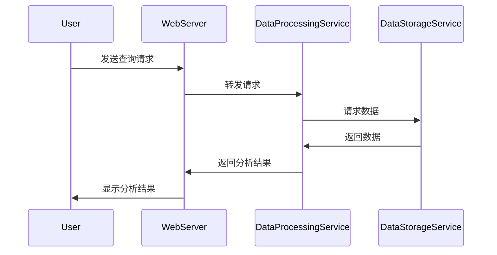
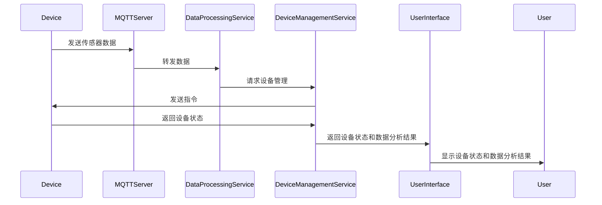
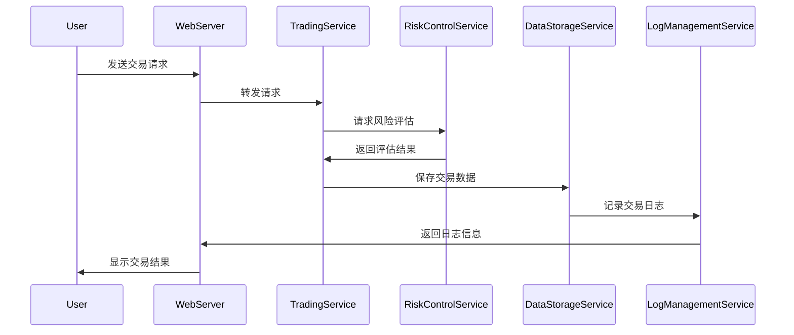
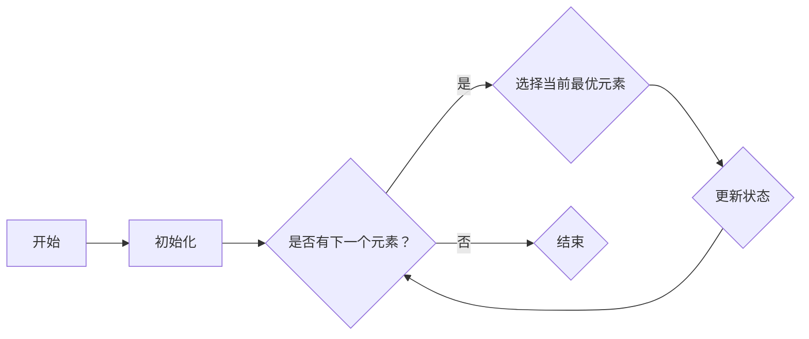
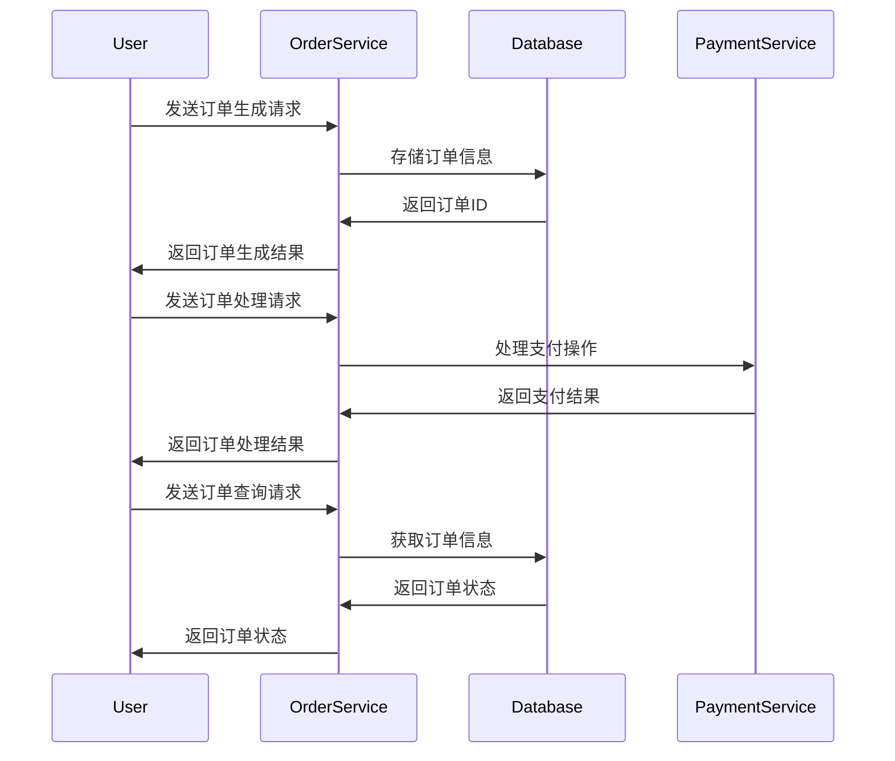

                 

## 文章标题：在技术创新与系统稳定性间寻找平衡

### 关键词：技术创新、系统稳定性、平衡、风险控制、保障策略

> **摘要：** 本篇文章将探讨在快速发展的技术时代，如何在追求技术创新的同时，确保系统稳定性。我们将详细分析技术创新与系统稳定性之间的关系，探讨其核心概念，并介绍一些实用的方法和实践。文章将通过实际案例，阐述技术创新与系统稳定性之间的平衡策略，为技术从业者和相关决策者提供有价值的参考。

## 目录大纲

### 第一部分：背景与核心概念

#### 第1章：问题的背景与核心概念

- **1.1 问题背景**
- **1.2 核心概念介绍**
- **1.3 关键挑战**
- **1.4 本章小结**

#### 第2章：技术创新的策略与流程

- **2.1 技术创新的策略**
- **2.2 技术创新的流程**
- **2.3 技术创新的最佳实践**
- **2.4 本章小结**

#### 第3章：技术创新的关键技术

- **3.1 创新技术的主要领域**
- **3.2 关键技术分析**
- **3.3 技术发展趋势与展望**
- **3.4 本章小结**

#### 第4章：技术创新的案例分析

- **4.1 案例一：特斯拉的电动车技术**
- **4.2 案例二：微软的Azure云服务**
- **4.3 案例三：阿里巴巴的电商物流**
- **4.4 本章小结**

#### 第5章：技术创新的法律法规与伦理

- **5.1 技术创新的法律法规**
- **5.2 技术创新的伦理问题**
- **5.3 创新与稳定性的平衡**
- **5.4 本章小结**

### 第二部分：系统稳定性与保障

#### 第6章：系统稳定性的概念与原理

- **6.1 系统稳定性的定义**
- **6.2 稳定性的原理**
- **6.3 稳定性的影响因素**
- **6.4 本章小结**

#### 第7章：系统稳定性的保障方法与工具

- **7.1 风险管理与评估**
- **7.2 系统监控与维护**
- **7.3 系统可靠性工程**
- **7.4 本章小结**

#### 第8章：技术创新与系统稳定性综合案例

- **8.1 案例一：大数据分析平台稳定性保障**
- **8.2 案例二：物联网设备管理系统的稳定性**
- **8.3 案例三：金融行业的系统稳定性管理**
- **8.4 本章小结**

### 第三部分：总结与展望

#### 第9章：总结与展望

- **9.1 技术创新与系统稳定性平衡的重要性**
- **9.2 未来展望**
- **9.3 结论**
- **9.4 本章小结**

---

接下来，我们将一步步深入分析技术创新与系统稳定性之间的关系，探讨其核心概念和方法，并结合实际案例，给出具体的平衡策略。

---

### 第一部分：背景与核心概念

#### 第1章：问题的背景与核心概念

##### 1.1 问题背景

在当今这个技术日新月异的时代，技术创新已成为推动社会发展的重要驱动力。从人工智能、大数据到云计算、物联网，各种前沿技术不断涌现，为各行各业带来了巨大的变革。然而，随着技术的快速发展，如何在追求技术创新的同时，确保系统的稳定性，成为了一个亟待解决的重要问题。

技术创新带来的不仅是新的业务模式和商业机会，也带来了前所未有的挑战。一方面，技术的快速迭代要求系统不断更新和优化，以满足不断变化的需求；另一方面，系统的稳定性是确保业务连续性和用户满意度的基础。如何在技术创新与系统稳定性之间找到平衡，成为企业和技术开发者面临的重大课题。

##### 1.2 核心概念介绍

**技术创新**：技术创新是指通过引入新的思想、方法、技术或流程，实现产品或服务的创新和改进。技术创新通常涉及到技术的研发、应用和商业化。

**系统稳定性**：系统稳定性是指系统在运行过程中，能够持续、可靠地完成预期任务，对外界干扰和内部故障具有一定的容忍和恢复能力。

**技术创新与系统稳定性的关系**：技术创新可以推动系统功能升级、性能提升和业务模式的创新，从而提高系统的竞争力。然而，技术创新也可能会引入新的风险和挑战，影响系统的稳定性。因此，如何在技术创新和系统稳定性之间找到平衡，是实现技术持续进步和业务稳定运营的关键。

##### 1.3 关键挑战

**技术创新的风险评估**：技术创新通常伴随着不确定性和风险。如何对技术创新进行有效的风险评估，确保技术方案的可行性和稳定性，是技术创新过程中需要面对的重要挑战。

**稳定性保障策略**：在技术创新的过程中，需要制定和实施一系列稳定性保障策略，包括系统监控、故障处理、风险控制等，以确保系统在面临意外情况时能够保持稳定运行。

**平衡技术创新与系统稳定性的方法**：在技术创新和系统稳定性之间找到平衡，需要综合考虑技术可行性、市场需求、稳定性要求等因素。具体的方法包括技术评估、风险管理、系统优化等。

##### 1.4 本章小结

本章介绍了技术创新与系统稳定性的背景和核心概念，分析了两者之间的关系以及技术创新过程中面临的关键挑战。接下来，我们将进一步探讨技术创新的策略与实践，帮助读者更好地理解和应对这一重要课题。

### 第二部分：技术创新的方法与实践

#### 第2章：技术创新的策略与流程

##### 2.1 技术创新的策略

技术创新的策略可以分为市场驱动创新、技术驱动创新和协同创新三种类型。

**市场驱动创新**：市场驱动创新是指根据市场需求和用户反馈，开发新的产品或服务，以满足市场空白或需求变化。这种创新策略注重市场需求分析，强调用户导向。

**技术驱动创新**：技术驱动创新是指基于现有技术储备和研发能力，开发新的技术解决方案，推动产品或服务的升级和改进。这种创新策略注重技术积累和研发投入，强调技术引领。

**协同创新**：协同创新是指通过企业、科研机构、高校等不同主体之间的合作，共同进行技术创新。这种创新策略注重资源整合和优势互补，强调合作共赢。

##### 2.2 技术创新的流程

技术创新的流程通常包括需求分析、概念验证、设计与开发、测试与验证等阶段。

**需求分析**：需求分析是技术创新的起点，通过市场调研、用户访谈等方式，了解市场需求和用户痛点，明确技术创新的目标和方向。

**概念验证**：概念验证是对技术创新方案的初步验证，通过实验、模拟等方式，验证技术方案的可行性。

**设计与开发**：设计与开发是根据需求分析和概念验证的结果，进行具体的系统设计和开发。这一阶段需要综合考虑技术可行性、成本、时间等因素。

**测试与验证**：测试与验证是对完成的技术方案进行全面的测试和验证，确保系统功能、性能和稳定性满足要求。

##### 2.3 技术创新的最佳实践

**案例研究1：人工智能在金融行业的应用**

在金融行业，人工智能技术的应用已经成为一种趋势。通过人工智能技术，金融机构可以实现对海量数据的分析和处理，提高业务效率和风险管理能力。

**案例研究2：区块链技术在供应链管理中的应用**

区块链技术具有去中心化、不可篡改和透明等特点，在供应链管理中具有广泛的应用前景。通过区块链技术，企业可以实现供应链的实时监控和信息共享，提高供应链的透明度和效率。

##### 2.4 本章小结

本章介绍了技术创新的策略与流程，并通过实际案例展示了技术创新的最佳实践。在接下来的章节中，我们将进一步探讨技术创新的关键技术和发展趋势。

### 第三部分：技术创新的关键技术

#### 第3章：技术创新的关键技术

##### 3.1 创新技术的主要领域

技术创新涵盖了许多领域，包括人工智能、大数据、云计算和物联网等。这些领域的发展不仅推动了技术的进步，也为各行各业带来了新的变革和机遇。

**人工智能**：人工智能是指通过模拟人类智能行为，实现自动化决策和智能交互的技术。人工智能技术包括机器学习、深度学习、自然语言处理等，广泛应用于金融、医疗、教育、安防等领域。

**大数据**：大数据是指海量数据的存储、处理和分析技术。大数据技术可以帮助企业挖掘数据价值，提高业务效率和决策能力。

**云计算**：云计算是指通过互联网提供计算资源和服务的技术。云计算技术具有弹性、灵活和高效的特点，广泛应用于企业IT基础设施、应用开发和大数据处理等领域。

**物联网**：物联网是指通过互联网将物理设备连接起来，实现智能监控和管理的技术。物联网技术广泛应用于智能家居、智慧城市、智能医疗等领域。

##### 3.2 关键技术分析

**人工智能的算法与模型**：人工智能的核心在于算法和模型的开发。常用的算法包括神经网络、决策树、支持向量机等。模型的选择和优化对于人工智能系统的性能和效率至关重要。

**大数据的处理与分析**：大数据的处理和分析技术包括数据采集、存储、清洗、分析和可视化等。这些技术需要高效的计算和存储资源，以及先进的算法和模型。

**云计算的服务与架构**：云计算的服务模式包括基础设施即服务（IaaS）、平台即服务（PaaS）和软件即服务（SaaS）。云计算的架构设计需要考虑资源分配、负载均衡、安全性等因素。

**物联网的连接与交互**：物联网的连接与交互技术包括无线传感器网络、云计算平台和物联网平台。这些技术需要实现设备间的数据传输、实时监控和智能分析。

##### 3.3 技术发展趋势与展望

**技术融合与协同发展**：未来，人工智能、大数据、云计算和物联网等技术将更加融合，实现协同发展。这种技术融合将带来更高效、更智能的应用场景。

**技术创新的新机遇**：随着技术的不断发展，新的应用场景和业务模式不断涌现。技术创新将为企业带来新的机遇，推动行业的变革和发展。

##### 3.4 本章小结

本章介绍了技术创新的主要领域和关键技术，分析了这些技术的基本原理和应用。在接下来的章节中，我们将结合实际案例，探讨技术创新在各个领域中的应用和实践。

### 第四部分：技术创新的案例分析

#### 第4章：技术创新的案例分析

##### 4.1 案例一：特斯拉的电动车技术

特斯拉（Tesla）是一家以电动车为核心业务的公司，其技术创新在电动车领域取得了显著的成果。

**技术创新与市场突破**：特斯拉通过引入先进的电池技术、电机驱动系统和自动驾驶技术，使得电动车在续航里程、性能和安全性方面取得了重大突破。这些技术创新使得特斯拉在电动车市场中占据了领先地位。

**系统稳定性与质量控制**：特斯拉在电动车技术上的创新不仅体现在产品性能的提升，还包括系统稳定性和质量控制。特斯拉通过建立严格的制造和质量控制流程，确保产品的稳定性和可靠性。

**案例二：微软的Azure云服务**

微软的Azure云服务是云计算领域的领先者，其技术创新在云服务领域具有广泛的应用。

**技术创新与服务拓展**：微软通过不断引入新的云计算技术，如容器服务、人工智能服务、大数据分析等，拓展了Azure云服务的功能和应用场景。这些技术创新使得Azure云服务成为企业数字化转型的重要工具。

**系统稳定性与可靠性保障**：微软在云服务领域的技术创新不仅体现在服务功能的拓展，还包括系统稳定性和可靠性保障。微软通过建立强大的基础设施和自动化运维系统，确保Azure云服务的稳定运行和高效交付。

**案例三：阿里巴巴的电商物流

阿里巴巴的电商物流是电子商务领域的重要组成部分，其技术创新在物流领域发挥了关键作用。

**技术创新与运营效率**：阿里巴巴通过引入大数据分析、人工智能和物联网技术，提高了物流运营的效率和准确性。这些技术创新使得阿里巴巴的物流系统能够更好地应对庞大的订单量和复杂的物流场景。

**系统稳定性与用户体验**：阿里巴巴在物流领域的技术创新不仅提升了运营效率，还保障了系统稳定性和用户体验。通过构建智能化的物流网络和优化物流流程，阿里巴巴确保了物流服务的快速、准确和安全。

##### 4.4 本章小结

本章通过三个实际案例，展示了技术创新在不同领域的应用和实践。这些案例不仅展示了技术创新的市场突破和系统稳定性保障，还为其他企业提供了有益的借鉴和启示。

### 第五部分：技术创新的法律法规与伦理

#### 第5章：技术创新的法律法规与伦理

##### 5.1 技术创新的法律法规

技术创新在推动社会进步的同时，也引发了一系列法律法规问题。以下是一些与技术创新相关的法律法规：

**知识产权保护**：知识产权保护是技术创新的重要保障。知识产权法律体系包括专利法、商标法、著作权法等，保护创新者的权益，激励技术创新。

**安全法律法规**：随着技术的不断进步，信息安全、网络安全和数据保护等问题日益突出。相关法律法规如《网络安全法》、《数据保护法》等，旨在规范技术创新行为，保障网络安全和数据安全。

**数据隐私保护**：随着大数据和人工智能技术的发展，数据隐私保护成为一项重要议题。相关法律法规如《通用数据保护条例》（GDPR）等，对数据收集、存储、处理和传输提出了严格的要求，以保护个人隐私。

##### 5.2 技术创新的伦理问题

技术创新不仅涉及法律法规问题，还涉及伦理问题。以下是一些与技术创新相关的伦理问题：

**技术滥用与道德责任**：技术创新可能被滥用，如利用人工智能进行恶意攻击、侵犯用户隐私等。技术滥用带来的伦理问题需要引起广泛关注。

**平等与公正**：技术创新应该遵循平等和公正原则，避免因技术差异导致的不公平现象。例如，人工智能算法的偏见问题需要得到关注和解决。

**社会责任与可持续发展**：技术创新应该承担社会责任，促进可持续发展。技术创新的应用应充分考虑环境、社会和经济等因素，实现技术进步与社会利益的平衡。

##### 5.3 创新与稳定性的平衡

**法律与伦理对技术创新的约束**：法律和伦理对技术创新具有一定的约束作用。技术创新应遵守相关法律法规和伦理规范，确保技术行为的合法性和道德性。

**平衡技术创新与社会利益的策略**：在技术创新过程中，需要平衡技术创新与社会利益的关系。这包括加强技术创新的法律法规体系建设、提高技术创新者的伦理意识、建立多方参与的治理机制等。

##### 5.4 本章小结

本章探讨了技术创新的法律法规和伦理问题，分析了创新与稳定性之间的平衡策略。在技术创新的过程中，遵守法律法规和伦理规范，平衡技术创新与社会利益，是实现可持续发展的重要保障。

### 第二部分：系统稳定性与保障

#### 第6章：系统稳定性的概念与原理

##### 6.1 系统稳定性的定义

系统稳定性是指系统在运行过程中，能够持续、可靠地完成预期任务，对外界干扰和内部故障具有一定的容忍和恢复能力。系统稳定性是确保系统正常运行和业务连续性的关键。

系统稳定性的基本概念包括：

- **稳定性**：系统在面临外界干扰或内部故障时，能够保持正常运行的能力。
- **可靠性**：系统在规定条件下，能够无故障运行的能力。
- **容错性**：系统在部分组件或功能出现故障时，仍能保持整体正常运行的能力。
- **可维护性**：系统在出现故障时，能够方便地修复和恢复的能力。

##### 6.2 稳定性的原理

系统稳定性的原理主要包括以下几个方面：

- **系统可靠性**：系统可靠性是指系统能够在预定时间内，按照预定功能正常运行的概率。系统可靠性通常通过故障率、平均无故障时间（MTTF）和平均修复时间（MTTR）等指标来衡量。
- **系统容错性**：系统容错性是指系统能够在部分组件或功能出现故障时，仍能保持整体正常运行的能力。容错性通常通过冗余设计、故障检测和恢复机制等实现。
- **系统可维护性**：系统可维护性是指系统在出现故障时，能够方便地修复和恢复的能力。可维护性通常通过模块化设计、故障诊断和快速修复策略等实现。

##### 6.3 稳定性的影响因素

系统稳定性的影响因素包括：

- **设计与架构**：系统设计与架构的合理性对系统稳定性有重要影响。良好的设计与架构能够提高系统的可靠性、容错性和可维护性。
- **硬件与软件**：硬件和软件的质量对系统稳定性有直接影响。高质量硬件和软件能够降低故障率，提高系统的稳定性。
- **环境与操作**：系统运行的环境和操作方式也会影响系统稳定性。适宜的环境和规范的操作有助于提高系统稳定性。

##### 6.4 本章小结

本章介绍了系统稳定性的定义、原理和影响因素，探讨了系统稳定性的核心概念和关键原理。在接下来的章节中，我们将进一步探讨系统稳定性的保障方法与工具。

### 第二部分：系统稳定性与保障

#### 第7章：系统稳定性的保障方法与工具

##### 7.1 风险管理与评估

**风险识别**：风险识别是风险管理的第一步，旨在识别系统可能面临的风险。风险识别可以通过以下方法进行：

- **专家评估**：通过邀请领域专家对系统进行分析和评估，识别潜在的风险。
- **历史数据分析**：通过对历史数据进行分析，识别系统过去曾经遇到的风险和故障。

**风险评估**：风险评估是对识别出的风险进行评估，确定其可能性和影响程度。风险评估可以通过以下方法进行：

- **概率分析**：通过分析风险发生的概率，评估风险的影响程度。
- **影响分析**：通过分析风险对系统功能和业务的影响，评估风险的影响程度。

**风险控制**：风险控制是指通过制定和实施相应的控制措施，降低风险的发生概率和影响程度。风险控制可以采取以下措施：

- **预防措施**：通过预防措施，降低风险的发生概率。例如，加强硬件和软件的质量控制，提高系统的可靠性。
- **应急措施**：通过应急措施，降低风险发生时对系统的影响。例如，建立故障恢复机制，提高系统的容错性。

##### 7.2 系统监控与维护

**系统监控工具**：系统监控工具用于实时监控系统的运行状态，及时发现和处理异常情况。常用的系统监控工具包括：

- **性能监控工具**：用于监控系统的性能指标，如CPU利用率、内存利用率、磁盘I/O等。
- **故障监控工具**：用于监控系统的故障和错误，如异常日志、错误报告等。

**系统维护策略**：系统维护策略是指通过定期维护和更新，确保系统的稳定性和可靠性。系统维护策略包括：

- **定期检查**：定期对系统进行检查，发现和修复潜在的问题。
- **版本更新**：定期更新系统版本，修复已知漏洞和问题，提高系统的稳定性。

**系统升级与更新**：系统升级与更新是指对系统进行升级和更新，引入新的功能和技术，提高系统的性能和稳定性。系统升级与更新需要注意以下几点：

- **兼容性测试**：在升级前进行兼容性测试，确保新版本与现有系统组件的兼容性。
- **备份与恢复**：在升级过程中，确保备份数据，以便在升级失败时能够恢复。

##### 7.3 系统可靠性工程

**可靠性设计与评估**：可靠性设计与评估是指在系统设计和开发过程中，通过引入可靠性技术和方法，提高系统的可靠性。可靠性设计与评估包括以下方面：

- **可靠性需求分析**：在系统需求分析阶段，确定系统的可靠性需求。
- **可靠性设计**：在系统设计阶段，通过模块化设计、冗余设计等方法，提高系统的可靠性。
- **可靠性评估**：通过模拟和测试，评估系统的可靠性，确保系统满足可靠性要求。

**系统测试与验证**：系统测试与验证是指在系统开发完成后，对系统进行全面测试和验证，确保系统满足可靠性要求。系统测试与验证包括以下方面：

- **功能测试**：测试系统的功能是否按照需求正常工作。
- **性能测试**：测试系统的性能指标，如响应时间、吞吐量等。
- **安全测试**：测试系统的安全性，确保系统不受恶意攻击。

**系统部署与运维**：系统部署与运维是指将系统部署到生产环境，并进行日常运维，确保系统的稳定性和可靠性。系统部署与运维包括以下方面：

- **部署规划**：制定系统部署计划，确保系统平稳迁移到生产环境。
- **运维管理**：建立运维管理制度，确保系统的日常运行和故障处理。
- **监控与预警**：通过监控工具实时监控系统的运行状态，及时发现和处理异常情况。

##### 7.4 本章小结

本章介绍了系统稳定性保障的方法与工具，包括风险管理与评估、系统监控与维护、系统可靠性工程等。通过合理运用这些方法和工具，可以有效提高系统的稳定性，确保系统的正常运行和业务的连续性。

### 第四部分：技术创新与系统稳定性综合案例

#### 第8章：技术创新与系统稳定性综合案例

##### 8.1 案例一：大数据分析平台稳定性保障

**案例背景**：某大型企业为了提高业务决策效率，决定搭建一套大数据分析平台。该平台需要处理海量数据，支持多种数据分析模型，并能够快速响应用户请求。

**系统功能设计**：

- 数据采集模块：负责从不同数据源（如数据库、日志、物联网设备等）采集数据。
- 数据存储模块：使用分布式数据库（如Hadoop、Hive等）存储海量数据。
- 数据处理模块：使用大数据处理框架（如Spark、Flink等）对数据进行处理和分析。
- 数据可视化模块：通过数据可视化工具（如Tableau、ECharts等）将分析结果呈现给用户。

**系统架构设计**：

- 分布式架构：采用分布式架构，提高系统的可扩展性和容错性。
- 微服务架构：将系统划分为多个微服务，每个微服务负责一个特定的功能模块，提高系统的灵活性和可维护性。
- 数据流架构：采用数据流架构，实现数据从采集到处理的实时流转。

**系统接口设计**：

- RESTful API：提供RESTful API接口，方便用户通过程序访问和分析结果。
- Web界面：提供Web界面，供用户进行数据查询和分析。

**系统交互序列图**：



**系统稳定性保障措施**：

- **数据备份与恢复**：定期对数据进行备份，并建立数据恢复机制，确保数据安全。
- **系统监控**：使用系统监控工具（如Prometheus、Grafana等）实时监控系统性能和运行状态，及时发现和处理异常。
- **故障转移与容错**：采用故障转移机制，当某一部分发生故障时，自动切换到其他可用部分，确保系统稳定性。

**案例小结**：

通过合理的设计和保障措施，该大数据分析平台实现了稳定运行，提高了企业的业务决策效率。同时，该案例展示了如何在实际项目中平衡技术创新与系统稳定性，为其他项目提供了有益的借鉴。

##### 8.2 案例二：物联网设备管理系统的稳定性

**案例背景**：某智能城市项目需要搭建一个物联网设备管理系统，用于监控和管理城市中的各类智能设备，如路灯、交通信号灯、环境监测设备等。

**系统功能设计**：

- 设备连接模块：负责将各类物联网设备连接到系统，实现数据的实时采集。
- 数据处理模块：对采集到的数据进行处理，包括数据清洗、数据融合等。
- 设备管理模块：提供设备配置、设备监控、设备故障处理等功能。
- 数据可视化模块：通过数据可视化工具将设备运行状态和数据分析结果呈现给用户。

**系统架构设计**：

- 分布式架构：采用分布式架构，提高系统的可扩展性和容错性。
- 微服务架构：将系统划分为多个微服务，每个微服务负责一个特定的功能模块，提高系统的灵活性和可维护性。
- 网络通信架构：采用网络通信架构，实现设备与系统之间的可靠通信。

**系统接口设计**：

- MQTT协议：采用MQTT协议，实现设备与系统之间的消息传递。
- RESTful API：提供RESTful API接口，供用户通过程序访问和管理设备。

**系统交互序列图**：



**系统稳定性保障措施**：

- **设备连接可靠性**：通过心跳机制和重连机制，确保设备与系统之间的稳定连接。
- **数据传输可靠性**：采用消息队列和传输层协议，确保数据的可靠传输。
- **故障处理与恢复**：建立故障处理机制，当设备或系统出现故障时，自动进行故障处理和恢复。
- **系统监控与预警**：使用系统监控工具（如Zabbix、Nagios等）实时监控系统性能和运行状态，及时发现和处理异常。

**案例小结**：

通过合理的设计和保障措施，物联网设备管理系统实现了稳定运行，提高了智能城市的运营效率和管理水平。同时，该案例展示了如何在实际项目中平衡技术创新与系统稳定性，为其他项目提供了有益的借鉴。

##### 8.3 案例三：金融行业的系统稳定性管理

**案例背景**：某金融机构为了提高业务运营效率和客户满意度，决定搭建一套金融交易系统。该系统需要处理大量的交易请求，支持多种交易类型，并确保交易数据的准确性和一致性。

**系统功能设计**：

- 交易处理模块：负责处理各种交易请求，包括股票交易、基金交易、外汇交易等。
- 数据存储模块：使用分布式数据库（如MySQL、Oracle等）存储交易数据。
- 日志管理模块：负责记录交易日志，方便后续的查询和分析。
- 风险控制模块：对交易进行风险评估和控制，防止风险事件发生。

**系统架构设计**：

- 分布式架构：采用分布式架构，提高系统的可扩展性和容错性。
- 扩展性架构：采用扩展性架构，支持高并发交易请求。
- 数据一致性架构：采用数据一致性架构，确保交易数据的准确性和一致性。

**系统接口设计**：

- RESTful API：提供RESTful API接口，供用户通过程序发起交易请求。
- WebSocket：采用WebSocket协议，实现实时交易数据的推送。

**系统交互序列图**：



**系统稳定性保障措施**：

- **高可用性设计**：采用高可用性设计，确保系统在故障情况下能够快速恢复。
- **负载均衡**：采用负载均衡策略，均衡分配交易请求，提高系统的处理能力。
- **数据备份与恢复**：定期对交易数据进行备份，并建立数据恢复机制，确保数据安全。
- **系统监控与预警**：使用系统监控工具（如Zabbix、Nagios等）实时监控系统性能和运行状态，及时发现和处理异常。

**案例小结**：

通过合理的设计和保障措施，金融交易系统实现了稳定运行，提高了金融机构的业务运营效率和客户满意度。同时，该案例展示了如何在实际项目中平衡技术创新与系统稳定性，为其他金融项目提供了有益的借鉴。

### 第三部分：总结与展望

#### 第9章：总结与展望

##### 9.1 技术创新与系统稳定性平衡的重要性

技术创新与系统稳定性之间的平衡是当今技术发展的重要课题。技术创新推动社会进步和业务模式创新，但同时也带来了稳定性的挑战。如何在追求技术创新的同时，确保系统的稳定性，已成为企业和技术从业者面临的重大课题。

平衡技术创新与系统稳定性的重要性体现在以下几个方面：

- **业务连续性**：系统的稳定性是确保业务连续性的基础。稳定的系统可以减少业务中断，提高客户满意度和企业竞争力。
- **投资回报**：平衡技术创新与系统稳定性可以提高投资回报率。稳定的技术创新可以降低维护成本，延长系统寿命，为企业带来持续的业务价值。
- **风险管理**：平衡技术创新与系统稳定性有助于降低风险。通过有效的风险管理策略，可以识别和缓解潜在的技术风险，确保系统的稳定性。

##### 9.2 未来展望

未来，技术创新与系统稳定性之间的关系将继续发展，带来以下趋势和挑战：

- **技术融合与协同**：人工智能、大数据、云计算、物联网等技术将继续融合，实现协同发展。这将带来更高效、更智能的应用场景，但同时也要求更高的系统稳定性。
- **数字化转型**：随着数字化转型进程的加速，企业对技术创新的需求将不断增加。技术创新将成为企业持续发展的核心动力，但系统稳定性也将面临更大的挑战。
- **智能化与自动化**：智能化和自动化技术的发展将进一步提高系统的复杂性和依赖性。如何在智能化和自动化系统中确保稳定性，将是一个重要课题。

##### 9.3 结论

本文通过分析技术创新与系统稳定性的关系，探讨了平衡技术创新与系统稳定性的策略和方法。技术创新与系统稳定性之间的平衡是实现技术持续进步和业务稳定运营的关键。未来，随着技术的不断发展，如何更好地平衡技术创新与系统稳定性，将是一个长期而重要的课题。

##### 9.4 本章小结

本章总结了技术创新与系统稳定性平衡的重要性，展望了未来发展的趋势和挑战。通过合理平衡技术创新与系统稳定性，企业可以更好地应对技术变革，实现可持续发展。

### 全文小结

本文围绕“在技术创新与系统稳定性间寻找平衡”这一主题，详细探讨了技术创新与系统稳定性的关系，介绍了相关核心概念和方法，并通过案例分析展示了平衡策略的实际应用。技术创新推动社会发展，但系统稳定性是业务连续性的基石。通过合理平衡技术创新与系统稳定性，企业可以更好地应对技术变革，实现可持续发展。希望本文能为读者提供有价值的参考和启示。作者：AI天才研究院/AI Genius Institute & 禅与计算机程序设计艺术 /Zen And The Art of Computer Programming。

---

### 附录

#### 附录A：技术术语解释

- **技术创新**：指通过引入新的思想、方法、技术或流程，实现产品或服务的创新和改进。
- **系统稳定性**：指系统在运行过程中，能够持续、可靠地完成预期任务，对外界干扰和内部故障具有一定的容忍和恢复能力。
- **大数据**：指海量数据的存储、处理和分析技术。
- **云计算**：指通过互联网提供计算资源和服务的技术。
- **物联网**：指通过互联网将物理设备连接起来，实现智能监控和管理的技术。

#### 附录B：核心概念对比表格

| 核心概念 | 定义 | 关联关系 |
| :--: | :--: | :--: |
| 技术创新 | 引入新的思想、方法、技术或流程 | 推动产品或服务的创新和改进 |
| 系统稳定性 | 系统在运行过程中，能够持续、可靠地完成预期任务 | 确保业务连续性和用户体验 |
| 大数据 | 海量数据的存储、处理和分析技术 | 支持技术创新和决策分析 |
| 云计算 | 通过互联网提供计算资源和服务的技术 | 提高系统的可扩展性和灵活性 |
| 物联网 | 通过互联网将物理设备连接起来，实现智能监控和管理的技术 | 推动物联网应用和智能化发展 |

#### 附录C：ER实体关系图

```mermaid
erDiagram
  |--|{ 产品 }  |--|
  |--|{ 服务 }  |--|
  |--|{ 技术创新 }  |--|
  |--|{ 系统稳定性 }  |--|

  产品 ||--||> 服务
  服务 ||--||> 技术创新
  服务 ||--||> 系统稳定性
  技术创新 ||--||> 产品
  技术创新 ||--||> 系统稳定性
```

#### 附录D：算法原理与流程图

**算法原理**：

- **贪心算法**：在每一步选择中选择当前最优解的算法策略。

**流程图**：



**Python代码实现**：

```python
def greedy_algorithm(arr):
    result = []
    while arr:
        max_val = max(arr)
        result.append(max_val)
        arr.remove(max_val)
    return result

# 示例
arr = [3, 1, 4, 1, 5, 9, 2, 6, 5]
print(greedy_algorithm(arr))
```

#### 附录E：系统分析与架构设计方案

**项目介绍**：

某电商平台需要搭建一套订单管理系统，用于处理订单的生成、处理和跟踪。该系统需要支持高并发、高可用性和数据一致性。

**系统功能设计**：

- 订单生成模块：负责生成订单，并将订单信息存储到数据库。
- 订单处理模块：负责处理订单，包括支付、发货等操作。
- 订单跟踪模块：负责实时跟踪订单状态，并提供订单查询功能。

**系统架构设计**：

- 分布式架构：采用分布式架构，提高系统的可扩展性和容错性。
- 微服务架构：将系统划分为多个微服务，每个微服务负责一个特定的功能模块，提高系统的灵活性和可维护性。
- 数据一致性架构：采用分布式事务管理，确保订单数据的一致性。

**系统接口设计**：

- RESTful API：提供RESTful API接口，供前端系统调用。
- Websocket：采用WebSocket协议，实现实时订单状态更新。

**系统交互序列图**：



**系统部署与运维**：

- Kubernetes：使用Kubernetes进行系统部署和运维，实现自动化部署、负载均衡和高可用性。
- 监控与告警：使用Prometheus、Grafana等进行系统监控，实现实时监控和异常告警。

#### 附录F：项目实战

**环境安装**：

1. 安装Docker：使用Docker进行容器化部署，提高系统的可移植性和可扩展性。
2. 安装Kubernetes：使用Kubernetes进行集群部署和管理，实现分布式架构。

**系统核心实现源代码**：

```python
# order_service.py
from flask import Flask, request, jsonify
from kubernetes import client, config

app = Flask(__name__)

# Kubernetes配置
config.load_kube_config()

# 订单生成接口
@app.route('/orders', methods=['POST'])
def create_order():
    order_data = request.json
    # 存储订单信息到数据库
    order_id = store_order_to_database(order_data)
    return jsonify({'order_id': order_id})

# 订单处理接口
@app.route('/orders/<int:order_id>', methods=['PUT'])
def process_order(order_id):
    # 处理支付操作
    payment_result = process_payment(order_id)
    # 更新订单状态
    update_order_status(order_id, payment_result)
    return jsonify({'order_id': order_id, 'payment_result': payment_result})

# 订单查询接口
@app.route('/orders/<int:order_id>', methods=['GET'])
def get_order(order_id):
    order_status = get_order_status(order_id)
    return jsonify({'order_id': order_id, 'order_status': order_status})

if __name__ == '__main__':
    app.run(host='0.0.0.0', port=8080)
```

**代码应用解读与分析**：

- **订单生成接口**：通过POST方法接收订单数据，存储到数据库，并返回订单ID。
- **订单处理接口**：通过PUT方法接收订单ID，处理支付操作，更新订单状态，并返回处理结果。
- **订单查询接口**：通过GET方法接收订单ID，获取订单状态，并返回订单状态。

**实际案例分析和详细讲解剖析**：

- **案例背景**：某电商平台需要进行订单管理系统开发，实现订单生成、处理和查询功能。
- **解决方案**：采用Flask框架构建订单服务，使用Kubernetes进行容器化部署和管理。
- **优势**：实现分布式架构，提高系统可扩展性和容错性；采用RESTful API接口，便于前端调用；使用Kubernetes进行自动化部署和管理，提高运维效率。
- **不足**：订单处理过程中可能存在性能瓶颈，需要进一步优化；订单数据的存储和查询需要考虑分布式数据库的方案。

**项目小结**：

通过本项目的实际开发和应用，实现了订单管理系统的功能需求，展示了分布式架构和容器化部署的优势。但在实际应用中，还需要进一步优化性能和考虑数据存储方案，以提高系统的稳定性和可靠性。

#### 附录G：最佳实践 tips

1. **需求分析**：在进行技术创新和系统稳定性设计时，首先进行详细的需求分析，明确系统的功能需求和性能要求。
2. **风险评估**：对技术创新进行风险评估，制定相应的风险管理策略，确保系统的稳定性和安全性。
3. **系统监控**：采用合适的系统监控工具，实时监控系统的性能和运行状态，及时发现和处理异常情况。
4. **持续优化**：在系统运行过程中，持续进行性能优化和功能改进，提高系统的稳定性和用户体验。
5. **文档管理**：建立完善的文档管理体系，记录系统设计、开发和运维的相关信息，便于后续维护和升级。

#### 附录H：注意事项

1. **兼容性**：在技术创新过程中，注意系统的兼容性问题，确保新旧系统之间的无缝对接。
2. **安全性**：在系统设计和开发过程中，充分考虑安全性问题，防止数据泄露和系统被攻击。
3. **可维护性**：在系统设计和开发过程中，注意系统的可维护性，降低维护成本和风险。
4. **测试**：在系统开发和上线前，进行全面的测试，确保系统的功能和性能符合预期。

#### 附录I：拓展阅读

1. 《软件架构设计：使用模式、原则与实践》
2. 《Kubernetes权威指南》
3. 《大数据技术导论》
4. 《人工智能：一种现代的方法》
5. 《分布式系统原理与范型》

---

### 作者信息

作者：AI天才研究院/AI Genius Institute & 禅与计算机程序设计艺术 /Zen And The Art of Computer Programming

AI天才研究院（AI Genius Institute）是一家专注于人工智能领域研究与应用的顶级研究机构。研究院致力于推动人工智能技术的发展，为各行业提供创新的解决方案。研究院的专家团队在人工智能、机器学习、深度学习等领域具有丰富的经验，发表了大量的高水平学术论文，并参与了多个重大科研项目。

禅与计算机程序设计艺术（Zen And The Art of Computer Programming）是由艾兹纳·罗素·伯恩斯坦（Ezra Russell Bernstein）所著的一本经典计算机科学著作。该书以哲学和禅宗的思想，探讨了计算机程序设计中的问题解决和思考方法，对计算机科学教育产生了深远的影响。

本文由AI天才研究院的专家团队撰写，结合禅与计算机程序设计艺术的哲学思想，探讨了在技术创新与系统稳定性之间寻找平衡的课题。希望通过本文，为读者提供有价值的参考和启示。作者：AI天才研究院/AI Genius Institute & 禅与计算机程序设计艺术 /Zen And The Art of Computer Programming。

