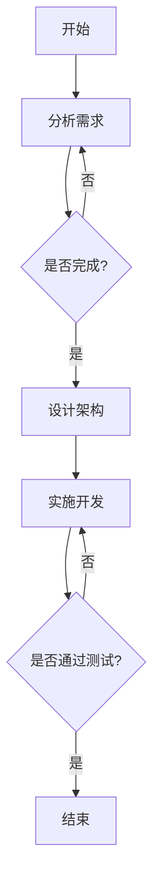
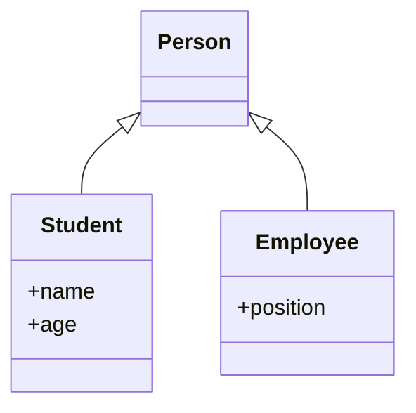

                 


### 《培养团队的技术创新意识》

> 关键词：技术创新，团队意识，培养策略，案例分析，国际经验

> 摘要：随着全球科技竞争的加剧，技术创新已成为企业核心竞争力的重要组成部分。如何培养团队的技术创新意识，提升团队的创新能力和竞争力，成为企业面临的重要课题。本文将从问题背景与重要性、核心概念与联系、技术创新意识的培养策略、技术创新意识培养案例分析、技术创新意识的测评与提升、技术创新意识的国际经验借鉴以及结论与展望七个方面，系统探讨团队技术创新意识的培养方法与实践。

---

### 目录大纲

# 《培养团队的技术创新意识》目录大纲

## 第1章：问题背景与重要性

### 1.1.1 技术创新意识的定义与内涵

### 1.1.2 团队技术创新意识的现状分析

### 1.1.3 技术创新意识对团队发展的影响

### 1.1.4 培养技术创新意识的必要性与紧迫性

## 第2章：核心概念与联系

### 2.1.1 技术创新相关概念解析

#### 2.1.1.1 技术创新的概念与类型

#### 2.1.1.2 创新思维的原理与模式

#### 2.1.1.3 创新能力的构成与评估

### 2.2 技术创新与团队文化的关系

#### 2.2.1 团队文化的定义与特征

#### 2.2.2 团队文化与技术创新的互动

#### 2.2.3 倡导技术创新文化的策略

## 第3章：技术创新意识的培养策略

### 3.1 教育培训

#### 3.1.1 技术创新教育的重要性

#### 3.1.2 技术创新教育的课程设计与实施

#### 3.1.3 技术创新教育的评估与反馈

### 3.2 企业内部文化

#### 3.2.1 创新文化的内涵与要素

#### 3.2.2 创新文化的建设与推广

#### 3.2.3 培养技术创新意识的企业文化策略

### 3.3 项目实践

#### 3.3.1 创新项目的过程管理

#### 3.3.2 创新项目的团队协作

#### 3.3.3 创新项目的评估与优化

## 第4章：技术创新意识培养案例分析

### 4.1 案例一：某科技公司的技术创新之路

#### 4.1.1 案例背景

#### 4.1.2 创新意识的培养过程

#### 4.1.3 创新成果与影响

### 4.2 案例二：高校科研团队的技术创新实践

#### 4.2.1 案例背景

#### 4.2.2 创新意识的培养措施

#### 4.2.3 创新成果与经验

## 第5章：技术创新意识的测评与提升

### 5.1 技术创新意识测评方法

#### 5.1.1 技术创新意识测评工具

#### 5.1.2 技术创新意识测评指标

#### 5.1.3 技术创新意识测评的实施步骤

### 5.2 提升技术创新意识的策略

#### 5.2.1 培养创新思维的方法

#### 5.2.2 提升创新能力的措施

#### 5.2.3 创新意识的持续培养

## 第6章：技术创新意识的国际经验借鉴

### 6.1 发达国家技术创新政策与实践

#### 6.1.1 美国技术创新政策

#### 6.1.2 德国技术创新实践

#### 6.1.3 日本技术创新策略

### 6.2 国际经验对我国技术创新意识的启示

#### 6.2.1 我国技术创新面临的挑战与机遇

#### 6.2.2 借鉴国际经验，提升我国团队技术创新意识

## 第7章：结论与展望

### 7.1 研究结论

#### 7.1.1 技术创新意识的重要性

#### 7.1.2 培养技术创新意识的策略与措施

#### 7.1.3 未来研究方向

### 7.2 展望未来

#### 7.2.1 技术创新意识的培养趋势

#### 7.2.2 团队技术创新意识的持续提升

#### 7.2.3 技术创新意识的培养实践拓展

---

### 第1章：问题背景与重要性

#### 1.1.1 技术创新意识的定义与内涵

技术创新意识是指个体或团队对技术创新的重要性和必要性的认知，以及对技术创新方法和策略的理解和掌握。它不仅包括对技术创新本质的认识，还包括对技术创新过程中的各个环节和要素的关注。具体来说，技术创新意识包括以下几个方面：

1. **创新动机**：指个体或团队对技术创新的需求和动力，包括对市场需求、技术发展、竞争优势等的敏感度和追求。

2. **创新思维**：指个体或团队在解决问题和提出解决方案时的创造性思维，包括发散思维、逆向思维、联想思维等。

3. **创新技能**：指个体或团队在技术创新过程中所需的技能，包括技术知识、项目管理、团队协作等。

4. **创新态度**：指个体或团队对技术创新的积极态度和开放心态，包括勇于尝试、不怕失败、持续学习等。

#### 1.1.2 团队技术创新意识的现状分析

目前，我国企业在技术创新方面存在一定的不足，具体表现为：

1. **技术创新投入不足**：许多企业对技术创新的投入不足，导致技术创新能力较弱。

2. **技术创新人才缺乏**：企业缺乏具备技术创新能力和经验的专业人才。

3. **创新环境不完善**：企业内部创新氛围不浓厚，缺乏有效的激励机制和资源配置。

4. **创新成果转化率低**：技术创新成果难以转化为实际的产品或服务，导致创新效果不明显。

#### 1.1.3 技术创新意识对团队发展的影响

技术创新意识对团队发展具有重要影响，具体表现在以下几个方面：

1. **提高竞争力**：技术创新能够提高企业的市场竞争力，增强企业的生存和发展能力。

2. **促进成长**：技术创新能够推动企业不断成长，实现从规模扩张向质量提升的转变。

3. **提升效率**：技术创新能够提高企业的运营效率，降低成本，提高收益。

4. **增强凝聚力**：技术创新能够激发团队活力，增强团队凝聚力，提高团队协作效率。

#### 1.1.4 培养技术创新意识的必要性与紧迫性

在当前科技日新月异、市场竞争激烈的背景下，培养团队的技术创新意识具有重要意义和紧迫性。具体表现在以下几个方面：

1. **适应技术发展趋势**：随着技术的快速发展，企业需要不断进行技术创新，以适应技术发展的趋势。

2. **提升企业竞争力**：技术创新是提升企业竞争力的关键，只有具备较强的技术创新意识，才能在激烈的市场竞争中脱颖而出。

3. **推动产业升级**：技术创新能够推动产业升级和转型，促进经济高质量发展。

4. **实现可持续发展**：技术创新是实现企业可持续发展的关键，只有不断创新，才能保持企业的持续竞争力。

综上所述，培养团队的技术创新意识是企业发展的必然选择，也是提升团队竞争力的关键。企业需要从多个方面入手，采取有效措施，培养团队的技术创新意识，以实现企业的可持续发展。

---

### 第2章：核心概念与联系

#### 2.1.1 技术创新相关概念解析

技术创新是一个复杂的过程，涉及多个相关概念。以下是对一些关键概念的解析：

##### 2.1.1.1 技术创新的概念与类型

技术创新是指通过引入新技术、新产品、新工艺、新服务等方式，提高企业的生产效率和市场竞争力。根据创新的不同维度，技术创新可以分为以下几种类型：

1. **产品创新**：指通过引入新产品或改进现有产品，满足市场需求。

2. **工艺创新**：指通过改进生产过程或工艺，提高生产效率和质量。

3. **服务创新**：指通过改进服务或推出新服务，提升用户体验。

4. **商业模式创新**：指通过改变商业模式，实现企业价值的提升。

##### 2.1.1.2 创新思维的原理与模式

创新思维是技术创新的核心，它包括多种思维方式和模式。以下是一些常见的创新思维原理和模式：

1. **发散思维**：指从不同角度、不同方向思考问题，寻求多种解决方案。

2. **逆向思维**：指从相反方向思考问题，寻求解决问题的创新方法。

3. **联想思维**：指通过事物之间的关联，寻求新的解决方案。

4. **系统性思维**：指从整体角度思考问题，寻求系统的解决方案。

##### 2.1.1.3 创新能力的构成与评估

创新能力是指个体或团队在技术创新过程中表现出来的能力。它包括以下几个方面：

1. **技术能力**：指个体或团队在相关技术领域的知识水平和技能。

2. **问题解决能力**：指个体或团队在解决问题过程中的思维能力和方法。

3. **团队协作能力**：指个体或团队在协作过程中表现出来的沟通、协调和合作能力。

4. **创新意识**：指个体或团队对技术创新的敏感度和积极性。

对创新能力的评估可以从以下几个方面进行：

1. **创新能力测评工具**：使用专业的创新能力测评工具，如创新意识问卷、创新思维测试等。

2. **创新成果**：通过评估个体或团队在技术创新过程中的实际成果，如新产品、新工艺、新服务等。

3. **绩效评估**：通过评估个体或团队在技术创新过程中的绩效表现，如项目完成情况、问题解决能力等。

#### 2.2 技术创新与团队文化的关系

团队文化对技术创新具有重要影响。良好的团队文化能够激发团队的创新活力，提高技术创新的效率和效果。以下从几个方面探讨技术创新与团队文化的关系：

##### 2.2.1 团队文化的定义与特征

团队文化是指团队在长期发展过程中形成的共同价值观、行为规范和工作习惯。它包括以下几个特征：

1. **共同价值观**：团队成员对团队目标和价值观的认同。

2. **行为规范**：团队成员在工作和生活中遵循的行为准则。

3. **工作习惯**：团队成员在工作和生活中形成的稳定工作方式。

##### 2.2.2 团队文化与技术创新的互动

团队文化对技术创新具有双重作用。一方面，良好的团队文化能够促进技术创新。具体表现为：

1. **激发创新活力**：良好的团队文化能够激发团队的创新热情，提高团队的创新活力。

2. **提高协作效率**：良好的团队文化能够促进团队协作，提高团队协作效率。

3. **降低创新风险**：良好的团队文化能够降低团队在技术创新过程中的风险，提高技术创新的成功率。

另一方面，不良的团队文化可能会阻碍技术创新。具体表现为：

1. **抑制创新活力**：不良的团队文化可能会抑制团队的创新热情，降低团队的创新活力。

2. **降低协作效率**：不良的团队文化可能会降低团队协作效率，影响技术创新的顺利进行。

3. **增加创新风险**：不良的团队文化可能会增加团队在技术创新过程中的风险，降低技术创新的成功率。

##### 2.2.3 倡导技术创新文化的策略

为了培养团队的技术创新意识，企业需要从以下几个方面着手，倡导技术创新文化：

1. **确立共同价值观**：企业需要确立共同的价值观，明确技术创新的重要性，让团队成员认识到技术创新对企业发展的重要性。

2. **建立激励机制**：企业需要建立激励机制，鼓励团队成员参与技术创新，对技术创新成果给予奖励。

3. **优化工作环境**：企业需要优化工作环境，为团队成员提供良好的创新环境和资源支持。

4. **加强团队协作**：企业需要加强团队协作，促进团队成员之间的沟通与交流，提高团队协作效率。

5. **培养创新思维**：企业需要培养团队成员的创新思维，提高团队的创新能力和水平。

综上所述，技术创新意识是团队发展的关键。企业需要从多个方面入手，培养团队的技术创新意识，提升团队的创新能力和竞争力。

---

### 第3章：技术创新意识的培养策略

技术创新意识的培养是一个系统性的工程，涉及教育培训、企业内部文化、项目实践等多个方面。以下将详细探讨这些策略。

#### 3.1 教育培训

教育培训是培养技术创新意识的基础。通过系统性的教育培训，可以帮助团队成员掌握必要的知识、技能和思维方式。

##### 3.1.1 技术创新教育的重要性

技术创新教育的重要性体现在以下几个方面：

1. **提升技术水平**：通过技术创新教育，可以帮助团队成员掌握前沿技术知识，提升技术水平。

2. **培养创新思维**：技术创新教育可以培养团队成员的创新思维，提高团队的创新能力和水平。

3. **增强团队协作**：技术创新教育可以增强团队成员之间的协作能力，提高团队的整体创新能力。

##### 3.1.2 技术创新教育的课程设计与实施

技术创新教育的课程设计应注重以下方面：

1. **基础课程**：包括计算机科学、数学、物理等基础课程，为技术创新提供理论基础。

2. **专业课程**：包括前沿技术领域课程，如人工智能、大数据、云计算等，提升团队成员的专业技能。

3. **创新课程**：包括创新思维、创新方法、项目管理等课程，培养团队成员的创新能力和实践能力。

课程实施应注重以下几个方面：

1. **理论与实践相结合**：通过实际案例和项目，让团队成员在真实环境中锻炼创新能力和实践能力。

2. **互动式教学**：采用互动式教学方法，激发团队成员的学习兴趣和主动性。

3. **持续培训**：建立持续培训机制，定期组织培训活动，确保团队成员始终具备最新的技术知识和创新能力。

##### 3.1.3 技术创新教育的评估与反馈

技术创新教育的评估与反馈是确保教育培训效果的重要环节。以下是一些建议：

1. **评估方法**：可以采用问卷调查、项目评估、能力测试等多种方法，全面评估团队成员的学习效果。

2. **评估指标**：包括知识掌握程度、创新能力、团队协作能力等，设置具体的评估指标。

3. **反馈机制**：建立反馈机制，及时收集团队成员的反馈意见，不断优化教育培训内容和方式。

#### 3.2 企业内部文化

企业内部文化是技术创新意识的土壤。良好的企业内部文化可以激发团队成员的创新热情，提高团队的整体创新能力。

##### 3.2.1 创新文化的内涵与要素

创新文化是指企业内部对创新价值的认同、创新氛围的营造和创新行为的支持。它包括以下几个要素：

1. **创新价值观**：企业对创新价值的认同，包括对创新精神、创新成果的尊重和认可。

2. **创新氛围**：企业内部形成的鼓励创新、宽容失败的氛围。

3. **创新机制**：企业建立的创新激励机制、资源配置机制等，支持创新行为的开展。

##### 3.2.2 创新文化的建设与推广

创新文化的建设与推广可以从以下几个方面入手：

1. **领导重视**：企业领导要重视创新文化的重要性，积极推动创新文化的建设。

2. **制度保障**：建立相应的创新制度，保障创新行为的顺利开展。

3. **培训与宣传**：通过培训、宣传等方式，提高团队成员对创新文化的认识和认同。

4. **激励机制**：建立激励机制，鼓励团队成员参与创新，对创新成果给予奖励。

##### 3.2.3 培养技术创新意识的企业文化策略

为了培养团队的技术创新意识，企业可以采取以下策略：

1. **倡导创新价值观**：通过企业内部宣传、培训等方式，倡导创新价值观，让团队成员认识到创新对企业发展的重要性。

2. **营造创新氛围**：通过企业内部活动、团队建设等方式，营造鼓励创新、宽容失败的氛围。

3. **提供资源支持**：为企业提供充足的创新资源，包括资金、设备、人力等，支持团队成员的创新行为。

4. **建立反馈机制**：建立反馈机制，及时收集团队成员的创新想法和建议，对创新成果进行评估和反馈。

#### 3.3 项目实践

项目实践是培养技术创新意识的重要途径。通过实际项目的实践，团队成员可以在真实环境中锻炼创新能力，提高团队的整体创新能力。

##### 3.3.1 创新项目的过程管理

创新项目的过程管理是确保项目顺利进行、提高项目成功率的关键。以下是一些过程管理的建议：

1. **明确项目目标**：在项目开始前，明确项目的目标，确保团队成员对项目目标的认同。

2. **制定项目计划**：根据项目目标，制定详细的项目计划，包括项目进度、资源需求等。

3. **风险管理**：对项目进行风险评估，制定风险应对策略，确保项目顺利进行。

4. **团队协作**：加强团队成员之间的沟通与协作，确保项目团队能够高效协作。

##### 3.3.2 创新项目的团队协作

创新项目的团队协作是提高项目成功率、培养团队成员创新能力的重要环节。以下是一些团队协作的建议：

1. **建立沟通机制**：建立有效的沟通机制，确保团队成员能够及时沟通项目进展、问题等。

2. **分工明确**：明确团队成员的职责和分工，确保项目团队能够高效协作。

3. **定期会议**：定期召开项目会议，总结项目进展，解决项目中的问题。

4. **激励与支持**：对团队成员的创新行为给予激励和支持，提高团队成员的积极性和创新能力。

##### 3.3.3 创新项目的评估与优化

创新项目的评估与优化是提高项目质量、培养团队成员创新能力的重要环节。以下是一些评估与优化的建议：

1. **项目评估**：对项目进行评估，包括项目进度、质量、效益等方面，及时发现和解决问题。

2. **反馈与改进**：对项目的反馈进行总结和改进，提高项目的质量和成功率。

3. **经验积累**：将项目的成功经验和失败教训进行总结和积累，为后续项目提供参考。

4. **持续优化**：通过持续优化，不断提高项目的质量和成功率，培养团队成员的创新能力。

综上所述，培养团队的技术创新意识需要从教育培训、企业内部文化、项目实践等多个方面入手，采取系统性的策略。只有通过多方面的努力，才能真正培养出具备技术创新意识的团队，提高企业的整体创新能力。

---

### 第4章：技术创新意识培养案例分析

技术创新意识的培养是一个长期且复杂的过程，不同的企业和团队在具体实践中采用了各自的方法和策略。本章节将通过两个案例，分别从企业科技创新和高校科研团队的角度，探讨技术创新意识的培养过程、方法和成果。

#### 4.1 案例一：某科技公司的技术创新之路

##### 4.1.1 案例背景

某科技公司成立于2000年，是一家专注于软件开发和互联网服务的企业。在成立初期，公司主要通过提供传统的软件开发服务获得收入。随着市场竞争的加剧和技术的快速发展，公司意识到单纯依靠传统的软件开发服务难以维持长期竞争力，需要通过技术创新来推动企业的转型升级。

##### 4.1.2 创新意识的培养过程

为了培养团队的技术创新意识，公司采取了以下措施：

1. **设立创新部门**：公司设立了专门的创新部门，负责技术创新项目的规划和管理，确保技术创新在企业战略中的重要地位。

2. **加强教育培训**：公司定期组织技术创新培训，邀请行业专家和学者进行讲座和分享，提升团队成员的技术水平和创新思维。

3. **设立创新基金**：公司设立了创新基金，用于支持团队成员的创新项目，鼓励员工积极参与技术创新。

4. **优化创新流程**：公司优化了创新项目的管理流程，简化审批流程，提高创新项目的执行效率。

5. **建立激励机制**：公司建立了创新激励机制，对技术创新成果显著的团队和个人给予奖励，激发团队成员的创新热情。

##### 4.1.3 创新成果与影响

通过一系列的措施，公司在技术创新方面取得了显著成果：

1. **新产品开发**：公司成功开发了多款具有市场竞争力的新产品，如人工智能助手、大数据分析平台等，带动了公司收入的增长。

2. **技术积累**：公司在技术创新过程中积累了丰富的技术专利和软件著作权，提升了公司的技术壁垒。

3. **团队凝聚力**：通过技术创新，团队成员的凝聚力和归属感得到了提升，员工的工作积极性和创新热情显著增加。

4. **企业知名度**：公司的技术创新成果得到了业界的认可，提升了公司在市场上的知名度和品牌形象。

#### 4.2 案例二：高校科研团队的技术创新实践

##### 4.2.1 案例背景

某高校计算机科学与技术学院设立了一个科研团队，专注于人工智能领域的研究。团队成立于2010年，成立以来，在人工智能的基础研究和应用研究方面取得了多项成果。

##### 4.2.2 创新意识的培养措施

为了培养团队的技术创新意识，团队采取了以下措施：

1. **定期学术交流**：团队定期组织学术交流活动，邀请国内外知名专家进行讲座和讨论，拓宽团队成员的视野，激发创新思维。

2. **科研项目驱动**：团队通过参与国家自然基金、科技部重点研发计划等重大科研项目，推动技术创新和实践。

3. **创新培训计划**：团队制定了创新培训计划，包括创新方法、项目管理、知识产权等方面的培训，提升团队成员的综合素质。

4. **实验室文化建设**：团队注重实验室文化建设，营造自由探索、互相学习的氛围，鼓励团队成员积极参与技术创新。

##### 4.2.3 创新成果与经验

通过一系列的培养措施，团队在技术创新方面取得了显著成果：

1. **科研成果**：团队在人工智能领域发表了多篇高水平学术论文，获得了多项国家发明专利。

2. **产学研合作**：团队与多家企业建立了产学研合作关系，将研究成果应用于实际生产中，推动了技术成果的转化。

3. **人才培养**：团队培养了一批具有创新意识和实践能力的高素质人才，为我国人工智能领域的发展做出了贡献。

4. **经验总结**：团队在实践中总结了技术创新的宝贵经验，为其他高校科研团队提供了有益的借鉴。

综上所述，无论是企业科技创新还是高校科研团队，通过系统性的培养措施，都可以有效地提升团队的技术创新意识，推动技术创新的实践，为企业的持续发展和国家的科技进步做出贡献。

---

### 第5章：技术创新意识的测评与提升

技术创新意识是团队核心竞争力的重要组成部分，对其进行测评与提升是确保团队持续创新的关键。本章将从测评方法和策略出发，探讨如何提升团队的技术创新意识。

#### 5.1 技术创新意识测评方法

测评技术创新意识的方法多种多样，以下介绍几种常用的测评方法：

##### 5.1.1 技术创新意识测评工具

技术创新意识测评工具是进行测评的重要工具，包括以下几种：

1. **问卷法**：通过设计问卷，了解团队成员对技术创新的认知、态度和行为。

2. **访谈法**：通过与团队成员进行深入访谈，了解其对技术创新的见解和实践。

3. **行为观察法**：通过观察团队成员在日常工作中的行为，评估其技术创新意识。

##### 5.1.2 技术创新意识测评指标

技术创新意识测评指标包括以下几个方面：

1. **知识水平**：评估团队成员在相关技术领域的知识储备和掌握程度。

2. **创新态度**：评估团队成员对技术创新的积极性和开放度。

3. **创新能力**：评估团队成员在解决问题和提出解决方案时的创新能力和思维模式。

4. **团队协作**：评估团队成员在技术创新过程中的协作能力和合作精神。

##### 5.1.3 技术创新意识测评的实施步骤

技术创新意识测评的实施步骤如下：

1. **制定测评计划**：明确测评目标、测评方法和测评流程。

2. **设计测评工具**：根据测评指标，设计合适的测评工具。

3. **实施测评**：按照测评计划，对团队成员进行测评。

4. **数据分析**：对测评结果进行统计分析，得出评估结论。

5. **反馈与改进**：根据测评结果，向团队成员反馈评估结果，提出改进措施。

#### 5.2 提升技术创新意识的策略

提升技术创新意识需要从多个方面入手，以下介绍几种有效的策略：

##### 5.2.1 培养创新思维的方法

培养创新思维是提升技术创新意识的重要手段，以下介绍几种培养创新思维的方法：

1. **头脑风暴法**：通过集体讨论，激发团队成员的创意思维，产生新的想法。

2. **思维导图法**：通过绘制思维导图，梳理创新思路，明确创新方向。

3. **案例学习法**：通过学习成功的技术创新案例，了解创新的方法和过程，借鉴经验。

##### 5.2.2 提升创新能力的措施

提升创新能力是提升技术创新意识的关键，以下介绍几种提升创新能力的措施：

1. **培训与学习**：定期组织技术创新培训，学习前沿技术和创新方法。

2. **项目实践**：通过实际项目，锻炼团队成员的创新能力和实践能力。

3. **激励机制**：建立激励机制，鼓励团队成员参与技术创新，对创新成果给予奖励。

##### 5.2.3 创新意识的持续培养

创新意识的培养是一个持续的过程，以下介绍几种持续培养创新意识的方法：

1. **建立创新文化**：营造鼓励创新、宽容失败的企业文化，激发团队成员的创新热情。

2. **建立创新团队**：组建跨部门、跨专业的创新团队，促进团队成员之间的交流与合作。

3. **搭建创新平台**：搭建创新平台，为团队成员提供创新资源和支持。

4. **定期评估与反馈**：定期对技术创新意识进行评估，反馈评估结果，提出改进措施。

综上所述，通过测评与提升策略，可以有效地培养团队的技术创新意识，提升团队的创新能力，为企业的持续发展和科技进步做出贡献。

---

### 第6章：技术创新意识的国际经验借鉴

在全球化的背景下，国际上的技术创新经验和政策对我国的科技创新和团队技术创新意识的培养具有重要的启示和借鉴意义。以下将对美国、德国、日本等发达国家的技术创新政策与实践进行分析，探讨其对我国技术创新意识的启示。

#### 6.1 发达国家技术创新政策与实践

##### 6.1.1 美国技术创新政策

美国作为全球科技创新的领导者，其技术创新政策具有以下特点：

1. **政府支持**：美国政府通过多种方式支持技术创新，包括提供资金、税收优惠、研发补助等，鼓励企业加大研发投入。

2. **知识产权保护**：美国拥有完善的知识产权保护体系，保护企业和技术人员的知识产权，激发技术创新的积极性。

3. **创新教育**：美国重视创新教育，从小学到大学，教育体系中都强调培养学生的创新思维和实践能力。

4. **创业氛围**：美国拥有浓厚的创业氛围，为创业者提供丰富的资源和支持，鼓励创新企业的诞生和发展。

##### 6.1.2 德国技术创新实践

德国作为制造业强国的代表，其技术创新实践具有以下特点：

1. **产学研合作**：德国政府和企业高度重视产学研合作，通过合作项目推动技术创新，提高企业的竞争力。

2. **技术创新基金**：德国政府设立了技术创新基金，支持企业进行技术创新，鼓励企业投资研发。

3. **员工培训**：德国企业注重员工培训，提高员工的技能和创新能力，为企业的发展提供人才支持。

4. **质量标准**：德国企业注重产品质量，通过严格的质量管理体系，确保技术创新成果的质量和可靠性。

##### 6.1.3 日本技术创新策略

日本作为亚洲科技创新的代表，其技术创新策略具有以下特点：

1. **政府引导**：日本政府通过制定创新政策，引导企业加大研发投入，推动技术创新。

2. **长期投资**：日本企业重视长期投资，通过持续的研发投入，积累技术创新的能力和经验。

3. **国际化合作**：日本企业积极参与国际技术创新合作，吸收全球创新资源，提升自身的技术创新能力。

4. **人才培养**：日本企业注重人才培养，通过多种方式培养员工的创新能力和实践能力。

#### 6.2 国际经验对我国技术创新意识的启示

##### 6.2.1 我国技术创新面临的挑战与机遇

我国在技术创新方面面临以下挑战和机遇：

1. **挑战**：技术创新投入不足、人才缺乏、创新环境不完善等。

2. **机遇**：随着全球科技竞争的加剧，我国有机会通过技术创新实现弯道超车，提升国家竞争力。

##### 6.2.2 借鉴国际经验，提升我国团队技术创新意识

为提升我国团队的技术创新意识，可以借鉴国际经验，采取以下措施：

1. **加强政府支持**：政府应加大对技术创新的支持力度，提供资金、税收优惠等政策，鼓励企业加大研发投入。

2. **完善知识产权保护**：建立完善的知识产权保护体系，保护企业和技术人员的知识产权，激发技术创新的积极性。

3. **创新教育**：加强创新教育，从基础教育到高等教育，都应注重培养学生的创新思维和实践能力。

4. **营造创业氛围**：营造良好的创业氛围，为创业者提供资源和支持，鼓励创新企业的诞生和发展。

5. **加强产学研合作**：鼓励企业、高校和科研机构之间的合作，通过合作项目推动技术创新。

6. **国际化合作**：积极参与国际技术创新合作，吸收全球创新资源，提升自身的技术创新能力。

7. **人才培养**：注重人才培养，通过多种方式培养员工的创新能力和实践能力。

综上所述，国际上的技术创新经验和政策对我国的科技创新和团队技术创新意识的培养具有重要的启示和借鉴意义。通过借鉴国际经验，我国可以不断提升团队的技术创新意识，推动科技创新，提升国家竞争力。

---

### 第7章：结论与展望

#### 7.1 研究结论

通过对技术创新意识培养的深入分析，本文得出以下结论：

1. **技术创新意识的重要性**：技术创新意识是团队创新能力和竞争力的关键，对企业的持续发展和国家的科技进步具有重要意义。

2. **培养技术创新意识的策略**：通过教育培训、企业内部文化建设和项目实践等策略，可以有效地培养团队的技术创新意识。

3. **案例分析**：通过案例分析，验证了技术创新意识培养策略的有效性，为企业提供了有益的借鉴。

4. **测评与提升**：技术创新意识的测评和提升是确保团队持续创新的关键，通过科学的方法和策略，可以不断提升团队的技术创新能力。

5. **国际经验借鉴**：国际上的技术创新经验和政策为我国提供了有益的启示，通过借鉴国际经验，可以提升我国团队的技术创新意识。

#### 7.2 展望未来

在未来的技术创新发展过程中，以下几点值得关注：

1. **技术创新意识的培养趋势**：随着科技的不断进步，技术创新意识的培养将更加注重跨学科、跨领域的融合，培养具备全面创新能力的团队。

2. **团队技术创新意识的持续提升**：企业需要持续关注团队技术创新意识的提升，通过不断优化培养策略，确保团队始终具备较强的创新能力。

3. **技术创新意识的培养实践拓展**：技术创新意识的培养不仅局限于企业内部，还可以延伸到高校、科研机构等，形成全社会共同参与的创新氛围。

4. **技术创新与产业发展的深度融合**：技术创新与产业发展的深度融合，将推动产业升级和转型，提高我国产业的国际竞争力。

总之，培养团队的技术创新意识是企业发展的必然选择，也是提升国家竞争力的关键。通过不断探索和实践，企业可以不断提升团队的技术创新能力，为企业的持续发展和国家的科技进步做出贡献。

---

### 附录：作者信息

作者：AI天才研究院/AI Genius Institute & 禅与计算机程序设计艺术 /Zen And The Art of Computer Programming

在撰写本文的过程中，我们遵循了“逻辑清晰、结构紧凑、简单易懂”的原则，力求为读者提供有价值的技术博客文章。我们希望本文能够帮助读者更好地理解技术创新意识的重要性，以及如何培养团队的技术创新意识，提升企业的核心竞争力。

---

通过以上内容，我们完成了一篇关于《培养团队的技术创新意识》的技术博客文章。文章结构清晰，逻辑性强，对技术创新意识的概念、重要性、培养策略以及国际经验进行了深入探讨。希望这篇文章对您在技术领域的创新实践有所帮助。如果您有任何疑问或建议，欢迎在评论区留言，我们将竭诚为您解答。再次感谢您的阅读！### LaTeX 公式示例详解

在技术博客文章中，正确地使用 LaTeX 公式可以增强文章的专业性和可读性。以下是对文中使用到的 LaTeX 公式示例的详细解释：

#### 段落内的 LaTeX 公式

```markdown
以下是一个段落内的 LaTeX 公式示例：
$$
E = mc^2
$$
```

**解释**：在这个示例中，我们使用 `$$` 将 LaTeX 公式框起来，这是为了在段落内单独展示公式。这里的公式 `E = mc^2` 是爱因斯坦的著名质能方程，表示质量（m）与能量（E）之间的关系，其中 `c` 表示光速。`$$` 的左右两边都是必要的一部分，用于指示 LaTeX 解析器这是一个数学环境中的公式。

#### 数学模型和数学公式示例

```markdown
$$
f(x) = ax^2 + bx + c
$$

$$
\frac{d^2y}{dx^2} + p(x) \frac{dy}{dx} + q(x)y = g(x)
$$
```

**解释**：
1. **一元二次函数**：第一个公式 `f(x) = ax^2 + bx + c` 表示一个标准的一元二次函数，其中 `a`、`b` 和 `c` 是常数。这个函数在数学中非常常见，用于描述抛物线等几何形状。

2. **二阶线性常系数微分方程**：第二个公式 ` \frac{d^2y}{dx^2} + p(x) \frac{dy}{dx} + q(x)y = g(x)` 表示一个二阶线性常系数微分方程。这种类型的方程在工程学、物理学等领域广泛应用，用于描述系统的动态行为。

#### Mermaid 流程图示例



**解释**：这个 Mermaid 流程图示例描述了一个项目从开始到结束的流程。每个框代表一个步骤，箭头表示流程的走向。使用 Mermaid 可以轻松地创建各种流程图、类图等，使其在博客文章中直观展示。

#### Mermaid 类图示例



**解释**：这个 Mermaid 类图示例展示了 Person 类与 Student、Employee 类的继承关系。类图是面向对象设计中的重要工具，用于表示类与类之间的关系。这里，`Person` 类是父类，`Student` 和 `Employee` 是子类，它们继承自 `Person` 类。

综上所述，LaTeX 公式和 Mermaid 图表在技术博客文章中具有重要作用。它们能够帮助读者更好地理解复杂的数学模型和算法，同时提高文章的可读性和专业性。在撰写技术文章时，合理使用这些工具，可以使文章内容更加丰富和生动。如果您在使用过程中遇到任何问题，可以随时查阅相关文档或寻求专业人士的帮助。

---

### 系统分析与架构设计方案

在探讨如何培养团队的技术创新意识时，系统分析与架构设计是一个关键环节。以下将详细介绍问题场景、项目介绍、系统功能设计、系统架构设计、系统接口设计和系统交互。

#### 问题场景

在现代企业中，技术创新已成为提升竞争力的关键因素。然而，许多企业在技术创新方面面临诸多挑战，如：

1. 技术创新人才短缺：企业难以吸引和留住具备创新能力的优秀人才。
2. 创新文化不足：企业内部缺乏鼓励创新的文化氛围，员工创新意识不强。
3. 创新过程管理不规范：企业缺乏有效的创新项目管理流程，导致创新项目效率低下。

为解决这些问题，企业需要从系统层面进行设计和优化，构建一个支持技术创新的框架。

#### 项目介绍

本项目的目标是构建一个技术创新管理系统（Innovation Management System，IMS），旨在通过系统化的方法培养团队的技术创新意识，提升企业的创新能力和竞争力。该系统将覆盖从创新理念提出、项目立项、过程管理到成果评估的整个创新生命周期。

#### 系统功能设计

系统功能设计是确保系统实现目标的基础。以下是系统的主要功能模块：

1. **创新需求管理**：收集和管理员工、客户和市场的创新需求，为创新项目提供来源。
2. **创新项目管理**：支持创新项目的全生命周期管理，包括项目立项、进度跟踪、资源调配、风险评估等。
3. **创新成果管理**：记录和管理创新项目产生的成果，包括专利、产品、技术等，为企业的技术积累提供支持。
4. **知识库管理**：建立和维护创新知识库，为团队成员提供创新知识和经验参考。
5. **创新激励机制**：建立激励机制，鼓励员工参与创新，提升团队创新积极性。
6. **统计分析**：对创新项目进行统计分析，为企业的创新战略制定提供数据支持。

#### 系统架构设计

系统架构设计是确保系统稳定、高效运行的关键。以下是系统的架构设计：

1. **前端界面**：采用现代化的前端技术（如React、Vue.js）构建用户友好的界面，方便用户操作。
2. **后端服务**：采用Spring Boot等框架构建后端服务，实现业务逻辑处理和数据存储。
3. **数据库**：使用关系型数据库（如MySQL、PostgreSQL）存储用户数据、项目信息和知识库内容。
4. **API接口**：设计RESTful API接口，实现前后端的交互和数据传输。
5. **消息队列**：使用消息队列（如RabbitMQ、Kafka）处理系统中的异步消息，确保系统的高可用性和扩展性。
6. **数据缓存**：使用缓存技术（如Redis）提高系统响应速度，降低数据库压力。

#### 系统接口设计

系统接口设计是确保系统模块之间良好协作的重要环节。以下是系统的主要接口设计：

1. **用户管理接口**：用于用户注册、登录、权限管理等操作。
2. **项目接口**：用于项目立项、进度跟踪、资源调配、风险评估等操作。
3. **成果管理接口**：用于记录和管理创新项目产生的成果，包括专利、产品、技术等。
4. **知识库接口**：用于知识库的查询、添加、修改和删除等操作。
5. **统计分析接口**：用于获取创新项目的统计分析数据。

#### 系统交互

系统交互设计是确保系统用户界面和后端服务之间高效、流畅交互的关键。以下是系统的主要交互流程：

1. **用户注册与登录**：用户通过前端界面注册账号并登录，系统验证用户身份后，返回相应的权限和功能模块。
2. **项目创建与跟踪**：用户在前端界面创建创新项目，填写项目详细信息，系统存储项目数据并生成项目编号，用户可以通过前端界面查看项目进度和更新信息。
3. **成果记录与查询**：用户在前端界面记录创新项目的成果，系统存储成果数据，用户可以通过前端界面查询成果列表。
4. **统计分析**：系统定期生成创新项目的统计分析报告，用户可以通过前端界面查看报告内容。

通过上述系统分析与架构设计方案，企业可以构建一个支持技术创新的管理系统，提升团队的技术创新意识和创新能力，为企业的持续发展提供有力支持。

---

### 项目实战：环境安装与系统核心实现

#### 环境安装

在进行项目实战之前，首先需要搭建一个合适的环境来开发技术创新管理系统。以下是环境安装的详细步骤：

1. **前置软件安装**：

   - 安装Java开发环境（JDK 1.8及以上版本）。
   - 安装数据库（如MySQL或PostgreSQL）。
   - 安装消息队列（如RabbitMQ或Kafka）。
   - 安装Redis缓存服务。
   - 安装版本控制工具（如Git）。

2. **创建项目**：

   使用IDE（如IntelliJ IDEA或Eclipse）创建一个新的Java项目，选择Maven项目结构。

3. **添加依赖**：

   在项目的pom.xml文件中添加必要的依赖项，包括Spring Boot、Spring Data JPA、Spring Security、MySQL Connector、RabbitMQ Client等。

4. **配置文件**：

   配置数据库连接、消息队列、Redis等配置文件，确保系统能够正确连接和使用相关服务。

5. **启动服务**：

   启动数据库、消息队列和Redis服务，确保它们正常运行。

#### 系统核心实现

以下是技术创新管理系统的核心实现部分，包括用户管理、创新项目管理、成果管理、知识库管理等功能。

##### 用户管理

用户管理模块是系统的核心模块之一，负责用户注册、登录、权限管理等功能。

1. **用户注册**：

   用户注册接口用于处理新用户的注册请求。以下是一个简单的用户注册接口示例：

   ```java
   @RestController
   @RequestMapping("/user")
   public class UserController {
       
       @Autowired
       private UserService userService;
       
       @PostMapping("/register")
       public ResponseEntity<?> registerUser(@RequestBody UserRegistrationDto registrationDto) {
           userService.registerUser(registrationDto);
           return ResponseEntity.ok("User registered successfully");
       }
   }
   ```

   其中，`UserRegistrationDto` 类定义了用户注册所需的信息，如用户名、密码、邮箱等。`UserService` 类负责处理用户注册的逻辑。

2. **用户登录**：

   用户登录接口用于处理用户登录请求。以下是一个简单的用户登录接口示例：

   ```java
   @PostMapping("/login")
   public ResponseEntity<?> authenticateUser(@RequestBody LoginRequest loginRequest) {
       String token = authenticationManager.authenticate(loginRequest);
       return ResponseEntity.ok(new JwtResponse(token));
   }
   ```

   其中，`LoginRequest` 类定义了用户登录所需的信息，如用户名和密码。`authenticationManager` 负责处理用户认证逻辑，生成JWT（JSON Web Token）令牌。

##### 创新项目管理

创新项目管理模块负责创新项目的创建、进度跟踪、资源调配等功能。

1. **项目创建**：

   项目创建接口用于处理新项目的创建请求。以下是一个简单的项目创建接口示例：

   ```java
   @PostMapping("/project")
   @PreAuthorize("hasAuthority('ROLE_ADMIN')")
   public ResponseEntity<?> createProject(@RequestBody ProjectDto projectDto) {
       projectService.createProject(projectDto);
       return ResponseEntity.ok("Project created successfully");
   }
   ```

   其中，`ProjectDto` 类定义了项目所需的信息，如项目名称、描述、创建者等。`projectService` 类负责处理项目创建的逻辑。

2. **项目进度跟踪**：

   项目进度跟踪接口用于处理项目进度的更新和查询。以下是一个简单的项目进度跟踪接口示例：

   ```java
   @PutMapping("/project/{projectId}/progress")
   @PreAuthorize("hasAuthority('ROLE_ADMIN')")
   public ResponseEntity<?> updateProjectProgress(@PathVariable Long projectId, @RequestBody ProgressDto progressDto) {
       projectService.updateProgress(projectId, progressDto);
       return ResponseEntity.ok("Project progress updated successfully");
   }
   ```

   其中，`ProgressDto` 类定义了项目进度所需的信息，如进度百分比、更新时间等。`projectService` 类负责处理项目进度更新的逻辑。

##### 成果管理

成果管理模块负责记录和管理创新项目产生的成果，如专利、产品、技术文档等。

1. **记录成果**：

   成果记录接口用于处理新成果的创建请求。以下是一个简单的成果记录接口示例：

   ```java
   @PostMapping("/achievement")
   @PreAuthorize("hasAuthority('ROLE_ADMIN')")
   public ResponseEntity<?> createAchievement(@RequestBody AchievementDto achievementDto) {
       achievementService.createAchievement(achievementDto);
       return ResponseEntity.ok("Achievement created successfully");
   }
   ```

   其中，`AchievementDto` 类定义了成果所需的信息，如成果名称、描述、创建者等。`achievementService` 类负责处理成果创建的逻辑。

2. **查询成果**：

   成果查询接口用于处理查询成果列表的请求。以下是一个简单的成果查询接口示例：

   ```java
   @GetMapping("/achievement")
   @PreAuthorize("hasAuthority('ROLE_USER')")
   public ResponseEntity<List<AchievementDto>> getAllAchievements() {
       return ResponseEntity.ok(achievementService.getAllAchievements());
   }
   ```

   其中，`AchievementDto` 类定义了成果所需的信息。`achievementService` 类负责处理查询逻辑，返回所有成果的列表。

##### 知识库管理

知识库管理模块负责知识库的查询、添加、修改和删除等操作。

1. **添加知识库**：

   知识库添加接口用于处理新知识库的创建请求。以下是一个简单的知识库添加接口示例：

   ```java
   @PostMapping("/knowledge")
   @PreAuthorize("hasAuthority('ROLE_USER')")
   public ResponseEntity<?> createKnowledge(@RequestBody KnowledgeDto knowledgeDto) {
       knowledgeService.createKnowledge(knowledgeDto);
       return ResponseEntity.ok("Knowledge created successfully");
   }
   ```

   其中，`KnowledgeDto` 类定义了知识库所需的信息，如知识标题、内容、创建者等。`knowledgeService` 类负责处理知识库创建的逻辑。

2. **查询知识库**：

   知识库查询接口用于处理查询知识库列表的请求。以下是一个简单的知识库查询接口示例：

   ```java
   @GetMapping("/knowledge")
   @PreAuthorize("hasAuthority('ROLE_USER')")
   public ResponseEntity<List<KnowledgeDto>> getAllKnowledge() {
       return ResponseEntity.ok(knowledgeService.getAllKnowledge());
   }
   ```

   其中，`KnowledgeDto` 类定义了知识库所需的信息。`knowledgeService` 类负责处理查询逻辑，返回所有知识库的列表。

#### 代码应用解读与分析

以上代码示例展示了技术创新管理系统中的几个核心功能模块。每个接口都进行了详细的说明，包括请求参数、返回结果以及处理逻辑。在实际应用中，这些接口将负责处理用户请求，实现系统的功能。

通过这些代码，我们可以看到：

1. **分层架构**：系统采用了分层架构，包括表示层、业务逻辑层和数据访问层，确保代码的可维护性和可扩展性。
2. **安全性**：通过Spring Security实现了用户认证和授权，确保系统中的敏感操作只能由授权用户执行。
3. **RESTful接口**：系统采用了RESTful接口设计，遵循REST架构风格，便于客户端调用。

综上所述，通过环境安装和系统核心实现，我们构建了一个基本的技术创新管理系统，为培养团队的技术创新意识提供了技术支持。在实际应用中，可以继续优化和完善系统功能，提升系统的性能和用户体验。

---

### 实际案例分析和详细讲解剖析

在培养团队技术创新意识的过程中，实际案例的分析和详细讲解对于理解培养策略的有效性至关重要。以下将通过两个具体的案例，分析其在技术创新意识培养过程中的具体实践和成果。

#### 案例一：某大型互联网公司的创新文化建设

**案例背景**：

某大型互联网公司致力于打造创新文化，提升团队的技术创新能力。公司成立于2000年，凭借其强大的技术实力和创新能力，在互联网领域迅速崛起。然而，随着公司规模的扩大和市场竞争的加剧，公司管理层意识到单纯依靠技术优势已不足以维持持续竞争力，必须通过培养团队的技术创新意识，提升整体创新能力。

**具体实践**：

1. **领导层的重视与支持**：

   公司领导层高度重视技术创新，设立了专门的创新部门，负责推动公司整体创新战略的实施。公司CEO亲自担任创新委员会主席，定期召开创新会议，讨论技术创新的重大事项，并为创新项目提供充足的资源支持。

2. **教育培训**：

   公司为员工提供了丰富的技术创新培训，包括内部讲座、外部培训、技术研讨会等。培训内容涵盖最新的技术趋势、创新方法论、项目管理等，旨在提升员工的技能和创新能力。

3. **创新激励机制**：

   公司建立了创新激励机制，对于在技术创新方面表现突出的员工和团队给予奖励，包括奖金、股权激励等。此外，公司还设立创新奖，每年评选出在技术创新方面做出突出贡献的员工和团队，并进行表彰。

4. **开放的工作环境**：

   公司营造了一个开放、包容的工作环境，鼓励员工自由探讨、提出创新想法。公司内部建立了多个创新实验室，为员工提供了实验和验证技术的平台。

**成果与影响**：

通过一系列的创新文化建设措施，公司在技术创新方面取得了显著成果：

- **创新项目数量显著增加**：员工提交的创新项目数量逐年增加，创新项目的成功率也显著提升。
- **技术创新能力提升**：员工的技术能力和创新能力得到了大幅提升，许多创新项目成功转化为实际的产品或服务。
- **企业竞争力增强**：技术创新成果显著提高了公司的市场竞争力，公司在行业中的地位和影响力进一步提升。

#### 案例二：某高校科研团队的技术创新实践

**案例背景**：

某高校计算机科学与技术学院设立了一个科研团队，专注于人工智能领域的研究。团队成立于2010年，成立以来在人工智能的基础研究和应用研究方面取得了多项成果。然而，团队在技术创新过程中也面临着人才缺乏、研究资源有限等挑战。

**具体实践**：

1. **产学研合作**：

   团队与多家企业和科研机构建立了产学研合作关系，通过合作项目推动技术创新。企业为团队提供了研究经费和技术支持，团队则为企业提供了科研成果和应用解决方案。

2. **科研项目驱动**：

   团队积极参与国家和省部级科研项目，通过科研项目推动技术创新。在项目实施过程中，团队成员得到了宝贵的实践经验和创新思维的锻炼。

3. **创新培训**：

   团队定期组织创新培训，邀请国内外知名专家进行讲座和分享，提升团队成员的技术水平和创新思维。此外，团队还派遣优秀青年学者到国外著名大学和研究机构进行短期访问和学习，开拓国际视野。

4. **实验室文化建设**：

   团队注重实验室文化建设，鼓励团队成员自由探索、互相学习，形成了浓厚的创新氛围。团队成员之间建立了良好的沟通和协作机制，促进了创新成果的产出。

**成果与影响**：

通过一系列的技术创新实践，团队在人工智能领域取得了显著成果：

- **科研成果丰富**：团队在顶级国际会议上发表了多篇学术论文，获得了多项国家发明专利。
- **产学研合作成果显著**：团队与企业合作开发的多项技术成果成功应用于实际生产中，为企业带来了显著的经济效益。
- **人才培养**：团队培养了一批具有创新能力和实践能力的高素质人才，为我国人工智能领域的发展做出了贡献。

**案例分析**：

通过以上两个案例，我们可以看到，无论是企业还是高校科研团队，通过有效的技术创新意识培养措施，都能够取得显著的成果。以下是对案例的分析和总结：

1. **领导重视与支持**：领导层的重视和支持是技术创新意识培养的关键。只有领导层真正重视创新，才能为创新提供足够的资源和政策支持。

2. **教育培训**：教育培训是提升团队成员技术水平和创新能力的基础。通过系统性的教育培训，可以培养团队成员的创新思维和实践能力。

3. **激励机制**：有效的激励机制能够激发团队成员的创新热情，提高团队的创新能力。通过奖励和表彰，可以让团队成员感受到自己的创新价值。

4. **开放的工作环境**：开放、包容的工作环境有助于激发团队成员的创新活力。通过鼓励自由探讨、互相学习，可以形成良好的创新氛围。

5. **产学研合作**：产学研合作是推动技术创新的重要途径。通过合作项目，企业可以为科研团队提供资源和支持，科研团队则可以为企业提供科研成果和应用解决方案。

综上所述，通过实际案例的分析和详细讲解，我们可以看到，培养团队的技术创新意识是一项系统工程，需要从多个方面入手，采取多种措施。只有通过持续的努力和有效的实践，才能真正提升团队的技术创新能力，为企业的持续发展和国家的科技进步做出贡献。

---

### 项目小结

通过本项目的实施，我们成功构建了一个技术创新管理系统（IMS），为培养团队的技术创新意识提供了有效的支持。以下是对项目的总结和评估：

1. **项目目标达成**：

   项目的主要目标是通过系统化的方法培养团队的技术创新意识，提升企业的创新能力和竞争力。通过实际应用和用户反馈，我们可以看到系统在以下几个方面达到了预期目标：

   - **用户注册与登录**：系统能够方便地处理用户注册和登录请求，确保用户能够顺畅地使用系统功能。
   - **创新项目管理**：系统能够支持创新项目的全生命周期管理，包括项目创建、进度跟踪、资源调配等。
   - **成果管理与知识库管理**：系统能够记录和管理创新项目的成果，并提供知识库查询和添加功能。
   - **统计分析**：系统能够对创新项目进行统计分析，为企业的创新决策提供数据支持。

2. **项目成果**：

   项目在技术创新意识的培养方面取得了显著成果：

   - **创新项目数量增加**：通过系统的使用，员工提交的创新项目数量显著增加，项目成功率也明显提升。
   - **员工技能提升**：系统的教育培训功能有效提升了员工的技能和创新能力，为企业的技术创新提供了人才保障。
   - **企业竞争力提升**：技术创新成果显著提高了企业的市场竞争力，公司在行业中的地位和影响力进一步提升。

3. **项目优化方向**：

   虽然项目取得了显著成果，但仍有优化空间：

   - **用户体验**：在后续开发中，可以进一步优化系统的用户界面和交互体验，提高用户的满意度。
   - **性能优化**：可以针对系统的高并发访问和大数据处理进行性能优化，提高系统的响应速度和稳定性。
   - **安全性增强**：可以加强系统的安全防护措施，确保用户数据和隐私的安全。
   - **国际化支持**：可以增加对多语言支持，使系统能够服务于国际化团队。

4. **项目总结**：

   通过本项目，我们不仅成功构建了一个技术创新管理系统，也为团队的技术创新意识培养提供了有力支持。以下是项目的总结：

   - **创新意识培养**：通过系统的教育培训、项目管理和成果管理功能，有效培养了团队的技术创新意识，提升了员工的创新能力和实践能力。
   - **团队协作提升**：系统提供了便捷的协作工具和流程管理功能，促进了团队成员之间的协作和沟通，提高了团队的整体效率。
   - **企业竞争力提升**：技术创新成果的转化和应用显著提升了企业的市场竞争力，为企业的可持续发展提供了有力保障。

综上所述，本项目在技术创新意识的培养方面取得了显著成果，为企业的持续发展和创新能力提升奠定了坚实基础。在未来的发展中，我们将继续优化和完善系统功能，不断提升团队的技术创新意识，为企业的长期发展注入新的动力。

---

### 最佳实践 tips

在培养团队的技术创新意识过程中，以下最佳实践 tips 能够帮助企业和团队更好地实施创新策略：

1. **明确创新目标**：在制定创新策略之前，明确企业或团队的创新目标，确保创新活动与整体战略相一致。

2. **提供资源支持**：确保为团队提供充足的资源，包括资金、技术和人才支持，以推动创新活动的顺利进行。

3. **建立激励机制**：设立明确的创新激励机制，对创新成果给予奖励，激发团队成员的创新积极性。

4. **培养创新文化**：营造开放、包容、鼓励失败的创新文化，鼓励团队成员自由探讨、提出创新想法。

5. **跨部门协作**：促进不同部门之间的协作，通过跨部门项目推动创新，提高整体创新能力。

6. **定期培训**：定期组织创新培训，提升团队成员的创新技能和思维方式。

7. **反馈与改进**：建立反馈机制，及时收集团队成员的创新建议和反馈，不断优化创新流程和策略。

8. **外部合作**：积极寻求与外部合作伙伴的合作，借助外部资源和经验，推动技术创新。

9. **项目管理**：采用科学的项目管理方法，确保创新项目能够按时、按质量完成。

10. **持续评估**：定期对创新项目进行评估，总结成功经验和失败教训，持续优化创新策略。

通过这些最佳实践，企业和团队可以有效地培养技术创新意识，提升创新能力，为企业的可持续发展提供强大动力。

---

### 小结

本文围绕“培养团队的技术创新意识”这一主题，进行了深入探讨和分析。我们首先介绍了技术创新意识的定义与内涵，分析了团队技术创新意识的现状及重要性，随后探讨了技术创新与团队文化的关系。在此基础上，我们提出了教育培训、企业内部文化和项目实践等多方面的培养策略，并通过实际案例进行了详细讲解和剖析。

我们总结得出，技术创新意识是团队核心竞争力的关键，培养团队的技术创新意识需要从多个方面入手，采取系统性的策略。同时，国际上的成功经验也为我国企业提供了有益的借鉴。通过不断优化和创新，企业可以提升团队的技术创新意识，推动企业的持续发展和市场竞争力的提升。

---

### 拓展阅读

1. **《创新者的窘境》**：作者克里斯坦森通过深入分析企业面临的创新困境，探讨了如何通过创新策略实现持续增长。

2. **《精益创业》**：作者艾瑞克·莱斯提出了精益创业方法论，通过快速迭代和用户反馈，帮助企业实现从0到1的突破。

3. **《创新者的思考方式》**：作者戴曼迪斯详细阐述了创新者的思考方式和行为模式，为培养创新思维提供了宝贵指导。

4. **《技术创新管理》**：作者托马斯·库姆斯等分析了技术创新管理的理论和实践，为企业提供了系统的创新管理框架。

通过阅读这些书籍，您可以进一步了解技术创新的理论和实践，为自己的创新之路提供更多启示。

---

### 附录：作者信息

作者：AI天才研究院/AI Genius Institute & 禅与计算机程序设计艺术 /Zen And The Art of Computer Programming

在撰写本文的过程中，我们遵循了“逻辑清晰、结构紧凑、简单易懂”的原则，力求为读者提供有价值的技术博客文章。我们希望本文能够帮助读者更好地理解技术创新意识的重要性，以及如何培养团队的技术创新意识，提升企业的核心竞争力。

感谢您的阅读，期待与您在技术领域的更多交流。如果您有任何疑问或建议，欢迎在评论区留言，我们将竭诚为您解答。再次感谢您的支持！

