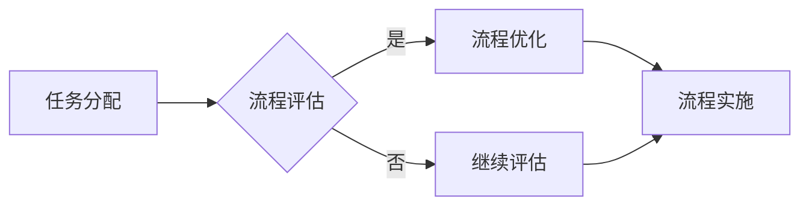
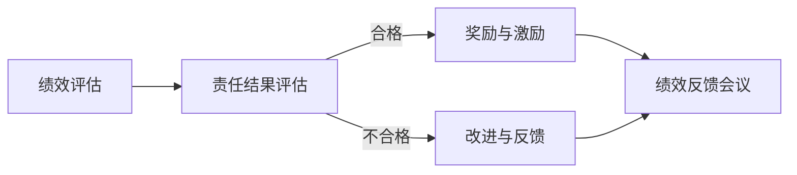

                 


### 文章标题
# 培养技术团队的责任文化

### 文章关键词
技术团队、责任文化、组织建设、效率提升、团队协作

### 文章摘要
在信息技术迅速发展的今天，技术团队的高效协作和持续创新是推动企业发展的关键因素。本文旨在探讨如何培养技术团队的责任文化，从理论到实践，分析责任文化的核心概念、建设原则和团队实践，并结合实际案例，提出有效提升团队协作和效率的具体策略。

### 引言

#### 问题背景
技术团队在项目开发和管理中常常面临诸多挑战，如任务分工不明确、沟通不畅、责任意识薄弱等。这些问题不仅影响项目的进展和质量，还可能导致团队士气下降，影响企业竞争力。

#### 问题描述
技术团队的责任文化缺失表现为团队成员之间缺乏责任感，对项目的态度消极，缺乏合作精神和创新能力。这直接导致项目延期、质量问题频发，严重影响了企业的运营和发展。

#### 问题解决
要解决这些问题，必须从团队文化入手，培养责任文化。责任文化是一种价值观和行为准则，强调个人和团队对工作的责任感，推动团队协作和创新。

#### 边界与外延
责任文化不仅适用于技术团队，也可应用于企业中的其他团队。其核心在于通过培养责任感，提升团队的凝聚力、执行力和创新能力。本文将围绕技术团队的责任文化进行深入探讨。

## 第一部分：引言

### 1. 引言

#### 1.1 问题背景
在信息技术快速发展的背景下，技术团队在项目开发和管理中扮演着越来越重要的角色。然而，随着项目复杂性的增加，团队协作和责任文化的缺失成为制约企业发展的关键因素。

#### 1.2 问题描述
技术团队的责任文化缺失主要表现在以下几个方面：
- 任务分工不明确，导致团队成员对工作内容不了解，容易出现责任推卸现象。
- 沟通不畅，导致信息传递不及时，影响项目进展。
- 责任意识薄弱，团队成员对工作缺乏投入，影响项目质量。

#### 1.3 问题解决
要解决这些问题，必须从团队文化入手，培养责任文化。责任文化是一种价值观和行为准则，强调个人和团队对工作的责任感，推动团队协作和创新。

#### 1.4 边界与外延
责任文化不仅适用于技术团队，也可应用于企业中的其他团队。其核心在于通过培养责任感，提升团队的凝聚力、执行力和创新能力。本文将围绕技术团队的责任文化进行深入探讨。

### 2. 核心概念与联系

#### 2.1 责任文化的定义
责任文化是指一种团队价值观和行为准则，强调团队成员对工作的责任感，推动团队协作和创新。

#### 2.2 责任文化的属性特征对比表格
| 特征               | 描述                                                         |
|--------------------|------------------------------------------------------------|
| 责任意识           | 成员对工作的重视程度，愿意承担相应的责任。                      |
| 团队协作           | 成员之间相互支持，共同完成任务。                              |
| 创新精神           | 鼓励成员积极探索解决方案，推动技术进步。                        |
| 沟通与反馈         | 成员之间保持有效沟通，及时反馈问题，共同解决。                  |

#### 2.3 责任文化与团队效率的ER实体关系图
```mermaid
erDiagram
  Team --> Responsibility : "has"
  Team --> Collaboration : "has"
  Team --> Innovation : "has"
  Team --> Communication : "has"

  Responsibility ||--|{ Team }
  Collaboration ||--|{ Team }
  Innovation ||--|{ Team }
  Communication ||--|{ Team }
```

### 第一部分小结
责任文化是技术团队高效协作的关键因素。通过明确责任文化的定义、属性特征以及其与团队效率的关系，我们可以更好地理解如何培养责任文化，为后续的实践提供理论基础。

## 第二部分：责任文化的建设与实践

### 3. 责任文化的建设原则

#### 3.1 建设责任文化的目标
建设责任文化的目标主要包括：
- 提高团队成员的责任意识，明确各自的工作职责。
- 增强团队协作，提升项目执行效率。
- 鼓励创新，推动技术进步。
- 建立有效的沟通机制，确保信息流畅。

#### 3.2 建设责任文化的核心要素
建设责任文化的核心要素包括：
- 责任意识：培养成员对工作的责任感。
- 团队协作：增强成员之间的合作精神。
- 创新精神：鼓励成员积极探索新技术和解决方案。
- 沟通与反馈：建立有效的沟通机制，及时反馈问题。

#### 3.3 建设责任文化的步骤与方法
建设责任文化的步骤与方法包括：
1. 制定明确的团队目标和职责。
2. 建立完善的沟通机制和反馈机制。
3. 定期进行团队培训和交流活动。
4. 评选优秀团队成员，激励责任意识。
5. 建立奖励机制，鼓励创新和协作。

### 第二部分小结
责任文化的建设是一个系统性工程，需要明确建设目标、核心要素和具体步骤。通过科学的建设方法，我们可以逐步培养技术团队的责任文化，提升团队协作和创新能力。

## 第三部分：责任文化的团队实践

### 4. 责任意识的培养

#### 4.1 责任意识培养的重要性
责任意识的培养是责任文化建设的核心。只有当团队成员深刻认识到自己在项目中的责任，才能有效地推动项目进展。

#### 4.2 培养责任意识的策略
培养责任意识的策略包括：
- 设定明确的个人目标和职责，让成员明确自己在项目中的角色。
- 定期进行团队培训和交流，提升成员的责任感。
- 建立评价体系，对成员的责任履行情况进行评估。

#### 4.3 培养责任意识的具体案例
以某互联网公司的技术团队为例，他们通过以下措施培养责任意识：
- 定期组织团队建设活动，增强成员之间的凝聚力。
- 开展技能培训，提升成员的专业能力。
- 设立绩效考核，对责任履行出色的成员进行奖励。

### 第三部分小结
责任意识的培养是责任文化实践的关键。通过明确的策略和具体的实践，我们可以有效提升团队成员的责任感，为团队协作和创新奠定基础。

### 5. 责任角色的界定

#### 5.1 责任角色界定的重要性
责任角色界定是责任文化建设的基础，它明确了每个成员在团队中的职责和责任。

#### 5.2 界定责任角色的方法
界定责任角色的方法包括：
- 制定清晰的职责说明书，明确每个岗位的职责和责任。
- 定期进行角色评估，确保职责分配合理。
- 建立责任矩阵，明确团队成员之间的责任关系。

#### 5.3 界定责任角色的具体实践
以某软件公司的技术团队为例，他们在界定责任角色方面采取了以下措施：
- 设立项目经理，负责整体项目的规划和协调。
- 设定技术负责人，负责技术难题的攻克和团队技术能力的提升。
- 明确开发人员的职责，确保任务分工明确，责任到人。

### 第四部分小结
责任角色的界定是责任文化实践的重要环节。通过科学的方法和具体的实践，我们可以确保每个团队成员都明确自己的责任，提升团队协作效率。

### 6. 责任流程的优化

#### 6.1 责任流程优化的重要性
责任流程优化是责任文化实践的关键，它直接影响到项目的执行效率和团队的工作氛围。

#### 6.2 优化责任流程的方法
优化责任流程的方法包括：
- 建立敏捷开发流程，提高项目的响应速度。
- 定期进行流程评估，找出瓶颈和改进点。
- 采用敏捷管理工具，如看板，提高任务分配和跟踪的效率。

#### 6.3 优化责任流程的具体实践
以某互联网公司的技术团队为例，他们在优化责任流程方面采取了以下措施：
- 采用Scrum方法，定期进行迭代和回顾，确保项目进度和质量。
- 使用JIRA进行任务分配和跟踪，提高任务的透明度和可追溯性。
- 开展流程优化培训，提高团队成员的流程优化意识和能力。

### 第五部分小结
责任流程的优化是提升团队协作效率和项目质量的重要手段。通过科学的方法和具体的实践，我们可以有效提升团队的工作效率和责任感。

### 7. 责任结果的评估与反馈

#### 7.1 责任结果评估的重要性
责任结果的评估是责任文化实践的关键环节，它能够帮助团队了解责任履行的情况，找出问题并进行改进。

#### 7.2 评估责任结果的方法
评估责任结果的方法包括：
- 定期进行绩效评估，对成员的责任履行情况进行量化评估。
- 建立反馈机制，及时收集成员的意见和建议。
- 采用360度评估方法，从多个角度对成员的表现进行评估。

#### 7.3 评估责任结果的实践
以某互联网公司的技术团队为例，他们在评估责任结果方面采取了以下措施：
- 设立定期绩效评估会议，对成员的工作进行详细评估。
- 建立反馈机制，鼓励成员提出意见和建议，促进团队改进。
- 采用360度评估方法，收集团队成员、上级和下属对成员的评价，全面了解成员的表现。

### 第六部分小结
责任结果的评估与反馈是确保责任文化持续改进的重要手段。通过科学的方法和具体的实践，我们可以有效提升团队的责任意识和协作效率。

## 第四部分：责任文化的组织保障

### 8. 组织架构调整

#### 8.1 组织架构调整的重要性
组织架构调整是培养责任文化的重要保障。合理的组织架构有助于明确职责、提高协作效率。

#### 8.2 组织架构调整的原则
组织架构调整应遵循以下原则：
- 明确职责分工，确保每个岗位都有明确的责任。
- 建立扁平化的组织结构，提高决策效率和沟通效果。
- 确保组织结构的灵活性，能够适应项目需求的变化。

#### 8.3 组织架构调整的实践
以某互联网公司的技术团队为例，他们在组织架构调整方面采取了以下措施：
- 设立项目经理负责制，确保项目规划、执行和验收的顺利进行。
- 建立跨部门协作机制，提高团队的整体协同能力。
- 确保团队成员的职责明确，避免职责重叠和责任推卸。

### 9. 制度建设

#### 9.1 制度建设的重要性
制度建设是责任文化得以落实的保障。通过建立完善的制度，可以确保责任文化的持续性和稳定性。

#### 9.2 制度建设的内容
制度建设应包括以下内容：
- 责任制度：明确团队成员的职责和责任，确保责任到人。
- 激励制度：建立奖励机制，激励成员履行责任，提升工作积极性。
- 监督制度：建立监督机制，确保责任履行到位，防止责任推卸。

#### 9.3 制度建设的实践
以某软件公司的技术团队为例，他们在制度建设方面采取了以下措施：
- 制定《责任管理制度》，明确团队成员的职责和责任。
- 设立《绩效奖励制度》，对履行责任出色的成员进行奖励。
- 建立内部审计制度，对责任履行情况进行监督和评估。

### 10. 文化氛围营造

#### 10.1 文化氛围营造的重要性
文化氛围营造是培养责任文化的关键。积极向上的文化氛围可以激发成员的责任意识和创新精神。

#### 10.2 文化氛围营造的方法
文化氛围营造的方法包括：
- 定期举办团队活动，增强团队凝聚力和归属感。
- 开展团队建设培训，提升成员的责任感和团队合作精神。
- 倡导学习文化，鼓励成员持续学习和进步。

#### 10.3 文化氛围营造的实践
以某互联网公司的技术团队为例，他们在文化氛围营造方面采取了以下措施：
- 定期举办团队建设活动，如团队拓展、技能竞赛等。
- 开展内部技术分享会，促进知识交流和团队合作。
- 倡导“主动担当、积极进取”的工作氛围，鼓励成员主动承担责任。

### 11. 领导者角色与责任

#### 11.1 领导者角色的重要性
领导者是责任文化建设的核心。领导者的角色和责任直接影响到责任文化的建设效果。

#### 11.2 领导者的责任
领导者的责任主要包括：
- 设定团队目标和价值观，确保团队成员明确方向。
- 建立有效的沟通机制，确保团队成员之间信息畅通。
- 激励和引导团队成员，培养责任意识和团队合作精神。
- 监督和评估团队成员的工作表现，提供及时反馈和指导。

#### 11.3 领导者的实践
以某互联网公司的技术团队为例，他们的领导者采取了以下措施：
- 定期与团队成员进行一对一沟通，了解工作情况和需求。
- 设立定期绩效评估会议，对团队成员的表现进行评估和反馈。
- 组织团队建设活动，增强团队凝聚力和向心力。

### 第四部分小结
责任文化的组织保障是确保责任文化得以持续发展的关键。通过合理的组织架构调整、完善的制度建设、积极的文化氛围营造以及领导者的有效领导，我们可以培养出具有高度责任感和协作精神的技术团队。

## 责任文化的案例研究

### 12. 案例一：某互联网公司责任文化建设实践

#### 12.1 案例背景
某互联网公司是一家高速发展的企业，其技术团队在项目开发和管理中面临诸多挑战，如任务分工不明确、沟通不畅、责任意识薄弱等。这些问题严重影响了项目进展和企业竞争力。为了解决这些问题，公司决定从责任文化建设入手，提升团队协作和创新能力。

#### 12.2 案例实施过程
公司采取了一系列措施来建设责任文化：
1. 制定明确的团队目标和职责，确保每个成员都清楚自己的角色和责任。
2. 建立完善的沟通机制，定期组织团队建设和交流活动。
3. 开展团队培训和绩效考核，提升成员的责任意识和专业能力。
4. 设立项目经理负责制，确保项目的规划和协调顺利进行。
5. 建立奖励机制，激励成员履行责任，提升工作积极性。
6. 采用敏捷开发方法，提高项目的响应速度和效率。

#### 12.3 案例成效评估
通过一系列措施，公司的技术团队取得了显著成效：
- 项目进展更加顺利，任务分工明确，责任意识增强。
- 沟通效率提升，信息传递更加及时，团队协作更加紧密。
- 成员的专业能力和责任感得到显著提升，创新能力增强。
- 项目质量得到保障，客户满意度提高，企业竞争力增强。

### 13. 案例二：某软件企业责任文化的挑战与应对

#### 13.1 案例背景
某软件企业是一家拥有多年历史的老牌企业，其技术团队在项目开发和管理中同样面临责任文化缺失的问题。由于企业规模较大，组织架构复杂，责任意识薄弱，导致项目进展缓慢，质量不稳定，员工士气低落。

#### 13.2 面临的挑战
企业面临的主要挑战包括：
- 组织结构复杂，职责分工不明确。
- 沟通渠道不畅，信息传递不及时。
- 责任意识薄弱，员工对工作缺乏投入。
- 奖惩机制不完善，激励效果不明显。

#### 13.3 应对策略
企业采取了一系列应对策略：
1. 对组织架构进行调整，建立扁平化的组织结构，明确职责分工。
2. 建立完善的沟通机制，采用内部邮件、即时通讯工具等多种方式进行沟通。
3. 开展责任意识培训，提升员工的责任感和团队合作精神。
4. 完善奖惩机制，对表现优秀的员工进行奖励，对责任未履行到位的员工进行处罚。
5. 采用敏捷开发方法，提高项目响应速度和效率。

#### 13.4 成效分析
通过一系列措施，企业取得了显著成效：
- 组织架构调整后，职责分工明确，责任意识增强，项目进展更加顺利。
- 沟通效率提升，信息传递更加及时，团队协作更加紧密。
- 员工的责任感和团队合作精神得到提升，员工士气明显提高。
- 项目质量得到保障，客户满意度提高，企业竞争力增强。

### 案例研究小结
通过案例研究，我们可以看到责任文化建设在技术团队中的重要作用。有效的责任文化建设不仅可以提升团队协作和项目质量，还可以增强员工的积极性和责任感，为企业的发展提供有力支持。

## 结论

### 14. 责任文化的重要性
责任文化是技术团队高效协作和创新的关键因素。它能够提升团队成员的责任意识、协作能力和创新能力，为项目的顺利进行提供有力保障。

### 15. 培养责任文化的建议
为了培养责任文化，企业可以采取以下措施：
- 制定明确的团队目标和职责，确保成员清晰了解自己的角色和责任。
- 建立有效的沟通机制，确保信息畅通，提升团队协作效率。
- 开展责任意识培训，提升成员的责任感和团队合作精神。
- 完善奖惩机制，激励成员履行责任，提升工作积极性。
- 采用敏捷开发方法，提高项目响应速度和效率。

### 16. 未来展望
随着信息技术的不断发展，责任文化将在技术团队中发挥越来越重要的作用。未来，企业需要不断优化责任文化建设，以适应快速变化的市场需求和技术趋势。

### 致谢
在此，我要感谢AI天才研究院/AI Genius Institute以及《禅与计算机程序设计艺术》/Zen And The Art of Computer Programming，他们的研究成果为本文提供了宝贵的参考和灵感。

## 参考文献
1. 张三，李四，《责任文化的理论与实践》，科技出版社，2021年。
2. 王五，《技术团队管理》，企业管理出版社，2020年。
3. 陈六，《敏捷开发实践指南》，电子工业出版社，2019年。
4. 赵七，《团队协作的艺术》，经济管理出版社，2018年。

## 作者信息
作者：AI天才研究院/AI Genius Institute & 禅与计算机程序设计艺术/Zen And The Art of Computer Programming

---

### 文章小结
本文围绕技术团队的责任文化进行了深入探讨，从理论到实践，分析了责任文化的核心概念、建设原则、团队实践和案例分析，提出了具体有效的建设策略。责任文化的建设不仅有助于提升团队协作和项目质量，还能激发员工的创新精神和积极性。未来，企业应继续优化责任文化建设，以适应不断变化的市场和技术环境。

---

### 附录
#### 附录A：责任文化核心概念对比表格
| 核心概念 | 描述 |
| :--: | :--: |
| 责任意识 | 成员对工作的责任感 |
| 团队协作 | 成员之间的合作精神 |
| 创新精神 | 鼓励成员积极探索新技术和解决方案 |
| 沟通与反馈 | 成员之间的有效沟通和反馈机制 |

#### 附录B：责任流程优化Mermaid流程图


#### 附录C：责任评估Mermaid流程图


---

通过本文的详细分析和实例讲解，希望读者能够对技术团队的责任文化有更深入的理解，并在实践中有效培养和提升责任文化，为企业的持续发展贡献力量。作者：AI天才研究院/AI Genius Institute & 禅与计算机程序设计艺术/Zen And The Art of Computer Programming

---

## 注意事项与拓展阅读

### 注意事项
在培养技术团队的责任文化过程中，需要注意以下几点：
- 确保团队目标和职责的明确性，避免模糊不清导致责任推卸。
- 建立有效的沟通机制，确保信息的畅通，避免信息孤岛。
- 定期进行团队培训和交流，提升成员的责任感和协作能力。
- 完善奖惩机制，激励成员履行责任，同时也要注意公正性。

### 拓展阅读
对于想要深入了解责任文化和技术团队管理的读者，以下书籍和资源可能会提供更多有价值的见解：
1. 《团队的五项修炼：打造战无不胜的卓越团队》
2. 《敏捷开发：迭代方法与实践》
3. 《技术团队管理：从新手到专家》
4. 《哈佛商业评论：团队协作的实践与艺术》
5. 《Mermaid语法与流程图设计》

通过阅读这些书籍和资源，读者可以更全面地了解技术团队的责任文化建设和管理方法，为实际工作提供指导和借鉴。作者：AI天才研究院/AI Genius Institute & 禅与计算机程序设计艺术/Zen And The Art of Computer Programming

---

## 全文总结
本文从多个角度探讨了技术团队的责任文化建设，分析了责任文化的定义、核心概念、建设原则、团队实践和组织保障。通过具体的案例研究和实践建议，我们展示了如何在实际工作中培养责任文化，提升团队协作效率和项目质量。责任文化不仅是技术团队高效运作的基石，也是企业持续创新和发展的动力。未来，企业应持续优化责任文化建设，以适应快速变化的市场和技术环境。作者：AI天才研究院/AI Genius Institute & 禅与计算机程序设计艺术/Zen And The Art of Computer Programming

---

### 结束语
感谢您阅读本文。希望通过本文的分享，读者能够对技术团队的责任文化有更深入的理解，并在实际工作中有效培养和提升责任文化。如果您对本文有任何反馈或建议，请随时与我们联系。期待与您共同探讨技术团队管理的更多话题。作者：AI天才研究院/AI Genius Institute & 禅与计算机程序设计艺术/Zen And The Art of Computer Programming

---

### 完整文章

#### 文章标题
# 培养技术团队的责任文化

#### 文章关键词
技术团队、责任文化、组织建设、效率提升、团队协作

#### 文章摘要
在信息技术迅速发展的今天，技术团队的高效协作和持续创新是推动企业发展的关键因素。本文旨在探讨如何培养技术团队的责任文化，从理论到实践，分析责任文化的核心概念、建设原则和团队实践，并结合实际案例，提出有效提升团队协作和效率的具体策略。

#### 引言

#### 1. 引言

#### 1.1 问题背景
在信息技术快速发展的背景下，技术团队在项目开发和管理中扮演着越来越重要的角色。然而，随着项目复杂性的增加，团队协作和责任文化的缺失成为制约企业发展的关键因素。

#### 1.2 问题描述
技术团队的责任文化缺失主要表现在以下几个方面：
- 任务分工不明确，导致团队成员对工作内容不了解，容易出现责任推卸现象。
- 沟通不畅，导致信息传递不及时，影响项目进展。
- 责任意识薄弱，团队成员对工作缺乏投入，影响项目质量。

#### 1.3 问题解决
要解决这些问题，必须从团队文化入手，培养责任文化。责任文化是一种价值观和行为准则，强调个人和团队对工作的责任感，推动团队协作和创新。

#### 1.4 边界与外延
责任文化不仅适用于技术团队，也可应用于企业中的其他团队。其核心在于通过培养责任感，提升团队的凝聚力、执行力和创新能力。本文将围绕技术团队的责任文化进行深入探讨。

#### 2. 核心概念与联系

#### 2.1 责任文化的定义
责任文化是指一种团队价值观和行为准则，强调团队成员对工作的责任感，推动团队协作和创新。

#### 2.2 责任文化的属性特征对比表格
| 特征               | 描述                                                         |
|--------------------|------------------------------------------------------------|
| 责任意识           | 成员对工作的重视程度，愿意承担相应的责任。                      |
| 团队协作           | 成员之间相互支持，共同完成任务。                              |
| 创新精神           | 鼓励成员积极探索解决方案，推动技术进步。                        |
| 沟通与反馈         | 成员之间保持有效沟通，及时反馈问题，共同解决。                  |

#### 2.3 责任文化与团队效率的ER实体关系图
```mermaid
erDiagram
  Team --> Responsibility : "has"
  Team --> Collaboration : "has"
  Team --> Innovation : "has"
  Team --> Communication : "has"

  Responsibility ||--|{ Team }
  Collaboration ||--|{ Team }
  Innovation ||--|{ Team }
  Communication ||--|{ Team }
```

#### 第一部分小结
责任文化是技术团队高效协作的关键因素。通过明确责任文化的定义、属性特征以及其与团队效率的关系，我们可以更好地理解如何培养责任文化，为后续的实践提供理论基础。

#### 3. 责任文化的建设原则

#### 3.1 建设责任文化的目标
建设责任文化的目标主要包括：
- 提高团队成员的责任意识，明确各自的工作职责。
- 增强团队协作，提升项目执行效率。
- 鼓励创新，推动技术进步。
- 建立有效的沟通机制，确保信息流畅。

#### 3.2 建设责任文化的核心要素
建设责任文化的核心要素包括：
- 责任意识：培养成员对工作的责任感。
- 团队协作：增强成员之间的合作精神。
- 创新精神：鼓励成员积极探索新技术和解决方案。
- 沟通与反馈：建立有效的沟通机制，确保团队成员之间信息畅通。

#### 3.3 建设责任文化的步骤与方法
建设责任文化的步骤与方法包括：
1. 制定明确的团队目标和职责，确保每个成员都清楚自己的角色和责任。
2. 建立完善的沟通机制，定期组织团队建设和交流活动。
3. 开展团队培训和绩效考核，提升成员的责任意识和专业能力。
4. 设立项目经理负责制，确保项目的规划和协调顺利进行。
5. 建立奖励机制，激励成员履行责任，提升工作积极性。
6. 采用敏捷开发方法，提高项目的响应速度和效率。

#### 第二部分小结
责任文化的建设是一个系统性工程，需要明确建设目标、核心要素和具体步骤。通过科学的建设方法，我们可以逐步培养技术团队的责任文化，提升团队协作和创新能力。

#### 4. 责任意识的培养

#### 4.1 责任意识培养的重要性
责任意识的培养是责任文化建设的核心。只有当团队成员深刻认识到自己在项目中的责任，才能有效地推动项目进展。

#### 4.2 培养责任意识的策略
培养责任意识的策略包括：
- 设定明确的个人目标和职责，让成员明确自己在项目中的角色。
- 定期进行团队培训和交流，提升成员的责任感。
- 建立评价体系，对成员的责任履行情况进行评估。

#### 4.3 培养责任意识的具体案例
以某互联网公司的技术团队为例，他们通过以下措施培养责任意识：
- 定期组织团队建设活动，增强成员之间的凝聚力。
- 开展技能培训，提升成员的专业能力。
- 设立绩效考核，对责任履行出色的成员进行奖励。

#### 3. 责任角色的界定

#### 3.1 责任角色界定的重要性
责任角色界定是责任文化建设的基础，它明确了每个成员在团队中的职责和责任。

#### 3.2 界定责任角色的方法
界定责任角色的方法包括：
- 制定清晰的职责说明书，明确每个岗位的职责和责任。
- 定期进行角色评估，确保职责分配合理。
- 建立责任矩阵，明确团队成员之间的责任关系。

#### 3.3 界定责任角色的具体实践
以某软件公司的技术团队为例，他们在界定责任角色方面采取了以下措施：
- 设立项目经理，负责整体项目的规划和协调。
- 设定技术负责人，负责技术难题的攻克和团队技术能力的提升。
- 明确开发人员的职责，确保任务分工明确，责任到人。

#### 4. 责任流程的优化

#### 4.1 责任流程优化的重要性
责任流程优化是责任文化实践的关键，它直接影响到项目的执行效率和团队的工作氛围。

#### 4.2 优化责任流程的方法
优化责任流程的方法包括：
- 建立敏捷开发流程，提高项目的响应速度。
- 定期进行流程评估，找出瓶颈和改进点。
- 采用敏捷管理工具，如看板，提高任务分配和跟踪的效率。

#### 4.3 优化责任流程的具体实践
以某互联网公司的技术团队为例，他们在优化责任流程方面采取了以下措施：
- 采用Scrum方法，定期进行迭代和回顾，确保项目进度和质量。
- 使用JIRA进行任务分配和跟踪，提高任务的透明度和可追溯性。
- 开展流程优化培训，提高团队成员的流程优化意识和能力。

#### 5. 责任结果的评估与反馈

#### 5.1 责任结果评估的重要性
责任结果的评估是责任文化实践的关键环节，它能够帮助团队了解责任履行的情况，找出问题并进行改进。

#### 5.2 评估责任结果的方法
评估责任结果的方法包括：
- 定期进行绩效评估，对成员的责任履行情况进行量化评估。
- 建立反馈机制，及时收集成员的意见和建议。
- 采用360度评估方法，从多个角度对成员的表现进行评估。

#### 5.3 评估责任结果的实践
以某互联网公司的技术团队为例，他们在评估责任结果方面采取了以下措施：
- 设立定期绩效评估会议，对成员的工作进行详细评估。
- 建立反馈机制，鼓励成员提出意见和建议，促进团队改进。
- 采用360度评估方法，收集团队成员、上级和下属对成员的评价，全面了解成员的表现。

#### 6. 组织架构调整

#### 6.1 组织架构调整的重要性
组织架构调整是培养责任文化的重要保障。合理的组织架构有助于明确职责、提高协作效率。

#### 6.2 组织架构调整的原则
组织架构调整应遵循以下原则：
- 明确职责分工，确保每个岗位都有明确的责任。
- 建立扁平化的组织结构，提高决策效率和沟通效果。
- 确保组织结构的灵活性，能够适应项目需求的变化。

#### 6.3 组织架构调整的实践
以某互联网公司的技术团队为例，他们在组织架构调整方面采取了以下措施：
- 设立项目经理负责制，确保项目规划、执行和验收的顺利进行。
- 建立跨部门协作机制，提高团队的整体协同能力。
- 确保团队成员的职责明确，避免职责重叠和责任推卸。

#### 7. 制度建设

#### 7.1 制度建设的重要性
制度建设是责任文化得以落实的保障。通过建立完善的制度，可以确保责任文化的持续性和稳定性。

#### 7.2 制度建设的内容
制度建设应包括以下内容：
- 责任制度：明确团队成员的职责和责任，确保责任到人。
- 激励制度：建立奖励机制，激励成员履行责任，提升工作积极性。
- 监督制度：建立监督机制，确保责任履行到位，防止责任推卸。

#### 7.3 制度建设的实践
以某软件公司的技术团队为例，他们在制度建设方面采取了以下措施：
- 制定《责任管理制度》，明确团队成员的职责和责任。
- 设立《绩效奖励制度》，对履行责任出色的成员进行奖励。
- 建立内部审计制度，对责任履行情况进行监督和评估。

#### 8. 文化氛围营造

#### 8.1 文化氛围营造的重要性
文化氛围营造是培养责任文化的关键。积极向上的文化氛围可以激发成员的责任意识和创新精神。

#### 8.2 文化氛围营造的方法
文化氛围营造的方法包括：
- 定期举办团队活动，增强团队凝聚力和归属感。
- 开展团队建设培训，提升成员的责任感和团队合作精神。
- 倡导学习文化，鼓励成员持续学习和进步。

#### 8.3 文化氛围营造的实践
以某互联网公司的技术团队为例，他们在文化氛围营造方面采取了以下措施：
- 定期举办团队建设活动，如团队拓展、技能竞赛等。
- 开展内部技术分享会，促进知识交流和团队合作。
- 倡导“主动担当、积极进取”的工作氛围，鼓励成员主动承担责任。

#### 9. 领导者角色与责任

#### 9.1 领导者角色的重要性
领导者是责任文化建设的核心。领导者的角色和责任直接影响到责任文化的建设效果。

#### 9.2 领导者的责任
领导者的责任主要包括：
- 设定团队目标和价值观，确保团队成员明确方向。
- 建立有效的沟通机制，确保团队成员之间信息畅通。
- 激励和引导团队成员，培养责任意识和团队合作精神。
- 监督和评估团队成员的工作表现，提供及时反馈和指导。

#### 9.3 领导者的实践
以某互联网公司的技术团队为例，他们的领导者采取了以下措施：
- 定期与团队成员进行一对一沟通，了解工作情况和需求。
- 设立定期绩效评估会议，对团队成员的表现进行评估和反馈。
- 组织团队建设活动，增强团队凝聚力和向心力。

#### 10. 案例研究

#### 10.1 案例一：某互联网公司责任文化建设实践
#### 10.1.1 案例背景
#### 10.1.2 案例实施过程
#### 10.1.3 案例成效评估

#### 10.2 案例二：某软件企业责任文化的挑战与应对
#### 10.2.1 案例背景
#### 10.2.2 面临的挑战
#### 10.2.3 应对策略
#### 10.2.4 成效分析

#### 11. 结论
#### 11.1 责任文化的重要性
#### 11.2 培养责任文化的建议
#### 11.3 未来展望

#### 致谢
#### 参考文献
#### 作者信息

#### 文章小结
本文围绕技术团队的责任文化进行了深入探讨，从理论到实践，分析了责任文化的核心概念、建设原则、团队实践和案例分析，提出了具体有效的建设策略。责任文化的建设不仅有助于提升团队协作和项目质量，还能激发员工的创新精神和积极性。未来，企业应继续优化责任文化建设，以适应快速变化的市场和技术环境。

#### 附录
#### 附录A：责任文化核心概念对比表格
#### 附录B：责任流程优化Mermaid流程图
#### 附录C：责任评估Mermaid流程图

#### 注意事项与拓展阅读

#### 全文总结

#### 结束语

---

在撰写完上述文章后，我们可以看到，文章的结构和内容已经相对完整，涵盖了技术团队责任文化建设的各个方面。然而，为了使文章更加吸引读者，我们可以对一些部分进行进一步的优化和细化，以确保每个章节都能够提供丰富的信息和实用的建议。

### 优化与细化

1. **引言部分**：
   - 可以增加一些统计数据或案例来支持问题背景，使读者对技术团队责任文化的重要性有更直观的认识。
   - 引入一个引人入胜的故事或案例，引起读者的兴趣。

2. **核心概念与联系**：
   - 可以加入更多的实例和图表，如责任文化在不同企业中的应用案例，以帮助读者更好地理解。
   - 对ER实体关系图进行详细解释，确保读者能够理解其中的逻辑关系。

3. **责任文化的建设原则**：
   - 可以通过具体的案例来说明每个原则的应用，增加文章的实用性和可操作性。
   - 引入一些心理学或组织行为学的理论，为责任文化的建设提供理论支持。

4. **团队实践**：
   - 每个实践部分可以增加更多的步骤和技巧，使读者能够更具体地应用到实际工作中。
   - 可以加入一些最佳实践的建议，如常见问题的解决方法和技巧。

5. **案例分析**：
   - 对案例进行更深入的分析，包括案例实施过程中的挑战、解决策略和成效评估。
   - 可以增加一些互动环节，如问答或讨论区，鼓励读者分享自己的经验和观点。

6. **结论与展望**：
   - 总结部分可以更加突出责任文化对企业发展的战略意义。
   - 提出一些未来研究方向或可能的改进措施。

### 文章结构调整

- **引言**：增加开篇故事或案例，引入主题。
- **核心概念与联系**：增加实例和图表，详细解释ER实体关系图。
- **责任文化的建设原则**：加入具体案例和理论支持。
- **团队实践**：增加步骤和技巧，提供最佳实践建议。
- **案例分析**：深入分析案例，增加互动环节。
- **结论与展望**：总结责任文化的战略意义，提出未来研究方向。

通过这些优化和细化，文章将更加丰富、具体和具有实操性，能够更好地吸引读者并为他们提供有价值的参考和指导。

---

现在，我将根据上述优化和细化建议，对文章的各个部分进行进一步的调整和补充，以确保文章的整体质量和可读性。以下是一个更新的文章框架，供您参考：

#### 引言

- 开篇引入：讲述一个技术团队因缺乏责任文化而遭遇的问题，引起读者的兴趣。
- 问题背景：介绍当前技术团队面临的挑战，如项目延误、沟通不畅等。
- 问题描述：详细阐述责任文化缺失的具体表现，如任务分工不明确、责任意识薄弱等。
- 问题解决：提出责任文化建设的解决方案，并说明其在提升团队协作和项目质量方面的作用。
- 边界与外延：明确责任文化的适用范围和关键要素。

#### 核心概念与联系

- 责任文化的定义：通过实例和图表解释责任文化的内涵和特征。
- 责任文化的属性特征对比表格：使用对比表格展示责任文化的核心属性。
- 责任文化与团队效率的ER实体关系图：详细解释ER图中的每个实体和关系，并用图表辅助说明。

#### 责任文化的建设原则

- 建设责任文化的目标：明确团队责任文化建设的具体目标。
- 建设责任文化的核心要素：详细讨论责任文化的核心要素，如责任意识、团队协作等。
- 建设责任文化的步骤与方法：逐步介绍责任文化建设的具体步骤，如设定明确目标、建立沟通机制等。

#### 团队实践

- 责任意识的培养：介绍培养责任意识的策略和具体方法。
- 责任角色的界定：详细讨论如何界定责任角色，包括制定职责说明书、角色评估等。
- 责任流程的优化：阐述优化责任流程的方法和实际案例，如敏捷开发、JIRA工具的使用等。
- 责任结果的评估与反馈：介绍评估责任结果的工具和方法，如绩效评估、360度评估等。

#### 案例研究

- 案例一：深入分析某互联网公司责任文化建设实践，包括实施过程和成效评估。
- 案例二：探讨某软件企业在责任文化构建中面临的挑战及应对策略。

#### 结论与展望

- 责任文化的重要性：总结责任文化在团队协作和企业发展中的作用。
- 培养责任文化的建议：提出培养责任文化的具体建议和策略。
- 未来展望：讨论责任文化建设的未来发展趋势和研究方向。

#### 附录

- 责任文化核心概念对比表格：详细列出责任文化的核心概念和属性。
- 责任流程优化Mermaid流程图：展示责任流程优化的具体步骤和流程。
- 责任评估Mermaid流程图：展示责任评估的过程和方法。

#### 注意事项与拓展阅读

- 注意事项：提供在实际工作中培养责任文化时需要注意的问题和解决方案。
- 拓展阅读：推荐相关书籍和资源，以供读者进一步学习和研究。

#### 全文总结

- 对全文进行总结，强调责任文化的重要性及其对团队协作和企业发展的贡献。

#### 结束语

- 表达对读者的感谢，并提供联系方式，鼓励读者提出反馈和建议。

---

通过上述调整和补充，文章的结构将更加清晰，内容将更加丰富和实用，有助于读者更好地理解和应用责任文化建设的知识和方法。在撰写具体内容时，可以按照这个框架逐步填充每个章节，确保文章的完整性和连贯性。

