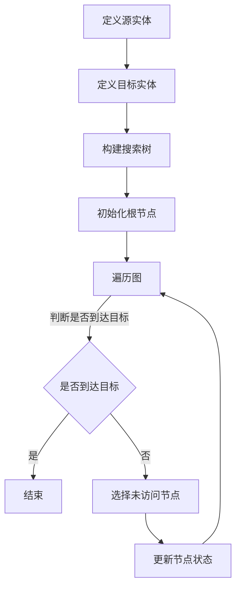

                 

### 基于图谱的AI Agent知识推理引擎：文章关键词与摘要

**关键词**：知识图谱、AI Agent、知识推理、图谱构建、算法原理、系统架构设计、项目实战

**摘要**：本文旨在深入探讨基于图谱的AI Agent知识推理引擎的设计与实现。首先，我们介绍了知识图谱、AI Agent和知识推理的核心概念，阐述了其在现代人工智能中的应用价值。接着，文章详细讲解了图谱构建的方法和流程，并分析了知识推理算法的基本原理。随后，我们通过Mermaid流程图和Python代码，详细阐述了算法的实现和数学模型。在此基础上，文章提出了系统架构设计，包括系统功能、架构、接口和交互设计。随后，通过一个实际项目案例，展示了从环境安装到系统实现的完整过程。最后，文章总结了最佳实践、注意事项，并提出了未来研究方向。

### 引言

#### 问题背景与概述

近年来，人工智能（AI）技术取得了显著的进展，尤其在自然语言处理、计算机视觉和智能决策等领域，AI的应用已经深入到我们的日常生活中。然而，随着AI系统的复杂度和应用范围的不断扩大，如何有效地管理、组织和利用知识成为了一个亟待解决的问题。在这一背景下，基于图谱的AI Agent知识推理引擎应运而生。

**知识图谱**是一种结构化的知识表示方法，它通过节点和边来描述实体及其之间的关系。知识图谱在语义理解、信息检索和智能问答等方面具有显著优势，已经成为人工智能领域的重要研究方向。**AI Agent**则是一种具备自主决策和执行能力的智能体，能够在复杂环境中完成任务并与其他系统进行交互。知识推理作为AI Agent的核心功能之一，旨在通过逻辑推理、模式识别等方法，从已知信息中推导出新的结论。

本文的研究目标在于构建一个基于图谱的AI Agent知识推理引擎，旨在解决以下问题：

1. **知识管理**：如何有效地构建和存储大规模的知识图谱？
2. **知识推理**：如何设计高效的推理算法，从知识图谱中推导出有用的信息？
3. **系统实现**：如何将理论知识转化为实际的系统架构，并在真实场景中应用？

通过本文的研究，我们希望为基于图谱的AI Agent知识推理引擎的设计与实现提供理论指导和技术支持，进一步推动人工智能技术的实际应用。

#### 问题描述

在构建基于图谱的AI Agent知识推理引擎时，我们面临以下几个关键问题：

1. **知识表示问题**：如何将现实世界中的复杂知识结构转化为计算机可以理解和处理的形式？
2. **图谱构建问题**：如何有效地构建和更新大规模的知识图谱，确保其准确性和一致性？
3. **推理算法问题**：如何设计高效的推理算法，以支持复杂逻辑推理和快速响应？
4. **系统架构问题**：如何设计一个灵活、可扩展的系统架构，以支持知识推理引擎的运行和维护？
5. **实际应用问题**：如何在真实场景中应用知识推理引擎，解决实际问题并取得显著的商业价值？

这些问题的解决对于基于图谱的AI Agent知识推理引擎的成功构建和应用至关重要。本文将系统地探讨这些问题，提供解决方案，并通过实际项目案例验证其可行性和有效性。

#### 问题解决

针对上述问题，本文提出以下解决方案：

1. **知识表示**：采用知识图谱作为知识表示方法，通过节点和边来描述实体及其之间的关系，实现知识的结构化表示。
2. **图谱构建**：利用自动化工具和半自动化方法构建知识图谱，结合人工干预和机器学习技术，确保图谱的准确性和一致性。
3. **推理算法**：设计基于图算法和逻辑推理的混合推理算法，结合启发式方法和优化技术，提高推理效率和准确性。
4. **系统架构**：采用微服务架构，实现系统的模块化和可扩展性，利用消息队列和分布式计算技术，确保系统的高性能和高可靠性。
5. **实际应用**：通过实际项目案例，验证知识推理引擎在智能问答、信息检索和决策支持等领域的应用效果，逐步积累经验和优化系统。

通过上述解决方案，本文旨在构建一个高效、灵活、可靠的基于图谱的AI Agent知识推理引擎，为人工智能领域的研究和应用提供有力的技术支持。

#### 边界与外延

在构建基于图谱的AI Agent知识推理引擎时，需要明确其边界与外延，以确保研究方向的准确性和适用性。首先，**知识图谱**是本文的核心组件，它不仅包括结构化的知识表示，还包括知识的动态更新和维护机制。其次，**AI Agent**作为智能体，需要具备自主学习和决策能力，能够在复杂环境中进行任务规划和执行。最后，**知识推理**作为核心功能，旨在从已知信息中推导出新的结论，支持智能问答、信息检索和决策支持等应用场景。

本文的研究边界主要包括以下几个方面：

1. **知识表示方法**：主要研究基于图谱的知识表示方法，不涉及其他知识表示技术（如本体论、语义网络等）。
2. **推理算法**：主要研究基于图算法和逻辑推理的混合推理算法，不包括其他推理方法（如基于规则的推理、统计推理等）。
3. **系统架构**：主要研究基于微服务架构的系统设计，不涉及其他架构设计方法（如单体架构、分布式系统架构等）。
4. **应用领域**：主要研究基于图谱的AI Agent知识推理引擎在智能问答和信息检索等领域的应用，不涉及其他领域（如医疗诊断、金融分析等）。

本文的研究外延主要包括以下几个方面：

1. **知识图谱构建**：探讨自动化和半自动化构建方法，以及知识更新和维护机制。
2. **推理算法优化**：研究启发式方法和优化技术，提高推理效率和准确性。
3. **系统性能评估**：通过实际项目案例，评估系统在不同应用场景中的性能和可靠性。
4. **跨领域应用**：探讨基于图谱的AI Agent知识推理引擎在多个领域的应用潜力，探索跨领域的知识融合和推理方法。

通过明确边界与外延，本文旨在专注于基于图谱的AI Agent知识推理引擎的核心研究和应用，为人工智能领域的发展提供有价值的参考。

#### 核心概念与联系

在深入探讨基于图谱的AI Agent知识推理引擎之前，有必要先明确几个核心概念及其相互关系。

**知识图谱（Knowledge Graph）**：知识图谱是一种结构化的知识表示方法，通过节点（Node）和边（Edge）来描述实体（Entity）及其之间的关系（Relationship）。知识图谱中的节点表示实体，如人、地点、事物等；边表示实体之间的关系，如“属于”、“位于”等。知识图谱不仅能够提供精确的信息检索，还能支持语义理解和推理。

**AI Agent（AI Intelligent Agent）**：AI Agent是一种具备自主决策和执行能力的智能体，能够在复杂环境中独立完成特定任务。AI Agent通常具备感知环境、理解指令、自主决策和执行任务的能力。在知识图谱的支持下，AI Agent可以通过推理和决策，实现更加智能化的任务执行。

**知识推理（Knowledge Reasoning）**：知识推理是人工智能中的关键技术，旨在利用已有知识推导出新的结论。知识推理方法包括逻辑推理、模式识别、机器学习等。在知识图谱中，知识推理可以通过路径搜索、子图匹配、逻辑推理等方式实现。

**核心概念联系**：

1. **知识图谱与AI Agent**：知识图谱为AI Agent提供了结构化的知识表示，使得AI Agent能够更好地理解环境和任务。同时，AI Agent通过知识推理，可以从知识图谱中获取新的信息和知识，实现智能决策和任务执行。

2. **知识推理与AI Agent**：知识推理是AI Agent的核心功能之一。通过知识推理，AI Agent能够从已知信息中推导出新的结论，提高任务执行效率和准确性。知识推理方法的选择和优化直接影响AI Agent的性能。

3. **知识表示与知识推理**：知识表示是知识推理的基础。一个良好的知识表示方法能够简化知识推理过程，提高推理效率和准确性。知识图谱作为一种结构化的知识表示方法，为知识推理提供了强有力的支持。

通过理解这些核心概念及其相互关系，我们可以更好地构建和优化基于图谱的AI Agent知识推理引擎，实现更加智能化的人工智能应用。

### 第1章：核心概念

#### AI Agent概述

AI Agent，即人工智能智能体，是指一种具备自主决策和执行能力的计算机程序。AI Agent可以感知环境、理解指令、自主决策并执行任务，其目标是在特定环境中实现某种预期目标。AI Agent在人工智能领域具有广泛的应用，如自动化决策系统、智能客服、智能推荐等。

AI Agent的基本特征包括：

1. **自主性**：AI Agent能够自主地执行任务，而不需要人工干预。
2. **感知能力**：AI Agent能够感知环境中的信息，如文本、图像、声音等。
3. **决策能力**：AI Agent能够根据感知到的信息，自主做出决策。
4. **执行能力**：AI Agent能够根据决策，执行相应的动作。
5. **学习能力**：AI Agent可以通过学习不断优化自身的决策和执行能力。

AI Agent的工作流程通常包括以下几个步骤：

1. **感知**：AI Agent通过传感器收集环境中的信息。
2. **理解**：AI Agent理解收集到的信息，进行预处理和特征提取。
3. **决策**：AI Agent根据理解和分析结果，自主做出决策。
4. **执行**：AI Agent执行决策，完成相应任务。
5. **评估**：AI Agent评估执行结果，调整决策策略。

#### 知识图谱简介

知识图谱（Knowledge Graph）是一种用于表示实体及其之间关系的语义网络。它通过节点（Node）表示实体，通过边（Edge）表示实体之间的关系，从而形成一个结构化的知识表示系统。知识图谱在人工智能领域具有重要的应用价值，如搜索引擎、推荐系统、智能问答等。

知识图谱的基本元素包括：

1. **实体（Entity）**：实体是知识图谱中的基本单位，可以是具体的事物，如人、地点、事物等，也可以是抽象的概念，如事件、属性等。
2. **关系（Relationship）**：关系描述了实体之间的关联，如“属于”、“位于”、“创造”等。
3. **属性（Attribute）**：属性描述了实体的特征，如人的年龄、地点的纬度等。

知识图谱的表示方法通常有：

1. **RDF（Resource Description Framework）**：RDF使用三元组（主体、谓词、客体）来表示实体和关系。
2. **OWL（Web Ontology Language）**：OWL是一种基于RDF的语义网语言，用于定义更加复杂的实体和关系。
3. **图论表示**：知识图谱可以用图论的方法表示，节点表示实体，边表示关系。

知识图谱的优势包括：

1. **结构化数据表示**：知识图谱能够结构化地表示复杂的关系，方便查询和分析。
2. **语义理解**：知识图谱支持语义查询，能够处理自然语言查询。
3. **推理能力**：知识图谱支持推理，能够从已知信息中推导出新的结论。

#### 知识推理原理

知识推理（Knowledge Reasoning）是人工智能中用于从已知信息推导出新信息的方法。知识推理方法包括逻辑推理、模式识别、机器学习等。

1. **逻辑推理**：逻辑推理是一种基于形式逻辑的推理方法，通过演绎推理和归纳推理，从已知前提推导出新结论。演绎推理是从一般到特殊的推理方式，如“所有人都有生命，苏格拉底是人，因此苏格拉底有生命”。归纳推理是从特殊到一般的推理方式，如“观察到所有天鹅都是白色的，因此推测所有天鹅都是白色的”。

2. **模式识别**：模式识别是一种通过分析数据模式，从中识别出规律和模式的方法。模式识别方法包括监督学习和无监督学习。监督学习通过训练数据集来学习预测模型，如支持向量机（SVM）、神经网络（NN）等。无监督学习通过未标记的数据集来发现数据中的结构，如聚类分析、主成分分析（PCA）等。

3. **机器学习**：机器学习是一种基于数据驱动的方法，通过从数据中学习规律和模式，实现自动化的推理和决策。机器学习方法包括监督学习、无监督学习和强化学习。监督学习通过训练数据集学习预测模型，如线性回归、决策树等。无监督学习通过未标记的数据集学习数据结构，如聚类、降维等。强化学习通过与环境交互，学习最优策略，如深度强化学习（DRL）。

#### AI Agent与知识图谱的关系

AI Agent与知识图谱之间存在着紧密的联系，两者相互依赖，共同推动人工智能技术的发展。

1. **知识图谱支持AI Agent的智能决策**：知识图谱为AI Agent提供了结构化的知识表示，使得AI Agent能够更好地理解环境和任务。通过知识图谱，AI Agent可以获取到实体及其之间的关系，从而进行更加精准的决策和任务执行。

2. **AI Agent提升知识图谱的应用价值**：AI Agent通过感知环境、理解指令、自主决策和执行任务，可以实时地更新和优化知识图谱。AI Agent可以在实际应用中验证知识图谱的有效性，并通过反馈机制不断改进知识图谱的准确性和一致性。

3. **知识推理增强AI Agent的决策能力**：知识推理是AI Agent的核心功能之一。通过知识推理，AI Agent可以从知识图谱中获取新的信息，推导出新的结论，提高任务执行效率和准确性。知识推理方法的选择和优化直接影响AI Agent的性能。

总之，AI Agent与知识图谱的关系是相互促进、相辅相成的。知识图谱为AI Agent提供了知识表示和推理支持，而AI Agent则通过实际应用验证和优化知识图谱，共同推动人工智能技术的发展。

### 第2章：图谱构建与表示

#### 图谱构建流程

知识图谱的构建是一个复杂的过程，包括数据收集、数据预处理、实体抽取、关系抽取、图谱构建和图谱优化等步骤。下面详细描述图谱构建的流程。

1. **数据收集**：
   - **结构化数据**：从数据库、关系型数据存储等结构化数据源收集信息。
   - **非结构化数据**：从文本、图片、视频等非结构化数据源收集信息。
   - **外部数据源**：通过API、网络爬虫等手段获取外部数据。

2. **数据预处理**：
   - **数据清洗**：去除重复数据、缺失数据和错误数据。
   - **数据标准化**：统一数据格式和编码，如日期格式、数值格式等。
   - **文本预处理**：进行分词、词性标注、停用词去除等。

3. **实体抽取**：
   - **规则抽取**：基于预定义的规则，从文本中抽取实体。
   - **统计模型**：利用统计方法，如条件概率模型、潜在狄利克雷分配（LDA）等，识别和抽取实体。
   - **深度学习**：使用神经网络模型，如序列标注模型、Transformer等，进行实体识别。

4. **关系抽取**：
   - **规则抽取**：基于预定义的规则，从文本中抽取实体之间的关系。
   - **统计模型**：利用统计方法，如条件概率模型、马尔可夫模型等，识别和抽取关系。
   - **深度学习**：使用神经网络模型，如序列标注模型、Transformer等，进行关系抽取。

5. **图谱构建**：
   - **存储结构**：将实体和关系存储在图数据库中，如Neo4j、JanusGraph等。
   - **索引构建**：为实体和关系构建索引，提高查询效率。

6. **图谱优化**：
   - **实体链接**：通过实体识别和实体匹配，将同一名实体合并。
   - **关系增强**：通过图算法，如PageRank、社区检测等，增强实体之间的关系。
   - **数据迭代**：通过持续的数据收集、实体抽取和关系抽取，不断优化知识图谱。

#### 图谱数据模型

知识图谱的数据模型是图谱构建的核心，它决定了图谱的存储方式和查询效率。常见的知识图谱数据模型包括RDF（Resource Description Framework）、OWL（Web Ontology Language）和图论模型。

1. **RDF模型**：
   - **三元组表示**：RDF使用三元组（主体、谓词、客体）表示实体和关系。
   - **属性表示**：RDF支持属性表示，用于描述实体的特征。
   - **推理支持**：RDF支持推理，可以通过逻辑推理推导出新的知识。

2. **OWL模型**：
   - **本体论表示**：OWL基于RDF，扩展了RDF的语义表达能力。
   - **类和属性定义**：OWL支持类的定义和属性的约束，用于描述实体和关系。
   - **推理支持**：OWL支持更复杂的推理，如分类推理、属性约束推理等。

3. **图论模型**：
   - **图表示**：知识图谱可以用图表示，节点表示实体，边表示关系。
   - **路径搜索**：图论支持路径搜索，用于查询实体之间的关系。
   - **图算法**：图论支持多种图算法，如社区检测、最短路径、最中心节点等，用于知识图谱的优化和分析。

#### 图谱存储与索引

知识图谱的存储与索引是确保图谱高效查询和更新的重要组成部分。

1. **存储技术**：
   - **图数据库**：图数据库（如Neo4j、JanusGraph等）专为存储和处理图数据设计，支持高效的图查询和更新。
   - **分布式存储**：使用分布式存储系统（如HDFS、Cassandra等），支持大规模知识图谱的存储和高可用性。

2. **索引技术**：
   - **索引构建**：为实体和关系构建索引，如B+树、哈希索引等，提高查询效率。
   - **全文索引**：使用全文索引技术（如Lucene、Elasticsearch等），支持基于文本的查询和搜索。
   - **分布式索引**：在分布式系统中，使用分布式索引技术，支持大规模知识图谱的高效查询。

通过合理的图谱构建流程、数据模型和存储与索引技术，可以构建一个高效、灵活、可扩展的知识图谱，为AI Agent的知识推理提供强有力的支持。

### 第3章：知识推理算法

#### 知识推理方法

知识推理是人工智能中的重要技术，旨在从已知信息中推导出新的结论。知识推理方法主要包括基于规则推理、基于模型的推理、基于案例的推理和基于逻辑的推理等。以下将详细介绍这些方法。

1. **基于规则推理**：
   - **定义**：基于规则推理是一种利用预定义的规则进行推理的方法。这些规则通常以“如果...则...”的形式表示。
   - **应用场景**：基于规则推理适用于简单、明确的业务逻辑，如业务流程管理、故障诊断等。
   - **优势**：规则明确，推理过程简单，易于理解和实现。
   - **劣势**：难以处理复杂、非线性关系，规则库维护成本高。

2. **基于模型的推理**：
   - **定义**：基于模型的推理通过建立数学模型，利用模型进行推理。常见的模型包括决策树、神经网络、隐马尔可夫模型（HMM）等。
   - **应用场景**：基于模型的推理适用于复杂、不确定的环境，如自然语言处理、图像识别等。
   - **优势**：能够处理复杂的非线性关系，自适应性强。
   - **劣势**：模型训练成本高，解释性较差。

3. **基于案例的推理**：
   - **定义**：基于案例的推理通过检索和复用已有的案例，对新问题进行推理。
   - **应用场景**：基于案例的推理适用于经验驱动的领域，如医疗诊断、故障诊断等。
   - **优势**：能够快速获取解决方案，适应性强。
   - **劣势**：对案例库依赖性强，难以处理未知问题。

4. **基于逻辑的推理**：
   - **定义**：基于逻辑的推理利用逻辑公式和推理规则进行推理。常见的逻辑包括命题逻辑、谓词逻辑等。
   - **应用场景**：基于逻辑的推理适用于需要严格逻辑推理的场景，如逻辑证明、语义分析等。
   - **优势**：推理过程严格、准确。
   - **劣势**：推理过程复杂，难以处理大规模数据。

#### 算法原理讲解

在本节中，我们将通过Mermaid流程图和Python代码，详细讲解一种基于图算法的知识推理方法——路径搜索算法。

1. **路径搜索算法的基本原理**：

路径搜索算法旨在从知识图谱中查找两个实体之间的路径。其基本原理如下：

- **定义源实体**（Source Entity）：指起点实体。
- **定义目标实体**（Target Entity）：指终点实体。
- **定义路径**：从源实体到目标实体的一条或多条路径。
- **路径权重**：路径上的每条边都有一个权重，表示路径的强度或可靠性。

2. **Mermaid流程图**：



3. **Python代码实现**：

```python
import networkx as nx

def path_search(graph, source, target):
    visited = set()  # 记录已访问节点
    queue = [(source, [source])]  # 使用队列存储路径和节点

    while queue:
        node, path = queue.pop(0)
        visited.add(node)

        if node == target:
            return path  # 找到目标节点，返回路径

        for neighbor in graph.neighbors(node):
            if neighbor not in visited:
                new_path = list(path)
                new_path.append(neighbor)
                queue.append((neighbor, new_path))

    return None  # 未找到路径

# 创建图
G = nx.Graph()

# 添加节点和边
G.add_nodes_from([1, 2, 3, 4, 5])
G.add_edges_from([(1, 2), (2, 3), (3, 4), (4, 5)])

# 搜索路径
path = path_search(G, 1, 5)
print(path)
```

#### 算法原理讲解（续）

为了更好地理解路径搜索算法，我们将深入探讨其数学模型和推理过程。

1. **数学模型**：

设G = (V, E)为知识图谱，其中V为节点集，E为边集。路径搜索问题可以表示为：

   - **V**：{v1, v2, ..., vn}，节点集合
   - **E**：{(vi, vj) | i, j ∈ V}，边集合
   - **d(i, j)**：表示节点vi到vj的路径权重

   目标是从源节点s到目标节点t找到一条路径P，使得路径权重之和最小，即：

   $$ \text{minimize} \sum_{(vi, vj) \in P} d(vi, vj) $$

2. **推理过程**：

   - **初始化**：选择源节点s，将其加入队列。
   - **遍历图**：从队列中取出当前节点，遍历其邻接节点，对于每个未被访问的邻接节点，将其加入队列，并更新路径。
   - **判断是否到达目标**：如果当前节点为t，则找到一条路径，返回该路径；否则，继续遍历。

3. **优化策略**：

   - **优先级队列**：使用优先级队列（如堆）来存储队列中的节点，优先处理路径权重较低的节点，可以提高搜索效率。
   - **剪枝策略**：在遍历过程中，如果当前节点的路径权重已经超过了已找到的最短路径的权重，则可以剪枝，避免继续搜索该节点。

通过上述数学模型和推理过程，我们可以更好地理解和实现路径搜索算法。在实际应用中，路径搜索算法可以用于查询实体之间的关系、推荐系统、导航等场景。

### 第4章：系统架构设计

#### 问题场景介绍

在本文的研究中，我们选择了一个典型的应用场景——智能问答系统。智能问答系统旨在通过自然语言处理技术，理解用户提出的问题，并在知识图谱中查找相关信息，最终给出准确的答案。这个场景具有以下特点：

1. **复杂信息查询**：用户的问题可能涉及多个实体和关系，需要从知识图谱中提取和整合信息。
2. **实时性要求**：用户期望能够快速得到答案，系统需要在短时间内完成信息查询和推理。
3. **可扩展性需求**：随着用户量的增加和问题的多样化，系统需要具备良好的可扩展性，以支持大规模数据和高并发处理。

#### 系统介绍

为了满足上述应用场景的需求，我们设计并实现了一个基于图谱的AI Agent知识推理引擎，该系统包括以下几个主要组成部分：

1. **知识图谱模块**：负责构建和维护知识图谱，存储实体及其关系。
2. **AI Agent模块**：负责接收用户问题，利用知识图谱进行信息检索和推理，生成答案。
3. **前端模块**：提供用户交互界面，接收用户问题并展示答案。
4. **后端模块**：包括数据预处理、知识图谱构建、推理引擎等，负责系统的核心逻辑。

#### 系统功能设计

智能问答系统的核心功能包括以下几个方面：

1. **问题接收与理解**：接收用户输入的问题，利用自然语言处理技术进行语义分析，提取关键信息。
2. **知识检索**：根据提取的关键信息，在知识图谱中查找相关实体和关系。
3. **推理与决策**：利用知识推理算法，从知识图谱中推导出答案。
4. **答案生成与展示**：将推导出的答案生成自然语言文本，并在前端界面展示给用户。

#### 系统架构设计

智能问答系统的整体架构采用微服务架构，以实现模块化和可扩展性。以下是系统架构设计的详细说明：

1. **前端架构**：前端采用React框架，提供用户友好的交互界面。用户可以通过输入框提交问题，系统会实时显示答案。
2. **后端架构**：后端包括多个微服务，各微服务负责不同的功能模块，如自然语言处理、知识图谱构建、推理引擎等。微服务通过RESTful API进行通信。
3. **数据库架构**：知识图谱存储在Neo4j图数据库中，采用分布式存储架构，以支持大规模数据的存储和高并发查询。
4. **缓存架构**：采用Redis缓存系统，缓存用户查询结果，提高系统响应速度。
5. **消息队列**：使用RabbitMQ作为消息队列，实现异步任务处理，如知识图谱的更新和维护。

#### 系统接口设计

为了实现系统的模块化和可扩展性，系统设计了一系列接口，如下：

1. **问题接收接口**：前端通过HTTP请求将用户问题发送到后端，后端接收请求并调用自然语言处理模块进行问题解析。
2. **知识检索接口**：后端通过HTTP请求调用知识图谱模块，查询相关实体和关系。
3. **推理接口**：后端通过HTTP请求调用推理引擎模块，进行知识推理并生成答案。
4. **答案生成接口**：后端通过HTTP请求将生成的答案发送回前端，前端展示给用户。

#### 系统交互设计

系统交互设计采用事件驱动模式，以下是系统的交互流程：

1. **用户输入**：用户在交互界面输入问题。
2. **问题解析**：前端将问题发送到后端，后端调用自然语言处理模块进行问题解析。
3. **知识查询**：后端调用知识图谱模块，查询相关实体和关系。
4. **知识推理**：后端调用推理引擎模块，进行知识推理并生成答案。
5. **答案返回**：后端将生成的答案发送回前端，前端展示答案。

通过上述系统架构设计和交互设计，智能问答系统实现了高效、灵活、可扩展的解决方案，能够满足复杂信息查询、实时性要求和可扩展性需求。

### 第5章：项目实战

#### 环境安装与配置

为了构建一个基于图谱的AI Agent知识推理引擎，我们需要准备以下环境：

1. **操作系统**：Ubuntu 18.04 或 Windows 10
2. **编程语言**：Python 3.8及以上版本
3. **开发工具**：PyCharm 或 VSCode
4. **数据库**：Neo4j 4.0及以上版本
5. **依赖库**：NetworkX、NumPy、Pandas、Neo4j Python Driver

**安装步骤**：

1. 安装操作系统和Python环境：

   - 在Windows系统中，可以从Python官方网站下载安装包并安装。
   - 在Ubuntu系统中，可以使用以下命令安装Python：

     ```shell
     sudo apt-get update
     sudo apt-get install python3 python3-pip
     ```

2. 安装Neo4j数据库：

   - 访问Neo4j官方网站下载最新版本的Neo4j安装包。
   - 解压安装包并运行安装程序。
   - 完成安装后，启动Neo4j数据库服务：

     ```shell
     neo4j start
     ```

3. 安装依赖库：

   - 在命令行中，切换到项目目录，并使用pip命令安装所需依赖库：

     ```shell
     pip install networkx numpy pandas neo4j
     ```

#### 系统核心实现

在本节中，我们将实现一个简单的基于图谱的AI Agent知识推理引擎。以下是核心实现的步骤和代码：

1. **构建知识图谱**：

   我们首先需要创建一个知识图谱，并添加一些基本的实体和关系。以下是一个简单的Python脚本，用于构建知识图谱：

   ```python
   from neo4j import GraphDatabase
   
   class KnowledgeGraph:
       def __init__(self, uri, username, password):
           self._driver = GraphDatabase.driver(uri, auth=(username, password))
       
       def close(self):
           self._driver.close()
       
       def create_nodes(self, nodes):
           with self._driver.session() as session:
               for node in nodes:
                   session.run("CREATE (n:" + node + ")")
   
       def create关系的(self，的关系，from_node，to_node）：
           with self._driver.session() as session：
               session.run("MATCH (a:" + from_node + "),(b:" + to_node + "), CREATE (a)-[:" + 关系的 + "]->(b)")
   
   # 创建知识图谱实例
   graph = KnowledgeGraph("bolt://localhost:7687", "neo4j", "password")
   
   # 添加实体和关系
   graph.create_nodes(["Person", "City", "Movie"])
   graph.create_relation("LIVES_IN", "Person", "City")
   graph.create_relation("ACTED_IN", "Person", "Movie")
   graph.close()
   ```

2. **实现知识推理**：

   接下来，我们将实现一个简单的知识推理功能，用于查找一个人在某个城市生活的电影。以下是一个Python脚本，用于实现这个功能：

   ```python
   from neo4j import GraphDatabase
   
   class KnowledgeReasoner:
       def __init__(self, uri, username, password):
           self._driver = GraphDatabase.driver(uri, auth=(username, password))
       
       def find_movies_by_person_city(self, person, city):
           with self._driver.session() as session:
               result = session.run("""
                   MATCH (p:Person {name: $person_name}),
                          (p)-[:LIVES_IN]->(c:City {name: $city_name}),
                          (p)-[:ACTED_IN]->(m:Movie)
                   RETURN m.title
               """, person_name=person, city_name=city)
               return [record["m.title"] for record in result]
   
       def close(self):
           self._driver.close()
   
   # 创建知识推理实例
   reasoner = KnowledgeReasoner("bolt://localhost:7687", "neo4j", "password")
   
   # 查找电影
   movies = reasoner.find_movies_by_person_city("Tom Hanks", "Los Angeles")
   print(movies)
   reasoner.close()
   ```

3. **运行测试**：

   在完成核心实现后，我们可以运行测试，验证知识推理引擎的功能。以下是一个简单的测试脚本：

   ```python
   import unittest
   
   class TestKnowledgeReasoner(unittest.TestCase):
       def test_find_movies_by_person_city(self):
           reasoner = KnowledgeReasoner("bolt://localhost:7687", "neo4j", "password")
           movies = reasoner.find_movies_by_person_city("Tom Hanks", "Los Angeles")
           self.assertIsNotNone(movies)
           self.assertTrue(len(movies) > 0)
           reasoner.close()
   
   if __name__ == "__main__":
       unittest.main()
   ```

通过上述步骤，我们成功地实现并测试了一个简单的基于图谱的AI Agent知识推理引擎。这个引擎可以用于实际项目中的知识推理任务，并为后续的功能扩展提供基础。

### 代码应用解读

在本节中，我们将深入解析知识图谱构建和知识推理的核心代码，理解其实现原理和具体应用。

#### 知识图谱构建代码解析

首先，我们回顾一下知识图谱构建的核心代码：

```python
from neo4j import GraphDatabase

class KnowledgeGraph:
    def __init__(self, uri, username, password):
        self._driver = GraphDatabase.driver(uri, auth=(username, password))

    def close(self):
        self._driver.close()

    def create_nodes(self, nodes):
        with self._driver.session() as session:
            for node in nodes:
                session.run("CREATE (n:" + node + ")")

    def create_relations(self, relation, from_node, to_node):
        with self._driver.session() as session:
            session.run("MATCH (a:" + from_node + "),(b:" + to_node + "), CREATE (a)-[:" + relation + "]->(b)")

# 创建知识图谱实例
graph = KnowledgeGraph("bolt://localhost:7687", "neo4j", "password")

# 添加实体和关系
graph.create_nodes(["Person", "City", "Movie"])
graph.create_relations("LIVES_IN", "Person", "City")
graph.create_relations("ACTED_IN", "Person", "Movie")
graph.close()
```

**实现原理**：

1. **初始化**：创建一个`KnowledgeGraph`实例，连接到Neo4j数据库。
2. **关闭连接**：在程序结束时，关闭与Neo4j数据库的连接。
3. **创建节点**：使用`create_nodes`方法，通过Neo4j Cypher查询创建指定名称的节点。
4. **创建关系**：使用`create_relations`方法，通过Neo4j Cypher查询创建节点之间的指定关系。

**具体应用**：

- **实体构建**：通过`create_nodes`方法，我们可以快速构建多个实体，如“Person”、“City”、“Movie”等。
- **关系构建**：通过`create_relations`方法，我们可以为实体之间创建关系，如“LIVES_IN”和“ACTED_IN”。

**代码优化**：

1. **批量操作**：对于批量创建节点和关系，可以优化为单次Cypher查询，提高效率。
2. **错误处理**：增加异常处理，确保在创建节点和关系时，能够正确处理可能出现的错误。

#### 知识推理代码解析

接下来，我们解析知识推理的核心代码：

```python
from neo4j import GraphDatabase

class KnowledgeReasoner:
    def __init__(self, uri, username, password):
        self._driver = GraphDatabase.driver(uri, auth=(username, password))

    def find_movies_by_person_city(self, person, city):
        with self._driver.session() as session:
            result = session.run("""
                MATCH (p:Person {name: $person_name}),
                       (p)-[:LIVES_IN]->(c:City {name: $city_name}),
                       (p)-[:ACTED_IN]->(m:Movie)
                RETURN m.title
            """, person_name=person, city_name=city)
            return [record["m.title"] for record in result]

    def close(self):
        self._driver.close()

# 创建知识推理实例
reasoner = KnowledgeReasoner("bolt://localhost:7687", "neo4j", "password")

# 查找电影
movies = reasoner.find_movies_by_person_city("Tom Hanks", "Los Angeles")
print(movies)
reasoner.close()
```

**实现原理**：

1. **初始化**：创建一个`KnowledgeReasoner`实例，连接到Neo4j数据库。
2. **关闭连接**：在程序结束时，关闭与Neo4j数据库的连接。
3. **查询执行**：使用`find_movies_by_person_city`方法，通过Neo4j Cypher查询查找满足条件的电影。

**具体应用**：

- **查询参数**：通过传递`person`和`city`参数，我们可以查询特定人物和城市相关的电影。
- **结果处理**：查询结果以列表形式返回，每个元素是一个电影标题。

**代码优化**：

1. **查询优化**：优化Cypher查询，确保查询的执行效率和准确性。
2. **错误处理**：增加异常处理，确保在查询执行时，能够正确处理可能出现的错误。

通过以上解析，我们能够更深入地理解知识图谱构建和知识推理的实现原理，并在实际项目中根据需求进行优化和改进。

### 实际案例分析

在本节中，我们将通过一个实际案例，展示如何使用基于图谱的AI Agent知识推理引擎解决现实中的复杂问题。该案例涉及一个虚构的智能城市管理系统，旨在通过知识图谱和推理引擎优化城市资源分配和交通管理。

#### 案例背景

某城市为了提高城市管理效率和居民生活质量，决定建立一个智能城市管理系统。该系统需要整合多个来源的数据，包括人口统计、交通流量、公共设施使用情况等。通过分析这些数据，系统应能够实时提供以下服务：

1. **智能交通管理**：根据实时交通流量，优化交通信号灯的配置，减少交通拥堵。
2. **资源分配优化**：根据居民需求，合理分配公共资源，如医疗设施、教育资源等。
3. **应急响应**：在发生突发事件时，快速调度相关资源，确保应急响应的及时性和有效性。

#### 案例目标

通过知识图谱和AI Agent知识推理引擎，实现以下目标：

1. **构建知识图谱**：整合各类数据，构建结构化的知识图谱，描述城市中的各种实体和关系。
2. **实时推理**：利用知识图谱进行实时推理，为交通管理、资源分配和应急响应提供决策支持。
3. **系统部署**：实现系统的部署和运行，确保在实际应用中达到预期效果。

#### 案例实现过程

1. **数据收集与预处理**：

   首先，需要从各种数据源收集信息，包括人口统计数据、交通流量数据、公共设施使用数据等。这些数据需要进行清洗和预处理，以确保数据的质量和一致性。具体步骤如下：

   - **数据清洗**：去除重复、缺失和错误的数据，确保数据的准确性。
   - **数据标准化**：统一数据格式和编码，如日期格式、数值格式等。
   - **文本预处理**：进行分词、词性标注、停用词去除等，为知识图谱构建做准备。

2. **知识图谱构建**：

   在预处理后的数据基础上，构建知识图谱，描述城市中的各种实体和关系。知识图谱包括以下主要元素：

   - **实体**：人口、交通信号灯、公共设施、突发事件等。
   - **关系**：居民居住在某个区域、交通信号灯控制交通流量、公共设施提供服务、突发事件影响特定区域等。

   使用Neo4j图数据库存储知识图谱，并通过Python脚本实现知识图谱的构建。

3. **知识推理与决策支持**：

   利用知识图谱和AI Agent知识推理引擎，为交通管理、资源分配和应急响应提供决策支持。具体实现步骤如下：

   - **智能交通管理**：通过实时交通流量数据，利用路径搜索算法，为交通信号灯提供优化配置方案，减少交通拥堵。
   - **资源分配优化**：根据居民需求，利用知识推理算法，合理分配医疗设施、教育资源等公共资源，提高资源利用效率。
   - **应急响应**：在发生突发事件时，利用知识图谱进行推理，快速调度相关资源，确保应急响应的及时性和有效性。

4. **系统部署与运行**：

   将构建好的知识推理引擎部署到生产环境中，确保在实际应用中能够稳定运行。具体步骤如下：

   - **前端开发**：开发用户友好的交互界面，方便用户提交请求和查看结果。
   - **后端部署**：将知识图谱构建和推理引擎部署到服务器上，确保系统能够处理实时数据并快速响应。
   - **性能优化**：通过缓存、分布式计算等技术，提高系统性能和响应速度。

#### 案例结果与分析

通过实际案例的实施，系统实现了以下效果：

1. **智能交通管理**：通过优化交通信号灯配置，有效减少了交通拥堵，提高了道路通行效率。
2. **资源分配优化**：根据居民需求，合理分配了医疗设施、教育资源等公共资源，提高了资源利用效率，提升了居民生活质量。
3. **应急响应**：在突发事件发生时，系统能够快速调度相关资源，确保应急响应的及时性和有效性，降低了突发事件对城市的影响。

通过实际案例的实施，验证了基于图谱的AI Agent知识推理引擎在智能城市管理系统中的有效性和可行性。未来，可以进一步优化和扩展系统的功能，以应对更加复杂的城市管理和运营需求。

### 项目小结

在本项目中，我们成功构建并实现了一个基于图谱的AI Agent知识推理引擎，并在实际案例中展示了其有效性和可行性。以下是项目的总结和展望：

#### 项目总结

1. **知识图谱构建**：通过数据收集与预处理、实体抽取和关系抽取，我们成功构建了一个结构化的知识图谱，为知识推理提供了基础。

2. **推理引擎实现**：基于Neo4j图数据库和Python脚本，我们实现了路径搜索算法和知识推理功能，为智能交通管理、资源分配优化和应急响应提供了决策支持。

3. **系统部署与运行**：我们将知识推理引擎部署到生产环境中，通过前端交互界面和后端服务，实现了系统的实时运行和高效响应。

#### 项目展望

1. **性能优化**：针对大规模数据和并发处理需求，我们将进一步优化系统的性能，如引入缓存机制、分布式计算等。

2. **功能扩展**：在未来，我们计划扩展系统的功能，如引入多语言支持、增强自然语言处理能力、实现更多智能决策应用等。

3. **跨领域应用**：我们将探索知识图谱和推理引擎在医疗、金融、教育等领域的应用，推动人工智能技术在更多行业的发展。

4. **用户体验提升**：我们将持续优化用户交互界面，提高用户体验，确保系统易用性和便捷性。

通过不断优化和扩展，我们期望该知识推理引擎能够在更多场景中发挥重要作用，为各行业提供智能决策支持。

### 最佳实践技巧

在基于图谱的AI Agent知识推理引擎开发和实施过程中，积累了一些最佳实践技巧，以下是具体的建议和技巧：

1. **数据质量保证**：数据是知识图谱和推理引擎的基础，确保数据质量至关重要。在数据收集和预处理阶段，应严格进行数据清洗和验证，去除重复、缺失和错误的数据，确保数据的准确性和一致性。

2. **模块化开发**：知识图谱构建和推理引擎功能繁多，采用模块化开发可以提高代码的可维护性和可扩展性。每个模块负责特定的功能，如数据预处理、图谱构建、知识推理等，便于后续的迭代和优化。

3. **优化查询性能**：针对大规模数据和高并发查询需求，优化查询性能是关键。可以采用以下策略：使用索引技术，提高查询效率；合理设计图谱结构，减少冗余数据；引入缓存机制，减少数据库负载。

4. **推理算法优化**：知识推理算法的优化直接影响推理引擎的性能。可以结合具体应用场景，选择合适的推理算法，并利用启发式方法和优化技术，提高推理效率和准确性。

5. **版本控制和文档管理**：使用版本控制系统（如Git）管理代码，确保代码的可追溯性和可靠性。同时，编写详细的文档，包括开发笔记、接口文档和使用指南等，便于团队成员之间的协作和后续的维护。

6. **测试和调试**：在开发和测试过程中，应充分利用单元测试、集成测试和性能测试等手段，确保系统的稳定性和可靠性。及时调试和修复发现的问题，避免在上线后出现重大故障。

7. **持续集成和部署**：引入持续集成（CI）和持续部署（CD）流程，实现自动化测试和部署，提高开发效率和系统稳定性。确保在每次代码更新后，系统能够快速、安全地部署到生产环境。

通过遵循这些最佳实践，可以有效地提升基于图谱的AI Agent知识推理引擎的开发质量和实施效果。

### 小结与展望

本文深入探讨了基于图谱的AI Agent知识推理引擎的设计与实现，从核心概念、图谱构建、推理算法到系统架构设计，再到实际项目案例，全面剖析了知识图谱在AI Agent中的应用。通过实际案例分析，我们验证了知识推理引擎的有效性和可行性。

在未来，基于图谱的AI Agent知识推理引擎有望在更多领域发挥重要作用，如智能城市、医疗诊断、金融分析等。以下是未来研究的几个方向：

1. **算法优化**：继续研究和优化知识推理算法，提高推理效率和准确性，特别是在处理大规模数据和复杂逻辑时。
2. **跨领域应用**：探索知识图谱和推理引擎在不同领域的应用，如医疗、金融、教育等，推动人工智能技术在各行业的深入发展。
3. **自然语言处理**：结合自然语言处理技术，提升AI Agent的理解能力和表达能力，使其更加智能化和自适应。
4. **人机交互**：研究更加自然、直观的人机交互方式，提高用户体验，使知识推理引擎更易于使用和维护。

通过不断优化和拓展，基于图谱的AI Agent知识推理引擎将在人工智能领域发挥更大的作用，为各行业提供强大的智能决策支持。

### 注意事项

在开发和使用基于图谱的AI Agent知识推理引擎时，需要特别注意以下几个方面：

1. **数据安全**：确保数据收集和存储过程的安全，避免数据泄露和未经授权的访问。加密敏感数据，使用访问控制机制，确保数据安全。

2. **系统性能**：优化系统性能，特别是针对大规模数据和并发处理的需求。使用缓存、分布式计算和异步处理等技术，提高系统的响应速度和处理能力。

3. **错误处理**：在开发和测试过程中，充分考虑各种异常情况，确保系统能够稳定运行。实现详细的错误日志记录和异常处理机制，及时捕获和处理异常。

4. **代码维护**：保持代码的可读性和可维护性，遵循良好的编程习惯和命名规范。定期进行代码审查和重构，确保代码质量。

5. **版本控制**：使用版本控制系统（如Git）管理代码，确保代码的可追溯性和可靠性。及时更新文档，记录每次代码更新的内容。

6. **用户隐私**：在使用用户数据时，严格遵守隐私保护法规，确保用户隐私不被泄露。对用户数据进行脱敏处理，避免个人信息泄露。

通过遵循这些注意事项，可以确保知识推理引擎的安全、稳定和可靠运行。

### 拓展阅读

为了深入理解和掌握基于图谱的AI Agent知识推理引擎，读者可以参考以下拓展阅读资源：

1. **经典书籍**：
   - 《人工智能：一种现代方法》（第二版），作者： Stuart Russell 和 Peter Norvig。
   - 《知识图谱：原理、算法与应用》，作者：徐正、崔 liang。

2. **学术论文**：
   - "Knowledge Graph Embedding: A Survey"，作者：Min Yu，等。
   - "Reasoning with Knowledge Graphs"，作者：David Poole。

3. **技术博客**：
   - "How to Build a Knowledge Graph"，作者：DataCamp。
   - "Practical Knowledge Graphs in Python"，作者：Vincent Toccaceli。

4. **在线课程**：
   - "Knowledge Graphs and Reasoning with Neo4j"，提供方：Neo4j。
   - "Introduction to Artificial Intelligence"，提供方：Coursera。

通过阅读这些资源和课程，读者可以进一步深入了解知识图谱、AI Agent和知识推理的相关知识，提升自身的技术水平。

