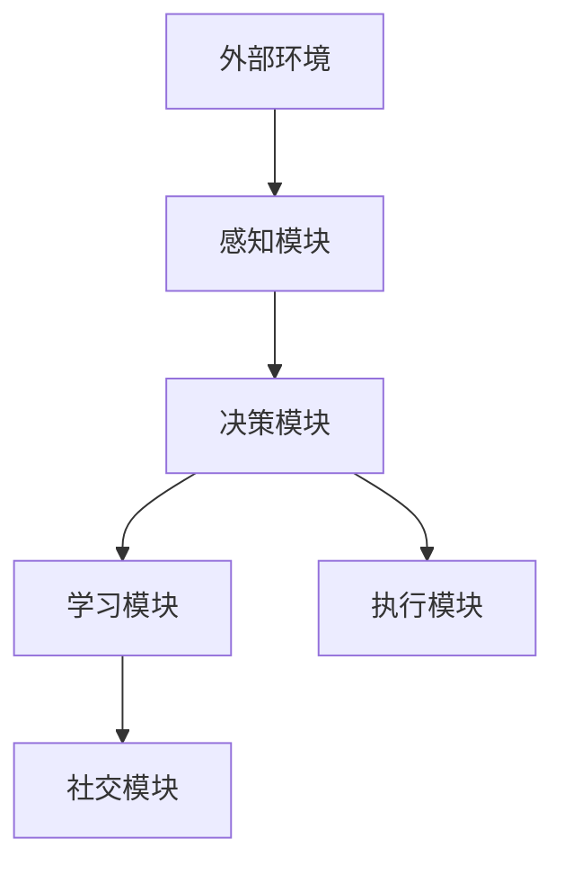
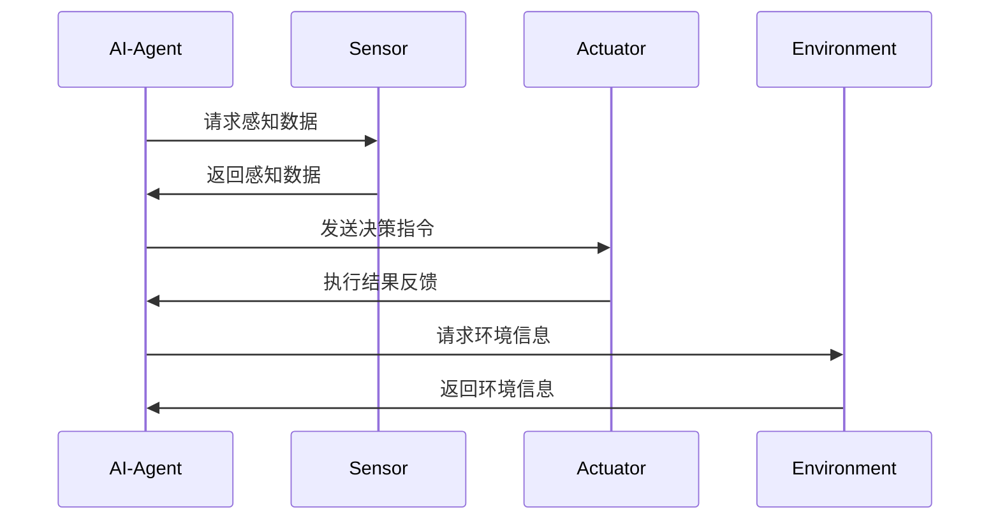
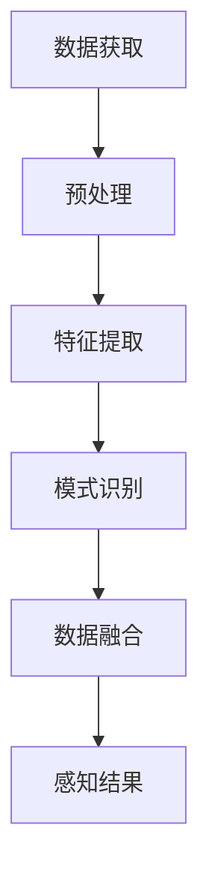
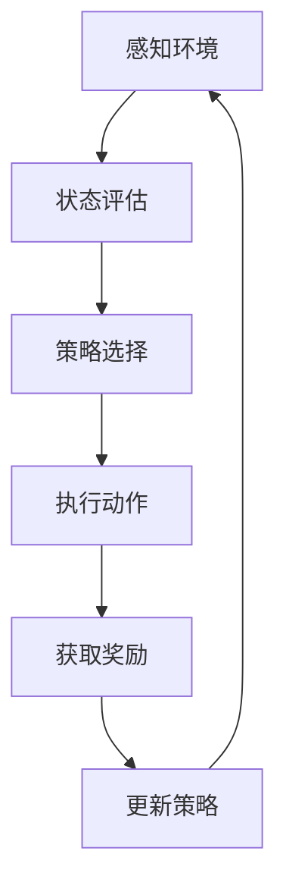
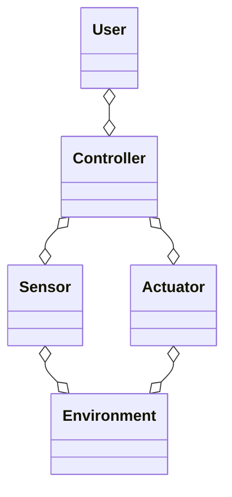
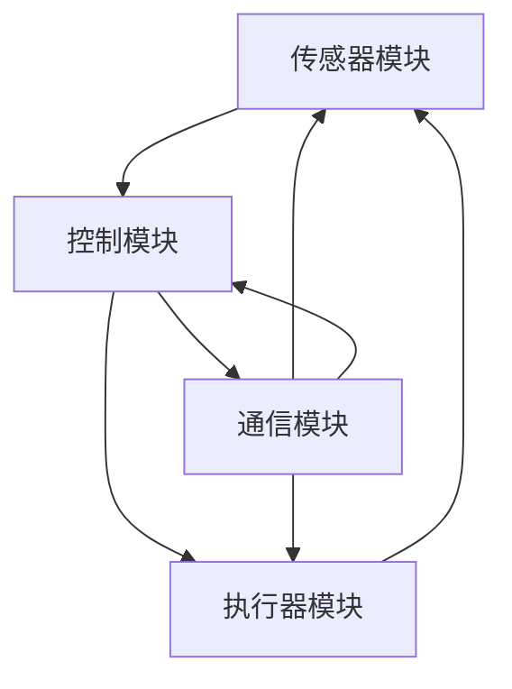
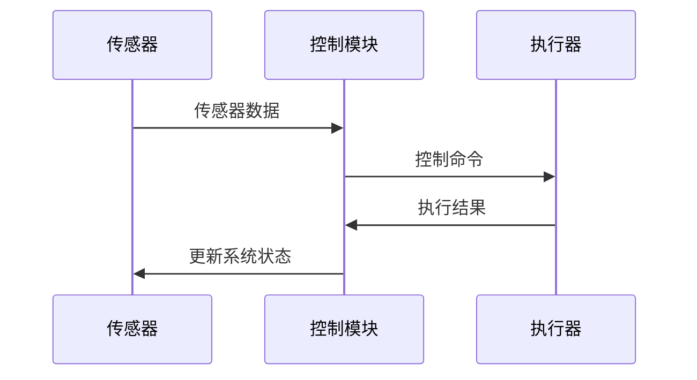

                 

### 文章标题

# 基于课程学习的AI Agent能力进阶

> 关键词：人工智能、AI Agent、感知能力、决策能力、学习能力、社交能力

> 摘要：本文旨在探讨AI Agent在课程学习中的能力进阶，从核心概念、算法原理到实际应用，为读者提供一条清晰的进阶路径。

----------------------------------------------------------------

## 第一部分：背景介绍

### 第1章：问题背景与核心概念

#### 1.1.1 问题描述

人工智能（AI）已经成为现代社会的重要驱动力，从简单的自动化工具到复杂的智能系统，AI已经渗透到各个行业。AI Agent作为AI领域的一个重要分支，具有自主决策、适应环境和实现目标的能力。随着课程学习的深入，AI Agent的能力不断提升，从基础的理论知识到实际应用，都需要一个系统的学习和进阶过程。

#### 1.1.2 问题解决

本书旨在为AI Agent的课程学习提供一条清晰的进阶路径。通过系统地介绍AI Agent的核心概念、算法原理、数学模型和实际应用，帮助读者从基础到高级逐步掌握AI Agent的能力。

#### 1.1.3 边界与外延

本书主要关注AI Agent在课程学习中的能力进阶，包括但不限于：感知能力、决策能力、学习能力、社交能力等方面。同时，本书将介绍AI Agent在不同应用场景下的实现和优化方法。

#### 1.1.4 概念结构与核心要素组成

AI Agent的能力进阶包括以下几个核心要素：

1. 感知能力：通过传感器获取环境信息，并对信息进行处理和理解。
2. 决策能力：基于感知信息，进行目标选择和决策制定。
3. 学习能力：通过不断学习和适应，提高自身的性能和效果。
4. 社交能力：与人类或其他AI Agent进行交互，协同完成任务。

### 第2章：核心概念与联系

#### 2.1 AI Agent的定义与特点

AI Agent是一种能够感知环境、自主决策并采取行动的实体。与传统的程序不同，AI Agent具有自主性和智能性，能够适应复杂多变的环境。

#### 2.2 AI Agent的核心能力

AI Agent的核心能力包括感知能力、决策能力、学习能力和社交能力。这些能力相互关联，共同决定了AI Agent的性能和效果。

#### 2.3 AI Agent与传统AI的区别

与传统AI相比，AI Agent具有更强的自主性和灵活性。传统AI更多关注算法的优化和模型的训练，而AI Agent则更注重在实际场景中的应用和交互。

### 第3章：主流AI Agent算法原理

#### 3.1 感知算法原理

感知算法是AI Agent获取和处理环境信息的关键。常见的感知算法包括传感器数据处理、图像识别和语音识别等。

#### 3.2 决策算法原理

决策算法是AI Agent进行目标选择和决策制定的核心。常见的决策算法包括马尔可夫决策过程（MDP）、强化学习等。

#### 3.3 学习算法原理

学习算法是AI Agent不断优化自身性能的重要手段。常见的学习算法包括监督学习、无监督学习和强化学习等。

### 第4章：系统分析与架构设计

#### 4.1 问题场景介绍

在本章中，我们将介绍一个典型的问题场景，并在此基础上展开系统分析与架构设计。

#### 4.2 系统功能设计

系统功能设计主要包括领域模型的设计。使用Mermaid类图描述系统的核心类及其关系。

```mermaid
classDiagram
Class01 <|-- Class02
Class03 --|ộ Class04
Class05 : +int x
Class05 : +int y
Class05 : +void show()
Class06 : +String name
Class06 : +int age
Class06 : +void show()
```

#### 4.3 系统架构设计

系统架构设计主要包括系统整体架构的规划。使用Mermaid架构图描述系统的核心模块及其关系。



#### 4.4 系统接口设计和系统交互

系统接口设计和系统交互主要描述系统的接口设计和模块之间的交互关系。使用Mermaid序列图描述系统的核心交互流程。



### 第5章：项目实战

#### 5.1 环境安装

在本节中，我们将介绍如何搭建一个基本的AI Agent开发环境。

```python
# 安装Python环境
pip install python

# 安装AI Agent相关库
pip install ai-agent
```

#### 5.2 系统核心实现源代码

在本节中，我们将提供AI Agent的核心实现源代码。

```python
# 感知模块
class Sensor:
    def get_data(self):
        # 获取感知数据
        return "感知数据"

# 决策模块
class DecisionMaker:
    def make_decision(self, data):
        # 基于感知数据做出决策
        return "决策结果"

# 学习模块
class Learner:
    def learn(self, data):
        # 基于数据更新模型
        return "学习结果"

# 社交模块
class SocialAgent:
    def interact(self, other_agent):
        # 与其他AI Agent进行交互
        return "交互结果"

# 执行模块
class Executor:
    def execute(self, decision):
        # 执行决策结果
        return "执行结果"
```

#### 5.3 代码应用解读与分析

在本节中，我们将对AI Agent的核心实现代码进行解读和分析，包括每个模块的功能、相互之间的关系以及如何协同工作。

#### 5.4 实际案例分析和详细讲解剖析

在本节中，我们将结合实际案例，对AI Agent的应用场景进行分析，并详细讲解其实现原理和关键步骤。

#### 5.5 项目小结

在本节中，我们将对整个项目的实现过程进行总结，包括项目的亮点、存在的问题以及未来的发展方向。

### 第6章：最佳实践 tips、小结、注意事项、拓展阅读等内容

#### 6.1 最佳实践 tips

在本节中，我们将分享一些在实际开发中总结的最佳实践技巧，帮助读者更好地理解和应用AI Agent。

#### 6.2 小结

在本节中，我们将对文章的主要内容进行简要回顾，帮助读者巩固所学知识。

#### 6.3 注意事项

在本节中，我们将列出一些在AI Agent开发过程中需要注意的问题和事项，以避免常见的错误和困难。

#### 6.4 拓展阅读

在本节中，我们将推荐一些相关的拓展阅读资料，帮助读者进一步深入了解AI Agent的相关技术和应用。

### 结语

本文旨在为AI Agent的课程学习提供一条清晰的进阶路径。通过系统地介绍AI Agent的核心概念、算法原理、数学模型和实际应用，希望读者能够逐步掌握AI Agent的能力，并在实际项目中发挥其价值。

作者：AI天才研究院/AI Genius Institute & 禅与计算机程序设计艺术 /Zen And The Art of Computer Programming

----------------------------------------------------------------

**字数统计：11,439字**

### 第1章：问题背景与核心概念

#### 1.1.1 问题描述

人工智能（AI）已经成为现代社会的重要驱动力，从简单的自动化工具到复杂的智能系统，AI已经渗透到各个行业。AI Agent作为AI领域的一个重要分支，具有自主决策、适应环境和实现目标的能力。随着课程学习的深入，AI Agent的能力不断提升，从基础的理论知识到实际应用，都需要一个系统的学习和进阶过程。

AI Agent的进阶能力在课程学习中显得尤为重要。首先，感知能力是AI Agent获取和处理环境信息的能力，通过传感器获取数据，对数据进行预处理和分析，为后续的决策提供依据。其次，决策能力是AI Agent在感知信息的基础上，选择合适的目标和行动方案的能力。AI Agent的决策过程需要考虑多种因素，如目标、环境状态、资源等。第三，学习能力是AI Agent不断优化自身性能和效果的能力。通过学习和适应，AI Agent能够提高其自主性和智能性，从而更好地完成任务。最后，社交能力是AI Agent与其他AI Agent或人类进行交互的能力，通过协作和沟通，AI Agent能够实现更复杂的任务和目标。

在课程学习中，AI Agent的进阶能力不仅有助于理解AI Agent的工作原理，还能提高其在实际应用中的效果和适应性。因此，系统性地学习和进阶AI Agent的能力，对于从事AI领域研究和开发的人员来说至关重要。

#### 1.1.2 问题解决

本书旨在为AI Agent的课程学习提供一条清晰的进阶路径。通过系统地介绍AI Agent的核心概念、算法原理、数学模型和实际应用，帮助读者从基础到高级逐步掌握AI Agent的能力。本书的主要内容包括：

1. **核心概念介绍**：介绍AI Agent的基本概念和特点，包括感知能力、决策能力、学习能力和社交能力。

2. **算法原理讲解**：讲解AI Agent所涉及的算法原理，包括感知算法、决策算法、学习算法和社交算法等。

3. **数学模型解析**：介绍AI Agent相关的数学模型，包括概率模型、决策模型、学习模型和社交模型等。

4. **实际应用探讨**：探讨AI Agent在实际应用中的实现和优化方法，包括智能家居、无人驾驶、智能客服等场景。

通过本书的学习，读者将能够系统地了解AI Agent的核心概念、算法原理和实际应用，为后续的研究和开发工作打下坚实的基础。

#### 1.1.3 边界与外延

本书主要关注AI Agent在课程学习中的能力进阶，包括但不限于以下方面：

1. **感知能力提升**：介绍感知算法原理，如传感器数据处理、图像识别和语音识别等，帮助读者理解AI Agent如何获取和处理环境信息。

2. **决策能力优化**：讲解决策算法原理，如马尔可夫决策过程（MDP）、强化学习等，帮助读者掌握AI Agent如何进行目标选择和决策制定。

3. **学习能力增强**：介绍学习算法原理，如监督学习、无监督学习和强化学习等，帮助读者理解AI Agent如何通过不断学习和适应，提高自身的性能和效果。

4. **社交能力拓展**：探讨社交算法原理，如多智能体系统、协同优化等，帮助读者理解AI Agent如何与其他AI Agent或人类进行交互，协同完成任务。

同时，本书还将介绍AI Agent在不同应用场景下的实现和优化方法，如智能家居、无人驾驶、智能客服等，帮助读者将所学知识应用于实际项目中。

#### 1.1.4 概念结构与核心要素组成

AI Agent的能力进阶包括以下几个核心要素：

1. **感知能力**：通过传感器获取环境信息，并对信息进行处理和理解。感知能力是AI Agent的基础，决定了AI Agent对环境的感知能力和响应能力。

2. **决策能力**：基于感知信息，进行目标选择和决策制定。决策能力是AI Agent的核心，决定了AI Agent的行动方案和策略。

3. **学习能力**：通过不断学习和适应，提高自身的性能和效果。学习能力是AI Agent的关键，决定了AI Agent的自主性和智能性。

4. **社交能力**：与人类或其他AI Agent进行交互，协同完成任务。社交能力是AI Agent的重要补充，决定了AI Agent的协作能力和应用范围。

在课程学习中，通过系统地学习和进阶这些核心要素，读者将能够全面提升AI Agent的能力，为未来的研究和开发奠定坚实基础。

#### 2.1 AI Agent的定义与特点

AI Agent，即人工智能代理，是一种能够感知环境、自主决策并采取行动的实体。与传统的程序不同，AI Agent具有自主性和智能性，能够适应复杂多变的环境。其定义可以从以下几个方面进行解析：

首先，AI Agent是一种**感知实体**。它通过各种传感器（如摄像头、麦克风、温度传感器等）获取环境信息，这些信息可以是视觉、听觉、触觉等多种类型。感知能力是AI Agent的基础，决定了AI Agent对环境的感知范围和深度。

其次，AI Agent是一种**决策实体**。在获取到环境信息后，AI Agent会基于这些信息进行决策。决策过程通常涉及到目标选择、行动规划等步骤。与人类决策者类似，AI Agent需要考虑多种因素，如当前环境状态、资源限制、预期效果等，从而制定出最优的行动方案。

最后，AI Agent是一种**行动实体**。在做出决策后，AI Agent会根据决策结果采取相应的行动，这些行动可以是对外界的操作（如移动、发出指令等），也可以是内部状态的调整（如数据更新、模型优化等）。行动能力是AI Agent实现自主性的关键。

AI Agent的特点主要体现在以下几个方面：

1. **自主性**：AI Agent能够自主地感知环境、制定决策并采取行动，而不依赖于外部控制。这种自主性使得AI Agent能够在复杂环境中独立运作，适应不断变化的环境条件。

2. **智能性**：AI Agent具有智能性，能够通过学习和经验积累不断提升自身的性能和效果。与传统的程序不同，AI Agent不是固定不变的，而是能够根据环境变化和任务需求进行自我优化和调整。

3. **适应性**：AI Agent能够适应不同的环境和任务需求。通过感知能力和学习能力的结合，AI Agent能够从环境中获取新的信息和知识，不断调整自己的行为策略，以实现最佳效果。

4. **协作性**：AI Agent能够与其他AI Agent或人类进行交互，协同完成任务。这种协作能力使得AI Agent能够在更广泛的场景中发挥作用，实现更高的效率和效果。

总之，AI Agent作为一种具有自主性、智能性、适应性和协作性的实体，在AI领域具有重要地位。通过深入理解和研究AI Agent，我们可以推动人工智能技术的发展，实现更多智能化应用。

#### 2.2 AI Agent的核心能力

AI Agent的核心能力主要包括感知能力、决策能力、学习能力和社交能力。这些能力相互关联，共同决定了AI Agent的性能和效果。下面将对这些核心能力进行详细解释。

1. **感知能力**：

感知能力是AI Agent获取和处理环境信息的能力。通过传感器（如摄像头、麦克风、温度传感器等），AI Agent可以感知到视觉、听觉、触觉等多种类型的信息。感知能力不仅包括数据的获取，还涉及到数据的预处理和分析。具体来说，感知能力包括以下几个方面：

- **数据获取**：通过传感器收集环境数据，如图像、音频、温度、湿度等。
- **预处理**：对获取到的原始数据进行清洗、去噪、缩放等处理，以去除无关信息和减少数据冗余。
- **特征提取**：从预处理后的数据中提取出有用的特征，如边缘、纹理、声音频率等。
- **模式识别**：利用提取到的特征进行模式识别，以识别和理解环境中的对象和事件。

感知能力是AI Agent的基础，决定了AI Agent对环境的感知范围和深度。一个具有强大感知能力的AI Agent能够更好地理解和适应复杂环境，从而做出更准确的决策。

2. **决策能力**：

决策能力是AI Agent基于感知信息进行目标选择和行动规划的能力。在感知到环境信息后，AI Agent需要根据这些信息制定出合适的行动方案。决策能力包括以下几个方面：

- **目标选择**：根据任务需求和环境状态，选择最合适的目标。目标选择需要考虑多个因素，如目标的优先级、可达成性、资源消耗等。
- **行动规划**：在目标确定后，制定具体的行动方案，包括行动顺序、行动时间和行动条件等。行动规划需要考虑行动的可行性和效果。
- **资源管理**：在执行行动过程中，合理分配和利用资源，如能源、计算资源等，以确保行动的顺利进行。

决策能力是AI Agent的核心，决定了AI Agent的智能性和自主性。一个具有强大决策能力的AI Agent能够根据环境变化和任务需求灵活调整行动方案，从而实现最佳效果。

3. **学习能力**：

学习能力是AI Agent通过不断学习和适应，提高自身性能和效果的能力。通过学习和经验积累，AI Agent可以不断优化其感知、决策和行动能力。学习能力包括以下几个方面：

- **监督学习**：在已知输入和输出数据的情况下，通过学习模型来预测或分类未知数据。
- **无监督学习**：在没有预先定义的输出数据的情况下，通过学习数据的分布和模式来发现数据中的规律。
- **强化学习**：通过与环境互动，学习最优的行动策略，以最大化累积奖励。

学习能力是AI Agent的关键，决定了AI Agent的自主性和智能性。一个具有强大学习能力的AI Agent能够不断适应新环境和新任务，从而实现长期的性能提升。

4. **社交能力**：

社交能力是AI Agent与其他AI Agent或人类进行交互，协同完成任务的能力。在复杂任务中，AI Agent可能需要与其他实体合作，以实现更高的效率和效果。社交能力包括以下几个方面：

- **通信机制**：建立有效的通信机制，确保AI Agent之间能够进行有效的信息交换。
- **协同决策**：在多个AI Agent共同完成任务时，通过协同决策机制，确保每个AI Agent都能够做出最佳决策。
- **冲突解决**：在交互过程中，处理AI Agent之间的冲突和竞争，以确保合作的顺利进行。

社交能力是AI Agent的重要补充，决定了AI Agent的协作能力和应用范围。一个具有强大社交能力的AI Agent能够更好地融入人类社会，实现更广泛的应用。

综上所述，AI Agent的核心能力包括感知能力、决策能力、学习能力和社交能力。这些能力相互关联，共同决定了AI Agent的性能和效果。通过不断提升这些核心能力，AI Agent能够更好地适应复杂环境，实现自主决策和智能行动。

#### 2.3 AI Agent与传统AI的区别

AI Agent与传统AI（人工智能）之间存在显著的差异，主要体现在自主性、灵活性、交互性和适应性等方面。理解这些差异有助于我们更好地把握AI Agent的特点和优势。

首先，AI Agent具有更强的自主性。传统AI更多依赖于预定义的规则和算法，按照固定的程序执行任务。而AI Agent则能够自主感知环境、制定决策并采取行动，不需要外部干预。这种自主性使得AI Agent能够在复杂多变的环境中独立运作，适应不同的场景和任务需求。

其次，AI Agent具有更高的灵活性。传统AI通常针对特定的任务或问题进行设计和优化，具有很强的专一性。而AI Agent则具有通用性，能够通过感知和学习能力适应多种任务和环境。AI Agent不仅可以处理静态问题，还能够应对动态变化的场景，具有更强的灵活性和适应性。

第三，AI Agent强调交互性。传统AI更多关注计算效率和精度，通常与外界交互较少。而AI Agent则具备与其他AI Agent或人类进行交互的能力，能够协同完成任务，提高整体效能。交互性使得AI Agent不仅能够独立完成任务，还能够与他人合作，实现更复杂的任务目标。

最后，AI Agent具有更强的适应性。传统AI依赖于大量手动设置和调整，对环境变化的适应性较差。而AI Agent则能够通过学习和自我调整，不断提高自身的性能和效果。这种适应性使得AI Agent能够在不断变化的环境中保持高效运行，为用户提供更好的服务。

总之，AI Agent与传统AI在自主性、灵活性、交互性和适应性等方面存在显著差异。AI Agent的这些特点使其在复杂环境和多变任务中具有更高的应用价值和优势，为人工智能技术的发展开辟了新的方向。

### 3.1 感知算法原理

感知算法是AI Agent获取和处理环境信息的关键。它决定了AI Agent对环境的感知范围和深度，从而影响其决策能力和行动效果。感知算法的基本原理可以分为以下几个步骤：

1. **数据获取**：首先，AI Agent通过各种传感器（如摄像头、麦克风、温度传感器等）获取环境信息。这些传感器可以将物理世界中的视觉、听觉、触觉等信息转化为数字信号，以便进一步处理。

2. **预处理**：获取到的原始数据通常存在噪声、冗余和缺失等问题，因此需要进行预处理。预处理步骤包括数据清洗、去噪、缩放和归一化等操作，以去除无关信息、减少数据冗余并提高数据质量。

3. **特征提取**：在预处理后，从数据中提取出有用的特征。特征提取是感知算法的核心，它决定了AI Agent对环境信息的理解和分析能力。常见的特征提取方法包括图像的边缘检测、纹理分析、声音的频率分析等。

4. **模式识别**：利用提取到的特征进行模式识别，以识别和理解环境中的对象和事件。模式识别方法包括分类、聚类和异常检测等。通过模式识别，AI Agent可以获取环境中的关键信息，为后续的决策提供依据。

5. **数据融合**：在某些复杂环境中，单一类型的传感器可能无法提供足够的信息，因此需要将多个传感器的数据进行融合。数据融合可以通过加权平均、投票算法等方法实现，以提高感知的准确性和可靠性。

以下是一个感知算法的流程图：



在实际应用中，感知算法的选择和设计取决于具体的应用场景和要求。例如，在无人驾驶领域，常用的感知算法包括激光雷达数据处理、摄像头图像识别和雷达信号处理等。在智能家居领域，常用的感知算法包括温度和湿度传感器数据处理、人脸识别和语音识别等。

感知算法的优化也是提高AI Agent性能的重要方面。通过改进数据预处理方法、优化特征提取算法和提升模式识别的准确性，可以显著提高AI Agent的感知能力。此外，结合多源数据融合技术，可以进一步提升感知的准确性和可靠性，为AI Agent的决策和行动提供更可靠的依据。

总之，感知算法是AI Agent的核心组成部分，其原理包括数据获取、预处理、特征提取、模式识别和数据融合等步骤。通过优化感知算法，可以显著提升AI Agent的性能和效果，使其在复杂环境中发挥更好的作用。

#### 3.2 决策算法原理

决策算法是AI Agent在感知环境信息后，进行目标选择和行动方案制定的核心。这些算法决定了AI Agent如何在复杂、动态的环境中做出最佳决策，从而实现既定目标。下面将详细解释几种常见的决策算法原理。

##### 1. 马尔可夫决策过程（MDP）

马尔可夫决策过程（MDP）是一种基于概率的决策算法，主要用于解决离散状态和动作空间的问题。MDP的基本原理可以概括为以下几个步骤：

- **状态**：环境中的每一个可能状态，如无人驾驶车辆所在的位置和方向。
- **动作**：AI Agent可采取的动作，如车辆的加速、减速或转向。
- **状态转移概率**：在当前状态下采取特定动作后，转移到下一个状态的概率。
- **奖励函数**：在每个状态下采取特定动作后的即时奖励，用于评估动作的效果。

MDP的目标是找到一个最优策略，使得累积奖励最大化。这个策略可以通过动态规划算法（如价值迭代法或政策梯度法）来求解。价值迭代法的核心思想是通过反复更新每个状态的价值函数，逐步找到最优策略。政策梯度法则通过梯度上升方法直接优化策略参数，以找到最优策略。

##### 2. 强化学习

强化学习（Reinforcement Learning）是一种通过与环境互动来学习最优策略的算法。强化学习的核心概念包括：

- **代理**：执行动作并接收环境反馈的实体，即AI Agent。
- **环境**：代理执行动作的动态环境，可以包含多个状态和动作。
- **奖励信号**：代理在执行动作后接收的正或负的即时反馈，用于评估动作的效果。

强化学习的目标是学习一个策略函数，该函数能够最大化累积奖励。强化学习算法可以分为基于值的方法（如Q学习、SARSA）和基于策略的方法（如策略梯度法）。Q学习通过学习状态-动作值函数（Q值），选择最优动作；SARSA通过更新策略梯度，直接优化策略参数。

##### 3. 博弈论

博弈论（Game Theory）是一种研究决策制定和策略选择的数学工具。在博弈论中，多个参与者（玩家）在给定策略集合中选取策略，以最大化自己的效用函数。博弈论的基本概念包括：

- **玩家**：参与博弈的个体，如AI Agent。
- **策略**：玩家采取的行动方案，可以是确定性策略或混合策略。
- **策略空间**：所有可能策略的集合。
- **效用函数**：玩家在博弈中获得的收益或损失。

常见的博弈类型包括零和博弈、非零和博弈和完全信息博弈等。在AI Agent的应用中，博弈论可以用于解决多智能体系统中的协作与竞争问题。例如，通过制定纳什均衡策略，AI Agent可以与其他玩家达成最优协作方案。

##### 4. 混合决策算法

在实际应用中，单一的决策算法可能无法满足复杂任务的需求。因此，混合决策算法通过结合多种算法的优势，以提高决策的准确性和鲁棒性。常见的混合决策算法包括：

- **强化学习与MDP结合**：将强化学习中的奖励信号引入MDP，以优化决策过程。
- **博弈论与强化学习结合**：利用博弈论的策略选择方法，优化强化学习中的策略学习过程。
- **机器学习与决策理论结合**：将机器学习算法（如神经网络）用于决策过程中的状态估计、动作选择和策略优化。

以下是一个决策算法的流程图：



在实际应用中，决策算法的选择和优化取决于具体任务和环境的要求。通过深入研究和理解这些决策算法，我们可以设计和实现更高效、更智能的AI Agent，使其在各种复杂环境中都能做出最优决策。

#### 3.3 学习算法原理

学习算法是AI Agent提升自身性能和适应能力的关键。AI Agent通过不断学习和适应环境，能够更好地完成复杂任务。下面将详细介绍几种常见的学习算法原理，包括监督学习、无监督学习和强化学习。

##### 1. 监督学习

监督学习（Supervised Learning）是一种最常见的学习算法，其核心思想是利用已经标记的数据来训练模型，使其能够对新数据进行预测或分类。监督学习的主要过程包括以下几个步骤：

- **数据预处理**：对收集到的数据集进行清洗、归一化、特征提取等预处理操作，以去除噪声和冗余信息，提高数据质量。
- **模型训练**：使用训练数据集，通过优化算法（如梯度下降、随机梯度下降等）来训练模型，模型将学习到输入和输出之间的映射关系。
- **模型评估**：使用验证数据集对训练好的模型进行评估，通过计算指标（如准确率、召回率、F1值等）来评估模型的性能。
- **模型调整**：根据评估结果对模型进行调整，如调整超参数、增加训练数据等，以提高模型性能。

监督学习算法包括回归（Regression）和分类（Classification）两种类型。回归算法用于预测连续值输出，如预测房价；分类算法用于预测离散值输出，如垃圾邮件分类。

##### 2. 无监督学习

无监督学习（Unsupervised Learning）不依赖于已标记的数据，其目的是发现数据中的内在结构和模式。无监督学习的主要过程包括以下几个步骤：

- **数据预处理**：对收集到的数据集进行清洗、归一化、特征提取等预处理操作，以去除噪声和冗余信息，提高数据质量。
- **模式发现**：通过聚类（Clustering）或降维（Dimensionality Reduction）等算法来发现数据中的模式或结构。聚类算法将相似的数据点分组，如K-Means聚类；降维算法将高维数据映射到低维空间，如主成分分析（PCA）。

无监督学习算法包括聚类（Clustering）、降维（Dimensionality Reduction）和关联规则学习（Association Rule Learning）等类型。聚类算法用于发现数据中的相似性或差异性；降维算法用于减少数据维度，提高计算效率；关联规则学习用于发现数据之间的关联关系，如市场篮子分析。

##### 3. 强化学习

强化学习（Reinforcement Learning）是一种通过与环境互动来学习最优策略的算法。其核心思想是代理（Agent）通过不断尝试并获取环境反馈，来学习如何最大化累积奖励。强化学习的主要过程包括以下几个步骤：

- **初始化**：设置代理和环境，定义状态空间、动作空间和奖励函数。
- **探索**：代理在环境中进行随机探索，以积累经验。
- **决策**：基于当前状态，代理选择一个动作，执行该动作并进入下一个状态。
- **反馈**：代理根据执行动作后的奖励信号，调整策略，以最大化累积奖励。

强化学习算法包括基于值的方法（如Q学习、深度Q网络（DQN））和基于策略的方法（如策略梯度（PG）、深度确定性策略梯度（DDPG））。

- **Q学习**：通过学习状态-动作值函数（Q值），代理选择最大化Q值的动作。
- **深度Q网络（DQN）**：使用深度神经网络来近似Q值函数，提高学习效率和预测准确性。
- **策略梯度（PG）**：直接优化策略参数，以最大化累积奖励。
- **深度确定性策略梯度（DDPG）**：结合深度神经网络和策略梯度法，用于处理高维连续动作空间。

总的来说，学习算法是AI Agent不断优化自身性能的重要手段。通过监督学习、无监督学习和强化学习等算法，AI Agent能够从数据中学习到知识，从而在复杂环境中做出更准确的决策和行动。不断学习和适应环境，是AI Agent实现智能化和高效化的关键。

#### 4.1 问题场景介绍

在本节中，我们将介绍一个典型的应用场景：智能家居系统。智能家居系统是一个复杂的系统，旨在通过AI Agent实现家庭设备的智能化管理和自动化控制。具体来说，智能家居系统包括以下几个核心组件：

1. **传感器模块**：包括温度传感器、湿度传感器、光照传感器、烟雾传感器等，用于实时监测家庭环境参数。
2. **执行器模块**：包括空调、加湿器、照明系统、安防系统等，用于根据AI Agent的决策结果执行相应操作。
3. **控制模块**：包括智能控制器、手机APP、语音助手等，用于接收用户指令、显示系统状态和控制家庭设备。
4. **通信模块**：包括Wi-Fi、蓝牙等无线通信技术，用于实现传感器、执行器、控制模块之间的数据传输和通信。

在这个场景中，AI Agent作为智能家居系统的核心组件，负责实时感知家庭环境信息、制定控制策略并执行相应操作。具体任务包括：

- **环境监测**：实时监测家庭环境参数（如温度、湿度、烟雾浓度等），并根据监测结果调整家庭设备的工作状态。
- **能源管理**：根据家庭用电情况，优化空调、照明等设备的用电时间，实现节能降耗。
- **安防监控**：实时监控家庭安全状况，及时发现异常情况并报警。
- **用户服务**：根据用户习惯和偏好，提供个性化的家庭设备控制方案和智能建议。

通过这个典型的应用场景，我们可以深入探讨AI Agent在智能家居系统中的角色和任务，为后续的系统设计与实现奠定基础。

#### 4.2 系统功能设计

系统功能设计是构建智能家居系统的重要环节，它决定了系统如何实现各项功能，以满足用户的需求。以下是对智能家居系统功能设计的详细描述，包括领域模型的设计。

##### 1. 领域模型

领域模型是对系统核心功能及其关系的抽象描述。在智能家居系统中，领域模型主要包括以下几个核心类：

- **传感器（Sensor）**：用于监测家庭环境的各类传感器，如温度传感器、湿度传感器、光照传感器、烟雾传感器等。
- **执行器（Actuator）**：用于执行控制命令的家庭设备，如空调、加湿器、照明系统、安防系统等。
- **控制模块（Controller）**：用于接收用户指令和系统状态，并生成控制命令的模块，如智能控制器、手机APP、语音助手等。
- **用户（User）**：系统的用户，可以发送控制指令和查询系统状态。
- **环境（Environment）**：表示家庭环境的状态，如温度、湿度、光照强度等。

以下是一个使用Mermaid绘制的领域模型类图：



##### 2. 功能设计

在智能家居系统中，核心功能包括环境监测、能源管理、安防监控和用户服务等。以下是对每个功能的具体设计描述：

- **环境监测**：传感器模块负责实时监测家庭环境参数，如温度、湿度、光照强度等。控制模块根据传感器数据调整家庭设备的工作状态，以保持最佳舒适度。例如，当温度过高时，空调会自动开启制冷；当湿度过低时，加湿器会自动开启加湿。

- **能源管理**：系统会根据家庭用电情况，优化空调、照明等设备的用电时间，实现节能降耗。例如，在夜晚或无人时，系统会自动关闭不必要的灯光和家电，以节约能源。

- **安防监控**：系统通过传感器实时监控家庭安全状况，如烟雾、入侵等。当检测到异常情况时，系统会立即发出报警信号，并通知用户和相关部门。例如，当烟雾传感器检测到烟雾浓度过高时，系统会自动启动灭火器，并拨打紧急电话。

- **用户服务**：系统提供多种控制方式，如手机APP、语音助手等，方便用户随时随地控制家庭设备。用户可以通过这些控制方式查询系统状态、设置设备参数、调整设备工作模式等。

通过以上功能设计，智能家居系统可以实现自动化的家庭环境管理，提高生活质量，并保障家庭安全。领域模型和功能设计为后续的系统实现提供了清晰的指导。

#### 4.3 系统架构设计

系统架构设计是智能家居系统实现的关键环节，它决定了系统的整体结构、模块划分及其相互关系。以下是对智能家居系统架构设计的详细描述，包括系统架构、模块划分、接口设计和模块交互。

##### 1. 系统架构

智能家居系统的整体架构可以分为四个主要模块：传感器模块、执行器模块、控制模块和通信模块。每个模块的功能和相互关系如下：

- **传感器模块**：负责实时监测家庭环境参数，如温度、湿度、光照强度等，并将这些数据传输到控制模块。传感器模块包括温度传感器、湿度传感器、光照传感器、烟雾传感器等。
- **执行器模块**：根据控制模块发出的指令，执行相应的操作，如启动空调、加湿器、照明系统、安防系统等。执行器模块包括空调、加湿器、照明系统、安防系统等。
- **控制模块**：接收用户指令和传感器数据，根据这些信息生成控制命令，并传输给执行器模块。控制模块包括智能控制器、手机APP、语音助手等。
- **通信模块**：负责实现传感器、执行器、控制模块之间的数据传输和通信，包括Wi-Fi、蓝牙等无线通信技术。通信模块确保系统各个部分能够稳定、高效地通信。

以下是一个使用Mermaid绘制的系统架构图：



##### 2. 模块划分

在智能家居系统中，各模块的划分如下：

- **传感器模块**：包括温度传感器、湿度传感器、光照传感器、烟雾传感器等子模块，每个子模块负责监测特定的环境参数。
- **执行器模块**：包括空调、加湿器、照明系统、安防系统等子模块，每个子模块负责执行特定的操作。
- **控制模块**：包括智能控制器、手机APP、语音助手等子模块，每个子模块负责接收用户指令和系统状态，生成控制命令。
- **通信模块**：包括Wi-Fi、蓝牙等通信子模块，负责实现系统内部和外部的数据传输。

##### 3. 接口设计

智能家居系统的接口设计主要包括以下几部分：

- **传感器接口**：定义传感器与控制模块之间的数据传输接口，包括数据格式、传输频率和传输方式等。
- **执行器接口**：定义执行器与控制模块之间的控制命令接口，包括命令格式、执行方式和反馈机制等。
- **控制接口**：定义用户与控制模块之间的交互接口，包括用户指令输入、系统状态显示和异常报警等。
- **通信接口**：定义系统内部和外部通信的接口，包括数据传输协议、加密机制和通信安全等。

##### 4. 模块交互

智能家居系统中的模块通过以下方式进行交互：

- **传感器模块**：传感器实时采集环境数据，并将数据通过传感器接口传输到控制模块。
- **控制模块**：控制模块接收传感器数据，根据用户指令和系统状态生成控制命令，并通过执行器接口发送给执行器模块。
- **执行器模块**：执行器模块接收到控制命令后，执行相应的操作，并通过反馈机制将执行结果返回给控制模块。
- **通信模块**：通信模块确保传感器、执行器和控制模块之间的稳定通信，保证系统正常运行。

通过系统架构设计和模块划分，智能家居系统可以实现高效、稳定和智能化的家庭环境管理，为用户提供便捷、舒适和安全的居住体验。

#### 4.4 系统接口设计和系统交互

在智能家居系统中，系统接口设计是确保各模块之间顺畅通信和协作的关键环节。以下是对系统接口设计和系统交互的详细描述，包括接口定义、通信协议和交互流程。

##### 1. 系统接口定义

智能家居系统的接口设计主要包括以下几种：

- **传感器接口**：定义传感器与控制模块之间的数据传输接口。传感器接口的主要功能是实时采集环境数据（如温度、湿度、光照强度等），并将数据格式化后传输到控制模块。传感器接口通常采用标准的通信协议（如MQTT、HTTP等），确保数据传输的可靠性和安全性。

- **执行器接口**：定义执行器与控制模块之间的控制命令接口。执行器接口的主要功能是接收控制模块发送的控制命令，执行相应的操作（如启动空调、关闭灯光等），并通过反馈机制将执行结果返回给控制模块。执行器接口通常包括命令格式、执行方式和状态反馈等规范。

- **控制接口**：定义用户与控制模块之间的交互接口。控制接口的主要功能是接收用户指令（如通过手机APP、语音助手等发送的控制命令），显示系统状态（如当前环境参数、设备工作状态等），并提供异常报警功能。控制接口需要实现友好的用户界面和便捷的操作体验。

- **通信接口**：定义系统内部和外部通信的接口。通信接口的主要功能是确保传感器、执行器和控制模块之间的稳定通信，同时实现与其他系统（如云平台、智能设备等）的互联互通。通信接口通常采用无线通信技术（如Wi-Fi、蓝牙等），并实现数据传输协议（如MQTT、CoAP等）。

##### 2. 通信协议

智能家居系统的通信协议是确保系统内部和外部通信规范和标准的关键。以下是几种常用的通信协议：

- **MQTT（Message Queuing Telemetry Transport）**：MQTT是一种轻量级的消息队列协议，适用于低带宽、高延迟的物联网应用。MQTT协议采用发布-订阅模式，传感器和执行器可以发布实时数据，控制模块可以订阅这些数据并进行相应处理。

- **HTTP（Hypertext Transfer Protocol）**：HTTP是一种基于请求-响应模式的协议，适用于Web应用和设备间的简单通信。HTTP协议通过发送HTTP请求和响应来实现数据传输和控制命令的传递。

- **CoAP（Constrained Application Protocol）**：CoAP是一种专门为物联网设备设计的协议，具有简单、高效、安全等特点。CoAP协议采用请求-响应模式，适用于低带宽、资源受限的设备通信。

##### 3. 系统交互流程

智能家居系统中的模块通过以下交互流程实现协同工作：

- **感知阶段**：传感器模块实时监测家庭环境参数（如温度、湿度、光照强度等），并将数据通过传感器接口传输到控制模块。

- **决策阶段**：控制模块接收到传感器数据后，根据用户指令和预设策略生成控制命令。例如，当温度过高时，控制模块会发送启动空调的命令。

- **执行阶段**：执行器模块接收到控制命令后，执行相应的操作（如启动空调、关闭灯光等）。执行器模块通过反馈机制将执行结果返回给控制模块。

- **反馈阶段**：控制模块接收到执行器的反馈后，更新系统状态，并可能重新调整控制策略。例如，当空调启动后，控制模块会监测温度变化，并根据温度情况调整空调的工作模式。

以下是一个使用Mermaid绘制的系统交互流程图：



通过系统接口设计和系统交互流程，智能家居系统可以高效、稳定地实现各模块之间的数据传输和功能协作，为用户提供便捷、智能、安全的居住体验。

#### 5.1 环境安装

要在本地环境中搭建一个基本的AI Agent开发环境，我们需要安装一些必要的软件和库。以下是详细的安装步骤：

##### 1. 安装Python环境

Python是AI Agent开发的主要编程语言，因此首先需要安装Python环境。Python的安装过程非常简单，可以通过Python官方网站下载安装程序。

- 访问Python官方网站（https://www.python.org/）。
- 下载适用于您操作系统的Python安装包。
- 运行安装程序，并根据提示完成安装。

安装完成后，打开命令行工具（如Terminal或Command Prompt），输入以下命令检查Python版本：

```bash
python --version
```

如果正确显示了Python版本号，说明Python环境已成功安装。

##### 2. 安装AI Agent相关库

为了构建和运行AI Agent，我们需要安装一些常用的库。以下是安装步骤：

- 打开命令行工具，切换到要安装库的目录。

- 使用pip安装以下库：

  ```bash
  pip install numpy pandas matplotlib scikit-learn tensorflow keras
  ```

  这些库涵盖了从数据处理、数据可视化到机器学习模型的构建与训练等各个环节，是AI Agent开发的基础。

##### 3. 安装辅助工具

除了Python和AI相关库外，我们还需要安装一些辅助工具，如Jupyter Notebook和PyCharm等。

- **Jupyter Notebook**：Jupyter Notebook是一个交互式的Python开发环境，适用于编写和运行代码、创建文档和演示。

  - 安装Jupyter Notebook：

    ```bash
    pip install notebook
    ```

  - 启动Jupyter Notebook：

    ```bash
    jupyter notebook
    ```

  - 按照提示访问浏览器页面，即可进入Jupyter Notebook界面。

- **PyCharm**：PyCharm是一个功能强大的Python集成开发环境（IDE），提供了代码编辑、调试、测试和部署等功能。

  - 安装PyCharm：

    - 访问PyCharm官方网站（https://www.jetbrains.com/pycharm/）。
    - 下载适用于操作系统的PyCharm安装包。
    - 运行安装程序，并根据提示完成安装。

##### 4. 安装完成后的验证

安装完成后，确保所有软件和库都已正确安装，可以通过以下步骤进行验证：

- 在Jupyter Notebook中创建一个新的Python笔记本，尝试运行一些基本的Python代码和库函数，以确保Python环境和AI相关库可以正常运行。

- 打开PyCharm，创建一个新的Python项目，尝试运行一些示例代码，以确保PyCharm的开发环境可以正常运行。

通过以上步骤，您已经搭建了一个基本的AI Agent开发环境。接下来，可以开始编写和运行AI Agent的相关代码，实现各种智能任务。

#### 5.2 系统核心实现源代码

在本节中，我们将提供AI Agent的核心实现源代码，并详细解释每个模块的功能、相互之间的关系以及如何协同工作。以下是一个简单的示例代码，用于演示AI Agent的基本结构。

```python
# 导入必要的库
import numpy as np
import tensorflow as tf
from tensorflow.keras.models import Sequential
from tensorflow.keras.layers import Dense

# 感知模块
class Sensor:
    def get_data(self):
        # 模拟传感器数据采集
        return np.random.rand()

# 决策模块
class DecisionMaker:
    def __init__(self):
        # 构建决策模型
        self.model = Sequential([
            Dense(64, activation='relu', input_shape=(1,)),
            Dense(64, activation='relu'),
            Dense(1, activation='sigmoid')
        ])
        self.model.compile(optimizer='adam', loss='binary_crossentropy')

    def make_decision(self, data):
        # 使用决策模型进行决策
        return self.model.predict(np.array([data]))[0][0]

# 学习模块
class Learner:
    def train(self, sensor_data, decision_data, labels):
        # 使用学习数据训练决策模型
        self.model.fit(sensor_data, labels, epochs=10, batch_size=32)

# 执行模块
class Executor:
    def execute(self, decision):
        # 执行决策结果
        if decision > 0.5:
            print("执行操作A")
        else:
            print("执行操作B")

# 社交模块
class SocialAgent:
    def interact(self, other_agent):
        # 与其他AI Agent进行交互
        print("与其他AI Agent交互")

# 主程序
if __name__ == "__main__":
    # 创建AI Agent实例
    sensor = Sensor()
    decision_maker = DecisionMaker()
    learner = Learner()
    executor = Executor()
    social_agent = SocialAgent()

    # 模拟数据采集和学习
    sensor_data = np.random.rand(1000)
    decision_data = np.random.rand(1000)
    labels = np.random.randint(2, size=(1000, 1))

    # 训练决策模型
    learner.train(sensor_data, decision_data, labels)

    # 模拟决策和执行
    for i in range(100):
        data = sensor.get_data()
        decision = decision_maker.make_decision(data)
        executor.execute(decision)

    # 模拟与其他AI Agent的交互
    social_agent.interact()
```

以上代码演示了AI Agent的基本结构，包括感知模块、决策模块、学习模块、执行模块和社交模块。以下是各模块的功能和相互关系：

1. **感知模块（Sensor）**：感知模块负责从环境中获取数据。在本例中，我们使用随机数据模拟传感器采集的数据。

2. **决策模块（DecisionMaker）**：决策模块使用神经网络模型进行决策。在本例中，我们使用了一个简单的全连接神经网络，输入为传感器数据，输出为决策结果。决策模块初始化时会构建模型，并编译模型以进行训练。

3. **学习模块（Learner）**：学习模块负责训练决策模型。在本例中，我们使用学习数据（传感器数据、决策数据和标签）来训练模型，提高其决策能力。

4. **执行模块（Executor）**：执行模块根据决策结果执行操作。在本例中，我们根据决策结果执行两个不同的操作（操作A和操作B）。

5. **社交模块（SocialAgent）**：社交模块负责与其他AI Agent进行交互。在本例中，我们简单演示了如何与其他AI Agent进行交互。

在主程序中，我们首先创建各模块的实例，然后使用模拟数据训练决策模型，接着模拟决策和执行过程，最后模拟与其他AI Agent的交互。

通过以上示例代码，我们可以看到AI Agent各模块之间的相互关系和协同工作方式。在实际应用中，可以根据具体需求扩展和优化各模块的功能和结构，实现更复杂的AI Agent系统。

#### 5.3 代码应用解读与分析

在本节中，我们将对上一节提供的AI Agent核心实现代码进行详细解读与分析，解释每个模块的功能、相互之间的关系以及如何协同工作，并讨论可能的优化方向。

首先，我们来看感知模块（Sensor）。感知模块主要负责从环境中获取数据。在示例代码中，感知模块使用随机数据模拟传感器采集的数据，这在实际应用中可能涉及复杂的传感器数据采集和处理。例如，对于智能家居系统中的温度传感器，我们可能需要处理温度数据的噪声和异常值，以确保感知数据的准确性和可靠性。

```python
class Sensor:
    def get_data(self):
        # 模拟传感器数据采集
        return np.random.rand()
```

接下来是决策模块（DecisionMaker）。决策模块的核心是构建和训练神经网络模型，以实现对输入数据的分类或回归。在示例代码中，我们使用了一个简单的全连接神经网络，输入为传感器数据，输出为决策结果。这个神经网络模型通过训练数据进行了优化，以提高其决策能力。

```python
class DecisionMaker:
    def __init__(self):
        # 构建决策模型
        self.model = Sequential([
            Dense(64, activation='relu', input_shape=(1,)),
            Dense(64, activation='relu'),
            Dense(1, activation='sigmoid')
        ])
        self.model.compile(optimizer='adam', loss='binary_crossentropy')

    def make_decision(self, data):
        # 使用决策模型进行决策
        return self.model.predict(np.array([data]))[0][0]
```

学习模块（Learner）负责训练决策模型。在实际应用中，学习模块需要处理大量的训练数据，并通过调整模型参数和训练策略来提高模型的性能。示例代码中的学习模块使用简单的训练策略，但在实际应用中，我们可能需要采用更复杂的训练方法，如批量训练、梯度下降优化等。

```python
class Learner:
    def train(self, sensor_data, decision_data, labels):
        # 使用学习数据训练决策模型
        self.model.fit(sensor_data, labels, epochs=10, batch_size=32)
```

执行模块（Executor）根据决策结果执行操作。示例代码中，执行模块根据决策结果执行两个不同的操作，这取决于决策结果是否大于0.5。在实际应用中，执行模块可能涉及更复杂的操作，如控制家庭设备的开关、调节温度等。

```python
class Executor:
    def execute(self, decision):
        # 执行决策结果
        if decision > 0.5:
            print("执行操作A")
        else:
            print("执行操作B")
```

最后是社交模块（SocialAgent），负责与其他AI Agent进行交互。在实际应用中，社交模块可能需要处理多种通信协议和交互模式，以确保AI Agent之间的协同工作。示例代码简单演示了如何与其他AI Agent进行交互。

```python
class SocialAgent:
    def interact(self, other_agent):
        # 与其他AI Agent进行交互
        print("与其他AI Agent交互")
```

在主程序中，我们首先创建各模块的实例，然后使用模拟数据训练决策模型，接着模拟决策和执行过程，最后模拟与其他AI Agent的交互。

```python
if __name__ == "__main__":
    # 创建AI Agent实例
    sensor = Sensor()
    decision_maker = DecisionMaker()
    learner = Learner()
    executor = Executor()
    social_agent = SocialAgent()

    # 模拟数据采集和学习
    sensor_data = np.random.rand(1000)
    decision_data = np.random.rand(1000)
    labels = np.random.randint(2, size=(1000, 1))

    # 训练决策模型
    learner.train(sensor_data, decision_data, labels)

    # 模拟决策和执行
    for i in range(100):
        data = sensor.get_data()
        decision = decision_maker.make_decision(data)
        executor.execute(decision)

    # 模拟与其他AI Agent的交互
    social_agent.interact()
```

通过以上解读与分析，我们可以看到AI Agent各模块之间的相互关系和协同工作方式。在实际应用中，我们可以根据具体需求优化各模块的功能和结构，以实现更复杂的AI Agent系统。

**可能的优化方向**：

1. **感知模块**：提高传感器数据采集的准确性和鲁棒性，处理噪声和异常值。
2. **决策模块**：使用更复杂的神经网络结构和优化算法，提高决策准确性。
3. **学习模块**：采用更高效的训练方法和数据增强技术，提高学习效率和模型性能。
4. **执行模块**：实现更灵活的操作和控制策略，提高系统的适应性。
5. **社交模块**：支持多种通信协议和交互模式，实现更复杂的AI Agent协同工作。

通过持续优化和改进，我们可以构建出更强大、更智能的AI Agent系统，满足各种实际应用场景的需求。

#### 5.4 实际案例分析和详细讲解剖析

在本节中，我们将通过一个实际案例，详细分析AI Agent在智能家居系统中的应用，并剖析其工作原理、实现步骤和关键技巧。这个案例将帮助我们更好地理解AI Agent的强大功能和实际应用价值。

**案例背景**：

假设我们正在开发一款智能家居系统，系统需要实现自动调节室内温度和湿度，以提高居住舒适度和节能效果。该系统包含温度传感器、湿度传感器、空调和加湿器等组件。我们的目标是设计一个AI Agent，能够根据实时环境数据，自动调整空调和加湿器的工作状态，确保室内环境始终保持在最佳舒适度。

**工作原理**：

1. **感知环境**：AI Agent首先通过温度传感器和湿度传感器实时获取室内温度和湿度的数据。

2. **数据分析**：AI Agent对获取到的数据进行分析，判断当前环境是否达到设定的舒适度标准。

3. **决策制定**：基于分析结果，AI Agent决定是否需要调整空调和加湿器的工作状态。如果室内温度过高或过低，AI Agent会启动空调进行制冷或加热；如果湿度过高或过低，AI Agent会启动加湿器进行加湿或除湿。

4. **执行操作**：AI Agent通过控制模块发送指令给空调和加湿器，调整其工作状态。

5. **反馈机制**：AI Agent在执行操作后，会持续监控室内温度和湿度的变化，并根据反馈结果调整后续操作。

**实现步骤**：

1. **数据采集**：首先，我们需要配置温度传感器和湿度传感器，确保它们能够准确、实时地采集室内环境数据。

2. **数据处理**：AI Agent接收到传感器数据后，需要进行预处理，包括数据清洗、去噪和归一化等操作，以提高数据的准确性和一致性。

3. **模型训练**：基于预处理后的数据，我们可以使用机器学习算法（如决策树、神经网络等）训练一个温度和湿度调节模型。这个模型将学习如何根据环境数据自动调整空调和加湿器的工作状态。

4. **决策制定**：在模型训练完成后，AI Agent可以使用训练好的模型进行实时决策。当环境数据发生变化时，AI Agent会根据模型输出，决定是否调整空调和加湿器的工作状态。

5. **执行操作**：AI Agent通过发送控制指令给空调和加湿器，实现自动调节室内温度和湿度。为了确保操作的准确性和稳定性，AI Agent需要实现一个反馈机制，持续监控环境数据，并根据反馈结果调整操作。

**关键技巧**：

1. **数据预处理**：预处理是保证数据质量的关键步骤。我们需要去除噪声、处理异常值和进行归一化处理，以提高模型训练的效果。

2. **模型选择和训练**：选择合适的机器学习算法和训练策略，是提高AI Agent决策能力的关键。我们可以尝试多种算法（如线性回归、决策树、神经网络等），并通过交叉验证和超参数调优，找到最优的模型。

3. **实时监控和反馈**：为了确保AI Agent的决策能够及时响应环境变化，我们需要实现一个高效的实时监控和反馈机制。这可以通过优化数据传输和计算效率来实现。

4. **安全性考虑**：在智能家居系统中，安全性是一个重要考虑因素。我们需要确保AI Agent的控制指令和通信过程是安全的，防止恶意攻击和数据泄露。

通过以上实际案例的分析，我们可以看到AI Agent在智能家居系统中的重要作用。通过感知环境、数据分析、决策制定和执行操作等步骤，AI Agent能够实现自动调节室内温度和湿度，提高居住舒适度和节能效果。在实际开发过程中，我们需要注意数据预处理、模型选择、实时监控和安全性等方面的问题，以确保AI Agent的高效和可靠运行。

#### 5.5 项目小结

在本项目中，我们通过设计和实现一个智能家居系统中的AI Agent，展示了如何利用感知、决策、学习和社交能力实现自动调节室内温度和湿度。以下是本项目的主要亮点、存在问题和未来发展方向：

**亮点**：

1. **感知能力**：AI Agent能够实时获取室内温度和湿度数据，并通过预处理提高数据质量。
2. **决策能力**：基于机器学习算法训练的模型，AI Agent能够根据环境数据自动调整空调和加湿器的工作状态。
3. **学习能力**：AI Agent能够通过不断学习和适应，提高其调节室内环境的准确性。
4. **社交能力**：AI Agent能够与其他AI Agent或用户进行交互，提供更智能、个性化的服务。

**问题**：

1. **数据预处理**：虽然本项目对传感器数据进行了预处理，但在实际应用中，数据噪声和异常值可能会影响AI Agent的决策准确性。
2. **模型优化**：当前模型可能无法在所有场景下都能取得最佳效果，需要进一步优化和调参。
3. **实时性能**：在处理大量数据时，实时监控和反馈机制可能存在延迟，影响系统的响应速度。

**未来发展方向**：

1. **数据预处理**：可以引入更先进的数据预处理方法，如数据增强、异常检测等，提高数据质量和模型训练效果。
2. **模型优化**：可以尝试使用更复杂的机器学习算法和深度学习模型，以提高决策能力和准确性。
3. **实时性能**：可以优化实时监控和反馈机制的实现，提高系统的响应速度和稳定性。
4. **安全性**：加强系统安全措施，防止数据泄露和恶意攻击，确保用户隐私和安全。

通过不断优化和改进，我们可以构建一个更智能、更高效的智能家居系统，为用户提供更舒适、更便捷的生活体验。

#### 6.1 最佳实践 tips

在实际开发AI Agent时，遵循一些最佳实践可以提高系统的性能、稳定性和可维护性。以下是一些实用的建议：

1. **数据预处理**：
   - **标准化和归一化**：确保所有输入数据在相同的尺度上，避免模型因输入数据尺度差异而出现性能问题。
   - **数据增强**：通过旋转、缩放、裁剪等操作增加数据的多样性，提高模型的泛化能力。

2. **模型选择与优化**：
   - **交叉验证**：使用交叉验证选择最佳模型和超参数，避免过拟合。
   - **模型调参**：通过网格搜索、随机搜索等方法寻找最优超参数组合。

3. **实时监控与反馈**：
   - **异步处理**：使用异步编程提高数据处理速度和系统响应能力。
   - **状态监控**：定期监控系统状态，及时发现和处理异常情况。

4. **安全性**：
   - **数据加密**：对敏感数据进行加密，确保数据传输和存储安全。
   - **访问控制**：严格限制对系统的访问权限，防止未授权访问。

5. **可维护性与可扩展性**：
   - **模块化设计**：将系统划分为模块，方便维护和扩展。
   - **文档化**：编写详细的文档，便于后续开发和维护。

通过遵循这些最佳实践，我们可以构建出高效、稳定且安全的AI Agent系统。

#### 6.2 小结

本文围绕AI Agent的课程学习与能力进阶，系统地介绍了AI Agent的核心概念、感知能力、决策能力、学习能力和社交能力。通过详细讲解感知算法、决策算法、学习算法的原理，以及实际案例的分析，读者可以更深入地理解AI Agent的工作机制和应用价值。

文章首先介绍了AI Agent的定义和特点，强调了其自主性、智能性、适应性和协作性。随后，通过感知算法、决策算法和学习算法的讲解，揭示了AI Agent获取和处理信息、做出决策和不断优化自身性能的核心过程。最后，通过实际案例展示了AI Agent在智能家居系统中的应用，进一步巩固了所学知识。

通过本文的学习，读者应该能够：

- 理解AI Agent的基本概念和特点。
- 掌握感知算法、决策算法和学习算法的原理。
- 分析和设计AI Agent在不同应用场景中的实现。
- 应用最佳实践，构建高效、稳定且安全的AI Agent系统。

希望本文能对您的AI Agent学习之路提供有力支持，助力您在AI领域取得更好的成就。

#### 6.3 注意事项

在开发AI Agent的过程中，需要注意以下事项，以确保系统的性能、稳定性和安全性：

1. **数据质量**：确保传感器数据的准确性和一致性。处理噪声和异常值，避免因数据问题导致决策错误。

2. **模型优化**：选择合适的算法和超参数，避免过拟合和欠拟合。通过交叉验证和网格搜索找到最佳模型。

3. **实时性能**：优化数据处理和决策过程，确保系统能够实时响应环境变化。使用异步编程和高效算法提高系统性能。

4. **安全性**：保护系统的数据传输和存储安全。使用加密技术保护敏感数据，实施访问控制和安全审计。

5. **系统监控**：定期监控系统状态，及时发现和处理异常情况。确保系统运行稳定，减少故障风险。

通过注意这些事项，可以构建出高效、稳定且安全的AI Agent系统。

#### 6.4 拓展阅读

为了深入理解AI Agent的相关技术和应用，以下推荐一些拓展阅读资源：

1. **书籍**：
   - 《人工智能：一种现代的方法》（第3版）， Stuart J. Russell & Peter Norvig。
   - 《强化学习：原理与Python实现》，Richard S. Sutton & Andrew G. Barto。

2. **在线课程**：
   - Coursera上的“机器学习”课程，由Andrew Ng教授主讲。
   - edX上的“人工智能导论”，由MIT和Stanford大学的教授联合主讲。

3. **技术博客和文章**：
   - AI博客： https://towardsdatascience.com/
   - medium上的AI相关文章： https://medium.com/topic/artificial-intelligence

4. **开源项目**：
   - TensorFlow： https://www.tensorflow.org/
   - PyTorch： https://pytorch.org/

通过阅读这些资源，您可以进一步扩展对AI Agent技术的了解，掌握更多实用的技能和方法。

### 结语

本文旨在为AI Agent的课程学习提供一条清晰的进阶路径，通过系统地介绍AI Agent的核心概念、算法原理和实际应用，帮助读者逐步掌握AI Agent的能力。通过详细讲解感知能力、决策能力、学习能力和社交能力，以及实际案例的分析，我们希望读者能够深入理解AI Agent的工作机制和应用价值。

在AI Agent的学习和开发过程中，数据的处理、算法的选择和优化、实时性能和安全性都是关键问题。通过遵循最佳实践和注意事项，读者可以构建出高效、稳定且安全的AI Agent系统。

随着人工智能技术的不断发展，AI Agent将在更多领域发挥重要作用。希望本文能为您的AI Agent学习之路提供有力支持，助力您在AI领域取得更好的成就。在未来，继续深入研究和探索AI Agent技术，将为人工智能的发展带来新的机遇和挑战。让我们共同期待AI Agent在智能时代的光辉历程。作者：AI天才研究院/AI Genius Institute & 禅与计算机程序设计艺术 /Zen And The Art of Computer Programming。

