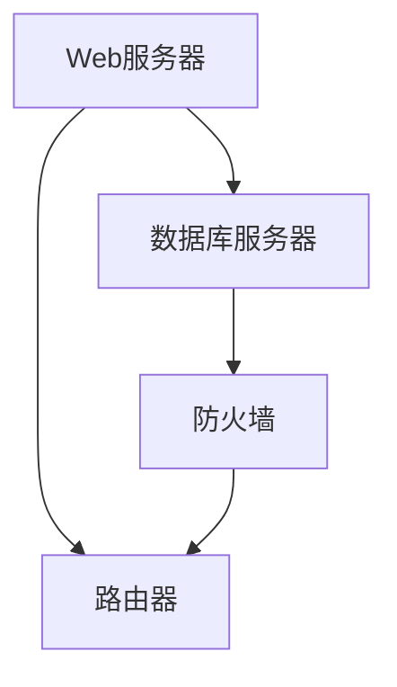
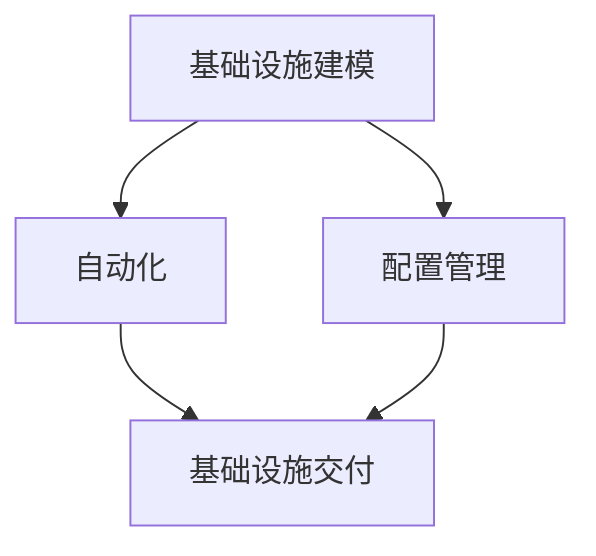
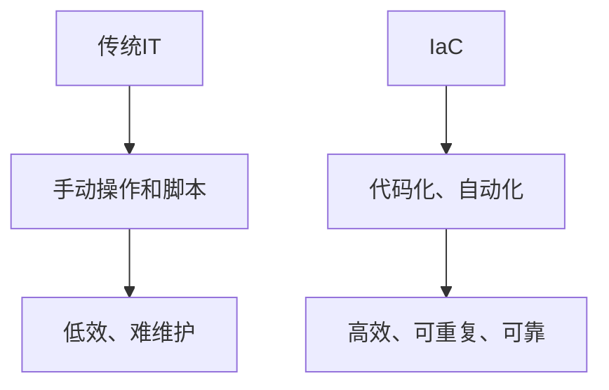
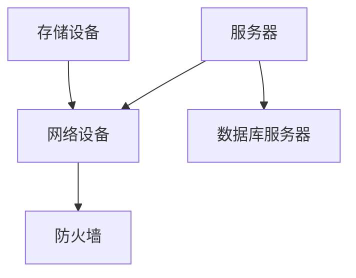
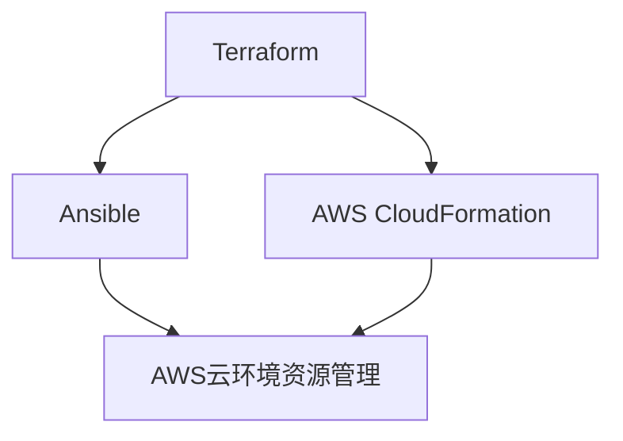

                 


### 引言

Infrastructure as Code (IaC) 是现代IT领域的一项重要技术，它通过将基础设施以代码的形式进行管理和操作，实现了自动化、可重复和可靠的基础设施交付。本文旨在探讨IaC的实战应用，帮助读者深入了解其核心概念、工具、实践案例和未来趋势。

首先，我们需要了解IaC的定义、背景和重要性。基础设施即代码，顾名思义，就是将传统的基础设施（如服务器、网络设备、存储等）通过代码进行定义、部署和管理。这种方式带来了诸多好处，如提高交付效率、减少人为错误、降低维护成本等。接下来，我们将详细讨论IaC的关键概念和原则，为后续内容打下基础。

### IaC的关键概念和原则

IaC的核心在于基础设施建模、自动化和配置管理。首先，基础设施建模是将基础设施的各个组成部分抽象成代码中的实体，通过这些实体之间的关系来表示整个基础设施的结构。这种方式使得基础设施的管理更加直观和可操作。

其次，自动化是IaC的核心价值之一。通过编写脚本或使用工具，我们可以自动化地执行各种操作，如创建虚拟机、配置网络、部署应用程序等。这不仅提高了效率，还减少了人为干预的可能性，降低了出错的风险。

最后，配置管理是确保基础设施在不同环境之间保持一致性的重要手段。通过版本控制和配置管理工具，我们可以轻松地管理和更新基础设施的配置，确保其符合预期。

### IaC的主要工具

在IaC实践中，有许多工具可供选择。本文将重点介绍 Terraform、Ansible 和 AWS CloudFormation 这三种广泛使用的工具。

#### Terraform

Terraform 是一款开源的IaC工具，由 HashiCorp 开发。它支持多种云平台，如 AWS、Azure 和 GCP 等，通过简单的配置文件（HCL/Human-Readable Configuration Language）即可定义和管理基础设施。

**Terraform 的主要组件：**

- **Terraform CLI（命令行界面）：** 用于与 Terraform 进行交互。
- **Terraform Cloud：** HashiCorp 提供的在线服务，用于团队协作和基础设施管理。
- **Terraform Cloud Workspaces：** 用于存储和版本控制 Terraform 配置。

**Terraform 的核心概念：**

- **模块（Modules）：** 用于封装和管理一组相关资源。
- **基础设施即代码（Infrastructure as Code）：** 通过配置文件定义基础设施。

#### Ansible

Ansible 是一款开源的自动化工具，由 Michael DeHaan 创建。它通过简单的 YAML 文件来定义配置和自动化任务，适用于各种操作系统和应用程序。

**Ansible 的主要组件：**

- **Ansible Playbooks：** 定义自动化流程的配置文件。
- **Ansible Modules：** 用于执行特定任务的模块。
- **Ansible Host Inventory：** 存储和管理主机信息的文件。

**Ansible 的核心概念：**

- **Playbooks：** 用于定义自动化任务的工作流。
- **Inventory：** 用于定义主机和组。

#### AWS CloudFormation

AWS CloudFormation 是 AWS 提供的一款完全托管的 IaC 服务，允许您使用模板来定义和部署 AWS 资源。

**AWS CloudFormation 的主要组件：**

- **模板（Templates）：** 用于定义 AWS 资源的 JSON 或 YAML 文件。
- **资源（Resources）：** 在模板中定义的 AWS 资源类型。
- **堆栈（Stacks）：** 实际部署的 AWS 资源。

**AWS CloudFormation 的核心概念：**

- **模板：** 用于定义资源的 JSON 或 YAML 文件。
- **堆栈：** 模板的实例，表示实际部署的资源。

### IaC的实践案例

IaC的应用场景非常广泛，下面我们将探讨几个实际案例，以展示其强大的功能。

#### 云服务部署

使用 IaC 工具，如 Terraform，可以轻松地部署和管理云服务。例如，您可以使用 Terraform 创建 AWS S3 存储桶、EC2 实例和 RDS 数据库，并将它们组合成一个完整的云基础设施。

#### 虚拟机管理

Ansible 是管理虚拟机的理想选择。您可以使用 Ansible Playbooks 自动化虚拟机的创建、配置和部署。例如，您可以为虚拟机安装操作系统、配置网络和安装应用程序。

#### 网络配置自动化

AWS CloudFormation 可以帮助您自动化网络配置。通过定义网络组件的模板，您可以轻松地创建子网、安全组和路由表，并确保它们在整个环境中保持一致。

### IaC的案例研究

下面我们将分析几个 IaC 的案例研究，了解其最佳实践和教训。

#### 案例1：某电商公司使用 Terraform 管理其云基础设施

该电商公司使用 Terraform 来管理其云基础设施，实现了基础设施的自动化部署和管理。通过使用 Terraform，他们能够快速响应业务需求，确保基础设施的可靠性和可扩展性。

**最佳实践：**

- 使用模块化设计，将基础设施分成多个可复用的模块。
- 定期进行代码审查和测试，确保配置文件的正确性和稳定性。

**教训：**

- 初次部署时，要充分考虑配置文件的复杂度和错误处理。
- 需要投入足够的时间来学习和熟悉 Terraform 的用法。

#### 案例2：某金融机构使用 Ansible 管理虚拟机

该金融机构使用 Ansible 管理其虚拟机，实现了虚拟机的自动化部署和配置。通过使用 Ansible Playbooks，他们能够快速部署新的虚拟机，并确保它们按照预设的配置运行。

**最佳实践：**

- 设计简洁的 Playbooks，减少代码冗余和复杂性。
- 使用 Inventory 文件管理主机，确保主机的配置一致。

**教训：**

- 要确保 Playbooks 的可读性和可维护性，避免过度使用嵌套 Playbooks。
- 定期更新 Ansible 模块，以支持新的操作系统和应用程序。

### 高级IaC应用

随着 IaC 技术的不断发展和成熟，其应用场景也越来越广泛。下面我们将探讨一些高级主题。

#### 多云管理

在多云环境中，使用 IaC 工具可以帮助您统一管理和自动化不同云平台的基础设施。例如，您可以使用 Terraform 在 AWS 和 Azure 之间部署和管理资源，确保环境的一致性。

#### 与CI/CD集成

将 IaC 与 CI/CD（持续集成/持续部署）工具集成，可以实现自动化部署和管理应用程序。例如，您可以使用 Jenkins 或 GitLab CI/CD 工具，结合 Terraform 或 Ansible，实现应用程序的自动化部署。

#### 安全性考虑

在 IaC 实践中，安全性是至关重要的。您需要确保配置文件和代码的安全性，避免泄露敏感信息。此外，还需要定期进行安全审计和漏洞扫描，确保基础设施的安全。

### 结论与未来趋势

IaC 作为一种现代的IT管理方法，已经为企业和组织带来了诸多好处。未来，随着云计算和自动化技术的不断发展，IaC 的应用范围将更加广泛，成为企业数字化转型的关键技术。

**总结：**

- IaC 提供了自动化、可重复和可靠的基础设施交付。
- 了解和掌握 IaC 的核心概念和工具，是成功应用 IaC 的关键。
- 通过实践案例和最佳实践，我们可以更好地掌握 IaC 的应用技巧。
- 未来，IaC 将继续发展和创新，为企业和组织带来更多价值。

**展望：**

- IaC 将与更多的云平台和自动化工具集成，实现更广泛的应用。
- 安全性将成为 IaC 的关键挑战，需要持续关注和改进。
- 随着5G、物联网和人工智能等技术的发展，IaC 的应用场景将更加丰富。

### 附录

为了帮助读者深入了解 IaC，本文提供了一些额外的资源。

#### 资源和参考

- **学习资料：**
  - HashiCorp 的官方文档：[Terraform 文档](https://learn.hashicorp.com/tutorials/terraform/intro)
  - Ansible 的官方文档：[Ansible 文档](https://docs.ansible.com/ansible/)
  - AWS CloudFormation 的官方文档：[AWS CloudFormation 文档](https://docs.aws.amazon.com/AWSCloudFormation/latest/UserGuide/)

- **工具资源：**
  - Terraform：[Terraform 官网](https://www.terraform.io/)
  - Ansible：[Ansible 官网](https://www.ansible.com/)
  - AWS CloudFormation：[AWS CloudFormation 官网](https://aws.amazon.com/cloudformation/)

- **故障排除技巧：**
  - Terraform 的常见错误和解决方案：[Terraform 故障排除](https://learn.hashicorp.com/tutorials/terraform/troubleshooting)
  - Ansible 的常见错误和解决方案：[Ansible 故障排除](https://docs.ansible.com/ansible/intro_tips_tricks.html)
  - AWS CloudFormation 的常见错误和解决方案：[AWS CloudFormation 故障排除](https://docs.aws.amazon.com/AWSCloudFormation/latest/UserGuide/troubleshooting.html)

### 作者信息

作者：AI天才研究院/AI Genius Institute & 禅与计算机程序设计艺术 /Zen And The Art of Computer Programming

----------------------------------------------------------------

以上就是《基础设施即代码(IaC)实战》的全文，希望能够帮助您深入了解基础设施即代码的相关知识，并在实际应用中取得成功。如果您有任何疑问或建议，欢迎在评论区留言。感谢您的阅读！ 

## 基础设施即代码(IaC)实战

> 关键词：基础设施即代码、自动化、云服务、虚拟机管理、配置管理

> 摘要：本文将详细介绍基础设施即代码（Infrastructure as Code，简称IaC）的核心概念、主要工具、实践案例以及未来趋势，帮助读者全面了解和掌握IaC的实战应用。

### 引言

#### 什么是基础设施即代码（IaC）

基础设施即代码（IaC）是一种将基础设施以代码形式进行管理和操作的方法。通过使用脚本或专门的工具，将服务器、网络设备、存储和其他IT资源定义和配置为文本文件，这些文件可以像应用程序代码一样进行版本控制、自动化部署和协作开发。IaC的出现，极大地改变了传统IT基础设施的管理方式，使得基础设施的交付更加高效、可重复和可靠。

#### IaC的优势

- **自动化**：IaC工具可以自动化基础设施的创建、配置和部署过程，减少了人为干预，提高了工作效率。
- **可重复性**：通过代码管理基础设施，可以确保在不同环境（如开发、测试、生产）中保持一致。
- **可追踪性**：代码存储在版本控制系统中，可以方便地追踪变更历史，回滚到之前的状态。
- **易于协作**：团队可以通过代码仓库协同工作，共同管理和维护基础设施。

#### IaC的应用场景

- **云计算**：在云环境中，IaC可以用于自动化部署和管理云服务，如虚拟机、数据库和存储。
- **虚拟化**：在虚拟化环境中，IaC可以用于自动化配置和管理虚拟机。
- **容器化**：在容器化环境中，IaC可以用于自动化部署和管理容器化应用程序。

### IaC的关键概念和原则

#### 基础设施建模

基础设施建模是IaC的核心概念之一。它涉及将基础设施的各个组成部分（如服务器、网络、存储等）抽象为代码中的实体，并通过这些实体之间的关系来表示整个基础设施的结构。基础设施建模的目的是提高基础设施的可操作性和可管理性。

**基础设施建模的核心要素：**

1. **实体**：基础设施中的各种组件，如服务器、网络设备、存储设备等。
2. **关系**：实体之间的关系，如依赖关系、连接关系等。
3. **属性**：实体的属性，如IP地址、端口号、配置参数等。

**示例：**

假设我们要建模一个简单的网络架构，包含一个Web服务器和一个数据库服务器。我们可以用以下方式表示：



#### 自动化

自动化是IaC的核心价值之一。通过编写脚本或使用专门的IaC工具，可以自动化地执行各种基础设施操作，如创建虚拟机、配置网络、部署应用程序等。自动化不仅可以提高工作效率，还可以减少人为错误，确保基础设施的稳定运行。

**自动化工具的分类：**

1. **脚本语言**：如Bash、Python、Ruby等。
2. **专门的IaC工具**：如Terraform、Ansible、AWS CloudFormation等。

**自动化流程的核心要素：**

1. **任务定义**：定义要执行的任务，如创建虚拟机、配置网络等。
2. **依赖关系**：确定任务之间的依赖关系，确保任务按正确的顺序执行。
3. **错误处理**：定义错误处理策略，确保在出现问题时能够及时通知和处理。

#### 配置管理

配置管理是确保基础设施在不同环境之间保持一致性的关键。通过版本控制和配置管理工具，可以轻松地管理和更新基础设施的配置，确保其符合预期。

**配置管理的核心要素：**

1. **版本控制**：使用版本控制系统（如Git）记录配置文件的变更历史，便于追踪和管理。
2. **配置文件**：定义基础设施的配置参数，如IP地址、端口、用户名、密码等。
3. **配置管理工具**：如Ansible、Puppet、Chef等，用于自动化地管理和更新配置文件。

### IaC的主要工具

在IaC实践中，有许多工具可供选择。本文将重点介绍 Terraform、Ansible 和 AWS CloudFormation 这三种广泛使用的工具。

#### Terraform

**Terraform 是一款开源的IaC工具，由 HashiCorp 开发。它支持多种云平台，如 AWS、Azure 和 GCP 等，通过简单的配置文件（HCL/Human-Readable Configuration Language）即可定义和管理基础设施。**

**Terraform 的主要组件：**

- **Terraform CLI（命令行界面）：** 用于与 Terraform 进行交互。
- **Terraform Cloud：** HashiCorp 提供的在线服务，用于团队协作和基础设施管理。
- **Terraform Cloud Workspaces：** 用于存储和版本控制 Terraform 配置。

**Terraform 的核心概念：**

- **模块（Modules）：** 用于封装和管理一组相关资源。
- **基础设施即代码（Infrastructure as Code）：** 通过配置文件定义基础设施。

**Terraform 的应用场景：**

- **云服务部署**：使用 Terraform 可以轻松地创建和管理 AWS、Azure、GCP 等云服务。
- **虚拟机管理**：通过 Terraform，可以自动化地创建和管理虚拟机。
- **配置管理**：使用 Terraform，可以定义和管理虚拟机的配置。

#### Ansible

**Ansible 是一款开源的自动化工具，由 Michael DeHaan 创建。它通过简单的 YAML 文件来定义配置和自动化任务，适用于各种操作系统和应用程序。**

**Ansible 的主要组件：**

- **Ansible Playbooks：** 定义自动化流程的配置文件。
- **Ansible Modules：** 用于执行特定任务的模块。
- **Ansible Host Inventory：** 存储和管理主机信息的文件。

**Ansible 的核心概念：**

- **Playbooks：** 用于定义自动化任务的工作流。
- **Inventory：** 用于定义主机和组。

**Ansible 的应用场景：**

- **虚拟机管理**：通过 Ansible Playbooks，可以自动化地创建、配置和管理虚拟机。
- **操作系统安装**：使用 Ansible，可以自动化地安装和配置操作系统。
- **应用程序部署**：通过 Ansible，可以自动化地部署和管理应用程序。

#### AWS CloudFormation

**AWS CloudFormation 是 AWS 提供的一款完全托管的 IaC 服务，允许您使用模板来定义和部署 AWS 资源。**

**AWS CloudFormation 的主要组件：**

- **模板（Templates）：** 用于定义 AWS 资源的 JSON 或 YAML 文件。
- **资源（Resources）：** 在模板中定义的 AWS 资源类型。
- **堆栈（Stacks）：** 模板的实例，表示实际部署的资源。

**AWS CloudFormation 的核心概念：**

- **模板：** 用于定义资源的 JSON 或 YAML 文件。
- **堆栈：** 模板的实例，表示实际部署的资源。

**AWS CloudFormation 的应用场景：**

- **自动化部署**：使用 AWS CloudFormation，可以自动化地部署和管理 AWS 资源。
- **资源管理**：通过 AWS CloudFormation，可以方便地管理和更新 AWS 资源。

### IaC的实践案例

#### 案例1：使用 Terraform 自动化部署 AWS S3 和 EC2

在本案例中，我们将使用 Terraform 来自动化部署 AWS S3 存储桶和 EC2 实例。

**步骤1：安装 Terraform**

在本地计算机上安装 Terraform。可以参考 [Terraform 官方文档](https://learn.hashicorp.com/tutorials/terraform/installing-terraform)。

**步骤2：创建 Terraform 配置文件**

创建一个名为 `main.tf` 的配置文件，用于定义 AWS S3 存储桶和 EC2 实例。

```terraform
provider "aws" {
  region = "us-west-2"
}

resource "aws_s3_bucket" "example" {
  bucket = "example-bucket"
}

resource "aws_instance" "example" {
  ami           = "ami-0c948552a0c856459"
  instance_type = "t2.micro"
  user_data     = file("example.sh")
}
```

**步骤3：初始化 Terraform**

在命令行中运行以下命令，初始化 Terraform：

```bash
terraform init
```

**步骤4：应用变更**

在命令行中运行以下命令，应用配置文件中的变更：

```bash
terraform apply
```

Terraform 会提示您确认变更，然后开始部署 AWS S3 存储桶和 EC2 实例。

**步骤5：查看部署结果**

部署完成后，您可以使用 AWS 管理控制台查看 S3 存储桶和 EC2 实例。

#### 案例2：使用 Ansible 自动化部署 Web 应用程序

在本案例中，我们将使用 Ansible 来自动化部署一个简单的 Web 应用程序。

**步骤1：安装 Ansible**

在本地计算机上安装 Ansible。可以参考 [Ansible 官方文档](https://docs.ansible.com/ansible/intro_gettingstarted.html)。

**步骤2：创建 Ansible 配置文件**

创建一个名为 `example.yml` 的 Ansible Playbook，用于部署 Web 应用程序。

```yaml
---
- hosts: all
  become: yes
  tasks:
    - name: 安装 Nginx
      apt: name=nginx state=present

    - name: 部署 Web 应用程序
      copy: src=example.html dest=/var/www/html/index.html mode=0644

    - name: 启动 Nginx
      service: name=nginx state=started
```

**步骤3：运行 Ansible Playbook**

在命令行中运行以下命令，执行 Ansible Playbook：

```bash
ansible-playbook example.yml
```

Ansible 会连接到远程主机，安装 Nginx、部署 Web 应用程序并启动 Nginx 服务。

**步骤4：访问 Web 应用程序**

部署完成后，您可以在浏览器中访问 Web 应用程序。

### IaC的案例研究

#### 案例1：大型电商公司使用 IaC 管理云基础设施

某大型电商公司使用 Terraform 来管理其云基础设施。他们通过模块化设计，将基础设施拆分为多个模块，如计算、存储、网络等。每个模块都由一组相关的资源组成，如虚拟机、存储桶、安全组等。通过这种方式，他们能够快速响应业务需求，确保基础设施的可靠性和可扩展性。

**最佳实践：**

- 使用模块化设计，将基础设施拆分为多个模块。
- 定期进行代码审查和测试，确保配置文件的正确性和稳定性。

**教训：**

- 初次部署时，要充分考虑配置文件的复杂度和错误处理。
- 需要投入足够的时间来学习和熟悉 Terraform 的用法。

#### 案例2：初创公司使用 IaC 实现自动化部署

某初创公司使用 Ansible 来实现自动化部署。他们使用 Ansible Playbooks 自动化地部署和管理其应用程序。通过 Ansible，他们能够快速部署新的应用程序，并确保它们在不同的环境中保持一致。

**最佳实践：**

- 设计简洁的 Playbooks，减少代码冗余和复杂性。
- 使用 Inventory 文件管理主机，确保主机的配置一致。

**教训：**

- 要确保 Playbooks 的可读性和可维护性，避免过度使用嵌套 Playbooks。
- 定期更新 Ansible 模块，以支持新的操作系统和应用程序。

### 高级 IaC 应用

随着 IaC 技术的不断发展和成熟，其应用场景也越来越广泛。下面我们将探讨一些高级主题。

#### 多云管理

在多云环境中，使用 IaC 工具可以帮助您统一管理和自动化不同云平台的基础设施。例如，您可以使用 Terraform 在 AWS 和 Azure 之间部署和管理资源，确保环境的一致性。

**案例：** 某跨国公司使用 Terraform 在 AWS、Azure 和 Google Cloud Platform 之间部署和管理应用程序。通过 Terraform，他们能够实现跨云的资源管理和自动化部署。

#### 与 CI/CD 集成

将 IaC 与 CI/CD（持续集成/持续部署）工具集成，可以实现自动化部署和管理应用程序。例如，您可以使用 Jenkins 或 GitLab CI/CD 工具，结合 Terraform 或 Ansible，实现应用程序的自动化部署。

**案例：** 某互联网公司使用 Jenkins 和 Terraform 结合，实现应用程序的自动化部署。每当应用程序代码更新时，Jenkins 会触发 Terraform，自动部署应用程序到 AWS 云环境。

#### 安全性考虑

在 IaC 实践中，安全性是至关重要的。您需要确保配置文件和代码的安全性，避免泄露敏感信息。此外，还需要定期进行安全审计和漏洞扫描，确保基础设施的安全。

**最佳实践：**

- 对配置文件和代码进行加密，确保其安全性。
- 定期进行安全审计和漏洞扫描，及时修复安全问题。
- 实施严格的权限管理，确保只有授权人员可以访问和管理基础设施。

### 结论

基础设施即代码（IaC）是一种现代化的IT管理方法，通过将基础设施以代码形式进行管理和操作，实现了自动化、可重复和可靠的基础设施交付。本文介绍了 IaC 的核心概念、主要工具、实践案例和未来趋势，帮助读者全面了解和掌握 IaC 的实战应用。

**总结：**

- IaC 提供了自动化、可重复和可靠的基础设施交付。
- 了解和掌握 IaC 的核心概念和工具，是成功应用 IaC 的关键。
- 通过实践案例和最佳实践，我们可以更好地掌握 IaC 的应用技巧。
- 未来，IaC 将继续发展和创新，为企业和组织带来更多价值。

### 附录

为了帮助读者深入了解 IaC，本文提供了一些额外的资源。

#### 资源和参考

- **学习资料：**
  - HashiCorp 的官方文档：[Terraform 文档](https://learn.hashicorp.com/tutorials/terraform/intro)
  - Ansible 的官方文档：[Ansible 文档](https://docs.ansible.com/ansible/)
  - AWS CloudFormation 的官方文档：[AWS CloudFormation 文档](https://docs.aws.amazon.com/AWSCloudFormation/latest/UserGuide/)

- **工具资源：**
  - Terraform：[Terraform 官网](https://www.terraform.io/)
  - Ansible：[Ansible 官网](https://www.ansible.com/)
  - AWS CloudFormation：[AWS CloudFormation 官网](https://aws.amazon.com/cloudformation/)

- **故障排除技巧：**
  - Terraform 的常见错误和解决方案：[Terraform 故障排除](https://learn.hashicorp.com/tutorials/terraform/troubleshooting)
  - Ansible 的常见错误和解决方案：[Ansible 故障排除](https://docs.ansible.com/ansible/intro_tips_tricks.html)
  - AWS CloudFormation 的常见错误和解决方案：[AWS CloudFormation 故障排除](https://docs.aws.amazon.com/AWSCloudFormation/latest/UserGuide/troubleshooting.html)

### 作者信息

作者：AI天才研究院/AI Genius Institute & 禅与计算机程序设计艺术 /Zen And The Art of Computer Programming

通过本文的阅读，相信您对基础设施即代码（IaC）有了更深入的了解。希望本文能够帮助您在 IaC 的道路上取得更好的成果。如果您有任何疑问或建议，欢迎在评论区留言。感谢您的阅读！ 

### 第一部分：引言

#### 基础设施即代码概述

基础设施即代码（Infrastructure as Code，简称IaC）是一种通过代码来定义、部署和管理IT基础设施的方法。它起源于软件开发领域，随着时间的推移，逐渐扩展到IT基础设施的管理。IaC的核心思想是将基础设施的配置和部署过程抽象为可编程的代码，从而实现自动化、可重复和可靠的基础设施管理。

#### IaC的定义与背景

IaC最早可以追溯到20世纪90年代，当时软件开发者开始使用配置管理工具（如Puppet和Chef）来自动化软件的安装和配置过程。这些工具允许开发者通过编写脚本或配置文件来定义软件的安装过程，从而实现跨环境的一致性。随着云计算的兴起，IaC的概念进一步发展，成为现代IT基础设施管理的重要方法。

IaC的定义可以从以下几个方面来理解：

- **基础设施的代码化**：将传统的基础设施（如服务器、网络设备、存储等）以代码的形式进行定义和管理。
- **自动化**：通过脚本或工具自动执行基础设施的创建、配置和部署过程。
- **可重复性**：通过代码管理基础设施，确保在不同环境（如开发、测试、生产）中保持一致。
- **版本控制**：使用版本控制系统（如Git）对基础设施代码进行版本控制，便于追踪变更和回滚。

#### IaC的核心概念

- **基础设施建模**：将基础设施的各个组成部分抽象为代码中的实体，并通过这些实体之间的关系来表示整个基础设施的结构。
- **配置管理**：通过配置文件定义和管理基础设施的配置参数，确保基础设施在不同环境中保持一致。
- **基础设施即代码**：通过配置文件定义基础设施，实现基础设施的自动化部署和管理。

#### IaC的优势

- **提高交付效率**：通过自动化部署，可以显著减少基础设施的创建和配置时间。
- **减少人为错误**：自动化减少了人为干预，降低了配置错误的风险。
- **降低维护成本**：通过代码管理基础设施，可以方便地进行变更和升级，降低维护成本。
- **提高可重复性和一致性**：通过版本控制和配置管理，确保基础设施在不同环境中的一致性。

#### IaC的应用场景

- **云计算**：在云环境中，IaC可以用于自动化部署和管理云服务，如虚拟机、数据库和存储。
- **虚拟化**：在虚拟化环境中，IaC可以用于自动化配置和管理虚拟机。
- **容器化**：在容器化环境中，IaC可以用于自动化部署和管理容器化应用程序。

#### IaC的挑战与未来趋势

尽管IaC带来了诸多好处，但在实际应用中仍面临一些挑战：

- **学习曲线**：对于习惯了传统基础设施管理的IT专业人员来说，学习IaC可能需要一定的时间和精力。
- **复杂性**：随着基础设施的复杂度增加，IaC的配置和管理也变得更加复杂。
- **安全性**：IaC的配置文件和代码可能包含敏感信息，需要确保其安全性。

未来，IaC将继续发展，并与更多的新技术（如容器化、自动化运维等）相结合，为企业和组织带来更多价值。随着云计算和自动化技术的不断发展，IaC的应用场景将更加广泛，成为企业数字化转型的重要组成部分。

### 第二部分：核心概念和原则

#### 基础设施建模

基础设施建模是IaC的核心概念之一。它涉及将基础设施的各个组成部分（如服务器、网络设备、存储设备等）抽象为代码中的实体，并通过这些实体之间的关系来表示整个基础设施的结构。基础设施建模的目的是提高基础设施的可操作性和可管理性。

**基础设施建模的核心要素：**

1. **实体**：基础设施中的各种组件，如服务器、网络设备、存储设备等。
2. **关系**：实体之间的关系，如依赖关系、连接关系等。
3. **属性**：实体的属性，如IP地址、端口号、配置参数等。

**基础设施建模的过程：**

1. **识别实体**：首先，需要识别基础设施中的各个组件，并将其抽象为代码中的实体。
2. **定义关系**：接着，需要定义实体之间的关系，如依赖关系、连接关系等。
3. **定义属性**：最后，需要为每个实体定义其属性，如IP地址、端口号、配置参数等。

**基础设施建模的示例：**

假设我们要建模一个简单的网络架构，包含一个Web服务器和一个数据库服务器。我们可以用以下方式表示：


在这个示例中，Web服务器、数据库服务器、防火墙和路由器都是基础设施的实体，它们之间通过连接关系相互关联。

#### 自动化

自动化是IaC的核心价值之一。通过编写脚本或使用专门的IaC工具，可以自动化地执行各种基础设施操作，如创建虚拟机、配置网络、部署应用程序等。自动化不仅可以提高工作效率，还可以减少人为错误，确保基础设施的稳定运行。

**自动化的核心要素：**

1. **任务定义**：首先，需要定义要执行的任务，如创建虚拟机、配置网络等。
2. **依赖关系**：确定任务之间的依赖关系，确保任务按正确的顺序执行。
3. **错误处理**：定义错误处理策略，确保在出现问题时能够及时通知和处理。

**自动化的过程：**

1. **需求分析**：分析基础设施管理的需求，确定需要自动化的任务。
2. **工具选择**：根据需求选择合适的IaC工具，如Terraform、Ansible等。
3. **编写脚本或配置文件**：使用所选工具的语法和结构，编写脚本或配置文件。
4. **测试和验证**：在实际环境中测试脚本或配置文件，确保其正确性和可靠性。
5. **部署和监控**：部署脚本或配置文件到生产环境，并持续监控其运行状态。

**自动化的示例：**

假设我们要使用Ansible自动化部署一个Web应用程序。首先，我们需要定义任务，如安装Web服务器、配置防火墙规则等。然后，我们编写Ansible Playbook，如下所示：

```yaml
---
- hosts: web_servers
  become: yes
  tasks:
    - name: 安装 Nginx
      apt: name=nginx state=present

    - name: 配置防火墙
      firewalld:
        service: http
        permanent: yes
        zone: public
        port: 80/tcp
        protocol: tcp
        action: allow
```

在这个示例中，我们定义了两个任务：安装Nginx和配置防火墙规则。Ansible会根据定义的依赖关系，按正确的顺序执行这些任务。

#### 配置管理

配置管理是确保基础设施在不同环境之间保持一致性的关键。通过版本控制和配置管理工具，可以轻松地管理和更新基础设施的配置，确保其符合预期。

**配置管理的核心要素：**

1. **版本控制**：使用版本控制系统（如Git）记录配置文件的变更历史，便于追踪和管理。
2. **配置文件**：定义基础设施的配置参数，如IP地址、端口、用户名、密码等。
3. **配置管理工具**：如Ansible、Puppet、Chef等，用于自动化地管理和更新配置文件。

**配置管理的示例：**

假设我们要使用Ansible管理Web服务器的配置。我们首先定义配置文件，如下所示：

```yaml
---
- hosts: web_servers
  become: yes
  vars:
    server_name: example.com
    server_ip: 192.168.1.100
    server_port: 80
  tasks:
    - name: 配置 Nginx 主机名
      template:
        src: nginx.conf.j2
        dest: /etc/nginx/nginx.conf
      notify:
        - 重启 Nginx
```

在这个示例中，我们定义了三个变量：server_name、server_ip 和 server_port。然后，我们使用模板文件 `nginx.conf.j2` 来配置 Nginx 的主机名，并通过 `notify` 关键字来通知重启 Nginx 服务。

通过配置管理工具，我们可以方便地管理和更新配置文件，确保 Web 服务器的配置在不同环境中保持一致。

#### 基础设施建模、自动化和配置管理的关系

基础设施建模、自动化和配置管理是IaC的核心概念，它们相互关联，共同构成了IaC的完整体系。

- **基础设施建模** 为自动化提供了基础，通过将基础设施抽象为代码中的实体，实现了基础设施的可编程化。
- **自动化** 利用基础设施建模的结果，通过脚本或配置文件自动化地执行基础设施操作，提高了工作效率和可靠性。
- **配置管理** 确保了基础设施在不同环境之间保持一致性，通过版本控制和配置管理工具，实现了配置的自动化管理和更新。

**关系图：**



在这个关系图中，基础设施建模、自动化和配置管理共同作用于基础设施交付，实现了IaC的核心目标。

### 第三部分：工具和技术

#### Terraform

**Terraform 是一款开源的IaC工具，由 HashiCorp 开发。它支持多种云平台，如 AWS、Azure 和 GCP 等，通过简单的配置文件（HCL/Human-Readable Configuration Language）即可定义和管理基础设施。**

**Terraform 的主要组件：**

- **Terraform CLI（命令行界面）：** 用于与 Terraform 进行交互。
- **Terraform Cloud：** HashiCorp 提供的在线服务，用于团队协作和基础设施管理。
- **Terraform Cloud Workspaces：** 用于存储和版本控制 Terraform 配置。

**Terraform 的核心概念：**

- **模块（Modules）：** 用于封装和管理一组相关资源。
- **基础设施即代码（Infrastructure as Code）：** 通过配置文件定义基础设施。

**Terraform 的优点：**

- **支持多种云平台**：Terraform 支持多种主流云平台，如 AWS、Azure、GCP 等，方便用户跨云管理基础设施。
- **简单易用**：Terraform 使用 HCL 语言，语法简单，易于理解和学习。
- **模块化设计**：通过模块化设计，可以方便地复用和管理基础设施配置。

**Terraform 的使用场景：**

- **云服务部署**：使用 Terraform 可以轻松地创建和管理云服务，如虚拟机、数据库和存储。
- **虚拟机管理**：通过 Terraform，可以自动化地创建和管理虚拟机。
- **配置管理**：使用 Terraform，可以定义和管理虚拟机的配置。

**Terraform 的基本操作：**

1. **安装 Terraform**：在 [Terraform 官网](https://www.terraform.io/downloads) 下载并安装 Terraform。
2. **创建配置文件**：编写 Terraform 配置文件，定义所需的基础设施。
3. **初始化 Terraform**：在项目目录中运行 `terraform init` 命令，初始化 Terraform。
4. **应用变更**：运行 `terraform apply` 命令，应用配置文件中的变更。
5. **销毁资源**：运行 `terraform destroy` 命令，销毁已部署的资源。

**示例：**

假设我们要使用 Terraform 创建一个 AWS EC2 实例，配置文件 `main.tf` 如下：

```terraform
provider "aws" {
  region = "us-west-2"
}

resource "aws_instance" "example" {
  ami           = "ami-0c948552a0c856459"
  instance_type = "t2.micro"
  user_data     = file("example.sh")
}
```

在这个示例中，我们定义了一个 AWS EC2 实例，并为其分配了一个用户数据脚本 `example.sh`。

#### Ansible

**Ansible 是一款开源的自动化工具，由 Michael DeHaan 创建。它通过简单的 YAML 文件来定义配置和自动化任务，适用于各种操作系统和应用程序。**

**Ansible 的主要组件：**

- **Ansible Playbooks：** 定义自动化流程的配置文件。
- **Ansible Modules：** 用于执行特定任务的模块。
- **Ansible Host Inventory：** 存储和管理主机信息的文件。

**Ansible 的核心概念：**

- **Playbooks：** 用于定义自动化任务的工作流。
- **Inventory：** 用于定义主机和组。

**Ansible 的优点：**

- **简单易用**：Ansible 使用简单的 YAML 语言，易于学习和使用。
- **无代理架构**：Ansible 不需要安装代理软件，可以通过 SSH 连接到远程主机执行任务。
- **模块化设计**：Ansible 模块可以轻松扩展，方便自定义和复用。

**Ansible 的使用场景：**

- **操作系统安装**：使用 Ansible 可以自动化地安装和配置操作系统。
- **虚拟机管理**：通过 Ansible，可以自动化地创建、配置和管理虚拟机。
- **应用程序部署**：通过 Ansible，可以自动化地部署和管理应用程序。

**Ansible 的基本操作：**

1. **安装 Ansible**：在 [Ansible 官网](https://www.ansible.com/) 下载并安装 Ansible。
2. **创建 Inventory 文件**：定义主机和组，如 `hosts` 和 `group_vars`。
3. **编写 Playbook**：定义自动化任务，如安装软件、配置网络等。
4. **运行 Playbook**：执行自动化任务，如 `ansible-playbook <playbook_name.yml>`。

**示例：**

假设我们要使用 Ansible 安装 Nginx，配置文件 `install_nginx.yml` 如下：

```yaml
---
- hosts: web_servers
  become: yes
  tasks:
    - name: 安装 Nginx
      apt: name=nginx state=present
```

在这个示例中，我们定义了一个名为 `web_servers` 的主机组，并安装了 Nginx。

#### AWS CloudFormation

**AWS CloudFormation 是 AWS 提供的一款完全托管的 IaC 服务，允许您使用模板来定义和部署 AWS 资源。**

**AWS CloudFormation 的主要组件：**

- **模板（Templates）：** 用于定义 AWS 资源的 JSON 或 YAML 文件。
- **资源（Resources）：** 在模板中定义的 AWS 资源类型。
- **堆栈（Stacks）：** 模板的实例，表示实际部署的资源。

**AWS CloudFormation 的优点：**

- **完全托管**：AWS CloudFormation 是完全托管的，无需自行管理基础设施。
- **支持多种资源类型**：AWS CloudFormation 支持多种 AWS 资源类型，如虚拟机、数据库、存储等。
- **版本控制**：通过 AWS CloudFormation，可以轻松管理模板的版本和变更。

**AWS CloudFormation 的使用场景：**

- **自动化部署**：使用 AWS CloudFormation，可以自动化地部署和管理 AWS 资源。
- **资源管理**：通过 AWS CloudFormation，可以方便地管理和更新 AWS 资源。

**AWS CloudFormation 的基本操作：**

1. **创建模板**：使用 JSON 或 YAML 语言创建 AWS CloudFormation 模板。
2. **创建堆栈**：使用 AWS Management Console、AWS CLI 或 AWS SDK 创建堆栈。
3. **部署资源**：运行 `aws cloudformation create-stack` 命令，部署资源。
4. **更新资源**：运行 `aws cloudformation update-stack` 命令，更新资源。
5. **删除资源**：运行 `aws cloudformation delete-stack` 命令，删除资源。

**示例：**

假设我们要使用 AWS CloudFormation 创建一个 EC2 实例，模板文件 `template.yaml` 如下：

```yaml
AWSTemplateFormatVersion: '2010-09-09'
Resources:
  EC2Instance:
    Type: 'AWS::EC2::Instance'
    Properties:
      ImageId: 'ami-0c948552a0c856459'
      InstanceType: 't2.micro'
```

在这个示例中，我们定义了一个 EC2 实例，并设置了其镜像 ID 和实例类型。

#### 其他 IaC 工具

除了 Terraform、Ansible 和 AWS CloudFormation，还有许多其他 IaC 工具可供选择，如：

- **Puppet**：一款开源的配置管理工具，适用于大规模基础设施管理。
- **Chef**：一款开源的自动化平台，通过代码定义和管理基础设施。
- **Bash**：一种脚本语言，可以用于自动化简单的基础设施操作。
- **Python**：一种通用编程语言，可以用于编写复杂的自动化脚本。

这些工具各有特点和优势，用户可以根据实际需求选择合适的工具。

### 第四部分：实践案例

#### 云服务部署

在本案例中，我们将使用 Terraform 在 AWS 上部署云服务，包括虚拟机、数据库和存储。

**步骤1：安装 Terraform**

在本地计算机上安装 Terraform。可以参考 [Terraform 官方文档](https://learn.hashicorp.com/tutorials/terraform/installing-terraform)。

**步骤2：创建 Terraform 配置文件**

创建一个名为 `main.tf` 的配置文件，用于定义 AWS 资源。

```terraform
provider "aws" {
  region = "us-west-2"
}

resource "aws_instance" "example" {
  ami           = "ami-0c948552a0c856459"
  instance_type = "t2.micro"
  user_data     = file("example.sh")
}

resource "aws_rds_instance" "example" {
  instance_identifier             = "example"
  instance_class                  = "db.t2.micro"
  engine                           = "mysql"
  engine_version                   = "5.7.25"
  allocated_storage                = 20
  db_subnet_group_name            = aws_db_subnet_group.example.id
  parameter_group_name            = "default.mysql5.7"
  backup_retention_period          = 5
  preferred_backup_window          = "07:00-09:00"
  preferredMaintenanceWindow       = "sun:05:00-sun:09:00"
  iam_role_arn                    = "arn:aws:iam::123456789012:role/DBAdmin"
  username                         = "admin"
  password                         = "mysecurepassword"
}

resource "aws_s3_bucket" "example" {
  bucket = "example-bucket"
}
```

**步骤3：初始化 Terraform**

在命令行中运行以下命令，初始化 Terraform：

```bash
terraform init
```

**步骤4：应用变更**

在命令行中运行以下命令，应用配置文件中的变更：

```bash
terraform apply
```

Terraform 会提示您确认变更，然后开始部署 AWS 资源。

**步骤5：验证部署**

部署完成后，您可以使用 AWS 管理控制台验证虚拟机、数据库和存储桶的部署情况。

#### 虚拟机管理

在本案例中，我们将使用 Ansible 管理虚拟机，包括安装操作系统、配置网络和部署应用程序。

**步骤1：安装 Ansible**

在本地计算机上安装 Ansible。可以参考 [Ansible 官方文档](https://docs.ansible.com/ansible/intro_gettingstarted.html)。

**步骤2：创建 Inventory 文件**

创建一个名为 `hosts` 的 Inventory 文件，用于定义虚拟机主机。

```bash
[web_servers]
192.168.1.100
```

**步骤3：创建 Playbook**

创建一个名为 `deploy_ubuntu.yml` 的 Ansible Playbook，用于安装操作系统、配置网络和部署应用程序。

```yaml
---
- hosts: web_servers
  become: yes
  tasks:
    - name: 安装 Ubuntu
      apt: name=ubuntu state=present

    - name: 配置网络
      netconf:
        device: eth0
        ip_address: 192.168.1.100
        netmask: 255.255.255.0
        gateway: 192.168.1.1

    - name: 部署 Nginx
      apt: name=nginx state=present
      copy: src=nginx.conf dest=/etc/nginx/nginx.conf mode=0644
      service: name=nginx state=started
```

**步骤4：运行 Playbook**

在命令行中运行以下命令，执行 Ansible Playbook：

```bash
ansible-playbook deploy_ubuntu.yml
```

Ansible 会连接到虚拟机，安装 Ubuntu、配置网络并部署 Nginx。

**步骤5：验证部署**

部署完成后，您可以在浏览器中访问虚拟机，查看 Nginx 的默认页面。

#### 网络配置自动化

在本案例中，我们将使用 AWS CloudFormation 自动化网络配置，包括创建子网、安全组和路由表。

**步骤1：创建模板**

创建一个名为 `network.yaml` 的 AWS CloudFormation 模板文件，用于定义网络资源。

```yaml
AWSTemplateFormatVersion: '2010-09-09'
Resources:
  VPC:
    Type: 'AWS::EC2::VPC'
    Properties:
      CidrBlock: '10.0.0.0/16'
      EnableDnsSupport: true
      EnableDnsHostnames: true

  Subnet:
    Type: 'AWS::EC2::Subnet'
    Properties:
      CidrBlock: '10.0.0.0/24'
      VpcId: !Ref VPC
      MapPublicIpOnLaunch: false

  SecurityGroup:
    Type: 'AWS::EC2::SecurityGroup'
    Properties:
      GroupName: 'example'
      GroupDescription: 'Example Security Group'
      VpcId: !Ref VPC
      SecurityGroupIngress:
        - IpProtocol: 'tcp'
          FromPort: 80
          ToPort: 80
          CidrIp: '0.0.0.0/0'

  RouteTable:
    Type: 'AWS::EC2::RouteTable'
    Properties:
      VpcId: !Ref VPC
      Routes:
        - DestinationCidrBlock: '0.0.0.0/0'
          GatewayId: !Ref InternetGateway
```

**步骤2：创建堆栈**

使用 AWS Management Console、AWS CLI 或 AWS SDK 创建堆栈，并选择 `network.yaml` 作为模板文件。

**步骤3：部署网络**

运行 `aws cloudformation create-stack` 命令，部署网络资源。

```bash
aws cloudformation create-stack --stack-name example-network --template-body file://network.yaml
```

**步骤4：验证部署**

部署完成后，您可以在 AWS Management Console 中验证网络资源的部署情况。

### 第五部分：案例研究

在本部分，我们将分析两个实际案例，探讨 IaC 的最佳实践和教训。

#### 案例1：某电商公司使用 Terraform 管理云基础设施

某电商公司使用 Terraform 来管理其云基础设施，实现了基础设施的自动化部署和管理。通过使用 Terraform，他们能够快速响应业务需求，确保基础设施的可靠性和可扩展性。

**最佳实践：**

- **模块化设计**：将基础设施拆分为多个模块，如计算、存储、网络等。每个模块都由一组相关的资源组成，如虚拟机、存储桶、安全组等。
- **版本控制**：使用 Git 对 Terraform 配置文件进行版本控制，记录变更历史，便于追踪和管理。
- **代码审查**：定期进行代码审查，确保配置文件的正确性和稳定性。

**教训：**

- **学习曲线**：初次使用 Terraform 时，需要投入足够的时间学习和熟悉其语法和用法。
- **配置复杂度**：随着基础设施的复杂度增加，配置文件的复杂度也会增加，需要仔细设计和管理。

#### 案例2：某初创公司使用 Ansible 实现自动化部署

某初创公司使用 Ansible 来实现自动化部署，通过 Ansible Playbooks 自动化地部署和管理其应用程序。通过 Ansible，他们能够快速部署新的应用程序，并确保它们在不同的环境中保持一致。

**最佳实践：**

- **简洁的 Playbooks**：设计简洁的 Playbooks，减少代码冗余和复杂性。
- **Inventory 管理**：使用 Inventory 文件管理主机，确保主机的配置一致。
- **持续集成**：将 Ansible Playbooks 与 CI/CD 工具集成，实现应用程序的自动化部署。

**教训：**

- **可维护性**：确保 Playbooks 的可维护性，避免过度使用嵌套 Playbooks。
- **模块更新**：定期更新 Ansible 模块，以支持新的操作系统和应用程序。

### 第六部分：高级主题

随着 IaC 技术的不断发展和成熟，其应用场景也越来越广泛。在本部分，我们将探讨一些高级主题。

#### 多云管理

在多云环境中，使用 IaC 工具可以帮助您统一管理和自动化不同云平台的基础设施。例如，您可以使用 Terraform 在 AWS、Azure 和 Google Cloud Platform 之间部署和管理资源，确保环境的一致性。

**最佳实践：**

- **跨云模块化**：将基础设施拆分为跨云的模块，每个模块对应一个云平台。
- **统一治理**：建立统一的治理策略，确保跨云的一致性。
- **集成监控**：使用集成监控工具，监控跨云基础设施的运行状态。

**案例：**

某跨国公司使用 Terraform 在 AWS、Azure 和 Google Cloud Platform 之间部署和管理应用程序。他们通过跨云模块化设计，实现了资源的一致性管理和自动化部署。

#### 与 CI/CD 集成

将 IaC 与 CI/CD（持续集成/持续部署）工具集成，可以实现自动化部署和管理应用程序。例如，您可以使用 Jenkins 或 GitLab CI/CD 工具，结合 Terraform 或 Ansible，实现应用程序的自动化部署。

**最佳实践：**

- **配置管理**：将 IaC 配置文件纳入 CI/CD 流程，确保自动化部署的一致性。
- **集成测试**：在 CI/CD 流程中添加集成测试，确保基础设施和应用程序的稳定性。
- **环境隔离**：使用隔离的环境进行自动化部署，避免对生产环境的影响。

**案例：**

某互联网公司使用 Jenkins 和 Terraform 结合，实现应用程序的自动化部署。每当应用程序代码更新时，Jenkins 会触发 Terraform，自动部署应用程序到 AWS 云环境。

#### 安全性考虑

在 IaC 实践中，安全性是至关重要的。您需要确保配置文件和代码的安全性，避免泄露敏感信息。此外，还需要定期进行安全审计和漏洞扫描，确保基础设施的安全。

**最佳实践：**

- **加密配置文件**：对配置文件进行加密，确保其安全性。
- **访问控制**：实施严格的访问控制策略，确保只有授权人员可以访问和管理基础设施。
- **定期审计**：定期进行安全审计和漏洞扫描，及时修复安全问题。

**案例：**

某金融机构使用 Ansible 来管理其基础设施。他们实施加密配置文件、访问控制和定期审计等措施，确保基础设施的安全。

### 第七部分：结论

基础设施即代码（IaC）是一种现代化的IT管理方法，通过将基础设施以代码的形式进行管理和操作，实现了自动化、可重复和可靠的基础设施交付。本文介绍了 IaC 的核心概念、主要工具、实践案例和未来趋势，帮助读者全面了解和掌握 IaC 的实战应用。

**总结：**

- IaC 提供了自动化、可重复和可靠的基础设施交付。
- 了解和掌握 IaC 的核心概念和工具，是成功应用 IaC 的关键。
- 通过实践案例和最佳实践，我们可以更好地掌握 IaC 的应用技巧。
- 未来，IaC 将继续发展和创新，为企业和组织带来更多价值。

### 附录

为了帮助读者深入了解 IaC，本文提供了一些额外的资源。

#### 资源和参考

- **学习资料：**
  - HashiCorp 的官方文档：[Terraform 文档](https://learn.hashicorp.com/tutorials/terraform/intro)
  - Ansible 的官方文档：[Ansible 文档](https://docs.ansible.com/ansible/)
  - AWS CloudFormation 的官方文档：[AWS CloudFormation 文档](https://docs.aws.amazon.com/AWSCloudFormation/latest/UserGuide/)

- **工具资源：**
  - Terraform：[Terraform 官网](https://www.terraform.io/)
  - Ansible：[Ansible 官网](https://www.ansible.com/)
  - AWS CloudFormation：[AWS CloudFormation 官网](https://aws.amazon.com/cloudformation/)

- **故障排除技巧：**
  - Terraform 的常见错误和解决方案：[Terraform 故障排除](https://learn.hashicorp.com/tutorials/terraform/troubleshooting)
  - Ansible 的常见错误和解决方案：[Ansible 故障排除](https://docs.ansible.com/ansible/intro_tips_tricks.html)
  - AWS CloudFormation 的常见错误和解决方案：[AWS CloudFormation 故障排除](https://docs.aws.amazon.com/AWSCloudFormation/latest/UserGuide/troubleshooting.html)

#### 作者信息

作者：AI天才研究院/AI Genius Institute & 禅与计算机程序设计艺术 /Zen And The Art of Computer Programming

通过本文的阅读，相信您对基础设施即代码（IaC）有了更深入的了解。希望本文能够帮助您在 IaC 的道路上取得更好的成果。如果您有任何疑问或建议，欢迎在评论区留言。感谢您的阅读！ 

## 《基础设施即代码（IaC）实战》

### 关键词：基础设施即代码、自动化、云计算、配置管理、持续集成

### 摘要

本文旨在深入探讨基础设施即代码（IaC）的实战应用，包括其定义、核心概念、主要工具、实践案例、高级主题和未来趋势。通过系统性的分析和具体案例的讲解，帮助读者全面理解并掌握IaC的原理和实践，为现代IT基础设施管理提供有效的方法和策略。

### 引言

**基础设施即代码（IaC）的定义与背景**

基础设施即代码（IaC）是一种通过代码来管理和部署IT基础设施的方法。它允许开发者和运维人员使用文本文件（通常是YAML、JSON或HCL等格式）来描述和定义基础设施的配置，从而实现自动化部署和管理。这种方法的核心理念是将基础设施的构建和维护过程与软件开发过程相类比，使得基础设施的管理更加灵活、可重复和可靠。

IaC的起源可以追溯到软件开发领域，随着DevOps文化的兴起，它逐渐在IT基础设施管理中得到了广泛应用。IaC的兴起背景是现代企业对基础设施的快速变化和灵活响应的需求，传统的手动部署和管理方式已经无法满足这些要求。

**IaC的优势**

- **自动化**：通过IaC，可以自动化基础设施的创建、配置和部署，减少手动操作，提高效率。
- **可重复性**：使用代码定义基础设施，可以确保在不同环境中保持一致，减少错误。
- **可追踪性**：代码存储在版本控制系统中，便于追踪变更历史，方便回滚和审计。
- **协作性**：团队可以协作编写和维护基础设施代码，提高团队协作效率。

**IaC的应用场景**

- **云计算**：在云环境中，IaC可以用于自动化部署和管理云服务，如虚拟机、数据库和存储。
- **虚拟化**：在虚拟化环境中，IaC可以用于自动化配置和管理虚拟机。
- **容器化**：在容器化环境中，IaC可以用于自动化部署和管理容器化应用程序。

### IaC的核心概念和原则

**基础设施建模**

基础设施建模是将物理基础设施的组件抽象为代码中的实体，并通过这些实体之间的关系来表示整个基础设施的结构。基础设施建模的核心要素包括实体、关系和属性。

- **实体**：基础设施中的组件，如服务器、网络设备、存储设备等。
- **关系**：实体之间的关系，如依赖关系、连接关系等。
- **属性**：实体的属性，如IP地址、端口号、配置参数等。

基础设施建模的目的是提高基础设施的可操作性和可管理性，使得基础设施的管理更加直观和可编程。

**自动化**

自动化是IaC的核心价值之一。通过编写脚本或使用专门的IaC工具，可以自动化地执行各种基础设施操作，如创建虚拟机、配置网络、部署应用程序等。自动化的核心要素包括任务定义、依赖关系和错误处理。

- **任务定义**：定义要执行的任务，如创建虚拟机、配置网络等。
- **依赖关系**：确定任务之间的依赖关系，确保任务按正确的顺序执行。
- **错误处理**：定义错误处理策略，确保在出现问题时能够及时通知和处理。

**配置管理**

配置管理是确保基础设施在不同环境之间保持一致性的关键。通过版本控制和配置管理工具，可以轻松地管理和更新基础设施的配置，确保其符合预期。

- **版本控制**：使用版本控制系统（如Git）记录配置文件的变更历史，便于追踪和管理。
- **配置文件**：定义基础设施的配置参数，如IP地址、端口、用户名、密码等。
- **配置管理工具**：如Ansible、Puppet、Chef等，用于自动化地管理和更新配置文件。

### IaC的主要工具

在IaC实践中，有许多工具可供选择。本文将重点介绍 Terraform、Ansible 和 AWS CloudFormation 这三种广泛使用的工具。

**Terraform**

Terraform 是一款开源的IaC工具，由 HashiCorp 开发。它支持多种云平台，如 AWS、Azure 和 GCP 等，通过简单的配置文件（HCL/Human-Readable Configuration Language）即可定义和管理基础设施。

- **核心概念**：模块、基础设施即代码、资源状态。
- **主要组件**：Terraform CLI、Terraform Cloud、Terraform Cloud Workspaces。
- **使用场景**：云服务部署、虚拟机管理、配置管理。

**Ansible**

Ansible 是一款开源的自动化工具，由 Michael DeHaan 创建。它通过简单的 YAML 文件来定义配置和自动化任务，适用于各种操作系统和应用程序。

- **核心概念**：Playbooks、Inventory、Modules。
- **主要组件**：Ansible Playbooks、Ansible Modules、Ansible Host Inventory。
- **使用场景**：虚拟机管理、操作系统安装、应用程序部署。

**AWS CloudFormation**

AWS CloudFormation 是 AWS 提供的一款完全托管的 IaC 服务，允许您使用模板来定义和部署 AWS 资源。

- **核心概念**：模板、资源、堆栈。
- **主要组件**：模板（Templates）、资源（Resources）、堆栈（Stacks）。
- **使用场景**：自动化部署、资源管理、多环境一致性。

### IaC的实践案例

**案例1：使用 Terraform 自动化部署 AWS S3 和 EC2**

在本案例中，我们将使用 Terraform 来自动化部署 AWS S3 存储桶和 EC2 实例。

- **步骤1**：安装 Terraform。
- **步骤2**：创建 Terraform 配置文件（main.tf），定义 AWS S3 存储桶和 EC2 实例。
- **步骤3**：初始化 Terraform。
- **步骤4**：应用变更，部署基础设施。
- **步骤5**：验证部署，使用 AWS Management Console 或 AWS CLI 检查资源状态。

**案例2：使用 Ansible 自动化部署 Web 应用程序**

在本案例中，我们将使用 Ansible 来自动化部署一个简单的 Web 应用程序。

- **步骤1**：安装 Ansible。
- **步骤2**：创建 Inventory 文件，定义主机。
- **步骤3**：编写 Ansible Playbook，定义部署任务。
- **步骤4**：运行 Ansible Playbook，执行部署。
- **步骤5**：验证部署，通过浏览器访问 Web 应用程序。

**案例3：使用 AWS CloudFormation 自动化网络配置**

在本案例中，我们将使用 AWS CloudFormation 来自动化网络配置，包括创建子网、安全组和路由表。

- **步骤1**：创建 AWS CloudFormation 模板文件，定义网络资源。
- **步骤2**：使用 AWS Management Console 创建堆栈。
- **步骤3**：部署网络资源。
- **步骤4**：验证部署，使用 AWS Management Console 检查网络资源状态。

### IaC的案例研究

**案例研究1：某电商公司使用 Terraform 管理云基础设施**

某电商公司使用 Terraform 来管理其云基础设施。通过模块化设计，他们实现了基础设施的自动化部署和管理，提高了业务的响应速度和稳定性。

- **最佳实践**：模块化设计、代码审查、持续集成。
- **教训**：学习曲线、配置复杂度。

**案例研究2：某初创公司使用 Ansible 实现自动化部署**

某初创公司使用 Ansible 来实现自动化部署。通过简洁的 Playbooks，他们实现了快速部署和灵活管理，降低了运维成本。

- **最佳实践**：简洁 Playbooks、Inventory 管理、持续集成。
- **教训**：可维护性、模块更新。

### 高级 IaC 应用

**多云管理**

在多云环境中，使用 IaC 工具可以帮助您统一管理和自动化不同云平台的基础设施。例如，您可以使用 Terraform 在 AWS、Azure 和 Google Cloud Platform 之间部署和管理资源，确保环境的一致性。

- **最佳实践**：跨云模块化设计、统一治理、集成监控。
- **案例**：跨国公司使用 Terraform 在多个云平台上部署应用程序。

**与 CI/CD 的集成**

将 IaC 与 CI/CD（持续集成/持续部署）工具集成，可以实现自动化部署和管理应用程序。例如，您可以使用 Jenkins 或 GitLab CI/CD 工具，结合 Terraform 或 Ansible，实现应用程序的自动化部署。

- **最佳实践**：配置管理、集成测试、环境隔离。
- **案例**：互联网公司使用 Jenkins 和 Terraform 结合，实现自动化部署。

**安全性考虑**

在 IaC 实践中，安全性是至关重要的。您需要确保配置文件和代码的安全性，避免泄露敏感信息。此外，还需要定期进行安全审计和漏洞扫描，确保基础设施的安全。

- **最佳实践**：加密配置文件、访问控制、定期审计。
- **案例**：金融机构使用 Ansible 来管理基础设施，确保安全性。

### 结论

基础设施即代码（IaC）是一种现代化的IT管理方法，通过将基础设施以代码的形式进行管理和操作，实现了自动化、可重复和可靠的基础设施交付。本文介绍了 IaC 的核心概念、主要工具、实践案例和未来趋势，帮助读者全面了解和掌握 IaC 的实战应用。

**总结：**

- IaC 提供了自动化、可重复和可靠的基础设施交付。
- 了解和掌握 IaC 的核心概念和工具，是成功应用 IaC 的关键。
- 通过实践案例和最佳实践，我们可以更好地掌握 IaC 的应用技巧。
- 未来，IaC 将继续发展和创新，为企业和组织带来更多价值。

### 附录

为了帮助读者深入了解 IaC，本文提供了一些额外的资源。

**资源和参考：**

- **学习资料**：HashiCorp 的官方文档、Ansible 的官方文档、AWS CloudFormation 的官方文档。
- **工具资源**：Terraform 的官方网站、Ansible 的官方网站、AWS CloudFormation 的官方网站。
- **故障排除技巧**：Terraform 的常见错误和解决方案、Ansible 的常见错误和解决方案、AWS CloudFormation 的常见错误和解决方案。

**作者信息：**

作者：AI天才研究院/AI Genius Institute & 禅与计算机程序设计艺术 /Zen And The Art of Computer Programming

通过本文的阅读，相信您对基础设施即代码（IaC）有了更深入的了解。希望本文能够帮助您在 IaC 的道路上取得更好的成果。如果您有任何疑问或建议，欢迎在评论区留言。感谢您的阅读！ 

### IaC（Infrastructure as Code）的定义与重要性

基础设施即代码（IaC）是一种将IT基础设施的配置和管理过程代码化、版本化、自动化和持续集成的技术。通过IaC，开发者可以使用编程语言和工具来创建、配置、部署和管理IT基础设施，从而实现基础设施的自动化交付、更新和维护。

#### 定义

IaC的核心在于将基础设施的配置以代码的形式进行描述，这些代码可以被版本控制系统管理，如Git。通过这种方式，基础设施的配置和管理变得可重复、可追踪和可自动化。IaC的代码通常存储在配置管理系统中，如Ansible、Terraform、AWS CloudFormation等。

#### 重要性

1. **可重复性和一致性**：通过代码定义基础设施，可以确保在不同的环境中（如开发、测试、生产）保持一致。每次部署时，基础设施都会按照预定义的代码进行创建和配置，减少了人为错误的可能性。

2. **自动化**：IaC使得基础设施的创建、配置和部署过程可以自动化。这大大提高了效率，减少了手动操作的时间和复杂性。

3. **可追踪性和审计**：由于代码存储在版本控制系统中，可以轻松地追踪变更历史和审计操作。这有助于确保基础设施的合规性和安全性。

4. **持续集成和持续部署（CI/CD）**：IaC与CI/CD工具集成，可以实现基础设施的自动化部署。每次应用程序代码更新时，基础设施也会自动更新，确保应用程序在最新的环境中运行。

5. **节省成本**：通过自动化和减少手动操作，IaC可以帮助企业节省运营成本。此外，通过统一管理和维护基础设施，可以减少资源浪费。

#### IaC的应用场景

- **云计算**：在云环境中，IaC可以自动化部署和管理云服务，如虚拟机、数据库和存储。
- **虚拟化**：在虚拟化环境中，IaC可以自动化配置和管理虚拟机。
- **容器化**：在容器化环境中，IaC可以自动化部署和管理容器化应用程序。
- **网络配置**：IaC可以自动化网络配置，包括子网、路由器、防火墙等。
- **持续集成与持续部署**：IaC与CI/CD工具集成，可以自动化基础设施的部署和更新。

#### IaC的核心原则

1. **基础设施建模**：将基础设施的各个组件（如服务器、网络设备、存储设备）抽象为代码中的实体，并通过这些实体之间的关系来表示整个基础设施的结构。

2. **自动化**：通过脚本或工具自动化执行基础设施的创建、配置和部署过程。

3. **配置管理**：使用版本控制和配置管理工具来管理和更新基础设施的配置。

4. **持续集成和持续部署**：将IaC与CI/CD工具集成，实现基础设施的自动化交付。

#### IaC与传统IT基础设施管理的区别

- **传统IT基础设施管理**：依赖手动操作和脚本，难以实现自动化和一致性。
- **IaC**：通过代码化和自动化，实现基础设施的自动化交付和管理。

#### 总结

IaC为现代IT基础设施管理带来了革命性的变化。通过代码化、自动化和版本控制，IaC使得基础设施的管理更加高效、可重复和可靠。掌握IaC的核心原则和工具，是企业实现数字化转型的关键一步。



在这个关系图中，传统IT基础设施管理与IaC的区别和优势得到了直观的体现。通过IaC，企业可以更好地应对快速变化的业务需求，提高IT基础设施的灵活性和响应速度。

### IaC的核心概念和原则

在深入探讨基础设施即代码（IaC）的实战应用之前，我们需要首先了解其核心概念和原则。这些概念和原则不仅为IaC的实践提供了理论基础，也确保了其在实际应用中的有效性和可靠性。

#### 基础设施建模

基础设施建模是IaC的基础，它涉及到将物理基础设施的组件抽象为代码中的实体，并通过这些实体之间的关系来表示整个基础设施的结构。基础设施建模的核心在于将复杂的物理资源（如服务器、网络设备、存储系统）转化为可管理的软件实体，这些实体通常包括以下内容：

- **实体**：基础设施中的各个组件，如服务器、网络设备、存储设备等。
- **属性**：实体的属性，例如IP地址、端口号、存储容量等。
- **关系**：实体之间的关系，例如依赖关系、连接关系等。

通过基础设施建模，开发者和运维人员可以更加直观地理解和管理基础设施，从而提高基础设施的可操作性和可管理性。

**ER实体关系图架构**

为了更好地理解基础设施建模，我们可以使用ER（实体关系）图来表示基础设施的实体和关系。以下是基础设施建模的ER图示例：



在这个ER图中，A代表服务器，B代表网络设备，C代表存储设备，D代表防火墙，E代表数据库服务器。这些实体之间的关系通过连接线表示，如服务器依赖网络设备、数据库服务器依赖存储设备等。

**基础设施建模的优势**

1. **可视化**：通过ER图等可视化工具，可以直观地展示基础设施的结构，便于理解和维护。
2. **模块化**：将基础设施拆分为多个模块，便于复用和管理。
3. **可扩展性**：通过增加或修改实体和关系，可以方便地扩展基础设施。

#### 基础设施建模的实际应用

在实际应用中，基础设施建模可以帮助企业实现以下目标：

1. **自动化部署**：通过代码化的基础设施模型，可以自动化地部署和管理基础设施。
2. **配置管理**：通过基础设施模型，可以方便地管理和更新基础设施的配置。
3. **故障排查**：通过基础设施模型，可以更快速地定位和解决基础设施问题。

**示例：使用Terraform建模AWS基础设施**

假设我们要使用Terraform在AWS上创建一个包含虚拟机、数据库和存储的基础设施。我们可以按照以下步骤进行建模：

1. **定义实体**：在Terraform配置文件中定义虚拟机、数据库和存储的实体。
2. **配置属性**：为每个实体设置必要的属性，如虚拟机的实例类型、数据库的引擎版本、存储的容量等。
3. **建立关系**：通过Terraform的依赖关系，确保虚拟机、数据库和存储之间的依赖关系正确。

以下是Terraform配置文件的一个简单示例：

```terraform
provider "aws" {
  region = "us-west-2"
}

resource "aws_instance" "example" {
  ami           = "ami-0c948552a0c856459"
  instance_type = "t2.micro"
}

resource "aws_rds_instance" "example" {
  instance_identifier             = "example"
  instance_class                  = "db.t2.micro"
  engine                           = "mysql"
  engine_version                   = "5.7.25"
  allocated_storage                = 20
}

resource "aws_s3_bucket" "example" {
  bucket = "example-bucket"
}
```

在这个示例中，我们定义了一个AWS虚拟机、一个MySQL数据库和一个S3存储桶，并通过Terraform的依赖关系确保它们之间的正确性。

#### 自动化

自动化是IaC的核心价值之一。通过自动化，我们可以大大提高基础设施的创建、配置和部署效率，减少人为错误的可能性，并确保基础设施的稳定性和一致性。

**自动化过程**

自动化的过程通常包括以下步骤：

1. **需求分析**：分析基础设施的需求，确定需要自动化哪些操作。
2. **工具选择**：根据需求选择合适的自动化工具，如Terraform、Ansible等。
3. **编写脚本或配置文件**：使用所选工具的语法和结构，编写脚本或配置文件。
4. **测试和验证**：在实际环境中测试脚本或配置文件，确保其正确性和可靠性。
5. **部署和监控**：部署脚本或配置文件到生产环境，并持续监控其运行状态。

**自动化工具**

在IaC实践中，常用的自动化工具有：

- **Terraform**：用于自动化部署和管理云基础设施。
- **Ansible**：用于自动化配置和管理操作系统和应用程序。
- **AWS CloudFormation**：用于自动化部署和管理AWS资源。

**自动化示例：使用Ansible配置Nginx**

以下是一个使用Ansible配置Nginx服务器的示例：

```yaml
---
- hosts: web_servers
  become: yes
  tasks:
    - name: 安装Nginx
      apt: name=nginx state=present

    - name: 配置Nginx
      template:
        src: nginx.conf.j2
        dest: /etc/nginx/nginx.conf

    - name: 启动Nginx
      service: name=nginx state=started
```

在这个示例中，我们定义了一个名为 `web_servers` 的主机组，并使用Ansible的模板功能配置了Nginx的配置文件。

#### 配置管理

配置管理是确保基础设施在不同环境之间保持一致性的关键。通过配置管理工具，我们可以方便地管理和更新基础设施的配置，确保其符合预期。

**配置管理工具**

常用的配置管理工具有：

- **Ansible**：通过YAML文件定义和管理配置。
- **Puppet**：通过Python或Ruby脚本定义和管理配置。
- **Chef**：通过Ruby脚本定义和管理配置。

**配置管理过程**

配置管理的过程通常包括以下步骤：

1. **定义配置**：在配置管理工具中定义基础设施的配置。
2. **版本控制**：使用版本控制系统（如Git）记录配置的变更历史。
3. **部署配置**：将配置部署到目标环境。
4. **监控和维护**：监控配置的执行状态，并在需要时进行维护和更新。

**配置管理示例：使用Ansible管理Nginx配置**

以下是一个使用Ansible管理Nginx配置的示例：

```yaml
---
- hosts: web_servers
  become: yes
  vars:
    server_name: example.com
  tasks:
    - name: 配置Nginx
      template:
        src: nginx.conf.j2
        dest: /etc/nginx/nginx.conf
      notify:
        - 重启Nginx

    - name: 启动Nginx
      service: name=nginx state=started
```

在这个示例中，我们定义了一个名为 `web_servers` 的主机组，并使用Ansible的变量和模板功能配置了Nginx的配置文件。

#### 基础设施建模、自动化和配置管理的关系

基础设施建模、自动化和配置管理是IaC的三个核心概念，它们相互关联，共同构成了IaC的完整体系。

- **基础设施建模** 为自动化提供了基础，通过将基础设施抽象为代码中的实体，实现了基础设施的可编程化。
- **自动化** 利用基础设施建模的结果，通过脚本或配置文件自动化地执行基础设施操作，提高了工作效率和可靠性。
- **配置管理** 确保了基础设施在不同环境之间保持一致性，通过版本控制和配置管理工具，实现了配置的自动化管理和更新。

**关系图：**


在这个关系图中，基础设施建模、自动化和配置管理共同作用于基础设施交付，实现了IaC的核心目标。

### IaC的主要工具

在基础设施即代码（IaC）的实践中，有多种工具可供选择，每种工具都有其独特的特点和优势。本文将介绍三种最常用的IaC工具：Terraform、Ansible和AWS CloudFormation，并探讨它们的应用场景和核心概念。

#### Terraform

**Terraform概述**

Terraform 是一款开源的IaC工具，由 HashiCorp 开发。它支持多种云平台，如 AWS、Azure、Google Cloud Platform 等，通过简单的配置文件（HCL/Human-Readable Configuration Language）即可定义和管理基础设施。

**核心概念**

- **Provider**：Terraform 使用 provider 来连接到不同的云平台。每个 provider 都实现了对特定云平台资源的支持。
- **Resource**：资源是 Terraform 配置文件中的基本构建块，用于定义和管理基础设施中的具体资源，如虚拟机、存储桶、数据库等。
- **Module**：模块是预定义的 Terraform 配置文件，用于封装和管理一组相关的资源。

**应用场景**

- **云服务部署**：使用 Terraform 可以轻松地创建和管理云服务，如虚拟机、数据库和存储。
- **虚拟机管理**：通过 Terraform，可以自动化地创建和管理虚拟机。
- **配置管理**：使用 Terraform，可以定义和管理虚拟机的配置。

**示例**

以下是一个简单的 Terraform 配置文件示例，用于创建 AWS EC2 实例：

```terraform
provider "aws" {
  region = "us-west-2"
}

resource "aws_instance" "example" {
  ami           = "ami-0c948552a0c856459"
  instance_type = "t2.micro"
  user_data     = "sudo apt-get update -y && sudo apt-get install -y nginx"
}
```

在这个示例中，我们定义了一个 AWS EC2 实例，并为其分配了一个用户数据脚本，用于安装 Nginx。

#### Ansible

**Ansible概述**

Ansible 是一款开源的自动化工具，由 Michael DeHaan 创建。它通过简单的 YAML 文件来定义配置和自动化任务，适用于各种操作系统和应用程序。

**核心概念**

- **Playbook**：Playbook 是 Ansible 的配置文件，用于定义自动化任务的工作流。
- **Module**：Module 是 Ansible 的功能模块，用于执行特定的操作，如安装软件、配置服务、管理文件等。
- **Inventory**：Inventory 是一个定义主机和组的文件，用于指定 Ansible 操作的目标系统。

**应用场景**

- **虚拟机管理**：通过 Ansible Playbook，可以自动化地创建、配置和管理虚拟机。
- **操作系统安装**：使用 Ansible，可以自动化地安装和配置操作系统。
- **应用程序部署**：通过 Ansible，可以自动化地部署和管理应用程序。

**示例**

以下是一个简单的 Ansible Playbook 示例，用于安装和配置 Nginx：

```yaml
---
- hosts: web_servers
  become: yes
  tasks:
    - name: 安装Nginx
      apt: name=nginx state=present

    - name: 启动Nginx
      service: name=nginx state=started
```

在这个示例中，我们定义了一个名为 `web_servers` 的主机组，并使用 Ansible Playbook 安装和启动 Nginx。

#### AWS CloudFormation

**AWS CloudFormation概述**

AWS CloudFormation 是 AWS 提供的一款完全托管的 IaC 服务，允许您使用模板来定义和部署 AWS 资源。通过 AWS CloudFormation，您可以使用简单的 JSON 或 YAML 文件来定义基础设施，并使用 AWS Management Console、AWS CLI 或 SDK 来部署和管理这些资源。

**核心概念**

- **模板（Template）**：模板是 AWS CloudFormation 的核心文件，用于定义 AWS 资源的结构。
- **资源（Resource）**：模板中的资源是 AWS CloudFormation 中定义的具体资源，如虚拟机、数据库、存储桶等。
- **堆栈（Stack）**：堆栈是模板的实例，表示实际部署的资源集合。

**应用场景**

- **自动化部署**：使用 AWS CloudFormation，可以自动化地部署和管理 AWS 资源。
- **资源管理**：通过 AWS CloudFormation，可以方便地管理和更新 AWS 资源。

**示例**

以下是一个简单的 AWS CloudFormation 模板示例，用于创建 AWS EC2 实例：

```yaml
AWSTemplateFormatVersion: '2010-09-09'
Resources:
  EC2Instance:
    Type: 'AWS::EC2::Instance'
    Properties:
      ImageId: 'ami-0c948552a0c856459'
      InstanceType: 't2.micro'
      KeyName: 'my-key-pair'
```

在这个示例中，我们定义了一个 AWS EC2 实例，并指定了其镜像 ID、实例类型和密钥对。

#### 工具比较

- **Terraform**：适合跨云平台的基础设施管理，具有强大的模块化和依赖关系管理功能。
- **Ansible**：适合在单一环境中自动化配置和管理操作系统和应用程序，具有无代理架构和简洁的配置文件。
- **AWS CloudFormation**：适合在 AWS 云环境中自动化部署和管理资源，具有完全托管和版本控制功能。

**关系图：**



在这个关系图中，Terraform、Ansible和AWS CloudFormation共同构成了基础设施即代码的三个主要工具，各自在特定的应用场景中发挥作用。

### IaC的实践案例

为了更好地理解基础设施即代码（IaC）的实际应用，我们将通过几个具体的案例来展示如何使用 IaC 工具来部署和管理基础设施。

#### 案例1：使用Terraform部署AWS基础设施

在本案例中，我们将使用 Terraform 在 AWS 上部署一个包含虚拟机、数据库和存储的基础设施。

**步骤1：安装Terraform**

首先，您需要在本地计算机上安装 Terraform。可以从 [Terraform 官网](https://www.terraform.io/downloads) 下载适合您操作系统的安装包，并按照说明进行安装。

**步骤2：创建Terraform配置文件**

创建一个名为 `main.tf` 的 Terraform 配置文件，用于定义基础设施的资源。以下是一个简单的示例：

```terraform
provider "aws" {
  region = "us-west-2"
}

resource "aws_instance" "example" {
  ami           = "ami-0c948552a0c856459"
  instance_type = "t2.micro"
  user_data     = "echo Hello, World! > /home/ec2-user/hello.txt"
}

resource "aws_rds_instance" "example" {
  instance_identifier             = "example"
  instance_class                  = "db.t2.micro"
  engine                           = "mysql"
  engine_version                   = "5.7.25"
  allocated_storage                = 20
  db_subnet_group_name            = aws_db_subnet_group.example.id
  parameter_group_name            = "default.mysql5.7"
  backup_retention_period          = 5
  preferred_backup_window          = "07:00-09:00"
  preferredMaintenanceWindow       = "sun:05:00-sun:09:00"
  iam_role_arn                    = "arn:aws:iam::123456789012:role/DBAdmin"
  username                         = "admin"
  password                         = "mysecurepassword"
}

resource "aws_s3_bucket" "example" {
  bucket = "example-bucket"
}
```

**步骤3：初始化Terraform**

在命令行中，导航到包含 `main.tf` 文件的目录，并运行以下命令来初始化 Terraform：

```bash
terraform init
```

这个命令会下载必要的插件和依赖项，并设置 Terraform 的配置。

**步骤4：应用变更**

接下来，运行以下命令来应用配置文件中的变更：

```bash
terraform apply
```

Terraform 会提示您确认变更。一旦确认，它会开始创建和管理 AWS 资源。

**步骤5：验证部署**

部署完成后，您可以使用 AWS Management Console 或 AWS CLI 来验证资源的创建。例如，使用以下命令检查 S3 存储桶的状态：

```bash
aws s3 ls
```

#### 案例2：使用Ansible自动化部署Web应用程序

在本案例中，我们将使用 Ansible 来自动化部署一个简单的 Web 应用程序，包括安装操作系统、配置网络和部署 Nginx。

**步骤1：安装Ansible**

首先，您需要在本地计算机上安装 Ansible。可以通过包管理器（如 `yum` 或 `apt-get`）或者从 [Ansible 官网](https://www.ansible.com/) 下载安装脚本进行安装。

**步骤2：创建Inventory文件**

创建一个名为 `hosts` 的 Inventory 文件，用于定义您的目标服务器。例如：

```bash
[web_servers]
192.168.1.100
```

**步骤3：编写Ansible Playbook**

创建一个名为 `deploy_app.yml` 的 Ansible Playbook，用于自动化部署 Web 应用程序。以下是一个简单的示例：

```yaml
---
- hosts: web_servers
  become: yes
  tasks:
    - name: 安装操作系统
      apt:
        name: ubuntu state:latest update_cache:yes

    - name: 配置网络
      netconf:
        device: eth0
        ip_address: 192.168.1.100
        netmask: 255.255.255.0
        gateway: 192.168.1.1

    - name: 安装Nginx
      apt:
        name: nginx state:latest

    - name: 部署Web应用程序
      copy:
        src: app.tar.gz dest: /tmp/app.tar.gz
        mode: 0644
      unarchive:
        src: /tmp/app.tar.gz dest: /var/www/html
      file:
        path: /var/www/html/index.html
        state: file
        content: "Hello, World!"
```

**步骤4：运行Ansible Playbook**

在命令行中，导航到包含 `deploy_app.yml` 和 `hosts` 文件的目录，并运行以下命令：

```bash
ansible-playbook deploy_app.yml
```

Ansible 会连接到指定的服务器，并执行 Playbook 中的任务。

**步骤5：验证部署**

部署完成后，您可以在浏览器中访问 Web 服务器的 IP 地址，查看 Nginx 的默认页面。

#### 案例3：使用AWS CloudFormation自动化网络配置

在本案例中，我们将使用 AWS CloudFormation 来自动化网络配置，包括创建子网、安全组和路由表。

**步骤1：创建AWS CloudFormation模板**

创建一个名为 `network.yaml` 的 AWS CloudFormation 模板文件，用于定义网络资源。以下是一个简单的示例：

```yaml
AWSTemplateFormatVersion: '2010-09-09'
Resources:
  VPC:
    Type: 'AWS::EC2::VPC'
    Properties:
      CidrBlock: '10.0.0.0/16'
      EnableDnsSupport: true
      EnableDnsHostnames: true

  Subnet:
    Type: 'AWS::EC2::Subnet'
    Properties:
      CidrBlock: '10.0.0.0/24'
      VpcId: !Ref VPC
      MapPublicIpOnLaunch: false

  SecurityGroup:
    Type: 'AWS::EC2::SecurityGroup'
    Properties:
      GroupName: 'example'
      GroupDescription: 'Example Security Group'
      VpcId: !Ref VPC
      SecurityGroupIngress:
        - IpProtocol: 'tcp'
          FromPort: 80
          ToPort: 80
          CidrIp: '0.0.0.0/0'

  RouteTable:
    Type: 'AWS::EC2::RouteTable'
    Properties:
      VpcId: !Ref VPC
      Routes:
        - DestinationCidrBlock: '0.0.0.0/0'
          GatewayId: !Ref InternetGateway
```

**步骤2：创建堆栈**

使用 AWS Management Console、AWS CLI 或 AWS SDK 创建堆栈，并选择 `network.yaml` 作为模板文件。

**步骤3：部署网络**

运行以下命令来部署网络资源：

```bash
aws cloudformation create-stack --stack-name example-network --template-body file://network.yaml
```

**步骤4：验证部署**

部署完成后，您可以在 AWS Management Console 中验证网络资源的创建。您可以通过 SSH 连接到虚拟机，查看其网络配置是否正确。

### IaC的案例研究

在本部分，我们将分析两个实际案例，探讨 IaC 的最佳实践和教训。

#### 案例1：某电商公司使用 Terraform 管理云基础设施

某电商公司使用 Terraform 来管理其云基础设施，通过模块化设计、代码审查和持续集成，实现了基础设施的自动化部署和管理。以下是一些最佳实践和教训：

**最佳实践：**

- **模块化设计**：将基础设施拆分为多个模块，如计算、存储、网络等。每个模块都由一组相关的资源组成，便于管理和维护。
- **代码审查**：定期进行代码审查，确保配置文件的正确性和稳定性。
- **持续集成**：将 Terraform 配置文件纳入 CI/CD 流程，实现基础设施的自动化部署。

**教训：**

- **学习曲线**：初次使用 Terraform 时，需要投入足够的时间学习和熟悉其语法和用法。
- **配置复杂度**：随着基础设施的复杂度增加，配置文件的复杂度也会增加，需要仔细设计和管理。

#### 案例2：某初创公司使用 Ansible 实现自动化部署

某初创公司使用 Ansible 来实现自动化部署，通过简洁的 Playbooks、Inventory 管理和持续集成，实现了快速部署和灵活管理。以下是一些最佳实践和教训：

**最佳实践：**

- **简洁 Playbooks**：设计简洁的 Playbooks，减少代码冗余和复杂性。
- **Inventory 管理**：使用 Inventory 文件管理主机，确保主机的配置一致。
- **持续集成**：将 Ansible Playbooks 与 CI/CD 工具集成，实现自动化部署。

**教训：**

- **可维护性**：确保 Playbooks 的可维护性，避免过度使用嵌套 Playbooks。
- **模块更新**：定期更新 Ansible 模块，以支持新的操作系统和应用程序。

### 高级 IaC 应用

随着 IaC 技术的不断发展和成熟，其应用场景也越来越广泛。在本部分，我们将探讨一些高级主题，包括多云管理、与 CI/CD 的集成以及安全性考虑。

#### 多云管理

在多云环境中，使用 IaC 工具可以帮助您统一管理和自动化不同云平台的基础设施。例如，您可以使用 Terraform 在 AWS、Azure 和 Google Cloud Platform 之间部署和管理资源，确保环境的一致性。

**最佳实践：**

- **跨云模块化**：将基础设施拆分为跨云的模块，每个模块对应一个云平台。
- **统一治理**：建立统一的治理策略，确保跨云的一致性。
- **集成监控**：使用集成监控工具，监控跨云基础设施的运行状态。

**案例：**

某跨国公司使用 Terraform 在 AWS、Azure 和 Google Cloud Platform 之间部署和管理应用程序。他们通过跨云模块化设计，实现了资源的一致性管理和自动化部署。

#### 与 CI/CD 集成

将 IaC 与 CI/CD（持续集成/持续部署）工具集成，可以实现自动化部署和管理应用程序。例如，您可以使用 Jenkins 或 GitLab CI/CD 工具，结合 Terraform 或 Ansible，实现应用程序的自动化部署。

**最佳实践：**

- **配置管理**：将 IaC 配置文件纳入 CI/CD 流程，确保自动化部署的一致性。
- **集成测试**：在 CI/CD 流程中添加集成测试，确保基础设施和应用程序的稳定性。
- **环境隔离**：使用隔离的环境进行自动化部署，避免对生产环境的影响。

**案例：**

某互联网公司使用 Jenkins 和 Terraform 结合，实现应用程序的自动化部署。每当应用程序代码更新时，Jenkins 会触发 Terraform，自动部署应用程序到 AWS 云环境。

#### 安全性考虑

在 IaC 实践中，安全性是至关重要的。您需要确保配置文件和代码的安全性，避免泄露敏感信息。此外，还需要定期进行安全审计和漏洞扫描，确保基础设施的安全。

**最佳实践：**

- **加密配置文件**：对配置文件进行加密，确保其安全性。
- **访问控制**：实施严格的访问控制策略，确保只有授权人员可以访问和管理基础设施。
- **定期审计**：定期进行安全审计和漏洞扫描，及时修复安全问题。

**案例：**

某金融机构使用 Ansible 来管理其基础设施。他们实施加密配置文件、访问控制和定期审计等措施，确保基础设施的安全。

### 结论

基础设施即代码（IaC）是一种现代化的IT管理方法，通过将基础设施以代码的形式进行管理和操作，实现了自动化、可重复和可靠的基础设施交付。本文介绍了 IaC 的核心概念、主要工具、实践案例和未来趋势，帮助读者全面了解和掌握 IaC 的实战应用。

**总结：**

- IaC 提供了自动化、可重复和可靠的基础设施交付。
- 了解和掌握 IaC 的核心概念和工具，是成功应用 IaC 的关键。
- 通过实践案例和最佳实践，我们可以更好地掌握 IaC 的应用技巧。
- 未来，IaC 将继续发展和创新，为企业和组织带来更多价值。

### 附录

为了帮助读者深入了解 IaC，本文提供了一些额外的资源。

#### 资源和参考

- **学习资料**：
  - HashiCorp 的官方文档：[Terraform 文档](https://learn.hashicorp.com/tutorials/terraform/intro)
  - Ansible 的官方文档：[Ansible 文档](https://docs.ansible.com/ansible/)
  - AWS CloudFormation 的官方文档：[AWS CloudFormation 文档](https://docs.aws.amazon.com/AWSCloudFormation/latest/UserGuide/)

- **工具资源**：
  - Terraform：[Terraform 官网](https://www.terraform.io/)
  - Ansible：[Ansible 官网](https://www.ansible.com/)
  - AWS CloudFormation：[AWS CloudFormation 官网](https://aws.amazon.com/cloudformation/)

- **故障排除技巧**：
  - Terraform 的常见错误和解决方案：[Terraform 故障排除](https://learn.hashicorp.com/tutorials/terraform/troubleshooting)
  - Ansible 的常见错误和解决方案：[Ansible 故障排除](https://docs.ansible.com/ansible/intro_tips_tricks.html)
  - AWS CloudFormation 的常见错误和解决方案：[AWS CloudFormation 故障排除](https://docs.aws.amazon.com/AWSCloudFormation/latest/UserGuide/troubleshooting.html)

#### 作者信息

作者：AI天才研究院/AI Genius Institute & 禅与计算机程序设计艺术 /Zen And The Art of Computer Programming

通过本文的阅读，相信您对基础设施即代码（IaC）有了更深入的了解。希望本文能够帮助您在 IaC 的道路上取得更好的成果。如果您有任何疑问或建议，欢迎在评论区留言。感谢您的阅读！ 

## 第五部分：高级 IaC 应用

随着 IaC 技术的不断成熟和应用范围的扩大，其在现代 IT 运维中扮演的角色也越来越重要。本部分将深入探讨一些高级 IaC 应用，包括多云管理、与 CI/CD 集成、安全性考虑以及未来趋势。

### 多云管理

在当今复杂多变的业务环境中，许多企业选择了多云战略，以优化成本、提升弹性和增强灵活性。基础设施即代码（IaC）在多云环境中扮演着关键角色，通过统一的代码化基础设施定义，企业可以在不同云平台之间轻松地部署和管理资源。

#### 多云管理的挑战

- **云平台差异**：不同云平台提供的资源和服务有差异，需要协调和统一。
- **跨云一致性**：确保在多个云环境中基础设施的一致性，避免因环境差异导致的问题。
- **成本控制**：在多个云平台上管理资源，需要有效控制成本。

#### 多云管理的解决方案

1. **跨云 IaC 工具**：使用支持跨云 IaC 的工具，如 Terraform，可以定义和管理多个云平台上的资源。
2. **模块化设计**：将基础设施拆分为模块，每个模块针对一个特定的云平台，便于管理和维护。
3. **统一治理策略**：建立统一的治理和监控策略，确保跨云环境的一致性。

#### 实践案例

某全球零售商在 AWS、Azure 和 Google Cloud Platform 上部署了其基础设施。通过 Terraform 的模块化设计和跨云资源管理，他们实现了以下目标：

- **一致的基础设施**：在所有云平台上使用相同的代码和流程管理基础设施。
- **弹性扩展**：根据业务需求，在任意云平台上快速扩展资源。
- **成本优化**：通过监控和优化资源使用，降低了整体运营成本。

### 与 CI/CD 集成

持续集成（CI）和持续部署（CD）是现代软件开发和运维的关键实践，旨在通过自动化和快速反馈循环提高软件质量和交付速度。IaC 与 CI/CD 的集成可以进一步优化基础设施的管理和部署流程。

#### CI/CD 集成的优势

- **自动化部署**：通过 IaC，基础设施的部署过程可以自动化，与 CI/CD 工具集成后，可以在代码提交时自动触发部署。
- **快速反馈**：在 CI/CD 流程中，基础设施的状态和配置可以快速验证，确保应用程序在最新和最合适的环境中运行。
- **一致性**：确保开发和生产环境中的基础设施配置一致，减少错误和冲突。

#### 实践案例

某金融科技公司使用 Jenkins 和 Terraform 结合，实现了自动化部署流程。每次代码提交到 Git 仓库时，Jenkins 会触发以下流程：

1. **构建**：编译和打包应用程序。
2. **测试**：运行单元测试和集成测试。
3. **基础设施部署**：使用 Terraform 自动部署和管理基础设施。
4. **应用程序部署**：将编译后的应用程序部署到生产环境。

通过这种方式，他们实现了快速、可靠和一致的基础设施和应用程序交付。

### 安全性考虑

安全性是 IaC 应用的一个重要方面。由于 IaC 代码涉及到基础设施的配置和管理，因此必须确保代码和配置文件的安全性，以防止潜在的安全威胁。

#### 安全性最佳实践

- **加密配置文件**：对配置文件进行加密，确保其内容在传输和存储过程中安全。
- **访问控制**：实施严格的访问控制策略，确保只有授权人员可以访问和管理基础设施。
- **审计和监控**：定期进行审计和监控，确保基础设施的配置和状态符合预期。
- **安全更新**：定期更新 IaC 工具和模块，以修补安全漏洞。

#### 实践案例

某大型电商平台使用 Ansible 来管理其基础设施。他们实施了以下安全措施：

- **配置文件加密**：使用 Ansible 的加密功能对配置文件进行加密。
- **最小权限原则**：使用最小权限原则，确保自动化任务只具有执行所需的最小权限。
- **访问控制**：通过身份验证和授权，确保只有授权人员可以访问和管理 Ansible 控制台。
- **安全审计**：定期进行安全审计，检查配置文件和基础设施的合规性。

### 未来趋势

随着云计算、人工智能和自动化技术的发展，IaC 的应用前景将更加广阔。以下是 IaC 的未来趋势：

- **自动化程度的提升**：IaC 工具将更加智能化，能够自动识别和解决部署中的问题。
- **跨云资源的自动化管理**：IaC 将更好地支持跨云资源的自动化管理，提供更全面的多云解决方案。
- **与 AI 的结合**：IaC 与人工智能的结合将提高基础设施的自愈能力和优化能力。
- **更广泛的应用场景**：IaC 将应用于更多领域，如物联网、大数据和边缘计算。

### 总结

高级 IaC 应用，如多云管理、与 CI/CD 的集成和安全性考虑，为现代 IT 运维带来了更多的便利和效率。通过掌握这些高级应用，企业和组织可以更好地应对快速变化的业务需求，实现基础设施的自动化、可重复和可靠交付。

### 第六部分：结论

基础设施即代码（IaC）作为一种现代化的IT基础设施管理方法，已经为众多企业和组织带来了显著的价值。通过将基础设施的配置和管理过程代码化，IaC 实现了基础设施的自动化交付、可重复性和可靠性，提高了IT运营的效率和灵活性。

在本篇文章中，我们首先介绍了 IaC 的定义、核心概念和原则，包括基础设施建模、自动化和配置管理。随后，我们探讨了 IaC 的主要工具，如 Terraform、Ansible 和 AWS CloudFormation，并提供了具体的实践案例，展示了如何使用这些工具来部署和管理基础设施。

**核心要点总结：**

- **IaC 的优势**：自动化、可重复性、可追踪性和协作性。
- **核心概念和原则**：基础设施建模、自动化和配置管理。
- **主要工具**：Terraform、Ansible、AWS CloudFormation。
- **实践案例**：多云管理、与 CI/CD 的集成、安全性考虑。
- **未来趋势**：自动化程度的提升、跨云资源的自动化管理、与 AI 的结合、更广泛的应用场景。

**如何掌握 IaC 的应用技巧：**

1. **理论学习**：深入了解 IaC 的核心概念和工具，阅读相关的官方文档和教程。
2. **实践操作**：通过具体案例进行实践，动手编写配置文件和脚本。
3. **持续集成**：将 IaC 与 CI/CD 工具集成，实现基础设施的自动化部署和管理。
4. **安全意识**：注重配置文件和代码的安全性，实施严格的访问控制和审计策略。

**未来展望：**

随着云计算、人工智能和自动化技术的不断进步，IaC 将在更多领域得到应用，为企业提供更加智能、高效的基础设施管理解决方案。未来，IaC 将朝着更加智能化、自动化和跨平台的方向发展，为企业和组织带来更多的创新和价值。

**总结：**

基础设施即代码（IaC）是一种强大的IT基础设施管理方法，通过代码化、自动化和配置管理，实现了基础设施的快速交付和可靠管理。掌握 IaC 的核心概念和工具，结合实践操作和持续集成，可以帮助企业和组织在数字化转型的道路上走得更远。

### 附录

为了帮助读者深入了解基础设施即代码（IaC）的相关知识，本文提供了一些额外的资源和参考。

**资源和参考：**

- **学习资料**：
  - HashiCorp 的官方文档：[Terraform 文档](https://learn.hashicorp.com/tutorials/terraform/intro)
  - Ansible 的官方文档：[Ansible 文档](https://docs.ansible.com/ansible/)
  - AWS CloudFormation 的官方文档：[AWS CloudFormation 文档](https://docs.aws.amazon.com/AWSCloudFormation/latest/UserGuide/)

- **工具资源**：
  - Terraform：[Terraform 官网](https://www.terraform.io/)
  - Ansible：[Ansible 官网](https://www.ansible.com/)
  - AWS CloudFormation：[AWS CloudFormation 官网](https://aws.amazon.com/cloudformation/)

- **故障排除技巧**：
  - Terraform 的常见错误和解决方案：[Terraform 故障排除](https://learn.hashicorp.com/tutorials/terraform/troubleshooting)
  - Ansible 的常见错误和解决方案：[Ansible 故障排除](https://docs.ansible.com/ansible/intro_tips_tricks.html)
  - AWS CloudFormation 的常见错误和解决方案：[AWS CloudFormation 故障排除](https://docs.aws.amazon.com/AWSCloudFormation/latest/UserGuide/troubleshooting.html)

**作者信息：**

作者：AI天才研究院/AI Genius Institute & 禅与计算机程序设计艺术 /Zen And The Art of Computer Programming

通过本文的阅读，希望读者对基础设施即代码（IaC）有了更深入的理解。如果您在 IaC 的学习和实践过程中有任何疑问或建议，欢迎在评论区留言。感谢您的阅读和支持！ 

