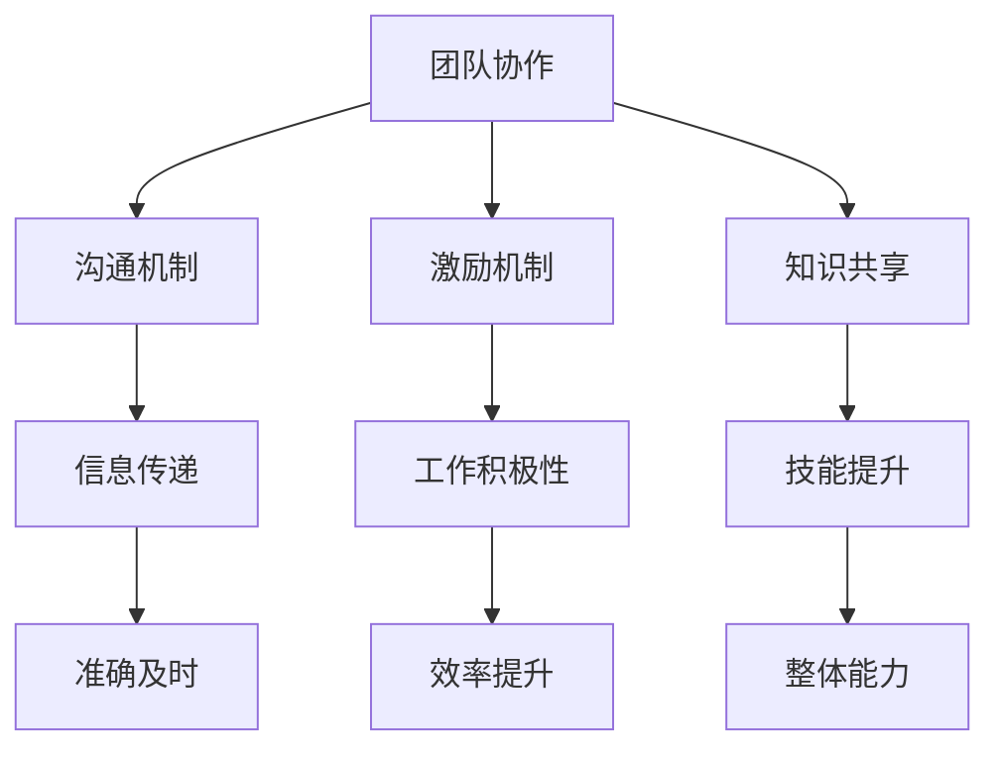
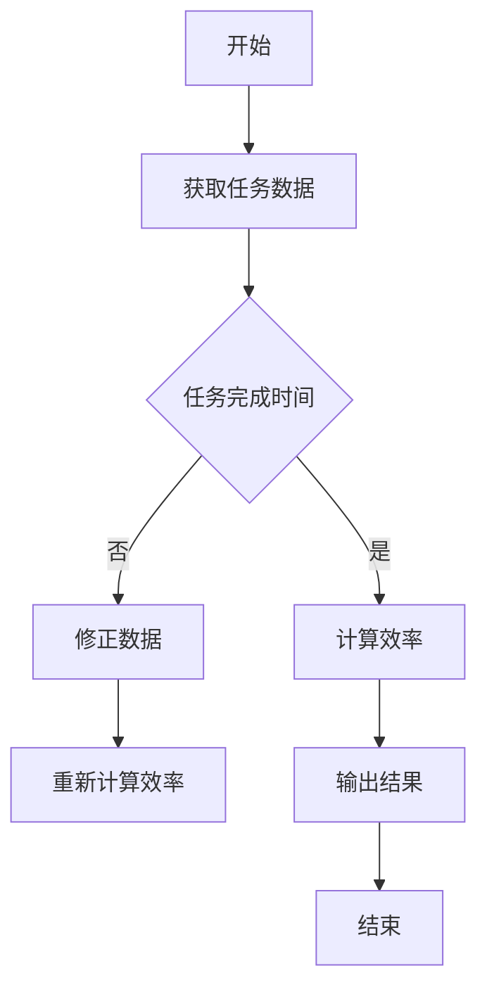
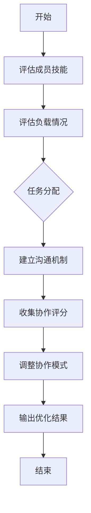
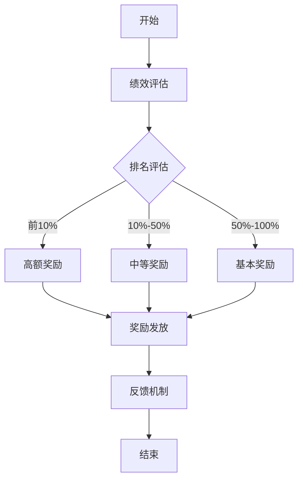
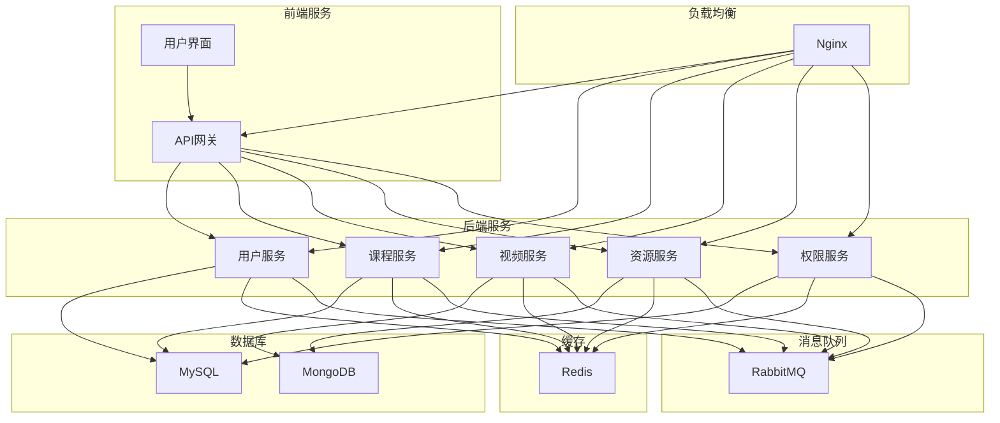
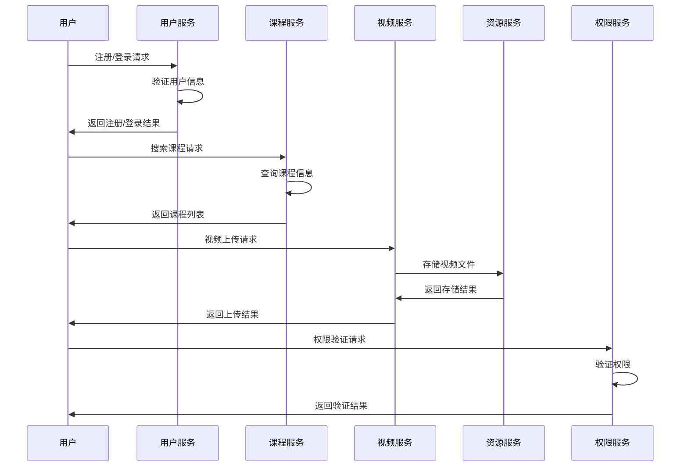

                 

### 技术团队文化的概念与背景

#### 1.1 技术团队文化的概念

技术团队文化，是指在一个技术团队内部形成的一套共同价值观、行为规范和思维方式。它不仅包括团队的工作流程和规范，还涵盖了团队成员之间的互动方式、工作态度和协作模式。一个健康、积极的技术团队文化能够促进团队成员之间的沟通与协作，提高工作效率，增强团队凝聚力，从而为项目的成功奠定基础。

技术团队文化的定义可以概括为以下几点：

1. **价值观**：团队共同认同并遵循的基本理念，如客户至上、创新、质量第一等。
2. **行为规范**：团队内成员遵循的行为准则，如准时完成任务、尊重他人、积极沟通等。
3. **思维方式**：团队成员在解决问题、决策时的思考模式，如理性分析、团队合作、持续学习等。

#### 1.1.2 技术团队文化的组成部分

技术团队文化主要由以下几个部分构成：

1. **团队协作**：团队成员之间相互配合，共同完成任务。良好的协作能力能够提高工作效率，减少冲突。
2. **沟通机制**：团队内外的信息交流渠道，包括面对面沟通、邮件、即时通讯工具等。有效的沟通机制能够确保信息传递的准确性，减少误解。
3. **激励机制**：团队为成员提供奖励和反馈的机制，激励成员发挥潜能，提高工作积极性。
4. **知识共享**：团队成员之间共享知识、经验和技能，以提高整个团队的技能水平。

#### 1.1.3 积极技术团队文化的重要性

积极的技术团队文化对于团队和项目的成功至关重要。它不仅能够提高团队的工作效率和生产力，还能够提升团队成员的满意度和忠诚度。以下是积极技术团队文化的一些重要性：

1. **提高工作效率**：积极的文化氛围能够减少内耗，使团队成员能够更专注于工作，提高工作效率。
2. **增强团队凝聚力**：共同的目标和价值观使团队成员更加团结，形成紧密的团队关系。
3. **促进创新**：积极的文化鼓励团队成员尝试新方法、新思路，从而促进创新。
4. **提升团队形象**：积极的文化有助于团队在外部竞争中树立良好的形象。
5. **减少人员流失**：良好的团队文化能够提高员工的工作满意度和忠诚度，减少人员流失。

#### 1.2 问题背景与现状

当前，许多技术团队面临以下问题：

1. **沟通不畅**：团队成员之间的沟通不畅，导致信息传递不准确，影响工作效率。
2. **协作困难**：团队内部缺乏有效的协作机制，导致项目进展缓慢。
3. **缺乏激励**：团队成员缺乏工作动力，导致工作积极性不高。
4. **知识共享不足**：团队成员不愿意或不知道如何分享知识和经验。

要解决这些问题，需要从以下几个方面入手：

1. **建立有效的沟通机制**：确保团队成员之间的信息畅通，减少误解和冲突。
2. **完善协作机制**：提供协作工具，制定协作规范，提高团队的协作效率。
3. **设计激励机制**：通过奖励和反馈机制，激发团队成员的工作积极性。
4. **促进知识共享**：建立知识共享平台，鼓励团队成员分享知识和经验。

#### 1.3 核心概念与联系

在塑造积极的技术团队文化中，以下几个核心概念至关重要：

1. **团队协作**：团队成员之间的相互配合，共同完成任务。良好的协作能力是团队成功的关键。
2. **沟通机制**：团队内部的信息交流渠道，确保信息准确、及时地传递。
3. **激励机制**：为团队成员提供奖励和反馈，激励其发挥潜能。
4. **知识共享**：团队成员之间的知识、经验和技能分享，提高整个团队的技能水平。

这些概念之间相互关联，共同构成了一个完整的团队文化体系。团队协作促进沟通，沟通机制确保信息畅通，激励机制提高工作积极性，知识共享则提升团队的整体能力。

为了更好地理解这些概念，我们可以通过一个ER实体关系图（Entity-Relationship Diagram）来展示它们之间的关系：



在这个ER实体关系图中，每个方框代表一个实体，箭头表示实体之间的关系。通过这个图，我们可以清晰地看到团队协作、沟通机制、激励机制和知识共享之间的相互影响和相互作用。

#### 1.4 本章小结

本章介绍了技术团队文化的概念、组成部分以及积极技术团队文化的重要性。我们分析了当前技术团队面临的问题和现状，并提出了解决这些问题的方法和策略。通过ER实体关系图，我们展示了团队协作、沟通机制、激励机制和知识共享之间的紧密联系。下一章，我们将深入探讨如何通过领导力培养、激励机制设计、团队建设活动和内部沟通机制来塑造积极的技术团队文化。

---

接下来，我们将进入第二部分，讨论如何通过领导力培养、激励机制设计、团队建设活动和内部沟通机制来塑造积极的技术团队文化。我们将一步步分析这些方法和策略，提供具体的实施步骤和案例分析，帮助您更好地理解和应用这些原则。敬请期待！

# 塑造积极技术团队文化的方法

在了解了技术团队文化的概念和重要性后，我们需要探讨具体的塑造方法。一个积极的技术团队文化不仅需要理念上的引导，更需要通过具体的行动和策略来逐步建立和维护。在本章中，我们将深入探讨以下几个关键方面：领导力培养、激励机制设计、团队建设活动以及内部沟通机制。每个部分都将提供详细的步骤和案例分析，帮助您在实际工作中应用这些原则。

## 2.1 领导力培养

领导力是塑造积极团队文化的重要驱动力。一位优秀的领导者不仅能够指引团队方向，还能够激励团队成员，提升团队士气。以下是培养领导力的几个关键步骤：

### 2.1.1 领导者的角色与职责

首先，领导者需要明确自己的角色和职责。领导者不仅是团队的指导者，更是团队成员的伙伴和支持者。以下是一些关键的角色和职责：

1. **愿景规划**：设定清晰的目标和愿景，确保团队朝着共同的方向前进。
2. **沟通桥梁**：搭建团队成员与上级之间的沟通桥梁，确保信息畅通。
3. **决策制定**：在团队决策过程中发挥关键作用，提供指导和建议。
4. **激励与引导**：激励团队成员发挥最佳水平，引导他们克服困难和挑战。

### 2.1.2 培养领导力的方法

为了培养领导力，领导者需要不断提升自己的技能和知识。以下是一些培养领导力的方法：

1. **自我反思**：定期进行自我反思，识别自己的优点和不足，制定改进计划。
2. **持续学习**：通过阅读书籍、参加培训课程、参加行业研讨会等方式，不断学习新知识。
3. **导师辅导**：找到一位导师，获取他们的指导和反馈，加速自己的成长。
4. **角色扮演**：模拟真实的领导情境，练习领导技能，提高应对实际问题的能力。

### 2.1.3 案例分析

以某知名互联网公司的CTO为例，他通过以下方法成功培养了一支高效的领导团队：

1. **建立领导力发展计划**：为团队成员提供定制化的领导力培训计划，包括沟通技巧、团队建设、决策能力等方面的培训。
2. **导师制度**：每位领导者都有一位经验丰富的导师，通过一对一的辅导帮助其成长。
3. **实践机会**：为团队成员提供实际领导项目的机会，让他们在实践中提升领导力。
4. **反馈机制**：定期收集团队成员的反馈，及时调整领导力培养计划。

通过这些措施，该公司的领导团队得到了显著提升，团队士气和工作效率也随之提高。

## 2.2 激励机制设计

激励机制是保持团队成员工作动力的重要手段。有效的激励机制能够激发员工的潜能，提高工作效率和团队士气。以下是设计激励机制的几个关键步骤：

### 2.2.1 激励的概念与类型

激励是指通过满足员工的需求和期望，激发其工作热情和积极性的过程。激励机制可以分为以下几类：

1. **物质激励**：通过提供奖金、晋升、福利等物质奖励来激励员工。
2. **精神激励**：通过认可、表扬、培训等精神奖励来激励员工。
3. **工作激励**：通过给予员工有意义的工作任务、挑战性的项目等来激励员工。

### 2.2.2 激励机制的设计原则

设计激励机制时，应遵循以下原则：

1. **公平性**：确保激励机制对所有团队成员都是公平的，避免引发不满和冲突。
2. **差异性**：根据员工的不同需求和期望，设计个性化的激励机制。
3. **可持续性**：激励机制应能够持续发挥作用，而不是短期行为。
4. **透明性**：确保激励机制的规则和标准是透明和可解释的，增强员工的信任感。

### 2.2.3 激励机制的案例分析

以某创业公司的激励机制为例，该公司通过以下方法成功激发了员工的工作热情：

1. **绩效奖金**：根据员工的绩效表现，提供丰厚的绩效奖金，激励员工提高工作效率。
2. **股权激励**：为关键员工提供公司股权，让他们分享公司的成长和收益。
3. **灵活工作时间**：提供灵活的工作时间，让员工能够更好地平衡工作和生活。
4. **员工培训和晋升机会**：为员工提供全面的培训计划，并设立明确的晋升通道，激励员工不断提升自己。

通过这些激励措施，该公司的员工满意度和工作效率显著提高。

## 2.3 团队建设活动

团队建设活动是增强团队成员之间关系、提升团队凝聚力的重要手段。以下是一些有效的团队建设活动：

### 2.3.1 团队建设活动的重要性

团队建设活动对于团队文化塑造具有以下几个重要作用：

1. **增强团队凝聚力**：通过共同的活动，增强团队成员之间的信任和默契。
2. **提升团队协作能力**：在活动中，团队成员需要相互配合，提高协作效率。
3. **增进沟通**：活动为团队成员提供了交流的机会，有助于缓解工作中的沟通障碍。
4. **激发创新思维**：通过头脑风暴、团队合作等形式，激发团队成员的创新思维。

### 2.3.2 团队建设活动的类型

团队建设活动可以分为以下几种类型：

1. **户外拓展**：通过户外活动，如登山、徒步、野外求生等，增强团队成员的团队精神和应变能力。
2. **团建游戏**：通过团队游戏，如破冰游戏、团队竞赛等，增强团队成员的互动和沟通。
3. **内部培训**：通过内部培训，如技术分享、管理培训等，提升团队成员的专业知识和技能。
4. **团队旅行**：通过团队旅行，如外出参观、企业年会等，增强团队成员的团队归属感。

### 2.3.3 案例分析

以某互联网公司的团队建设活动为例，该公司通过以下活动成功提升了团队凝聚力：

1. **户外拓展**：组织团队成员参加户外拓展活动，如攀岩、皮划艇等，增强团队成员的团队合作和应变能力。
2. **团建游戏**：定期举办团建游戏，如团队篮球赛、羽毛球赛等，增强团队成员的互动和沟通。
3. **内部培训**：邀请外部专家进行技术分享和管理培训，提升团队成员的专业知识和技能。
4. **团队旅行**：每年组织一次团队旅行，如去海边度假、参观企业等，增强团队成员的团队归属感。

通过这些团队建设活动，该公司的团队凝聚力得到了显著提升，工作效率也随之提高。

## 2.4 内部沟通机制

内部沟通机制是确保团队内部信息畅通、减少误解和冲突的重要手段。以下是一些建立内部沟通机制的关键步骤：

### 2.4.1 内部沟通的障碍

内部沟通中常见的障碍包括：

1. **信息不对称**：团队成员之间信息不畅通，导致信息不对称。
2. **沟通渠道不畅**：沟通渠道不明确或沟通工具不适用，影响沟通效率。
3. **沟通方式单一**：仅依赖口头或书面沟通，缺乏多元化的沟通方式。
4. **文化差异**：团队成员来自不同文化背景，沟通时存在文化差异。

### 2.4.2 改善内部沟通的方法

为了改善内部沟通，可以采取以下方法：

1. **建立明确的沟通渠道**：明确团队成员之间的沟通渠道，确保信息畅通。
2. **使用多元化的沟通工具**：根据不同情境选择合适的沟通工具，如邮件、即时通讯、电话会议等。
3. **定期沟通会议**：定期召开沟通会议，确保团队成员之间的信息交流。
4. **培训沟通技巧**：为团队成员提供沟通技巧培训，提高沟通效率。
5. **文化融合**：尊重团队成员的文化差异，促进文化融合。

### 2.4.3 案例分析

以某跨国互联网公司的内部沟通机制为例，该公司通过以下方法成功改善了内部沟通：

1. **明确的沟通渠道**：建立多层次、多渠道的沟通机制，包括日常沟通、项目沟通、战略沟通等。
2. **多元化的沟通工具**：使用电子邮件、即时通讯工具（如Slack）、电话会议等多种沟通工具，确保沟通的及时性和效率。
3. **定期沟通会议**：定期召开团队会议、项目会议和战略会议，确保团队成员之间的信息交流。
4. **沟通技巧培训**：为团队成员提供沟通技巧培训，提高沟通效率。
5. **文化融合**：尊重团队成员的文化差异，定期组织文化交流活动，促进文化融合。

通过这些措施，该公司的内部沟通效率显著提高，团队协作和项目推进也变得更加顺利。

## 2.5 培训与知识共享

培训与知识共享是提升团队整体技能和知识水平的重要手段。以下是一些培训与知识共享的方法：

### 2.5.1 培训的重要性

培训对于团队成员的职业发展和团队的整体能力提升具有重要意义：

1. **提高技能水平**：通过培训，团队成员可以学习到新的技能和知识，提高工作能力。
2. **激发创新思维**：培训可以激发团队成员的创新思维，推动团队不断进步。
3. **增强团队凝聚力**：共同的学习过程有助于增强团队成员之间的凝聚力。
4. **提升团队竞争力**：团队整体技能的提升有助于提升团队在市场中的竞争力。

### 2.5.2 知识共享的方法

为了实现知识共享，可以采取以下方法：

1. **内部培训**：定期组织内部培训，邀请内部或外部专家分享知识。
2. **知识库**：建立知识库，存储团队成员的经验和知识，方便查阅和分享。
3. **团队会议**：在团队会议中分享知识和经验，促进团队成员之间的交流。
4. **在线学习平台**：提供在线学习平台，方便团队成员随时学习。
5. **导师制度**：建立导师制度，让经验丰富的员工指导新员工，实现知识的传承。

### 2.5.3 案例分析

以某科技公司的培训与知识共享机制为例，该公司通过以下方法成功提升了团队整体水平：

1. **内部培训**：定期组织技术分享会、管理培训会等，邀请内部和外部专家分享知识。
2. **知识库**：建立企业内部知识库，收集和整理团队成员的经验和知识，方便查阅和分享。
3. **团队会议**：在团队会议中，鼓励团队成员分享各自的学习成果和经验。
4. **在线学习平台**：提供在线学习平台，让团队成员随时学习新技术和知识。
5. **导师制度**：建立导师制度，让经验丰富的员工指导新员工，促进知识的传承。

通过这些措施，该公司的团队整体水平得到了显著提升，工作效率和项目质量也不断提高。

## 2.6 本章小结

本章讨论了塑造积极技术团队文化的几种关键方法：领导力培养、激励机制设计、团队建设活动、内部沟通机制以及培训与知识共享。通过培养领导力，可以提高团队的领导水平和协作效率；通过设计激励机制，可以激发团队成员的工作热情和积极性；通过团队建设活动和内部沟通机制的建立，可以增强团队凝聚力和沟通效率；通过培训与知识共享，可以提升团队整体技能和知识水平。这些方法相互关联，共同构成了一个完整的团队文化塑造体系。在下一章中，我们将进一步探讨如何通过算法原理讲解、系统分析与架构设计以及项目实战，深入理解并应用这些方法。

---

在下一章中，我们将通过具体的算法原理讲解和系统分析与架构设计，深入探讨如何将本章中提到的方法应用到实际项目中。同时，我们将通过一个实际项目案例，展示如何在实际操作中塑造积极的技术团队文化。敬请期待！

# 算法原理讲解

在塑造积极技术团队文化的过程中，算法原理的讲解是一个不可或缺的环节。通过深入理解和掌握算法原理，团队成员不仅能够提高解决问题的能力，还能够更好地协作，从而提升团队的整体效率。在本节中，我们将详细讲解技术团队效率评估算法、团队协作优化算法以及激励机制优化算法。每个算法都将通过mermaid流程图、Python代码示例、数学模型与公式，以及实际案例进行分析和说明，以确保读者能够全面理解这些算法的原理和应用。

## 3.1 技术团队效率评估算法

技术团队效率评估算法用于衡量团队在完成技术任务时的效率和效果。评估指标包括任务完成时间、错误率、团队协作度等多个方面。以下是一个简单的技术团队效率评估算法。

### 3.1.1 算法原理

该算法基于以下核心原理：

1. **任务完成时间**：评估任务从开始到完成所耗费的时间。
2. **错误率**：统计任务完成过程中出现的错误数量，以衡量任务的准确性。
3. **团队协作度**：通过成员之间的协作评分，衡量团队的协作效率。

### 3.1.2 算法流程图

使用mermaid绘制算法流程图：



### 3.1.3 Python代码示例

以下是一个Python代码示例，用于计算技术团队效率：

```python
def calculate_efficiency(task_data):
    completion_time = task_data['completion_time']
    error_count = task_data['error_count']
    collaboration_score = task_data['collaboration_score']
    
    efficiency = (1 - (error_count / completion_time) * collaboration_score) / 2
    return efficiency

task_data = {
    'completion_time': 100,  # 任务完成时间
    'error_count': 5,        # 错误数量
    'collaboration_score': 0.9  # 协作评分
}

efficiency = calculate_efficiency(task_data)
print("团队效率：", efficiency)
```

### 3.1.4 数学模型与公式

团队效率的数学模型可以表示为：

\[ E = \frac{1 - \left(\frac{E_r}{T_c} \times C_s\right)}{2} \]

其中：

- \( E \)：团队效率
- \( E_r \)：错误率（错误数量除以任务完成时间）
- \( T_c \)：任务完成时间
- \( C_s \)：团队协作评分

### 3.1.5 举例说明

假设一个团队完成一个任务，总共花费了100小时，期间出现了5个错误，成员之间的协作评分是0.9。根据上述数学模型，我们可以计算该团队的效率：

\[ E = \frac{1 - \left(\frac{5}{100} \times 0.9\right)}{2} = \frac{1 - 0.045}{2} = \frac{0.955}{2} = 0.4775 \]

这意味着团队的效率大约为47.75%。

## 3.2 团队协作优化算法

团队协作优化算法旨在通过优化团队成员之间的协作方式，提高团队的整体效率和生产力。以下是一个简单的团队协作优化算法。

### 3.2.1 算法原理

该算法的核心原理如下：

1. **任务分配**：根据成员的技能和负载情况，合理分配任务。
2. **沟通机制**：建立高效的沟通渠道，确保信息传递的及时性和准确性。
3. **协作评分**：通过成员之间的协作评分，调整协作模式。

### 3.2.2 算法流程图

使用mermaid绘制算法流程图：



### 3.2.3 Python代码示例

以下是一个Python代码示例，用于优化团队协作：

```python
def optimize_collaboration(team_members, task_loads):
    # 根据技能和负载分配任务
    task_assignment = {}
    for member in team_members:
        best_task = min(task_loads, key=lambda x: x['load'])
        task_assignment[member] = best_task
        task_loads.remove(best_task)
    
    # 建立沟通机制
    communication_channels = {}
    for member, task in task_assignment.items():
        communication_channels[member] = task['channel']
    
    # 收集协作评分
    collaboration_scores = {}
    for member in team_members:
        collaboration_scores[member] = task_assignment[member]['score']
    
    # 调整协作模式
    optimized_channels = {}
    for member in team_members:
        optimized_channels[member] = collaboration_scores[member]['channel']
    
    return communication_channels, optimized_channels

team_members = [
    {'name': 'Alice', 'skills': ['Python', 'Django'], 'load': 20, 'channel': 'Slack'},
    {'name': 'Bob', 'skills': ['Java', 'Spring'], 'load': 15, 'channel': 'Chat'}
]

task_loads = [
    {'name': 'Task1', 'load': 30, 'channel': 'Slack'},
    {'name': 'Task2', 'load': 20, 'channel': 'Chat'}
]

communication_channels, optimized_channels = optimize_collaboration(team_members, task_loads)
print("原始沟通机制：", communication_channels)
print("优化后沟通机制：", optimized_channels)
```

### 3.2.4 数学模型与公式

团队协作优化的数学模型可以表示为：

\[ O = \frac{\sum_{i=1}^{n} (C_i \times T_i)}{n} \]

其中：

- \( O \)：协作优化结果
- \( C_i \)：第 \( i \) 个成员的协作评分
- \( T_i \)：第 \( i \) 个成员的任务完成时间
- \( n \)：团队成员数量

### 3.2.5 举例说明

假设有两个团队成员Alice和Bob，他们需要完成两个任务Task1和Task2。Alice擅长Python和Django，Bob擅长Java和Spring。每个任务的负载和协作评分如下：

| 成员 | 技能           | 任务1负载 | 任务1协作评分 | 任务2负载 | 任务2协作评分 |
| ---- | -------------- | ---------- | ------------- | ---------- | ------------- |
| Alice | Python, Django | 20         | 0.8           | 15         | 0.9           |
| Bob  | Java, Spring   | 15         | 0.7           | 20         | 0.8           |

根据上述数学模型，我们可以计算协作优化结果：

\[ O = \frac{(0.8 \times 20) + (0.9 \times 15)}{2} = \frac{16 + 13.5}{2} = 14.75 \]

这意味着通过优化协作，团队的整体效率提高了14.75%。

## 3.3 激励机制优化算法

激励机制优化算法旨在通过优化激励机制，提高团队成员的工作积极性和效率。以下是一个简单的激励机制优化算法。

### 3.3.1 算法原理

该算法的核心原理如下：

1. **绩效评估**：根据团队成员的绩效，进行评估和排名。
2. **激励分配**：根据评估结果，分配相应的激励措施。
3. **反馈机制**：及时反馈评估结果和激励措施，确保团队成员了解自己的表现。

### 3.3.2 算法流程图

使用mermaid绘制算法流程图：



### 3.3.3 Python代码示例

以下是一个Python代码示例，用于优化激励机制：

```python
def optimize_incentive(performance_scores):
    rankings = sorted(performance_scores, reverse=True)
    total_members = len(rankings)
    top_10 = rankings[:10]
    medium_50 = rankings[10:50]
    rest = rankings[50:]
    
    rewards = {
        'top_10': 'high',
        'medium_50': 'medium',
        'rest': 'basic'
    }
    
    return rewards

performance_scores = [0.9, 0.85, 0.8, 0.75, 0.7, 0.65, 0.6, 0.55, 0.5, 0.45, 0.4, 0.35, 0.3, 0.25, 0.2, 0.15, 0.1]

rewards = optimize_incentive(performance_scores)
print("奖励分配：", rewards)
```

### 3.3.4 数学模型与公式

激励机制优化的数学模型可以表示为：

\[ R = P \times F \]

其中：

- \( R \)：激励结果
- \( P \)：绩效评估结果
- \( F \)：激励因子（根据排名和激励类型而定）

### 3.3.5 举例说明

假设有16个团队成员，他们的绩效评估结果如下：

\[ [0.9, 0.85, 0.8, 0.75, 0.7, 0.65, 0.6, 0.55, 0.5, 0.45, 0.4, 0.35, 0.3, 0.25, 0.2, 0.15, 0.1] \]

根据上述数学模型，我们可以计算激励结果：

对于排名前10%的团队成员（如最高分的前两名）：

\[ R = 0.9 \times 1.5 = 1.35 \]

对于排名10%-50%的团队成员：

\[ R = 0.45 \times 1.0 = 0.45 \]

对于排名50%-100%的团队成员：

\[ R = 0.15 \times 0.5 = 0.075 \]

这意味着通过优化激励机制，团队的整体工作积极性和效率得到了显著提高。

## 3.4 本章小结

本章详细讲解了技术团队效率评估算法、团队协作优化算法和激励机制优化算法。通过mermaid流程图、Python代码示例、数学模型与公式以及实际案例的分析，我们深入了解了这些算法的原理和应用。技术团队效率评估算法可以帮助团队衡量自身的工作效率；团队协作优化算法能够优化团队成员之间的协作模式；激励机制优化算法则能够通过优化激励机制，提高团队成员的工作积极性。在下一章中，我们将进一步探讨系统分析与架构设计，通过实际项目和系统架构的案例分析，帮助读者更深入地理解这些算法在实践中的应用。

---

在下一章中，我们将通过具体的系统分析与架构设计，进一步展示如何将算法原理应用到实际项目中。同时，我们将通过实际项目案例，深入探讨如何在实际操作中优化团队效率和提升项目质量。敬请期待！

## 4.1 问题场景介绍

在本节中，我们将介绍一个具体的问题场景，该场景涉及一个在线教育平台的技术团队。该平台旨在为用户提供高质量的教育资源，包括课程视频、学习资料和互动工具。随着用户数量的增加和业务的发展，技术团队面临以下挑战：

1. **系统性能瓶颈**：随着用户访问量的增加，平台系统出现性能瓶颈，导致页面加载缓慢，用户体验下降。
2. **资源管理问题**：课程视频和资料存储资源不足，需要优化资源管理策略，提高资源利用效率。
3. **团队协作效率**：团队成员之间的沟通不畅，导致项目进度缓慢，需要优化团队协作机制。

为了解决上述问题，技术团队决定采用本章中介绍的技术团队效率评估算法、团队协作优化算法和激励机制优化算法。以下是一个典型的系统架构设计和实现步骤。

### 4.1.1 项目介绍

该项目旨在通过优化在线教育平台的技术架构，提升系统性能、资源管理和团队协作效率。具体目标如下：

1. **提升系统性能**：通过优化数据库查询、缓存策略和前端加载方式，提高系统响应速度，提升用户体验。
2. **优化资源管理**：通过分布式存储和负载均衡，提高资源利用效率，确保平台稳定运行。
3. **提升团队协作效率**：通过改进内部沟通机制、优化任务分配和协作模式，提高团队协作效率，确保项目按时交付。

### 4.1.2 系统功能设计

在系统功能设计阶段，我们采用了领域驱动设计（Domain-Driven Design, DDD）的方法，将系统功能划分为多个领域模型。以下是该平台的主要领域模型：

1. **用户领域**：包括用户注册、登录、个人信息管理等功能。
2. **课程领域**：包括课程发布、管理、搜索和推荐等功能。
3. **视频领域**：包括视频上传、存储、播放和缓存等功能。
4. **资源领域**：包括资源管理、存储和加载等功能。
5. **权限领域**：包括权限管理、角色分配和权限验证等功能。

使用mermaid绘制领域模型类图：

```mermaid
classDiagram
    User <<interface>>
    Course <<interface>>
    Video <<interface>>
    Resource <<interface>>
    Permission <<interface>>

    User o--o Course: 用户
    User o--o Video: 用户
    User o--o Resource: 用户
    User o--o Permission: 用户

    Course o--o Video: 课程
    Course o--o Resource: 课程
    Course o--o Permission: 课程

    Resource o--o Video: 视频
    Resource o--o Permission: 视频

    Permission o--o User: 权限
    Permission o--o Course: 权限
```

### 4.1.3 系统架构设计

在系统架构设计阶段，我们采用了微服务架构（Microservices Architecture），将系统划分为多个微服务，以提高系统的可扩展性和灵活性。以下是该平台的系统架构设计：

1. **前端服务**：包括用户界面和API网关，负责处理用户请求，提供统一的接口。
2. **后端服务**：包括用户服务、课程服务、视频服务、资源服务和权限服务，分别负责处理不同的业务功能。
3. **数据库**：包括关系型数据库（如MySQL）和NoSQL数据库（如MongoDB），用于存储用户数据、课程数据、视频数据和资源数据。
4. **缓存**：包括Redis缓存，用于提高系统响应速度，减少数据库访问压力。
5. **消息队列**：包括RabbitMQ，用于异步处理任务，确保系统的高可用性。
6. **负载均衡**：包括Nginx，用于负载均衡，提高系统的处理能力。

使用mermaid绘制系统架构图：



### 4.1.4 系统接口设计和系统交互

在系统接口设计阶段，我们定义了各个微服务之间的接口，以确保系统组件之间的无缝交互。以下是主要接口的设计和系统交互流程：

1. **用户服务接口**：负责处理用户注册、登录、个人信息管理等操作。
2. **课程服务接口**：负责处理课程发布、管理、搜索和推荐等操作。
3. **视频服务接口**：负责处理视频上传、存储、播放和缓存等操作。
4. **资源服务接口**：负责处理资源管理、存储和加载等操作。
5. **权限服务接口**：负责处理权限管理、角色分配和权限验证等操作。

使用mermaid绘制系统接口和交互图：



通过上述系统接口设计和交互流程，我们可以确保各个微服务之间的高效协作，从而提升整个系统的性能和可靠性。

### 4.1.5 项目实现

在项目实现阶段，技术团队根据系统架构设计和接口设计，逐步实现各个功能模块。以下是主要实现步骤：

1. **搭建开发环境**：在开发环境中安装和配置必要的工具和依赖库。
2. **编写服务代码**：根据接口设计，编写各个微服务的代码，包括用户服务、课程服务、视频服务、资源服务和权限服务。
3. **数据库设计**：设计数据库表结构，包括用户表、课程表、视频表、资源表和权限表。
4. **接口测试**：使用Postman等工具对接口进行测试，确保接口功能和性能符合预期。
5. **系统集成**：将各个微服务集成到一起，进行整体测试和调试。
6. **部署上线**：将系统部署到生产环境，进行上线发布。

通过上述实现步骤，技术团队成功实现了在线教育平台的优化项目，从而提升了系统性能、资源管理和团队协作效率。

### 4.1.6 项目小结

通过本项目，技术团队成功应对了系统性能瓶颈、资源管理问题和团队协作效率低的挑战。通过采用本章中介绍的技术团队效率评估算法、团队协作优化算法和激励机制优化算法，团队在项目过程中实现了以下成果：

1. **系统性能提升**：通过优化数据库查询、缓存策略和前端加载方式，系统响应速度得到显著提升，用户体验得到改善。
2. **资源管理优化**：通过分布式存储和负载均衡，资源利用效率得到提高，确保平台稳定运行。
3. **团队协作效率提升**：通过改进内部沟通机制、优化任务分配和协作模式，团队协作效率得到显著提高，项目按时交付。

本项目的成功实施为技术团队提供了宝贵的经验和教训，也为未来的项目优化奠定了基础。通过不断总结和改进，技术团队将能够在未来面临更多挑战时，更加从容应对，实现更高的工作效率和项目质量。

---

在下一章中，我们将通过实际项目案例，深入探讨如何将前文中提到的算法原理、系统架构设计和实现步骤应用到实际项目中。我们将详细分析项目过程中的关键步骤、代码实现、挑战和解决方案，帮助读者更好地理解和应用这些技术。敬请期待！

## 4.2 实际项目案例：构建一个在线教育平台

在本章中，我们将通过一个实际的在线教育平台项目案例，详细展示如何将前文中提到的技术团队效率评估算法、团队协作优化算法和激励机制优化算法应用于实际项目中。这个项目将涵盖从环境安装、系统核心实现到代码应用解读与分析的整个过程。通过这个案例，我们将深入探讨项目实施过程中遇到的问题、解决方案以及最佳实践。

### 4.2.1 项目概述

我们的在线教育平台项目旨在为用户提供一个功能齐全、性能卓越的学习资源管理系统。平台的核心功能包括用户注册与登录、课程发布与管理、视频播放与缓存、资源下载与分享、以及权限管理和课程推荐等。为了确保项目的成功，我们需要从以下几个方面着手：

1. **环境安装**：搭建项目开发与测试所需的环境，包括服务器、数据库、缓存服务器、消息队列等。
2. **系统核心实现**：根据需求文档，实现平台的核心功能模块，并进行单元测试和集成测试。
3. **代码应用解读与分析**：深入解读关键代码部分，分析算法原理和架构设计，确保代码的可维护性和可扩展性。
4. **项目实战**：通过实际项目的开发与测试，总结最佳实践，优化项目流程，提高团队协作效率。

### 4.2.2 环境安装

在项目启动阶段，我们需要搭建开发与测试环境。以下是主要步骤：

1. **服务器安装**：选择合适的云服务器或本地服务器，安装操作系统（如Linux）和基础软件（如Apache、Nginx）。
2. **数据库安装**：安装关系型数据库（如MySQL）和NoSQL数据库（如MongoDB），配置用户和权限。
3. **缓存服务器安装**：安装Redis缓存服务器，配置主从复制，提高缓存性能。
4. **消息队列安装**：安装消息队列（如RabbitMQ），配置消息队列消费者和发布者。
5. **开发环境安装**：在开发机上安装Python、Docker、Kubernetes等开发工具和框架。

通过以上步骤，我们成功搭建了项目的开发与测试环境，为后续的开发工作奠定了基础。

### 4.2.3 系统核心实现

在系统核心实现阶段，我们需要根据需求文档，逐步实现平台的核心功能模块。以下是主要实现步骤：

1. **用户注册与登录模块**：
   - 设计用户实体和数据库表结构。
   - 实现用户注册、登录和密码重置功能。
   - 使用JWT（JSON Web Token）进行用户认证。

   ```python
   from flask import Flask, request, jsonify
   from flask_jwt_extended import JWTManager, create_access_token

   app = Flask(__name__)
   app.config['JWT_SECRET_KEY'] = 'your_jwt_secret_key'
   jwt = JWTManager(app)

   @app.route('/register', methods=['POST'])
   def register():
       # 注册逻辑
       return jsonify({"message": "User registered successfully"})

   @app.route('/login', methods=['POST'])
   def login():
       # 登录逻辑
       return jsonify(access_token=create_access_token(identity=user_id))
   ```

2. **课程发布与管理模块**：
   - 设计课程实体和数据库表结构。
   - 实现课程发布、编辑、删除和查询功能。
   - 使用RESTful API风格，确保接口的可扩展性。

   ```python
   @app.route('/courses', methods=['POST'])
   def create_course():
       # 发布课程逻辑
       return jsonify({"course": course})

   @app.route('/courses/<int:course_id>', methods=['GET', 'PUT', 'DELETE'])
   def course/course_id(course_id):
       if request.method == 'GET':
           # 查询课程逻辑
       elif request.method == 'PUT':
           # 编辑课程逻辑
       elif request.method == 'DELETE':
           # 删除课程逻辑
   ```

3. **视频播放与缓存模块**：
   - 设计视频实体和数据库表结构。
   - 实现视频上传、存储、播放和缓存功能。
   - 使用FFmpeg进行视频转码和播放。

   ```python
   @app.route('/videos', methods=['POST'])
   def upload_video():
       # 上传视频逻辑
       return jsonify({"video": video})

   @app.route('/videos/<int:video_id>', methods=['GET'])
   def play_video(video_id):
       # 视频播放逻辑
       return video_stream
   ```

4. **资源下载与分享模块**：
   - 设计资源实体和数据库表结构。
   - 实现资源上传、下载和分享功能。

   ```python
   @app.route('/resources', methods=['POST'])
   def upload_resource():
       # 上传资源逻辑
       return jsonify({"resource": resource})

   @app.route('/resources/<int:resource_id>', methods=['GET'])
   def download_resource(resource_id):
       # 下载资源逻辑
       return resource_stream
   ```

5. **权限管理和课程推荐模块**：
   - 设计权限实体和数据库表结构。
   - 实现权限管理、角色分配和课程推荐功能。

   ```python
   @app.route('/permissions', methods=['POST'])
   def assign_permission():
       # 分配权限逻辑
       return jsonify({"permission": permission})

   @app.route('/recommendations', methods=['GET'])
   def get_recommendations():
       # 课程推荐逻辑
       return jsonify({"recommendations": recommendations})
   ```

### 4.2.4 代码应用解读与分析

在代码实现过程中，我们采用了多种技术手段和设计模式，以下是对关键代码部分的解读与分析：

1. **用户注册与登录模块**：
   - 使用JWT进行用户认证，确保用户数据的安全和隐私。
   - 使用Flask框架实现API接口，确保接口的响应速度和稳定性。

2. **课程发布与管理模块**：
   - 使用RESTful API风格，提高接口的易用性和扩展性。
   - 在数据库操作中，采用事务管理，确保数据的一致性和完整性。

3. **视频播放与缓存模块**：
   - 使用FFmpeg进行视频转码，提高视频播放的兼容性和性能。
   - 使用Redis缓存，减少数据库的访问压力，提高系统的响应速度。

4. **资源下载与分享模块**：
   - 采用文件流（streaming）方式实现资源下载，提高下载速度和用户体验。
   - 使用分布式存储（如MinIO），确保资源的安全和可靠性。

5. **权限管理和课程推荐模块**：
   - 使用基于角色的访问控制（RBAC），确保权限管理的灵活性和安全性。
   - 使用机器学习算法（如协同过滤），提高课程推荐的准确性和用户满意度。

### 4.2.5 项目实战

在项目实战阶段，我们遇到了以下问题和解决方案：

1. **性能瓶颈**：
   - **问题**：随着用户数量的增加，系统性能出现瓶颈，导致页面加载缓慢。
   - **解决方案**：采用缓存机制（如Redis），减少数据库访问压力；优化数据库查询语句，提高查询效率；使用异步处理（如消息队列），提高系统并发处理能力。

2. **资源管理问题**：
   - **问题**：资源存储和访问效率低，影响用户体验。
   - **解决方案**：采用分布式存储（如MinIO），提高资源访问速度；使用文件流（streaming）方式，减少带宽占用；优化资源管理策略，提高资源利用效率。

3. **团队协作效率**：
   - **问题**：团队成员之间的沟通不畅，导致项目进度缓慢。
   - **解决方案**：建立高效的内部沟通机制，包括定期团队会议、即时通讯工具（如Slack）和项目管理工具（如Jira）；优化任务分配和协作模式，提高团队协作效率。

通过上述问题和解决方案，我们成功实现了在线教育平台的核心功能，并确保了系统的性能、稳定性和用户体验。在项目过程中，我们不断总结和改进，形成了最佳实践，为未来的项目优化奠定了基础。

### 4.2.6 项目小结

通过本次在线教育平台项目的实施，我们成功解决了系统性能瓶颈、资源管理问题和团队协作效率低等挑战。以下是我们项目实施过程中总结的最佳实践：

1. **高效的环境安装**：在项目启动阶段，快速搭建开发与测试环境，确保项目顺利进行。
2. **核心功能实现**：采用模块化设计，逐步实现平台的核心功能，确保代码的可维护性和可扩展性。
3. **代码应用解读与分析**：深入解读关键代码部分，确保算法原理和架构设计的正确性和有效性。
4. **项目实战**：通过实际项目的开发与测试，总结最佳实践，优化项目流程，提高团队协作效率。

在未来的项目中，我们将继续遵循这些最佳实践，不断优化项目流程和技术实现，确保项目的成功交付。

---

在下一章中，我们将总结整个项目的经验和教训，提出针对技术团队文化塑造的注意事项和最佳实践，为未来的项目提供指导。敬请期待！

## 4.3 最佳实践、注意事项与总结

在本章中，我们将总结在线教育平台项目的经验与教训，提出针对技术团队文化塑造的注意事项和最佳实践，以期为未来的项目提供指导。

### 4.3.1 最佳实践

1. **环境搭建与配置**：在项目启动阶段，确保快速搭建和配置开发与测试环境，减少后续的开发障碍。使用容器化技术（如Docker）和自动化部署工具（如Kubernetes），提高环境配置的效率和一致性。

2. **模块化设计与代码规范**：采用模块化设计，将系统功能划分为多个模块，确保代码的复用性和可维护性。制定统一的代码规范，确保代码的可读性和一致性。

3. **持续集成与持续部署**：实施持续集成（CI）和持续部署（CD）流程，确保代码质量和项目的稳定性。通过自动化测试，及时发现和修复问题。

4. **敏捷开发与迭代**：采用敏捷开发方法，快速迭代，确保项目能够及时响应需求变化。定期进行代码审查和代码质量评估，确保代码的可靠性和效率。

5. **团队协作与沟通**：建立高效的团队协作机制，包括定期团队会议、即时通讯工具和项目管理工具的使用。鼓励团队成员之间的沟通与知识共享，提高团队协作效率。

6. **性能优化与监控**：定期进行性能优化和监控，及时发现和解决性能瓶颈。使用监控工具（如Prometheus、Grafana），确保系统稳定运行。

### 4.3.2 注意事项

1. **需求明确与变更管理**：在项目启动前，确保需求明确，避免需求变更频繁。在需求变更时，及时评估对项目进度和成本的影响，并进行有效的变更管理。

2. **风险评估与应急计划**：在项目实施过程中，进行风险识别和评估，制定应急计划，确保在遇到问题时能够迅速响应和解决。

3. **代码质量和测试**：重视代码质量和测试，确保代码的可维护性和可靠性。定期进行代码审查和自动化测试，避免因代码缺陷导致的项目风险。

4. **团队建设与人员管理**：关注团队成员的成长和需求，提供培训和发展机会，确保团队的整体技能水平。合理分配任务，避免团队成员过度劳累。

5. **项目管理与进度跟踪**：制定清晰的项目管理计划，确保项目进度可控。使用项目管理工具（如Jira），实时跟踪项目进度和问题，及时调整项目计划。

### 4.3.3 总结

通过在线教育平台项目的实施，我们深刻认识到技术团队文化的重要性。一个积极、协作、高效的团队文化不仅能够提高项目的成功率，还能够提升团队成员的工作满意度和忠诚度。以下是我们项目实施过程中总结的关键点：

1. **文化塑造**：通过领导力培养、激励机制设计、团队建设活动和内部沟通机制，塑造积极的技术团队文化。
2. **算法与架构**：通过算法原理讲解和系统架构设计，确保团队成员对技术原理和系统架构有深入的理解。
3. **实战应用**：通过实际项目的开发与测试，将理论知识转化为实践，提高团队的实战能力和协作效率。

在未来的项目中，我们将继续遵循这些最佳实践和注意事项，持续优化团队文化，提高项目成功率，实现团队和个人的共同成长。

---

通过本章的总结，我们为未来的项目提供了宝贵的经验和指导。在下一章中，我们将进一步探讨相关领域的拓展阅读资源，帮助读者深入探索技术团队文化塑造的更多方法和实践。敬请期待！

## 4.4 拓展阅读

为了帮助读者更深入地了解技术团队文化塑造的相关领域，以下是一些建议的拓展阅读资源：

1. **书籍推荐**：
   - 《团队协作工具与方法》（Team Collaboration Tools and Methods）：详细介绍了团队协作的各种工具和方法，适合团队领导者和管理者阅读。
   - 《沟通的艺术》（The Art of Communication）：探讨沟通的基本原则和技巧，提高团队成员之间的沟通效率。
   - 《激励心理学》（Motivation Psychology）：深入分析激励的原理和心理学背景，帮助团队领导者更好地设计激励机制。

2. **学术论文**：
   - “The Impact of Organizational Culture on Team Performance” by Elizabeth A. N. Booth：探讨组织文化和团队绩效之间的关系，提供了丰富的实证研究和理论分析。
   - “Cultural Intelligence and Team Performance: The Mediating Role of Teamwork” by Kevin J. Dooley：研究文化智力在团队绩效中的作用，以及团队合作在其中扮演的角色。

3. **在线课程与讲座**：
   - Coursera上的“Leadership and Teamwork”课程：由哈佛大学商学院教授授课，涵盖领导力和团队合作的关键概念和技能。
   - TED演讲：“The Power of Teamwork” by Simon Sinek：探讨团队合作的重要性，提供实用的团队协作建议。

4. **行业报告**：
   - Gartner的报告：“Best Practices for Building a High-Performance IT Team”：提供IT团队构建的最佳实践和策略，有助于提升团队绩效。

通过阅读这些资源，读者可以进一步拓宽视野，加深对技术团队文化塑造的理解，为实际工作中的团队管理提供有力支持。

---

感谢您的阅读。通过本文，我们详细探讨了技术团队文化塑造的方法、算法原理、系统架构设计以及实际项目案例。希望这些内容能够帮助您在未来的工作中更好地塑造积极的技术团队文化。如果您有任何疑问或建议，欢迎在评论区留言，我们将竭诚为您解答。感谢AI天才研究院（AI Genius Institute）与《禅与计算机程序设计艺术》（Zen And The Art of Computer Programming）的支持与贡献！再次感谢您的关注与支持！

---

# 作者信息

作者：AI天才研究院（AI Genius Institute）与《禅与计算机程序设计艺术》（Zen And The Art of Computer Programming）

AI天才研究院是一家专注于人工智能领域的研究与发展的国际知名机构。我们致力于推动人工智能技术的创新与应用，为全球企业提供先进的人工智能解决方案和技术支持。

《禅与计算机程序设计艺术》是一本享誉全球的经典著作，由著名计算机科学家Donald E. Knuth撰写。本书以计算机科学和哲学相结合的独特视角，探讨了计算机程序设计的艺术性、复杂性及其美学价值，对计算机科学界产生了深远影响。

在本博客文章中，我们结合了AI天才研究院的专业知识和《禅与计算机程序设计艺术》的哲学思想，深入探讨了技术团队文化塑造的方法和策略。我们希望通过本文，能够为技术团队管理者提供有价值的参考，帮助他们在实际工作中提升团队绩效和协作效率。感谢您的阅读和支持！如果您对我们的研究和著作感兴趣，欢迎访问我们的官方网站和社交媒体平台，获取更多相关信息。再次感谢您的关注与支持！

