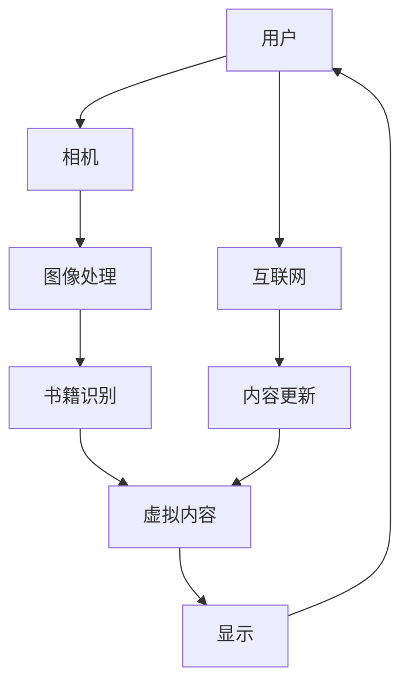
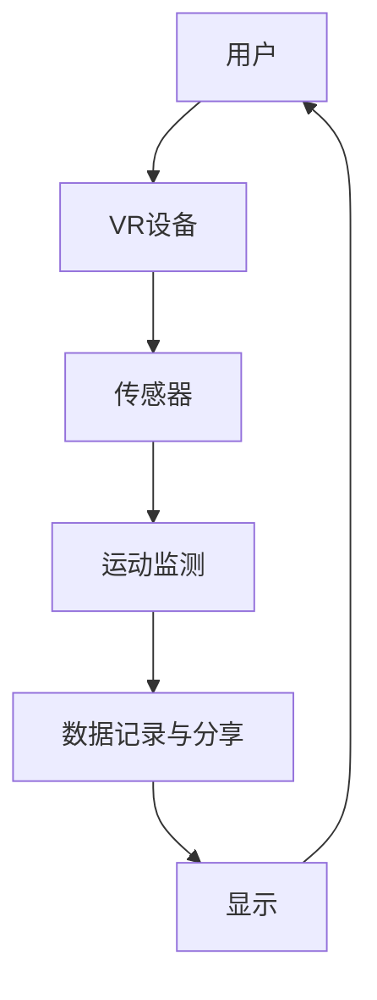

                 

# 增强现实(AR)和虚拟现实(VR)开发入门

> 关键词：增强现实，虚拟现实，开发入门，技术原理，实战案例

> 摘要：本文将带领读者深入探索增强现实（AR）和虚拟现实（VR）技术的基本概念、开发原理和实践技巧。通过详细的步骤讲解，读者将了解到如何搭建开发环境、实现核心功能，并掌握相关技术的最佳实践。

## 第1章 背景介绍

### 1.1 问题背景

增强现实（AR）和虚拟现实（VR）技术作为当代计算机视觉和交互技术的代表，自20世纪90年代以来得到了迅速的发展。随着硬件技术的进步和软件算法的创新，AR和VR技术已逐渐渗透到娱乐、教育、医疗、工业等多个领域，展现出广泛的应用前景。

#### AR和VR技术发展历程

- **增强现实（AR）**：最早的AR技术可以追溯到1968年，Myron Krueger开发的“智慧房间”被认为是AR的雏形。1990年，日本任天堂公司推出了首款AR游戏《Pokémon》。近年来，随着移动设备和计算机视觉技术的发展，AR技术得到了广泛应用。
- **虚拟现实（VR）**：VR技术的起源可以追溯到1960年代，美国MIT的伊凡·苏瑟兰发明了“幻真头戴显示器”。1990年代，VR技术进入商业应用阶段，例如1995年索尼推出的VR头戴设备VR-1。近年来，VR技术在游戏、娱乐、教育和医疗等领域取得了显著进展。

#### 当前市场与应用情况

- **市场趋势**：据市场研究公司Statista的数据，全球AR/VR市场规模预计将在2024年达到1,500亿美元。其中，游戏、娱乐和教育是主要驱动力。
- **应用领域**：
  - **娱乐与游戏**：AR/VR技术为游戏和娱乐提供了全新的体验方式，如《超级马里奥AR》、《节奏世界VR》等。
  - **教育与培训**：AR/VR技术被广泛应用于教育领域，提供沉浸式的学习体验，如医学模拟教学、历史场景重现等。
  - **医疗与健康**：AR/VR技术有助于医疗诊断、手术指导、康复治疗等，如远程医疗、手术可视化等。
  - **工业与制造**：AR/VR技术在工业设计和制造过程中发挥着重要作用，如虚拟装配、质量控制等。

### 1.2 问题描述

增强现实（AR）和虚拟现实（VR）技术虽然发展迅速，但仍然面临着一些核心概念和技术挑战。

#### AR和VR技术核心概念与区别

- **增强现实（AR）**：AR通过在现实环境中叠加虚拟元素，使虚拟元素与真实世界相结合。用户能够看到真实环境和虚拟元素，并能与之进行交互。
- **虚拟现实（VR）**：VR是一种完全沉浸式的体验，通过虚拟环境将用户完全隔离于现实世界，用户在虚拟环境中拥有高度的交互性。

#### 技术发展趋势与挑战

- **发展趋势**：
  - **硬件升级**：随着硬件技术的进步，VR/AR设备的性能不断提升，如更高分辨率、更低的延迟、更舒适的佩戴体验等。
  - **软件创新**：开发工具和平台的进步，使得VR/AR内容的创作更加便捷和高效。
  - **生态建设**：产业生态的不断完善，包括硬件制造商、内容提供商、平台运营商等。

- **挑战**：
  - **用户体验**：如何提升用户的沉浸感和交互体验，仍然是VR/AR技术发展的重要挑战。
  - **硬件成本**：高性能的VR/AR设备价格较高，限制了其普及率。
  - **内容匮乏**：高质量、多样化的VR/AR内容仍然相对匮乏，需要更多的开发者参与。

### 1.3 问题解决

学习AR和VR开发的重要性以及成为AR和VR开发者的优势：

- **重要性**：随着AR/VR技术的广泛应用，开发技能的需求日益增加。掌握AR和VR开发技能，可以拓宽职业发展路径，提升就业竞争力。
- **优势**：
  - **技术创新**：可以参与到前沿技术的开发中，不断创新和提升技术。
  - **市场需求**：市场对AR/VR开发人才的需求巨大，具有较好的职业发展前景。
  - **商业价值**：通过开发高质量的应用程序，可以创造商业价值，实现自我价值。

### 1.4 边界与外延

AR和VR技术的应用领域以及技术融合与发展方向：

- **应用领域**：AR和VR技术已广泛应用于多个领域，如娱乐、教育、医疗、工业等。
- **技术融合**：随着技术的进步，AR和VR技术正在与其他领域如人工智能、物联网等融合，产生新的应用场景和商业模式。
- **发展方向**：未来的AR/VR技术将更加注重用户体验，提升设备的性能和便携性，同时开发更多高质量的应用程序。

### 1.5 概念结构与核心要素组成

#### 增强现实（AR）概念解析

增强现实（AR）是一种将虚拟信息与现实世界融合的技术。AR的核心要素包括：

- **现实环境**：用户所处的现实环境。
- **摄像头**：用于捕捉现实环境的图像。
- **处理器**：对摄像头捕捉的图像进行处理，识别并叠加虚拟信息。
- **显示设备**：将叠加了虚拟信息的现实环境显示给用户。

#### 虚拟现实（VR）概念解析

虚拟现实（VR）是一种完全沉浸式的体验，用户通过VR设备进入一个虚拟环境。VR的核心要素包括：

- **头戴设备**：用于捕捉用户的视角，显示虚拟环境。
- **传感器**：用于捕捉用户在虚拟环境中的动作，实现交互。
- **计算机**：用于生成虚拟环境，处理用户的交互动作。

## 第2章 核心概念与联系

### 2.1 增强现实（AR）原理

增强现实（AR）技术的核心原理是通过摄像头捕捉现实环境的图像，然后利用计算机视觉算法识别图像中的关键特征，将虚拟信息叠加到图像上，最终通过显示设备呈现给用户。以下是AR技术的详细原理：

#### AR技术核心原理

- **图像捕捉**：摄像头捕捉现实环境的图像。
- **图像处理**：计算机视觉算法对图像进行处理，识别图像中的关键特征，如平面、边缘、角点等。
- **虚拟信息叠加**：根据识别出的关键特征，将虚拟信息（如文本、图像、3D模型等）叠加到图像上。
- **图像显示**：将叠加了虚拟信息的图像通过显示设备呈现给用户。

#### AR系统架构

AR系统通常由以下几个部分组成：

- **摄像头**：用于捕捉现实环境的图像。
- **传感器**：用于捕捉用户的位置和动作。
- **计算机**：用于图像处理和虚拟信息叠加。
- **显示设备**：用于将叠加了虚拟信息的图像呈现给用户。

#### AR应用案例

- **导航应用**：如AR导航应用，可以在用户眼前叠加导航信息，帮助用户更直观地了解路线。
- **游戏应用**：如AR游戏，可以在现实环境中叠加虚拟角色或物品，提供更丰富的游戏体验。
- **教育应用**：如AR教育应用，可以在课本上叠加3D模型或动画，帮助学生更好地理解知识点。

### 2.2 虚拟现实（VR）原理

虚拟现实（VR）技术是一种完全沉浸式的体验，用户通过VR设备进入一个虚拟环境。以下是VR技术的详细原理：

#### VR技术核心原理

- **视角捕捉**：头戴设备捕捉用户的视角，生成虚拟环境的图像。
- **传感器捕捉**：头戴设备内的传感器捕捉用户的位置和动作。
- **图像生成**：计算机根据用户的视角和动作，生成虚拟环境的图像。
- **图像显示**：虚拟环境的图像通过头戴设备的屏幕显示给用户。

#### VR系统架构

VR系统通常由以下几个部分组成：

- **头戴设备**：用于捕捉用户的视角，显示虚拟环境的图像。
- **传感器**：用于捕捉用户的位置和动作。
- **计算机**：用于生成虚拟环境的图像，处理用户的交互动作。
- **声音设备**：用于提供虚拟环境中的声音效果，增强沉浸感。

#### VR应用案例

- **游戏**：如VR游戏，提供完全沉浸式的游戏体验。
- **教育**：如VR教育，提供沉浸式的学习体验，如历史场景重现、医学模拟等。
- **旅游**：如VR旅游，用户可以在虚拟环境中体验不同的旅游地点。

### 2.3 概念属性特征对比表格

| 特征         | 增强现实（AR）       | 虚拟现实（VR）       |
| ------------ | ------------------- | ------------------- |
| 环境交互     | 实际环境与虚拟元素结合 | 完全沉浸的虚拟环境   |
| 显示方式     | 显示虚拟信息         | 使用头戴设备显示虚拟图像 |
| 设备需求     | 较低               | 较高                |
| 应用场景     | 娱乐、教育、医疗等   | 娱乐、游戏、培训等   |

### 2.4 ER实体关系图架构

```mermaid
erDiagram
  User ||--|{ Device }|-- ARApp
  User ||--|{ Device }|-- VRApp
  Device ||--|{ ARApp }|-- ARContent
  Device ||--|{ VRApp }|-- VRContent
```

## 第3章 开发环境搭建

### 3.1 硬件准备

选择适合的AR/VR设备对于开发环境搭建至关重要。以下是硬件准备的建议：

- **AR设备**：常见的AR设备包括谷歌眼镜、微软HoloLens、ARKit支持的iPhone等。选择时需要考虑设备的性能、兼容性以及成本等因素。
- **VR设备**：常见的VR设备包括Oculus Rift、HTC Vive、PlayStation VR等。选择时需要考虑设备的分辨率、刷新率、追踪性能以及舒适度等。

#### 配件与驱动安装

在准备好硬件设备后，还需要安装必要的配件和驱动程序，以确保设备能够正常工作。以下是配件与驱动安装的步骤：

1. **配件安装**：根据设备说明，安装相应的配件，如传感器、电池、头戴设备等。
2. **驱动安装**：下载并安装设备制造商提供的驱动程序，确保设备与计算机或其他设备能够正常通信。

### 3.2 软件准备

开发环境的选择取决于项目需求和个人喜好。以下是几种常用的开发软件：

- **Unity**：Unity是一个功能强大的游戏和应用程序开发平台，支持多种平台和设备。对于AR/VR开发，Unity提供了丰富的功能模块和插件，便于开发高质量的AR/VR应用程序。
- **Unreal Engine**：Unreal Engine是一个高性能的游戏引擎，适用于开发复杂的3D游戏和应用程序。它提供了强大的视觉效果和物理引擎，适合高端AR/VR项目开发。
- **AR/VR开发工具包**：如ARKit、VRKit等，这些工具包提供了特定的AR/VR功能模块，简化了开发过程。

#### 系统环境配置

在安装开发工具前，需要确保计算机系统满足以下配置要求：

1. **操作系统**：Windows、macOS或Linux操作系统。
2. **处理器**：至少64位处理器，推荐使用高性能处理器。
3. **内存**：至少8GB内存，推荐使用16GB或更多。
4. **显卡**：支持OpenGL 4.3或更高版本的显卡，推荐使用高性能显卡。

#### 开发工具使用入门

以Unity为例，以下是开发工具使用入门的步骤：

1. **下载并安装Unity**：访问Unity官网下载并安装Unity Hub，然后通过Unity Hub下载并安装Unity编辑器。
2. **创建新项目**：启动Unity编辑器，创建一个新的AR/VR项目。
3. **导入资产**：将所需的3D模型、图像、音频等资产导入到项目中。
4. **配置项目设置**：在Unity编辑器中配置项目的平台设置、分辨率、帧率等参数。
5. **编写脚本**：使用C#等编程语言编写脚本，实现应用程序的逻辑和交互功能。
6. **测试和调试**：在模拟器或真实设备上测试应用程序，进行调试和优化。

通过以上步骤，开发者可以快速搭建起AR/VR开发环境，并开始实际开发工作。

## 第4章 增强现实（AR）开发实战

### 4.1 AR项目实战

#### 项目介绍

本节将介绍一个简单的AR项目——AR图书。该项目通过将虚拟书籍内容叠加到现实环境中，为用户提供一种全新的阅读体验。

#### 系统功能设计

系统功能设计如下：

1. **书籍识别**：使用相机捕捉现实环境中的书籍，并识别出书籍的封面。
2. **虚拟内容叠加**：根据识别出的书籍封面，在相机捕捉的图像上叠加虚拟书籍内容。
3. **交互操作**：用户可以通过手势或触摸屏幕与虚拟书籍进行交互，如翻页、放大缩小等。
4. **内容更新**：通过互联网更新虚拟书籍内容，实现书籍的实时更新。

### 4.2 系统架构设计

系统架构设计图如下所示：



### 4.3 系统接口设计

系统接口设计如下：

1. **相机接口**：用于捕获实时图像。
2. **图像处理接口**：用于图像的预处理和特征提取。
3. **书籍识别接口**：用于识别书籍封面。
4. **虚拟内容接口**：用于创建和叠加虚拟内容。
5. **显示接口**：用于将叠加了虚拟内容的图像显示给用户。
6. **内容更新接口**：用于从互联网更新虚拟书籍内容。

### 4.4 系统交互

系统交互设计如下：

1. **用户操作**：用户通过触摸屏幕或手势与虚拟书籍进行交互。
2. **相机捕获图像**：相机捕获用户当前视野的图像。
3. **图像处理**：对捕获的图像进行预处理和特征提取。
4. **书籍识别**：识别出图像中的书籍封面。
5. **虚拟内容叠加**：根据识别结果，在图像上叠加虚拟书籍内容。
6. **显示**：将叠加了虚拟内容的图像显示给用户。
7. **内容更新**：通过互联网更新虚拟书籍内容，实现书籍的实时更新。

### 4.5 代码应用解读与分析

以下是一个简单的AR项目示例代码，展示了关键功能的实现过程：

#### 4.5.1 书籍识别与虚拟内容叠加

```csharp
using UnityEngine;
using Vuforia;

public class ARBook : MonoBehaviour
{
    public ImageTargetBuilderConfiguration imageTargetConfig;

    void Start()
    {
        // 初始化Vuforia引擎
        VuforiaARSdk.ArServiceInitialize();
        
        // 创建书籍识别目标
        ImageTargetBuilder imageTargetBuilder = new ImageTargetBuilder(imageTargetConfig);
        imageTargetBuilder.CreateImageTarget();
    }

    void Update()
    {
        // 检测相机捕获的图像中是否包含书籍识别目标
        if (VuforiaARSdk.IsImageTargetFound("BookCover"))
        {
            // 加载虚拟书籍内容
            GameObject virtualBook = Resources.Load<GameObject>("VirtualBook");
            Vector3 position = new Vector3(0, 0.1f, 0);
            Quaternion rotation = Quaternion.identity;
            GameObject instance = Instantiate(virtualBook, position, rotation);
            
            // 显示虚拟书籍内容
            instance.SetActive(true);
        }
    }
}
```

#### 4.5.2 用户交互操作

```csharp
using UnityEngine;

public class UserInteraction : MonoBehaviour
{
    public GameObject virtualBook;

    void Update()
    {
        // 翻页操作
        if (Input.touchCount > 0 && Input.touches[0].phase == TouchPhase.Began)
        {
            Ray ray = Camera.main.ScreenPointToRay(Input.touches[0].position);
            RaycastHit hit;
            if (Physics.Raycast(ray, out hit))
            {
                if (hit.collider.CompareTag("Page"))
                {
                    virtualBook.transform.Rotate(new Vector3(0, 0, -90));
                }
            }
        }
    }
}
```

#### 4.5.3 内容更新

```csharp
using System.IO;
using UnityEngine.Networking;

public class ContentUpdate : MonoBehaviour
{
    public string apiUrl = "https://example.com/book/update";

    void Start()
    {
        // 从互联网更新虚拟书籍内容
        UpdateContent();
    }

    void UpdateContent()
    {
        UnityWebRequest webRequest = UnityWebRequest.Get(apiUrl);
        webRequest.SendWebRequest();

        while (!webRequest.isDone)
        {
            // 显示进度条
            Debug.Log("Downloading content...");
        }

        if (webRequest.isNetworkError || webRequest.isHttpError)
        {
            Debug.LogError("Download failed: " + webRequest.error);
        }
        else
        {
            // 解析并应用新内容
            string json = webRequest.downloadHandler.text;
            // TODO: 解析JSON并更新虚拟书籍内容
        }
    }
}
```

通过以上示例代码，我们可以看到如何实现AR项目的关键功能，包括书籍识别、虚拟内容叠加、用户交互操作以及内容更新。在实际开发过程中，开发者可以根据具体需求对这些功能进行扩展和优化。

### 4.6 实际案例分析与详细讲解剖析

#### 案例一：AR导航应用

AR导航应用是一种利用增强现实技术实现的导航解决方案。用户在佩戴AR设备时，可以看到现实环境中的导航信息，如路线、地标等。

#### 案例分析

1. **问题场景**：用户在陌生的城市中需要找到目的地，但由于人流和交通等因素，传统的导航方式可能不够直观。
2. **解决方案**：通过AR技术，在用户的视野中叠加导航信息，提供实时、直观的导航指引。

#### 详细讲解

1. **系统架构设计**：

   ```mermaid
   graph TB
     User[用户] --> Camera[相机]
     Camera --> ImageProcessing[图像处理]
     ImageProcessing --> MapData[地图数据]
     MapData --> Navigation[导航算法]
     Navigation --> Route[路线规划]
     Route --> Display[显示]
     Display --> User
   ```

2. **系统功能设计**：

   - **相机捕获图像**：相机捕捉用户的实时视野。
   - **图像处理**：对捕获的图像进行预处理，提取关键特征。
   - **地图数据**：获取用户当前的位置信息和目的地信息。
   - **导航算法**：根据地图数据和用户当前位置，计算最佳导航路线。
   - **显示**：将导航信息叠加到相机捕获的图像上，显示给用户。

3. **代码实现**：

   ```csharp
   using UnityEngine;
   using Vuforia;
   using System.Collections;

   public class ARNavigation : MonoBehaviour
   {
       public MapData mapData;
       public NavigationAlgorithm navigationAlgorithm;

       void Start()
       {
           // 初始化Vuforia引擎
           VuforiaARSdk.ArServiceInitialize();
           
           // 加载地图数据
           mapData.LoadData();
           
           // 开始导航
           navigationAlgorithm.StartNavigation();
       }

       void Update()
       {
           // 检测相机捕获的图像中是否包含地标
           if (VuforiaARSdk.IsImageTargetFound("Landmark"))
           {
               // 显示地标信息
               DisplayLandmarkInformation();
           }
       }

       void DisplayLandmarkInformation()
       {
           // 获取地标信息
           LandmarkInfo landmarkInfo = mapData.GetLandmarkInfo("Landmark");

           // 显示地标名称和距离
           Text landmarkText = new Text(landmarkInfo.name + " (" + landmarkInfo.distance + "米)");
           landmarkText.transform.position = new Vector3(0, 1.5f, 0);
           landmarkText.fontSize = 30;
           landmarkText.color = Color.white;
           landmarkText.material = new Material(Shader.Find("UI/Text Shader"));
           landmarkText.align = TextAnchor.MiddleCenter;
           landmarkText.transform.parent = transform;
       }
   }
   ```

通过以上案例，我们可以看到如何利用AR技术实现导航功能，提供实时、直观的导航指引。开发者可以根据实际需求，扩展和优化系统功能，提升用户体验。

### 4.7 项目小结

通过本节实战案例，我们了解了如何搭建AR开发环境、实现核心功能以及实际案例分析与详细讲解剖析。在AR开发过程中，我们需要关注以下关键点：

1. **环境搭建**：选择合适的AR设备、开发工具和系统环境。
2. **功能实现**：掌握AR技术的核心原理和开发技巧，实现关键功能。
3. **用户体验**：注重用户体验，优化界面设计、交互逻辑等。
4. **实际应用**：结合实际需求，开发具有实际应用价值的AR项目。

通过不断学习和实践，开发者可以提升AR开发技能，为用户带来更加丰富的AR体验。

## 第5章 虚拟现实（VR）开发实战

### 5.1 VR项目实战

#### 项目介绍

本节将介绍一个简单的VR项目——VR健身。该项目利用虚拟现实技术，为用户提供一种全新的健身体验。

#### 系统功能设计

系统功能设计如下：

1. **虚拟场景创建**：创建一个虚拟的健身场景，包括跑步机、哑铃、瑜伽垫等。
2. **用户交互**：用户通过VR设备与虚拟场景进行交互，如跑步、举哑铃、做瑜伽动作等。
3. **运动监测**：通过传感器监测用户的运动数据，如步数、心率、热量消耗等。
4. **数据记录与分享**：记录用户的运动数据，并提供数据分析和分享功能。

### 5.2 系统架构设计

系统架构设计图如下所示：



### 5.3 系统接口设计

系统接口设计如下：

1. **VR设备接口**：用于捕捉用户的视角和动作。
2. **传感器接口**：用于捕捉用户的运动数据。
3. **运动监测接口**：用于处理和解析用户的运动数据。
4. **数据记录与分享接口**：用于记录和分享用户的运动数据。
5. **显示接口**：用于将运动数据显示给用户。

### 5.4 系统交互

系统交互设计如下：

1. **用户操作**：用户通过VR设备与虚拟场景进行交互。
2. **VR设备捕捉**：VR设备捕捉用户的视角和动作。
3. **传感器捕捉**：传感器捕捉用户的运动数据。
4. **运动监测**：运动监测模块处理和解析用户的运动数据。
5. **数据记录与分享**：数据记录与分享模块记录用户的运动数据，并提供数据分析和分享功能。
6. **显示**：将用户的运动数据和健身成果显示给用户。

### 5.5 代码应用解读与分析

以下是一个简单的VR健身项目示例代码，展示了关键功能的实现过程：

#### 5.5.1 虚拟场景创建与交互

```csharp
using UnityEngine;

public class VRFitness : MonoBehaviour
{
    public GameObject virtualGym;
    public VRDeviceController vrDeviceController;

    void Start()
    {
        // 创建虚拟场景
        GameObject gym = Instantiate(virtualGym);
        gym.transform.position = new Vector3(0, 0, -5);
    }

    void Update()
    {
        // 捕捉用户的视角和动作
        Vector3 position = vrDeviceController.GetPosition();
        Quaternion rotation = vrDeviceController.GetRotation();
        transform.position = position;
        transform.rotation = rotation;

        // 与虚拟场景交互
        if (vrDeviceController.GetButtonDown("A"))
        {
            // 模拟跑步动作
            Run();
        }
    }

    void Run()
    {
        // 更新跑步机状态
        GameObject跑步机 = GameObject.FindGameObjectWithTag("Treadmill");
       跑步机.GetComponent<TreadmillController>().StartRunning();
    }
}
```

#### 5.5.2 运动监测与数据记录

```csharp
using UnityEngine;

public class MovementMonitor : MonoBehaviour
{
    public SensorController sensorController;
    public DataRecorder dataRecorder;

    void Start()
    {
        // 初始化传感器
        sensorController.Initialize();
    }

    void Update()
    {
        // 捕捉运动数据
        MovementData movementData = sensorController.CaptureMovementData();

        // 记录运动数据
        dataRecorder.RecordMovementData(movementData);
    }
}
```

#### 5.5.3 数据记录与分享

```csharp
using UnityEngine;
using System.IO;
using System.Net.Http;
using Newtonsoft.Json;

public class DataRecorder : MonoBehaviour
{
    public string apiUrl = "https://example.com/movementdata";

    void Start()
    {
        // 初始化HttpClient
        HttpClient client = new HttpClient();
    }

    public void RecordMovementData(MovementData movementData)
    {
        // 将运动数据转换为JSON格式
        string json = JsonConvert.SerializeObject(movementData);

        // 上传运动数据到服务器
        HttpClient client = new HttpClient();
        HttpContent content = new StringContent(json, System.Text.Encoding.UTF8, "application/json");
        client.PostAsync(apiUrl, content).Wait();
    }
}
```

通过以上示例代码，我们可以看到如何实现VR项目的关键功能，包括虚拟场景创建与交互、运动监测与数据记录以及数据记录与分享。在实际开发过程中，开发者可以根据具体需求对这些功能进行扩展和优化。

### 5.6 实际案例分析与详细讲解剖析

#### 案例一：VR旅游体验

VR旅游体验是一种利用虚拟现实技术实现的旅游解决方案。用户在佩戴VR设备时，可以体验到虚拟的旅游场景，如名胜古迹、自然景观等。

#### 案例分析

1. **问题场景**：用户由于时间和经济等因素，无法亲自游览世界各地。
2. **解决方案**：通过VR技术，用户可以在虚拟环境中体验世界各地的名胜古迹和自然景观。

#### 详细讲解

1. **系统架构设计**：

   ```mermaid
   graph TB
     User[用户] --> VRDevice[VR设备]
     VRDevice --> SceneLoader[场景加载器]
     SceneLoader --> Scene[虚拟场景]
     Scene --> Display[显示]
     Display --> User
   ```

2. **系统功能设计**：

   - **VR设备捕捉**：VR设备捕捉用户的视角和动作。
   - **场景加载器**：加载虚拟场景数据，包括建筑、植被、地形等。
   - **虚拟场景**：显示给用户虚拟的旅游场景。
   - **显示**：将虚拟场景呈现给用户。

3. **代码实现**：

   ```csharp
   using UnityEngine;

   public classVRTourism : MonoBehaviour
   {
       public SceneLoader sceneLoader;

       void Start()
       {
           // 加载虚拟场景
           sceneLoader.LoadScene("EiffelTower");
       }

       void Update()
       {
           // 捕捉用户的视角和动作
           Vector3 position = VRDeviceController.InstanceGetPosition();
           Quaternion rotation = VRDeviceController.InstanceGetRotation();
           transform.position = position;
           transform.rotation = rotation;
       }
   }
   ```

通过以上案例，我们可以看到如何利用VR技术实现旅游体验，提供沉浸式的虚拟旅游体验。开发者可以根据实际需求，扩展和优化系统功能，提升用户体验。

### 5.7 项目小结

通过本节实战案例，我们了解了如何搭建VR开发环境、实现核心功能以及实际案例分析与详细讲解剖析。在VR开发过程中，我们需要关注以下关键点：

1. **环境搭建**：选择合适的VR设备、开发工具和系统环境。
2. **功能实现**：掌握VR技术的核心原理和开发技巧，实现关键功能。
3. **用户体验**：注重用户体验，优化界面设计、交互逻辑等。
4. **实际应用**：结合实际需求，开发具有实际应用价值的VR项目。

通过不断学习和实践，开发者可以提升VR开发技能，为用户带来更加丰富的VR体验。

## 第6章 最佳实践与拓展

### 6.1 最佳实践

在AR/VR开发过程中，遵循以下最佳实践可以提高开发效率和项目质量：

1. **性能优化**：针对不同的AR/VR设备，进行性能优化，如降低纹理大小、减少多边形数量、优化渲染管线等。
2. **用户体验设计**：注重用户体验设计，如界面布局、交互逻辑、反馈机制等，以提高用户满意度。
3. **跨平台开发**：利用Unity、Unreal Engine等跨平台开发工具，实现一次开发，多平台部署，节省开发成本。
4. **版本控制**：使用Git等版本控制工具，确保代码的可追踪性和团队协作效率。

### 6.2 小结

AR/VR开发技巧：

1. **熟悉开发工具和API**：掌握Unity、Unreal Engine等开发工具的基本操作和API，提高开发效率。
2. **学习计算机视觉和图形学知识**：了解计算机视觉和图形学的基本原理，有助于解决开发过程中的技术难题。
3. **关注用户体验**：不断优化用户体验，提升用户满意度。

开发者成长路径：

1. **基础知识**：掌握计算机编程、数据结构、算法等基础知识。
2. **技术入门**：学习AR/VR技术的基本原理和开发方法。
3. **项目实践**：通过实际项目积累经验，提高开发技能。
4. **技术拓展**：了解最新技术动态，不断拓展技术视野。

### 6.3 注意事项

1. **硬件兼容性**：确保开发的应用程序能够在各种AR/VR设备上正常运行，避免因硬件兼容性问题导致的用户体验下降。
2. **安全与隐私**：在开发过程中，关注用户隐私和数据安全，避免泄露用户个人信息。
3. **测试与调试**：在开发过程中，进行充分的测试和调试，确保应用程序的稳定性和可靠性。

### 6.4 拓展阅读

1. **相关书籍**：
   - 《Unity 2020游戏开发实战》
   - 《虚拟现实技术与应用》
   - 《增强现实：技术、应用与未来》
2. **最新技术动态**：
   - 订阅相关技术博客和论坛，如AR/VR开发者社区、Unity官方博客等。
   - 关注技术大会和研讨会，如Unity开发者大会、谷歌I/O大会等。

## 第7章 结束语

### 7.1 课程总结

通过本课程的学习，读者对AR/VR开发的基本原理、实战技巧和最佳实践有了全面了解。从硬件准备到软件开发，从核心功能实现到项目实战，读者可以逐步掌握AR/VR开发的技能，为未来的职业发展打下坚实基础。

### 7.2 学习者心声

“学习AR/VR开发让我感到非常兴奋，这种技术为人类带来的变革和便利是无法想象的。希望能在未来参与到这项充满挑战和机遇的领域，为技术创新贡献自己的力量。”

### 7.3 未来展望

AR/VR技术的发展前景广阔，随着硬件性能的提升和算法的优化，AR/VR技术将在更多领域得到应用。未来，AR/VR技术将与其他前沿技术如人工智能、5G等融合，为人类带来更加丰富和沉浸式的体验。

作者：AI天才研究院/AI Genius Institute & 禅与计算机程序设计艺术 /Zen And The Art of Computer Programming

