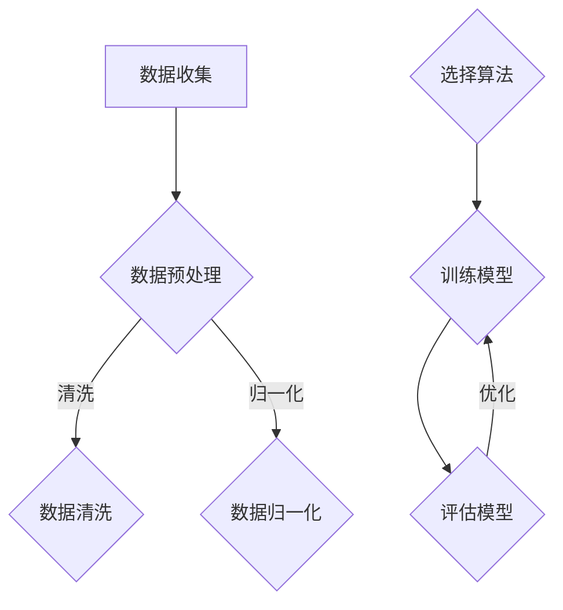
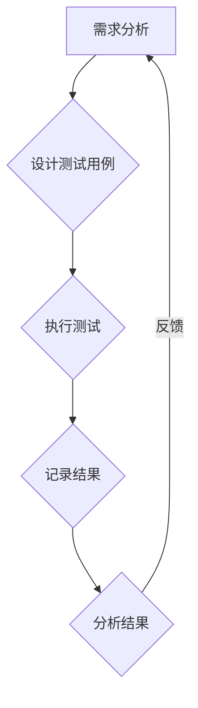
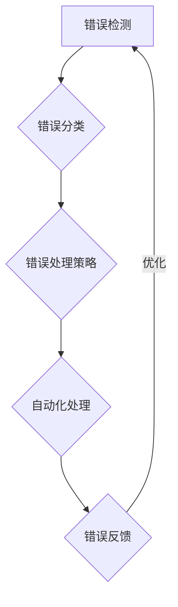

                 

### 文章标题

## 处理错误码的三种典型技术盲区

### 关键词：错误码处理，技术盲区，故障注入，自动化处理，分布式系统

### 摘要：

在现代软件开发中，错误码处理是确保系统稳定性和可靠性的关键环节。然而，开发者往往在处理错误码时陷入技术盲区，导致问题难以解决。本文将深入探讨处理错误码的三种典型技术盲区，并分析其原因及解决方法，以期为开发者提供有益的指导。

## 引言

错误码是软件系统在运行过程中产生的指示性信息，用于标识故障或异常情况。合理处理错误码能够提高系统的稳定性和用户体验。然而，在实际开发中，开发者常常面临以下技术盲区：

1. **模式识别与机器学习的局限性**：虽然机器学习在错误码处理中具有优势，但其效果受到数据质量和算法选择的影响。
2. **故障注入与测试的不足**：故障注入和测试在提高系统健壮性方面具有重要意义，但实施过程中存在困难。
3. **自动化错误处理与恢复的复杂性**：自动化错误处理和恢复是提高系统可靠性的一种手段，但其实现复杂，难以全面覆盖所有场景。

本文将围绕这三个盲区，逐步分析其成因、影响及解决策略。

## 第一种盲区：模式识别与机器学习的局限性

### 背景介绍

随着机器学习技术的发展，许多开发者在处理错误码时开始采用机器学习方法。这种方法依赖于大量历史错误数据来训练模型，从而实现自动识别和分类错误码。然而，这种方法并非万能，存在一定的局限性。

### 问题背景

- **数据质量问题**：错误数据的质量直接影响到模型的准确性。如果数据存在噪声、缺失或错误，模型的性能将大打折扣。
- **算法选择问题**：不同的机器学习算法适用于不同的数据特征和问题类型。选择不当的算法可能导致模型无法有效处理特定类型的错误码。

### 问题描述

- **数据不足**：在实际应用中，获取大量的高质量错误数据往往比较困难，导致模型训练效果不佳。
- **模型泛化能力差**：训练好的模型在面对新类型或未知错误时，往往无法准确识别和分类。

### 问题解决

- **数据预处理**：通过数据清洗、归一化等预处理方法，提高数据质量。
- **算法选择与优化**：根据问题类型和数据特征，选择合适的机器学习算法，并不断优化模型参数。

### 边界与外延

- **数据多样性**：增加数据多样性，涵盖不同类型和场景的错误码。
- **持续学习**：模型应具备持续学习的能力，以应对不断变化的环境。

### 概念结构与核心要素组成

- **核心概念**：机器学习，错误码分类，数据质量，算法选择。
- **联系**：数据质量影响算法选择，算法选择影响模型性能。

### Mermaid 流程图

### 算法原理讲解

#### 错误码分类算法原理

- **K近邻算法（KNN）**：基于距离最近的K个样本进行分类。
  - 数学模型：\( C = \arg\max(C_i \cdot N(K, x)) \)
    其中，\( C \) 为分类结果，\( C_i \) 为类别，\( N(K, x) \) 为K个近邻样本。

- **支持向量机（SVM）**：通过找到一个超平面将不同类别的样本分隔开。
  - 数学模型：\( w \cdot x + b = 0 \)
    其中，\( w \) 为超平面参数，\( x \) 为样本特征，\( b \) 为偏置。

#### 举例说明

假设有一个包含正类和负类的错误码数据集，使用KNN算法进行分类：

- **训练数据**：包含100个样本，其中正类和负类各占一半。
- **测试数据**：包含10个新样本，需要分类。

通过计算测试样本与训练样本之间的距离，选择距离最近的K个样本，根据这K个样本的分类结果进行投票，确定最终分类结果。

### 数学公式

$$
C = \arg\max(C_i \cdot N(K, x))
$$

$$
w \cdot x + b = 0
$$

## 第二种盲区：故障注入与测试的不足

### 背景介绍

故障注入与测试是提高系统健壮性的重要手段。通过模拟各种故障场景，可以检验系统的错误处理能力。然而，在实际实施过程中，存在一些技术难题。

### 问题背景

- **测试覆盖不足**：故障注入和测试难以覆盖所有可能的故障场景，可能导致系统在某些特定情况下出现错误。
- **测试实施难度**：故障注入和测试需要对系统有深入的理解，实施过程复杂，耗时较长。

### 问题描述

- **测试覆盖率低**：某些关键故障场景可能未能被覆盖，导致系统在实际运行中出现问题。
- **测试效率低**：故障注入和测试需要大量的时间和资源，测试效率较低。

### 问题解决

- **增加测试覆盖范围**：通过多种测试方法，如黑盒测试、白盒测试等，提高测试覆盖范围。
- **自动化测试**：引入自动化测试工具，提高测试效率。

### 边界与外延

- **测试频率**：定期进行故障注入和测试，确保系统能够应对各种故障场景。
- **测试资源**：合理分配测试资源，确保测试工作的顺利开展。

### 概念结构与核心要素组成

- **核心概念**：故障注入，测试覆盖，测试效率。
- **联系**：测试覆盖率影响测试效率，测试效率影响系统健壮性。

### Mermaid 流程图

### 算法原理讲解

#### 故障注入算法原理

- **随机故障注入**：随机选择系统中的某些组件或模块，模拟故障。
  - 数学模型：\( F(x) = \text{random()} \)
    其中，\( F(x) \) 表示故障注入结果，\( \text{random()} \) 表示随机选择。

- **基于规则的故障注入**：根据系统规则和逻辑，模拟故障。
  - 数学模型：\( F(x) = \text{rule-based()} \)
    其中，\( F(x) \) 表示故障注入结果，\( \text{rule-based()} \) 表示基于规则的选择。

#### 举例说明

假设有一个包含多个组件的系统，需要模拟网络故障场景：

- **训练数据**：定义网络故障规则，如延迟、丢包等。
- **测试数据**：模拟网络故障，检查系统对故障的处理能力。

通过随机选择或基于规则的方式，模拟网络故障，观察系统响应并记录结果。

### 数学公式

$$
F(x) = \text{random()}
$$

$$
F(x) = \text{rule-based()}
$$

## 第三种盲区：自动化错误处理与恢复的复杂性

### 背景介绍

自动化错误处理与恢复是提高系统可靠性的重要手段。通过自动化工具，可以快速识别和处理错误，减少人工干预。然而，自动化处理并非万能，存在一定的复杂性。

### 问题背景

- **错误复杂性**：错误类型繁多，难以全面覆盖所有错误场景。
- **系统依赖性**：自动化错误处理工具需要依赖系统的具体实现，实现过程复杂。

### 问题描述

- **错误处理不全**：自动化错误处理工具可能无法处理某些特定类型的错误，导致系统瘫痪。
- **系统兼容性**：自动化错误处理工具与系统之间的兼容性可能存在问题，影响其正常运行。

### 问题解决

- **错误分类与优先级**：对错误进行分类，根据优先级进行自动化处理。
- **系统适配与优化**：针对具体系统进行适配和优化，确保自动化错误处理工具的有效运行。

### 边界与外延

- **错误反馈机制**：建立错误反馈机制，及时发现和纠正自动化错误处理中的问题。
- **持续优化**：根据错误处理效果，不断优化自动化错误处理策略。

### 概念结构与核心要素组成

- **核心概念**：自动化错误处理，错误分类，系统适配。
- **联系**：错误分类影响自动化处理策略，系统适配影响工具的有效性。

### Mermaid 流程图

### 算法原理讲解

#### 自动化错误处理算法原理

- **规则引擎**：基于规则进行错误处理。
  - 数学模型：\( P(E) = \text{apply-rule}(E) \)
    其中，\( P(E) \) 表示处理结果，\( \text{apply-rule}(E) \) 表示应用规则。

- **机器学习**：通过机器学习模型进行错误预测和处理。
  - 数学模型：\( P(E) = \text{model-predict}(E) \)
    其中，\( P(E) \) 表示处理结果，\( \text{model-predict}(E) \) 表示模型预测。

#### 举例说明

假设有一个包含多个模块的系统，需要自动化处理错误：

- **训练数据**：定义错误规则和模型。
- **测试数据**：模拟错误场景，观察自动化错误处理的效果。

通过规则引擎或机器学习模型，对错误进行分类和预测，然后根据处理策略进行自动化处理。

### 数学公式

$$
P(E) = \text{apply-rule}(E)
$$

$$
P(E) = \text{model-predict}(E)
$$

## 总结

处理错误码是软件开发中的重要环节，然而开发者往往在处理过程中陷入技术盲区。本文分析了处理错误码的三种典型技术盲区：模式识别与机器学习的局限性、故障注入与测试的不足以及自动化错误处理与恢复的复杂性。通过深入探讨这些盲区，本文提出了相应的解决策略，以期为开发者提供有益的指导。

## 最佳实践 Tips

1. **数据质量**：确保错误数据的质量，通过数据预处理提高模型准确性。
2. **测试覆盖**：增加测试覆盖范围，确保系统健壮性。
3. **自动化优化**：针对具体系统进行自动化错误处理策略的优化，提高处理效果。

## 小结

本文详细分析了处理错误码的三种典型技术盲区，并提出了相应的解决策略。通过本文的探讨，开发者可以更好地理解和应对错误码处理中的挑战，提高系统的稳定性和可靠性。

## 注意事项

1. **数据多样性**：增加错误数据的多样性，提高模型泛化能力。
2. **持续学习**：持续优化自动化错误处理工具，以应对不断变化的环境。

## 拓展阅读

1. **《深入理解计算机系统》（Henry S. Warren）**：介绍了计算机系统的基本原理和性能优化方法。
2. **《机器学习实战》（Peter Harrington）**：介绍了机器学习的基本概念和应用。
3. **《软件测试的艺术》（Louise tissue）**：详细阐述了软件测试的方法和技巧。

### 作者

**作者：AI天才研究院/AI Genius Institute & 禅与计算机程序设计艺术 /Zen And The Art of Computer Programming**

