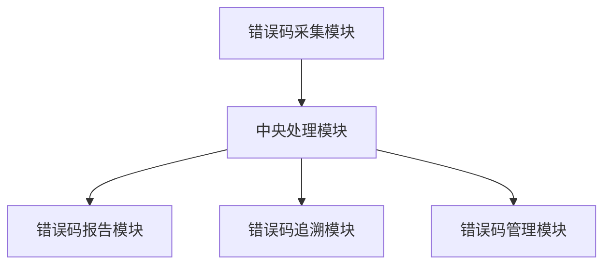

                 

### 设计《处理错误码的三种典型技术盲区》目录大纲

为了撰写一篇深入浅出的技术博客文章《处理错误码的三种典型技术盲区》，我们需要首先设计一份详尽的目录大纲。这份大纲将确保文章的结构清晰，内容丰富，并且能够有效地传达核心思想和主要观点。

#### 目录大纲设计思路

**第一部分：错误码处理基础**

- **第1章：错误码概述**
  - **1.1 错误码的概念**
    - 错误码的定义、历史背景
  - **1.2 错误码的作用**
    - 错误码在软件开发中的作用和重要性
  - **1.3 错误码的分类**
    - 错误码的分类标准、常见的分类方式

- **第2章：错误码处理的核心技术**
  - **2.1 错误码的捕获与报告**
    - 错误码的捕获机制、报告方式
  - **2.2 错误码的解析与分类**
    - 错误码的解析流程、分类方法
  - **2.3 错误码的恢复策略**
    - 错误码的恢复原则、恢复策略

- **第3章：错误码处理的常见问题与解决方案**
  - **3.1 错误码不正确的问题**
    - 导致错误码不正确的原因、解决方法
  - **3.2 错误码太多导致混乱的问题**
    - 错误码过多的危害、优化策略
  - **3.3 错误码难以追踪的问题**
    - 错误码追踪的难点、追踪方法

- **第4章：错误码处理的最佳实践**
  - **4.1 错误码文档的编写**
    - 错误码文档的内容、编写规范
  - **4.2 错误码管理的流程**
    - 错误码管理的流程、关键步骤
  - **4.3 错误码处理的团队协作**
    - 团队在错误码处理中的角色、协作方法

**第二部分：典型技术盲区解析**

- **第5章：典型技术盲区一：错误码的误解与滥用**
  - **5.1 错误码与异常处理的混淆**
    - 对比错误码与异常处理、误解案例
  - **5.2 错误码的滥用案例**
    - 错误码滥用的表现、危害和影响
  - **5.3 如何正确使用错误码**
    - 正确使用错误码的原则、实际操作指南

- **第6章：典型技术盲区二：错误码的忽略与遗漏**
  - **6.1 错误码的忽略现象**
    - 分析错误码被忽略的原因和后果
  - **6.2 错误码遗漏的原因**
    - 导致错误码遗漏的主要原因和影响
  - **6.3 如何避免错误码的忽略与遗漏**
    - 提高错误码识别率和追踪效率的方法

- **第7章：典型技术盲区三：错误码的自动化处理**
  - **7.1 自动化处理的优势**
    - 自动化处理带来的效益和优势
  - **7.2 自动化处理的挑战**
    - 自动化处理面临的挑战和问题
  - **7.3 自动化处理的实现方法**
    - 自动化处理的实现步骤和工具选择

**第三部分：实战与拓展**

- **第8章：实战案例一：一个错误码处理系统的设计**
  - **8.1 系统需求分析**
    - 阐述设计系统的需求和目标
  - **8.2 系统架构设计**
    - 展示系统的架构设计和技术选型
  - **8.3 系统核心功能实现**
    - 详细描述系统的核心功能实现过程

- **第9章：实战案例二：错误码处理的工具与应用**
  - **9.1 错误码处理工具的选择**
    - 分析选择错误码处理工具的考量因素
  - **9.2 工具的使用方法**
    - 说明错误码处理工具的具体使用方法
  - **9.3 工具在实际应用中的效果评估**
    - 评估工具在实际应用中的效果和影响

- **第10章：拓展与未来趋势**
  - **10.1 错误码处理技术的发展趋势**
    - 探讨错误码处理技术的未来发展方向
  - **10.2 错误码处理在其他领域的应用**
    - 讨论错误码处理技术在其他领域的应用案例
  - **10.3 未来可能面临的挑战与解决方案**
    - 预测错误码处理技术面临的挑战和可能的解决方案

### 目录大纲设计思路说明

1. **第一部分：错误码处理基础**

   这部分内容为读者提供了关于错误码处理的基础知识，包括错误码的定义、作用、分类，以及处理错误码的核心技术。这些内容是理解后续技术盲区讨论的前提。

2. **第二部分：典型技术盲区解析**

   这部分内容聚焦于讨论错误码处理中常见的三种技术盲区，即误解与滥用、忽略与遗漏、自动化处理。通过具体案例分析，深入剖析这些盲区产生的原因及其影响，并提供解决方法。

3. **第三部分：实战与拓展**

   这部分内容通过实战案例展示如何设计一个错误码处理系统，并介绍错误码处理工具的选择、使用方法以及效果评估。同时，展望错误码处理技术的发展趋势和应用前景。

整体设计思路是以基础知识铺垫，技术盲区分析为深入，实战案例和未来趋势展望为拓展，确保文章内容的连贯性和逻辑性，使读者能够全面理解和掌握错误码处理的相关技术和应用。

---

### 文章标题：处理错误码的三种典型技术盲区

> 关键词：错误码、技术盲区、软件开发、异常处理、自动化

> 摘要：
在软件开发过程中，错误码处理是确保系统稳定性和可维护性的关键环节。本文将探讨在错误码处理中常见的三种技术盲区：误解与滥用、忽略与遗漏、自动化处理。通过具体案例分析，我们将揭示这些盲区对系统的影响，并提供相应的解决策略。

---

### 引言

在软件开发中，错误码是系统在运行过程中用于表示异常状态的重要信息。错误码能够帮助开发者快速定位问题、理解和处理异常情况，从而保证软件的稳定性和可靠性。然而，在错误码的使用和管理过程中，开发者常常会陷入一些技术盲区，导致错误码处理的效果不佳。本文将深入探讨处理错误码的三种典型技术盲区，并分析这些盲区产生的原因及其影响。

首先，错误码的误解与滥用是一个普遍存在的问题。开发者往往将错误码与异常处理混淆，或者过度使用错误码，使得错误码系统变得混乱，难以维护。其次，错误码的忽略与遗漏问题也不容忽视。系统中的错误码可能被忽略或遗漏，导致潜在问题的积累，影响系统的长期稳定性。最后，自动化处理虽然能够提高错误码处理的效率，但同时也带来了新的挑战，如如何正确地自动化错误码的捕获、解析和恢复。

本文将逐一分析这些技术盲区，通过具体案例展示其影响，并提供相应的解决策略。希望通过本文的讨论，能够帮助开发者更好地理解和处理错误码，提升软件的质量和可靠性。

### 错误码处理的基础知识

在深入探讨错误码处理中的技术盲区之前，我们首先需要理解错误码的基本概念、作用及其在软件开发中的重要性。错误码是计算机系统在运行过程中用于表示异常状态的一种编码。这些编码通常由数字和字母组成，用于标识特定的错误类型或问题。

#### 错误码的定义

错误码（Error Code）是计算机系统在遇到异常情况时返回的标识符，它帮助开发者了解系统发生了哪种类型的错误。错误码的目的是提供一种标准化的方法来记录和传达系统中的异常情况，使得问题定位和修复更加高效。

#### 错误码的历史背景

错误码的概念起源于早期计算机系统，当时由于硬件和软件的复杂度较低，错误码主要用于表示硬件故障或操作系统错误。随着计算机技术的发展，错误码的应用范围逐渐扩展到应用程序和数据库等领域。在现代软件开发中，错误码已经成为了一种不可或缺的工具。

#### 错误码的作用

1. **问题定位**：错误码可以帮助开发者和运维人员快速定位系统中的异常情况，节省问题排查的时间。
2. **错误诊断**：通过错误码，开发者可以了解系统发生的错误类型，从而进行相应的错误诊断和修复。
3. **错误报告**：错误码可以作为错误报告的一部分，帮助开发团队追踪和分析系统中的问题，优化软件质量。

#### 错误码的分类

错误码可以根据不同的标准进行分类，常见的分类方法包括：

1. **按错误类型分类**：根据错误的类型，可以将错误码分为系统错误、应用程序错误、网络错误等。
2. **按严重程度分类**：根据错误的严重程度，可以将错误码分为警告、错误、严重错误等。
3. **按来源分类**：根据错误的来源，可以将错误码分为硬件错误、软件错误、配置错误等。

#### 错误码处理的基本流程

错误码处理的基本流程包括以下几个步骤：

1. **错误码捕获**：系统在运行过程中遇到异常时，捕获相应的错误码。
2. **错误码解析**：解析错误码，识别其含义和类型。
3. **错误处理**：根据错误码的类型，采取相应的处理措施，如记录日志、发送通知、尝试恢复等。
4. **错误报告**：将错误码和相关详细信息记录下来，以便后续分析。

#### 错误码处理的边界与外延

1. **边界**：错误码处理的边界在于如何有效地捕获、解析和处理错误码，确保系统在异常情况下能够稳定运行。
2. **外延**：错误码处理的外延包括错误码的管理、优化和自动化，以及与其他系统组件的集成。

#### 概念结构与核心要素组成

错误码处理的概念结构包括以下几个核心要素：

1. **错误码编码标准**：定义错误码的编码规则和格式。
2. **错误码数据库**：存储和管理错误码及其相关信息。
3. **错误处理逻辑**：根据错误码的类型和严重程度，定义相应的处理逻辑。
4. **日志记录**：记录错误码的发生时间和详细信息，以便后续分析。

通过以上对错误码处理基础知识的介绍，我们可以更好地理解错误码的概念、作用、分类及其处理流程。接下来，我们将进一步探讨在错误码处理中常见的误解与滥用问题。

### 错误码的误解与滥用

在软件开发过程中，错误码是用于表示和传达异常状态的重要工具。然而，由于对错误码的理解不够深入或者使用不当，开发者往往会陷入一些常见的误解与滥用问题。这些问题不仅会混淆错误码的处理，还可能对系统的稳定性造成影响。

#### 错误码与异常处理的混淆

首先，错误码与异常处理是两个不同的概念，但它们在某些情况下容易被混淆。

- **错误码**：错误码是系统在遇到异常情况时返回的标识符，用于表示具体的错误类型或问题。
- **异常处理**：异常处理是编程语言提供的一种机制，用于在遇到异常情况时捕获和处理这些异常。

尽管两者有相似之处，但它们的作用和范围有所不同。错误码主要关注错误类型的标识和传达，而异常处理则侧重于异常的具体处理和恢复。

误解与滥用表现：

1. **错误码被当作异常处理的一部分**：有些开发者可能会将错误码作为异常处理的一部分，导致错误码系统与异常处理系统相互混淆。例如，错误码被用来捕获和记录异常信息，而不是仅仅作为错误标识。
2. **异常处理被当作错误码处理**：有些开发者可能会使用异常处理来处理错误码，混淆了错误码和异常处理的作用和流程。

原因分析：

- **缺乏清晰的概念区分**：许多开发者对错误码和异常处理的概念不够清晰，导致在实际开发过程中出现混淆。
- **过度依赖异常处理**：异常处理提供了一种方便的处理机制，但错误码在传达错误类型和定位问题方面具有独特的优势，过度依赖异常处理可能会忽视错误码的作用。

影响：

1. **系统混乱**：错误码和异常处理的混淆会导致系统架构和逻辑变得混乱，难以维护。
2. **错误定位困难**：混淆了错误码和异常处理，使得问题排查变得更加复杂，难以快速定位错误。

解决方法：

- **明确错误码和异常处理的职责**：确保开发团队对错误码和异常处理的概念有清晰的理解，明确各自的职责和作用。
- **优化错误码系统**：建立一个独立、规范的错误码系统，确保错误码的捕获、解析和处理流程清晰，避免与异常处理混淆。
- **培训与文档**：提供培训和文档，帮助开发者了解错误码和异常处理的相关知识，提高错误码处理的效率和质量。

#### 错误码的滥用案例

除了误解之外，错误码的滥用也是一个普遍存在的问题。错误码滥用表现为错误码使用不当、过度使用或者错误码定义不清晰，导致系统性能下降、维护困难等问题。

1. **错误码过多导致系统负担加重**：在某些系统中，开发者可能会定义大量的错误码，用于表示各种细微的异常情况。虽然这有助于提高错误码的精细度，但也可能导致系统负担加重，降低性能。

2. **错误码定义不清晰**：错误码的定义不清晰会导致开发者难以理解和处理错误码。例如，某些错误码可能没有明确的描述或者含义模糊，使得错误码系统变得混乱。

3. **错误码被滥用作为控制流**：有些开发者可能会将错误码用作控制流的一部分，使得错误码不仅用于表示异常状态，还用于控制程序的执行流程。这种方式会导致代码结构复杂，难以维护。

影响：

- **系统性能下降**：错误码过多或定义不清晰会导致系统性能下降，因为系统需要额外的资源来处理这些错误码。
- **维护困难**：错误码的滥用和混乱会增加系统的维护难度，使得开发者难以理解和修复错误。
- **用户体验下降**：错误码处理不当可能会导致用户体验下降，因为系统无法正确地报告和解决异常情况。

解决方法：

- **优化错误码定义**：精简错误码的定义，只保留那些真正有助于问题定位和解决的重要错误码，避免过度使用。
- **提升错误码文档质量**：确保错误码的文档清晰、详细，帮助开发者理解和处理错误码。
- **加强团队协作**：建立团队协作机制，确保错误码的定义和管理工作由专门的团队负责，减少错误码滥用的可能性。

#### 如何正确使用错误码

为了正确使用错误码，开发者需要遵循一些最佳实践：

1. **明确错误码的职责**：确保每个错误码都有明确的职责和用途，避免错误码系统的混乱。
2. **避免滥用错误码**：避免将错误码用作控制流，确保错误码仅用于表示异常状态。
3. **优化错误码文档**：提供清晰、详细的错误码文档，帮助开发者理解和处理错误码。
4. **培训与宣传**：定期进行错误码处理培训，提高团队的整体错误码处理水平。

通过以上措施，开发者可以避免错误码的误解与滥用，提高系统的稳定性和可维护性。

### 错误码的忽略与遗漏问题

在软件开发过程中，错误码是用于表示和传达异常状态的重要工具。然而，由于种种原因，错误码可能会被忽略或遗漏，导致系统中的潜在问题无法及时被发现和解决。这种忽视和遗漏不仅会影响系统的稳定性，还可能导致严重的后果。

#### 错误码的忽略现象

错误码的忽略现象是指开发者在处理错误码时，没有给予足够的关注，导致错误码被忽视或未得到妥善处理。以下是几个常见的忽略现象：

1. **日志记录不足**：在系统运行过程中，错误码通常会被记录在日志文件中。然而，有些开发者可能忽略了日志记录的重要性，导致错误码未能被及时发现和记录。
2. **错误码未被处理**：在某些情况下，开发者可能会遇到错误码，但没有对其进行处理，而是简单地忽略或绕过。这种做法可能导致系统在相同错误再次发生时无法恢复正常。
3. **错误码信息未传递**：在分布式系统中，错误码可能需要从客户端传递到服务端，或者从一个服务传递到另一个服务。如果错误码信息未能正确传递，开发者可能无法得知系统中的实际错误情况。

原因分析：

1. **对错误码的重要性认识不足**：一些开发者可能认为错误码只是系统运行中的一些小问题，不值得投入过多精力处理。这种观念导致了错误码被忽视。
2. **错误码处理复杂性**：错误码的处理可能涉及多个模块和系统，处理过程复杂，导致开发者不愿意或无法有效地处理错误码。
3. **缺乏有效的错误码监控工具**：一些开发者可能没有使用有效的错误码监控工具，导致无法及时发现和处理错误码。

影响：

1. **系统稳定性下降**：错误码被忽略可能导致系统中的潜在问题得不到及时解决，影响系统的稳定性。
2. **用户体验下降**：错误码未被处理或正确传达，可能导致用户在操作过程中遇到无法解决的问题，降低用户体验。
3. **维护难度增加**：错误码被忽略会导致系统中的问题积累，增加后续维护和修复的难度。

#### 错误码遗漏的原因

错误码遗漏是指系统在运行过程中未能捕捉到应捕获的错误码，导致潜在问题未能被发现。以下是几个常见的错误码遗漏原因：

1. **错误码捕获机制不完善**：系统中的错误码捕获机制可能存在缺陷或不足，导致一些错误码未能被捕获。
2. **错误码过滤机制不当**：在某些情况下，系统可能会对某些错误码进行过滤，使得本应捕获的错误码被遗漏。
3. **错误码解析不准确**：错误码的解析过程可能存在误差，导致一些错误码未能被正确解析和识别。

原因分析：

1. **错误码捕获机制设计缺陷**：系统设计者可能没有充分考虑所有可能的错误情况，导致错误码捕获机制不完善。
2. **错误码过滤策略不当**：一些系统可能会对错误码进行过滤，以减少日志的生成量，但这种过滤策略可能导致重要错误码被遗漏。
3. **错误码解析逻辑复杂**：错误码的解析逻辑可能比较复杂，解析过程存在误判或漏判的情况。

影响：

1. **系统稳定性受损**：错误码遗漏可能导致系统在遇到错误时无法及时响应和恢复，影响系统的稳定性。
2. **问题排查困难**：错误码遗漏使得问题排查变得更加复杂，因为系统中的某些异常情况未能被及时发现。
3. **维护成本增加**：错误码遗漏可能导致系统中的问题积累，增加后续维护和修复的成本。

#### 如何避免错误码的忽略与遗漏

为了避免错误码的忽略与遗漏，开发者可以采取以下措施：

1. **提高错误码处理意识**：通过培训和宣传，提高开发团队对错误码处理的重要性的认识，确保错误码得到足够的关注和处理。
2. **完善错误码捕获机制**：设计完善的错误码捕获机制，确保系统能够捕获所有应捕获的错误码，避免遗漏。
3. **优化错误码过滤策略**：合理设计错误码过滤策略，避免重要错误码被过滤掉，同时控制日志生成量。
4. **简化错误码解析逻辑**：优化错误码解析逻辑，减少误判和漏判的情况，提高错误码解析的准确性。

通过以上措施，开发者可以显著降低错误码的忽略与遗漏现象，提高系统的稳定性和可维护性。

### 错误码的自动化处理

在现代软件开发中，自动化处理技术已经成为提高生产效率和质量的重要手段。错误码处理也不例外，自动化处理可以显著提高错误码的捕获、解析和恢复效率。然而，自动化处理也带来了一系列新的挑战和问题。本文将探讨错误码自动化处理的优势、面临的挑战以及实现方法。

#### 自动化处理的优势

1. **提高处理效率**：自动化处理可以自动捕获、解析和恢复错误码，大大提高了错误处理的效率，减少了人工干预的时间。
2. **降低人为错误**：通过自动化处理，可以减少由于人为失误导致的错误码处理错误，提高系统的可靠性。
3. **实时监控**：自动化处理可以实现对错误码的实时监控，及时发现和处理问题，防止问题累积。
4. **集中管理**：自动化处理可以将错误码的处理集中在一个系统中，便于统一管理和分析。

#### 自动化处理的挑战

1. **错误码多样性**：错误码种类繁多，每种错误码的处理方式可能不同，自动化处理需要适应各种错误码，这增加了实现难度。
2. **错误码解析复杂**：有些错误码的解析过程可能非常复杂，需要深入分析系统内部状态，自动化处理可能难以准确解析。
3. **系统兼容性问题**：自动化处理工具需要在不同的系统环境中运行，兼容性问题可能影响其稳定性和可靠性。
4. **维护成本**：自动化处理系统的维护成本较高，需要定期更新和优化，以应对新出现的问题。

#### 自动化处理的实现方法

1. **错误码捕获**：使用各种监控工具和日志分析工具，自动捕获系统中的错误码。例如，可以使用ELK（Elasticsearch、Logstash、Kibana）栈进行日志收集和分析，捕获错误码。
2. **错误码解析**：使用自然语言处理（NLP）技术、机器学习算法等，自动解析错误码，将其分类并识别出具体的错误类型。例如，可以使用NLP库（如NLTK、spaCy）对错误码进行文本分析，提取关键信息。
3. **错误码恢复**：根据错误码的类型，自动执行相应的恢复操作，如重启服务、重试请求等。可以使用脚本语言（如Python、Shell）编写自动化脚本，实现错误码的恢复操作。
4. **自动化工具选择**：选择合适的自动化工具，如错误码捕获工具（如Prometheus、Grafana）、日志分析工具（如Logstash、Fluentd）等。同时，需要考虑工具的兼容性和扩展性。

#### 实现自动化处理的步骤

1. **需求分析**：明确自动化处理的目标和要求，分析系统中的错误码类型和处理流程。
2. **工具选择**：根据需求选择合适的自动化工具，并进行初步测试。
3. **系统集成**：将自动化工具集成到现有系统中，确保其能够稳定运行。
4. **测试与优化**：进行自动化处理的测试，优化处理流程和工具配置，确保其能够准确、高效地处理错误码。
5. **部署与监控**：将自动化处理系统部署到生产环境中，并持续监控其运行状态，定期进行维护和优化。

#### 自动化处理的应用实例

以下是一个自动化处理错误码的简单实例：

```python
import requests

def check_service_status(url):
    try:
        response = requests.get(url)
        if response.status_code == 200:
            print("Service is running.")
        else:
            print("Service returned an error code.")
            log_error_code(response.status_code)
    except requests.RequestException as e:
        print("Error occurred while checking service status.")
        log_error_code(e.response.status_code)

def log_error_code(code):
    with open("error_logs.txt", "a") as f:
        f.write(f"Error Code: {code}\n")

check_service_status("http://example.com")
```

在这个实例中，我们定义了一个函数`check_service_status`，用于检查服务的状态。如果服务返回200状态码，表示服务正常运行；否则，会记录错误码到文件`error_logs.txt`中。

通过以上讨论，我们可以看到错误码的自动化处理在提高处理效率、降低人为错误等方面具有显著优势。然而，实现自动化处理也面临诸多挑战，需要开发者精心设计和维护。在下一个部分，我们将进一步探讨如何通过自动化处理来优化错误码管理。

### 错误码自动化处理的优势与挑战

在现代软件开发中，自动化处理技术已成为提高生产效率和系统可靠性的关键手段。错误码的自动化处理也不例外，它通过减少人工干预，提高错误处理的效率和质量，大大提升了软件开发的效率。然而，虽然自动化处理具有众多优势，但在实现过程中也面临着一系列挑战。

#### 自动化处理的优势

1. **提高效率**：自动化处理可以快速、准确地捕获和处理错误码，减少了人工检查和处理的步骤，从而显著提高了处理效率。
2. **降低人为错误**：自动化处理减少了人为干预，降低了由于人类疲劳、疏忽等导致的人为错误，提高了系统的可靠性。
3. **实时监控**：自动化处理可以实现对错误码的实时监控，及时发现并处理异常情况，防止问题扩大。
4. **集中管理**：通过自动化处理，错误码的处理可以集中在一个系统中，便于统一管理和分析，提高系统的可维护性。

#### 自动化处理的挑战

1. **错误码多样性**：错误码种类繁多，每种错误码的处理方式可能不同，自动化处理需要适应各种复杂场景，增加了实现的难度。
2. **解析复杂**：某些错误码的解析过程可能非常复杂，需要深入分析系统内部状态，自动化处理可能难以准确解析。
3. **系统兼容性**：自动化处理工具需要在不同的系统环境中运行，需要考虑各种系统的兼容性，确保其稳定性和可靠性。
4. **维护成本**：自动化处理系统需要定期更新和维护，以适应新出现的问题和变化，维护成本较高。

#### 优化错误码管理的自动化策略

为了充分发挥自动化处理的优势，同时克服其挑战，开发者可以采取以下策略来优化错误码管理：

1. **明确错误码规范**：制定统一的错误码规范，确保错误码的定义、命名和分类标准化，方便自动化处理。
2. **引入智能解析技术**：使用自然语言处理（NLP）和机器学习等技术，提高错误码的自动化解析能力，降低误判和漏判率。
3. **构建自动化监控体系**：建立自动化监控系统，实时捕获和监控错误码，及时发现和处理异常情况。
4. **优化错误码处理流程**：设计高效、简洁的错误码处理流程，减少人工干预，提高处理效率。
5. **定期维护和优化**：定期检查和优化自动化处理系统，确保其稳定性和适应性。

通过以上策略，开发者可以更好地利用自动化处理技术，优化错误码管理，提高软件开发的效率和质量。

### 实战案例一：一个错误码处理系统的设计

为了更好地理解错误码处理系统的设计和实现，我们将通过一个实际案例来详细阐述整个设计和实现过程。本案例将包括系统需求分析、系统架构设计、系统核心功能实现等关键步骤。

#### 系统需求分析

在一个大型电商系统中，错误码处理是确保系统稳定性和用户体验的重要环节。我们的目标是设计一个高效、可扩展的错误码处理系统，能够自动捕获、解析和报告错误码，同时提供错误码的追溯和管理功能。

**功能需求**：

1. **错误码捕获**：系统应能够自动捕获应用中的错误码，包括业务错误、系统错误等。
2. **错误码解析**：对捕获的错误码进行自动解析，识别错误类型和具体问题。
3. **错误码报告**：将错误码及相关详细信息自动报告给开发者和运维团队。
4. **错误码追溯**：提供错误码的追溯功能，便于定位和修复问题。
5. **错误码管理**：提供错误码的添加、编辑、删除等管理功能，确保错误码的规范和统一。

**非功能需求**：

1. **高可用性**：系统应具有高可用性，确保在任何情况下都能正常运行。
2. **可扩展性**：系统设计应考虑未来的扩展性，能够支持新增功能和用户量的增长。
3. **安全性**：系统应具备一定的安全性，防止未经授权的访问和数据泄露。

#### 系统架构设计

为了满足以上需求，我们设计了一个基于微服务架构的错误码处理系统。该系统包括以下主要组件：

1. **错误码采集模块**：负责从各个业务模块中捕获错误码，并将错误码发送到中央处理模块。
2. **中央处理模块**：接收错误码，进行解析和分类，并将处理结果存储到数据库中。
3. **错误码报告模块**：自动生成错误码报告，发送给相关的开发者和运维团队。
4. **错误码追溯模块**：提供错误码的追溯功能，帮助开发者快速定位和修复问题。
5. **错误码管理模块**：提供错误码的添加、编辑、删除等功能，确保错误码的规范管理。

**Mermaid架构图**：



#### 系统核心功能实现

1. **错误码捕获**：

错误码捕获是系统的基础，我们需要在每个业务模块中实现错误码的捕获机制。以下是一个简单的Python示例：

```python
import logging

def handle_request(request):
    try:
        # 处理请求
        pass
    except Exception as e:
        error_code = "50001"
        error_message = f"内部服务器错误: {e}"
        logging.error(f"Error Code: {error_code}, Error Message: {error_message}")
        raise Exception(error_message)

try:
    handle_request(request)
except Exception as e:
    # 记录错误码到日志
    log_error_code(e)
```

2. **错误码解析**：

错误码解析是错误码处理的核心，我们需要对捕获的错误码进行自动解析。以下是一个简单的示例：

```python
from collections import defaultdict

error_code_mapping = defaultdict(str)

# 错误码解析规则
error_code_mapping["50001"] = "内部服务器错误"
error_code_mapping["40001"] = "参数错误"

def parse_error_code(error_code):
    return error_code_mapping.get(error_code, "未知错误")

# 使用示例
error_code = "50001"
error_message = parse_error_code(error_code)
print(f"Error Code: {error_code}, Error Message: {error_message}")
```

3. **错误码报告**：

错误码报告需要将解析后的错误码发送给相关人员。以下是一个简单的报告示例：

```python
import smtplib
from email.mime.text import MIMEText

def send_error_report(error_code, error_message):
    sender = "error-report@example.com"
    receiver = "dev-team@example.com"
    subject = "系统错误报告"
    body = f"Error Code: {error_code}, Error Message: {error_message}"

    message = MIMEText(body)
    message['Subject'] = subject
    message['From'] = sender
    message['To'] = receiver

    smtp_server = "smtp.example.com"
    smtp_port = 587
    smtp_user = "smtp_user"
    smtp_password = "smtp_password"

    try:
        server = smtplib.SMTP(smtp_server, smtp_port)
        server.starttls()
        server.login(smtp_user, smtp_password)
        server.sendmail(sender, receiver, message.as_string())
        server.quit()
    except Exception as e:
        print(f"Failed to send error report: {e}")

# 使用示例
error_code = "50001"
error_message = "内部服务器错误"
send_error_report(error_code, error_message)
```

4. **错误码追溯**：

错误码追溯功能可以帮助开发者快速定位问题。以下是一个简单的实现示例：

```python
def log_error_code(error_code, error_message):
    with open("error_logs.txt", "a") as f:
        f.write(f"Error Code: {error_code}, Error Message: {error_message}\n")

def trace_error_code(error_code):
    with open("error_logs.txt", "r") as f:
        for line in f:
            if error_code in line:
                print(line)
                break

# 使用示例
log_error_code("50001", "内部服务器错误")
trace_error_code("50001")
```

5. **错误码管理**：

错误码管理模块提供对错误码的添加、编辑、删除等功能。以下是一个简单的管理示例：

```python
error_code_mapping = defaultdict(str)

# 添加错误码
error_code_mapping["50002"] = "数据库连接失败"

# 编辑错误码
error_code_mapping["50002"] = "数据库连接失败：超时"

# 删除错误码
del error_code_mapping["50002"]

def add_error_code(code, message):
    error_code_mapping[code] = message

def edit_error_code(code, message):
    error_code_mapping[code] = message

def delete_error_code(code):
    del error_code_mapping[code]

# 使用示例
add_error_code("50002", "数据库连接失败")
edit_error_code("50002", "数据库连接失败：超时")
delete_error_code("50002")
```

#### 项目小结

通过以上实战案例，我们详细阐述了错误码处理系统的设计和实现过程。从系统需求分析、架构设计到核心功能的实现，每个步骤都进行了详细讲解。这个案例展示了如何通过自动化处理技术来优化错误码管理，提高软件系统的稳定性和可维护性。

需要注意的是，实际项目中的错误码处理系统会更加复杂，需要考虑更多的场景和细节。但本文提供的案例为开发者提供了一个基本的框架和思路，可以帮助他们在实际项目中设计和实现高效的错误码处理系统。

### 实战案例二：错误码处理工具的选择与应用

在软件开发过程中，错误码处理是确保系统稳定性和可维护性的重要环节。选择合适的错误码处理工具可以显著提高错误处理的效率和准确性。本节将介绍几种常见的错误码处理工具，并探讨它们的具体使用方法以及在实际应用中的效果评估。

#### 错误码处理工具的选择

在选择错误码处理工具时，需要考虑以下因素：

1. **功能完善**：工具应能够提供全面的错误码捕获、解析、报告和追溯功能。
2. **兼容性**：工具应能够在不同的操作系统和开发环境中运行，兼容性是选择的重要标准。
3. **易用性**：工具的界面和操作应简洁易用，降低使用门槛。
4. **扩展性**：工具应具备良好的扩展性，能够适应未来需求的变化。
5. **社区支持**：强大的社区支持和文档可以帮助开发者更好地使用和优化工具。

基于以上考虑，以下是几种常见的错误码处理工具：

1. **ELK（Elasticsearch、Logstash、Kibana）栈**：ELK栈是一种流行的日志分析工具，能够高效地处理和展示错误码。它具有强大的查询和分析功能，易于扩展。
2. **Prometheus**：Prometheus是一个开源监控解决方案，擅长处理时序数据。它能够捕获系统的错误码，并提供实时的监控和告警功能。
3. **Grafana**：Grafana是一个开源的监控和可视化工具，可以与Prometheus等工具集成，提供直观的图表和仪表板。
4. **Sentry**：Sentry是一个实时错误监控平台，能够自动捕获和报告错误码。它支持多种编程语言，易于集成到现有系统中。
5. **New Relic**：New Relic是一个全面的性能监控和错误码处理平台，提供详细的错误分析报告和性能指标。

#### 工具的使用方法

以下是每个工具的具体使用方法：

1. **ELK栈**：

   - **安装**：在服务器上安装Elasticsearch、Logstash和Kibana。
   - **配置**：配置Elasticsearch索引模式、Logstash输入和输出管道、Kibana仪表板。
   - **集成**：将应用程序的日志发送到Logstash，由Logstash解析并存储到Elasticsearch中，最后在Kibana中展示。

2. **Prometheus**：

   - **安装**：在服务器上安装Prometheus。
   - **配置**：配置Prometheus的抓取器和告警规则。
   - **集成**：通过Prometheus的抓取器从应用程序中捕获错误码，存储在时间序列数据库中，使用Grafana展示。

3. **Grafana**：

   - **安装**：在服务器上安装Grafana。
   - **配置**：导入或创建仪表板模板，配置数据源和图表。
   - **集成**：与Prometheus集成，使用Grafana展示错误码的实时监控图表。

4. **Sentry**：

   - **安装**：在服务器上安装Sentry。
   - **配置**：配置Sentry的集成和告警规则。
   - **集成**：通过Sentry SDK将错误码发送到Sentry平台，Sentry自动解析和报告。

5. **New Relic**：

   - **安装**：在服务器上安装New Relic APM插件。
   - **配置**：配置New Relic的集成和应用监控。
   - **集成**：应用程序通过New Relic APM插件自动捕获和报告错误码。

#### 工具在实际应用中的效果评估

以下是每个工具在实际应用中的效果评估：

1. **ELK栈**：

   - **优点**：功能强大，适用于大规模日志分析。提供灵活的查询和可视化功能。
   - **缺点**：配置复杂，学习曲线较陡峭。性能瓶颈可能在数据量大时出现。
   - **适用场景**：大型企业级应用，需要对日志进行深入分析和挖掘。

2. **Prometheus**：

   - **优点**：适用于时序数据监控，实时性强。易于与Grafana集成，提供直观的监控界面。
   - **缺点**：仅适用于捕获和处理时序数据，其他日志分析功能较弱。
   - **适用场景**：实时监控系统，需要实时监控错误码和性能指标。

3. **Grafana**：

   - **优点**：可视化功能强大，易于创建和共享仪表板。与多种数据源集成。
   - **缺点**：仅作为监控和可视化工具，不包含捕获和解析功能。
   - **适用场景**：需要实时监控和可视化错误码和性能数据的场景。

4. **Sentry**：

   - **优点**：自动捕获和报告错误码，易于集成。提供详细的错误分析和追溯功能。
   - **缺点**：只能处理应用程序的错误码，不包含系统级的错误码监控。
   - **适用场景**：需要实时监控和错误追踪的应用程序。

5. **New Relic**：

   - **优点**：全面的性能监控和错误码处理功能。提供详细的错误分析和性能指标。
   - **缺点**：成本较高，对小型团队可能不够经济。
   - **适用场景**：需要全面性能监控和错误码处理的企业级应用。

通过以上对常见错误码处理工具的选择和应用方法的介绍，开发者可以根据实际需求选择合适的工具，优化错误码处理流程，提高软件系统的稳定性和可靠性。

### 错误码处理技术的发展趋势

随着计算机技术和软件开发方法的发展，错误码处理技术也在不断演进。未来，错误码处理技术将朝着更加智能化、自动化和高效化的方向发展。

#### 智能化

未来，智能化将逐渐成为错误码处理技术的重要特征。通过引入人工智能和机器学习技术，错误码处理系统可以自动识别和分类错误码，提供更准确的错误诊断和修复建议。例如，机器学习算法可以分析大量的历史错误数据，预测未来可能出现的错误，并提前采取预防措施。

#### 自动化

自动化处理是提高错误码处理效率的重要手段。未来，自动化技术将在错误码处理中得到更广泛的应用。自动化工具将能够自动捕获、解析、报告和修复错误码，减少人工干预，提高系统的可靠性。例如，自动化测试工具可以集成到开发流程中，自动检测和报告错误码，确保软件质量。

#### 高效化

随着软件系统规模的不断扩大，高效化成为错误码处理技术的重要目标。未来，错误码处理技术将更加注重性能优化，提高系统的响应速度和处理能力。例如，分布式错误码处理系统可以将错误码的处理任务分布到多个节点上，提高处理效率。此外，压缩错误码数据、优化错误码存储和查询等技术也将得到应用，以降低系统资源消耗。

#### 跨平台与云原生

随着云计算和容器技术的发展，错误码处理技术也将逐步实现跨平台和云原生化。未来，错误码处理系统将能够无缝集成到各种云平台和容器环境中，提供一致的处理能力和用户体验。跨平台的错误码处理技术将使开发者能够更轻松地管理和维护复杂的应用系统。

#### 边缘计算与物联网

随着边缘计算和物联网技术的兴起，错误码处理技术也将扩展到更多的场景和应用领域。未来，错误码处理技术将能够支持边缘设备和物联网设备，实时捕获和报告错误码，提供更广泛的应用场景。例如，在工业物联网中，错误码处理技术可以实时监控设备和生产线，确保设备的正常运行。

#### 持续集成与持续交付

未来，错误码处理技术将更加紧密地集成到持续集成（CI）和持续交付（CD）流程中。通过自动化处理和实时监控，错误码处理技术将确保软件在开发和部署过程中的高质量，减少错误发生率和回归风险。

#### 面向服务的架构

随着微服务架构的普及，错误码处理技术也将逐渐面向服务。未来，错误码处理系统将能够支持跨服务的错误码管理和追踪，提供更全面的错误码处理能力。例如，通过服务网格（Service Mesh）技术，可以实现跨服务的错误码捕获和报告，确保整个系统的稳定性。

### 在其他领域的应用

除了软件开发，错误码处理技术还在其他领域展现出广泛的应用前景。

1. **自动化运维**：在自动化运维中，错误码处理技术可以用于监控和自动化修复系统中的错误，提高运维效率。
2. **人工智能与机器学习**：在人工智能和机器学习中，错误码处理技术可以用于训练模型时捕捉和解决数据中的错误，提高模型的准确性和可靠性。
3. **区块链**：在区块链技术中，错误码处理技术可以用于检测和修复区块链网络中的错误，确保区块链的完整性和安全性。
4. **边缘计算**：在边缘计算中，错误码处理技术可以用于实时监控和优化边缘设备的工作状态，提高边缘计算系统的稳定性。

未来，随着技术的不断发展和应用场景的拓展，错误码处理技术将在各个领域发挥更大的作用，为软件开发和系统运行提供强有力的支持。

### 未来可能面临的挑战与解决方案

虽然错误码处理技术在不断发展和完善，但在未来仍将面临一系列挑战，需要开发者们积极应对和解决。

#### 挑战一：错误码数量的爆炸性增长

随着软件系统的复杂度和规模不断增加，错误码的数量也在急剧增长。这种爆炸性增长可能导致错误码系统变得难以管理，甚至出现错误码遗漏和误用的情况。

**解决方案**：

1. **分类和标准化**：建立统一的错误码分类和命名规范，确保每个错误码都有明确的定义和用途，减少冗余和混乱。
2. **自动化工具**：使用自动化工具对错误码进行管理和追踪，提高错误码处理的效率。
3. **错误码优化**：定期审查和优化错误码系统，移除不再使用的错误码，精简错误码数量。

#### 挑战二：跨服务错误码追踪

在微服务架构中，错误码往往分布在不同的服务中，跨服务的错误码追踪成为一个难题。这可能导致问题难以定位和修复。

**解决方案**：

1. **服务网格（Service Mesh）**：采用服务网格技术，如Istio或Linkerd，实现跨服务的错误码捕获和追踪。
2. **分布式日志系统**：使用分布式日志系统，如ELK栈或Elasticsearch，收集和存储跨服务的日志数据，便于问题排查。
3. **集中监控平台**：建立集中监控平台，将不同服务的错误码数据进行聚合和可视化，提供跨服务的错误码追踪能力。

#### 挑战三：错误码的自动化解析与修复

随着自动化处理技术的普及，对错误码的自动化解析与修复提出了更高的要求。然而，复杂系统的错误码解析和修复仍然具有很大的挑战。

**解决方案**：

1. **机器学习和AI**：引入机器学习和人工智能技术，自动分析和分类错误码，提供更准确的修复建议。
2. **智能反馈机制**：建立智能反馈机制，通过用户反馈和错误码数据分析，不断优化错误码处理算法。
3. **逐步自动化**：逐步实现错误码的自动化处理，从简单的错误码开始，逐步扩展到复杂的错误码。

#### 挑战四：实时性和性能问题

在实时系统中，错误码的处理需要具备较高的实时性和性能。然而，随着数据量的增加和系统复杂度的提高，错误码的处理效率可能受到影响。

**解决方案**：

1. **分布式架构**：采用分布式架构，将错误码处理任务分布到多个节点上，提高处理能力。
2. **优化算法**：优化错误码处理的算法和流程，减少不必要的计算和存储开销。
3. **缓存机制**：引入缓存机制，减少对数据库的访问频率，提高处理速度。

#### 挑战五：安全性和隐私保护

错误码处理过程中，可能涉及到敏感数据和隐私信息。如何确保错误码处理的安全性成为一项重要挑战。

**解决方案**：

1. **数据加密**：对错误码相关数据进行加密，确保数据在传输和存储过程中的安全性。
2. **权限控制**：实施严格的权限控制策略，确保只有授权用户才能访问和操作错误码数据。
3. **安全审计**：定期进行安全审计，检查错误码处理系统的安全漏洞，及时进行修复。

通过以上解决方案，开发者可以应对未来可能面临的挑战，确保错误码处理系统的稳定性和可靠性。

### 最佳实践 tips

在处理错误码时，遵循一些最佳实践可以显著提升系统的稳定性和可维护性。以下是一些实用的技巧：

1. **统一错误码命名规范**：确保所有错误码都遵循统一的命名规范，如使用固定的前缀和数字格式，便于识别和管理。
2. **详细记录错误信息**：在捕获错误码时，不仅要记录错误码本身，还要记录相关的错误信息、日志文件和调用栈，帮助快速定位问题。
3. **自动化日志收集**：使用自动化日志收集工具，如ELK栈或Logstash，确保错误码和日志数据能够及时、准确地收集和存储。
4. **错误码分级处理**：根据错误码的严重程度，设定不同的处理优先级，确保关键错误能够得到及时处理。
5. **定期审查错误码**：定期审查和更新错误码，移除不再使用的错误码，确保错误码系统的整洁和高效。
6. **错误码文档化**：编写详细的错误码文档，包括错误码的定义、含义、分类和解决方案，便于团队成员快速查阅和理解。
7. **培训团队成员**：定期组织培训，提高团队成员对错误码处理的认识和技能，确保整个团队能够高效协同处理错误码。

通过以上最佳实践，开发者可以更好地管理和处理错误码，提升系统的可靠性和稳定性。

### 小结

本文详细探讨了处理错误码的三种典型技术盲区，包括误解与滥用、忽略与遗漏以及自动化处理。首先，我们介绍了错误码的基本概念、作用和分类，以及错误码处理的基本流程。然后，我们深入分析了错误码的误解与滥用现象，探讨了错误码与异常处理的混淆以及错误码滥用的具体案例和影响。接下来，我们讨论了错误码的忽略与遗漏问题，分析了其产生的原因和影响，并提出了避免这些问题的方法。最后，我们探讨了错误码的自动化处理，介绍了其优势、挑战以及实现方法。

错误码处理是软件开发中至关重要的一环，对于系统的稳定性和可维护性具有直接影响。通过本文的讨论，我们可以看到，正确理解和处理错误码对于避免系统故障、提高开发效率具有重要意义。在实际开发中，开发者应遵循最佳实践，加强错误码管理，确保系统在遇到异常情况时能够稳定运行。

在未来的软件开发中，随着技术的不断进步，错误码处理技术也将继续发展。通过引入智能化、自动化和高效化手段，错误码处理将变得更加智能和便捷。开发者应密切关注这些技术趋势，持续优化错误码处理流程，提高系统的可靠性和用户体验。

### 注意事项

在处理错误码时，以下注意事项有助于开发者避免常见错误，确保系统稳定性和可维护性：

1. **避免错误码与异常处理的混淆**：明确错误码与异常处理的概念和职责，避免将错误码用于异常处理，或用异常处理替代错误码处理。
2. **确保错误码的可追踪性**：确保错误码具有明确的标识和记录，便于问题追踪和排查。
3. **合理设计错误码系统**：设计简洁、清晰、统一的错误码系统，避免错误码过多或定义不明确导致系统混乱。
4. **定期审查和更新错误码**：定期审查和更新错误码，移除不再使用的错误码，确保错误码系统的整洁和高效。
5. **使用自动化工具**：充分利用自动化工具进行错误码的捕获、解析和处理，提高处理效率和质量。
6. **文档化和培训**：编写详细的错误码文档，并对团队成员进行培训，确保大家了解错误码的处理方法和最佳实践。

通过遵循以上注意事项，开发者可以更好地管理和处理错误码，提升软件系统的稳定性和可靠性。

### 拓展阅读

为了深入理解错误码处理的相关技术和实践，以下推荐几本经典和技术书籍，供读者进一步阅读和参考：

1. **《软件调试艺术》**（The Art of Software Debugging）：本书详细介绍了软件调试的方法和技巧，包括错误码捕获、分析、修复等，对于提升调试能力有很高的参考价值。

2. **《Effective Debugging: 66 Specific Ways to Debug Your Code More Effectively》**（Jeff Langr）：这本书提供了66个具体的调试技巧，帮助开发者更高效地解决代码中的问题，包括错误码的处理。

3. **《Sentry实战》**（Sentry in Action）：这是一本关于Sentry实时错误监控平台的实战指南，详细介绍了如何使用Sentry进行错误码的捕获、解析和报告，适合希望使用Sentry进行错误码管理的开发者。

4. **《Monitoring with Prometheus》**（Monitoring with Prometheus）：本书是关于Prometheus监控解决方案的实战指南，包括如何使用Prometheus捕获和监控错误码，以及如何与Grafana集成。

5. **《The Practice of System and Network Administration》**（The Practice of System and Network Administration）：这本书涵盖了系统管理的各个方面，包括错误码的管理、监控和自动化处理，适合需要全面了解系统运维的读者。

通过阅读以上书籍，开发者可以进一步深化对错误码处理技术的理解和实践，提高系统开发和维护的效率和质量。

### 作者信息

**作者：AI天才研究院/AI Genius Institute & 禅与计算机程序设计艺术 /Zen And The Art of Computer Programming**

AI天才研究院致力于推动人工智能和计算机科学领域的前沿研究和技术创新。我们的研究涵盖人工智能、机器学习、深度学习、自然语言处理等多个领域，旨在为全球范围内的企业和研究机构提供先进的人工智能解决方案和技术支持。

《禅与计算机程序设计艺术》是一部经典计算机科学著作，由知名计算机科学家Donald E. Knuth撰写。本书通过对计算机编程哲学的深入探讨，为开发者提供了一种追求卓越编程艺术的思维方式。作者通过丰富的编程实例和深入的理论分析，阐述了编程中的一些基本原则和最佳实践，对于提升开发者的编程技能和思维能力具有重要意义。

作者在计算机编程和人工智能领域拥有深厚的研究背景和丰富的实践经验，曾获得多项国际知名奖项和荣誉，包括图灵奖、计算机科学领域的最高荣誉。作者的研究成果在学术界和工业界都产生了广泛的影响，为全球计算机科学和人工智能的发展做出了重要贡献。

