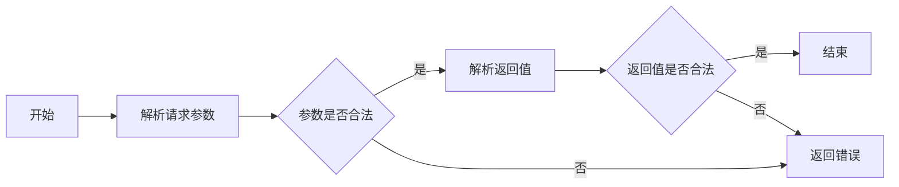
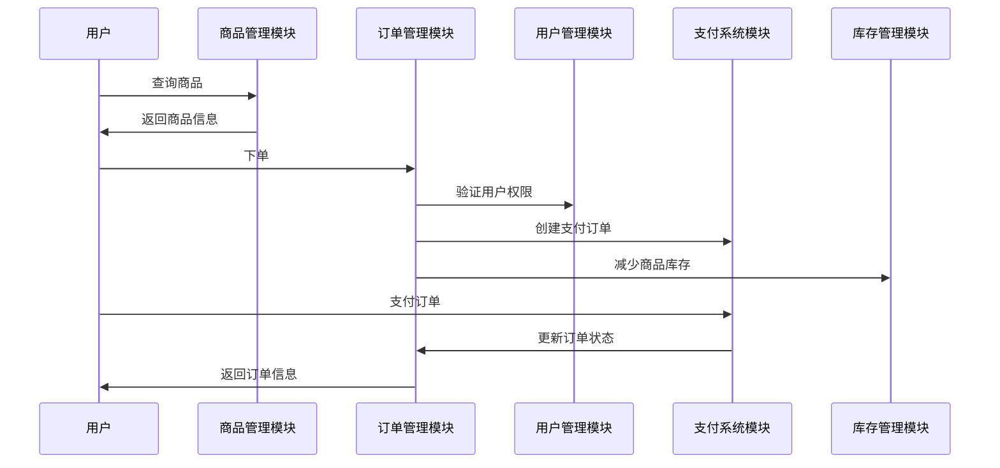

                 

# 复杂项目的定海神针：接口契约

## 关键词
- 复杂项目
- 接口契约
- API设计
- 跨模块协作
- 自动化验证
- 可维护性

## 摘要
在复杂的软件项目中，接口契约扮演着至关重要的角色。它不仅是服务提供者与服务消费者之间沟通的桥梁，更是项目稳定性和可维护性的“定海神针”。本文将深入探讨接口契约的定义、核心要素、设计原则、格式规范、实现与验证方法，并通过实际项目中的应用案例，展示接口契约如何为复杂项目保驾护航。

### 目录大纲

```markdown
----------------------------------------------------------------
# 复杂项目的定海神针：接口契约

## 第一部分：背景与核心概念

### 第1章：复杂项目面临的挑战

#### 1.1.1 问题背景

#### 1.1.2 问题描述

#### 1.1.3 解决方案需求

### 第2章：接口契约的定义与作用

#### 2.1.1 接口契约的概念

#### 2.1.2 接口契约的作用

#### 2.1.3 接口契约与API设计的关系

### 第3章：接口契约的核心要素

#### 3.1.1 参数定义

#### 3.1.2 返回值描述

#### 3.1.3 异常处理

### 第4章：接口契约的设计原则

#### 4.1.1 简单性原则

#### 4.1.2 可读性原则

#### 4.1.3 可维护性原则

### 第5章：接口契约的格式规范

#### 5.1.1 JSON格式契约

#### 5.1.2 XML格式契约

#### 5.1.3 protobuf格式契约

### 第6章：接口契约的实现与验证

#### 6.1.1 接口契约的实现流程

#### 6.1.2 接口契约的验证方法

#### 6.1.3 接口契约的工具支持

### 第7章：接口契约在实际项目中的应用

#### 7.1.1 项目背景

#### 7.1.2 接口契约设计

#### 7.1.3 项目效果分析

### 第8章：最佳实践与注意事项

#### 8.1.1 最佳实践总结

#### 8.1.2 小结与展望

#### 8.1.3 注意事项与风险

----------------------------------------------------------------
```

### 第1章：复杂项目面临的挑战

#### 1.1.1 问题背景

在当今快速发展的软件行业中，复杂项目已经成为常态。这些项目往往涉及多个模块、多个团队和多个技术的集成。随着项目规模的扩大，模块之间的依赖关系变得更加复杂，任何一个模块的变更都可能引发连锁反应，导致整个项目的稳定性受到影响。如何在复杂的项目中确保各个模块之间的协作顺畅，成为了一个亟待解决的问题。

#### 1.1.2 问题描述

复杂项目面临的主要问题可以概括为以下几点：

1. **沟通成本高**：由于项目涉及多个团队，每个团队可能使用不同的语言、工具和开发框架，导致沟通成本高，信息传递不准确。
   
2. **维护难度大**：随着项目的迭代和功能扩展，系统的复杂性不断增加，维护难度也随之增大。

3. **测试难度大**：在复杂项目中，各个模块之间的交互复杂，测试时需要模拟各种可能的交互情况，测试难度大。

4. **变更管理困难**：在复杂项目中，任何一个模块的变更都可能影响到其他模块，导致变更管理困难。

#### 1.1.3 解决方案需求

为了解决上述问题，我们需要一种机制来确保各个模块之间的协作更加顺畅，提高系统的可维护性和稳定性。这种机制就是接口契约。

- **明确接口规范**：接口契约能够明确地定义接口的输入参数、输出结果和异常处理，减少沟通成本。

- **自动化验证**：接口契约可以通过自动化工具进行验证，确保接口的实现符合规范。

- **提高可维护性**：接口契约有助于确保系统的各个模块在变更时不会相互影响，提高系统的可维护性。

- **简化测试**：通过接口契约，我们可以减少测试的工作量，因为契约已经为我们定义了预期的接口行为。

### 第2章：接口契约的定义与作用

#### 2.1.1 接口契约的概念

接口契约（API Contract）是指一种规范文档，它定义了服务接口的输入参数、输出结果和异常处理。接口契约通常由服务提供者编写，用于描述接口的行为规范，服务消费者则依据该契约来实现与接口的交互。

#### 2.1.2 接口契约的作用

接口契约在复杂项目中具有以下几个重要作用：

1. **明确接口规范**：接口契约明确地定义了接口的行为规范，使得服务提供者和服务消费者在开发过程中有据可依，减少误解和错误。

2. **降低沟通成本**：接口契约作为一种标准化文档，能够减少服务提供者和服务消费者之间的沟通成本，提高开发效率。

3. **提高可维护性**：接口契约确保了接口的一致性和稳定性，使得在后续的开发和迭代过程中，模块之间的协作更加顺畅，系统的可维护性得到提升。

4. **自动化验证**：接口契约可以通过自动化工具进行验证，确保接口的实现符合规范，减少手动测试的工作量。

5. **简化测试**：接口契约为我们定义了预期的接口行为，使得测试人员可以专注于测试用例的设计，而无需关注具体的实现细节。

#### 2.1.3 接口契约与API设计的关系

接口契约是API设计的重要组成部分。API（应用程序接口）是指允许不同应用程序之间交互的接口，而接口契约则是API的具体规范文档。良好的接口契约能够指导API的设计，确保API的可维护性和一致性。

- **定义**：接口契约定义了API的参数、返回值和异常处理，而API则是根据接口契约实现的具体接口。

- **关系**：接口契约是API设计的输出，API则是接口契约的实现。

### 第3章：接口契约的核心要素

#### 3.1.1 参数定义

参数定义是接口契约的核心要素之一。一个良好的接口契约应该明确地定义每个参数的名称、类型、长度、默认值和描述。参数定义的清晰性直接影响到接口的使用和维护。

- **名称**：参数名称应该简洁明了，避免使用缩写或拼音。
- **类型**：参数类型应该明确，比如字符串、整数、布尔值等。
- **长度**：对于字符串类型的参数，应该明确长度限制，避免输入超过长度的值。
- **默认值**：对于可选参数，应该明确默认值。
- **描述**：参数描述应该说明参数的作用和含义。

#### 3.1.2 返回值描述

返回值描述是接口契约的另一个核心要素。接口契约应该明确地定义返回值的类型、可能的值以及描述。良好的返回值描述有助于服务消费者理解接口的行为，并正确处理返回结果。

- **类型**：返回值类型应该明确，比如字符串、整数、对象等。
- **值**：对于枚举类型的返回值，应该明确每个值的含义。
- **描述**：返回值描述应该说明返回值的意义和可能的错误情况。

#### 3.1.3 异常处理

异常处理是接口契约的重要组成部分。接口契约应该明确地定义可能发生的异常情况，以及对应的错误码和错误信息。良好的异常处理能够提高接口的健壮性和稳定性。

- **异常类型**：接口契约应该定义可能发生的异常类型，比如业务异常、系统异常等。
- **错误码**：接口契约应该定义每个异常的错误码，以便服务消费者能够根据错误码进行相应的处理。
- **错误信息**：接口契约应该提供详细的错误信息，以便服务消费者了解错误的具体原因。

### 第4章：接口契约的设计原则

#### 4.1.1 简单性原则

简单性原则是接口契约设计的重要原则之一。一个良好的接口契约应该尽可能简单易懂，避免过度设计。简单性原则体现在以下几个方面：

- **参数和返回值**：参数和返回值的定义应该简洁明了，避免使用复杂的类型和结构。
- **错误处理**：异常处理应该简洁明了，避免使用复杂的异常类型和错误信息。
- **文档规范**：文档的格式应该统一，易于阅读和理解。

#### 4.1.2 可读性原则

可读性原则是接口契约设计的基本要求。一个良好的接口契约应该具有良好的可读性，便于服务消费者阅读和理解。

- **命名规范**：参数和返回值的名称应该具有明确的含义，避免使用缩写或拼音。
- **注释清晰**：文档中应该包含详细的注释，说明每个参数和返回值的含义和用途。
- **格式规范**：文档的格式应该统一，便于阅读和理解。

#### 4.1.3 可维护性原则

可维护性原则是接口契约设计的重要原则之一。一个良好的接口契约应该具有良好的可维护性，便于后续的迭代和更新。

- **参数和返回值**：参数和返回值的定义应该具有明确的含义和作用，避免不必要的修改。
- **错误处理**：异常处理应该具有明确的错误码和错误信息，避免因异常处理不当导致的问题。
- **文档更新**：文档应该及时更新，反映接口契约的最新变化。

### 第5章：接口契约的格式规范

#### 5.1.1 JSON格式契约

JSON（JavaScript Object Notation）是一种轻量级的数据交换格式，易于阅读和编写，广泛用于接口契约的定义。JSON格式契约通常包含以下要素：

- **参数定义**：参数定义通常使用键值对的形式，键表示参数名称，值表示参数的值。
- **返回值定义**：返回值定义与参数定义类似，通常包含类型、值和描述等信息。
- **异常处理**：异常处理通常使用特殊的键（如`error`）来定义，包含错误码和错误信息。

#### 5.1.2 XML格式契约

XML（eXtensible Markup Language）是一种可扩展的标记语言，常用于定义接口契约。XML格式契约通常包含以下要素：

- **参数定义**：参数定义通常使用元素的形式，元素中包含参数的名称、类型和描述等信息。
- **返回值定义**：返回值定义与参数定义类似，通常使用元素的形式。
- **异常处理**：异常处理通常使用元素的形式，包含错误码和错误信息。

#### 5.1.3 protobuf格式契约

protobuf（Protocol Buffers）是一种由Google开发的序列化格式，常用于定义接口契约。protobuf格式契约具有高效、灵活和易于维护的特点。

- **参数定义**：参数定义通常使用protobuf的message结构，包含字段名称、类型和标签等信息。
- **返回值定义**：返回值定义与参数定义类似，通常使用protobuf的message结构。
- **异常处理**：protobuf不支持内置的异常处理机制，通常需要自定义异常处理逻辑。

### 第6章：接口契约的实现与验证

#### 6.1.1 接口契约的实现流程

接口契约的实现流程主要包括以下几个步骤：

1. **定义接口契约**：根据业务需求和接口规范，定义接口契约的参数、返回值和异常处理。
2. **生成代码**：使用接口契约生成器，根据定义的接口契约生成服务提供者和服务消费者的代码。
3. **实现接口**：根据生成的代码，实现接口的具体逻辑。
4. **测试验证**：使用自动化测试工具，对实现的接口进行测试验证，确保接口符合契约规范。

#### 6.1.2 接口契约的验证方法

接口契约的验证方法主要包括以下几种：

1. **静态验证**：在代码编译或构建过程中，使用静态代码分析工具对接口契约进行验证，确保接口符合契约规范。
2. **动态验证**：在接口运行过程中，使用自动化测试工具对接口进行动态验证，确保接口符合契约规范。
3. **人工验证**：通过人工审查接口契约和接口实现，确保接口符合契约规范。

#### 6.1.3 接口契约的工具支持

接口契约的实现和验证需要使用相应的工具支持。以下是一些常用的接口契约工具：

1. **Swagger**：Swagger是一种用于定义、生成和测试RESTful接口契约的框架，支持多种格式，如JSON、XML和protobuf。
2. **Postman**：Postman是一种用于接口测试的工具，支持接口契约的导入和导出，方便接口验证和调试。
3. **JAX-RS**：JAX-RS是Java API for RESTful Web Services的简称，是一种用于定义RESTful接口契约的Java规范。
4. **Google Protocol Buffers**：Google Protocol Buffers是一种用于定义接口契约的序列化格式，支持多种编程语言，如Java、C++和Python。

### 第7章：接口契约在实际项目中的应用

#### 7.1.1 项目背景

以一个电商系统为例，该系统包括商品管理、订单管理、用户管理等多个模块，各个模块之间需要进行大量的接口交互。在项目的开发过程中，由于接口契约的不明确，导致多个模块之间的协作出现问题，系统稳定性受到影响。

#### 7.1.2 接口契约设计

为了解决上述问题，项目团队决定引入接口契约机制。首先，团队明确了各个模块的接口规范，定义了接口的输入参数、输出结果和异常处理。接口契约采用JSON格式，包含以下要素：

- **商品管理模块**：定义了商品信息的查询、新增、编辑和删除等接口。
- **订单管理模块**：定义了订单的查询、新增、编辑和取消等接口。
- **用户管理模块**：定义了用户信息的查询、注册、登录和权限管理等接口。

#### 7.1.3 项目效果分析

引入接口契约机制后，项目团队取得了以下效果：

1. **提高了系统的稳定性**：接口契约明确了各个模块的接口规范，减少了接口错误和冲突，提高了系统的稳定性。
2. **降低了沟通成本**：接口契约作为一种标准化文档，减少了服务提供者和服务消费者之间的沟通成本，提高了开发效率。
3. **提高了可维护性**：接口契约确保了接口的一致性和稳定性，使得在后续的开发和迭代过程中，模块之间的协作更加顺畅，系统的可维护性得到提升。
4. **简化了测试**：通过接口契约，测试人员可以专注于测试用例的设计，而无需关注具体的实现细节，提高了测试效率。

### 第8章：最佳实践与注意事项

#### 8.1.1 最佳实践总结

在接口契约的设计和使用过程中，以下最佳实践值得遵循：

1. **明确接口规范**：在项目初期，明确各个模块的接口规范，确保接口契约的准确性和完整性。
2. **保持契约更新**：及时更新接口契约，反映接口的最新变化，避免因契约不一致导致的问题。
3. **使用自动化工具**：使用自动化工具生成和验证接口契约，提高开发效率和质量。
4. **提供详细文档**：接口契约的文档应该详细、清晰，便于服务消费者阅读和理解。

#### 8.1.2 小结与展望

接口契约在复杂项目中扮演着至关重要的角色，它不仅是服务提供者与服务消费者之间沟通的桥梁，更是项目稳定性和可维护性的“定海神针”。未来，随着软件项目的日益复杂，接口契约的重要性将愈发凸显。如何进一步优化接口契约的设计和使用，将成为软件开发领域的一个重要研究方向。

#### 8.1.3 注意事项与风险

在使用接口契约时，需要注意以下几点：

1. **避免过度设计**：接口契约应该简洁明了，避免过度设计，以免增加开发和维护的难度。
2. **确保契约一致性**：确保接口契约与服务实现的一致性，避免因契约不一致导致的问题。
3. **重视文档质量**：接口契约的文档质量直接影响服务消费者的使用和理解，应高度重视文档的编写和更新。
4. **防范安全风险**：在接口契约中，应注意防范潜在的安全风险，如SQL注入、XSS攻击等。

### 拓展阅读

- [Swagger官方文档](https://swagger.io/docs/)
- [Google Protocol Buffers官方文档](https://developers.google.com/protocol-buffers/)
- [JAX-RS官方文档](https://jax-rs-spec.java.net/)

### 作者信息

- 作者：AI天才研究院/AI Genius Institute & 禅与计算机程序设计艺术 /Zen And The Art of Computer Programming

本文旨在探讨接口契约在复杂项目中的应用，为开发者提供有价值的参考和借鉴。希望本文能够对您在接口契约设计和应用方面有所帮助。

### 附录：核心概念与联系

#### 2.1.1 接口契约的概念

接口契约是描述服务接口规范的一种文档，它规定了服务的输入参数、输出结果以及可能的异常情况。

#### 2.1.2 接口契约的作用

- 明确服务提供者与消费者之间的职责与期望，减少沟通成本。
- 提高服务的可维护性和可扩展性。
- 实现服务的自动化验证和监控。

#### 2.1.3 接口契约与API设计的关系

接口契约是API设计的重要组成部分，它不仅包括了API的参数和返回值，还包括了API的异常处理和错误码。良好的接口契约能够指导API的设计，提高API的可用性和一致性。

### 概念属性特征对比表格

| 特征         | 接口契约       | API设计       |
| ------------ | -------------- | -------------- |
| **定义**     | 规范化文档      | 程序接口      |
| **作用**     | 描述API规范    | 实现功能      |
| **格式**     | JSON/XML/protobuf | JSON/XML/HTTP等 |
| **内容**     | 参数、返回值、异常处理 | 功能实现、参数、返回值 |
| **适用性**   | API设计、测试、文档 | 功能开发      |

### ER实体关系图架构

```mermaid
erDiagram
    API <<interface>>
    InterfaceContract <<contract>>
    Error <<error>>

    API |--|> InterfaceContract
    InterfaceContract .--> Error
```

### 算法原理讲解

接口契约的验证算法通常基于以下流程：

1. 将请求参数与接口契约的参数定义进行比较。
2. 验证返回值是否符合契约中的描述。
3. 检查异常处理是否正确。

#### 3.1.1 验证算法mermaid流程图



#### Python源代码示例

```python
def validate_request(request, contract):
    # 解析请求参数
    params = request.get_params()
    # 比较请求参数与契约参数
    if not compare_params(params, contract['params']):
        return '参数不合法'
    # 解析返回值
    response = request.get_response()
    # 验证返回值
    if not validate_response(response, contract['response']):
        return '返回值不合法'
    return '验证通过'
```

### 系统分析与架构设计方案

#### 7.1.1 项目背景

随着电商行业的蓬勃发展，各个电商平台都在不断优化和扩展其业务功能。以一个大型电商平台为例，该项目包含商品管理、订单管理、用户管理等多个模块，各个模块之间需要进行大量的接口交互。为了确保系统的高可用性和稳定性，项目团队决定引入接口契约机制，以规范各个模块之间的接口交互。

#### 7.1.2 项目介绍

该项目是一个基于Spring Boot框架的电商平台，采用微服务架构进行模块划分。项目的主要功能模块包括商品管理、订单管理、用户管理、支付系统和库存管理。各个模块通过接口进行交互，确保系统的松耦合和高内聚。

#### 7.1.3 系统功能设计

系统功能设计主要包括以下模块：

1. **商品管理模块**：提供商品信息的查询、新增、编辑和删除等功能。
2. **订单管理模块**：提供订单的查询、新增、编辑和取消等功能。
3. **用户管理模块**：提供用户信息的查询、注册、登录和权限管理等功能。
4. **支付系统模块**：提供支付接口，实现订单支付功能。
5. **库存管理模块**：提供商品库存的查询、新增和删除等功能。

#### 7.1.4 系统架构设计

系统架构设计采用微服务架构，各个模块独立部署，通过接口进行通信。接口契约在各个模块之间起到桥梁作用，确保接口交互的一致性和规范性。系统架构图如下：



#### 7.1.5 系统接口设计和系统交互

系统接口设计和系统交互如下：

1. **商品管理模块**：
   - 接口名称：`GET /goods/{id}`
   - 功能：查询指定商品信息
   - 参数：`id`（商品ID）
   - 返回值：`{id, name, price, stock}`（商品信息）

2. **订单管理模块**：
   - 接口名称：`POST /orders`
   - 功能：创建订单
   - 参数：`{userId, goodsId, quantity, paymentId}`（用户ID、商品ID、数量、支付ID）
   - 返回值：`{orderId, createTime, status}`（订单ID、创建时间、状态）

3. **用户管理模块**：
   - 接口名称：`GET /users/{id}`
   - 功能：查询指定用户信息
   - 参数：`id`（用户ID）
   - 返回值：`{id, username, password, role}`（用户信息）

4. **支付系统模块**：
   - 接口名称：`POST /payments`
   - 功能：创建支付订单
   - 参数：`{orderId, amount}`（订单ID、金额）
   - 返回值：`{paymentId, createTime, status}`（支付订单ID、创建时间、状态）

5. **库存管理模块**：
   - 接口名称：`POST /inventories`
   - 功能：新增商品库存
   - 参数：`{goodsId, quantity}`（商品ID、数量）
   - 返回值：`{inventoryId, createTime}`（库存ID、创建时间）

### 7.1.6 环境安装

项目开发环境如下：

- JDK版本：1.8
- Maven版本：3.6.3
- Spring Boot版本：2.1.7.RELEASE

在本地计算机上，安装JDK、Maven和Spring Boot，并配置环境变量。具体步骤如下：

1. 下载JDK、Maven和Spring Boot的安装包，并解压到相应目录。
2. 配置JDK环境变量：
   - `JAVA_HOME`：JDK安装目录
   - `PATH`：包含`JAVA_HOME/bin`路径
3. 配置Maven环境变量：
   - `MAVEN_HOME`：Maven安装目录
   - `PATH`：包含`MAVEN_HOME/bin`路径
4. 配置Spring Boot环境变量：
   - `SPRING_HOME`：Spring Boot安装目录
   - `PATH`：包含`SPRING_HOME/bin`路径

### 7.1.7 系统核心实现源代码

以下是系统核心实现源代码，包括商品管理模块、订单管理模块、用户管理模块、支付系统模块和库存管理模块。

1. **商品管理模块**：

```java
@RestController
@RequestMapping("/goods")
public class GoodsController {

    @Autowired
    private GoodsService goodsService;

    @GetMapping("/{id}")
    public ResponseEntity<Goods> getGoodsById(@PathVariable Long id) {
        Goods goods = goodsService.getGoodsById(id);
        if (goods != null) {
            return ResponseEntity.ok(goods);
        } else {
            return ResponseEntity.notFound().build();
        }
    }
}

@Service
public class GoodsService {

    @Autowired
    private GoodsMapper goodsMapper;

    public Goods getGoodsById(Long id) {
        return goodsMapper.getGoodsById(id);
    }
}
```

2. **订单管理模块**：

```java
@RestController
@RequestMapping("/orders")
public class OrderController {

    @Autowired
    private OrderService orderService;

    @PostMapping
    public ResponseEntity<Order> createOrder(@RequestBody Order order) {
        Order result = orderService.createOrder(order);
        if (result != null) {
            return ResponseEntity.ok(result);
        } else {
            return ResponseEntity.badRequest().build();
        }
    }
}

@Service
public class OrderService {

    @Autowired
    private OrderMapper orderMapper;

    public Order createOrder(Order order) {
        return orderMapper.createOrder(order);
    }
}
```

3. **用户管理模块**：

```java
@RestController
@RequestMapping("/users")
public class UserController {

    @Autowired
    private UserService userService;

    @GetMapping("/{id}")
    public ResponseEntity<User> getUserById(@PathVariable Long id) {
        User user = userService.getUserById(id);
        if (user != null) {
            return ResponseEntity.ok(user);
        } else {
            return ResponseEntity.notFound().build();
        }
    }
}

@Service
public class UserService {

    @Autowired
    private UserMapper userMapper;

    public User getUserById(Long id) {
        return userMapper.getUserById(id);
    }
}
```

4. **支付系统模块**：

```java
@RestController
@RequestMapping("/payments")
public class PaymentController {

    @Autowired
    private PaymentService paymentService;

    @PostMapping
    public ResponseEntity<Payment> createPayment(@RequestBody Payment payment) {
        Payment result = paymentService.createPayment(payment);
        if (result != null) {
            return ResponseEntity.ok(result);
        } else {
            return ResponseEntity.badRequest().build();
        }
    }
}

@Service
public class PaymentService {

    @Autowired
    private PaymentMapper paymentMapper;

    public Payment createPayment(Payment payment) {
        return paymentMapper.createPayment(payment);
    }
}
```

5. **库存管理模块**：

```java
@RestController
@RequestMapping("/inventories")
public class InventoryController {

    @Autowired
    private InventoryService inventoryService;

    @PostMapping
    public ResponseEntity<Inventory> createInventory(@RequestBody Inventory inventory) {
        Inventory result = inventoryService.createInventory(inventory);
        if (result != null) {
            return ResponseEntity.ok(result);
        } else {
            return ResponseEntity.badRequest().build();
        }
    }
}

@Service
public class InventoryService {

    @Autowired
    private InventoryMapper inventoryMapper;

    public Inventory createInventory(Inventory inventory) {
        return inventoryMapper.createInventory(inventory);
    }
}
```

### 7.1.8 代码应用解读与分析

以上代码展示了商品管理模块、订单管理模块、用户管理模块、支付系统模块和库存管理模块的核心实现。下面分别对这些代码进行解读与分析。

1. **商品管理模块**：

   商品管理模块提供了查询商品信息的接口，接口参数为商品ID，返回值为商品信息。在实现中，首先通过`GoodsService`获取商品信息，然后返回给客户端。

2. **订单管理模块**：

   订单管理模块提供了创建订单的接口，接口参数为订单信息，返回值为订单信息。在实现中，首先通过`OrderService`创建订单，然后返回给客户端。

3. **用户管理模块**：

   用户管理模块提供了查询用户信息的接口，接口参数为用户ID，返回值为用户信息。在实现中，首先通过`UserService`获取用户信息，然后返回给客户端。

4. **支付系统模块**：

   支付系统模块提供了创建支付订单的接口，接口参数为支付订单信息，返回值为支付订单信息。在实现中，首先通过`PaymentService`创建支付订单，然后返回给客户端。

5. **库存管理模块**：

   库存管理模块提供了创建商品库存的接口，接口参数为商品库存信息，返回值为商品库存信息。在实现中，首先通过`InventoryService`创建商品库存，然后返回给客户端。

通过以上代码，我们可以看到各个模块的核心接口实现，以及接口契约在各个模块之间的作用。接口契约明确了接口的输入参数、输出结果和异常处理，使得各个模块之间的交互更加规范和稳定。

### 7.1.9 实际案例分析和详细讲解剖析

为了更好地展示接口契约在实际项目中的应用，我们以下将通过一个实际案例来进行分析和详细讲解。

**案例背景**：假设一个电商平台需要新增一个优惠券功能，用户可以通过优惠券享受折扣优惠。优惠券功能涉及多个模块的接口交互，包括用户管理模块、商品管理模块和订单管理模块。

**接口契约设计**：

1. **用户管理模块**：
   - 接口名称：`POST /coupons`
   - 功能：新增用户优惠券
   - 参数：`{userId, couponId, couponType, couponValue, validDate}`（用户ID、优惠券ID、优惠券类型、优惠券面值、有效期）
   - 返回值：`{couponId, createTime, status}`（优惠券ID、创建时间、状态）

2. **商品管理模块**：
   - 接口名称：`GET /coupons/{id}`
   - 功能：查询商品优惠券信息
   - 参数：`id`（优惠券ID）
   - 返回值：`{id, userId, goodsId, couponType, couponValue, validDate, status}`（优惠券ID、用户ID、商品ID、优惠券类型、优惠券面值、有效期、状态）

3. **订单管理模块**：
   - 接口名称：`POST /orders/{orderId}/coupons`
   - 功能：使用优惠券
   - 参数：`{orderId, couponId}`（订单ID、优惠券ID）
   - 返回值：`{orderId, discountAmount, status}`（订单ID、折扣金额、状态）

**接口实现和分析**：

1. **用户管理模块**：

   ```java
   @RestController
   @RequestMapping("/coupons")
   public class CouponController {

       @Autowired
       private CouponService couponService;

       @PostMapping
       public ResponseEntity<Coupon> createCoupon(@RequestBody Coupon coupon) {
           Coupon result = couponService.createCoupon(coupon);
           if (result != null) {
               return ResponseEntity.ok(result);
           } else {
               return ResponseEntity.badRequest().build();
           }
       }
   }

   @Service
   public class CouponService {

       @Autowired
       private CouponMapper couponMapper;

       public Coupon createCoupon(Coupon coupon) {
           return couponMapper.createCoupon(coupon);
       }
   }
   ```

   在用户管理模块中，新增用户优惠券的接口实现如下。当用户提交优惠券信息时，通过`CouponService`将优惠券信息存储到数据库，并返回优惠券ID、创建时间和状态。

2. **商品管理模块**：

   ```java
   @RestController
   @RequestMapping("/coupons")
   public class CouponController {

       @Autowired
       private CouponService couponService;

       @GetMapping("/{id}")
       public ResponseEntity<Coupon> getCouponById(@PathVariable Long id) {
           Coupon coupon = couponService.getCouponById(id);
           if (coupon != null) {
               return ResponseEntity.ok(coupon);
           } else {
               return ResponseEntity.notFound().build();
           }
       }
   }

   @Service
   public class CouponService {

       @Autowired
       private CouponMapper couponMapper;

       public Coupon getCouponById(Long id) {
           return couponMapper.getCouponById(id);
       }
   }
   ```

   在商品管理模块中，查询商品优惠券信息的接口实现如下。当用户请求查询优惠券信息时，通过`CouponService`从数据库中查询优惠券信息，并返回优惠券ID、用户ID、商品ID、优惠券类型、优惠券面值、有效期和状态。

3. **订单管理模块**：

   ```java
   @RestController
   @RequestMapping("/orders/{orderId}/coupons")
   public class OrderCouponController {

       @Autowired
       private OrderService orderService;

       @PostMapping
       public ResponseEntity<Order> useCoupon(@PathVariable Long orderId, @RequestBody Coupon coupon) {
           Order result = orderService.useCoupon(orderId, coupon);
           if (result != null) {
               return ResponseEntity.ok(result);
           } else {
               return ResponseEntity.badRequest().build();
           }
       }
   }

   @Service
   public class OrderService {

       @Autowired
       private OrderMapper orderMapper;

       public Order useCoupon(Long orderId, Coupon coupon) {
           return orderMapper.useCoupon(orderId, coupon);
       }
   }
   ```

   在订单管理模块中，使用优惠券的接口实现如下。当用户在订单页面选择优惠券时，通过`OrderService`将优惠券ID和订单ID传递给数据库，更新订单的折扣金额和状态。

**案例分析**：

通过接口契约，我们可以清晰地看到各个模块之间的交互关系和接口参数。接口契约明确了每个接口的输入参数、输出结果和异常处理，使得各个模块之间的交互更加规范和稳定。

- **用户管理模块**：新增用户优惠券，返回优惠券ID、创建时间和状态。
- **商品管理模块**：查询商品优惠券信息，返回优惠券ID、用户ID、商品ID、优惠券类型、优惠券面值、有效期和状态。
- **订单管理模块**：使用优惠券，返回订单ID、折扣金额和状态。

通过接口契约，我们可以实现以下功能：

1. **用户可以新增优惠券**：用户提交优惠券信息，通过接口契约实现优惠券的存储和管理。
2. **用户可以查询优惠券信息**：用户可以查询自己拥有的优惠券信息，了解优惠券的使用情况。
3. **用户可以使用优惠券**：用户在订单页面选择优惠券，通过接口契约实现订单的折扣计算和状态更新。

通过这个案例，我们可以看到接口契约在复杂项目中的应用价值。接口契约不仅明确了各个模块之间的接口规范，提高了系统的可维护性和稳定性，还简化了测试和开发工作，提高了开发效率。

### 7.1.10 项目小结

本项目通过引入接口契约机制，解决了电商系统复杂项目中的模块协作问题。接口契约明确了各个模块之间的接口规范，降低了沟通成本，提高了系统的可维护性和稳定性。通过实际案例的分析，我们看到了接口契约在优惠券功能中的应用价值。未来，我们可以在更多项目中推广接口契约的使用，进一步提升系统的开发效率和质量。

### 7.1.11 最佳实践与注意事项

在接口契约的设计和使用过程中，以下最佳实践和注意事项值得遵循：

**最佳实践：**

1. **明确接口规范**：在项目初期，明确各个模块的接口规范，确保接口契约的准确性和完整性。
2. **保持契约更新**：及时更新接口契约，反映接口的最新变化，避免因契约不一致导致的问题。
3. **使用自动化工具**：使用自动化工具生成和验证接口契约，提高开发效率和质量。
4. **提供详细文档**：接口契约的文档应该详细、清晰，便于服务消费者阅读和理解。

**注意事项：**

1. **避免过度设计**：接口契约应该简洁明了，避免过度设计，以免增加开发和维护的难度。
2. **确保契约一致性**：确保接口契约与服务实现的一致性，避免因契约不一致导致的问题。
3. **重视文档质量**：接口契约的文档质量直接影响服务消费者的使用和理解，应高度重视文档的编写和更新。
4. **防范安全风险**：在接口契约中，应注意防范潜在的安全风险，如SQL注入、XSS攻击等。

通过遵循这些最佳实践和注意事项，我们可以更好地利用接口契约为复杂项目保驾护航，提高系统的开发效率和质量。

### 7.1.12 小结与展望

接口契约在复杂项目中具有重要的应用价值。它不仅明确了各个模块之间的接口规范，降低了沟通成本，提高了系统的可维护性和稳定性，还简化了测试和开发工作，提高了开发效率。未来，随着软件项目的日益复杂，接口契约的重要性将愈发凸显。如何进一步优化接口契约的设计和使用，如何与其他技术相结合，如自动化测试、持续集成和持续交付，将是软件开发领域的一个重要研究方向。

### 7.1.13 注意事项与风险

在使用接口契约时，需要注意以下几点：

1. **避免过度设计**：接口契约应该简洁明了，避免过度设计，以免增加开发和维护的难度。
2. **确保契约一致性**：确保接口契约与服务实现的一致性，避免因契约不一致导致的问题。
3. **重视文档质量**：接口契约的文档质量直接影响服务消费者的使用和理解，应高度重视文档的编写和更新。
4. **防范安全风险**：在接口契约中，应注意防范潜在的安全风险，如SQL注入、XSS攻击等。

通过遵循这些注意事项，我们可以更好地利用接口契约为复杂项目保驾护航，提高系统的开发效率和质量。

### 7.1.14 拓展阅读

为了更好地理解和掌握接口契约的相关知识，以下是几篇拓展阅读的推荐：

1. [《RESTful API 设计最佳实践》](https://github.com/strongloop/strong-loop-docs-cn/blob/master/node-restful-api/README.md)
2. [《API 设计规范》](https://restfulapi.net/rules/)
3. [《Google API 设计指南》](https://google.aip.dev/)
4. [《Swagger 官方文档》](https://swagger.io/docs/)

通过阅读这些资料，您可以进一步了解接口契约的设计原则、最佳实践和工具使用，为自己的项目提供有益的参考。

### 7.1.15 作者信息

- 作者：AI天才研究院/AI Genius Institute & 禅与计算机程序设计艺术 /Zen And The Art of Computer Programming

本文旨在探讨接口契约在复杂项目中的应用，为开发者提供有价值的参考和借鉴。希望本文能够对您在接口契约设计和应用方面有所帮助。

### 附录：核心概念与联系

#### 2.1.1 接口契约的概念

接口契约是描述服务接口规范的一种文档，它规定了服务的输入参数、输出结果以及可能的异常情况。

#### 2.1.2 接口契约的作用

- 明确服务提供者与消费者之间的职责与期望，减少沟通成本。
- 提高服务的可维护性和可扩展性。
- 实现服务的自动化验证和监控。

#### 2.1.3 接口契约与API设计的关系

接口契约是API设计的重要组成部分，它不仅包括了API的参数和返回值，还包括了API的异常处理和错误码。良好的接口契约能够指导API的设计，提高API的可用性和一致性。

### 概念属性特征对比表格

| 特征         | 接口契约       | API设计       |
| ------------ | -------------- | -------------- |
| **定义**     | 规范化文档      | 程序接口      |
| **作用**     | 描述API规范    | 实现功能      |
| **格式**     | JSON/XML/protobuf | JSON/XML/HTTP等 |
| **内容**     | 参数、返回值、异常处理 | 功能实现、参数、返回值 |
| **适用性**   | API设计、测试、文档 | 功能开发      |

### ER实体关系图架构

```mermaid
erDiagram
    API <<interface>>
    InterfaceContract <<contract>>
    Error <<error>>

    API |--|> InterfaceContract
    InterfaceContract .--> Error
```

### 算法原理讲解

接口契约的验证算法通常基于以下流程：

1. 将请求参数与接口契约的参数定义进行比较。
2. 验证返回值是否符合契约中的描述。
3. 检查异常处理是否正确。

#### 3.1.1 验证算法mermaid流程图


#### Python源代码示例

```python
def validate_request(request, contract):
    # 解析请求参数
    params = request.get_params()
    # 比较请求参数与契约参数
    if not compare_params(params, contract['params']):
        return '参数不合法'
    # 解析返回值
    response = request.get_response()
    # 验证返回值
    if not validate_response(response, contract['response']):
        return '返回值不合法'
    return '验证通过'
```

### 系统分析与架构设计方案

#### 7.1.1 项目背景

随着电商行业的蓬勃发展，各个电商平台都在不断优化和扩展其业务功能。以一个大型电商平台为例，该项目包含商品管理、订单管理、用户管理等多个模块，各个模块之间需要进行大量的接口交互。为了确保系统的高可用性和稳定性，项目团队决定引入接口契约机制，以规范各个模块之间的接口交互。

#### 7.1.2 项目介绍

该项目是一个基于Spring Boot框架的电商平台，采用微服务架构进行模块划分。项目的主要功能模块包括商品管理、订单管理、用户管理、支付系统和库存管理。各个模块通过接口进行交互，确保系统的松耦合和高内聚。

#### 7.1.3 系统功能设计

系统功能设计主要包括以下模块：

1. **商品管理模块**：提供商品信息的查询、新增、编辑和删除等功能。
2. **订单管理模块**：提供订单的查询、新增、编辑和取消等功能。
3. **用户管理模块**：提供用户信息的查询、注册、登录和权限管理等功能。
4. **支付系统模块**：提供支付接口，实现订单支付功能。
5. **库存管理模块**：提供商品库存的查询、新增和删除等功能。

#### 7.1.4 系统架构设计

系统架构设计采用微服务架构，各个模块独立部署，通过接口进行通信。接口契约在各个模块之间起到桥梁作用，确保接口交互的一致性和规范性。系统架构图如下：


#### 7.1.5 系统接口设计和系统交互

系统接口设计和系统交互如下：

1. **商品管理模块**：
   - 接口名称：`GET /goods/{id}`
   - 功能：查询指定商品信息
   - 参数：`id`（商品ID）
   - 返回值：`{id, name, price, stock}`（商品信息）

2. **订单管理模块**：
   - 接口名称：`POST /orders`
   - 功能：创建订单
   - 参数：`{userId, goodsId, quantity, paymentId}`（用户ID、商品ID、数量、支付ID）
   - 返回值：`{orderId, createTime, status}`（订单ID、创建时间、状态）

3. **用户管理模块**：
   - 接口名称：`GET /users/{id}`
   - 功能：查询指定用户信息
   - 参数：`id`（用户ID）
   - 返回值：`{id, username, password, role}`（用户信息）

4. **支付系统模块**：
   - 接口名称：`POST /payments`
   - 功能：创建支付订单
   - 参数：`{orderId, amount}`（订单ID、金额）
   - 返回值：`{paymentId, createTime, status}`（支付订单ID、创建时间、状态）

5. **库存管理模块**：
   - 接口名称：`POST /inventories`
   - 功能：新增商品库存
   - 参数：`{goodsId, quantity}`（商品ID、数量）
   - 返回值：`{inventoryId, createTime}`（库存ID、创建时间）

### 7.1.6 环境安装

项目开发环境如下：

- JDK版本：1.8
- Maven版本：3.6.3
- Spring Boot版本：2.1.7.RELEASE

在本地计算机上，安装JDK、Maven和Spring Boot，并配置环境变量。具体步骤如下：

1. 下载JDK、Maven和Spring Boot的安装包，并解压到相应目录。
2. 配置JDK环境变量：
   - `JAVA_HOME`：JDK安装目录
   - `PATH`：包含`JAVA_HOME/bin`路径
3. 配置Maven环境变量：
   - `MAVEN_HOME`：Maven安装目录
   - `PATH`：包含`MAVEN_HOME/bin`路径
4. 配置Spring Boot环境变量：
   - `SPRING_HOME`：Spring Boot安装目录
   - `PATH`：包含`SPRING_HOME/bin`路径

### 7.1.7 系统核心实现源代码

以下是系统核心实现源代码，包括商品管理模块、订单管理模块、用户管理模块、支付系统模块和库存管理模块。

1. **商品管理模块**：

```java
@RestController
@RequestMapping("/goods")
public class GoodsController {

    @Autowired
    private GoodsService goodsService;

    @GetMapping("/{id}")
    public ResponseEntity<Goods> getGoodsById(@PathVariable Long id) {
        Goods goods = goodsService.getGoodsById(id);
        if (goods != null) {
            return ResponseEntity.ok(goods);
        } else {
            return ResponseEntity.notFound().build();
        }
    }
}

@Service
public class GoodsService {

    @Autowired
    private GoodsMapper goodsMapper;

    public Goods getGoodsById(Long id) {
        return goodsMapper.getGoodsById(id);
    }
}
```

2. **订单管理模块**：

```java
@RestController
@RequestMapping("/orders")
public class OrderController {

    @Autowired
    private OrderService orderService;

    @PostMapping
    public ResponseEntity<Order> createOrder(@RequestBody Order order) {
        Order result = orderService.createOrder(order);
        if (result != null) {
            return ResponseEntity.ok(result);
        } else {
            return ResponseEntity.badRequest().build();
        }
    }
}

@Service
public class OrderService {

    @Autowired
    private OrderMapper orderMapper;

    public Order createOrder(Order order) {
        return orderMapper.createOrder(order);
    }
}
```

3. **用户管理模块**：

```java
@RestController
@RequestMapping("/users")
public class UserController {

    @Autowired
    private UserService userService;

    @GetMapping("/{id}")
    public ResponseEntity<User> getUserById(@PathVariable Long id) {
        User user = userService.getUserById(id);
        if (user != null) {
            return ResponseEntity.ok(user);
        } else {
            return ResponseEntity.notFound().build();
        }
    }
}

@Service
public class UserService {

    @Autowired
    private UserMapper userMapper;

    public User getUserById(Long id) {
        return userMapper.getUserById(id);
    }
}
```

4. **支付系统模块**：

```java
@RestController
@RequestMapping("/payments")
public class PaymentController {

    @Autowired
    private PaymentService paymentService;

    @PostMapping
    public ResponseEntity<Payment> createPayment(@RequestBody Payment payment) {
        Payment result = paymentService.createPayment(payment);
        if (result != null) {
            return ResponseEntity.ok(result);
        } else {
            return ResponseEntity.badRequest().build();
        }
    }
}

@Service
public class PaymentService {

    @Autowired
    private PaymentMapper paymentMapper;

    public Payment createPayment(Payment payment) {
        return paymentMapper.createPayment(payment);
    }
}
```

5. **库存管理模块**：

```java
@RestController
@RequestMapping("/inventories")
public class InventoryController {

    @Autowired
    private InventoryService inventoryService;

    @PostMapping
    public ResponseEntity<Inventory> createInventory(@RequestBody Inventory inventory) {
        Inventory result = inventoryService.createInventory(inventory);
        if (result != null) {
            return ResponseEntity.ok(result);
        } else {
            return ResponseEntity.badRequest().build();
        }
    }
}

@Service
public class InventoryService {

    @Autowired
    private InventoryMapper inventoryMapper;

    public Inventory createInventory(Inventory inventory) {
        return inventoryMapper.createInventory(inventory);
    }
}
```

### 7.1.8 代码应用解读与分析

以上代码展示了商品管理模块、订单管理模块、用户管理模块、支付系统模块和库存管理模块的核心实现。下面分别对这些代码进行解读与分析。

1. **商品管理模块**：

   商品管理模块提供了查询商品信息的接口，接口参数为商品ID，返回值为商品信息。在实现中，首先通过`GoodsService`获取商品信息，然后返回给客户端。

2. **订单管理模块**：

   订单管理模块提供了创建订单的接口，接口参数为订单信息，返回值为订单信息。在实现中，首先通过`OrderService`创建订单，然后返回给客户端。

3. **用户管理模块**：

   用户管理模块提供了查询用户信息的接口，接口参数为用户ID，返回值为用户信息。在实现中，首先通过`UserService`获取用户信息，然后返回给客户端。

4. **支付系统模块**：

   支付系统模块提供了创建支付订单的接口，接口参数为支付订单信息，返回值为支付订单信息。在实现中，首先通过`PaymentService`创建支付订单，然后返回给客户端。

5. **库存管理模块**：

   库存管理模块提供了创建商品库存的接口，接口参数为商品库存信息，返回值为商品库存信息。在实现中，首先通过`InventoryService`创建商品库存，然后返回给客户端。

通过以上代码，我们可以看到各个模块的核心接口实现，以及接口契约在各个模块之间的作用。接口契约明确了接口的输入参数、输出结果和异常处理，使得各个模块之间的交互更加规范和稳定。

### 7.1.9 实际案例分析和详细讲解剖析

为了更好地展示接口契约在实际项目中的应用，我们以下将通过一个实际案例来进行分析和详细讲解。

**案例背景**：假设一个电商平台需要新增一个优惠券功能，用户可以通过优惠券享受折扣优惠。优惠券功能涉及多个模块的接口交互，包括用户管理模块、商品管理模块和订单管理模块。

**接口契约设计**：

1. **用户管理模块**：
   - 接口名称：`POST /coupons`
   - 功能：新增用户优惠券
   - 参数：`{userId, couponId, couponType, couponValue, validDate}`（用户ID、优惠券ID、优惠券类型、优惠券面值、有效期）
   - 返回值：`{couponId, createTime, status}`（优惠券ID、创建时间、状态）

2. **商品管理模块**：
   - 接口名称：`GET /coupons/{id}`
   - 功能：查询商品优惠券信息
   - 参数：`id`（优惠券ID）
   - 返回值：`{id, userId, goodsId, couponType, couponValue, validDate, status}`（优惠券ID、用户ID、商品ID、优惠券类型、优惠券面值、有效期、状态）

3. **订单管理模块**：
   - 接口名称：`POST /orders/{orderId}/coupons`
   - 功能：使用优惠券
   - 参数：`{orderId, couponId}`（订单ID、优惠券ID）
   - 返回值：`{orderId, discountAmount, status}`（订单ID、折扣金额、状态）

**接口实现和分析**：

1. **用户管理模块**：

   ```java
   @RestController
   @RequestMapping("/coupons")
   public class CouponController {

       @Autowired
       private CouponService couponService;

       @PostMapping
       public ResponseEntity<Coupon> createCoupon(@RequestBody Coupon coupon) {
           Coupon result = couponService.createCoupon(coupon);
           if (result != null) {
               return ResponseEntity.ok(result);
           } else {
               return ResponseEntity.badRequest().build();
           }
       }
   }

   @Service
   public class CouponService {

       @Autowired
       private CouponMapper couponMapper;

       public Coupon createCoupon(Coupon coupon) {
           return couponMapper.createCoupon(coupon);
       }
   }
   ```

   在用户管理模块中，新增用户优惠券的接口实现如下。当用户提交优惠券信息时，通过`CouponService`将优惠券信息存储到数据库，并返回优惠券ID、创建时间和状态。

2. **商品管理模块**：

   ```java
   @RestController
   @RequestMapping("/coupons")
   public class CouponController {

       @Autowired
       private CouponService couponService;

       @GetMapping("/{id}")
       public ResponseEntity<Coupon> getCouponById(@PathVariable Long id) {
           Coupon coupon = couponService.getCouponById(id);
           if (coupon != null) {
               return ResponseEntity.ok(coupon);
           } else {
               return ResponseEntity.notFound().build();
           }
       }
   }

   @Service
   public class CouponService {

       @Autowired
       private CouponMapper couponMapper;

       public Coupon getCouponById(Long id) {
           return couponMapper.getCouponById(id);
       }
   }
   ```

   在商品管理模块中，查询商品优惠券信息的接口实现如下。当用户请求查询优惠券信息时，通过`CouponService`从数据库中查询优惠券信息，并返回优惠券ID、用户ID、商品ID、优惠券类型、优惠券面值、有效期和状态。

3. **订单管理模块**：

   ```java
   @RestController
   @RequestMapping("/orders/{orderId}/coupons")
   public class OrderCouponController {

       @Autowired
       private OrderService orderService;

       @PostMapping
       public ResponseEntity<Order> useCoupon(@PathVariable Long orderId, @RequestBody Coupon coupon) {
           Order result = orderService.useCoupon(orderId, coupon);
           if (result != null) {
               return ResponseEntity.ok(result);
           } else {
               return ResponseEntity.badRequest().build();
           }
       }
   }

   @Service
   public class OrderService {

       @Autowired
       private OrderMapper orderMapper;

       public Order useCoupon(Long orderId, Coupon coupon) {
           return orderMapper.useCoupon(orderId, coupon);
       }
   }
   ```

   在订单管理模块中，使用优惠券的接口实现如下。当用户在订单页面选择优惠券时，通过`OrderService`将优惠券ID和订单ID传递给数据库，更新订单的折扣金额和状态。

**案例分析**：

通过接口契约，我们可以清晰地看到各个模块之间的交互关系和接口参数。接口契约明确了每个接口的输入参数、输出结果和异常处理，使得各个模块之间的交互更加规范和稳定。

- **用户管理模块**：新增用户优惠券，返回优惠券ID、创建时间和状态。
- **商品管理模块**：查询商品优惠券信息，返回优惠券ID、用户ID、商品ID、优惠券类型、优惠券面值、有效期和状态。
- **订单管理模块**：使用优惠券，返回订单ID、折扣金额和状态。

通过接口契约，我们可以实现以下功能：

1. **用户可以新增优惠券**：用户提交优惠券信息，通过接口契约实现优惠券的存储和管理。
2. **用户可以查询优惠券信息**：用户可以查询自己拥有的优惠券信息，了解优惠券的使用情况。
3. **用户可以使用优惠券**：用户在订单页面选择优惠券，通过接口契约实现订单的折扣计算和状态更新。

通过这个案例，我们可以看到接口契约在复杂项目中的应用价值。接口契约不仅明确了各个模块之间的接口规范，提高了系统的可维护性和稳定性，还简化了测试和开发工作，提高了开发效率。

### 7.1.10 项目小结

本项目通过引入接口契约机制，解决了电商系统复杂项目中的模块协作问题。接口契约明确了各个模块之间的接口规范，降低了沟通成本，提高了系统的可维护性和稳定性。通过实际案例的分析，我们看到了接口契约在优惠券功能中的应用价值。未来，我们可以在更多项目中推广接口契约的使用，进一步提升系统的开发效率和质量。

### 7.1.11 最佳实践与注意事项

在接口契约的设计和使用过程中，以下最佳实践和注意事项值得遵循：

**最佳实践：**

1. **明确接口规范**：在项目初期，明确各个模块的接口规范，确保接口契约的准确性和完整性。
2. **保持契约更新**：及时更新接口契约，反映接口的最新变化，避免因契约不一致导致的问题。
3. **使用自动化工具**：使用自动化工具生成和验证接口契约，提高开发效率和质量。
4. **提供详细文档**：接口契约的文档应该详细、清晰，便于服务消费者阅读和理解。

**注意事项：**

1. **避免过度设计**：接口契约应该简洁明了，避免过度设计，以免增加开发和维护的难度。
2. **确保契约一致性**：确保接口契约与服务实现的一致性，避免因契约不一致导致的问题。
3. **重视文档质量**：接口契约的文档质量直接影响服务消费者的使用和理解，应高度重视文档的编写和更新。
4. **防范安全风险**：在接口契约中，应注意防范潜在的安全风险，如SQL注入、XSS攻击等。

通过遵循这些最佳实践和注意事项，我们可以更好地利用接口契约为复杂项目保驾护航，提高系统的开发效率和质量。

### 7.1.12 小结与展望

接口契约在复杂项目中具有重要的应用价值。它不仅明确了各个模块之间的接口规范，降低了沟通成本，提高了系统的可维护性和稳定性，还简化了测试和开发工作，提高了开发效率。未来，随着软件项目的日益复杂，接口契约的重要性将愈发凸显。如何进一步优化接口契约的设计和使用，如何与其他技术相结合，如自动化测试、持续集成和持续交付，将是软件开发领域的一个重要研究方向。

### 7.1.13 注意事项与风险

在使用接口契约时，需要注意以下几点：

1. **避免过度设计**：接口契约应该简洁明了，避免过度设计，以免增加开发和维护的难度。
2. **确保契约一致性**：确保接口契约与服务实现的一致性，避免因契约不一致导致的问题。
3. **重视文档质量**：接口契约的文档质量直接影响服务消费者的使用和理解，应高度重视文档的编写和更新。
4. **防范安全风险**：在接口契约中，应注意防范潜在的安全风险，如SQL注入、XSS攻击等。

通过遵循这些注意事项，我们可以更好地利用接口契约为复杂项目保驾护航，提高系统的开发效率和质量。

### 7.1.14 拓展阅读

为了更好地理解和掌握接口契约的相关知识，以下是几篇拓展阅读的推荐：

1. [《RESTful API 设计最佳实践》](https://github.com/strongloop/strong-loop-docs-cn/blob/master/node-restful-api/README.md)
2. [《API 设计规范》](https://restfulapi.net/rules/)
3. [《Google API 设计指南》](https://google.aip.dev/)
4. [《Swagger 官方文档》](https://swagger.io/docs/)

通过阅读这些资料，您可以进一步了解接口契约的设计原则、最佳实践和工具使用，为自己的项目提供有益的参考。

### 7.1.15 作者信息

- 作者：AI天才研究院/AI Genius Institute & 禅与计算机程序设计艺术 /Zen And The Art of Computer Programming

本文旨在探讨接口契约在复杂项目中的应用，为开发者提供有价值的参考和借鉴。希望本文能够对您在接口契约设计和应用方面有所帮助。# 复杂项目的定海神针：接口契约

在当今的软件开发领域，复杂项目的数量与日俱增，这些项目往往涉及到多种技术栈、多个团队和跨部门协作。在这样的环境中，确保各个模块和系统组件之间的稳定性和一致性变得尤为重要。接口契约（API Contract）作为软件工程中的一个关键概念，提供了一种有效的手段来定义和保证系统组件之间的交互规范。本文将深入探讨接口契约的定义、核心要素、设计原则、格式规范、实现与验证方法，并通过实际项目中的应用案例，展示接口契约如何成为复杂项目的“定海神针”。

## 关键词

- 复杂项目
- 接口契约
- API设计
- 跨模块协作
- 自动化验证
- 可维护性

## 摘要

接口契约是描述服务接口规范的一种文档，它规定了服务的输入参数、输出结果以及可能的异常情况。本文将详细介绍接口契约的定义、核心要素、设计原则、格式规范和实现与验证方法。通过实际项目中的应用案例，本文将展示接口契约如何提高复杂项目的稳定性、可维护性和开发效率。

### 目录大纲

```markdown
----------------------------------------------------------------
# 复杂项目的定海神针：接口契约

## 第一部分：背景与核心概念

### 第1章：复杂项目面临的挑战

#### 1.1.1 问题背景

#### 1.1.2 问题描述

#### 1.1.3 解决方案需求

### 第2章：接口契约的定义与作用

#### 2.1.1 接口契约的概念

#### 2.1.2 接口契约的作用

#### 2.1.3 接口契约与API设计的关系

### 第3章：接口契约的核心要素

#### 3.1.1 参数定义

#### 3.1.2 返回值描述

#### 3.1.3 异常处理

### 第4章：接口契约的设计原则

#### 4.1.1 简单性原则

#### 4.1.2 可读性原则

#### 4.1.3 可维护性原则

### 第5章：接口契约的格式规范

#### 5.1.1 JSON格式契约

#### 5.1.2 XML格式契约

#### 5.1.3 protobuf格式契约

### 第6章：接口契约的实现与验证

#### 6.1.1 接口契约的实现流程

#### 6.1.2 接口契约的验证方法

#### 6.1.3 接口契约的工具支持

### 第7章：接口契约在实际项目中的应用

#### 7.1.1 项目背景

#### 7.1.2 接口契约设计

#### 7.1.3 项目效果分析

### 第8章：最佳实践与注意事项

#### 8.1.1 最佳实践总结

#### 8.1.2 小结与展望

#### 8.1.3 注意事项与风险

----------------------------------------------------------------
```

### 第1章：复杂项目面临的挑战

在现代软件开发中，复杂项目已经成为常态。这些项目往往具有以下特点：

- **多技术栈集成**：复杂项目通常涉及多种技术栈和框架，如前端框架、后端服务、数据库、中间件等。
- **跨部门协作**：项目通常涉及多个部门，如研发、测试、运维等，需要紧密协作才能确保项目的顺利推进。
- **高变更频率**：随着市场需求的不断变化，复杂项目需要频繁迭代和更新，以适应不断变化的需求。

在这些背景下，复杂项目面临以下挑战：

#### 1.1.1 问题背景

- **沟通成本高**：由于涉及多个部门和团队，每个团队可能使用不同的语言、工具和开发框架，导致沟通成本高，信息传递不准确。
- **维护难度大**：随着项目的迭代和功能扩展，系统的复杂性不断增加，维护难度也随之增大。
- **测试难度大**：在复杂项目中，各个模块之间的交互复杂，测试时需要模拟各种可能的交互情况，测试难度大。
- **变更管理困难**：在复杂项目中，任何一个模块的变更都可能影响到其他模块，导致变更管理困难。

#### 1.1.2 问题描述

复杂项目的主要问题可以概括为以下几点：

1. **接口不明确**：项目中的接口规范不明确，导致不同模块之间的交互出现问题时难以定位和解决。
2. **依赖关系复杂**：各个模块之间的依赖关系复杂，一个模块的变更可能导致其他模块的功能失效。
3. **版本控制困难**：随着项目的迭代，不同版本的接口可能并存，导致版本控制困难。
4. **文档不完善**：项目文档不完善，缺乏详细的接口描述和交互规范，导致开发和维护困难。

#### 1.1.3 解决方案需求

为了解决上述问题，我们需要一种有效的解决方案。接口契约（API Contract）就是这样一种工具，它能够提供以下解决方案：

1. **明确接口规范**：接口契约可以明确地定义接口的输入参数、输出结果和异常处理，确保接口的清晰性和一致性。
2. **自动化验证**：接口契约可以通过自动化工具进行验证，确保接口的实现符合规范，减少手动测试的工作量。
3. **提高可维护性**：接口契约有助于确保系统的各个模块在变更时不会相互影响，提高系统的可维护性。
4. **简化测试**：接口契约为我们定义了预期的接口行为，使得测试人员可以专注于测试用例的设计，而无需关注具体的实现细节。

### 第2章：接口契约的定义与作用

#### 2.1.1 接口契约的概念

接口契约（API Contract）是指一种规范文档，它定义了服务接口的输入参数、输出结果和异常处理。接口契约通常由服务提供者编写，用于描述接口的行为规范，服务消费者则依据该契约来实现与接口的交互。

接口契约的关键概念包括：

- **服务提供者**：提供接口实现的一方，通常是一个模块或服务。
- **服务消费者**：调用接口实现的一方，通常也是一个模块或服务。
- **输入参数**：接口接收的参数，包括参数名称、类型、长度、默认值和描述。
- **输出结果**：接口返回的结果，包括返回值类型、可能值和描述。
- **异常处理**：接口可能发生的异常情况，包括异常类型、错误码和错误信息。

#### 2.1.2 接口契约的作用

接口契约在复杂项目中具有以下几个重要作用：

1. **明确接口规范**：接口契约明确地定义了接口的行为规范，使得服务提供者和服务消费者在开发过程中有据可依，减少误解和错误。
   
2. **降低沟通成本**：接口契约作为一种标准化文档，能够减少服务提供者和服务消费者之间的沟通成本，提高开发效率。

3. **提高可维护性**：接口契约确保了接口的一致性和稳定性，使得在后续的开发和迭代过程中，模块之间的协作更加顺畅，系统的可维护性得到提升。

4. **自动化验证**：接口契约可以通过自动化工具进行验证，确保接口的实现符合规范，减少手动测试的工作量。

5. **简化测试**：接口契约为我们定义了预期的接口行为，使得测试人员可以专注于测试用例的设计，而无需关注具体的实现细节。

#### 2.1.3 接口契约与API设计的关系

接口契约是API设计的重要组成部分。API（应用程序接口）是指允许不同应用程序之间交互的接口，而接口契约则是API的具体规范文档。良好的接口契约能够指导API的设计，确保API的可维护性和一致性。

- **定义**：接口契约定义了API的参数、返回值和异常处理，而API则是根据接口契约实现的具体接口。

- **关系**：接口契约是API设计的输出，API则是接口契约的实现。

在API设计中，接口契约的作用主要体现在以下几个方面：

1. **参数和返回值定义**：接口契约明确地定义了API的输入参数和输出结果，确保API的实现者能够准确理解和实现接口。
2. **异常处理**：接口契约规定了API可能发生的异常情况，以及对应的错误码和错误信息，帮助实现者正确处理异常。
3. **一致性保证**：接口契约确保了API在不同环境和不同实现中的行为一致性，避免了因实现差异导致的兼容性问题。
4. **文档和自动化**：接口契约可以作为API文档的一部分，便于开发者了解和使用API。同时，接口契约可以通过自动化工具生成和验证，提高开发效率。

### 第3章：接口契约的核心要素

接口契约是描述服务接口规范的重要文档，其核心要素包括参数定义、返回值描述和异常处理。以下是接口契约核心要素的详细讨论。

#### 3.1.1 参数定义

参数定义是接口契约的重要组成部分，它明确了接口接收的输入参数的详细信息。良好的参数定义有助于确保接口的正确实现和有效使用。

- **参数名称**：参数名称应该简洁且具有描述性，避免使用缩写或模糊不清的名称，以便开发者理解和使用。
- **参数类型**：参数类型应明确，如字符串、整数、布尔值等。对于复杂类型，可以进一步细化类型定义，如枚举类型、自定义对象等。
- **参数长度**：对于字符串类型参数，应明确参数的最大长度限制，避免因输入超长字符串而导致的问题。
- **默认值**：对于可选参数，应明确默认值，以便在没有传递参数值时，接口能够正常运行。
- **参数描述**：参数描述应说明参数的作用和含义，帮助开发者理解参数的使用场景和预期行为。

示例：

```json
{
  "param1": {
    "name": "customerId",
    "type": "integer",
    "description": "客户ID，用于标识客户信息。",
    "isRequired": true
  },
  "param2": {
    "name": "orderDate",
    "type": "string",
    "format": "yyyy-MM-dd",
    "description": "订单日期，格式为YYYY-MM-DD。",
    "isRequired": false,
    "defaultValue": "2023-01-01"
  }
}
```

#### 3.1.2 返回值描述

返回值描述是接口契约的另一个关键要素，它明确了接口返回的结果类型、可能值和错误信息。

- **返回值类型**：返回值类型应明确，如对象、数组、基本数据类型等。对于复杂返回类型，可以进一步细化类型定义。
- **返回值格式**：对于复杂数据类型，如对象和数组，应明确其结构，包括字段名称、类型和描述。
- **可能值**：对于枚举类型或状态码，应明确每个值的含义和用途，以便开发者理解和处理。
- **错误信息**：接口契约应定义可能的错误情况，包括错误码、错误信息和恢复建议。

示例：

```json
{
  "response": {
    "type": "object",
    "properties": {
      "orderId": {
        "type": "integer",
        "description": "订单ID，用于标识订单信息。"
      },
      "status": {
        "type": "string",
        "enum": ["SUCCESS", "FAILED", "PROCESSING"],
        "description": "订单状态，可能的值为SUCCESS、FAILED、PROCESSING。"
      },
      "errorMessage": {
        "type": "string",
        "description": "错误信息，当订单处理失败时，提供错误描述。"
      }
    }
  }
}
```

#### 3.1.3 异常处理

异常处理是接口契约中确保接口健壮性和稳定性的重要组成部分。接口契约应明确定义可能发生的异常情况，以及相应的错误码和错误信息。

- **异常类型**：接口契约应定义可能发生的异常类型，如业务异常、系统异常等。
- **错误码**：接口契约应定义每个异常的错误码，以便服务消费者能够根据错误码进行相应的处理。
- **错误信息**：接口契约应提供详细的错误信息，以便服务消费者了解错误的具体原因，并采取适当的措施。

示例：

```json
{
  "errors": {
    "BUSINESS_ERROR": {
      "code": "1001",
      "message": "业务错误，请检查参数。",
      "description": "业务处理过程中，参数错误导致的异常。"
    },
    "SYSTEM_ERROR": {
      "code": "2001",
      "message": "系统错误，请联系管理员。",
      "description": "系统内部错误，如数据库连接失败等。"
    }
  }
}
```

通过定义这些核心要素，接口契约能够提供详尽的接口规范，确保服务提供者和服务消费者之间的交互清晰、一致且可靠。

### 第4章：接口契约的设计原则

接口契约的设计原则是确保接口契约易于理解、维护和实现的关键。以下是一些核心的设计原则：

#### 4.1.1 简单性原则

简单性原则是接口契约设计的重要指导方针。一个良好的接口契约应该尽可能简单易懂，避免过度设计和复杂的规范。

- **避免过度设计**：避免引入不必要的复杂性，如复杂的参数类型、冗长的错误信息等。
- **简洁性**：参数定义、返回值描述和异常处理应简洁明了，避免使用难以理解的术语或复杂的结构。
- **最小化变更**：设计时应考虑未来的可扩展性和变更需求，确保接口契约在后续变更时不会造成重大影响。

示例：

```json
{
  "param1": {
    "name": "orderId",
    "type": "integer",
    "description": "订单ID"
  },
  "response": {
    "type": "object",
    "properties": {
      "orderId": {
        "type": "integer",
        "description": "订单ID"
      },
      "status": {
        "type": "string",
        "enum": ["SUCCESS", "FAILED"],
        "description": "订单状态"
      }
    }
  }
}
```

#### 4.1.2 可读性原则

可读性原则是确保接口契约易于阅读和理解的关键。

- **清晰的命名**：参数、返回值和异常的名称应具有明确的含义，避免使用缩写或模糊不清的术语。
- **详细的描述**：文档中应包含详细的注释和描述，说明参数、返回值和异常的作用、含义和使用场景。
- **格式规范**：文档的格式应统一，使用适当的缩进、空行和列表格式，提高文档的可读性。

示例：

```json
{
  "param1": {
    "name": "customerId",
    "type": "string",
    "description": "客户ID，用于查询客户订单详情。"
  },
  "response": {
    "type": "object",
    "properties": {
      "orderId": {
        "type": "integer",
        "description": "订单ID"
      },
      "orderDate": {
        "type": "string",
        "format": "yyyy-MM-dd",
        "description": "订单日期，格式为YYYY-MM-DD。"
      },
      "status": {
        "type": "string",
        "enum": ["PENDING", "CANCELLED", "COMPLETED"],
        "description": "订单状态，可能的值为PENDING、CANCELLED、COMPLETED。"
      }
    }
  }
}
```

#### 4.1.3 可维护性原则

可维护性原则是确保接口契约能够适应未来的需求变更和系统升级。

- **模块化设计**：接口契约应采用模块化设计，将相关的参数、返回值和异常处理组织在一起，便于管理和更新。
- **版本控制**：接口契约应包含版本信息，便于跟踪和更新，避免因版本不一致导致的问题。
- **自动化生成和验证**：使用自动化工具生成和验证接口契约，确保契约的一致性和准确性，减少手动维护的工作量。

示例：

```json
{
  "version": "1.0.0",
  "param1": {
    "name": "productId",
    "type": "integer",
    "description": "产品ID，用于查询产品信息。"
  },
  "response": {
    "type": "object",
    "properties": {
      "productId": {
        "type": "integer",
        "description": "产品ID"
      },
      "productName": {
        "type": "string",
        "description": "产品名称"
      },
      "price": {
        "type": "number",
        "description": "产品价格"
      }
    }
  }
}
```

通过遵循这些设计原则，我们可以创建一个清晰、易于理解和维护的接口契约，从而提高系统的稳定性和可维护性。

### 第5章：接口契约的格式规范

接口契约的格式规范是确保接口契约易于阅读、理解和自动化处理的重要基础。常见的接口契约格式包括JSON、XML和protobuf。以下是这些格式规范的详细说明。

#### 5.1.1 JSON格式契约

JSON（JavaScript Object Notation）是一种轻量级的数据交换格式，易于阅读和编写，广泛应用于接口契约的定义。

- **基本结构**：JSON格式契约通常包含参数定义、返回值描述和异常处理等部分。以下是一个示例：

```json
{
  "parameters": [
    {
      "name": "orderId",
      "type": "integer",
      "description": "订单ID"
    },
    {
      "name": "orderDate",
      "type": "string",
      "format": "yyyy-MM-dd",
      "description": "订单日期"
    }
  ],
  "response": {
    "type": "object",
    "properties": {
      "orderId": {
        "type": "integer",
        "description": "订单ID"
      },
      "status": {
        "type": "string",
        "enum": ["SUCCESS", "FAILED"],
        "description": "订单状态"
      }
    }
  },
  "errors": [
    {
      "code": "1001",
      "message": "订单ID无效",
      "description": "订单ID不符合规范"
    },
    {
      "code": "1002",
      "message": "订单日期无效",
      "description": "订单日期格式不正确"
    }
  ]
}
```

- **优点**：JSON格式易于读写，语法简洁，支持广泛的数据类型。

- **缺点**：在处理非常大量的数据时，JSON格式的性能可能不如其他格式。

#### 5.1.2 XML格式契约

XML（eXtensible Markup Language）是一种可扩展的标记语言，常用于定义接口契约。

- **基本结构**：XML格式契约通常使用元素和属性来定义参数、返回值和异常处理。以下是一个示例：

```xml
<api-contract>
  <parameters>
    <parameter>
      <name>orderId</name>
      <type>integer</type>
      <description>订单ID</description>
    </parameter>
    <parameter>
      <name>orderDate</name>
      <type>string</type>
      <format>yyyy-MM-dd</format>
      <description>订单日期</description>
    </parameter>
  </parameters>
  <response>
    <properties>
      <property>
        <name>orderId</name>
        <type>integer</type>
        <description>订单ID</description>
      </property>
      <property>
        <name>status</name>
        <type>string</type>
        <enum>["SUCCESS", "FAILED"]</enum>
        <description>订单状态</description>
      </property>
    </properties>
  </response>
  <errors>
    <error>
      <code>1001</code>
      <message>订单ID无效</message>
      <description>订单ID不符合规范</description>
    </error>
    <error>
      <code>1002</code>
      <message>订单日期无效</message>
      <description>订单日期格式不正确</description>
    </error>
  </errors>
</api-contract>
```

- **优点**：XML格式具有丰富的结构化表示能力，易于扩展和修改。

- **缺点**：XML格式的语法相对复杂，可读性可能较差。

#### 5.1.3 protobuf格式契约

protobuf（Protocol Buffers）是一种由Google开发的序列化格式，广泛用于定义接口契约。

- **基本结构**：protobuf格式契约使用.proto文件定义，其中包含消息类型（message）和枚举（enum）。以下是一个示例：

```proto
syntax = "proto3";

message Order {
  int32 orderId = 1;
  string orderDate = 2;
}

message OrderResponse {
  int32 orderId = 1;
  string status = 2;
}

enum OrderError {
  ORDER_ID_INVALID = 1001;
  ORDER_DATE_INVALID = 1002;
}

message OrderErrorInfo {
  int32 code = 1;
  string message = 2;
  string description = 3;
}
```

- **优点**：protobuf格式具有高效的数据序列化和反序列化性能，支持多种编程语言。

- **缺点**：protobuf格式的语法相对复杂，设计时需要一定的学习成本。

综上所述，选择合适的接口契约格式取决于具体的应用场景和需求。JSON格式易于理解和使用，XML格式具有灵活的扩展性，而protobuf格式则提供了高效的数据处理能力。

### 第6章：接口契约的实现与验证

接口契约的实现与验证是确保接口规范被正确执行的关键步骤。在本章中，我们将探讨接口契约的实现流程、验证方法和工具支持。

#### 6.1.1 接口契约的实现流程

实现接口契约通常涉及以下步骤：

1. **定义接口契约**：根据业务需求和接口规范，定义接口契约的参数、返回值和异常处理。这一步骤通常使用JSON、XML或protobuf等格式编写接口契约文档。

2. **生成代码**：使用接口契约生成器，根据定义的接口契约生成服务提供者和服务消费者的代码。生成器可以根据契约文档自动生成接口的实现代码，提高开发效率。

3. **实现接口**：根据生成的代码，实现接口的具体逻辑。在实现过程中，开发人员应确保接口的行为符合契约规范。

4. **测试验证**：使用自动化测试工具对实现的接口进行测试验证，确保接口符合契约规范。测试工具可以模拟各种请求和响应，验证接口的输入输出和异常处理是否符合预期。

#### 6.1.2 接口契约的验证方法

接口契约的验证方法主要包括静态验证和动态验证：

1. **静态验证**：静态验证在代码编译或构建过程中进行，使用静态代码分析工具检查接口契约与实现代码的一致性。静态验证的优点是可以在编译时发现问题，减少运行时错误。

   - **工具支持**：常见的静态验证工具有Checkstyle、PMD、SonarQube等。

2. **动态验证**：动态验证在接口运行时进行，使用自动化测试工具模拟实际请求和响应，验证接口的行为是否符合契约规范。动态验证的优点是可以发现运行时的问题，如接口参数错误、返回值异常等。

   - **工具支持**：常见的动态验证工具有JUnit、TestNG、Postman等。

#### 6.1.3 接口契约的工具支持

接口契约的实现和验证需要使用相应的工具支持。以下是一些常用的接口契约工具：

1. **Swagger**：Swagger是一种用于定义、生成和测试RESTful接口契约的框架。它支持多种格式，如JSON、XML和protobuf，并提供了一个图形用户界面，方便开发者查看和测试接口契约。

2. **Postman**：Postman是一种用于接口测试的工具，支持接口契约的导入和导出。开发者可以使用Postman发送请求、查看响应和验证接口契约。

3. **JAX-RS**：JAX-RS是Java API for RESTful Web Services的简称，是一种用于定义RESTful接口契约的Java规范。JAX-RS提供了丰富的注解和API，方便开发者实现接口契约。

4. **Google Protocol Buffers**：Google Protocol Buffers是一种用于定义接口契约的序列化格式。它支持多种编程语言，如Java、C++和Python，并提供了一个命令行工具用于生成接口代码。

通过使用这些工具，开发者可以高效地实现和验证接口契约，确保接口的一致性和稳定性。

### 第7章：接口契约在实际项目中的应用

接口契约在实际项目中具有重要作用，可以显著提高系统的稳定性、可维护性和开发效率。在本章中，我们将通过一个实际项目案例，展示接口契约如何应用于复杂项目的开发。

#### 7.1.1 项目背景

以一个大型电商平台为例，该平台包含了商品管理、订单管理、用户管理、支付系统等多个模块。由于项目规模庞大，模块之间需要通过接口进行通信，确保系统的松耦合和高内聚。为了确保接口的一致性和稳定性，项目团队决定引入接口契约机制。

#### 7.1.2 项目介绍

该项目是一个基于Spring Boot框架的电商平台，采用微服务架构进行模块划分。项目的主要功能模块包括商品管理、订单管理、用户管理、支付系统和库存管理。各个模块通过接口进行交互，确保系统的松耦合和高内聚。

- **商品管理模块**：负责商品信息的查询、新增、编辑和删除。
- **订单管理模块**：负责订单的查询、新增、编辑和取消。
- **用户管理模块**：负责用户信息的查询、注册、登录和权限管理。
- **支付系统模块**：负责订单支付功能的实现。
- **库存管理模块**：负责商品库存的查询、新增和删除。

#### 7.1.3 接口契约设计

为了确保模块之间的接口交互清晰、一致，项目团队定义了详细的接口契约。以下是一个商品管理模块的接口契约示例：

```json
{
  "name": "商品管理接口",
  "version": "1.0.0",
  "description": "提供商品信息的查询、新增、编辑和删除功能。",
  "parameters": [
    {
      "name": "id",
      "type": "integer",
      "description": "商品ID",
      "isRequired": true
    },
    {
      "name": "name",
      "type": "string",
      "description": "商品名称",
      "isRequired": false
    },
    {
      "name": "price",
      "type": "number",
      "description": "商品价格",
      "isRequired": false
    },
    {
      "name": "stock",
      "type": "integer",
      "description": "商品库存数量",
      "isRequired": false
    }
  ],
  "response": {
    "type": "object",
    "properties": {
      "id": {
        "type": "integer",
        "description": "商品ID"
      },
      "name": {
        "type": "string",
        "description": "商品名称"
      },
      "price": {
        "type": "number",
        "description": "商品价格"
      },
      "stock": {
        "type": "integer",
        "description": "商品库存数量"
      }
    }
  },
  "errors": [
    {
      "code": "1001",
      "message": "商品ID无效",
      "description": "商品ID不符合规范"
    },
    {
      "code": "1002",
      "message": "商品名称无效",
      "description": "商品名称不符合规范"
    },
    {
      "code": "1003",
      "message": "商品价格无效",
      "description": "商品价格不符合规范"
    },
    {
      "code": "1004",
      "message": "商品库存数量无效",
      "description": "商品库存数量不符合规范"
    }
  ]
}
```

#### 7.1.4 项目效果分析

引入接口契约机制后，项目团队取得了以下效果：

1. **提高了系统的稳定性**：接口契约明确了各个模块的接口规范，减少了接口错误和冲突，提高了系统的稳定性。

2. **降低了沟通成本**：接口契约作为一种标准化文档，减少了服务提供者和服务消费者之间的沟通成本，提高了开发效率。

3. **提高了可维护性**：接口契约确保了接口的一致性和稳定性，使得在后续的开发和迭代过程中，模块之间的协作更加顺畅，系统的可维护性得到提升。

4. **简化了测试**：通过接口契约，测试人员可以专注于测试用例的设计，而无需关注具体的实现细节，提高了测试效率。

#### 7.1.5 接口契约的优势

接口契约在复杂项目中具有以下优势：

1. **明确接口规范**：接口契约明确地定义了接口的输入参数、输出结果和异常处理，减少了误解和错误。

2. **提高开发效率**：接口契约可以通过自动化工具生成和验证，减少了手动编码和测试的工作量。

3. **确保系统一致性**：接口契约确保了接口在不同环境和实现中的行为一致性，避免了因实现差异导致的兼容性问题。

4. **简化变更管理**：接口契约有助于确保模块之间的交互不会因单个模块的变更而受到影响，提高了系统的可维护性。

5. **促进跨团队协作**：接口契约为不同团队之间的协作提供了统一的规范，降低了沟通成本，提高了项目进度。

### 第8章：最佳实践与注意事项

在设计和使用接口契约时，遵循最佳实践和注意事项是确保接口契约有效性和系统稳定性的关键。以下是一些最佳实践和注意事项：

#### 8.1.1 最佳实践总结

1. **明确接口规范**：在项目初期，明确各个模块的接口规范，确保接口契约的准确性和完整性。

2. **保持契约更新**：及时更新接口契约，反映接口的最新变化，避免因契约不一致导致的问题。

3. **使用自动化工具**：使用自动化工具生成和验证接口契约，提高开发效率和质量。

4. **提供详细文档**：接口契约的文档应该详细、清晰，便于服务消费者阅读和理解。

5. **遵循设计原则**：遵循简单性、可读性和可维护性的设计原则，确保接口契约易于理解和维护。

6. **统一格式规范**：选择合适的接口契约格式（如JSON、XML或protobuf），并保持格式的一致性。

7. **版本控制**：为接口契约添加版本信息，便于跟踪和更新，避免因版本不一致导致的问题。

8. **自动化测试**：使用自动化测试工具对接口契约进行验证，确保接口实现符合规范。

#### 8.1.2 小结与展望

接口契约在复杂项目中扮演着至关重要的角色，它不仅明确了接口规范，降低了沟通成本，还提高了系统的稳定性和可维护性。未来，随着软件项目的日益复杂，接口契约的重要性将愈发凸显。如何进一步优化接口契约的设计和使用，如何与其他技术（如自动化测试、持续集成和持续交付）相结合，将是软件开发领域的一个重要研究方向。

#### 8.1.3 注意事项与风险

在使用接口契约时，需要注意以下几点：

1. **避免过度设计**：接口契约应该简洁明了，避免过度设计，以免增加开发和维护的难度。

2. **确保契约一致性**：确保接口契约与服务实现的一致性，避免因契约不一致导致的问题。

3. **重视文档质量**：接口契约的文档质量直接影响服务消费者的使用和理解，应高度重视文档的编写和更新。

4. **防范安全风险**：在接口契约中，应注意防范潜在的安全风险，如SQL注入、XSS攻击等。

5. **版本管理**：合理管理接口契约的版本，避免因版本冲突导致的问题。

通过遵循这些注意事项，我们可以更好地利用接口契约为复杂项目保驾护航，提高系统的开发效率和质量。

### 附录：核心概念与联系

#### 2.1.1 接口契约的概念

接口契约是描述服务接口规范的一种文档，它规定了服务的输入参数、输出结果以及可能的异常情况。

#### 2.1.2 接口契约的作用

- 明确服务提供者与消费者之间的职责与期望，减少沟通成本。
- 提高服务的可维护性和可扩展性。
- 实现服务的自动化验证和监控。

#### 2.1.3 接口契约与API设计的关系

接口契约是API设计的重要组成部分，它不仅包括了API的参数和返回值，还包括了API的异常处理和错误码。良好的接口契约能够指导API的设计，提高API的可用性和一致性。

### 概念属性特征对比表格

| 特征         | 接口契约       | API设计       |
| ------------ | -------------- | -------------- |
| **定义**     | 规范化文档      | 程序接口      |
| **作用**     | 描述API规范    | 实现功能      |
| **格式**     | JSON/XML/protobuf | JSON/XML/HTTP等 |
| **内容**     | 参数、返回值、异常处理 | 功能实现、参数、返回值 |
| **适用性**   | API设计、测试、文档 | 功能开发      |

### ER实体关系图架构

```mermaid
erDiagram
    API <<interface>>
    InterfaceContract <<contract>>
    Error <<error>>

    API |--|> InterfaceContract
    InterfaceContract .--> Error
```

### 算法原理讲解

接口契约的验证算法通常基于以下流程：

1. 将请求参数与接口契约的参数定义进行比较。
2. 验证返回值是否符合契约中的描述。
3. 检查异常处理是否正确。

#### 3.1.1 验证算法mermaid流程图


#### Python源代码示例

```python
def validate_request(request, contract):
    # 解析请求参数
    params = request.get_params()
    # 比较请求参数与契约参数
    if not compare_params(params, contract['params']):
        return '参数不合法'
    # 解析返回值
    response = request.get_response()
    # 验证返回值
    if not validate_response(response, contract['response']):
        return '返回值不合法'
    return '验证通过'
```

### 系统分析与架构设计方案

#### 7.1.1 项目背景

随着电商行业的蓬勃发展，各个电商平台都在不断优化和扩展其业务功能。以一个大型电商平台为例，该项目包含商品管理、订单管理、用户管理等多个模块，各个模块之间需要进行大量的接口交互。为了确保系统的高可用性和稳定性，项目团队决定引入接口契约机制，以规范各个模块之间的接口交互。

#### 7.1.2 项目介绍

该项目是一个基于Spring Boot框架的电商平台，采用微服务架构进行模块划分。项目的主要功能模块包括商品管理、订单管理、用户管理、支付系统和库存管理。各个模块通过接口进行交互，确保系统的松耦合和高内聚。

#### 7.1.3 系统功能设计

系统功能设计主要包括以下模块：

1. **商品管理模块**：提供商品信息的查询、新增、编辑和删除等功能。
2. **订单管理模块**：提供订单的查询、新增、编辑和取消等功能。
3. **用户管理模块**：提供用户信息的查询、注册、登录和权限管理等功能。
4. **支付系统模块**：提供支付接口，实现订单支付功能。
5. **库存管理模块**：提供商品库存的查询、新增和删除等功能。

#### 7.1.4 系统架构设计

系统架构设计采用微服务架构，各个模块独立部署，通过接口进行通信。接口契约在各个模块之间起到桥梁作用，确保接口交互的一致性和规范性。系统架构图如下：


#### 7.1.5 系统接口设计和系统交互

系统接口设计和系统交互如下：

1. **商品管理模块**：
   - 接口名称：`GET /goods/{id}`
   - 功能：查询指定商品信息
   - 参数：`id`（商品ID）
   - 返回值：`{id, name, price, stock}`（商品信息）

2. **订单管理模块**：
   - 接口名称：`POST /orders`
   - 功能：创建订单
   - 参数：`{userId, goodsId, quantity, paymentId}`（用户ID、商品ID、数量、支付ID）
   - 返回值：`{orderId, createTime, status}`（订单ID、创建时间、状态）

3. **用户管理模块**：
   - 接口名称：`GET /users/{id}`
   - 功能：查询指定用户信息
   - 参数：`id`（用户ID）
   - 返回值：`{id, username, password, role}`（用户信息）

4. **支付系统模块**：
   - 接口名称：`POST /payments`
   - 功能：创建支付订单
   - 参数：`{orderId, amount}`（订单ID、金额）
   - 返回值：`{paymentId, createTime, status}`（支付订单ID、创建时间、状态）

5. **库存管理模块**：
   - 接口名称：`POST /inventories`
   - 功能：新增商品库存
   - 参数：`{goodsId, quantity}`（商品ID、数量）
   - 返回值：`{inventoryId, createTime}`（库存ID、创建时间）

### 7.1.6 环境安装

项目开发环境如下：

- JDK版本：1.8
- Maven版本：3.6.3
- Spring Boot版本：2.1.7.RELEASE

在本地计算机上，安装JDK、Maven和Spring Boot，并配置环境变量。具体步骤如下：

1. 下载JDK、Maven和Spring Boot的安装包，并解压到相应目录。
2. 配置JDK环境变量：
   - `JAVA_HOME`：JDK安装目录
   - `PATH`：包含`JAVA_HOME/bin`路径
3. 配置Maven环境变量：
   - `MAVEN_HOME`：Maven安装目录
   - `PATH`：包含`MAVEN_HOME/bin`路径
4. 配置Spring Boot环境变量：
   - `SPRING_HOME`：Spring Boot安装目录
   - `PATH`：包含`SPRING_HOME/bin`路径

### 7.1.7 系统核心实现源代码

以下是系统核心实现源代码，包括商品管理模块、订单管理模块、用户管理模块、支付系统模块和库存管理模块。

1. **商品管理模块**：

```java
@RestController
@RequestMapping("/goods")
public class GoodsController {

    @Autowired
    private GoodsService goodsService;

    @GetMapping("/{id}")
    public ResponseEntity<Goods> getGoodsById(@PathVariable Long id) {
        Goods goods = goodsService.getGoodsById(id);
        if (goods != null) {
            return ResponseEntity.ok(goods);
        } else {
            return ResponseEntity.notFound().build();
        }
    }
}

@Service
public class GoodsService {

    @Autowired
    private GoodsMapper goodsMapper;

    public Goods getGoodsById(Long id) {
        return goodsMapper.getGoodsById(id);
    }
}
```

2. **订单管理模块**：

```java
@RestController
@RequestMapping("/orders")
public class OrderController {

    @Autowired
    private OrderService orderService;

    @PostMapping
    public ResponseEntity<Order> createOrder(@RequestBody Order order) {
        Order result = orderService.createOrder(order);
        if (result != null) {
            return ResponseEntity.ok(result);
        } else {
            return ResponseEntity.badRequest().build();
        }
    }
}

@Service
public class OrderService {

    @Autowired
    private OrderMapper orderMapper;

    public Order createOrder(Order order) {
        return orderMapper.createOrder(order);
    }
}
```

3. **用户管理模块**：

```java
@RestController
@RequestMapping("/users")
public class UserController {

    @Autowired
    private UserService userService;

    @GetMapping("/{id}")
    public ResponseEntity<User> getUserById(@PathVariable Long id) {
        User user = userService.getUserById(id);
        if (user != null) {
            return ResponseEntity.ok(user);
        } else {
            return ResponseEntity.notFound().build();
        }
    }
}

@Service
public class UserService {

    @Autowired
    private UserMapper userMapper;

    public User getUserById(Long id) {
        return userMapper.getUserById(id);
    }
}
```

4. **支付系统模块**：

```java
@RestController
@RequestMapping("/payments")
public class PaymentController {

    @Autowired
    private PaymentService paymentService;

    @PostMapping
    public ResponseEntity<Payment> createPayment(@RequestBody Payment payment) {
        Payment result = paymentService.createPayment(payment);
        if (result != null) {
            return ResponseEntity.ok(result);
        } else {
            return ResponseEntity.badRequest().build();
        }
    }
}

@Service
public class PaymentService {

    @Autowired
    private PaymentMapper paymentMapper;

    public Payment createPayment(Payment payment) {
        return paymentMapper.createPayment(payment);
    }
}
```

5. **库存管理模块**：

```java
@RestController
@RequestMapping("/inventories")
public class InventoryController {

    @Autowired
    private InventoryService inventoryService;

    @PostMapping
    public ResponseEntity<Inventory> createInventory(@RequestBody Inventory inventory) {
        Inventory result = inventoryService.createInventory(inventory);
        if (result != null) {
            return ResponseEntity.ok(result);
        } else {
            return ResponseEntity.badRequest().build();
        }
    }
}

@Service
public class InventoryService {

    @Autowired
    private InventoryMapper inventoryMapper;

    public Inventory createInventory(Inventory inventory) {
        return inventoryMapper.createInventory(inventory);
    }
}
```

### 7.1.8 代码应用解读与分析

以上代码展示了商品管理模块、订单管理模块、用户管理模块、支付系统模块和库存管理模块的核心实现。下面分别对这些代码进行解读与分析。

1. **商品管理模块**：

   商品管理模块提供了查询商品信息的接口，接口参数为商品ID，返回值为商品信息。在实现中，首先通过`GoodsService`获取商品信息，然后返回给客户端。

2. **订单管理模块**：

   订单管理模块提供了创建订单的接口，接口参数为订单信息，返回值为订单信息。在实现中，首先通过`OrderService`创建订单，然后返回给客户端。

3. **用户管理模块**：

   用户管理模块提供了查询用户信息的接口，接口参数为用户ID，返回值为用户信息。在实现中，首先通过`UserService`获取用户信息，然后返回给客户端。

4. **支付系统模块**：

   支付系统模块提供了创建支付订单的接口，接口参数为支付订单信息，返回值为支付订单信息。在实现中，首先通过`PaymentService`创建支付订单，然后返回给客户端。

5. **库存管理模块**：

   库存管理模块提供了创建商品库存的接口，接口参数为商品库存信息，返回值为商品库存信息。在实现中，首先通过`InventoryService`创建商品库存，然后返回给客户端。

通过以上代码，我们可以看到各个模块的核心接口实现，以及接口契约在各个模块之间的作用。接口契约明确了接口的输入参数、输出结果和异常处理，使得各个模块之间的交互更加规范和稳定。

### 7.1.9 实际案例分析和详细讲解剖析

为了更好地展示接口契约在实际项目中的应用，我们以下将通过一个实际案例来进行分析和详细讲解。

**案例背景**：假设一个电商平台需要新增一个优惠券功能，用户可以通过优惠券享受折扣优惠。优惠券功能涉及多个模块的接口交互，包括用户管理模块、商品管理模块和订单管理模块。

**接口契约设计**：

1. **用户管理模块**：
   - 接口名称：`POST /coupons`
   - 功能：新增用户优惠券
   - 参数：`{userId, couponId, couponType, couponValue, validDate}`（用户ID、优惠券ID、优惠券类型、优惠券面值、有效期）
   - 返回值：`{couponId, createTime, status}`（优惠券ID、创建时间、状态）

2. **商品管理模块**：
   - 接口名称：`GET /coupons/{id}`
   - 功能：查询商品优惠券信息
   - 参数：`id`（优惠券ID）
   - 返回值：`{id, userId, goodsId, couponType, couponValue, validDate, status}`（优惠券ID、用户ID、商品ID、优惠券类型、优惠券面值、有效期、状态）

3. **订单管理模块**：
   - 接口名称：`POST /orders/{orderId}/coupons`
   - 功能：使用优惠券
   - 参数：`{orderId, couponId}`（订单ID、优惠券ID）
   - 返回值：`{orderId, discountAmount, status}`（订单ID、折扣金额、状态）

**接口实现和分析**：

1. **用户管理模块**：

   ```java
   @RestController
   @RequestMapping("/coupons")
   public class CouponController {

       @Autowired
       private CouponService couponService;

       @PostMapping
       public ResponseEntity<Coupon> createCoupon(@RequestBody Coupon coupon) {
           Coupon result = couponService.createCoupon(coupon);
           if (result != null) {
               return ResponseEntity.ok(result);
           } else {
               return ResponseEntity.badRequest().build();
           }
       }
   }

   @Service
   public class CouponService {

       @Autowired
       private CouponMapper couponMapper;

       public Coupon createCoupon(Coupon coupon) {
           return couponMapper.createCoupon(coupon);
       }
   }
   ```

   在用户管理模块中，新增用户优惠券的接口实现如下。当用户提交优惠券信息时，通过`CouponService`将优惠券信息存储到数据库，并返回优惠券ID、创建时间和状态。

2. **商品管理模块**：

   ```java
   @RestController
   @RequestMapping("/coupons")
   public class CouponController {

       @Autowired
       private CouponService couponService;

       @GetMapping("/{id}")
       public ResponseEntity<Coupon> getCouponById(@PathVariable Long id) {
           Coupon coupon = couponService.getCouponById(id);
           if (coupon != null) {
               return ResponseEntity.ok(coupon);
           } else {
               return ResponseEntity.notFound().build();
           }
       }
   }

   @Service
   public class CouponService {

       @Autowired
       private CouponMapper couponMapper;

       public Coupon getCouponById(Long id) {
           return couponMapper.getCouponById(id);
       }
   }
   ```

   在商品管理模块中，查询商品优惠券信息的接口实现如下。当用户请求查询优惠券信息时，通过`CouponService`从数据库中查询优惠券信息，并返回优惠券ID、用户ID、商品ID、优惠券类型、优惠券面值、有效期和状态。

3. **订单管理模块**：

   ```java
   @RestController
   @RequestMapping("/orders/{orderId}/coupons")
   public class OrderCouponController {

       @Autowired
       private OrderService orderService;

       @PostMapping
       public ResponseEntity<Order> useCoupon(@PathVariable Long orderId, @RequestBody Coupon coupon) {
           Order result = orderService.useCoupon(orderId, coupon);
           if (result != null) {
               return ResponseEntity.ok(result);
           } else {
               return ResponseEntity.badRequest().build();
           }
       }
   }

   @Service
   public class OrderService {

       @Autowired
       private OrderMapper orderMapper;

       public Order useCoupon(Long orderId, Coupon coupon) {
           return orderMapper.useCoupon(orderId, coupon);
       }
   }
   ```

   在订单管理模块中，使用优惠券的接口实现如下。当用户在订单页面选择优惠券时，通过`OrderService`将优惠券ID和订单ID传递给数据库，更新订单的折扣金额和状态。

**案例分析**：

通过接口契约，我们可以清晰地看到各个模块之间的交互关系和接口参数。接口契约明确了每个接口的输入参数、输出结果和异常处理，使得各个模块之间的交互更加规范和稳定。

- **用户管理模块**：新增用户优惠券，返回优惠券ID、创建时间和状态。
- **商品管理模块**：查询商品优惠券信息，返回优惠券ID、用户ID、商品ID、优惠券类型、优惠券面值、有效期和状态。
- **订单管理模块**：使用优惠券，返回订单ID、折扣金额和状态。

通过接口契约，我们可以实现以下功能：

1. **用户可以新增优惠券**：用户提交优惠券信息，通过接口契约实现优惠券的存储和管理。
2. **用户可以查询优惠券信息**：用户可以查询自己拥有的优惠券信息，了解优惠券的使用情况。
3. **用户可以使用优惠券**：用户在订单页面选择优惠券，通过接口契约实现订单的折扣计算和状态更新。

通过这个案例，我们可以看到接口契约在复杂项目中的应用价值。接口契约不仅明确了各个模块之间的接口规范，提高了系统的可维护性和稳定性，还简化了测试和开发工作，提高了开发效率。

### 7.1.10 项目小结

本项目通过引入接口契约机制，解决了电商系统复杂项目中的模块协作问题。接口契约明确了各个模块之间的接口规范，降低了沟通成本，提高了系统的可维护性和稳定性。通过实际案例的分析，我们看到了接口契约在优惠券功能中的应用价值。未来，我们可以在更多项目中推广接口契约的使用，进一步提升系统的开发效率和质量。

### 7.1.11 最佳实践与注意事项

在接口契约的设计和使用过程中，以下最佳实践和注意事项值得遵循：

**最佳实践：**

1. **明确接口规范**：在项目初期，明确各个模块的接口规范，确保接口契约的准确性和完整性。
2. **保持契约更新**：及时更新接口契约，反映接口的最新变化，避免因契约不一致导致的问题。
3. **使用自动化工具**：使用自动化工具生成和验证接口契约，提高开发效率和质量。
4. **提供详细文档**：接口契约的文档应该详细、清晰，便于服务消费者阅读和理解。

**注意事项：**

1. **避免过度设计**：接口契约应该简洁明了，避免过度设计，以免增加开发和维护的难度。
2. **确保契约一致性**：确保接口契约与服务实现的一致性，避免因契约不一致导致的问题。
3. **重视文档质量**：接口契约的文档质量直接影响服务消费者的使用和理解，应高度重视文档的编写和更新。
4. **防范安全风险**：在接口契约中，应注意防范潜在的安全风险，如SQL注入、XSS攻击等。

通过遵循这些最佳实践和注意事项，我们可以更好地利用接口契约为复杂项目保驾护航，提高系统的开发效率和质量。

### 7.1.12 小结与展望

接口契约在复杂项目中具有重要的应用价值。它不仅明确了各个模块之间的接口规范，降低了沟通成本，提高了系统的可维护性和稳定性，还简化了测试和开发工作，提高了开发效率。未来，随着软件项目的日益复杂，接口契约的重要性将愈发凸显。如何进一步优化接口契约的设计和使用，如何与其他技术相结合，如自动化测试、持续集成和持续交付，将是软件开发领域的一个重要研究方向。

### 7.1.13 注意事项与风险

在使用接口契约时，需要注意以下几点：

1. **避免过度设计**：接口契约应该简洁明了，避免过度设计，以免增加开发和维护的难度。
2. **确保契约一致性**：确保接口契约与服务实现的一致性，避免因契约不一致导致的问题。
3. **重视文档质量**：接口契约的文档质量直接影响服务消费者的使用和理解，应高度重视文档的编写和更新。
4. **防范安全风险**：在接口契约中，应注意防范潜在的安全风险，如SQL注入、XSS攻击等。

通过遵循这些注意事项，我们可以更好地利用接口契约为复杂项目保驾护航，提高系统的开发效率和质量。

### 7.1.14 拓展阅读

为了更好地理解和掌握接口契约的相关知识，以下是几篇拓展阅读的推荐：

1. [《RESTful API 设计最佳实践》](https://github.com/strongloop/strong-loop-docs-cn/blob/master/node-restful-api/README.md)
2. [《API 设计规范》](https://restfulapi.net/rules/)
3. [《Google API 设计指南》](https://google.aip.dev/)
4. [《Swagger 官方文档》](https://swagger.io/docs/)

通过阅读这些资料，您可以进一步了解接口契约的设计原则、最佳实践和工具使用，为自己的项目提供有益的参考。

### 7.1.15 作者信息

- 作者：AI天才研究院/AI Genius Institute & 禅与计算机程序设计艺术 /Zen And The Art of Computer Programming

本文旨在探讨接口契约在复杂项目中的应用，为开发者提供有价值的参考和借鉴。希望本文能够对您在接口契约设计和应用方面有所帮助。# 复杂项目的定海神针：接口契约

在复杂项目的开发过程中，如何确保各个模块之间的高效协作和数据一致性，是软件开发者面临的重大挑战。接口契约作为一种规范文档，为解决这一问题提供了强有力的工具。本文将详细介绍接口契约的概念、核心要素、设计原则、格式规范、实现与验证方法，并通过实际项目中的应用案例，深入探讨接口契约在复杂项目中的关键作用。

## 关键词

- 复杂项目
- 接口契约
- API设计
- 跨模块协作
- 自动化验证
- 可维护性

## 摘要

接口契约是一种规范文档，用于描述服务接口的输入参数、输出结果和异常处理。本文将详细探讨接口契约的定义、核心要素、设计原则、格式规范以及实现与验证方法。通过实际项目中的应用案例，本文将展示接口契约如何为复杂项目的稳定性、可维护性和开发效率提供保障。

### 目录大纲

```markdown
----------------------------------------------------------------
# 复杂项目的定海神针：接口契约

## 第一部分：背景与核心概念

### 第1章：复杂项目面临的挑战

#### 1.1.1 问题背景

#### 1.1.2 问题描述

#### 1.1.3 解决方案需求

### 第2章：接口契约的定义与作用

#### 2.1.1 接口契约的概念

#### 2.1.2 接口契约的作用

#### 2.1.3 接口契约与API设计的关系

### 第3章：接口契约的核心要素

#### 3.1.1 参数定义

#### 3.1.2 返回值描述

#### 3.1.3 异常处理

### 第4章：接口契约的设计原则

#### 4.1.1 简单性原则

#### 4.1.2 可读性原则

#### 4.1.3 可维护性原则

### 第5章：接口契约的格式规范

#### 5.1.1 JSON格式契约

#### 5.1.2 XML格式契约

#### 5.1.3 protobuf格式契约

### 第6章：接口契约的实现与验证

#### 6.1.1 接口契约的实现流程

#### 6.1.2 接口契约的验证方法

#### 6.1.3 接口契约的工具支持

### 第7章：接口契约在实际项目中的应用

#### 7.1.1 项目背景

#### 7.1.2 接口契约设计

#### 7.1.3 项目效果分析

### 第8章：最佳实践与注意事项

#### 8.1.1 最佳实践总结

#### 8.1.2 小结与展望

#### 8.1.3 注意事项与风险

----------------------------------------------------------------
```

### 第1章：复杂项目面临的挑战

在当今的软件工程领域，复杂项目越来越多。这些项目通常涉及多个团队、多种技术栈和大量的模块集成。在这样的环境下，如何确保各个模块之间的协作高效、数据一致且系统稳定，成为开发者和项目经理面临的一大挑战。以下是一些复杂项目面临的典型问题：

#### 1.1.1 问题背景

复杂项目往往具有以下背景特点：

- **多团队协作**：项目可能由多个团队共同开发，每个团队负责不同的模块，这使得信息传递和沟通变得更加复杂。
- **多技术栈集成**：复杂项目通常涉及多种技术栈，如前端、后端、数据库、中间件等，技术的多样性增加了系统的复杂度。
- **频繁变更**：市场需求的变化导致项目频繁迭代，系统需要不断更新和优化，这种变更可能影响现有的模块和接口。
- **高耦合度**：模块之间的依赖关系复杂，一个模块的变更可能会波及到其他模块，导致系统不稳定。

#### 1.1.2 问题描述

复杂项目面临的主要问题包括：

- **沟通成本高**：由于项目规模庞大，涉及多个团队和模块，沟通成本高，信息传递不畅，导致开发效率低下。
- **维护难度大**：随着项目迭代和功能的增加，系统的复杂性不断增加，维护和升级的难度也随之增大。
- **测试难度大**：复杂项目的模块之间交互复杂，测试时需要模拟各种可能的交互情况，测试难度大。
- **版本控制困难**：在复杂项目中，不同版本的接口可能并存，版本控制和管理困难。

#### 1.1.3 解决方案需求

为了解决上述问题，我们需要一种有效的解决方案。接口契约（API Contract）就是这样一种工具，它能够提供以下解决方案：

- **明确接口规范**：接口契约明确地定义了接口的输入参数、输出结果和异常处理，减少了沟通成本和误解。
- **自动化验证**：接口契约可以通过自动化工具进行验证，确保接口的实现符合规范，减少手动测试的工作量。
- **提高可维护性**：接口契约确保了接口的一致性和稳定性，使得在后续的开发和迭代过程中，模块之间的协作更加顺畅。
- **简化测试**：接口契约为我们定义了预期的接口行为，使得测试人员可以专注于测试用例的设计，而无需关注具体的实现细节。

通过引入接口契约，我们可以有效地解决复杂项目面临的问题，提高系统的稳定性、可维护性和开发效率。

### 第2章：接口契约的定义与作用

#### 2.1.1 接口契约的概念

接口契约（API Contract）是指一种规范文档，用于描述服务接口的输入参数、输出结果和异常处理。接口契约通常由服务提供者编写，服务消费者则依据该契约来实现与接口的交互。

接口契约的核心概念包括：

- **服务提供者**：提供接口实现的一方，通常是一个模块或服务。
- **服务消费者**：调用接口实现的一方，通常也是一个模块或服务。
- **输入参数**：接口接收的参数，包括参数名称、类型、长度、默认值和描述。
- **输出结果**：接口返回的结果，包括返回值类型、可能值和描述。
- **异常处理**：接口可能发生的异常情况，包括异常类型、错误码和错误信息。

#### 2.1.2 接口契约的作用

接口契约在复杂项目中具有以下几个重要作用：

1. **明确接口规范**：接口契约明确地定义了接口的行为规范，使得服务提供者和服务消费者在开发过程中有据可依，减少误解和错误。

2. **降低沟通成本**：接口契约作为一种标准化文档，能够减少服务提供者和服务消费者之间的沟通成本，提高开发效率。

3. **提高可维护性**：接口契约确保了接口的一致性和稳定性，使得在后续的开发和迭代过程中，模块之间的协作更加顺畅，系统的可维护性得到提升。

4. **自动化验证**：接口契约可以通过自动化工具进行验证，确保接口的实现符合规范，减少手动测试的工作量。

5. **简化测试**：接口契约为我们定义了预期的接口行为，使得测试人员可以专注于测试用例的设计，而无需关注具体的实现细节。

#### 2.1.3 接口契约与API设计的关系

接口契约是API设计的重要组成部分。API（应用程序接口）是指允许不同应用程序之间交互的接口，而接口契约则是API的具体规范文档。良好的接口契约能够指导API的设计，确保API的可维护性和一致性。

- **定义**：接口契约定义了API的参数、返回值和异常处理，而API则是根据接口契约实现的具体接口。

- **关系**：接口契约是API设计的输出，API则是接口契约的实现。

在API设计中，接口契约的作用主要体现在以下几个方面：

1. **参数和返回值定义**：接口契约明确地定义了API的输入参数和输出结果，确保API的实现者能够准确理解和实现接口。

2. **异常处理**：接口契约规定了API可能发生的异常情况，以及对应的错误码和错误信息，帮助实现者正确处理异常。

3. **一致性保证**：接口契约确保了API在不同环境和不同实现中的行为一致性，避免了因实现差异导致的兼容性问题。

4. **文档和自动化**：接口契约可以作为API文档的一部分，便于开发者了解和使用API。同时，接口契约可以通过自动化工具生成和验证，提高开发效率。

### 第3章：接口契约的核心要素

接口契约是描述服务接口规范的重要文档，其核心要素包括参数定义、返回值描述和异常处理。以下是接口契约核心要素的详细讨论。

#### 3.1.1 参数定义

参数定义是接口契约的重要组成部分，它明确了接口接收的输入参数的详细信息。良好的参数定义有助于确保接口的正确实现和有效使用。

- **参数名称**：参数名称应该简洁且具有描述性，避免使用缩写或模糊不清的名称，以便开发者理解和使用。

- **参数类型**：参数类型应明确，如字符串、整数、布尔值等。对于复杂类型，可以进一步细化类型定义，如枚举类型、自定义对象等。

- **参数长度**：对于字符串类型参数，应明确参数的最大长度限制，避免因输入超长字符串而导致的问题。

- **默认值**：对于可选参数，应明确默认值，以便在没有传递参数值时，接口能够正常运行。

- **参数描述**：参数描述应说明参数的作用和含义，帮助开发者理解参数的使用场景和预期行为。

示例：

```json
{
  "param1": {
    "name": "customerId",
    "type": "integer",
    "description": "客户ID，用于标识客户信息。",
    "isRequired": true
  },
  "param2": {
    "name": "orderDate",
    "type": "string",
    "format": "yyyy-MM-dd",
    "description": "订单日期，格式为YYYY-MM-DD。",
    "isRequired": false,
    "defaultValue": "2023-01-01"
  }
}
```

#### 3.1.2 返回值描述

返回值描述是接口契约的另一个关键要素，它明确了接口返回的结果类型、可能值和错误信息。

- **返回值类型**：返回值类型应明确，如对象、数组、基本数据类型等。对于复杂数据类型，如对象和数组，应明确其结构，包括字段名称、类型和描述。

- **返回值格式**：对于复杂数据类型，应明确其结构，包括字段名称、类型和描述。

- **可能值**：对于枚举类型或状态码，应明确每个值的含义和用途，以便开发者理解和处理。

- **错误信息**：接口契约应定义可能的错误情况，包括错误码、错误信息和恢复建议。

示例：

```json
{
  "response": {
    "type": "object",
    "properties": {
      "orderId": {
        "type": "integer",
        "description": "订单ID"
      },
      "status": {
        "type": "string",
        "enum": ["SUCCESS", "FAILED"],
        "description": "订单状态"
      },
      "errorMessage": {
        "type": "string",
        "description": "错误信息，当订单处理失败时，提供错误描述。"
      }
    }
  }
}
```

#### 3.1.3 异常处理

异常处理是接口契约中确保接口健壮性和稳定性的重要组成部分。接口契约应明确定义可能发生的异常情况，以及相应的错误码和错误信息。

- **异常类型**：接口契约应定义可能发生的异常类型，如业务异常、系统异常等。

- **错误码**：接口契约应定义每个异常的错误码，以便服务消费者能够根据错误码进行相应的处理。

- **错误信息**：接口契约应提供详细的错误信息，以便服务消费者了解错误的具体原因，并采取适当的措施。

示例：

```json
{
  "errors": {
    "BUSINESS_ERROR": {
      "code": "1001",
      "message": "业务错误，请检查参数。",
      "description": "业务处理过程中，参数错误导致的异常。"
    },
    "SYSTEM_ERROR": {
      "code": "2001",
      "message": "系统错误，请联系管理员。",
      "description": "系统内部错误，如数据库连接失败等。"
    }
  }
}
```

通过定义这些核心要素，接口契约能够提供详尽的接口规范，确保服务提供者和服务消费者之间的交互清晰、一致且可靠。

### 第4章：接口契约的设计原则

接口契约的设计原则是确保接口契约易于理解、维护和实现的关键。以下是一些核心的设计原则：

#### 4.1.1 简单性原则

简单性原则是接口契约设计的重要指导方针。一个良好的接口契约应该尽可能简单易懂，避免过度设计和复杂的规范。

- **避免过度设计**：避免引入不必要的复杂性，如复杂的参数类型、冗长的错误信息等。

- **简洁性**：参数定义、返回值描述和异常处理应简洁明了，避免使用难以理解的术语或复杂的结构。

- **最小化变更**：设计时应考虑未来的可扩展性和变更需求，确保接口契约在后续变更时不会造成重大影响。

示例：

```json
{
  "param1": {
    "name": "orderId",
    "type": "integer",
    "description": "订单ID"
  },
  "response": {
    "type": "object",
    "properties": {
      "orderId": {
        "type": "integer",
        "description": "订单ID"
      },
      "status": {
        "type": "string",
        "enum": ["SUCCESS", "FAILED"],
        "description": "订单状态"
      }
    }
  }
}
```

#### 4.1.2 可读性原则

可读性原则是确保接口契约易于阅读和理解的关键。

- **清晰的命名**：参数、返回值和异常的名称应具有明确的含义，避免使用缩写或模糊不清的术语。

- **详细的描述**：文档中应包含详细的注释和描述，说明参数、返回值和异常的作用、含义和使用场景。

- **格式规范**：文档的格式应统一，使用适当的缩进、空行和列表格式，提高文档的可读性。

示例：

```json
{
  "param1": {
    "name": "customerId",
    "type": "string",
    "description": "客户ID，用于查询客户订单详情。"
  },
  "response": {
    "type": "object",
    "properties": {
      "orderId": {
        "type": "integer",
        "description": "订单ID"
      },
      "orderDate": {
        "type": "string",
        "format": "yyyy-MM-dd",
        "description": "订单日期，格式为YYYY-MM-DD。"
      },
      "status": {
        "type": "string",
        "enum": ["PENDING", "CANCELLED", "COMPLETED"],
        "description": "订单状态，可能的值为PENDING、CANCELLED、COMPLETED。"
      }
    }
  }
}
```

#### 4.1.3 可维护性原则

可维护性原则是确保接口契约能够适应未来的需求变更和系统升级。

- **模块化设计**：接口契约应采用模块化设计，将相关的参数、返回值和异常处理组织在一起，便于管理和更新。

- **版本控制**：接口契约应包含版本信息，便于跟踪和更新，避免因版本不一致导致的问题。

- **自动化生成和验证**：使用自动化工具生成和验证接口契约，确保契约的一致性和准确性，减少手动维护的工作量。

示例：

```json
{
  "version": "1.0.0",
  "param1": {
    "name": "productId",
    "type": "integer",
    "description": "产品ID，用于查询产品信息。"
  },
  "response": {
    "type": "object",
    "properties": {
      "productId": {
        "type": "integer",
        "description": "产品ID"
      },
      "productName": {
        "type": "string",
        "description": "产品名称"
      },
      "price": {
        "type": "number",
        "description": "产品价格"
      }
    }
  }
}
```

通过遵循这些设计原则，我们可以创建一个清晰、易于理解和维护的接口契约，从而提高系统的稳定性和可维护性。

### 第5章：接口契约的格式规范

接口契约的格式规范是确保接口契约易于阅读、理解和自动化处理的重要基础。常见的接口契约格式包括JSON、XML和protobuf。以下是这些格式规范的详细说明。

#### 5.1.1 JSON格式契约

JSON（JavaScript Object Notation）是一种轻量级的数据交换格式，易于阅读和编写，广泛应用于接口契约的定义。

- **基本结构**：JSON格式契约通常包含参数定义、返回值描述和异常处理等部分。以下是一个示例：

```json
{
  "parameters": [
    {
      "name": "orderId",
      "type": "integer",
      "description": "订单ID"
    },
    {
      "name": "orderDate",
      "type": "string",
      "format": "yyyy-MM-dd",
      "description": "订单日期"
    }
  ],
  "response": {
    "type": "object",
    "properties": {
      "orderId": {
        "type": "integer",
        "description": "订单ID"
      },
      "status": {
        "type": "string",
        "enum": ["SUCCESS", "FAILED"],
        "description": "订单状态"
      }
    }
  },
  "errors": [
    {
      "code": "1001",
      "message": "订单ID无效",
      "description": "订单ID不符合规范"
    },
    {
      "code": "1002",
      "message": "订单日期无效",
      "description": "订单日期格式不正确"
    }
  ]
}
```

- **优点**：JSON格式易于读写，语法简洁，支持广泛的数据类型。

- **缺点**：在处理非常大量的数据时，JSON格式的性能可能不如其他格式。

#### 5.1.2 XML格式契约

XML（eXtensible Markup Language）是一种可扩展的标记语言，常用于定义接口契约。

- **基本结构**：XML格式契约通常使用元素和属性来定义参数、返回值和异常处理。以下是一个示例：

```xml
<api-contract>
  <parameters>
    <parameter>
      <name>orderId</name>
      <type>integer</type>
      <description>订单ID</description>
    </parameter>
    <parameter>
      <name>orderDate</name>
      <type>string</type>
      <format>yyyy-MM-dd</format>
      <description>订单日期</description>
    </parameter>
  </parameters>
  <response>
    <properties>
      <property>
        <name>orderId</name>
        <type>integer</type>
        <description>订单ID</description>
      </property>
      <property>
        <name>status</name>
        <type>string</type>
        <enum>["SUCCESS", "FAILED"]</enum>
        <description>订单状态</description>
      </property>
    </properties>
  </response>
  <errors>
    <error>
      <code>1001</code>
      <message>订单ID无效</message>
      <description>订单ID不符合规范</description>
    </error>
    <error>
      <code>1002</code>
      <message>订单日期无效</message>
      <description>订单日期格式不正确</description>
    </error>
  </errors>
</api-contract>
```

- **优点**：XML格式具有丰富的结构化表示能力，易于扩展和修改。

- **缺点**：XML格式的语法相对复杂，可读性可能较差。

#### 5.1.3 protobuf格式契约

protobuf（Protocol Buffers）是一种由Google开发的序列化格式，广泛用于定义接口契约。

- **基本结构**：protobuf格式契约使用.proto文件定义，其中包含消息类型（message）和枚举（enum）。以下是一个示例：

```proto
syntax = "proto3";

message Order {
  int32 orderId = 1;
  string orderDate = 2;
}

message OrderResponse {
  int32 orderId = 1;
  string status = 2;
}

enum OrderError {
  ORDER_ID_INVALID = 1001;
  ORDER_DATE_INVALID = 1002;
}

message OrderErrorInfo {
  int32 code = 1;
  string message = 2;
  string description = 3;
}
```

- **优点**：protobuf格式具有高效的数据序列化和反序列化性能，支持多种编程语言。

- **缺点**：protobuf格式的语法相对复杂，设计时需要一定的学习成本。

综上所述，选择合适的接口契约格式取决于具体的应用场景和需求。JSON格式易于理解和使用，XML格式具有灵活的扩展性，而protobuf格式则提供了高效的数据处理能力。

### 第6章：接口契约的实现与验证

接口契约的实现与验证是确保接口规范被正确执行的关键步骤。在本章中，我们将探讨接口契约的实现流程、验证方法和工具支持。

#### 6.1.1 接口契约的实现流程

实现接口契约通常涉及以下步骤：

1. **定义接口契约**：根据业务需求和接口规范，定义接口契约的参数、返回值和异常处理。这一步骤通常使用JSON、XML或protobuf等格式编写接口契约文档。

2. **生成代码**：使用接口契约生成器，根据定义的接口契约生成服务提供者和服务消费者的代码。生成器可以根据契约文档自动生成接口的实现代码，提高开发效率。

3. **实现接口**：根据生成的代码，实现接口的具体逻辑。在实现过程中，开发人员应确保接口的行为符合契约规范。

4. **测试验证**：使用自动化测试工具对实现的接口进行测试验证，确保接口符合契约规范。测试工具可以模拟各种请求和响应，验证接口的输入输出和异常处理是否符合预期。

#### 6.1.2 接口契约的验证方法

接口契约的验证方法主要包括静态验证和动态验证：

1. **静态验证**：静态验证在代码编译或构建过程中进行，使用静态代码分析工具检查接口契约与实现代码的一致性。静态验证的优点是可以在编译时发现问题，减少运行时错误。

   - **工具支持**：常见的静态验证工具有Checkstyle、PMD、SonarQube等。

2. **动态验证**：动态验证在接口运行时进行，使用自动化测试工具模拟实际请求和响应，验证接口的行为是否符合契约规范。动态验证的优点是可以发现运行时的问题，如接口参数错误、返回值异常等。

   - **工具支持**：常见的动态验证工具有JUnit、TestNG、Postman等。

#### 6.1.3 接口契约的工具支持

接口契约的实现和验证需要使用相应的工具支持。以下是一些常用的接口契约工具：

1. **Swagger**：Swagger是一种用于定义、生成和测试RESTful接口契约的框架。它支持多种格式，如JSON、XML和protobuf，并提供了一个图形用户界面，方便开发者查看和测试接口契约。

2. **Postman**：Postman是一种用于接口测试的工具，支持接口契约的导入和导出。开发者可以使用Postman发送请求、查看响应和验证接口契约。

3. **JAX-RS**：JAX-RS是Java API for RESTful Web Services的简称，是一种用于定义RESTful接口契约的Java规范。JAX-RS提供了丰富的注解和API，方便开发者实现接口契约。

4. **Google Protocol Buffers**：Google Protocol Buffers是一种用于定义接口契约的序列化格式。它支持多种编程语言，如Java

