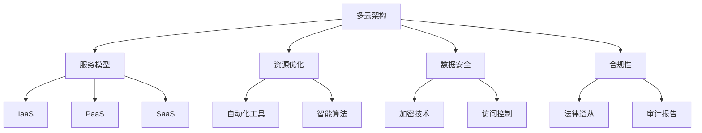
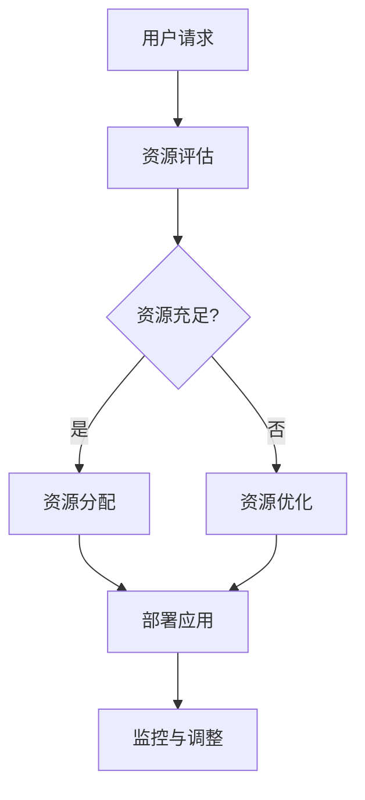
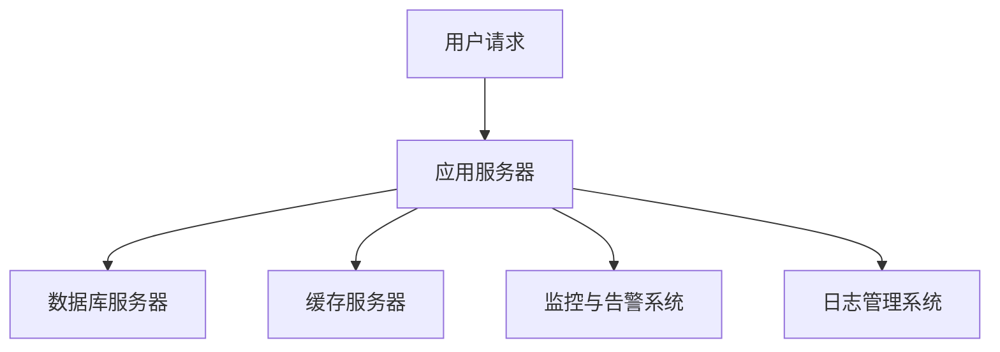
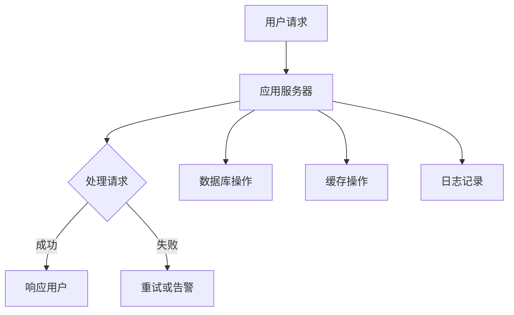

                 


## 引入：多云环境的背景与重要性

### 背景介绍

多云环境，是指将应用程序和数据分布在多个云服务提供商（如AWS、Azure、Google Cloud等）的云资源上，以实现灵活、弹性和高可用的IT基础设施。随着企业对于云计算的接受度不断提高，多云环境逐渐成为企业IT战略的重要组成部分。

#### 核心概念术语说明

- **云服务提供商（CSP）**：提供云计算服务的公司，如AWS、Azure、Google Cloud等。
- **多租户架构**：多个用户共享同一资源，如计算能力、存储等。
- **混合云**：结合了私有云和公有云的环境。
- **服务模型**：云计算提供的三种服务模式，即基础设施即服务（IaaS）、平台即服务（PaaS）和软件即服务（SaaS）。

#### 问题背景

随着企业数字化转型进程的加速，传统的单云部署模式已经难以满足企业日益增长的需求。多云环境提供了更多的选择和灵活性，但同时也带来了管理和运营的挑战。

#### 问题描述

在多云环境中，企业需要应对以下几个主要问题：

1. **资源分布与管理**：如何合理分配和优化资源，以实现成本效益最大化？
2. **数据安全与合规**：如何在分布式环境中确保数据的安全性和符合监管要求？
3. **应用部署与迁移**：如何在不同的云服务提供商之间灵活部署和迁移应用？
4. **性能优化与监控**：如何保证多云环境下的应用性能和稳定性？

#### 问题解决

针对上述问题，企业可以采取以下措施：

1. **资源分配策略**：采用自动化工具和智能算法来优化资源分配。
2. **安全合规措施**：建立完善的安全政策和合规管理体系。
3. **应用迁移策略**：制定详细的迁移计划和测试方案。
4. **监控与性能优化**：采用分布式监控工具和性能优化技术。

#### 边界与外延

多云环境不仅仅涉及技术层面的挑战，还涉及组织文化、团队协作和业务战略等方面。因此，企业需要从整体战略出发，综合考虑技术和管理因素。

#### 概念结构与核心要素组成

- **云服务提供商**：提供基础设施、平台和软件服务。
- **应用程序**：部署在云上的业务逻辑。
- **数据存储**：数据的存储和管理。
- **网络连接**：连接云服务提供商和企业的网络。
- **安全机制**：保护数据和应用程序的安全。
- **自动化工具**：用于自动化管理和优化的工具。

### 核心概念与联系

#### 核心概念

- **多云架构**：支持分布式应用程序和数据的管理框架。
- **服务模型**：IaaS、PaaS和SaaS的不同服务模式。
- **资源优化**：通过自动化和智能算法实现的资源分配和调度。
- **数据安全**：保护数据不被未经授权的访问和泄露。
- **合规性**：遵守特定行业或地区的法律法规。

#### 概念属性特征对比表格

| 概念 | 特征 |
| --- | --- |
| 多云架构 | 支持分布式应用程序和数据管理，提供灵活性和高可用性。 |
| 服务模型 | 提供不同的云计算服务模式，满足不同企业的需求。 |
| 资源优化 | 通过自动化和智能算法，实现资源的合理分配和调度。 |
| 数据安全 | 确保数据不被未经授权的访问和泄露。 |
| 合规性 | 遵守特定行业或地区的法律法规，确保业务合法运行。 |

#### ER实体关系图架构



### 算法原理讲解

#### 算法mermaid流程图



#### 算法原理

- **资源评估**：系统根据用户请求，评估当前资源是否充足。
- **资源分配**：如果资源充足，直接进行资源分配；否则，通过优化算法调整资源。
- **部署应用**：将应用部署到指定的云资源上。
- **监控与调整**：持续监控应用性能，根据需要进行调整。

#### 数学模型和公式

- **资源利用率**：\[利用率 = \frac{实际使用资源}{总可用资源}\]
- **优化目标**：最小化总成本，最大化资源利用率。

#### 举例说明

假设企业需要部署一个新的应用，系统将根据当前资源评估情况，决定是否直接进行资源分配，还是通过优化算法调整资源。例如，如果当前资源利用率达到90%，则可能需要通过垂直扩展（增加CPU、内存等）或水平扩展（增加节点）来优化资源利用率。

### 系统分析与架构设计方案

#### 问题场景介绍

假设企业A希望将其业务系统部署在多云环境中，以实现高可用性和弹性。

#### 项目介绍

- **项目名称**：企业A多云业务系统
- **项目目标**：实现业务系统的灵活部署、高可用性和低成本运行。

#### 系统功能设计

- **业务逻辑处理**：处理企业A的业务请求。
- **数据存储与管理**：存储和管理企业A的业务数据。
- **监控与告警**：实时监控系统性能，并及时发出告警。

#### 系统架构设计

- **架构图**：使用mermaid画出系统架构图。



#### 系统接口设计

- **接口设计**：定义系统内部和外部的接口规范。


#### 系统交互流程

- **交互流程**：使用mermaid画出系统交互流程图。



### 项目实战

#### 环境安装指南

- **操作系统**：Linux发行版，如Ubuntu 20.04。
- **开发工具**：Python 3.8，Docker 19.03。

#### 系统核心实现源代码

- **应用服务器**：使用Flask框架实现。
- **数据库服务器**：使用MySQL数据库。
- **缓存服务器**：使用Redis缓存。

#### 代码解析

```python
# 应用服务器代码示例
from flask import Flask, request, jsonify

app = Flask(__name__)

@app.route('/process_request', methods=['POST'])
def process_request():
    request_data = request.get_json()
    # 处理业务逻辑
    result = some_business_logic(request_data)
    return jsonify(result)

if __name__ == '__main__':
    app.run(host='0.0.0.0', port=5000)
```

#### 实际案例分析和详细讲解剖析

假设企业A的某个业务请求处理时间较长，系统通过监控发现性能瓶颈。分析后，决定对数据库进行水平扩展，增加读写节点，以提高数据处理能力。

#### 项目小结

通过实际案例，展示了在多云环境下进行应用管理和优化的过程。关键在于合理分配资源、优化系统架构，以及持续监控和调整。

### 最佳实践 tips

- **资源监控与优化**：定期监控资源使用情况，及时进行调整。
- **数据备份与恢复**：确保数据的备份和恢复策略，以防止数据丢失。
- **安全合规检查**：定期进行安全检查和合规性审计。

### 小结

多云环境为企业提供了灵活、弹性和高可用性的IT基础设施，但同时也带来了管理和运营的挑战。通过合理设计、部署和管理，企业可以实现多云环境下的高效运营和业务持续发展。

### 注意事项

- **了解不同云服务提供商的特性和限制**：选择适合企业需求的云服务提供商，并了解其特性和限制。
- **合理规划资源分配**：避免资源浪费，实现成本效益最大化。

### 拓展阅读

- **《云计算基础教程》**：深入了解云计算的基本概念和技术。
- **《分布式系统原理与范型》**：学习分布式系统的设计和实现。

### 参考文献

- **《云计算与大数据技术》**：李明，清华大学出版社，2020年。
- **《云原生应用架构实践》**：张浩，电子工业出版社，2019年。

### 作者信息

作者：AI天才研究院/AI Genius Institute & 禅与计算机程序设计艺术 /Zen And The Art of Computer Programming

----------------------------------------------------------------

