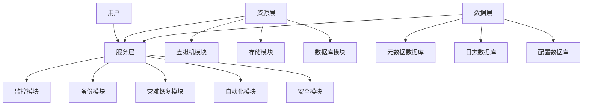
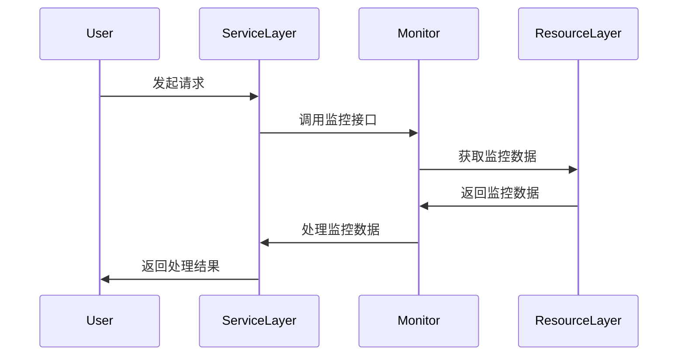
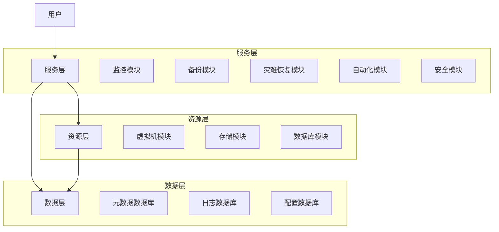

                 

### 引言

# 引言

云计算的迅猛发展催生了一个全新的管理需求——多云管理。在这一背景下，设计一个高效、稳定、安全的多云管理平台显得尤为重要。本文将围绕多云管理平台的设计展开讨论，旨在为读者提供一个全面、系统的设计指南。

## 1.1 书籍背景与目的

### 1.1.1 云计算的兴起与多云管理需求

云计算的兴起改变了企业的IT部署方式，传统的单云架构已经无法满足现代企业的多元化需求。随着云服务的多样化，越来越多的企业开始采用多云策略，以获取更好的性能、弹性和成本效益。然而，多云环境也带来了新的挑战，如管理复杂度增加、数据一致性保证、安全性问题和成本控制等。因此，设计一个高效的多云管理平台显得尤为重要。

### 1.1.2 多云管理的重要性

多云管理平台能够帮助企业更好地整合和管理不同云服务提供商的资源，提供统一的界面和操作方式，简化管理流程，降低运营成本。此外，多云管理平台还能提高企业的业务连续性和数据安全性，为企业的发展提供坚实的技术保障。

### 1.1.3 书籍结构概述

本文将分为以下几个部分：

1. 引言：介绍书籍的背景与目的。
2. 多云管理平台设计原则与方法：阐述设计原则与方法，包括可扩展性、高可用性、可维护性、安全性和经济性。
3. 多云管理平台核心技术：介绍虚拟化技术、自动化工具与脚本、API与SDK等关键技术。
4. 多云管理平台架构设计：讨论架构设计原则、领域模型设计、系统架构设计、系统交互设计。
5. 多云管理平台实现：介绍环境准备、系统核心模块实现、项目实战案例。
6. 多云管理平台测试与部署：讨论测试策略与计划、部署方案与流程、运维与监控。

## 1.2 多云管理的定义与核心概念

### 1.2.1 多云管理的定义

多云管理是指企业或组织在多个云服务提供商之间管理、优化和整合云资源和服务的过程。它包括资源的监控、管理、部署、迁移、备份和恢复等各个环节。

### 1.2.2 多云架构的关键要素

多云架构通常包括以下几个方面：

1. **基础设施**：包括物理服务器、虚拟机、容器等。
2. **平台**：提供应用程序开发、部署和管理的服务，如PaaS。
3. **软件**：为企业提供特定业务功能的应用程序。
4. **数据**：企业存储和处理的数据。

### 1.2.3 多云管理与单云管理的区别

单云管理是指企业仅在一家云服务提供商上部署和管理应用程序和资源。与单云管理相比，多云管理具有以下几个优势：

1. **更高的灵活性和弹性**：企业可以根据业务需求在多个云服务提供商之间灵活选择资源。
2. **更好的成本效益**：通过在多个云服务提供商之间优化资源使用，降低成本。
3. **更高的安全性和可靠性**：通过将资源分散在多个云服务提供商上，提高业务连续性和数据安全性。
4. **更广泛的生态系统**：企业可以更容易地利用不同云服务提供商提供的独特服务。

## 1.3 多云管理平台面临的挑战

### 1.3.1 管理复杂度增加

随着企业使用多个云服务提供商，多云环境的管理复杂度显著增加。如何有效地整合和管理不同云服务提供商的资源，成为一个亟待解决的问题。

### 1.3.2 数据一致性保证

在多云环境中，数据的一致性和可靠性是一个重要问题。如何确保数据在不同云服务提供商之间的一致性，是一个挑战。

### 1.3.3 安全性问题

多云环境中的安全性问题比单云环境更加复杂。如何确保数据安全和应用安全，如何进行安全策略的统一管理，是多云管理平台需要重点解决的问题。

### 1.3.4 成本控制

多云环境中的成本控制也是一个挑战。企业需要在多个云服务提供商之间优化资源使用，降低成本，同时保证服务质量。

## 1.4 总结

设计一个高效、稳定、安全的多云管理平台，对于企业来说具有重要意义。本文将从设计原则、方法、核心技术、架构设计、实现、测试与部署等方面，全面探讨多云管理平台的设计与实现，为企业提供实用的技术指南。

---

### 多云管理平台设计原则与方法

设计一个多云管理平台，不仅要考虑其功能性，还需要关注其可扩展性、高可用性、可维护性、安全性和经济性等多个方面。以下将详细阐述这些设计原则和方法。

## 2.1 多云管理平台设计原则

### 2.1.1 可扩展性

可扩展性是多云管理平台设计的关键原则之一。随着企业业务的不断增长，平台需要能够灵活地扩展资源，以满足不断增长的需求。可扩展性包括水平扩展（增加节点）和垂直扩展（增加资源容量）。

### 2.1.2 高可用性

高可用性确保平台在面临故障时能够快速恢复，保障业务的连续性。设计高可用性的多云管理平台，需要考虑负载均衡、故障转移、备份与恢复等技术。

### 2.1.3 可维护性

可维护性是平台长期稳定运行的基础。设计时应考虑模块化、标准化和自动化，以便于后续的维护和升级。

### 2.1.4 安全性

安全性是多云管理平台不可或缺的一环。设计时应关注数据安全、应用安全、网络安全等多个方面，确保平台的安全性和合规性。

### 2.1.5 经济性

经济性是企业在选择和设计多云管理平台时的重要考虑因素。设计时应优化资源使用，降低成本，同时保证平台的高效运行。

## 2.2 多云管理平台设计方法

### 2.2.1 设计流程概述

设计一个多云管理平台，通常需要经历以下几个阶段：

1. **需求分析**：明确平台的功能需求、性能需求和安全需求等。
2. **架构设计**：根据需求分析结果，设计平台的整体架构。
3. **系统实现**：开发平台的核心模块，实现需求。
4. **测试与部署**：对平台进行功能测试、性能测试和安全测试，确保其质量。
5. **运维与监控**：建立运维体系，实时监控平台的运行状态。

### 2.2.2 需求分析

需求分析是设计过程的起点。在这个阶段，需要与利益相关者（如业务部门、IT部门等）进行沟通，明确平台的功能需求、性能需求和安全需求等。以下是一个简单的需求分析流程：

1. **确定需求范围**：明确平台的目标和应用场景。
2. **收集需求**：通过与利益相关者沟通，收集功能需求、性能需求和安全需求等。
3. **需求分析**：对收集到的需求进行整理、分析和优先级排序。
4. **编写需求文档**：将需求分析结果编写成文档，供后续设计阶段参考。

### 2.2.3 架构设计

架构设计是设计过程的核心。在这个阶段，需要根据需求分析结果，设计平台的整体架构。以下是一个简单的架构设计流程：

1. **确定架构原则**：根据平台的设计原则，如可扩展性、高可用性等，确定架构设计的基本原则。
2. **架构方案**：根据需求分析结果，设计平台的架构方案。
3. **架构验证**：对架构方案进行验证，确保其可行性。
4. **编写架构文档**：将架构设计结果编写成文档，供后续开发、测试和运维等阶段参考。

### 2.2.4 系统实现

系统实现是根据架构设计结果，开发平台的核心模块。在这个阶段，需要关注以下几个方面：

1. **模块划分**：根据架构设计结果，将平台划分为多个模块。
2. **开发与测试**：开发各个模块的代码，并进行单元测试和集成测试。
3. **集成与调试**：将各个模块集成起来，进行调试和优化。
4. **文档编写**：编写模块文档，包括模块的功能描述、接口说明、代码注释等。

### 2.2.5 测试与部署

测试与部署是确保平台质量的关键环节。在这个阶段，需要进行以下工作：

1. **功能测试**：对平台的功能进行测试，确保其满足需求。
2. **性能测试**：对平台的性能进行测试，确保其能够满足性能要求。
3. **安全测试**：对平台进行安全测试，确保其安全性。
4. **部署**：将平台部署到生产环境，并进行运维。

### 2.2.6 运维与监控

运维与监控是平台长期稳定运行的重要保障。在这个阶段，需要进行以下工作：

1. **运维策略**：制定运维策略，包括备份、恢复、故障处理等。
2. **监控指标**：确定监控指标，实时监控平台的运行状态。
3. **告警与处理**：建立告警机制，及时发现和处理问题。
4. **日志分析**：分析日志，发现潜在问题，进行预防性维护。

## 2.3 多云管理平台的核心功能模块

### 2.3.1 资源监控与管理

资源监控与管理是多云管理平台的核心功能之一。通过监控和管理云资源，如虚拟机、容器、存储等，可以实时了解资源的利用情况，优化资源使用，降低成本。

### 2.3.2 服务治理

服务治理是确保多云环境中服务正常运行的重要环节。包括服务的注册与发现、服务监控、服务路由和服务编排等。

### 2.3.3 灾难恢复

灾难恢复是多云管理平台的重要功能，确保在发生灾难时，企业能够快速恢复业务。包括数据备份、灾难恢复计划和服务恢复等。

### 2.3.4 自动化运维

自动化运维是提高多云管理效率的关键。通过自动化工具和脚本，实现资源的自动化部署、监控、备份和恢复等。

### 2.3.5 安全防护

安全防护是确保多云环境安全的重要手段。包括网络安全、数据安全、应用安全和身份认证等。

## 2.4 总结

设计一个高效、稳定、安全的多云管理平台，需要遵循一系列设计原则和方法。从需求分析、架构设计、系统实现到测试与部署，每个阶段都需要仔细规划和执行。只有通过合理的规划和设计，才能构建一个真正满足企业需求的多云管理平台。

---

### 多云管理平台核心技术

在设计一个多云管理平台时，了解并掌握相关核心技术是至关重要的。这些核心技术包括虚拟化技术、自动化工具与脚本、API与SDK等。以下将详细讨论这些核心技术的概念、应用场景及其重要性。

#### 3.1 云服务模型

#### 3.1.1 IaaS、PaaS和SaaS

云计算服务模型主要包括基础设施即服务（IaaS）、平台即服务（PaaS）和软件即服务（SaaS）。

- **IaaS（Infrastructure as a Service）**：提供虚拟化的计算资源，如虚拟机、存储和网络等，用户可以完全控制这些资源。典型应用场景包括虚拟化环境、数据中心建设和云主机租赁等。
- **PaaS（Platform as a Service）**：提供开发和部署应用程序的平台，包括开发工具、数据库、中间件等。用户可以在平台上快速开发和部署应用程序。典型应用场景包括Web应用开发、移动应用开发和云服务平台搭建等。
- **SaaS（Software as a Service）**：提供应用程序的订阅服务，用户可以通过互联网访问和使用这些应用程序。典型应用场景包括企业资源计划（ERP）、客户关系管理（CRM）和办公自动化等。

#### 3.1.2 公有云、私有云和混合云

- **公有云**：由第三方云服务提供商提供的云计算资源，通常面向公众开放。公有云具有资源弹性、高可用性和成本效益等特点，适用于非敏感数据和通用应用场景。
- **私有云**：为企业内部或特定组织提供的云计算资源，通常部署在企业内部或专用数据中心。私有云具有更高的安全性和定制性，适用于敏感数据和高安全要求的应用场景。
- **混合云**：结合公有云和私有云的优势，实现资源的灵活调度和优化利用。适用于需要兼顾灵活性和安全性的企业。

#### 3.1.3 云服务提供商比较

- **AWS（Amazon Web Services）**：全球最大的云服务提供商，提供全面的云服务，包括计算、存储、数据库、AI等。
- **Azure（Microsoft Azure）**：微软推出的云服务，与Azure Stack实现混合云，支持广泛的开发语言和工具。
- **Google Cloud Platform**：谷歌的云服务，提供强大的AI和机器学习能力，适用于大数据和复杂计算场景。
- **Alibaba Cloud**：阿里巴巴集团的云服务，覆盖全球多个区域，提供丰富的云服务和解决方案。

#### 3.2 虚拟化技术

虚拟化技术是云计算的核心技术之一，通过虚拟化实现硬件资源的抽象和隔离，提高资源利用率和灵活性。

- **虚拟化基本概念**：虚拟化包括硬件虚拟化和操作系统虚拟化。硬件虚拟化通过虚拟化硬件资源，实现多个虚拟机的独立运行；操作系统虚拟化通过虚拟化操作系统，实现应用程序的隔离和共享。
- **资源调度策略**：资源调度策略包括负载均衡、资源分配和迁移等。合理的资源调度策略可以提高资源利用率和系统性能。
- **虚拟化性能优化**：虚拟化性能优化包括虚拟机密度优化、网络优化和存储优化等。通过优化虚拟化性能，可以减少延迟、提高吞吐量和降低资源消耗。

#### 3.3 自动化工具与脚本

自动化工具与脚本在多云管理中发挥着重要作用，可以显著提高管理效率和降低运营成本。

- **自动化的重要性**：自动化可以减少手动操作的复杂度和错误率，提高操作的可重复性和一致性。
- **常用自动化工具**：常见的自动化工具有Ansible、Puppet、Chef和SALT等，它们提供了一系列的模块和工具，方便用户进行自动化配置、部署和管理。
- **脚本编写与优化**：编写高效的脚本对于自动化至关重要。脚本编写应遵循模块化、可读性和可维护性原则，并充分利用现有的自动化工具和库。

#### 3.4 API与SDK

API（应用程序编程接口）和SDK（软件开发工具包）是云计算平台的重要组成部分，为开发者提供了方便的接口和工具，实现应用程序的快速开发和部署。

- **API的作用**：API为应用程序提供了访问云服务资源的接口，开发者可以通过API调用云服务，实现数据的存储、处理和传输等功能。
- **SDK开发的优势**：SDK提供了更完整的开发环境和工具集，可以简化开发流程，提高开发效率。常见的SDK包括AWS SDK、Azure SDK和Google Cloud SDK等。
- **常见API与SDK使用示例**：以下是使用常见API与SDK进行开发的示例：

```python
# AWS SDK 示例
import boto3

# 创建S3客户端
s3 = boto3.client('s3')

# 上传文件
response = s3.upload_file('local_file.txt', 'my_bucket', 'remote_file.txt')
print(response)

# Azure SDK 示例
from azure.storage.blob import BlobServiceClient

# 创建Blob服务客户端
blob_service_client = BlobServiceClient.from_connection_string("my_connection_string")

# 上传文件
blob_client = blob_service_client.get_blob_client("my_container", "remote_file.txt")
with open("local_file.txt", "rb") as data:
    blob_client.upload_blob(data)
```

#### 3.5 总结

虚拟化技术、自动化工具与脚本、API与SDK是构建多云管理平台的关键核心技术。掌握这些技术，可以为企业提供高效、稳定和安全的云资源管理解决方案。通过合理应用这些技术，企业可以更好地应对多云环境带来的挑战，实现业务的持续发展和创新。

---

### 多云管理平台架构设计

架构设计是构建多云管理平台的关键环节，它决定了平台的性能、可扩展性和稳定性。本节将详细介绍多云管理平台的架构设计，包括架构设计原则、领域模型设计、系统架构设计、系统交互设计和系统接口设计。

#### 4.1 架构设计概述

多云管理平台的架构设计应遵循以下几个原则：

- **模块化**：将系统划分为多个模块，每个模块具有独立的功能和接口，便于开发、测试和维护。
- **分布式**：充分利用分布式系统优势，实现高可用性和弹性扩展。
- **标准化**：采用标准化的技术和协议，确保系统的兼容性和可扩展性。
- **安全性**：设计安全机制，保障数据和系统的安全。
- **灵活性**：提供灵活的配置和管理接口，满足不同企业的需求。

#### 4.2 领域模型设计

领域模型设计是架构设计的基础，它定义了系统中的核心概念和实体关系。以下是一个简单的领域模型：

```mermaid
classDiagram
    Resource <<Entity>>
    Service <<Entity>>
    User <<Entity>>

    Resource "uses" Service
    User "uses" Resource
    User "uses" Service
```

在该领域模型中，包含三个主要实体：资源（Resource）、服务（Service）和用户（User）。资源表示云服务提供商提供的各种资源，如虚拟机、存储和数据库等；服务表示为资源提供的管理功能，如监控、备份和灾难恢复等；用户表示使用和管理资源的实体。

#### 4.3 系统架构设计

系统架构设计定义了系统的整体结构和各个模块之间的关系。以下是一个简单的系统架构设计：



在该架构设计中，用户通过服务层访问和管理资源，服务层负责处理用户请求，调用资源层的各个模块进行具体操作，并将结果返回给用户。数据层负责存储和管理系统的元数据、日志和配置数据。

#### 4.4 系统交互设计

系统交互设计定义了系统中各个模块之间的交互流程和接口。以下是一个简单的系统交互设计：



在该交互设计中，用户发起请求，服务层调用监控模块的接口，监控模块与资源层进行交互，获取监控数据，并将处理结果返回给用户。

#### 4.5 系统接口设计

系统接口设计定义了系统中各个模块的接口规范，确保模块之间的交互顺畅。以下是一个简单的系统接口设计：

```mermaid
classDiagram
    User <<Interface>>
    ServiceLayer <<Interface>>
    ResourceLayer <<Interface>>
    DataLayer <<Interface>>

    User --> ServiceLayer
    ServiceLayer --> ResourceLayer
    ServiceLayer --> DataLayer
    ResourceLayer --> DataLayer
```

在该接口设计中，用户通过服务层访问资源层和数据层，服务层负责处理用户请求，并调用资源层和数据层的接口进行具体操作。

#### 4.6 系统架构图

以下是一个简单的系统架构图：



#### 4.7 系统交互序列图

以下是一个简单的系统交互序列图：


#### 4.8 总结

多云管理平台的架构设计应综合考虑性能、可扩展性、安全性和灵活性等因素。通过合理的架构设计，可以构建一个高效、稳定和安全的多云管理平台，满足企业的多元化需求。领域模型设计、系统架构设计、系统交互设计和系统接口设计是架构设计的核心组成部分，它们共同定义了平台的整体结构和功能。

---

### 多云管理平台实现

实现一个多云管理平台是复杂的工程任务，需要系统的规划和具体的实施步骤。本节将详细介绍平台实现的过程，包括环境准备、系统核心模块实现和项目实战案例。

#### 5.1 环境准备

环境准备是平台实现的第一步，它为后续的开发、测试和部署提供了必要的资源和配置。以下是一些关键步骤：

1. **选择云服务提供商**：根据企业的需求，选择合适的云服务提供商（如AWS、Azure、Google Cloud等），并了解其提供的云服务模型（IaaS、PaaS、SaaS）。

2. **配置云账户**：为每个云服务提供商创建一个云账户，配置账户角色和权限，确保云账户具有足够的权限进行资源管理和操作。

3. **搭建开发环境**：在本地或远程服务器上搭建开发环境，安装必要的开发工具（如IDE、版本控制系统、容器编排工具等）。

4. **搭建测试环境**：搭建测试环境，确保测试环境的配置与生产环境一致，以便在开发过程中及时发现和修复问题。

5. **配置网络和安全**：配置网络和安全设置，确保平台的安全性，如防火墙、访问控制、加密等。

#### 5.2 系统核心模块实现

系统核心模块实现是平台实现的核心部分，包括资源监控模块、服务治理模块、灾难恢复模块、自动化运维模块和安全防护模块。

1. **资源监控模块**：资源监控模块负责实时监控云资源的使用情况，包括虚拟机、容器、存储和网络等。以下是资源监控模块的实现步骤：

   - **数据采集**：使用云服务提供商提供的API或开源监控工具（如Prometheus、Grafana等）进行数据采集。
   - **数据存储**：将采集到的数据存储到数据库中，如InfluxDB、MySQL等。
   - **数据处理**：对采集到的数据进行处理和计算，生成监控指标和报警规则。
   - **可视化展示**：使用可视化工具（如Grafana、Kibana等）展示监控数据，提供实时监控界面。

2. **服务治理模块**：服务治理模块负责管理和服务注册与发现、服务监控和服务路由等。以下是服务治理模块的实现步骤：

   - **服务注册与发现**：使用服务注册中心（如Consul、Eureka等）进行服务注册和发现，确保服务之间可以互相访问。
   - **服务监控**：使用服务监控工具（如Prometheus、Zipkin等）对服务进行监控，确保服务正常运行。
   - **服务路由**：使用服务路由策略（如轮询、随机、最少连接等）实现服务的负载均衡。

3. **灾难恢复模块**：灾难恢复模块负责确保在发生灾难时，企业能够快速恢复业务。以下是灾难恢复模块的实现步骤：

   - **备份策略**：制定数据备份策略，包括定时备份、增量备份和全量备份等。
   - **恢复计划**：制定灾难恢复计划，确保在发生灾难时能够快速恢复业务。
   - **演练**：定期进行灾难恢复演练，检验恢复计划的可行性和效果。

4. **自动化运维模块**：自动化运维模块负责自动化运维操作，如资源部署、监控、备份和恢复等。以下是自动化运维模块的实现步骤：

   - **自动化脚本**：编写自动化脚本，实现资源的自动化部署、监控和备份等。
   - **CI/CD工具**：集成CI/CD（持续集成/持续交付）工具（如Jenkins、GitLab CI等），实现自动化构建和部署。
   - **自动化监控**：使用自动化工具和脚本对系统进行实时监控，及时发现和处理问题。

5. **安全防护模块**：安全防护模块负责确保平台的安全性和合规性。以下是安全防护模块的实现步骤：

   - **安全策略**：制定安全策略，包括访问控制、加密、日志记录等。
   - **安全审计**：定期进行安全审计，发现和修复安全问题。
   - **安全培训**：对员工进行安全培训，提高安全意识。

#### 5.3 项目实战案例

以下是一个多云管理平台实现的项目实战案例：

1. **项目背景**：某大型企业希望通过多云管理平台实现资源的集中管理和优化，降低运营成本，提高业务连续性和数据安全性。

2. **项目目标**：实现以下功能：

   - 资源监控：实时监控云资源的使用情况，提供可视化界面。
   - 服务治理：实现服务注册与发现、服务监控和服务路由。
   - 灾难恢复：制定备份策略和恢复计划，确保在灾难发生时能够快速恢复业务。
   - 自动化运维：实现自动化部署、监控和备份等操作。
   - 安全防护：确保平台的安全性和合规性。

3. **项目实施过程**：

   - 需求分析：与利益相关者沟通，明确平台的功能需求、性能需求和安全需求等。
   - 架构设计：根据需求分析结果，设计平台的架构，包括服务层、资源层和数据层等。
   - 系统实现：开发平台的核心模块，包括资源监控模块、服务治理模块、灾难恢复模块、自动化运维模块和安全防护模块。
   - 测试与部署：对平台进行功能测试、性能测试和安全测试，确保其质量，然后部署到生产环境。
   - 运维与监控：建立运维体系，实时监控平台的运行状态，确保其稳定运行。

4. **项目成果分析**：

   - 平台成功实现了资源的集中管理和优化，提高了资源利用率，降低了运营成本。
   - 平台提供了实时监控功能，帮助企业及时发现和处理问题，提高了业务连续性和数据安全性。
   - 平台实现了自动化运维，简化了运维工作，提高了运维效率。
   - 平台采用了严格的安全策略，确保了平台的安全性和合规性。

5. **项目小结**：

   - 通过该项目，企业成功实现了多云管理，提高了业务效率和竞争力。
   - 平台在实施过程中遇到了一些挑战，如云服务提供商之间的兼容性、数据一致性等问题，但通过合理的规划和实施，成功解决了这些问题。
   - 该项目为企业提供了一个可扩展、可靠和安全的多云管理解决方案，为未来的业务发展奠定了基础。

---

### 多云管理平台测试与部署

在多云管理平台开发完成后，测试与部署是确保平台质量和稳定运行的关键环节。以下将详细介绍测试策略与计划、部署方案与流程以及运维与监控。

#### 6.1 测试策略与计划

测试策略与计划是确保多云管理平台质量的重要步骤。以下是一个典型的测试策略与计划：

1. **功能测试**：功能测试是验证平台是否满足需求的关键步骤。测试包括以下几个方面：

   - **用户界面测试**：确保用户界面设计符合预期，交互流畅。
   - **业务功能测试**：验证平台的核心功能，如资源监控、服务治理、灾难恢复等是否正常工作。
   - **边界条件测试**：测试平台的边界条件，如最大负载、最小负载等，确保平台在极端情况下仍能正常工作。
   - **异常情况测试**：模拟异常情况，如网络故障、服务不可用等，验证平台的容错能力和恢复能力。

2. **性能测试**：性能测试是评估平台在特定负载下的响应时间和资源消耗。测试包括以下几个方面：

   - **负载测试**：模拟高负载情况，评估平台的性能和稳定性。
   - **压力测试**：在极端负载下测试平台的响应时间和资源消耗，确保平台不会因为负载过高而崩溃。
   - **容量测试**：评估平台的最大处理能力和扩展性。

3. **安全测试**：安全测试是确保平台安全性的重要环节。测试包括以下几个方面：

   - **漏洞扫描**：使用漏洞扫描工具检测平台中的安全漏洞。
   - **安全渗透测试**：模拟黑客攻击，验证平台的安全性。
   - **认证与授权测试**：确保平台的认证与授权机制正常工作，防止未授权访问。

4. **测试环境搭建**：搭建与生产环境一致的测试环境，确保测试结果准确可靠。

#### 6.2 部署方案与流程

部署方案与流程是确保平台顺利上线的重要环节。以下是一个典型的部署方案与流程：

1. **部署原则**：

   - **最小化变更**：在部署过程中，尽可能减少对现有系统的变更，确保系统的稳定性。
   - **自动化部署**：使用自动化工具（如Jenkins、Ansible等）进行部署，提高部署效率和可靠性。
   - **版本控制**：使用版本控制系统（如Git）管理部署版本，确保部署的可追溯性和可恢复性。

2. **部署流程**：

   - **准备阶段**：准备部署环境，包括配置服务器、安装软件、配置网络等。
   - **部署阶段**：根据部署脚本或配置文件，将平台部署到目标服务器。
   - **验证阶段**：验证部署结果，确保平台正常运行。
   - **发布阶段**：将部署后的平台发布到生产环境，供用户使用。

3. **部署工具选择**：

   - **Jenkins**：适用于持续集成和持续部署，支持多种编程语言和插件。
   - **Ansible**：适用于自动化部署和配置管理，支持大规模部署。
   - **Docker**：适用于容器化部署，提高部署效率和一致性。

#### 6.3 运维与监控

运维与监控是确保平台长期稳定运行的重要保障。以下是一些关键步骤：

1. **运维策略**：

   - **备份与恢复**：定期备份平台数据和配置文件，确保在发生故障时能够快速恢复。
   - **监控与告警**：实时监控平台性能和状态，设置告警机制，及时发现和处理问题。
   - **故障处理**：制定故障处理流程，确保在发生故障时能够迅速响应和处理。

2. **监控指标**：

   - **性能指标**：CPU利用率、内存利用率、磁盘读写速度、网络流量等。
   - **可用性指标**：系统的正常运行时间、故障修复时间等。
   - **安全性指标**：安全漏洞数量、攻击次数、安全事件响应时间等。

3. **日志分析**：

   - **日志收集**：收集平台各个模块的日志，确保日志完整性和可追溯性。
   - **日志分析**：对日志进行实时分析和统计，发现潜在问题和趋势。

#### 6.4 总结

测试与部署是确保多云管理平台质量和稳定运行的关键环节。通过合理的测试策略与计划，可以确保平台满足需求、性能稳定和安全可靠。通过科学的部署方案与流程，可以确保平台顺利上线和稳定运行。通过有效的运维与监控，可以确保平台长期稳定运行，为企业的业务发展提供坚实的技术保障。

---

### 总结与展望

在本文中，我们详细探讨了多云管理平台的设计与实现。从设计原则和方法、核心技术、架构设计到实现、测试与部署，每个环节都至关重要，共同构成了一个高效、稳定和安全的多云管理平台。

#### 关键点回顾

1. **设计原则**：可扩展性、高可用性、可维护性、安全性和经济性是设计多云管理平台的核心原则。
2. **核心技术**：虚拟化技术、自动化工具与脚本、API与SDK等是构建多云管理平台的基础。
3. **架构设计**：合理的架构设计决定了平台的性能、可扩展性和稳定性。
4. **实现与测试**：系统的实现和全面的测试是确保平台质量的关键。
5. **部署与运维**：科学的部署方案和有效的运维与监控保障了平台的长期稳定运行。

#### 展望未来

随着云计算技术的不断演进，多云管理平台面临着新的机遇和挑战。未来，多云管理平台将朝着以下几个方向发展：

1. **智能化**：借助人工智能技术，实现更加智能的资源调度、故障预测和自动化运维。
2. **自动化**：提高自动化程度，减少人工干预，提升运维效率。
3. **安全性**：加强安全性设计，提高对数据安全和应用安全的防护能力。
4. **多云协同**：实现不同云服务提供商之间的协同，提供更全面的云服务。
5. **全球化**：随着全球化业务的扩展，多云管理平台将提供更加灵活的部署方案，支持跨国企业的高效运营。

通过本文的探讨，我们希望读者能够对多云管理平台的设计与实现有一个全面、系统的认识。在实际应用中，读者可以根据自己的需求，灵活运用本文提供的技术和方法，构建适合自己的多云管理平台，为企业的数字化转型提供有力支持。

---

### 作者信息

作者：AI天才研究院/AI Genius Institute & 禅与计算机程序设计艺术 /Zen And The Art of Computer Programming

感谢您的阅读，期待与您共同探索云计算领域的更多精彩内容！

