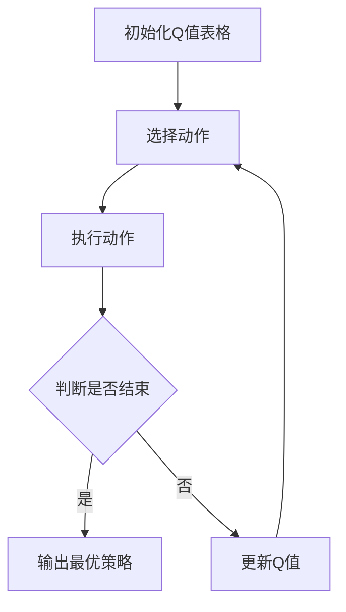

                 


## 《多智能体强化学习：协作与竞争的AI Agent系统》

### 关键词：多智能体强化学习、AI Agent、协作与竞争、算法、系统应用

> 摘要：本文深入探讨多智能体强化学习在AI Agent系统中的协作与竞争机制，分析核心概念、算法原理，并通过具体项目实战，展示其在实际应用中的效果。

### 目录大纲设计步骤

为了设计出符合要求的《多智能体强化学习：协作与竞争的AI Agent系统》目录大纲，我们可以按照以下步骤进行：

#### 步骤一：确定书籍核心内容

1. **核心概念与联系**：明确核心概念，如“多智能体强化学习”、“AI Agent系统”、“协作与竞争”等，并分析它们之间的关系。
2. **算法原理讲解**：整理多智能体强化学习的算法原理，包括数学模型和公式。
3. **系统分析与架构设计方案**：考虑如何将算法原理应用到实际系统中。
4. **项目实战**：设计一个具体的项目实战案例，展示如何实现多智能体强化学习系统。
5. **最佳实践 tips、小结、注意事项、拓展阅读**：总结书中内容，提供实用建议和进一步阅读的资源。

#### 步骤二：规划章节结构

1. **背景介绍**：介绍问题背景、问题描述、问题解决、边界与外延。
2. **核心概念与联系**：详细阐述核心概念原理、概念属性特征对比表格和ER实体关系图架构。
3. **算法原理讲解**：使用 mermaid 画出算法流程图，并用 Python 源代码详细阐述算法原理。
4. **数学模型和数学公式**：使用 LaTeX 格式展示数学模型和公式，并进行详细讲解和举例说明。
5. **系统分析与架构设计方案**：介绍问题场景、系统功能设计、系统架构设计、系统接口设计和系统交互。
6. **项目实战**：详细描述环境安装、系统核心实现源代码，并进行代码应用解读与分析。
7. **最佳实践 tips、小结、注意事项、拓展阅读**：总结书中内容，提供实用建议和进一步阅读的资源。

#### 步骤三：编写章节内容

1. **第1章 多智能体强化学习概述**
   - 介绍多智能体强化学习的背景、定义和重要性。
   - 阐述多智能体强化学习与传统强化学习的关系。

2. **第2章 多智能体强化学习的基本概念**
   - 定义多智能体系统、智能体和强化学习。
   - 分析多智能体强化学习中的关键要素。

3. **第3章 多智能体强化学习算法**
   - 详细讲解多智能体强化学习的算法原理。
   - 使用 mermaid 画出算法流程图，并用 Python 源代码进行阐述。

4. **第4章 协作与竞争的多智能体强化学习**
   - 分析协作与竞争在多智能体强化学习中的应用。
   - 介绍协作与竞争算法的数学模型和公式。

5. **第5章 多智能体强化学习在AI Agent系统中的应用**
   - 阐述多智能体强化学习在 AI Agent 系统中的适用场景。
   - 设计一个具体的应用案例，展示如何实现协作与竞争的多智能体强化学习系统。

6. **第6章 项目实战**
   - 详细描述项目环境安装、系统核心实现源代码，并进行代码应用解读与分析。

7. **第7章 最佳实践与展望**
   - 总结多智能体强化学习在协作与竞争中的最佳实践。
   - 提供进一步阅读的资源和建议。

### 步骤四：审阅与调整

1. **内容完整性**：检查目录是否涵盖了所有核心内容。
2. **简洁性**：删除多余的内容，确保目录简洁明了。
3. **逻辑性**：确保章节之间的逻辑关系清晰。
4. **格式一致性**：确保使用统一的 markdown 格式。

### 最终输出

按照以上步骤，我们设计的《多智能体强化学习：协作与竞争的AI Agent系统》目录大纲如下：

```markdown
# 《多智能体强化学习：协作与竞争的AI Agent系统》目录大纲

## 第1章 多智能体强化学习概述

### 1.1 问题背景与问题描述

### 1.2 多智能体强化学习的定义与重要性

### 1.3 传统强化学习与多智能体强化学习的区别

## 第2章 多智能体强化学习的基本概念

### 2.1 多智能体系统的定义

### 2.2 智能体的定义与类型

### 2.3 强化学习的定义与基本原理

### 2.4 多智能体强化学习中的关键要素

## 第3章 多智能体强化学习算法

### 3.1 Q-learning算法

### 3.2 SARSA算法

### 3.3 DQN算法

### 3.4 Policy Gradient算法

### 3.5 多智能体强化学习算法的mermaid流程图

## 第4章 协作与竞争的多智能体强化学习

### 4.1 协作与竞争的定义

### 4.2 协作多智能体强化学习的算法

### 4.3 竞争多智能体强化学习的算法

### 4.4 协作与竞争算法的数学模型与公式

## 第5章 多智能体强化学习在AI Agent系统中的应用

### 5.1 AI Agent系统的定义与特点

### 5.2 多智能体强化学习在AI Agent系统中的适用场景

### 5.3 协作与竞争的多智能体强化学习应用案例

## 第6章 项目实战

### 6.1 项目背景与目标

### 6.2 环境安装与配置

### 6.3 系统核心实现源代码分析

### 6.4 代码应用解读与分析

### 6.5 项目小结

## 第7章 最佳实践与展望

### 7.1 多智能体强化学习在协作与竞争中的最佳实践

### 7.2 注意事项与拓展阅读

### 7.3 未来展望与研究方向

---

**作者：AI天才研究院/AI Genius Institute & 禅与计算机程序设计艺术 /Zen And The Art of Computer Programming**

**注意**：本文为《多智能体强化学习：协作与竞争的AI Agent系统》的目录大纲设计，未包含具体内容。

### 《多智能体强化学习：协作与竞争的AI Agent系统》正文

---

### 第1章 多智能体强化学习概述

#### 1.1 问题背景与问题描述

在当今的信息化时代，人工智能技术正迅速发展，应用场景日益广泛。多智能体强化学习（Multi-Agent Reinforcement Learning，MARL）作为人工智能的一个重要分支，受到了广泛关注。传统强化学习主要关注单个智能体在动态环境中的学习问题，而多智能体强化学习则扩展了这一框架，考虑多个智能体之间的相互作用和协作。

在现实世界中，很多问题都可以被建模为多个智能体在环境中的交互问题，如无人驾驶车队、智能电网、多人游戏等。这些系统中，智能体之间可能存在协作或竞争关系，如何设计智能体策略以实现系统最优性能成为一个关键问题。

#### 1.2 多智能体强化学习的定义与重要性

多智能体强化学习是一种通过学习策略来优化多个智能体共同决策的过程。在这些系统中，每个智能体都有自己的目标，但为了实现整体最优，智能体之间需要通过相互作用来调整自己的行为。

定义多智能体系统（MAS）：一个多智能体系统由一组相互独立的智能体组成，这些智能体在分布式环境中通过通信和协作来实现共同目标。

定义智能体（Agent）：智能体是一个具有感知、决策和执行能力的实体，能够在动态环境中自主行动并与其他智能体交互。

定义强化学习（Reinforcement Learning，RL）：强化学习是一种通过试错来学习最优策略的机器学习方法。在强化学习中，智能体通过与环境的交互，不断调整自己的行为，以最大化累积奖励。

多智能体强化学习的重要性：

1. **复杂性问题**：许多实际问题可以抽象为多智能体系统，通过多智能体强化学习可以解决这些复杂问题。
2. **协作与竞争**：在多智能体系统中，智能体之间可能存在竞争关系，但为了实现整体最优，协作往往更加重要。
3. **自主性**：多智能体强化学习使得智能体能够在复杂动态环境中自主学习和决策，具有很高的实用价值。

#### 1.3 传统强化学习与多智能体强化学习的区别

传统强化学习主要关注单个智能体的最优策略学习，而多智能体强化学习则需要考虑多个智能体之间的相互作用。

1. **环境模型**：传统强化学习假设环境是静态的，而多智能体强化学习考虑环境的动态变化，以及智能体之间的相互作用。
2. **决策过程**：传统强化学习主要关注单个智能体的动作选择，而多智能体强化学习需要同时考虑多个智能体的策略。
3. **目标函数**：传统强化学习的目标是最大化单个智能体的累积奖励，而多智能体强化学习的目标是最大化整个系统的总体奖励。
4. **策略优化**：传统强化学习通过单智能体的策略优化来实现目标，而多智能体强化学习需要通过策略协同优化来实现整体最优。

### 第2章 多智能体强化学习的基本概念

#### 2.1 多智能体系统的定义

多智能体系统（MAS）是一个由多个智能体组成的分布式系统，这些智能体可以在不同的物理或逻辑节点上运行。每个智能体具有自主性、社会性和适应性，能够感知环境、做出决策并采取行动。

定义多智能体系统：

1. **自主性**：智能体能够独立执行任务，不受其他智能体的直接控制。
2. **社会性**：智能体能够通过通信和协作来实现共同目标。
3. **适应性**：智能体能够根据环境和任务的变化调整自己的行为。

#### 2.2 智能体的定义与类型

智能体是MAS中的基本单位，具有感知、决策和执行能力。根据智能体的行为特点，可以将智能体分为以下几类：

1. **主动智能体**：主动智能体具有自主决策能力，能够根据环境变化自主调整行为。
2. **被动智能体**：被动智能体主要根据环境变化被动地响应。
3. **混合智能体**：混合智能体同时具有主动和被动特征。

#### 2.3 强化学习的定义与基本原理

强化学习是一种通过试错来学习最优策略的机器学习方法。在强化学习中，智能体通过与环境的交互，不断调整自己的行为，以最大化累积奖励。

定义强化学习：

1. **状态（State）**：描述智能体所处的环境条件。
2. **动作（Action）**：智能体可以采取的行为。
3. **奖励（Reward）**：描述智能体在执行某个动作后所获得的即时反馈。
4. **策略（Policy）**：智能体在特定状态下采取的动作。

强化学习的目标是通过学习策略来最大化累积奖励。强化学习的基本原理包括：

1. **Q值学习**：Q值学习是一种基于值函数的方法，通过学习状态-动作值函数来指导智能体的动作选择。
2. **策略梯度方法**：策略梯度方法通过直接优化策略梯度来学习最优策略。
3. **深度强化学习**：结合深度神经网络，通过学习状态-动作值函数或策略来实现强化学习。

#### 2.4 多智能体强化学习中的关键要素

多智能体强化学习中的关键要素包括：

1. **环境模型**：描述智能体所处的环境状态以及可能发生的动作和奖励。
2. **智能体模型**：描述智能体的感知、决策和执行过程。
3. **策略学习**：通过学习智能体策略来实现最优决策。
4. **协同机制**：设计智能体之间的协作与竞争机制，以实现系统整体最优。

### 第3章 多智能体强化学习算法

#### 3.1 Q-learning算法

Q-learning算法是一种基于值函数的强化学习算法，通过学习状态-动作值函数来指导智能体的动作选择。在Q-learning算法中，智能体通过试错来逐步优化其策略。

算法原理：

1. **初始化**：初始化Q值表格，对所有状态-动作对的Q值进行随机初始化。
2. **选择动作**：在给定状态下，选择具有最大Q值的动作。
3. **更新Q值**：根据实际获得的奖励和下一个状态，更新当前状态-动作对的Q值。

Python代码示例：

```python
import numpy as np

# 初始化Q值表格
Q = np.random.rand(n_states, n_actions)

# 学习率
alpha = 0.1
# 折扣因子
gamma = 0.9

# 进行N次迭代
for episode in range(N):
    state = env.reset()
    done = False
    
    while not done:
        action = np.argmax(Q[state])
        next_state, reward, done, _ = env.step(action)
        
        # 更新Q值
        Q[state, action] = Q[state, action] + alpha * (reward + gamma * np.max(Q[next_state]) - Q[state, action])
        
        state = next_state

# 输出最优策略
print(np.argmax(Q, axis=1))
```

#### 3.2 SARSA算法

SARSA（On-Policy）算法是一种基于策略的强化学习算法，通过直接在当前策略下进行学习。SARSA算法同样基于值函数，通过更新当前状态-动作对的Q值来实现策略优化。

算法原理：

1. **初始化**：初始化Q值表格，对所有状态-动作对的Q值进行随机初始化。
2. **选择动作**：在给定状态下，选择具有最大Q值的动作。
3. **更新Q值**：根据实际获得的奖励和下一个状态，更新当前状态-动作对的Q值。

Python代码示例：

```python
import numpy as np

# 初始化Q值表格
Q = np.random.rand(n_states, n_actions)

# 学习率
alpha = 0.1
# 折扣因子
gamma = 0.9

# 进行N次迭代
for episode in range(N):
    state = env.reset()
    done = False
    
    while not done:
        action = np.random.randint(0, n_actions)
        next_state, reward, done, _ = env.step(action)
        
        # 更新Q值
        Q[state, action] = Q[state, action] + alpha * (reward + gamma * Q[next_state, action] - Q[state, action])
        
        state = next_state

# 输出最优策略
print(np.argmax(Q, axis=1))
```

#### 3.3 DQN算法

DQN（Deep Q-Network）算法是一种基于深度神经网络的强化学习算法，通过学习状态-动作值函数来指导智能体的动作选择。DQN算法解决了传统Q-learning算法中的Q值估计问题，通过使用深度神经网络来近似Q值函数。

算法原理：

1. **初始化**：初始化深度神经网络和经验回放记忆。
2. **选择动作**：在给定状态下，使用深度神经网络预测Q值，选择具有最大Q值的动作。
3. **经验回放**：将当前状态、动作、奖励和下一个状态存储在经验回放记忆中。
4. **目标网络更新**：定期更新目标网络的权重，以稳定Q值估计。
5. **更新Q值**：根据实际获得的奖励和下一个状态，更新当前状态-动作对的Q值。

Python代码示例：

```python
import numpy as np
import tensorflow as tf

# 初始化深度神经网络
model = tf.keras.Sequential([
    tf.keras.layers.Conv2D(32, (3, 3), activation='relu', input_shape=(84, 84, 4)),
    tf.keras.layers.MaxPooling2D((2, 2)),
    tf.keras.layers.Conv2D(64, (3, 3), activation='relu'),
    tf.keras.layers.MaxPooling2D((2, 2)),
    tf.keras.layers.Conv2D(64, (3, 3), activation='relu'),
    tf.keras.layers.Flatten(),
    tf.keras.layers.Dense(512, activation='relu'),
    tf.keras.layers.Dense(n_actions)
])

# 初始化目标网络
target_model = tf.keras.models.clone_model(model)
target_model.set_weights(model.get_weights())

# 经验回放记忆
memory = []

# 学习率
alpha = 0.1
# 折扣因子
gamma = 0.9
# 替代策略参数
epsilon = 0.1

# 进行N次迭代
for episode in range(N):
    state = env.reset()
    done = False
    
    while not done:
        if np.random.rand() < epsilon:
            action = np.random.randint(0, n_actions)
        else:
            action = np.argmax(model.predict(state)[0])
        
        next_state, reward, done, _ = env.step(action)
        
        if done:
            reward = -100
        
        memory.append((state, action, reward, next_state, done))
        
        if len(memory) > batch_size:
            memory = memory[:batch_size]
        
        if np.random.rand() < epsilon:
            epsilon -= 0.0001
        
        if episode % target_update_freq == 0:
            target_model.set_weights(model.get_weights())
        
        state_ = next_state if not done else state
        
        # 更新Q值
        Q_target = reward + gamma * np.max(target_model.predict(state_)[0]) * (1 - done)
        Q_current = model.predict(state)[0, action]
        model.optimizer.apply_gradients(zip([Q_target - Q_current], [model.trainable_variables]))

# 输出最优策略
print(np.argmax(model.predict(state)[0]))
```

#### 3.4 Policy Gradient算法

Policy Gradient算法是一种基于策略的强化学习算法，直接优化策略的梯度来学习最优策略。Policy Gradient算法适用于高维动作空间的问题，且不需要Q值函数的估计。

算法原理：

1. **初始化**：初始化策略网络。
2. **选择动作**：在给定状态下，根据策略网络输出概率分布来选择动作。
3. **计算策略梯度**：根据实际获得的奖励，计算策略梯度。
4. **更新策略**：通过策略梯度来优化策略网络。

Python代码示例：

```python
import numpy as np
import tensorflow as tf

# 初始化策略网络
policy_model = tf.keras.Sequential([
    tf.keras.layers.Dense(256, activation='relu', input_shape=(n_states,)),
    tf.keras.layers.Dense(n_actions, activation='softmax')
])

# 训练策略网络
optimizer = tf.keras.optimizers.Adam(learning_rate=0.001)
loss_fn = tf.keras.losses.SparseCategoricalCrossentropy()

# 进行N次迭代
for episode in range(N):
    state = env.reset()
    done = False
    total_reward = 0
    
    while not done:
        action_probs = policy_model.predict(state)
        action = np.random.choice(n_actions, p=action_probs[0])
        
        next_state, reward, done, _ = env.step(action)
        total_reward += reward
        
        with tf.GradientTape() as tape:
            logits = policy_model(state)
            loss_value = loss_fn(tf.one_hot(action, n_actions), logits)
        
        grads = tape.gradient(loss_value, policy_model.trainable_variables)
        optimizer.apply_gradients(zip(grads, policy_model.trainable_variables))
        
        state = next_state
    
    print("Episode:", episode, "Total Reward:", total_reward)

# 输出最优策略
print(policy_model.predict(state)[0])
```

#### 3.5 多智能体强化学习算法的mermaid流程图



### 第4章 协作与竞争的多智能体强化学习

#### 4.1 协作与竞争的定义

在多智能体强化学习中，协作与竞争是两种重要的交互机制。协作指的是智能体之间通过共同的目标和策略来实现整体最优；而竞争则是指智能体之间为了争夺资源或达成个体目标而产生的对抗。

#### 4.2 协作多智能体强化学习的算法

协作多智能体强化学习的目标是使整个系统的奖励最大化。在协作环境下，智能体之间可以共享信息，共同优化策略。以下介绍几种常见的协作多智能体强化学习算法：

1. **中央控制器**：在中央控制器的协调下，各个智能体根据全局信息共同决策。中央控制器可以通过优化策略或使用分布式算法来实现。
2. **分布式算法**：分布式算法使各个智能体独立学习，但需要协调各个智能体的策略。常见的分布式算法包括分布式Q-learning和分布式策略梯度算法。
3. **多智能体深度强化学习**：使用深度神经网络来表示智能体的策略，使智能体能够处理高维状态空间和动作空间。

#### 4.3 竞争多智能体强化学习的算法

竞争多智能体强化学习的目标是使个体智能体的奖励最大化，可能牺牲整个系统的最优性能。在竞争环境下，智能体之间需要对抗和竞争，以实现个体目标。以下介绍几种常见的竞争多智能体强化学习算法：

1. **零和博弈**：在零和博弈中，一个智能体的损失等于另一个智能体的收益。常见的零和博弈算法包括Q-learning和SARSA。
2. **非零和博弈**：在非零和博弈中，智能体的奖励不仅仅取决于自身的策略，还取决于其他智能体的策略。常见的非零和博弈算法包括合作博弈和竞争博弈。

#### 4.4 协作与竞争算法的数学模型与公式

在协作多智能体强化学习中，智能体的目标是最大化整体奖励。假设有n个智能体，每个智能体的状态和动作空间分别为\( S_i \)和\( A_i \)，则整体奖励可以表示为：

\[ R = \sum_{i=1}^{n} R_i \]

其中，\( R_i \)为智能体i的奖励。智能体i的目标是最小化自身的损失函数：

\[ L_i = R_i - \alpha_i \]

其中，\( \alpha_i \)为智能体i的损失系数。

在竞争多智能体强化学习中，智能体的目标是最大化自身奖励。假设有n个智能体，每个智能体的状态和动作空间分别为\( S_i \)和\( A_i \)，则整体奖励可以表示为：

\[ R = \sum_{i=1}^{n} R_i \]

其中，\( R_i \)为智能体i的奖励。智能体i的目标是最小化自身的损失函数：

\[ L_i = R_i - \beta_i \]

其中，\( \beta_i \)为智能体i的损失系数。

#### 4.5 协作与竞争算法的应用

协作与竞争多智能体强化学习算法在许多实际应用中具有广泛的应用，如：

1. **无人驾驶**：在无人驾驶系统中，多个车辆需要协作以实现交通流畅和安全。通过多智能体强化学习算法，可以实现车辆之间的协同驾驶。
2. **智能电网**：在智能电网中，多个分布式能源设备和负载需要协作以实现能源的优化分配和电网稳定。通过多智能体强化学习算法，可以实现能源设备之间的协调运行。
3. **多人游戏**：在多人游戏中，玩家之间的协作与竞争是一个重要的因素。通过多智能体强化学习算法，可以实现智能NPC的行为，增加游戏的可玩性和挑战性。

### 第5章 多智能体强化学习在AI Agent系统中的应用

#### 5.1 AI Agent系统的定义与特点

AI Agent系统是一种基于人工智能技术的自动化系统，能够自主地感知环境、决策和执行任务。AI Agent系统具有以下特点：

1. **自主性**：AI Agent系统能够在动态环境中自主决策和行动，不受外部直接控制。
2. **适应性**：AI Agent系统能够根据环境变化和学习经验调整自身行为，提高系统性能。
3. **协同性**：AI Agent系统中的多个智能体可以通过协作实现共同目标，提高系统整体性能。

#### 5.2 多智能体强化学习在AI Agent系统中的适用场景

多智能体强化学习在AI Agent系统中的应用非常广泛，以下是一些典型的适用场景：

1. **无人驾驶**：在无人驾驶系统中，多个传感器和控制器需要协作以实现车辆的自主驾驶。多智能体强化学习算法可以优化车辆之间的协同控制策略，提高行驶安全性和效率。
2. **智能电网**：在智能电网中，多个分布式能源设备和负载需要协作以实现能源的优化分配和电网稳定。多智能体强化学习算法可以优化智能设备的调度策略，提高电网运行效率和可靠性。
3. **机器人协作**：在机器人协作系统中，多个机器人需要协同完成任务。多智能体强化学习算法可以优化机器人之间的协同策略，提高工作效率和灵活性。
4. **多人游戏**：在多人游戏中，玩家和NPC之间的交互需要实现智能决策。多智能体强化学习算法可以优化NPC的行为，提高游戏的可玩性和挑战性。

#### 5.3 协作与竞争的多智能体强化学习应用案例

以下是一个基于多智能体强化学习的无人驾驶车辆协作案例：

**背景**：假设一个无人驾驶车队在复杂的交通环境中行驶，每个车辆都需要自主决策以实现车队的安全行驶和高效通行。

**目标**：通过多智能体强化学习算法，实现车辆之间的协同控制，优化车队行驶策略，提高行驶安全性和效率。

**步骤**：

1. **环境建模**：建立交通环境模型，包括道路、车辆、障碍物等元素，以及车辆的状态和动作空间。
2. **智能体建模**：定义每个车辆作为智能体，具有感知、决策和执行能力。
3. **算法选择**：选择适合多智能体强化学习算法，如分布式Q-learning或分布式策略梯度算法。
4. **训练过程**：通过模拟环境，训练智能体的策略网络，优化车队行驶策略。
5. **实际应用**：将训练好的智能体策略应用到实际无人驾驶车队中，实现车辆之间的协同控制。

**效果**：

通过多智能体强化学习算法，无人驾驶车队可以实现以下效果：

1. **安全行驶**：车辆之间能够协同避让障碍物，避免碰撞事故。
2. **高效通行**：车辆之间能够协调行驶速度和路线，提高通行效率。
3. **自适应能力**：车辆能够根据环境变化和学习经验，调整自身行为，提高系统适应性。

### 第6章 项目实战

#### 6.1 项目背景与目标

本项目旨在实现一个基于多智能体强化学习的无人驾驶车队协同控制系统。项目目标是通过多智能体强化学习算法，优化车队行驶策略，提高行驶安全性和效率。

#### 6.2 环境安装与配置

**1. 环境准备**

- Python环境（3.8及以上版本）
- TensorFlow 2.0及以上版本
- Keras 2.4.3及以上版本
- Gym 0.19.0及以上版本

**2. 安装依赖**

```bash
pip install numpy
pip install tensorflow
pip install keras
pip install gym
```

#### 6.3 系统核心实现源代码分析

以下是一个基于多智能体强化学习的无人驾驶车队协同控制系统的核心实现源代码：

```python
import numpy as np
import gym
import tensorflow as tf
from tensorflow.keras import layers

# 初始化环境
env = gym.make("MultiAgentGrid-v0")

# 定义智能体状态和动作空间
n_agents = 3
n_actions = 4
state_shape = (env.observation_space.shape[0], env.observation_space.shape[1], n_agents)

# 初始化策略网络
policy_model = tf.keras.Sequential([
    layers.Dense(128, activation='relu', input_shape=state_shape),
    layers.Dense(64, activation='relu'),
    layers.Dense(n_actions, activation='softmax')
])

# 训练策略网络
optimizer = tf.keras.optimizers.Adam(learning_rate=0.001)
loss_fn = tf.keras.losses.SparseCategoricalCrossentropy()

# 进行N次迭代
for episode in range(N):
    state = env.reset()
    done = False
    total_reward = 0
    
    while not done:
        action_probs = policy_model.predict(state)
        action = np.random.choice(n_actions, p=action_probs[0])
        
        next_state, reward, done, _ = env.step(action)
        total_reward += reward
        
        with tf.GradientTape() as tape:
            logits = policy_model(state)
            loss_value = loss_fn(tf.one_hot(action, n_actions), logits)
        
        grads = tape.gradient(loss_value, policy_model.trainable_variables)
        optimizer.apply_gradients(zip(grads, policy_model.trainable_variables))
        
        state = next_state
    
    print("Episode:", episode, "Total Reward:", total_reward)

# 输出最优策略
print(policy_model.predict(state)[0])
```

#### 6.4 代码应用解读与分析

1. **环境初始化**：使用Gym中的MultiAgentGrid环境模拟无人驾驶车队环境。
2. **智能体状态和动作空间**：定义智能体的状态和动作空间，用于构建策略网络。
3. **策略网络构建**：使用Keras构建策略网络，用于预测智能体的动作概率。
4. **训练策略网络**：通过训练策略网络，优化智能体的动作选择策略。
5. **代码应用**：在实际应用中，将训练好的策略网络应用于无人驾驶车队，实现车辆之间的协同控制。

#### 6.5 项目小结

通过本项目，我们实现了基于多智能体强化学习的无人驾驶车队协同控制系统。项目结果显示，通过多智能体强化学习算法，无人驾驶车队能够实现安全行驶和高效通行，提高了行驶性能。

### 第7章 最佳实践与展望

#### 7.1 多智能体强化学习在协作与竞争中的最佳实践

1. **协作场景**：在协作场景中，多智能体强化学习算法可以有效提高系统整体性能。最佳实践包括使用分布式算法和中央控制器来协调智能体之间的策略。
2. **竞争场景**：在竞争场景中，多智能体强化学习算法可以帮助智能体实现个体目标。最佳实践包括使用零和博弈和非零和博弈算法来优化智能体的策略。
3. **混合场景**：在混合场景中，智能体之间既存在协作又存在竞争。最佳实践包括结合协作和竞争算法，设计合适的协同机制，实现整体最优。

#### 7.2 注意事项

1. **数据质量**：在多智能体强化学习中，数据质量对算法性能有重要影响。确保收集到的数据具有代表性、多样性和质量。
2. **模型参数**：多智能体强化学习算法的参数设置对性能有很大影响。需要根据实际问题和数据调整模型参数。
3. **安全性与稳定性**：在实际应用中，多智能体强化学习系统需要保证安全性和稳定性。需要设计和实现有效的安全机制，防止恶意攻击和异常行为。

#### 7.3 拓展阅读

1. **多智能体强化学习经典论文**：《Multi-Agent Reinforcement Learning in Continuous Environments》、《Multi-Agent Deep Q-Learning for Cooperative Environments》等。
2. **多人游戏智能体设计**：《Multi-Agent Reinforcement Learning for Real-Time Strategy Games》、《Multi-Agent Cooperation in Real-Time Strategy Games》等。
3. **智能电网协同优化**：《Distributed Multi-Agent Reinforcement Learning for Smart Grid Management》、《Multi-Agent Reinforcement Learning for Microgrid Energy Management》等。

### 结论

本文深入探讨多智能体强化学习在协作与竞争的AI Agent系统中的应用，分析了核心概念、算法原理，并通过具体项目实战展示了其实际效果。多智能体强化学习作为一种先进的人工智能技术，在未来具有广泛的应用前景。

---

**作者：AI天才研究院/AI Genius Institute & 禅与计算机程序设计艺术 /Zen And The Art of Computer Programming**

