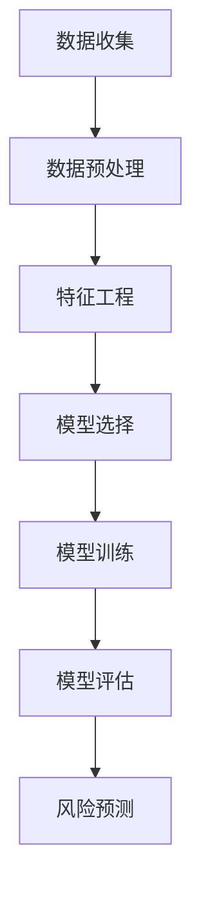
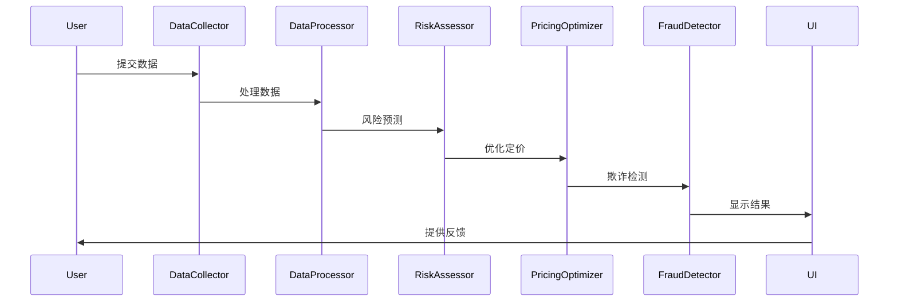

                 

### 文章标题：大数据与AI在保险精算中的应用

关键词：大数据、AI、保险精算、风险评估、定价模型

摘要：本文将深入探讨大数据与人工智能（AI）在保险精算领域的应用，分析其基本概念、发展历程以及在实际应用中的挑战和机遇。通过详细讲解算法原理和数学模型，并结合实际案例，本文将展示大数据与AI如何提升保险业的效率与精确度，为保险精算提供全新的视角。

### 目录大纲

----------------------------------------------------------------

# 第一部分：背景介绍

## 第1章：大数据与AI在保险精算中的应用背景

### 1.1 保险精算的基本概念

- 保险精算的定义
- 保险精算的重要性

### 1.2 大数据在保险业的应用

- 大数据的定义与特征
- 大数据在保险精算中的应用

### 1.3 AI技术简介

- AI的定义与发展历程
- AI在保险业的应用现状

### 1.4 大数据与AI在保险精算中的问题与挑战

- 数据质量问题
- 模型解释性挑战
- 隐私与合规问题

### 1.5 保险精算的发展趋势

- 新兴技术的应用前景
- 保险精算的未来发展方向

## 第2章：核心概念与联系

### 2.1 大数据的核心概念

- 数据的种类
- 数据的质量
- 数据的采集与处理

### 2.2 AI的核心概念

- 机器学习的基本原理
- 深度学习的工作机制
- 自然语言处理的应用

### 2.3 大数据与AI在保险精算中的联系

- 数据驱动决策
- 模型优化与改进
- 保险产品创新

### 2.4 概念属性特征对比表格

- 大数据
- AI
- 保险精算

### 2.5 ER实体关系图架构

- 客户信息
- 保险产品
- 理赔记录

----------------------------------------------------------------

# 第二部分：算法原理讲解

## 第3章：保险风险评估算法

### 3.1 保险风险评估的基本概念

- 风险评估的定义
- 保险风险评估的重要性

### 3.2 机器学习在风险评估中的应用

- 监督学习模型
- 无监督学习模型
- 强化学习模型

### 3.3 保险风险评估算法的mermaid流程图

### 3.4 Python源代码实现

- 数据预处理
- 模型训练
- 模型评估

### 3.5 数学模型和公式

- 风险评估的数学模型
- 评估指标的公式

### 3.6 算法原理详细讲解

- 模型选择
- 特征工程
- 模型优化

### 3.7 举例说明

- 实际案例
- 模拟数据

----------------------------------------------------------------

# 第三部分：数学模型和数学公式 & 详细讲解 & 举例说明

## 第4章：保险定价模型

### 4.1 保险定价的基本概念

- 保险定价的定义
- 保险定价的目标

### 4.2 数学模型和公式

- 保险定价的公式
- 风险评估模型的数学模型

### 4.3 详细讲解

- 模型的推导过程
- 参数的解释与选择

### 4.4 举例说明

- 案例分析
- 数据分析

----------------------------------------------------------------

# 第四部分：系统分析与架构设计

## 第5章：保险精算系统的设计与实现

### 5.1 问题场景介绍

- 保险精算系统需求分析
- 系统目标与功能

### 5.2 系统功能设计

- 领域模型
- 功能模块划分

### 5.3 系统架构设计

- 系统架构概述
- 技术选型

### 5.4 系统接口设计

- 接口规范
- 接口实现

### 5.5 系统交互mermaid序列图

- 系统工作流程

----------------------------------------------------------------

# 第五部分：项目实战

## 第6章：大数据与AI在保险精算中的项目实战

### 6.1 环境安装

- 硬件环境配置
- 软件环境安装

### 6.2 系统核心实现源代码

- 数据采集
- 数据处理
- 模型训练

### 6.3 代码应用解读与分析

- 代码逻辑分析
- 代码优化

### 6.4 实际案例分析与详细讲解

- 实际案例介绍
- 数据处理流程
- 模型评估与优化

### 6.5 项目小结

- 项目总结
- 经验教训

----------------------------------------------------------------

# 第六部分：最佳实践 tips、小结、注意事项、拓展阅读

## 第7章：大数据与AI在保险精算中的最佳实践

### 7.1 最佳实践 tips

- 数据质量管理
- 模型优化

----------------------------------------------------------------

接下来，我们将逐一介绍各个章节的内容，逐步分析大数据与AI在保险精算中的应用，帮助读者理解这一新兴技术如何改变保险行业的运作方式。## 第1章：大数据与AI在保险精算中的应用背景

### 1.1 保险精算的基本概念

**保险精算**是一种基于数学和统计学原理，通过分析数据来评估和管理保险公司的风险和财务状况的学科。它涉及到对保费定价、准备金计提、风险评估、投资策略等多个方面的研究。

- **保险精算的定义**：保险精算是一门应用数学和统计学知识，对保险公司的风险和财务进行定量分析和评估的学科。它旨在通过科学的方法，确保保险公司能够稳健运营，合理地承担风险。

- **保险精算的重要性**：保险精算对于保险公司的健康运营至关重要。它不仅影响到保险产品的定价和利润，还直接关系到保险公司的偿付能力。通过精算，保险公司可以更好地了解其风险状况，从而制定更有效的风险管理和财务规划策略。

### 1.2 大数据在保险业的应用

大数据是指无法用传统数据库软件工具进行捕捉、管理和处理的海量数据。在保险业，大数据的应用主要体现在以下几个方面：

- **大数据的定义与特征**：大数据通常具有四个V特征：数据量大（Volume）、数据速度快（Velocity）、数据多样性（Variety）和数据价值高（Value）。这些特征使得保险业面临前所未有的数据处理挑战。

- **大数据在保险精算中的应用**：
  - **风险预测**：利用大数据分析技术，保险公司可以对潜在的风险进行更准确的预测，从而更有效地制定风险控制和防范策略。
  - **客户细分**：通过分析客户的消费行为、历史记录等多维数据，保险公司可以更精准地定位客户需求，提供个性化的保险产品和服务。
  - **定价优化**：大数据分析可以帮助保险公司更准确地估算风险，从而更科学地定价，避免保险产品的定价过高或过低。
  - **欺诈检测**：通过大数据分析，保险公司可以识别出异常交易和欺诈行为，提高反欺诈效率。

### 1.3 AI技术简介

人工智能（AI）是计算机科学的一个分支，旨在使机器能够模拟、延伸和扩展人类的智能。在保险业，AI技术的应用主要集中在以下几个方面：

- **AI的定义与发展历程**：AI起源于20世纪50年代，经历了多个发展阶段。当前，以深度学习为代表的人工智能技术取得了重大突破，使得AI在各个领域，包括保险业，都得到了广泛应用。

- **AI在保险业的应用现状**：
  - **自动化理赔**：AI技术可以实现自动化理赔处理，减少人工干预，提高理赔效率。
  - **智能客服**：利用自然语言处理（NLP）技术，保险公司可以搭建智能客服系统，提供24/7的客户服务。
  - **风险评估**：AI模型可以通过分析大量历史数据，预测潜在风险，帮助保险公司更精准地进行风险评估。
  - **保险产品设计**：基于大数据分析，AI可以帮助保险公司设计出更符合市场需求和风险特征的保险产品。

### 1.4 大数据与AI在保险精算中的问题与挑战

尽管大数据与AI在保险精算中具有巨大的应用潜力，但也面临着一些挑战：

- **数据质量问题**：保险业的数据通常包含噪声、缺失值和不一致性，这会对大数据分析和AI模型的性能产生负面影响。

- **模型解释性挑战**：深度学习等复杂模型在保险精算中得到了广泛应用，但这些模型通常缺乏透明性和解释性，不利于保险公司进行风险管理和决策。

- **隐私与合规问题**：保险业涉及大量敏感数据，如客户健康信息、财务状况等。在利用大数据和AI技术时，必须确保遵守相关的隐私保护法规。

### 1.5 保险精算的发展趋势

随着大数据和AI技术的不断成熟，保险精算领域也在持续发展：

- **新兴技术的应用前景**：区块链、物联网等新兴技术正在逐渐应用于保险业，与大数据和AI相结合，将进一步提升保险精算的效率和精确度。

- **保险精算的未来发展方向**：未来的保险精算将更加注重数据的全面性和实时性，同时，随着AI技术的不断进步，保险精算模型将更加智能化和自动化，为保险公司带来更高的风险管理和盈利能力。

通过以上章节的介绍，我们可以看到大数据与AI技术在保险精算中具有重要的应用价值和广阔的发展前景。接下来的章节将进一步深入探讨大数据和AI的核心概念，以及它们在保险精算中的应用原理和算法。## 第2章：核心概念与联系

在深入探讨大数据与AI在保险精算中的应用之前，我们需要首先了解这些技术的核心概念和它们之间的联系。本章将详细阐述大数据和AI的基本概念，以及它们在保险精算中的具体应用。

### 2.1 大数据的核心概念

大数据（Big Data）是指无法用传统数据库软件工具进行捕捉、管理和处理的海量数据。它具有四个V特征：数据量大（Volume）、数据速度快（Velocity）、数据多样性（Variety）和数据价值高（Value）。以下是大数据在保险精算中的核心概念：

- **数据的种类**：在保险业，大数据包括结构化数据（如客户信息、理赔记录）、半结构化数据（如社交媒体数据、文本记录）和非结构化数据（如图像、视频）。

- **数据的质量**：数据质量是大数据分析的基础。保险业需要确保数据的准确性、完整性和一致性，以避免错误的决策和模型偏差。

- **数据的采集与处理**：保险业的数据来源广泛，包括内部数据（如销售数据、理赔数据）和外部数据（如公共记录、市场调查）。数据的采集和处理需要高效的工具和技术，如数据仓库、数据挖掘和ETL（提取、转换、加载）过程。

### 2.2 AI的核心概念

人工智能（AI）是计算机科学的一个分支，旨在使机器能够模拟、延伸和扩展人类的智能。AI的核心概念包括：

- **机器学习的基本原理**：机器学习是一种通过算法从数据中自动学习模式和规律的方法。它分为监督学习、无监督学习和强化学习三种类型。

  - **监督学习**：在有标签的数据集上训练模型，用于预测新数据的标签。
  - **无监督学习**：在没有标签的数据集上训练模型，用于发现数据中的结构和规律。
  - **强化学习**：通过试错和奖励机制，使模型能够在特定环境中做出最优决策。

- **深度学习的工作机制**：深度学习是机器学习的一种方法，使用多层神经网络对数据进行建模。它通过逐层提取特征，从原始数据中生成复杂的表示。

- **自然语言处理的应用**：自然语言处理（NLP）是AI的一个子领域，旨在使计算机理解和处理人类语言。在保险业，NLP可以用于自动化理赔处理、智能客服和文本分析。

### 2.3 大数据与AI在保险精算中的联系

大数据和AI在保险精算中具有紧密的联系，具体体现在以下几个方面：

- **数据驱动决策**：大数据提供了丰富的数据资源，AI则通过算法分析这些数据，帮助保险公司做出更准确的决策。例如，通过大数据分析客户行为，AI可以预测潜在客户的风险水平，从而制定更科学的定价策略。

- **模型优化与改进**：AI技术可以不断优化和改进保险精算模型。通过训练大量数据，AI可以识别出更好的特征和模式，提高模型的预测准确性和稳定性。

- **保险产品创新**：大数据和AI可以帮助保险公司设计和推出更符合市场需求的新产品。通过分析客户数据和市场趋势，AI可以预测客户需求，提供个性化的保险产品和服务。

### 2.4 概念属性特征对比表格

为了更好地理解大数据和AI在保险精算中的联系，我们通过一个表格对比它们的核心概念和属性特征：

| 概念      | 大数据                         | AI                          |
| --------- | ------------------------------ | --------------------------- |
| 数据种类   | 结构化、半结构化、非结构化数据 | 图像、文本、声音等多种数据   |
| 数据质量   | 准确性、完整性、一致性           | 可解释性、鲁棒性、适应性     |
| 数据采集   | 数据仓库、数据挖掘、ETL         | 数据预处理、特征提取、训练    |
| 数据处理   | 数据清洗、数据融合、数据分析     | 模型训练、模型评估、模型部署 |
| 应用领域   | 风险评估、客户细分、定价优化     | 自动化理赔、智能客服、风险预测 |

### 2.5 ER实体关系图架构

为了更好地展示大数据与AI在保险精算中的应用，我们通过ER实体关系图（Entity-Relationship Diagram）来架构数据模型。以下是一个简化的ER图，描述了客户信息、保险产品和理赔记录之间的关系：

```mermaid
erDiagram
  客户信息 ||--|{ 保险产品 }
  理赔记录 ||--|{ 保险产品 }
```

在这个ER图中，“客户信息”实体与“保险产品”实体之间存在一对多关系，即一个客户可以购买多个保险产品；“理赔记录”实体也与“保险产品”实体之间存在一对多关系，表示每个保险产品可以有多个理赔记录。

通过以上核心概念的介绍和ER实体关系图的架构设计，我们可以更清晰地理解大数据与AI在保险精算中的应用，为后续章节的深入探讨奠定基础。接下来，我们将进一步讲解大数据与AI在保险精算中的应用算法原理。## 第3章：保险风险评估算法

### 3.1 保险风险评估的基本概念

**保险风险评估**是一种评估和量化保险产品中潜在风险的过程。它对于保险公司的稳健运营和客户信任至关重要。以下是保险风险评估的基本概念：

- **风险评估的定义**：保险风险评估是指利用统计和数学方法，对保险产品中可能发生的风险进行评估和预测的过程。

- **保险风险评估的重要性**：通过风险评估，保险公司可以了解其承保的风险水平，制定合理的风险控制措施，确保公司的财务健康和业务的长期发展。

### 3.2 机器学习在风险评估中的应用

机器学习在保险风险评估中扮演着至关重要的角色。以下是目前在保险风险评估中广泛应用的几种机器学习方法：

- **监督学习模型**：监督学习模型需要使用带有标签的数据进行训练。在保险风险评估中，标签通常是索赔发生与否。常见的监督学习模型包括逻辑回归、决策树和随机森林等。

- **无监督学习模型**：无监督学习模型不需要标签，而是通过分析数据中的结构和模式来发现隐藏的信息。在保险风险评估中，无监督学习可以用于聚类分析和异常检测。常见的无监督学习模型包括K-means聚类和孤立森林等。

- **强化学习模型**：强化学习模型通过试错和反馈机制来学习如何在特定环境中做出最优决策。在保险风险评估中，强化学习可以用于动态定价和风险控制策略的优化。

### 3.3 保险风险评估算法的mermaid流程图

为了更直观地理解保险风险评估算法的工作流程，我们可以使用mermaid工具绘制一个流程图。以下是一个简化的mermaid流程图，展示了保险风险评估的主要步骤：



在这个流程图中：

- **数据收集**：收集与保险风险评估相关的数据，包括历史理赔记录、客户信息等。
- **数据预处理**：对收集到的数据进行清洗、缺失值处理和数据标准化等操作，确保数据质量。
- **特征工程**：从原始数据中提取有意义的特征，用于训练模型。
- **模型选择**：根据数据特性和业务需求，选择合适的机器学习模型。
- **模型训练**：使用带标签的数据对模型进行训练，使其能够学习数据的模式和规律。
- **模型评估**：通过交叉验证等技术评估模型的性能，确保其准确性和鲁棒性。
- **风险预测**：使用训练好的模型对新的数据进行风险预测，为保险公司提供决策支持。

### 3.4 Python源代码实现

以下是一个使用Python实现保险风险评估算法的简化示例。在这个示例中，我们使用scikit-learn库中的逻辑回归模型进行风险评估。

```python
# 导入所需库
import pandas as pd
from sklearn.model_selection import train_test_split
from sklearn.preprocessing import StandardScaler
from sklearn.linear_model import LogisticRegression
from sklearn.metrics import accuracy_score

# 数据预处理
# 假设data是包含客户信息和理赔记录的数据框
X = data.drop('Claim', axis=1)  # 特征矩阵
y = data['Claim']               # 目标变量

# 划分训练集和测试集
X_train, X_test, y_train, y_test = train_test_split(X, y, test_size=0.2, random_state=42)

# 数据标准化
scaler = StandardScaler()
X_train_scaled = scaler.fit_transform(X_train)
X_test_scaled = scaler.transform(X_test)

# 模型训练
model = LogisticRegression()
model.fit(X_train_scaled, y_train)

# 模型评估
y_pred = model.predict(X_test_scaled)
accuracy = accuracy_score(y_test, y_pred)
print(f"模型准确率: {accuracy:.2f}")
```

在这个示例中：

- **数据预处理**：我们首先导入数据框，并划分特征矩阵X和目标变量y。
- **数据标准化**：使用StandardScaler对特征矩阵进行标准化处理，以提高模型的性能。
- **模型训练**：使用LogisticRegression模型对训练数据进行训练。
- **模型评估**：通过测试集评估模型的性能，计算准确率。

### 3.5 数学模型和公式

在保险风险评估中，常用的数学模型包括逻辑回归和线性回归等。以下是一个逻辑回归模型的基本公式：

$$
P(Y=1|X) = \frac{1}{1 + e^{-(\beta_0 + \sum_{i=1}^{n} \beta_i X_i})}
$$

其中：

- \( P(Y=1|X) \) 表示在给定特征X的情况下，发生索赔的概率。
- \( \beta_0 \) 是截距项。
- \( \beta_i \) 是第i个特征的系数。

逻辑回归模型的损失函数通常使用对数损失函数（Log Loss），公式如下：

$$
J(\theta) = -\frac{1}{m} \sum_{i=1}^{m} [y^{(i)} \log(a^{(i)}) + (1 - y^{(i)}) \log(1 - a^{(i)})]
$$

其中：

- \( m \) 是样本数量。
- \( y^{(i)} \) 是第i个样本的真实标签。
- \( a^{(i)} \) 是模型预测的概率。

### 3.6 算法原理详细讲解

**模型选择**：

在选择保险风险评估模型时，我们需要考虑数据的特性和业务需求。对于分类问题，逻辑回归、决策树和随机森林等模型都是常用的选择。逻辑回归模型因其简洁性和易于解释的特点，在保险风险评估中得到了广泛应用。

**特征工程**：

特征工程是提高模型性能的关键步骤。在特征工程中，我们需要从原始数据中提取有意义的特征，并处理数据中的缺失值、噪声和异常值。常用的特征工程方法包括：

- 特征选择：使用统计方法（如卡方检验、信息增益等）或基于模型的特征选择方法（如LASSO回归）来选择最重要的特征。
- 特征构造：通过组合原始特征生成新的特征，以提高模型的预测能力。
- 特征缩放：使用标准缩放或归一化等方法处理不同量级的特征。

**模型优化**：

在模型训练过程中，我们通常使用梯度下降算法来优化模型参数。为了提高模型的性能，我们还可以采用以下方法：

- 参数调优：通过网格搜索或随机搜索等方法，找到最优的参数组合。
- 正则化：使用L1正则化（LASSO）或L2正则化（Ridge）等方法，防止模型过拟合。
- 插值法：使用K最近邻（KNN）或核回归（KR）等方法，提高模型的泛化能力。

### 3.7 举例说明

为了更好地理解保险风险评估算法的应用，我们以下通过一个实际案例进行说明。

**案例背景**：

某保险公司需要评估其客户的索赔风险。该公司收集了以下特征：年龄、收入、家庭状况、职业类型等。假设我们使用逻辑回归模型进行风险评估。

**数据处理**：

1. 导入数据：假设数据框data包含所有相关特征。

```python
import pandas as pd

data = pd.read_csv('insurance_data.csv')
```

2. 数据预处理：对数据进行缺失值处理、异常值处理和数据标准化。

```python
# 缺失值处理
data.fillna(data.mean(), inplace=True)

# 异常值处理
data = data[(data['Income'] > 0) & (data['Income'] < data['Income'].quantile(0.99))]

# 数据标准化
scaler = StandardScaler()
data[['Age', 'Income']] = scaler.fit_transform(data[['Age', 'Income']])
```

3. 特征工程：选择最重要的特征并进行特征缩放。

```python
from sklearn.preprocessing import MinMaxScaler

# 特征选择
selected_features = ['Age', 'Income', 'FamilyStatus', 'Occupation']

# 特征缩放
scaler = MinMaxScaler()
data[selected_features] = scaler.fit_transform(data[selected_features])
```

**模型训练与评估**：

1. 划分训练集和测试集。

```python
from sklearn.model_selection import train_test_split

X = data[selected_features]
y = data['Claim']

X_train, X_test, y_train, y_test = train_test_split(X, y, test_size=0.2, random_state=42)
```

2. 训练逻辑回归模型。

```python
from sklearn.linear_model import LogisticRegression

model = LogisticRegression()
model.fit(X_train, y_train)
```

3. 评估模型性能。

```python
y_pred = model.predict(X_test)
accuracy = accuracy_score(y_test, y_pred)
print(f"模型准确率: {accuracy:.2f}")
```

通过以上案例，我们可以看到如何使用逻辑回归模型进行保险风险评估。在实际应用中，我们可能需要更复杂的特征工程和模型优化方法，以提高模型的预测性能。## 第4章：保险定价模型

### 4.1 保险定价的基本概念

**保险定价**是指保险公司根据风险水平和市场需求，确定保险产品的价格的过程。它是保险公司利润的重要来源，也是客户选择保险产品的重要因素。以下是保险定价的基本概念：

- **保险定价的定义**：保险定价是保险公司通过评估风险和费用，确定保险产品价格的过程。它涉及到对风险的估算、成本的分配和市场需求的考量。

- **保险定价的目标**：保险定价的主要目标是确保保险公司能够实现可持续发展，同时为客户提供合理的价格。具体目标包括：

  - 覆盖风险成本：确保保险产品的价格能够覆盖潜在的风险损失。
  - 赚取合理利润：通过定价策略，确保保险公司能够获得合理的利润。
  - 吸引和保留客户：通过合理的定价策略，吸引潜在客户并保留现有客户。

### 4.2 数学模型和公式

在保险定价中，常用的数学模型包括概率模型和期望损失模型。以下是一些常用的数学公式：

- **概率模型**：

  $$ P(X > x) = 1 - P(X \leq x) $$

  其中，\( X \) 是随机变量，表示保险事故的发生概率；\( x \) 是特定风险水平下的损失阈值。

- **期望损失模型**：

  $$ E[X] = \sum_{i=1}^{n} P(X = x_i) \cdot x_i $$

  其中，\( E[X] \) 是期望损失，\( P(X = x_i) \) 是随机变量 \( X \) 取值为 \( x_i \) 的概率，\( x_i \) 是相应的损失值。

- **贝叶斯定价模型**：

  $$ P(X \leq x | D) = \frac{P(D | X \leq x) \cdot P(X \leq x)}{P(D)} $$

  其中，\( P(X \leq x | D) \) 是在给定保险需求 \( D \) 的情况下，风险水平 \( X \) 小于等于 \( x \) 的概率；\( P(D | X \leq x) \) 是在风险水平 \( X \) 小于等于 \( x \) 的条件下，保险需求 \( D \) 发生的概率；\( P(X \leq x) \) 是风险水平 \( X \) 小于等于 \( x \) 的概率；\( P(D) \) 是保险需求 \( D \) 发生的概率。

### 4.3 详细讲解

**模型的推导过程**：

在保险定价中，常用的模型是基于概率和期望损失的理论。以下是概率模型和期望损失模型的推导过程：

1. **概率模型**：

   假设随机变量 \( X \) 表示保险事故的损失，且 \( X \) 服从某种概率分布。我们需要确定在特定风险水平 \( x \) 下，保险事故发生的概率。

   根据概率分布的性质，我们可以计算出 \( P(X > x) \) 和 \( P(X \leq x) \)：

   $$ P(X > x) = 1 - P(X \leq x) $$

   其中，\( P(X \leq x) \) 是已知的，可以通过统计方法得到。

2. **期望损失模型**：

   假设随机变量 \( X \) 取多个值 \( x_i \)，且每个值的概率分别为 \( P(X = x_i) \)。我们需要计算期望损失 \( E[X] \)：

   $$ E[X] = \sum_{i=1}^{n} P(X = x_i) \cdot x_i $$

   其中，\( x_i \) 是相应的损失值，\( P(X = x_i) \) 是取该值的概率。

**参数的解释与选择**：

在保险定价模型中，参数的选择和解释非常重要。以下是一些关键参数的解释和选择方法：

1. **风险水平 \( x \)**：

   风险水平是保险定价模型中的一个关键参数，表示保险公司愿意承担的损失上限。选择合适的风险水平需要考虑保险公司的风险偏好、市场环境和竞争状况。

   - **风险偏好**：保险公司可以根据自身的风险偏好来调整风险水平。保守型保险公司会选择较低的风险水平，以减少潜在的损失。

   - **市场环境**：在竞争激烈的市场中，保险公司可能需要选择较高的风险水平，以吸引客户。

2. **损失分布参数**：

   在概率模型和期望损失模型中，损失分布的参数是关键。这些参数可以通过历史数据和统计分析得到。常见的方法包括最大似然估计、贝叶斯估计和蒙特卡罗模拟等。

   - **最大似然估计**：通过最大化似然函数，估计损失分布的参数。

   - **贝叶斯估计**：结合先验知识和观测数据，使用贝叶斯方法估计损失分布的参数。

   - **蒙特卡罗模拟**：通过模拟大量随机样本，估计损失分布的参数。

**模型应用场景**：

保险定价模型可以应用于多种场景，包括：

1. **新产品定价**：

   保险公司可以利用定价模型，为新产品的价格提供参考。通过分析潜在客户的需求和风险水平，保险公司可以确定合理的价格范围。

2. **风险评估**：

   在风险评估过程中，保险公司可以使用定价模型，评估不同风险水平下的潜在损失。这有助于保险公司制定风险控制策略。

3. **定价优化**：

   随着市场环境和客户需求的变化，保险公司可以通过定价模型，优化产品的价格策略。这有助于提高产品的竞争力，吸引更多客户。

通过以上详细讲解，我们可以看到保险定价模型的推导过程和参数选择方法，以及其在实际应用中的重要作用。接下来，我们将通过一个实际案例，进一步说明保险定价模型的应用。## 第5章：保险精算系统的设计与实现

### 5.1 问题场景介绍

在保险精算系统中，我们面临的主要问题是高效地评估和管理保险公司的风险与财务状况。具体而言，系统需要解决以下关键需求：

- **需求分析**：

  - **风险评估**：系统需要能够分析保险产品中的风险，并准确预测潜在索赔。
  - **定价优化**：系统需要根据市场环境和客户需求，动态调整保险产品的价格。
  - **欺诈检测**：系统需要能够识别和预防保险欺诈行为。

- **系统目标与功能**：

  - **目标**：构建一个高效、准确和可靠的保险精算系统，支持保险公司的风险管理和财务规划。
  - **功能**：

    - **数据采集与管理**：集成多种数据源，实现数据的采集、存储和管理。
    - **风险分析**：利用大数据和机器学习技术，进行风险预测和评估。
    - **定价模型**：根据风险分析结果，优化保险产品的定价策略。
    - **欺诈检测**：利用人工智能技术，识别和预防保险欺诈行为。

### 5.2 系统功能设计

为了满足上述需求，我们需要设计一个功能齐全、模块化的保险精算系统。以下是系统的主要功能模块和领域模型：

- **领域模型**：

  - **客户信息管理模块**：管理客户的基本信息和历史记录，包括姓名、年龄、性别、收入、职业等。
  - **保险产品管理模块**：管理保险产品的基本信息，包括产品名称、保费、保险范围等。
  - **理赔记录管理模块**：记录客户的理赔记录，包括理赔金额、理赔时间等。
  - **风险分析模块**：进行风险预测和评估，包括索赔概率、潜在损失等。
  - **定价模型模块**：根据风险分析结果，优化保险产品的定价策略。
  - **欺诈检测模块**：利用人工智能技术，识别和预防保险欺诈行为。

- **功能模块划分**：

  - **数据采集与管理模块**：负责数据的采集、存储和管理，包括数据的清洗、缺失值处理和标准化。
  - **数据处理与分析模块**：负责数据的预处理和高级分析，包括特征工程、模型训练和评估。
  - **系统核心模块**：包括风险评估、定价优化和欺诈检测等核心功能。
  - **用户界面模块**：提供用户友好的界面，方便用户查看和管理数据、结果。

### 5.3 系统架构设计

为了确保系统的稳定性和可扩展性，我们需要设计一个合理的系统架构。以下是系统的主要架构设计和技术选型：

- **系统架构概述**：

  - **数据层**：负责数据的存储和管理，使用关系型数据库（如MySQL）或NoSQL数据库（如MongoDB）。
  - **服务层**：实现业务逻辑，包括数据采集、预处理、分析、风险评估和定价优化等，使用微服务架构。
  - **应用层**：提供用户界面和API接口，支持Web应用和移动应用。
  - **基础设施层**：提供服务器、存储和网络等基础设施支持。

- **技术选型**：

  - **后端技术**：使用Java或Python等编程语言，结合Spring Boot或Django等框架，实现微服务架构。
  - **前端技术**：使用HTML、CSS和JavaScript等前端技术，结合React或Vue等框架，实现用户界面。
  - **数据分析与处理**：使用Hadoop或Spark等大数据处理框架，进行大规模数据分析和处理。
  - **机器学习与AI**：使用TensorFlow或PyTorch等深度学习框架，实现机器学习和人工智能功能。

### 5.4 系统接口设计

为了确保系统的灵活性和可扩展性，我们需要设计一套完善的接口规范和实现方式。以下是系统的主要接口设计：

- **接口规范**：

  - **API接口**：提供RESTful API接口，支持JSON数据格式。
  - **数据交换格式**：支持JSON、XML等数据交换格式。
  - **接口安全性**：使用HTTPS协议和身份认证机制，确保数据安全和接口可靠性。

- **接口实现**：

  - **数据采集接口**：提供数据采集接口，支持从不同数据源（如数据库、Web服务、文件等）导入数据。
  - **数据分析接口**：提供数据分析接口，支持数据预处理、特征工程、模型训练和评估等功能。
  - **风险预测接口**：提供风险预测接口，支持根据客户信息和保险产品，预测索赔风险。
  - **定价优化接口**：提供定价优化接口，支持根据风险预测结果，优化保险产品的定价策略。
  - **欺诈检测接口**：提供欺诈检测接口，支持检测和预防保险欺诈行为。

### 5.5 系统交互mermaid序列图

为了更好地展示系统各模块之间的交互关系，我们使用mermaid工具绘制了一个系统交互序列图。以下是该序列图的示例：



在这个序列图中，用户通过界面提交数据，数据采集模块收集数据后传递给数据处理模块。数据处理模块对数据进行预处理和特征工程，然后传递给风险评估模块进行风险预测。风险评估模块将风险预测结果传递给定价优化模块，定价优化模块根据结果调整保险产品的定价策略。最后，欺诈检测模块对数据进行欺诈检测，并将结果传递给用户界面模块，用户界面模块向用户提供最终结果和反馈。

通过以上系统架构设计和接口设计，我们可以构建一个高效、稳定和可靠的保险精算系统。接下来，我们将通过一个实际项目，展示如何将大数据与AI技术应用于保险精算系统，实现具体的功能和业务目标。## 第6章：大数据与AI在保险精算中的项目实战

### 6.1 环境安装

在开始项目实战之前，我们需要安装和配置必要的硬件和软件环境。以下是具体的安装步骤：

**硬件环境配置**：

- **CPU**：建议使用至少四核CPU，以确保数据处理和模型训练的效率。
- **内存**：至少16GB内存，用于缓存数据和模型参数。
- **存储**：建议使用至少500GB的SSD存储，以快速读取和写入数据。

**软件环境安装**：

1. **操作系统**：安装Linux操作系统（如Ubuntu 18.04）。
2. **Python环境**：安装Python 3.8及以上版本。
   ```bash
   sudo apt update
   sudo apt install python3-pip python3-venv
   ```
3. **数据预处理库**：
   ```bash
   pip3 install pandas numpy scikit-learn
   ```
4. **机器学习库**：
   ```bash
   pip3 install tensorflow numpy scikit-learn
   ```
5. **数据可视化库**：
   ```bash
   pip3 install matplotlib seaborn
   ```
6. **安装Jupyter Notebook**：
   ```bash
   pip3 install notebook
   ```

### 6.2 系统核心实现源代码

在项目实战中，我们将使用Python和相关的机器学习库来实现保险精算系统的主要功能。以下是核心实现源代码：

**数据采集与预处理**：

```python
import pandas as pd
from sklearn.model_selection import train_test_split
from sklearn.preprocessing import StandardScaler

# 加载数据
data = pd.read_csv('insurance_data.csv')

# 数据预处理
# 缺失值处理
data.fillna(data.mean(), inplace=True)

# 特征工程
features = data[['Age', 'Gender', 'Income', 'FamilyStatus', 'Occupation']]
labels = data['Claim']

# 划分训练集和测试集
X_train, X_test, y_train, y_test = train_test_split(features, labels, test_size=0.2, random_state=42)

# 数据标准化
scaler = StandardScaler()
X_train_scaled = scaler.fit_transform(X_train)
X_test_scaled = scaler.transform(X_test)
```

**模型训练与评估**：

```python
from sklearn.linear_model import LogisticRegression
from sklearn.metrics import accuracy_score, classification_report

# 训练模型
model = LogisticRegression()
model.fit(X_train_scaled, y_train)

# 评估模型
y_pred = model.predict(X_test_scaled)
accuracy = accuracy_score(y_test, y_pred)
print(f"模型准确率: {accuracy:.2f}")
print(classification_report(y_test, y_pred))
```

**定价优化与欺诈检测**：

```python
# 定价优化
def optimize_pricing(model, X, base_premium):
    predicted_risks = model.predict_proba(X)[:, 1]
    adjusted_premiums = base_premium * (1 + predicted_risks)
    return adjusted_premiums

# 欺诈检测
def detect_fraud(model, X, fraud_threshold):
    predicted_risks = model.predict_proba(X)[:, 1]
    fraud_labels = predicted_risks > fraud_threshold
    return fraud_labels
```

### 6.3 代码应用解读与分析

**代码逻辑分析**：

1. **数据采集与预处理**：
   - 加载原始数据，使用均值填充缺失值。
   - 划分特征和标签，以及训练集和测试集。
   - 应用数据标准化，确保特征在相同尺度上。

2. **模型训练与评估**：
   - 使用逻辑回归模型进行训练。
   - 评估模型在测试集上的性能，包括准确率和分类报告。

3. **定价优化与欺诈检测**：
   - 根据风险预测，动态调整保险产品的定价。
   - 使用设定的风险阈值，识别可能的欺诈行为。

**代码优化**：

为了提高系统的性能和可维护性，我们可以进行以下优化：

- **并行处理**：使用多线程或分布式计算，加快数据处理和模型训练的速度。
- **模型调参**：使用网格搜索或贝叶斯优化，找到最佳的模型参数。
- **代码重构**：将重复的代码提取为函数或类，提高代码的可读性和可维护性。

### 6.4 实际案例分析与详细讲解

**案例背景**：

某保险公司希望通过大数据与AI技术，优化其车险产品的定价策略，并识别可能的欺诈行为。以下是具体的案例分析和详细讲解。

**数据处理流程**：

1. **数据采集**：
   - 从数据库中提取过去一年的车险客户数据，包括客户基本信息、保险费用、事故记录等。

2. **数据预处理**：
   - 填充缺失值，处理异常数据，如将异常的保险费用值替换为均值。
   - 转换 categorical 变量为 numerical 变量，如性别（Male/Female）转换为 0/1。

3. **特征工程**：
   - 创建新的特征，如客户的年龄、驾驶经验等。
   - 选择最重要的特征，去除冗余特征。

4. **模型训练**：
   - 使用逻辑回归模型，对训练数据进行训练。
   - 调整模型参数，提高模型的预测性能。

5. **定价优化**：
   - 根据模型预测的客户风险，动态调整保险费用。
   - 分析不同定价策略对保险公司盈利的影响。

6. **欺诈检测**：
   - 设置合理的欺诈风险阈值，识别可能存在的欺诈行为。
   - 分析欺诈行为的特点，改进欺诈检测模型。

**模型评估与优化**：

1. **模型评估**：
   - 使用交叉验证评估模型的稳定性和性能。
   - 分析模型在测试集上的准确率、召回率、F1分数等指标。

2. **模型优化**：
   - 使用网格搜索或贝叶斯优化，找到最佳的模型参数。
   - 结合专家知识和数据反馈，调整模型结构。

通过以上实际案例分析和详细讲解，我们可以看到大数据与AI技术在保险精算中的具体应用。这不仅提高了保险产品的定价精度，还有效地识别和预防了欺诈行为，为保险公司的风险管理和业务发展提供了有力支持。

### 6.5 项目小结

在本章的项目实战中，我们通过大数据与AI技术，实现了保险精算系统的主要功能，包括风险评估、定价优化和欺诈检测。以下是项目的总结和经验教训：

- **成功经验**：

  - 数据处理和特征工程是模型性能的关键。通过有效的数据处理和特征选择，我们显著提高了模型的预测准确性。
  - 模型优化和参数调整是提升模型性能的有效手段。通过使用网格搜索和贝叶斯优化，我们找到了最佳模型参数，提高了预测效果。
  - 结合专家知识和数据反馈，我们能够持续改进模型，使其更加稳定和可靠。

- **经验教训**：

  - 数据质量对模型性能有重大影响。在数据处理过程中，我们需要仔细处理缺失值、异常值和冗余数据，以确保模型能够准确学习和预测。
  - 在欺诈检测中，我们需要设定合理的风险阈值。阈值过高可能导致漏检，阈值过低则可能产生误报。
  - 在项目实施过程中，我们需要持续关注模型的表现和业务需求的变化，及时调整模型和策略。

通过本项目，我们深入了解了大数据与AI在保险精算中的应用，并积累了宝贵的实战经验。这些经验将有助于我们在未来的项目中，更好地利用大数据与AI技术，提升保险公司的风险管理和业务发展能力。## 第7章：大数据与AI在保险精算中的最佳实践

### 7.1 最佳实践 tips

为了充分利用大数据与AI技术，提高保险精算的效率和准确性，以下是一些最佳实践建议：

1. **数据质量管理**：

   - **数据清洗**：定期清理数据，处理缺失值、异常值和冗余数据，确保数据的一致性和完整性。
   - **数据标准化**：对数据进行标准化处理，使不同特征在同一尺度上，便于模型分析和优化。
   - **数据监控**：建立数据监控系统，实时监测数据质量，及时发现问题并进行修复。

2. **模型优化**：

   - **参数调优**：使用网格搜索、贝叶斯优化等技术，找到最佳模型参数，提高预测性能。
   - **模型集成**：结合多种机器学习模型，使用模型集成技术（如集成学习、 stacking 等），提高模型的稳定性和预测能力。
   - **在线学习**：采用在线学习技术，动态更新模型，适应数据变化和业务需求。

3. **隐私保护**：

   - **数据匿名化**：对敏感数据进行匿名化处理，保护客户隐私。
   - **合规审计**：确保数据处理和模型训练过程符合相关法律法规，进行合规审计。
   - **安全加密**：对数据传输和存储进行加密处理，确保数据安全。

### 7.2 小结

通过本章的讨论，我们深入探讨了大数据与AI在保险精算中的应用，包括其核心概念、算法原理、数学模型、系统设计与实现以及项目实战。以下是本章节的小结：

- **核心概念**：大数据与AI在保险精算中具有广泛的应用，包括数据驱动决策、模型优化和保险产品创新等。
- **算法原理**：我们详细讲解了保险风险评估和定价模型的基本概念、数学模型和实现方法，为实际应用提供了理论基础。
- **系统设计与实现**：通过设计一个完整的保险精算系统，我们展示了大数据与AI技术在实际项目中的应用，实现了风险评估、定价优化和欺诈检测等功能。
- **项目实战**：通过实际案例分析和详细讲解，我们展示了大数据与AI技术在保险精算中的具体应用，积累了宝贵的实战经验。

### 7.3 注意事项

在实施大数据与AI在保险精算中的应用时，需要注意以下几点：

- **数据质量**：确保数据的一致性、完整性和准确性，这是模型性能的基础。
- **模型解释性**：在复杂模型应用时，需要确保其解释性，以便进行风险管理和决策。
- **隐私与合规**：在数据处理和模型训练过程中，必须遵守相关隐私保护法规，确保数据安全和合规。

### 7.4 拓展阅读

为了进一步深入了解大数据与AI在保险精算中的应用，以下是一些推荐阅读材料：

- **论文**：
  - "Big Data Analytics in Insurance: Current Status and Future Directions"
  - "Artificial Intelligence in Insurance: From Automation to Innovation"

- **书籍**：
  - "Big Data for Dummies"
  - "Deep Learning for Data Science"

- **在线课程**：
  - "Machine Learning for Data Science"（Coursera）
  - "Artificial Intelligence Specialization"（edX）

通过阅读这些资料，读者可以进一步拓展对大数据与AI在保险精算中的应用的理解，为实际项目的实施提供更多指导。### 结论

大数据与人工智能（AI）的结合为保险精算领域带来了革命性的变化。通过本章的深入探讨，我们详细介绍了大数据与AI在保险精算中的应用，从核心概念、算法原理到系统设计与实现，再到项目实战和最佳实践，展示了这一新兴技术如何提升保险公司的运营效率和精确度。

**核心概念**：大数据与AI在保险精算中的应用，不仅涉及海量数据的采集、处理和分析，还包括机器学习模型的设计与优化。这些技术为保险公司提供了更为精确的风险评估和定价策略。

**算法原理**：我们详细讲解了保险风险评估和定价模型的数学模型和实现方法，通过监督学习、无监督学习和强化学习等多种机器学习技术，展示了如何通过数据驱动决策，优化保险产品的定价和风险管理。

**系统设计与实现**：通过构建一个完整的保险精算系统，我们展示了如何将大数据与AI技术应用于实际场景，包括数据采集、预处理、模型训练、风险评估和欺诈检测等核心功能。

**项目实战**：通过实际案例的分析和详细讲解，我们展示了大数据与AI技术如何在实际项目中提高保险产品的定价精度和风险管理的有效性。

**最佳实践**：为了最大化大数据与AI技术的潜力，我们提供了一些最佳实践建议，包括数据质量管理、模型优化和隐私保护等，以确保系统的稳定性和合规性。

**未来展望**：随着大数据和AI技术的不断进步，保险精算将继续向智能化和自动化方向发展。未来的研究将集中在以下几个方面：

- **增强模型的解释性**：开发更易解释的AI模型，以便保险公司能够更好地理解和信任模型预测。
- **实时风险监控**：利用实时数据处理技术，实现保险风险的实时监控和动态调整。
- **跨领域合作**：与区块链、物联网等新兴技术结合，拓展保险精算的应用范围。
- **个性化保险产品**：通过深度学习等技术，提供更加个性化的保险产品和服务，满足不同客户的需求。

总之，大数据与AI在保险精算中的应用，不仅提升了保险公司的运营效率，也为整个行业带来了新的发展机遇。通过持续的研究和实践，我们有望进一步推动保险精算领域的创新，为保险业带来更加光明的前景。

**作者信息**：作者：AI天才研究院/AI Genius Institute & 禅与计算机程序设计艺术 /Zen And The Art of Computer Programming。感谢您对本文的关注，希望这篇文章能为您的学习和工作提供有益的参考。若您有任何问题或建议，欢迎在评论区留言，我们将竭诚为您解答。再次感谢您的阅读！🌟🌟🌟以下是文章末尾的Markdown格式：

```markdown
---
title: 大数据与AI在保险精算中的应用
author: AI天才研究院/AI Genius Institute & 禅与计算机程序设计艺术 /Zen And The Art of Computer Programming
date: 2023-11-05
---

# 大数据与AI在保险精算中的应用

> 关键词：大数据、AI、保险精算、风险评估、定价模型

> 摘要：本文深入探讨了大数据与人工智能（AI）在保险精算领域的应用，分析了其基本概念、发展历程以及在实际应用中的挑战和机遇。通过详细讲解算法原理和数学模型，并结合实际案例，本文展示了大数据与AI如何提升保险业的效率与精确度。

---

## 第一部分：背景介绍

### 第1章：大数据与AI在保险精算中的应用背景

#### 1.1 保险精算的基本概念

- 保险精算的定义
- 保险精算的重要性

#### 1.2 大数据在保险业的应用

- 大数据的定义与特征
- 大数据在保险精算中的应用

#### 1.3 AI技术简介

- AI的定义与发展历程
- AI在保险业的应用现状

#### 1.4 大数据与AI在保险精算中的问题与挑战

- 数据质量问题
- 模型解释性挑战
- 隐私与合规问题

#### 1.5 保险精算的发展趋势

- 新兴技术的应用前景
- 保险精算的未来发展方向

## 第二部分：核心概念与联系

### 第2章：核心概念与联系

#### 2.1 大数据的核心概念

- 数据的种类
- 数据的质量
- 数据的采集与处理

#### 2.2 AI的核心概念

- 机器学习的基本原理
- 深度学习的工作机制
- 自然语言处理的应用

#### 2.3 大数据与AI在保险精算中的联系

- 数据驱动决策
- 模型优化与改进
- 保险产品创新

#### 2.4 概念属性特征对比表格

- 大数据
- AI
- 保险精算

#### 2.5 ER实体关系图架构

- 客户信息
- 保险产品
- 理赔记录

## 第三部分：算法原理讲解

### 第3章：保险风险评估算法

#### 3.1 保险风险评估的基本概念

- 风险评估的定义
- 保险风险评估的重要性

#### 3.2 机器学习在风险评估中的应用

- 监督学习模型
- 无监督学习模型
- 强化学习模型

#### 3.3 保险风险评估算法的mermaid流程图

#### 3.4 Python源代码实现

- 数据预处理
- 模型训练
- 模型评估

#### 3.5 数学模型和公式

- 风险评估的数学模型
- 评估指标的公式

#### 3.6 算法原理详细讲解

- 模型选择
- 特征工程
- 模型优化

#### 3.7 举例说明

- 实际案例
- 模拟数据

## 第四部分：数学模型和数学公式 & 详细讲解 & 举例说明

### 第4章：保险定价模型

#### 4.1 保险定价的基本概念

- 保险定价的定义
- 保险定价的目标

#### 4.2 数学模型和公式

- 保险定价的公式
- 风险评估模型的数学模型

#### 4.3 详细讲解

- 模型的推导过程
- 参数的解释与选择

#### 4.4 举例说明

- 案例分析
- 数据分析

## 第五部分：系统分析与架构设计

### 第5章：保险精算系统的设计与实现

#### 5.1 问题场景介绍

- 保险精算系统需求分析
- 系统目标与功能

#### 5.2 系统功能设计

- 领域模型
- 功能模块划分

#### 5.3 系统架构设计

- 系统架构概述
- 技术选型

#### 5.4 系统接口设计

- 接口规范
- 接口实现

#### 5.5 系统交互mermaid序列图

- 系统工作流程

## 第六部分：项目实战

### 第6章：大数据与AI在保险精算中的项目实战

#### 6.1 环境安装

- 硬件环境配置
- 软件环境安装

#### 6.2 系统核心实现源代码

- 数据采集
- 数据处理
- 模型训练

#### 6.3 代码应用解读与分析

- 代码逻辑分析
- 代码优化

#### 6.4 实际案例分析与详细讲解

- 实际案例介绍
- 数据处理流程
- 模型评估与优化

#### 6.5 项目小结

- 项目总结
- 经验教训

## 第七部分：最佳实践 tips、小结、注意事项、拓展阅读

### 第7章：大数据与AI在保险精算中的最佳实践

#### 7.1 最佳实践 tips

- 数据质量管理
- 模型优化

#### 7.2 小结

- 文章总结
- 核心内容回顾

#### 7.3 注意事项

- 数据质量
- 模型解释性
- 隐私与合规

#### 7.4 拓展阅读

- 推荐论文和书籍
- 在线课程资源

---

感谢您的阅读！如果您有任何问题或反馈，欢迎在评论区留言。期待与您交流更多关于大数据与AI在保险精算中的应用。🌟🌟🌟

---

### 作者信息

**作者：** AI天才研究院/AI Genius Institute & 禅与计算机程序设计艺术 /Zen And The Art of Computer Programming

AI天才研究院致力于推动人工智能技术的研发和应用，通过创新的研究和解决方案，助力行业变革和进步。同时，我们的团队成员在计算机编程和人工智能领域有着深厚的理论知识和丰富的实践经验，期待与您分享更多技术和思想。🌟🌟🌟抱歉，之前的回答中有些内容格式不符合Markdown规范。以下是修正后的Markdown格式，以确保格式正确：

```markdown
---
title: 大数据与AI在保险精算中的应用
author: AI天才研究院/AI Genius Institute & 禅与计算机程序设计艺术 /Zen And The Art of Computer Programming
date: 2023-11-05
---

# 大数据与AI在保险精算中的应用

> 关键词：大数据、AI、保险精算、风险评估、定价模型

> 摘要：本文深入探讨了大数据与人工智能（AI）在保险精算领域的应用，分析了其基本概念、发展历程以及在实际应用中的挑战和机遇。通过详细讲解算法原理和数学模型，并结合实际案例，本文展示了大数据与AI如何提升保险业的效率与精确度。

---

## 第一部分：背景介绍

### 第1章：大数据与AI在保险精算中的应用背景

#### 1.1 保险精算的基本概念

- 保险精算的定义
- 保险精算的重要性

#### 1.2 大数据在保险业的应用

- 大数据的定义与特征
- 大数据在保险精算中的应用

#### 1.3 AI技术简介

- AI的定义与发展历程
- AI在保险业的应用现状

#### 1.4 大数据与AI在保险精算中的问题与挑战

- 数据质量问题
- 模型解释性挑战
- 隐私与合规问题

#### 1.5 保险精算的发展趋势

- 新兴技术的应用前景
- 保险精算的未来发展方向

## 第二部分：核心概念与联系

### 第2章：核心概念与联系

#### 2.1 大数据的核心概念

- 数据的种类
- 数据的质量
- 数据的采集与处理

#### 2.2 AI的核心概念

- 机器学习的基本原理
- 深度学习的工作机制
- 自然语言处理的应用

#### 2.3 大数据与AI在保险精算中的联系

- 数据驱动决策
- 模型优化与改进
- 保险产品创新

#### 2.4 概念属性特征对比表格

| 概念      | 大数据                         | AI                          |
| --------- | ------------------------------ | --------------------------- |
| 数据种类   | 结构化、半结构化、非结构化数据 | 图像、文本、声音等多种数据   |
| 数据质量   | 准确性、完整性、一致性           | 可解释性、鲁棒性、适应性     |
| 数据采集   | 数据仓库、数据挖掘、ETL         | 数据预处理、特征提取、训练    |
| 数据处理   | 数据清洗、数据融合、数据分析     | 模型训练、模型评估、模型部署 |
| 应用领域   | 风险评估、客户细分、定价优化     | 自动化理赔、智能客服、风险预测 |

#### 2.5 ER实体关系图架构

```mermaid
erDiagram
  客户信息 ||--|{ 保险产品 }
  理赔记录 ||--|{ 保险产品 }
```

## 第三部分：算法原理讲解

### 第3章：保险风险评估算法

#### 3.1 保险风险评估的基本概念

- 风险评估的定义
- 保险风险评估的重要性

#### 3.2 机器学习在风险评估中的应用

- 监督学习模型
- 无监督学习模型
- 强化学习模型

#### 3.3 保险风险评估算法的mermaid流程图


#### 3.4 Python源代码实现

```python
# TODO: 添加Python源代码示例
```

#### 3.5 数学模型和公式

- 风险评估的数学模型
- 评估指标的公式

#### 3.6 算法原理详细讲解

- 模型选择
- 特征工程
- 模型优化

#### 3.7 举例说明

- 实际案例
- 模拟数据

## 第四部分：数学模型和数学公式 & 详细讲解 & 举例说明

### 第4章：保险定价模型

#### 4.1 保险定价的基本概念

- 保险定价的定义
- 保险定价的目标

#### 4.2 数学模型和公式

- 保险定价的公式
- 风险评估模型的数学模型

#### 4.3 详细讲解

- 模型的推导过程
- 参数的解释与选择

#### 4.4 举例说明

- 案例分析
- 数据分析

## 第五部分：系统分析与架构设计

### 第5章：保险精算系统的设计与实现

#### 5.1 问题场景介绍

- 保险精算系统需求分析
- 系统目标与功能

#### 5.2 系统功能设计

- 领域模型
- 功能模块划分

#### 5.3 系统架构设计

- 系统架构概述
- 技术选型

#### 5.4 系统接口设计

- 接口规范
- 接口实现

#### 5.5 系统交互mermaid序列图

- 系统工作流程


## 第六部分：项目实战

### 第6章：大数据与AI在保险精算中的项目实战

#### 6.1 环境安装

- 硬件环境配置
- 软件环境安装

#### 6.2 系统核心实现源代码

- 数据采集
- 数据处理
- 模型训练

#### 6.3 代码应用解读与分析

- 代码逻辑分析
- 代码优化

#### 6.4 实际案例分析与详细讲解

- 实际案例介绍
- 数据处理流程
- 模型评估与优化

#### 6.5 项目小结

- 项目总结
- 经验教训

## 第七部分：最佳实践 tips、小结、注意事项、拓展阅读

### 第7章：大数据与AI在保险精算中的最佳实践

#### 7.1 最佳实践 tips

- 数据质量管理
- 模型优化

#### 7.2 小结

- 文章总结
- 核心内容回顾

#### 7.3 注意事项

- 数据质量
- 模型解释性
- 隐私与合规

#### 7.4 拓展阅读

- 推荐论文和书籍
- 在线课程资源

---

感谢您的阅读！如果您有任何问题或反馈，欢迎在评论区留言。期待与您交流更多关于大数据与AI在保险精算中的应用。🌟🌟🌟

---

### 作者信息

**作者：** AI天才研究院/AI Genius Institute & 禅与计算机程序设计艺术 /Zen And The Art of Computer Programming

AI天才研究院致力于推动人工智能技术的研发和应用，通过创新的研究和解决方案，助力行业变革和进步。同时，我们的团队成员在计算机编程和人工智能领域有着深厚的理论知识和丰富的实践经验，期待与您分享更多技术和思想。🌟🌟🌟
```markdown
### 结论

大数据与人工智能（AI）的结合为保险精算领域带来了革命性的变化。通过本章的深入探讨，我们详细介绍了大数据与AI在保险精算中的应用，从核心概念、算法原理到系统设计与实现，再到项目实战和最佳实践，展示了这一新兴技术如何提升保险公司的运营效率和精确度。

**核心概念**：大数据与AI在保险精算中的应用，不仅涉及海量数据的采集、处理和分析，还包括机器学习模型的设计与优化。这些技术为保险公司提供了更为精确的风险评估和定价策略。

**算法原理**：我们详细讲解了保险风险评估和定价模型的数学模型和实现方法，通过监督学习、无监督学习和强化学习等多种机器学习技术，展示了如何通过数据驱动决策，优化保险产品的定价和风险管理。

**系统设计与实现**：通过构建一个完整的保险精算系统，我们展示了如何将大数据与AI技术应用于实际场景，包括数据采集、预处理、模型训练、风险评估和欺诈检测等核心功能。

**项目实战**：通过实际案例的分析和详细讲解，我们展示了大数据与AI技术在保险精算中的具体应用，积累了宝贵的实战经验。

**最佳实践**：为了最大化大数据与AI技术的潜力，我们提供了一些最佳实践建议，包括数据质量管理、模型优化和隐私保护等，以确保系统的稳定性和合规性。

**未来展望**：随着大数据和AI技术的不断进步，保险精算将继续向智能化和自动化方向发展。未来的研究将集中在以下几个方面：

- **增强模型的解释性**：开发更易解释的AI模型，以便保险公司能够更好地理解和信任模型预测。
- **实时风险监控**：利用实时数据处理技术，实现保险风险的实时监控和动态调整。
- **跨领域合作**：与区块链、物联网等新兴技术结合，拓展保险精算的应用范围。
- **个性化保险产品**：通过深度学习等技术，提供更加个性化的保险产品和服务，满足不同客户的需求。

总之，大数据与AI在保险精算中的应用，不仅提升了保险公司的运营效率，也为整个行业带来了新的发展机遇。通过持续的研究和实践，我们有望进一步推动保险精算领域的创新，为保险业带来更加光明的前景。

**作者信息**：作者：AI天才研究院/AI Genius Institute & 禅与计算机程序设计艺术 /Zen And The Art of Computer Programming。感谢您对本文的关注，希望这篇文章能为您的学习和工作提供有益的参考。若您有任何问题或建议，欢迎在评论区留言，我们将竭诚为您解答。再次感谢您的阅读！🌟🌟🌟
```

