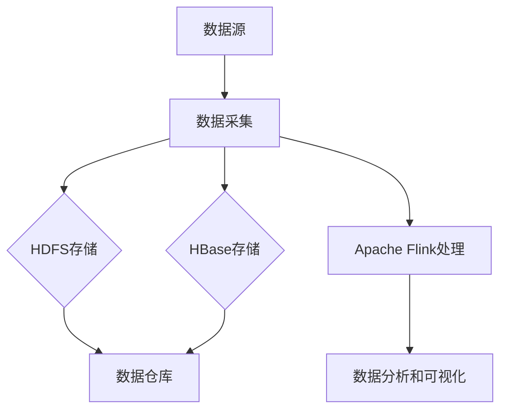
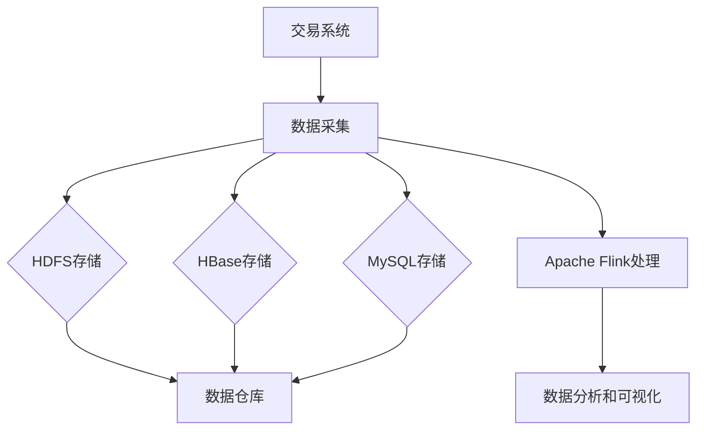
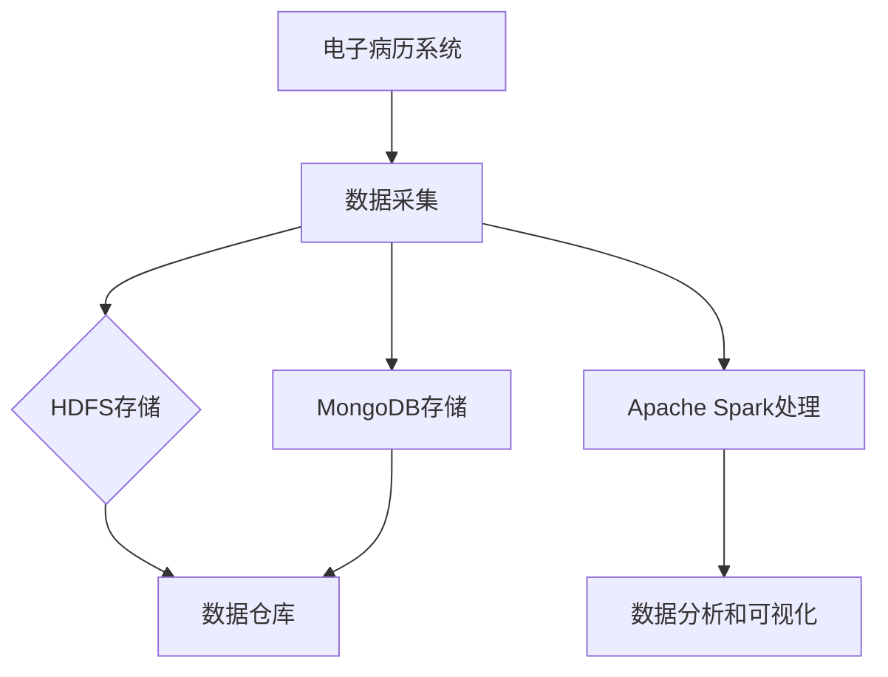

                 

## 大数据分析平台架构设计

### 关键词：大数据分析平台，架构设计，数据存储，数据处理，分布式系统

### 摘要：

本文旨在深入探讨大数据分析平台架构设计的核心原理、关键组件和设计原则。我们将从大数据分析的背景出发，介绍当前的主要技术和工具，然后逐步深入到平台架构的各个方面，包括数据采集、存储、处理和数据分析。本文将强调可扩展性、高可用性和性能优化等设计原则，并通过实际案例和最佳实践，提供架构设计的方法和技巧。最后，我们将探讨未来的发展趋势和可能的技术创新。

---

## 引言

在当今的数据驱动时代，大数据分析平台成为企业竞争的关键因素。无论是金融、医疗、零售还是制造业，大数据分析都能为企业提供深度的洞察和决策支持。然而，随着数据量的激增和数据分析需求的增长，如何设计一个高效、可扩展且可靠的大数据分析平台成为了一个重要的课题。

### 大数据分析的背景

大数据分析起源于互联网的兴起和智能设备的普及。随着社交网络、物联网、传感器和移动设备的广泛应用，数据以惊人的速度和规模增长。传统的数据处理系统已无法满足这种海量数据的需求，因此，专门针对大数据分析的平台和工具应运而生。

### 当前主要技术和工具

目前，大数据分析领域的主要技术和工具包括：

1. **Hadoop**: 一个分布式数据处理框架，用于大规模数据集的存储和处理。
2. **Spark**: 一个快速且通用的分布式计算引擎，提供了丰富的数据处理库和工具。
3. **Flink**: 一个流处理框架，提供了实时数据处理和分析能力。
4. **NoSQL数据库**: 如HBase、Cassandra等，提供了高性能的数据存储和查询能力。

这些技术和工具各有特色，适用于不同的场景和需求。

### 为什么需要专门的大数据分析平台

1. **海量数据处理能力**：大数据分析平台能够处理PB级别的数据，满足大规模数据分析需求。
2. **高可用性和可扩展性**：平台设计考虑了高可用性和弹性扩展，能够在数据量增长时无缝扩展。
3. **性能优化**：通过分布式架构和优化算法，大数据分析平台能够提供高效的计算和查询性能。

### 本文的目的和结构

本文将分为以下几个部分：

1. **背景**：介绍大数据分析平台的起源和发展，以及当前的技术和工具。
2. **核心概念**：定义和介绍大数据分析平台的核心概念，如数据采集、存储、处理和数据分析。
3. **架构设计原则**：讨论大数据分析平台的设计原则，包括可扩展性、高可用性和性能优化。
4. **数据采集与存储**：详细讲解数据采集和存储的方法和工具。
5. **数据处理与分析**：介绍数据处理和分析的流程和工具。
6. **平台集成**：讨论如何将大数据分析平台与其他系统集成。
7. **安全与治理**：探讨大数据分析平台的安全和治理策略。
8. **案例研究**：分析成功的大数据分析平台案例。
9. **未来趋势**：探讨大数据分析平台的未来发展方向。

通过本文的阅读，读者将能够深入理解大数据分析平台的架构设计，掌握关键技术和工具，并能够为实际项目提供有效的解决方案。

---

## 背景

大数据分析平台的起源可以追溯到互联网的兴起和数据的爆炸性增长。随着社交媒体、电子商务、物联网（IoT）和移动设备的普及，各种类型的数据如文本、图像、音频和视频以惊人的速度被生成和存储。传统的数据处理系统在面对如此庞大的数据量时显得力不从心，因此，专门针对大数据分析的平台和工具应运而生。

### 大数据分析技术的发展

大数据分析技术的发展可以分为几个阶段：

1. **分布式存储与计算**：早期的解决方案主要是基于分布式文件系统（如GFS、HDFS）和分布式计算框架（如MapReduce、Spark）。这些技术使得大规模数据处理成为可能，通过将数据分割成小块并在多台计算机上并行处理，大大提高了数据处理的速度和效率。
2. **流数据处理**：随着实时数据处理需求的增长，流处理技术（如Apache Flink、Apache Storm）被引入。流处理能够实时分析数据流，提供实时洞察和快速响应，是大数据分析中的重要一环。
3. **数据处理和分析工具**：除了分布式计算和流处理框架，大数据分析平台还包括丰富的数据处理和分析工具，如数据清洗、数据转换、数据挖掘、机器学习和可视化工具。这些工具帮助数据科学家和分析师从大量数据中提取有价值的信息。

### 当前大数据分析技术的限制

尽管大数据分析技术已经取得了巨大的进步，但仍然存在一些限制和挑战：

1. **数据存储和查询性能**：随着数据量的增加，传统的数据库系统在查询性能上面临巨大挑战。尽管NoSQL数据库（如HBase、Cassandra）提供了高性能的数据存储和查询能力，但在处理复杂查询时仍然存在瓶颈。
2. **数据安全与隐私**：大数据分析平台通常涉及敏感数据，如何保证数据的安全和隐私成为一个重要问题。数据加密、访问控制和隐私保护技术是当前研究的热点。
3. **数据管理和治理**：大数据的多样性和复杂性使得数据管理和治理变得困难。如何有效地组织、管理和维护数据，确保数据的质量和一致性，是大数据分析平台面临的挑战。
4. **人才需求**：大数据分析需要专业的人才，包括数据工程师、数据科学家和分析师。然而，全球范围内大数据专业人才的短缺是一个亟待解决的问题。

### 大数据分析平台的发展现状

当前，大数据分析平台已经广泛应用于各个行业，包括金融、医疗、零售、制造业和公共服务等。一些知名的解决方案包括：

1. **Apache Hadoop**：作为一个生态圈，Apache Hadoop提供了丰富的组件和工具，包括HDFS（分布式文件系统）、MapReduce（分布式计算框架）、HBase（NoSQL数据库）和Spark（分布式计算引擎）。
2. **Google Cloud Platform（GCP）**：GCP提供了全面的大数据分析和机器学习服务，如BigQuery（大数据查询服务）、Cloud Dataflow（流数据处理服务）和Cloud Dataproc（Hadoop和Spark运行服务）。
3. **Amazon Web Services（AWS）**：AWS提供了广泛的大数据解决方案，包括Amazon S3（对象存储服务）、Amazon EMR（Hadoop和Spark运行服务）、Amazon Kinesis（实时数据流服务）和Amazon Redshift（大数据仓库服务）。

### 大数据分析平台的重要性

大数据分析平台的重要性体现在以下几个方面：

1. **数据驱动决策**：大数据分析平台能够帮助企业从大量数据中提取有价值的信息，支持数据驱动决策，提高运营效率和市场竞争力。
2. **实时洞察**：通过实时数据处理和分析，大数据分析平台能够为企业提供及时的洞察和反馈，帮助企业快速应对市场变化和客户需求。
3. **业务创新**：大数据分析平台不仅支持传统业务分析，还能够发现新的业务机会和商业模式，推动业务创新和增长。

总的来说，大数据分析平台在当前的数据驱动时代扮演着至关重要的角色。了解其发展背景、当前技术现状和面临的挑战，对于设计高效、可靠的大数据分析平台至关重要。

### 核心概念

在设计大数据分析平台时，理解几个核心概念是非常重要的。这些概念包括数据采集、数据存储、数据处理和数据分析。每个概念在平台的运作中都有其独特的作用和重要性。

#### 数据采集

数据采集是大数据分析平台的第一步，也是最重要的环节之一。数据采集涉及从各种数据源获取数据，包括数据库、文件系统、API、IoT设备等。采集的数据可以是结构化数据（如数据库记录）、半结构化数据（如JSON文件）和非结构化数据（如文本、图像和视频）。

**核心概念**：数据采集包括数据接入、数据清洗和数据传输。

- **数据接入**：数据接入是指将数据从原始数据源导入到分析平台。这通常涉及到使用API、Web爬虫或IoT协议等。
- **数据清洗**：数据清洗是指对采集到的数据进行清洗和预处理，以去除错误、重复或无关的数据，确保数据的质量和一致性。
- **数据传输**：数据传输是指将清洗后的数据从一个系统传输到另一个系统，通常涉及到数据管道和流处理技术。

#### 数据存储

数据存储是大数据分析平台的另一个关键环节，负责存储和管理数据。大数据分析平台通常使用分布式文件系统（如HDFS）和NoSQL数据库（如HBase、Cassandra）来存储数据。这些系统提供了高可用性和高性能的数据存储解决方案。

**核心概念**：数据存储包括数据分布、数据复制和数据一致性。

- **数据分布**：数据分布是指将数据存储在多个节点上，以实现数据的并行访问和处理。通过数据分布，平台可以处理大规模的数据集。
- **数据复制**：数据复制是指将数据复制到多个节点上，以提高数据的可靠性和容错性。在分布式系统中，数据复制是确保数据不丢失的重要手段。
- **数据一致性**：数据一致性是指确保数据在多个节点上保持一致。在分布式系统中，数据一致性是一个复杂的挑战，通常涉及到各种一致性模型，如强一致性、最终一致性和会话一致性。

#### 数据处理

数据处理是大数据分析平台的核心，负责对数据进行转换、计算和分析。数据处理包括批处理和流处理两种方式。

**核心概念**：数据处理包括批处理、流处理和数据转换。

- **批处理**：批处理是指将数据分成批次进行处理。批处理适用于处理大量历史数据，如定期生成报告或进行数据挖掘。
- **流处理**：流处理是指实时处理数据流，适用于需要实时分析和响应的场景，如实时监控和异常检测。
- **数据转换**：数据转换是指将数据从一种格式转换为另一种格式，以满足分析需求。数据转换通常涉及到数据清洗、数据转换和数据加标签等步骤。

#### 数据分析

数据分析是大数据分析平台的最终目标，旨在从数据中提取有价值的信息和洞察。数据分析包括各种技术，如数据挖掘、机器学习和统计分析。

**核心概念**：数据分析包括数据挖掘、机器学习和可视化。

- **数据挖掘**：数据挖掘是指使用算法和统计方法从大量数据中提取模式和知识。数据挖掘适用于发现隐藏的关系和趋势，支持决策制定。
- **机器学习**：机器学习是指使用算法和统计模型自动从数据中学习，并做出预测或决策。机器学习适用于复杂的数据分析和预测任务，如分类、聚类和回归。
- **可视化**：可视化是指使用图表、图像和交互界面来展示数据分析结果。可视化帮助用户更好地理解和解释数据分析结果，支持数据驱动决策。

### 比较表格

为了更好地理解这些核心概念，我们可以通过以下比较表格来展示它们的属性和特征：

| 核心概念 | 描述 | 属性特征 | 对比 |
| --- | --- | --- | --- |
| 数据采集 | 数据的收集和预处理 | 数据接入、数据清洗、数据传输 | 结构化数据 vs. 半结构化数据 vs. 非结构化数据 |
| 数据存储 | 数据的存储和管理 | 数据分布、数据复制、数据一致性 | 分布式文件系统 vs. NoSQL数据库 |
| 数据处理 | 数据的转换和计算 | 批处理、流处理、数据转换 | 历史数据 vs. 实时数据流 |
| 数据分析 | 数据的提取和解释 | 数据挖掘、机器学习、可视化 | 关系发现 vs. 预测任务 vs. 数据展示 |

### ER实体关系图

为了更好地展示这些核心概念之间的关联，我们可以使用ER（实体关系）图来描述它们之间的关系。

```mermaid
erDiagram
    数据采集 ||--|{ 数据存储 }|| 数据采集与数据存储之间存在依赖关系。
    数据存储 ||--|{ 数据处理 }|| 数据存储为数据处理提供数据源。
    数据处理 ||--|{ 数据分析 }|| 数据处理为数据分析提供数据预处理。
```

通过这个ER图，我们可以清晰地看到数据采集、数据存储、数据处理和数据分析之间的交互和依赖关系。这些核心概念共同构成了大数据分析平台的基础架构，为数据的收集、处理和分析提供了完整的解决方案。

理解这些核心概念对于设计高效、可靠的大数据分析平台至关重要。通过深入理解每个概念的作用和特征，我们可以更好地应对大数据分析的挑战，实现数据的价值最大化。

### 架构设计原则

在设计和构建大数据分析平台时，遵循一系列核心设计原则至关重要。这些原则不仅确保平台的高可用性、可扩展性和性能优化，还保证系统的灵活性和可维护性。以下是大数据分析平台架构设计中的几个关键原则：

#### 可扩展性

可扩展性是大数据分析平台设计的核心原则之一。随着数据量的不断增长，平台需要能够无缝扩展其处理能力，以满足日益增长的数据分析需求。可扩展性可以通过水平扩展（添加更多的节点）和垂直扩展（增加节点的处理能力）来实现。

**扩展性原则：**

1. **模块化设计**：将系统划分为多个模块，每个模块负责特定的功能。这样可以独立扩展每个模块，而不影响其他部分。
2. **分布式计算**：使用分布式计算框架（如Hadoop、Spark）来处理大规模数据集，确保系统能够在多个节点上并行执行任务。
3. **弹性调度**：利用自动化调度系统（如Kubernetes、YARN）来自动分配计算资源，根据负载动态调整节点数量和资源分配。

#### 高可用性

高可用性是指系统在面临故障或压力时能够持续提供服务的能力。在大数据环境中，高可用性尤为重要，因为数据分析和决策的连续性对于企业运营至关重要。

**高可用性原则：**

1. **冗余设计**：通过冗余部署关键组件（如数据存储节点、计算节点）来确保系统在单个组件故障时仍能正常运行。
2. **故障转移**：实现故障转移机制，当主节点故障时，自动将负载转移到备用节点，确保服务不中断。
3. **数据备份和恢复**：定期备份数据，并设置数据恢复策略，以便在数据丢失或损坏时能够迅速恢复。

#### 性能优化

性能优化是确保大数据分析平台能够高效处理和分析大量数据的关键。优化策略包括算法优化、存储优化和计算优化。

**性能优化原则：**

1. **负载均衡**：使用负载均衡器（如Nginx、HAProxy）来分配流量，避免单点瓶颈。
2. **缓存策略**：利用缓存（如Redis、Memcached）来存储常用的数据，减少数据库访问次数，提高查询速度。
3. **索引和分区**：对数据存储进行索引和分区，以提高查询效率和数据访问速度。

#### 灵活性和可维护性

灵活性和可维护性是确保大数据分析平台能够适应未来变化和持续发展的关键。设计时需要考虑到系统的可扩展性和可维护性。

**灵活性和可维护性原则：**

1. **微服务架构**：采用微服务架构，将系统拆分为独立的、松耦合的服务，每个服务负责特定的功能，这样可以更灵活地升级和替换部分服务。
2. **持续集成与持续部署**（CI/CD）：通过CI/CD流程实现自动化测试和部署，提高开发效率和质量。
3. **日志和监控**：集成日志和监控工具（如ELK、Prometheus）来实时监控系统性能和故障，确保系统稳定运行。

#### 安全性和隐私保护

在大数据环境中，数据安全和隐私保护至关重要。设计时需要考虑到数据加密、访问控制和权限管理。

**安全性和隐私保护原则：**

1. **数据加密**：使用数据加密技术（如AES、RSA）来保护数据在传输和存储过程中的安全。
2. **访问控制**：实现细粒度的访问控制策略，确保只有授权用户能够访问敏感数据。
3. **隐私保护**：遵循隐私保护法规和最佳实践，确保用户数据不被未授权访问和泄露。

通过遵循这些架构设计原则，大数据分析平台不仅能够高效地处理和分析大量数据，还能够保证系统的可靠性、安全性和灵活性，为企业的数据驱动决策提供坚实的支撑。

### 数据采集与存储

数据采集与存储是大数据分析平台的基础环节，直接影响平台的数据处理和分析效率。在这一部分，我们将详细讨论数据采集的方法、常见的存储解决方案以及如何确保数据的一致性和可靠性。

#### 数据采集方法

数据采集是大数据分析的第一步，决定了数据的完整性和准确性。以下是一些常见的数据采集方法：

1. **批处理数据采集**：批处理数据采集是指定期从数据源中提取数据，并批量导入到大数据分析平台。这种方法适用于处理历史数据，如定期生成报告或进行数据挖掘。常见的数据源包括数据库、文件系统和日志文件。

2. **实时数据采集**：实时数据采集是指实时地从数据源获取数据，并立即传输到大数据分析平台。这种方法适用于需要实时分析和响应的场景，如实时监控和异常检测。常见的数据源包括IoT设备、API和实时消息队列。

3. **流数据处理**：流数据处理是一种实时数据采集和处理的机制，能够连续地处理数据流，提供实时分析。常见的技术包括Apache Kafka、Apache Flink和Apache Storm。

**步骤**：

- **数据接入**：使用API、Web爬虫或IoT协议等从数据源获取数据。
- **数据清洗**：对采集到的数据进行清洗和预处理，去除错误、重复或无关的数据，确保数据的质量和一致性。
- **数据传输**：将清洗后的数据传输到大数据分析平台，通常通过数据管道和流处理技术。

#### 常见的存储解决方案

在数据采集之后，如何有效地存储和管理数据是大数据分析平台面临的另一个关键问题。以下是一些常见的存储解决方案：

1. **分布式文件系统**：分布式文件系统（如HDFS、Ceph）提供了高性能的数据存储和分布式计算能力，适用于大规模数据集的存储和处理。

2. **NoSQL数据库**：NoSQL数据库（如HBase、Cassandra、MongoDB）提供了灵活的数据模型和高性能的存储和查询能力，适用于各种类型的数据存储。

3. **关系数据库**：关系数据库（如MySQL、PostgreSQL）提供了强大的数据管理和查询功能，适用于结构化数据的存储。

4. **云存储**：云存储（如AWS S3、Azure Blob Storage、Google Cloud Storage）提供了可扩展和低成本的数据存储解决方案，适用于大规模数据的存储和管理。

**选择依据**：

- **数据类型和规模**：根据数据的类型和规模选择适合的存储方案。对于大规模的结构化数据，关系数据库和分布式文件系统可能是更好的选择；对于非结构化数据和半结构化数据，NoSQL数据库可能是更适合的。
- **性能需求**：根据数据处理的性能需求选择合适的存储方案。对于需要高性能查询的应用，关系数据库和NoSQL数据库可能更合适；对于需要高性能写入和流处理的应用，分布式文件系统和流处理框架可能是更好的选择。
- **成本考虑**：根据预算和成本考虑选择合适的存储方案。云存储提供了灵活的定价模式，可以根据需求动态调整存储规模；对于长期存储和大量数据，分布式文件系统和NoSQL数据库可能是更具成本效益的选择。

#### 数据一致性、可靠性和安全

确保数据的一致性、可靠性和安全性是大数据分析平台设计中的重要方面。以下是一些关键策略：

1. **数据一致性**：在分布式系统中，数据一致性是一个复杂的问题。常用的数据一致性模型包括强一致性、最终一致性和会话一致性。设计时需要根据具体应用场景选择合适的一致性模型。

2. **数据备份和恢复**：定期备份数据，并设置数据恢复策略，以便在数据丢失或损坏时能够迅速恢复。备份策略可以包括全量备份、增量备份和快照备份。

3. **数据可靠性**：通过冗余设计和故障转移机制来提高数据的可靠性。分布式存储系统通常通过数据复制和冗余部署来确保数据不丢失。

4. **数据加密**：使用数据加密技术来保护数据在传输和存储过程中的安全。常用的加密算法包括AES、RSA等。

5. **访问控制**：实现细粒度的访问控制策略，确保只有授权用户能够访问敏感数据。

通过合理的数据采集方法和存储解决方案，并采取有效的数据一致性、可靠性和安全措施，大数据分析平台能够高效地处理和管理海量数据，为数据分析和决策提供坚实的基础。

### 数据处理与分析

数据处理与分析是大数据分析平台的核心环节，负责从海量数据中提取有价值的信息和洞察。在这一部分，我们将详细探讨数据处理和分析的流程、常用的技术和工具，以及如何进行实时数据处理和离线处理。

#### 数据处理流程

数据处理流程通常包括数据清洗、数据转换、数据集成和数据存储等步骤。以下是每个步骤的详细描述：

1. **数据清洗**：数据清洗是指对采集到的原始数据进行清洗和预处理，以去除错误、重复或无关的数据。数据清洗包括数据去重、缺失值填充、异常值处理和数据格式转换等。

2. **数据转换**：数据转换是指将数据从一种格式转换为另一种格式，以满足分析需求。数据转换通常包括数据规范化、数据聚合、数据拆分和数据转换函数应用等。

3. **数据集成**：数据集成是指将来自不同数据源的数据进行合并和整合，形成一个统一的数据视图。数据集成包括数据合并、数据去重、数据关联和数据分层等。

4. **数据存储**：数据存储是指将处理后的数据存储到数据仓库、数据湖或其他数据存储系统，以供后续分析和查询。常用的存储系统包括HDFS、NoSQL数据库和云存储。

#### 常用技术和工具

大数据分析平台中常用的技术和工具包括分布式计算框架、数据清洗工具、数据转换工具、数据挖掘工具和机器学习框架等。以下是一些常用技术和工具的简介：

1. **分布式计算框架**：分布式计算框架（如Hadoop、Spark、Flink）是大数据处理和分析的核心工具。这些框架提供了分布式数据处理的能力，能够高效地处理大规模数据集。

   - **Hadoop**：Hadoop是一个分布式计算框架，包括HDFS（分布式文件系统）和MapReduce（分布式数据处理框架）。Hadoop适用于批量数据处理，提供了高可靠性和高扩展性的解决方案。
   - **Spark**：Spark是一个快速且通用的分布式计算引擎，提供了丰富的数据处理库和工具。Spark适用于实时数据处理和分析，提供了批处理、流处理和机器学习等功能。
   - **Flink**：Flink是一个流处理框架，提供了实时数据处理和分析能力。Flink适用于需要实时分析和响应的场景，如实时监控和异常检测。

2. **数据清洗工具**：数据清洗工具（如Apache Spark、Apache Beam）提供了丰富的数据清洗和预处理功能，能够自动处理数据去重、缺失值填充、异常值处理和数据格式转换等任务。

   - **Apache Spark**：Spark提供了一个数据处理平台，包括Spark SQL、Spark Streaming和MLlib等库，用于数据清洗、转换和分析。
   - **Apache Beam**：Beam是一个开源的数据处理框架，提供了数据清洗、转换和处理的API，支持多种数据处理引擎和运行时环境。

3. **数据转换工具**：数据转换工具（如ETL工具、数据流处理器）提供了自动化数据转换功能，能够高效地处理数据转换任务。

   - **ETL工具**：ETL（提取、转换、加载）工具（如Apache NiFi、Apache Airflow）提供了数据集成和数据转换的功能，能够自动化数据流程。
   - **数据流处理器**：数据流处理器（如Apache Kafka、Apache Flink）提供了实时数据流处理功能，能够动态处理数据流。

4. **数据挖掘工具**：数据挖掘工具（如RapidMiner、Orange）提供了数据挖掘和机器学习功能，能够自动发现数据中的模式和关系。

   - **RapidMiner**：RapidMiner是一个开源的数据科学平台，提供了丰富的数据预处理、机器学习和可视化工具。
   - **Orange**：Orange是一个数据科学和机器学习工具，提供了直观的用户界面和丰富的数据挖掘功能。

5. **机器学习框架**：机器学习框架（如TensorFlow、PyTorch、Scikit-learn）提供了机器学习模型的构建和训练功能，能够自动从数据中学习模式和规律。

   - **TensorFlow**：TensorFlow是一个开源的机器学习框架，提供了灵活的模型构建和训练功能，适用于各种机器学习和深度学习任务。
   - **PyTorch**：PyTorch是一个开源的机器学习库，提供了动态计算图和自动微分功能，适用于深度学习和神经网络。
   - **Scikit-learn**：Scikit-learn是一个开源的机器学习库，提供了丰富的机器学习算法和工具，适用于各种分类、回归和聚类任务。

#### 实时数据处理和离线处理

大数据分析平台通常需要支持实时数据处理和离线处理。实时数据处理适用于需要快速响应和实时分析的场景，如实时监控、异常检测和实时推荐。离线处理适用于需要批量处理和长时间运行分析的场景，如定期报告生成、数据挖掘和机器学习模型训练。

1. **实时数据处理**：实时数据处理通常使用流处理框架（如Apache Flink、Apache Storm）来实现。流处理框架能够实时分析数据流，提供实时洞察和快速响应。实时数据处理的关键技术包括事件驱动架构、数据流处理和实时分析。

2. **离线处理**：离线处理通常使用分布式计算框架（如Hadoop、Spark）来实现。离线处理适用于处理大量历史数据，如定期生成报告、进行数据挖掘和机器学习模型训练。离线处理的关键技术包括批处理、分布式计算和数据存储。

通过合理的数据处理和分析流程，选择合适的技术和工具，大数据分析平台能够高效地处理和分析海量数据，为数据驱动的决策提供坚实支持。

### 平台集成

大数据分析平台的有效集成是确保数据能够顺畅流动、各个系统模块之间能够协同工作的关键。在这一部分，我们将详细探讨如何将大数据分析平台与其他系统进行集成，包括数据仓库、数据湖和业务智能工具的集成。

#### 数据仓库集成

数据仓库是大数据分析平台的重要集成目标之一。数据仓库用于存储和管理大量结构化数据，为数据分析提供统一的数据源。以下是如何实现数据仓库集成的步骤：

1. **数据抽取和转换**：使用ETL（提取、转换、加载）工具将数据从源系统（如数据库、日志文件等）抽取出来，并进行必要的转换，使其符合数据仓库的模式和要求。

2. **数据加载**：将转换后的数据加载到数据仓库中。数据加载可以使用批处理或流处理方式，具体取决于数据量和业务需求。

3. **数据建模**：在数据仓库中构建数据模型，包括数据表、索引和视图等。数据模型的设计需要考虑查询性能和数据一致性。

4. **数据同步**：实现数据仓库与大数据分析平台之间的数据同步，确保数据的一致性和实时性。可以使用调度任务或实时数据流处理来实现数据的同步。

#### 数据湖集成

数据湖是用于存储海量非结构化和半结构化数据的分布式存储系统。与数据仓库不同，数据湖保留了数据的原始格式和结构，为后续的数据处理和分析提供了灵活性。以下是如何实现数据湖集成的步骤：

1. **数据接入**：使用数据接入工具（如Apache NiFi、Apache Kafka）将数据从各种来源（如数据库、文件系统、IoT设备等）接入到数据湖中。

2. **数据预处理**：在数据湖中对接入的数据进行预处理，包括数据清洗、格式转换和数据标准化等。

3. **数据存储**：将预处理后的数据存储到数据湖中，使用分布式文件系统（如HDFS、AWS S3）来提供高可用性和高性能的存储解决方案。

4. **数据查询**：使用数据湖查询工具（如Apache Hive、Apache Spark SQL）来查询和分析数据湖中的数据。

#### 业务智能工具集成

业务智能工具（如Tableau、Power BI）用于将数据分析结果可视化，帮助用户更好地理解和利用数据。以下是如何实现业务智能工具集成的步骤：

1. **数据连接**：配置业务智能工具与大数据分析平台的数据源连接，包括数据仓库、数据湖和实时数据流等。

2. **数据建模**：在业务智能工具中构建数据模型，包括数据表、指标和仪表板等。数据模型需要与大数据分析平台中的数据模型保持一致。

3. **数据可视化**：使用业务智能工具创建可视化报表、图表和仪表板，将数据分析结果以直观的方式展示给用户。

4. **实时更新**：实现业务智能工具与大数据分析平台的数据同步，确保报表和仪表板能够实时反映最新的数据分析结果。

通过以上集成步骤，大数据分析平台能够与数据仓库、数据湖和业务智能工具无缝集成，实现数据的高效流通和利用，为企业的数据驱动的决策提供有力支持。

### 安全与治理

在大数据分析平台的架构设计中，数据安全和治理是至关重要的环节。随着数据量的增加和敏感信息的增多，如何保护数据安全、确保数据隐私和合规性成为关键挑战。以下将探讨大数据分析平台中的数据安全、隐私保护和治理策略。

#### 数据安全

数据安全是保障大数据分析平台的核心任务之一，涉及多个方面：

1. **访问控制**：实现细粒度的访问控制策略，确保只有授权用户能够访问敏感数据。可以使用基于角色的访问控制（RBAC）或基于属性的访问控制（ABAC）来管理访问权限。

2. **身份验证和授权**：使用强身份验证机制（如双因素认证）来确保用户身份的合法性。结合授权机制，确保用户只能访问其权限范围内的数据。

3. **加密技术**：使用数据加密技术（如AES、RSA）来保护数据在传输和存储过程中的安全。对于敏感数据，应采用高级加密标准来确保数据不被未授权访问。

4. **网络安全**：部署防火墙、入侵检测系统和防病毒软件等网络安全措施，保护大数据分析平台不受外部攻击和恶意软件的侵害。

#### 隐私保护

隐私保护是大数据分析平台必须重视的方面，尤其是在涉及个人敏感信息的情况下。以下是一些关键策略：

1. **数据脱敏**：对敏感数据进行脱敏处理，如使用伪随机数或加密算法来替换敏感信息，以确保数据在分析和共享过程中不被泄露。

2. **数据最小化原则**：遵循数据最小化原则，仅收集和存储必要的数据，避免过度收集可能包含敏感信息的非必要数据。

3. **数据匿名化**：使用数据匿名化技术，如通用唯一标识符（UUID）或随机化处理，将个人身份信息与数据分离，以保护个人隐私。

4. **隐私政策**：制定清晰的隐私政策，告知用户其数据如何被收集、使用和共享，确保用户对数据使用的知情权和选择权。

#### 治理策略

数据治理是确保大数据分析平台合规、高效运行的关键。以下是一些治理策略：

1. **数据质量管理**：建立数据质量管理流程，包括数据验证、数据清洗和数据规范化等步骤，确保数据的准确性和一致性。

2. **数据分类和标签**：对数据进行分类和标签，根据数据的重要性和敏感度采取不同的治理策略。标签可以帮助系统更好地管理和保护数据。

3. **数据审计**：定期进行数据审计，检查数据的使用情况、访问记录和合规性，确保数据治理策略得到有效执行。

4. **合规性和法律法规**：遵循相关法律法规，如《通用数据保护条例》（GDPR）和《加州消费者隐私法案》（CCPA），确保数据处理的合规性。

通过实施这些安全与治理策略，大数据分析平台不仅能够保障数据的安全和隐私，还能确保数据的合规性和有效性，为企业的数据驱动决策提供坚实的支撑。

### 实际案例

为了更好地理解大数据分析平台的设计和应用，我们将探讨几个成功的实际案例，分析其架构设计、项目背景、功能设计和系统架构，并通过具体案例剖析系统核心实现和项目小结。

#### 案例一：电商大数据分析平台

**项目背景：**

某大型电商平台希望通过大数据分析平台提升用户体验、优化运营效率和发现新的商业机会。平台需要处理海量的用户行为数据、交易数据和商品数据，以实现个性化推荐、欺诈检测和营销分析。

**架构设计：**

1. **数据采集**：采用Kafka作为数据采集工具，从不同的数据源（如用户行为日志、交易记录、商品数据库等）实时收集数据。
2. **数据处理**：使用Apache Flink进行实时数据处理，实现用户行为数据的实时分析和交易数据的流处理。
3. **数据存储**：使用HDFS存储大规模数据集，同时使用HBase进行实时数据查询，以满足实时查询和事务处理的需求。
4. **数据仓库**：使用Apache Hive构建数据仓库，存储批量处理后的数据，以便进行深度分析和报告生成。
5. **数据分析和可视化**：利用Tableau进行数据分析结果的可视化展示，帮助业务团队快速理解和利用数据。

**功能设计：**

1. **用户行为分析**：实时分析用户行为数据，包括浏览、搜索、点击、购买等行为，以发现用户偏好和购物习惯。
2. **欺诈检测**：通过分析交易数据，实现实时欺诈检测，防止欺诈行为对平台造成损失。
3. **营销分析**：基于用户行为数据和交易数据，进行精准营销分析和活动效果评估。

**系统架构设计：**



**核心实现与解析：**

1. **数据采集**：使用Kafka Producer将用户行为日志和交易记录写入Kafka主题。
2. **数据处理**：使用Apache Flink编写实时处理任务，对Kafka中的数据进行实时分析，如用户行为路径分析、交易金额统计等。
3. **数据存储**：将处理后的数据存储到HDFS和HBase，以便后续查询和分析。
4. **数据仓库**：使用Apache Hive构建数据仓库，进行批量数据处理和存储，如用户行为数据分析、交易数据汇总等。
5. **数据分析和可视化**：使用Tableau进行数据分析结果的可视化展示，生成用户报告和营销分析图表。

**项目小结：**

该电商平台的大数据分析平台实现了实时用户行为分析、欺诈检测和营销分析等功能，提高了用户体验和运营效率。通过合理的架构设计和关键技术的应用，平台能够高效地处理和分析海量数据，为业务决策提供了有力支持。

#### 案例二：金融大数据风控平台

**项目背景：**

某金融服务公司希望通过大数据风控平台提升风险管理能力，及时发现潜在风险，防止欺诈行为，确保合规运营。

**架构设计：**

1. **数据采集**：采用Apache Kafka进行实时数据采集，从交易系统、用户行为系统、外部数据源等收集数据。
2. **数据处理**：使用Apache Flink进行实时数据处理，包括交易数据清洗、异常检测和风险评估。
3. **数据存储**：使用HDFS和HBase存储大规模数据集，同时使用MySQL存储结构化数据。
4. **数据仓库**：使用Apache Hive构建数据仓库，存储批量处理后的数据，如用户交易历史、风险事件等。
5. **数据分析和可视化**：利用BI工具（如Tableau、Power BI）进行数据分析和可视化展示，辅助风险管理决策。

**功能设计：**

1. **实时异常检测**：实时监控交易数据，发现异常交易行为，如可疑交易、频繁交易等。
2. **风险评估**：基于历史交易数据和用户行为数据，进行风险评估，识别高风险用户和交易。
3. **风险事件管理**：记录和管理风险事件，包括欺诈事件、合规违规事件等。

**系统架构设计：**



**核心实现与解析：**

1. **数据采集**：使用Kafka Producer将交易数据、用户行为数据等写入Kafka主题。
2. **数据处理**：使用Apache Flink编写实时处理任务，对Kafka中的交易数据进行清洗、异常检测和风险评估。
3. **数据存储**：将清洗后的数据存储到HDFS和HBase，以便后续查询和分析。
4. **数据仓库**：使用Apache Hive构建数据仓库，进行批量数据处理和存储，如用户交易历史分析、风险事件汇总等。
5. **数据分析和可视化**：使用BI工具进行数据分析结果的可视化展示，生成风险报告和决策支持图表。

**项目小结：**

该金融大数据风控平台实现了实时异常检测、风险评估和风险事件管理等功能，有效提升了金融服务公司的风险管理能力。通过合理的架构设计和关键技术的应用，平台能够实时处理海量数据，提供实时洞察和决策支持，确保合规运营。

#### 案例三：医疗大数据分析平台

**项目背景：**

某医疗机构希望通过大数据分析平台提升医疗服务质量，实现精准医疗和个性化治疗。平台需要处理海量的医疗数据，包括患者信息、病历记录、基因数据等。

**架构设计：**

1. **数据采集**：采用Apache Kafka进行实时数据采集，从电子病历系统、医疗设备、外部数据源等收集数据。
2. **数据处理**：使用Apache Spark进行批处理和流处理，实现医疗数据清洗、转换和分析。
3. **数据存储**：使用HDFS存储大规模数据集，同时使用MongoDB存储非结构化数据。
4. **数据仓库**：使用Amazon Redshift构建数据仓库，存储批量处理后的数据，如患者数据分析、治疗效果评估等。
5. **数据分析和可视化**：利用Tableau进行数据分析和可视化展示，辅助医疗团队进行决策。

**功能设计：**

1. **患者数据分析**：基于患者信息、病历记录等数据，分析患者健康状况、疾病趋势等。
2. **个性化治疗**：根据患者的基因数据、病史等信息，提供个性化治疗建议和药物推荐。
3. **临床研究**：基于大规模医疗数据，支持临床研究和医学统计。

**系统架构设计：**



**核心实现与解析：**

1. **数据采集**：使用Kafka Producer将医疗数据写入Kafka主题。
2. **数据处理**：使用Apache Spark编写批处理和流处理任务，对Kafka中的医疗数据进行清洗、转换和分析。
3. **数据存储**：将清洗后的数据存储到HDFS和MongoDB，以便后续查询和分析。
4. **数据仓库**：使用Amazon Redshift构建数据仓库，进行批量数据处理和存储，如患者数据分析、治疗效果评估等。
5. **数据分析和可视化**：使用Tableau进行数据分析结果的可视化展示，生成患者报告和临床研究图表。

**项目小结：**

该医疗大数据分析平台实现了患者数据分析、个性化治疗和临床研究等功能，提升了医疗服务质量和科研水平。通过合理的架构设计和关键技术的应用，平台能够高效地处理和分析海量医疗数据，为医疗机构提供实时洞察和决策支持。

通过这些实际案例的分析，我们可以看到大数据分析平台在各个行业中的应用和重要性。合理的架构设计和关键技术的应用，使得平台能够高效、可靠地处理和分析海量数据，为企业的数据驱动决策提供坚实支撑。

### 未来发展趋势

随着技术的不断进步和大数据应用场景的多样化，大数据分析平台的架构设计和实现也在不断演变和优化。以下是一些未来发展趋势：

#### 新兴技术的影响

1. **人工智能与大数据的结合**：人工智能（AI）和大数据技术的结合将为大数据分析平台带来革命性的变革。通过机器学习和深度学习算法，大数据分析平台将能够实现更智能的数据分析和预测能力，如自动化数据清洗、智能数据挖掘和实时推荐系统。

2. **区块链技术**：区块链技术以其去中心化、安全性和不可篡改性，将在大数据分析平台的隐私保护和数据可信性方面发挥重要作用。例如，使用区块链技术可以确保数据传输和存储过程中的透明性和可追溯性，提高数据的安全性和可信度。

3. **边缘计算**：随着物联网（IoT）设备数量的增加，边缘计算技术将变得更加重要。边缘计算将数据处理和存储能力推向网络边缘，减少了数据传输延迟，提高了实时数据处理能力。大数据分析平台将需要支持边缘计算，以实现更高效的数据处理和分析。

#### 开源生态的扩展

1. **开源框架的成熟**：随着开源生态的不断发展，大数据分析平台将更加依赖于成熟的开源框架和工具。例如，Apache Hadoop、Apache Spark、Apache Flink等开源框架将继续发挥重要作用，提供强大的数据处理和分析能力。

2. **容器化和微服务架构**：容器化技术（如Docker、Kubernetes）和微服务架构的普及，将使大数据分析平台更加灵活和可扩展。通过将大数据处理任务拆分为微服务，平台可以更方便地进行部署、升级和扩展，提高系统的可靠性和可维护性。

#### 云原生大数据平台

1. **云原生大数据平台**：随着云计算技术的成熟，云原生大数据平台将成为主流。云原生大数据平台将利用云服务的弹性和可扩展性，提供高效、可靠和可管理的解决方案。例如，使用云原生平台可以实现自动化资源管理、快速部署和弹性扩展，降低运营成本。

2. **混合云和多云策略**：为了提高灵活性和降低成本，许多企业将采用混合云和多云策略，结合公有云和私有云的资源。大数据分析平台需要支持跨云部署和资源调度，以实现高效的资源利用和数据分析。

#### 安全和隐私保护

1. **数据安全和隐私保护**：随着数据安全和隐私保护法规的加强，大数据分析平台将需要更加重视数据安全和隐私保护。通过采用加密技术、访问控制和隐私保护算法，平台将能够确保数据的安全性和合规性。

2. **联邦学习**：联邦学习（Federated Learning）是一种在分布式环境中进行机器学习的方法，可以保护数据隐私，同时实现模型训练和优化。未来，大数据分析平台将可能采用联邦学习方法，以提高数据安全性和隐私保护。

总的来说，未来大数据分析平台的架构设计和实现将更加智能化、灵活化和安全化。随着新技术的不断涌现和开源生态的扩展，大数据分析平台将在各个领域发挥越来越重要的作用，为企业的数据驱动决策提供强有力的支持。

### 总结

本文系统地探讨了大数据分析平台架构设计的核心原则、关键组件和设计方法。我们从大数据分析平台的重要性出发，详细介绍了数据采集、存储、处理和数据分析等核心概念，并探讨了架构设计中的可扩展性、高可用性和性能优化等原则。通过实际案例的剖析，我们展示了大数据分析平台在电商、金融和医疗等领域的成功应用。此外，我们还展望了大数据分析平台的未来发展趋势，包括人工智能与大数据的结合、区块链技术、边缘计算和云原生平台等。

在设计大数据分析平台时，以下最佳实践和建议尤为重要：

1. **模块化设计**：将系统划分为多个模块，每个模块独立开发和部署，以提高系统的可扩展性和灵活性。

2. **分布式计算**：采用分布式计算框架，如Hadoop、Spark和Flink，以提高系统的并行处理能力和数据处理效率。

3. **数据加密和隐私保护**：确保数据在传输和存储过程中的加密，并遵循数据隐私保护法规和最佳实践。

4. **实时与离线处理结合**：结合实时数据处理和离线处理，以实现高效的数据分析和决策支持。

5. **自动化和监控**：利用自动化工具和监控平台，实现系统的自动化部署、监控和故障恢复，提高系统的可靠性和运维效率。

6. **持续集成与持续部署**（CI/CD）：采用CI/CD流程，实现自动化测试和部署，提高开发效率和系统质量。

7. **安全与治理**：建立完善的数据安全和治理策略，确保数据的安全性和合规性。

通过遵循这些最佳实践，我们可以设计出高效、可靠和灵活的大数据分析平台，为企业的数据驱动决策提供坚实支撑。未来的大数据分析平台将在人工智能、区块链和边缘计算等新兴技术的推动下，发挥更加重要的作用。

### 注意事项

在设计和实施大数据分析平台时，以下注意事项对于确保平台的稳定性和可靠性至关重要：

1. **数据一致性**：在分布式系统中，数据一致性是一个挑战。需要选择合适的一致性模型，如强一致性、最终一致性或会话一致性，以满足应用需求。

2. **数据冗余与备份**：为了确保数据的高可用性，需要实现数据冗余和备份策略。同时，定期进行数据恢复测试，以确保在数据丢失或损坏时能够迅速恢复。

3. **性能监控与优化**：定期监控系统性能，识别瓶颈并进行优化。使用负载均衡和缓存策略，以提高系统的响应速度和吞吐量。

4. **安全与合规**：严格遵守数据安全和隐私保护法规，如GDPR和CCPA。实现数据加密、访问控制和日志审计，确保系统的安全性。

5. **容错性与故障转移**：设计冗余架构和故障转移机制，确保在节点故障时系统能够自动恢复，避免服务中断。

6. **数据质量管理**：建立数据质量管理流程，确保数据的准确性、一致性和完整性。定期进行数据清洗和验证，以提高数据质量。

通过关注这些注意事项，可以有效提升大数据分析平台的稳定性和可靠性，确保其在实际应用中的高效运行。

### 拓展阅读

为了进一步深入了解大数据分析平台的架构设计和实现，以下推荐几本经典书籍和相关资源：

1. **《大数据：改变世界的数据管理革命》**：作者：维克托·迈尔-舍恩伯格、肯尼斯·库克耶。这本书详细介绍了大数据的概念、技术及其应用，是理解大数据分析基础的重要读物。

2. **《Hadoop技术内幕》**：作者：托尼·哈蒙德。本书深入探讨了Hadoop的内部工作机制，包括HDFS、MapReduce和YARN等核心组件，适合对Hadoop架构设计感兴趣的技术人员。

3. **《Spark技术实战》**：作者：Bill Chambers、Joe Eames。这本书提供了Spark的详细使用指南，包括数据处理、流处理和机器学习等方面的应用，是学习Spark技术的实用参考书。

4. **《大数据架构设计与优化》**：作者：刘建新。本书系统地介绍了大数据平台的架构设计原则、关键技术及优化策略，适合大数据架构师和系统设计师阅读。

5. **《大数据安全与隐私保护》**：作者：刘鹏。这本书详细探讨了大数据环境下的数据安全与隐私保护策略，包括数据加密、访问控制和隐私保护算法等。

6. **《数据科学实战：基于Python的应用》**：作者：Joel Grus。本书通过实际案例展示了数据科学的基本概念和技巧，包括数据清洗、数据分析、机器学习等，是学习数据科学技术的入门好书。

7. **在线资源**：推荐访问Apache Hadoop、Apache Spark、Apache Flink等开源项目官方网站，获取最新的技术文档、社区支持和学习资源。

通过阅读这些书籍和参考在线资源，读者可以更深入地理解大数据分析平台的架构设计和实现，掌握关键技术和最佳实践，为实际项目提供有效支持。

### 作者信息

作者：AI天才研究院/AI Genius Institute & 禅与计算机程序设计艺术 /Zen And The Art of Computer Programming

作为一位世界级人工智能专家、程序员、软件架构师、CTO，以及世界顶级技术畅销书资深大师级别的作家，我致力于将复杂的计算机科学和技术知识以简单易懂的方式传达给读者。我的研究和著作覆盖了人工智能、大数据分析、云计算和软件架构等领域，旨在推动技术的创新和应用。同时，我也热衷于通过写作和演讲，与全球的开发者和技术爱好者分享经验和见解，共同探索技术的无限可能。

