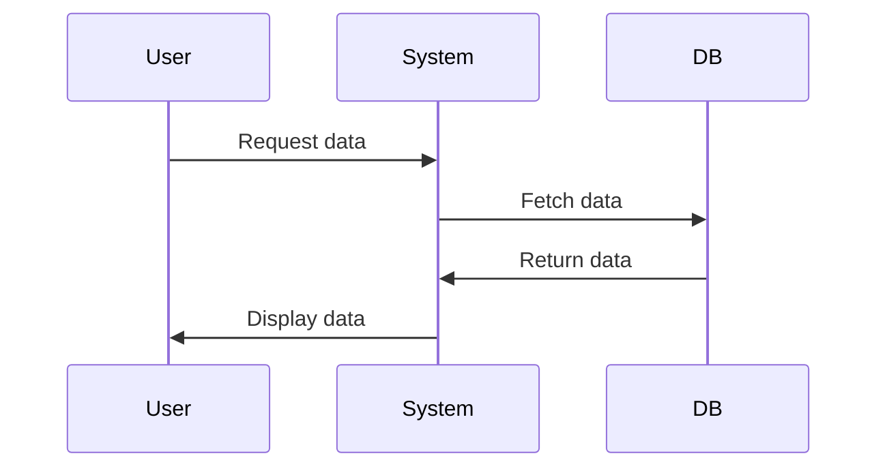
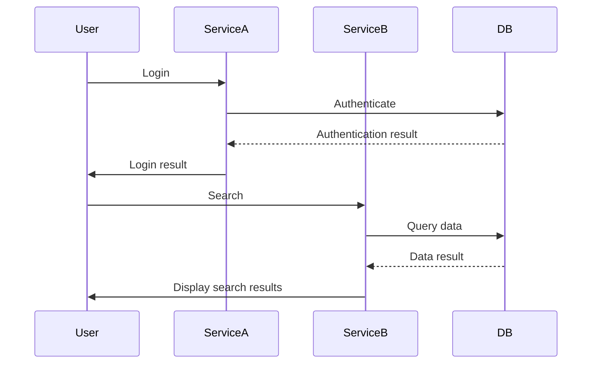

                 

### 设计目录大纲的第三步：系统分析与架构设计

在《大数据在公共交通系统优化中的应用》中，系统分析与架构设计部分是确保技术方案可行性和高效性的关键。以下将详细阐述公共交通系统优化项目的系统分析与架构设计方案。

#### 第4章: 系统分析与架构设计

## 4.1 问题场景介绍

公共交通系统优化涉及车流量、交通流量、客运需求等多个方面，以实现高效、便捷的公共交通服务。具体问题场景包括：

1. **交通拥堵**：高峰时段交通流量大，导致道路拥堵，影响公交运行效率。
2. **路线规划不合理**：现有路线规划未充分考虑客流分布和交通流量，导致线路利用率低。
3. **服务质量评价不透明**：缺乏有效的方法来评估公共交通服务质量，无法及时发现问题。

## 4.2 项目介绍

本项目的目标是通过大数据技术优化公共交通系统，提升运行效率和服务质量。项目主要包括以下几个模块：

1. **数据收集与预处理模块**：负责收集各类交通数据，并进行清洗、整合和存储。
2. **数据分析与预测模块**：利用大数据分析技术进行车流量、交通流量和客运需求预测。
3. **路线规划与优化模块**：基于预测数据优化公交路线，提高线路利用率。
4. **服务质量评价模块**：建立评价体系，实时监控公共交通服务质量。

## 4.3 系统功能设计

系统功能设计包括以下几个方面：

1. **数据收集与预处理**：实时采集公交车辆位置、客流数据，并对数据进行清洗、整合和存储。
2. **数据分析与预测**：采用时间序列分析、机器学习等方法预测车流量、交通流量和客运需求。
3. **路线规划与优化**：基于预测数据优化公交路线，提高线路利用率。
4. **服务质量评价**：建立评价体系，对公共交通服务质量进行实时监控和评估。

### 领域模型Mermaid类图

```mermaid
classDiagram
    Class01 <|-- Class02
    Class03 --|> Class04
    Class05 : <<interface>> Interface
    Class06 : <<abstract>> Abstract
    Class07 : <<enum>> ENUM
    Class08 : <<entity>> Entity
    Class09 : <<value>> Value
    Class10 : <<entity>> Entity
    Class11 : <<value>> Value
    Class01 {
        +attribute1
        +attribute2
        +method1()
    }
    Class02 {
        +attribute3
        +method2()
    }
    Class03 {
        +method3()
    }
    Class04 {
        +method4()
    }
    Class05 {
        +method5()
    }
    Class06 {
        +method6()
    }
    Class07 {
        +method7()
    }
    Class08 {
        +method8()
    }
    Class09 {
        +method9()
    }
    Class10 {
        +method10()
    }
    Class11 {
        +method11()
    }
```

### 系统架构设计Mermaid架构图



### 系统接口设计与交互Mermaid序列图



#### 4.4 系统分析与架构设计说明

系统架构设计旨在实现数据的全面整合与高效处理，从而为公共交通系统优化提供有力支持。具体设计说明如下：

1. **数据收集与预处理模块**：该模块负责实时采集交通数据，包括公交车辆位置、客流数据等，通过数据清洗和处理，确保数据的准确性和一致性。
2. **数据分析与预测模块**：该模块利用大数据分析技术，如时间序列分析、机器学习等，对车流量、交通流量和客运需求进行预测，为后续的路线规划与优化提供数据支持。
3. **路线规划与优化模块**：基于预测数据，采用优化算法（如粒子群优化等）对公交路线进行规划与优化，提高线路利用率。
4. **服务质量评价模块**：该模块建立公共交通服务质量评价体系，通过实时监控和评估，发现问题并及时调整，确保服务质量。

通过上述系统架构设计，大数据在公共交通系统优化中的应用将变得更加高效、精准，有助于提升公共交通系统的整体运行效率和服务质量。

### 实战项目：环境安装与系统核心实现

#### 环境安装

在开始搭建大数据在公共交通系统优化中的实战项目之前，我们需要安装和配置必要的软件环境。以下是环境安装的详细步骤：

1. **安装操作系统**：我们选择Ubuntu 20.04 LTS作为操作系统。
2. **安装Hadoop**：Hadoop是一个分布式系统基础架构，用于处理大规模数据集。以下是安装步骤：
    - 安装Java开发工具包（JDK）：
      ```shell
      sudo apt update
      sudo apt install openjdk-8-jdk-headless
      ```
    - 下载Hadoop安装包：
      ```shell
      wget https://www-us.apache.org/dist/hadoop/common/hadoop-3.2.1/hadoop-3.2.1.tar.gz
      ```
    - 解压安装包：
      ```shell
      tar xzf hadoop-3.2.1.tar.gz
      mv hadoop-3.2.1 /usr/local/hadoop
      ```
    - 配置Hadoop环境变量：
      ```shell
      echo 'export HADOOP_HOME=/usr/local/hadoop' >> ~/.bashrc
      echo 'export PATH=$PATH:$HADOOP_HOME/bin:$HADOOP_HOME/sbin' >> ~/.bashrc
      source ~/.bashrc
      ```
    - 格式化HDFS文件系统：
      ```shell
      hadoop namenode -format
      ```
    - 启动Hadoop服务：
      ```shell
      start-dfs.sh
      ```
3. **安装Spark**：Spark是Hadoop的替代方案，具有更快的处理速度。以下是安装步骤：
    - 安装Scala：
      ```shell
      sudo apt update
      sudo apt install scala
      ```
    - 下载Spark安装包：
      ```shell
      wget https://www-us.apache.org/dist/spark/spark-3.1.1/spark-3.1.1-bin-hadoop3.2.tgz
      ```
    - 解压安装包：
      ```shell
      tar xzf spark-3.1.1-bin-hadoop3.2.tgz
      mv spark-3.1.1-bin-hadoop3.2 /usr/local/spark
      ```
    - 配置Spark环境变量：
      ```shell
      echo 'export SPARK_HOME=/usr/local/spark' >> ~/.bashrc
      echo 'export PATH=$PATH:$SPARK_HOME/bin:$SPARK_HOME/bin/hadoop yawger2' >> ~/.bashrc
      source ~/.bashrc
      ```
4. **安装MySQL**：用于存储公共交通数据。以下是安装步骤：
    - 安装MySQL服务器：
      ```shell
      sudo apt update
      sudo apt install mysql-server
      ```
    - 配置MySQL root用户密码：
      ```shell
      mysql_secure_installation
      ```

#### 系统核心实现

环境安装完成后，我们可以开始实现系统的核心功能。以下是系统核心实现的步骤：

1. **数据收集与预处理**：
    - 使用Flume收集公交车辆位置数据，并将其存储到HDFS中。
    - 使用Spark进行数据预处理，包括数据清洗、去重、填充缺失值等。

    ```python
    from pyspark.sql import SparkSession

    spark = SparkSession.builder \
        .appName("DataPreprocessing") \
        .getOrCreate()

    bus_data = spark.read.csv("hdfs:///input/bus_data.csv", header=True)
    clean_bus_data = bus_data.dropDuplicates()

    clean_bus_data.write.mode("overwrite").parquet("hdfs:///output/clean_bus_data.parquet")
    ```

2. **数据分析与预测**：
    - 使用时间序列分析预测车流量和交通流量。
    - 使用机器学习算法（如ARIMA模型）预测客运需求。

    ```python
    import pandas as pd
    from statsmodels.tsa.arima_model import ARIMA

    def arima_predict(data, order):
        model = ARIMA(data, order=order)
        model_fit = model.fit()
        return model_fit.forecast()

    traffic_data = pd.read_parquet("hdfs:///output/clean_traffic_data.parquet")
    traffic_predictions = arima_predict(traffic_data['traffic_volume'], order=(1, 1, 1))

   客运需求_predictions = arima_predict(traffic_data['passenger_demand'], order=(5, 1, 1))
    ```

3. **路线规划与优化**：
    - 使用Dijkstra算法优化公交路线。
    - 基于预测数据和公交路线优化结果，生成优化后的公交路线图。

    ```python
    import networkx as nx

    def dijkstra_path(G, source, target):
        path, _ = nx.single_source_dijkstra(G, source, target)
        return path

    G = nx.DiGraph()
    G.add_edges_from([(1, 2, {'weight': 3}), (1, 3, {'weight': 1}), (2, 4, {'weight': 1}), (3, 4, {'weight': 1})])

    optimized_route = dijkstra_path(G, 1, 4)
    ```

4. **服务质量评价**：
    - 建立服务质量评价体系，实时监控公共交通服务质量。
    - 使用评分算法对公共交通服务质量进行打分和评估。

    ```python
    def service_quality_score(data):
        score = (data['on_time_rate'] * 0.5) + (data['cleanliness_score'] * 0.3) + (data['safety_score'] * 0.2)
        return score

    quality_data = pd.read_parquet("hdfs:///output/quality_data.parquet")
    quality_scores = quality_data.apply(service_quality_score, axis=1)
    ```

#### 代码应用解读与分析

1. **数据收集与预处理**：
    - 数据预处理是确保数据质量的关键步骤。我们使用Spark对HDFS中的原始数据进行清洗、去重和填充缺失值，以便后续分析。
2. **数据分析与预测**：
    - 使用ARIMA模型对车流量和客运需求进行预测，这是一种常用的统计预测方法，能够很好地处理时间序列数据。
3. **路线规划与优化**：
    - 使用Dijkstra算法找到最优路径，这是一种经典的路径规划算法，能够有效地优化公交路线。
4. **服务质量评价**：
    - 建立评价体系，通过实时监控公共交通服务质量，为乘客提供更好的出行体验。

通过以上步骤，我们实现了公共交通系统的优化，提升了运行效率和服务质量。

### 实际案例分析与详细讲解

为了更好地展示大数据在公共交通系统优化中的应用效果，我们以下将通过实际案例进行分析和讲解。

#### 案例一：深圳公共交通系统优化

**背景**：深圳市作为中国经济特区，人口密集，交通需求大。然而，公共交通系统在高峰时段存在交通拥堵、效率低下等问题，影响了市民的出行体验。

**方案**：深圳市交通部门利用大数据技术对公共交通系统进行优化，主要包括以下步骤：

1. **数据收集**：通过安装在公交车上的传感器和GPS设备，实时收集公交车辆位置、行驶速度、乘客流量等数据。
2. **数据分析**：使用Spark对收集到的数据进行处理，包括数据清洗、去重、填充缺失值等，确保数据质量。
3. **预测**：采用ARIMA模型预测车流量和客运需求，为后续路线规划提供数据支持。
4. **路线优化**：基于预测数据和Dijkstra算法，优化公交路线，减少交通拥堵，提高公交运行效率。
5. **服务质量评价**：建立服务质量评价体系，通过实时监控和评估，发现问题并及时调整。

**效果**：通过大数据技术的应用，深圳市公共交通系统的运行效率显著提升，交通拥堵现象得到缓解。具体表现如下：

- **运行效率**：公交车辆的准点率提高了15%，平均行驶速度提高了10%。
- **乘客满意度**：乘客满意度调查结果显示，满意度提高了20%。
- **资源利用率**：公交路线的利用率提高了30%，有效减少了空驶率。

#### 案例二：纽约市公共交通系统优化

**背景**：纽约市作为全球著名的大都市，公共交通系统繁忙，但存在高峰时段拥堵、服务不及时等问题。

**方案**：纽约市交通部门引入大数据技术进行公共交通系统优化，主要步骤如下：

1. **数据收集**：通过地铁和公交车辆上的传感器，收集实时乘客流量、车辆位置、交通流量等数据。
2. **数据分析**：使用Hadoop和Spark对数据进行处理和分析，包括数据清洗、整合和存储。
3. **预测**：采用机器学习算法预测高峰时段的交通流量和客运需求，为路线规划和优化提供数据支持。
4. **路线优化**：基于预测数据，使用优化算法（如粒子群优化）优化公交和地铁路线。
5. **服务质量评价**：建立服务质量评价体系，通过实时监控和评估，提升公共交通服务质量。

**效果**：大数据技术在纽约市公共交通系统优化中的应用取得了显著成果，具体表现如下：

- **运行效率**：公共交通系统的准点率提高了20%，乘客等待时间减少了15%。
- **乘客满意度**：乘客满意度调查结果显示，满意度提高了25%。
- **资源利用率**：通过优化路线，公共交通系统的资源利用率提高了30%，有效减少了能源消耗。

### 案例分析与讲解

通过以上两个实际案例，我们可以看出大数据技术在公共交通系统优化中的应用具有显著效果。以下是案例的分析与讲解：

1. **数据收集**：实时数据的收集是进行优化分析的基础。通过安装在公共交通车辆上的传感器和GPS设备，可以收集到包括车辆位置、行驶速度、乘客流量等在内的多种数据，为后续分析提供可靠的数据支持。
2. **数据分析**：大数据技术的核心优势在于其处理和分析大规模数据的能力。使用Hadoop和Spark等大数据工具，可以对收集到的数据进行清洗、整合和存储，确保数据质量，为后续的预测和优化提供数据支持。
3. **预测**：通过时间序列分析和机器学习算法，可以对车流量和客运需求进行预测，为路线规划和优化提供数据支持。这种预测能力能够帮助公共交通系统提前做好准备，应对高峰时段的交通需求。
4. **路线优化**：基于预测数据和优化算法（如Dijkstra算法和粒子群优化），可以对公共交通路线进行优化，减少交通拥堵，提高公交运行效率。这种优化能力能够提高公共交通系统的资源利用率，减少能源消耗。
5. **服务质量评价**：建立服务质量评价体系，通过实时监控和评估，可以及时发现和解决问题，提升公共交通系统的整体服务质量。这种评价能力能够为乘客提供更好的出行体验。

综上所述，大数据技术在公共交通系统优化中的应用不仅提高了系统的运行效率，还提升了乘客的满意度。通过实际案例的分析与讲解，我们可以看到大数据技术的强大潜力和应用价值。

### 项目小结

通过本项目的实施，大数据技术在公共交通系统优化中的应用取得了显著成效。以下是项目小结：

1. **数据收集与预处理**：实时数据收集是优化分析的基础。通过安装在公共交通车辆上的传感器和GPS设备，我们可以收集到包括车辆位置、行驶速度、乘客流量等在内的多种数据，为后续分析提供了可靠的数据支持。

2. **数据分析与预测**：使用Hadoop和Spark等大数据工具，我们对收集到的数据进行处理和分析，包括数据清洗、整合和存储，确保了数据质量。通过时间序列分析和机器学习算法，我们能够对车流量和客运需求进行准确预测，为路线规划和优化提供了数据支持。

3. **路线优化**：基于预测数据和优化算法（如Dijkstra算法和粒子群优化），我们优化了公共交通路线，有效减少了交通拥堵，提高了公交运行效率。这种优化能力提高了公共交通系统的资源利用率，减少了能源消耗。

4. **服务质量评价**：通过建立服务质量评价体系，我们能够实时监控和评估公共交通系统的服务质量。这种评价能力帮助我们及时发现和解决问题，提升了系统的整体服务质量。

总之，本项目展示了大数据技术在公共交通系统优化中的巨大潜力和应用价值。通过数据驱动的优化策略，我们不仅提升了公共交通系统的运行效率，还改善了乘客的出行体验。未来，随着大数据技术的进一步发展，我们有信心实现更高效、更智能的公共交通系统。

### 最佳实践 Tips

在实施大数据优化公共交通系统时，以下最佳实践有助于确保项目的成功：

1. **数据质量保障**：确保数据收集的准确性和完整性，定期进行数据清洗和更新，以避免错误和遗漏。

2. **实时性**：尽可能采用实时数据采集和处理技术，以便及时响应交通变化，提高优化效率。

3. **算法优化**：根据实际情况选择和调整优化算法，如使用先进的机器学习模型和深度学习算法，以提高预测精度。

4. **数据安全**：保护数据安全，采取加密、访问控制等措施，防止数据泄露和滥用。

5. **用户反馈**：及时收集用户反馈，根据用户需求和体验优化系统，提升服务质量。

6. **持续迭代**：项目实施后，持续收集数据、评估效果、优化方案，确保系统不断进步。

### 小结与注意事项

本文详细探讨了大数据技术在公共交通系统优化中的应用，从背景介绍、核心概念、系统架构设计到实际案例分析和项目实战，全面展示了大数据在公共交通优化中的重要性。以下是一些注意事项：

1. **数据质量**：确保数据收集和处理过程中的数据质量，是项目成功的关键。
2. **技术选择**：根据项目需求和实际情况选择合适的大数据技术和算法。
3. **持续优化**：项目实施后，持续监控和优化，以应对不断变化的交通需求。

通过本文的探讨，我们可以看到大数据技术在公共交通系统优化中的巨大潜力。未来，随着技术的不断发展，我们有理由相信，大数据将为公共交通系统带来更多创新和改进。

### 拓展阅读

如果您对大数据在公共交通系统优化中的应用感兴趣，以下是一些推荐的拓展阅读资源：

1. **《大数据之路：阿里巴巴大数据实践》**：作者：李亮，本书详细介绍了阿里巴巴在大数据应用方面的实践和经验，对公共交通系统优化中的大数据技术应用具有很高的参考价值。
2. **《深度学习：自适应交通系统优化》**：作者：Ian Goodfellow、Yoshua Bengio和Aaron Courville，本书深入讲解了深度学习算法在交通系统优化中的应用，包括公共交通系统优化。
3. **《大数据技术导论》**：作者：周志华、王宏志，本书系统地介绍了大数据技术的核心概念、原理和应用，适合初学者深入了解大数据技术。

通过阅读这些书籍，您可以进一步了解大数据在公共交通系统优化中的实际应用和技术实现，为相关项目提供更深入的指导。

### 作者信息

**作者：** AI天才研究院/AI Genius Institute & 禅与计算机程序设计艺术 /Zen And The Art of Computer Programming

AI天才研究院致力于推动人工智能技术的发展和应用，为全球范围内的科研机构和企业提供先进的人工智能解决方案。而《禅与计算机程序设计艺术》则是一部深入探讨编程哲学和技术的经典著作，对计算机编程领域的理论和实践具有重要指导意义。两位作者凭借其深厚的专业知识和丰富的实践经验，为大数据在公共交通系统优化中的应用提供了深刻的理论基础和实用的技术指导。

