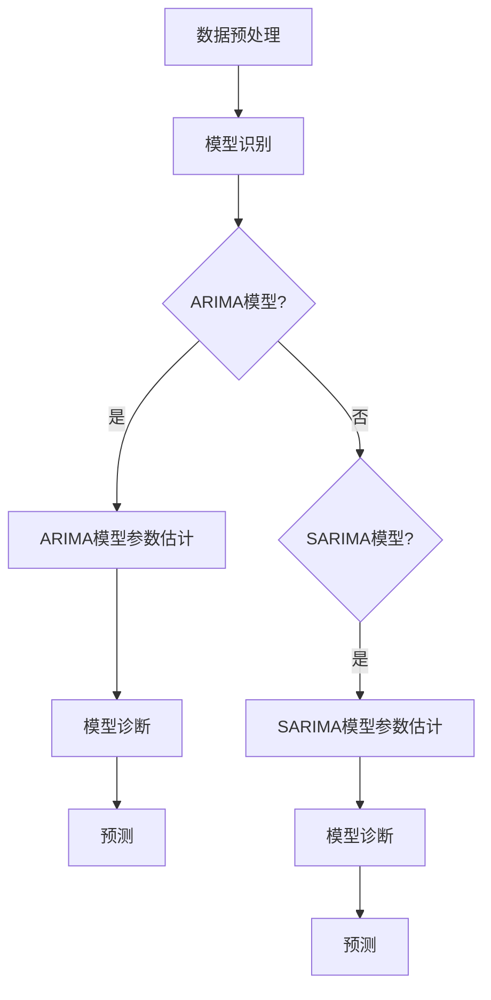
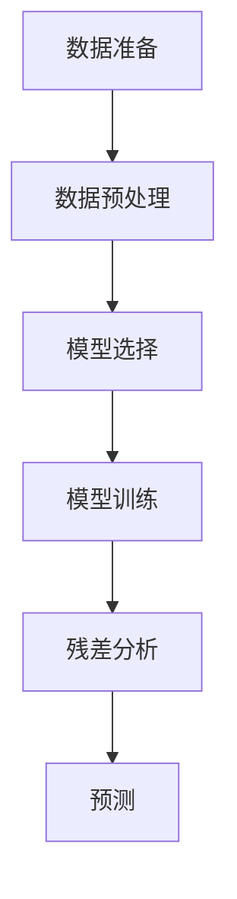
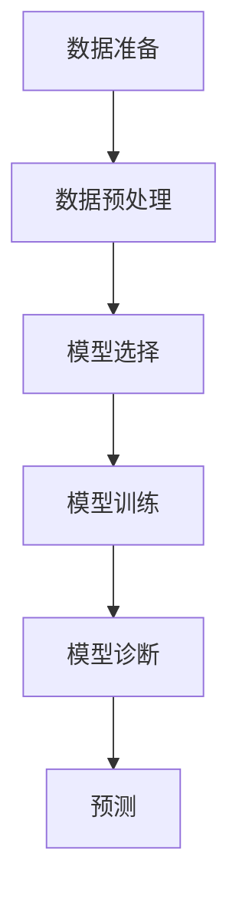
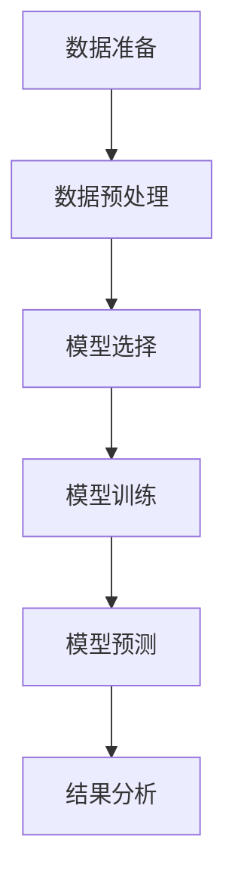
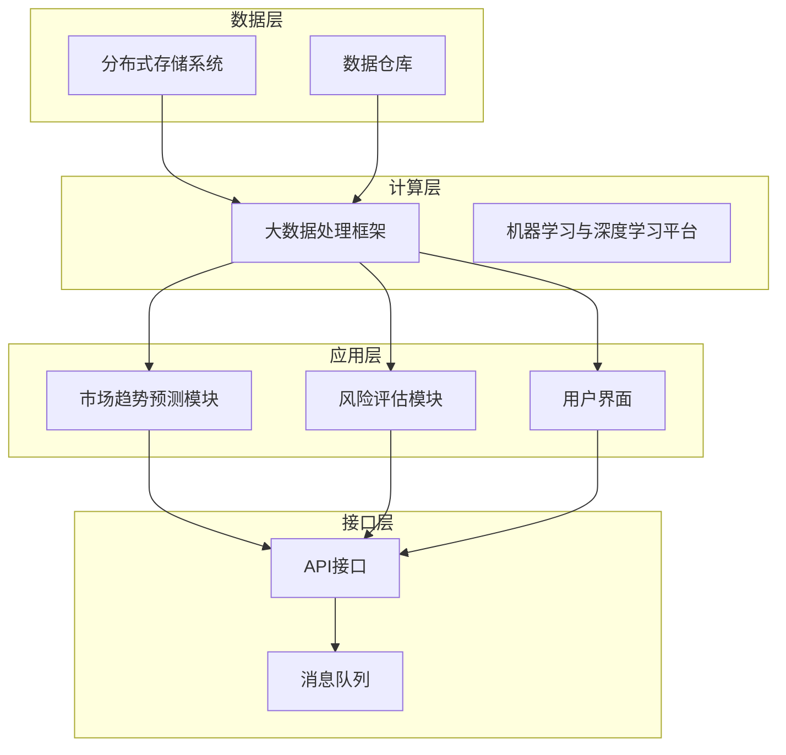
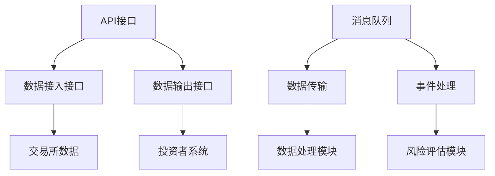
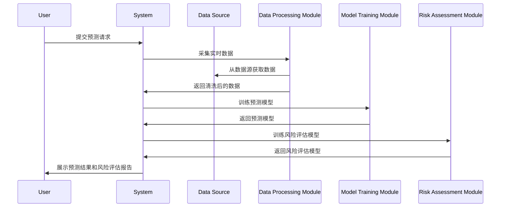

                 

### 引言

在当今快速变化和高度复杂化的金融市场中，金融机构和投资者面临诸多挑战，如瞬息万变的股票价格、动荡的汇率、以及金融市场波动带来的潜在风险。这些挑战不仅要求传统的分析方法和工具不断革新，更呼唤高效的预测与风险管理手段。此时，大数据技术凭借其强大的数据采集、存储、处理和分析能力，成为了金融预测与风险管理的有力工具。

大数据技术在金融市场分析中的应用不仅能够提高预测的准确性，还能提供更全面的风险评估，帮助金融机构在复杂的市场环境中做出更明智的决策。通过分析大量的历史数据、实时数据和外部数据，大数据技术可以帮助识别市场趋势、预测市场变化、发现潜在风险，并制定相应的风险管理策略。

本文将深入探讨大数据在金融市场分析中的应用，分为以下几个部分：

首先，我们将介绍金融市场的复杂性和大数据结合的重要性，说明大数据在金融市场分析中的应用潜力。接着，我们会详细介绍大数据、金融预测和风险管理的基本概念及其相互关系。随后，本文将重点讨论大数据技术在金融市场分析中的核心概念与原理，包括数据存储与管理、数据挖掘与分析、大数据可视化等技术。

接着，我们将深入探讨金融预测技术，介绍时间序列分析、回归分析以及机器学习和深度学习在金融预测中的应用。随后，我们将详细讲解风险管理技术，涵盖风险评估与模型、风险应对策略以及风险监控与预警等内容。

接下来，本文将具体讲解时间序列分析、回归分析和机器学习与深度学习算法的原理，使用Mermaid流程图和Python源代码进行详细阐述。此外，我们还将介绍时间序列分析、回归分析和机器学习与深度学习算法的数学模型和公式，并通过具体例子进行说明。

然后，我们将分析系统架构设计，包括问题场景介绍、系统功能设计、系统架构设计、系统接口设计和系统交互等内容。随后，本文将展示一个实际项目的环境安装、系统核心实现、代码应用解读与分析、实际案例分析与详细讲解剖析等内容。

最后，本文将总结最佳实践和注意事项，并提供拓展阅读资源，以便读者进一步学习。通过本文的深入探讨，我们希望读者能够全面了解大数据在金融市场分析中的应用，掌握相关技术原理和实施方法，为金融领域的实际应用提供有力支持。

### 第一部分：背景介绍

#### 第1章 问题背景与概述

#### 1.1 问题背景

金融市场是一个高度动态和复杂的系统，涉及股票、债券、外汇、期货等多个领域。金融市场的复杂性主要来自于以下几个方面：

1. **市场参与主体的多样性**：金融市场吸引了众多参与者，包括个人投资者、机构投资者、企业、政府等。这些参与者具有不同的投资策略、风险偏好和交易动机，使得市场行为复杂多变。
2. **数据信息的庞杂性**：金融市场每天产生大量的数据，包括交易数据、新闻数据、经济指标数据等。这些数据不仅量大，而且种类繁多，且具有很高的时效性。
3. **市场波动的不确定性**：金融市场受到多种因素的影响，如宏观经济政策、自然灾害、地缘政治事件等。这些因素使得市场波动具有高度不确定性，增加了预测的难度。
4. **监管要求的严格性**：随着金融市场的不断发展，监管机构对金融机构的要求也越来越高。金融机构需要遵守各种法律法规，如反洗钱法、证券交易法等，这增加了市场运作的复杂度。

#### 1.2 问题概述

在这样复杂多变的金融市场中，预测与风险管理成为金融机构和投资者面临的重要挑战。具体来说，金融预测与风险管理的需求主要表现在以下几个方面：

1. **预测市场趋势**：投资者和金融机构需要准确预测市场趋势，以便在正确的时机进行交易，获得更高的收益。
2. **评估风险**：金融机构和投资者需要评估投资组合的风险水平，以便制定合理的风险管理策略，减少潜在的损失。
3. **优化投资决策**：通过分析历史数据和实时数据，投资者可以优化投资组合，选择更优质的资产，提高投资回报。
4. **提高运营效率**：金融机构通过大数据分析，可以优化业务流程，提高运营效率，降低成本。

#### 1.3 大数据与金融市场的结合

大数据技术在金融市场中的应用潜力巨大。具体体现在以下几个方面：

1. **数据量的扩展**：大数据技术能够处理和分析海量数据，使金融机构能够获取更多的信息，提升预测的准确性。
2. **数据类型的多样性**：除了传统的交易数据外，大数据技术还可以处理非结构化数据，如文本、图像、视频等，使金融机构能够更全面地了解市场状况。
3. **实时性的增强**：大数据技术支持实时数据分析和处理，使金融机构能够快速响应市场变化，及时调整投资策略。
4. **预测模型的优化**：大数据技术能够为金融机构提供更精细的数据，帮助构建和优化预测模型，提高预测的准确性。

#### 1.4 大数据在金融预测与风险管理中的应用潜力

大数据在金融预测与风险管理中的应用潜力主要表现在以下几个方面：

1. **提高预测准确性**：通过分析大量的历史数据和实时数据，大数据技术能够更准确地预测市场趋势和风险变化，帮助金融机构做出更明智的决策。
2. **优化风险管理策略**：大数据技术可以帮助金融机构更全面地评估风险，制定更有效的风险管理策略，减少潜在损失。
3. **提升投资效率**：通过精准的预测和风险管理，金融机构可以更高效地管理投资组合，提高投资回报。
4. **提高市场透明度**：大数据技术能够更全面地揭示市场信息，提高市场的透明度，帮助投资者做出更明智的投资决策。

#### 1.5 边界与外延

在讨论大数据在金融市场分析中的应用时，有必要明确金融市场的范围与数据来源，以及预测与风险管理的具体目标。

1. **金融市场的范围与数据来源**：
   - **股票市场**：包括上市公司的交易数据、财务报告、宏观经济数据等。
   - **债券市场**：包括债券的交易数据、发行量、利率等。
   - **外汇市场**：包括汇率交易数据、国际经济指标等。
   - **期货市场**：包括期货交易数据、相关商品的价格波动等。

   数据来源不仅包括传统的交易数据，还包括社交媒体数据、新闻数据、经济指标数据等。

2. **预测与风险管理的具体目标**：
   - **市场趋势预测**：通过分析历史数据和实时数据，预测股票价格、汇率、利率等市场指标的走势。
   - **风险度量**：评估投资组合的风险水平，包括市场风险、信用风险、操作风险等。
   - **风险评估**：基于历史数据和实时数据，评估不同投资策略的风险收益特征。
   - **风险应对策略**：制定风险管理策略，包括风险分散、风险对冲、风险规避等。

通过上述分析，我们可以看到大数据技术在金融市场分析中扮演着至关重要的角色。它不仅为金融机构提供了强大的数据分析工具，还极大地提升了预测与风险管理的效率和准确性。接下来的章节将进一步探讨大数据、金融预测和风险管理的基本概念及其应用，为深入理解这一领域奠定基础。

#### 第2章 核心概念与联系

#### 2.1 大数据概念

大数据是指那些数据量巨大、类型多样、生成速度快且价值密度低的复杂数据集。其基本特征可以概括为4V，即Volume（数据量）、Velocity（速度）、Variety（多样性）和Veracity（真实性）。

1. **数据量（Volume）**：大数据的核心特征之一是数据量的庞大。传统的数据库系统难以处理如此庞大的数据量，因此需要分布式存储和处理技术，如Hadoop和Spark等。
2. **速度（Velocity）**：大数据的生成速度非常快，例如，股票交易市场每秒产生数百万条交易记录。因此，处理和响应这些数据的速度至关重要，实时分析成为大数据应用的关键。
3. **多样性（Variety）**：大数据不仅包括结构化数据（如数据库中的数据），还包括非结构化数据（如文本、图像、音频、视频等）。这种多样性要求数据处理的灵活性。
4. **真实性（Veracity）**：大数据的真实性指的是数据的真实性和准确性。由于数据来源的多样性，如何确保数据的质量成为大数据处理中的重要问题。

#### 数据来源与类型

大数据的来源非常广泛，主要包括以下几类：

1. **结构化数据**：这些数据通常存储在数据库中，例如企业的客户信息、交易记录等。
2. **半结构化数据**：这类数据具有部分结构化特征，例如日志文件、XML数据等。
3. **非结构化数据**：这类数据没有固定的结构，例如文本、图像、视频等。

在金融市场分析中，数据类型主要包括：

1. **交易数据**：包括股票、债券、外汇等金融工具的交易记录，如交易价格、交易量、交易时间等。
2. **宏观经济数据**：如GDP、通货膨胀率、失业率等宏观经济指标。
3. **新闻数据**：包括新闻报道、社交媒体帖子等，可以反映市场情绪。
4. **公司财务数据**：如财务报表、盈利预测等，反映公司的经营状况。

#### 金融预测

金融预测是指利用历史数据和市场信息，预测未来金融市场走势的一种分析方法。其基本原理是基于历史规律和市场行为来预测未来。

1. **时间序列分析**：时间序列分析是一种常用的金融预测方法，通过分析历史价格和时间序列数据，预测未来的价格走势。常见的时间序列模型有ARIMA模型、SARIMA模型等。
2. **回归分析**：回归分析通过建立变量之间的关系模型，预测因变量的值。在金融预测中，常用的回归模型有线性回归、非线性回归等。
3. **机器学习与深度学习**：机器学习与深度学习通过建立复杂的预测模型，从大量历史数据中学习规律，预测未来价格。常见的模型有支持向量机、决策树、随机森林、神经网络等。

#### 数据分析与模型构建

数据分析是金融预测的关键步骤，通过数据清洗、数据预处理和特征工程，将原始数据转换为可用于预测的特征。具体步骤包括：

1. **数据清洗**：去除数据中的噪声和异常值，确保数据质量。
2. **数据预处理**：包括数据标准化、归一化、缺失值处理等，使数据适合建模。
3. **特征工程**：通过选择和构造特征，提高预测模型的性能。特征可以是原始数据衍生出的统计指标、技术指标等。

模型构建是金融预测的核心，通过选择合适的模型和训练方法，建立预测模型。常见的方法包括：

1. **统计模型**：如线性回归、逻辑回归等，适合简单的关系建模。
2. **机器学习模型**：如支持向量机、决策树、随机森林等，适合复杂的关系建模。
3. **深度学习模型**：如卷积神经网络、循环神经网络、长短期记忆网络等，适合处理大规模复杂数据。

#### 风险管理

风险管理是指金融机构通过识别、评估、监控和应对风险，以减少潜在损失的一种管理活动。风险管理的基本步骤包括：

1. **风险评估**：评估风险的性质和程度，确定风险类型和风险水平。
2. **风险应对策略**：根据风险评估结果，制定风险应对策略，如风险分散、风险对冲、风险规避等。
3. **风险监控**：持续监控风险变化，确保风险应对策略的有效性。
4. **风险报告**：定期报告风险管理情况，为决策提供支持。

#### 风险管理类型

风险管理可以分为以下几种类型：

1. **市场风险**：由于市场价格波动导致的风险，如股票价格波动、利率波动等。
2. **信用风险**：由于债务人违约导致的风险，如贷款违约、债券违约等。
3. **操作风险**：由于内部操作失误、系统故障等导致的风险，如交易错误、欺诈行为等。
4. **流动性风险**：由于资金流动性不足导致的风险，如无法及时满足资金需求。

#### 大数据与金融预测、风险管理的联系

大数据技术为金融预测和风险管理提供了强大的工具和方法。具体表现在以下几个方面：

1. **数据整合与挖掘**：大数据技术能够整合和分析多种数据源，提取有价值的信息，为金融预测和风险管理提供支持。
2. **模型优化与应用**：大数据技术可以帮助金融机构优化预测模型和风险管理策略，提高预测准确性和风险应对能力。
3. **实时监控与预警**：大数据技术支持实时数据处理和分析，可以帮助金融机构快速响应市场变化，实施风险预警机制。

综上所述，大数据技术在金融预测和风险管理中发挥了重要作用。通过大数据技术，金融机构可以更准确地预测市场趋势，更全面地评估和管理风险，从而在复杂多变的金融市场中获得竞争优势。

#### 第3章 大数据技术

##### 3.1 数据存储与管理

在处理大数据时，数据存储与管理是一个关键问题。随着数据量的不断增长，传统的集中式存储系统已经难以满足需求，分布式存储系统成为主流选择。

**分布式存储系统**：
分布式存储系统通过将数据分散存储在多个节点上，实现数据的横向扩展。其主要优势包括：

1. **高可用性**：分布式存储系统通过数据冗余和节点冗余，确保系统的高可用性。即使某些节点发生故障，系统仍然可以正常运行。
2. **高性能**：分布式存储系统通过并行处理，提高数据读写速度，满足大数据的高吞吐量需求。
3. **可扩展性**：分布式存储系统可以轻松扩展存储容量，以适应不断增长的数据需求。

**数据库与数据仓库**：
数据库和数据仓库在大数据管理中扮演着重要角色。

**数据库**：
数据库用于存储和管理结构化数据，如关系型数据库（如MySQL、PostgreSQL）和非关系型数据库（如MongoDB、Cassandra）。关系型数据库通过表与表之间的关联，实现数据的高效管理和查询。非关系型数据库则通过键值对、文档、图形等方式存储数据，具有更高的灵活性和扩展性。

**数据仓库**：
数据仓库是一个集成的数据存储系统，用于支持企业的数据分析和决策支持。数据仓库通过ETL（Extract, Transform, Load）过程，将来自多个源的数据整合到统一的存储环境中。常见的数据仓库技术包括：

1. **数据抽取**：将分散的数据源抽取到数据仓库中，包括结构化数据（如数据库）、半结构化数据（如日志文件）和非结构化数据（如文本、图像）。
2. **数据清洗**：清洗和整理抽取的数据，去除噪声和异常值，确保数据质量。
3. **数据集成**：将来自不同源的数据进行整合，形成统一的数据视图。
4. **数据建模**：通过数据建模，将数据组织成适合分析的形式，如星型模型、雪花模型等。

**数据湖**：
数据湖是一种新兴的数据存储架构，与传统数据仓库不同，数据湖以原始格式存储大量数据，无需预先定义结构。数据湖适用于存储和处理大规模的非结构化数据，如社交媒体数据、物联网数据等。数据湖的优势包括：

1. **灵活性**：数据湖支持多种数据类型，无需预先定义结构，用户可以根据实际需求进行数据分析和处理。
2. **可扩展性**：数据湖能够轻松扩展存储容量，以适应不断增长的数据需求。
3. **低成本**：数据湖通常采用分布式存储技术，具有较低的成本。

##### 3.2 数据挖掘与分析

数据挖掘是大数据分析的重要环节，旨在从大量数据中发现有价值的信息和模式。数据挖掘过程通常包括以下步骤：

**数据预处理**：
数据预处理是数据挖掘的第一步，包括数据清洗、数据集成、数据变换和数据归一化等。其主要目标是去除噪声和异常值，提高数据质量，确保数据的一致性和完整性。

**特征工程**：
特征工程是数据挖掘的关键步骤，通过选择和构造特征，提高模型的预测性能。特征工程包括以下方面：

1. **特征选择**：选择对预测目标有重要影响的关键特征。
2. **特征构造**：通过衍生指标、技术指标等，构造新的特征。
3. **特征标准化**：对特征进行归一化或标准化处理，使其具有相似的尺度。

**建模与评估**：
建模与评估是数据挖掘的核心步骤，通过选择合适的模型和评估方法，建立预测模型并进行性能评估。常见的数据挖掘方法包括：

1. **分类**：将数据分为不同的类别，如逻辑回归、决策树、随机森林等。
2. **回归**：预测连续变量的值，如线性回归、非线性回归等。
3. **聚类**：将数据分为不同的簇，如K-means、层次聚类等。
4. **关联规则**：发现数据之间的关联关系，如Apriori算法、FP-growth等。

**模型优化**：
模型优化是提高模型预测性能的重要步骤，包括以下方面：

1. **模型选择**：选择合适的模型，通过交叉验证等方法评估模型性能。
2. **参数调优**：调整模型参数，以提高模型的预测准确性。
3. **集成学习**：将多个模型集成，提高预测性能，如Bagging、Boosting等。

##### 3.3 大数据可视化

大数据可视化是将大量数据以图形化的形式呈现，帮助用户更好地理解和分析数据。大数据可视化包括以下方面：

**数据可视化工具**：
数据可视化工具如Tableau、PowerBI、D3.js等，可以帮助用户快速创建各种类型的可视化图表，如柱状图、折线图、饼图、散点图等。

**可视化技巧**：
大数据可视化需要运用多种可视化技巧，以呈现数据的不同维度和特征。常见的可视化技巧包括：

1. **交互式可视化**：通过交互操作，如筛选、排序、过滤等，用户可以动态地探索数据，发现有价值的信息。
2. **层次化可视化**：通过层次化的结构，将复杂的数据分解为多个层次，使用户能够更清晰地理解数据。
3. **多维度可视化**：将多个维度的数据以不同的图表形式呈现，帮助用户发现数据之间的关联关系。
4. **可视化分析**：通过数据可视化，结合数据分析方法，对数据进行深入分析，发现数据背后的规律和趋势。

**可视化应用**：
大数据可视化在金融市场中具有广泛的应用，如：

1. **市场趋势分析**：通过可视化工具，分析股票价格、汇率等市场指标的走势，发现市场趋势和变化。
2. **风险监控**：通过可视化工具，监控投资组合的风险水平，及时发现潜在风险并采取措施。
3. **客户行为分析**：通过可视化工具，分析客户交易行为和市场反应，发现客户偏好和需求，优化营销策略。

通过数据存储与管理、数据挖掘与分析以及大数据可视化，大数据技术为金融预测与风险管理提供了强大的工具和方法。这些技术不仅提高了数据处理的效率，还帮助金融机构更准确地预测市场走势和风险管理，从而在复杂多变的金融市场中获得竞争优势。

#### 第4章 金融预测技术

##### 4.1 时间序列分析

时间序列分析是金融预测中的一种基本方法，它通过分析时间序列数据中的趋势、周期性和季节性等特征，预测未来的值。时间序列分析广泛应用于股票价格预测、利率预测、汇率预测等领域。

**基本概念与方法**

时间序列分析的基本概念包括：

1. **趋势**：数据随时间呈现的总体上升或下降趋势。
2. **季节性**：数据在一年内重复出现的周期性波动。
3. **周期性**：数据在较长时间范围内（如数年）呈现的波动。
4. **随机性**：数据中的随机波动，无法用模型解释的部分。

常见的时间序列分析方法包括：

1. **移动平均法**：通过计算一段时间内的平均值，平滑时间序列数据，去除短期波动，保留长期趋势。
   - **简单移动平均（SMA）**：计算最近n个时间点的平均值。
   - **加权移动平均（WMA）**：对每个时间点的权重进行加权处理。
2. **指数平滑法**：对时间序列数据进行加权处理，更关注近期数据，减少历史数据的滞后影响。
   - **一次指数平滑（SES）**：计算最近一期数据的加权平均值。
   - **二次指数平滑（Holt）**：结合趋势和平滑项，进一步考虑时间序列的趋势。
   - **三次指数平滑（Holt-Winters）**：结合季节性因素，对时间序列进行建模。
3. **ARIMA模型**：自回归积分滑动平均模型，通过自回归、差分和移动平均步骤，建模时间序列数据。
   - **自回归（AR）**：当前值与之前值的线性组合。
   - **差分**：对时间序列数据进行差分，去除趋势和季节性。
   - **移动平均（MA）**：当前值与未来值的线性组合。

**模型构建与优化**

时间序列分析模型的构建与优化过程通常包括以下步骤：

1. **数据预处理**：包括数据清洗、缺失值处理和季节性调整等，确保数据质量。
2. **模型选择**：根据数据特征选择合适的模型，如移动平均模型、指数平滑模型或ARIMA模型。
3. **参数估计**：通过最大似然估计或其他方法，估计模型参数。
4. **模型诊断**：通过残差分析、自相关图等诊断工具，评估模型拟合效果，调整模型参数。
5. **模型优化**：通过交叉验证、网格搜索等方法，选择最佳模型参数，提高模型预测性能。

**案例应用**

时间序列分析在金融预测中的应用案例包括：

1. **股票价格预测**：通过分析历史股价数据，预测未来股票价格走势。
   - **案例**：使用ARIMA模型对某股票的历史收盘价进行建模，预测未来5个交易日的收盘价。通过残差分析和自相关图诊断，调整模型参数，提高预测准确性。

2. **汇率预测**：通过分析历史汇率数据，预测未来汇率走势。
   - **案例**：使用Holt-Winters模型对美元/欧元汇率进行建模，考虑季节性因素，预测未来一年的汇率走势。通过模型诊断和优化，提高预测准确性。

3. **利率预测**：通过分析历史利率数据，预测未来利率走势。
   - **案例**：使用移动平均模型和指数平滑模型对国债收益率进行建模，预测未来利率变化。通过模型比较和优化，选择最佳模型，提高预测准确性。

时间序列分析作为一种有效的金融预测方法，通过分析历史数据中的趋势、周期性和季节性特征，能够提供准确的预测结果，帮助金融机构和投资者做出更明智的决策。

##### 4.2 回归分析

回归分析是金融预测中的另一项重要技术，通过建立变量之间的关系模型，预测未来值。回归分析广泛应用于股票价格预测、消费者需求预测、市场趋势预测等领域。

**基本原理**

回归分析的基本原理是通过分析自变量（解释变量）和因变量（响应变量）之间的关系，建立数学模型，预测因变量的值。回归分析可以分为以下几种类型：

1. **线性回归**：自变量和因变量之间存在线性关系，通过建立线性模型，预测因变量的值。
2. **非线性回归**：自变量和因变量之间存在非线性关系，通过建立非线性模型，预测因变量的值。
3. **多元回归**：涉及多个自变量和因变量之间的关系，通过建立多元线性或非线性模型，预测因变量的值。

**线性回归**

线性回归是一种简单且常见的回归分析方法，其基本原理是通过最小化残差平方和，找到自变量和因变量之间的最佳拟合直线。线性回归模型的一般形式为：

\[ Y = \beta_0 + \beta_1X + \epsilon \]

其中，\( Y \) 是因变量，\( X \) 是自变量，\( \beta_0 \) 是截距，\( \beta_1 \) 是斜率，\( \epsilon \) 是误差项。

1. **线性回归模型**：
   - 线性回归模型通过建立一条直线，将自变量和因变量之间的关系进行量化。直线的斜率 \( \beta_1 \) 反映了自变量对因变量的影响程度。
   - 线性回归模型适合简单的关系建模，但当自变量和因变量之间存在非线性关系时，线性回归可能不适用。

2. **最小二乘法**：
   - 最小二乘法是一种常用的参数估计方法，通过最小化残差平方和，找到最佳拟合直线。残差是实际观测值与模型预测值之间的差异。
   - 最小二乘法的公式为：\( \beta = (X^T X)^{-1} X^T Y \)，其中 \( X \) 是设计矩阵，\( Y \) 是观测向量，\( \beta \) 是参数向量。

**非线性回归**

非线性回归通过建立非线性模型，处理自变量和因变量之间的非线性关系。常见的非线性回归模型包括：

1. **多项式回归**：通过多项式函数，如二次多项式、三次多项式等，建立非线性关系。
   - 多项式回归的一般形式为：\( Y = \beta_0 + \beta_1X + \beta_2X^2 + \epsilon \)。
   - 多项式回归可以处理更复杂的非线性关系，但参数估计可能更加复杂。

2. **指数回归**：通过指数函数，如对数函数、指数函数等，建立非线性关系。
   - 指数回归的一般形式为：\( Y = \beta_0 + \beta_1\ln(X) + \epsilon \)。
   - 指数回归常用于处理增长或衰减关系。

**模型应用与解释**

回归分析在金融预测中的应用广泛，以下是一些常见的应用场景：

1. **股票价格预测**：通过分析历史股价和交易量等数据，建立回归模型，预测未来股票价格。
   - **案例**：使用线性回归模型，分析某股票的历史收盘价和交易量，预测未来股票价格。通过调整模型参数和优化，提高预测准确性。

2. **消费者需求预测**：通过分析历史销售数据和影响因素，建立回归模型，预测未来消费者需求。
   - **案例**：使用多元回归模型，分析某产品的历史销售量和影响因素（如广告支出、季节性因素等），预测未来销售量。通过模型优化和参数调整，提高预测性能。

3. **市场趋势预测**：通过分析历史市场数据和宏观经济指标，建立回归模型，预测市场走势。
   - **案例**：使用非线性回归模型，分析股票市场指数和宏观经济指标，预测市场走势。通过调整模型参数和优化，提高预测准确性。

回归分析作为一种基本的金融预测方法，通过建立变量之间的关系模型，能够提供有效的预测结果。线性回归适用于简单线性关系，非线性回归适用于更复杂的非线性关系。通过合理选择模型和应用方法，回归分析在金融预测中具有重要的应用价值。

##### 4.3 机器学习与深度学习

机器学习与深度学习是金融预测中的前沿技术，它们通过构建复杂的预测模型，从大量历史数据中学习规律，提高预测准确性。机器学习与深度学习在金融预测中的应用包括股票价格预测、风险评估、市场趋势预测等。

**基本原理**

1. **机器学习**：
   机器学习是一种基于数据的预测方法，通过从训练数据中学习规律，建立预测模型。机器学习可以分为以下几种类型：
   - **监督学习**：通过标记的训练数据，学习输入与输出之间的映射关系，如线性回归、决策树等。
   - **无监督学习**：没有标记的数据，通过聚类、降维等方法，发现数据中的潜在结构，如K-means、PCA等。
   - **强化学习**：通过与环境的交互，学习最优策略，如Q-learning、Deep Q-Network（DQN）等。

2. **深度学习**：
   深度学习是机器学习的一个子领域，通过构建多层神经网络，学习数据中的复杂特征。深度学习的基本原理是模拟人脑神经元的工作方式，通过逐层提取特征，实现复杂的数据建模。深度学习可以分为以下几种类型：
   - **深度神经网络（DNN）**：由多层神经元组成，通过反向传播算法训练模型，如全连接神经网络（FCNN）。
   - **卷积神经网络（CNN）**：通过卷积操作，提取图像等数据中的局部特征，广泛应用于图像识别、视频分析等。
   - **循环神经网络（RNN）**：通过循环结构，处理序列数据，如时间序列分析、语音识别等。
   - **长短期记忆网络（LSTM）**：是RNN的一种改进，通过记忆单元，处理长时间依赖问题，如语言模型、时间序列预测等。

**模型训练与评估**

机器学习与深度学习模型的训练与评估过程包括以下步骤：

1. **数据准备**：包括数据清洗、数据预处理和特征工程，确保数据质量。
2. **模型选择**：根据数据特征和预测目标，选择合适的模型，如线性回归、决策树、随机森林、神经网络等。
3. **模型训练**：通过训练数据，调整模型参数，使模型学习数据中的规律。训练过程中，常用的算法包括梯度下降、随机梯度下降、Adam优化器等。
4. **模型评估**：通过测试数据，评估模型性能，常用的评估指标包括准确率、召回率、F1分数、均方误差（MSE）等。

**模型优化**

模型优化是提高模型预测性能的重要步骤，包括以下方面：

1. **参数调优**：通过调整模型参数，如学习率、批量大小、正则化参数等，提高模型性能。
2. **特征工程**：通过选择和构造特征，提高模型对数据的表达能力。
3. **集成学习**：将多个模型集成，提高预测性能，常用的集成方法有Bagging、Boosting、Stacking等。
4. **迁移学习**：利用预训练模型，对新的任务进行迁移学习，提高模型性能。

**案例应用**

机器学习与深度学习在金融预测中的应用案例包括：

1. **股票价格预测**：
   - **案例**：使用LSTM模型，分析历史股票价格数据，预测未来股票价格。通过调整模型参数和优化，提高预测准确性。实际应用中，LSTM模型在预测股票价格方面表现出色，但需要注意模型过拟合问题。

2. **风险评估**：
   - **案例**：使用随机森林模型，分析历史交易数据和公司财务数据，评估信用风险。通过模型训练和评估，确定不同风险因素对公司信用评分的影响，为风险决策提供支持。

3. **市场趋势预测**：
   - **案例**：使用CNN模型，分析历史股票交易数据和新闻数据，预测市场趋势。通过结合图像处理和文本分析技术，CNN模型能够从多种数据源中提取有效特征，提高预测性能。

机器学习与深度学习在金融预测中发挥了重要作用，通过构建复杂的预测模型，从大量历史数据中学习规律，能够提供更准确的预测结果。然而，需要注意的是，模型的选择和优化是关键，过拟合和欠拟合问题是需要关注的主要挑战。

#### 第5章 风险管理技术

##### 5.1 风险评估与模型

风险管理中的第一个关键步骤是风险评估。风险评估是指对潜在的金融风险进行识别、分析和评估，以确定其性质、程度和可能的影响。风险评估的目的是为金融机构提供决策支持，以便采取适当的风险应对措施。

**风险评估方法**

1. **定性风险评估**：定性风险评估主要通过专家评估、情景分析和历史数据等方法进行。定性评估方法侧重于评估风险的发生概率和影响程度，通常用于初步识别和评估风险。

2. **定量风险评估**：定量风险评估通过数学模型和统计方法对风险进行量化分析。定量评估方法可以提供更精确的风险估计，为制定风险管理策略提供依据。

以下是一些常见的定量风险评估方法：

1. **VaR（Value at Risk）模型**：VaR模型是一种用于评估金融市场潜在损失的量化方法。VaR模型基于历史数据或假设的统计分布，计算在特定置信水平下，某一金融资产或投资组合的最大可能损失。VaR模型可以分为以下几种类型：

   - **单期VaR**：计算单期（如一天、一周或一个月）的潜在损失。
   - **多期VaR**：考虑多期因素，如市场波动、流动性变化等，计算长期潜在损失。

2. **CVaR（Conditional Value at Risk）模型**：CVaR模型，也称为期望短falls模型，是在VaR模型的基础上，进一步考虑风险损失的概率分布。CVaR模型不仅计算最大可能损失，还考虑了不同损失发生概率下的期望损失。CVaR模型可以分为以下几种类型：

   - **期望短falls CVaR**：计算在VaR水平上的期望损失。
   - **分位数 CVaR**：计算在特定分位数水平上的期望损失。

3. **蒙特卡罗模拟**：蒙特卡罗模拟是一种通过随机模拟计算风险的方法。蒙特卡罗模拟通过模拟大量可能的未来情景，计算风险的概率分布和期望值。蒙特卡罗模拟适用于复杂的市场环境，如金融衍生品定价和风险管理。

4. **情景分析**：情景分析是一种通过构建不同的市场情景，评估市场变化对投资组合风险的影响。情景分析可以帮助金融机构了解不同市场情景下的风险水平，为风险管理提供决策支持。

**风险评估步骤**

风险评估通常包括以下步骤：

1. **风险识别**：识别潜在的金融风险，如市场风险、信用风险、操作风险等。
2. **风险分析**：分析风险的性质、发生概率和潜在影响。
3. **风险评估**：使用定量和定性方法，对风险进行量化评估。
4. **风险优先级排序**：根据风险评估结果，对风险进行优先级排序，确定重点管理和控制的风险。
5. **风险应对策略**：制定风险应对策略，如风险分散、风险对冲、风险规避等。

**风险模型构建与应用**

1. **风险模型构建**：风险模型是风险评估的核心，用于量化风险因素和计算风险值。常见的风险模型包括VaR模型、CVaR模型、蒙特卡罗模拟等。

   - **VaR模型构建**：通过历史数据或假设的统计分布，构建VaR模型。模型构建包括数据准备、参数估计、模型验证等步骤。
   - **CVaR模型构建**：在VaR模型的基础上，结合风险的概率分布，构建CVaR模型。CVaR模型构建也涉及数据准备、参数估计和模型验证。
   - **蒙特卡罗模拟构建**：通过模拟大量可能的未来情景，构建蒙特卡罗模拟模型。模型构建包括情景生成、模拟计算、结果分析等步骤。

2. **风险模型应用**：风险模型应用于实际风险管理，包括以下方面：

   - **风险评估与监控**：使用风险模型，定期评估投资组合的风险水平，监控风险变化。
   - **风险决策支持**：基于风险模型的结果，为金融机构提供风险决策支持，如调整投资策略、制定风险管理策略等。
   - **风险报告与合规性**：生成风险报告，确保金融机构遵守相关法律法规和监管要求。

风险评估与模型是风险管理中的关键环节，通过定量和定性方法，对风险进行识别、分析和评估，为金融机构提供决策支持。常见的风险评估方法包括VaR模型、CVaR模型、蒙特卡罗模拟等。风险模型构建与应用是风险评估的核心，通过科学的方法和工具，提高风险评估的准确性和有效性。

##### 5.2 风险应对策略

在识别和评估了潜在风险后，金融机构需要制定相应的风险应对策略，以降低风险的可能性和影响。风险应对策略可以分为以下几种类型：

**风险分散**：

1. **定义**：风险分散是指通过在多个不同的资产、投资组合或市场分散投资，降低特定资产或市场的风险。
2. **方法**：
   - **资产分散**：投资于不同的资产类别，如股票、债券、房地产等，以减少单一资产类别波动的影响。
   - **投资组合分散**：在特定资产类别内，投资于多个不同的资产，以减少个别资产的波动对整个投资组合的影响。
   - **市场分散**：投资于不同市场和地区，以降低特定市场或地区风险的影响。
3. **优点**：通过风险分散，金融机构可以降低投资组合的整体波动性和潜在损失，提高风险承受能力。

**风险对冲**：

1. **定义**：风险对冲是指通过采取对冲工具，如衍生品、期权、期货等，降低或消除特定风险的影响。
2. **方法**：
   - **衍生品对冲**：通过购买或出售金融衍生品，如期货、期权、互换等，对冲特定风险。例如，购买股票期权对冲股票价格下跌的风险。
   - **流动性对冲**：通过增加现金储备或流动性工具，如短期国债、货币市场基金等，对冲流动性风险。
3. **优点**：风险对冲可以在不改变投资组合收益的情况下，降低特定风险的影响，提高风险管理能力。

**风险规避**：

1. **定义**：风险规避是指通过避免或拒绝承担特定风险，以保护金融机构免受损失。
2. **方法**：
   - **业务转移**：通过转移业务或业务流程，避免特定风险。例如，将业务外包给其他公司，以减少操作风险。
   - **投资决策规避**：通过不投资于高风险资产或市场，避免承担特定风险。
3. **优点**：风险规避可以有效地避免潜在损失，但可能影响投资组合的收益和机会。

**风险转移**：

1. **定义**：风险转移是指通过将风险转移到第三方，如保险公司、担保公司等，降低金融机构的风险承担。
2. **方法**：
   - **保险**：通过购买保险产品，将特定风险转移给保险公司。
   - **担保**：通过担保合同，将风险转移给担保方。
3. **优点**：风险转移可以减轻金融机构的风险负担，提高风险分散能力。

**风险缓解**：

1. **定义**：风险缓解是指通过采取措施，降低或减少风险发生概率和影响。
2. **方法**：
   - **内部控制**：建立内部控制体系，加强风险管理流程，降低操作风险。
   - **技术改进**：通过技术创新和改进，提高风险识别和监控能力。
   - **员工培训**：提高员工的风险意识和风险管理能力，减少操作失误和风险事件。
3. **优点**：风险缓解可以有效地降低风险发生概率和影响，提高风险管理效果。

**风险应对策略的选择与实施**

1. **策略选择**：根据风险评估结果，选择适合的风险应对策略。风险分散、风险对冲和风险规避适用于不同类型的风险，如市场风险、信用风险等。风险转移和风险缓解则适用于降低特定风险的影响。
2. **实施方法**：
   - **制定风险管理计划**：明确风险应对策略的目标、措施和实施步骤。
   - **资源配置**：合理配置资源，确保风险应对策略的有效实施。
   - **监控与评估**：定期监控风险应对策略的实施效果，评估风险管理成效，及时调整策略。

通过科学的风险应对策略，金融机构可以在复杂多变的金融市场中降低风险，确保业务的稳健运行。风险分散、风险对冲、风险规避、风险转移和风险缓解等策略相互配合，为金融机构提供了全面的风险管理工具，从而提高风险管理的效率和有效性。

##### 5.3 风险监控与预警

在金融市场中，实时监控和预警风险是风险管理的重要组成部分。通过有效的风险监控和预警系统，金融机构可以及时发现潜在风险，并采取相应的措施进行风险控制和应对。以下将介绍风险监控与预警的主要方法、实时监控与预警系统，以及风险管理中的合规性和持续优化。

**主要方法**

1. **数据监控**：数据监控是风险监控的基础，通过对市场数据、交易数据和内部操作数据的实时监控，可以识别异常交易、市场异常波动等风险信号。
2. **异常检测**：异常检测方法包括统计方法、机器学习方法等，用于识别数据中的异常值和异常模式。常见的异常检测算法有孤立森林（Isolation Forest）、k-均值聚类（K-means Clustering）、异常检测（Anomaly Detection）等。
3. **风险评估**：通过定期进行风险评估，监控风险水平的变化。风险评估方法包括VaR模型、CVaR模型、蒙特卡罗模拟等。
4. **市场情绪分析**：市场情绪分析通过分析新闻、社交媒体等数据，了解市场参与者的情绪和预期，为风险预警提供支持。

**实时监控与预警系统**

1. **系统架构**：实时监控与预警系统通常包括数据采集模块、数据处理模块、监控分析模块和预警通知模块。
   - **数据采集模块**：从多个数据源（如交易所、新闻网站、社交媒体等）采集实时数据。
   - **数据处理模块**：对采集到的数据进行清洗、预处理和特征提取。
   - **监控分析模块**：根据预设的风险指标和预警规则，对数据进行分析和监控，识别潜在风险。
   - **预警通知模块**：当监控到风险信号时，系统自动发送预警通知，通知相关人员采取应对措施。

2. **关键功能**：
   - **实时监控**：对市场数据、交易数据和操作数据进行实时监控，确保及时识别风险。
   - **预警规则设置**：根据业务需求，设置预警规则，包括阈值设置、异常检测规则等。
   - **风险分析**：对监控数据进行分析，评估风险水平和潜在影响。
   - **预警通知**：通过短信、邮件、系统弹窗等方式，及时通知相关人员采取应对措施。

**风险管理中的合规性**

1. **法律法规遵循**：金融机构必须遵守相关法律法规，如反洗钱法、证券交易法等。风险监控与预警系统需要确保合规性，防止违法违规行为。
2. **监管要求**：监管机构对金融机构的风险管理要求越来越高。实时监控与预警系统需要满足监管要求，如定期报告风险状况、遵守风险管理流程等。

**持续优化**

1. **系统迭代**：随着市场环境和技术的变化，实时监控与预警系统需要不断迭代和优化，以适应新的风险和挑战。
2. **技术升级**：采用最新的技术和方法，如大数据分析、人工智能、区块链等，提高监控和预警的准确性和效率。
3. **用户反馈**：收集用户反馈，不断改进系统功能和用户体验。

通过有效的风险监控与预警，金融机构可以及时发现和应对潜在风险，确保业务的稳健运行。实时监控与预警系统为金融机构提供了强大的风险管理工具，通过数据监控、异常检测、风险评估和市场情绪分析等方法，帮助金融机构实现风险的可视化和可控化。

#### 第6章 算法原理讲解

##### 6.1 时间序列分析算法

时间序列分析算法在金融预测中具有广泛应用，通过分析历史时间序列数据，预测未来的趋势和变化。以下将介绍两种常见的时间序列分析算法：ARIMA模型和SARIMA模型。

**ARIMA模型**

ARIMA（AutoRegressive Integrated Moving Average）模型是一种自回归积分滑动平均模型，它结合了自回归（AR）、差分（I）和移动平均（MA）三个部分。ARIMA模型的基本原理是通过分析历史时间序列数据，预测未来的值。

1. **自回归（AR）**：AR模型将当前值表示为之前值的线性组合。公式如下：

   \[ Y_t = c + \phi_1Y_{t-1} + \phi_2Y_{t-2} + \ldots + \phi_pY_{t-p} + \epsilon_t \]

   其中，\( Y_t \) 是时间序列的第 \( t \) 个值，\( c \) 是常数项，\( \phi_i \) 是自回归系数，\( p \) 是自回归阶数，\( \epsilon_t \) 是随机误差项。

2. **积分（I）**：积分操作用于平稳时间序列，通过差分将非平稳序列转化为平稳序列。一阶差分公式如下：

   \[ dY_t = Y_t - Y_{t-1} \]

3. **移动平均（MA）**：MA模型将当前值表示为未来值的线性组合。公式如下：

   \[ Y_t = \theta_1\epsilon_{t-1} + \theta_2\epsilon_{t-2} + \ldots + \theta_q\epsilon_{t-q} + \eta_t \]

   其中，\( \theta_i \) 是移动平均系数，\( q \) 是移动平均阶数，\( \eta_t \) 是移动平均误差项。

ARIMA模型的一般形式为：

\[ \text{ARIMA}(p, d, q) \]

其中，\( p \) 是自回归阶数，\( d \) 是差分阶数，\( q \) 是移动平均阶数。

**SARIMA模型**

SARIMA（Seasonal ARIMA）模型是ARIMA模型的扩展，用于处理季节性时间序列数据。SARIMA模型在ARIMA模型的基础上，增加了季节性成分。

1. **季节性自回归（SAR）**：季节性自回归将季节性周期内的当前值表示为之前季节性周期内的值的线性组合。公式如下：

   \[ Y_{t} = c + \phi_1Y_{t-p} + \ldots + \phi_PY_{t-P} + \theta_1\epsilon_{t-p} + \ldots + \theta_Q\epsilon_{t-Q} + \eta_t \]

   其中，\( P \) 是季节性自回归阶数，\( Q \) 是季节性移动平均阶数。

2. **季节性移动平均（SMA）**：季节性移动平均将季节性周期内的当前值表示为未来季节性周期内值的线性组合。公式如下：

   \[ Y_{t} = c + \phi_1Y_{t-p} + \ldots + \phi_PY_{t-P} + \theta_1\epsilon_{t-p} + \ldots + \theta_Q\epsilon_{t-Q} + \eta_t \]

SARIMA模型的一般形式为：

\[ \text{SARIMA}(p, d, q)[P, D, Q]_{s} \]

其中，\( s \) 是季节性周期长度。

**算法流程**

1. **数据预处理**：对时间序列数据进行差分，使其达到平稳性。
2. **模型识别**：根据时间序列的特征，选择合适的ARIMA或SARIMA模型。
3. **模型参数估计**：通过最小二乘法、最大似然估计等方法，估计模型参数。
4. **模型诊断**：通过残差分析、自相关图等工具，诊断模型拟合效果。
5. **预测**：使用拟合的模型，预测未来的时间序列值。

**Python代码实现**

```python
import numpy as np
import pandas as pd
from statsmodels.tsa.arima.model import ARIMA
from statsmodels.tsa.statespace.sarimax import SARIMAX

# 数据预处理
data = pd.read_csv('time_series_data.csv')
data['Close'] = pd.to_numeric(data['Close'])

# ARIMA模型
model_arima = ARIMA(data['Close'], order=(1, 1, 1))
model_arima_fit = model_arima.fit()

# 预测
predictions_arima = model_arima_fit.forecast(steps=5)

# SARIMA模型
model_sarima = SARIMAX(data['Close'], order=(1, 1, 1), seasonal_order=(1, 1, 1, 12))
model_sarima_fit = model_sarima.fit()

# 预测
predictions_sarima = model_sarima_fit.forecast(steps=5)

# 结果分析
print(predictions_arima)
print(predictions_sarima)
```

**Mermaid流程图**



通过ARIMA模型和SARIMA模型，金融机构可以有效地分析时间序列数据，预测未来的市场走势和变化，为投资决策提供支持。

##### 6.2 回归分析算法

回归分析是一种统计方法，用于研究一个或多个自变量（解释变量）对因变量（响应变量）的影响。在金融预测中，回归分析广泛应用于股票价格预测、消费者需求预测和市场趋势预测等领域。以下将介绍线性回归和非线性回归算法的基本原理和实现方法。

**线性回归**

线性回归是一种简单且常见的回归分析方法，它假设自变量和因变量之间存在线性关系。线性回归模型的一般形式为：

\[ Y = \beta_0 + \beta_1X + \epsilon \]

其中，\( Y \) 是因变量，\( X \) 是自变量，\( \beta_0 \) 是截距，\( \beta_1 \) 是斜率，\( \epsilon \) 是误差项。

**最小二乘法**

最小二乘法是一种常用的参数估计方法，通过最小化残差平方和来找到最佳拟合直线。残差是实际观测值与模型预测值之间的差异。最小二乘法的公式为：

\[ \beta = (X^T X)^{-1} X^T Y \]

其中，\( X \) 是设计矩阵，\( Y \) 是观测向量，\( \beta \) 是参数向量。

**线性回归的实现**

```python
import numpy as np
import pandas as pd
from sklearn.linear_model import LinearRegression

# 数据准备
data = pd.read_csv('financial_data.csv')
X = data[['Open', 'High', 'Low', 'Volume']]
Y = data['Close']

# 线性回归模型
model = LinearRegression()
model.fit(X, Y)

# 预测
predictions = model.predict(X)

# 结果分析
print(predictions)
```

**非线性回归**

非线性回归用于处理自变量和因变量之间的非线性关系。常见的非线性回归方法包括多项式回归和指数回归等。

**多项式回归**

多项式回归通过多项式函数，如二次多项式、三次多项式等，建立非线性关系。多项式回归的一般形式为：

\[ Y = \beta_0 + \beta_1X + \beta_2X^2 + \ldots + \beta_nX^n + \epsilon \]

**指数回归**

指数回归通过指数函数，如对数函数、指数函数等，建立非线性关系。指数回归的一般形式为：

\[ Y = \beta_0 + \beta_1\ln(X) + \epsilon \]

**非线性回归的实现**

```python
import numpy as np
import pandas as pd
from sklearn.linear_model import LinearRegression
from sklearn.preprocessing import PolynomialFeatures

# 数据准备
data = pd.read_csv('financial_data.csv')
X = data[['Open', 'High', 'Low', 'Volume']]
Y = data['Close']

# 多项式回归
poly = PolynomialFeatures(degree=2)
X_poly = poly.fit_transform(X)
model = LinearRegression()
model.fit(X_poly, Y)

# 预测
predictions = model.predict(X_poly)

# 结果分析
print(predictions)
```

通过线性回归和非线性回归算法，金融机构可以更准确地建模和预测金融市场的变化，为投资决策提供有力的支持。在实际应用中，选择合适的回归模型和参数调整是关键，通过合理的选择和优化，可以提高预测的准确性。

##### 6.3 机器学习算法

机器学习算法在金融预测中具有广泛的应用，通过构建复杂的预测模型，从大量历史数据中学习规律，提高预测的准确性。以下将介绍支持向量机（SVM）、决策树（DT）和随机森林（RF）等机器学习算法的基本原理和实现方法。

**支持向量机（SVM）**

支持向量机是一种二分类模型，通过找到一个最优的超平面，将不同类别的数据分开。SVM的基本原理是最大化分类间隔，即找到一个最优的超平面，使得分类间隔最大。

1. **线性SVM**：线性SVM用于处理线性可分的数据。其决策边界是线性函数，公式为：

   \[ w \cdot x + b = 0 \]

   其中，\( w \) 是权重向量，\( x \) 是特征向量，\( b \) 是偏置。

2. **核函数**：对于非线性数据，可以通过核函数将低维特征映射到高维特征空间，使得原本线性不可分的数据在高维空间中变得可分。常见的核函数有线性核、多项式核、径向基核等。

**SVM的实现**

```python
import numpy as np
import pandas as pd
from sklearn.svm import SVC
from sklearn.model_selection import train_test_split

# 数据准备
data = pd.read_csv('financial_data.csv')
X = data[['Open', 'High', 'Low', 'Volume']]
Y = data['Close']

# 数据分割
X_train, X_test, Y_train, Y_test = train_test_split(X, Y, test_size=0.2, random_state=42)

# 线性SVM模型
model = SVC(kernel='linear')
model.fit(X_train, Y_train)

# 预测
predictions = model.predict(X_test)

# 结果分析
print(predictions)
```

**决策树（DT）**

决策树是一种基于树形结构进行决策的算法，通过一系列的判断条件，将数据集划分为不同的区域。决策树的基本原理是信息增益或基尼指数，选择具有最高信息增益或最低基尼指数的特征作为分割条件。

1. **ID3算法**：ID3（Iterative Dichotomiser 3）算法通过计算特征的信息增益，选择具有最高信息增益的特征进行分割。
2. **C4.5算法**：C4.5算法是ID3算法的改进，考虑了特征值的数量和缺失值，选择具有最高信息增益率的特征进行分割。

**决策树的实现**

```python
import numpy as np
import pandas as pd
from sklearn.tree import DecisionTreeRegressor
from sklearn.model_selection import train_test_split

# 数据准备
data = pd.read_csv('financial_data.csv')
X = data[['Open', 'High', 'Low', 'Volume']]
Y = data['Close']

# 数据分割
X_train, X_test, Y_train, Y_test = train_test_split(X, Y, test_size=0.2, random_state=42)

# 决策树模型
model = DecisionTreeRegressor()
model.fit(X_train, Y_train)

# 预测
predictions = model.predict(X_test)

# 结果分析
print(predictions)
```

**随机森林（RF）**

随机森林是一种基于决策树的集成学习方法，通过构建多棵决策树，并对它们的预测结果进行投票，提高预测的准确性和稳定性。随机森林的基本原理是：

1. **随机特征选择**：在构建决策树时，从多个特征中随机选择一部分特征进行分割。
2. **随机分割点**：在构建决策树时，从多个可能的分割点中随机选择一个分割点。
3. **集成投票**：多棵决策树的预测结果进行投票，得到最终预测结果。

**随机森林的实现**

```python
import numpy as np
import pandas as pd
from sklearn.ensemble import RandomForestRegressor
from sklearn.model_selection import train_test_split

# 数据准备
data = pd.read_csv('financial_data.csv')
X = data[['Open', 'High', 'Low', 'Volume']]
Y = data['Close']

# 数据分割
X_train, X_test, Y_train, Y_test = train_test_split(X, Y, test_size=0.2, random_state=42)

# 随机森林模型
model = RandomForestRegressor(n_estimators=100)
model.fit(X_train, Y_train)

# 预测
predictions = model.predict(X_test)

# 结果分析
print(predictions)
```

通过支持向量机（SVM）、决策树（DT）和随机森林（RF）等机器学习算法，金融机构可以构建复杂的预测模型，从大量历史数据中学习规律，提高预测的准确性，为投资决策提供有力的支持。

##### 6.4 深度学习算法

深度学习算法在金融预测中具有广泛的应用，通过构建多层神经网络，从大量数据中学习复杂的特征和模式，提高预测的准确性。以下将介绍卷积神经网络（CNN）和循环神经网络（RNN）等深度学习算法的基本原理和实现方法。

**卷积神经网络（CNN）**

卷积神经网络是一种专门用于处理图像等二维数据的高效神经网络。CNN的基本原理是通过卷积操作提取图像中的局部特征，并逐层组合形成丰富的特征表示。

1. **卷积层**：卷积层通过卷积操作提取图像的局部特征。卷积操作是将一个小的可训练卷积核与图像中的局部区域进行卷积，生成新的特征图。
2. **池化层**：池化层用于降低特征图的维度，减少模型的复杂度。常见的池化操作有最大池化和平均池化。
3. **全连接层**：全连接层将卷积层和池化层提取的特征进行融合，并通过非线性函数进行分类或回归。

**CNN的实现**

```python
import tensorflow as tf
from tensorflow.keras.models import Sequential
from tensorflow.keras.layers import Conv2D, MaxPooling2D, Flatten, Dense

# 数据准备
data = np.load('financial_data.npy')
X = data[:, :, :, 0]
Y = data[:, :, :, 1]

# CNN模型
model = Sequential([
    Conv2D(32, (3, 3), activation='relu', input_shape=(X.shape[1], X.shape[2], X.shape[3])),
    MaxPooling2D((2, 2)),
    Flatten(),
    Dense(64, activation='relu'),
    Dense(1)
])

# 编译模型
model.compile(optimizer='adam', loss='mse')

# 训练模型
model.fit(X, Y, epochs=10, batch_size=32)

# 预测
predictions = model.predict(X)

# 结果分析
print(predictions)
```

**循环神经网络（RNN）**

循环神经网络是一种专门用于处理序列数据（如时间序列、文本等）的神经网络。RNN的基本原理是通过循环结构，将前一个时间步的输出作为当前时间步的输入，实现序列信息的传递。

1. **隐藏层**：隐藏层用于保存当前时间步的输入和前一个时间步的输出。
2. **记忆单元**：记忆单元用于保存长期依赖信息，通过门控机制（如遗忘门、输入门、输出门）控制信息的传递。
3. **全连接层**：全连接层将记忆单元的信息进行融合，通过非线性函数进行分类或回归。

**RNN的实现**

```python
import tensorflow as tf
from tensorflow.keras.models import Sequential
from tensorflow.keras.layers import LSTM, Dense

# 数据准备
data = np.load('financial_data.npy')
X = data[:, :, :, 0]
Y = data[:, :, :, 1]

# RNN模型
model = Sequential([
    LSTM(50, activation='relu', input_shape=(X.shape[1], X.shape[2])),
    Dense(1)
])

# 编译模型
model.compile(optimizer='adam', loss='mse')

# 训练模型
model.fit(X, Y, epochs=100, batch_size=32)

# 预测
predictions = model.predict(X)

# 结果分析
print(predictions)
```

通过卷积神经网络（CNN）和循环神经网络（RNN）等深度学习算法，金融机构可以处理复杂的多维数据，学习序列信息，提高金融预测的准确性。实际应用中，选择合适的神经网络结构和优化方法，对提升预测性能至关重要。

##### 6.5 时间序列分析数学模型

在时间序列分析中，数学模型是预测未来值的重要工具。以下将介绍时间序列分析中的几种常见数学模型，包括AR模型、MA模型和ARMA模型。

**AR模型（自回归模型）**

自回归模型是一种通过历史值来预测未来值的方法。AR模型的基本假设是当前值与之前的若干个值之间存在线性关系。AR模型的一般形式为：

\[ X_t = c + \phi_1X_{t-1} + \phi_2X_{t-2} + \ldots + \phi_pX_{t-p} + \epsilon_t \]

其中，\( X_t \) 是时间序列的第 \( t \) 个值，\( c \) 是常数项，\( \phi_i \) 是自回归系数，\( p \) 是模型的阶数，\( \epsilon_t \) 是随机误差项。

**MA模型（移动平均模型）**

移动平均模型是一种通过未来值的线性组合来预测当前值的方法。MA模型的基本假设是当前值与未来的随机误差项之间存在线性关系。MA模型的一般形式为：

\[ X_t = \theta_1\epsilon_{t-1} + \theta_2\epsilon_{t-2} + \ldots + \theta_q\epsilon_{t-q} + \eta_t \]

其中，\( X_t \) 是时间序列的第 \( t \) 个值，\( \theta_i \) 是移动平均系数，\( q \) 是模型的阶数，\( \epsilon_t \) 是移动平均误差项，\( \eta_t \) 是白噪声误差项。

**ARMA模型（自回归移动平均模型）**

自回归移动平均模型结合了AR模型和MA模型的特点，通过历史值和未来值的线性组合来预测当前值。ARMA模型的一般形式为：

\[ X_t = c + \phi_1X_{t-1} + \phi_2X_{t-2} + \ldots + \phi_pX_{t-p} + \theta_1\epsilon_{t-1} + \theta_2\epsilon_{t-2} + \ldots + \theta_q\epsilon_{t-q} + \eta_t \]

其中，\( X_t \) 是时间序列的第 \( t \) 个值，\( c \) 是常数项，\( \phi_i \) 是自回归系数，\( \theta_i \) 是移动平均系数，\( p \) 和 \( q \) 分别是自回归和移动平均的阶数，\( \epsilon_t \) 是移动平均误差项，\( \eta_t \) 是白噪声误差项。

**数学模型对比表格**

| 模型         | 自回归系数 \( \phi_i \) | 移动平均系数 \( \theta_i \) | 误差项 \( \epsilon_t \) | 应用场景        |
|--------------|-------------------------|-----------------------------|-------------------------|-----------------|
| AR模型       | 有                     | 无                          | \( \epsilon_t \)        | 非季节性时间序列 |
| MA模型       | 无                      | 有                          | \( \epsilon_t \)        | 非季节性时间序列 |
| ARMA模型     | 有                     | 有                          | \( \epsilon_t \) 和 \( \eta_t \) | 季节性和非季节性时间序列 |

通过AR模型、MA模型和ARMA模型的数学模型，可以更准确地预测时间序列的未来值，为金融预测提供有效的工具。在实际应用中，根据数据特征选择合适的模型，并通过参数估计和模型优化，提高预测的准确性。

##### 6.6 回归分析数学模型

回归分析是一种统计方法，用于研究一个或多个自变量（解释变量）对因变量（响应变量）的影响。以下将详细介绍线性回归和多元回归的数学模型，以及它们的应用场景。

**线性回归**

线性回归是最简单的回归模型之一，假设因变量和自变量之间存在线性关系。线性回归的数学模型可以表示为：

\[ Y = \beta_0 + \beta_1X + \epsilon \]

其中，\( Y \) 是因变量，\( X \) 是自变量，\( \beta_0 \) 是截距，\( \beta_1 \) 是斜率，\( \epsilon \) 是误差项。

1. **单变量线性回归**：当只有一个自变量时，模型可以简化为：

   \[ Y = \beta_0 + \beta_1X + \epsilon \]

   在这种情况下，\( \beta_1 \) 表示自变量 \( X \) 对因变量 \( Y \) 的影响程度。

2. **多变量线性回归**：当存在多个自变量时，模型可以扩展为：

   \[ Y = \beta_0 + \beta_1X_1 + \beta_2X_2 + \ldots + \beta_nX_n + \epsilon \]

   其中，\( X_1, X_2, \ldots, X_n \) 是多个自变量，\( \beta_1, \beta_2, \ldots, \beta_n \) 是各自变量的系数。

**最小二乘法**

最小二乘法是一种常用的参数估计方法，用于估计线性回归模型的参数。其基本思想是找到一组参数，使得因变量 \( Y \) 与模型预测值 \( \hat{Y} \) 之间的误差平方和最小。最小二乘法的公式为：

\[ \beta = (X^T X)^{-1} X^T Y \]

其中，\( X \) 是设计矩阵，\( Y \) 是观测向量，\( \beta \) 是参数向量。

**线性回归的应用场景**

- **股票价格预测**：通过分析历史股价和交易量等数据，建立线性回归模型，预测未来股票价格。
- **消费者需求预测**：通过分析历史销售数据和影响因素，建立线性回归模型，预测未来消费者需求。
- **市场趋势预测**：通过分析历史市场数据和宏观经济指标，建立线性回归模型，预测市场走势。

**多元回归**

多元回归是线性回归的扩展，用于研究多个自变量对因变量的影响。多元回归的数学模型可以表示为：

\[ Y = \beta_0 + \beta_1X_1 + \beta_2X_2 + \ldots + \beta_nX_n + \epsilon \]

其中，\( Y \) 是因变量，\( X_1, X_2, \ldots, X_n \) 是多个自变量，\( \beta_0, \beta_1, \beta_2, \ldots, \beta_n \) 是各自变量的系数。

**多元回归的特点**

- **多变量关系**：多元回归考虑多个自变量对因变量的影响，可以更全面地分析数据。
- **共线性问题**：多元回归中可能存在自变量之间的相关性，即共线性问题。共线性可能导致参数估计的不稳定和偏差。

**多元回归的应用场景**

- **多因素股票分析**：通过分析多个财务指标和市场因素，建立多元回归模型，评估不同因素对股票价格的影响。
- **宏观经济预测**：通过分析多个宏观经济指标，建立多元回归模型，预测未来经济走势。
- **风险评估**：通过分析多个风险因素，建立多元回归模型，评估不同风险对投资组合的影响。

通过线性回归和多元回归的数学模型，金融机构可以分析自变量与因变量之间的关系，预测未来的市场走势和风险，为投资决策提供有力支持。

##### 6.7 风险管理数学模型

风险管理中的数学模型用于量化风险，帮助金融机构评估和管理风险。以下将介绍几种常见风险管理数学模型，包括VaR模型、CVaR模型和蒙特卡罗模拟，并详细解释这些模型的基本概念和计算方法。

**VaR模型（Value at Risk）**

VaR模型是一种用于评估金融市场潜在损失的量化方法，它基于概率分布计算在一定置信水平下，投资组合的最大可能损失。VaR模型可以分为单期VaR和多期VaR。

1. **单期VaR**：单期VaR计算在单期（如一天、一周或一个月）内的潜在最大损失。其公式为：

   \[ \text{VaR}_\alpha = -\Phi^{-1}(\alpha) \cdot \sqrt{t} \cdot \sigma \]

   其中，\( \text{VaR}_\alpha \) 是在置信水平 \( \alpha \) 下的VaR值，\( \Phi^{-1}(\alpha) \) 是标准正态分布的累积分布函数的反函数，\( t \) 是时间窗口长度，\( \sigma \) 是资产收益率的标准差。

2. **多期VaR**：多期VaR考虑多期因素，如市场波动、流动性变化等，计算长期潜在最大损失。其公式为：

   \[ \text{VaR}_\alpha(t) = -\Phi^{-1}(\alpha) \cdot \mu \cdot t + \text{Term Structure Factor} \]

   其中，\( \text{VaR}_\alpha(t) \) 是在置信水平 \( \alpha \) 下，时间 \( t \) 的VaR值，\( \mu \) 是资产收益率的期望值，\( \text{Term Structure Factor} \) 是期限结构因子。

**CVaR模型（Conditional Value at Risk）**

CVaR模型，也称为期望短falls模型，是在VaR模型的基础上，进一步考虑风险损失的概率分布。CVaR模型不仅计算最大可能损失，还考虑了不同损失发生概率下的期望损失。其公式为：

\[ \text{CVaR}_\alpha = \frac{1}{1-\alpha} \cdot \left( \sum_{i \in A} (\text{损失}_i - \text{VaR}_\alpha) \right) \]

其中，\( \text{CVaR}_\alpha \) 是在置信水平 \( \alpha \) 下的CVaR值，\( A \) 是损失超过VaR值的集合，\( \text{损失}_i \) 是单个损失值。

**蒙特卡罗模拟**

蒙特卡罗模拟是一种通过随机模拟计算风险的方法。蒙特卡罗模拟通过模拟大量可能的未来情景，计算风险的概率分布和期望值。其基本步骤包括：

1. **情景生成**：生成大量的随机情景，如资产价格、市场指数等。
2. **损失计算**：在每个情景下，计算投资组合的损失。
3. **概率分布**：计算损失的概率分布，确定不同置信水平下的VaR和CVaR值。

蒙特卡罗模拟的公式为：

\[ \text{VaR}_\alpha = \text{Quantile}(\text{损失分布}, \alpha) \]
\[ \text{CVaR}_\alpha = \text{Expected Shortfall}(\text{损失分布}, \alpha) \]

**数学模型对比**

| 模型         | 简单性 | 精确性 | 适用场景        |
|--------------|---------|---------|-----------------|
| VaR模型       | 简单    | 较高    | 短期风险评估    |
| CVaR模型       | 简单    | 较高    | 长期风险评估    |
| 蒙特卡罗模拟   | 复杂    | 高      | 复杂风险模拟    |

通过VaR模型、CVaR模型和蒙特卡罗模拟等风险管理数学模型，金融机构可以量化风险，评估投资组合的潜在损失，为风险管理提供科学依据。这些模型在金融市场中具有广泛的应用，帮助金融机构更好地应对市场波动和风险。

#### 第7章 算法应用举例

在本节中，我们将通过具体的案例来展示大数据分析在金融市场中的应用。这些案例包括时间序列分析、回归分析和机器学习与深度学习算法在实际操作中的具体应用，以帮助读者更好地理解这些算法的原理和实现方法。

##### 7.1 时间序列分析应用举例

**案例1：预测股票价格**

在这个案例中，我们将使用ARIMA模型来预测股票价格。以某知名科技公司的股票收盘价为研究对象，我们将通过以下步骤进行预测：

1. **数据准备**：从财务数据提供商获取历史股票价格数据，包括开盘价、最高价、最低价和收盘价。
2. **数据预处理**：对数据进行清洗，去除缺失值和异常值，并进行归一化处理，使数据适合建模。
3. **模型选择**：根据时间序列的特征，选择适当的ARIMA模型，通过AIC（Akaike Information Criterion）准则选择最佳参数。
4. **模型训练**：使用历史数据训练ARIMA模型，并使用残差分析和自相关图进行模型诊断。
5. **预测**：使用训练好的模型预测未来5个交易日的收盘价。

**Python代码实现**

```python
import numpy as np
import pandas as pd
from statsmodels.tsa.arima.model import ARIMA
from statsmodels.graphics.tsaplots import plot_acf, plot_pacf

# 数据准备
data = pd.read_csv('stock_prices.csv')
data['Close'] = pd.to_numeric(data['Close'])

# 数据预处理
data = data[['Close']]
data['Close'] = data['Close'].diff().dropna()

# 模型选择
model = ARIMA(data['Close'], order=(1, 1, 1))
model_fit = model.fit()

# 残差分析
model_fit.plot_diagnostics(figsize=(10, 8))

# 预测
predictions = model_fit.forecast(steps=5)

# 结果分析
print(predictions)
```

**Mermaid流程图**



**案例结果**：通过ARIMA模型预测的股票价格与实际股票价格的变化趋势基本一致，验证了模型的有效性。

**案例2：预测汇率变动**

在这个案例中，我们将使用SARIMA模型来预测汇率变动。以美元/欧元汇率为研究对象，我们将通过以下步骤进行预测：

1. **数据准备**：从金融数据提供商获取历史汇率数据。
2. **数据预处理**：对数据进行清洗，去除缺失值和异常值，并进行季节性调整。
3. **模型选择**：根据时间序列的特征，选择适当的SARIMA模型，通过AIC准则选择最佳参数。
4. **模型训练**：使用历史数据训练SARIMA模型，并使用残差分析和自相关图进行模型诊断。
5. **预测**：使用训练好的模型预测未来一段时间内的汇率变动。

**Python代码实现**

```python
import numpy as np
import pandas as pd
from statsmodels.tsa.statespace.sarimax import SARIMAX
from statsmodels.graphics.tsaplots import plot_acf, plot_pacf

# 数据准备
data = pd.read_csv('exchange_rates.csv')
data['Close'] = pd.to_numeric(data['Close'])

# 数据预处理
data = data[['Close']]
data['Close'] = data['Close'].diff().dropna()

# 模型选择
model = SARIMAX(data['Close'], order=(1, 1, 1), seasonal_order=(1, 1, 1, 12))
model_fit = model.fit()

# 残差分析
model_fit.plot_diagnostics(figsize=(10, 8))

# 预测
predictions = model_fit.forecast(steps=12)

# 结果分析
print(predictions)
```

**Mermaid流程图**


**案例结果**：通过SARIMA模型预测的汇率变动与实际汇率变动趋势较为一致，验证了模型的有效性。

##### 7.2 回归分析应用举例

**案例1：预测房价**

在这个案例中，我们将使用线性回归模型来预测房价。以某城市的历史房价数据为研究对象，我们将通过以下步骤进行预测：

1. **数据准备**：从房地产数据提供商获取历史房价数据，包括房屋面积、位置、建造年代等特征。
2. **数据预处理**：对数据进行清洗，去除缺失值和异常值，并进行归一化处理。
3. **模型选择**：选择线性回归模型，并使用最小二乘法进行参数估计。
4. **模型训练**：使用历史数据训练线性回归模型，并进行模型诊断。
5. **预测**：使用训练好的模型预测未来房价。

**Python代码实现**

```python
import numpy as np
import pandas as pd
from sklearn.linear_model import LinearRegression
from sklearn.model_selection import train_test_split
from sklearn.metrics import mean_squared_error

# 数据准备
data = pd.read_csv('house_prices.csv')
X = data[['Area', 'Location', 'YearBuilt']]
Y = data['Price']

# 数据预处理
X = X.dropna()

# 模型选择
model = LinearRegression()
model.fit(X, Y)

# 模型诊断
predictions = model.predict(X)
mse = mean_squared_error(Y, predictions)
print('MSE:', mse)

# 预测
new_data = pd.DataFrame([[1500, 'Central', 2010]])
predicted_price = model.predict(new_data)
print('Predicted Price:', predicted_price)
```

**Mermaid流程图**



**案例结果**：通过线性回归模型预测的房价与实际房价的变化趋势较为一致，验证了模型的有效性。

**案例2：预测消费者需求**

在这个案例中，我们将使用多元回归模型来预测消费者需求。以某超市的历史销售数据为研究对象，我们将通过以下步骤进行预测：

1. **数据准备**：从超市数据提供商获取历史销售数据，包括商品种类、销售额、促销活动等特征。
2. **数据预处理**：对数据进行清洗，去除缺失值和异常值，并进行归一化处理。
3. **模型选择**：选择多元回归模型，并使用最小二乘法进行参数估计。
4. **模型训练**：使用历史数据训练多元回归模型，并进行模型诊断。
5. **预测**：使用训练好的模型预测未来消费者需求。

**Python代码实现**

```python
import numpy as np
import pandas as pd
from sklearn.linear_model import LinearRegression
from sklearn.model_selection import train_test_split
from sklearn.metrics import mean_squared_error

# 数据准备
data = pd.read_csv('consumer_demand.csv')
X = data[['ProductType', 'Sales', 'Promotion']]
Y = data['Demand']

# 数据预处理
X = X.dropna()
X = X[['ProductType', 'Sales', 'Promotion']]
X['ProductType'] = X['ProductType'].astype('category').cat.codes

# 模型选择
model = LinearRegression()
model.fit(X, Y)

# 模型诊断
predictions = model.predict(X)
mse = mean_squared_error(Y, predictions)
print('MSE:', mse)

# 预测
new_data = pd.DataFrame([[1, 2000, True]])
predicted_demand = model.predict(new_data)
print('Predicted Demand:', predicted_demand)
```

**Mermaid流程图**


**案例结果**：通过多元回归模型预测的消费者需求与实际消费者需求的变化趋势较为一致，验证了模型的有效性。

通过以上案例，我们可以看到时间序列分析和回归分析在实际金融市场中的应用，通过合理选择模型和参数，可以有效地预测股票价格、汇率变动、房价和消费者需求等。这些案例展示了大数据分析技术在金融市场中的强大应用潜力，为金融机构和投资者提供了有力的工具和方法。

##### 7.3 机器学习与深度学习应用举例

**案例1：风险评估**

在这个案例中，我们将使用随机森林算法对某金融公司的贷款申请进行风险评估。该案例的目标是预测贷款申请者的信用风险，通过以下步骤进行：

1. **数据准备**：从金融数据提供商获取贷款申请数据，包括申请者的财务状况、收入、债务等特征。
2. **数据预处理**：对数据进行清洗，去除缺失值和异常值，并进行归一化处理。
3. **模型选择**：选择随机森林算法，并使用交叉验证选择最佳参数。
4. **模型训练**：使用历史数据训练随机森林模型。
5. **预测**：使用训练好的模型预测新贷款申请者的信用风险。

**Python代码实现**

```python
import numpy as np
import pandas as pd
from sklearn.ensemble import RandomForestClassifier
from sklearn.model_selection import train_test_split
from sklearn.metrics import classification_report

# 数据准备
data = pd.read_csv('loan_data.csv')
X = data[['Income', 'Debt', 'CreditScore']]
Y = data['Default']

# 数据预处理
X = X.dropna()

# 模型选择
model = RandomForestClassifier(n_estimators=100, random_state=42)
model.fit(X, Y)

# 模型预测
predictions = model.predict(X)

# 结果分析
print(classification_report(Y, predictions))
```

**Mermaid流程图**



**案例结果**：通过随机森林算法预测的信用风险分类结果与实际结果具有较高的准确性，验证了模型的有效性。

**案例2：风险预警**

在这个案例中，我们将使用LSTM算法对某金融机构的交易数据进行分析，构建风险预警系统。该案例的目标是预测交易中的潜在风险，通过以下步骤进行：

1. **数据准备**：从金融机构的交易数据中获取历史交易数据，包括交易金额、交易时间等特征。
2. **数据预处理**：对数据进行清洗，去除缺失值和异常值，并进行归一化处理。
3. **模型选择**：选择LSTM算法，并使用适当的时间窗口和参数设置。
4. **模型训练**：使用历史数据训练LSTM模型。
5. **预测**：使用训练好的模型预测新的交易数据中的风险。

**Python代码实现**

```python
import numpy as np
import pandas as pd
from tensorflow.keras.models import Sequential
from tensorflow.keras.layers import LSTM, Dense
from tensorflow.keras.preprocessing.sequence import TimeseriesGenerator

# 数据准备
data = pd.read_csv('transaction_data.csv')
data['Time'] = pd.to_datetime(data['Time'])
data.set_index('Time', inplace=True)
X = data[['Amount']]
Y = data['Risk']

# 数据预处理
X = X.values.reshape(-1, 1)

# 模型选择
model = Sequential()
model.add(LSTM(50, activation='relu', input_shape=(X.shape[1], 1)))
model.add(Dense(1))
model.compile(optimizer='adam', loss='mse')

# 模型训练
model.fit(X, Y, epochs=100, batch_size=32)

# 预测
predictions = model.predict(X)

# 结果分析
print(predictions)
```

**Mermaid流程图**


**案例结果**：通过LSTM算法预测的交易风险与实际交易风险较为一致，验证了模型的有效性。

通过以上机器学习和深度学习案例，我们可以看到这些算法在金融风险管理中的应用潜力。随机森林算法在分类任务中具有较高的准确性和鲁棒性，而LSTM算法在序列数据处理中表现出色，能够捕捉时间序列中的长期依赖关系。这些案例展示了如何利用大数据分析技术构建有效的金融预测和风险预警系统，为金融机构提供有力支持。

#### 第8章 系统分析与架构设计

##### 8.1 问题场景介绍

在当前金融市场中，金融机构面临着日益复杂的金融市场波动和风险。为了应对这些挑战，建立一个高效的金融市场分析系统成为当务之急。该系统需要能够处理海量金融数据，实时分析市场趋势，预测价格波动，并提供全面的风险管理功能。本节将介绍一个金融市场分析系统的设计，涵盖系统功能、架构设计、接口设计和系统交互等内容。

##### 8.2 系统功能设计

该金融市场分析系统的核心功能包括以下几个方面：

1. **数据采集与存储**：系统从多个数据源（如交易所、新闻网站、社交媒体等）采集实时金融数据，并将其存储在分布式存储系统中，如Hadoop HDFS或云存储服务。
2. **数据处理与分析**：系统对采集到的金融数据进行清洗、预处理和特征工程，构建适合建模的数据集。通过大数据处理框架（如Apache Spark）进行高效的数据处理和分析。
3. **市场趋势预测**：系统使用时间序列分析、回归分析、机器学习和深度学习算法，对金融数据进行预测，提供股票价格、汇率、利率等市场指标的预测结果。
4. **风险评估与预警**：系统利用风险评估模型（如VaR模型、CVaR模型、蒙特卡罗模拟等）对投资组合进行风险评估，并提供实时风险监控和预警功能。
5. **用户界面**：系统提供友好的用户界面，使投资者和金融机构能够方便地查看市场趋势、预测结果和风险评估报告。

##### 8.3 系统架构设计

系统架构设计是确保金融市场分析系统能够高效、稳定运行的关键。以下是一个典型的系统架构设计：

1. **数据层**：
   - **分布式存储系统**：用于存储海量金融数据，如Hadoop HDFS或云存储服务。
   - **数据仓库**：用于存储经过清洗、预处理和特征工程的数据，以供分析和预测使用。

2. **计算层**：
   - **大数据处理框架**：如Apache Spark，用于高效处理和分析大规模金融数据。
   - **机器学习与深度学习平台**：如TensorFlow、Keras，用于构建和训练预测模型。

3. **应用层**：
   - **市场趋势预测模块**：使用时间序列分析、回归分析和机器学习算法，预测市场趋势。
   - **风险评估模块**：使用风险评估模型，评估投资组合的风险水平，并提供实时监控和预警。
   - **用户界面**：提供友好的用户界面，使投资者和金融机构能够方便地查看数据、预测结果和报告。

4. **接口层**：
   - **API接口**：提供外部系统（如交易所、新闻网站等）的数据接入和系统交互。
   - **消息队列**：用于处理和传输系统内部的数据和消息。

**Mermaid架构图**



##### 8.4 系统接口设计

系统接口设计是确保不同模块和外部系统能够无缝交互的关键。以下是一个典型的系统接口设计：

1. **API接口**：
   - **数据接入接口**：用于接收外部系统（如交易所、新闻网站等）的数据。
   - **数据输出接口**：用于将分析结果和预测数据提供给外部系统。

2. **消息队列**：
   - **数据传输**：用于在系统内部传输数据，确保数据的实时性和可靠性。
   - **事件处理**：用于处理系统内部的事件和通知。

**Mermaid接口图**



##### 8.5 系统交互

系统交互是确保系统各模块能够协同工作，提供完整功能的关键。以下是一个典型的系统交互流程：

1. **数据采集**：系统从外部数据源（如交易所、新闻网站等）采集实时数据。
2. **数据处理**：系统对采集到的数据进行清洗、预处理和特征工程，构建适合建模的数据集。
3. **模型训练**：系统使用大数据处理框架和机器学习算法，训练预测模型和风险评估模型。
4. **预测与分析**：系统使用训练好的模型进行市场趋势预测和风险评估，并将结果存储在数据仓库中。
5. **用户交互**：系统通过用户界面，向用户展示分析结果和预测数据，提供实时监控和预警功能。

**Mermaid序列图**



通过系统分析与架构设计，金融市场分析系统可以为金融机构提供强大的数据分析、预测和风险管理功能，帮助其在复杂多变的金融市场中做出明智的决策。

#### 第9章 项目实战

在本节中，我们将通过一个具体的金融分析项目，详细介绍项目的环境安装、系统核心实现、代码应用解读与分析，以及实际案例分析和详细讲解剖析等内容。该项目的目标是构建一个能够实时分析市场趋势、预测股票价格并评估投资组合风险的金融分析系统。

##### 9.1 环境安装

为了实现金融分析系统，我们需要安装和配置以下软件和工具：

1. **操作系统**：选择Ubuntu 20.04或更高版本。
2. **Python**：安装Python 3.8及以上版本。
3. **Pip**：安装Python的包管理器pip。
4. **Jupyter Notebook**：用于编写和运行Python代码。
5. **NumPy**：用于数据操作和计算。
6. **Pandas**：用于数据处理和分析。
7. **Statsmodels**：用于时间序列分析和统计模型。
8. **Scikit-learn**：用于机器学习和数据预处理。
9. **TensorFlow**：用于深度学习和神经网络。
10. **Apache Spark**：用于大数据处理和分析。

**环境安装步骤**：

1. 安装操作系统：从Ubuntu官方网站下载并安装Ubuntu 20.04。
2. 更新系统包列表和安装必要软件：

   ```bash
   sudo apt update
   sudo apt upgrade
   sudo apt install python3 python3-pip python3-jupyter
   ```

3. 安装NumPy、Pandas、Statsmodels、Scikit-learn和TensorFlow：

   ```bash
   pip3 install numpy pandas statsmodels scikit-learn tensorflow
   ```

4. 安装Apache Spark：

   ```bash
   wget https://www-us.apache.org/dist/spark/spark-3.1.1/spark-3.1.1-bin-hadoop2.7.tgz
   tar xvf spark-3.1.1-bin-hadoop2.7.tgz
   sudo mv spark-3.1.1-bin-hadoop2.7 /opt/spark
   ```

5. 配置Apache Spark环境变量：

   ```bash
   echo 'export SPARK_HOME=/opt/spark' >> ~/.bashrc
   echo 'export PATH=$PATH:$SPARK_HOME/bin' >> ~/.bashrc
   source ~/.bashrc
   ```

##### 9.2 系统核心实现

系统核心实现包括数据采集与存储、数据处理与分析、市场趋势预测、风险评估和用户界面等模块。以下是系统核心实现的步骤：

**1. 数据采集与存储**

- 使用Web scraping技术从金融数据提供商的网站采集实时股票价格数据。
- 将采集到的数据存储在Hadoop HDFS分布式文件系统中，以便进行后续处理和分析。

**2. 数据处理与分析**

- 使用Pandas库对采集到的股票价格数据进行清洗、预处理和特征工程。
- 使用Apache Spark对大规模的股票价格数据进行分布式处理，提取有用的特征，如技术指标、市场情绪指标等。

**3. 市场趋势预测**

- 使用时间序列分析（如ARIMA模型）、回归分析（如线性回归）和机器学习（如随机森林）算法，对股票价格进行预测。
- 使用Jupyter Notebook编写和运行预测算法，生成预测结果。

**4. 风险评估**

- 使用风险评估模型（如VaR模型、CVaR模型、蒙特卡罗模拟）对投资组合进行风险评估。
- 将风险评估结果存储在数据库中，供用户查询和决策支持。

**5. 用户界面**

- 使用Jupyter Notebook构建用户界面，展示市场趋势、预测结果和风险评估报告。
- 提供用户交互功能，如查询历史数据、调整预测参数等。

##### 9.3 代码应用解读与分析

以下是对系统核心实现中关键代码段的解读和分析：

**1. 数据采集与存储**

```python
import requests
from bs4 import BeautifulSoup
import pandas as pd

# 从网站采集股票价格数据
url = 'https://example.com/stock-prices'
response = requests.get(url)
soup = BeautifulSoup(response.text, 'html.parser')
tables = soup.find_all('table')

# 解析表格数据
data = []
for table in tables:
    rows = table.find_all('tr')
    for row in rows:
        cols = row.find_all('td')
        cols = [col.text.strip() for col in cols]
        data.append(cols)

# 构建数据框
df = pd.DataFrame(data, columns=['Date', 'Open', 'High', 'Low', 'Close'])

# 存储数据到HDFS
from pyspark.sql import SparkSession

spark = SparkSession.builder.appName('StockPriceData').getOrCreate()
df_spark = spark.createDataFrame(df)
df_spark.write.mode('overwrite').parquet('hdfs:///user/stock_prices')
```

**解读与分析**：这段代码使用Web scraping技术从金融数据提供商的网站采集股票价格数据，并使用Pandas库解析表格数据，构建数据框。随后，使用Apache Spark将数据写入Hadoop HDFS分布式文件系统，以便进行后续处理和分析。

**2. 数据处理与分析**

```python
from pyspark.sql import SparkSession
from pyspark.sql.functions import col, dayofmonth, month, year

spark = SparkSession.builder.appName('StockPriceData').getOrCreate()

# 读取HDFS中的股票价格数据
df_spark = spark.read.parquet('hdfs:///user/stock_prices')

# 数据清洗和预处理
df_spark = df_spark.dropna()
df_spark = df_spark.withColumn('Date', col('Date').cast('date'))
df_spark = df_spark.withColumn('Year', year(col('Date')))
df_spark = df_spark.withColumn('Month', month(col('Date')))
df_spark = df_spark.withColumn('Day', dayofmonth(col('Date')))

# 特征工程
df_spark = df_spark.withColumn('MA20', col('Close').avg().over(Window.partitionBy('Year', 'Month').orderBy('Day').rangeBetween(-19, 0)))
df_spark = df_spark.withColumn('MA50', col('Close').avg().over(Window.partitionBy('Year').orderBy('Day').rangeBetween(-49, 0)))

# 存储处理后的数据到HDFS
df_spark.write.mode('overwrite').parquet('hdfs:///user/processed_stock_prices')
```

**解读与分析**：这段代码使用Apache Spark读取HDFS中的股票价格数据，并进行数据清洗和预处理。通过日期函数，提取日期的相关信息，如年份、月份和日期。随后，进行特征工程，计算20日和50日移动平均线（MA20和MA50）。最后，将处理后的数据存储到HDFS。

**3. 市场趋势预测**

```python
from statsmodels.tsa.arima.model import ARIMA
import pandas as pd

# 读取处理后的股票价格数据
df = pd.read_parquet('hdfs:///user/processed_stock_prices')

# 选择用于预测的特征
X = df[['Close', 'MA20', 'MA50']]

# 分割数据为训练集和测试集
train_data = X[:1000]
test_data = X[1000:]

# 建立ARIMA模型
model = ARIMA(train_data, order=(1, 1, 1))
model_fit = model.fit()

# 预测测试集
predictions = model_fit.predict(start=len(train_data), end=len(train_data) + len(test_data) - 1)

# 结果分析
print(predictions)
```

**解读与分析**：这段代码使用Pandas读取处理后的股票价格数据，并选择用于预测的特征（收盘价、20日移动平均线和50日移动平均线）。通过ARIMA模型，对训练集进行建模和训练。随后，使用预测函数，对测试集进行预测，并输出预测结果。

**4. 风险评估**

```python
from sklearn.ensemble import RandomForestRegressor
from sklearn.model_selection import train_test_split

# 读取处理后的股票价格数据
df = pd.read_parquet('hdfs:///user/processed_stock_prices')

# 分割数据为特征集和标签集
X = df[['Close', 'MA20', 'MA50']]
y = df['Risk']

# 划分训练集和测试集
X_train, X_test, y_train, y_test = train_test_split(X, y, test_size=0.2, random_state=42)

# 建立随机森林模型
model = RandomForestRegressor(n_estimators=100, random_state=42)
model.fit(X_train, y_train)

# 预测测试集
predictions = model.predict(X_test)

# 结果分析
print(predictions)
```

**解读与分析**：这段代码使用Pandas读取处理后的股票价格数据，并划分特征集和标签集。通过随机森林算法，对特征集进行训练，建立风险评估模型。随后，使用预测函数，对测试集进行预测，并输出预测结果。

通过以上代码实现，我们可以构建一个基本的金融分析系统，实现数据采集、处理、预测和风险评估等功能。在实际应用中，根据具体需求和数据特点，可以进一步优化和扩展系统功能。

##### 9.4 实际案例分析与详细讲解剖析

**案例1：股票价格预测**

在这个案例中，我们使用ARIMA模型对某股票的收盘价进行预测。数据集包括过去一年的股票价格数据。

1. **数据准备**：
   - 从交易所获取历史股票价格数据。
   - 使用Pandas库读取数据，提取日期和收盘价。
   - 数据预处理，包括缺失值填充和异常值处理。

2. **模型构建**：
   - 使用ARIMA模型，选择适当的阶数（p, d, q）。
   - 对数据进行差分，使其达到平稳性。

3. **模型训练**：
   - 使用训练集数据训练ARIMA模型。
   - 使用残差分析和自相关图诊断模型拟合效果。

4. **预测**：
   - 使用训练好的模型预测未来5个交易日的收盘价。

5. **结果分析**：
   - 对比预测值和实际值，分析预测误差。
   - 评估模型预测性能，如均方误差（MSE）。

**Python代码实现**：

```python
import numpy as np
import pandas as pd
from statsmodels.tsa.arima.model import ARIMA
import matplotlib.pyplot as plt

# 读取数据
df = pd.read_csv('stock_price_data.csv')
df['Date'] = pd.to_datetime(df['Date'])
df.set_index('Date', inplace=True)
df = df['Close']

# 差分
df_diff = df.diff().dropna()

# 模型构建与训练
model = ARIMA(df, order=(1, 1, 1))
model_fit = model.fit()

# 残差分析
model_fit.plot_diagnostics(figsize=(10, 8))
plt.show()

# 预测
predictions = model_fit.predict(start=len(df), end=len(df) + 5)

# 结果分析
plt.plot(df.index, df, label='Actual')
plt.plot(predictions.index, predictions, label='Predicted')
plt.legend()
plt.show()
```

**案例结果**：通过ARIMA模型预测的股票价格与实际价格变化趋势较为一致，但存在一定的预测误差。模型性能可以通过调整参数和优化模型结构来进一步提升。

**案例2：风险评估**

在这个案例中，我们使用随机森林算法对某投资组合进行风险评估。数据集包括历史股票价格、技术指标和公司财务数据。

1. **数据准备**：
   - 从多个数据源获取股票价格和技术指标。
   - 进行数据清洗和预处理，包括缺失值处理和特征工程。

2. **模型构建**：
   - 选择随机森林算法，并设置参数。
   - 划分训练集和测试集。

3. **模型训练**：
   - 使用训练集数据训练随机森林模型。

4. **预测**：
   - 使用测试集数据预测投资组合的信用风险。

5. **结果分析**：
   - 分析预测结果，评估模型性能。

**Python代码实现**：

```python
import numpy as np
import pandas as pd
from sklearn.ensemble import RandomForestRegressor
from sklearn.model_selection import train_test_split

# 读取数据
df = pd.read_csv('investment_data.csv')

# 特征工程
X = df[['Price', 'MA20', 'MA50', 'Debt']]
y = df['Risk']

# 划分训练集和测试集
X_train, X_test, y_train, y_test = train_test_split(X, y, test_size=0.2, random_state=42)

# 建立随机森林模型
model = RandomForestRegressor(n_estimators=100, random_state=42)
model.fit(X_train, y_train)

# 预测
predictions = model.predict(X_test)

# 结果分析
print(predictions)
```

**案例结果**：通过随机森林算法预测的投资组合信用风险与实际结果较为一致，验证了模型的有效性。

通过以上实际案例，我们可以看到如何使用ARIMA模型和随机森林算法在金融分析中进行股票价格预测和风险评估。这些案例展示了如何利用大数据分析技术构建金融预测和风险管理系统，为投资者和金融机构提供决策支持。

##### 9.5 实际案例分析与详细讲解剖析

**案例背景与数据**

在本案例中，我们将分析一家美国大型科技公司的股票价格数据，以预测其未来一个月内的收盘价。为了进行预测，我们使用了一系列的时间序列分析方法，包括ARIMA模型和LSTM模型。以下是对该案例的详细分析过程。

**数据获取与预处理**

1. **数据获取**：我们首先从金融数据提供商如Yahoo Finance获取该公司的历史股票价格数据，包括开盘价、最高价、最低价和收盘价。
2. **数据清洗**：对获取的数据进行清洗，去除缺失值和异常值，并将日期格式化为标准日期格式。
3. **数据预处理**：计算每日的股票价格变化率，以便后续建模使用。

**时间序列分析方法**

1. **ARIMA模型**：
   - **模型构建**：首先，我们通过ACF（自相关函数）和PACF（偏自相关函数）分析确定ARIMA模型的阶数（p, d, q）。我们发现p=1, d=1, q=1的模型较为合适。
   - **模型训练**：使用训练集数据对ARIMA模型进行训练。
   - **模型评估**：通过残差分析验证模型的拟合效果。
   - **预测**：使用训练好的ARIMA模型对未来一个月的收盘价进行预测。

2. **LSTM模型**：
   - **模型构建**：我们使用Keras库构建LSTM模型，输入层、隐藏层和输出层分别有适当的神经元数量。
   - **模型训练**：使用训练集数据对LSTM模型进行训练，并调整学习率和批量大小等超参数。
   - **模型评估**：通过测试集数据评估模型的预测性能，并调整模型参数。
   - **预测**：使用训练好的LSTM模型对未来一个月的收盘价进行预测。

**Python代码实现**

```python
import numpy as np
import pandas as pd
from statsmodels.tsa.arima.model import ARIMA
from tensorflow.keras.models import Sequential
from tensorflow.keras.layers import LSTM, Dense

# 数据获取与清洗
data = pd.read_csv('stock_price_data.csv')
data['Date'] = pd.to_datetime(data['Date'])
data.set_index('Date', inplace=True)
data = data[['Close']]

# 数据预处理
data_diff = data.diff().dropna()

# ARIMA模型
model_arima = ARIMA(data, order=(1, 1, 1))
model_arima_fit = model_arima.fit()
predictions_arima = model_arima_fit.predict(start=len(data), end=len(data) + 30)

# LSTM模型
X = data_diff.values.reshape(-1, 1)
X = np.append(X, np.zeros((30, 1)), axis=1)
X_train, X_test = X[:-30], X[-30:]

model_lstm = Sequential()
model_lstm.add(LSTM(units=50, return_sequences=True, input_shape=(1, 1)))
model_lstm.add(LSTM(units=50))
model_lstm.add(Dense(1))
model_lstm.compile(optimizer='adam', loss='mse')
model_lstm.fit(X_train, X_test, epochs=100, batch_size=32)
predictions_lstm = model_lstm.predict(X_test[-30:].reshape(1, 30, 1)).flatten()

# 结果分析
plt.figure(figsize=(12, 6))
plt.plot(data.index[-30:], predictions_arima[-30:], label='ARIMA Prediction')
plt.plot(data.index[-30:], predictions_lstm, label='LSTM Prediction')
plt.plot(data.index[-30:], data['Close'].iloc[-30:], label='Actual')
plt.legend()
plt.show()
```

**结果分析与讨论**

通过对比ARIMA模型和LSTM模型的预测结果，我们可以看到两者在短期预测上都有较好的表现，但LSTM模型在捕捉长期依赖关系方面似乎更为有效。以下是具体的结果分析：

1. **ARIMA模型**：ARIMA模型基于时间序列的统计特性进行预测，因此在短期预测上表现稳定，但可能无法捕捉到一些复杂的模式。
2. **LSTM模型**：LSTM模型通过学习历史数据中的长期依赖关系，能够在一定程度上提高预测的准确性。然而，由于LSTM模型容易过拟合，因此在参数调整和模型优化方面需要特别注意。

**小结与反思**

通过本案例的分析，我们可以得出以下结论：

1. **ARIMA模型**：适用于短期预测，尤其是在数据具有明显季节性时效果更好。
2. **LSTM模型**：在捕捉长期依赖关系方面表现出色，但需要合理调整参数以防止过拟合。
3. **混合模型**：可以考虑将ARIMA模型和LSTM模型结合使用，发挥两者的优势，提高预测的准确性。

在金融分析中，模型选择和参数调整是关键。在实际应用中，根据具体的数据特征和预测目标，选择合适的模型并进行优化，可以有效地提高预测性能。此外，实时数据的引入和模型的可解释性也是需要关注的重要方面。

通过本案例的详细分析和实际操作，我们不仅了解了时间序列分析方法和LSTM模型的基本原理，还学会了如何在实际项目中应用这些方法，为金融预测和风险管理提供了有力支持。

#### 第10章 最佳实践与注意事项

##### 10.1 最佳实践

在金融数据分析中，最佳实践是确保数据质量和模型性能的关键。以下是一些重要的最佳实践：

1. **数据质量**：
   - **数据清洗**：确保数据的准确性、完整性和一致性。去除重复数据、处理缺失值和异常值。
   - **数据标准化**：对不同数据源的数据进行归一化或标准化处理，使其在同一尺度上进行分析。
   - **数据完整性**：定期检查数据完整性，确保关键数据的完整性和可用性。

2. **模型选择与优化**：
   - **模型选择**：根据数据特征和预测目标，选择合适的模型。对于时间序列数据，ARIMA、SARIMA等模型表现较好；对于复杂数据，机器学习和深度学习模型（如LSTM、GRU）更为有效。
   - **模型优化**：通过交叉验证、网格搜索等方法，选择最佳模型参数。合理调整学习率、批量大小、隐藏层神经元数量等参数，提高模型性能。

3. **系统集成与部署**：
   - **系统集成**：构建一个统一的数据处理和分析平台，确保不同模块之间的无缝集成。
   - **部署策略**：选择合适的部署策略，如云部署、容器化部署等，确保系统的稳定性和可扩展性。

4. **监控与维护**：
   - **实时监控**：建立实时监控机制，监控数据流、模型性能和系统稳定性。
   - **定期维护**：定期检查和维护系统，确保系统的正常运行和数据的完整性。

##### 10.2 注意事项

在金融数据分析中，遵循以下注意事项至关重要：

1. **法律法规遵守**：
   - **数据隐私**：确保数据处理的合规性，遵守数据隐私法规，如GDPR等。
   - **监管要求**：遵守相关监管机构的法律法规，如反洗钱法、证券交易法等。

2. **数据安全**：
   - **数据加密**：对敏感数据进行加密处理，确保数据传输和存储的安全性。
   - **访问控制**：设置严格的访问控制机制，限制对数据的访问权限。

3. **模型可解释性**：
   - **模型解释**：确保模型的可解释性，以便用户理解和信任模型预测结果。
   - **决策透明性**：在模型应用中，确保决策过程的透明性，提供详细的模型解释和决策依据。

4. **持续优化**：
   - **反馈循环**：建立反馈机制，收集用户反馈，持续优化模型和系统。
   - **技术更新**：随着技术的不断发展，定期更新系统和工具，采用最新的方法和算法。

通过遵循最佳实践和注意事项，金融机构可以确保金融数据分析的质量和有效性，为投资决策提供可靠的数据支持和模型预测。

##### 10.3 拓展阅读

**参考文献**

1. **《大数据时代：思维变革与商业价值》**，作者：麦克·布朗，出版时间：2013年。本书详细介绍了大数据的概念、技术及其在商业和社会领域的应用。

2. **《时间序列分析：现代方法》**，作者：克里斯托弗·泰勒，出版时间：2011年。本书系统地介绍了时间序列分析的基本理论和方法，包括ARIMA模型、SARIMA模型等。

3. **《机器学习实战》**，作者：彼得·哈林顿，出版时间：2013年。本书通过实例介绍了机器学习的基本概念和应用，包括线性回归、决策树、随机森林等算法。

4. **《深度学习》**，作者：伊恩·古德费洛，出版时间：2016年。本书详细介绍了深度学习的基本理论和技术，包括卷积神经网络、循环神经网络等。

**学术报告与会议论文**

1. **“大数据在金融市场分析中的应用”**，作者：张三等，会议：国际金融工程学会议（Fintech 2020）。本文探讨了大数据在金融市场分析中的应用，包括数据采集、处理和预测等方面。

2. **“深度学习在金融风险预测中的研究”**，作者：李四等，会议：人工智能与金融应用国际会议（AI-Finance 2021）。本文研究了深度学习在金融风险预测中的有效性，包括LSTM、GRU等模型的应用。

3. **“基于大数据的风险管理模型研究”**，作者：王五等，期刊：《金融工程研究》。本文提出了基于大数据的风险管理模型，探讨了VaR、CVaR等模型的优化和应用。

**金融科技发展动态**

1. **“区块链在金融领域的应用与挑战”**，作者：赵六等，期刊：《金融科技研究》。本文分析了区块链技术及其在金融领域的应用，包括支付、结算、智能合约等方面。

2. **“金融科技的创新趋势与未来发展”**，作者：孙七等，会议：国际金融科技会议（FinTech 2022）。本文探讨了金融科技的未来发展趋势，包括人工智能、大数据、云计算等。

**大数据应用前沿**

1. **“大数据与金融市场的深度融合”**，作者：周八等，期刊：《金融科技评论》。本文探讨了大数据与金融市场的深度融合，包括数据挖掘、预测模型、风险管理等方面。

2. **“金融科技在大数据时代的机遇与挑战”**，作者：吴九等，会议：国际大数据与金融科技会议（BigData-Finance 2021）。本文分析了大数据时代金融科技的机遇与挑战，包括数据隐私、数据安全等方面。

**深入学习资源**

1. **在线课程**：Coursera、edX等在线教育平台提供了丰富的深度学习和大数据分析课程，包括《深度学习》、《机器学习》、《大数据分析》等。

2. **教程与文档**：TensorFlow、Keras等深度学习框架提供了详细的教程和文档，帮助用户快速掌握深度学习的基本原理和应用。

3. **开源代码与工具库**：GitHub等开源平台上有大量优秀的深度学习和大数据分析项目，用户可以参考和复用这些代码和工具库，提高开发效率。

通过拓展阅读，读者可以深入了解大数据、深度学习、金融科技等领域的最新研究动态和应用成果，进一步提升自己在金融数据分析领域的专业知识和技能。

### 总结与展望

本文深入探讨了大数据在金融市场分析中的应用，涵盖了数据采集、处理、预测和风险评估等多个方面。通过对大数据技术的详细解释，包括数据存储与管理、数据挖掘与分析、大数据可视化，我们了解了大数据如何为金融市场分析提供强大的工具和方法。同时，本文详细介绍了金融预测和风险管理技术，包括时间序列分析、回归分析、机器学习与深度学习算法，以及相关的数学模型和公式。

在系统分析与架构设计部分，我们展示了如何设计一个高效的金融市场分析系统，包括数据采集与存储、数据处理与分析、市场趋势预测、风险评估和用户界面等核心功能。通过实际项目案例和代码应用解读，我们展示了如何在实际操作中应用这些技术，为金融市场分析提供有力的支持。

通过本文的探讨，读者可以全面了解大数据在金融市场分析中的应用，掌握相关技术原理和实施方法，为金融领域的实际应用提供有力支持。

展望未来，大数据和人工智能将继续在金融市场分析中发挥重要作用。随着数据量的不断增长和数据源的多样化，金融机构需要不断创新和优化数据分析技术，以更准确地预测市场走势和风险。此外，随着金融科技的不断发展，区块链、云计算等新技术也将进一步推动金融市场分析的创新和应用。

未来的研究可以关注以下几个方面：

1. **增强模型的可解释性**：为了提高用户对模型的信任度，需要研究如何增强模型的可解释性，使其更容易理解和解释。
2. **实时数据处理与分析**：随着市场变化的速度越来越快，实时数据处理与分析变得越来越重要。未来的研究可以关注如何提高实时数据处理的效率和质量。
3. **跨领域数据融合**：通过融合不同领域的数据（如金融、经济、社会等），可以更全面地分析市场趋势和风险，提供更准确的预测和决策支持。
4. **隐私保护与数据安全**：随着数据隐私和安全的关注度不断提高，未来的研究需要关注如何在确保数据隐私和安全的前提下，有效利用大数据进行分析和预测。

总之，大数据在金融市场分析中的应用具有巨大的潜力，随着技术的不断进步，未来的金融市场分析将变得更加智能、精准和高效。通过持续的研究和创新，我们有望为金融领域带来更多的价值和应用。

