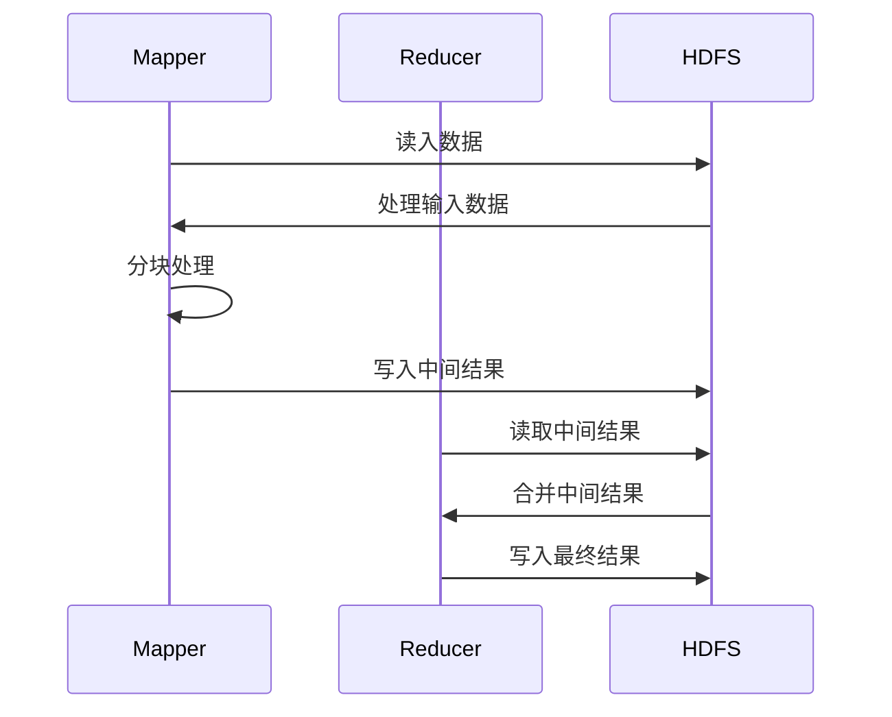
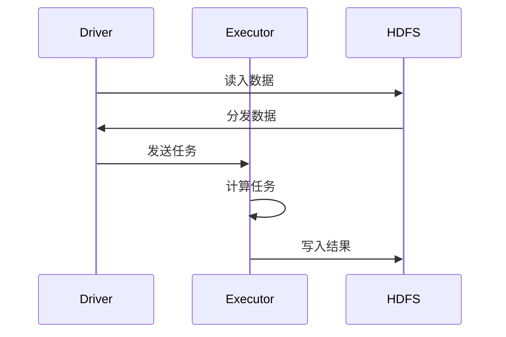
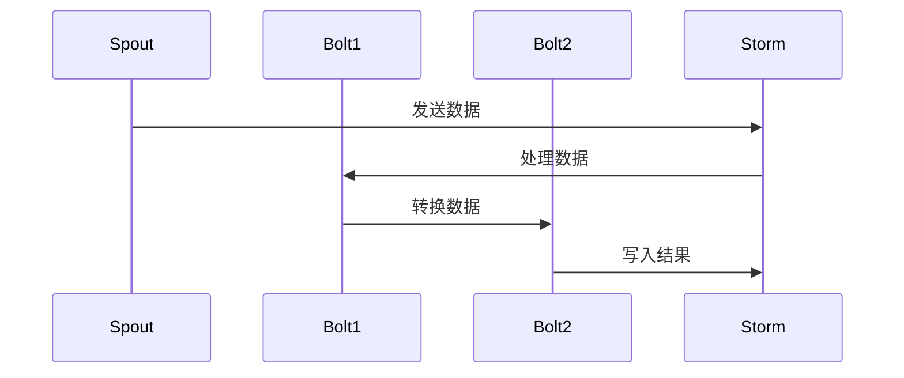
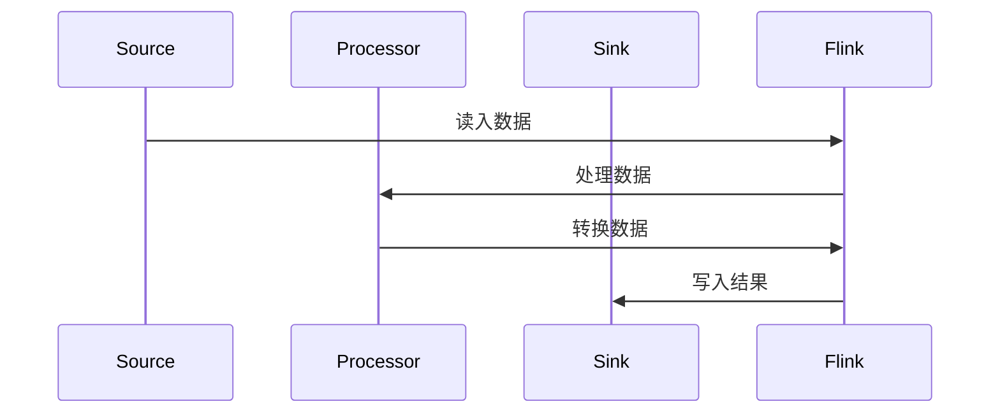
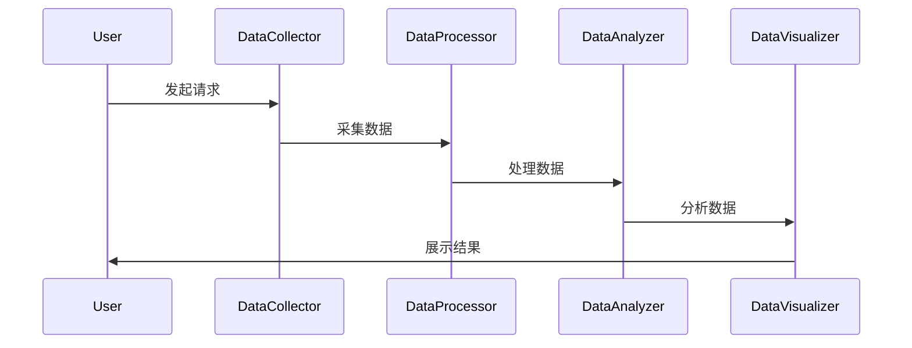
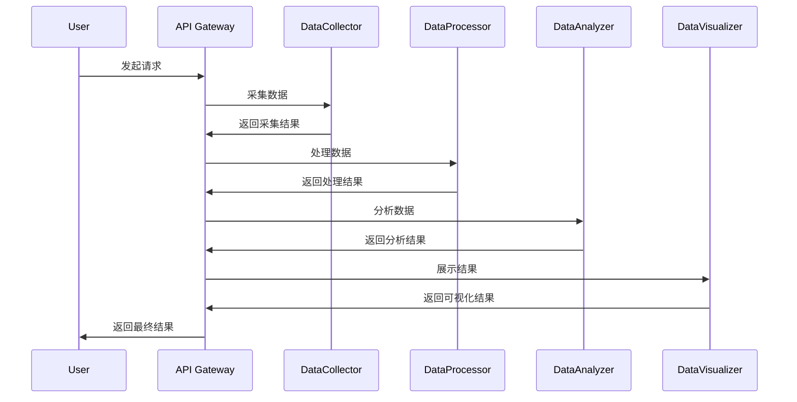

                 

# 大数据处理：从存储到分析的全流程

## 关键词

- 大数据
- 存储技术
- 分布式计算
- 数据分析
- 实时处理

## 摘要

本文将深入探讨大数据处理的全流程，从数据存储到数据分析的各个环节。首先，我们将了解大数据的背景和挑战，随后介绍分布式文件系统、NoSQL数据库以及数据湖和数据仓库技术。接下来，文章将详细探讨数据清洗与预处理、分布式计算框架和实时数据处理技术。最后，我们将分析大数据分析方法的多样性和大数据在各个行业的实际应用，以及大数据安全与隐私保护的重要性。通过本文的阅读，读者将获得全面而深入的大数据处理知识。

----------------------------------------------------------------

## 第0章：大数据核心概念与联系

### 0.1 大数据核心概念

#### 0.1.1 大数据定义

大数据（Big Data）是指数据规模巨大、数据类型繁多且数据增长速度极快的数据集合。传统数据处理工具和方法在面对大数据时往往显得力不从心。大数据的核心特征通常被归纳为4V，即数据量（Volume）、数据速度（Velocity）、数据多样性（Variety）和数据价值（Value）。

- **数据量（Volume）**：大数据的规模通常指的是从TB级到PB级，乃至EB级的数据。
- **数据速度（Velocity）**：数据生成和处理的实时性要求越来越高，处理速度成为关键因素。
- **数据多样性（Variety）**：数据类型多样化，包括结构化数据、半结构化数据和非结构化数据。
- **数据价值（Value）**：虽然数据量巨大，但价值密度低，需要有效的处理手段来挖掘数据中的价值。

#### 0.1.2 大数据挑战

大数据带来的挑战主要表现在以下几个方面：

- **存储挑战**：如何高效地存储海量数据，并保证数据的持久性和可用性。
- **计算挑战**：如何快速地处理和计算海量数据，实现实时分析和决策。
- **数据质量挑战**：如何保证数据的质量，包括准确性、完整性和一致性。
- **数据隐私和安全挑战**：如何在数据共享和利用的过程中保护数据隐私和安全。

### 0.2 大数据核心概念与联系

#### 0.2.1 大数据存储技术

大数据存储技术主要包括分布式文件系统（如HDFS）、NoSQL数据库（如MongoDB、Redis）以及数据湖和数据仓库。这些存储技术各自具有不同的特点和适用场景。

- **分布式文件系统**：适合大规模数据存储和处理，具有良好的扩展性和容错性。
- **NoSQL数据库**：适用于高并发、海量数据存储，支持多种数据模型，如键值对、文档、图等。
- **数据湖**：用于存储大规模的原始数据，支持多种数据格式，适用于数据探索和分析。
- **数据仓库**：用于存储结构化数据，支持复杂的数据分析和报告。

#### 0.2.2 大数据处理技术

大数据处理技术主要包括分布式计算框架（如Hadoop、Spark）和实时数据处理技术（如Storm、Flink）。这些技术旨在高效地处理和分析海量数据。

- **分布式计算框架**：通过分布式计算方式，实现数据的并行处理，提高数据处理效率。
- **实时数据处理技术**：支持实时数据采集、处理和分析，适用于需要实时决策和响应的场景。

#### 0.2.3 大数据分析方法

大数据分析方法包括统计分析方法、机器学习算法、数据挖掘技术和文本挖掘与自然语言处理。这些方法用于从海量数据中提取有价值的信息和知识。

- **统计分析方法**：基于统计学原理，对数据进行描述、推断和预测。
- **机器学习算法**：通过训练模型，自动发现数据中的规律和模式。
- **数据挖掘技术**：用于从海量数据中发现潜在的模式和知识。
- **文本挖掘与自然语言处理**：针对非结构化文本数据，提取关键词、主题和情感等信息。

#### 0.2.4 大数据应用场景

大数据在各个行业的应用场景广泛，包括但不限于以下领域：

- **零售行业**：通过数据分析实现个性化推荐、需求预测和库存管理。
- **金融行业**：通过大数据分析进行风险管理、欺诈检测和客户关系管理。
- **医疗健康领域**：通过大数据分析实现疾病预测、个性化治疗和医疗资源优化。
- **社交网络与媒体应用**：通过大数据分析实现用户行为分析、内容推荐和广告投放。

### 0.3 大数据核心概念原理与联系

#### 0.3.1 概念属性特征对比表格

| 特征        | 分布式文件系统 | NoSQL数据库 | 数据湖       | 数据仓库      |
| ----------- | -------------- | ----------- | ------------ | ------------ |
| 数据模型    | 文件系统       | 键值对、文档、图等 | 多种数据格式 | 结构化数据   |
| 扩展性      | 高             | 高          | 高           | 低           |
| 容错性      | 高             | 高          | 高           | 中           |
| 数据分析能力 | 较弱           | 较强        | 强           | 强           |

#### 0.3.2 ER实体关系图架构的 Mermaid 流程图

```mermaid
erDiagram
  数据存储技术 ||--o{ 分布式文件系统 : 使用文件系统进行大规模数据存储}
  数据存储技术 ||--o{ NoSQL数据库 : 提供多种数据模型存储}
  数据存储技术 ||--o{ 数据湖 : 存储多种格式数据支持探索分析}
  数据存储技术 ||--o{ 数据仓库 : 存储结构化数据用于分析}
  
  分布式文件系统 ||--o{ HDFS : Hadoop分布式文件系统}
  分布式文件系统 ||--o{ CFS : 云分布式文件系统}
  
  NoSQL数据库 ||--o{ MongoDB : 文档数据库}
  NoSQL数据库 ||--o{ Redis : 键值数据库}
  NoSQL数据库 ||--o{ Cassandra : 分布式列存储数据库}
  
  数据湖 ||--o{ Hadoop数据湖 : 基于Hadoop的分布式数据湖}
  数据湖 ||--o{ DLM : 分布式数据湖管理系统}
  
  数据仓库 ||--o{ Hive : 数据仓库系统}
  数据仓库 ||--o{ Impala : 高性能实时分析数据库}
```

通过以上对比表格和ER实体关系图，我们可以清晰地看到大数据存储技术的分类、特点以及相互之间的关系。这些技术各有优势，适用于不同的应用场景，共同构成了大数据处理的基础设施。

### 0.4 大数据算法原理

#### 0.4.1 分布式计算算法

分布式计算算法旨在通过将任务拆分成多个小任务，并在多个节点上并行执行，从而提高数据处理速度和效率。以下是两种常见的分布式计算算法：

##### 1. MapReduce

MapReduce是一种基于Hadoop的分布式数据处理框架，由Map和Reduce两个阶段组成。Map阶段将输入数据分成多个小块，每个小块由一个Map任务处理，输出中间结果。Reduce阶段将所有Map任务的中间结果汇总，进行聚合和计算，得到最终结果。



##### 2. Spark

Spark是一种快速的分布式计算引擎，支持内存计算和磁盘计算。Spark的核心算法包括RDD（Resilient Distributed Datasets）和DataFrame。

- **RDD**：一种弹性分布式数据集，支持丰富的操作接口，如map、reduce、filter等。
- **DataFrame**：一种结构化数据集合，类似于关系数据库中的表，支持SQL操作。



#### 0.4.2 实时数据处理算法

实时数据处理算法旨在处理和分析实时流数据，支持实时决策和响应。以下是两种常见的实时数据处理算法：

##### 1. Storm

Storm是一个分布式、实时数据处理系统，支持流数据的实时处理。Storm的核心算法包括Spout和Bolt。

- **Spout**：生成流数据源，向Storm系统提供数据。
- **Bolt**：处理流数据，执行计算和转换操作。



##### 2. Flink

Flink是一个分布式、实时数据处理引擎，支持流数据和批数据的统一处理。Flink的核心算法包括DataStream和Transformation。

- **DataStream**：流数据的抽象，支持各种数据操作。
- **Transformation**：数据转换操作，如map、filter、reduce等。



通过以上算法原理的讲解，我们可以看到大数据处理算法的多样性和复杂性。这些算法在分布式计算和实时数据处理中发挥着重要作用，为大数据分析提供了强大的技术支持。

### 0.5 大数据系统分析与架构设计

#### 0.5.1 项目介绍

在本节中，我们将介绍一个大数据处理项目，该项目旨在实现一个实时数据处理系统，用于分析社交媒体平台上的用户行为数据。项目的主要目标是：

- 实时采集社交媒体平台上的用户行为数据。
- 对采集到的数据进行实时处理和分析。
- 提供用户行为分析报告和可视化展示。

#### 0.5.2 系统功能设计

该实时数据处理系统主要包括以下几个功能模块：

- **数据采集模块**：负责从社交媒体平台实时采集用户行为数据，包括用户点赞、评论、分享等。
- **数据处理模块**：对采集到的数据进行分析和清洗，去除无效数据和噪声数据，为后续分析做准备。
- **数据分析模块**：使用机器学习算法和统计分析方法，对数据进行分析，提取有价值的信息和知识。
- **数据展示模块**：将分析结果以报告和可视化图表的形式展示给用户，帮助用户更好地理解和利用数据。

#### 0.5.3 系统架构设计

该实时数据处理系统的架构设计如下：



在该架构中，数据采集模块负责实时采集用户行为数据，数据处理模块对数据进行清洗和处理，数据分析模块使用机器学习算法和统计分析方法进行数据分析，数据展示模块将分析结果以可视化形式展示给用户。

#### 0.5.4 系统接口设计和系统交互

该实时数据处理系统的接口设计和系统交互如下：



在该交互流程中，用户通过API Gateway发起请求，数据采集模块采集数据并返回结果，数据处理模块处理数据并返回结果，数据分析模块分析数据并返回结果，数据展示模块展示结果并返回可视化结果，最终API Gateway将结果返回给用户。

#### 0.5.5 项目实战

为了实现上述实时数据处理系统，我们需要进行以下项目实战：

1. **环境安装**：搭建分布式计算环境，包括Hadoop、Spark、Storm等。
2. **系统核心实现**：实现数据采集、数据处理、数据分析和数据展示的核心功能。
3. **代码应用解读与分析**：对系统核心代码进行解读和分析，确保其正确性和高效性。
4. **实际案例分析**：通过对实际案例的分析，验证系统的性能和功能。

通过以上项目实战，我们可以实现对社交媒体用户行为数据的实时处理和分析，为用户提供有价值的数据分析报告和可视化展示。

#### 0.5.6 项目小结

在本章中，我们介绍了大数据系统分析与架构设计的相关知识，包括项目介绍、系统功能设计、系统架构设计、接口设计和系统交互，以及项目实战。通过对这些内容的了解，读者可以更好地理解大数据处理系统的实现过程和关键技术。

### 0.6 大数据最佳实践 Tips

1. **数据预处理**：在数据处理之前，进行充分的数据预处理，包括数据清洗、去重、格式转换等，以提高数据质量和分析效果。
2. **选择合适的存储技术**：根据数据类型和规模，选择适合的存储技术，如分布式文件系统、NoSQL数据库或数据湖。
3. **分布式计算**：充分利用分布式计算框架，如Hadoop、Spark等，实现数据的并行处理，提高处理效率。
4. **实时数据处理**：针对实时性要求较高的应用场景，选择合适的实时数据处理技术，如Storm、Flink等。
5. **数据安全与隐私保护**：在数据处理过程中，注重数据安全和隐私保护，采取有效的加密、访问控制等措施。

### 0.7 小结与拓展阅读

在本章中，我们详细介绍了大数据核心概念与联系、大数据存储技术、数据处理技术、大数据分析方法和系统分析与架构设计。通过本章的学习，读者可以全面了解大数据处理的全流程，为后续的学习和实践打下坚实的基础。

拓展阅读：

1. 《大数据时代：改变世界的数据科学》 - by 托尼·谢尔
2. 《大数据技术导论》 - by 刘铁岩
3. 《Hadoop实战》 - by 詹姆斯·斯通布莱克和阿南特·贾恩

----------------------------------------------------------------

## 作者信息

作者：AI天才研究院/AI Genius Institute & 禅与计算机程序设计艺术 /Zen And The Art of Computer Programming

