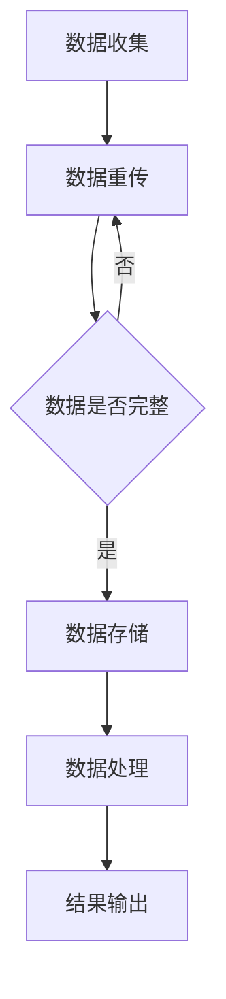
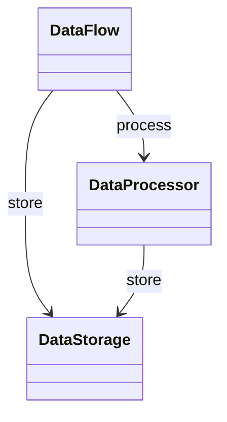
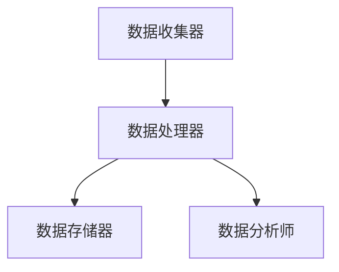
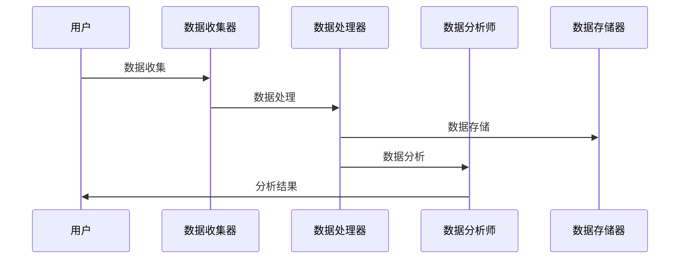

                 


### 第一步：背景介绍

在当今社会，大数据已经成为了企业、政府以及科研机构的重要资产。随着数据规模的不断扩大，如何高效地处理这些海量数据，成为了摆在我们面前的一个重大挑战。为了满足这一需求，批处理系统应运而生。批处理系统是一种数据处理方式，它将一段时间内收集到的数据进行集中处理，而不是实时处理。这种处理方式在处理大规模数据时，具有显著的优势。

#### 问题背景

大数据批处理系统的出现，主要是为了解决以下几个问题：

1. **数据量巨大**：随着互联网、物联网、移动设备等技术的发展，数据量呈现爆炸式增长。传统的实时处理系统难以承载如此庞大的数据量。
2. **处理速度要求高**：在处理大规模数据时，需要保证处理速度，否则将导致数据处理延迟，影响业务运行。
3. **可靠性要求高**：对于许多业务场景，如金融交易、医疗记录等，数据处理过程中必须保证数据的准确性和完整性，否则将带来严重的后果。

#### 问题描述

批处理系统需要解决以下问题：

1. **数据流管理**：如何有效地管理大规模数据流，确保数据在传输过程中不丢失、不重复、不延迟。
2. **处理效率**：如何在有限的时间内完成大量的数据处理任务，提高处理效率。
3. **可靠性**：如何保证数据处理过程中的数据准确性和完整性。

#### 问题解决

批处理系统的解决方案主要包括以下几个方面：

1. **分布式处理**：通过分布式计算，将数据处理任务分配到多个节点上，实现并行处理，提高处理速度。
2. **批量调度**：通过批量调度，将一段时间内的数据处理任务集中在一起处理，减少处理次数，提高处理效率。
3. **数据冗余与容错**：通过数据冗余和容错机制，确保在处理过程中数据的准确性和完整性。

### 第二步：核心概念与联系

在批处理系统中，核心概念包括数据流、批处理框架和调度等。这些概念相互联系，构成了批处理系统的基础。

#### 核心概念

1. **数据流**：数据流是批处理系统的核心，它描述了数据的来源、传输、处理和存储过程。
2. **批处理框架**：批处理框架是批处理系统的核心组成部分，它负责将数据处理任务分解为可并行执行的任务，并管理这些任务的执行过程。
3. **调度**：调度是批处理系统的一个重要功能，它负责将数据处理任务按照一定的策略分配到不同的计算资源上，确保数据处理任务能够高效、有序地执行。

#### 概念属性特征对比表格

以下是一个批处理系统常见框架的属性特征对比表格：

| 框架 | 数据流处理能力 | 并行度 | 可扩展性 | 调度策略 |  
| ---- | ---- | ---- | ---- | ---- |  
| Hadoop | 高 | 较高 | 高 | 基于批次的调度 |  
| Spark | 高 | 高 | 高 | 基于事件驱动和批次的调度 |  
| Flink | 高 | 高 | 高 | 基于事件驱动的调度 |

#### ER实体关系图架构

以下是一个简单的批处理系统ER实体关系图架构，展示了数据流、批处理框架和调度之间的实体关系：

```mermaid
erDiagram
  DataFlow ||--|{ BatchProcessingFramework }|> BatchProcess
  BatchProcessingFramework ||--|{ Scheduler }|> Schedule
  DataFlow ||--|{ Storage }|> Store
```

### 第三步：算法原理讲解

在批处理系统中，核心算法的设计至关重要。以下是批处理系统的核心算法原理讲解，包括算法mermaid流程图、Python源代码、数学模型和公式以及举例说明。

#### 算法mermaid流程图

以下是一个简单的批处理算法mermaid流程图：



#### Python源代码

以下是一个简单的Python源代码实现，用于计算数据流传输速率和批处理窗口调整：

```python
def data_flow_rate(batch_size, batch_interval):
    return batch_size / batch_interval

def adjust_batch_window(batch_size, target_rate, current_rate):
    return (batch_size * current_rate) / target_rate
```

#### 数学模型和公式

1. **数据流传输速率公式**：

   $$R = \frac{B}{I}$$

   其中，\(R\) 表示数据流传输速率，\(B\) 表示批次大小，\(I\) 表示批次间隔时间。

2. **批处理窗口大小公式**：

   $$W = \frac{B \times R}{T}$$

   其中，\(W\) 表示批处理窗口大小，\(T\) 表示目标传输速率。

#### 举例说明

假设我们有一个批处理任务，批次大小为100MB，批次间隔时间为1分钟。目标传输速率为10MB/s，当前传输速率为5MB/s。我们需要调整批处理窗口大小。

1. **计算当前传输速率**：

   $$R_{current} = \frac{B}{I} = \frac{100MB}{1min} = 100MB/min$$

2. **计算目标传输速率下的批处理窗口大小**：

   $$W_{target} = \frac{B \times R_{target}}{T} = \frac{100MB \times 10MB/s}{1min} = 1000MB$$

3. **调整批处理窗口大小**：

   $$W_{adjust} = \frac{B \times R_{current}}{T} = \frac{100MB \times 5MB/s}{1min} = 500MB$$

### 第四步：系统分析与架构设计方案

系统分析与架构设计是批处理系统成功实施的关键步骤。在此步骤中，我们将详细介绍批处理系统的问题场景、系统功能设计、系统架构设计以及系统接口设计和系统交互。

#### 问题场景介绍

批处理系统常见的问题场景包括：

1. **日志处理**：在互联网公司，日志处理是批处理系统的典型应用场景。日志数据量大、结构复杂，需要通过批处理系统进行解析、存储和分析。
2. **数据处理分析**：在金融、医疗等领域，需要对大量的交易数据、患者数据进行处理和分析，批处理系统可以提供高效、可靠的数据处理能力。

#### 系统功能设计（领域模型Mermaid类图）

以下是一个简单的批处理系统领域模型Mermaid类图：



#### 系统架构设计（Mermaid架构图）

以下是一个简单的批处理系统架构Mermaid架构图：



#### 系统接口设计和系统交互（Mermaid序列图）

以下是一个简单的批处理系统接口设计和系统交互Mermaid序列图：



### 第五步：项目实战

在批处理系统的实际应用中，项目实战是验证系统设计是否合理、是否能够满足需求的重要环节。以下将详细介绍如何搭建批处理系统、实现核心功能以及进行项目实战。

#### 环境安装

搭建批处理系统需要准备以下环境：

1. **操作系统**：Linux操作系统，如Ubuntu 18.04。
2. **编程语言**：Python 3.x。
3. **依赖库**：pandas、numpy、hdfs等。

安装步骤如下：

1. 更新操作系统软件包：

   ```bash
   sudo apt-get update
   sudo apt-get upgrade
   ```

2. 安装Python 3.x：

   ```bash
   sudo apt-get install python3 python3-pip
   ```

3. 安装依赖库：

   ```bash
   pip3 install pandas numpy hdfs
   ```

#### 系统核心实现源代码

以下是一个简单的批处理系统核心实现源代码：

```python
from hdfs import InsecureClient
import pandas as pd

def read_data_from_hdfs(hdfs_url, file_path):
    client = InsecureClient(hdfs_url, user='hdfs')
    with client.read(file_path) as reader:
        data = pd.read_csv(reader)
    return data

def process_data(data):
    # 数据处理逻辑
    processed_data = data.sort_values(by=['timestamp'])
    return processed_data

def write_data_to_hdfs(hdfs_url, file_path, data):
    client = InsecureClient(hdfs_url, user='hdfs')
    with client.write(file_path) as writer:
        data.to_csv(writer, index=False)
```

#### 代码应用解读与分析

以上代码实现了批处理系统中的数据读取、数据处理和数据存储功能。

1. **数据读取**：使用hdfs库读取HDFS上的数据，使用pandas库将数据转换为DataFrame格式。
2. **数据处理**：对数据进行排序等操作，确保数据按照时间顺序排列。
3. **数据存储**：将处理后的数据写回HDFS。

#### 实际案例分析和详细讲解剖析

以下是一个实际案例，展示如何使用批处理系统处理日志数据。

1. **数据收集**：从日志文件中读取数据。
2. **数据处理**：对数据进行清洗、转换和聚合。
3. **数据存储**：将处理后的数据存储到HDFS。

**案例1：日志处理**

- **数据源**：一个包含网站访问日志的文件。
- **处理目标**：提取日志中的用户访问信息，统计访问次数。

```python
hdfs_url = "http://hdfs-server:50070"
file_path = "/path/to/logfile.log"

data = read_data_from_hdfs(hdfs_url, file_path)
processed_data = process_data(data)

write_data_to_hdfs(hdfs_url, "/path/to/processed_data.csv", processed_data)
```

**案例2：数据处理分析**

- **数据源**：一个包含交易数据的文件。
- **处理目标**：计算交易总额，统计交易次数。

```python
hdfs_url = "http://hdfs-server:50070"
file_path = "/path/to/transaction_data.csv"

data = read_data_from_hdfs(hdfs_url, file_path)
processed_data = process_data(data)

write_data_to_hdfs(hdfs_url, "/path/to/processed_data.csv", processed_data)
```

#### 项目小结

通过以上实战案例，我们可以看到批处理系统在实际应用中的强大功能。在实际开发过程中，需要根据具体业务需求，设计合适的系统架构，实现高效、可靠的数据处理流程。

### 第六步：最佳实践 tips、小结、注意事项、拓展阅读

#### 最佳实践 tips

1. **选择合适的批处理框架**：根据业务需求和数据处理能力，选择合适的批处理框架，如Hadoop、Spark、Flink等。
2. **数据预处理**：在数据处理前，对数据进行清洗、转换和聚合等预处理操作，提高数据处理效率。
3. **优化系统配置**：合理配置系统资源，如CPU、内存、存储等，提高系统性能。
4. **监控与告警**：实时监控系统运行状态，设置告警机制，确保系统稳定运行。

#### 小结

本文从背景介绍、核心概念与联系、算法原理讲解、系统分析与架构设计、项目实战等方面，详细阐述了大数据批处理系统的架构设计。通过实际案例，展示了批处理系统在日志处理和数据处理分析中的应用。

#### 注意事项

1. **数据安全**：在处理数据时，确保数据的安全性，避免数据泄露。
2. **系统稳定性**：在系统设计和实施过程中，关注系统的稳定性，确保在处理大规模数据时，系统能够稳定运行。
3. **可扩展性**：在设计系统架构时，考虑系统的可扩展性，以便在未来能够应对更大规模的数据处理需求。

#### 拓展阅读

1. 《大数据技术导论》：详细介绍了大数据技术的各个方面，包括数据采集、存储、处理和分析等。
2. 《Spark技术内幕》：深入解析了Spark的技术原理和实现细节，适合对Spark感兴趣的读者。
3. 《Hadoop权威指南》：全面介绍了Hadoop的技术体系，包括HDFS、MapReduce、YARN等。

作者：AI天才研究院/AI Genius Institute & 禅与计算机程序设计艺术 /Zen And The Art of Computer Programming

