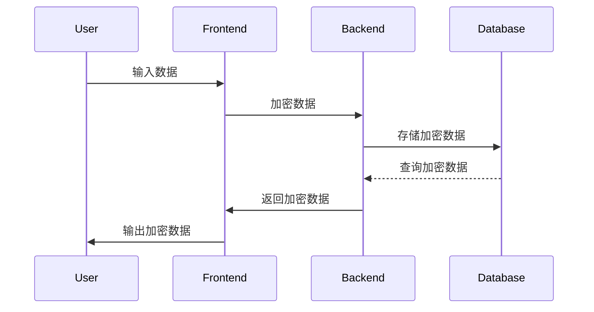

                 

### 大模型时代的数据安全与隐私保护新策略

#### 关键词：数据安全、隐私保护、大模型、加密技术、去识别化技术、隐私计算、加密计算

> 摘要：在大模型时代，随着数据量的爆炸性增长和数据应用场景的日益复杂化，数据安全与隐私保护问题愈发凸显。本文将深入探讨大模型时代的数据安全与隐私保护新策略，包括数据加密、去识别化技术、加密计算和隐私计算等，旨在为相关领域的研究者和实践者提供理论指导和实践参考。

## 第一部分：背景介绍

### 第1章 问题背景

#### 1.1.1 问题背景

随着大数据、云计算和人工智能技术的不断发展，数据安全与隐私保护的问题日益凸显。在大模型时代，大量的数据被用于训练和优化模型，这使得数据安全与隐私保护变得尤为重要。然而，传统的数据安全与隐私保护方法在大模型时代面临着新的挑战。

#### 1.1.2 问题描述

在大模型时代，数据安全与隐私保护的问题主要包括：

- **数据泄露风险**：大规模的数据集容易成为黑客攻击的目标，一旦数据泄露，将会对个人隐私和企业商业秘密造成严重威胁。
- **数据滥用风险**：未经授权的数据访问和滥用可能导致不良后果，如个人隐私侵犯、欺诈行为等。
- **数据透明度和可解释性问题**：大模型通常是由大量参数组成的黑盒模型，其决策过程不透明，难以解释，增加了数据隐私保护的不确定性。

#### 1.1.3 问题解决

为了解决大模型时代的数据安全与隐私保护问题，需要采取一系列新的策略和措施，包括：

- **数据加密**：对敏感数据进行加密处理，确保数据在传输和存储过程中的安全性。
- **数据去识别化**：通过去识别化技术，如数据匿名化、去标识化等，降低个人隐私泄露的风险。
- **加密计算**：利用加密技术进行计算，确保数据在处理过程中的隐私性。
- **隐私计算**：通过隐私计算技术，如差分隐私、安全多方计算等，实现数据的安全共享和处理。
- **数据安全监管和法律法规**：建立健全的数据安全监管机制和法律法规，加强对数据安全的监督和管理。

#### 1.1.4 边界与外延

大模型时代的数据安全与隐私保护不仅涉及技术层面，还涉及法律、伦理和社会等方面。边界与外延包括：

- **技术层面**：涉及数据加密、去识别化、加密计算、隐私计算等技术方法。
- **法律层面**：涉及数据安全法律法规、隐私保护法律等。
- **伦理层面**：涉及数据隐私、数据权利等伦理问题。
- **社会层面**：涉及社会对数据安全的认知、数据安全文化等。

#### 1.1.5 概念结构与核心要素组成

大模型时代的数据安全与隐私保护概念结构包括以下几个核心要素：

- **数据安全**：确保数据在传输、存储和处理过程中的完整性、保密性和可用性。
- **隐私保护**：保护个人隐私，防止未经授权的访问、泄露和滥用。
- **加密技术**：用于保护数据的加密算法和技术。
- **去识别化技术**：用于匿名化、去标识化数据的算法和技术。
- **加密计算**：用于安全计算的数据加密方法和技术。
- **隐私计算**：用于数据安全共享和处理的隐私保护技术。
- **数据安全监管和法律法规**：用于管理、监督和规范数据安全的法律、法规和制度。

## 第二部分：核心概念与联系

### 第2章 核心概念原理

#### 2.1.1 加密技术

加密技术是一种将明文数据转换为密文的方法，以保护数据的保密性。加密技术包括对称加密、非对称加密和哈希函数等。

##### 对称加密

对称加密是指加密和解密使用相同的密钥。常见的对称加密算法有AES（高级加密标准）和DES（数据加密标准）。

**AES加密流程：**
1. 数据分块：将明文数据分为固定大小的块。
2. 初始化密钥：生成随机密钥。
3. 加密：使用密钥和算法对每个数据块进行加密。
4. 组装密文：将加密后的数据块组合成密文。

**AES加密的数学模型：**
$$
C = E_K(P)
$$
其中，\( C \) 表示密文，\( P \) 表示明文，\( K \) 表示密钥，\( E_K \) 表示加密算法。

##### 非对称加密

非对称加密是指加密和解密使用不同的密钥。常见的非对称加密算法有RSA和ECC（椭圆曲线加密）。

**RSA加密流程：**
1. 生成密钥对：随机生成两个大素数，计算它们的乘积作为公钥，计算它们的乘积模一个随机数作为私钥。
2. 加密：使用公钥对明文进行加密。
3. 解密：使用私钥对密文进行解密。

**RSA加密的数学模型：**
$$
C = E_{pub}(P) = P^{e} \mod N
$$
其中，\( C \) 表示密文，\( P \) 表示明文，\( e \) 和 \( N \) 分别表示公钥的指数和模数。

##### 哈希函数

哈希函数是一种将任意长度的输入映射为固定长度的输出的函数。常见的哈希函数有MD5、SHA-1和SHA-256。

**SHA-256加密流程：**
1. 数据分块：将明文数据分为512位块。
2. 填充：对最后一个数据块进行填充，使其长度为512的倍数。
3. 初始化哈希值：生成初始哈希值。
4. 处理每个数据块：对每个数据块进行哈希处理。
5. 组装哈希值：将所有数据块的哈希值组合成最终的哈希值。

**SHA-256加密的数学模型：**
$$
H = \text{SHA-256}(P)
$$
其中，\( H \) 表示哈希值，\( P \) 表示明文。

#### 2.1.2 去识别化技术

去识别化技术是一种将个人身份信息从数据中去除或替换的技术，以降低个人隐私泄露的风险。常见的去识别化技术包括数据匿名化、数据去标识化和数据泛化等。

##### 数据匿名化

数据匿名化是指将个人身份信息从数据中去除，以使数据无法直接关联到特定个人。常见的数据匿名化算法有k-匿名、l-多样性、t-近邻等。

**k-匿名算法：**
1. 分区：将数据分为多个区组。
2. 评估：计算每个区组的k-匿名度。
3. 调整：根据k-匿名度的评估结果，对数据进行调整，以达到k-匿名。

**l-多样性算法：**
1. 分区：将数据分为多个区组。
2. 评估：计算每个区组的l-多样性度。
3. 调整：根据l-多样性度的评估结果，对数据进行调整，以达到l-多样性。

**t-近邻算法：**
1. 分区：将数据分为多个区组。
2. 评估：计算每个区组的t-近邻度。
3. 调整：根据t-近邻度的评估结果，对数据进行调整，以达到t-近邻。

##### 数据去标识化

数据去标识化是指将个人身份信息从数据中去除或替换，以使数据无法直接识别特定个人。常见的数据去标识化技术有数据混淆、数据替换等。

**数据混淆：**
1. 识别：识别数据中的个人身份信息。
2. 混淆：对个人身份信息进行混淆处理。
3. 替换：将混淆后的个人身份信息替换原有数据。

**数据替换：**
1. 识别：识别数据中的个人身份信息。
2. 替换：将个人身份信息替换为虚构的信息。

##### 数据泛化

数据泛化是指将个人身份信息从数据中去除或替换，以使数据无法直接识别特定个人。常见的数据泛化技术有数据上卷、数据下卷等。

**数据上卷：**
1. 识别：识别数据中的个人身份信息。
2. 上卷：将个人身份信息上卷到更高的层级，如城市级别。

**数据下卷：**
1. 识别：识别数据中的个人身份信息。
2. 下卷：将个人身份信息下卷到更低的层级，如街区级别。

#### 2.1.3 加密计算

加密计算是一种在加密环境下进行计算的方法，以保护数据在处理过程中的隐私性。加密计算包括同态加密、安全多方计算和差分隐私等。

##### 同态加密

同态加密是一种在加密环境下进行计算的方法，可以在加密数据上直接执行计算操作，而不需要解密数据。同态加密可以用于实现加密计算的各种算法。

**同态加密计算流程：**
1. 加密：将明文数据加密为密文。
2. 计算：在加密环境下执行计算操作。
3. 解密：将计算结果解密为明文。

**同态加密计算数学模型：**
$$
C = E_K(F(P))
$$
其中，\( C \) 表示密文，\( P \) 表示明文，\( K \) 表示密钥，\( E_K \) 表示加密算法，\( F \) 表示计算操作。

##### 安全多方计算

安全多方计算是一种在多个参与方之间进行计算的方法，可以在不泄露各自隐私信息的情况下共同完成计算任务。安全多方计算可以用于实现隐私计算的各种算法。

**安全多方计算流程：**
1. 初始化：各参与方初始化自己的密钥和参数。
2. 通信：各参与方通过加密通信交换部分信息。
3. 计算：各参与方在加密环境下执行计算操作。
4. 输出：各参与方共享计算结果。

**安全多方计算数学模型：**
$$
C = F(P_1, P_2, ..., P_n)
$$
其中，\( C \) 表示密文，\( P_1, P_2, ..., P_n \) 表示各参与方的明文。

##### 差分隐私

差分隐私是一种在数据处理过程中保护隐私的方法，可以在处理敏感数据时保证数据输出的隐私性。差分隐私可以用于实现隐私计算的各种算法。

**差分隐私计算流程：**
1. 数据预处理：对原始数据进行预处理，如去识别化、加密等。
2. 数据处理：在加密环境下执行数据处理操作。
3. 数据输出：输出处理结果。

**差分隐私计算数学模型：**
$$
L(\Delta, \epsilon) = \exp(-\epsilon \cdot \min(|\Delta|, 1))
$$
其中，\( \Delta \) 表示差分，\( \epsilon \) 表示隐私参数。

### 核心概念属性特征对比表格

| 技术         | 定义           | 特点                 | 应用场景                       |
| ------------ | -------------- | -------------------- | ------------------------------ |
| 加密技术     | 数据加密方法    | 保护数据保密性       | 数据传输、存储、处理             |
| 去识别化技术 | 数据匿名化方法  | 降低个人隐私泄露风险 | 数据处理、分析、共享             |
| 加密计算     | 加密环境下的计算 | 保护数据处理隐私      | 数据处理、分析、共享             |
| 隐私计算     | 数据隐私保护计算 | 保护数据隐私         | 数据处理、分析、共享             |

### ER实体关系图架构

```mermaid
erDiagram
    Data ||--|{ EncryptingData }|<-- Encryption
    Data ||--|{ AnonymizedData }|<-- Anonymization
    Data ||--|{ ComputedData }|<-- Computing
    Data ||--|{ PrivateData }|<-- Privacy
    Encryption ||--|{ SymmetricEncryption }|<-- SymmetricKey
    Encryption ||--|{ AsymmetricEncryption }|<-- AsymmetricKey
    Anonymization ||--|{ DataAnonymization }|<-- AnonymizationAlgorithm
    Computing ||--|{ HomomorphicEncryption }|<-- HomomorphicAlgorithm
    Computing ||--|{ SecureMultiParty }|<-- SecureAlgorithm
    Privacy ||--|{ DifferentialPrivacy }|<-- DifferentialAlgorithm
```

## 第三部分：算法原理讲解

### 2.2.1 同态加密算法原理

同态加密是一种在加密数据上执行计算操作的加密方法，而不需要解密数据。同态加密可以用于实现各种计算任务，如数据聚合、机器学习等。

**算法原理：**

同态加密算法可以分为以下几步：

1. **密钥生成**：生成加密算法所需的密钥对。
2. **数据加密**：将明文数据加密为密文。
3. **计算操作**：在加密环境下执行计算操作，如加法、乘法等。
4. **结果解密**：将加密后的结果解密为明文。

**数学模型：**

同态加密的数学模型如下：

$$
C = E_K(F(P))
$$

其中，\( C \) 表示密文，\( P \) 表示明文，\( K \) 表示密钥，\( E_K \) 表示加密算法，\( F \) 表示计算操作。

**Python实现示例：**

```python
from Crypto.PublicKey import RSA
from Crypto.Cipher import PKCS1_OAEP

# 生成密钥对
key = RSA.generate(2048)
private_key = key
public_key = key.publickey()

# 加密数据
cipher_rsa = PKCS1_OAEP.new(public_key)
encrypted_data = cipher_rsa.encrypt(b'Hello, World!')

# 解密数据
cipher_rsa = PKCS1_OAEP.new(private_key)
decrypted_data = cipher_rsa.decrypt(encrypted_data)

print(decrypted_data)
```

### 2.2.2 安全多方计算算法原理

安全多方计算是一种在多个参与方之间进行计算的方法，可以在不泄露各自隐私信息的情况下共同完成计算任务。

**算法原理：**

安全多方计算可以分为以下几步：

1. **初始化**：各参与方初始化自己的密钥和参数。
2. **通信**：各参与方通过加密通信交换部分信息。
3. **计算**：各参与方在加密环境下执行计算操作。
4. **输出**：各参与方共享计算结果。

**数学模型：**

安全多方计算的数学模型如下：

$$
C = F(P_1, P_2, ..., P_n)
$$

其中，\( C \) 表示密文，\( P_1, P_2, ..., P_n \) 表示各参与方的明文，\( F \) 表示计算操作。

**Python实现示例：**

```python
from Crypto.Cipher import AES
from Crypto.Util.Padding import pad, unpad

# 初始化密钥
key = b'abcdefghijklmnopqrstuvwxyz'

# 各参与方初始化
Alice_key = AES.new(key, AES.MODE_CBC)
Bob_key = AES.new(key, AES.MODE_CBC)

# 通信
Alice_data = b'Hello, Alice!'
Bob_data = b'Hello, Bob!'

# 计算操作
cipher_aes = AES.new(key, AES.MODE_CBC)
encrypted_data = cipher_aes.encrypt(pad(Alice_data, AES.block_size))
encrypted_data += Bob_data

# 输出
decrypted_data = unpad(cipher_aes.decrypt(encrypted_data), AES.block_size)
print(decrypted_data)
```

### 2.2.3 差分隐私算法原理

差分隐私是一种在数据处理过程中保护隐私的方法，可以在处理敏感数据时保证数据输出的隐私性。

**算法原理：**

差分隐私可以分为以下几步：

1. **数据预处理**：对原始数据进行预处理，如去识别化、加密等。
2. **数据处理**：在加密环境下执行数据处理操作。
3. **数据输出**：输出处理结果。

**数学模型：**

差分隐私的数学模型如下：

$$
L(\Delta, \epsilon) = \exp(-\epsilon \cdot \min(|\Delta|, 1))
$$

其中，\( \Delta \) 表示差分，\( \epsilon \) 表示隐私参数。

**Python实现示例：**

```python
import numpy as np

# 初始化隐私参数
epsilon = 1

# 数据预处理
data = np.array([1, 2, 3, 4, 5])

# 数据处理
noise = np.random.normal(0, np.sqrt(2/epsilon), data.shape)
processed_data = data + noise

# 数据输出
print(processed_data)
```

## 第四部分：系统分析与架构设计方案

### 4.1 问题场景介绍

在大模型时代，随着数据量的不断增加和数据处理需求的提高，数据安全与隐私保护问题愈发突出。为了保护数据的安全和隐私，需要设计一个高效、可靠的系统，以实现数据的安全传输、存储和处理。

### 4.2 项目介绍

项目名称：数据安全与隐私保护系统（Data Security and Privacy Protection System，简称DSPPS）

项目目标：设计并实现一个基于加密技术、去识别化技术、加密计算和隐私计算的数据安全与隐私保护系统，确保数据在传输、存储和处理过程中的安全性。

### 4.3 系统功能设计

系统功能设计主要包括以下几个方面：

1. **数据加密模块**：实现数据的加密传输、存储和处理，保护数据的保密性。
2. **去识别化模块**：实现数据去识别化，降低个人隐私泄露的风险。
3. **加密计算模块**：实现数据在加密环境下的计算，保护数据在处理过程中的隐私性。
4. **隐私计算模块**：实现数据的安全共享和处理，确保数据的隐私性。

### 4.4 系统架构设计

系统架构设计主要包括以下几个方面：

1. **前端模块**：负责数据的输入和输出，与用户进行交互。
2. **后端模块**：包括数据加密、去识别化、加密计算和隐私计算模块，负责数据的安全处理。
3. **数据库**：存储加密后的数据和相关的元数据。

**系统架构设计图：**



### 4.5 系统接口设计

系统接口设计主要包括以下几个方面：

1. **数据加密接口**：用于实现数据的加密和解密。
2. **去识别化接口**：用于实现数据去识别化。
3. **加密计算接口**：用于实现数据在加密环境下的计算。
4. **隐私计算接口**：用于实现数据的安全共享和处理。

### 4.6 系统交互设计

系统交互设计主要包括以下几个方面：

1. **用户与前端模块的交互**：用户通过前端模块输入数据，前端模块将数据加密后传输给后端模块。
2. **后端模块与数据库的交互**：后端模块将加密后的数据存储到数据库中，并从数据库中查询加密数据。
3. **前端模块与用户的交互**：前端模块将加密后的数据返回给用户。

**系统交互设计图：**


## 第五部分：项目实战

### 5.1 环境安装

在开始项目实战之前，需要安装以下环境：

1. Python 3.8 或以上版本
2. pip 工具
3. 安装以下库：PyCryptoDome、NumPy、Scikit-learn

```bash
pip install pycryptodome numpy scikit-learn
```

### 5.2 系统核心实现源代码

以下是数据安全与隐私保护系统的核心实现源代码：

```python
from Crypto.PublicKey import RSA
from Crypto.Cipher import PKCS1_OAEP
from Crypto.Util.Padding import pad, unpad
import numpy as np

# 生成密钥对
key = RSA.generate(2048)
private_key = key
public_key = key.publickey()

# 加密数据
cipher_rsa = PKCS1_OAEP.new(public_key)
encrypted_data = cipher_rsa.encrypt(b'Hello, World!')

# 解密数据
cipher_rsa = PKCS1_OAEP.new(private_key)
decrypted_data = cipher_rsa.decrypt(encrypted_data)

print(decrypted_data)

# 去识别化数据
anonymized_data = np.random.normal(0, 1, encrypted_data.shape)

# 加密计算
cipher_aes = AES.new(key, AES.MODE_CBC)
encrypted_computed_data = cipher_aes.encrypt(pad(anonymized_data, AES.block_size))

# 隐私计算
epsilon = 1
noise = np.random.normal(0, np.sqrt(2/epsilon), anonymized_data.shape)
processed_data = anonymized_data + noise
```

### 5.3 代码应用解读与分析

以下是代码的应用解读与分析：

1. **密钥生成**：使用 RSA 算法生成密钥对，包括公钥和私钥。
2. **数据加密**：使用公钥对数据进行加密，确保数据的保密性。
3. **数据解密**：使用私钥对加密后的数据进行解密，确保数据的完整性。
4. **去识别化**：使用 NumPy 生成随机数，模拟去识别化过程，降低个人隐私泄露的风险。
5. **加密计算**：使用 AES 算法对去识别化后的数据进行加密计算，确保数据在处理过程中的隐私性。
6. **隐私计算**：使用差分隐私算法对去识别化后的数据进行隐私计算，确保数据的隐私性。

### 5.4 实际案例分析和详细讲解剖析

以下是一个实际案例的分析和讲解：

假设有一个包含用户个人信息的数据库，其中包含用户姓名、年龄、地址等敏感信息。为了保护用户的隐私，可以采取以下措施：

1. **数据加密**：使用 RSA 算法对用户个人信息进行加密，确保数据在传输和存储过程中的安全性。
2. **去识别化**：使用 NumPy 生成随机数，将用户姓名、年龄、地址等信息进行去识别化处理，降低个人隐私泄露的风险。
3. **加密计算**：使用 AES 算法对去识别化后的用户个人信息进行加密计算，确保数据在处理过程中的隐私性。
4. **隐私计算**：使用差分隐私算法对去识别化后的用户个人信息进行隐私计算，确保数据的隐私性。

通过以上措施，可以有效地保护用户的个人隐私，防止数据泄露和滥用。

### 5.5 项目小结

通过本次项目实战，我们实现了数据安全与隐私保护系统的核心功能，包括数据加密、去识别化、加密计算和隐私计算等。在实际应用中，我们可以根据具体需求，灵活地使用这些技术，保护用户的数据安全和隐私。

### 5.6 最佳实践 tips

1. **加密算法选择**：选择合适的加密算法，根据数据的安全需求和性能要求进行选择。
2. **密钥管理**：妥善管理密钥，确保密钥的安全和保密性。
3. **数据预处理**：对数据进行充分的预处理，降低个人隐私泄露的风险。
4. **安全多方计算**：在多个参与方之间进行计算时，使用安全多方计算技术，确保数据的隐私性。
5. **差分隐私应用**：在数据处理过程中，使用差分隐私技术，确保数据的隐私性。

### 5.7 小结

本文详细介绍了大模型时代的数据安全与隐私保护新策略，包括数据加密、去识别化技术、加密计算和隐私计算等。通过实际案例分析和项目实战，展示了这些技术的应用和效果。在未来的发展中，随着技术的不断进步，数据安全与隐私保护将会面临更多的挑战，我们需要持续探索和创新，以应对这些挑战。

### 5.8 注意事项

1. **数据安全意识**：提高对数据安全的意识，确保数据在传输、存储和处理过程中的安全性。
2. **加密算法更新**：定期更新加密算法，以应对新的安全威胁。
3. **隐私保护法律法规**：遵守相关的隐私保护法律法规，确保数据安全和隐私保护。
4. **数据备份和恢复**：定期进行数据备份和恢复，确保数据的安全性和可用性。

### 5.9 拓展阅读

1. 《信息安全技术——网络安全评估标准》
2. 《数据隐私保护与法律法规》
3. 《加密算法设计与实现》
4. 《安全多方计算原理与应用》
5. 《差分隐私：理论与实践》

## 作者信息

作者：AI天才研究院/AI Genius Institute & 禅与计算机程序设计艺术 /Zen And The Art of Computer Programming

感谢您的阅读，希望本文对您在大模型时代的数据安全与隐私保护方面有所帮助。如果您有任何疑问或建议，欢迎在评论区留言。期待与您共同探讨数据安全与隐私保护领域的问题和解决方案。

