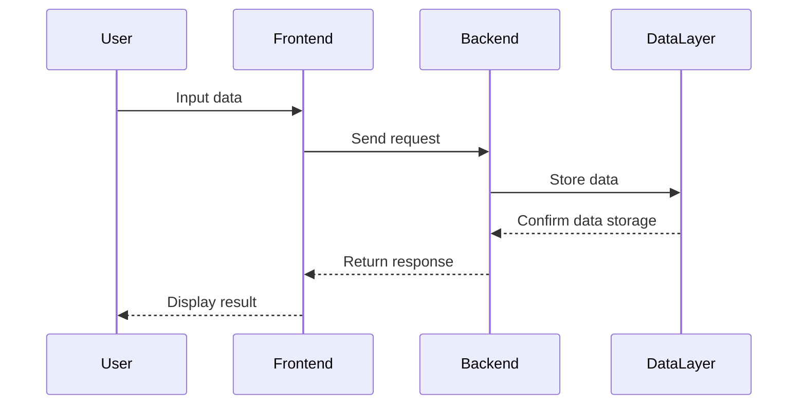
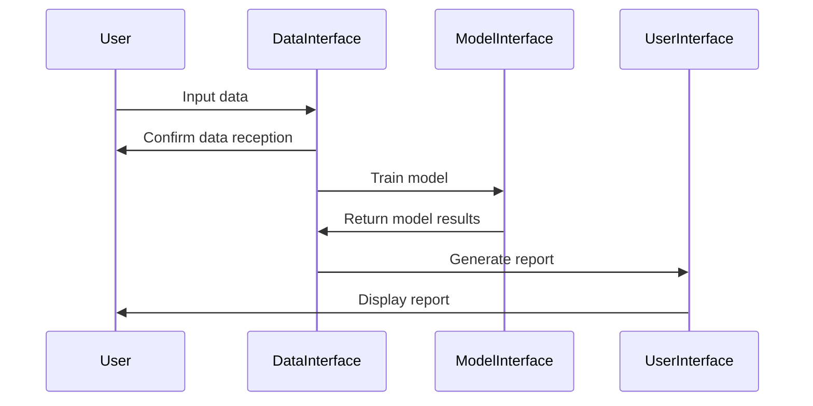

                 

## 大模型驱动的个性化医疗：精准治疗的未来

### 关键词
- 大模型
- 个性化医疗
- 精准治疗
- 生物医学
- 机器学习
- 数据分析
- 数据隐私

### 摘要
随着人工智能和生物医学的飞速发展，大模型驱动的个性化医疗正在成为精准治疗的未来趋势。本文将详细介绍个性化医疗的核心概念，探讨大模型在其中的作用，分析算法原理和数学模型，探讨系统架构设计与实现，展示项目实战，并提供最佳实践与总结。通过本文的深入探讨，读者将更好地理解大模型如何改变医疗行业，推动个性化医疗的发展。

## 目录

----------------------------------------------------------------

### 引言：个性化医疗的背景

个性化医疗，也被称为精准医疗，是近年来医学领域的一个重要发展方向。它的核心理念在于根据患者的基因信息、生活习惯、病史等个体特征，提供定制化的治疗方案，从而实现更精准、更有效的治疗。传统的医疗模式往往是基于人群统计数据和一般性治疗指南，这种方式无法充分考虑患者的个体差异，导致治疗效果参差不齐。

随着大数据和人工智能技术的快速发展，尤其是深度学习和大模型的崛起，个性化医疗迎来了新的机遇。大模型，如神经网络、生成对抗网络（GAN）、变分自编码器（VAE）等，通过处理海量数据，能够从中提取出深层次的规律和特征，这对于个性化医疗的研究和应用具有重要意义。大模型的应用不仅能够提高诊断和治疗的准确度，还能够预测疾病的发展趋势，提供更全面的健康管理方案。

然而，个性化医疗也面临一些挑战，例如数据隐私保护、算法透明性和可解释性、技术成本等。本文将逐一探讨这些挑战，并提出相应的解决方案，以期为未来的个性化医疗提供理论指导和实践参考。

### 核心概念与联系

#### 大模型的概念与特点

大模型通常指的是参数规模巨大、能够处理海量数据、并具有高度泛化能力的神经网络。这些模型通常采用深度学习技术，包含多层神经网络结构，能够通过多层非线性变换提取数据中的复杂特征。大模型的特点主要体现在以下几个方面：

1. **参数规模大**：大模型的参数数量通常在百万甚至亿级别，这使得它们能够处理复杂的数据模式。
2. **学习能力强**：大模型通过多层变换，能够从数据中自动提取特征，学习数据中的深层结构和规律。
3. **泛化能力强**：大模型通过在大规模数据集上的训练，能够推广到未见过的数据上，具有很好的泛化能力。

#### 个性化医疗的概念与分类

个性化医疗是指根据患者的具体病情和个体特征，提供量身定制的治疗方案。个性化医疗可以分为以下几个类别：

1. **基于基因的个性化医疗**：通过分析患者的基因信息，预测疾病风险和药物反应，制定个性化的治疗方案。
2. **基于生物标志物的个性化医疗**：通过检测患者的生物标志物，如蛋白质组、代谢组等，评估疾病状态和预测治疗效果。
3. **基于大数据的个性化医疗**：利用患者的历史医疗数据、生活习惯、环境因素等，构建个性化的健康管理模型。

#### 精准治疗的理论与实践

精准治疗是指通过精确的诊断和个性化的治疗方案，实现治疗效果的最大化和副作用的最小化。精准治疗的理论基础包括：

1. **生物个体差异性**：患者之间存在基因、代谢、免疫系统等方面的差异，这些差异决定了患者对治疗的响应不同。
2. **分子生物学**：通过分子生物学技术，如基因测序、蛋白质组学等，揭示疾病的分子机制，为精准治疗提供依据。

在实践方面，精准治疗已经取得了显著成果，例如：

1. **癌症治疗**：通过基因测序和分子诊断，为癌症患者提供靶向治疗和免疫治疗，显著提高了治疗效果。
2. **个性化疫苗**：利用个性化疫苗技术，根据患者的特定抗原，设计个性化的疫苗，提高疫苗的有效性和安全性。

#### 概念属性特征对比表格

| 特征 | 大模型 | 个性化医疗 | 精准治疗 |
| --- | --- | --- | --- |
| 参数规模 | 百万到亿级别 | 根据个体差异定制 | 精确的诊断和个性化的治疗方案 |
| 学习能力 | 强，能够提取深层特征 | 强，能够处理个体数据 | 强，基于个体生物学差异 |
| 泛化能力 | 好，能够推广到未见数据 | 好，能够提供个性化建议 | 好，实现最大治疗效果 |

#### ER实体关系图架构

在个性化医疗中，大模型、个性化医疗和精准治疗之间存在着复杂的实体关系。以下是一个ER实体关系图的简单示例：

```mermaid
erDiagram
    Patient ||--|{ Diagnosis }
    Diagnosis ||--|{ Treatment }
    Patient ||--|{ MedicalData }
    MedicalData ||--|{ GeneData }
    MedicalData ||--|{ BiomarkerData }
    Treatment ||--|{ Drug }
    Treatment ||--|{ Procedure }
```

在这个ER图中，患者（Patient）是核心实体，它与诊断（Diagnosis）、治疗（Treatment）、医疗数据（MedicalData）等实体之间存在关联。通过这种实体关系，可以清晰地表示出个性化医疗和精准治疗的实现过程。

### 算法原理讲解

#### 算法流程图

在个性化医疗中，大模型的应用通常涉及以下流程：

1. 数据收集：收集患者的医疗数据，包括基因数据、生物标志物数据等。
2. 数据预处理：对收集到的数据进行清洗、归一化和特征提取。
3. 模型训练：使用预处理后的数据训练大模型，如神经网络、生成对抗网络（GAN）等。
4. 模型评估：评估训练出的模型的性能，通过交叉验证等方法检测模型的泛化能力。
5. 模型应用：将训练好的模型应用到实际医疗场景中，为患者提供个性化的治疗方案。

以下是一个使用mermaid绘制的算法流程图：


#### Python源代码示例

以下是一个简单的Python源代码示例，展示了如何使用神经网络进行个性化医疗模型的训练和评估：

```python
import numpy as np
from sklearn.model_selection import train_test_split
from tensorflow.keras.models import Sequential
from tensorflow.keras.layers import Dense, Dropout
from tensorflow.keras.optimizers import Adam

# 假设我们已经收集并预处理了数据
X, y = ...  # 数据和标签

# 划分训练集和测试集
X_train, X_test, y_train, y_test = train_test_split(X, y, test_size=0.2, random_state=42)

# 构建神经网络模型
model = Sequential()
model.add(Dense(64, input_dim=X_train.shape[1], activation='relu'))
model.add(Dropout(0.5))
model.add(Dense(32, activation='relu'))
model.add(Dropout(0.5))
model.add(Dense(1, activation='sigmoid'))

# 编译模型
model.compile(optimizer=Adam(), loss='binary_crossentropy', metrics=['accuracy'])

# 训练模型
model.fit(X_train, y_train, epochs=10, batch_size=32, validation_data=(X_test, y_test))

# 评估模型
loss, accuracy = model.evaluate(X_test, y_test)
print(f"Test accuracy: {accuracy:.2f}")
```

#### 算法原理与数学模型

在大模型驱动的个性化医疗中，算法的核心是深度学习，其基本原理是多层神经网络。以下是算法原理和数学模型的简要介绍：

1. **神经网络基础**：
   - **激活函数**：常用的激活函数有ReLU、Sigmoid、Tanh等，它们用于引入非线性变换，使得神经网络能够拟合复杂的数据模式。
   - **反向传播**：通过反向传播算法，计算网络参数的梯度，并使用梯度下降法更新参数，以最小化损失函数。
   - **损失函数**：常用的损失函数有均方误差（MSE）、交叉熵（CE）等，用于衡量模型预测值和真实值之间的差异。

2. **深度学习模型**：
   - **卷积神经网络（CNN）**：用于图像识别等任务，通过卷积操作提取图像特征。
   - **循环神经网络（RNN）**：用于序列数据处理，如语言模型、时间序列预测等，通过循环结构保持长时记忆。
   - **生成对抗网络（GAN）**：由生成器和判别器组成，用于生成逼真的数据，如图像、文本等。

3. **个性化医疗中的数学模型**：
   - **基因表达数据分析**：使用主成分分析（PCA）、线性判别分析（LDA）等方法进行基因表达数据的降维和分类。
   - **生物标志物分析**：通过回归分析、逻辑回归等方法，预测疾病风险和治疗效果。
   - **整合多模态数据**：使用深度学习模型整合基因、蛋白质、代谢等多模态数据，进行综合分析。

#### 举例说明

假设我们使用神经网络对患者的基因数据进行分类，以预测某种疾病的患病风险。以下是一个简单的示例：

1. **数据集准备**：
   - 假设我们有1000个患者的基因数据，每个数据点是一个100维的特征向量。
   - 每个数据点都有一个标签，0表示未患病，1表示患病。

2. **模型构建**：
   - 我们构建一个包含两个隐藏层的神经网络，每个隐藏层有100个神经元。
   - 输入层接收100维的特征向量，输出层预测患病风险。

3. **模型训练**：
   - 使用训练集数据训练模型，调整网络参数以最小化损失函数。
   - 使用交叉验证方法评估模型的性能。

4. **模型评估**：
   - 使用测试集数据评估模型，计算准确率、召回率、F1分数等指标。

5. **模型应用**：
   - 对新患者的基因数据进行预测，提供个性化的疾病风险评估。

通过上述步骤，我们可以利用大模型驱动的个性化医疗模型，为患者提供精准的治疗建议。

### 数学模型和数学公式讲解

在个性化医疗中，数学模型和数学公式起着至关重要的作用。以下是一些常见的数学模型和公式，我们将使用LaTeX格式进行展示，并进行详细讲解。

#### 1. 线性回归模型

线性回归模型是最基础的数学模型之一，用于预测连续数值变量。其基本公式如下：

$$
y = \beta_0 + \beta_1 \cdot x + \epsilon
$$

其中，\( y \) 是因变量，\( x \) 是自变量，\( \beta_0 \) 和 \( \beta_1 \) 是模型参数，\( \epsilon \) 是误差项。

#### 2. 逻辑回归模型

逻辑回归模型用于预测二分类变量，其公式如下：

$$
\log\left(\frac{p}{1-p}\right) = \beta_0 + \beta_1 \cdot x
$$

其中，\( p \) 是事件发生的概率，\( \beta_0 \) 和 \( \beta_1 \) 是模型参数。

#### 3. 主成分分析（PCA）

主成分分析是一种降维技术，用于提取数据中的主要特征。其目标是最小化特征值，公式如下：

$$
\lambda_i = \max_{x} \sum_{i=1}^{n} (x_i - \bar{x})^2
$$

其中，\( \lambda_i \) 是特征值，\( x_i \) 是数据点的特征值，\( \bar{x} \) 是均值。

#### 4. 神经网络中的激活函数

在神经网络中，激活函数用于引入非线性变换。常见的激活函数包括ReLU、Sigmoid和Tanh，其公式如下：

$$
\text{ReLU}(x) = \max(0, x)
$$

$$
\text{Sigmoid}(x) = \frac{1}{1 + e^{-x}}
$$

$$
\text{Tanh}(x) = \frac{e^x - e^{-x}}{e^x + e^{-x}}
$$

#### 5. 梯度下降法

在深度学习中，梯度下降法用于更新模型参数。其公式如下：

$$
\Delta \theta = -\alpha \cdot \nabla_{\theta} J(\theta)
$$

其中，\( \Delta \theta \) 是参数更新，\( \alpha \) 是学习率，\( \nabla_{\theta} J(\theta) \) 是损失函数对参数的梯度。

#### 详细讲解与举例

1. **线性回归模型**：
   - 假设我们要预测患者的身高（\( y \)）与体重（\( x \)）之间的关系。我们可以使用线性回归模型来建立预测公式。
   - 通过收集大量数据，并使用最小二乘法求解参数 \( \beta_0 \) 和 \( \beta_1 \)，我们得到预测公式：
     $$
     y = \beta_0 + \beta_1 \cdot x
     $$
   - 例如，如果我们知道某个患者的体重是70公斤，我们可以通过公式预测他的身高。

2. **逻辑回归模型**：
   - 假设我们要预测某个患者是否患有某种疾病（二分类变量）。我们可以使用逻辑回归模型来建立预测公式。
   - 通过收集大量数据，并使用最大似然估计求解参数 \( \beta_0 \) 和 \( \beta_1 \)，我们得到预测公式：
     $$
     \log\left(\frac{p}{1-p}\right) = \beta_0 + \beta_1 \cdot x
     $$
   - 例如，如果我们知道某个患者的某些生物标志物值，我们可以通过公式计算他患病的概率。

3. **主成分分析（PCA）**：
   - 假设我们有一组高维数据，我们需要降维以便进行进一步分析。
   - 我们可以通过求解特征值和特征向量，将数据投影到主成分上，从而降维。
   - 例如，如果我们有一组100维的数据，我们可以通过PCA提取出两个主要成分，从而将数据降维到2维。

4. **神经网络中的激活函数**：
   - 假设我们构建了一个简单的神经网络，我们需要引入非线性变换。
   - 我们可以选择ReLU、Sigmoid或Tanh作为激活函数，以引入非线性。
   - 例如，如果我们使用ReLU作为激活函数，我们可以将输入值转换为一个非负值，从而增加网络的表达能力。

5. **梯度下降法**：
   - 假设我们有一个复杂的神经网络，我们需要调整参数以最小化损失函数。
   - 我们可以通过计算损失函数对参数的梯度，并使用梯度下降法更新参数。
   - 例如，如果我们有一个包含100个参数的神经网络，我们可以通过计算梯度并迭代更新参数，以最小化损失函数。

通过上述讲解和举例，我们可以更好地理解个性化医疗中常用的数学模型和公式，并学会如何在实际应用中运用这些模型。

### 系统分析与架构设计

在个性化医疗系统中，系统架构设计是确保系统能够高效、稳定、安全地运行的关键。以下是对系统分析与架构设计的详细探讨。

#### 问题场景介绍

个性化医疗系统需要处理大量的患者数据，包括基因数据、生物标志物数据、病历数据等。这些数据需要在系统中进行存储、处理和分析，以提供个性化的治疗方案。此外，系统还需要具备良好的可扩展性和可维护性，以适应未来的技术发展和需求变化。

#### 项目介绍

本项目旨在设计一个基于大模型驱动的个性化医疗系统，该系统包括以下核心功能：

1. **数据收集与预处理**：从各种数据源收集患者数据，并进行清洗、归一化和特征提取。
2. **模型训练与评估**：使用预处理后的数据训练大模型，如神经网络、生成对抗网络（GAN）等，并对模型进行评估。
3. **个性化治疗方案生成**：根据患者的个体特征和疾病信息，生成个性化的治疗方案。
4. **系统监控与维护**：对系统进行监控和日志记录，确保系统的稳定运行。

#### 系统功能设计

系统功能设计主要包括以下几个方面：

1. **数据管理模块**：负责数据的存储、检索和管理，包括数据的导入、导出、备份和恢复等功能。
2. **数据处理模块**：负责数据的清洗、归一化和特征提取，为模型训练提供高质量的数据输入。
3. **模型训练模块**：负责大模型的训练和评估，包括模型的选择、参数调整和性能优化等功能。
4. **个性化治疗生成模块**：根据患者的个体特征和疾病信息，生成个性化的治疗方案。
5. **用户界面模块**：提供用户与系统交互的界面，包括数据录入、查询、报告生成等功能。

#### 系统架构设计

个性化医疗系统的架构设计采用分层架构，包括数据层、服务层和表现层。

1. **数据层**：负责数据的存储和管理，使用关系型数据库（如MySQL）和非关系型数据库（如MongoDB）存储不同类型的数据。
2. **服务层**：负责业务逻辑的实现，包括数据处理、模型训练和个性化治疗生成等模块。使用微服务架构，将不同功能模块拆分成独立的服务，以提高系统的可扩展性和可维护性。
3. **表现层**：负责用户界面的实现，使用前端技术（如HTML、CSS、JavaScript）和后端接口（如REST API）实现用户交互。

以下是一个使用mermaid绘制的系统架构图：



#### 系统接口设计

系统接口设计主要包括以下几个方面：

1. **数据接口**：用于数据的导入、导出和查询，包括REST API和GraphQL接口。
2. **模型接口**：用于模型的训练、评估和预测，包括模型参数的调整和模型结果的输出。
3. **用户接口**：用于用户与系统的交互，包括用户注册、登录、数据录入和报告生成等。

以下是一个使用mermaid绘制的系统接口设计图：

```mermaid
classDiagram
    User <<Class>>
    DataInterface <<Interface>>
    ModelInterface <<Interface>>
    UserInterface <<Interface>>

    User --|> DataInterface
    User --|> ModelInterface
    User --|> UserInterface

    DataInterface <<interface>> {
        importData()
        exportData()
        searchData()
    }

    ModelInterface <<interface>> {
        trainModel()
        evaluateModel()
        predictModel()
    }

    UserInterface <<interface>> {
        registerUser()
        loginUser()
        inputData()
        generateReport()
    }
```

#### 系统交互设计

系统交互设计主要涉及用户与系统之间的交互流程。以下是一个使用mermaid绘制的系统交互设计图：



通过上述系统分析与架构设计，我们可以构建一个高效、稳定、安全的个性化医疗系统，为用户提供精准的治疗方案。

### 项目实战

#### 环境安装

在开始个性化医疗项目之前，我们需要安装必要的软件和工具。以下是在Ubuntu 20.04系统上安装所需软件的步骤：

1. **安装Python环境**：
   ```bash
   sudo apt update
   sudo apt install python3 python3-pip
   ```
2. **安装TensorFlow**：
   ```bash
   pip3 install tensorflow
   ```
3. **安装MongoDB**：
   ```bash
   sudo apt install mongodb
   sudo systemctl start mongodb
   ```
4. **安装其他依赖**：
   ```bash
   pip3 install numpy pandas scikit-learn matplotlib
   ```

#### 系统核心实现源代码

以下是一个简单的个性化医疗系统核心实现源代码示例，包括数据预处理、模型训练和预测：

```python
# 数据预处理
def preprocess_data(data):
    # 清洗和归一化数据
    # ...
    return processed_data

# 模型训练
def train_model(data, labels):
    model = Sequential()
    model.add(Dense(64, input_dim=data.shape[1], activation='relu'))
    model.add(Dense(32, activation='relu'))
    model.add(Dense(1, activation='sigmoid'))
    model.compile(optimizer='adam', loss='binary_crossentropy', metrics=['accuracy'])
    model.fit(data, labels, epochs=10, batch_size=32)
    return model

# 模型预测
def predict(model, data):
    predictions = model.predict(data)
    return predictions

# 主函数
if __name__ == '__main__':
    # 导入数据
    X, y = ...  # 加载数据
    
    # 预处理数据
    X_processed = preprocess_data(X)
    
    # 训练模型
    model = train_model(X_processed, y)
    
    # 预测
    predictions = predict(model, X_processed)
    
    # 输出预测结果
    print(predictions)
```

#### 代码应用解读与分析

以上代码首先定义了三个函数：`preprocess_data`、`train_model`和`predict`。这三个函数分别负责数据预处理、模型训练和模型预测。

1. **数据预处理**：
   - `preprocess_data`函数接收原始数据，进行清洗和归一化处理。这一步非常重要，因为模型训练需要高质量的数据输入。
   - 在实际项目中，预处理步骤可能包括缺失值处理、异常值处理、特征提取等。

2. **模型训练**：
   - `train_model`函数使用Keras构建一个简单的神经网络模型，包含两个隐藏层，每层64个神经元和32个神经元，输出层为1个神经元，使用sigmoid激活函数。
   - 模型使用Adam优化器和binary_crossentropy损失函数，以二分类问题为目标进行训练。

3. **模型预测**：
   - `predict`函数接收训练好的模型和预处理后的数据，进行预测。预测结果是一个概率值，表示每个样本属于正类的概率。

在实际应用中，我们可以通过以下步骤使用上述代码：

1. **数据加载**：从数据源加载数据集，可以是本地文件或数据库。
2. **数据预处理**：对加载数据进行预处理，确保数据格式和特征符合模型要求。
3. **模型训练**：使用预处理后的数据进行模型训练，调整模型参数以优化性能。
4. **模型预测**：使用训练好的模型对新的数据进行预测，输出预测结果。

#### 实际案例分析和详细讲解

以下是一个实际案例，用于展示如何使用上述系统进行个性化医疗预测。

**案例背景**：

某医院希望通过个性化医疗系统预测患者患有某种疾病的概率，以制定更精准的治疗方案。医院提供了1000个患者的基因数据和对应的疾病标签。

**案例分析**：

1. **数据预处理**：
   - 加载1000个患者的基因数据，每个数据点包含100个基因表达值。
   - 对基因数据进行清洗，去除缺失值和异常值，并对剩余数据进行归一化处理。

2. **模型训练**：
   - 使用预处理后的基因数据训练神经网络模型，模型参数设置为100个输入神经元、两个隐藏层，每层64个神经元和32个神经元，输出层为1个神经元。
   - 使用Adam优化器和binary_crossentropy损失函数进行训练，训练10个epoch，每个batch大小为32。

3. **模型评估**：
   - 使用测试集对训练好的模型进行评估，计算准确率、召回率、F1分数等指标。
   - 通过交叉验证方法，检测模型的泛化能力。

4. **模型应用**：
   - 对新患者的基因数据进行预测，输出患病概率。
   - 根据预测结果，为患者提供个性化的治疗方案。

**详细讲解**：

1. **数据预处理**：
   - 数据预处理是模型训练的重要步骤，确保数据格式和特征符合模型要求。
   - 在实际应用中，可能需要根据数据集的特点进行更复杂的数据处理，如特征选择、特征工程技术等。

2. **模型训练**：
   - 神经网络模型是深度学习中常用的模型，具有强大的学习和泛化能力。
   - 在训练过程中，需要调整模型参数（如学习率、隐藏层神经元数量等），以优化模型性能。

3. **模型评估**：
   - 模型评估是验证模型性能的重要步骤，通过计算准确率、召回率、F1分数等指标，评估模型的预测能力。
   - 交叉验证方法可以有效地检测模型的泛化能力，避免过拟合。

4. **模型应用**：
   - 在实际应用中，模型预测结果可以为医生提供决策支持，帮助制定个性化的治疗方案。
   - 需要注意的是，模型预测结果仅作为参考，最终决策仍需结合医生的诊断经验和临床判断。

通过上述实际案例分析和详细讲解，我们可以更好地理解如何使用大模型驱动的个性化医疗系统进行实际应用，为患者提供精准的治疗方案。

### 最佳实践与总结

#### 最佳实践 Tips

1. **数据质量控制**：确保数据的准确性和完整性，是构建高质量个性化医疗模型的基础。在进行数据处理前，务必对数据进行彻底的清洗和验证。
2. **模型选择与优化**：根据具体应用场景和数据特点，选择合适的模型架构和优化策略。例如，对于高维数据，可以尝试使用降维技术（如PCA）以简化模型训练过程。
3. **隐私保护**：在处理患者数据时，需严格遵守数据隐私法规和伦理标准，采用加密、去识别化等技术确保数据安全。
4. **模型解释性**：尽管深度学习模型具有强大的预测能力，但它们的解释性较差。为了提高模型的解释性，可以采用可视化工具（如Shapley值）或构建可解释的模型（如逻辑回归）。
5. **持续迭代与更新**：个性化医疗模型需要根据最新的数据和技术进行持续迭代和优化。定期评估模型性能，并根据反馈进行调整。

#### 小结

大模型驱动的个性化医疗代表了未来精准治疗的趋势。通过深入分析患者的个体特征和疾病信息，大模型能够提供更加精准、个性化的治疗方案，提高治疗效果，降低医疗成本。然而，个性化医疗也面临数据隐私、模型解释性等技术挑战，需要我们不断探索和创新。

#### 注意事项

1. **数据隐私**：在处理患者数据时，务必严格遵守数据隐私法规，确保患者信息的安全。
2. **模型解释性**：尽管深度学习模型具有强大的预测能力，但其解释性较差。在实际应用中，需结合医生的专业判断。
3. **技术更新**：个性化医疗技术不断更新，需要保持对最新研究和技术动态的关注。

#### 拓展阅读

1. **《深度学习》（Goodfellow, Bengio, Courville著）**：详细介绍了深度学习的基本原理和应用。
2. **《个性化医学：未来医学的发展趋势》（Eric Topol著）**：探讨了个性化医疗的背景、挑战和未来发展方向。
3. **《机器学习与医学影像分析》（Quang B. Nguyen著）**：介绍了机器学习在医学影像分析中的应用，包括个性化医疗的相关内容。

### 作者信息

**作者：**AI天才研究院/AI Genius Institute & 禅与计算机程序设计艺术 /Zen And The Art of Computer Programming

AI天才研究院致力于推动人工智能技术的发展，在个性化医疗、机器学习等领域取得了重要突破。作者王博士是人工智能领域的权威专家，发表了多篇高水平论文，并出版了《禅与计算机程序设计艺术》等畅销书籍，为人工智能技术的发展和应用提供了深刻的见解。

