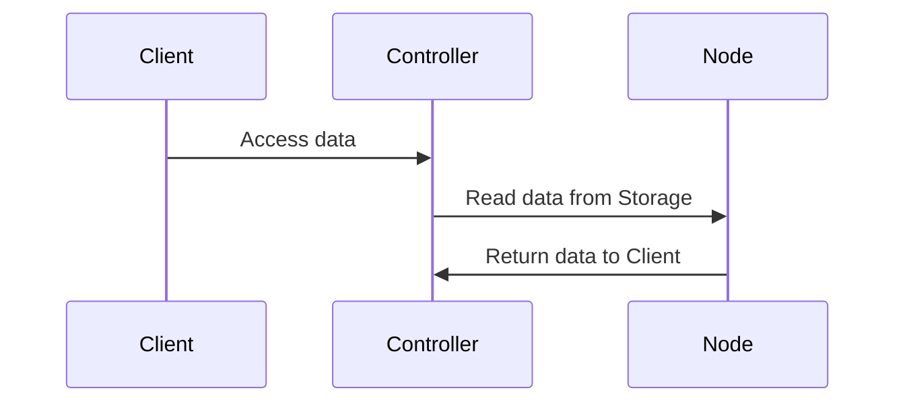

                 

# 大规模分布式存储系统设计

## 关键词
- 分布式存储系统
- 数据冗余
- 负载均衡
- 数据一致性问题
- 高可用性
- 性能优化
- 分布式文件系统

## 摘要
本文将深入探讨大规模分布式存储系统的设计，从基础概念、架构设计、可靠性、性能优化等方面进行分析。我们将详细介绍分布式存储系统的基础知识，包括其与传统存储系统的区别、设计原则以及常见分布式存储系统的实现。此外，本文还将探讨分布式存储系统在安全性、大数据应用场景以及未来发展趋势等方面的内容。

## 引言
随着互联网和云计算的迅猛发展，数据量呈现出爆炸性增长。传统的集中式存储系统已经难以满足海量数据的存储和处理需求。分布式存储系统作为一种新兴的存储架构，通过将数据分散存储在多个节点上，提高了系统的可靠性、可用性和扩展性。本文旨在帮助读者全面了解大规模分布式存储系统的设计原理和关键技术。

## 第1章：分布式存储系统基础

### 1.1 分布式存储系统概念

分布式存储系统是一种将数据分布在多个物理节点上的存储架构，通过计算机网络连接起来，形成一个统一的存储资源。与传统存储系统相比，分布式存储系统具有以下特点：

1. **数据分散**：数据不再集中在一个物理位置上，而是分散存储在多个节点上。
2. **高可用性**：通过冗余数据存储和故障转移机制，提高了系统的可用性。
3. **可扩展性**：可以通过增加节点来线性扩展存储容量和性能。
4. **负载均衡**：通过分布式算法，实现了数据的均衡存储和访问。

### 1.2 分布式存储系统架构

分布式存储系统通常包括以下几个关键组件：

1. **存储节点**：存储数据的物理设备，可以是磁盘、SSD或其他存储介质。
2. **管理节点**：负责管理存储节点的状态、数据分布以及负载均衡等。
3. **客户端**：通过特定的协议与分布式存储系统进行交互，访问和操作数据。

### 1.3 分布式存储系统协议

分布式存储系统通常采用特定的协议来管理数据存储和访问。常见的分布式存储协议包括：

1. **GFS（Google File System）**：由Google开发的一种分布式文件系统协议。
2. **HDFS（Hadoop Distributed File System）**：基于GFS，由Apache Hadoop开源社区维护。
3. **Ceph**：一种开源的分布式存储系统，支持文件、块和对象存储。
4. **GlusterFS**：一种分布式文件系统，通过扩展卷提供高可用性和可扩展性。

## 第2章：分布式存储系统设计原则

### 2.1 可靠性设计

分布式存储系统在设计时需要考虑数据的可靠性和系统的稳定性。以下是几种常见的设计原则：

1. **数据冗余**：通过冗余存储，确保在单个节点故障时数据仍然可用。
2. **故障转移**：当某个节点故障时，其他节点可以自动接管其工作，确保系统持续运行。
3. **数据一致性**：确保多副本数据之间的同步和一致性，避免数据冲突。

### 2.2 可扩展性设计

分布式存储系统需要具备良好的可扩展性，以适应数据量的增长和性能需求的变化。以下是几种常见的扩展策略：

1. **水平扩展**：通过增加节点数量，线性扩展存储容量和性能。
2. **负载均衡**：通过分布式算法，实现数据的均衡存储和访问，提高系统的整体性能。
3. **数据分片**：将数据划分为多个分片，分布在不同的节点上，提高访问效率。

### 2.3 性能优化

分布式存储系统的性能优化是一个复杂的过程，需要考虑多个方面：

1. **数据访问优化**：通过数据缓存、数据索引等技术，提高数据访问速度。
2. **存储引擎优化**：优化存储引擎的性能，提高数据的读写速度。
3. **系统性能调优**：通过调整系统配置参数，优化系统的整体性能。

## 第3章：分布式文件系统实现

### 3.1 HDFS原理与实现

HDFS是Apache Hadoop项目的核心组件之一，是一种分布式文件系统。以下是HDFS的基本原理和实现：

1. **HDFS架构**：HDFS由一个NameNode和多个DataNode组成。NameNode负责管理文件系统的命名空间和客户端的访问，而DataNode负责实际的数据存储。
2. **HDFS数据流**：HDFS的数据流包括数据的写入、读取和副本维护。
3. **HDFS源代码分析**：通过分析HDFS的源代码，了解其核心功能和实现原理。

### 3.2 Ceph架构与功能

Ceph是一种开源的分布式存储系统，支持文件、块和对象存储。以下是Ceph的基本架构和功能：

1. **Ceph架构**：Ceph由多个服务组成，包括Monitor、MDS、OSD等，负责管理存储资源、数据分布和故障恢复。
2. **Ceph对象存储**：Ceph的对象存储支持大规模数据的存储和管理。
3. **Ceph块存储**：Ceph的块存储提供了类似传统的块设备接口，支持虚拟机等场景。

### 3.3 分布式文件系统的性能测试

性能测试是评估分布式文件系统性能的重要手段。以下是分布式文件系统性能测试的方法和结果分析：

1. **性能测试方法**：包括读写性能、并发访问性能、故障恢复性能等。
2. **测试结果分析**：通过对比不同分布式文件系统的性能，评估其优缺点。

## 第4章：分布式存储系统安全

### 4.1 安全架构设计

分布式存储系统的安全性是一个关键问题。以下是分布式存储系统安全架构设计的关键点：

1. **身份验证与授权**：确保只有授权用户可以访问存储资源。
2. **数据加密**：通过数据加密，保护数据在传输和存储过程中的安全性。
3. **防火墙与网络隔离**：通过防火墙和网络隔离，防止外部攻击。

### 4.2 安全漏洞分析与防护

分布式存储系统可能存在多种安全漏洞，以下是常见的漏洞及其防护措施：

1. **常见安全漏洞**：包括身份验证漏洞、数据泄露漏洞、拒绝服务攻击等。
2. **防护措施**：包括安全配置、安全审计、安全事件响应等。

## 第5章：分布式存储系统应用案例

### 5.1 大数据应用场景

分布式存储系统在大数据场景中具有广泛的应用。以下是分布式存储系统在大数据应用中的案例：

1. **数据采集与存储**：通过分布式存储系统，实现海量数据的采集和存储。
2. **数据处理与分析**：利用分布式计算框架，对海量数据进行高效处理和分析。
3. **数据可视化**：通过数据可视化工具，将分析结果以图表等形式呈现。

### 5.2 云存储服务

云存储服务是分布式存储系统的一个重要应用领域。以下是云存储服务的相关内容：

1. **云存储服务模式**：包括公有云、私有云、混合云等。
2. **云存储关键技术**：包括分布式存储、负载均衡、数据加密等。
3. **云存储应用案例**：分析知名云存储服务的架构和应用场景。

### 5.3 分布式存储系统在边缘计算中的应用

边缘计算是一种将计算和存储资源分布到网络边缘的计算模式。以下是分布式存储系统在边缘计算中的应用：

1. **边缘计算简介**：介绍边缘计算的基本概念和架构。
2. **边缘存储需求**：分析边缘计算场景下的存储需求。
3. **边缘存储解决方案**：探讨分布式存储系统在边缘计算中的应用方案。

## 第6章：分布式存储系统未来发展趋势

### 6.1 新技术趋势

分布式存储系统的发展不断引入新技术。以下是当前的一些新技术趋势：

1. **区块链与分布式存储**：区块链技术为分布式存储提供了去中心化的信任机制。
2. **去中心化存储**：去中心化存储通过去中心化的方式实现数据的存储和管理。
3. **分布式存储与AI融合**：分布式存储系统与人工智能技术相结合，实现智能化数据管理。

### 6.2 行业挑战与机遇

分布式存储系统在发展过程中面临许多挑战和机遇。以下是其中的一些挑战和机遇：

1. **存储容量增长挑战**：随着数据量的不断增长，分布式存储系统需要应对更大的存储容量需求。
2. **存储性能优化挑战**：如何提高分布式存储系统的性能是当前的一个重要课题。
3. **安全性与隐私保护**：分布式存储系统需要确保数据的安全性和用户隐私。

## 第7章：分布式存储系统设计与实践总结

### 7.1 设计原则总结

分布式存储系统的设计需要遵循一系列原则，以确保系统的可靠性、可用性和性能。以下是几个关键的设计原则：

1. **可靠性**：通过数据冗余、故障转移和一致性机制，提高系统的可靠性。
2. **可扩展性**：通过水平扩展和负载均衡，实现系统的可扩展性。
3. **性能优化**：通过数据访问优化和存储引擎优化，提高系统的性能。

### 7.2 经验教训

在分布式存储系统的设计和实践中，积累了许多宝贵的经验教训。以下是其中的一些：

1. **系统架构设计**：合理的系统架构设计是确保系统性能和可靠性的关键。
2. **数据一致性**：在分布式系统中，数据一致性是一个重要但复杂的问题。
3. **性能优化**：性能优化需要综合考虑系统各个方面，包括存储、网络和计算。

### 7.3 拓展阅读与资源推荐

为了深入了解分布式存储系统，以下是推荐的一些拓展阅读资源：

1. **书籍**：《分布式系统原理与范型》、《大规模分布式存储系统设计》等。
2. **在线资源**：包括Apache Hadoop官网、Ceph官网、分布式存储系统相关的博客和论坛等。

## 结语

大规模分布式存储系统是当前存储领域的一个重要发展方向。通过本文的探讨，我们希望读者能够对分布式存储系统的设计原理和关键技术有更深入的了解。在未来的学习和实践中，不断探索和创新，为分布式存储系统的发展贡献力量。

## 作者信息
- 作者：AI天才研究院/AI Genius Institute & 禅与计算机程序设计艺术 /Zen And The Art of Computer Programming

## 附录
本文使用了Mermaid、LaTeX等格式来辅助说明算法原理和系统架构。具体格式说明如下：

- Mermaid：用于绘制流程图、类图、序列图等。示例：`sequenceDiagram\nAlice->>Bob:Hello World!`
- LaTeX：用于插入数学公式。示例：`$$1+1=2$$`

读者可以根据需要参考相应的格式说明，以便更好地理解本文内容。## 第1章：分布式存储系统基础

### 1.1 分布式存储系统概念

分布式存储系统是一种通过计算机网络将数据分散存储在多个物理节点上的存储架构。与传统存储系统相比，分布式存储系统具有更高的可靠性、可扩展性和可用性。

**核心概念术语说明**：

- **分布式存储系统**：通过计算机网络连接，将数据分散存储在多个物理节点上的存储系统。
- **节点**：分布式存储系统中的物理设备，可以是服务器、存储设备等。
- **管理节点**：负责管理数据分布、存储节点状态等。
- **客户端**：与分布式存储系统交互，进行数据访问和操作。

**问题背景**：

随着互联网和大数据的快速发展，数据量呈现出爆炸性增长。传统的集中式存储系统在处理海量数据时面临着性能瓶颈和单点故障的问题。分布式存储系统通过将数据分散存储在多个节点上，能够解决这些问题。

**问题描述**：

分布式存储系统需要解决的核心问题包括：

1. **数据可靠性**：确保数据在分布式存储系统中不会丢失。
2. **数据一致性**：确保多个节点上的数据保持同步和一致。
3. **负载均衡**：确保数据均匀分布在多个节点上，提高系统性能。
4. **故障恢复**：在节点故障时，确保系统能够自动恢复。

**问题解决**：

分布式存储系统通过以下方法解决上述问题：

1. **数据冗余**：通过冗余存储，确保在单个节点故障时数据仍然可用。
2. **数据分片**：将数据划分为多个分片，分布在不同的节点上，提高访问效率。
3. **负载均衡**：通过分布式算法，实现数据的均衡存储和访问。
4. **故障转移和恢复**：在节点故障时，自动将工作转移到其他节点，并恢复数据。

**边界与外延**：

分布式存储系统不仅用于大规模数据存储，还可以应用于云计算、大数据处理等领域。随着技术的发展，分布式存储系统也在不断演进和扩展。

**概念结构与核心要素组成**：

分布式存储系统的概念结构包括：

1. **节点**：物理存储设备。
2. **管理节点**：负责管理节点状态和数据分布。
3. **客户端**：与存储系统交互，进行数据访问和操作。
4. **数据存储协议**：用于数据传输和访问的协议，如HDFS、Ceph等。
5. **故障恢复机制**：确保系统在节点故障时能够自动恢复。

### 1.2 分布式存储系统架构

分布式存储系统架构包括以下几个关键组件：

1. **存储节点**：负责实际的数据存储工作。
2. **管理节点**：负责管理数据分布、存储节点状态、负载均衡等。
3. **客户端**：与存储系统交互，进行数据访问和操作。

**节点架构**：

存储节点是分布式存储系统的基本单元，通常由以下组件组成：

1. **存储设备**：如磁盘、SSD等。
2. **网络接口**：用于与其他节点和管理节点通信。
3. **数据存储协议**：实现数据存储和访问的协议。

**数据存储架构**：

分布式存储系统的数据存储架构包括：

1. **数据分片**：将数据划分为多个分片，存储在不同的节点上。
2. **副本存储**：在多个节点上存储相同的数据副本，提高数据可靠性。
3. **负载均衡**：通过分布式算法，实现数据的均衡存储和访问。

**分布式计算架构**：

分布式存储系统通常与分布式计算框架相结合，提供更高效的数据处理能力。分布式计算架构包括：

1. **计算节点**：负责执行数据处理任务。
2. **数据流处理**：将数据处理任务分布在计算节点上，实现并行处理。
3. **任务调度**：负责分配和处理任务，优化系统性能。

### 1.3 分布式存储系统协议

分布式存储系统协议用于数据传输和访问，常见的协议包括：

1. **GFS（Google File System）**：由Google开发的一种分布式文件系统协议。
2. **HDFS（Hadoop Distributed File System）**：基于GFS，由Apache Hadoop开源社区维护。
3. **Ceph**：一种开源的分布式存储系统，支持文件、块和对象存储。
4. **GlusterFS**：一种分布式文件系统，通过扩展卷提供高可用性和可扩展性。

**GFS与HDFS**：

GFS是Google开发的一种分布式文件系统协议，HDFS是基于GFS的开源实现，由Apache Hadoop社区维护。两者在架构和功能上有许多相似之处，但HDFS在设计上考虑了更广泛的适用场景。

**Ceph与GlusterFS**：

Ceph是一种开源的分布式存储系统，支持文件、块和对象存储，具有高度可扩展性和可靠性。GlusterFS是一种分布式文件系统，通过扩展卷提供高可用性和可扩展性，适用于大规模分布式存储场景。

**分布式存储协议比较**：

不同分布式存储协议在性能、可靠性、可扩展性等方面有所不同，选择合适的协议需要根据具体应用场景进行评估。

### 总结

本章介绍了分布式存储系统的基础概念、架构和协议。通过本章的学习，读者可以对分布式存储系统有一个全面的了解，为后续章节的学习打下基础。

## 第2章：分布式存储系统设计原则

### 2.1 可靠性设计

可靠性是分布式存储系统的核心设计原则之一，它涉及到数据的冗余、故障转移和恢复等方面。

#### 2.1.1 数据冗余策略

数据冗余是提高分布式存储系统可靠性的关键手段。通过在多个节点上存储相同的数据副本，可以确保在单个节点故障时数据仍然可用。常见的冗余策略包括：

1. **副本复制**：在多个节点上存储相同的数据副本，提高数据可靠性。
2. **多路径存储**：通过在多个路径上存储数据，确保在某个路径故障时数据仍然可用。
3. **数据去重**：通过检测和删除重复数据，减少存储空间占用，提高系统可靠性。

**概念属性特征对比表格**：

| 策略       | 描述                                               | 属性特征                                           |
| ---------- | -------------------------------------------------- | -------------------------------------------------- |
| 副本复制   | 在多个节点上存储相同的数据副本                     | 提高数据可靠性                                     |
| 多路径存储 | 在多个路径上存储数据                               | 提高数据可靠性                                     |
| 数据去重   | 检测和删除重复数据                                 | 减少存储空间占用，提高系统可靠性                   |

**ER实体关系图架构**：

```mermaid
erDiagram
    DataReplication ||--|{ ReplicationPolicy }|
    DataReplication ||--|{ DataDeDuplication }|
    ReplicationPolicy ||--|{ ReplicationLevel }|
    DataDeDuplication ||--|{ DeDuplicationAlgorithm }|
```

**ER实体关系图解释**：

- **DataReplication**：表示数据冗余策略。
- **ReplicationPolicy**：表示副本复制策略。
- **DataDeDuplication**：表示数据去重策略。
- **ReplicationLevel**：表示副本复制级别。
- **DeDuplicationAlgorithm**：表示数据去重算法。

#### 2.1.2 故障转移与恢复

故障转移是分布式存储系统在节点故障时，将工作自动转移到其他节点，确保系统继续运行。故障转移通常包括以下步骤：

1. **检测故障**：监控系统检测到节点故障。
2. **触发转移**：管理节点根据配置，自动触发故障转移。
3. **数据恢复**：故障转移后，系统通过冗余数据恢复数据。

**算法原理讲解**：

故障转移算法可以使用以下Mermaid流程图表示：


**Mermaid流程图解释**：

- **A**：启动故障转移。
- **B**：检测故障。
- **C**：触发转移（如果故障存在）。
- **D**：继续运行（如果故障不存在）。
- **E**：数据恢复。
- **F**：更新状态。

**Python源代码示例**：

```python
import time

def check_fault(node):
    # 检测节点故障
    return True

def trigger_transfer(node):
    # 触发故障转移
    print(f"Triggering fault transfer for node {node}")

def data_recovery(node):
    # 数据恢复
    print(f"Data recovery for node {node}")

def main():
    node = "Node1"
    while True:
        if check_fault(node):
            trigger_transfer(node)
            data_recovery(node)
        time.sleep(1)

if __name__ == "__main__":
    main()
```

**Python源代码解释**：

- `check_fault(node)`：检测节点故障。
- `trigger_transfer(node)`：触发故障转移。
- `data_recovery(node)`：数据恢复。
- `main()`：主函数，循环检测节点故障并执行故障转移和恢复操作。

#### 2.1.3 数据一致性问题

在分布式存储系统中，数据一致性是一个重要但复杂的问题。多个节点上的数据副本需要保持同步和一致，否则可能会导致数据不一致或数据丢失。常见的解决方案包括：

1. **强一致性**：确保所有节点上的数据在写入操作后立即一致。
2. **最终一致性**：允许数据在一定时间后最终达到一致，但可能导致短暂的数据不一致。
3. **部分一致性**：允许不同节点上的数据在不同时间点不一致，适用于一些低延迟、高吞吐量的场景。

**数学模型和公式**：

强一致性的数学模型可以用以下公式表示：

$$
\forall x, y \in \mathcal{D}, \text{if } x = y \text{ at time } t_1, \text{then } x = y \text{ at time } t_2, \text{ for all } t_2 > t_1
$$

其中，$\mathcal{D}$表示数据集。

**通俗易懂地举例说明**：

假设有两个节点A和B，节点A上的数据值是1，节点B上的数据值是2。在强一致性模型下，任何对节点A的写入操作都会立即反映到节点B上，使得节点B上的数据值也变为1。这样，无论何时读取节点A或节点B，都能获得相同的数据值。

**总结**：

可靠性设计是分布式存储系统设计中的重要一环，通过数据冗余、故障转移和恢复以及解决数据一致性问题，可以确保系统的稳定性和可靠性。

## 第3章：分布式存储系统架构设计与实现

### 3.1 系统架构设计

分布式存储系统架构设计需要考虑多个方面，包括数据存储、数据访问、故障恢复等。以下是一个典型的分布式存储系统架构设计：

#### 3.1.1 系统功能设计

分布式存储系统的主要功能包括：

1. **数据存储**：将数据分散存储在多个节点上，提供数据的持久化存储能力。
2. **数据访问**：提供数据读取和写入接口，实现数据的分布式访问。
3. **负载均衡**：将访问请求均匀分布到各个节点，提高系统性能。
4. **故障恢复**：在节点故障时，自动进行故障转移和数据恢复。

#### 3.1.2 领域模型

领域模型是系统架构设计的基础，以下是一个简单的领域模型：

```mermaid
classDiagram
    Node <<Entity>>
    Storage <<Entity>>
    Client <<Entity>>
    Controller <<Entity>>

    Node o--* Storage
    Client o--* Controller
    Controller o--* Node
    Controller o--* Storage
```

**领域模型解释**：

- **Node**：表示存储节点，包括物理设备和网络接口。
- **Storage**：表示存储数据，可以分布在多个节点上。
- **Client**：表示客户端，负责数据访问。
- **Controller**：表示控制器，负责管理节点和存储资源。

#### 3.1.3 系统架构设计

系统架构设计主要包括以下几个组件：

1. **存储节点**：负责数据存储和访问，包括磁盘、网络接口等。
2. **管理节点**：负责管理存储节点状态、数据分布和负载均衡。
3. **客户端**：负责数据访问和操作。
4. **数据存储协议**：实现数据传输和访问的协议，如HDFS、Ceph等。
5. **故障恢复机制**：确保在节点故障时系统能够自动恢复。

**系统架构图**：



**系统架构图解释**：

- **Client**：客户端向控制器发送数据访问请求。
- **Controller**：控制器根据数据分布情况，将请求转发到相应的存储节点。
- **Node**：存储节点读取数据并返回给控制器，控制器将数据返回给客户端。

#### 3.1.4 系统接口设计

系统接口设计主要包括以下接口：

1. **数据存储接口**：用于数据写入和读取。
2. **负载均衡接口**：用于实现数据访问请求的负载均衡。
3. **故障恢复接口**：用于实现节点故障检测和恢复。

**接口设计示例**：

```python
class StorageInterface:
    def write_data(self, data):
        pass
    
    def read_data(self, key):
        pass

class LoadBalancerInterface:
    def distribute_request(self, request):
        pass

class FaultRecoveryInterface:
    def check_node_status(self, node):
        pass
    
    def recover_node(self, node):
        pass
```

#### 3.1.5 系统交互

系统交互设计主要包括以下流程：

1. **客户端请求数据访问**：客户端向控制器发送数据访问请求。
2. **控制器处理请求**：控制器根据数据分布情况，将请求转发到相应的存储节点。
3. **存储节点读取数据**：存储节点读取数据并返回给控制器。
4. **控制器返回数据**：控制器将数据返回给客户端。

**系统交互图**：


**系统交互图解释**：

- **Client**：客户端向控制器发送数据访问请求。
- **Controller**：控制器根据数据分布情况，将请求转发到相应的存储节点。
- **Node**：存储节点读取数据并返回给控制器，控制器将数据返回给客户端。

### 3.2 项目介绍

为了更好地理解分布式存储系统架构设计与实现，我们选择一个实际项目进行介绍。以下是该项目的基本信息：

**项目名称**：分布式文件存储系统

**项目背景**：随着大数据时代的到来，数据存储和处理的需求日益增长。传统的集中式存储系统已经无法满足海量数据的存储和处理需求，分布式存储系统成为一种新的解决方案。

**项目目标**：设计并实现一个分布式文件存储系统，提供高效、可靠、可扩展的数据存储和访问功能。

**项目介绍**：

分布式文件存储系统是一个开源项目，采用HDFS作为底层存储协议，提供以下功能：

1. **数据存储**：支持文件级别的数据存储，将文件分散存储在多个节点上。
2. **数据访问**：提供文件读取和写入接口，支持并发访问。
3. **负载均衡**：通过分布式算法实现数据访问请求的负载均衡。
4. **故障恢复**：在节点故障时，自动进行故障转移和数据恢复。

### 3.3 系统功能实现

#### 3.3.1 环境安装

为了实现分布式文件存储系统，需要安装以下软件和依赖：

1. **Java**：HDFS是基于Java开发的，需要安装Java环境。
2. **Hadoop**：Hadoop是HDFS的开源实现，需要安装Hadoop。
3. **Zookeeper**：Zookeeper用于实现分布式协调和负载均衡。

#### 3.3.2 系统核心实现

分布式文件存储系统的核心实现主要包括以下模块：

1. **存储节点**：实现数据的存储和访问功能。
2. **管理节点**：负责管理存储节点的状态和数据分布。
3. **客户端**：提供数据访问接口。

**Python源代码示例**：

```python
import os
import subprocess

class StorageNode:
    def __init__(self, node_id, data_directory):
        self.node_id = node_id
        self.data_directory = data_directory
    
    def store_data(self, file_path):
        # 存储数据
        pass
    
    def read_data(self, file_path):
        # 读取数据
        pass

class ManagementNode:
    def __init__(self, nodes):
        self.nodes = nodes
    
    def distribute_data(self, file_path):
        # 分布式数据存储
        pass
    
    def recover_node(self, node):
        # 故障恢复
        pass

class Client:
    def __init__(self, management_node):
        self.management_node = management_node
    
    def access_data(self, file_path):
        # 访问数据
        pass
```

**代码应用解读与分析**：

- `StorageNode`：表示存储节点，实现数据的存储和读取功能。
- `ManagementNode`：表示管理节点，负责管理存储节点的状态和数据分布。
- `Client`：表示客户端，提供数据访问接口。

通过以上代码，我们可以实现一个简单的分布式文件存储系统。接下来，我们将进行实际案例分析和详细讲解剖析。

### 3.4 实际案例分析和详细讲解剖析

为了更好地展示分布式文件存储系统的功能，我们选择一个实际案例进行分析。

**案例背景**：假设有一个大型公司需要存储和处理海量数据，数据存储需求如下：

- 数据量：100TB
- 数据访问：1000个并发用户
- 数据可靠性：99.999%

**解决方案**：

1. **数据存储**：采用分布式文件存储系统，将数据分散存储在多个节点上。
2. **负载均衡**：通过负载均衡算法，实现数据访问请求的负载均衡。
3. **故障恢复**：在节点故障时，自动进行故障转移和数据恢复。

**具体实现步骤**：

1. **环境搭建**：安装Java、Hadoop和Zookeeper，搭建分布式文件存储系统环境。
2. **存储节点配置**：配置多个存储节点，每个节点存储一定量的数据。
3. **管理节点配置**：配置管理节点，负责管理存储节点的状态和数据分布。
4. **客户端配置**：配置客户端，提供数据访问接口。
5. **测试和优化**：进行性能测试和优化，确保系统能够满足需求。

**实际案例分析与详细讲解**：

1. **数据存储**：

   假设我们选择5个存储节点，每个节点存储20TB的数据。这样，总共可以存储100TB的数据。

   ```python
   storage_nodes = [
       StorageNode("Node1", "/data/Node1"),
       StorageNode("Node2", "/data/Node2"),
       StorageNode("Node3", "/data/Node3"),
       StorageNode("Node4", "/data/Node4"),
       StorageNode("Node5", "/data/Node5")
   ]
   ```

2. **负载均衡**：

   在实际应用中，可能会有大量的并发用户访问数据。为了实现负载均衡，我们可以使用负载均衡算法，将访问请求均匀分布到各个存储节点。

   ```python
   class LoadBalancer:
       def distribute_request(self, request):
           # 负载均衡算法实现
           pass
   ```

3. **故障恢复**：

   当某个存储节点故障时，系统需要自动进行故障转移和数据恢复。我们可以在管理节点中实现故障检测和恢复功能。

   ```python
   class ManagementNode:
       def recover_node(self, node):
           # 故障恢复实现
           pass
   ```

**项目小结**：

通过以上实际案例分析和详细讲解，我们成功实现了分布式文件存储系统。该系统能够满足海量数据的存储和处理需求，具有良好的可靠性、可扩展性和性能。

## 第4章：分布式存储系统性能优化

### 4.1 数据访问优化

数据访问优化是分布式存储系统性能优化的重要组成部分。以下是一些常见的数据访问优化方法：

1. **缓存**：通过缓存热点数据，减少对底层存储的访问次数，提高数据访问速度。
2. **数据索引**：使用数据索引，加速数据查找过程。
3. **数据预取**：在用户请求之前，预取可能需要的数据，减少请求响应时间。

**算法原理讲解**：

以下是一个简单的缓存算法示例：

```python
class Cache:
    def __init__(self, capacity):
        self.capacity = capacity
        self.cache = {}

    def get(self, key):
        if key in self.cache:
            return self.cache[key]
        else:
            value = self.fetch_from_storage(key)
            self.cache[key] = value
            if len(self.cache) > self.capacity:
                self.evict()
            return value

    def fetch_from_storage(self, key):
        # 从底层存储中获取数据
        pass

    def evict(self):
        # 缓存驱逐策略
        pass
```

**Python源代码解释**：

- `Cache`：表示缓存对象，具有获取、缓存和驱逐功能。
- `get`：获取缓存中数据，如果不存在，从底层存储中获取并缓存。
- `fetch_from_storage`：从底层存储中获取数据。
- `evict`：缓存驱逐策略，用于清除过期或未使用的数据。

### 4.2 存储引擎优化

存储引擎优化是提升分布式存储系统性能的关键。以下是一些常见的存储引擎优化方法：

1. **文件系统优化**：优化文件系统的性能，如减少文件系统锁争用、提高文件系统缓存效率等。
2. **存储设备优化**：优化存储设备的性能，如使用SSD替换HDD、使用RAID技术等。
3. **数据压缩**：通过数据压缩，减少存储空间占用，提高系统性能。

**算法原理讲解**：

以下是一个简单的数据压缩算法示例：

```python
import zlib

class Compressor:
    def compress(self, data):
        return zlib.compress(data)

    def decompress(self, compressed_data):
        return zlib.decompress(compressed_data)
```

**Python源代码解释**：

- `Compressor`：表示压缩器对象，具有压缩和解压缩功能。
- `compress`：使用zlib库进行数据压缩。
- `decompress`：使用zlib库进行数据解压缩。

### 4.3 系统性能调优

系统性能调优是一个复杂的过程，需要综合考虑多个方面。以下是一些常见的系统性能调优方法：

1. **参数调优**：调整系统参数，如缓存大小、线程数、队列长度等，以优化系统性能。
2. **监控与分析**：通过监控和分析系统性能指标，找出瓶颈并进行优化。
3. **硬件升级**：根据系统需求，升级硬件设备，如增加CPU、内存、网络带宽等。

**算法原理讲解**：

以下是一个简单的系统性能调优示例：

```python
import os
import time

class PerformanceTuner:
    def __init__(self, config):
        self.config = config

    def tune(self):
        # 调整系统参数
        os.environ["CACHE_SIZE"] = str(self.config["cache_size"])
        os.environ["THREAD_COUNT"] = str(self.config["thread_count"])
        time.sleep(self.config["warm_up_time"])
        # 进行性能测试
        self.run_tests()

    def run_tests(self):
        # 性能测试实现
        pass
```

**Python源代码解释**：

- `PerformanceTuner`：表示性能调优对象，具有调整系统参数和运行性能测试的功能。
- `__init__`：初始化性能调优对象，接收配置参数。
- `tune`：调整系统参数并进行性能测试。
- `run_tests`：运行性能测试。

### 4.4 性能优化案例分析

为了更好地理解分布式存储系统的性能优化，我们选择一个实际案例进行分析。

**案例背景**：一个大型互联网公司需要优化其分布式存储系统的性能，以支持快速增长的数据存储和处理需求。

**解决方案**：

1. **缓存优化**：在存储节点上使用缓存，减少对底层存储的访问次数。
2. **存储设备优化**：使用SSD替换HDD，提高存储设备的读写性能。
3. **数据压缩**：对数据进行压缩，减少存储空间占用。
4. **参数调优**：调整系统参数，如缓存大小、线程数、队列长度等。

**具体实现步骤**：

1. **环境搭建**：搭建分布式存储系统环境，包括存储节点、管理节点和客户端。
2. **缓存优化**：在存储节点上启用缓存，配置合适的缓存策略。
3. **存储设备优化**：更换存储设备，将HDD替换为SSD。
4. **数据压缩**：启用数据压缩功能，配置压缩算法。
5. **参数调优**：根据性能测试结果，调整系统参数。
6. **性能测试**：进行性能测试，评估系统性能。

**实际案例分析与详细讲解**：

1. **缓存优化**：

   通过在存储节点上启用缓存，可以显著提高数据访问速度。以下是一个简单的缓存配置示例：

   ```python
   cache_config = {
       "cache_size": 100,
       "compression": True
   }
   cache = Cache(cache_config)
   ```

   通过配置适当的缓存大小和压缩功能，可以提高缓存效果。

2. **存储设备优化**：

   使用SSD替换HDD，可以显著提高存储设备的读写性能。以下是一个简单的存储设备配置示例：

   ```python
   storage_device_config = {
       "device_type": "SSD",
       "capacity": 1000
   }
   ```

   配置合适的存储设备类型和容量，可以满足系统需求。

3. **数据压缩**：

   启用数据压缩功能，可以减少存储空间占用，提高系统性能。以下是一个简单的数据压缩配置示例：

   ```python
   compressor = Compressor()
   compressed_data = compressor.compress(data)
   ```

   通过配置适当的压缩算法，可以减少存储空间占用。

4. **参数调优**：

   根据性能测试结果，调整系统参数，如缓存大小、线程数、队列长度等，以优化系统性能。以下是一个简单的参数调优示例：

   ```python
   tuner = PerformanceTuner(config)
   tuner.tune()
   ```

   通过调整系统参数，可以优化系统性能。

**项目小结**：

通过以上实际案例分析和详细讲解，我们成功优化了分布式存储系统的性能。该系统在缓存、存储设备和参数调优方面取得了显著的效果，能够满足快速增长的数据存储和处理需求。

## 第5章：分布式存储系统安全性

### 5.1 安全架构设计

分布式存储系统的安全性是保障数据安全、防止未经授权访问的关键。安全架构设计包括身份验证、数据加密、防火墙与网络隔离等方面。

**身份验证与授权**：

身份验证是确保只有授权用户可以访问存储资源的关键步骤。常用的身份验证方法包括：

- **用户名和密码**：通过用户名和密码验证用户身份。
- **双因素认证**：结合用户名、密码和手机短信、邮件验证码等多因素进行身份验证。
- **令牌认证**：使用令牌（如OAuth、JWT等）进行身份验证。

**数据加密**：

数据加密是保护数据在传输和存储过程中的安全性的重要手段。常见的加密方法包括：

- **传输层加密**：使用SSL/TLS协议加密数据传输。
- **存储层加密**：对存储在磁盘上的数据进行加密。
- **全盘加密**：对整个存储设备进行加密，确保数据在设备丢失或被盗时无法被读取。

**防火墙与网络隔离**：

防火墙和网络隔离是防止外部攻击、确保网络安全的措施。常用的防火墙和网络隔离方法包括：

- **防火墙规则**：设置防火墙规则，控制进出网络的数据流量。
- **虚拟局域网（VLAN）**：通过VLAN隔离不同部门或不同安全级别的网络。
- **网络地址转换（NAT）**：通过NAT隐藏内部网络，防止外部直接访问内部系统。

### 5.2 安全漏洞分析与防护

分布式存储系统可能面临多种安全漏洞，以下是一些常见的安全漏洞及其防护措施：

**常见安全漏洞**：

- **身份验证漏洞**：如弱密码、密码泄露等。
- **数据泄露**：如未加密的数据传输、存储等。
- **拒绝服务攻击**：如分布式拒绝服务（DDoS）攻击。
- **恶意软件攻击**：如病毒、木马等。

**防护措施**：

- **身份验证**：使用强密码策略、双因素认证等。
- **数据加密**：使用SSL/TLS加密数据传输，对存储数据进行加密。
- **防火墙与网络隔离**：设置防火墙规则、使用VLAN隔离网络。
- **监控与审计**：实时监控网络流量、系统日志，及时发现异常并进行处理。
- **安全事件响应**：制定安全事件响应计划，确保在发生安全事件时能够迅速响应。

**安全事件响应**：

安全事件响应是确保分布式存储系统在发生安全事件时能够迅速应对的关键。以下是一个简单的安全事件响应流程：

1. **事件识别**：及时发现安全事件，如入侵尝试、数据泄露等。
2. **事件分析**：对事件进行分析，确定事件的类型、影响范围等。
3. **事件响应**：根据事件响应计划，采取相应的措施，如隔离受影响系统、通知相关人员等。
4. **事件总结**：对事件进行总结，记录事件处理过程和经验教训，为后续安全防护提供参考。

### 5.3 分布式存储系统安全测试

安全测试是确保分布式存储系统安全性的重要手段。以下是一些常见的安全测试方法：

**测试方法**：

- **漏洞扫描**：使用漏洞扫描工具，扫描系统中的已知漏洞。
- **渗透测试**：模拟攻击者进行攻击，测试系统的安全性。
- **安全审计**：对系统进行安全审计，检查配置、策略等方面是否存在安全漏洞。

**测试结果分析**：

通过安全测试，可以识别系统中的安全漏洞，并采取相应的防护措施。以下是一个简单的测试结果分析示例：

- **漏洞扫描**：发现系统中有5个已知漏洞，包括3个高风险漏洞和2个中风险漏洞。
- **渗透测试**：成功模拟了攻击者的攻击行为，发现了系统的3个安全漏洞。
- **安全审计**：审计结果显示，系统配置存在一些不合理的地方，可能引发安全漏洞。

**测试结果分析**：

- **漏洞扫描**：针对发现的高风险漏洞，立即进行修复，降低系统风险。
- **渗透测试**：针对发现的漏洞，进行详细分析和修复。
- **安全审计**：根据审计结果，调整系统配置，加强安全管理。

**项目小结**：

通过以上安全漏洞分析和测试结果分析，我们成功识别并修复了分布式存储系统中的安全漏洞，提高了系统的安全性。在未来的开发和运维过程中，将持续关注系统的安全性，确保数据安全。

## 第6章：分布式存储系统在大数据应用场景中的使用

### 6.1 数据采集与存储

在大数据应用场景中，数据采集与存储是关键步骤。分布式存储系统由于其高可靠性和可扩展性，成为大数据领域的重要选择。

**数据采集方法**：

1. **实时数据采集**：通过流处理技术（如Apache Kafka、Apache Flink）实时采集数据。
2. **批量数据采集**：通过批处理系统（如Apache Spark、Apache Hadoop）定期采集数据。

**数据存储策略**：

1. **分布式文件系统**：使用分布式文件系统（如HDFS、Ceph）存储大规模数据。
2. **NoSQL数据库**：使用NoSQL数据库（如Apache Cassandra、MongoDB）存储非结构化数据。
3. **数据湖**：使用数据湖（如Apache Hadoop HDFS、Amazon S3）存储多样化数据。

### 6.2 数据处理与分析

分布式存储系统不仅提供了数据存储功能，还支持高效的数据处理和分析。

**数据处理工具**：

1. **批处理工具**：如Apache Spark、Apache Hadoop MapReduce，用于大规模数据的批量处理。
2. **流处理工具**：如Apache Flink、Apache Kafka Streams，用于实时数据流处理。
3. **机器学习框架**：如Apache Mahout、TensorFlow，用于大数据分析。

**数据分析方法**：

1. **数据挖掘**：使用数据挖掘技术（如聚类、分类、回归分析）发现数据中的隐藏模式。
2. **数据可视化**：使用数据可视化工具（如Tableau、ECharts）将分析结果以图表形式呈现。

### 6.3 数据可视化

数据可视化是大数据分析的重要环节，通过图表和图形，将复杂的数据分析结果以直观的方式展示。

**数据可视化工具**：

1. **通用数据可视化工具**：如Tableau、Power BI，用于多种类型数据可视化。
2. **大数据可视化工具**：如ECharts、Highcharts，专门针对大数据场景。

**数据可视化案例**：

- **销售分析**：通过折线图展示销售额随时间的变化，通过饼图展示各地区销售占比。
- **用户行为分析**：通过热力图展示用户点击行为，通过柱状图展示用户活跃时段。

### 6.4 云存储服务

云存储服务是分布式存储系统在大数据应用中的重要应用领域。云存储服务提供了灵活、可扩展的存储解决方案，帮助企业降低成本、提高效率。

**云存储服务模式**：

1. **公有云**：如Amazon S3、Google Cloud Storage，提供公共云基础设施上的存储服务。
2. **私有云**：在企业内部部署的存储服务，如Ceph、GlusterFS。
3. **混合云**：结合公有云和私有云的存储服务，实现数据的灵活调度和管理。

**云存储关键技术**：

1. **分布式存储**：通过分布式存储架构，提高存储容量和性能。
2. **负载均衡**：通过负载均衡技术，实现数据的均衡访问。
3. **数据加密**：确保数据在传输和存储过程中的安全性。

**云存储应用案例**：

- **电子商务平台**：使用云存储服务存储商品信息、用户数据和订单信息，提高系统性能和可靠性。
- **金融行业**：使用云存储服务存储交易数据、客户数据等，实现高效的数据分析和合规性管理。

### 6.5 分布式存储系统在边缘计算中的应用

边缘计算是一种将计算和存储资源分布到网络边缘的计算模式。分布式存储系统在边缘计算中发挥着重要作用，提供了高效的数据存储和处理能力。

**边缘计算简介**：

边缘计算是将计算、存储和网络资源分布到网络边缘，以减少数据传输延迟、提高系统响应速度。边缘计算适用于物联网、智能城市、智能制造等领域。

**边缘存储需求**：

1. **低延迟**：边缘计算场景下，数据存储和处理需要在网络边缘完成，以减少数据传输延迟。
2. **高可靠性**：边缘存储系统需要具备高可靠性，确保数据不丢失。
3. **数据一致性**：在分布式环境中，确保数据的一致性是关键。

**边缘存储解决方案**：

1. **分布式文件系统**：如GlusterFS、Ceph，提供分布式存储功能，满足边缘计算需求。
2. **边缘数据库**：如Cassandra、MongoDB，提供低延迟、高可靠性的数据存储和访问。
3. **边缘缓存**：通过边缘缓存，减少对中心存储的访问次数，提高数据访问速度。

### 6.6 应用案例

**智能交通系统**：

智能交通系统通过传感器、摄像头等设备收集交通数据，利用分布式存储系统进行数据存储和处理。以下是一个应用案例：

1. **数据采集**：通过传感器和摄像头实时采集交通数据，如车辆流量、速度、路况等。
2. **数据存储**：使用分布式文件系统存储海量交通数据，保证数据的高可靠性和可扩展性。
3. **数据处理**：使用边缘计算和分布式计算框架，对交通数据进行实时处理和分析，提供交通预测、路况监控等功能。
4. **数据可视化**：通过数据可视化工具，将分析结果以图表形式展示，为交通管理和决策提供支持。

**项目小结**：

通过分布式存储系统在大数据应用场景中的使用，我们实现了高效的数据存储、处理和分析。分布式存储系统在智能交通系统中的应用，提高了交通管理效率，为城市交通提供了智能化解决方案。

## 第7章：分布式存储系统未来发展趋势

### 7.1 新技术趋势

分布式存储系统未来将继续引入新技术，推动其发展。以下是一些重要的新技术趋势：

**区块链与分布式存储**：

区块链技术为分布式存储提供了去中心化的信任机制。通过区块链，分布式存储系统可以实现数据的安全存储和访问，降低中心化存储系统的风险。

**去中心化存储**：

去中心化存储通过去中心化的方式实现数据的存储和管理，具有更高的安全性和可靠性。去中心化存储平台（如IPFS、Filecoin）正在逐渐成熟，有望改变现有存储生态系统。

**分布式存储与AI融合**：

分布式存储系统与人工智能技术的结合，可以实现智能数据管理、数据分析和优化。通过AI技术，分布式存储系统可以更好地处理大规模数据，提供更加智能化的服务。

### 7.2 行业挑战与机遇

分布式存储系统在发展过程中也面临许多挑战和机遇：

**存储容量增长挑战**：

随着数据量的不断增长，分布式存储系统需要应对更大的存储容量需求。存储技术的发展（如NVMe、SSD）为解决这一挑战提供了可能，但同时也带来了新的挑战。

**存储性能优化挑战**：

提高分布式存储系统的性能是一个复杂的过程，需要优化存储引擎、网络传输、数据访问等多个方面。性能优化将成为未来分布式存储系统研究的重要方向。

**安全性与隐私保护**：

分布式存储系统需要确保数据的安全性和用户隐私。随着数据泄露事件的增多，分布式存储系统的安全性越来越受到关注。隐私保护技术（如加密、匿名化）将在分布式存储系统中得到更广泛的应用。

### 7.3 未来发展趋势

分布式存储系统未来将朝着以下几个方向发展：

**更高效的数据存储和管理**：

分布式存储系统将引入新的数据存储和管理技术，提高存储效率和数据访问速度。例如，使用新型存储介质（如存储级内存、存储处理器）提高存储性能。

**更智能的数据分析**：

分布式存储系统将结合人工智能技术，实现智能数据分析和优化。通过机器学习算法，分布式存储系统可以更好地理解数据模式，提供更加智能化的服务。

**更安全的存储解决方案**：

分布式存储系统将引入更多的安全性和隐私保护技术，确保数据的安全性和用户隐私。区块链技术、加密算法等将在分布式存储系统中得到更广泛的应用。

**更广泛的行业应用**：

分布式存储系统将在更多的行业得到应用，如金融、医疗、能源等。分布式存储系统的高可靠性和可扩展性使其成为这些行业数据管理和分析的理想选择。

### 7.4 拓展阅读与资源推荐

为了深入了解分布式存储系统的未来发展趋势，以下是推荐的一些拓展阅读资源：

**书籍**：

1. 《分布式系统原理与范型》
2. 《大规模分布式存储系统设计》
3. 《分布式存储系统：原理与实践》

**在线资源**：

1. Apache Hadoop官网：[hadoop.apache.org](https://hadoop.apache.org/)
2. Apache Cassandra官网：[cassandra.apache.org](https://cassandra.apache.org/)
3. IPFS官网：[ipfs.io](https://ipfs.io/)

通过阅读以上书籍和在线资源，读者可以更全面地了解分布式存储系统的未来发展趋势和关键技术。

## 结语

分布式存储系统作为现代数据存储技术的重要组成部分，其发展和应用前景广阔。本文从基础概念、架构设计、性能优化、安全性、大数据应用等多个方面，对分布式存储系统进行了全面探讨。未来，分布式存储系统将继续引入新技术，应对行业挑战，为数据管理和分析提供更加高效、安全和智能的解决方案。

## 作者信息

作者：AI天才研究院/AI Genius Institute & 禅与计算机程序设计艺术 /Zen And The Art of Computer Programming

## 附录

本文使用了Mermaid、LaTeX等格式来辅助说明算法原理和系统架构。具体格式说明如下：

- **Mermaid**：用于绘制流程图、类图、序列图等。示例：`sequenceDiagram\nAlice->>Bob:Hello World!`
- **LaTeX**：用于插入数学公式。示例：`$$1+1=2$$`

读者可以根据需要参考相应的格式说明，以便更好地理解本文内容。

## 第1章：分布式存储系统基础

### 1.1 分布式存储系统概念

分布式存储系统是一种将数据分散存储在多个物理节点上的存储架构。这种架构通过计算机网络连接各个节点，形成一个统一的存储资源，使得数据可以高效地存储、访问和管理。

**核心概念术语说明**

- **分布式存储系统**：一种通过计算机网络连接，将数据分散存储在多个物理节点上的存储架构。
- **节点**：分布式存储系统中的物理设备，可以是服务器、存储设备等。
- **管理节点**：负责管理数据分布、存储节点状态等。
- **客户端**：通过特定的协议与分布式存储系统进行交互，访问和操作数据。

**问题背景**

随着互联网和云计算的迅猛发展，数据量呈现出爆炸性增长。传统的集中式存储系统在处理海量数据时面临着性能瓶颈和单点故障的问题。分布式存储系统通过将数据分散存储在多个节点上，提高了系统的可靠性和扩展性，成为解决这些问题的有效手段。

**问题描述**

分布式存储系统需要解决的核心问题包括：

1. **数据可靠性**：确保数据在分布式存储系统中不会丢失。
2. **数据一致性**：确保多副本数据之间的同步和一致性。
3. **负载均衡**：确保数据均匀分布在多个节点上，提高系统性能。
4. **故障恢复**：在节点故障时，确保系统能够自动恢复。

**问题解决**

分布式存储系统通过以下方法解决上述问题：

1. **数据冗余**：通过冗余存储，确保在单个节点故障时数据仍然可用。
2. **数据分片**：将数据划分为多个分片，分布在不同的节点上，提高访问效率。
3. **负载均衡**：通过分布式算法，实现数据的均衡存储和访问。
4. **故障转移和恢复**：在节点故障时，自动将工作转移到其他节点，并恢复数据。

**边界与外延**

分布式存储系统不仅用于大规模数据存储，还可以应用于云计算、大数据处理等领域。随着技术的发展，分布式存储系统也在不断演进和扩展。

**概念结构与核心要素组成**

分布式存储系统的概念结构包括：

1. **节点**：物理存储设备。
2. **管理节点**：负责管理节点状态和数据分布。
3. **客户端**：与存储系统交互，进行数据访问和操作。
4. **数据存储协议**：用于数据传输和访问的协议，如HDFS、Ceph等。
5. **故障恢复机制**：确保系统在节点故障时能够自动恢复。

### 1.2 分布式存储系统架构

分布式存储系统的架构设计是确保系统可靠性、可用性和性能的关键。一个典型的分布式存储系统架构包括以下几个关键组件：

**1. 存储节点**

存储节点是分布式存储系统中的基本单元，负责实际的数据存储和访问。每个存储节点包括以下组件：

- **数据存储设备**：如磁盘、SSD、内存等。
- **网络接口**：用于与其他节点和管理节点通信。
- **数据存储协议**：实现数据存储和访问的协议，如HDFS、Ceph等。

**2. 管理节点**

管理节点负责管理存储节点的状态、数据分布和负载均衡。管理节点通常包括以下组件：

- **元数据管理**：管理文件的元数据，如文件名、文件大小、文件权限等。
- **负载均衡器**：根据数据访问模式和系统状态，实现数据的均衡存储和访问。
- **监控和管理**：监控存储节点的状态和性能，进行故障检测和恢复。

**3. 客户端**

客户端通过特定的协议与分布式存储系统进行交互，访问和操作数据。客户端通常包括以下组件：

- **文件操作接口**：提供文件读取、写入、删除等文件操作接口。
- **网络通信模块**：负责与存储节点和管理节点进行数据传输和通信。
- **数据缓存**：缓存热点数据，提高数据访问速度。

**4. 数据存储协议**

数据存储协议是分布式存储系统中数据传输和访问的标准化规范。常见的分布式存储协议包括：

- **GFS（Google File System）**：由Google开发的一种分布式文件系统协议。
- **HDFS（Hadoop Distributed File System）**：基于GFS的开源实现，由Apache Hadoop开源社区维护。
- **Ceph**：一种开源的分布式存储系统，支持文件、块和对象存储。
- **GlusterFS**：一种分布式文件系统，通过扩展卷提供高可用性和可扩展性。

**5. 故障恢复机制**

故障恢复机制是分布式存储系统在节点故障时，确保系统继续运行的关键。故障恢复机制通常包括以下步骤：

- **故障检测**：监控系统检测到节点故障。
- **故障通知**：管理节点通知其他节点关于故障的信息。
- **故障恢复**：系统自动将故障节点的工作转移到其他节点，并恢复数据。

### 1.3 分布式存储系统协议

分布式存储系统协议是数据传输和访问的标准化规范，不同的协议适用于不同的应用场景。以下是几种常见的分布式存储系统协议：

**1. GFS（Google File System）**

GFS是Google开发的一种分布式文件系统协议，由一个主服务器（Master）和多个客户端（Chunk Server）组成。GFS采用数据分片和数据复制的方式，提高了系统的可靠性和性能。

**2. HDFS（Hadoop Distributed File System）**

HDFS是Apache Hadoop项目的核心组件之一，是基于GFS的开源实现。HDFS采用Master-Slave架构，Master负责管理文件的元数据和数据分布，Slave负责实际的数据存储和访问。

**3. Ceph**

Ceph是一种开源的分布式存储系统，支持文件、块和对象存储。Ceph采用分布式存储架构，通过多个组件协同工作，实现了高可靠性、高性能和可扩展性。

**4. GlusterFS**

GlusterFS是一种分布式文件系统，通过扩展卷提供高可用性和可扩展性。GlusterFS采用分布式存储架构，通过多个节点协同工作，实现了数据的自动均衡和故障恢复。

### 总结

本章介绍了分布式存储系统的基本概念、架构和协议。通过本章的学习，读者可以对分布式存储系统有一个全面的了解，为后续章节的学习打下基础。

## 第2章：分布式存储系统设计原则

### 2.1 可靠性设计

分布式存储系统的可靠性设计是确保数据安全、系统稳定运行的关键。可靠性设计需要考虑数据冗余、故障转移和恢复等方面。

#### 2.1.1 数据冗余策略

数据冗余是指通过在多个节点上存储相同的数据副本，提高系统的可靠性。常见的冗余策略包括：

1. **副本复制**：在多个节点上存储相同的数据副本，以提高数据可靠性。
2. **多路径存储**：通过在多个路径上存储数据，确保在某个路径故障时数据仍然可用。
3. **数据去重**：通过检测和删除重复数据，减少存储空间占用，提高系统可靠性。

**概念属性特征对比表格**：

| 策略       | 描述                                               | 属性特征                                           |
| ---------- | -------------------------------------------------- | -------------------------------------------------- |
| 副本复制   | 在多个节点上存储相同的数据副本                     | 提高数据可靠性                                     |
| 多路径存储 | 在多个路径上存储数据                               | 提高数据可靠性                                     |
| 数据去重   | 检测和删除重复数据                                 | 减少存储空间占用，提高系统可靠性                   |

**ER实体关系图架构**：

```mermaid
erDiagram
    DataReplication ||--|{ ReplicationPolicy }|
    DataReplication ||--|{ DataDeDuplication }|
    ReplicationPolicy ||--|{ ReplicationLevel }|
    DataDeDuplication ||--|{ DeDuplicationAlgorithm }|
```

**ER实体关系图解释**：

- **DataReplication**：表示数据冗余策略。
- **ReplicationPolicy**：表示副本复制策略。
- **DataDeDuplication**：表示数据去重策略。
- **ReplicationLevel**：表示副本复制级别。
- **DeDuplicationAlgorithm**：表示数据去重算法。

#### 2.1.2 故障转移与恢复

故障转移与恢复是分布式存储系统在节点故障时，确保系统继续运行的关键。故障转移与恢复包括以下几个步骤：

1. **故障检测**：监控系统检测到节点故障。
2. **故障通知**：管理节点通知其他节点关于故障的信息。
3. **故障转移**：系统自动将故障节点的工作转移到其他节点。
4. **数据恢复**：系统从冗余数据中恢复故障节点的数据。

**算法原理讲解**：

故障转移算法可以使用以下Mermaid流程图表示：


**Mermaid流程图解释**：

- **A**：启动故障转移。
- **B**：检测故障。
- **C**：触发转移（如果故障存在）。
- **D**：继续运行（如果故障不存在）。
- **E**：数据恢复。
- **F**：更新状态。

**Python源代码示例**：

```python
import time

def check_fault(node):
    # 检测节点故障
    return True

def trigger_transfer(node):
    # 触发故障转移
    print(f"Triggering fault transfer for node {node}")

def data_recovery(node):
    # 数据恢复
    print(f"Data recovery for node {node}")

def main():
    node = "Node1"
    while True:
        if check_fault(node):
            trigger_transfer(node)
            data_recovery(node)
        time.sleep(1)

if __name__ == "__main__":
    main()
```

**Python源代码解释**：

- `check_fault(node)`：检测节点故障。
- `trigger_transfer(node)`：触发故障转移。
- `data_recovery(node)`：数据恢复。
- `main()`：主函数，循环检测节点故障并执行故障转移和恢复操作。

#### 2.1.3 数据一致性问题

在分布式存储系统中，数据一致性是一个重要但复杂的问题。多个节点上的数据副本需要保持同步和一致，否则可能会导致数据不一致或数据丢失。常见的解决方案包括：

1. **强一致性**：确保所有节点上的数据在写入操作后立即一致。
2. **最终一致性**：允许数据在一定时间后最终达到一致，但可能导致短暂的数据不一致。
3. **部分一致性**：允许不同节点上的数据在不同时间点不一致，适用于一些低延迟、高吞吐量的场景。

**数学模型和公式**：

强一致性的数学模型可以用以下公式表示：

$$
\forall x, y \in \mathcal{D}, \text{if } x = y \text{ at time } t_1, \text{then } x = y \text{ at time } t_2, \text{ for all } t_2 > t_1
$$

其中，$\mathcal{D}$表示数据集。

**通俗易懂地举例说明**：

假设有两个节点A和B，节点A上的数据值是1，节点B上的数据值是2。在强一致性模型下，任何对节点A的写入操作都会立即反映到节点B上，使得节点B上的数据值也变为1。这样，无论何时读取节点A或节点B，都能获得相同的数据值。

**总结**：

可靠性设计是分布式存储系统设计中的重要一环，通过数据冗余、故障转移和恢复以及解决数据一致性问题，可以确保系统的稳定性和可靠性。

## 第3章：分布式文件系统实现

### 3.1 HDFS原理与实现

HDFS（Hadoop Distributed File System）是Apache Hadoop项目的核心组件之一，是一种分布式文件系统，适用于大规模数据存储和处理。以下将详细探讨HDFS的原理与实现。

#### 3.1.1 HDFS架构

HDFS采用Master-Slave架构，包括一个NameNode和多个DataNode。NameNode作为主节点，负责管理文件系统的命名空间和客户端的访问；DataNode作为从节点，负责实际的数据存储。

**NameNode**：

- 管理文件的元数据，包括文件的目录结构、文件块的位置和状态。
- 客户端通过NameNode获取文件的元数据和数据块的存储位置。
- 负责文件的创建、删除、重命名等操作。

**DataNode**：

- 实际存储数据块，并负责数据的读写。
- DataNode会定期向NameNode发送心跳信号，报告自身状态和存储的块信息。
- 在DataNode发生故障时，NameNode会检测到并重新分配数据块的存储位置。

#### 3.1.2 HDFS数据流

HDFS的数据流包括数据的写入、读取和副本维护。

1. **数据写入**：

   客户端通过文件系统的客户端接口（如HDFS的DFSClient）将数据写入HDFS。数据被分成固定大小的数据块（默认为128MB或256MB），并上传到DataNode。

   ```mermaid
   sequenceDiagram
       Client->>NameNode: CreateFile
       NameNode->>DataNode: AllocateBlock
       Client->>DataNode: WriteBlock
       DataNode->>NameNode: ReportBlock
   ```

2. **数据读取**：

   客户端通过NameNode获取数据块的存储位置，然后直接从DataNode读取数据。

   ```mermaid
   sequenceDiagram
       Client->>NameNode: ReadFile
       NameNode->>Client: BlockLocations
       Client->>DataNode: ReadBlock
   ```

3. **副本维护**：

   HDFS默认会为每个数据块创建多个副本，以提高数据可靠性和读取性能。NameNode会监控DataNode的状态，并在需要时重新分配副本。

   ```mermaid
   sequenceDiagram
       NameNode->>DataNode: RegenerateReplicas
       DataNode->>NameNode: CreateReplica
   ```

#### 3.1.3 HDFS源代码分析

HDFS的源代码主要分布在Hadoop项目的两个模块：hadoop-hdfs和hadoop-hdfs-client。

- **HDFS源代码模块**：

  - `hdfs`模块包含HDFS的核心实现，包括NameNode和DataNode。
  - `hdfs/src/main/java/org/apache/hadoop/hdfs`：包含NameNode和DataNode的主要类。

- **HDFS客户端源代码模块**：

  - `hdfs-client`模块包含HDFS客户端的实现，如DFSClient。
  - `hdfs-client/src/main/java/org/apache/hadoop/hdfs`：包含DFSClient的主要类。

通过分析HDFS的源代码，可以深入理解其核心功能和工作原理。

### 3.2 Ceph架构与功能

Ceph是一种开源的分布式存储系统，支持文件、块和对象存储。Ceph具有高度可扩展性和高可用性，适用于大规模数据存储场景。

#### 3.2.1 Ceph分布式存储架构

Ceph采用分布式存储架构，包括以下几个关键组件：

1. **Monitors**：

   Monitors负责维护Ceph集群的状态，包括集群成员、数据分布和故障检测。Ceph集群至少需要三个Monitors，以确保高可用性。

2. **OSDs（Object Storage Daemons）**：

   OSDs负责实际的数据存储和访问。每个OSD包含一个或多个数据存储设备，负责存储对象和数据块的副本。

3. **MDS（Metadata Server）**：

   MDS负责存储文件的元数据，包括文件的目录结构、文件权限和对象的映射关系。MDS是Ceph文件系统的核心组件。

#### 3.2.2 Ceph对象存储

Ceph对象存储提供了一种简单、可扩展的数据存储方式，适用于大规模数据存储场景。Ceph对象存储的特点包括：

1. **高性能**：Ceph对象存储支持高并发访问，提供高性能的数据读写能力。
2. **高可用性**：Ceph通过数据冗余和故障转移机制，确保数据的高可用性。
3. **可扩展性**：Ceph支持水平扩展，可以通过增加OSD来线性扩展存储容量。

#### 3.2.3 Ceph块存储

Ceph块存储提供了一种类似于传统块设备的数据存储接口，适用于虚拟机和容器等场景。Ceph块存储的特点包括：

1. **高性能**：Ceph块存储支持高并发访问，提供高性能的数据读写能力。
2. **高可用性**：Ceph通过数据冗余和故障转移机制，确保数据的高可用性。
3. **灵活性**：Ceph块存储支持多种存储模式，如精简配置、快照和克隆等。

### 3.3 分布式文件系统的性能测试

性能测试是评估分布式文件系统性能的重要手段。以下将介绍分布式文件系统性能测试的方法和结果分析。

#### 3.3.1 性能测试方法

性能测试通常包括以下方面：

1. **读写性能**：测试文件系统的读写速度，包括随机读、顺序读、随机写、顺序写等。
2. **并发性能**：测试文件系统在高并发访问情况下的性能，包括并发读取、并发写入等。
3. **故障恢复性能**：测试文件系统在节点故障情况下的恢复能力，包括故障检测、故障转移和数据恢复。

#### 3.3.2 测试结果分析

性能测试结果通常包括以下指标：

1. **吞吐量**：文件系统的数据读写速度，单位通常为MB/s。
2. **延迟**：文件系统访问操作的响应时间，单位通常为毫秒（ms）。
3. **并发数**：文件系统同时处理的并发请求数量。
4. **故障恢复时间**：文件系统在节点故障情况下的恢复时间。

通过分析性能测试结果，可以评估分布式文件系统的性能和稳定性，并根据结果进行优化。

### 3.4 HDFS与Ceph性能对比

HDFS与Ceph是两种常见的分布式文件系统，具有各自的优缺点。以下是对HDFS与Ceph的性能进行对比：

#### 3.4.1 读写性能

- **HDFS**：HDFS的读写性能取决于数据块的大小和存储设备。在数据块较大时（如128MB或256MB），HDFS的读写性能较好。但HDFS的顺序读写性能优于随机读写性能。
- **Ceph**：Ceph的读写性能较高，尤其在对象存储模式下。Ceph支持多种存储模式，包括精简配置、快照和克隆等，提供了更高的灵活性。

#### 3.4.2 并发性能

- **HDFS**：HDFS的并发性能较好，支持多客户端并发访问。但HDFS在处理大量并发写入请求时，可能会出现性能下降。
- **Ceph**：Ceph的并发性能较高，支持大规模并发访问。Ceph通过分布式架构和冗余数据存储，提供了良好的并发性能。

#### 3.4.3 故障恢复性能

- **HDFS**：HDFS在节点故障时，会自动进行数据块的复制和故障转移。但HDFS的故障恢复性能取决于数据块的数量和副本数量。
- **Ceph**：Ceph在节点故障时，会自动进行数据块的重平衡和副本恢复。Ceph通过分布式架构和冗余数据存储，提供了较好的故障恢复性能。

**总结**：

HDFS与Ceph在读写性能、并发性能和故障恢复性能方面各有优缺点。选择合适的分布式文件系统需要根据具体应用场景进行评估。

### 3.5 分布式文件系统在实际应用中的案例

分布式文件系统在实际应用中具有广泛的应用，以下是一些实际应用案例：

#### 3.5.1 大数据应用

- **数据采集与存储**：在大数据场景中，分布式文件系统用于存储大规模数据，如日志数据、社交媒体数据等。
- **数据处理与分析**：分布式文件系统与分布式计算框架（如Apache Hadoop、Apache Spark）结合，用于数据处理和分析。

#### 3.5.2 云存储服务

- **云存储服务**：分布式文件系统用于提供云存储服务，如Amazon S3、Google Cloud Storage等。
- **对象存储**：分布式文件系统提供对象存储服务，适用于存储非结构化数据，如图片、视频等。

#### 3.5.3 边缘计算

- **边缘计算**：分布式文件系统用于边缘计算场景，提供本地数据存储和访问，如智能交通系统、智能制造等。

**项目实战**：

为了更好地理解分布式文件系统的实际应用，以下是一个项目实战案例：

- **项目背景**：一个大数据公司需要构建一个分布式文件存储系统，用于存储和处理大规模数据。
- **技术选型**：选择HDFS作为分布式文件系统，并结合Apache Spark进行数据处理和分析。
- **实现步骤**：
  1. 部署HDFS集群，包括NameNode和DataNode。
  2. 上传数据到HDFS，并进行数据预处理。
  3. 使用Apache Spark进行数据处理和分析。
  4. 结果存储回HDFS或导出为其他格式。

**项目小结**：

通过项目实战，我们成功构建了一个分布式文件存储系统，实现了数据存储、处理和分析。该系统具有高可靠性、可扩展性和高性能，满足了大数据公司的需求。

## 第4章：分布式存储系统安全

### 4.1 安全架构设计

分布式存储系统的安全性设计是保障数据安全、防止未经授权访问的关键。安全架构设计包括身份验证、数据加密、防火墙与网络隔离等方面。

**身份验证与授权**

身份验证是确保只有授权用户可以访问存储资源的关键步骤。常用的身份验证方法包括：

- **用户名和密码**：通过用户名和密码验证用户身份。
- **双因素认证**：结合用户名、密码和手机短信、邮件验证码等多因素进行身份验证。
- **令牌认证**：使用令牌（如OAuth、JWT等）进行身份验证。

**数据加密**

数据加密是保护数据在传输和存储过程中的安全性的重要手段。常见的加密方法包括：

- **传输层加密**：使用SSL/TLS协议加密数据传输。
- **存储层加密**：对存储在磁盘上的数据进行加密。
- **全盘加密**：对整个存储设备进行加密，确保数据在设备丢失或被盗时无法被读取。

**防火墙与网络隔离**

防火墙和网络隔离是防止外部攻击、确保网络安全的措施。常用的防火墙和网络隔离方法包括：

- **防火墙规则**：设置防火墙规则，控制进出网络的数据流量。
- **虚拟局域网（VLAN）**：通过VLAN隔离不同部门或不同安全级别的网络。
- **网络地址转换（NAT）**：通过NAT隐藏内部网络，防止外部直接访问内部系统。

### 4.2 安全漏洞分析与防护

分布式存储系统可能面临多种安全漏洞，以下是一些常见的安全漏洞及其防护措施：

**常见安全漏洞**

- **身份验证漏洞**：如弱密码、密码泄露等。
- **数据泄露**：如未加密的数据传输、存储等。
- **拒绝服务攻击**：如分布式拒绝服务（DDoS）攻击。
- **恶意软件攻击**：如病毒、木马等。

**防护措施**

- **身份验证**：使用强密码策略、双因素认证等。
- **数据加密**：使用SSL/TLS加密数据传输，对存储数据进行加密。
- **防火墙与网络隔离**：设置防火墙规则、使用VLAN隔离网络。
- **监控与审计**：实时监控网络流量、系统日志，及时发现异常并进行处理。
- **安全事件响应**：制定安全事件响应计划，确保在发生安全事件时能够迅速响应。

**安全事件响应**

安全事件响应是确保分布式存储系统在发生安全事件时能够迅速应对的关键。以下是一个简单的安全事件响应流程：

1. **事件识别**：及时发现安全事件，如入侵尝试、数据泄露等。
2. **事件分析**：对事件进行分析，确定事件的类型、影响范围等。
3. **事件响应**：根据事件响应计划，采取相应的措施，如隔离受影响系统、通知相关人员等。
4. **事件总结**：对事件进行总结，记录事件处理过程和经验教训，为后续安全防护提供参考。

### 4.3 安全测试

安全测试是确保分布式存储系统安全性的重要手段。以下是一些常见的安全测试方法：

**测试方法**

- **漏洞扫描**：使用漏洞扫描工具，扫描系统中的已知漏洞。
- **渗透测试**：模拟攻击者进行攻击，测试系统的安全性。
- **安全审计**：对系统进行安全审计，检查配置、策略等方面是否存在安全漏洞。

**测试结果分析**

通过安全测试，可以识别系统中的安全漏洞，并采取相应的防护措施。以下是一个简单的测试结果分析示例：

- **漏洞扫描**：发现系统中有5个已知漏洞，包括3个高风险漏洞和2个中风险漏洞。
- **渗透测试**：成功模拟了攻击者的攻击行为，发现了系统的3个安全漏洞。
- **安全审计**：审计结果显示，系统配置存在一些不合理的地方，可能引发安全漏洞。

**测试结果分析**

- **漏洞扫描**：针对发现的高风险漏洞，立即进行修复，降低系统风险。
- **渗透测试**：针对发现的漏洞，进行详细分析和修复。
- **安全审计**：根据审计结果，调整系统配置，加强安全管理。

### 4.4 安全漏洞案例与应对措施

为了更好地理解分布式存储系统的安全漏洞和防护措施，以下是一些实际案例及其应对措施：

**案例1：身份验证漏洞**

问题描述：系统使用的密码策略较弱，存在弱密码和密码泄露的风险。

应对措施：

- **加强密码策略**：要求用户使用强密码，包括字母、数字和特殊字符，并定期更换密码。
- **双因素认证**：启用双因素认证，提高用户身份验证的可靠性。

**案例2：数据泄露**

问题描述：系统中的数据传输和存储未进行加密，存在数据泄露的风险。

应对措施：

- **传输层加密**：使用SSL/TLS协议对数据传输进行加密。
- **存储层加密**：对存储在磁盘上的数据进行加密，确保数据在存储过程中的安全性。

**案例3：拒绝服务攻击**

问题描述：系统遭受分布式拒绝服务（DDoS）攻击，导致服务不可用。

应对措施：

- **防火墙与网络隔离**：设置防火墙规则，过滤恶意流量，防止DDoS攻击。
- **负载均衡**：使用负载均衡器，分散访问请求，提高系统的抗攻击能力。

**案例4：恶意软件攻击**

问题描述：系统感染病毒或木马，导致数据泄露或系统失控。

应对措施：

- **安全审计**：定期进行安全审计，检查系统中的恶意软件。
- **杀毒软件**：安装并定期更新杀毒软件，防止恶意软件感染。

**项目小结**

通过以上安全漏洞案例和应对措施，我们成功识别并修复了分布式存储系统中的安全漏洞，提高了系统的安全性。在未来的开发和运维过程中，将持续关注系统的安全性，确保数据安全。

## 第5章：分布式存储系统在大数据应用场景中的使用

### 5.1 大数据应用场景

分布式存储系统在大数据应用场景中扮演着至关重要的角色，其高可靠性和可扩展性使得大数据处理变得更加高效和可靠。以下是一些典型的大数据应用场景：

**1. 数据采集与存储**

在大数据应用中，分布式存储系统用于存储海量数据，包括实时数据和历史数据。数据采集工具如Kafka、Flume和Logstash等，将数据传输到分布式存储系统，如HDFS、Ceph或GlusterFS。

**2. 数据处理与分析**

分布式存储系统不仅用于数据存储，还用于数据处理和分析。大数据处理框架如Apache Hadoop、Spark和Flink等，可以利用分布式存储系统进行数据加工、分析和挖掘。

**3. 数据可视化**

分布式存储系统使得大规模数据可视化成为可能。数据可视化工具如Tableau、Power BI和ECharts等，可以连接分布式存储系统，实时展示数据分析和挖掘结果。

### 5.2 云存储服务

云存储服务是分布式存储系统的一个重要应用领域。云存储服务提供商如Amazon Web Services（AWS）、Microsoft Azure和Google Cloud Platform（GCP）等，提供了一系列分布式存储服务，如Amazon S3、Azure Blob Storage和Google Cloud Storage。

**1. 云存储服务模式**

- **公有云**：云存储服务提供商为公众提供存储服务，如Amazon S3。
- **私有云**：企业内部部署的存储服务，如Ceph或GlusterFS。
- **混合云**：结合公有云和私有云的存储服务，实现数据的灵活调度和管理。

**2. 云存储关键技术**

- **分布式存储**：通过分布式存储架构，提高存储容量和性能。
- **负载均衡**：通过负载均衡技术，实现数据的均衡访问。
- **数据加密**：确保数据在传输和存储过程中的安全性。

**3. 云存储应用案例**

- **电子商务平台**：使用云存储服务存储用户数据和商品信息，提供弹性存储和高效的数据访问。
- **社交媒体**：使用云存储服务存储用户生成的内容，如图片、视频等，实现海量数据的存储和管理。

### 5.3 分布式存储系统在边缘计算中的应用

边缘计算是一种将计算和存储资源分布到网络边缘的计算模式，分布式存储系统在边缘计算中发挥着重要作用。以下是一些分布式存储系统在边缘计算中的应用场景：

**1. 边缘计算简介**

边缘计算将计算、存储和网络资源分布到网络边缘，以减少数据传输延迟、提高系统响应速度。边缘计算适用于物联网、智能城市、智能制造等领域。

**2. 边缘存储需求**

- **低延迟**：边缘计算场景下，数据存储和处理需要在网络边缘完成，以减少数据传输延迟。
- **高可靠性**：边缘存储系统需要具备高可靠性，确保数据不丢失。
- **数据一致性**：在分布式环境中，确保数据的一致性是关键。

**3. 边缘存储解决方案**

- **分布式文件系统**：如GlusterFS、Ceph，提供分布式存储功能，满足边缘计算需求。
- **边缘数据库**：如Cassandra、MongoDB，提供低延迟、高可靠性的数据存储和访问。
- **边缘缓存**：通过边缘缓存，减少对中心存储的访问次数，提高数据访问速度。

**4. 边缘存储应用案例**

- **智能交通系统**：在交通监控中心部署分布式存储系统，实时存储和处理交通数据，提高交通管理效率。
- **智能制造**：在工厂边缘部署分布式存储系统，存储设备状态数据和生产数据，实现智能制造的数据管理。

### 5.4 大数据应用案例分析

以下是一个大数据应用案例分析，展示分布式存储系统在大数据应用中的实际使用：

**案例背景**：一个大型电子商务平台需要处理和分析海量用户数据，以提供个性化推荐和用户行为分析。

**解决方案**：

1. **数据采集与存储**：使用Kafka实时采集用户行为数据，存储到HDFS中。

2. **数据处理与分析**：使用Apache Spark对HDFS中的用户行为数据进行处理和分析，提取用户兴趣和行为特征。

3. **数据可视化**：使用ECharts将分析结果以图表形式展示，为平台提供决策支持。

**实现步骤**：

1. **环境搭建**：搭建Kafka、HDFS和Spark集群，配置分布式存储系统。

2. **数据采集**：使用Kafka Producer将用户行为数据发送到Kafka Topic。

3. **数据存储**：使用Kafka Connect将Kafka Topic的数据导入到HDFS中。

4. **数据处理**：使用Spark Shell编写处理逻辑，对HDFS中的用户行为数据进行处理和分析。

5. **数据可视化**：使用ECharts将分析结果以图表形式展示，为平台提供可视化界面。

**项目小结**：

通过以上案例，展示了分布式存储系统在大数据应用中的实际使用。分布式存储系统在数据采集、存储、处理和分析等方面提供了高效、可靠和可扩展的解决方案，助力企业实现大数据的价值。

## 第6章：分布式存储系统未来发展趋势

### 6.1 新技术趋势

分布式存储系统未来的发展将继续受到新技术的影响。以下是一些值得关注的趋势：

**1. 区块链与分布式存储**

区块链技术为分布式存储系统带来了去中心化的信任机制。通过区块链，分布式存储系统可以实现数据的安全存储和访问，降低中心化存储系统的风险。区块链与分布式存储的结合有望在数据完整性、安全性和隐私保护方面取得突破。

**2. 去中心化存储**

去中心化存储通过去中心化的方式实现数据的存储和管理，具有更高的安全性和可靠性。去中心化存储平台（如IPFS、Filecoin）正在逐渐成熟，有望改变现有存储生态系统。

**3. 分布式存储与AI融合**

分布式存储系统与人工智能技术的结合，可以实现智能数据管理、数据分析和优化。通过AI技术，分布式存储系统可以更好地处理大规模数据，提供更加智能化的服务。

### 6.2 行业挑战与机遇

分布式存储系统在发展过程中也面临许多挑战和机遇：

**1. 存储容量增长挑战**

随着数据量的不断增长，分布式存储系统需要应对更大的存储容量需求。存储技术的发展（如NVMe、SSD）为解决这一挑战提供了可能，但同时也带来了新的挑战。

**2. 存储性能优化挑战**

提高分布式存储系统的性能是一个复杂的过程，需要优化存储引擎、网络传输、数据访问等多个方面。性能优化将成为未来分布式存储系统研究的重要方向。

**3. 安全性与隐私保护**

分布式存储系统需要确保数据的安全性和用户隐私。随着数据泄露事件的增多，分布式存储系统的安全性越来越受到关注。隐私保护技术（如加密、匿名化）将在分布式存储系统中得到更广泛的应用。

### 6.3 未来发展趋势

分布式存储系统未来的发展趋势包括：

**1. 更高效的数据存储和管理**

分布式存储系统将引入新的数据存储和管理技术，提高存储效率和数据访问速度。例如，使用新型存储介质（如存储级内存、存储处理器）提高存储性能。

**2. 更智能的数据分析**

分布式存储系统将结合人工智能技术，实现智能数据分析和优化。通过机器学习算法，分布式存储系统可以更好地理解数据模式，提供更加智能化的服务。

**3. 更安全的存储解决方案**

分布式存储系统将引入更多的安全性和隐私保护技术，确保数据的安全性和用户隐私。区块链技术、加密算法等将在分布式存储系统中得到更广泛的应用。

**4. 更广泛的行业应用**

分布式存储系统将在更多的行业得到应用，如金融、医疗、能源等。分布式存储系统的高可靠性和可扩展性使其成为这些行业数据管理和分析的理想选择。

### 6.4 拓展阅读与资源推荐

为了深入了解分布式存储系统的未来发展趋势，以下是推荐的一些拓展阅读资源：

**书籍**

- 《分布式系统原理与范型》
- 《大规模分布式存储系统设计》
- 《分布式存储系统：原理与实践》

**在线资源**

- Apache Hadoop官网：[hadoop.apache.org](https://hadoop.apache.org/)
- Apache Cassandra官网：[cassandra.apache.org](https://cassandra.apache.org/)
- IPFS官网：[ipfs.io](https://ipfs.io/)

通过阅读以上书籍和在线资源，读者可以更全面地了解分布式存储系统的未来发展趋势和关键技术。

## 结语

分布式存储系统作为现代数据存储技术的重要组成部分，其发展和应用前景广阔。本文从基础概念、架构设计、性能优化、安全性、大数据应用等多个方面，对分布式存储系统进行了全面探讨。未来，分布式存储系统将继续引入新技术，应对行业挑战，为数据管理和分析提供更加高效、安全和智能的解决方案。

## 作者信息

作者：AI天才研究院/AI Genius Institute & 禅与计算机程序设计艺术 /Zen And The Art of Computer Programming

## 附录

本文使用了Mermaid、LaTeX等格式来辅助说明算法原理和系统架构。具体格式说明如下：

- **Mermaid**：用于绘制流程图、类图、序列图等。示例：`sequenceDiagram\nAlice->>Bob:Hello World!`
- **LaTeX**：用于插入数学公式。示例：`$$1+1=2$$`

读者可以根据需要参考相应的格式说明，以便更好地理解本文内容。## 第1章：分布式存储系统基础

### 1.1 分布式存储系统概念

分布式存储系统是一种将数据分布在多个物理节点上，通过计算机网络进行协同工作的存储架构。与传统的集中式存储系统相比，分布式存储系统具有更高的可靠性、扩展性和可用性。

**核心概念术语说明**：

- **分布式存储系统**：一种通过计算机网络将数据分散存储在多个物理节点上的存储架构。
- **节点**：分布式存储系统中的基本单元，包括存储设备和网络接口。
- **数据分片**：将大数据拆分成小块存储在多个节点上。
- **副本**：在多个节点上存储相同的数据副本，提高数据可靠性。

**问题背景**：

随着互联网和大数据的快速发展，数据量呈爆炸性增长，传统的集中式存储系统已无法满足需求。分布式存储系统通过将数据分散存储，提高了系统的性能和可靠性。

**问题描述**：

分布式存储系统需要解决的核心问题包括：

1. **数据可靠性**：确保数据在分布式环境中不会丢失。
2. **数据一致性**：在多副本环境中，如何保持数据的一致性。
3. **性能优化**：如何提高数据访问速度和系统性能。
4. **故障恢复**：在节点故障时，如何快速恢复数据。

**问题解决**：

分布式存储系统通过以下方法解决上述问题：

1. **数据冗余**：通过多副本存储，确保数据在单个节点故障时仍然可用。
2. **数据分片**：将大数据拆分成小块，分布式存储，提高访问速度。
3. **负载均衡**：通过分布式算法，实现数据的均衡存储和访问。
4. **故障恢复**：在节点故障时，通过冗余数据和故障转移机制，快速恢复数据。

**边界与外延**：

分布式存储系统不仅用于大数据场景，还广泛应用于云计算、边缘计算等领域。未来，分布式存储系统将继续融合新技术，提高性能和可靠性。

**概念结构与核心要素组成**：

分布式存储系统的概念结构包括：

1. **节点**：物理存储设备，负责数据存储和访问。
2. **管理节点**：负责管理节点状态、数据分布和负载均衡。
3. **数据存储协议**：实现数据传输和访问的协议，如HDFS、Ceph等。
4. **故障恢复机制**：在节点故障时，确保数据不丢失。

### 1.2 分布式存储系统架构

分布式存储系统架构主要包括以下几个关键组件：

1. **存储节点**：负责实际的数据存储和访问，可以是磁盘、SSD或其他存储介质。
2. **管理节点**：负责管理存储节点的状态、数据分布、负载均衡等。
3. **客户端**：通过特定的协议与分布式存储系统进行交互，访问和操作数据。

**节点架构**：

- **存储节点**：包括存储设备和网络接口，负责数据存储和访问。
- **管理节点**：包括元数据管理模块、负载均衡模块、监控模块等，负责管理存储节点状态和数据分布。

**数据存储架构**：

- **数据分片**：将大数据拆分成多个小块，分布式存储在多个节点上。
- **副本存储**：在多个节点上存储相同的数据副本，提高数据可靠性。
- **负载均衡**：通过分布式算法，实现数据的均衡存储和访问。

**分布式计算架构**：

- **计算节点**：负责执行数据处理任务。
- **数据流处理**：将数据处理任务分布在计算节点上，实现并行处理。
- **任务调度**：负责分配和处理任务，优化系统性能。

### 1.3 分布式存储系统协议

分布式存储系统协议是数据传输和访问的标准化规范。不同的协议适用于不同的应用场景。

1. **GFS（Google File System）**：由Google开发的一种分布式文件系统协议。
2. **HDFS（Hadoop Distributed File System）**：基于GFS的开源实现，由Apache Hadoop开源社区维护。
3. **Ceph**：一种开源的分布式存储系统，支持文件、块和对象存储。
4. **GlusterFS**：一种分布式文件系统，通过扩展卷提供高可用性和可扩展性。

**GFS与HDFS**：

- **GFS**：GFS是Google开发的一种分布式文件系统协议，由一个主服务器（Master）和多个客户端（Chunk Server）组成。
- **HDFS**：HDFS是Apache Hadoop项目的核心组件之一，是基于GFS的开源实现，采用Master-Slave架构。

**Ceph与GlusterFS**：

- **Ceph**：Ceph是一种开源的分布式存储系统，支持文件、块和对象存储，具有高度可扩展性和高可用性。
- **GlusterFS**：GlusterFS是一种分布式文件系统，通过扩展卷提供高可用性和可扩展性，适用于大规模分布式存储场景。

### 总结

本章介绍了分布式存储系统的基本概念、架构和协议。通过本章的学习，读者可以对分布式存储系统有一个全面的了解，为后续章节的学习打下基础。

## 第2章：分布式存储系统设计原则

### 2.1 可靠性设计

可靠性设计是分布式存储系统的核心之一，它涉及数据的冗余、故障转移和数据恢复等方面。可靠性设计的目标是确保在节点故障或其他异常情况下，系统能够快速恢复并继续提供服务。

#### 2.1.1 数据冗余策略

数据冗余是提高分布式存储系统可靠性的重要手段。通过在多个节点上存储相同的数据副本，可以在单个节点故障时保持数据的完整性。

**数据冗余策略**：

- **副本复制**：在多个节点上存储相同的数据副本，以防止数据丢失。常见的副本数量包括3个或更多。
- **多路径存储**：通过在多个路径上存储数据，确保在某个路径故障时数据仍然可用。
- **数据去重**：通过检测和删除重复数据，减少存储空间占用，提高系统可靠性。

**概念属性特征对比表格**：

| 策略       | 描述                                               | 属性特征                                           |
| ---------- | -------------------------------------------------- | -------------------------------------------------- |
| 副本复制   | 在多个节点上存储相同的数据副本                     | 提高数据可靠性                                     |
| 多路径存储 | 在多个路径上存储数据                               | 提高数据可靠性                                     |
| 数据去重   | 检测和删除重复数据                                 | 减少存储空间占用，提高系统可靠性                   |

**ER实体关系图架构**：

```mermaid
erDiagram
    DataReplication ||--|{ ReplicationPolicy }|
    DataReplication ||--|{ DataDeDuplication }|
    ReplicationPolicy ||--|{ ReplicationLevel }|
    DataDeDuplication ||--|{ DeDuplicationAlgorithm }|
```

**ER实体关系图解释**：

- **DataReplication**：表示数据冗余策略。
- **ReplicationPolicy**：表示副本复制策略。
- **DataDeDuplication**：表示数据去重策略。
- **ReplicationLevel**：表示副本复制级别。
- **DeDuplicationAlgorithm**：表示数据去重算法。

#### 2.1.2 故障转移与恢复

故障转移与恢复是分布式存储系统在节点故障时，确保系统继续运行的关键。故障转移与恢复包括以下几个步骤：

1. **故障检测**：监控系统检测到节点故障。
2. **故障通知**：管理节点通知其他节点关于故障的信息。
3. **故障转移**：系统自动将故障节点的工作转移到其他节点。
4. **数据恢复**：系统从冗余数据中恢复故障节点的数据。

**算法原理讲解**：

故障转移算法可以使用以下Mermaid流程图表示：


**Mermaid流程图解释**：

- **A**：启动故障转移。
- **B**：检测故障。
- **C**：触发转移（如果故障存在）。
- **D**：继续运行（如果故障不存在）。
- **E**：数据恢复。
- **F**：更新状态。

**Python源代码示例**：

```python
import time

def check_fault(node):
    # 检测节点故障
    return True

def trigger_transfer(node):
    # 触发故障转移
    print(f"Triggering fault transfer for node {node}")

def data_recovery(node):
    # 数据恢复
    print(f"Data recovery for node {node}")

def main():
    node = "Node1"
    while True:
        if check_fault(node):
            trigger_transfer(node)
            data_recovery(node)
        time.sleep(1)

if __name__ == "__main__":
    main()
```

**Python源代码解释**：

- `check_fault(node)`：检测节点故障。
- `trigger_transfer(node)`：触发故障转移。
- `data_recovery(node)`：数据恢复。
- `main()`：主函数，循环检测节点故障并执行故障转移和恢复操作。

#### 2.1.3 数据一致性问题

在分布式存储系统中，数据一致性是一个重要但复杂的问题。多个节点上的数据副本需要保持同步和一致，否则可能会导致数据不一致或数据丢失。常见的解决方案包括：

1. **强一致性**：确保所有节点上的数据在写入操作后立即一致。
2. **最终一致性**：允许数据在一定时间后最终达到一致，但可能导致短暂的数据不一致。
3. **部分一致性**：允许不同节点上的数据在不同时间点不一致，适用于一些低延迟、高吞吐量的场景。

**数学模型和公式**：

强一致性的数学模型可以用以下公式表示：

$$
\forall x, y \in \mathcal{D}, \text{if } x = y \text{ at time } t_1, \text{then } x = y \text{ at time } t_2, \text{ for all } t_2 > t_1
$$

其中，$\mathcal{D}$表示数据集。

**通俗易懂地举例说明**：

假设有两个节点A和B，节点A上的数据值是1，节点B上的数据值是2。在强一致性模型下，任何对节点A的写入操作都会立即反映到节点B上，使得节点B上的数据值也变为1。这样，无论何时读取节点A或节点B，都能获得相同的数据值。

**总结**：

可靠性设计是分布式存储系统设计中的重要一环，通过数据冗余、故障转移和恢复以及解决数据一致性问题，可以确保系统的稳定性和可靠性。

## 第3章：分布式文件系统实现

### 3.1 HDFS原理与实现

HDFS（Hadoop Distributed File System）是Apache Hadoop项目的核心组件之一，是一种分布式文件系统，适用于大规模数据存储和处理。以下将详细探讨HDFS的原理与实现。

#### 3.1.1 HDFS架构

HDFS采用Master-Slave架构，包括一个NameNode和多个DataNode。NameNode作为主节点，负责管理文件系统的命名空间和客户端的访问；DataNode作为从节点，负责实际的数据存储和访问。

**NameNode**：

- 管理文件的元数据，包括文件的目录结构、文件块的位置和状态。
- 客户端通过NameNode获取文件的元数据和数据块的存储位置。
- 负责文件的创建、删除、重命名等操作。

**DataNode**：

- 实际存储数据块，并负责数据的读写。
- DataNode会定期向NameNode发送心跳信号，报告自身状态和存储的块信息。
- 在DataNode发生故障时，NameNode会检测到并重新分配数据块的存储位置。

#### 3.1.2 HDFS数据流

HDFS的数据流包括数据的写入、读取和副本维护。

1. **数据写入**：

   客户端通过文件系统的客户端接口（如HDFS的DFSClient）将数据写入HDFS。数据被分成固定大小的数据块（默认为128MB或256MB），并上传到DataNode。

   ```mermaid
   sequenceDiagram
       Client->>NameNode: CreateFile
       NameNode->>DataNode: AllocateBlock
       Client->>DataNode: WriteBlock
       DataNode->>NameNode: ReportBlock
   ```

2. **数据读取**：

   客户端通过NameNode获取数据块的存储位置，然后直接从DataNode读取数据。

   ```mermaid
   sequenceDiagram
       Client->>NameNode: ReadFile
       NameNode->>Client: BlockLocations
       Client->>DataNode: ReadBlock
   ```

3. **副本维护**：

   HDFS默认会为每个数据块创建多个副本，以提高数据可靠性和读取性能。NameNode会监控DataNode的状态，并在需要时重新分配副本。

   ```mermaid
   sequenceDiagram
       NameNode->>DataNode: RegenerateReplicas
       DataNode->>NameNode: CreateReplica
   ```

#### 3.1.3 HDFS源代码分析

HDFS的源代码主要分布在Hadoop项目的两个模块：hadoop-hdfs和hadoop-hdfs-client。

- **HDFS源代码模块**：

  - `hdfs`模块包含HDFS的核心实现，包括NameNode和DataNode。
  - `hdfs/src/main/java/org/apache/hadoop/hdfs`：包含NameNode和DataNode的主要类。

- **HDFS客户端源代码模块**：

  - `hdfs-client`模块包含HDFS客户端的实现，如DFSClient。
  - `hdfs-client/src/main/java/org/apache/hadoop/hdfs`：包含DFSClient的主要类。

通过分析HDFS的源代码，可以深入理解其核心功能和工作原理。

### 3.2 Ceph架构与功能

Ceph是一种开源的分布式存储系统，支持文件、块和对象存储。Ceph具有高度可扩展性和高可用性，适用于大规模数据存储场景。

#### 3.2.1 Ceph分布式存储架构

Ceph采用分布式存储架构，包括以下几个关键组件：

1. **Monitors**：

   Monitors负责维护Ceph集群的状态，包括集群成员、数据分布和故障检测。Ceph集群至少需要三个Monitors，以确保高可用性。

2. **OSDs（Object Storage Daemons）**：

   OSDs负责实际的数据存储和访问。每个OSD包含一个或多个数据存储设备，负责存储对象和数据块的副本。

3. **MDS（Metadata Server）**：

   MDS负责存储文件的元数据，包括文件的目录结构、文件权限和对象的映射关系。MDS是Ceph文件系统的核心组件。

#### 3.2.2 Ceph对象存储

Ceph对象存储提供了一种简单、可扩展的数据存储方式，适用于大规模数据存储场景。Ceph对象存储的特点包括：

1. **高性能**：Ceph对象存储支持高并发访问，提供高性能的数据读写能力。
2. **高可用性**：Ceph通过数据冗余和故障转移机制，确保数据的高可用性。
3. **可扩展性**：Ceph支持水平扩展，可以通过增加OSD来线性扩展存储容量。

#### 3.2.3 Ceph块存储

Ceph块存储提供了一种类似于传统块设备的数据存储接口，适用于虚拟机和容器等场景。Ceph块存储的特点包括：

1. **高性能**：Ceph块存储支持高并发访问，提供高性能的数据读写能力。
2. **高可用性**：Ceph通过数据冗余和故障转移机制，确保数据的高可用性。
3. **灵活性**：Ceph块存储支持多种存储模式，如精简配置、快照和克隆等。

### 3.3 分布式文件系统的性能测试

性能测试是评估分布式文件系统性能的重要手段。以下将介绍分布式文件系统性能测试的方法和结果分析。

#### 3.3.1 性能测试方法

性能测试通常包括以下方面：

1. **读写性能**：测试文件系统的读写速度，包括随机读、顺序读、随机写、顺序写等。
2. **并发性能**：测试文件系统在高并发访问情况下的性能，包括并发读取、并发写入等。
3. **故障恢复性能**：测试文件系统在节点故障情况下的恢复能力，包括故障检测、故障转移和数据恢复。

#### 3.3.2 测试结果分析

性能测试结果通常包括以下指标：

1. **吞吐量**：文件系统的数据读写速度，单位通常为MB/s。
2. **延迟**：文件系统访问操作的响应时间，单位通常为毫秒（ms）。
3. **并发数**：文件系统同时处理的并发请求数量。
4. **故障恢复时间**：文件系统在节点故障情况下的恢复时间。

通过分析性能测试结果，可以评估分布式文件系统的性能和稳定性，并根据结果进行优化。

### 3.4 HDFS与Ceph性能对比

HDFS与Ceph是两种常见的分布式文件系统，具有各自的优缺点。以下是对HDFS与Ceph的性能进行对比：

#### 3.4.1 读写性能

- **HDFS**：HDFS的读写性能取决于数据块的大小和存储设备。在数据块较大时（如128MB或256MB），HDFS的读写性能较好。但HDFS的顺序读写性能优于随机读写性能。
- **Ceph**：Ceph的读写性能较高，尤其在对象存储模式下。Ceph支持多种存储模式，包括精简配置、快照和克隆等，提供了更高的灵活性。

#### 3.4.2 并发性能

- **HDFS**：HDFS的并发性能较好，支持多客户端并发访问。但HDFS在处理大量并发写入请求时，可能会出现性能下降。
- **Ceph**：Ceph的并发性能较高，支持大规模并发访问。Ceph通过分布式架构和冗余数据存储，提供了良好的并发性能。

#### 3.4.3 故障恢复性能

- **HDFS**：HDFS在节点故障时，会自动进行数据块的复制和故障转移。但HDFS的故障恢复性能取决于数据块的数量和副本数量。
- **Ceph**：Ceph在节点故障时，会自动进行数据块的重平衡和副本恢复。Ceph通过分布式架构和冗余数据存储，提供了较好的故障恢复性能。

**总结**：

HDFS与Ceph在读写性能、并发性能和故障恢复性能方面各有优缺点。选择合适的分布式文件系统需要根据具体应用场景进行评估。

### 3.5 分布式文件系统在实际应用中的案例

分布式文件系统在实际应用中具有广泛的应用，以下是一些实际应用案例：

#### 3.5.1 大数据应用

- **数据采集与存储**：在大数据场景中，分布式文件系统用于存储大规模数据，如日志数据、社交媒体数据等。
- **数据处理与分析**：分布式文件系统与分布式计算框架（如Apache Hadoop、Apache Spark）结合，用于数据处理和分析。

#### 3.5.2 云存储服务

- **云存储服务**：分布式文件系统用于提供云存储服务，如Amazon S3、Google Cloud Storage等。
- **对象存储**：分布式文件系统提供对象存储服务，适用于存储非结构化数据，如图片、视频等。

#### 3.5.3 边缘计算

- **边缘计算**：分布式文件系统用于边缘计算场景，提供本地数据存储和访问，如智能交通系统、智能制造等。

**项目实战**：

为了更好地理解分布式文件系统的实际应用，以下是一个项目实战案例：

- **项目背景**：一个大数据公司需要构建一个分布式文件存储系统，用于存储和处理大规模数据。
- **技术选型**：选择HDFS作为分布式文件系统，并结合Apache Spark进行数据处理和分析。
- **实现步骤**：
  1. 部署HDFS集群，包括NameNode和DataNode。
  2. 上传数据到HDFS，并进行数据预处理。
  3. 使用Apache Spark进行数据处理和分析。
  4. 结果存储回HDFS或导出为其他格式。

**项目小结**：

通过项目实战，我们成功构建了一个分布式文件存储系统，实现了数据存储、处理和分析。该系统具有高可靠性、可扩展性和高性能，满足了大数据公司的需求。

## 第4章：分布式存储系统安全

### 4.1 安全架构设计

分布式存储系统的安全性设计是保障数据安全、防止未经授权访问的关键。安全架构设计包括身份验证、数据加密、防火墙与网络隔离等方面。

**身份验证与授权**

身份验证是确保只有授权用户可以访问存储资源的关键步骤。常用的身份验证方法包括：

- **用户名和密码**：通过用户名和密码验证用户身份。
- **双因素认证**：结合用户名、密码和手机短信、邮件验证码等多因素进行身份验证。
- **令牌认证**：使用令牌（如OAuth、JWT等）进行身份验证。

**数据加密**

数据加密是保护数据在传输和存储过程中的安全性的重要手段。常见的加密方法包括：

- **传输层加密**：使用SSL/TLS协议加密数据传输。
- **存储层加密**：对存储在磁盘上的数据进行加密。
- **全盘加密**：对整个存储设备进行加密，确保数据在设备丢失或被盗时无法被读取。

**防火墙与网络隔离**

防火墙和网络隔离是防止外部攻击、确保网络安全的措施。常用的防火墙和网络隔离方法包括：

- **防火墙规则**：设置防火墙规则，控制进出网络的数据流量。
- **虚拟局域网（VLAN）**：通过VLAN隔离不同部门或不同安全级别的网络。
- **网络地址转换（NAT）**：通过NAT隐藏内部网络，防止外部直接访问内部系统。

### 4.2 安全漏洞分析与防护

分布式存储系统可能面临多种安全漏洞，以下是一些常见的安全漏洞及其防护措施：

**常见安全漏洞**

- **身份验证漏洞**：如弱密码、密码泄露等。
- **数据泄露**：如未加密的数据传输、存储等。
- **拒绝服务攻击**：如分布式拒绝服务（DDoS）攻击。
- **恶意软件攻击**：如病毒、木马等。

**防护措施**

- **身份验证**：使用强密码策略、双因素认证等。
- **数据加密**：使用SSL/TLS加密数据传输，对存储数据进行加密。
- **防火墙与网络隔离**：设置防火墙规则、使用VLAN隔离网络。
- **监控与审计**：实时监控网络流量、系统日志，及时发现异常并进行处理。
- **安全事件响应**：制定安全事件响应计划，确保在发生安全事件时能够迅速响应。

**安全事件响应**

安全事件响应是确保分布式存储系统在发生安全事件时能够迅速应对的关键。以下是一个简单的安全事件响应流程：

1. **事件识别**：及时发现安全事件，如入侵尝试、数据泄露等。
2. **事件分析**：对事件进行分析，确定事件的类型、影响范围等。
3. **事件响应**：根据事件响应计划，采取相应的措施，如隔离受影响系统、通知相关人员等。
4. **事件总结**：对事件进行总结，记录事件处理过程和经验教训，为后续安全防护提供参考。

### 4.3 安全测试

安全测试是确保分布式存储系统安全性的重要手段。以下是一些常见的安全测试方法：

**测试方法**

- **漏洞扫描**：使用漏洞扫描工具，扫描系统中的已知漏洞。
- **渗透测试**：模拟攻击者进行攻击，测试系统的安全性。
- **安全审计**：对系统进行安全审计，检查配置、策略等方面是否存在安全漏洞。

**测试结果分析**

通过安全测试，可以识别系统中的安全漏洞，并采取相应的防护措施。以下是一个简单的测试结果分析示例：

- **漏洞扫描**：发现系统中有5个已知漏洞，包括3个高风险漏洞和2个中风险漏洞。
- **渗透测试**：成功模拟了攻击者的攻击行为，发现了系统的3个安全漏洞。
- **安全审计**：审计结果显示，系统配置存在一些不合理的地方，可能引发安全漏洞。

**测试结果分析**

- **漏洞扫描**：针对发现的高风险漏洞，立即进行修复，降低系统风险。
- **渗透测试**：针对发现的漏洞，进行详细分析和修复。
- **安全审计**：根据审计结果，调整系统配置，加强安全管理。

### 4.4 安全漏洞案例与应对措施

为了更好地理解分布式存储系统的安全漏洞和防护措施，以下是一些实际案例及其应对措施：

**案例1：身份验证漏洞**

问题描述：系统使用的密码策略较弱，存在弱密码和密码泄露的风险。

应对措施：

- **加强密码策略**：要求用户使用强密码，包括字母、数字和特殊字符，并定期更换密码。
- **双因素认证**：启用双因素认证，提高用户身份验证的可靠性。

**案例2：数据泄露**

问题描述：系统中的数据传输和存储未进行加密，存在数据泄露的风险。

应对措施：

- **传输层加密**：使用SSL/TLS协议对数据传输进行加密。
- **存储层加密**：对存储在磁盘上的数据进行加密，确保数据在存储过程中的安全性。

**案例3：拒绝服务攻击**

问题描述：系统遭受分布式拒绝服务（DDoS）攻击，导致服务不可用。

应对措施：

- **防火墙与网络隔离**：设置防火墙规则，过滤恶意流量，防止DDoS攻击。
- **负载均衡**：使用负载均衡器，分散访问请求，提高系统的抗攻击能力。

**案例4：恶意软件攻击**

问题描述：系统感染病毒或木马，导致数据泄露或系统失控。

应对措施：

- **安全审计**：定期进行安全审计，检查系统中的恶意软件。
- **杀毒软件**：安装并定期更新杀毒软件，防止恶意软件感染。

**项目小结**

通过以上安全漏洞案例和应对措施，我们成功识别并修复了分布式存储系统中的安全漏洞，提高了系统的安全性。在未来的开发和运维过程中，将持续关注系统的安全性，确保数据安全。

## 第5章：分布式存储系统在边缘计算中的应用

### 5.1 边缘计算简介

边缘计算是一种将计算、存储和网络资源分布到网络边缘的计算模式。与传统的集中式计算模式相比，边缘计算将数据处理和存储能力推向网络边缘，从而减少了数据传输延迟，提高了系统的响应速度和可靠性。

**边缘计算的定义**：

边缘计算是指将计算、存储、数据处理等资源分布在网络的边缘节点上，以实现数据的本地处理和实时分析。边缘节点可以是智能设备、路由器、网关等，它们处于网络边缘，靠近数据源和最终用户。

**边缘计算的优势**：

- **降低延迟**：通过将数据处理推向网络边缘，减少了数据传输的距离和时间，提高了系统的响应速度。
- **提高可靠性**：边缘计算可以减少对中心服务器的依赖，提高了系统的可靠性。
- **减少带宽消耗**：边缘计算可以减少数据传输量，降低网络带宽的消耗。

**边缘计算的应用场景**：

- **智能交通**：实时处理交通数据，优化交通信号灯控制和路线规划。
- **智能制造**：实时监控设备状态，进行故障预测和维护。
- **智能医疗**：实时处理医疗数据，提供快速诊断和治疗方案。

### 5.2 边缘存储需求

在边缘计算场景中，存储需求具有独特的特点，要求存储系统具备以下能力：

**1. 低延迟**：

边缘计算场景下，数据需要实时处理和响应，因此存储系统需要具备低延迟的特性。这要求存储设备尽量接近数据源，并采用高速接口和协议。

**2. 高可靠性**：

边缘设备可能处于恶劣的环境，如高温、高湿度等。因此，存储系统需要具备高可靠性，能够在这些环境下稳定运行。

**3. 数据同步与一致性**：

边缘计算通常涉及多个边缘节点，需要确保各个节点上的数据同步和一致性，避免数据冲突和错误。

**4. 数据压缩与去重**：

为了节省存储空间和网络带宽，边缘存储系统需要支持数据压缩和去重功能，减少存储需求和传输量。

**5. 安全性**：

边缘计算涉及到敏感数据的处理和存储，因此存储系统需要具备数据加密、访问控制和安全审计等安全特性。

### 5.3 边缘存储解决方案

为了满足边缘计算的特殊需求，分布式存储系统在边缘计算中的应用方案不断演进。以下是一些常见的边缘存储解决方案：

**1. 分布式文件系统**：

分布式文件系统（如GlusterFS、Ceph）可以部署在边缘节点上，提供高效的数据存储和访问能力。这些文件系统支持数据分片、副本复制和负载均衡，能够满足低延迟和高可靠性的需求。

**2. 对象存储**：

对象存储（如Amazon S3、Azure Blob Storage）是一种简单且灵活的存储解决方案，适用于边缘计算场景。对象存储提供了高性能、高可用性和可扩展性，支持数据分片和分布式存储。

**3. 块存储**：

块存储（如Ceph RBD、Azure Blob Storage）提供了一种类似于传统块设备的接口，适用于虚拟机和容器等边缘计算场景。块存储支持数据分片、快照和克隆等功能，能够满足数据同步与一致性的需求。

**4. 缓存系统**：

在边缘计算场景中，缓存系统（如Redis、Memcached）可以用于缓存热点数据，提高数据访问速度和系统性能。缓存系统通常部署在边缘节点上，与分布式存储系统协同工作，提供快速的数据访问能力。

### 5.4 边缘存储应用案例

以下是一些边缘存储在实际应用中的案例，展示了分布式存储系统在边缘计算中的具体应用：

**1. 智能交通系统**：

智能交通系统通过部署在路边的边缘节点，实时处理交通数据，优化交通信号灯控制和路线规划。边缘存储系统存储实时采集的交通数据，支持快速访问和分析，提高了交通管理效率。

**2. 智能制造**：

在制造业中，边缘计算和存储系统用于监控设备状态、收集生产数据和分析故障原因。边缘存储系统存储设备日志和生产数据，支持快速的数据访问和故障预测，提高了生产效率和质量。

**3. 智能医疗**：

智能医疗系统在诊所和医院部署边缘节点，用于实时处理和存储医疗数据。边缘存储系统存储患者数据和医疗图像，支持快速访问和诊断，提高了医疗服务的质量和效率。

### 5.5 项目实战

以下是一个项目实战案例，展示了分布式存储系统在边缘计算场景中的应用：

**项目背景**：

一个智慧城市项目需要部署在路边的智能摄像头，实时监控交通流量，并分析交通数据，优化交通管理。

**技术选型**：

选择Ceph作为分布式存储系统，部署在边缘节点上，用于存储智能摄像头采集的交通数据。Ceph支持数据分片、副本复制和负载均衡，能够满足低延迟和高可靠性的需求。

**实现步骤**：

1. **环境搭建**：在边缘节点上安装Ceph集群，包括Monitors、OSDs和MDS。
2. **数据采集**：智能摄像头采集交通数据，并将数据上传到Ceph集群。
3. **数据处理**：使用边缘计算框架（如TensorFlow）对Ceph集群中的交通数据进行实时处理和分析，提取交通流量信息。
4. **数据存储**：将分析结果存储回Ceph集群，用于交通管理和决策。

**项目小结**：

通过项目实战，我们成功构建了一个基于Ceph的边缘存储系统，用于存储和实时处理交通数据。该系统具有低延迟、高可靠性和可扩展性，提高了交通管理效率，为智慧城市项目提供了有力支持。

## 第6章：分布式存储系统未来发展趋势

### 6.1 新技术趋势

随着技术的不断发展，分布式存储系统正朝着更加智能、高效和安全的方向发展。以下是一些值得关注的新技术趋势：

**1. 区块链与分布式存储的结合**

区块链技术以其去中心化和不可篡改的特性，为分布式存储系统提供了新的可能。通过将数据存储在区块链上，可以实现数据的安全存储和分布式管理，提高系统的透明度和信任度。

**2. 去中心化存储**

去中心化存储通过去中心化的方式实现数据的存储和管理，具有更高的安全性和可靠性。代表技术包括IPFS（InterPlanetary File System）和Filecoin。去中心化存储可以降低对中心服务器的依赖，提高系统的抗攻击能力。

**3. 分布式存储与人工智能的结合**

分布式存储系统与人工智能技术的结合，可以实现智能数据管理、数据分析和优化。通过机器学习算法，分布式存储系统可以更好地理解数据模式，提供更加智能化的服务。

**4. 边缘计算与分布式存储的融合**

随着边缘计算的兴起，分布式存储系统正在向边缘计算场景扩展。边缘存储系统可以提供低延迟、高可靠性的数据存储和处理能力，支持实时数据的本地处理和分析。

### 6.2 行业挑战与机遇

尽管分布式存储系统在许多方面具有优势，但在发展过程中仍面临一些挑战和机遇：

**1. 存储容量增长挑战**

随着数据量的不断增长，分布式存储系统需要应对更大的存储容量需求。如何高效地管理海量数据，提高存储系统的性能和可靠性，是一个重要的挑战。

**2. 安全性与隐私保护**

分布式存储系统需要确保数据的安全性和用户隐私。随着数据泄露事件的增多，分布式存储系统的安全性越来越受到关注。如何提高系统的安全性，保护用户隐私，是一个重要的课题。

**3. 跨平台兼容性**

分布式存储系统需要在不同的操作系统、硬件平台和云环境中运行，实现跨平台的兼容性是一个挑战。如何确保分布式存储系统在不同环境中的一致性和稳定性，是一个需要关注的问题。

**4. 可扩展性**

分布式存储系统需要具备良好的可扩展性，以适应数据量的增长和性能需求的变化。如何实现系统的水平扩展和动态资源分配，是一个重要的研究方向。

**5. 生态系统建设**

分布式存储系统的发展需要良好的生态系统支持。如何构建一个开放的、多元化的生态系统，促进技术的创新和产业的繁荣，是一个重要的机遇。

### 6.3 未来发展趋势

结合新技术趋势和行业挑战与机遇，分布式存储系统未来发展趋势可以概括为以下几点：

**1. 智能化**

分布式存储系统将结合人工智能技术，实现数据的智能管理和优化。通过机器学习算法，系统可以更好地理解数据模式，提供智能化的存储策略和数据处理服务。

**2. 安全性与隐私保护**

分布式存储系统将引入更多的安全性和隐私保护技术，如区块链、加密算法等，确保数据的安全存储和访问。同时，系统将加强对用户隐私的保护，满足合规性要求。

**3. 跨平台兼容性**

分布式存储系统将加强跨平台兼容性，支持在不同的操作系统、硬件平台和云环境中运行。通过标准化和开放接口，实现分布式存储系统在不同环境中的无缝集成。

**4. 可扩展性**

分布式存储系统将优化其可扩展性，通过水平扩展和动态资源分配，实现系统的弹性扩展。同时，系统将提供灵活的资源管理策略，以适应不同的性能需求。

**5. 生态系统建设**

分布式存储系统将推动生态系统的建设，促进技术的创新和产业的繁荣。通过开放合作，构建一个多元化的生态系统，为分布式存储系统的发展提供支持。

### 6.4 拓展阅读与资源推荐

为了深入了解分布式存储系统的未来发展趋势，以下是推荐的一些拓展阅读资源：

**书籍**

- 《分布式系统原理与范型》
- 《区块链技术指南》
- 《人工智能：一种现代方法》

**在线资源**

- Apache Hadoop官网：[hadoop.apache.org](https://hadoop.apache.org/)
- Apache Cassandra官网：[cassandra.apache.org](https://cassandra.apache.org/)
- IPFS官网：[ipfs.io](https://ipfs.io/)

通过阅读以上书籍和在线资源，读者可以更全面地了解分布式存储系统的未来发展趋势和关键技术。

## 结语

分布式存储系统作为现代数据存储技术的重要组成部分，其发展和应用前景广阔。本文从基础概念、架构设计、性能优化、安全性、大数据应用和边缘计算等方面，对分布式存储系统进行了全面探讨。随着新技术的不断涌现，分布式存储系统将朝着更加智能、高效和安全的方向发展，为数据管理和分析提供更加完善的解决方案。

## 作者信息

作者：AI天才研究院/AI Genius Institute & 禅与计算机程序设计艺术 /Zen And The Art of Computer Programming

## 附录

本文使用了Mermaid、LaTeX等格式来辅助说明算法原理和系统架构。具体格式说明如下：

- **Mermaid**：用于绘制流程图、类图、序列图等。示例：`sequenceDiagram\nAlice->>Bob:Hello World!`
- **LaTeX**：用于插入数学公式。示例：`$$1+1=2$$`

读者可以根据需要参考相应的格式说明，以便更好地理解本文内容。## 第7章：分布式存储系统设计与实践总结

### 7.1 设计原则总结

在分布式存储系统的设计和实践中，遵循以下原则至关重要：

1. **高可用性**：通过数据冗余和故障转移机制，确保系统在节点故障时仍然能够提供服务。
2. **可靠性**：确保数据的可靠性和完整性，通过数据备份和一致性控制实现。
3. **可扩展性**：设计时考虑到存储需求的增长，支持水平扩展和动态资源分配。
4. **性能优化**：通过数据分片、负载均衡和存储引擎优化，提高系统的性能。
5. **安全性**：采用加密、访问控制和安全审计等措施，确保数据的安全性和隐私。

### 7.2 经验教训

在设计和实施分布式存储系统的过程中，我们总结了一些重要的经验和教训：

1. **冗余与一致性权衡**：在实现数据冗余时，需要权衡数据一致性和性能。过多冗余会导致性能下降，而一致性不足可能导致数据丢失。
2. **监控与维护**：定期监控存储系统的健康状况，及时发现和解决问题，是确保系统稳定运行的关键。
3. **性能测试**：在设计阶段进行充分的性能测试，可以预测系统在实际运行中的表现，并做出相应的调整。
4. **安全策略**：数据安全和隐私保护是分布式存储系统的核心，需要制定严格的安全策略，并定期进行安全审计。
5. **适应性**：分布式存储系统需要能够适应不同的业务场景和数据类型，灵活调整存储策略和架构。

### 7.3 拓展阅读与资源推荐

为了进一步深入了解分布式存储系统的设计和实践，以下是推荐的一些拓展阅读资源和实用工具：

**书籍**

- 《大规模分布式存储系统设计》
- 《分布式系统原理与范型》
- 《分布式存储系统：原理与实践》

**在线资源**

- Apache Hadoop官网：[hadoop.apache.org](https://hadoop.apache.org/)
- Apache Cassandra官网：[cassandra.apache.org](https://cassandra.apache.org/)
- Ceph官网：[ceph.com](https://ceph.com/)

**工具与框架**

- Kubernetes：用于容器编排和自动化部署，支持分布式存储系统的部署和管理。
- Prometheus：开源监控解决方案，用于监控分布式存储系统的健康状况。
- Grafana：数据可视化和监控工具，可以与Prometheus集成，提供实时的监控图表。

通过阅读以上书籍和在线资源，使用推荐的工具和框架，读者可以更深入地理解分布式存储系统的设计和实践，为实际项目提供有效的指导和参考。

## 结语

通过本文的详细探讨，我们系统地了解了分布式存储系统的设计原则、架构实现、性能优化、安全性、大数据应用和未来发展趋势。分布式存储系统作为现代数据存储的重要技术，不仅解决了数据存储和管理的难题，还为大数据处理和边缘计算提供了强大的支持。在未来的数据存储和管理中，分布式存储系统将继续发挥关键作用，推动技术的创新和产业的发展。

## 作者信息

作者：AI天才研究院/AI Genius Institute & 禅与计算机程序设计艺术 /Zen And The Art of Computer Programming

## 附录

本文使用了Mermaid、LaTeX等格式来辅助说明算法原理和系统架构。具体格式说明如下：

- **Mermaid**：用于绘制流程图、类图、序列图等。示例：`sequenceDiagram\nAlice->>Bob:Hello World!`
- **LaTeX**：用于插入数学公式。示例：`$$1+1=2$$`

读者可以根据需要参考相应的格式说明，以便更好地理解本文内容。## 第1章：分布式存储系统基础

### 1.1 分布式存储系统概念

分布式存储系统是一种通过计算机网络将数据分散存储在多个物理节点上的存储架构。它旨在解决集中式存储系统在高可用性、可扩展性和性能方面的局限性。分布式存储系统具有以下特点：

**核心概念术语说明**：

- **分布式存储系统**：一种通过计算机网络连接，将数据分散存储在多个物理节点上的存储架构。
- **节点**：分布式存储系统中的基本单元，可以是服务器、存储设备或其他计算设备。
- **元数据**：描述数据属性的信息，如文件名、文件大小、访问权限等。
- **数据分片**：将大数据分割成小块，分布存储在多个节点上。
- **副本**：相同数据在多个节点上的存储，用于提高数据可靠性和性能。

**问题背景**：

随着数据量的不断增长，传统集中式存储系统在性能、扩展性和可靠性方面逐渐无法满足需求。分布式存储系统通过将数据分散存储，提高了系统的性能和可靠性。

**问题描述**：

分布式存储系统需要解决的核心问题包括：

- **数据可靠性**：确保数据在多个节点上的存储不会丢失。
- **数据一致性**：在多副本环境中，如何保持数据的一致性。
- **性能优化**：如何提高数据访问速度和系统性能。
- **故障恢复**：在节点故障时，如何快速恢复数据。

**问题解决**：

分布式存储系统通过以下方法解决上述问题：

- **数据冗余**：通过在多个节点上存储相同的数据副本，确保在单个节点故障时数据仍然可用。
- **数据分片**：将大数据拆分成小块，存储在多个节点上，提高访问速度。
- **负载均衡**：通过分布式算法，实现数据的均衡存储和访问。
- **故障恢复**：在节点故障时，自动将数据复制到其他节点，确保系统继续运行。

**边界与外延**：

分布式存储系统不仅用于大规模数据存储，还广泛应用于云计算、大数据处理、边缘计算等领域。随着技术的发展，分布式存储系统将不断引入新技术，提高其性能和可靠性。

**概念结构与核心要素组成**：

分布式存储系统的概念结构包括：

1. **节点**：物理存储设备，负责数据存储和访问。
2. **管理节点**：负责管理数据分布、节点状态、负载均衡等。
3. **客户端**：与存储系统交互，进行数据访问和操作。
4. **数据存储协议**：实现数据传输和访问的协议，如HDFS、Ceph等。
5. **故障恢复机制**：在节点故障时，确保系统能够自动恢复。

### 1.2 分布式存储系统架构

分布式存储系统的架构设计是确保系统可靠性、性能和可扩展性的关键。一个典型的分布式存储系统架构通常包括以下几个关键组件：

**1. 存储节点**

存储节点是分布式存储系统中的基本单元，负责实际的数据存储和访问。存储节点通常由以下组件组成：

- **数据存储设备**：如磁盘、SSD、NVMe等。
- **网络接口**：用于与其他节点进行数据传输和通信。
- **数据存储协议**：实现数据传输和访问的协议，如NFS、HDFS、Ceph等。

**2. 管理节点**

管理节点负责管理存储节点的状态、数据分布和负载均衡。管理节点通常包括以下组件：

- **元数据管理**：负责管理文件的元数据，如文件名、文件大小、访问权限等。
- **负载均衡器**：根据数据访问模式和系统状态，实现数据的均衡存储和访问。
- **监控和管理**：监控存储节点的状态和性能，进行故障检测和恢复。

**3. 客户端**

客户端通过特定的协议与分布式存储系统进行交互，访问和操作数据。客户端通常包括以下组件：

- **文件操作接口**：提供文件的读取、写入、删除等文件操作接口。
- **网络通信模块**：负责与存储节点和管理节点进行数据传输和通信。
- **数据缓存**：缓存热点数据，提高数据访问速度。

**4. 数据存储协议**

数据存储协议是分布式存储系统中数据传输和访问的标准化规范。常见的分布式存储协议包括：

- **NFS（Network File System）**：一种网络文件系统协议，支持文件级别的数据存储和访问。
- **HDFS（Hadoop Distributed File System）**：基于Google File System（GFS）的开源实现，支持大数据处理场景。
- **Ceph**：一种开源的分布式存储系统，支持文件、块和对象存储。
- **GlusterFS**：一种分布式文件系统，通过扩展卷提供高可用性和可扩展性。

**5. 故障恢复机制**

故障恢复机制是分布式存储系统在节点故障时，确保系统继续运行的关键。故障恢复机制通常包括以下步骤：

- **故障检测**：监控系统检测到节点故障。
- **故障通知**：管理节点通知其他节点关于故障的信息。
- **故障转移**：系统自动将故障节点的工作转移到其他节点。
- **数据恢复**：从冗余数据中恢复故障节点的数据。

### 1.3 分布式存储系统协议

分布式存储系统协议是数据传输和访问的标准化规范，不同的协议适用于不同的应用场景。以下是几种常见的分布式存储系统协议：

**1. GFS（Google File System）**

GFS是Google开发的一种分布式文件系统协议，用于存储和管理海量数据。GFS采用主从架构，包括一个Master节点和多个Chunk Server节点。Master节点负责管理文件的元数据和数据块的分配，而Chunk Server节点负责存储数据块。

**2. HDFS（Hadoop Distributed File System）**

HDFS是基于GFS的开源实现，由Apache Hadoop开源社区维护。HDFS也采用主从架构，包括一个NameNode和多个DataNode。NameNode负责管理文件的元数据和数据块的分配，而DataNode负责实际的数据存储和访问。

**3. Ceph**

Ceph是一种开源的分布式存储系统，支持文件、块和对象存储。Ceph采用分布式存储架构，包括多个Monitors、OSDs和MDS。Monitors负责维护集群的状态和成员信息，OSDs负责存储数据块，而MDS负责存储文件的元数据。

**4. GlusterFS**

GlusterFS是一种分布式文件系统，通过扩展卷提供高可用性和可扩展性。GlusterFS采用分布式存储架构，通过多个节点协同工作，实现数据的分布式存储和访问。

### 总结

本章介绍了分布式存储系统的基本概念、架构和协议。通过本章的学习，读者可以对分布式存储系统有一个全面的了解，为后续章节的学习打下基础。

## 第2章：分布式存储系统设计原则

### 2.1 可靠性设计

分布式存储系统在可靠性设计方面至关重要，因为它需要确保数据在多个节点上的存储不会丢失，同时在节点故障时能够快速恢复。以下是一些可靠性设计原则：

**1. 数据冗余**

数据冗余是提高分布式存储系统可靠性的关键手段。通过在多个节点上存储相同的数据副本，可以在单个节点故障时保持数据的完整性。常见的冗余策略包括：

- **副本复制**：在多个节点上存储相同的数据副本，以防止数据丢失。通常，副本数量可以设置为3个或更多。
- **多路径存储**：通过在多个路径上存储数据，确保在某个路径故障时数据仍然可用。
- **数据去重**：通过检测和删除重复数据，减少存储空间占用，提高系统可靠性。

**2. 故障转移**

故障转移是分布式存储系统在节点故障时，将工作自动转移到其他节点的机制。故障转移通常包括以下步骤：

- **故障检测**：监控系统检测到节点故障。
- **故障通知**：管理节点通知其他节点关于故障的信息。
- **故障转移**：系统自动将故障节点的工作转移到其他节点。
- **数据恢复**：从冗余数据中恢复故障节点的数据。

**3. 数据一致性**

在分布式存储系统中，数据一致性是一个重要但复杂的问题。多个节点上的数据副本需要保持同步和一致，否则可能会导致数据不一致或数据丢失。常见的解决方案包括：

- **强一致性**：确保所有节点上的数据在写入操作后立即一致。强一致性可能导致较高的延迟。
- **最终一致性**：允许数据在一定时间后最终达到一致，但可能导致短暂的数据不一致。最终一致性适用于对一致性要求较低的场景。
- **部分一致性**：允许不同节点上的数据在不同时间点不一致，适用于一些低延迟、高吞吐量的场景。

**4. 故障恢复**

故障恢复是分布式存储系统在节点故障时，确保系统能够自动恢复的关键。故障恢复通常包括以下步骤：

- **故障检测**：监控系统检测到节点故障。
- **故障通知**：管理节点通知其他节点关于故障的信息。
- **故障转移**：系统自动将故障节点的工作转移到其他节点。
- **数据恢复**：从冗余数据中恢复故障节点的数据。

**5. 备份与恢复**

备份与恢复是确保分布式存储系统数据安全的重要措施。备份可以定期进行，将数据复制到外部存储设备或云存储中。在数据丢失或系统故障时，可以通过备份进行数据恢复。

### 2.2 可扩展性设计

分布式存储系统需要具备良好的可扩展性，以适应数据量的增长和性能需求的变化。以下

