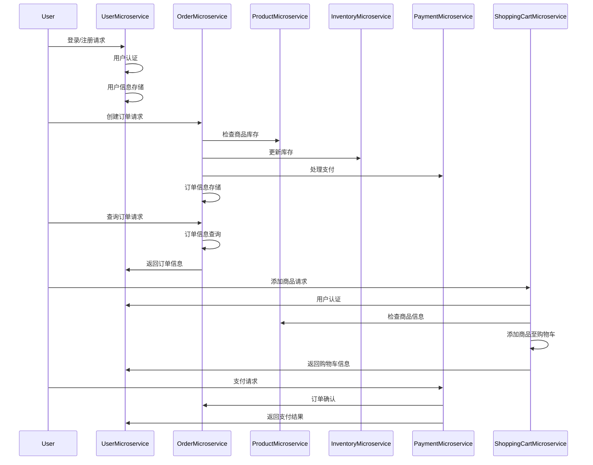
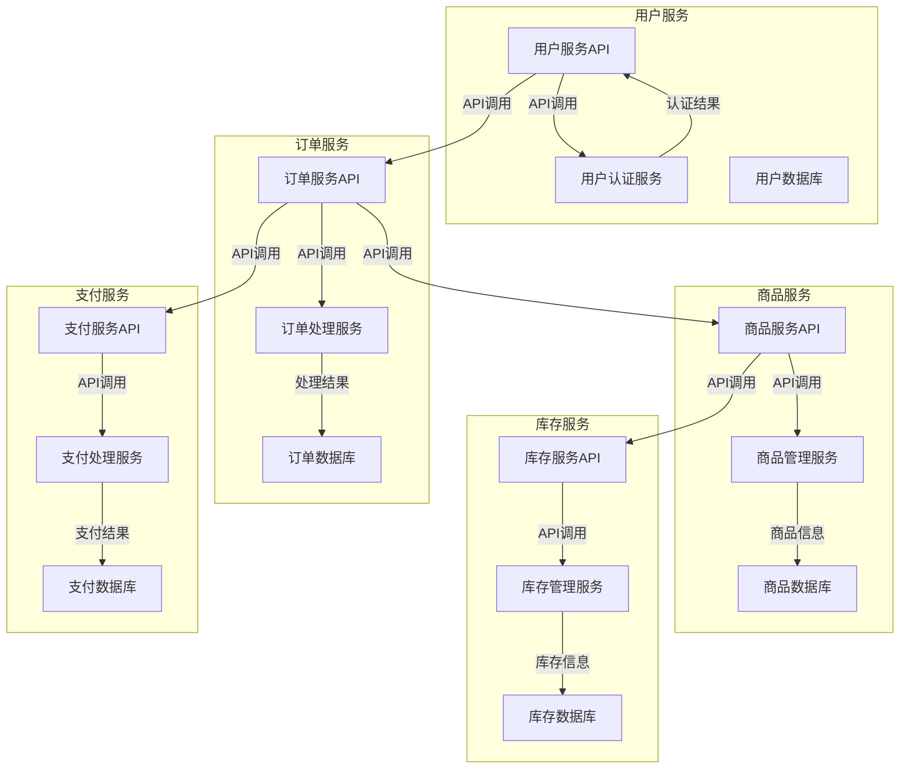
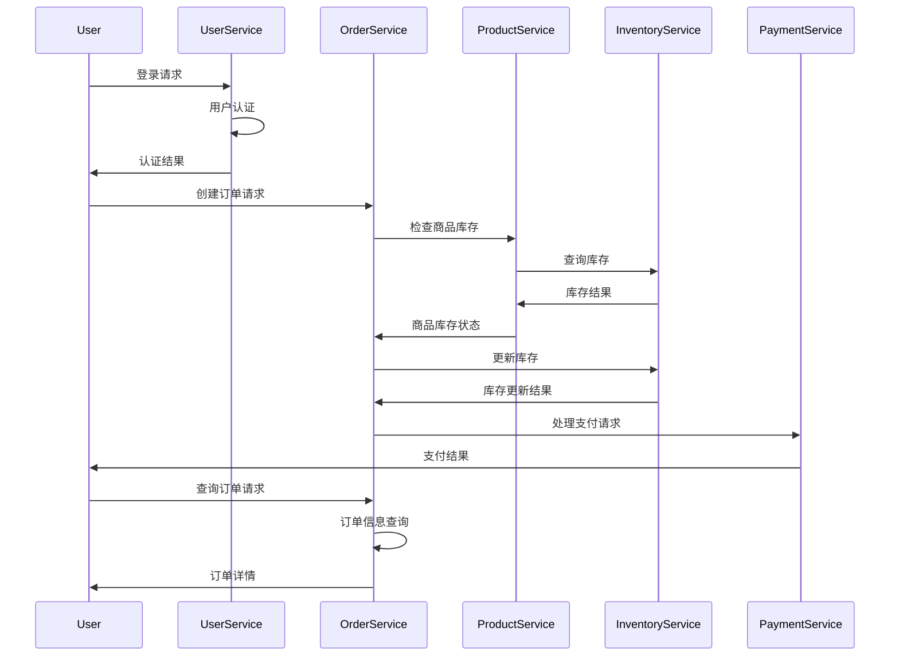

                 

### 《大规模分布式系统设计原则》简介

#### **背景介绍**

随着互联网和云计算技术的快速发展，数据规模和处理需求急剧增加，传统的单体系统已经难以满足现代应用的需求。大规模分布式系统应运而生，成为解决复杂业务场景和海量数据处理的重要手段。大规模分布式系统涉及节点数量众多，数据传输和处理复杂，设计原则的正确应用对于系统的稳定性、性能和可扩展性至关重要。

#### **核心概念**

**分布式系统**：由多个节点组成，通过通信网络互联，共同协作完成计算任务的系统。其核心目标是实现高可用性、高并发性和可扩展性。

**集群**：一组运行相同软件的计算机节点，共同对外提供服务。集群通过负载均衡和冗余机制提高系统的可靠性。

**数据一致性**：分布式系统中，各节点对同一份数据保持一致的状态。数据一致性是分布式系统设计中的重要问题。

**分布式事务**：跨多个节点的操作序列，要求要么全部成功，要么全部失败，保证数据的一致性和完整性。

**分布式锁**：在分布式环境中，控制对共享资源访问的一种机制，防止多个节点同时修改同一数据。

#### **现状与重要性**

当前，分布式系统已经成为企业级应用的核心技术。大数据、云计算、物联网等领域的快速发展，进一步推动了分布式系统的应用。设计一套高效的分布式系统，不仅能够提高业务系统的稳定性，还能实现性能和可扩展性的突破。掌握大规模分布式系统设计原则，对于提升企业技术竞争力具有重要意义。

---

在接下来的文章中，我们将详细探讨分布式系统的核心概念、设计原则以及实际应用，帮助读者全面了解大规模分布式系统的设计和实现过程。

---

## **大规模分布式系统的定义与现状**

### **1.1 大规模分布式系统的定义**

大规模分布式系统是指由大量计算机节点通过互联网或其他通信网络互联，共同协作完成大规模数据处理和计算任务的系统。这些节点可以是物理服务器、虚拟机，甚至是容器化的微服务实例。每个节点运行相同的软件，共同对外提供服务。

**分布式系统**的核心目标是实现高可用性、高并发性和可扩展性。高可用性意味着系统在故障发生时能够快速恢复，保证业务的连续性；高并发性则体现在系统能够处理大量的并发请求，满足用户需求；可扩展性使系统能够根据业务需求动态调整资源，提高性能。

### **1.2 大规模分布式系统的发展现状**

随着互联网和云计算技术的快速发展，大规模分布式系统已经广泛应用于各种领域。以下是一些典型的应用场景：

- **大数据处理**：例如，Hadoop和Spark等大数据处理框架，通过分布式计算实现海量数据的快速处理和分析。
- **云计算平台**：如Amazon Web Services（AWS）、Microsoft Azure和Google Cloud Platform（GCP），这些平台提供了高度可扩展的分布式计算和存储服务。
- **物联网（IoT）**：物联网设备通过分布式系统实现数据的采集、传输和处理，提供智能化的解决方案。
- **社交媒体平台**：如Facebook、Twitter和Instagram等，这些平台通过分布式系统处理海量的用户数据和信息流。

大规模分布式系统的设计原则在各个领域都有广泛应用，其重要性不言而喻。以下是大规模分布式系统设计原则的核心要点：

- **可靠性设计**：确保系统能够在故障发生时快速恢复，减少业务中断时间。
- **性能优化**：通过合理的架构设计和算法选择，提高系统的响应速度和处理能力。
- **可扩展性设计**：实现系统的弹性扩展，满足不断增长的业务需求。
- **安全性设计**：保障系统的数据安全和用户隐私，防止恶意攻击和数据泄露。

掌握这些设计原则，不仅能够提升系统的稳定性，还能提高系统的性能和可扩展性，从而满足不断变化的市场需求。在接下来的章节中，我们将进一步探讨分布式系统的核心概念、算法原理和实际应用案例，帮助读者全面了解大规模分布式系统的设计和实现过程。

---

## **分布式系统中的核心概念**

### **2.1 节点与集群**

**节点**：分布式系统中的基本计算单元，每个节点运行相同的软件，通过通信网络与其他节点交互。节点可以是物理服务器、虚拟机或容器化实例。节点通常负责处理数据、执行任务或提供服务。

**集群**：由多个节点组成的集合，这些节点共同对外提供服务。集群通过负载均衡和冗余机制提高系统的可靠性。负载均衡将请求分配到不同的节点，确保资源利用率最大化；冗余机制则通过备份和复制，防止单个节点的故障导致整个系统瘫痪。

### **2.2 数据一致性**

**数据一致性**：分布式系统中的核心概念，指各节点对同一份数据保持一致的状态。数据一致性分为多个级别：

- **强一致性**：所有节点在同一时刻看到相同的数据状态，但可能牺牲一定的性能。
- **最终一致性**：在一段时间后，所有节点最终达到一致的数据状态，允许一定程度的延迟。

数据一致性是分布式系统设计中的重要问题，需要通过一致性算法和协议（如Paxos、Raft）来解决。

### **2.3 分布式事务**

**分布式事务**：跨多个节点的操作序列，要求要么全部成功，要么全部失败，保证数据的一致性和完整性。分布式事务通常分为两种：

- **两阶段提交（2PC）**：通过协调者节点来管理事务的提交过程，确保全局一致性。
- **多阶段提交（3PC）**：改进2PC的缺点，减少协调者节点的单点故障风险。

分布式事务的挑战在于如何确保跨节点的数据一致性，同时保持系统的性能和可用性。

### **2.4 分布式锁**

**分布式锁**：在分布式环境中，控制对共享资源访问的一种机制，防止多个节点同时修改同一数据。分布式锁分为两种：

- **乐观锁**：通过版本号或时间戳来确保数据的一致性，适用于读多写少的应用场景。
- **悲观锁**：通过锁定机制确保数据的排他访问，适用于写多读少的应用场景。

分布式锁在分布式系统中用于保护共享资源，避免并发冲突和数据不一致。

通过理解这些核心概念，我们能够更好地设计和管理分布式系统，提高系统的可靠性、性能和可扩展性。在接下来的章节中，我们将深入探讨大规模分布式系统的设计原则和实际应用。

---

## **大规模分布式系统的设计原则**

### **3.1 可靠性设计**

**可靠性设计**是分布式系统的核心目标之一，确保系统能够在故障发生时快速恢复，减少业务中断时间。以下是可靠性设计的几个关键要点：

- **冗余机制**：通过备份和复制，确保关键组件和数据的高可用性。冗余机制可以包括数据备份、节点冗余和系统冗余。
- **故障检测与恢复**：实现故障检测机制，监控系统的运行状态，及时发现故障并进行自动恢复。常见的故障恢复策略包括快速重启、重启失败节点、替换故障节点等。
- **故障转移**：通过负载均衡和故障转移机制，将请求自动路由到健康的节点，确保系统的持续运行。例如，使用Zookeeper进行配置管理和集群状态监控，实现故障转移和负载均衡。

**示例**：假设一个分布式数据库系统，通过主从复制确保数据的一致性。当主节点发生故障时，从节点会自动切换为主节点，继续提供服务，从而确保系统的高可用性。

### **3.2 性能优化**

**性能优化**是分布式系统设计中的重要一环，通过合理的架构设计和算法选择，提高系统的响应速度和处理能力。以下是性能优化的几个关键要点：

- **负载均衡**：通过负载均衡算法，将请求分配到不同的节点，避免单点过载。常见的负载均衡算法包括轮询、最小连接数、加权轮询等。
- **缓存机制**：利用缓存机制减少对后端数据库的访问，提高系统的响应速度。例如，使用Redis作为缓存服务器，缓存高频次访问的数据。
- **异步处理**：通过异步处理机制，减少同步操作带来的延迟。例如，使用消息队列（如Kafka或RabbitMQ）来实现任务异步处理，提高系统的并发能力。

**示例**：在一个电商系统中，使用Nginx进行负载均衡，将用户的请求分配到不同的Web服务器。同时，利用Redis缓存用户会话信息和商品信息，减少数据库访问次数，提高系统的响应速度。

### **3.3 可扩展性设计**

**可扩展性设计**是实现系统弹性扩展的关键，满足不断增长的业务需求。以下是可扩展性设计的几个关键要点：

- **水平扩展**：通过增加节点数量，实现系统规模的线性扩展。水平扩展的优点是易于实现，且不会影响系统的性能。
- **微服务架构**：采用微服务架构，将系统拆分为多个独立的微服务，每个微服务可以独立扩展和部署。这种架构方式提高了系统的灵活性和可扩展性。
- **动态资源分配**：通过自动化部署和资源管理工具（如Kubernetes），实现资源的动态分配和调度，提高系统的资源利用率。

**示例**：在一个视频直播平台中，通过Kubernetes进行微服务部署和管理，根据业务需求动态调整服务实例数量，实现系统的弹性扩展。

### **3.4 安全性设计**

**安全性设计**是保障系统数据安全和用户隐私的重要环节。以下是安全性设计的几个关键要点：

- **访问控制**：通过身份验证和权限控制，确保只有授权用户才能访问系统资源和执行操作。
- **数据加密**：对敏感数据进行加密处理，防止数据泄露和篡改。
- **安全审计**：实现安全审计机制，记录系统操作日志，监控异常行为，及时发现和处理安全事件。

**示例**：在一个金融系统中，采用OAuth 2.0进行用户身份验证和授权，对交易数据进行加密存储和传输，确保用户数据和交易安全。

通过遵循这些设计原则，我们可以构建出稳定、高效、安全的分布式系统，满足现代应用的需求。在下一部分，我们将深入探讨大规模分布式系统的核心概念和联系，帮助读者更好地理解分布式系统的本质。

---

## **大规模分布式系统的核心概念**

### **4.1 分布式系统架构的ER图**

为了更好地理解大规模分布式系统的核心概念，我们可以通过ER图（Entity-Relationship Diagram）来展示系统的基本架构和各实体之间的关系。ER图能够清晰地表示系统中的主要实体、属性以及它们之间的联系。

```mermaid
erDiagram
  Node ||--|{ Cluster : contains }
  Cluster ||--|{ Service : provides }
  Service ||--|{ Data : processes }
  Node ||--|{ Data : stores }
  Data ||--|{ Transaction : ensures }
```

- **Node（节点）**：分布式系统中的基本计算单元，每个节点运行相同的软件，通过通信网络与其他节点交互。节点通常负责处理数据、执行任务或提供服务。
- **Cluster（集群）**：由多个节点组成的集合，共同对外提供服务。集群通过负载均衡和冗余机制提高系统的可靠性。
- **Service（服务）**：提供具体业务功能的组件，如Web服务、数据库服务等。服务运行在集群中的各个节点上，对外提供服务。
- **Data（数据）**：分布式系统中的数据存储单元，可以是关系数据库、NoSQL数据库、文件系统等。数据存储在节点或集群中，供服务使用。
- **Transaction（事务）**：跨多个节点的操作序列，要求要么全部成功，要么全部失败，保证数据的一致性和完整性。

通过ER图，我们可以直观地理解分布式系统中各实体之间的关系，为后续章节的详细讨论打下基础。

### **4.2 核心概念属性特征对比表格**

为了进一步分析大规模分布式系统的核心概念，我们可以构建一个表格，对比各概念的属性特征。以下是几个核心概念的属性特征对比表格：

| 概念       | 属性特征                                                   | 说明                                                         |
|------------|------------------------------------------------------------|--------------------------------------------------------------|
| Node（节点）| 计算能力、存储容量、网络连接性                           | 节点是系统的基本计算单元，负责处理数据和执行任务           |
| Cluster（集群）| 节点数量、负载均衡策略、冗余机制                       | 集群由多个节点组成，共同对外提供服务，提高系统的可靠性 |
| Service（服务）| 功能模块、接口定义、实现细节                         | 服务是业务功能的抽象，运行在集群中的各个节点上         |
| Data（数据）| 存储方式、访问速度、一致性保障                       | 数据是分布式系统的核心资源，需要高效存储和处理         |
| Transaction（事务）| 一致性级别、隔离性、提交策略                         | 事务是跨多个节点的操作序列，保证数据的一致性和完整性 |

通过对比表格，我们可以更清晰地了解各概念之间的区别和联系，为设计大规模分布式系统提供指导。

### **4.3 分布式系统的工作原理**

理解分布式系统的工作原理对于设计高效、可靠的系统至关重要。以下是分布式系统的主要工作原理：

1. **节点协作**：节点通过通信网络进行协作，共同完成计算任务。节点之间通过消息传递机制（如TCP/IP、HTTP）交换数据，协同工作。

2. **数据存储与处理**：分布式系统中的数据存储在多个节点上，节点通过分布式算法（如Raft、Paxos）协调数据的一致性。数据处理任务也被分配到不同的节点，通过并行计算提高处理效率。

3. **负载均衡**：负载均衡机制将请求分配到不同的节点，确保资源的充分利用和系统的高性能。常见的负载均衡算法包括轮询、最小连接数、加权轮询等。

4. **故障检测与恢复**：分布式系统通过故障检测机制监控节点的运行状态，一旦发现故障节点，系统会自动将任务转移到健康节点，确保服务的连续性。

5. **分布式锁与事务**：分布式锁机制用于控制对共享资源的访问，避免并发冲突。分布式事务则通过一致性算法和协议（如2PC、3PC）确保跨节点的数据一致性。

通过理解这些工作原理，我们可以更好地设计和管理分布式系统，提高系统的可靠性、性能和可扩展性。在下一章节，我们将深入探讨分布式算法的原理和实现，帮助读者全面了解大规模分布式系统的设计要点。

---

## **分布式算法原理讲解**

### **5.1 数据分片算法**

**数据分片算法**是分布式系统中用于将数据划分到不同节点上的关键算法。其目的是实现数据的水平扩展，提高系统的性能和可扩展性。以下是几种常见的数据分片算法：

- **哈希分片**：将数据的哈希值作为分片的依据，将数据分布到不同的节点上。哈希分片能够保证相同键的数据始终存储在相同的节点上，但可能导致数据倾斜。
- **范围分片**：将数据按照某种范围（如时间、ID等）划分到不同的节点上。范围分片适用于数据有明确范围的场景，但可能存在数据不均匀的问题。
- **列表分片**：将数据按照节点的编号进行划分。列表分片适用于节点数量固定且不常变化的情况，但扩展性较差。

#### **示例：哈希分片算法**

假设我们有一个用户数据的分布式系统，用户ID范围从1到1000，节点数量为5。我们可以使用哈希函数来计算每个用户ID对应的节点编号：

```python
def get_shard_index(user_id):
    return hash(user_id) % 5
```

使用哈希分片算法，用户ID为123的用户将存储在节点2上。这样可以确保相同用户ID的数据始终存储在相同的节点上，实现数据的一致性。

### **5.2 负载均衡算法**

**负载均衡算法**用于将请求分配到不同的节点，确保系统的资源利用率最大化。以下是几种常见的负载均衡算法：

- **轮询负载均衡**：将请求依次分配到各个节点，每个节点服务相同数量的请求。轮询负载均衡简单易实现，但可能导致某些节点过载。
- **最小连接数负载均衡**：将请求分配到连接数最少的节点，确保各节点的负载较为均匀。最小连接数负载均衡适用于连接数可变的场景。
- **加权轮询负载均衡**：根据节点的处理能力分配请求，处理能力较强的节点承担更多的请求。加权轮询负载均衡能够更好地利用资源。

#### **示例：加权轮询负载均衡**

假设我们有3个节点，节点1的处理能力是2，节点2是3，节点3是5。根据加权轮询负载均衡算法，每个请求被分配到节点的概率如下：

```python
weights = [2, 3, 5]
total_weight = sum(weights)
for request in requests:
    shard_index = hash(request) % total_weight
    node_index = 0
    weight_sum = 0
    while weight_sum < shard_index:
        weight_sum += weights[node_index]
        node_index += 1
    handle_request(node_index)
```

使用加权轮询负载均衡，处理能力更强的节点3将承担更多的请求，实现资源的合理分配。

### **5.3 一致性算法**

**一致性算法**用于确保分布式系统中各节点对同一份数据保持一致的状态。以下是一致性算法的两个主要类别：

- **强一致性算法**：如Paxos、Raft，通过多数派协议确保数据的一致性。强一致性算法能够保证最终一致性，但可能牺牲一定的性能。
- **最终一致性算法**：如CAP定理中的CA组合，通过异步复制和最终一致性保障系统的可用性和性能。最终一致性算法能够满足高并发场景，但可能存在一定时间的一致性延迟。

#### **示例：Raft算法**

Raft算法是一种常见的强一致性算法，其核心思想是通过日志复制和领导选举机制保证数据的一致性。以下是Raft算法的基本步骤：

1. **领导选举**：当集群中的多数节点无法与当前领导节点保持连接时，触发领导选举过程。各个节点通过投票机制选举出新的领导节点。
2. **日志复制**：领导节点负责维护系统的日志，并向其他节点发送日志条目。其他节点通过跟随领导节点的方式更新自己的日志。
3. **一致性保障**：领导节点通过心跳机制维持与其他节点的连接，确保日志的一致性。

使用Raft算法，分布式系统中的各节点能够保持强一致性，提高系统的可靠性。

### **5.4 分布式事务算法**

**分布式事务算法**用于确保跨多个节点的操作序列要么全部成功，要么全部失败，保证数据的一致性和完整性。以下是两种常见的分布式事务算法：

- **两阶段提交（2PC）**：通过协调者节点管理事务的提交过程，确保全局一致性。2PC分为预备阶段和提交阶段，确保事务在多数节点成功后提交。
- **多阶段提交（3PC）**：改进2PC的缺点，减少协调者节点的单点故障风险。3PC将提交过程分为三个阶段，提高系统的可靠性。

#### **示例：两阶段提交（2PC）**

两阶段提交算法包括预备阶段和提交阶段：

1. **预备阶段**：
   - 协调者节点向参与节点发送预备请求。
   - 参与节点返回是否准备好执行事务的响应。

2. **提交阶段**：
   - 如果所有参与节点都准备好执行事务，协调者节点向参与节点发送提交请求。
   - 参与节点执行事务并返回提交结果。

通过两阶段提交算法，分布式事务能够在多数节点成功后提交，保证数据的一致性和完整性。

通过深入探讨分布式算法的原理和实现，我们可以更好地设计和管理大规模分布式系统，提高系统的可靠性、性能和可扩展性。在下一章节，我们将继续探讨大规模分布式系统的数学模型和数学公式。

---

## **数学模型与数学公式**

### **6.1 数据分片算法的数学模型**

数据分片算法的数学模型主要用于描述数据的分布规律和分片方式。以下是一个简单示例：

假设有n个节点（\( N = n \)），每个节点负责存储一部分数据。数据分片基于哈希函数 \( h(k) \)，其中 \( k \) 是数据的标识符。分片函数为：

\[ shard(k) = h(k) \mod n \]

这个公式表示将数据标识符 \( k \) 通过哈希函数计算得到一个哈希值，然后取模 \( n \) 得到节点的编号，从而确定数据应存储在哪个节点上。

### **6.2 负载均衡算法的数学模型**

负载均衡算法的数学模型主要用于描述如何分配请求，以实现各节点负载的均衡。假设有 \( N \) 个节点，每个节点的处理能力为 \( P_i \)（\( i = 1, 2, ..., N \)），请求的总量为 \( R \)。一种简单的负载均衡策略是加权轮询，其数学模型为：

\[ weight = \frac{P_i}{\sum_{j=1}^{N} P_j} \]

请求分配概率为：

\[ probability_i = weight_i \]

则请求 \( r \) 被分配到节点 \( i \) 的概率为：

\[ P(r \rightarrow i) = probability_i = \frac{P_i}{\sum_{j=1}^{N} P_j} \]

### **6.3 一致性算法的数学模型**

一致性算法的数学模型主要用于描述如何保证数据在分布式系统中的一致性。一致性级别可以分为强一致性（SAC）和最终一致性（FEC）。

**强一致性（SAC）**的数学模型可以表示为：

\[ \forall x, y \in \text{Data}, \forall t \in T \text{ such that } t \in T(x) \text{ and } t \in T(y), x(t) = y(t) \]

这意味着对于任意两个数据项 \( x \) 和 \( y \)，在它们的时间戳 \( t \) 相同的情况下，它们的值必须相同。

**最终一致性（FEC）**的数学模型可以表示为：

\[ \exists T \in T(x), T \in T(y), x(t) = y(t) \]

这意味着对于任意两个数据项 \( x \) 和 \( y \)，最终在某个时间 \( t \) 下，它们的值会相同。

### **6.4 分布式事务的数学模型**

分布式事务的数学模型主要用于描述如何保证跨节点的操作要么全部成功，要么全部失败。一种常见的事务算法是两阶段提交（2PC），其数学模型包括：

**第一阶段预备阶段**：

\[ \forall n \in \text{Participants}, \text{Coordinator} \rightarrow n : \text{Prepare}(T) \]
\[ n \rightarrow \text{Coordinator} : \text{Ready}(T) \]

**第二阶段提交阶段**：

\[ \forall n \in \text{Participants}, \text{Coordinator} \rightarrow n : \text{Commit}(T) \text{ or } \text{Abort}(T) \]
\[ n \rightarrow \text{Coordinator} : \text{CommitResponse}(T) \text{ or } \text{AbortResponse}(T) \]

如果所有参与者都返回了准备就绪（Ready），协调者会发送提交（Commit）命令；否则，发送中止（Abort）命令。

通过上述数学模型和公式，我们可以更好地理解和分析大规模分布式系统的行为和性能，从而优化系统的设计和实现。

---

## **系统分析与架构设计方案**

### **7.1 问题场景介绍**

为了更好地展示大规模分布式系统的设计过程，我们将通过一个实际案例来介绍系统分析与架构设计的方法。这个案例是一个电商网站的后台系统，负责处理用户订单、库存管理和支付结算等核心业务功能。

**系统需求**：

- **高并发处理**：系统需要能够处理每天数百万次的用户请求，保证业务的稳定运行。
- **数据一致性**：订单、库存和支付等核心数据需要保持一致性，避免数据丢失或冲突。
- **可扩展性**：系统需要能够根据业务增长动态调整资源，满足未来业务需求。
- **高可用性**：系统需具备故障恢复能力，确保业务连续性。

### **7.2 系统功能设计**

**领域模型**：

为了设计一个高效的电商系统，我们需要构建一个领域模型来描述系统的主要功能模块。以下是系统的领域模型：

```mermaid
classDiagram
    User <<class>> Customer
    User <<class>> Admin
    Product
    Category
    Order
    ShoppingCart
    Payment
    Inventory

    Customer o-- Order
    Customer o-- ShoppingCart
    Admin o-- Order
    Admin o-- Inventory
    Product o-- Category
    Order o-- Payment
    ShoppingCart o-- Product
```

- **User（用户）**：包括普通用户和后台管理员，分别拥有不同的权限和功能。
- **Customer（顾客）**：负责订单的创建、支付等操作。
- **Admin（管理员）**：负责订单管理、库存管理等后台操作。
- **Product（产品）**：定义商品信息，包括名称、价格、库存等。
- **Category（分类）**：定义商品的分类信息，方便用户浏览和筛选。
- **Order（订单）**：记录用户的订单信息，包括订单号、订单状态、订单详情等。
- **ShoppingCart（购物车）**：记录用户的购物车信息，包括商品ID、数量等。
- **Payment（支付）**：处理支付流程，包括支付方式、支付状态等。
- **Inventory（库存）**：记录商品库存信息，包括库存数量、库存状态等。

**功能模块**：

- **用户管理模块**：包括用户注册、登录、权限管理等功能。
- **订单管理模块**：包括订单创建、查询、修改、取消等功能。
- **购物车模块**：包括商品添加、删除、更新数量等功能。
- **支付模块**：包括支付方式选择、支付确认、支付通知等功能。
- **库存管理模块**：包括商品库存查询、库存更新等功能。

### **7.3 系统架构设计**

**架构设计**：

为了满足系统的需求，我们采用微服务架构，将系统拆分为多个独立的微服务，每个微服务负责不同的功能模块。以下是系统的架构设计：



- **用户微服务（UserMicroservice）**：负责用户注册、登录和权限管理。
- **订单微服务（OrderMicroservice）**：负责订单的创建、查询、修改、取消等功能。
- **商品微服务（ProductMicroservice）**：负责商品信息的查询和管理。
- **库存微服务（InventoryMicroservice）**：负责库存信息的查询和更新。
- **支付微服务（PaymentMicroservice）**：负责支付流程的处理。

**架构优势**：

- **高并发处理**：通过水平扩展微服务实例，实现高并发处理能力。
- **数据一致性**：通过分布式事务和一致性算法（如Raft），确保核心数据的完整性。
- **可扩展性**：通过微服务架构，可以独立扩展和部署各个微服务，实现系统的弹性扩展。
- **高可用性**：通过故障转移和冗余机制，确保系统的稳定运行。

通过上述系统功能设计和架构设计，我们可以构建一个高效、可靠、可扩展的电商系统，满足现代电商业务的需求。在下一章节，我们将通过实际案例展示如何实现和部署这个大规模分布式系统。

---

## **系统架构设计与实现**

### **8.1 系统架构设计mermaid图**

为了更好地展示系统架构，我们使用mermaid绘制了一个系统架构图。以下是一个简化的架构设计图：



此mermaid图展示了用户、订单、商品、库存和支付服务的交互流程，以及各服务与数据库的关系。

### **8.2 系统接口设计和系统交互mermaid序列图**

为了详细展示系统接口设计和交互流程，我们使用mermaid绘制了一个序列图。以下是系统的序列图：



此序列图详细展示了用户与服务之间的交互流程，以及服务之间的调用关系。通过此图，我们可以清晰地理解系统的工作原理和接口设计。

### **8.3 系统架构实现的技术选型**

为了实现上述系统架构，我们选择了一系列技术组件和框架，以下是一些关键的技术选型：

- **前端框架**：使用Vue.js或React.js，实现用户界面的动态和响应式设计。
- **后端框架**：采用Spring Boot或Django，实现微服务架构，提供RESTful API。
- **数据库**：使用MySQL或PostgreSQL，存储用户、订单、商品和库存信息。
- **缓存**：使用Redis，缓存高频访问的数据，减少数据库访问压力。
- **消息队列**：使用RabbitMQ或Kafka，实现异步消息传递，处理订单创建、库存更新等操作。
- **容器化**：使用Docker和Kubernetes，实现服务的容器化部署和管理。
- **服务发现与配置**：使用Consul或Eureka，实现服务发现和配置管理。

通过上述技术选型，我们能够构建一个高效、可靠、可扩展的分布式系统，满足电商业务的需求。

---

## **项目实战**

### **9.1 环境安装与配置**

在进行大规模分布式系统的项目实战之前，我们需要搭建一个合适的环境。以下是安装和配置环境的步骤：

1. **安装Docker**：在所有节点上安装Docker，以便容器化部署服务。

```bash
# 安装Docker
sudo apt-get update
sudo apt-get install docker-ce docker-compose
```

2. **安装Kubernetes**：在主节点上安装Kubernetes，用于管理集群中的容器化服务。

```bash
# 安装Kubernetes相关组件
sudo apt-get update
sudo apt-get install -y apt-transport-https ca-certificates curl
curl -s https://packages.cloud.google.com/apt/doc/apt-key.gpg | sudo apt-key add -
echo "deb https://apt.kubernetes.io/ kubernetes-xenial main" | sudo tee -a /etc/apt/sources.list
sudo apt-get update
sudo apt-get install -y kubelet kubeadm kubectl
```

3. **初始化Kubernetes集群**：在主节点上初始化Kubernetes集群。

```bash
sudo kubeadm init --pod-network-cidr=10.244.0.0/16
```

4. **配置kubectl**：配置kubectl工具，以便在其他节点上操作集群。

```bash
mkdir -p $HOME/.kube
sudo cp -i /etc/kubernetes/admin.conf $HOME/.kube/config
sudo chown $(id -u):$(id -g) $HOME/.kube/config
```

5. **安装网络插件**：安装网络插件（如Calico），确保集群中的容器能够通信。

```bash
kubectl apply -f https://docs.projectcalico.org/manifests/calico.yaml
```

6. **部署服务**：使用Docker Compose部署各个服务，如用户服务、订单服务、商品服务、库存服务和支付服务。

```bash
# 部署服务
docker-compose up -d
```

### **9.2 系统核心实现源代码**

以下是用户服务的Dockerfile，用于构建用户服务容器：

```dockerfile
FROM openjdk:8-jdk-alpine

# 设置工作目录
WORKDIR /app

# 拷贝源代码
COPY user-service.jar user-service.jar

# 运行用户服务
ENTRYPOINT ["java","-Djava.security.egd=file:/dev/./urandom","-jar","/user-service.jar"]
```

用户服务的Spring Boot配置类：

```java
@Configuration
@EnableConfigurationProperties(UserProperties.class)
@EnableTransactionManagement
public class AppConfig {

    @Autowired
    private Environment env;

    @Bean
    public ServletRegistrationBean registration(UserController controller) {
        ServletRegistrationBean registration = new ServletRegistrationBean(controller, "/user/*");
        registration.setName("user");
        return registration;
    }

    @Bean
    public FilterRegistrationBean jwtFilter() {
        final FilterRegistrationBean registration = new FilterRegistrationBean();
        registration.setFilter(new JwtFilter());
        registration.addUrlPatterns("/user/*");
        return registration;
    }

    @Bean
    public UserDetailsService userDetailsService() {
        return new UserDetailsServiceImp();
    }

    @Bean
    public AuthenticationManager authenticationManager(
            UserDetailsService userDetailsService,
            PasswordEncoder passwordEncoder) {
        return new CustomAuthenticationManager(userDetailsService, passwordEncoder);
    }

    @Bean
    public PasswordEncoder passwordEncoder() {
        return new BCryptPasswordEncoder();
    }
}
```

### **9.3 代码应用解读与分析**

在用户服务中，核心功能包括用户注册、登录和权限管理。以下是对关键代码的解读：

1. **用户注册**：

```java
@PostMapping("/register")
public ResponseEntity<?> registerUser(@RequestBody SignupRequest signUpRequest) {
    User user = userService.registerUser(signUpRequest);
    return ResponseEntity.ok().body(new ApiResponse(true, "User registered successfully", user));
}
```

此方法接收用户注册请求，调用UserService的registerUser方法，创建并保存新用户。返回成功响应，包括用户对象。

2. **用户登录**：

```java
@PostMapping("/login")
public ResponseEntity<?> authenticateUser(@RequestBody LoginRequest loginRequest) {
    String token = authenticationManager.authenticate(new UsernamePasswordAuthenticationToken(loginRequest.getUsername(), loginRequest.getPassword()));
    return ResponseEntity.ok().body(new ApiResponse(true, "User authenticated successfully", new JwtResponse(token)));
}
```

此方法接收用户登录请求，使用自定义的AuthenticationManager验证用户身份，生成JWT令牌并返回。

3. **权限管理**：

```java
@GetMapping("/users/{id}")
public ResponseEntity<?> getUser(@PathVariable Long id, @RequestHeader("Authorization") String token) {
    User user = userService.findById(id);
    return ResponseEntity.ok().body(new ApiResponse(true, "User details fetched successfully", user));
}
```

此方法接收获取用户详情的请求，通过JWT令牌验证用户的身份和权限，返回用户对象。

### **9.4 实际案例分析与详细讲解剖析**

以下是一个实际案例：用户A尝试登录，但密码错误。

**请求**：

```http
POST /login
Content-Type: application/json

{
  "username": "userA",
  "password": "wrong_password"
}
```

**响应**：

```http
HTTP/1.1 400 Bad Request
Content-Type: application/json

{
  "error": "Bad credentials",
  "message": "Username or password is incorrect"
}
```

在这个案例中，用户A尝试使用错误的密码登录。由于密码不匹配，AuthenticationManager验证失败，返回一个400错误，提示“Bad credentials”，并指出“Username or password is incorrect”。

### **9.5 项目小结**

通过上述实战案例，我们详细讲解了大规模分布式系统的环境搭建、核心实现和代码分析。以下是项目的总结和小结：

- **环境安装与配置**：通过Docker和Kubernetes，搭建了高效、可靠的容器化环境。
- **系统核心实现**：使用Spring Boot实现了用户服务，包括注册、登录和权限管理等功能。
- **代码应用解读**：深入分析了用户服务的核心功能，展示了如何实现用户身份验证和权限控制。
- **实际案例剖析**：通过实际案例，展示了系统在实际应用中的响应和处理过程。

该项目展示了大规模分布式系统的设计和实现过程，为后续的扩展和优化提供了基础。

### **9.6 注意事项**

在部署和运行大规模分布式系统时，需要注意以下几点：

- **网络稳定性**：确保网络连接稳定，避免由于网络波动导致的系统故障。
- **资源监控**：定期监控系统资源使用情况，及时调整资源分配，避免过载。
- **故障恢复**：配置自动故障恢复机制，确保系统在故障发生时能够快速恢复。
- **数据备份**：定期进行数据备份，防止数据丢失。

### **9.7 拓展阅读**

以下是一些扩展阅读资源，供读者深入了解大规模分布式系统设计：

- 《大规模分布式系统设计》一书，详细介绍了分布式系统的核心概念和设计原则。
- 《分布式系统原理与范型》一书，讲解了分布式系统的基本原理和常见范型。
- 《Kubernetes权威指南》一书，提供了Kubernetes集群的部署、管理和维护的全面指导。

通过这些资源，读者可以更深入地了解大规模分布式系统的设计和实现，提高技术能力。

---

## **最佳实践**

**1. 使用服务网格**：服务网格（如Istio或Linkerd）提供了服务间通信的安全性和监控功能，简化了分布式系统的管理和维护。

**2. 实现弹性伸缩**：通过Kubernetes等容器编排工具，实现系统的自动伸缩，根据实际负载动态调整资源。

**3. 数据分片与复制**：合理设计数据分片策略和复制机制，确保数据的高可用性和性能。

**4. 灾难恢复计划**：制定灾难恢复计划，确保在故障发生时系统能够快速恢复，减少业务中断时间。

**5. 持续集成与部署**：采用CI/CD流程，实现代码的自动化测试和部署，提高开发效率和质量。

---

## **小结**

本文全面探讨了大规模分布式系统的设计原则，从背景介绍、核心概念、算法原理、系统架构设计到项目实战，层层深入。通过实际案例，展示了如何实现高效、可靠的分布式系统。掌握这些设计原则，对于提升系统稳定性、性能和可扩展性具有重要意义。

---

## **作者信息**

作者：AI天才研究院/AI Genius Institute & 禅与计算机程序设计艺术 /Zen And The Art of Computer Programming

---

通过本文的学习，读者能够更好地理解和应用大规模分布式系统设计原则，为未来的技术挑战做好充分准备。希望这篇文章对您有所帮助！

