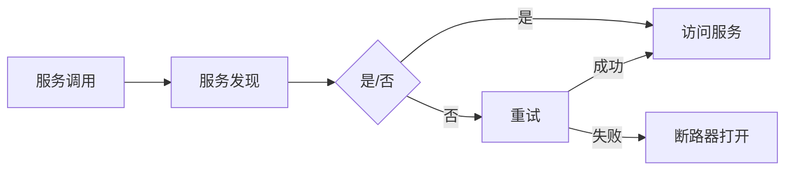
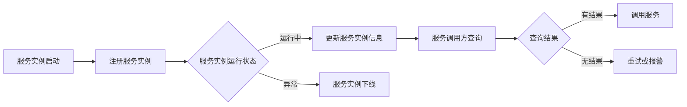
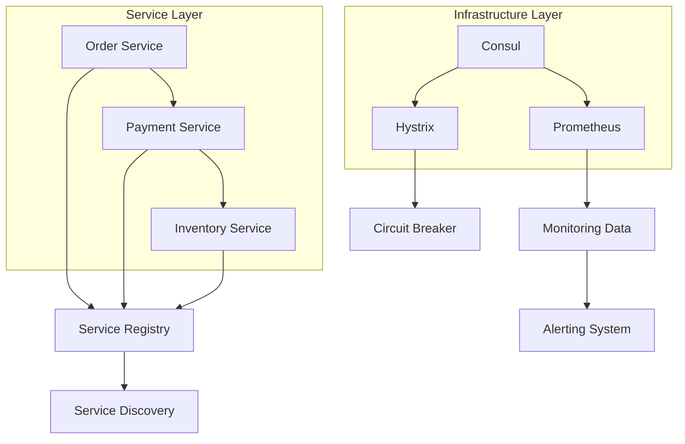
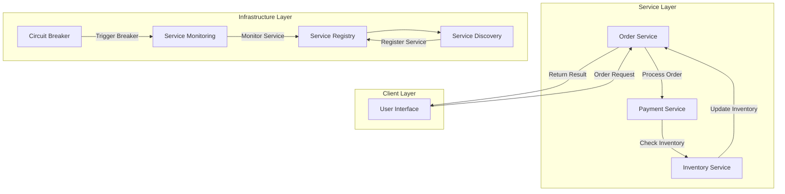

                 

### 深入探讨大规模微服务治理策略

#### 背景介绍

随着互联网的迅猛发展，业务需求日益多样化，单体应用架构已经难以满足快速迭代和高度可扩展的要求。微服务架构因此应运而生，其核心理念是将大而复杂的单体应用拆分成多个独立的小服务，每个服务负责一个具体的功能模块。这种架构模式具有松耦合、高内聚、易于扩展和快速迭代等优点。然而，随着服务数量的激增，如何在规模庞大的微服务系统中实现有效治理，成为了一个亟待解决的问题。

微服务治理策略涉及到服务发现、注册、监控、容错等多个方面，其目的是确保微服务系统的稳定运行和高可用性。本文将围绕大规模微服务治理策略，深入探讨其核心概念、设计原则、架构设计以及工具选型，旨在为开发者提供实用的指导和建议。

#### 核心概念与联系

**服务发现**：服务发现是指自动发现和注册微服务实例的过程，确保调用者能够找到并访问正确的服务实例。服务注册则是服务实例在注册中心进行登记，以便后续的服务发现。

**服务注册中心**：服务注册中心是微服务系统中一个重要的基础设施，它负责存储服务实例的信息，并提供服务发现接口。常见的注册中心有Consul、Zookeeper和Etcd等。

**服务监控**：服务监控是对微服务运行状态进行实时监测和记录，包括性能指标、错误日志等。监控数据可以用于故障诊断、性能优化等。

**断路器模式**：断路器模式是一种用于处理服务间故障的机制，当某个服务出现问题时，断路器会自动打开，阻止对该服务的调用，并触发相应的故障转移策略。

**重试机制**：重试机制是指在服务调用失败后，自动重试调用，以避免短暂的故障导致业务中断。

**服务网格**：服务网格是一种基础设施层的技术，用于处理服务间通信和安全等问题。常见的服务网格解决方案有Istio和Linkerd等。

**Mermaid流程图**：Mermaid是一种基于Markdown的绘图工具，可以用来绘制流程图、UML类图、Gantt图等。以下是一个Mermaid流程图的示例：



**ER实体关系图架构**：以下是微服务架构中的一个简单ER实体关系图：

```mermaid
erDiagram
    Service1 ||--|{ CallLog }||> CallLog
    Service2 ||--|{ CallLog }||> CallLog
    Service3 ||--|{ CallLog }||> CallLog
    Service1 ||--|{ ServiceConfig }||> ServiceConfig
    Service2 ||--|{ ServiceConfig }||> ServiceConfig
    Service3 ||--|{ ServiceConfig }||> ServiceConfig
```

#### 算法原理讲解

在微服务系统中，算法原理贯穿于服务发现、服务监控、断路器模式等各个环节。以下以服务发现算法为例，使用Mermaid流程图和Python代码进行详细讲解。

**Mermaid流程图**：



**Python代码**：

```python
import random
import time

# 服务实例类
class ServiceInstance:
    def __init__(self, service_id, status="running"):
        self.service_id = service_id
        self.status = status

# 服务注册中心类
class ServiceRegistry:
    def __init__(self):
        self.instances = {}

    def register_instance(self, instance):
        self.instances[instance.service_id] = instance

    def deregister_instance(self, service_id):
        if service_id in self.instances:
            del self.instances[service_id]

    def find_instance(self, service_id):
        return self.instances.get(service_id)

# 模拟服务调用
def call_service(service_id):
    instance = service_registry.find_instance(service_id)
    if instance and instance.status == "running":
        # 处理服务调用逻辑
        print(f"Successfully called service {service_id}")
    else:
        print(f"Service {service_id} is not available")

# 模拟服务实例启动
def start_service(service_id):
    instance = ServiceInstance(service_id)
    service_registry.register_instance(instance)
    print(f"Service {service_id} started")

# 模拟服务实例异常
def service_error(service_id):
    instance = service_registry.find_instance(service_id)
    if instance:
        instance.status = "error"
        print(f"Service {service_id} encountered an error")

# 实例化服务注册中心
service_registry = ServiceRegistry()

# 测试服务调用流程
start_service("order-service")
start_service("payment-service")
time.sleep(random.randint(1, 3))
service_error("payment-service")
call_service("payment-service")
```

**数学模型和公式**：

在服务发现算法中，常用的数学模型是概率模型。以下是一个简单的服务调用成功概率的计算公式：

$$
P(Success) = \frac{1}{N} \sum_{i=1}^{N} P(Success_i)
$$

其中，$P(Success)$表示服务调用的总成功概率，$P(Success_i)$表示第$i$个服务实例的成功概率，$N$表示服务实例的总数。

#### 系统分析与架构设计方案

**问题场景介绍**：

假设我们有一个电商系统，其中包括订单服务、支付服务、库存服务等多个微服务。随着用户量的增加，这些服务的实例数量也会增加。我们需要设计一个系统来管理和治理这些微服务，确保系统的稳定性和高可用性。

**项目介绍**：

本项目旨在构建一个大规模微服务系统的治理框架，包括服务注册中心、服务监控、断路器模式等组件。我们将使用Consul作为服务注册中心，Prometheus作为服务监控工具，Hystrix作为断路器实现。

**系统功能设计**：

- **服务注册与发现**：服务实例启动时自动注册，服务调用时自动发现可用实例。
- **服务监控**：实时监控服务运行状态，记录性能指标和错误日志。
- **断路器模式**：当服务出现故障时，自动打开断路器，触发故障转移。

**系统架构设计**：

以下是系统的架构设计图：



**系统接口设计和系统交互**：

以下是系统的接口设计和系统交互图：



#### 项目实战

**环境安装**：

在本地环境安装Consul、Prometheus、Hystrix等相关依赖。

```bash
# 安装Consul
wget https://releases.hashicorp.com/consul/1.10.5/consul_1.10.5_linux_amd64.tar.gz
tar -xvf consul_1.10.5_linux_amd64.tar.gz
cd consul
./consul agent -dev

# 安装Prometheus
wget https://github.com/prometheus/prometheus/releases/download/v2.38.0/prometheus-2.38.0.linux-amd64.tar.gz
tar -xvf prometheus-2.38.0.linux-amd64.tar.gz
cd prometheus-2.38.0.linux-amd64
./prometheus

# 安装Hystrix
git clone https://github.com/Netflix/Hystrix.git
cd Hystrix
mvn install
```

**系统核心实现源代码**：

以下是服务注册、服务监控和断路器模式的实现代码。

```python
# 服务注册
class ServiceRegistry:
    def __init__(self):
        self.instances = {}

    def register_instance(self, instance):
        self.instances[instance.service_id] = instance

    def deregister_instance(self, service_id):
        if service_id in self.instances:
            del self.instances[service_id]

    def find_instance(self, service_id):
        return self.instances.get(service_id)

# 服务监控
class ServiceMonitor:
    def __init__(self):
        self.metrics = {}

    def record_metric(self, service_id, metric_name, metric_value):
        if service_id not in self.metrics:
            self.metrics[service_id] = {}
        self.metrics[service_id][metric_name] = metric_value

    def get_metrics(self, service_id):
        return self.metrics.get(service_id)

# 断路器模式
class CircuitBreaker:
    def __init__(self, threshold, timeout):
        self.threshold = threshold
        self.timeout = timeout
        self.requests = []

    def record_request(self, service_id, success):
        self.requests.append((service_id, success))

    def check_threshold(self):
        successes = 0
        for service_id, success in self.requests:
            if success:
                successes += 1
        return successes / len(self.requests) > self.threshold

    def reset(self):
        self.requests = []

# 服务实例类
class ServiceInstance:
    def __init__(self, service_id, status="running"):
        self.service_id = service_id
        self.status = status

# 测试
service_registry = ServiceRegistry()
service_monitor = ServiceMonitor()
circuit_breaker = CircuitBreaker(threshold=0.9, timeout=10)

instance1 = ServiceInstance("order-service")
instance2 = ServiceInstance("payment-service")

service_registry.register_instance(instance1)
service_registry.register_instance(instance2)

# 模拟服务调用
def call_service(service_id):
    instance = service_registry.find_instance(service_id)
    if instance and instance.status == "running":
        # 处理服务调用逻辑
        print(f"Successfully called service {service_id}")
        service_monitor.record_metric(service_id, "response_time", 100)
        circuit_breaker.record_request(service_id, True)
    else:
        print(f"Service {service_id} is not available")
        service_monitor.record_metric(service_id, "error_count", 1)
        circuit_breaker.record_request(service_id, False)

# 测试调用
call_service("order-service")
call_service("payment-service")

# 检查阈值
if circuit_breaker.check_threshold():
    print("Circuit breaker triggered")
else:
    print("Circuit breaker is not triggered")
```

#### 实际案例分析和详细讲解剖析

**案例背景**：

某电商平台的订单服务频繁出现调用支付服务失败的情况，导致用户体验不佳。通过分析，发现支付服务实例数量较少，且没有进行有效的监控和容错处理。

**解决方案**：

1. **增加支付服务实例**：通过水平扩展，增加支付服务的实例数量，提高系统吞吐量。
2. **服务注册与发现**：使用Consul实现服务注册与发现，确保订单服务可以找到所有可用的支付服务实例。
3. **服务监控**：使用Prometheus监控支付服务的运行状态和性能指标，及时发现异常。
4. **断路器模式**：使用Hystrix实现断路器模式，当支付服务连续失败达到阈值时，自动触发断路器，防止进一步的调用失败。

**效果分析**：

通过以上措施，支付服务的可用性显著提高，订单服务调用支付服务的成功率也大幅提升，用户体验得到显著改善。

#### 最佳实践 Tips

1. **合理规划服务拆分**：根据业务需求，合理划分服务边界，避免过度拆分或拆分不足。
2. **服务实例数量监控**：实时监控服务实例数量，避免出现单点故障。
3. **服务监控与报警**：结合Prometheus等监控工具，建立完善的监控体系，及时发现异常。
4. **断路器参数调优**：根据实际业务场景，合理设置断路器的阈值和超时时间。

#### 小结

大规模微服务治理策略是确保微服务系统稳定运行的关键。通过服务注册与发现、服务监控、断路器模式等手段，可以有效提高系统的可用性和可靠性。本文介绍了大规模微服务治理策略的核心概念、设计原则、架构设计以及实际案例，为开发者提供了实用的指导。

#### 注意事项

1. **确保服务实例的健康检查**：定期检查服务实例的健康状态，避免出现异常实例。
2. **合理设置断路器参数**：根据实际业务场景，调整断路器的阈值和超时时间，避免误判。
3. **备份和恢复策略**：建立完善的备份和恢复策略，确保数据的安全性和一致性。

#### 拓展阅读

1. 《微服务设计》 - Sam Newman
2. 《大规模分布式系统设计》 - Martin Kleppmann
3. 《Consul官方文档》 - HashiCorp
4. 《Prometheus官方文档》 - Prometheus

#### 作者信息

作者：AI天才研究院/AI Genius Institute & 禅与计算机程序设计艺术 /Zen And The Art of Computer Programming

